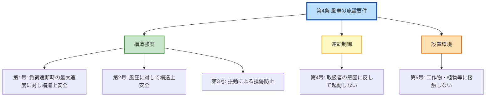

# 風技省令 第4条 — 風車の施設要件

!!! note "📊 試験対策メタ"
    **出題頻度**: 🔥🔥🔥（過去14年で R04上問8 が直接出題、関連で複数年に再出題）

    **重要度**: B（5号構成の各号が穴埋め対象、第5条と並んで風力省令の中核）

    **直近出題**: R04上 問8（穴埋め・5号の各号文言が空欄／2022年8月）

> 風車本体の **構造的・運転的安全要件** を5号で列挙する基本条文。第5条が「異常時の自動停止」を扱うのに対し、本条は「**通常運転時の構造健全性**」を扱う。5号セット（負荷遮断耐性／風圧耐性／振動／意図せぬ起動防止／接触防止）の **何号目か** を取り違えないことが穴埋めの核心。

| 項目 | 内容 |
|------|------|
| 条文 | 発電用風力設備に関する技術基準を定める省令 第4条 |
| 規定内容 | 風車本体の構造・運転に関する5つの施設要件 |
| 性格 | 性能規定（具体的設計基準は風技解釈・JIS C 1400-1等に委任） |
| 委任先 | 風技解釈／JIS C 1400-1（風車設計要件） |
| 関連 | 第5条（自動停止）／第3条（取扱者以外の立入防止） |

---

## 1. 全体像と要点

- **5号構成**: ①負荷遮断時の最大速度耐性 ②風圧耐性 ③振動防止 ④意図せぬ起動防止 ⑤接触防止
- 第5条との対比: 第4条 = **通常運転時の構造健全性** ／ 第5条 = **異常時の自動停止**
- 各号は **すべて並列の AND 条件**（5号すべて満たす必要あり）
- 「**構造上安全**」が第1号・第2号の共通キーワード（穴埋め頻出）
- 第4号「**通常想定される最大風速においても**」の **取扱者の意図に反して起動しない** が穴埋め定番

### ① 全体像 — 第4条の5号構造

<svg viewBox="0 0 800 380" xmlns="http://www.w3.org/2000/svg" width="100%" preserveAspectRatio="xMidYMid meet">
<defs>
<filter id="sh4fa" x="-20%" y="-20%" width="140%" height="140%"><feDropShadow dx="0" dy="2" stdDeviation="2" flood-opacity="0.15"/></filter>
<linearGradient id="gMain4fa" x1="0" y1="0" x2="0" y2="1"><stop offset="0%" stop-color="#bbdefb"/><stop offset="100%" stop-color="#90caf9"/></linearGradient>
<linearGradient id="gG4fa" x1="0" y1="0" x2="0" y2="1"><stop offset="0%" stop-color="#c8e6c9"/><stop offset="100%" stop-color="#a5d6a7"/></linearGradient>
<linearGradient id="gY4fa" x1="0" y1="0" x2="0" y2="1"><stop offset="0%" stop-color="#fff9c4"/><stop offset="100%" stop-color="#fff176"/></linearGradient>
<linearGradient id="gO4fa" x1="0" y1="0" x2="0" y2="1"><stop offset="0%" stop-color="#ffe0b2"/><stop offset="100%" stop-color="#ffcc80"/></linearGradient>
<linearGradient id="gP4fa" x1="0" y1="0" x2="0" y2="1"><stop offset="0%" stop-color="#e1bee7"/><stop offset="100%" stop-color="#ce93d8"/></linearGradient>
</defs>
<text x="400" y="26" text-anchor="middle" font-size="15" font-weight="700" fill="#212121">第4条 — 風車本体の5つの施設要件（AND条件）</text>
<text x="400" y="44" text-anchor="middle" font-size="11" fill="#666">5号すべてを満たす必要 / 1号でも欠けたら基準不適合</text>
<rect x="290" y="58" width="220" height="52" rx="12" fill="url(#gMain4fa)" stroke="#0d47a1" stroke-width="2.5" filter="url(#sh4fa)"/>
<text x="400" y="82" text-anchor="middle" font-size="14" font-weight="800" fill="#0d47a1">風技省令第4条</text>
<text x="400" y="100" text-anchor="middle" font-size="11" fill="#1565c0">風車の施設要件</text>
<line x1="160" y1="135" x2="160" y2="155" stroke="#0d47a1" stroke-width="1.5"/>
<line x1="280" y1="135" x2="280" y2="155" stroke="#0d47a1" stroke-width="1.5"/>
<line x1="400" y1="135" x2="400" y2="155" stroke="#0d47a1" stroke-width="1.5"/>
<line x1="520" y1="135" x2="520" y2="155" stroke="#0d47a1" stroke-width="1.5"/>
<line x1="640" y1="135" x2="640" y2="155" stroke="#0d47a1" stroke-width="1.5"/>
<line x1="160" y1="135" x2="640" y2="135" stroke="#0d47a1" stroke-width="1.5"/>
<line x1="400" y1="120" x2="400" y2="135" stroke="#0d47a1" stroke-width="1.5"/>
<rect x="40" y="160" width="240" height="100" rx="10" fill="url(#gG4fa)" stroke="#2e7d32" stroke-width="2" filter="url(#sh4fa)"/>
<text x="160" y="180" text-anchor="middle" font-size="12" font-weight="700" fill="#1b5e20">第1号 負荷遮断耐性</text>
<line x1="60" y1="190" x2="260" y2="190" stroke="#2e7d32" stroke-width="1"/>
<text x="160" y="210" text-anchor="middle" font-size="10" fill="#1b5e20">負荷を遮断したときの</text>
<text x="160" y="225" text-anchor="middle" font-size="11" font-weight="700" fill="#1b5e20">最大速度に対し</text>
<text x="160" y="244" text-anchor="middle" font-size="11" font-weight="700" fill="#1b5e20">構造上安全</text>
<rect x="290" y="160" width="220" height="100" rx="10" fill="url(#gY4fa)" stroke="#f57f17" stroke-width="2" filter="url(#sh4fa)"/>
<text x="400" y="180" text-anchor="middle" font-size="12" font-weight="700" fill="#f57f17">第2号 風圧耐性</text>
<line x1="310" y1="190" x2="490" y2="190" stroke="#f57f17" stroke-width="1"/>
<text x="400" y="215" text-anchor="middle" font-size="11" font-weight="700" fill="#f57f17">風圧に対して</text>
<text x="400" y="234" text-anchor="middle" font-size="11" font-weight="700" fill="#f57f17">構造上安全</text>
<rect x="520" y="160" width="240" height="100" rx="10" fill="url(#gO4fa)" stroke="#ef6c00" stroke-width="2" filter="url(#sh4fa)"/>
<text x="640" y="180" text-anchor="middle" font-size="12" font-weight="700" fill="#e65100">第3号 振動防止</text>
<line x1="540" y1="190" x2="740" y2="190" stroke="#ef6c00" stroke-width="1"/>
<text x="640" y="210" text-anchor="middle" font-size="10" fill="#e65100">運転中に風車に損傷を与える</text>
<text x="640" y="226" text-anchor="middle" font-size="11" font-weight="700" fill="#e65100">ような振動がない</text>
<text x="640" y="244" text-anchor="middle" font-size="10" fill="#e65100">ように施設</text>
<rect x="160" y="280" width="240" height="100" rx="10" fill="url(#gP4fa)" stroke="#7b1fa2" stroke-width="2" filter="url(#sh4fa)"/>
<text x="280" y="300" text-anchor="middle" font-size="12" font-weight="700" fill="#4a148c">第4号 意図せぬ起動防止</text>
<line x1="180" y1="310" x2="380" y2="310" stroke="#7b1fa2" stroke-width="1"/>
<text x="280" y="328" text-anchor="middle" font-size="10" fill="#4a148c">通常想定される最大風速で</text>
<text x="280" y="346" text-anchor="middle" font-size="11" font-weight="700" fill="#4a148c">取扱者の意図に反して</text>
<text x="280" y="364" text-anchor="middle" font-size="11" font-weight="700" fill="#4a148c">起動しない</text>
<rect x="420" y="280" width="240" height="100" rx="10" fill="url(#gG4fa)" stroke="#2e7d32" stroke-width="2" filter="url(#sh4fa)"/>
<text x="540" y="300" text-anchor="middle" font-size="12" font-weight="700" fill="#1b5e20">第5号 接触防止</text>
<line x1="440" y1="310" x2="640" y2="310" stroke="#2e7d32" stroke-width="1"/>
<text x="540" y="328" text-anchor="middle" font-size="10" fill="#1b5e20">運転中に他の工作物・</text>
<text x="540" y="346" text-anchor="middle" font-size="10" fill="#1b5e20">植物等に</text>
<text x="540" y="364" text-anchor="middle" font-size="11" font-weight="700" fill="#1b5e20">接触しない</text>
</svg>

**読み解き**: 中央＝本条／下5枠＝5つの並列要件。**AND条件**（すべて満たす必要）で、1号でも欠ければ風技省令第4条不適合。第1号・第2号は **構造強度**、第3号は **振動**、第4号は **起動制御**、第5号は **設置場所**。それぞれ異なる側面から風車本体の安全を担保する設計。

### ② 要点（試験前30秒復習用）

| 号 | 観点 | 核心キーワード |
|----|------|--------------|
| **第1号** | 負荷遮断時の過回転耐性 | **負荷を遮断**／**最大速度**／**構造上安全** |
| **第2号** | 風圧（強風時）耐性 | **風圧**／**構造上安全** |
| **第3号** | 振動による損傷防止 | **損傷を与えるような振動がない** |
| **第4号** | 意図せぬ起動防止 | **通常想定される最大風速**／**取扱者の意図に反して起動しない** |
| **第5号** | 周辺物との接触防止 | **他の工作物、植物等に接触しない** |

??? question "セルフチェック: 第1号「負荷を遮断したときの最大速度」とは何か？"
    系統解列・負荷脱落により発電機の制動トルクが急消失すると、ブレードに作用する空力トルクが釣り合いを失い、**回転数が急上昇**する（オーバースピード）。第1号は **この急上昇後に到達する最大回転速度** に対しても、ブレード・ロータ・ナセル等の構造が破壊しない設計を要求している。

??? question "セルフチェック: 第4号「取扱者の意図に反して起動しない」とは具体的にどういう状態か？"
    停止中の風車に強風が吹いた際、**ブレーキ機構やピッチ制御の不備**により風だけで風車が自動的に回り出してしまう状態を防ぐ要件。停止中はブレードを **フェザリング（風と平行）** にし、機械式ブレーキを **保持** することで実現する。

---

## 2. 条文原文

**発電用風力設備に関する技術基準を定める省令 第4条（風車）**

> 風車は、次の各号により施設しなければならない。
>
> 一　<mark>負荷を遮断</mark>したときの<mark>最大速度</mark>に対し、<mark>構造上安全</mark>であること。
>
> 二　<mark>風圧</mark>に対して<mark>構造上安全</mark>であること。
>
> 三　運転中に風車に<mark>損傷</mark>を与えるような<mark>振動</mark>がないように施設すること。
>
> 四　通常想定される<mark>最大風速</mark>においても<mark>取扱者の意図に反して</mark>風車が<mark>起動</mark>することのないように施設すること。
>
> 五　運転中に他の<mark>工作物、植物等</mark>に<mark>接触</mark>しないように施設すること。

> <small>🟡 黄色マーカー = 過去問で穴埋め出題された語句（R04上 問8 ベース／その他類問含む）</small>

→ 本文は **5号並列の列挙**。「次の各号により施設しなければならない」が義務規定の骨格。各号の文末（「〜であること」「〜ように施設すること」）の表現も微妙に異なるため、論説問題では文末まで正確に押さえる。

### 過去問で問われた箇所

| 出題で狙われるキーワード | 過去問での扱い |
|---|---|
| **負荷を遮断** ／ **最大速度** | 第1号の穴埋め定番（R04上 問8 系列）|
| **構造上安全** | 第1号・第2号で共通する穴埋め |
| **風圧** | 第2号の穴埋め（短い文だが核心ワード）|
| **損傷** ／ **振動** | 第3号の穴埋め |
| **最大風速** ／ **取扱者の意図に反して** ／ **起動** | 第4号の穴埋め定番（長い文・空欄が多い）|
| **工作物、植物等** ／ **接触** | 第5号の穴埋め |

!!! tip "暗記の核心キーワード"
    - **5号構成**を順序通りに（負荷遮断→風圧→振動→意図せぬ起動→接触）
    - 第1号・第2号は **「構造上安全」** が共通
    - 第4号の **「取扱者の意図に反して」** は風技省令独特の表現（電技省令にはない）
    - 第5号の **「植物等」** は山岳地設置を意識した文言

!!! note "出典"
    発電用風力設備に関する技術基準を定める省令（平成九年通商産業省令第五十三号、令和6年10月改正版）第4条 — 経済産業省「発電用風力設備に関する技術基準を定める省令及びその解釈に関する逐条解説（令和6年10月1日改正）」参照。

---

## 3. 原文解析（ブロック分解）

各号を意味ブロック単位に分解し、それぞれの試験ポイントを整理する。

### 第1号: 負荷遮断耐性

| 原文ブロック | 意味 | 試験のポイント |
|---|---|---|
| 「負荷を遮断したとき」 | 系統解列・負荷脱落のイベント | 「無負荷時」と取り違えない |
| 「最大速度に対し」 | 負荷遮断後に到達する最大回転速度（オーバースピード） | 通常運転速度ではなく **過渡的な最大値** |
| 「構造上安全であること」 | ブレード・ロータ・ナセル等の構造が破壊しない | 「制御上安全」「電気的安全」ではなく **構造（メカ）** |

### 第2号: 風圧耐性

| 原文ブロック | 意味 | 試験のポイント |
|---|---|---|
| 「風圧に対して」 | 強風（暴風）時の空力荷重 | 「風速」ではなく「風圧」（圧力） |
| 「構造上安全であること」 | 同上 | 第1号と同表現で統一 |

### 第3号: 振動防止

| 原文ブロック | 意味 | 試験のポイント |
|---|---|---|
| 「運転中に」 | 運転状態における要件 | 停止中の振動は対象外 |
| 「風車に損傷を与えるような振動がない」 | 共振・自励振動・乱流誘起振動等の防止 | **「損傷を与えるような」** が修飾節（軽微な振動は許容） |
| 「ように施設すること」 | 措置義務 | 完全無振動を要求していない |

### 第4号: 意図せぬ起動防止

| 原文ブロック | 意味 | 試験のポイント |
|---|---|---|
| 「通常想定される最大風速においても」 | 想定範囲内の強風条件 | 「想定外の風速」は対象外（別途想定外設計） |
| 「取扱者の意図に反して」 | 操作員が起動指令を出していない状態 | **風技省令独特の表現**（電技省令にはない言い回し） |
| 「風車が起動することのないように」 | 自動起動・風による誘起回転の防止 | 「停止状態を維持」と同義 |

### 第5号: 接触防止

| 原文ブロック | 意味 | 試験のポイント |
|---|---|---|
| 「運転中に」 | ブレード回転中 | 停止中は対象外 |
| 「他の工作物、植物等」 | 周辺の建物・電線・樹木等 | **「植物等」**が独特（山岳地設置を意識） |
| 「接触しないように施設すること」 | ブレード掃過範囲の安全確保 | クリアランス確保（ブレード径＋安全マージン） |

??? question "セルフチェック: 第3号「損傷を与えるような振動」は完全無振動を意味するか？"
    **意味しない**。条文は「**損傷を与えるような**」と修飾しており、軽微な振動（運転に伴う通常の振動）は許容される。問題視されるのは **構造に損傷を与えるレベルの振動**（共振・大きな自励振動等）。完全無振動は物理的に不可能で、要求もされていない。

??? question "セルフチェック: 第4号と第5条（自動停止）の違いは？"
    第4号は **停止状態の維持**（風が吹いても勝手に起動しない）／ 第5条は **運転中の異常時に停止**（過回転や制御失で自動停止）。両者は「**停止 vs 停止移行**」の違いで、フェーズが異なる。試験では混同させる選択肢が出題される可能性あり。

---

## 4. かみ砕き解説（因果理解）

### なぜ第1号「負荷遮断時の最大速度」が必要か

通常運転中の風車は、空力トルク（風がブレードに与える駆動力）と発電機の制動トルクが釣り合って一定回転で回っている。

**負荷遮断 = 系統解列 or 系統故障**が起きると：

1. 発電機の制動トルクが **急消失**
2. 空力トルクは依然として作用 → ブレードが **加速**
3. ピッチ制御や機械ブレーキが作動するまでの数秒間、回転数が **オーバーシュート**

→ この **過渡的な最大回転速度（典型的には定格の1.3〜1.5倍）** に対しても、ブレード根元・主軸・ベアリング等が破損しない強度を持つことが要求される。

### なぜ第2号「風圧」と第1号は別号なのか

- 第1号 = **動的荷重**（過渡的な遠心力・慣性力）
- 第2号 = **静的荷重**（暴風時の風圧）

両者は **発生原因が異なる** ため、別号で規定。実際の設計では両方を考慮した強度計算が必要。風圧のうち、暴風時に風車が回転していない状態で受ける風圧（ブレードが受ける抗力）が支配的。

### なぜ第3号「振動」が独立しているか

ブレードや主軸には次のような **持続性の振動** が発生し得る：

| 振動原因 | メカニズム | 結果 |
|----------|-----------|------|
| 共振 | 風車固有振動数と外乱周波数（ブレード通過周波数等）が一致 | 振幅増大 → 疲労破壊 |
| 自励振動（フラッタ） | 空力と弾性の相互作用 | 制御不能な振動 |
| 乱流誘起振動 | 大気乱流・後流（ウェイク） | ランダム振動 → 疲労累積 |

→ これらは **持続的に作用する**ため、瞬間的な強度では耐えても **疲労破壊**につながる。第3号は構造強度（第1号・第2号）とは別に **疲労寿命**の観点から独立規定されている。

### なぜ第4号「意図せぬ起動」を防ぐか

停止中の風車に強風が吹くと、**ブレードに残る空力トルク** だけで回転が始まる可能性がある。これが危険な理由：

- メンテナンス作業員が現場にいる可能性 → **巻き込み事故**
- 停止中は **発電機の制動なし** → 加速して即座に過回転
- 機械ブレーキ単独では **強風時の制動トルクが不足**することも

→ ブレードを **フェザリング（風と平行）** にして空力トルクをほぼゼロにし、加えて機械ブレーキで二重に固定することで実現する。

### なぜ第5号「植物等」が含まれるか

風力発電所は **山岳地・海岸・牧草地** 等に設置されることが多い。周辺には：

- 樹木（成長で接近する可能性）
- 牧草・灌木
- 鳥類・野生生物（運転中の接触＝バードストライク等）

→ 「工作物」のみでは **植物・自然環境** がカバーされないため、「**植物等**」を明記。電技省令第32条系の「支持物の倒壊」とは異なる視点（**運転中の接触**）。

---

## 5. 図で理解

### 5号要件の関係図

### 第1号「負荷遮断時の最大速度」の概念

<svg viewBox="0 0 800 320" xmlns="http://www.w3.org/2000/svg" width="100%" preserveAspectRatio="xMidYMid meet">
<defs>
<filter id="sh4fb" x="-20%" y="-20%" width="140%" height="140%"><feDropShadow dx="0" dy="2" stdDeviation="2" flood-opacity="0.15"/></filter>
</defs>
<text x="400" y="26" text-anchor="middle" font-size="15" font-weight="700" fill="#212121">負荷遮断後の回転速度推移 — 過渡的な最大値が第1号の対象</text>
<text x="400" y="44" text-anchor="middle" font-size="11" fill="#666">系統解列直後にオーバーシュート → 制御作動で減速</text>
<rect x="78" y="58" width="664" height="200" rx="0" fill="#f5f5f5" stroke="none"/>
<line x1="80" y1="258" x2="740" y2="258" stroke="#424242" stroke-width="2"/>
<line x1="80" y1="60" x2="80" y2="258" stroke="#424242" stroke-width="2"/>
<text x="410" y="285" text-anchor="middle" font-size="11" font-weight="600" fill="#424242">時間 t (秒)</text>
<text x="32" y="160" text-anchor="middle" font-size="11" font-weight="600" fill="#424242" transform="rotate(-90 32 160)">回転速度 ω</text>
<line x1="80" y1="200" x2="740" y2="200" stroke="#1565c0" stroke-width="1.5" stroke-dasharray="4,3"/>
<text x="730" y="195" text-anchor="end" font-size="10" font-weight="600" fill="#1565c0">定格回転速度</text>
<line x1="80" y1="120" x2="740" y2="120" stroke="#d32f2f" stroke-width="1.5" stroke-dasharray="4,3"/>
<text x="730" y="115" text-anchor="end" font-size="10" font-weight="600" fill="#d32f2f">最大速度（第1号の対象）</text>
<line x1="280" y1="60" x2="280" y2="258" stroke="#9e9e9e" stroke-width="1" stroke-dasharray="3,3"/>
<text x="280" y="278" text-anchor="middle" font-size="10" fill="#757575">負荷遮断</text>
<path d="M 80 200 L 280 200 Q 320 180 360 130 Q 400 100 440 110 Q 480 130 520 160 Q 580 190 640 195 L 740 196" stroke="#0d47a1" stroke-width="3" fill="none"/>
<circle cx="400" cy="100" r="6" fill="#d32f2f"/>
<text x="410" y="92" font-size="11" font-weight="700" fill="#d32f2f">最大値</text>
<text x="410" y="106" font-size="10" fill="#d32f2f">（オーバーシュート）</text>
<rect x="100" y="218" width="160" height="32" rx="6" fill="#e3f2fd" stroke="#1565c0" stroke-width="1.5"/>
<text x="180" y="240" text-anchor="middle" font-size="11" fill="#0d47a1">通常運転（負荷あり）</text>
<rect x="380" y="218" width="200" height="32" rx="6" fill="#ffebee" stroke="#c62828" stroke-width="1.5"/>
<text x="480" y="240" text-anchor="middle" font-size="11" fill="#b71c1c">負荷遮断後（数秒間）</text>
<rect x="600" y="218" width="130" height="32" rx="6" fill="#e8f5e9" stroke="#2e7d32" stroke-width="1.5"/>
<text x="665" y="240" text-anchor="middle" font-size="11" fill="#1b5e20">制御作動・減速</text>
</svg>

**読み解き**: 通常運転中（左）は定格回転で安定。負荷遮断（中央点線）の瞬間に空力トルクが解放され、回転速度が **過渡的にオーバーシュート**（赤丸）。この **最大値**に対して構造が破壊しない設計が第1号の要求。その後、ピッチ制御・機械ブレーキ等が作動して減速する（右側）。

---

## 6. 風技解釈との関係

省令第4条は **性能規定** であり、具体的な強度計算手法・許容値は風技解釈および JIS 等に委任：

| 規定階層 | 内容 |
|----------|------|
| **省令第4条** | 5つの施設要件（性能規定）|
| **風技解釈** | 各号の具体化（強度計算手法・想定荷重ケース） |
| **JIS C 1400-1** | 風車の設計要件（IEC 61400-1の翻訳・国際整合） |

!!! note "クラス分類"
    JIS C 1400-1 では風車を **クラスI/II/III/IV** に分類し、各クラスごとの設計風速・乱流強度を規定。例：
    - クラスI: 定格風速50m/s（強風地域）
    - クラスIII: 定格風速37.5m/s（弱風地域）

    どのクラスの風車を選定するかは設置場所の風況に応じて決定し、第2号の「風圧」要件はこれに準拠する。

!!! warning "電験3種試験での扱い"
    JIS C 1400-1 のクラス分類等の具体数値は **電験3種では出題範囲外**。本条の試験対策は **5号の文言（条文キーワード）の暗記** が中心。

---

## 7. 関連条文との関係

### 風技省令の条文構造（第4条の位置）

| 条文 | 見出し | 第4条との関係 |
|------|--------|---------------|
| 風技省令 第3条 | 取扱者以外の者の立入の防止 | 並列規定（人的安全） |
| **風技省令 第4条** | **風車（の施設要件）** | **本条**（5号構成）|
| 風技省令 第5条 | [風車の安全な状態の確保](5.md) | **直接の次条**（自動停止2条件）|

### 第4条と第5条の役割分担

| 観点 | 第4条 | 第5条 |
|------|-------|-------|
| **対象状態** | 通常運転時 | 異常時 |
| **要求事項** | 構造健全性・運転制御の **設計要件** | **自動停止** の動作要件 |
| **発動条件** | 常時（運転前提） | 過回転または制御機能低下 |
| **典型的措置** | 強度計算・ピッチ制御設計・接触クリアランス確保 | ピッチ制御作動・機械ブレーキ作動 |

→ 第4条と第5条は **補完関係**。通常時の安全（第4条）＋ 異常時の停止（第5条）で風車安全を二重に確保する設計思想。

### 電技省令との対比

| 条文 | 規定内容 | 第4条との関係 |
|------|--------|---------------|
| 電技省令 第15条 | 発電機等の電気機械器具の損傷防止 | **電気的損傷**（短絡・過電圧）を扱う／第4条は **機械的損傷**を扱う |
| 電技省令 第32条 | 支持物の倒壊の防止 | **支持物（タワー）** が対象／第4条は **風車本体** が対象 |

---

## 8. 頻出ひっかけ・落とし穴

### 🔴 致命的（これを間違えたら即失点）

| # | ❌ 誤った認識 | ✅ 正しい認識 |
|---|--------------|--------------|
| 1 | 第4条の要件は4つで足りる | **5号構成**（5つの並列要件）。1号でも欠けたら基準不適合 |
| 2 | 5号は OR 条件（どれか1つ満たせば良い） | **AND 条件**（5号すべて満たす必要） |
| 3 | 第1号の「最大速度」は通常運転時の定格速度 | **負荷遮断時に過渡的に到達するオーバーシュート速度**。定格より大きい |

### 🟡 注意（出題頻度高い）

| # | ❌ 誤った認識 | ✅ 正しい認識 |
|---|--------------|--------------|
| 4 | 第3号は完全無振動を要求している | **「損傷を与えるような」** 振動の防止のみ。軽微な振動は許容 |
| 5 | 第4号「取扱者の意図に反して」は強風時のみの規定 | 条文は「**通常想定される最大風速においても**」起動しない、つまり想定範囲の **すべての風速で** 意図せぬ起動を防ぐ |
| 6 | 第5号「植物等」は記述ミス・「工作物のみ」が条文 | 「**工作物、植物等**」が正しい条文。山岳地設置を意識した文言 |

### 🟢 軽微（余裕があれば）

| # | ❌ 誤った認識 | ✅ 正しい認識 |
|---|--------------|--------------|
| 7 | 第2号「風圧」と「風速」は同義で交換可能 | 条文は「**風圧**」（圧力＝力／面積）。風速とは物理量が異なる |
| 8 | 第4条と第5条は同じ内容を重複規定 | 第4条 = **通常時の設計要件** / 第5条 = **異常時の自動停止**。役割が異なる |

---

## 9. 穴埋め過去問チャレンジ

!!! abstract "問題1: 第1号の穴埋め"
    風車は、（　ア　）を遮断したときの（　イ　）速度に対し、構造上安全であること。

??? success "解答"
    - ア = **負荷**
    - イ = **最大**

??? note "解説と復習導線"
    「負荷を遮断」「最大速度」のセット。「電源遮断」「定格速度」は誤り。

!!! abstract "問題2: 第2号の穴埋め"
    風車は、（　ア　）に対して構造上安全であること。

??? success "解答"
    - ア = **風圧**

??? note "解説と復習導線"
    「風速」ではなく「**風圧**」。条文は物理量として圧力を指定している。

!!! abstract "問題3: 第3号の穴埋め"
    運転中に風車に（　ア　）を与えるような（　イ　）がないように施設すること。

??? success "解答"
    - ア = **損傷**
    - イ = **振動**

??? note "解説と復習導線"
    「損傷を与えるような」が修飾節。完全無振動を要求していない点に注意。

!!! abstract "問題4: 第4号の穴埋め（R04上 問8 系列）"
    通常想定される（　ア　）においても（　イ　）の意図に反して風車が（　ウ　）することのないように施設すること。

??? success "解答"
    - ア = **最大風速**
    - イ = **取扱者**
    - ウ = **起動**

??? note "解説と復習導線"
    「取扱者の意図に反して」は風技省令独特の表現。電技省令にはない言い回しなので、語感で覚える。

!!! abstract "問題5: 第5号の穴埋め"
    運転中に他の（　ア　）、（　イ　）等に接触しないように施設すること。

??? success "解答"
    - ア = **工作物**
    - イ = **植物**

??? note "解説と復習導線"
    「植物等」の「等」を忘れない。野生動物・地形なども含意する。

---

## 10. まぎらわしい選択肢と正解の違い

| 誤った記述 | 正しい記述 | なぜ違うか |
|---|---|---|
| 「風車は4つの要件で施設すれば足りる」 | 「**5号**すべて満たす」 | 5号構成・AND条件 |
| 「第1号の最大速度は定格運転速度」 | **負荷遮断時の過渡的最大速度** | 定格 < 過渡最大（オーバーシュート分） |
| 「第2号は風速に対する構造強度」 | 「**風圧**」に対する構造強度 | 風圧（pressure）と風速（velocity）は別物 |
| 「第3号は完全無振動を要求」 | **「損傷を与えるような」** 振動の防止 | 修飾節を見落とすと誤解 |
| 「第4号は強風時のみ起動防止」 | **「通常想定される最大風速においても」** 起動しない（想定範囲のすべての風速） | 「最大風速においても」の解釈 |
| 「第5号は工作物との接触のみ」 | 「**工作物、植物等**」との接触 | 「植物等」を含むのが正条文 |
| 「第4条と第5条は重複規定」 | 第4条 = 通常時設計要件／第5条 = 異常時停止 | 役割分担あり |

---

## 📒 解いたら記録 → 間違えたら間違えノートへ（PDCAを回す）

!!! abstract "各過去問の「理解した／曖昧／間違えた」ボタンで解答結果を残せます"
    上の過去問の各ブロック下に出る **理解度ボタン（〇理解した／△曖昧／×間違えた）** とメモ欄で、解いた結果がブラウザの localStorage に保存されます（**Do→Check**）。

    👉 [**間違えノートを開く（法規Wiki／直前まちがいノート）**](https://kfurufuru.github.io/secretary-portal-public/denken-hoki-wiki.html#chokuzen-machigai)

    - **×間違えた** を押した問題は間違えノートに **自動集約** され、間違えた問題だけ抽出して再演習できる（**Check→Act**）
    - メモ欄に「なぜ間違えたか」を残すと、次回復習時に文脈ごと復元される
    - 同一オリジン（kfurufuru.github.io）配下なので、本Wiki／法規Wiki／理論Wiki のチェック記録は **すべて同じ間違えノートに集約**（横断PDCA）

---

## 11. 関連条文・関連ページ

- [風技省令 第5条 — 風車の安全な状態の確保](5.md) — 異常時の自動停止規定（直接の次条）
- [風車テーマ（fusha.md）](../../themes/fusha.md) — 風車関連規定の横断整理
- [架空電線路の支持物（kachiku-densen.md）](../../themes/kachiku-densen.md) — タワー強度規定
- [電技省令 第32条（支持物の倒壊の防止）](../kijun/32.md) — タワー（支持物）側の規定
- [電技解釈 第59条（架空電線路の支持物の強度）](../kaishaku/59.md) — 支持物強度の具体計算

---

## 12. 過去問実績

| 年度 | 問 | 形式 | 論点 |
|------|-----|------|------|
| R04上 | 問8 | 穴埋め | 風車の施設に関する技術基準（5号の各号文言・🔁再出題）|
| H29 | 問5 | 論説 | 風車の安全（第4条＋第5条複合・参考）|

!!! note "出題傾向"
    第4条そのものの直接出題は **R04上 問8** が代表。「再出題」マークが付いており、**5号構成の各号文言が周期的に穴埋め出題**される傾向。第5号の「**工作物、植物等**」「**接触**」、第4号の「**取扱者の意図に反して**」「**最大風速**」が穴埋め定番。

!!! note "R08 出題予測（2026年8月）"
    第5条が R06上で出題済みのため、R08で **第4条が出題される可能性は中程度**。出題されるとすれば穴埋め形式で第4号〜第5号の長い文が空欄になる構成が想定される。直前チェックでは **5号セットの各号文言** を最低限確認。

---

## 13. 用語集

| 用語 | 読み | 意味 | 試験での注意点 |
|------|------|------|----------------|
| 負荷を遮断 | ふかをしゃだん | 系統解列・負荷脱落により発電機の電気的負荷が消失すること | 「電源遮断」と区別。負荷側の話 |
| 最大速度 | さいだいそくど | 負荷遮断時に過渡的に到達する最大回転速度（オーバースピード）| 通常運転時の「定格速度」より大きい |
| 風圧 | ふうあつ | 風が物体に与える圧力（圧力＝力／面積）| 「風速」とは物理量が異なる |
| 構造上安全 | こうぞうじょうあんぜん | 機械的（メカ）に破壊・損傷しない | 「電気的安全」「制御上安全」と区別 |
| 振動 | しんどう | 共振・自励振動・乱流誘起振動など、持続性の機械的振動 | 「損傷を与えるような」が修飾語。軽微な振動は許容 |
| 通常想定される最大風速 | つうじょうそうていされるさいだいふうそく | 設計時に想定する最大風速（暴風時等を含む）| 「想定外の風速」は対象外 |
| 取扱者の意図に反して | とりあつかいしゃのいとにはんして | 操作員が起動指令を出していない状態 | 風技省令独特の表現 |
| 工作物、植物等 | こうさくぶつ、しょくぶつとう | 周辺の建物・電線・樹木等。「等」は野生動物・地形を含意 | 「植物等」を忘れない |

---

## 14. 最終チェック

### 5号セットの順序

- [ ] 第1号 = **負荷を遮断**したときの**最大速度**に対し、**構造上安全**
- [ ] 第2号 = **風圧**に対して**構造上安全**
- [ ] 第3号 = 風車に**損傷**を与えるような**振動**がない
- [ ] 第4号 = **通常想定される最大風速**においても**取扱者の意図に反して**風車が**起動**しない
- [ ] 第5号 = 他の**工作物、植物等**に**接触**しない

### 構造理解

- [ ] 5号は **AND 条件**（すべて満たす必要）
- [ ] 第1号・第2号 = 構造強度／第3号 = 振動／第4号 = 起動制御／第5号 = 設置環境
- [ ] 性能規定（具体的計算は風技解釈・JIS C 1400-1）

### 因果理解

- [ ] なぜ第1号 = 負荷遮断 → オーバーシュート → 過渡的最大値に耐える設計
- [ ] なぜ第2号 = 暴風時の静的荷重に耐える設計
- [ ] なぜ第3号 = 共振・自励振動による疲労破壊の防止
- [ ] なぜ第4号 = 停止中の意図せぬ起動防止（巻き込み事故防止）
- [ ] なぜ第5号 = 山岳地設置を意識（植物等を含む）

### 関連条文

- [ ] 第5条 = 異常時の自動停止（補完関係）
- [ ] 電技省令第15条 = 電気的損傷／第4条は機械的損傷
- [ ] 電技省令第32条 = 支持物（タワー）／第4条は風車本体

### ひっかけ対策

- [ ] 「4号で足りる」は誤り → **5号必須**
- [ ] 「OR条件」は誤り → **AND条件**
- [ ] 「最大速度＝定格速度」は誤り → **オーバーシュート速度**
- [ ] 「風速」は誤り → **風圧**
- [ ] 「植物等」を省略 → 条文通り「**工作物、植物等**」

---

## 監修ログ

- **2026-05-05**: 初版作成（v1.0）。kijun/58.md V2.2 ゴールドスタンダードに準拠した14セクション構造を踏襲。条文原文は経済産業省「発電用風力設備に関する技術基準を定める省令及びその解釈に関する逐条解説（令和6年10月1日改正）」を出典として整備。`<mark>` は R04上 問8（5号穴埋め）相当の語句に限定（feedback_denken_wiki_marker.md ルール準拠）。第5条との役割分担（通常時 vs 異常時）を第7条で明示。

---

*最終確認: 2026-05-05 | ステータス: v1.0（14セクション完備・kijun/58.md V2.2準拠）*
