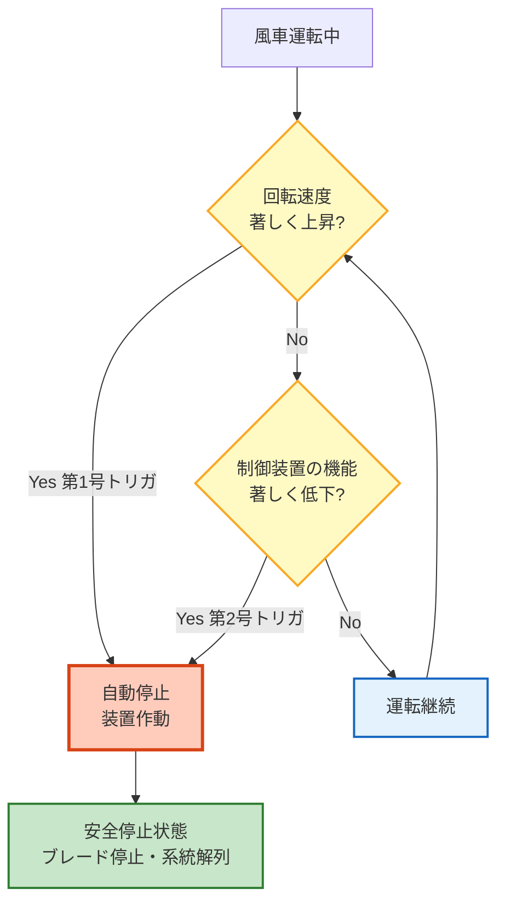

# 風技省令 第5条 — 風車の安全な状態の確保

!!! note "📊 試験対策メタ"
    **出題頻度**: 🔥🔥🔥🔥（過去14年で R06上問5・R04上問8・H29問5 の3回直接出題、関連で計5回）

    **重要度**: A（穴埋め定番・自動停止2条件の記憶必須）

    **直近出題**: R06上 問5（穴埋め・5空欄／2024年8月）／R04上 問8（論説・施設に関する技術基準）／H29 問5（論説・風車の安全）

> 風車は無人運転が前提となる発電設備であり、**異常時に人が現場で止める**ことを期待できない。そのため省令本文で「**安全かつ自動的に停止**する措置」を義務付けている。停止条件は **①回転速度の著しい上昇** と **②制御装置機能の著しい低下** の **2条件セット**。穴埋めでは「回転」「上昇」「制御」「低下」「自動」の5語が空欄になる。

| 項目 | 内容 |
|------|------|
| 条文 | 発電用風力設備に関する技術基準を定める省令 第5条 |
| 規定内容 | 風車の自動停止措置（過回転・制御機能低下の2条件） |
| 性格 | 安全運転規定（具体的な停止装置仕様は風技解釈に委任） |
| 委任先 | 風技解釈（停止装置の具体仕様・冗長化要件） |
| 上位 | 風技省令第1条（適用範囲）・電気事業法第39条（技術基準適合義務） |

---

## 1. 全体像と要点

- **2条件セット**: ①過回転 ②制御装置機能の著しい低下 — どちらか一方でも発生 → 自動停止
- 「**安全かつ自動的に**停止」 = 手動停止不可、自動停止装置の設置が義務
- 「**著しく**」が法文上のキー — 軽微な変動では停止しない設計（誤動作防止）
- なぜ自動か: 風車は無人運転が前提（タワー上のナセル内部に主要機器、人が即座に介入不可）
- なぜ過回転が危険か: ブレード先端の遠心力 ∝ 回転数² → 過回転で**ブレード破損・飛散**
- なぜ制御装置低下も含むか: 制御不能 → 過回転や無秩序停止 → **連鎖故障**につながる

### ① 全体像 — 第5条の位置づけ

<svg viewBox="0 0 800 360" xmlns="http://www.w3.org/2000/svg" width="100%" preserveAspectRatio="xMidYMid meet">
<defs>
<filter id="sh5fa" x="-20%" y="-20%" width="140%" height="140%"><feDropShadow dx="0" dy="2" stdDeviation="2" flood-opacity="0.15"/></filter>
<linearGradient id="gMain5fa" x1="0" y1="0" x2="0" y2="1"><stop offset="0%" stop-color="#bbdefb"/><stop offset="100%" stop-color="#90caf9"/></linearGradient>
<linearGradient id="gA5fa" x1="0" y1="0" x2="0" y2="1"><stop offset="0%" stop-color="#ffccbc"/><stop offset="100%" stop-color="#ff8a65"/></linearGradient>
<linearGradient id="gB5fa" x1="0" y1="0" x2="0" y2="1"><stop offset="0%" stop-color="#fff9c4"/><stop offset="100%" stop-color="#fff176"/></linearGradient>
<linearGradient id="gC5fa" x1="0" y1="0" x2="0" y2="1"><stop offset="0%" stop-color="#c8e6c9"/><stop offset="100%" stop-color="#a5d6a7"/></linearGradient>
</defs>
<text x="400" y="26" text-anchor="middle" font-size="15" font-weight="700" fill="#212121">第5条 — 風車の自動停止2条件</text>
<text x="400" y="44" text-anchor="middle" font-size="11" fill="#666">どちらか1条件成立 → 自動停止（手動停止は不可）</text>
<rect x="270" y="60" width="260" height="60" rx="12" fill="url(#gMain5fa)" stroke="#0d47a1" stroke-width="2.5" filter="url(#sh5fa)"/>
<text x="400" y="85" text-anchor="middle" font-size="14" font-weight="800" fill="#0d47a1">風技省令第5条</text>
<text x="400" y="105" text-anchor="middle" font-size="11" fill="#1565c0">風車の安全な状態の確保</text>
<line x1="400" y1="125" x2="180" y2="160" stroke="#0d47a1" stroke-width="1.8" stroke-dasharray="3,2"/>
<line x1="400" y1="125" x2="620" y2="160" stroke="#0d47a1" stroke-width="1.8" stroke-dasharray="3,2"/>
<rect x="60" y="165" width="240" height="160" rx="14" fill="url(#gA5fa)" stroke="#bf360c" stroke-width="2.5" filter="url(#sh5fa)"/>
<text x="180" y="192" text-anchor="middle" font-size="13" font-weight="700" fill="#bf360c">条件① 過回転</text>
<line x1="80" y1="202" x2="280" y2="202" stroke="#bf360c" stroke-width="1"/>
<text x="180" y="226" text-anchor="middle" font-size="11" fill="#bf360c">回転速度が</text>
<text x="180" y="244" text-anchor="middle" font-size="13" font-weight="700" fill="#bf360c">著しく上昇</text>
<text x="180" y="244" text-anchor="middle" font-size="13" font-weight="700" fill="#bf360c"></text>
<text x="180" y="272" text-anchor="middle" font-size="10" fill="#bf360c">主因: 強風／系統解列／</text>
<text x="180" y="287" text-anchor="middle" font-size="10" fill="#bf360c">負荷脱落／制御失敗</text>
<text x="180" y="310" text-anchor="middle" font-size="10" fill="#d84315">→ ブレード遠心破壊リスク</text>
<rect x="500" y="165" width="240" height="160" rx="14" fill="url(#gB5fa)" stroke="#f57f17" stroke-width="2.5" filter="url(#sh5fa)"/>
<text x="620" y="192" text-anchor="middle" font-size="13" font-weight="700" fill="#f57f17">条件② 制御装置機能低下</text>
<line x1="520" y1="202" x2="720" y2="202" stroke="#f57f17" stroke-width="1"/>
<text x="620" y="226" text-anchor="middle" font-size="11" fill="#f57f17">制御装置の機能が</text>
<text x="620" y="244" text-anchor="middle" font-size="13" font-weight="700" fill="#f57f17">著しく低下</text>
<text x="620" y="272" text-anchor="middle" font-size="10" fill="#f57f17">主因: センサ故障／</text>
<text x="620" y="287" text-anchor="middle" font-size="10" fill="#f57f17">通信途絶／電源喪失</text>
<text x="620" y="310" text-anchor="middle" font-size="10" fill="#e65100">→ 連鎖故障リスク</text>
<line x1="180" y1="325" x2="320" y2="345" stroke="#2e7d32" stroke-width="2" marker-end="url(#arrEnd)"/>
<line x1="620" y1="325" x2="480" y2="345" stroke="#2e7d32" stroke-width="2"/>
<rect x="290" y="335" width="220" height="22" rx="6" fill="url(#gC5fa)" stroke="#2e7d32" stroke-width="2"/>
<text x="400" y="351" text-anchor="middle" font-size="12" font-weight="700" fill="#1b5e20">→ 安全かつ自動的に停止</text>
</svg>

**読み解き**: 中央＝本条／左右＝2つの停止トリガ条件／下＝義務付けられている挙動（自動停止）。条件は **OR条件**（どちらか1つでも成立すれば停止）。この**2条件セット**を漏らさず暗記することが穴埋めでの最重要ポイント。

### ② 要点（試験前30秒復習用）

| 観点 | 内容 |
|------|------|
| **停止条件①** | **回転速度** が **著しく上昇** した場合 |
| **停止条件②** | 風車の **制御装置の機能** が **著しく低下** した場合 |
| **停止方法** | **安全かつ自動的に** 停止（手動不可） |
| **接続条件** | OR（どちらか1つで停止トリガ） |
| **本条にない要素** | 具体的な停止装置仕様（→ 風技解釈に委任）／支持物の構造強度（→ 別条） |

??? question "セルフチェック: なぜ「自動」停止でなければならないのか？"
    風車は **無人運転が前提**の発電設備。タワー高さ80〜100m級のナセル内部に主要機器が配置され、人が異常を検知してから現場到着までに数分〜数時間かかる。一方、過回転は **数秒〜数十秒で危険レベル**に達するため、人の介入を待つ余裕がない。よって自動停止装置による即時応答が必須。

??? question "セルフチェック: 「2条件セット」を片方だけ覚えてはいけないのはなぜか？"
    過去問では **両方とも同時に穴埋めされる**（R06上問5 の5空欄構成）。さらに選択肢に「①のみ」「②のみ」が紛れ込むため、片方だけだと選択肢を選びきれない。両条件を **OR で結ぶ構造** として記憶する必要がある。

---

## 2. 条文原文

**発電用風力設備に関する技術基準を定める省令 第5条（風車の安全な状態の確保）**

> 風車は、次の各号の場合に安全かつ<mark>自動</mark>的に停止するような措置を講じなければならない。
>
> 一　<mark>回転</mark>速度が著しく<mark>上昇</mark>した場合
>
> 二　風車の<mark>制御</mark>装置の機能が著しく<mark>低下</mark>した場合

> <small>🟡 黄色マーカー = 過去問で穴埋め出題された語句（R06上 問5 の5空欄）</small>

→ 条文は本文+第1号+第2号の3パートから成る。「安全かつ自動的に」が本文の核、各号が停止トリガ条件。「**著しく**」の文言が両号に共通して入っており、軽微な変動では停止しない設計を明示。

### 過去問で問われた箇所

| 出題で狙われるキーワード | 過去問での扱い |
|---|---|
| **回転** ／ **上昇** | 第1号の穴埋め（R06上 問5・セットで出題）|
| **制御** ／ **低下** | 第2号の穴埋め（R06上 問5・セットで出題）|
| **自動** | 本文末尾の穴埋め（R06上 問5）|
| **著しく** | 論説形式（R04上 問8・H29 問5）で「軽微な変動でも停止」誤りパターンとして出題 |
| **2条件**（過回転＋制御機能低下） | 論説で「条件①のみで足りる」誤りとして出題 |

!!! tip "暗記の核心キーワード"
    - **回転速度／上昇**（第1号）
    - **制御装置／低下**（第2号）
    - **安全かつ自動的に**（本文）
    - **著しく**（両号共通・「軽微な変動」と区別）
    - **2条件OR**（どちらか1つで停止）

!!! note "出典"
    発電用風力設備に関する技術基準を定める省令（平成九年通商産業省令第五十三号、令和6年10月改正版）第5条 — 経済産業省「発電用風力設備に関する技術基準を定める省令及びその解釈に関する逐条解説（令和6年10月1日改正）」参照。

---

## 3. 原文解析（ブロック分解）

条文を意味ブロック単位に分解し、それぞれの試験ポイントを整理する。

| 原文ブロック | 意味 | 試験のポイント |
|---|---|---|
| 「風車は」 | 適用対象 = **風車本体**（ナセル＋ブレード＋ロータ等の発電装置側） | 支持物（タワー）は本条の対象外 → 別条（風技省令第7条系・電技省令第32条） |
| 「次の各号の場合に」 | **2条件セット**（OR条件） | 各号は並列。どちらか1つでも成立すれば停止トリガ |
| 「安全かつ自動的に停止する」 | 停止方式の規定 | **「自動」が必須**。手動停止のみは不可 / 「安全」=停止過程で2次災害を起こさない |
| 「ような措置を講じなければならない」 | 義務規定（措置義務） | 具体的方法は風技解釈に委任。設置者の選択で複数手段可（ピッチ制御・ブレーキ等） |
| 第1号「回転速度が著しく上昇した場合」 | 過回転トリガ | **「著しく」**が必須。通常運転範囲の変動では停止しない設計 |
| 第2号「風車の制御装置の機能が著しく低下した場合」 | 制御喪失トリガ | センサ・通信・電源等の制御系障害が対象 |

??? question "セルフチェック: 「次の各号のいずれかの場合」と「次の各号すべての場合」の違いは？"
    本条は「**次の各号の場合**」と表現しており、これは **各号それぞれの場合に** = OR条件 を意味する。両方が同時発生する必要はなく、片方の条件が成立すれば停止義務が発動する。

??? question "セルフチェック: 「著しく上昇」とはどの程度を指すか？"
    具体的数値は省令本文に規定されていない（**性能規定**）。風技解釈および JIS C 1400-1（風車の設計要件）等で「定格回転速度の○％」等が示されるが、メーカー設計値による。試験では **「著しく」の文言があるかどうか** が穴埋め・論説のポイントで、具体的な％までは問われない。

---

## 4. かみ砕き解説（因果理解）

### なぜ自動停止が必須か — 風車の運転環境特性

風力発電設備は次の3点で **無人運転が前提**：

1. **設置場所**: 山地・海岸・洋上等、人がアクセスしにくい立地
2. **規模**: 1基あたりタワー高さ80〜100m、ブレード径100m級。物理的に機側介入が困難
3. **稼働形態**: 24時間稼働。常時監視員は不在（遠隔監視＋定期巡視のみ）

→ 異常発生から人が到着するまで **数分〜数時間**。一方、過回転は **数秒で危険レベル**。よって自動停止は不可欠。

### なぜ過回転が危険か — ブレードに働く遠心力

ブレード先端の遠心力 F は次式で与えられる：

$$F = m \omega^2 r$$

- m: ブレードの質量
- ω: 角速度（回転速度に比例）
- r: 回転中心からの距離

→ **回転速度が2倍 → 遠心力は4倍**（ω²に比例）。定格回転を大きく超えると、ブレード根元の応力が設計値を超え、**ブレード破断・飛散**のリスクがある。

過回転の主原因：

| 原因 | メカニズム |
|------|----------|
| 強風（暴風） | カットアウト風速を超える風で空力トルク増大 |
| **系統解列** | 発電機負荷喪失 → ブレーキングトルク消失 → 加速 |
| 負荷脱落 | 同上（部分的負荷喪失） |
| ピッチ制御失敗 | 通常はブレード角度を変え風を逃がすが、油圧故障等で制御不能 |

### なぜ制御装置低下も停止条件か — 連鎖故障の予防

制御装置（PLC・センサ群・通信系）が機能低下すると：

- 過回転を **検知できなくなる** → 第1号の機能が無効化
- 風向追従（ヨー制御）失敗 → 横風で構造ストレス増大
- ピッチ制御不能 → 強風時にブレード角度を風と平行にできない

→ 制御喪失そのものが**次の事故の引き金**になるため、症状ではなく **原因の段階で停止**させる設計思想。

!!! tip "因果の暗記コツ"
    - 第1号 = 「**結果**」起点（過回転という現象が出たら止める）
    - 第2号 = 「**原因**」起点（制御失った時点で予防的に止める）

    両号で「症状を見る」と「原因を見る」の **両側面**から二重に守る構造。

### なぜ「著しく」の文言があるか — 誤動作防止

風車は風向・風速の変動で常に回転速度・制御信号が小幅に変動する。「軽微な変動でも停止」とすると：

- **稼働率低下**（年間発電量の損失）
- 起動・停止繰り返しによる **機械疲労蓄積**
- 系統への **不安定電力供給**

→ 「**著しく**」を入れることで、停止トリガを **明確な異常レベル**に限定し、誤動作を防いでいる。条文上は「著しく」の解釈はメーカー設計（風技解釈・JIS）に委任。

---

## 5. 図で理解

### 自動停止判定フロー

### 過回転時の遠心力増加（イメージ）

<svg viewBox="0 0 800 320" xmlns="http://www.w3.org/2000/svg" width="100%" preserveAspectRatio="xMidYMid meet">
<defs>
<filter id="sh5fb" x="-20%" y="-20%" width="140%" height="140%"><feDropShadow dx="0" dy="2" stdDeviation="2" flood-opacity="0.15"/></filter>
</defs>
<text x="400" y="26" text-anchor="middle" font-size="15" font-weight="700" fill="#212121">遠心力 F = mω²r — 回転2倍で力4倍</text>
<text x="400" y="44" text-anchor="middle" font-size="11" fill="#666">過回転時、ブレード根元の応力が設計値を超えると破断リスク</text>
<rect x="60" y="60" width="220" height="240" rx="12" fill="#e8f5e9" stroke="#2e7d32" stroke-width="2" filter="url(#sh5fb)"/>
<text x="170" y="84" text-anchor="middle" font-size="13" font-weight="700" fill="#1b5e20">通常運転（ω = 1）</text>
<line x1="170" y1="100" x2="170" y2="260" stroke="#2e7d32" stroke-width="2"/>
<line x1="100" y1="180" x2="240" y2="180" stroke="#2e7d32" stroke-width="2"/>
<circle cx="170" cy="180" r="6" fill="#2e7d32"/>
<text x="170" y="200" text-anchor="middle" font-size="10" fill="#2e7d32">ハブ</text>
<text x="170" y="130" text-anchor="middle" font-size="10" fill="#1b5e20">ブレード上</text>
<text x="170" y="240" text-anchor="middle" font-size="10" fill="#1b5e20">ブレード下</text>
<text x="170" y="278" text-anchor="middle" font-size="11" font-weight="700" fill="#1b5e20">遠心力 F = 1.0（基準）</text>
<text x="170" y="294" text-anchor="middle" font-size="10" fill="#2e7d32">設計範囲内</text>
<rect x="290" y="60" width="220" height="240" rx="12" fill="#fff3e0" stroke="#ef6c00" stroke-width="2" filter="url(#sh5fb)"/>
<text x="400" y="84" text-anchor="middle" font-size="13" font-weight="700" fill="#e65100">やや上昇（ω = 1.5）</text>
<line x1="400" y1="100" x2="400" y2="260" stroke="#ef6c00" stroke-width="3"/>
<line x1="320" y1="180" x2="480" y2="180" stroke="#ef6c00" stroke-width="3"/>
<circle cx="400" cy="180" r="7" fill="#ef6c00"/>
<text x="400" y="278" text-anchor="middle" font-size="11" font-weight="700" fill="#e65100">遠心力 F = 2.25（×2.25）</text>
<text x="400" y="294" text-anchor="middle" font-size="10" fill="#ef6c00">注意域・監視強化</text>
<rect x="520" y="60" width="220" height="240" rx="12" fill="#ffebee" stroke="#c62828" stroke-width="2.5" filter="url(#sh5fb)"/>
<text x="630" y="84" text-anchor="middle" font-size="13" font-weight="700" fill="#b71c1c">著しく上昇（ω = 2）</text>
<line x1="630" y1="100" x2="630" y2="260" stroke="#c62828" stroke-width="4"/>
<line x1="540" y1="180" x2="720" y2="180" stroke="#c62828" stroke-width="4"/>
<circle cx="630" cy="180" r="9" fill="#c62828"/>
<text x="630" y="200" text-anchor="middle" font-size="10" fill="#c62828">ハブ</text>
<text x="630" y="278" text-anchor="middle" font-size="11" font-weight="700" fill="#b71c1c">遠心力 F = 4.0（×4）</text>
<text x="630" y="294" text-anchor="middle" font-size="10" fill="#c62828">第1号トリガ → 自動停止</text>
</svg>

**読み解き**: 角速度 ω が2倍になると、遠心力は ω² に比例して4倍になる。ブレード根元の応力も同様に増加し、設計強度を超えると破断する。「著しく上昇」とは概ね定格回転速度を大きく超える領域を指し、メーカー設計値（典型的には定格の1.2〜1.3倍程度）でトリガが設定される。

---

## 6. 自動停止の具体メカニズム

省令本文は **性能規定**（「自動停止する措置」）であり、具体的な停止方式は風技解釈および設計者の選択に委ねられる。実機で採用される代表的な停止手段：

| 停止手段 | 原理 | 主な役割 |
|----------|------|----------|
| **ピッチ制御**（フェザリング） | ブレード角度を風と平行に変えて空力トルクをゼロにする | 第1選択肢。最も穏やかな停止 |
| **機械式ブレーキ**（ディスクブレーキ） | ロータ軸を物理的に制動 | ピッチ制御失敗時の最後の手段 |
| **ヨー制御** | ナセルを風向と直角に向け、風を受けないようにする | 補助手段 |
| **発電機ダイナミックブレーキ** | 発電機を抵抗負荷として使い、電気的にトルクを発生 | 系統解列時の補助 |

!!! note "冗長設計の考え方"
    第5条の自動停止措置は、通常 **2系統以上の冗長化**で設計される（ピッチ制御＋機械ブレーキ等）。1系統だけでは「制御装置の機能が著しく低下した場合」（第2号）に対応できないため、独立した別系統が必要。

!!! warning "試験では具体メカニズムの詳細は出題されにくい"
    省令本文は性能規定であり、ピッチ制御等の具体機構は **風技解釈・JIS の領域**。電験3種の法規科目では本条の **条文文言の穴埋め** が中心で、ピッチ制御等の力学・機械設計詳細は問われにくい（電験2種・1種の機械科目で出題範囲）。

---

## 7. 関連条文との関係

### 風技省令の構成（第5条の位置づけ）

| 条文 | 見出し | 第5条との関係 |
|------|--------|---------------|
| 風技省令 第1条 | 適用範囲 | 上位（適用対象の定義） |
| 風技省令 第3条 | 取扱者以外の者の立入の防止 | 並列規定（人的安全） |
| 風技省令 第4条 | 風車の施設要件 | **直接の前条**（構造安全要件・5号構成）|
| **風技省令 第5条** | **風車の安全な状態の確保** | **本条**（自動停止2条件）|
| 風技省令 第7条系 | 風車を支持する工作物 | 別条（タワー強度・登攀防止）|

### 電技省令との対比（混同注意）

| 条文 | 規定内容 | 第5条との関係 |
|------|--------|---------------|
| 電技省令 第15条 | 発電機等の電気機械器具の損傷防止 | **一般機器の保護**（過電流・過電圧）／風車特有の過回転は対象外 |
| 電技省令 第32条 | 支持物の倒壊の防止 | **支持物（タワー）の構造強度**／風車本体は対象外 |
| 電技解釈 第59条 | 架空電線路の支持物の強度 | 同上（具体的強度計算） |

!!! warning "「省令第15条の2」の表記について"
    一部の参考書・テーマ整理ページで「電技省令第15条の2」と記載されることがあるが、現行の **電気設備技術基準を定める省令には第15条の2は存在しない**。風車の自動停止に関する規定の出典は **発電用風力設備に関する技術基準を定める省令 第5条**（本条）が正しい。

### 委任関係

本条 → **風技解釈** に具体仕様を委任：

- 自動停止装置の冗長化要件
- 「著しく」の判定閾値の指針
- 設計時の検証方法（停止性能の試験法）

---

## 8. 頻出ひっかけ・落とし穴

試験で実際に失点しやすいポイントを、重大度別に整理した。

### 🔴 致命的（これを間違えたら即失点）

| # | ❌ 誤った認識 | ✅ 正しい認識 |
|---|--------------|--------------|
| 1 | 風車は手動停止措置でもよい | **「安全かつ自動的に停止」** が条文。手動停止のみは不可。自動停止装置の設置が義務 |
| 2 | 停止条件は「過回転」だけ覚えればよい | **2条件セット**: ①回転速度の著しい上昇 ②制御装置の機能の著しい低下。両方を漏らさず記憶 |
| 3 | 2条件はAND条件（両方必要） | **OR条件**。各号いずれかが成立すれば停止トリガ。「両方同時」を要求していない |

### 🟡 注意（出題頻度高い）

| # | ❌ 誤った認識 | ✅ 正しい認識 |
|---|--------------|--------------|
| 4 | 軽微な変動でも停止する | 条文に **「著しく」** が両号に明記。通常運転範囲の変動では停止しない（誤動作防止設計）|
| 5 | 停止条件は「制御装置の機能が著しく低下する **前** に停止」 | 条文は **「著しく低下した場合」**（過去形ニュアンス）。低下前ではなく低下時点で停止 |
| 6 | 第5条は支持物（タワー）の倒壊防止規定 | 本条は **風車本体**（ナセル＋ブレード）の自動停止規定。支持物は別条（風技省令第7条系・電技省令第32条）|

### 🟢 軽微（余裕があれば）

| # | ❌ 誤った認識 | ✅ 正しい認識 |
|---|--------------|--------------|
| 7 | 「自動停止」とは緊急停止ボタンの設置を意味する | 緊急停止ボタンは **手動操作**。条文の「自動」は **センサ検知 → 自動的に停止装置作動** の流れを指す |
| 8 | 具体的な停止装置（ピッチ制御等）が条文に明記されている | 省令本文は **性能規定**（「自動停止する措置」）のみ。具体機構は風技解釈・設計者選択 |

---

## 9. 穴埋め過去問チャレンジ

!!! abstract "問題1: 第1号の穴埋め（R06上 問5 前半）"
    風車は、（　ア　）速度が著しく（　イ　）した場合において、安全かつ自動的に停止するような措置を講じなければならない。

??? success "解答"
    - ア = **回転**
    - イ = **上昇**

??? note "解説と復習導線"
    第1号は「回転速度が著しく上昇」。「**回転**」「**上昇**」のセットで暗記。「速度が上昇」だけでは選択肢を選びきれない（速度の前の語＝「回転」が必須）。

!!! abstract "問題2: 第2号の穴埋め（R06上 問5 後半）"
    及び風車の（　ウ　）装置の機能が著しく（　エ　）した場合において、安全かつ自動的に停止するような措置を講じなければならない。

??? success "解答"
    - ウ = **制御**
    - エ = **低下**

??? note "解説と復習導線"
    第2号は「制御装置の機能が著しく低下」。「**制御**」「**低下**」のセット。第1号「上昇」と対になる「低下」は方向が逆になる点に注意。

!!! abstract "問題3: 停止方法の穴埋め（R06上 問5 末尾）"
    上記2条件のいずれの場合も、安全かつ（　オ　）的に停止するような措置を講じなければならない。

??? success "解答"
    - オ = **自動**

??? note "解説と復習導線"
    手動ではなく **自動**。風車の無人運転前提から導かれる必須要件。

!!! abstract "問題4: 「著しく」の有無（論説形式・R04上 問8 想定）"
    次の文の正誤を判定せよ。「風車は、回転速度が上昇した場合及び制御装置の機能が低下した場合に、自動的に停止するような措置を講じなければならない。」

??? success "解答"

??? note "解説と復習導線"
    **誤り**

    両号とも **「著しく」** の文言が必要。条文は「**著しく**上昇」「**著しく**低下」と明記しており、軽微な変動では停止しない設計。「著しく」を省略すると誤動作多発の解釈になる。

---

## 10. まぎらわしい選択肢と正解の違い

| 誤った記述 | 正しい記述 | なぜ違うか |
|---|---|---|
| 「風車は手動で停止する措置を講じれば足りる」 | 「**自動的に**停止する措置」を講じる | 条文末尾は「自動」が必須。手動のみは不可 |
| 「回転速度が上昇した場合に停止すればよい」 | 「**著しく**上昇した場合」 | 「著しく」を省略すると誤動作多発の解釈になる |
| 「過回転または制御機能低下のいずれか1つで足りる」 | **2条件セット**を両方とも条文に規定（いずれかで停止トリガ） | 条文は2号構成。条件を覚えるときは両方必須 |
| 「停止条件は両方が同時発生した場合のみ」 | 各号は **OR条件**（いずれか1つで停止）| 「次の各号の場合」は並列の場合分け |
| 「制御装置の機能が低下する **前** に停止する」 | 機能が「**著しく低下した場合**」に停止 | 条文は過去形ニュアンス。低下した時点で停止 |
| 「第5条は風車を支持する工作物（タワー）の倒壊防止規定」 | 第5条は **風車本体**の自動停止規定。支持物は別条 | 適用対象が異なる |
| 「自動停止 = 緊急停止ボタンの設置」 | 自動停止 = **センサ検知 → 自動装置作動** | 緊急停止ボタンは手動操作 |

---

## 11. 関連条文・関連ページ

- [風車テーマ（fusha.md）](../../themes/fusha.md) — 風車関連規定の横断整理
- [架空電線路の支持物（kachiku-densen.md）](../../themes/kachiku-densen.md) — 風車支持物（タワー）と共通する強度規定
- [保護装置（hogo-sochi.md）](../../themes/hogo-sochi.md) — 発電機保護（電技省令第15条）と自動停止の役割分担
- [電技省令 第32条（支持物の倒壊の防止）](../kijun/32.md) — タワー強度の関連規定
- [電技解釈 第59条（架空電線路の支持物の強度）](../kaishaku/59.md) — 支持物強度の具体計算
- [引っかけパターン集](../../strategy/trap-patterns.md) — 風車関連のひっかけ整理

---

## 12. 過去問実績

| 年度 | 問 | 形式 | 論点 |
|------|-----|------|------|
| R06上 | 問5 | 穴埋め | 風車の安全な状態の確保（5空欄: 回転／上昇／制御／低下／自動）|
| R04上 | 問8 | 論説 | 風車の施設に関する技術基準（第4条・第5条複合）|
| H29 | 問5 | 論説 | 風車の安全（第5条の2条件記述）|
| R07上 | 問5 | 論説 | 風車を支持する工作物（**第5条ではなく別条**・参考）|
| H24 | 問4 | 論説 | 風車の支持物（**第5条ではなく別条**・参考）|

!!! note "出題傾向"
    第5条そのものは過去14年で **3回**直接出題（R06上・R04上・H29）。R06上は穴埋めで5空欄（回転・上昇・制御・低下・自動）。論説形式では「著しく」の有無や「自動 vs 手動」がポイント。R07上・H24 は支持物（別条）の出題で、第5条と混同しないよう注意。

!!! note "R08 出題予測（2026年8月）"
    R06上で穴埋め出題済みのため、同形式での再出題確率は **中程度**。ただし、条文文言が短く（3パートのみ）穴埋め定番として扱いやすいため、**周期的に再出題される可能性は十分にある**。

    **直前チェックポイント**: 5語（回転／上昇／制御／低下／自動）の暗記＋「著しく」「自動」「2条件OR」の3要素を押さえる。

---

## 13. 用語集

第5条の条文や出題で登場する主要用語を整理した。

| 用語 | 読み | 意味 | 試験での注意点 |
|------|------|------|----------------|
| 風車 | ふうしゃ | 風力エネルギーを機械的回転エネルギーに変換する装置（ブレード＋ロータ＋ナセル）| 「支持物（タワー）」とは区別。本条の対象は風車本体 |
| 回転速度 | かいてんそくど | ロータ（ブレードを含む回転部）の回転速度。単位 rpm | 第1号穴埋めの定番ペア（「回転」が空欄）|
| 著しく | いちじるしく | 通常運転範囲を大きく超えた状態を示す副詞 | 軽微な変動を除外する誤動作防止のための法文上の重要ワード |
| 制御装置 | せいぎょそうち | 風車の運転状態（回転速度・ピッチ・ヨー・系統連系）を制御する装置群（PLC・センサ・通信系等）| 第2号穴埋めの定番ペア（「制御」が空欄）|
| 自動停止 | じどうていし | センサ検知 → 自動装置作動による停止。手動操作を介さない | 「自動」が穴埋め定番。緊急停止ボタン（手動）と区別 |
| ピッチ制御 | ぴっちせいぎょ | ブレード角度を変え空力トルクを調整する機構。第5条の主要停止手段 | 風技解釈・JIS の領域。本条本文には登場しない |
| ヨー制御 | よーせいぎょ | ナセルを風向に追従させる機構 | 補助的停止手段。本条本文には登場しない |
| 機械式ブレーキ | きかいしきぶれーき | ロータ軸を物理的に制動する機構（ディスクブレーキ等）| ピッチ制御失敗時の最後の手段 |
| 過回転 | かかいてん | 定格回転速度を大幅に超える状態 | 第1号「著しく上昇」の典型ケース |

---

## 14. 最終チェック

### 条文キーワード暗記

- [ ] 第1号 = **回転**速度が著しく**上昇**した場合
- [ ] 第2号 = 風車の**制御**装置の機能が著しく**低下**した場合
- [ ] 本文末尾 = 安全かつ**自動**的に停止する措置
- [ ] 両号共通 = **「著しく」** の文言（軽微な変動では停止しない）

### 構造理解

- [ ] 2条件は **OR条件**（いずれか1つで停止トリガ）
- [ ] 適用対象 = 風車本体（ナセル＋ブレード）。支持物は別条
- [ ] 性能規定（具体機構は風技解釈・設計者選択）

### 因果理解

- [ ] なぜ自動か = 風車は **無人運転前提**、人の介入待てない
- [ ] なぜ過回転が危険か = **遠心力 ∝ ω²**、回転2倍で力4倍 → ブレード破断
- [ ] なぜ制御低下も含むか = **連鎖故障の予防**（症状＋原因の二重防御）
- [ ] なぜ「著しく」か = **誤動作防止**（稼働率低下・機械疲労回避）

### 関連条文

- [ ] 上位 = 電気事業法第39条（技術基準適合義務）
- [ ] 別条（混同注意）= 風技省令第7条系（支持物）／電技省令第32条（支持物倒壊防止）
- [ ] 出典の誤記注意 = 「電技省令第15条の2」は誤り。正しくは **風技省令第5条**

### ひっかけ対策

- [ ] 「手動停止でよい」は誤り → **自動**必須
- [ ] 「上昇／低下のみ」は不足 → **回転速度／制御装置** とセット
- [ ] 「著しく」省略は誤り → 両号に必須
- [ ] 「2条件AND」は誤り → **OR**

---

## 監修ログ

- **2026-05-05**: 初版作成（v1.0）。kijun/58.md V2.2 ゴールドスタンダードに準拠した14セクション構造を踏襲。条文原文は経済産業省「発電用風力設備に関する技術基準を定める省令及びその解釈に関する逐条解説（令和6年10月1日改正）」を出典として整備。`<mark>` は R06上 問5 で実出題された5語（回転／上昇／制御／低下／自動）のみに限定（feedback_denken_wiki_marker.md ルール準拠）。fusha.md における「電技省令第15条の2」表記の出典疑義について本ページで明確化（正しくは風技省令第5条）。

---

*最終確認: 2026-05-05 | ステータス: v1.0（14セクション完備・kijun/58.md V2.2準拠）*
