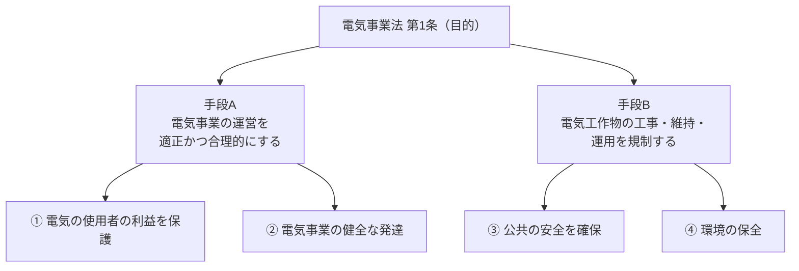

# 電気事業法 第1条 — 目的

!!! abstract "📊 試験対策メタ"
    - **出題頻度**: 🔥🔥（H21 問1 で目的条項が直接穴埋め出題・電気事業法を学ぶ全条文の前提）
    - **重要度**: B（基本必須・目的条文の穴埋めは取りこぼし防止枠）
    - **直近出題**: H21 問1（穴埋め・目的条項の (ア)規制 (イ)公共 (ウ)環境）
    - **典拠**: 電気事業法 第1条（eGov LawId: 339AC0000000170）
    - **照合日**: 2026-06-01
    - **隣接条文**: [第2条（定義）](2.md) ／ [第38条（電気工作物の種別）](38.md) ／ [第39条（技術基準適合義務）](39.md)

> 電気事業法の **最上位にある目的条文**。この法律が「**何のために**」電気事業と電気工作物を規律するのかを宣言する。電験三種では H21 問1 で目的条項そのものが穴埋め出題されたほか、各保安規定（保安規程・主任技術者・工事計画）の「なぜ」を貫く背骨となる。

---

!!! warning "📌 注意：第1条は「目的」、用語の定義は [第2条](2.md)、工作物の種別は [第38条](38.md)"
    本ページは **法律の目的**（何を保護し何を図るか）を扱う。
    「電気事業の 7 類型」などの用語定義は [第2条](2.md)、「一般用／小規模事業用／自家用／事業用」の種別判定は [第38条](38.md) の論点であり、本条ではない。

---

## ⚡ 5秒で思い出す

第1条は **2つの手段 → 4つの目的** の構造。手段ごとに守る対象が違う。

- 手段A：電気事業の運営を ==**適正かつ合理的**== にする → ① 電気の ==**使用者の利益**== を保護 ／ ② 電気事業の ==**健全な発達**==
- 手段B：電気工作物の工事・維持・運用を ==**規制**== する → ③ ==**公共の安全**== を確保 ／ ④ ==**環境の保全**==
- 電験で問われるのは主に **後段（保安側）**：「==**規制**== → ==**公共**==の安全 → ==**環境**==の保全」（H21 問1 の (ア)(イ)(ウ)）
- 守る対象は「使用者」だけではない。**保安規制が守るのは「公共の安全」＝不特定多数**（主語の取り違えに注意）

??? question "セルフチェック: 第1条はなぜ「事業運営の適正化」と「工作物の規制」の2つの手段を併記しているのか？"
    **電気事業には「経済（適正・安価・安定な供給）」と「保安（事故・災害の防止）」という性格の異なる2つのリスクがあり、別々の手段で別々の目的を達成する必要があるため。** 事業運営を適正・合理的にする手段は「使用者の利益保護」と「事業の健全な発達」という==経済目的==に、電気工作物の工事・維持・運用を規制する手段は「公共の安全」と「環境の保全」という==保安・公益目的==につながる。だから1条の中で手段と目的が2系統に枝分かれする。

??? question "セルフチェック: 「公共の安全を確保」と「電気の使用者の利益を保護」は、それぞれどの手段から導かれるか？"
    **「公共の安全」は手段B（電気工作物の工事・維持・運用の規制）から、「使用者の利益」は手段A（電気事業の運営の適正化）から導かれる。** ここを取り違え、「使用者の安全を確保」と読むと誤り。使用者については「利益を保護」、安全については「公共（不特定多数）」を守る、と主語と目的語が対応している。

??? question "セルフチェック: 第1条と第39条（技術基準適合義務）はどう関係するか？"
    **第1条が宣言した「公共の安全・環境の保全」という目的を、具体的な義務に落としたのが第39条以降。** 第1条は「電気工作物の工事・維持・運用を規制する」と方向性を示すだけで、実際に「技術基準に適合させよ」と命じるのは [第39条](39.md)、不適合時に大臣が命令できるのが [第40条](40.md)。目的（1条）→ 義務（39条）→ 命令（40条）と具体化する。

---

## 📋 条文の概要

| 項目 | 内容 |
|------|------|
| 条文 | 電気事業法 第1条 |
| 規定内容 | 法律の目的（2つの手段と4つの目的） |
| 性格 | 目的規定（理念の宣言・直接の義務や罰則は定めない） |
| 手段A | 電気事業の運営を適正かつ合理的にする |
| 手段B | 電気工作物の工事・維持・運用を規制する |
| 4つの目的 | ①使用者の利益保護 ②電気事業の健全な発達 ③公共の安全の確保 ④環境の保全 |
| 関連 | 第2条（定義）／第38条（工作物の種別）／第39条（技術基準適合義務） |

---

## 🎯 目的の構造（2つの手段 → 4つの目的）

!!! note "出典: 電気事業法 第1条（eGov LawId 339AC0000000170・2026-06-01 照合）"
    > この法律は、電気事業の運営を適正かつ合理的ならしめることによつて、電気の使用者の利益を保護し、及び電気事業の健全な発達を図るとともに、電気工作物の工事、維持及び運用を**規制**することによつて、**公共**の安全を確保し、及び**環境**の保全を図ることを目的とする。
    >
    > （太字は H21 問1 で穴埋め出題された (ア)規制・(イ)公共・(ウ)環境）

| 手段 | 何をするか | つながる目的 | 性格 |
|------|-----------|-------------|------|
| 手段A | 電気事業の運営を **適正かつ合理的** にする | ①使用者の利益保護 ②事業の健全な発達 | 経済（安価・安定供給） |
| 手段B | 電気工作物の工事・維持・運用を **規制** する | ③公共の安全 ④環境の保全 | 保安・公益（事故・災害防止） |

!!! tip "暗記の核心：主語と目的語の対応"
    - 「**使用者**」については ==**利益を保護**==（安全ではない）
    - 「**安全**」を確保するのは ==**公共**==（使用者個人ではなく不特定多数）
    - 電験の頻出は後段の保安側：==規制 → 公共の安全 → 環境の保全==

---

## 🕳️ 頻出落とし穴

1. 🔴 **[②主語]** 「第1条は電気の使用者の**安全**を確保する規定」→ 誤り。使用者については「**利益**を保護」、**安全**は「**公共**の安全」（不特定多数）
2. 🔴 **[②主語]** 「規制の対象は電気事業の健全な発達」→ 誤り。「規制」の目的語は **電気工作物の工事・維持・運用**。事業は「健全な発達を**図る**」
3. 🟡 **[⑥例外]** 「第1条は罰則・義務を直接定める」→ 誤り。第1条は **目的の宣言** のみ。具体的義務は第39条以降
4. 🟡 **[②主語]** 「目的は使用者の利益保護だけ」→ 誤り。**4つ**（使用者利益・事業の健全な発達・公共の安全・環境の保全）
5. 🟢 **[⑥例外]** 「環境の保全」を見落として3目的と数える → 現行条文は **環境の保全を含む4目的**

---

## 📝 穴埋め過去問チャレンジ

!!! tip "学習ラダー方式（Why→What→How）"
    暗記前に **「なぜ2手段4目的か」（Step1: 理解）** をつかむ → **H21問1の実問題で構造確認（Step2）** → **目的語の対応で誤答を外す（Step3: 応用）** へ段階接続。Step1で「手段ごとに守る対象が違う」と理解できていれば、穴埋めも誤答選択肢も主語対応で導ける。

!!! abstract "問題1【Step1: 理解】なぜ第1条は手段を2つに分けるのか"
    第1条は「電気事業の運営の適正・合理化」と「電気工作物の工事・維持・運用の規制」という2つの手段を併記している。なぜ1つの手段にまとめず2系統に分けているのか、**守ろうとしている対象の違い** から理由を述べよ。

??? success "解答 1"
    **「経済（供給）」と「保安（安全）」という性格の異なるリスクを、別々の手段で別々の目的に対応させるため。**

    **なぜ重要か**:

    - 手段A（事業運営の適正・合理化）は **経済面** ＝「使用者の利益保護」「事業の健全な発達」を狙う。安価・安定・公平な供給の確保が射程。
    - 手段B（工作物の工事・維持・運用の規制）は **保安・公益面** ＝「公共の安全」「環境の保全」を狙う。感電・火災・波及事故・環境影響の防止が射程。
    - 電験三種で問われるのは主に **手段B（保安側）**。保安規程・主任技術者・工事計画・事故報告は、すべて第1条の「公共の安全・環境の保全」を具体化したもの。
    - だから「規制 → 公共の安全 → 環境の保全」の流れ（H21 (ア)(イ)(ウ)）を、手段Bの一本道として覚えると誤答に強い。

!!! abstract "問題2【Step2: 構造確認】H21 問1 — 電気事業法の目的（denken-ou.com 出典）"
    次は電気事業法第1条（目的）の条文である。空欄に入る語句を答えよ。

    > この法律は、電気事業の運営を適正かつ合理的ならしめることによつて、電気の使用者の利益を保護し、及び電気事業の健全な発達を図るとともに、電気工作物の工事、維持及び運用を <mark>（ア）</mark> することによつて、<mark>（イ）</mark> の安全を確保し、及び <mark>（ウ）</mark> の保全を図ることを目的とする。

??? success "解答 2"
    | 空欄 | 正答 |
    |------|------|
    | （ア） | ==規制== |
    | （イ） | ==公共== |
    | （ウ） | ==環境== |

    **読み解きポイント：**

    - （ア）電気工作物の工事・維持・運用を「==**規制**==」する＝保安規制の宣言。
    - （イ）守るのは「==**公共**==の安全」。「使用者の安全」と書いた選択肢は誤り（使用者は『利益』を保護）。
    - （ウ）「==**環境**==の保全」。3目的と数えて環境を落とす誤りに注意。
    - Step1の「手段B＝保安側」を押さえていれば、(ア)(イ)(ウ)は「規制→公共→環境」の一本道で導ける。

    **出典**: [denken-ou.com 法規 平成21年 問1](https://denken-ou.com/houkih21-1/)（正解選択肢 (3)）

!!! abstract "問題3【Step3: 応用】目的語の対応で誤りを外す"
    電気事業法第1条の目的に関する次の記述のうち、**誤っているもの** はどれか。

    1. 電気の使用者の利益を保護することを目的の一つとする
    2. 電気事業の健全な発達を図ることを目的の一つとする
    3. 電気工作物の工事、維持及び運用を規制することにより公共の安全を確保する
    4. 電気の使用者の安全を確保することを目的の一つとする
    5. 環境の保全を図ることを目的の一つとする

??? success "解答 3"
    **正解（誤り） = (4)**

    **理由（主語と目的語の対応）**:

    | 記述 | 正誤 | 正しい理解 |
    |------|------|----------|
    | (1) 使用者の利益を保護 | ✅ | 手段A の目的 |
    | (2) 事業の健全な発達 | ✅ | 手段A の目的 |
    | (3) 規制により公共の安全 | ✅ | 手段B の目的（H21 (ア)(イ)） |
    | (4) **使用者の安全を確保** | ❌ | 確保するのは「**公共**の安全」。使用者については「利益を保護」 |
    | (5) 環境の保全 | ✅ | 手段B の目的（H21 (ウ)） |

    - **(4) の罠**：「使用者」と「安全」を結びつける。条文は「使用者＝利益を保護」「安全＝公共」と主語が分かれている。
    - **覚え方**：手段A＝「使用者の利益・事業の発達」（経済）、手段B＝「公共の安全・環境の保全」（保安）。安全は必ず「公共」とセット。

---

## ⚠️ まぎらわしい選択肢と正解の違い

| 選択肢の表現 | 正誤 | 正しい理解 |
|-------------|------|----------|
| 電気の使用者の安全を確保することを目的とする | ❌ | 確保するのは ==**公共の安全**==。使用者については「利益を保護」 |
| 電気工作物の工事・維持・運用を規制し、事業の健全な発達を図る | ❌ | 規制が図るのは ==**公共の安全・環境の保全**==。事業の健全な発達は手段A側 |
| 第1条は違反者への罰則を定めている | ❌ | 第1条は ==**目的の宣言**==のみ。義務・罰則は第39条以降 |
| 目的は「使用者の利益保護」と「公共の安全」の2つ | ❌ | ==**4つ**==（使用者利益・事業の健全な発達・公共の安全・環境の保全） |
| 「環境の保全」は第1条の目的に含まれない | ❌ | 現行条文は ==**環境の保全を明記**==（H21 (ウ) で出題） |

---

## 📝 過去問実績

| 年度 | 問 | 形式 | 論点 | 出典 |
|------|-----|------|------|------|
| H21 | 問1 | 穴埋め ✅ | 目的条項 (ア)規制 (イ)公共 (ウ)環境 | [denken-ou.com](https://denken-ou.com/houkih21-1/) |

> ※ H21 問1 の穴埋めは **条文そのままの出題（改変なし）**。空欄は (ア)規制・(イ)公共・(ウ)環境（denken-ou.com 一次照合）。

!!! note "出題予測"
    目的条文そのものの直接出題は H21 が代表例。**穴埋め型**（規制／公共／環境）が再出題の中心。

    **出題パターン予測**:

    - **穴埋め**: 「規制」「公共（の安全）」「環境（の保全）」の3点が定番空欄
    - **正誤**: 「使用者の安全」⇄「公共の安全」の主語すり替え／目的を2つや3つに削る誤り
    - **前提知識**: 保安規程・主任技術者・工事計画の「なぜ」を問う設問の背景として常時必要

---

## 🗂️ 用語の3列対応（日常語 ⇆ 法規表現 ⇆ 試験での意味）

| 日常語・イメージ | 法規表現（条文） | 試験での意味・ひっかけ |
|---|---|---|
| 安全に使えるようにする | 電気工作物の工事・維持・運用を **規制** | 規制の対象は「工作物」。実務では保安規程・主任技術者・工事計画で具体化（現場の保安体制の根拠） |
| みんなの安全 | **公共** の安全の確保 | 「使用者の安全」ではなく不特定多数。現場の感電・火災・波及事故の防止が射程 |
| 自然・地球への配慮 | **環境** の保全 | 3目的と数えて落とさない。発電所の建設・運用に伴う環境影響が実務上の対象 |
| 電気を安く安定して使える | 電気の **使用者の利益** を保護 | 「安全」ではなく「利益」。料金・安定供給の側面 |
| 電力会社が健全に伸びる | 電気事業の **健全な発達** | 事業者側の目的。保安目的（公共の安全）と混同しない |

!!! tip "実務での位置づけ"
    第1条の「公共の安全・環境の保全」は理念にとどまらず、**現場の保安実務**（保安規程の作成・主任技術者の選任・工事計画の届出・事故報告）として具体化される。各保安規定の「なぜやるのか」を問われたら、根拠は第1条のこの目的にさかのぼる。

---

## 🔗 関連ページ

- [電気事業法 第2条（定義）](2.md) — 電気事業の 7 類型・電気工作物の概念定義
- [電気事業法 第38条（電気工作物の種別）](38.md) — 一般用／小規模事業用／自家用／事業用
- [電気事業法 第39条（技術基準適合義務）](39.md) — 第1条の「公共の安全・環境の保全」を義務化した条文
- [電気事業法 第40条（技術基準適合命令）](40.md) — 不適合時の大臣命令
- [法令改正一覧](../../reference/hourei-kaisei.md) — 電気事業法の改正情報

---

## ✅ 最終チェック

**目的の構造**

- [ ] 第1条は「2つの手段 → 4つの目的」の構造だと言える
- [ ] 手段A（事業運営の適正化）＝経済目的、手段B（工作物の規制）＝保安目的、と振り分けられる
- [ ] 4つの目的（使用者利益・事業の健全な発達・公共の安全・環境の保全）を即答できる

**主語と目的語**

- [ ] 「使用者」については「**利益を保護**」、「安全」は「**公共**」と対応づけられる
- [ ] 「使用者の安全を確保」は誤り、と即判定できる
- [ ] H21 (ア)(イ)(ウ)＝「規制／公共／環境」を覚えている

**条文の性格**

- [ ] 第1条は目的の宣言で、具体的義務は [第39条](39.md) 以降だと区別できる

---

*最終確認: 2026-06-01 | ステータス: v1.0（新規作成・H21問1 denken-ou 一次照合） | [バージョニング基準](../../reference/versioning.md)*

---

## 📜 監修ログ

- **2026-06-01 v1.0**: 新規作成。eGov LawId 339AC0000000170 の Article Num="1" を一次ソース照合し、目的条文の「2手段→4目的」構造を主軸に構成。H21 問1（(ア)規制・(イ)公共・(ウ)環境・正解(3)）を [denken-ou.com](https://denken-ou.com/houkih21-1/) で一次照合し穴埋めチャレンジに反映。ChatGPT 6カテゴリ②主語（使用者の利益 vs 公共の安全）・⑥例外（目的宣言で罰則なし）を落とし穴に配置。用語定義は [第2条](2.md)、工作物種別は [第38条](38.md) へ誘導。AI社員諮問（落合・ひろゆき・ホリエモン全員一致＝正典先行・第1条目的のみ・SVG不要）を受けて作成
