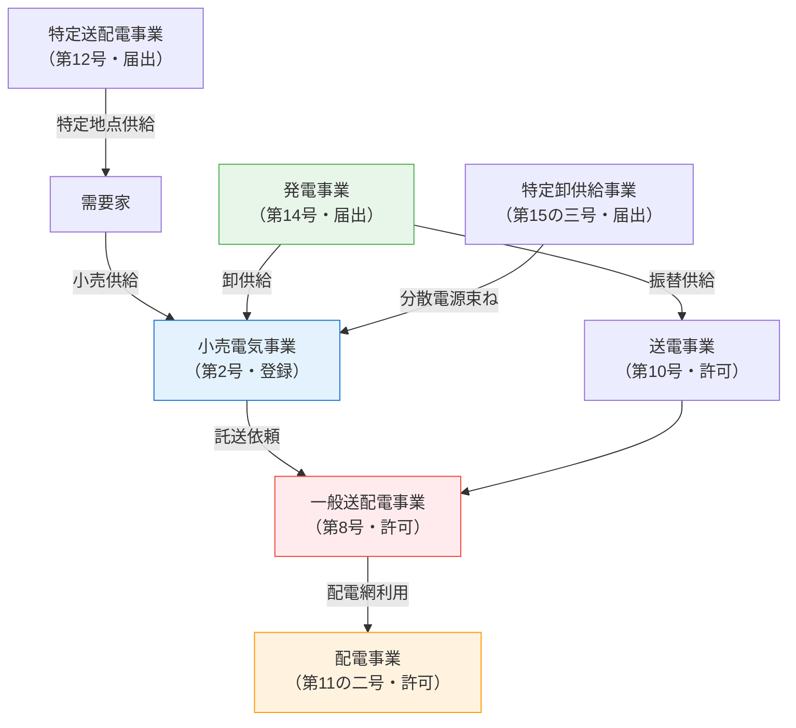

# 電気事業法 第2条 — 定義（事業類型）

!!! abstract "📊 試験対策メタ"
    - **出題頻度**: 🔥🔥（過去14年で 1 回直接出題・他条文問題の前提知識として頻出）
    - **重要度**: B（基本必須）
    - **直近出題**: R01 問1（穴埋め・電気事業の種類と許認可）
    - **典拠**: 電気事業法 第2条（eGov LawId: 339AC0000000170）
    - **照合日**: 2026-05-10
    - **隣接条文**: [第3条（小売電気事業の登録）](../../themes/jigyoho-taikei.md) ／ [第38条（電気工作物の種別）](38.md)

> 電気事業法の **出発点となる定義条文**。電気事業を **小売／一般送配電／送電／配電／特定送配電／発電／特定卸供給** の 7 類型に分類し、それぞれ別の許認可要件・規制体系を適用する基礎となる。R01 問1 で穴埋め直接出題されたほか、他条文の理解にも前提となる。

---

!!! warning "📌 注意：「電気工作物の種別（一般用／小規模事業用／自家用／事業用）」は本条ではなく [第38条](38.md)"
    本ページは **事業類型の定義**（小売電気事業・一般送配電事業 等）を扱う。
    過去のページ構成では「電気工作物の 4 区分」を本ページに含めていたが、これは **電気事業法 第38条** の規定であるため、現行は [第38条ページ](38.md) に集約している。

---

## ⚡ 5秒で思い出す

- 電気事業 = ==**小売／一般送配電／送電／配電／特定送配電／発電／特定卸供給**== の 7 類型（第16号）
- 「**小売電気事業**」（第2号）= 一般の需要に応じて電気を供給する事業 → **登録制**（第3条）
- 「**一般送配電事業**」（第8号）= 供給区域で **託送供給** と **電力量調整供給** を行う事業 → **許可制**
- 「**配電事業**」（第11の二号）= 配電用工作物で供給区域内の託送供給を行う事業（2022年改正で新設）
- 「**電気工作物**」（第18号）= 発電・蓄電・変電・送電・配電または電気の使用のために設置する機械・器具・ダム・水路・貯水池・電線路 その他の工作物

??? question "セルフチェック: なぜ一般送配電事業は『許可』で、小売電気事業は『登録』なのか？"
    **許認可の厳しさは事業のインフラ性で決まる。一般送配電事業は供給区域を独占し送配電網という公共インフラを担うため、参入を行政が事前審査する『許可』。小売電気事業は需要家に電気を売るだけで代替がきくため、要件を満たせば原則受理される『登録』で足りる。**

    - したがって一般送配電事業＝==**許可**==、小売電気事業＝==**登録**==。R01 問1 の (オ) は「許可」が正解。
    - 同じ発想で、送電・配電事業（インフラを伴う）も許可、特定送配電・発電・特定卸供給（インフラ性が低い）は届出。「インフラ性が高いほど厳しい許認可」で3階層を導ける。

??? question "セルフチェック: 「配電事業」と「一般送配電事業」の違いは？"
    両者とも **供給区域** で **託送供給と電力量調整供給** を行う事業だが、**一般送配電事業** は送電用＋配電用の両方の電気工作物を持つ広域の事業者（旧来の電力会社の送配電部門）、**配電事業**（2022年改正新設）は **配電用** 電気工作物に特化した地域限定型の事業者。

??? question "セルフチェック: 自家消費する太陽光は本条の「電気事業」に該当するか？"
    **該当しない**。本条の 7 事業類型は **他者への供給** や **託送** が前提。自家用の発電は「電気事業」ではなく、設備としては [第38条](38.md) の **自家用電気工作物 / 小規模事業用電気工作物** の規制を受ける。

---

## 📋 条文の概要

| 項目 | 内容 |
|------|------|
| 条文 | 電気事業法 第2条 |
| 規定内容 | 電気事業の事業類型（7類型）と関連用語（電気工作物・電気事業者 等）の定義 |
| 性格 | 定義規定（用語定義のみ・実体規制なし） |
| 関連 | 第3条（小売電気事業の登録）／第38条（電気工作物の種別）／第42条以降（保安規制） |
| 改正 | 2016年（小売全面自由化）／2020年（送配電分離）／2022年（配電事業新設） |

---

## 🏷️ 7つの電気事業類型（第16号）

電気事業法では、**電気事業 = 以下の 7 類型** と定義されている（第16号）。それぞれ別の許認可要件と規制が適用される。

| # | 事業類型 | 第N号 | 一言で言うと | 許認可 |
|---|---------|------|-------------|-------|
| 1 | **小売電気事業** | 第2号 | 一般の需要家に電気を売る事業 | ==登録== |
| 2 | **一般送配電事業** | 第8号 | 供給区域で託送・電力量調整を行う（旧電力会社の送配電部門） | ==許可== |
| 3 | **送電事業** | 第10号 | 送電用工作物で一般送配電/配電事業者に振替供給 | ==許可== |
| 4 | **配電事業** | 第11の二号 ⚡新設 | 配電用工作物で供給区域内の託送・電力量調整を行う | ==許可== |
| 5 | **特定送配電事業** | 第12号 | 特定の供給地点で小売供給または託送供給を行う | ==届出== |
| 6 | **発電事業** | 第14号 | 発電等用電気工作物で電気を発電・放電する事業 | ==届出== |
| 7 | **特定卸供給事業** | 第15の三号 ⚡新設 | 一定の供給能力を持ち卸供給を行う事業（アグリゲーター） | ==届出== |

!!! tip "暗記の核心：許認可の3階層"
    - ==**登録**==：小売電気事業（第3条）
    - ==**許可**==：一般送配電事業 / 送電事業 / 配電事業（送配電インフラを伴うもの）
    - ==**届出**==：特定送配電事業 / 発電事業 / 特定卸供給事業

    「インフラ性の高い事業ほど厳しい許認可」と覚える。R01 問1 の (オ) は「許可」が正解。

---

## 📜 主要な定義（逐語要約）

!!! note "出典: 電気事業法 第2条第1項（eGov LawId 339AC0000000170・2026-05-10 照合）"

### 第2号：小売電気事業

> **小売供給** を行う事業（一般送配電事業、特定送配電事業及び発電事業に該当する部分を除く）

- 「小売供給」（第1号）= **一般の需要に応じ電気を供給すること**
- 全面自由化（2016年）以降、登録制で参入可能になった
- 第3条で **登録** が義務付けられる

### 第8号：一般送配電事業

> 自らが維持し、及び運用する **送電用及び配電用** の電気工作物により **その供給区域** において **託送供給及び電力量調整供給** を行う事業

- 旧来の一般電気事業者（東京電力等）の送配電部門が分社化した事業者
- 供給区域 = エリア独占（東京電力PG・関西電力送配電 等）
- **許可** が必要

### 第10号：送電事業

> 自らが維持し、及び運用する **送電用** の電気工作物により **一般送配電事業者又は配電事業者** に振替供給を行う事業

- 送電に特化した事業（電源開発 等）
- 一般送配電・配電事業者「に」供給する点が特徴

### 第11の二号：配電事業（2022年改正新設）

> 自らが維持し、及び運用する **配電用** の電気工作物により **その供給区域** において **託送供給及び電力量調整供給** を行う事業

- 2022年改正で新設された類型
- 一般送配電事業者から配電網の譲渡・貸与を受け、地域限定で配電サービスを行うことを想定（マイクログリッド等）

### 第12号：特定送配電事業

> 自らが維持し、及び運用する **送電用及び配電用** の電気工作物により **特定の供給地点** において **小売供給又は託送供給** を行う事業

- 特定地点限定（工業団地・大型施設等）で送配電を行う
- 「供給区域」ではなく「特定の供給地点」がキーワード

### 第14号：発電事業

> 自らが維持し、及び運用する **発電等用電気工作物** を用いて電気を発電し、又は放電する事業

- 「放電」が含まれる点に注意（蓄電池からの放出も発電事業）
- 卸電力市場に売電する事業者が主に該当

### 第15の三号：特定卸供給事業（近年新設）

> **特定卸供給** を行う事業であつて、その供給能力が経済産業省令で定める要件に該当するもの

- いわゆる「アグリゲーター」の制度化
- 分散電源を束ねて卸供給する事業者

### 第16号：電気事業

> **小売電気事業、一般送配電事業、送電事業、配電事業、特定送配電事業、発電事業及び特定卸供給事業** をいう

- 上記 7 類型を総称して「電気事業」と呼ぶ
- 本条が **電気事業法全体の射程** を画定する

### 第18号：電気工作物

> **発電、蓄電、変電、送電若しくは配電又は電気の使用** のために設置する **機械、器具、ダム、水路、貯水池、電線路** その他の工作物

- 電気事業法の規制対象となる「モノ」の概念定義
- **「蓄電」** が含まれる（蓄電池・蓄電所も電気工作物）
- ダム・水路・貯水池まで含む（水力発電インフラ）

!!! warning "「電気工作物」の概念定義（第18号）と「電気工作物の種別」（第38条）は別物"
    - **第2条第18号**：何を「電気工作物」と呼ぶか（**概念**の定義）
    - **第38条**：電気工作物を **一般用 / 小規模事業用 / 自家用 / 事業用** に **区分** する規定（**種別**の定義）
    
    試験では両者が混同されやすい。**「種別の判定（600V・50kW・10kW 等）」は第38条** で扱う。詳細は [第38条ページ](38.md) を参照。

---

## 🔗 事業類型の関係マップ

---

## 🕳️ 頻出落とし穴

1. 🔴 **「第2条 = 電気工作物の種別」と覚える** → 種別（一般用/自家用/小規模事業用/事業用）は [第38条](38.md)。本条は **事業類型** の定義
2. 🔴 **「小売電気事業は許可制」と誤解** → ==**登録制**==（第3条）。一般送配電事業が **許可制**
3. 🔴 **「一般送配電 = 一般電気事業者」と覚える** → 「一般電気事業者」は2016年改正前の旧名称。現在は **一般送配電事業者**
4. 🟡 **「発電事業」と「自家発電」を混同** → 発電事業は **卸供給目的の事業**。自家消費目的の発電は「電気事業」ではない
5. 🟡 **「電気工作物」概念定義（第18号）に「蓄電」が含まれることを見落とす** → 蓄電池・蓄電所も電気工作物。穴埋めで「発電・○○・変電・送電…」と問われたら ==**蓄電**== が入る
6. 🟢 **「配電事業」を見落とす** → 2022年改正新設の比較的新しい類型。R08以降の改正反映出題に注意

---

## 📝 穴埋め過去問チャレンジ

!!! tip "学習ラダー方式（Why→What→How）"
    暗記前に **「なぜ7類型で許認可が違うか」（Step1: 理解）** をつかむ → **R01問1の実問題で構造確認（Step2）** → **7事業類型×手続の射程区別（Step3: 応用）** へ段階接続。Step1で「インフラ性の濃度」を理解できていれば、登録・許可・届出の振り分けが語呂に頼らず導ける。

!!! abstract "問題1【Step1: 理解】なぜ事業類型ごとに「登録／許可／届出」が違うか"
    電気事業法は7類型を「登録／許可／届出」の3階層に振り分けている（本ページ「暗記の核心：許認可の3階層」参照）。なぜ全部を「届出」で済ませず、わざわざ3階層に分けているのか、**事業の物理的・経済的特性** から理由を1つ挙げよ。

??? success "解答 1"
    **インフラの代替不可能性・公益性の濃度** に応じて参入規制の強度を変えるため。

    **なぜ重要か**:

    - 「許可」が課される事業（一般送配電・送電・配電）は **物理的な独占性** を持つ。送配電網は重複敷設が非現実的で、参入を厳格に審査しないと社会基盤が機能しない。
    - 「登録」が課される事業（小売電気事業）は **多数の需要家との契約責任** が発生するため、業者の適格性（供給能力等）を事前確認する必要がある。
    - 「届出」で済む事業（発電・特定卸供給・特定送配電）は **市場原理で代替可能** か影響範囲が限定的。事前審査の社会コストが見合わない。
    - つまり「インフラ性が高い順 → 許可 → 登録 → 届出」という一直線の論理。Step2 のR01問1 (オ) が「許可」になるのも、一般送配電事業が **エリア独占の物理インフラ** だから。

!!! abstract "問題2【Step2: 構造確認】R01 問1 — 電気事業法に基づく電気事業（denken-ou.com 出典）"
    次の文章は「電気事業法」に基づく電気事業に関する記述である。空欄に入る語句を答えよ。

    > a. 「小売供給」とは、<mark>（ア）</mark>の需要に応じ電気を供給することをいい、小売電気事業を営もうとする者は、経済産業大臣の<mark>（イ）</mark>を受けなければならない。小売電気事業者は、正当な理由がある場合を除き、その小売供給の相手方の電気の需要に応ずるために必要な<mark>（ウ）</mark>能力を確保しなければならない。
    >
    > b. 「一般送配電事業」とは、自らが維持し、及び運用する送電用及び配電用の電気工作物によりその供給区域において<mark>（エ）</mark>供給及び電力量調整供給を行う事業をいい、その事業を営もうとする者は、経済産業大臣の<mark>（オ）</mark>を受けなければならない。

??? success "解答 2"
    | 空欄 | 正答 |
    |------|------|
    | （ア） | ==一般== |
    | （イ） | ==登録== |
    | （ウ） | ==供給== |
    | （エ） | ==託送== |
    | （オ） | ==許可== |

    **読み解きポイント：**

    - （ア）「**一般**の需要に応じ」= 第1号「小売供給」の定義そのまま
    - （イ）小売電気事業 = ==**登録**==（第3条）。許可ではない
    - （ウ）「**供給能力**の確保義務」= 第2条の12（小売電気事業者の義務）
    - （エ）一般送配電事業 = **託送供給** + 電力量調整供給（第8号）
    - （オ）一般送配電事業 = ==**許可**==（小売電気事業の「登録」と区別）

    Step1で「インフラ性の濃度＝規制強度」を理解していれば、(イ)登録／(オ)許可は「小売は契約適格性審査だから登録」「一般送配電はエリア独占インフラだから許可」と論理的に振り分けられる。

    **出典**: [denken-ou.com 法規R元年問1](https://denken-ou.com/houkir1-1/)

!!! abstract "問題3【Step3: 応用】7事業類型 × 許認可の射程区別"
    次の事業類型と必要な許認可手続の組合せのうち、**誤っているもの** はどれか。

    1. 小売電気事業 — 登録
    2. 一般送配電事業 — 許可
    3. 配電事業 — 届出
    4. 発電事業 — 届出
    5. 特定卸供給事業 — 届出

??? success "解答 3"
    **正解（誤り） = (3)**

    **理由（3階層の射程）**:

    | 階層 | 該当事業 | 規制根拠 |
    |------|---------|---------|
    | **許可**（最厳格） | 一般送配電事業（第8号）／送電事業（第10号）／**配電事業（第11の二号）** | 送配電インフラを伴い物理的代替不可 |
    | **登録**（中間） | 小売電気事業（第2号） | 多数需要家との契約責任・供給能力確保義務 |
    | **届出**（最簡素） | 特定送配電事業（第12号）／発電事業（第14号）／特定卸供給事業（第15の三号） | 市場代替可能か影響範囲限定 |

    - **(3) は配電事業 = 許可**（2022年改正で新設）。届出と誤読する罠が頻出。配電事業は **配電用工作物で供給区域内託送** を行う事業で、一般送配電・送電と同じく「許可」レベル。
    - **覚え方**: 「**送配電インフラを持つ3つは許可**（一般送配電・送電・配電）」「小売は登録1つだけ」「残り3つ（特定送配電・発電・特定卸供給）が届出」と階層で整理。
    - 「届出」と「登録」を取り違える誤答も頻出。**登録 = 適格性審査あり**、**届出 = 単純な事実通知** の違いを意識する（→ [jiko-3 の問題4](../other/jiko-3.md) で「報告 vs 届出」の射程区別も併せて確認できる）。

---

## ⚠️ まぎらわしい選択肢と正解の違い

| 選択肢の表現 | 正誤 | 正しい理解 |
|-------------|------|----------|
| 小売電気事業を営むには経済産業大臣の許可が必要 | ❌ | ==**登録**==（第3条）。許可は一般送配電事業 |
| 一般送配電事業は届出制である | ❌ | ==**許可**==。届出は発電事業・特定送配電事業・特定卸供給事業 |
| 配電事業は2016年改正で新設された | ❌ | ==**2022年改正**== で新設（第11の二号） |
| 電気工作物には蓄電のための設備は含まれない | ❌ | 第18号で「**発電、蓄電**、変電、送電若しくは配電…」と明記 |
| 自家消費目的の発電も「発電事業」に該当する | ❌ | 発電事業は **電気事業** の一類型（卸供給目的）。自家消費は電気事業ではない |
| 第2条で電気工作物が一般用・自家用に区分される | ❌ | 区分は ==**第38条**==。第2条は概念定義のみ（第18号） |

---

## 📝 過去問実績

| 年度 | 問 | 形式 | 論点 | 出典 |
|------|-----|------|------|------|
| R01 | 問1 | 穴埋め ✅ | 小売電気事業（登録）／一般送配電事業（許可・託送供給） | [denken-ou.com](https://denken-ou.com/houkir1-1/) |

!!! note "R08 出題予測"
    第2条そのものの直接出題は R01 以外少ないが、**他条文の問題（保安規程・主任技術者・工事計画 等）の前提知識** として常時必要。
    
    **出題パターン予測**:
    
    - **穴埋め**: 「小売電気事業＝登録」「一般送配電事業＝許可」「託送供給」等の対応
    - **正誤**: 配電事業（2022年新設）の定義／特定卸供給事業（アグリゲーター）の位置づけ
    - **改正反映**: 配電事業・特定卸供給事業の新設は今後 5 年程度の出題候補

---

## 🔗 関連ページ

- [電気事業法の体系](../../themes/jigyoho-taikei.md) — 第2条を起点とした電気事業法全体の構造
- [電気事業法 第38条](38.md) — **電気工作物の種別**（一般用 / 小規模事業用 / 自家用 / 事業用）
- [保安規程 第42条](42.md) — 事業用電気工作物の保安規程
- [主任技術者 第43条](43.md) — 事業用電気工作物の主任技術者選任義務
- [法令改正一覧](../../reference/hourei-kaisei.md) — 配電事業（2022年）等の改正情報

---

## ✅ 最終チェック

**事業類型（7類型）**

- [ ] 7 つの事業類型（小売／一般送配電／送電／配電／特定送配電／発電／特定卸供給）を即答できる
- [ ] 各類型の許認可（登録／許可／届出）の3階層を区別できる
- [ ] 「**小売 = 登録**」「**一般送配電 = 許可**」を確実に覚えている

**用語の定義**

- [ ] 「小売供給」=「一般の需要に応じ電気を供給すること」（第1号）
- [ ] 「一般送配電事業」の核心 =「供給区域における **託送供給と電力量調整供給**」
- [ ] 「電気工作物」（第18号）に **蓄電** も含まれる

**第38条との切り分け**

- [ ] 本条（第2条）= **事業類型の定義**、第38条 = **電気工作物の種別判定**
- [ ] 600V・10kW・50kW などの数値判定は **第38条** の論点であり本条ではない

---

*最終確認: 2026-05-10 | ステータス: v3.0（Phase A緊急修正・第2条本来の事業類型定義に書き直し） | [バージョニング基準](../../reference/versioning.md)*

---

## 📜 監修ログ

- **2026-05-10 v3.0**: Phase A 緊急修正：第2条と第38条の取り違え訂正・事業類型定義の正記事に書き直し（旧 v1.x は第38条相当の内容を本ページに掲載していた誤記事。eGov LawId 339AC0000000170 の Article Num="2" を一次ソース照合し、7事業類型・許認可3階層・電気工作物の概念定義（第18号）を本来の主役級内容として再構成。種別判定（一般用/自家用/小規模事業用/事業用・600V/10kW/50kW）は [第38条](38.md) へ誘導）
- **2026-05-07 v1.1**（旧）: KAISEI-2022-001対応。4区分体系に全面改訂（※後日、本ページが扱うべき条文ではないことが判明し v3.0 で全面書き直し）
- **2026-04-20 v1.0**（旧）: 初版（※第38条相当の内容を誤って第2条として執筆していた）
