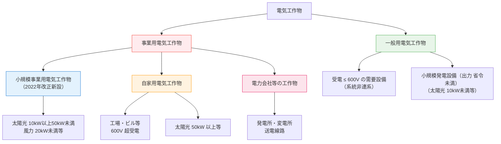
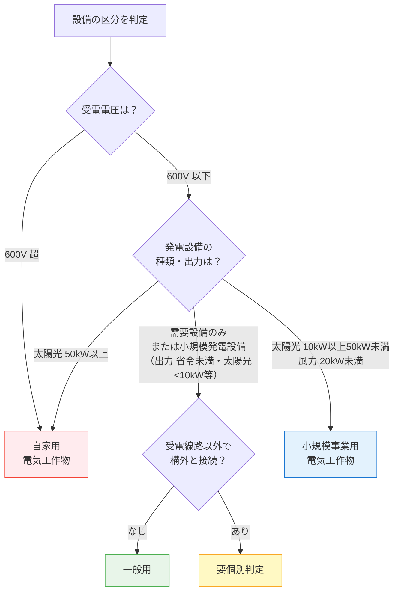

# 電気事業法 第38条 — 電気工作物の定義と分類

!!! abstract "📊 試験対策メタ"
    - **出題頻度**: 🔥🔥🔥（過去14年で 5 回以上出題）
    - **重要度**: A（重要必須）
    - **直近出題**: R06下 問1（穴埋め・一般用の定義）

> H30（問1・問2）で集中出題。2022年改正で「小規模事業用電気工作物」新設。R05以降は改正後の4区分体系から出題。

!!! warning "法令改正あり — [KAISEI-2022-001](../../reference/hourei-kaisei.md#kaisei-2022-001)"
    **2022年（令和4年）改正 / 施行: 令和5年3月20日**  
    ① 「小規模事業用電気工作物」（第3項）新設  
    ② 太陽光の一般用上限: ==**50kW未満 → 10kW未満**==  
    ③ 条文構造: 3項 → 4項  
    詳細は[法令改正一覧](../../reference/hourei-kaisei.md)を参照。

---

## ⚡ 5秒で思い出す

- 電気工作物は ==**「一般用」「小規模事業用」「自家用（事業用）」「電力会社等」**== の **4区分**
- 一般用 = 受電 600V 以下＋小規模発電設備（太陽光 **10kW 未満**など・出力が省令未満）
- **小規模事業用** = 太陽光 10kW以上50kW未満・風力 20kW未満など（==2022年改正新設==）
- 自家用 = 事業用のうち、電力会社設備以外のもの（工場・ビル等 600V超、太陽光 50kW以上等）
- 小規模事業用は保安規程・主任技術者 **不要** ← ひっかけ頻出

!!! warning "旧テキスト・旧知識に注意"
    2022年改正（令和5年3月20日施行）前のテキストでは「太陽光 50kW未満 = 一般用」と記載されている場合がある。  
    ==現行法では「太陽光 10kW未満 = 一般用」「太陽光 10kW以上50kW未満 = 小規模事業用」==

??? question "セルフチェック: 受電電圧 6,600V の工場はどの区分？"
    **自家用電気工作物（事業用）**。600V を超える需要設備は事業用。「自家用 ≠ 発電事業」であることを確認。

---

## 📋 条文の概要

| 項目 | 内容 |
|------|------|
| 対象条文 | 電気事業法 第38条（4項構成） |
| 第1項 | 「一般用電気工作物」の定義（第一号・第二号・第三号） |
| 第2項 | 「事業用電気工作物」の定義（一般用以外のすべて） |
| 第3項 | 「小規模事業用電気工作物」の定義（==2022年改正新設==） |
| 第4項 | 「自家用電気工作物」の定義（旧第3項） |
| 実務影響 | ==自社設備がどの区分かで法的義務が激変== |
| 典拠 | eGov法令検索「電気事業法（昭和39年法律第170号）」第38条 |
| 照合日 | 2026-05-10（eGov法令API v1） |
| 隣接条文 | 第39条（技術基準適合維持義務）／第42条（保安規程）／第43条（主任技術者）／第48条（工事計画届出） |

---

## 📊 電気工作物の分類体系（現行・4区分）

---

## 🎯 一般用電気工作物の定義（第1項）

==**「受電電圧が 600V 以下」**== の需要設備、または ==**「小規模発電設備（出力 省令未満）」**== に該当するもの

| 区分 | 内容 | 該当判定 |
|------|------|----------|
| **需要設備** | 受電地点の電圧が 600V 以下かつ系統非連系 | 200V・400V が典型 |
| **小規模発電設備（出力 省令未満）** | 出力が経済産業省令で定める出力未満の発電（太陽光 10kW未満等） | 条件あり（出力種類ごと） |

!!! tip "暗記の核心：「一般用の判定フロー」"
    1. ==受電電圧を確認== → 600V 以下 → 一般用（暫定）
    2. 発電設備あり → 出力確認 → ==太陽光 10kW未満==(一般用) / ==10kW以上50kW未満==(小規模事業用)
    3. ==受電線路以外で構外と接続されていない== ことが一般用の必須条件

**区分判定フローチャート（現行・2022年改正後）:**

---

## 📏 発電設備の出力基準（施行規則第48条・2022年改正後）

### 一般用電気工作物（小規模発電設備・出力 省令未満）の上限

| 発電種類 | 出力上限 | 変更状況 |
|---------|---------|----------|
| 太陽電池発電 | ==**10kW 未満**== | ~~50kW未満~~ → **2022年改正で変更** |
| 風力発電 | 「要確認」 | 20kW未満が小規模事業用に移行の可能性あり |
| 水力発電 | ==**20kW 未満**== | （改正対象外） |
| 内燃力発電 | ==**10kW 未満**== | （改正対象外） |
| 燃料電池発電 | ==**10kW 未満**== | （改正対象外） |

### 小規模事業用電気工作物（小規模発電設備）の対象範囲

| 発電種類 | 出力範囲 | 旧分類 |
|---------|---------|--------|
| 太陽電池発電 | ==10kW 以上 50kW 未満== | 旧・一般用（50kW未満）の一部 |
| 風力発電 | ==20kW 未満== | 旧・一般用（20kW未満）から移行 |

!!! warning "太陽光の区分が3段階になった（重要）"
    | 出力 | 区分 | 保安規程 | 主任技術者 |
    |------|------|----------|------------|
    | ==10kW 未満== | **一般用** | 不要 | 不要 |
    | ==10kW以上 50kW未満== | **小規模事業用** | ==不要== | ==不要== |
    | ==50kW 以上== | **自家用（事業用）** | **必要** | **必要** |

??? question "セルフチェック: 太陽光 30kW の発電設備はどの区分？"
    **小規模事業用電気工作物**（2022年改正後）。旧法では一般用だったが、現行法では 10kW以上50kW未満の太陽光は小規模事業用。保安規程・主任技術者は不要だが、届出・使用前自己確認が義務。

??? question "セルフチェック: 太陽光 50kW の発電設備はどの区分？"
    **自家用電気工作物**。50kW **以上**は自家用。「未満」に注意。49kWなら小規模事業用、50kWは自家用。

---

## 🆕 小規模事業用電気工作物（第3項・2022年改正新設）

> **小規模事業用電気工作物** = **事業用電気工作物のうち、小規模発電設備であって出力が省令で定める出力以上のもの**

- **施行日**: ==令和5年3月20日（2023年3月20日）==
- **根拠**: 電気事業法 第38条 第3項（2022年改正新設）
- **対象**: 太陽光 10kW以上50kW未満、風力 20kW未満 等

### 3つの新義務

| 義務 | 内容 | 根拠 |
|------|------|------|
| ==技術基準適合維持== | 設備を技術基準に適合させる義務（第39条） | 事業用として適用拡大 |
| ==基礎情報の届出== | 設備基本情報を産業保安監督部長へ届出 | 新設 |
| ==使用前自己確認の届出== | 使用前に自ら安全確認し届出 | 新設 |

!!! note "保安規程・主任技術者は **不要** — ここがひっかけ"
    小規模事業用は「事業用電気工作物」に含まれるが、**保安規程の策定・届出（第42条）と主任技術者の選任（第43条）は適用されない**。  
    「事業用 = 必ず主任技術者が必要」という誤解に注意。

!!! example "改正の背景"
    再生可能エネルギー（特に住宅・農地等の小規模太陽光）の普及により、従来の「一般用電気工作物」（無規制）では保安管理が不十分な設備が増加。  
    新たに「小規模事業用」区分を設けて保安規制の網をかけた。

---

## 🔴 事業用電気工作物の定義（第2項）

> **事業用電気工作物** = **一般用電気工作物以外のすべての電気工作物**

つまり：
- ==受電電圧が 600V を超える== 需要設備
- 太陽光 10kW 以上の発電設備（小規模事業用 または 自家用に分類）
- 発電所・変電所等の電力会社設備

!!! note "事業用の内訳"
    1. 小規模事業用電気工作物（第3項）
    2. 自家用電気工作物（第4項）
    3. 電力会社等の工作物

---

## 📍 自家用電気工作物の位置づけ（第4項）

> **自家用電気工作物** = **事業用電気工作物のうち、電力会社等（一般送配電・送電・特定送配電・発電事業者）の工作物以外のもの**

**包含関係**: 自家用 ⊂ 事業用（==自家用は事業用の一部==）

| 対象 | 例 | 保安責任者 |
|------|-----|----------|
| 自家用 | 工場・ビル・病院・学校（600V 超受電） | ==電気主任技術者（第43条）== |
| 自家用 | 出力 50kW 以上の太陽光発電所（自営） | 電気主任技術者（第43条） |
| 電力会社設備 | 発電所・変電所・送電線路 | 一般電気事業者の技術者 |

---

## 📊 四区分の詳細比較（現行・2022年改正後）

| 比較項目 | 一般用 | ==小規模事業用== | 自家用 | 電力会社等 |
|---------|-------|------------|-------|----------|
| 定義 | 600V以下需要設備＋小規模発電設備（出力 省令未満） | 小規模発電設備（出力 省令以上）：太陽光10-50kW、風力<20kW等 | 事業用のうち電力会社以外 | 電気事業者の設備 |
| 具体例 | 住宅・小規模店舗・小型太陽光 | 住宅・農地の大きめ太陽光 | 工場・ビル・病院（600V超） | 発電所・変電所 |
| 技術基準適合 | 不要 | ==**必要**== | **必要** | 必要 |
| 基礎情報届出 | 不要 | ==**必要（新設）**== | — | — |
| 使用前自己確認 | 不要 | ==**必要（新設）**== | — | — |
| 保安規程 | ==不要== | ==**不要**== | **必要**（第42条） | 必要 |
| 主任技術者 | ==不要== | ==**不要**== | **必要**（第43条） | 必要 |
| 工事計画届出 | 不要 | 不要 | 一部必要（第48条） | 必要（第47条） |
| 定期調査 | 電力会社実施（第57条） | なし（自己確認のみ） | 自主保安 | 国の検査 |

!!! tip "この表の読み方"
    左から右へ規制が厳しくなる。自社設備の区分で法的義務がすべて決まる。  
    **2022年改正のポイント**: 小規模事業用は自家用より義務が軽い「中間カテゴリ」。

---

## 🔬 原文解析（第38条 第1項 第一号・第二号）

!!! note "出典: 電気事業法 第38条（令和5年3月20日施行の改正後・eGov現行条文 照合日 2026-05-10）"
    以下は 第1項 の各号の要素分解。試験では「空欄に入る語句」として問われる箇所が多い。  
    現行条文では**第一号＝需要設備系**・**第二号＝発電設備系（イ・ロの号建て）**で構成される。

### 第一号（需要設備 = 受電して使う側）

> 電気を使用するための電気工作物であつて、**低圧受電電線路**（当該電気工作物を設置する場所と同一の構内において**低圧の電気**を他の者から受電し、又は他の者に受電させるための電線路をいう。次号ロ及び第三項第一号ロにおいて同じ。）**以外の電線路**によりその構内以外の場所にある電気工作物と電気的に**接続されていない**もの

| 要素 | 内容 | 試験ポイント |
|------|------|------------|
| 受電電圧 | 「低圧」（経済産業省令で定める電圧以下＝低圧＝600V以下） | ==「以下」== — 600Vちょうどは一般用 |
| 設備の性格 | 電気を使用するための工作物（需要設備） | 発電設備ではなく需要設備 |
| 系統非連系条件 | ==低圧受電電線路以外の電線路で構外の電気工作物と接続されていない== | ==「接続されていない」==が穴埋め候補 |

### 第二号（小規模発電設備・イ／ロ号建て）

> **小規模発電設備**であつて、次のいずれにも該当するもの  
> **イ** 出力が経済産業省令で定める出力**未満**のものであること。  
> **ロ** **低圧受電電線路以外の電線路**によりその構内以外の場所にある電気工作物と電気的に**接続されていない**ものであること。

| 要素 | 内容 | 試験ポイント |
|------|------|------------|
| 主語 | ==小規模発電設備==（=低圧の電気に係る発電用の電気工作物で省令で定めるもの） | 現行条文の唯一の用語。「小出力発電設備」は**旧用語**（後述） |
| イ（出力基準） | 省令で定める出力**未満**（太陽光なら 10kW未満等） | ==「未満」== — ちょうど10kWは第3項（小規模事業用）行き |
| ロ（系統非連系条件） | ==低圧受電電線路以外の電線路で構外と接続されていない== | 第一号と同じ表現（両号で共通） |

!!! info "第3項（小規模事業用）との関係 — 同じ「小規模発電設備」を出力で振り分け"
    - 第1項第二号イ：出力が省令で定める出力**未満** → **一般用**
    - 第3項第一号イ：出力が「第一項第二号イの経済産業省令で定める出力」**以上** → **小規模事業用**
    - 用語はどちらも ==「小規模発電設備」== で共通。**閾値の上下（未満／以上）で区分が分かれる**構造。

!!! warning "「小出力発電設備」は旧用語（2022年改正前の表現）"
    - **2022年改正前**（〜令和5年3月19日）の条文では「**小出力発電設備**」という用語が使われていた。
    - **2022年改正（令和5年3月20日施行）以降**は「**小規模発電設備**」に統一され、「小出力発電設備」は**現行法に存在しない**。
    - 旧テキスト・古い解説サイトに「小出力発電設備」と書かれている場合は **2022年改正前の記述**。現行条文では一般用・小規模事業用ともに「小規模発電設備」が正。

---

## 🕳️ 頻出落とし穴（現行法対応版）

1. 🔴 **「太陽光 50kW未満 = 一般用」（旧知識）** → ==現行法では「10kW未満 = 一般用」「10-50kW = 小規模事業用」==
2. 🔴 **「600V 以上」と「600V 超」の混同** → 一般用の上限は ==「600V 以下」==。600Vちょうどは一般用
3. 🔴 **「事業用 = 主任技術者が必要」** → ==小規模事業用は主任技術者・保安規程が不要==
4. 🔴 **「小出力発電設備」と書かれた選択肢** → 現行法には**存在しない旧用語**（2022年改正前）。現行は一般用も小規模事業用もどちらも ==「小規模発電設備」==、出力の閾値（省令未満／省令以上）で区分
5. 🟡 **自家用と発電を結びつける** → 自家用は受電もカウント。発電がなくても 600V 超で自家用
6. 🟡 **「事業用 ⊃ 自家用」と逆に覚える** → 正しくは **自家用 ⊂ 事業用**（自家用は事業用の一部）
7. 🟡 **小規模事業用の届出義務を自家用と混同** → 自家用は保安規程・主任技術者 / 小規模は届出・使用前自己確認

---

## 📝 穴埋め過去問チャレンジ

!!! abstract "過去問ベースの穴埋め（R06下 問1 型・電気工作物の区分問題）"
    次の文章の空欄に入る語句の組合せとして正しいものを選べ。

    > 電気工作物は <mark>（ア）</mark> 電気工作物と <mark>（イ）</mark> 電気工作物に区分される。
    > 受電電圧が <mark>（ウ）</mark> V以下の需要設備であって、小規模発電設備（出力が省令で定める出力未満）に該当するものは <mark>（ア）</mark> 電気工作物である。

??? success "解答を見る"
    | 空欄 | 正答 |
    |------|------|
    | （ア） | ==一般用== |
    | （イ） | ==事業用== |
    | （ウ） | ==600== |

    **読み解きポイント：**

    - （ア）（イ）は「一般用」と「事業用」の二分（順序に注意）
    - （ウ）600V。「以下」— 600Vちょうどは一般用
    - 「小規模発電設備（出力 省令未満）に該当するもの」= 太陽光なら 10kW未満等

---

## ⚠️ まぎらわしい選択肢と正解の違い（現行法対応版）

| 選択肢の表現 | 正誤 | 正しい理解 |
|-------------|------|----------|
| 事業用電気工作物とは電力会社の設備のことである | ❌ | 事業用 = ==一般用以外のすべて==（小規模・自家用を含む） |
| 自家用電気工作物は自家発電する設備である | ❌ | 「自家用」は発電有無ではなく、==電力会社設備以外の事業用== |
| 600V以上の受電設備は事業用である | ❌ | 正しくは ==600V「超」==。600Vちょうどは一般用（以下） |
| 小規模発電設備は太陽光50kW以下である | ❌ | 正しくは ==10kW以上50kW「未満」==（小規模事業用の範囲） |
| 一般用電気工作物には発電設備を含まない | ❌ | ==小規模発電設備（出力 省令未満）==（太陽光なら10kW未満等）は一般用に含まれる |
| 小規模事業用電気工作物には保安規程が必要 | ❌ | ==保安規程・主任技術者は不要==。届出・使用前自己確認が義務 |
| 太陽光30kWは一般用電気工作物である | ❌ | 2022年改正後は ==小規模事業用==（10kW以上50kW未満） |

---

## 📝 過去問実績

| 年度 | 問 | 形式 | 論点 |
|------|-----|------|------|
| R07下 | — | — | 出題なし |
| R07上 | — | — | 出題なし |
| R06下 | 問1 | 穴埋め | 一般用電気工作物の定義 |
| R06上 | — | — | 出題なし |
| R05 | — | — | 出題なし |
| R04 | — | — | 出題なし |
| H30 | 問1 | 正誤判定 ✅ | 自家用電気工作物の定義 |
| H30 | 問2 | 正誤判定 ✅ | 太陽電池発電所等の出力上限 |
| H28 | 問1 | 正誤判定 ✅ | 自家用電気工作物に係る事業場 |
| H27 | 問1 | 正誤判定 ✅ | 自家用電気工作物の受電電圧基準 |

!!! note "R08 出題予測"
    2022年改正（令和5年3月20日施行）が試験に反映されるR05以降は、**小規模事業用電気工作物の義務（届出・使用前自己確認）** と **自家用（保安規程・主任技術者）との比較** が新出題パターン。
    
    - **区分判定問題**: 太陽光30kW/10kW/50kWの区分（旧知識との差異が狙われる）
    - **義務比較問題**: 小規模事業用 vs 自家用の義務の違い
    - **穴埋め**: 「一般用 = 600V以下かつ小規模発電設備（出力が省令で定める出力未満・太陽光なら○kW未満）」
    - **R08 出題可能性**: 高い（改正後の新体系が定着期）

---

## 🔗 関連ページ

- [電気事業法の体系](../../themes/jigyoho-taikei.md) — 第38条の位置づけ・全条文マップ
- [主任技術者 第43条](43.md) — 自家用電気工作物の主任技術者選任義務
- [保安規程 第42条](42.md) — 自家用電気工作物の保安規程作成義務
- [工事計画 第47条・第48条](47.md) — 工事認可・届出との関係
- [法令改正一覧](../../reference/hourei-kaisei.md) — 2022年（令和4年）法改正の詳細

---

## ✅ 最終チェック（2022年改正後版）

**4区分の識別**

- [ ] 電気工作物の4区分（一般用/小規模事業用/自家用/電力会社等）を即答できる
- [ ] 小規模事業用の対象（太陽光 10-50kW、風力 20kW未満等）を言える
- [ ] 自家用の定義（事業用のうち電力会社設備以外）を言える
- [ ] 包含関係（==自家用 ⊂ 事業用==）を正しく説明できる

**数値の境界（現行法）**

- [ ] 受電 ==600V以下== = 一般用 / ==600V超== = 事業用 を確実に覚えている
- [ ] 太陽光 ==10kW未満== = 一般用 / ==10kW以上50kW未満== = 小規模事業用 / ==50kW以上== = 自家用
- [ ] 「旧・太陽光 50kW未満 = 一般用」が2022年改正で変わったことを認識している

**義務の違い（試験頻出）**

- [ ] 小規模事業用: 保安規程==不要== / 主任技術者==不要== / 届出==必要== / 使用前自己確認==必要==
- [ ] 自家用: 保安規程==必要== / 主任技術者==必要==
- [ ] 「事業用なのに主任技術者不要」の例外（小規模事業用）を説明できる

**落とし穴**

- [ ] 「以下/超」「未満/以上」の区別を正確に使い分けられる
- [ ] 「小出力発電設備」は **2022年改正前の旧用語**で現行法に存在しない、現行は一般用も小規模事業用もどちらも「小規模発電設備」と呼び**出力閾値（省令未満／省令以上）で区分**することを区別できる

---

## 📝 監修ログ

- 2026-05-10 v2.1 Phase B修正：原文解析セクションの「小出力発電設備」（2022年改正前）を「小規模発電設備」（現行）に差替・イ／ロ号建て構造に整理・旧用語との二項対立解説を撤回（eGov法令API v1 で第38条全項を照合・照合日 2026-05-10）
- 2026-05-07 v2.0：4区分体系・2022年改正完全対応・初版

---

*最終確認: 2026-05-10 | ステータス: v2.1（4区分体系・2022年改正完全対応・原文現行化） | record_version: 2.1 | [バージョニング基準](../../reference/versioning.md)*
