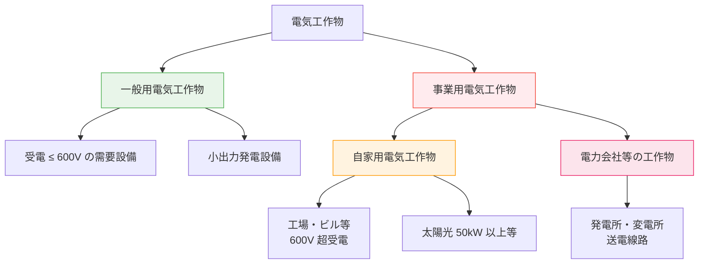
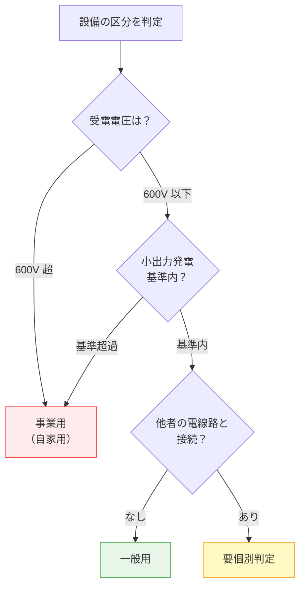

# 電気事業法 第38条 — 事業用電気工作物の定義

!!! abstract "📊 試験対策メタ"
    - **出題頻度**: 🔥🔥🔥（過去14年で 5 回出題）
    - **重要度**: A（重要必須）
    - **直近出題**: 

> H30（問1・問2）で集中出題。その後も継続的に出題される重要条文。

---

## ⚡ 5秒で思い出す

- 電気工作物は ==**「一般用」**== と ==**「事業用」**== に二分される
- 一般用 = 受電 600V 以下＋小出力発電（太陽光 50kW 未満など）
- 事業用 = 一般用以外のすべて（自家用電気工作物を包含）
- 自家用 = 事業用のうち、電力会社設備以外のもの（工場・ビル）

!!! warning "よくある誤解（先に潰す）"
    - **誤り**: 「自家用 = 自家発電している設備」
    - **正解**: 「自家用」は発電の有無ではなく、==**電力会社の設備ではない事業用設備**== のこと
    - **例**: 受電するだけの工場でも 600V 超なら自家用電気工作物

??? question "セルフチェック: 受電電圧 6,600V の工場はどの区分？"
    **事業用電気工作物（自家用電気工作物）**。600V を超える需要設備は事業用。「自家用 ≠ 発電事業」であることを確認。

---

## 📋 条文の概要

| 項目 | 内容 |
|------|------|
| 対象条文 | 電気事業法 第38条 |
| 定義内容 | 電気工作物を「一般用」「事業用」に区分 |
| 位置づけ | 保安規制の大前提（この区分で主任技術者・保安規程の義務が決まる） |
| 実務影響 | ==自社設備がどちらに属するかで法的義務が激変== |

!!! warning "ひっかけ：「600V 超」と「600V 以上」の混同"
    - **一般用の上限**: 600V ==以下==（600V ちょうどは一般用）
    - **自家用の下限**: 600V ==超==（601V 以上が自家用）
    - 試験では「600V 以上の設備は自家用」という誤答選択肢が登場
    - **600V = 一般用** / **601V 以上 = 事業用** ✅

---

## 📊 電気工作物の分類体系

---

## 🎯 一般用電気工作物の定義

==**「受電電圧が 600V 以下」**== かつ ==**「小出力発電設備（該当条件あり）」**== に該当するもの

| 区分 | 内容 | 該当判定 |
|------|------|---------|
| **受電設備** | 受電地点の電圧が 600V 以下 | 200V・400V が典型 |
| **小出力発電** | 一定出力以下の発電（太陽光等） | 条件あり（出力種類ごと） |

!!! tip "暗記の核心：「一般用の判定フロー」"
    1. ==受電電圧を確認== → 600V 以下 → 一般用（暫定）
    2. 小出力発電 ==(独立型)== は別途判定
    3. ==他の者の電線路と接続されていない== 場合は一般用対象外（例外）

**区分判定フローチャート:**

---

## 📏 小出力発電設備の出力基準（施行規則第 48 条）

==**種類によって上限値が異なる**== — 「太陽光 50kW」だけでは不完全

| 発電種類 | 出力上限 | 暗記ポイント |
|---------|---------|----------|
| 太陽電池発電 | ==**50kW 未満**== | 最も高い / 最も出題される |
| 風力発電 | ==**20kW 未満**== | 水力と同じ |
| 水力発電 | ==**20kW 未満**== | 風力と同じ（ダムを伴うものを除く） |
| 内燃力発電 | ==**10kW 未満**== | 燃料電池と同じ |
| 燃料電池発電 | ==**10kW 未満**== | 内燃力と同じ |

!!! example "典型ひっかけ選択肢"
    | ケース | 誤り | 正解 |
    |--------|------|------|
    | 太陽光 50kW | 「一般用」 | ==**事業用**== （50kW 未満ではなく 50kW 以上） |
    | 太陽光 49kW | 「事業用」 | ==**一般用**== （50kW 未満） |
    | 風力 20kW | 「一般用」 | ==**事業用**== （20kW 未満ではなく 20kW 以上） |
    | 受電 600V | 「事業用」 | ==**一般用**== （600V 以下） |

??? question "セルフチェック: 太陽光 50kW の発電設備はどの区分？"
    **事業用電気工作物**。小出力発電の上限は「50kW ==未満==」。50kW ちょうどは未満に該当しない → 事業用。49kW なら一般用。この1kWの差が合否を分ける。

---

## 🔴 事業用電気工作物の定義

> **事業用電気工作物** = **一般用電気工作物以外のすべての電気工作物**

つまり：
- ==受電電圧が 600V を超える== 需要設備
- 小出力発電基準を超える発電設備（太陽光 50kW 以上等）
- 発電所・変電所等の電力会社設備

!!! note "事業用に含まれるもの"
    1. 自家用電気工作物（自社設備）
    2. 電力会社等の工作物（より厳しい規制）

??? question "セルフチェック: 受電 600V の町工場はどの区分？"
    **一般用電気工作物**。一般用の上限は「600V ==以下==」。600V ちょうどは一般用。601V から事業用（自家用）。

---

## 📍 自家用電気工作物の位置づけ

> **自家用電気工作物** = **事業用電気工作物のうち、電力会社等の工作物以外のもの**

**つまり**: 自家用 ⊂ 事業用（==自家用は事業用の一部==）

| 対象 | 例 | 保安責任者 |
|------|-----|----------|
| 自家用 | 工場・ビル・病院・学校（600V 超受電） | ==電気主任技術者（第43条）== |
| 自家用 | 出力 50kW 以上の太陽光発電所（自営） | 電気主任技術者（第43条） |
| 電力会社設備 | 発電所・変電所・送電線路 | 一般電気事業者の技術者 |

??? question "セルフチェック: 発電設備のない 6,600V 受電の病院は自家用？"
    **自家用電気工作物**。「自家用」は発電の有無ではなく、電力会社設備以外の事業用電気工作物を指す。受電のみでも 600V 超なら自家用。

---

## 📊 三区分の詳細比較

| 比較項目 | 一般用電気工作物 | 自家用電気工作物 | 電力会社等の工作物 |
|---------|---------------|---------------|----------------|
| 定義 | 600V以下 + 小出力発電 | 事業用のうち電力会社以外 | 電気事業者の設備 |
| 具体例 | 住宅・小規模店舗 | 工場・ビル・病院（600V超受電） | 発電所・変電所・送電線路 |
| 主任技術者 | ==不要== | ==必要==（第43条） | 必要（より厳格） |
| 保安規程 | ==不要== | ==必要==（第42条） | 必要（より厳格） |
| 工事計画届出 | 不要 | 一部必要（第48条） | 必要（第47条認可） |
| 定期検査 | 調査義務（第57条） | 自主保安 | 国の検査 |

!!! tip "この表の読み方"
    左から右へ規制が厳しくなる。自社設備がどの区分かで法的義務が決まるため、区分判定は実務上も最重要。

---

## 🕳️ 頻出落とし穴

1. 🔴 **「600V 以上」と「600V 超」の混同** → 一般用の上限は ==「600V 以下」==。ちょうど 600V は一般用
2. 🔴 **「50kW 以下」と「50kW 未満」の混同** → 太陽光 50kW は事業用。「未満」を確実に覚える
3. 🔴 **自家用と発電を結びつける** → 自家用は受電もカウント。発電がなくても 600V 超で自家用
4. 🟡 **「事業用 ⊃ 自家用」と逆に覚える** → 正しくは **自家用 ⊂ 事業用**（自家用は事業用の一部）
5. 🟡 **小出力発電の「他の者の電線路と接続されていない」条件を見落とし** → 連系するとこの条件を喪失し、一般用の対象外となる場合がある

---

## 📝 穴埋め過去問チャレンジ

!!! abstract "過去問ベースの穴埋め（R06下 問1 型・電気工作物の区分問題）[要確認]"
    次の文章の空欄に入る語句の組合せとして正しいものを選べ。

    > 電気工作物は **（ア）** 電気工作物と **（イ）** 電気工作物に区分される。
    > 受電電圧が **（ウ）** V以下の需要設備であって、小出力発電設備に該当するものは **（ア）** 電気工作物である。

??? success "解答を見る"
    | 空欄 | 正答 |
    |------|------|
    | （ア） | ==一般用== |
    | （イ） | ==事業用== |
    | （ウ） | ==600== |

    **読み解きポイント：**

    - （ア）（イ）電気工作物の二分は「一般用」と「事業用」。順序を逆にした選択肢に注意
    - （ウ）600V。「以下」であることに注意（600Vちょうどは一般用）
    - 「小出力発電設備に該当するもの」が条件 — 太陽光50kW以上は小出力に該当しない

---

## ⚠️ まぎらわしい選択肢と正解の違い

| 選択肢の表現 | 正誤 | 正しい理解 |
|-------------|------|----------|
| 事業用電気工作物とは電力会社の設備のことである | ❌ | 事業用 = ==一般用以外のすべて==。電力会社設備は事業用の一部 |
| 自家用電気工作物は自家発電する設備である | ❌ | 「自家用」は発電有無ではなく、==電力会社設備以外の事業用== |
| 600V以上の受電設備は事業用である | ❌ | 正しくは ==600V「超」==。600Vちょうどは一般用（以下） |
| 小出力発電設備は太陽光50kW以下である | ❌ | 正しくは ==50kW「未満」==。50kWちょうどは事業用 |
| 一般用電気工作物には発電設備を含まない | ❌ | ==小出力発電設備==は一般用に含まれる |

---

## 📝 過去問実績

| 年度 | 問 | 形式 | 論点 |
|------|-----|------|------|
| R07下 | — | — | 出題なし |
| R07上 | — | — | 出題なし |
| R06下 | 問1 | 穴埋め | 一般用電気工作物の定義 |
| R06上 | — | — | 出題なし |
| R05 | — | — | 出題なし |
| R04 | — | — | 出題なし |
| H30 | 問1 | 正誤判定 ✅ | 自家用電気工作物の定義 |
| H30 | 問2 | 正誤判定 ✅ | 太陽電池発電所等の出力上限 |
| H28 | 問1 | 正誤判定 ✅ | 自家用電気工作物に係る事業場 |
| H27 | 問1 | 正誤判定 ✅ | 自家用電気工作物の受電電圧基準 |

!!! note "R08 出題予測"
    R06下で穴埋め形式（一般用電気工作物の定義）が出題。R07 は上下とも出題なし。
    
    - **単独出題**: 受電電圧 600V 基準の判定問題が最頻出
    - **複合出題**: 小出力発電（太陽光 50kW）の定義と組み合わせ
    - **対比出題**: 自家用 vs 一般用の区分判定（H30 問2 型）
    - **穴埋め形式**: R06下で出題実績あり。電気工作物の二分・600V 基準を穴埋めで問う
    
    **次回 R08 で出題される可能性**: 高い（R06下で復活、蓄積傾向）。穴埋め形式の再出題、または小出力発電の数値基準（風力 20kW 等）との複合問題に警戒

---

## 🔗 関連ページ

- [電気事業法の体系](../../themes/jigyoho-taikei.md) — 第 38 条の位置づけ・全条文マップ
- [主任技術者 第43条](43.md) — 自家用電気工作物の主任技術者選任義務
- [保安規程 第42条](42.md) — 自家用電気工作物の保安規程作成義務
- [工事計画 第47条・第48条](47.md) — 工事認可・届出との関係
- 施行規則 第48条 — 小出力発電の詳細定義 <!-- [要確認]: reference/shikorei-48.md は未作成 -->

---

## ✅ 最終チェック

**分類の基本**

- [ ] 電気工作物の二分（==一般用== vs ==事業用==）を即答できる
- [ ] 自家用の定義（事業用のうち電力会社設備以外）を言える
- [ ] 包含関係（==自家用 ⊂ 事業用==）を正しく説明できる

**数値の境界**

- [ ] 受電 ==600V以下== = 一般用 / ==600V超== = 事業用 を確実に覚えている
- [ ] 太陽光 ==50kW未満== = 小出力 / ==50kW以上== = 事業用 を言える
- [ ] 風力・水力（==20kW未満==）、内燃力・燃料電池（==10kW未満==）を覚えている

**落とし穴**

- [ ] 「以下/超」「未満/以上」の区別を正確に使い分けられる
- [ ] 「自家用 = 自家発電」という誤解を完全に払拭した

---

*最終確認: 2026-05-01 | ステータス: v1.2 | [バージョニング基準](../../reference/versioning.md)*
