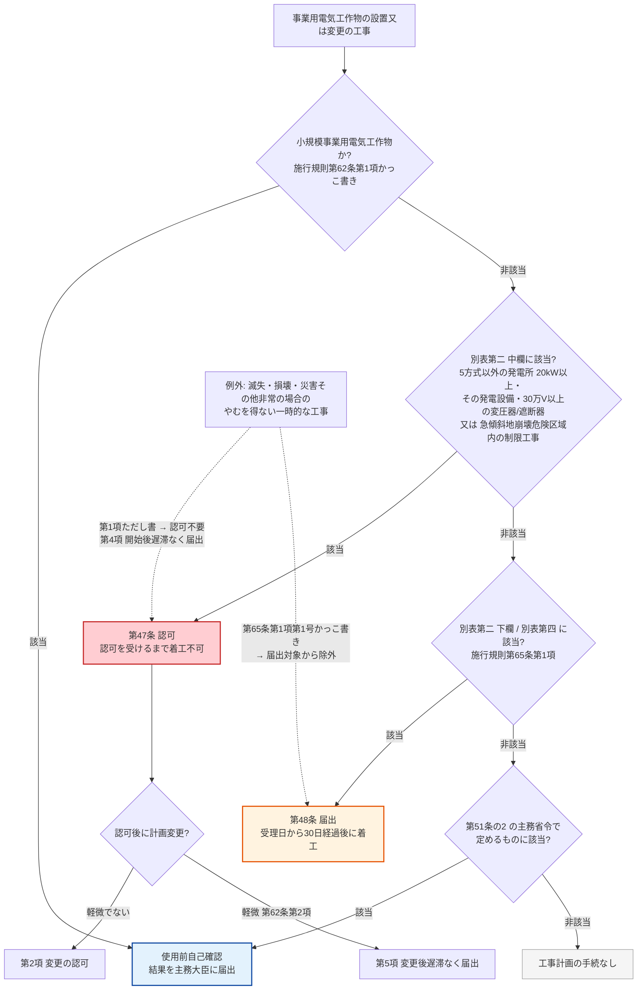

# 電気事業法 第47条 — 工事計画の認可

!!! abstract "📊 試験対策メタ"
    - **出題頻度**: —（本条帰属の出題は過去14年で 0 回）＋ 関連出題 🔥 3 回（他条文帰属の複合問題の選択肢として「認可か届出か」が登場）
    - **重要度**: B（第48条「届出」との対比で必ず出る手続規定。本条単独ではなく「認可ではなく届出が正しい」という **誤答側** として選択肢に現れる）
    - **直近出題**: —（本条帰属なし）／関連: H30 問2（SoT 帰属は第38条・選択肢 d「出力 2,000kW の太陽電池発電所は認可」が **不適切**）・H29 問10（SoT では条文未帰属・選択肢 a「2,000kW 以上の太陽光は届出＋使用前自主検査」が適切）・H25 問2（SoT 帰属は第48条・事前届出の該当判定）

> 事業用電気工作物の設置・変更の工事のうち **公共の安全の確保上特に重要なものとして主務省令で定めるもの** は、着工前に工事の計画について ==**主務大臣の認可**== を受けなければならない（第1項）。どの工事が「特に重要」かは法本文に書かれておらず、**施行規則第62条・別表第二の中欄** が決める。中欄に載るのは **水力・火力・燃料電池・太陽電池・風力以外の発電所（出力 20kW 以上）とその発電設備・大型機器** だけで、**変電所・送電線路・需要設備・太陽電池・風力・汽力火力の中欄はすべて空欄**（＝これらに認可枠は無く、規模が大きければ第48条の届出）。

| 項目 | 内容 |
|------|------|
| 条文 | 電気事業法 第47条（第3章 電気工作物／第2節 事業用電気工作物／第4款 工事計画及び検査） |
| 条文核心 | **公共の安全の確保上特に重要なものとして主務省令で定める工事 → 工事の計画について主務大臣の認可（第1項）／計画変更も認可・軽微な変更は除く（第2項）／認可基準4号（第3項）／災害等の一時的工事は開始後遅滞なく届出（第4項）／軽微な変更後の届出（第5項）** |
| 規定内容 | 工事計画の事前認可と認可基準（手続規定・法本文に数値は無い） |
| 性格 | 手続規定（認可制。届出制の第48条と対をなす） |
| 委任先 | 電気事業法施行規則 第62条（認可対象＝別表第二 **中欄**＋急傾斜地崩壊危険区域内の制限工事・軽微な変更の定義）・第63条（様式第47 認可申請書・添付書類）・第64条（様式第48 軽微変更届出書） |
| 上位・並列 | [第48条（工事計画の届出）](48.md)／[第51条（使用前自主検査）](51.md)／第51条の2（使用前自己確認）／[第39条（技術基準適合維持）](39.md)／[第38条（電気工作物の定義）](38.md) |
| **典拠（一次ソース）** | 電気事業法（昭和39年法律第170号）第47条 — e-Gov 法令API v1 `339AC0000000170`（`scripts/cache/egov-339AC0000000170.xml`・現行版 2026-08-03 施行と逐語一致）／電気事業法施行規則（平成7年通商産業省令第77号）第62〜65条・別表第二 — e-Gov 法令API v1 `407M50000400077`（現行版 2026-04-01 施行・令和7年経済産業省令第68号） |
| **照合日** | 2026-09-10（第47条 全5項・第48条を逐語照合。施行規則 第62条・第63条・第64条・第65条と別表第二の **中欄（認可）全行** および「発電所」「蓄電所」「変電所」「送電線路」「需要設備」の設置の工事行を逐語照合。e-Gov 法令API v2 沿革で 2017-04-01 版・2021-04-01 版・2022-04-01 版と現行版の第47条を diff、施行規則は 2017-04-01 版・2022-12-15 版・2023-03-20 版と現行版で第62条第1項・別表第二該当行を diff） |
| **隣接条文** | 環境影響評価関係の条（第3項第3号が参照する第46条の17 等・本文は未照合） ← 本条（47・認可） → [第48条（届出）](48.md)／第48条の2（特殊電気工作物の適合性確認）／[第51条（使用前自主検査）](51.md)／第51条の2（使用前自己確認） |
| **混同注意** | **第47条＝認可（認可を受けるまで着工不可・日数の定めなし）／第48条＝届出（受理日から30日経過後に着工可）／第51条の2＝自己確認（どちらの対象にもならない設備が使用開始前に自ら技術基準適合を確認）**。3つは「別表第二のどの欄に載るか」で振り分けられる別々の手続き |
| **H30問2 出題** | 太陽電池発電所等の設置に関する a〜d の適切・不適切の組合せ（正解 (3)）。選択肢 d「出力 2,000kW の太陽電池発電所を設置する者は…経済産業大臣の認可を受けなければならない」が **不適切**（正しくは第48条の届出）。[denken-ou.com H30問2解説](https://denken-ou.com/houkih30-2/) |

!!! warning "📌 改正注意（条番号・内容の変動）— 第47条本文は第3項第2号の語句追加のみ。委任先の施行規則第62条に除外文言が追加"
    - **本ページの条番号**: 第47条（現行も第47条。条番号の変動なし）
    - **現行条文との照合**: e-Gov 法令API v2 の沿革で **2017-04-01 版（平成28年法律第59号施行）・2021-04-01 版と現行版（2026-08-03 施行・令和8年法律第68号）の第47条 全5項を diff** → 変わったのは **第3項第2号「一般送配電事業の用に供される」→「一般送配電事業又は配電事業の用に供される」の1箇所のみ**（令和2年法律第49号・**2022-04-01 施行版から**。2022-04-01 版と現行版は全項逐語一致）。第1項の「認可」、ただし書、第4項・第5項の届出はいずれも不変
    - **委任先の改正**: 施行規則第62条第1項（認可対象の指定）に「（**小規模事業用電気工作物を除く。**）」が追加された（令和4年経済産業省令第96号・**2023-03-20 施行**。e-Gov v2 の 2022-12-15 版には無く 2023-03-20 版で出現することを diff で確認）。[第38条](38.md) の「小規模事業用電気工作物」新設（令和4年法律第74号・令和5年3月20日施行・[KAISEI-2022-001](../../reference/hourei-kaisei.md#kaisei-2022-001)）に対応する改正
    - **別表第二の認可欄は不変**: 2017-04-01 版・2022-12-15 版・2023-03-20 版・現行版のいずれでも、発電所 設置の中欄は「出力二十キロワット以上の発電所の設置であって、次に掲げるもの以外のもの（水力・火力・燃料電池・太陽電池・風力）」、変電所・送電線路・需要設備の中欄は **空欄** で逐語一致
    - **試験対策の注意**: H30問2 の「太陽電池 2,000kW は認可ではなく届出」という判定は現行でもそのまま使える。変わったのは **小規模事業用が認可の対象から明文で外れた** ことと第3項第2号の語句だけで、「認可か届出か」の境界は動いていない

### 差分マトリクス（H30 出題時（2018年） → 現行）

| 境界・要素 | H30 出題時（2018年） | 現行（2026-09-10 照合） | 変化 | 根拠 |
|---|---|---|---|---|
| 第47条 第1項・第2項・第4項・第5項 | 認可／変更の認可／災害時の事後届出／軽微変更の届出 | 同（**2017-04-01 版〜現行 逐語一致**） | **不変** | e-Gov v2 沿革 diff |
| 第47条 第3項第2号 | 「一般送配電事業の用に供される」 | 「一般送配電事業**又は配電事業**の用に供される」 | 語句追加 | e-Gov v2 2021-04-01 版 vs 2022-04-01 版 diff（令和2年法律第49号） |
| 施行規則第62条第1項（認可対象） | 除外文言なし | 「（小規模事業用電気工作物を除く。）」 | **追加** | e-Gov v2 2022-12-15 版 vs 2023-03-20 版 diff（令和4年経済産業省令第96号） |
| 別表第二 発電所 設置の中欄（認可） | 20kW以上で水力・火力・燃料電池・太陽電池・風力以外 | 同 | **不変** | e-Gov v2 2017-04-01 版〜現行 diff |
| 別表第二 変電所・送電線路・需要設備の中欄 | 空欄 | 空欄 | **不変** | 同上 |
| 第38条 電気工作物の区分 | 3項構造（一般用／事業用／自家用） | 4項構造・**小規模事業用** 新設 | **新設** | KAISEI-2022-001（令和5年3月20日施行） |

!!! tip "凡例 — 本記事のマーカーの意味"
    - <mark>黄色マーカー</mark> = 過去14年で **実際に穴埋め出題された語句** に付ける規約。**第47条は過去14年（H23〜R07下）で穴埋め出題が無い**（関連出題はすべて論説の選択肢）ため、本記事にマーカー対象の語は **0件**。条文中の重要語は **太字** で示す
    - **太字** = 論説・該当判定で正誤を分ける核心語
    - **赤太字** = 直感に反する逆ひっかけ（「17万V の送電線路は認可」「汽力火力は大きければ認可」など、旧版の本記事自身が誤っていた箇所）

---

## 1. 5秒で思い出す

- 工事計画の **認可**（第1項）は「**公共の安全の確保上特に重要なもの**として主務省令で定めるもの」だけ。**認可を受けるまで着工できない**（日数の定めは無い）
- 対象の実体は **施行規則第62条 → 別表第二の中欄**。中欄に載るのは **水力・火力・燃料電池・太陽電池・風力以外の発電所（出力 20kW 以上）とその発電設備・大型機器** だけ
- **変電所・送電線路・需要設備・蓄電所・太陽電池・風力・汽力火力に認可枠は無い**（中欄が空欄）。「17万V 以上の変電所・送電線路」「受電 1万V 以上の需要設備」「太陽電池 2,000kW 以上」は **すべて下欄＝第48条の届出**
- 認可を受けた計画の **変更も認可**（第2項）。**軽微な変更**（施行規則第62条第2項）は認可不要 → 変更後に **遅滞なく届出**（第5項）
- **災害その他非常の場合のやむを得ない一時的な工事** は認可不要（第1項ただし書）→ 工事開始後 **遅滞なく届出**（第4項）
- 認可基準は第3項の **4号**（技術基準適合／一般送配電事業・配電事業なら円滑な供給／環境影響評価の評価書・第二種事業の措置）。適合すれば **認可しなければならない**（覊束）

!!! tip "💡 暗記の核心（第47条を5秒で）"
    - **手続き**: 認可（第47条）≠ 届出（第48条）≠ 自己確認（第51条の2）
    - **誰が決める**: 法本文ではなく **施行規則第62条・別表第二 中欄**。電験三種で扱う設備（需要設備・太陽電池・風力・火力・変電所・送電線路）は **全部中欄が空欄**
    - **逆ひっかけ**: 「大きいから認可」は誤り。送電線路 17万V も汽力火力も太陽電池 2,000kW も **届出**（下欄）。認可は「5方式以外の発電所」（実務上は原子力発電所など）に限られる
    - **ただし書**: 災害等の一時的工事 → 認可不要・**開始後遅滞なく届出**（第4項）。「災害時でも必ず事前認可」は誤り

??? question "セルフチェック: 第47条の「認可」と第48条の「届出」はどう振り分けられるか。「規模が大きければ認可」という直感がなぜ誤りになるのか、別表第二の構造で説明せよ。"
    振り分けは「工事の種類と規模が別表第二の **中欄** に載るか **下欄** に載るか」で決まる（施行規則第62条第1項＝中欄が認可、第65条第1項第1号＝下欄が届出）。中欄に載るのは **水力・火力・燃料電池・太陽電池・風力以外の発電所（出力 20kW 以上）** とその発電設備・大型機器だけで、**変電所・送電線路・需要設備・蓄電所の中欄は空欄**。だから「17万V 以上の送電線路」「受電 1万V 以上の需要設備」のように規模が大きい工事でも、それらの欄には **下欄しか無い** ので届出になる。「規模」ではなく「**設備の種類（欄）**」が先に効く、というのが核心。

---

## 2. 条文原文（e-Gov 一次照合・`339AC0000000170`）

??? note "📜 条文原文 — eGov 完全版（lawid 339AC0000000170・照合日 2026-09-10・第47条 第1〜5項 全文）"
    e-Gov 法令API v1 のキャッシュ（`scripts/cache/egov-339AC0000000170.xml`）から項・号の構造ごと転記。`scripts/check_law_verbatim.py` が本ブロックを原典と逐語照合する。2026-09-10 に e-Gov から再取得した現行版（2026-08-03 施行）とキャッシュの第47条は逐語一致。

    > **第1項** 事業用電気工作物の設置又は変更の工事であつて、公共の安全の確保上特に重要なものとして主務省令で定めるものをしようとする者は、その工事の計画について主務大臣の認可を受けなければならない。ただし、事業用電気工作物が滅失し、若しくは損壊した場合又は災害その他非常の場合において、やむを得ない一時的な工事としてするときは、この限りでない。
    >
    > **第2項** 前項の認可を受けた者は、その認可を受けた工事の計画を変更しようとするときは、主務大臣の認可を受けなければならない。ただし、その変更が主務省令で定める軽微なものであるときは、この限りでない。
    >
    > **第3項** 主務大臣は、前二項の認可の申請に係る工事の計画が次の各号のいずれにも適合していると認めるときは、前二項の認可をしなければならない。
    >
    > 一　その事業用電気工作物が第三十九条第一項の主務省令で定める技術基準に適合しないものでないこと。
    >
    > 二　事業用電気工作物が一般送配電事業又は配電事業の用に供される場合にあつては、その事業用電気工作物が電気の円滑な供給を確保するため技術上適切なものであること。
    >
    > 三　特定対象事業に係るものにあつては、その特定対象事業に係る第四十六条の十七第二項の規定による通知に係る評価書に従つているものであること。
    >
    > 四　環境影響評価法第二条第三項に規定する第二種事業（特定対象事業を除く。）に係るものにあつては、同法第四条第三項第二号（同条第四項及び同法第二十九条第二項において準用する場合を含む。）の措置がとられたものであること。
    >
    > **第4項** 事業用電気工作物を設置する者は、第一項ただし書の場合は、工事の開始の後、遅滞なく、その旨を主務大臣に届け出なければならない。
    >
    > **第5項** 第一項の認可を受けた者は、第二項ただし書の場合は、その工事の計画を変更した後、遅滞なく、その変更した工事の計画を主務大臣に届け出なければならない。ただし、主務省令で定める場合は、この限りでない。

    **黄色マーカー凡例と出題実績根拠表**: 過去14年（H23〜R07下）で本条の穴埋め出題は無い（kakomon.yml に第47条帰属の登録なし）。よって本条文に `<mark>` は付けていない。予想範囲の語（公共の安全の確保上特に重要／主務大臣の認可／やむを得ない一時的な工事／遅滞なく）は太字扱いで、根拠表は「出題実績なし」の1行のみ。

    | マーカー対象語 | 出題年度 | 形式 |
    |---|---|---|
    | （該当なし） | — | 穴埋め出題実績なし（H30問2・H29問10・H25問2 はいずれも論説の選択肢） |

---

## 3. 原文解析（ブロック分解）

| 項 | 原文（要点） | 意味 | 試験のポイント |
|---|---|---|---|
| 第1項 本文 | 事業用電気工作物の設置又は変更の工事であつて、**公共の安全の確保上特に重要なものとして主務省令で定めるもの** をしようとする者は、工事の計画について **主務大臣の認可** | 対象は法本文に無く、施行規則第62条・別表第二 **中欄** が決める。義務者は「工事を **しようとする者**」 | 「届出」と書いた選択肢は誤り。「設置する者」と主語を変えた選択肢にも注意（第4項の主語は「設置する者」） |
| 第1項 ただし書 | 滅失・損壊・災害その他非常の場合の **やむを得ない一時的な工事** は **この限りでない** | 緊急復旧は認可を待たない。ただし第4項で事後届出 | 「災害時でも事前認可が必要」は誤り。「災害時は何の手続きも不要」も誤り（第4項） |
| 第2項 | 認可を受けた計画を **変更** しようとするときも認可。**主務省令で定める軽微なもの** は除く | 軽微の定義は施行規則第62条第2項（別表第二の中欄・下欄に掲げる変更の工事等を伴わない変更） | 「変更は届出で足りる」は誤り（原則は再認可）。「軽微な変更も認可」も誤り |
| 第3項 第1号〜第4号 | 各号のいずれにも適合と認めるときは **認可をしなければならない**。第1号＝**技術基準**（第39条第1項）に適合しないものでないこと／第2号＝一般送配電事業・配電事業なら **電気の円滑な供給** に技術上適切／第3号＝特定対象事業は **評価書** に従う／第4号＝環境影響評価法の **第二種事業** の措置 | 要件を満たせば認可は義務（覊束処分）。第48条第3項第1号はこの各号を準用する | 「主務大臣は裁量で認可を拒める」は誤り。第2号は 2022-04-01 改正で「又は配電事業」追加 |
| 第4項 | 第1項ただし書の場合、**工事の開始の後、遅滞なく** その旨を届出 | 緊急工事の事後報告。主語は「設置する者」 | 「開始前に届出」は方向が逆 |
| 第5項 | 第2項ただし書（軽微な変更）の場合、変更後 **遅滞なく** 変更した計画を届出。主務省令で定める場合は除く | 除外は施行規則第62条第3項（工事計画書の記載事項の変更を伴わない場合）。届出様式は第64条（様式第48） | 「軽微な変更は何もしなくてよい」は誤り（原則は事後届出） |

### 誰に／何を／何から守る／例外（主語・対象の整理）

| 観点 | 第47条の答え |
|---|---|
| **誰に**（義務者） | 事業用電気工作物の設置又は変更の工事のうち **公共の安全の確保上特に重要なものとして主務省令で定めるもの** をしようとする者（施行規則第62条第1項で **小規模事業用電気工作物を除く**） |
| **何を** | 工事の計画について主務大臣の **認可** を受ける。認可を受けるまで着工しない |
| **何から守る** | 公共の安全に直結する大型設備（別表第二 中欄）が、技術基準に適合しない計画のまま着工・供用されることを、**着工前の行政審査** で止める |
| **例外** | ① 第1項ただし書: 滅失・損壊・災害その他非常の場合のやむを得ない一時的な工事（→ 第4項 開始後遅滞なく届出）／② 第2項ただし書: 主務省令で定める軽微な変更（→ 第5項 変更後遅滞なく届出）／③ 第5項ただし書: 工事計画書の記載事項の変更を伴わない場合は届出も不要（施行規則第62条第3項）／④ 施行規則第62条第1項: 小規模事業用電気工作物は対象外 |

---

## 4. 委任先の実体 — 施行規則第62条・第63条・第64条・別表第二 中欄（e-Gov 一次照合済）

法第47条第1項の「主務省令で定めるもの」は **施行規則第62条第1項** が定める。中身は **別表第二の中欄**（認可）と、**急傾斜地崩壊危険区域内で行う「制限工事」**（急傾斜地の崩壊による災害の防止に関する法律第7条第1項各号の行為に係るもの）の2種類。別表第二は 上欄＝工事の種類／中欄＝**認可を要するもの**（第62条）／下欄＝**事前届出を要するもの**（第65条）の3列構成で、同じ表の **どの欄に載るか** で第47条と第48条が振り分けられる。

### 別表第二の中欄（認可）に載っているもの — 全行

| 工事の種類（上欄） | 中欄＝認可を要するもの（原文要旨） | 試験での読み方 |
|---|---|---|
| **発電所 一 設置の工事** | 出力 **20kW 以上** の発電所の設置であって、次に掲げるもの **以外** のもの: (1) 水力発電所 (2) 火力発電所 (3) 燃料電池発電所 (4) 太陽電池発電所 (5) 風力発電所 | 5方式は **中欄から除外** → 5方式の発電所に認可枠は無い。残るのは原子力発電所などの「5方式以外」（原子力以外に何が残るかは本Wikiでは未照合） |
| 発電所 二 変更の工事 (一) 発電設備の設置 | 出力 20kW 以上の発電設備の設置であって、5方式（水力・火力・燃料電池・太陽電池・風力）の発電設備 **以外** のもの | 既設発電所への発電設備増設も同じ構造 |
| 発電所 二 変更の工事 電気設備 (1) 発電機 | **（一）中欄の発電設備に係る** 発電機の設置／20% 以上の電圧・容量の変更を伴う改造／周波数の変更を伴う改造 | 「中欄の発電設備」＝5方式以外の発電所の発電機に限る |
| 発電所 二 変更の工事 電気設備 (2) 変圧器 | **（一）中欄の発電設備に係る** 変圧器であって **電圧 30万V 以上かつ容量 10万kVA 以上** のものの設置／同じ変圧器の 20% 以上の電圧・容量変更を伴う改造・電圧調整装置の付加 | 電圧・容量の両方を満たす AND 条件。17万V の変圧器は下欄（届出） |
| 発電所 二 変更の工事 電気設備 (8) 遮断器 | **（一）中欄の発電設備に係る** 送電線引出口の遮断器（需要設備と電気的に接続するためのものを除く）であって **電圧 30万V 以上** のものの設置／20%（ガス遮断器・真空遮断器は 30%）以上の遮断電流の変更を伴う改造／周波数低下対策の遮断器で第38条第4項各号の事業用・30万V 以上のものの設置 | 17万V 以上の送電線引出口遮断器は下欄（届出） |
| **蓄電所／変電所／送電線路／需要設備（全行）** | **空欄** | **認可枠そのものが無い**。規模要件を満たせば下欄（届出）、満たさなければ手続不要 |

上記以外の行（水力設備・火力設備・燃料電池設備・太陽電池設備・風力設備・附帯設備、電圧調整器・調相機・電力用コンデンサー・リアクトル・周波数変換機器・逆変換装置・電力貯蔵装置）は、いずれも中欄が空欄で下欄のみ（2026-09-10 全行確認）。

### 設備種類別 — 認可（中欄）と届出（下欄）の対応（別表第二「設置の工事」行）

| 設備 | 中欄＝認可（第47条） | 下欄＝届出（第48条） |
|---|---|---|
| 発電所（5方式以外・原子力等） | **出力 20kW 以上** | — |
| 水力発電所 | — | 設置（小型のもの・特定の施設内のもので **別に告示するもの** を除く。告示の内容は未照合） |
| 火力発電所（**汽力**） | **—（認可枠なし）** | 設置（小型の汽力で **別に告示するもの** を除く。告示の内容は未照合） |
| 火力発電所（ガスタービン） | — | 出力 **1,000kW 以上** |
| 火力発電所（内燃力） | — | 出力 **1万kW 以上** |
| 燃料電池発電所 | — | 出力 **500kW 以上**（別表第六に掲げるものを除く） |
| 太陽電池発電所 | **—（認可枠なし）** | 出力 **2,000kW 以上** |
| 風力発電所 | — | 出力 **500kW 以上** |
| 複数原動力の組合せ | — | 合計出力 300kW 以上（所定の組合せ） |
| 蓄電所 | — | 出力 **1万kW 以上** 又は容量 **8万kWh 以上** |
| 変電所 | **—（認可枠なし）** | 電圧 **17万V 以上**（受電所は **10万V 以上**） |
| 送電線路 | **—（認可枠なし）** | 電圧 **17万V 以上**（電気鉄道用送電線路も同じ） |
| 需要設備（鉱山保安法適用を除く） | **—（認可枠なし）** | **受電電圧 1万V 以上**（最大電力・契約電力の要件は無い） |

!!! danger "旧版の本記事は3箇所で誤っていた（2026-09-10 訂正）"
    旧版（v1.2 まで）は二次サイト由来の表を「未照合」と断りつつ掲載していたが、別表第二の原文と突き合わせた結果、次の3点が **誤り** だった。いずれも「中欄（認可）」と「下欄（届出）」の取り違え。

    | 旧版の記載 | 別表第二の原文（現行・2017-04-01 版から不変） | 訂正 |
    |---|---|---|
    | 「変電所・送電線路 17万V 以上＝認可」 | 変電所 設置の工事: 中欄 **空欄**・下欄「電圧十七万ボルト以上（…受電所にあっては十万ボルト以上）の変電所の設置」／送電線路 設置の工事: 中欄 **空欄**・下欄「電圧十七万ボルト以上の送電線路…の設置」 | 17万V 以上は **届出**（第48条）。認可ではない |
    | 「汽力火力 2,000kW 以上＝認可・1,000kW 以上 2,000kW 未満＝届出」 | 発電所 設置の中欄は「…次に掲げるもの以外のもの（２）火力発電所の設置」＝火力は **中欄から除外**。下欄「（２）火力発電所であって汽力を原動力とするもの（小型の汽力…で別に告示するものを除く。）の設置」 | 汽力火力は規模を問わず **届出**（小型で告示されたものは対象外）。「2,000kW」「1,000kW」という境界は別表第二の汽力の行に **存在しない** |
    | 「自家用は受電 1万V 以上 or 最大電力 1,000kW 以上で届出」 | 需要設備 設置の工事: 下欄「受電電圧一万ボルト以上の需要設備の設置」のみ | 判定軸は **受電電圧 1万V のみ**。最大電力の要件は需要設備欄のどこにも無い |

### 認可申請の実体（施行規則第63条・第64条・実務）

- **様式第四十七「工事計画（変更）認可申請書」** に **① 工事計画書 ② 別表第三の書類（設備種類別） ③ 工事工程表 ④ 変更の工事・計画の変更なら変更理由書** を添えて提出（第63条第1項）。取替えの工事なら②は不要、廃止の工事なら②③は不要（同項ただし書）。提出部数は **正本一通**（第63条第4項）
- 工事計画書には別表第三の中欄に掲げる事項を記載し、変更の工事・計画の変更なら **変更前と変更後を対照しやすいように** 記載（第63条第2項）
- 認可を受けた計画の **軽微な変更**（第2項ただし書）をしたときは、**様式第四十八「工事計画軽微変更届出書」** に変更理由書を添えて届け出る（第64条第1項）。**実務** では認可対象設備の **設計** 変更が「軽微」に当たるかを第62条第2項（別表第二の中欄・下欄に掲げる変更の工事等を伴うか）で判定してから様式を選ぶ
- 電験三種の受験者が **現場** で扱う需要設備・太陽電池発電所は中欄に載らないので、様式第47 を使う場面は無い。**施工** 前に必要になるのは第48条の届出（様式第49）か、届出不要なら保安規程に基づく社内手続きになる

---

## 5. かみ砕き解説（因果理解）

### なぜ「認可」という重い手続きがあるのか、そして電験三種の設備がそこに入らない理由

工事計画の手続きは規模で3段階に振り分けられる。**公共の安全の確保上特に重要なもの**（別表第二 中欄）は行政が事前に審査して認める **認可**（第47条）。それより小さいが技術基準適合を事前に確かめたい工事（別表第二 下欄・別表第四）は **届出＋30日**（第48条）。どちらにも当たらないが公共の安全上重要な設備は、設置者自身が使用開始前に技術基準適合を確かめる **使用前自己確認**（第51条の2）。中欄に載るのが「5方式以外の発電所（出力 20kW 以上）」だけである以上、**需要設備・太陽電池・風力・火力・変電所・送電線路の工事は最初から中欄に無い**。「特に重要」を規模の大小で判断すると外す。

### なぜ「17万V の送電線路」や「汽力火力」が認可にならないのか

別表第二は **上欄の設備種類ごとに** 中欄と下欄を持つ。変電所・送電線路・需要設備の行は **中欄が空欄** で、下欄に「電圧十七万ボルト以上」「受電電圧一万ボルト以上」と書かれている。つまりこれらの設備には「届出か、手続不要か」の **2択しか用意されていない**。汽力火力も同じで、発電所 設置の中欄は「(2) 火力発電所の設置」を **除外** し、下欄に「汽力を原動力とするもの（小型で告示されたものを除く）」を置いている。**規模が大きくなると欄が中欄に移る、という構造にはなっていない**。旧版の本記事が「17万V 以上＝認可」「汽力 2,000kW 以上＝認可」と書いたのは、この欄の構造を確認せずに「大きい＝認可」と推定した誤りである。

### 小規模事業用電気工作物はどこで外れるのか

- 認可側は **施行規則第62条第1項** が「（小規模事業用電気工作物を除く。）」を明文で置く（2023-03-20 追加）。第47条の本文には除外文言が無い
- 届出側の第65条にはこの文言は無いが、小規模事業用の規模（太陽光 10kW 以上 50kW 未満 等）は別表第二 下欄の閾値（太陽電池 2,000kW 以上 等）に届かないため、結果として届出対象にもならない
- 小規模事業用の使用開始前の手続きは **使用前自己確認**（第51条の2）。省令上の対象範囲は本Wikiでは未照合

### 「ただし書」の構造 — 認可を待てない工事はどうするか

第1項ただし書は「滅失・損壊・災害その他非常の場合において、やむを得ない一時的な工事」を認可の対象から外す。代わりに第4項が **工事の開始の後、遅滞なく** 届出を求める。第48条側は施行規則第65条第1項第1号かっこ書きで同じ工事を届出対象から **除外** しているだけで事後届出の規定は無い。「災害時は事前認可」も「災害時は何もしない」も誤りで、**認可側だけ事後届出がある** のが本条の特徴。

### 「主務大臣」＝原則 経済産業大臣

第113条の2 第1項: 原子力発電工作物に関する事項は **原子力規制委員会及び経済産業大臣**、それ以外は **経済産業大臣**。H30問2 の問題文「経済産業大臣の認可」は語としては現行法でも通用する（誤りなのは「認可」の部分）。

??? question "セルフチェック: 出力 3,000kW の汽力火力発電所を新設する。第47条の認可は要るか。別表第二のどの欄を根拠に答えるか。"
    **認可は不要（第48条の届出）**。別表第二「発電所 一 設置の工事」の中欄は「出力二十キロワット以上の発電所の設置であって、次に掲げるもの以外のもの」とし、(2) に **火力発電所の設置** を挙げて除外している。したがって火力は規模を問わず中欄に載らない。下欄に「火力発電所であって汽力を原動力とするもの（小型の汽力…で別に告示するものを除く。）の設置」があるので、3,000kW の汽力火力は **届出**。「3,000kW は大きいから認可」という直感は、欄の構造を見ていない誤り。

??? question "セルフチェック: 台風で損壊した認可対象設備を復旧する一時的な工事を、認可を受けずに始めた。これは適法か。始めた後に何をしなければならないか。"
    **適法**。第1項ただし書が「事業用電気工作物が滅失し、若しくは損壊した場合又は災害その他非常の場合において、やむを得ない一時的な工事としてするとき」を認可の対象から外している。ただし第4項により、**工事の開始の後、遅滞なく、その旨を主務大臣に届け出なければならない**。「認可不要＝手続不要」ではなく、事後届出がセットになっているのが核心。

---

## 6. 図で理解

### ① 3手続きの振り分けフロー（第47条 認可／第48条 届出／第51条の2 自己確認）

判定は「工事の種類と規模が別表第二のどの欄に載るか」という **条文要件（結果）** で行う。工事の原因（新設か災害復旧か）は第1項ただし書・第65条第1項第1号かっこ書きの例外でだけ効く。

**読み解き**: 需要設備・変電所・送電線路・太陽電池・風力・火力は中欄に無いので Q1 は常に「非該当」。電験三種で出る設備の判定は実質 Q2（下欄の規模要件）から始まる。Q1 で「該当」になるのは 5方式以外の発電所（原子力等）だけ。

### ② 別表第二の3列構造 — 「欄」が先、「規模」は後

<svg viewBox="0 0 820 360" xmlns="http://www.w3.org/2000/svg" width="100%" preserveAspectRatio="xMidYMid meet">
<defs>
<filter id="sh47a" x="-20%" y="-20%" width="140%" height="140%"><feDropShadow dx="0" dy="2" stdDeviation="2" flood-opacity="0.15"/></filter>
</defs>
<text x="410" y="26" text-anchor="middle" font-size="15" font-weight="700" fill="#212121">施行規則 別表第二（第62条・第65条関係）— 上欄／中欄／下欄</text>
<text x="410" y="44" text-anchor="middle" font-size="11" fill="#666">中欄＝第47条 認可（第62条第1項）／下欄＝第48条 届出（第65条第1項第1号）。同じ設備種類の行で欄が分かれる</text>
<rect x="30" y="64" width="200" height="34" fill="#eceff1" stroke="#455a64" stroke-width="1.5"/>
<text x="130" y="86" text-anchor="middle" font-size="12" font-weight="700" fill="#263238">上欄: 工事の種類</text>
<rect x="240" y="64" width="270" height="34" fill="#ffcdd2" stroke="#c62828" stroke-width="1.5"/>
<text x="375" y="86" text-anchor="middle" font-size="12" font-weight="700" fill="#b71c1c">中欄: 認可を要するもの（第47条）</text>
<rect x="520" y="64" width="270" height="34" fill="#fff3e0" stroke="#e65100" stroke-width="1.5"/>
<text x="655" y="86" text-anchor="middle" font-size="12" font-weight="700" fill="#bf360c">下欄: 事前届出を要するもの（第48条）</text>
<rect x="30" y="106" width="200" height="56" fill="#fafafa" stroke="#9e9e9e" stroke-width="1"/>
<text x="40" y="128" font-size="11" font-weight="700" fill="#212121">発電所 設置の工事</text>
<text x="40" y="146" font-size="10" fill="#424242">（原子力等・5方式以外）</text>
<rect x="240" y="106" width="270" height="56" fill="#ffebee" stroke="#c62828" stroke-width="1" filter="url(#sh47a)"/>
<text x="250" y="126" font-size="10" font-weight="700" fill="#b71c1c">出力 20kW 以上の発電所の設置であって</text>
<text x="250" y="142" font-size="10" fill="#b71c1c">水力・火力・燃料電池・太陽電池・風力</text>
<text x="250" y="156" font-size="10" fill="#b71c1c">以外のもの</text>
<rect x="520" y="106" width="270" height="56" fill="#fafafa" stroke="#9e9e9e" stroke-width="1"/>
<text x="655" y="138" text-anchor="middle" font-size="10" fill="#757575">—</text>
<rect x="30" y="170" width="200" height="56" fill="#fafafa" stroke="#9e9e9e" stroke-width="1"/>
<text x="40" y="192" font-size="11" font-weight="700" fill="#212121">発電所 設置の工事</text>
<text x="40" y="210" font-size="10" fill="#424242">（汽力・太陽電池・風力 等 5方式）</text>
<rect x="240" y="170" width="270" height="56" fill="#fafafa" stroke="#9e9e9e" stroke-width="1"/>
<text x="375" y="196" text-anchor="middle" font-size="11" font-weight="700" fill="#c62828">空欄（認可枠なし）</text>
<text x="375" y="214" text-anchor="middle" font-size="10" fill="#c62828">汽力火力は規模を問わず中欄に無い</text>
<rect x="520" y="170" width="270" height="56" fill="#fff8e1" stroke="#e65100" stroke-width="1" filter="url(#sh47a)"/>
<text x="530" y="190" font-size="10" fill="#bf360c">汽力: 設置（小型で告示のものを除く）</text>
<text x="530" y="205" font-size="10" fill="#bf360c">太陽電池 2,000kW／風力 500kW／燃料電池 500kW</text>
<text x="530" y="220" font-size="10" fill="#bf360c">ガスタービン 1,000kW／内燃力 1万kW 以上</text>
<rect x="30" y="234" width="200" height="56" fill="#fafafa" stroke="#9e9e9e" stroke-width="1"/>
<text x="40" y="256" font-size="11" font-weight="700" fill="#212121">変電所／送電線路 設置の工事</text>
<text x="40" y="274" font-size="10" fill="#424242">（蓄電所も同じ構造）</text>
<rect x="240" y="234" width="270" height="56" fill="#fafafa" stroke="#9e9e9e" stroke-width="1"/>
<text x="375" y="260" text-anchor="middle" font-size="11" font-weight="700" fill="#c62828">空欄（認可枠なし）</text>
<text x="375" y="278" text-anchor="middle" font-size="10" fill="#c62828">「17万V 以上＝認可」は誤り</text>
<rect x="520" y="234" width="270" height="56" fill="#fff8e1" stroke="#e65100" stroke-width="1" filter="url(#sh47a)"/>
<text x="530" y="254" font-size="10" fill="#bf360c">変電所: 電圧 17万V 以上（受電所は 10万V 以上）</text>
<text x="530" y="269" font-size="10" fill="#bf360c">送電線路: 電圧 17万V 以上</text>
<text x="530" y="284" font-size="10" fill="#bf360c">蓄電所: 出力 1万kW 以上 又は 容量 8万kWh 以上</text>
<rect x="30" y="298" width="200" height="50" fill="#fafafa" stroke="#9e9e9e" stroke-width="1"/>
<text x="40" y="320" font-size="11" font-weight="700" fill="#212121">需要設備 設置の工事</text>
<text x="40" y="338" font-size="10" fill="#424242">（工場・ビルの受変電設備）</text>
<rect x="240" y="298" width="270" height="50" fill="#fafafa" stroke="#9e9e9e" stroke-width="1"/>
<text x="375" y="322" text-anchor="middle" font-size="11" font-weight="700" fill="#c62828">空欄（認可枠なし）</text>
<text x="375" y="339" text-anchor="middle" font-size="10" fill="#c62828">届出か手続不要かの2択</text>
<rect x="520" y="298" width="270" height="50" fill="#fff8e1" stroke="#e65100" stroke-width="1" filter="url(#sh47a)"/>
<text x="530" y="320" font-size="10" fill="#bf360c">受電電圧 1万V 以上の需要設備の設置</text>
<text x="530" y="337" font-size="10" fill="#bf360c">最大電力・契約電力の要件は無い</text>
</svg>

**読み解き**: 「認可か届出か」を決めるのは **まず行（設備の種類）**、次に **欄**、最後に **規模**。中欄に文字があるのは「5方式以外の発電所」の行だけで、その他の行は中欄が空欄。つまり電験三種で扱う設備は **規模がいくら大きくても第47条には行かない**。

### ③ 第47条の時間軸 — 認可・変更・災害時のルート

<svg viewBox="0 0 820 320" xmlns="http://www.w3.org/2000/svg" width="100%" preserveAspectRatio="xMidYMid meet">
<defs>
<filter id="sh47b" x="-20%" y="-20%" width="140%" height="140%"><feDropShadow dx="0" dy="2" stdDeviation="2" flood-opacity="0.13"/></filter>
</defs>
<text x="410" y="26" text-anchor="middle" font-size="15" font-weight="700" fill="#212121">第47条 — 認可の時間軸（第1〜5項）</text>
<text x="410" y="44" text-anchor="middle" font-size="11" fill="#666">「認可を受けるまで着工不可」。第48条のような日数の定めは無く、審査完了（認可）が着工の条件</text>
<line x1="60" y1="120" x2="760" y2="120" stroke="#424242" stroke-width="3"/>
<polygon points="760,120 746,113 746,127" fill="#424242"/>
<circle cx="110" cy="120" r="8" fill="#fff" stroke="#c62828" stroke-width="3"/>
<text x="110" y="98" text-anchor="middle" font-size="12" font-weight="700" fill="#b71c1c">認可申請</text>
<text x="110" y="150" text-anchor="middle" font-size="10" fill="#b71c1c">様式第47＋工事計画書・工程表</text>
<rect x="118" y="110" width="262" height="20" fill="#ffcdd2" opacity="0.8"/>
<text x="249" y="106" text-anchor="middle" font-size="11" font-weight="700" fill="#c62828">審査（第3項 第1〜4号）＝ 着工不可</text>
<circle cx="380" cy="120" r="8" fill="#fff" stroke="#2e7d32" stroke-width="3"/>
<text x="380" y="98" text-anchor="middle" font-size="12" font-weight="700" fill="#1b5e20">認可</text>
<text x="380" y="150" text-anchor="middle" font-size="10" fill="#1b5e20">各号に適合 → 認可しなければならない</text>
<rect x="390" y="110" width="350" height="20" fill="#c8e6c9" opacity="0.8"/>
<text x="565" y="106" text-anchor="middle" font-size="11" font-weight="700" fill="#2e7d32">着工可 → 工事 → 使用開始</text>
<rect x="60" y="180" width="215" height="110" rx="8" fill="#fff3e0" stroke="#e65100" stroke-width="2" filter="url(#sh47b)"/>
<text x="167" y="202" text-anchor="middle" font-size="11" font-weight="700" fill="#e65100">第2項 計画の変更</text>
<text x="70" y="222" font-size="10" fill="#bf360c">認可後に計画を変える → 原則 再認可</text>
<text x="70" y="238" font-size="10" fill="#bf360c">軽微な変更（第62条第2項）は認可不要</text>
<text x="70" y="256" font-size="10" font-weight="700" fill="#bf360c">→ 第5項 変更後 遅滞なく届出</text>
<text x="70" y="272" font-size="10" fill="#bf360c">（様式第48 軽微変更届出書）</text>
<rect x="302" y="180" width="215" height="110" rx="8" fill="#ffebee" stroke="#c62828" stroke-width="2" filter="url(#sh47b)"/>
<text x="409" y="202" text-anchor="middle" font-size="11" font-weight="700" fill="#c62828">第1項ただし書 災害等</text>
<text x="312" y="222" font-size="10" fill="#c62828">滅失・損壊・災害その他非常の場合の</text>
<text x="312" y="238" font-size="10" fill="#c62828">やむを得ない一時的な工事 → 認可不要</text>
<text x="312" y="256" font-size="10" font-weight="700" fill="#c62828">→ 第4項 開始の後 遅滞なく届出</text>
<text x="312" y="272" font-size="10" fill="#c62828">（事前ではなく事後）</text>
<rect x="544" y="180" width="215" height="110" rx="8" fill="#e3f2fd" stroke="#1565c0" stroke-width="2" filter="url(#sh47b)"/>
<text x="651" y="202" text-anchor="middle" font-size="11" font-weight="700" fill="#0d47a1">第3項 認可基準（4号）</text>
<text x="554" y="222" font-size="10" fill="#0d47a1">1 技術基準（第39条第1項）に適合</text>
<text x="554" y="238" font-size="10" fill="#0d47a1">2 一般送配電・配電事業なら円滑な供給</text>
<text x="554" y="254" font-size="10" fill="#0d47a1">3 特定対象事業は評価書に従う</text>
<text x="554" y="270" font-size="10" fill="#0d47a1">4 環境影響評価法 第二種事業の措置</text>
<text x="554" y="286" font-size="10" font-weight="700" fill="#0d47a1">適合 → 認可しなければならない（覊束）</text>
</svg>

**読み解き**: 第48条の「30日」は本条には無い。着工の条件は **認可という行政処分** そのもの。逆に第4項・第5項は「届出」だが、いずれも **認可を待たない例外ルートの事後手続き** であって、第48条の事前届出とは別物。

### ④ 認可枠の有無マップ — 電験三種で出る設備はどこに落ちるか

<svg viewBox="0 0 820 300" xmlns="http://www.w3.org/2000/svg" width="100%" preserveAspectRatio="xMidYMid meet">
<defs>
<filter id="sh47c" x="-20%" y="-20%" width="140%" height="140%"><feDropShadow dx="0" dy="2" stdDeviation="2" flood-opacity="0.13"/></filter>
</defs>
<text x="410" y="26" text-anchor="middle" font-size="15" font-weight="700" fill="#212121">「認可枠あり」は 5方式以外の発電所だけ — 試験で出る設備は全部「届出か手続不要」</text>
<text x="410" y="44" text-anchor="middle" font-size="11" fill="#666">左: 第47条の世界（別表第二 中欄）／右: 第48条の世界（別表第二 下欄）。矢印は「規模が大きくなっても欄は移らない」</text>
<rect x="40" y="66" width="300" height="200" rx="12" fill="#ffebee" stroke="#c62828" stroke-width="2.5" filter="url(#sh47c)"/>
<text x="190" y="92" text-anchor="middle" font-size="13" font-weight="800" fill="#b71c1c">第47条 認可（中欄）</text>
<text x="190" y="116" text-anchor="middle" font-size="11" font-weight="700" fill="#b71c1c">発電所の設置（出力 20kW 以上）で</text>
<text x="190" y="134" text-anchor="middle" font-size="11" font-weight="700" fill="#b71c1c">水力・火力・燃料電池・太陽電池・風力 以外</text>
<text x="190" y="156" text-anchor="middle" font-size="10" fill="#b71c1c">（実務上は原子力発電所など）</text>
<text x="190" y="184" text-anchor="middle" font-size="10" fill="#b71c1c">その発電設備・発電機、30万V 以上かつ 10万kVA 以上の</text>
<text x="190" y="200" text-anchor="middle" font-size="10" fill="#b71c1c">変圧器、30万V 以上の送電線引出口遮断器</text>
<text x="190" y="228" text-anchor="middle" font-size="10" fill="#b71c1c">＋ 急傾斜地崩壊危険区域内の制限工事（第62条第1項）</text>
<text x="190" y="252" text-anchor="middle" font-size="10" font-weight="700" fill="#c62828">小規模事業用電気工作物は除く</text>
<rect x="480" y="66" width="300" height="200" rx="12" fill="#fff3e0" stroke="#e65100" stroke-width="2.5" filter="url(#sh47c)"/>
<text x="630" y="92" text-anchor="middle" font-size="13" font-weight="800" fill="#bf360c">第48条 届出（下欄）</text>
<text x="490" y="116" font-size="10" fill="#bf360c">需要設備: 受電電圧 1万V 以上</text>
<text x="490" y="134" font-size="10" fill="#bf360c">太陽電池 2,000kW／風力 500kW／燃料電池 500kW 以上</text>
<text x="490" y="152" font-size="10" fill="#bf360c">汽力火力: 規模を問わず（小型で告示のものを除く）</text>
<text x="490" y="170" font-size="10" fill="#bf360c">ガスタービン 1,000kW／内燃力 1万kW 以上</text>
<text x="490" y="188" font-size="10" fill="#bf360c">変電所 17万V 以上（受電所 10万V 以上）</text>
<text x="490" y="206" font-size="10" fill="#bf360c">送電線路 17万V 以上</text>
<text x="490" y="224" font-size="10" fill="#bf360c">蓄電所 1万kW 以上 又は 8万kWh 以上</text>
<text x="630" y="252" text-anchor="middle" font-size="10" font-weight="700" fill="#c62828">規模が上がっても左の箱には移らない</text>
<line x1="470" y1="166" x2="350" y2="166" stroke="#c62828" stroke-width="2.5" stroke-dasharray="6,4"/>
<line x1="350" y1="150" x2="350" y2="182" stroke="#c62828" stroke-width="3"/>
<text x="410" y="158" text-anchor="middle" font-size="10" font-weight="700" fill="#c62828">×</text>
<text x="410" y="288" text-anchor="middle" font-size="10" fill="#666">どちらにも載らない工事 → 第51条の2 使用前自己確認（対象範囲は省令・未照合）か 手続なし</text>
</svg>

**読み解き**: H30問2 の選択肢 d（太陽電池 2,000kW を「認可」）は、右の箱の中身を左の箱に書いた誤り。**設計** 段階で「この設備は別表第二のどの行か」を先に見れば、認可か届出かで迷うことはない。

---

## 7. 試験で問われること

1. **手続きの種別**: 第47条「認可」／第48条「届出」／第51条の2「自己確認」の取り違え（H30問2 選択肢 d は「太陽電池 2,000kW を認可」と書いて不適切）
2. **認可の対象は何か**: 「公共の安全の確保上特に重要なもの」＝別表第二 中欄＝5方式以外の発電所。「17万V の送電線路」「汽力火力」「受電 1万V の需要設備」は **すべて届出** という否定側の判定
3. **着工の条件**: 認可を受けるまで着工不可（日数の定めは第48条側のみ）
4. **例外**: 災害等の一時的工事（第1項ただし書 → 第4項 事後届出）／軽微な変更（第2項ただし書 → 第5項 事後届出）
5. **認可基準**: 第3項 第1号〜第4号。各号に適合すれば **認可しなければならない**
6. **複合問題の一部として**: 第38条の区分（小規模事業用）・第42条（保安規程）・第43条（主任技術者）と組み合わせた「どの手続きが要るか」（H30問2・H29問10）

---

## 8. 頻出ひっかけ・落とし穴

各項目の先頭の `[①〜⑥]` は弱点カテゴリ（①数値境界／②主語対象／③手続き混同／⑥例外除外）。

### 🔴 致命的（これを間違えたら即失点）

| # | ❌ 誤った認識 | ✅ 正しい認識 |
|---|--------------|--------------|
| 1 | **[③手続き]** 出力 2,000kW 以上の太陽電池発電所の設置は工事計画の **認可** が必要 | 太陽電池は別表第二の中欄に無い（**認可枠なし**）。2,000kW 以上は **届出**（第48条）。H30問2 選択肢 d はこれで不適切 |
| 2 | **[③手続き]** 電圧 17万V 以上の変電所・送電線路の設置は **認可** | 変電所・送電線路の中欄は **空欄**。17万V 以上は下欄＝**届出**（第48条）。旧版の本記事がそう書いていた誤り |
| 3 | **[①数値]** 汽力火力は 2,000kW 以上なら **認可**、1,000kW 以上 2,000kW 未満は届出 | 発電所 設置の中欄は火力を **除外**。汽力火力は規模を問わず **届出**（小型で告示されたものは対象外）。「2,000kW」「1,000kW」の境界は汽力の行に無い |
| 4 | **[③手続き]** 認可対象の工事は届出だけ済ませれば着工できる | 認可を **受けるまで着工不可**（第1項）。届出で代替できるのは第48条の対象だけ |

### 🟡 注意（出題頻度高い）

| # | ❌ 誤った認識 | ✅ 正しい認識 |
|---|--------------|--------------|
| 5 | **[①数値]** 需要設備は受電 1万V 以上 **又は最大電力 1,000kW 以上** で工事計画の手続きが要る | 需要設備の中欄は空欄（認可なし）。下欄の入口は **受電電圧 1万V 以上のみ**。最大電力の要件は無い（H25問2 (1) が 6,600V・2,000kW で不要なのはこのため） |
| 6 | **[②主語]** 認可の義務者は「事業用電気工作物を **設置する者**」 | 第1項の主語は「工事を **しようとする者**」。「設置する者」は第4項（災害時の事後届出）の主語 |
| 7 | **[③手続き]** 主務大臣は認可を **裁量で拒否** できる | 第3項各号のいずれにも適合と認めるときは **認可をしなければならない**（覊束）。拒めるのは不適合のとき |
| 8 | **[③手続き]** 認可を受けた計画の変更は **届出** で足りる | 原則 **再認可**（第2項）。軽微な変更だけ認可不要で、変更後に **遅滞なく届出**（第5項） |

### 🟢 軽微（余裕があれば）

| # | ❌ 誤った認識 | ✅ 正しい認識 |
|---|--------------|--------------|
| 9 | **[⑥例外]** 災害復旧の一時的な工事でも **事前に** 認可を受ける | 滅失・損壊・災害その他非常の場合の **やむを得ない一時的な工事** は認可不要（第1項ただし書）。ただし **開始の後、遅滞なく届出**（第4項） |
| 10 | **[⑥例外]** 軽微な変更をしたら何の手続きも要らない | 変更後 **遅滞なく届出**（第5項）。届出まで不要なのは **工事計画書の記載事項の変更を伴わない場合** だけ（第5項ただし書・施行規則第62条第3項） |
| 11 | **[②主語]** 小規模事業用電気工作物は第47条本文で除外されている | 第47条本文に除外文言は無い。除外は **施行規則第62条第1項** の「（小規模事業用電気工作物を除く。）」（2023-03-20 追加） |
| 12 | **[①数値]** 発電所は出力 20kW 以上なら認可 | 20kW は中欄の入口だが、**5方式（水力・火力・燃料電池・太陽電池・風力）以外** という種類要件が先。5方式の発電所は何 kW でも中欄に載らない |

---

## 9. 穴埋め過去問チャレンジ

### ✅ 数値検証 PASS（一次ソース照合済 2026-09-10）

**数値検証 PASS** — 本記事に記載した数値・条文語を、e-Gov 法令API v1 の電気事業法（`339AC0000000170`）と電気事業法施行規則（`407M50000400077`）の XML から逐語照合した結果、すべて原文どおり。施行規則側は第62条・第63条・第64条・第65条と別表第二の中欄全行・「発電所」「蓄電所」「変電所」「送電線路」「需要設備」の設置の工事行を照合。**照合していないもの**（水力・汽力の「別に告示するもの」の内容／第51条の2 の省令上の対象範囲／中欄「5方式以外」に原子力以外の何が該当するか／第46条の17 等の環境影響評価関係条文の本文）は本文で「未照合」と明記し、数値として断定していない。

| 値・規定語 | 出典条項 | 一次ソース該当箇所（逐語） |
|---|---|---|
| 認可（公共の安全の確保上特に重要なもの） | 電気事業法 第47条第1項 | 「公共の安全の確保上特に重要なものとして主務省令で定めるものをしようとする者は、その工事の計画について主務大臣の認可を受けなければならない」 |
| 災害等の一時的工事の除外／開始後遅滞なく届出 | 同法 第47条第1項ただし書・第4項 | 「事業用電気工作物が滅失し、若しくは損壊した場合又は災害その他非常の場合において、やむを得ない一時的な工事としてするときは、この限りでない」「工事の開始の後、遅滞なく、その旨を主務大臣に届け出なければならない」 |
| 変更の認可／軽微な変更の除外／変更後遅滞なく届出 | 同法 第47条第2項・第5項 | 「その認可を受けた工事の計画を変更しようとするときは、主務大臣の認可を受けなければならない。ただし、その変更が主務省令で定める軽微なものであるときは、この限りでない」「その工事の計画を変更した後、遅滞なく、その変更した工事の計画を主務大臣に届け出なければならない」 |
| 認可基準 4号／認可しなければならない | 電気事業法 第47条第3項第1号〜第4号 | 「次の各号のいずれにも適合していると認めるときは、前二項の認可をしなければならない」「第三十九条第一項の主務省令で定める技術基準に適合しないものでないこと」「一般送配電事業又は配電事業の用に供される場合にあつては…電気の円滑な供給を確保するため技術上適切なものであること」 |
| 認可対象＝別表第二 中欄＋制限工事／小規模事業用を除く | 施行規則 第62条第1項 | 「法第四十七条第一項の主務省令で定める事業用電気工作物（小規模事業用電気工作物を除く。）の設置又は変更の工事は、別表第二の上欄に掲げる工事の種類に応じて、それぞれ同表の中欄に掲げるもの及びこれ以外のものであって急傾斜地の崩壊による災害の防止に関する法律…急傾斜地崩壊危険区域…内において行う…行為…に係るもの（以下「制限工事」という。）とする」 |
| 軽微な変更の定義 | 施行規則 第62条第2項 | 「別表第二の中欄若しくは下欄に掲げる変更の工事、別表第四の下欄に掲げる工事又は急傾斜地崩壊危険区域内において行う制限工事を伴う変更以外の変更とする」 |
| 第5項ただし書の場合 | 施行規則 第62条第3項 | 「次条第一項第一号の工事計画書の記載事項の変更を伴う場合以外の場合とする」 |
| 様式第47・添付書類・正本一通 | 施行規則 第63条第1項・第4項 | 「様式第四十七の工事計画（変更）認可申請書に次の書類を添えて」「一　工事計画書　二　…別表第三の…書類　三　工事工程表　四　…変更を必要とする理由を記載した書類」「提出部数は、正本一通とする」 |
| 様式第48 軽微変更届出書 | 施行規則 第64条第1項 | 「様式第四十八の工事計画軽微変更届出書に変更を必要とする理由を記載した書類を添えて提出しなければならない」 |
| 届出対象＝別表第二 下欄 | 施行規則 第65条第1項第1号 | 「別表第二の上欄に掲げる工事の種類に応じてそれぞれ同表の下欄に掲げるもの」 |
| 発電所 中欄: 20kW 以上・5方式以外 | 施行規則 別表第二「発電所」一 設置の工事・中欄 | 「出力二十キロワット以上の発電所の設置であって、次に掲げるもの以外のもの　（１）水力発電所の設置　（２）火力発電所の設置　（３）燃料電池発電所の設置　（４）太陽電池発電所の設置　（５）風力発電所の設置」 |
| 変圧器 30万V 以上かつ 10万kVA 以上／遮断器 30万V 以上（中欄） | 施行規則 別表第二「発電所」二 変更の工事 電気設備 (2)・(8)・中欄 | 「（一）中欄の発電設備に係る変圧器であって電圧三十万ボルト以上かつ容量十万キロボルトアンペア以上のものの設置」「（一）中欄の発電設備に係る送電線引出口の遮断器（…）であって、電圧三十万ボルト以上のものの設置」 |
| 汽力火力（届出・規模要件なし）／ガスタービン 1,000kW／内燃力 1万kW／燃料電池 500kW／太陽電池 2,000kW／風力 500kW／組合せ 300kW | 施行規則 別表第二「発電所」一 設置の工事・下欄 | 「火力発電所であって汽力を原動力とするもの（小型の汽力を原動力とするものであって別に告示するものを除く。）の設置」「出力千キロワット以上の火力発電所であってガスタービンを原動力とするものの設置」「出力一万キロワット以上の火力発電所の設置であって内燃力を原動力とするものの設置」「出力五百キロワット以上の燃料電池発電所（別表第六に掲げるものを除く。）の設置」「出力二千キロワット以上の太陽電池発電所の設置」「出力五百キロワット以上の風力発電所の設置」「合計出力三百キロワット以上の発電所の設置」 |
| 蓄電所 1万kW 以上又は 8万kWh 以上（届出） | 施行規則 別表第二「蓄電所」一 設置の工事・下欄（中欄は空欄） | 「出力一万キロワット以上又は容量八万キロワットアワー以上の蓄電所の設置」 |
| 変電所 17万V 以上・受電所 10万V 以上（届出） | 施行規則 別表第二「変電所」一 設置の工事・下欄（中欄は空欄） | 「電圧十七万ボルト以上（…（以下「受電所」という。）にあっては十万ボルト以上）の変電所の設置」 |
| 送電線路 17万V 以上（届出） | 施行規則 別表第二「送電線路」一 設置の工事・下欄（中欄は空欄） | 「電圧十七万ボルト以上の送電線路又は電圧十七万ボルト以上の電気鉄道用送電線路（…）の設置」 |
| 需要設備 受電電圧 1万V 以上（届出・最大電力要件なし） | 施行規則 別表第二「需要設備（鉱山保安法が適用されるものを除く。）」一 設置の工事・下欄（中欄は空欄） | 「受電電圧一万ボルト以上の需要設備の設置」 |
| 主務大臣＝経済産業大臣（原子力以外） | 電気事業法 第113条の2第1項第2号 | 「前号に掲げる事項以外の事項　経済産業大臣」 |

!!! abstract "問題1: H30 問2（実過去問・適切／不適切の組合せ）"
    次の a から d の文章は、太陽電池発電所等の設置についての記述である。「電気事業法」及び「電気事業法施行規則」に基づき、適切なものと不適切なものの組合せとして、正しいものを次の(1)〜(5)のうちから一つ選べ。

    a　低圧で受電し、既設の発電設備のない需要家の構内に、出力 20kW の太陽電池発電設備を設置する者は、電気主任技術者を選任しなければならない。

    b　高圧で受電する工場等を新設する際に、その受電場所と同一の構内に設置する他の電気工作物と電気的に接続する出力 40kW の太陽電池発電設備を設置する場合、これらの電気工作物全体の設置者は、当該発電設備も対象とした保安規程を経済産業大臣に届け出なければならない。

    c　出力 1,000kW の太陽電池発電所を設置する者は、当該発電所が技術基準に適合することについて自ら確認し、使用の開始前に、その結果を経済産業大臣に届け出なければならない。

    d　出力 2,000kW の太陽電池発電所を設置する者は、その工事の計画について経済産業大臣の認可を受けなければならない。

    | | a | b | c | d |
    |---|---|---|---|---|
    | (1) | 適切 | 適切 | 不適切 | 不適切 |
    | (2) | 適切 | 不適切 | 適切 | 適切 |
    | (3) | 不適切 | 適切 | 適切 | 不適切 |
    | (4) | 不適切 | 不適切 | 適切 | 不適切 |
    | (5) | 適切 | 不適切 | 不適切 | 適切 |

    （出典: [denken-ou.com H30問2解説](https://denken-ou.com/houkih30-2/)。kakomon.yml 上の帰属は第38条） 

??? success "解答を見る"
    **(3)**（a: 不適切／b: 適切／c: 適切／d: **不適切**）

    **改変なし**（denken-ou.com 掲載の H30問2 本文と照合・2026-09-10 確認。数値の区切り記号のみ本Wikiの表記に揃えた）。

??? note "解説 — 選択肢 d を第47条・第48条・別表第二で判定する"

    | 選択肢 | 該当条文の要件（条文は○○） | 本ケースの状況（今回のケースは△△） | 判定 |
    |---|---|---|---|
    | **d** 出力 2,000kW の太陽電池発電所の設置は **認可** | 認可対象は別表第二 **中欄**（第62条第1項）。発電所 設置の中欄は「20kW 以上で **太陽電池発電所以外**」＝太陽電池は中欄から除外。下欄に「出力二千キロワット以上の太陽電池発電所の設置」 | 太陽電池 2,000kW は **中欄に無く下欄に該当** → 第48条の **届出** | ❌ **不適切** |
    | c 出力 1,000kW の太陽電池発電所は使用前に自ら確認して届出 | 第51条の2（使用前自己確認）。第47・48条の対象にならない設備で公共の安全上重要なもの | 1,000kW は下欄の 2,000kW に届かない → 届出対象外 → 自己確認の対象（省令上の範囲は本Wikiでは未照合。denken-ou.com 解説は適切としている） | ✅ 適切 |
    | a・b | 第43条（主任技術者）・第42条（保安規程）の論点。第38条の区分（H30 当時は 50kW 未満の太陽光は一般用）で判定 | 本条の論点ではない | a ❌／b ✅ |

    !!! warning "d を「2,000kW は大規模だから認可」と誤判定しない"
        別表第二の発電所 設置の中欄は **5方式（水力・火力・燃料電池・太陽電池・風力）を除外** している。太陽電池発電所は何 kW でも中欄に載らず、2,000kW 以上で下欄（届出）に載るだけ。「大規模＝認可」ではなく「**5方式以外＝認可**」が別表の構造。

    !!! tip "選択肢の構造を見抜けば1秒で正解"
        - d の「認可」は **第47条の語**。太陽電池は認可枠が無いので d は必ず不適切 → (2)(5) が消える
        - c の「自ら確認し…届け出」は **第51条の2 の語**（自己確認）。1,000kW は届出閾値 2,000kW 未満なので自己確認で適切 → (1) が消える
        - 残る (3)(4) は a・b（第43条・第42条）の判定。**現場** の受変電設備に太陽光を併設する案件でも、この「認可／届出／自己確認」の三段は同じ順で当てる

!!! abstract "問題2: 第47条 第1項の条文穴埋め（予想・改変あり）"
    事業用電気工作物の設置又は変更の工事であつて、（　ア　）上特に重要なものとして主務省令で定めるものをしようとする者は、その工事の計画について主務大臣の（　イ　）を受けなければならない。ただし、事業用電気工作物が滅失し、若しくは損壊した場合又は災害その他非常の場合において、やむを得ない（　ウ　）な工事としてするときは、この限りでない。事業用電気工作物を設置する者は、第一項ただし書の場合は、工事の開始の（　エ　）、遅滞なく、その旨を主務大臣に届け出なければならない。

??? success "解答を見る"
    - ア = **公共の安全の確保**
    - イ = **認可**
    - ウ = **一時的**
    - エ = **後**

    **改変あり**（過去14年に第47条の穴埋め出題は無い。第47条第1項と第4項の条文をそのまま空欄化した予想問題）。

??? note "解説と復習導線"
    穴埋めで狙われるのは「公共の安全の確保上特に重要」（第48条には無い語）「認可」（届出ではない）「一時的」「開始の後」（事前ではない）の4語。「三十日」が見えたら第48条、「認可」「公共の安全の確保」が見えたら第47条と判断できる。

---

## 10. まぎらわしい選択肢と正解の違い

| 誤った記述 | 正しい記述 | なぜ違うか |
|---|---|---|
| 出力 2,000kW 以上の太陽電池発電所の設置は工事計画の **認可** を要する | 出力 2,000kW 以上の太陽電池発電所の設置は工事計画の **届出**（第48条） | 別表第二「発電所」設置の中欄は太陽電池を除外。下欄（届出）にのみ登場（H30問2 選択肢 d） |
| 電圧 17万V 以上の送電線路の設置は工事計画の **認可** を要する | 電圧 17万V 以上の送電線路の設置は工事計画の **届出** | 送電線路の行は中欄が空欄。17万V は下欄の要件 |
| 汽力火力発電所は出力 2,000kW 以上で **認可**、1,000kW 以上 2,000kW 未満で届出 | 汽力火力発電所の設置は規模を問わず **届出**（小型で別に告示するものを除く） | 発電所 設置の中欄は火力を除外。汽力の下欄に出力の境界は無い |
| 受電電圧 6,600V・最大電力 2,000kW の需要設備の設置は工事計画の手続きを要する | 受電電圧 **1万V 以上** の需要設備の設置が届出対象。6,600V は不要 | 需要設備の中欄は空欄（認可なし）。下欄の要件は受電電圧のみで最大電力は無い（H25問2 (1)） |
| 認可対象の工事でも、災害復旧なら **事前に** 届け出てから着工する | 災害等のやむを得ない一時的な工事は認可不要で、**開始の後、遅滞なく** 届出（第1項ただし書・第4項） | 事前ではなく事後。第48条側は届出対象から除外されるだけ |
| 認可を受けた計画を変更するときは **届出** で足りる | 原則 **認可**（第2項）。軽微な変更のみ認可不要で、変更後 **遅滞なく届出**（第5項） | 変更の原則は再認可。届出は例外ルートの事後手続き |
| 主務大臣は認可の申請を裁量で **拒否** できる | 第3項各号のいずれにも適合と認めるときは **認可をしなければならない** | 覊束処分。拒めるのは各号に不適合のとき |

---

## 11. 認可・届出・自己確認・自主検査・選任 — 手続き5種の横並び（弱点③対策）

| 手続き | 条文 | 誰が → 誰に | いつ | 効果・特徴 |
|---|---|---|---|---|
| 工事計画の **認可** | 第47条 | 工事をしようとする者 → 主務大臣 | 着工前（認可を受けるまで着工不可・日数の定めなし） | 公共の安全の確保上特に重要なもの（別表第二 中欄＝5方式以外の発電所等）。災害等の一時的工事は開始後遅滞なく届出（第4項）。小規模事業用は施行規則第62条第1項で除外 |
| 工事計画の **届出** | [第48条](48.md) | 工事をしようとする者 → 主務大臣 | 着工前（受理日から30日経過後に着工） | 別表第二 下欄・別表第四。需要設備 受電 1万V 以上・太陽電池 2,000kW 以上・変電所／送電線路 17万V 以上 等。審査期間中の短縮・変更廃止命令・延長は主務大臣の権限 |
| 使用前 **自己確認** | 第51条の2 | 設置する者が自ら確認 → 結果を主務大臣に届出 | 使用開始前 | 第47条・第48条の対象（設置の工事）は除外。小規模事業用の手続き（対象範囲は省令・未照合） |
| 使用前 **自主検査** | [第51条](51.md) | 設置する者が自ら検査・記録・保存 | 使用開始前 | 第48条届出をして設置・変更した設備のうち主務省令で定めるもの。届出計画どおり＋技術基準適合を確認 |
| 保安規程の **届出**／主任技術者の **選任届出** | [第42条](42.md)／[第43条](43.md) | 設置する者 → 主務大臣 | 使用（工事）開始前／選任後遅滞なく | いずれも「届出」。小規模事業用は第42条の括弧書きで第2款から除外 |

---

## 📒 解いたら記録 → 間違えたら間違えノートへ（PDCAを回す）

!!! abstract "各過去問の「理解した／曖昧／間違えた」ボタンで解答結果を残せます"
    上の過去問の各ブロック下に出る **理解度ボタン（〇理解した／△曖昧／×間違えた）** とメモ欄で、解いた結果がブラウザの localStorage に保存されます（**Do→Check**）。

    👉 [**間違えノートを開く（法規Wiki／直前まちがいノート）**](https://kfurufuru.github.io/secretary-portal-public/denken-hoki-wiki.html#chokuzen-machigai)

    - **×間違えた** を押した問題は間違えノートに **自動集約** され、間違えた問題だけ抽出して再演習できる（**Check→Act**）
    - メモ欄に「なぜ間違えたか」を残すと、次回復習時に文脈ごと復元される
    - 同一オリジン（kfurufuru.github.io）配下なので、本Wiki／法規Wiki／理論Wiki のチェック記録は **すべて同じ間違えノートに集約**（横断PDCA）

---

## 12. 関連条文・関連ページ

**同じ第4款「工事計画及び検査」**

- [第48条（工事計画の届出）](48.md) — 別表第二 下欄。本条との「認可 vs 届出」対比が定番。需要設備・太陽電池の判定はすべてこちら
- 第48条の2（技術基準の適合性確認） — 特殊電気工作物について届出をする者が登録機関の適合性確認を受ける
- [第51条（使用前自主検査）](51.md) — 第48条の届出をして設置・変更した設備の使用開始前検査
- 第51条の2（使用前自己確認） — 第47・48条の対象にならない設備の使用開始前の自己確認（省令上の対象範囲は未照合）

**上位・前提**

- [第38条（電気工作物の定義）](38.md) — 4区分体系。小規模事業用は施行規則第62条第1項で本条の対象から除外
- [第39条（技術基準適合維持）](39.md) — 第3項第1号の認可基準（技術基準）
- [第42条（保安規程）](42.md)／[第43条（主任技術者）](43.md) — 同じ「届出」だが第2款。認可（本条）との混同が定番

**委任先**

- 電気事業法施行規則 第62条（認可の対象＝別表第二 中欄＋制限工事・軽微な変更の定義）・第63条（様式第47 認可申請書）・第64条（様式第48 軽微変更届出書）・第65条（届出の対象＝別表第二 下欄・別表第四）— e-Gov `407M50000400077`

**テーマページ**

- [電気事業法の体系](../../themes/jigyoho-taikei.md) — 保安規程・工事計画・使用前自主検査の全体像
- [法令改正一覧](../../reference/hourei-kaisei.md) — KAISEI-2022-001（小規模事業用新設）

---

## 13. 過去問実績

過去14年（H23〜R07下）の出題実績を一次データ（kakomon.yml・denken-ou.com）と照合した結果は以下のとおり。**第47条に帰属する出題は無い**。

| 年度 | 問 | 形式 | 論点 | 備考 |
|---|---|---|---|---|
| — | — | — | 本条帰属の出題なし（kakomon.yml に第47条の登録なし） | 旧版の「R03問1」「H28問2」は SoT 照合で本条の実績ではなかったため撤回済み（監修ログ参照） |

**関連出題（kakomon.yml 上は他条文に帰属・選択肢の一部が本条の論点）**

| 年度 | 問 | 形式 | 本条に関わる選択肢 | 備考 |
|---|---|---|---|---|
| H30 | 問2 | 論説 | 選択肢 d「出力 2,000kW の太陽電池発電所は工事計画の認可」→ **不適切**（正しくは届出） | kakomon.yml の帰属は **第38条**（太陽電池発電所等の設置に係る電気事業法の取扱い）。正解 (3)。[第9節 過去問チャレンジ](#9-穴埋め過去問チャレンジ) で詳解 |
| H29 | 問10 | 論説 | 選択肢 a「2,000kW 以上の太陽光発電は工事計画の届出と使用前自主検査が必要」→ **適切**（認可ではない） | kakomon.yml では条文未帰属（再生可能エネルギーの建設計画）。正解 (4) |
| H25 | 問2 | 論説（該当判定5択） | 事前届出の対象となる工事を選ぶ（受電 6,600V／22,000V × 設置・遮断器取替・変圧器取替） | kakomon.yml の帰属は **第48条**。正解 (4)。需要設備に認可枠が無いことの裏付け |

!!! note "R08 出題予測"
    本条は単独では出題されず、**「認可」と書いた選択肢を不適切と見抜く形**（H30問2 型）で登場している。R08 で狙われるとすれば:

    - **「認可／届出／自己確認」の3手続きを設備規模で振り分ける論説**（太陽電池 2,000kW・小規模事業用 10〜50kW を織り交ぜる形）
    - **「17万V 以上の変電所・送電線路は認可」「汽力火力は認可」のような、規模の大きさで認可に誘導する選択肢** — 別表第二の中欄が空欄である以上すべて不適切
    - **条文穴埋め**（「公共の安全の確保上特に重要」「認可」「やむを得ない一時的な工事」「開始の後、遅滞なく」）— 過去14年で未出題だが、第48条と対にして出せる

    別表第二の認可欄は 2017-04-01 版から現行まで不変なので、古い過去問の「認可か届出か」の判定はそのまま使える。

---

## 14. 用語集

| 用語 | 読み | 意味 | 試験での注意点 |
|------|------|------|----------------|
| 認可 | にんか | 行政が審査して法律上の効力を与える行為。受けるまで着工不可 | 第47条のみ。需要設備・太陽電池・風力・火力・変電所・送電線路に認可枠は無い |
| 届出 | とどけで | 行政に一定の事項を通知する行為。受理されれば手続き完了 | 第48条・第42条・第43条は届出。第47条第4項・第5項の「届出」は例外ルートの事後手続き |
| 公共の安全の確保上特に重要なもの | こうきょうのあんぜんのかくほじょうとくにじゅうようなもの | 第1項が認可対象を委任する語。実体は施行規則第62条・別表第二 中欄 | 規模ではなく「5方式以外の発電所」という種類で決まる |
| 別表第二 | べっぴょうだいに | 施行規則の表。上欄＝工事の種類／中欄＝認可／下欄＝届出 | 同じ行で中欄が空欄なら、その設備に認可枠は無い |
| 制限工事 | せいげんこうじ | 急傾斜地崩壊危険区域内で行う急傾斜地法第7条第1項各号の行為に係る工事（施行規則第62条第1項） | 別表第二 中欄に載らなくても認可対象になる第2の類型 |
| 軽微な変更 | けいびなへんこう | 別表第二の中欄・下欄に掲げる変更の工事等を伴わない変更（施行規則第62条第2項） | 認可不要だが、変更後 **遅滞なく届出**（第5項） |
| 主務大臣 | しゅむだいじん | 第113条の2 で定まる大臣。原子力発電工作物以外は経済産業大臣 | 問題文の「経済産業大臣」は誤りではない |
| 小規模事業用電気工作物 | しょうきぼじぎょうようでんきこうさくぶつ | 第38条第3項の区分（太陽光 10kW 以上 50kW 未満 等） | 施行規則第62条第1項で認可の対象外。第47条本文には除外文言が無い |
| 使用前自己確認 | しようまえじこかくにん | 第47・48条の対象外で公共の安全上重要な設備の使用開始前確認（第51条の2） | H30問2 選択肢 c（1,000kW 太陽電池）はこれ |

### 3列翻訳テーブル（日常語 ⇆ 法規表現 ⇆ 試験での意味）

| 日常語・言い換え | 法規表現（条文上の語） | 試験での意味・ひっかけ |
|---|---|---|
| 役所の許しをもらってから工事する | 工事の計画について主務大臣の **認可** を受けなければならない（第47条第1項） | 「届出」「許可」「承認」と言い換えた選択肢は誤り。認可は法令用語 |
| 特に危ない大型設備 | **公共の安全の確保上特に重要なもの** として主務省令で定めるもの | 実体は別表第二 中欄＝5方式以外の発電所。規模の大小ではない |
| 太陽光・風力・火力・変電所・送電線・工場の受変電 | 別表第二の **中欄が空欄** の行 | 認可枠なし。規模要件を満たせば **届出**（第48条） |
| 17万V の送電線を引く | 電圧十七万ボルト以上の送電線路の設置（別表第二 **下欄**） | **届出**。「17万V＝認可」は旧版の本記事の誤り |
| 大きな汽力火力を建てる | 火力発電所であって汽力を原動力とするものの設置（別表第二 **下欄**・小型で告示のものを除く） | **届出**。汽力の行に出力の境界は無い |
| 計画を途中で変える | 認可を受けた工事の計画を **変更** しようとするとき → 認可（第2項）／**軽微なもの** は除く | 原則再認可。軽微なら変更後 **遅滞なく届出**（第5項） |
| 台風で壊れたので急いで直す | 滅失・損壊・災害その他非常の場合の **やむを得ない一時的な工事**（第1項ただし書） | 認可不要。ただし **開始の後、遅滞なく届出**（第4項） |
| 役所が「ダメ」と言える条件 | 第3項各号（技術基準・円滑な供給・評価書・第二種事業の措置）に **適合していると認めるときは認可をしなければならない** | 適合すれば拒めない（覊束）。「裁量で拒否」は誤り |
| 小さな太陽光（10〜50kW） | **小規模事業用電気工作物**（施行規則第62条第1項で認可の対象外） | 第47条本文ではなく施行規則で除外。使用前自己確認の世界 |

---

## 15. 最終チェック

### 手続きの核心

- [ ] 第47条は **認可**（第48条＝届出、第51条の2＝自己確認）。認可を受けるまで着工不可・日数の定めなし
- [ ] 認可対象は法本文ではなく **施行規則第62条第1項 → 別表第二 中欄**（＋急傾斜地崩壊危険区域内の制限工事）。小規模事業用は除外
- [ ] 第3項の **4号** に適合と認めるときは **認可しなければならない**（覊束）

### 認可枠の有無（別表第二）

- [ ] 中欄に載るのは **出力 20kW 以上で水力・火力・燃料電池・太陽電池・風力以外の発電所** とその発電設備・大型機器（変圧器 30万V 以上かつ 10万kVA 以上／遮断器 30万V 以上）だけ
- [ ] **変電所・送電線路 17万V 以上は届出**（中欄空欄）。**汽力火力は規模を問わず届出**（2,000kW／1,000kW の境界は無い）。**需要設備は受電 1万V 以上で届出**（最大電力の要件は無い）
- [ ] 太陽電池 **2,000kW 以上は届出**（H30問2 選択肢 d の「認可」は不適切）。風力・燃料電池 500kW／ガスタービン 1,000kW／内燃力 1万kW も届出

### 例外・周辺条文

- [ ] 災害等のやむを得ない一時的な工事は認可不要（第1項ただし書）→ **開始の後、遅滞なく届出**（第4項）
- [ ] 認可後の計画変更は原則 **再認可**（第2項）。軽微な変更は認可不要 → **変更後遅滞なく届出**（第5項・様式第48）。工事計画書の記載事項の変更を伴わなければ届出も不要（施行規則第62条第3項）
- [ ] 第47条本文は 2017-04-01 版から現行まで第3項第2号の「又は配電事業」追加以外は不変。別表第二の認可欄も不変。変わったのは施行規則第62条第1項の小規模事業用除外（2023-03-20）

---

## 📜 監修ログ

| 日付 | 版 | 内容 |
|---|---|---|
| **2026-09-10** | **v2.0** | **全面改修（v3.1 スコア 62点・Verdict C → S-rank 化）＋ 別表第二の一次照合による誤記訂正**。(1) **誤りの訂正**: 旧版が「未照合」と断りつつ掲載していた閾値表を e-Gov `407M50000400077` の別表第二と逐語照合し、①「変電所・送電線路 17万V 以上＝認可」→ 両行とも中欄空欄・下欄「電圧十七万ボルト以上」＝**届出**、②「汽力火力 2,000kW 以上＝認可・1,000kW 以上 2,000kW 未満＝届出」→ 発電所 設置の中欄は火力を除外・下欄「汽力を原動力とするもの（小型で告示のものを除く）」＝**規模を問わず届出**（2,000kW／1,000kW の境界は存在しない）、③「自家用は受電 1万V 以上 or 最大電力 1,000kW 以上」→ 需要設備 設置の下欄は「受電電圧一万ボルト以上」のみ・**最大電力要件は無い**、の3点を訂正。旧版の全体像図・比較表・暗記 tip・落とし穴・混同源分析表・honest-hold ブロックに繰り返し現れていた同じ誤りを全箇所で書き換えた。(2) **認可対象の実体を確定**: 別表第二の中欄全行を確認し、中欄に文字があるのは発電所（5方式以外・20kW 以上）とその発電設備・発電機・変圧器（30万V 以上かつ 10万kVA 以上）・遮断器（30万V 以上）のみ、蓄電所・変電所・送電線路・需要設備は全行空欄と記録。施行規則第62条（認可対象・軽微な変更・第5項ただし書）・第63条（様式第47）・第64条（様式第48）・第65条を逐語照合。(3) **改正照合**: e-Gov v2 沿革で第47条を 2017-04-01 版・2021-04-01 版・2022-04-01 版と現行版（2026-08-03 施行）で diff し、第3項第2号「又は配電事業」追加（2022-04-01・令和2年法律第49号）以外は逐語一致を確認。施行規則は 2017-04-01 版・2022-12-15 版・2023-03-20 版と現行版で第62条第1項・別表第二該当行を diff し、「小規模事業用電気工作物を除く」の追加時期（2023-03-20・令和4年経済産業省令第96号）と別表第二認可欄の不変を確認。📌 改正注意ブロックと差分マトリクスを新設。(4) **過去問の一次照合**: H30問2（帰属第38条・選択肢 d「太陽電池 2,000kW は認可」不適切・正解 (3)）と H29問10（選択肢 a・正解 (4)）を denken-ou.com で照合し、関連出題として掲載。(5) **テンプレ v2.7 必須ブロック**: 数値検証 PASS 表・改変明記（H30問2 改変なし／予想問題 改変あり）・3列翻訳テーブル・🔴🟡🟢＋❌✅＋弱点カテゴリラベル・まぎらわしい選択肢表・mermaid 1＋SVG 3（div ラップ）・💡暗記の核心・条文原文 eGov 完全版折り畳み＋マーカー凡例（穴埋め実績なしのため `<mark>` 0件）・手続き5種横並び表・誰に／何を／何から守る／例外 表を追加。(6) **未照合として明示**: 水力・汽力の「別に告示するもの」の内容、第51条の2 の省令上の対象範囲、中欄「5方式以外」に原子力以外の何が該当するか、環境影響評価関係条文（第46条の17 等）の本文 |
| 2026-08-29 | v1.3 | 監査是正: 「条文原文」節を新設し第47条全文を e-Gov キャッシュから転記（`check_law_verbatim.py` の照合対象化）。過去問実績の「R03問1」を撤回（SoT では事業法第57条・解釈第14条）。別表第2 の閾値表に honest-hold を付与（当時は未照合） |
| 2026-06-11 | — | 旧掲載「H28問2」を削除（実際は接地工事の穴埋め・[denken-ou houkih28-2](https://denken-ou.com/houkih28-2/) 照合） |
| 2026-05-19 | v1.2 | 「誤答の混同源分析」表を追加（当時の閾値は未照合のまま。v2.0 で内容ごと訂正） |
| 2026-05-07 | v1.1 | KAISEI-2022-001（小規模事業用新設）を追記 |
| 2026-04-20 | v1.0 | 初版 |

---

*最終確認: 2026-09-10 | ステータス: v2.0（全面改修・施行規則 別表第二 中欄／下欄 一次照合済・改正照合 e-Gov v2 沿革）| 条文番号: ✅ 第47条 確定（第3項第2号のみ 2022-04-01 語句追加） ｜ 出題実績: — 本条帰属なし（関連: H30問2・H29問10・H25問2） ｜ 数値根拠: ✅ 数値検証 PASS（中欄 20kW・30万V・10万kVA／下欄 17万V・1万V・2,000kW・500kW・1,000kW・1万kW）| [バージョニング基準](../../reference/versioning.md)*
