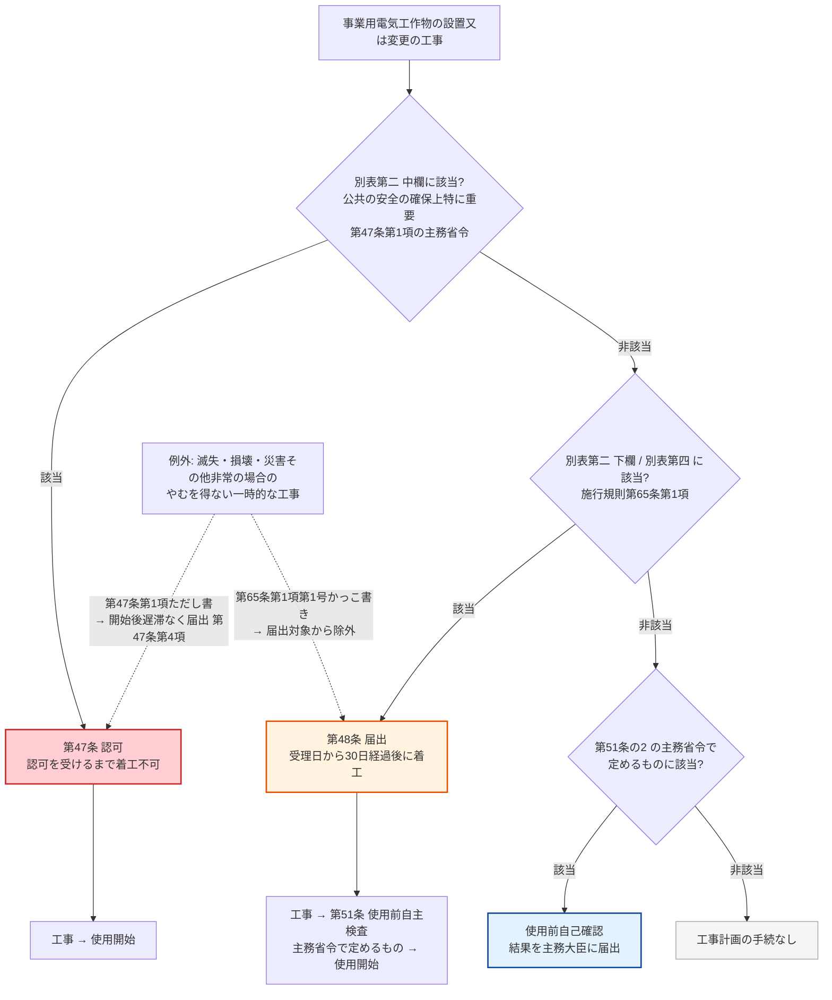

# 電気事業法 第48条 — 工事計画の届出

!!! abstract "📊 試験対策メタ"
    - **出題頻度**: 🔥（過去14年で 1 回出題）＋ 関連出題 2 回（他条文帰属の複合問題の一部として本条論点が登場）
    - **重要度**: B（第47条「認可」・第51条の2「使用前自己確認」との**3手続き対比**で再出題が見込まれる手続規定）
    - **直近出題**: H25 問2（論説・該当判定5択）／関連: H30 問2（SoT 帰属は第38条・選択肢 d が本条の「届出 vs 認可」）・H29 問10（選択肢 a が本条の「太陽電池 2,000kW 以上 → 届出」）

> 一定規模以上の事業用電気工作物の設置・変更工事は、**工事の計画を主務大臣に届け出て**、==**届出が受理された日から30日を経過した後でなければ着工できない**==（第48条第1項・第2項）。「認可」（第47条）ではなく「届出＋30日待機」。どの工事が届出対象かは法本文に書かれておらず、**施行規則第65条・別表第二**が決める（需要設備は **受電電圧1万V以上** が入口・最大電力は判定軸ではない）。

| 項目 | 内容 |
|------|------|
| 条文 | 電気事業法 第48条（第3章 電気工作物／第2節 事業用電気工作物／第4款 工事計画及び検査） |
| 条文核心 | **主務省令で定める工事 → 工事計画を主務大臣に届出（第1項）／受理日から30日経過後でなければ着工不可（第2項）／短縮（第3項）・変更廃止命令（第4項）・延長（第5項）** |
| 規定内容 | 工事計画の事前届出と着工制限（手続規定・法本文に数値は「三十日」のみ） |
| 性格 | 手続規定（届出制。認可制の第47条と対をなす） |
| 委任先 | 電気事業法施行規則 第65条（届出対象の工事＝別表第二 下欄・別表第四）・第66条（様式第49 届出書・添付書類） |
| 上位・並列 | [第47条（工事計画の認可）](47.md)／[第51条（使用前自主検査）](51.md)／第51条の2（使用前自己確認）／[第39条（技術基準適合維持）](39.md) |
| **典拠（一次ソース）** | 電気事業法（昭和39年法律第170号）第48条 — e-Gov 法令API v1 `339AC0000000170`（`scripts/cache/egov-339AC0000000170.xml`）／電気事業法施行規則（平成7年通商産業省令第77号）第62・65・66条・別表第二 — e-Gov 法令API v1 `407M50000400077` |
| **照合日** | 2026-09-10（第48条 全5項・第47条・第51条・第51条の2・第113条の2 を逐語照合。施行規則 別表第二「需要設備」欄・第65条・第66条を逐語照合。e-Gov 法令API v2 沿革で 2017-04-01 版と現行版の第48条を diff） |
| **隣接条文** | [第47条（認可）](47.md) ← 本条（48・届出） → 第48条の2（特殊電気工作物の適合性確認）／[第51条（使用前自主検査）](51.md)／第51条の2（使用前自己確認） |
| **混同注意** | **第47条＝認可（認可を受けるまで着工不可）／第48条＝届出（受理日から30日経過後に着工可）／第51条の2＝自己確認（第47・48条の対象にならない設備が使用開始前に自ら技術基準適合を確認）**。3つは「工事の規模」で振り分けられる別々の手続き |
| **H25問2 出題** | 事前届出の対象となる工事を5択から選ぶ論説（受電電圧 6,600V／22,000V × 設置・遮断器取替・遮断器改造・変圧器取替）— 正解 (4)（[denken-ou.com H25問2解説](https://denken-ou.com/houkih25-2/)） |

!!! warning "📌 改正注意（条番号・内容の変動）— 第48条本文は改正なし。周辺条文の改正を注記"
    - **本ページの条番号**: 第48条（現行も第48条。条番号の変動なし）
    - **現行条文との照合**: e-Gov 法令API v2 の沿革機能で **2017-04-01 版と現行版（2026-08-03 施行版）の第48条 第1〜5項を diff → 全項逐語一致**。この間の改正法（令和2年法律第49号・令和4年法律第46号／第68号／第74号・令和5年法律第44号・令和8年法律第68号）はいずれも第48条本文に触れていない
    - **H25 出題（2013年）以降 2017年までの改正法**を衆議院「制定法律」本文で確認: 平成25年法律第74号・平成26年法律第72号・平成27年法律第47号のいずれにも **電気事業法第48条への改正指示なし**（平成26年法律第72号は第51条の2「使用前自己確認」を新設し、第53条ただし書に第48条第1項を並記。第48条本文は不変）
    - **「経済産業大臣」→「主務大臣」**: 原子力規制委員会設置法（平成24年法律第47号）第40条「第三章第二節（…を除く。）中『経済産業大臣』を『主務大臣』に改める」で第48条の届出先の語が変わった（**施行日は政令指定・本Wikiでは未照合**）。現行の第113条の2 により **原子力発電工作物に関する事項以外の主務大臣は経済産業大臣** なので、H25問2 の問題文「経済産業大臣に事前届出」は現行法でも実質的に正しい
    - **周辺の改正（本条の読み方に影響）**: ① 第47条第3項第2号に「又は配電事業」追加（令和2年法律第49号・**2022-04-01 施行**。第48条第3項第1号が準用する要件）。② 第38条に「小規模事業用電気工作物」新設（令和4年法律第74号・**令和5年3月20日施行**・[KAISEI-2022-001](../../reference/hourei-kaisei.md#kaisei-2022-001)）。③ 施行規則第62条第1項（第47条認可の対象）に「（小規模事業用電気工作物を除く。）」追加（令和4年経済産業省令第96号・**2023-03-20 施行**）。**第65条（第48条届出の対象）と別表第二「需要設備」欄は 2017-04-01 版から現行まで逐語不変**
    - **試験対策の注意**: 第48条の穴埋め語（届け出／受理された日から三十日／開始してはならない）は H25 当時と同一。変わったのは **周辺の区分（小規模事業用）と第47条側の文言** であり、選択肢の「認可／届出」判定・受電電圧1万V・20%・1万kVA の数値判定は現行でもそのまま使える

### 差分マトリクス（H25 出題時 → 現行）

| 境界・要素 | H25 出題時（2013年） | 現行（2026-09-10 照合） | 変化 | 根拠 |
|---|---|---|---|---|
| 第48条 第1〜5項 本文 | 届出＋受理日から三十日 | 同（**2017-04-01 版〜現行 逐語一致**） | **不変** | e-Gov v2 沿革 diff／衆議院 H25・H26・H27 改正法本文に第48条改正指示なし |
| 届出先の語 | 「経済産業大臣」（H25問2 問題文の表現） | 「主務大臣」（第113条の2 → 原子力以外は経済産業大臣） | 語のみ変更・実体不変 | 平成24年法律第47号 第40条（施行日は政令・未照合） |
| 第47条第3項第2号（第48条第3項第1号が準用） | 「一般送配電事業」 | 「一般送配電事業**又は配電事業**」 | 追加 | e-Gov v2 2022-03-31 版 vs 2022-04-01 版 diff（令和2年法律第49号） |
| 第51条の2 使用前自己確認 | （2017-04-01 版には存在。新設は平成26年法律第72号・施行日は政令・未照合） | 存在 | 新設（2013〜2017 の間） | 衆議院 H26 法72号本文 |
| 第38条 電気工作物の区分 | 3項構造（一般用／事業用／自家用） | 4項構造・**小規模事業用** 新設 | **新設** | KAISEI-2022-001（令和5年3月20日施行） |
| 施行規則第62条第1項（第47条認可の対象） | 除外文言なし | 「（小規模事業用電気工作物を除く。）」 | 追加 | e-Gov v2 2023-03-19 版 vs 2023-03-20 版 diff |
| 施行規則第65条・別表第二「需要設備」欄（第48条届出の対象） | 2013〜2017 は e-Gov 沿革の範囲外（**未照合**） | 受電電圧1万V以上／20%／1万kVA・1万kW／8万kWh／5万V・10万V | 2017-04-01 版〜現行 **不変** | e-Gov v2 2017-04-01 版 vs 現行 diff |

!!! tip "凡例 — 本記事のマーカーの意味"
    - <mark>黄色マーカー</mark> = 過去14年で **実際に穴埋め出題された語句** に付ける規約。**第48条は過去14年（H23〜R07下）で穴埋め出題が無い**（H25問2 は論説・該当判定5択）ため、本記事にマーカー対象の語は **0件**。条文中の重要語は **太字** で示す
    - **太字** = 論説・該当判定で正誤を分ける核心語・数値
    - **赤太字** = 直感に反する逆ひっかけ（「最大電力で判定」「同容量なら不要」など）

---

## 1. 5秒で思い出す

- 工事計画は **事前届出**（第48条第1項）→ ==**届出が受理された日から30日を経過した後でなければ着工不可**==（第2項）
- 義務者は **事業用電気工作物の設置又は変更の工事のうち主務省令で定めるものをしようとする者**（第47条第1項の認可対象は除く）
- 届出先は **主務大臣**（第113条の2 → 原子力発電工作物以外は **経済産業大臣**）
- 主務大臣は要件適合なら期間 **短縮**（第3項）、不適合なら受理日から30日以内に **変更・廃止命令**（第4項）、審査に時間がかかるなら期間 **延長＋理由通知**（第5項）
- 何が届出対象かは **施行規則第65条・別表第二 下欄**。需要設備は **受電電圧1万V以上** が入口（**最大電力は判定軸ではない**）
- 届出して設置した設備は使用開始前に **使用前自主検査**（第51条）

!!! tip "💡 暗記の核心（第48条を5秒で）"
    - **手続き**: 届出（第48条）≠ 認可（第47条）≠ 自己確認（第51条の2）
    - **日数**: 受理日から **30日** 経過後に着工（短縮・延長・変更廃止命令はすべて主務大臣の側の権限）
    - **需要設備の閾値**: 受電 **1万V以上** → 設置は届出。変更は「受電用遮断器（設置・**20%以上**の遮断電流変更・取替え）」「その他機器 **1万kVA以上又は1万kW以上**（設置・20%以上の変更・取替え）」
    - **逆ひっかけ**: 最大電力 2,000kW でも受電 6,600V なら **不要**／変圧器 5,000kVA は同容量取替でも別容量取替でも **不要**（1万kVA 未満）

??? question "セルフチェック: 第47条は「認可」なのに第48条はなぜ「届出＋30日待機」で済むのか。届出後に主務大臣ができることと合わせて説明せよ。"
    第47条の対象は「公共の安全の確保上特に重要なもの」なので、行政が**事前に審査して認める（認可）**まで着工させない。第48条の対象はそれより規模が小さいので、設置者の計画を**届け出させて30日間だけ着工を止め**、その間に主務大臣が技術基準適合等（第47条第3項各号の要件）を審査する。適合なら期間短縮（第3項）、不適合なら**受理日から30日以内に限り変更・廃止命令**（第4項）、審査が終わらなければ期間延長と理由通知（第5項）ができる。つまり「届出＝行政が何もしない」ではなく、**30日は行政の審査期間**である。

---

## 2. 条文原文（e-Gov 一次照合・`339AC0000000170`）

??? note "📜 条文原文 — eGov 完全版（lawid 339AC0000000170・照合日 2026-09-10・第48条 第1〜5項 全文）"
    e-Gov 法令API v1 のキャッシュ（`scripts/cache/egov-339AC0000000170.xml`）から項・号の構造ごと転記。`scripts/check_law_verbatim.py` が本ブロックを原典と逐語照合する。2017-04-01 版（e-Gov v2 沿革）と全項逐語一致。

    > **第1項** 事業用電気工作物の設置又は変更の工事（前条第一項の主務省令で定めるものを除く。）であつて、主務省令で定めるものをしようとする者は、その工事の計画を主務大臣に届け出なければならない。その工事の計画の変更（主務省令で定める軽微なものを除く。）をしようとするときも、同様とする。
    >
    > **第2項** 前項の規定による届出をした者は、その届出が受理された日から三十日を経過した後でなければ、その届出に係る工事を開始してはならない。
    >
    > **第3項** 主務大臣は、第一項の規定による届出のあつた工事の計画が次の各号のいずれにも適合していると認めるときは、前項に規定する期間を短縮することができる。
    >
    > 一　前条第三項各号に掲げる要件
    >
    > 二　水力を原動力とする発電用の事業用電気工作物に係るものにあつては、その事業用電気工作物が発電水力の有効な利用を確保するため技術上適切なものであること。
    >
    > **第4項** 主務大臣は、第一項の規定による届出のあつた工事の計画が前項各号のいずれかに適合していないと認めるときは、その届出をした者に対し、その届出を受理した日から三十日（次項の規定により第二項に規定する期間が延長された場合にあつては、当該延長後の期間）以内に限り、その工事の計画を変更し、又は廃止すべきことを命ずることができる。
    >
    > **第5項** 主務大臣は、第一項の規定による届出のあつた工事の計画が第三項各号に適合するかどうかについて審査するため相当の期間を要し、当該審査が第二項に規定する期間内に終了しないと認める相当の理由があるときは、当該期間を相当と認める期間に延長することができる。この場合において、主務大臣は、当該届出をした者に対し、遅滞なく、当該延長後の期間及び当該延長の理由を通知しなければならない。

    **黄色マーカー凡例と出題実績根拠表**: 過去14年（H23〜R07下）で本条の穴埋め出題は無い（kakomon.yml 登録は H25問2 論説のみ）。よって本条文に `<mark>` は付けていない。予想範囲の語（届け出／受理された日から三十日／開始してはならない／短縮／変更し、又は廃止）は太字扱いで、根拠表は「出題実績なし」の1行のみ。

    | マーカー対象語 | 出題年度 | 形式 |
    |---|---|---|
    | （該当なし） | — | 穴埋め出題実績なし（H25問2 は論説） |

---

## 3. 原文解析（ブロック分解）

| 項 | 原文（要点） | 意味 | 試験のポイント |
|---|---|---|---|
| 第1項 前段 | 事業用電気工作物の設置又は変更の工事（**前条第一項の主務省令で定めるものを除く**）であつて、**主務省令で定めるもの**をしようとする者は、工事の計画を **主務大臣に届け出** | 第47条の認可対象を除いた「主務省令で定める工事」が届出対象。対象の実体は施行規則第65条・別表第二 | 「認可」と書いた選択肢は誤り。義務者は「設置する者」ではなく **「工事をしようとする者」** |
| 第1項 後段 | 計画の変更（主務省令で定める **軽微なものを除く**）も同様 | 届け出た計画を変えるときも再届出。軽微変更（第65条第2項）は除外 | 「変更は届出不要」は誤り。「軽微な変更も届出必要」も誤り（例外あり） |
| 第2項 | 届出が **受理された日から三十日を経過した後** でなければ工事を **開始してはならない** | 起算点は「受理日」。30日は行政の審査期間 | 「届出後直ちに着工可」「着工後30日以内に届出」はいずれも誤り |
| 第3項 第1号・第2号 | 次の各号に適合と認めるときは期間を **短縮** できる。第1号＝前条第三項各号の要件（技術基準適合等）、第2号＝**水力**は発電水力の有効利用 | 短縮は主務大臣の裁量（できる規定）。要件は第47条第3項各号を準用 | 「届出者が短縮を請求できる」ではない。第47条第3項第2号は 2022-04-01 改正で「又は配電事業」が追加 |
| 第4項 | 前項各号のいずれかに **不適合** と認めるときは、受理日から **三十日以内に限り**、計画の **変更・廃止を命ずる** ことができる | 30日の待機は「命令を出せる期間」でもある。延長時は延長後の期間 | 「不適合なら届出を却下」ではなく **変更・廃止命令** |
| 第5項 | 審査に相当の期間を要し30日内に終わらない相当の理由 → 期間を **延長** できる。遅滞なく **延長後の期間と理由を通知** | 延長には通知義務がセット | 「30日は絶対」ではない（延長あり）。通知なしの延長は不可 |

### 誰に／何を／何から守る／例外（主語・対象の整理）

| 観点 | 第48条の答え |
|---|---|
| **誰に**（義務者） | 事業用電気工作物の設置又は変更の工事のうち **主務省令で定めるもの** をしようとする者（電気事業者・自家用設置者を問わない。第47条第1項の認可対象は除く） |
| **何を** | 工事の計画を主務大臣へ **届出**。受理日から30日経過まで **着工しない** |
| **何から守る** | 技術基準（第39条第1項の主務省令）に適合しない設備が着工・供用されることを、**着工前の審査期間** で止める |
| **例外** | ① 第47条第1項の認可対象（除外）／② 主務省令で定める軽微な変更（第1項後段・施行規則第65条第2項）／③ 施行規則第65条第1項第1号かっこ書: **滅失・損壊・災害その他非常の場合のやむを得ない一時的な工事** は届出対象から除外／④ 第3項の期間短縮 |

---

## 4. 委任先の実体 — 施行規則第65条・第66条・別表第二（e-Gov 一次照合済）

法第48条第1項の「主務省令で定めるもの」は **施行規則第65条第1項** が定め、その中身は **別表第二の下欄**（届出）と **別表第四**（公害防止関係）にある。別表第二は 上欄＝工事の種類／中欄＝**認可**（第47条・第62条）／下欄＝**届出**（第48条・第65条）の3列構成。

### 需要設備（工場・ビルの受変電設備）— 別表第二「需要設備（鉱山保安法が適用されるものを除く。）」の下欄

| 工事の種類 | 届出対象（下欄・原文要旨） | 試験での読み方 |
|---|---|---|
| **設置の工事** | **受電電圧一万ボルト以上** の需要設備の設置 | 入口は受電電圧。**最大電力・契約電力は条文に無い** |
| 変更 (一) **遮断器** | 他の者が設置する電気工作物と電気的に接続するための遮断器（**受電電圧一万ボルト以上の需要設備に属するものに限る**）であって電圧一万ボルト以上のものの **1 設置／2 改造のうち二十パーセント以上の遮断電流の変更を伴うもの／3 取替え** | いわゆる受電用遮断器。**「1万V以上」AND「設置・20%改造・取替のいずれか」** |
| 変更 (二) **電力貯蔵装置** | 受電電圧一万ボルト以上の需要設備に属する電力貯蔵装置で **容量八万キロワットアワー以上** の設置／改造のうち二十パーセント以上の容量変更 | 蓄電池の届出閾値は 8万kWh |
| 変更 (三) **その他の機器**（計器用変成器を除く） | 電圧一万ボルト以上の機器であって **容量一万キロボルトアンペア以上又は出力一万キロワット以上** のものの **1 設置／2 改造のうち二十パーセント以上の電圧・容量・出力の変更／3 取替え** | 変圧器はここ。**5,000kVA の変圧器は同容量取替でも別容量取替でも不要**（1万kVA 未満） |
| 変更 (四) **電線路** | 電圧五万ボルト以上の電線路の設置／電圧十万ボルト以上の電線路の一キロメートル以上の延長・所定の改造・五十メートル以上の位置変更 等 | 需要設備内の電線路は 5万V・10万V が境界 |

需要設備の **中欄（認可）は空欄**。つまり需要設備の工事に第47条の認可枠は無く、**届出か手続不要かの2択**。

### 発電所 — 別表第二「発電所」設置の工事（下欄＝届出・原文要旨）

| 発電方式 | 届出（第48条）となる設置 |
|---|---|
| 水力 | 水力発電所の設置（小型のもの・特定の施設内に設置されるもので **別に告示するもの** を除く。告示の内容は未照合） |
| 火力（汽力） | 汽力を原動力とする火力発電所の設置（小型で別に告示するものを除く） |
| 火力（ガスタービン） | 出力 **1,000kW以上** |
| 火力（内燃力） | 出力 **1万kW以上** |
| 燃料電池 | 出力 **500kW以上**（別表第六に掲げるものを除く） |
| **太陽電池** | 出力 **2,000kW以上** |
| 風力 | 出力 **500kW以上** |
| 複数原動力の組合せ | 合計出力 300kW以上（所定の組合せ） |

発電所の **中欄（認可）** に残るのは「出力 20kW以上の発電所の設置であって、水力・火力・燃料電池・太陽電池・風力 **以外**」（原子力等）。したがって **太陽電池発電所は何 kW でも第47条の認可対象にならず、2,000kW以上で第48条の届出**（H30問2 選択肢 d・H29問10 選択肢 a の根拠）。

!!! warning "施行規則第65条第1項第1号のかっこ書き — 例外・除外の見落とし型"
    別表第二 下欄に該当しても、**事業用電気工作物が滅失し、若しくは損壊した場合又は災害その他非常の場合において、やむを得ない一時的な工事としてするもの** は届出対象から除かれる（第65条第1項第1号かっこ書き）。第47条側は法本文の第1項ただし書「この限りでない」で同じ趣旨を置き、第4項で **工事の開始の後、遅滞なく届出** を求める。「災害時でも必ず事前届出」と書いた選択肢は誤り。

### 届出書の実体（施行規則第66条・実務）

- **様式第四十九「工事計画（変更）届出書」** に **① 工事計画書 ② 別表第三の書類（設備種類別） ③ 工事工程表 ④ 特殊電気工作物なら第48条の2第2項の証明書 ⑤ 変更の工事なら変更理由書** を添えて提出（第66条第1項）。取替えの工事なら②は不要、廃止の工事なら②③④は不要（同項ただし書）
- 提出部数は **正本一通**（第66条第5項）。**実務** では所轄の産業保安監督部へ電子申請で提出し、工程表の着工日を受理日から30日以降に置くのが **設計** 段階からの前提になる
- 変更の工事の工事計画書は **変更前と変更後を対照しやすいように** 記載（第66条第3項後段）— **現場** の改造工事（遮断器の遮断電流変更など）で監督部から求められる書き方

---

## 5. かみ砕き解説（因果理解）

### なぜ「認可」ではなく「届出＋30日待機」なのか

事業用電気工作物の工事は規模で3段階に振り分けられる。**公共の安全の確保上特に重要なもの**（別表第二 中欄）は行政が事前に審査して認める **認可**（第47条）。それより小さいが技術基準適合を事前に確かめたい工事（別表第二 下欄）は **届出＋30日**（第48条）。どちらにも当たらないが公共の安全上重要な設備は、設置者自身が使用開始前に技術基準適合を確かめる **使用前自己確認**（第51条の2）。第48条の「30日」は**行政の審査期間**であり、その間に不適合が見つかれば変更・廃止命令（第4項）が出る。「届出だから審査されない」は逆。

### なぜ需要設備は「受電電圧」で判定するのか（最大電力ではない）

別表第二「需要設備」の設置の工事は **受電電圧一万ボルト以上** のみを要件にしている。変更の工事も「受電電圧一万ボルト以上の需要設備に属する」遮断器・機器が対象。**最大電力・契約電力・kW** は需要設備欄のどこにも登場しない。H25問2 の (1)「受電 6,600V・最大電力 2,000kW の設置」が届出不要なのはこのため。教材にある「1,000kW」は第48条の閾値ではない（第43条の法本文にも数値は無い。1,000kW は施行規則の主任技術者関係で出る数値であり、当該条項は本Wikiでは未照合）。

### 小規模事業用電気工作物は第48条からどう外れるのか

- 第42条第1項の「事業用電気工作物（**小規模事業用電気工作物を除く。以下この款において同じ。**）」の「款」は **第2款 自主的な保安（第42〜46条）** を指し、第48条が属する **第4款 工事計画及び検査（第47〜55条）には及ばない**（e-Gov XML の款構造で確認）。第48条本文に小規模事業用の除外文言は無い
- 認可側は施行規則第62条第1項が「（小規模事業用電気工作物を除く。）」を明記（2023-03-20 追加）。届出側の第65条にはこの文言は無いが、小規模事業用の規模（太陽光 10kW以上50kW未満 等）は別表第二 下欄の閾値（太陽電池 2,000kW以上 等）に届かないため、**結果として届出対象にならない**
- 小規模事業用の使用開始前の手続きは **使用前自己確認**（第51条の2。第3項に「小規模事業用電気工作物である場合…委託先の氏名又は名称」の規定あり）。省令上の対象範囲（施行規則）は本Wikiでは未照合

### 「主務大臣」＝原則 経済産業大臣

第113条の2 第1項: 原子力発電工作物に関する事項は **原子力規制委員会及び経済産業大臣**、それ以外は **経済産業大臣**。電験三種で扱う需要設備・太陽電池発電所の届出先は経済産業大臣（**実務** では産業保安監督部長への委任先）で、H25問2 の問題文「経済産業大臣に事前届出」は現行法でもそのまま通用する。

??? question "セルフチェック: 受電 6,600V の工場が最大電力 3,000kW の需要設備を新設するとき、第48条の届出は要るか。判定軸を条文で示して答えよ。"
    **不要**。別表第二「需要設備」設置の工事の下欄は **受電電圧一万ボルト以上** だけを要件にしており、最大電力は判定軸に無い。6,600V は 1万V 未満なので、最大電力が何 kW でも届出対象にならない。「大きな工場だから届出」は誤りで、**受電電圧が入口** と条文で言い切れることが核心。

??? question "セルフチェック: 届出から28日目に主務大臣から「計画を変更せよ」と命令が来た。これは適法か。30日を過ぎてから同じ命令が来たらどうか。"
    28日目の命令は **適法**（第4項: 受理日から三十日以内に限り変更・廃止を命ずることができる）。30日を過ぎると、第5項で期間が延長されていない限り命令期間を過ぎているので命令できない。逆に言えば、届出者は **30日経過後に着工でき**（第2項）、その時点で命令が無ければ計画どおり進められる。延長された場合は延長後の期間まで命令が可能。

---

## 6. 図で理解

### ① 3手続きの振り分けフロー（第47条 認可／第48条 届出／第51条の2 自己確認）

判定は「工事の種類と規模が別表第二のどの欄に載るか」という **条文要件（結果）** で行う。工事の原因（新設か災害復旧か）は第47条ただし書・第65条第1項第1号かっこ書きの例外でだけ効く。

**読み解き**: 需要設備には中欄が無いので Q1 は常に「非該当」。需要設備の判定は Q2 だけ（受電電圧1万V以上か、変更なら遮断器・機器の要件か）。太陽電池発電所も中欄に無いので、2,000kW以上は Q2 で「届出」、それ未満は Q3（使用前自己確認の対象範囲は施行規則・未照合）へ進む。

### ② 第2項〜第5項の「30日」の時間軸

<svg viewBox="0 0 820 300" xmlns="http://www.w3.org/2000/svg" width="100%" preserveAspectRatio="xMidYMid meet">
<defs>
<filter id="sh48a" x="-20%" y="-20%" width="140%" height="140%"><feDropShadow dx="0" dy="2" stdDeviation="2" flood-opacity="0.15"/></filter>
</defs>
<text x="410" y="26" text-anchor="middle" font-size="15" font-weight="700" fill="#212121">第48条 — 届出受理日から30日の時間軸（第2〜5項）</text>
<text x="410" y="44" text-anchor="middle" font-size="11" fill="#666">起算点は「受理された日」。30日は行政の審査期間であり、届出者の着工制限期間</text>
<line x1="60" y1="130" x2="760" y2="130" stroke="#424242" stroke-width="3"/>
<polygon points="760,130 746,123 746,137" fill="#424242"/>
<circle cx="110" cy="130" r="8" fill="#fff" stroke="#e65100" stroke-width="3"/>
<text x="110" y="108" text-anchor="middle" font-size="12" font-weight="700" fill="#bf360c">届出・受理</text>
<text x="110" y="160" text-anchor="middle" font-size="10" fill="#bf360c">受理日（起算点）</text>
<rect x="118" y="120" width="392" height="20" fill="#ffe0b2" opacity="0.8"/>
<text x="314" y="118" text-anchor="middle" font-size="11" font-weight="700" fill="#e65100">着工禁止 30日（第2項）＝ 主務大臣の審査期間</text>
<circle cx="510" cy="130" r="8" fill="#fff" stroke="#2e7d32" stroke-width="3"/>
<text x="510" y="108" text-anchor="middle" font-size="12" font-weight="700" fill="#1b5e20">30日経過</text>
<text x="510" y="160" text-anchor="middle" font-size="10" fill="#1b5e20">経過した後でなければ開始してはならない</text>
<rect x="520" y="120" width="220" height="20" fill="#c8e6c9" opacity="0.8"/>
<text x="630" y="118" text-anchor="middle" font-size="11" font-weight="700" fill="#2e7d32">着工可 → 工事 → 使用前自主検査（第51条）</text>
<rect x="60" y="190" width="215" height="88" rx="8" fill="#e3f2fd" stroke="#1565c0" stroke-width="2" filter="url(#sh48a)"/>
<text x="167" y="212" text-anchor="middle" font-size="11" font-weight="700" fill="#0d47a1">第3項 短縮（できる）</text>
<text x="70" y="232" font-size="10" fill="#0d47a1">要件（第47条第3項各号・水力の</text>
<text x="70" y="247" font-size="10" fill="#0d47a1">有効利用）にすべて適合と認めるとき</text>
<text x="70" y="266" font-size="10" font-weight="700" fill="#0d47a1">→ 30日より前に着工できる</text>
<rect x="302" y="190" width="215" height="88" rx="8" fill="#ffebee" stroke="#c62828" stroke-width="2" filter="url(#sh48a)"/>
<text x="409" y="212" text-anchor="middle" font-size="11" font-weight="700" fill="#c62828">第4項 変更・廃止命令</text>
<text x="312" y="232" font-size="10" fill="#c62828">いずれかの要件に不適合と認めるとき</text>
<text x="312" y="247" font-size="10" fill="#c62828">受理日から30日以内に限り</text>
<text x="312" y="266" font-size="10" font-weight="700" fill="#c62828">（延長時は延長後の期間以内）</text>
<rect x="544" y="190" width="215" height="88" rx="8" fill="#fff8e1" stroke="#f9a825" stroke-width="2" filter="url(#sh48a)"/>
<text x="651" y="212" text-anchor="middle" font-size="11" font-weight="700" fill="#e65100">第5項 延長（できる）</text>
<text x="554" y="232" font-size="10" fill="#e65100">審査に相当の期間を要し30日内に</text>
<text x="554" y="247" font-size="10" fill="#e65100">終わらない相当の理由があるとき</text>
<text x="554" y="266" font-size="10" font-weight="700" fill="#e65100">→ 延長後の期間と理由を遅滞なく通知</text>
</svg>

**読み解き**: 3つの箱はすべて **主務大臣の側の権限**（届出者が請求する制度ではない）。第4項の命令期間と第2項の着工制限期間は同じ「受理日から30日」で、延長（第5項）されれば両方が延びる。

### ③ 需要設備の届出閾値マップ（別表第二 下欄）

<svg viewBox="0 0 820 330" xmlns="http://www.w3.org/2000/svg" width="100%" preserveAspectRatio="xMidYMid meet">
<defs>
<filter id="sh48b" x="-20%" y="-20%" width="140%" height="140%"><feDropShadow dx="0" dy="2" stdDeviation="2" flood-opacity="0.13"/></filter>
</defs>
<text x="410" y="26" text-anchor="middle" font-size="15" font-weight="700" fill="#212121">需要設備の工事計画届出 — 入口は「受電電圧1万V以上」（別表第二 下欄）</text>
<text x="410" y="44" text-anchor="middle" font-size="11" fill="#666">最大電力・契約電力は条文のどこにも無い。中欄（認可）は空欄＝需要設備に認可枠は無い</text>
<rect x="40" y="70" width="200" height="200" rx="12" fill="#fff3e0" stroke="#e65100" stroke-width="2.5" filter="url(#sh48b)"/>
<text x="140" y="98" text-anchor="middle" font-size="13" font-weight="800" fill="#bf360c">入口条件</text>
<text x="140" y="126" text-anchor="middle" font-size="12" font-weight="700" fill="#bf360c">受電電圧</text>
<text x="140" y="148" text-anchor="middle" font-size="16" font-weight="800" fill="#c62828">1万V 以上</text>
<text x="140" y="176" text-anchor="middle" font-size="10" fill="#bf360c">6,600V 受電 → すべて非該当</text>
<text x="140" y="192" text-anchor="middle" font-size="10" fill="#bf360c">22,000V／66,000V 受電 → 次へ</text>
<text x="140" y="222" text-anchor="middle" font-size="10" font-weight="700" fill="#c62828">最大電力 2,000kW でも</text>
<text x="140" y="238" text-anchor="middle" font-size="10" font-weight="700" fill="#c62828">6,600V なら届出不要</text>
<line x1="240" y1="170" x2="290" y2="170" stroke="#424242" stroke-width="2.5"/>
<polygon points="290,170 278,164 278,176" fill="#424242"/>
<rect x="300" y="64" width="230" height="52" rx="8" fill="#c8e6c9" stroke="#2e7d32" stroke-width="2" filter="url(#sh48b)"/>
<text x="415" y="86" text-anchor="middle" font-size="11" font-weight="700" fill="#1b5e20">設置の工事</text>
<text x="415" y="104" text-anchor="middle" font-size="10" fill="#1b5e20">受電電圧1万V以上の需要設備の設置 → 届出</text>
<rect x="300" y="124" width="230" height="66" rx="8" fill="#e3f2fd" stroke="#1565c0" stroke-width="2" filter="url(#sh48b)"/>
<text x="415" y="144" text-anchor="middle" font-size="11" font-weight="700" fill="#0d47a1">(一) 受電用遮断器（1万V以上）</text>
<text x="415" y="162" text-anchor="middle" font-size="10" fill="#0d47a1">1 設置 ／ 2 改造で遮断電流 20%以上変更</text>
<text x="415" y="178" text-anchor="middle" font-size="10" fill="#0d47a1">3 取替え → いずれも届出</text>
<rect x="300" y="198" width="230" height="66" rx="8" fill="#e3f2fd" stroke="#1565c0" stroke-width="2" filter="url(#sh48b)"/>
<text x="415" y="218" text-anchor="middle" font-size="11" font-weight="700" fill="#0d47a1">(三) その他機器（変圧器など・1万V以上）</text>
<text x="415" y="236" text-anchor="middle" font-size="10" fill="#0d47a1">容量 1万kVA以上 又は 出力 1万kW以上 のもの</text>
<text x="415" y="252" text-anchor="middle" font-size="10" fill="#0d47a1">1 設置 ／ 2 改造で 20%以上変更 ／ 3 取替え</text>
<rect x="300" y="272" width="230" height="46" rx="8" fill="#f3e5f5" stroke="#7b1fa2" stroke-width="2" filter="url(#sh48b)"/>
<text x="415" y="290" text-anchor="middle" font-size="11" font-weight="700" fill="#4a148c">(二) 電力貯蔵装置 8万kWh以上 ／ (四) 電線路 5万V・10万V</text>
<text x="415" y="308" text-anchor="middle" font-size="10" fill="#4a148c">設置・20%以上の容量変更 ／ 設置・1km以上の延長 等</text>
<rect x="560" y="64" width="230" height="254" rx="12" fill="#fafafa" stroke="#bdbdbd" stroke-width="1"/>
<text x="675" y="90" text-anchor="middle" font-size="12" font-weight="700" fill="#424242">H25問2 を当てはめる</text>
<text x="572" y="116" font-size="10" fill="#424242">(1) 6,600V 設置・2,000kW → 入口で脱落</text>
<text x="572" y="136" font-size="10" fill="#424242">(2) 6,600V 遮断器取替 → 入口で脱落</text>
<text x="572" y="156" font-size="10" fill="#424242">(3) 6,600V 遮断電流 25%変更 → 入口で脱落</text>
<text x="572" y="184" font-size="10" font-weight="700" fill="#2e7d32">(4) 22,000V 遮断器取替 → (一)3 該当 ＝ 正解</text>
<text x="572" y="212" font-size="10" fill="#c62828">(5) 22,000V 変圧器 5,000kVA 取替</text>
<text x="572" y="228" font-size="10" fill="#c62828">　→ (三) は 1万kVA以上が要件。5,000kVA は</text>
<text x="572" y="244" font-size="10" fill="#c62828">　　容量で脱落（同容量かどうかは無関係）</text>
<text x="572" y="276" font-size="10" fill="#666">判定順: ① 受電電圧 → ② 設備の種類</text>
<text x="572" y="292" font-size="10" fill="#666">→ ③ 規模・変更率（20%／1万kVA）</text>
</svg>

**読み解き**: 6,600V 受電の3択は入口で全滅し、22,000V の2択を「(一) 遮断器の取替え（規模要件なし）」と「(三) 機器の取替え（1万kVA以上）」で分ける。**現場** の受電設備更新で最も多い「6.6kV 受電の遮断器・変圧器の更新」は届出不要で、**施工** 前に必要なのは保安規程に基づく社内手続きだけになる。

### ④ 工事計画・検査の手続き階層（第47条・第48条・第51条・第51条の2）

<svg viewBox="0 0 820 300" xmlns="http://www.w3.org/2000/svg" width="100%" preserveAspectRatio="xMidYMid meet">
<defs>
<filter id="sh48c" x="-20%" y="-20%" width="140%" height="140%"><feDropShadow dx="0" dy="2" stdDeviation="2" flood-opacity="0.13"/></filter>
</defs>
<text x="410" y="26" text-anchor="middle" font-size="15" font-weight="700" fill="#212121">第4款「工事計画及び検査」の階層 — 規模で振り分け、着工前と使用開始前で二段構え</text>
<text x="410" y="44" text-anchor="middle" font-size="11" fill="#666">左: 着工前の手続き（規模が大きいほど重い）／右: 使用開始前の確認</text>
<rect x="40" y="66" width="360" height="64" rx="10" fill="#ffcdd2" stroke="#c62828" stroke-width="2.5" filter="url(#sh48c)"/>
<text x="220" y="90" text-anchor="middle" font-size="13" font-weight="800" fill="#b71c1c">第47条 認可 — 公共の安全の確保上特に重要（別表第二 中欄）</text>
<text x="220" y="112" text-anchor="middle" font-size="10" fill="#b71c1c">認可を受けるまで着工不可。需要設備・太陽電池・風力に中欄は無い</text>
<rect x="40" y="140" width="360" height="64" rx="10" fill="#fff3e0" stroke="#e65100" stroke-width="2.5" filter="url(#sh48c)"/>
<text x="220" y="164" text-anchor="middle" font-size="13" font-weight="800" fill="#bf360c">第48条 届出 — 主務省令で定めるもの（別表第二 下欄・別表第四）</text>
<text x="220" y="186" text-anchor="middle" font-size="10" fill="#bf360c">受理日から30日経過後に着工。短縮・変更廃止命令・延長は主務大臣の権限</text>
<rect x="40" y="214" width="360" height="64" rx="10" fill="#e3f2fd" stroke="#1565c0" stroke-width="2.5" filter="url(#sh48c)"/>
<text x="220" y="238" text-anchor="middle" font-size="13" font-weight="800" fill="#0d47a1">第51条の2 使用前自己確認 — 上2つの対象外で公共の安全上重要</text>
<text x="220" y="260" text-anchor="middle" font-size="10" fill="#0d47a1">設置者が自ら技術基準適合を確認し結果を届出（省令上の対象範囲は未照合）</text>
<line x1="400" y1="172" x2="450" y2="172" stroke="#424242" stroke-width="2.5"/>
<polygon points="450,172 438,166 438,178" fill="#424242"/>
<rect x="460" y="140" width="320" height="64" rx="10" fill="#c8e6c9" stroke="#2e7d32" stroke-width="2.5" filter="url(#sh48c)"/>
<text x="620" y="164" text-anchor="middle" font-size="13" font-weight="800" fill="#1b5e20">第51条 使用前自主検査</text>
<text x="620" y="186" text-anchor="middle" font-size="10" fill="#1b5e20">第48条届出をして設置・変更した設備のうち主務省令で定めるもの</text>
<text x="620" y="228" text-anchor="middle" font-size="10" fill="#424242">確認事項（第51条第2項第1号・第2号）:</text>
<text x="620" y="246" text-anchor="middle" font-size="10" fill="#424242">① 届出した工事計画に従って行われたこと</text>
<text x="620" y="262" text-anchor="middle" font-size="10" fill="#424242">② 第39条第1項の技術基準に適合すること</text>
<text x="620" y="284" text-anchor="middle" font-size="10" fill="#424242">記録し保存／実施体制は登録機関等の審査を受ける（第3項）</text>
</svg>

**読み解き**: 「第48条で届け出た → 工事 → 第51条で自主検査 → 使用開始」が一本のレール。第51条の対象は **第48条第1項の届出をして設置・変更した事業用電気工作物** に限定されているので（第51条第1項）、届出不要の工事に使用前自主検査の義務は乗らない。**設計** 段階でこのレールに乗るかどうか（受電電圧・機器容量）を決めておくと、**実務** の工程（30日待機＋検査体制の審査）が読める。

---

## 7. 試験で問われること

1. **手続きの種別**: 第47条「認可」／第48条「届出」／第51条の2「自己確認」の取り違え（H30問2 選択肢 d は「太陽電池 2,000kW 以上を認可」と書いて不適切）
2. **着工の時期**: 「届出が受理された日から30日を経過した後」。起算点（受理日）と方向（事前届出）
3. **該当・非該当の判定**（H25問2 型）: 受電電圧1万V → 設備の種類（遮断器／機器）→ 規模・変更率（20%／1万kVA）
4. **主務大臣の権限**: 短縮（第3項）・変更廃止命令（第4項・30日以内に限る）・延長＋通知（第5項）
5. **複合問題の一部として**: 第38条の区分（小規模事業用）と組み合わせた「どの手続きが要るか」（H30問2・H29問10）

---

## 8. 頻出ひっかけ・落とし穴

各項目の先頭の `[①〜⑥]` は弱点カテゴリ（①数値境界／②主語対象／③手続き混同／⑥例外除外）。

### 🔴 致命的（これを間違えたら即失点）

| # | ❌ 誤った認識 | ✅ 正しい認識 |
|---|--------------|--------------|
| 1 | **[③手続き]** 事業用電気工作物の工事計画は一律 **認可** が必要 | 認可は「公共の安全の確保上特に重要なもの」（第47条）だけ。それ以外の主務省令で定めるものは **届出**（第48条）。需要設備に認可枠は無い |
| 2 | **[③手続き]** 届け出れば **直ちに着工** できる／**着工後30日以内** に届け出る | **届出が受理された日から30日を経過した後** でなければ開始できない（第2項）。事前届出＋30日待機 |
| 3 | **[①数値]** 最大電力 **2,000kW** の需要設備だから届出対象 | 需要設備の入口は **受電電圧1万V以上**。最大電力は判定軸に無い（H25問2 (1) は 6,600V なので不要） |
| 4 | **[①数値]** 遮断電流を **25%** 変えるから届出対象 | 20%以上は要件の一つだが、**受電電圧1万V以上の需要設備に属する** 遮断器であることが前提（AND 条件）。6,600V なら不要 |

### 🟡 注意（出題頻度高い）

| # | ❌ 誤った認識 | ✅ 正しい認識 |
|---|--------------|--------------|
| 5 | **[①数値]** 22,000V 受電なら変圧器の取替えはすべて届出 | (三) その他機器は **容量1万kVA以上又は出力1万kW以上** が要件。5,000kVA は不要（同容量取替かどうかは条文の要件ではない） |
| 6 | **[②主語]** 届出義務者は「事業用電気工作物を **設置する者**」 | 条文は「工事を **しようとする者**」。第51条（自主検査）の主語「設置する者」と混同しない |
| 7 | **[③手続き]** 不適合なら主務大臣は届出を **却下** する | 却下ではなく **変更・廃止命令**（第4項）。しかも **受理日から30日以内に限り** |
| 8 | **[②主語]** 届出先は都道府県知事・所轄警察 | **主務大臣**（第113条の2 → 原子力以外は経済産業大臣。実務は産業保安監督部長へ委任） |

### 🟢 軽微（余裕があれば）

| # | ❌ 誤った認識 | ✅ 正しい認識 |
|---|--------------|--------------|
| 9 | **[⑥例外]** 災害復旧の一時的な工事でも必ず **事前に** 届け出る | 別表第二 下欄に該当しても **滅失・損壊・災害その他非常の場合のやむを得ない一時的な工事** は届出対象から除外（施行規則第65条第1項第1号かっこ書き）。認可側は第47条第1項ただし書＋第4項（開始後遅滞なく届出） |
| 10 | **[⑥例外]** 期間の短縮は届出者が **申請** して受ける | 第3項は「主務大臣は…短縮することができる」＝ 主務大臣側の裁量。届出者の請求権ではない |
| 11 | **[③手続き]** 30日は **絶対** で延長は無い | 第5項で **延長できる**（延長後の期間と理由を遅滞なく通知）。延長時は第4項の命令期間も延長後の期間になる |
| 12 | **[②主語]** 小規模事業用電気工作物は第48条本文で除外されている | 第48条本文に除外文言は無い（第42条の「以下この款において同じ」は第2款限定）。届出対象から外れるのは **別表第二の閾値に届かない** ため。認可側は施行規則第62条第1項で明文除外 |

---

## 9. 穴埋め過去問チャレンジ

### ✅ 数値検証 PASS（一次ソース照合済 2026-09-10）

**数値検証 PASS** — 本記事に記載した数値・条文語を、e-Gov 法令API v1 の電気事業法（`339AC0000000170`）と電気事業法施行規則（`407M50000400077`）の XML から逐語照合した結果、すべて原文どおり。施行規則側は別表第二「需要設備」欄・「発電所」欄と第62・65・66条を照合。**照合していないもの**（水力の「別に告示するもの」の内容／第51条・第51条の2 の省令上の対象範囲／主任技術者関係の「1,000kW」の条項）は本文で「未照合」と明記し、数値として断定していない。

| 値・規定語 | 出典条項 | 一次ソース該当箇所（逐語） |
|---|---|---|
| 届出（第47条の認可とは別の手続き） | 電気事業法 第48条第1項 | 「その工事の計画を主務大臣に届け出なければならない」 |
| 30日（受理日起算・着工制限） | 電気事業法 第48条第2項 | 「その届出が受理された日から三十日を経過した後でなければ、その届出に係る工事を開始してはならない」 |
| 短縮／変更・廃止命令（30日以内）／延長＋通知 | 電気事業法 第48条第3項・第4項・第5項 | 「前項に規定する期間を短縮することができる」「その届出を受理した日から三十日（…延長後の期間）以内に限り、その工事の計画を変更し、又は廃止すべきことを命ずることができる」「当該期間を相当と認める期間に延長することができる」 |
| 水力の要件（第3項第2号） | 電気事業法 第48条第3項第2号 | 「水力を原動力とする発電用の事業用電気工作物に係るものにあつては、…発電水力の有効な利用を確保するため技術上適切なものであること」 |
| 主務大臣＝経済産業大臣（原子力以外） | 電気事業法 第113条の2第1項第2号 | 「前号に掲げる事項以外の事項　経済産業大臣」 |
| 受電電圧1万V以上（需要設備の設置） | 施行規則 別表第二「需要設備」設置の工事・下欄 | 「受電電圧一万ボルト以上の需要設備の設置」 |
| 受電用遮断器: 設置／20%以上の遮断電流変更／取替え | 施行規則 別表第二「需要設備」変更の工事 (一) 遮断器・下欄 | 「他の者が設置する電気工作物と電気的に接続するための遮断器（受電電圧一万ボルト以上の需要設備に属するものに限る。）であって、電圧一万ボルト以上のもの」の「設置」「改造のうち、二十パーセント以上の遮断電流の変更を伴うもの」「取替え」 |
| その他機器: 1万kVA以上又は1万kW以上 | 施行規則 別表第二「需要設備」変更の工事 (三)・下欄 | 「電圧一万ボルト以上の機器であって、容量一万キロボルトアンペア以上又は出力一万キロワット以上のもの」の設置／二十パーセント以上の変更を伴う改造／取替え |
| 電力貯蔵装置 8万kWh以上 | 施行規則 別表第二「需要設備」変更の工事 (二)・下欄 | 「容量八万キロワットアワー以上のものの設置」「二十パーセント以上の容量の変更を伴うもの」 |
| 電線路 5万V（設置）・10万V（1km以上の延長等） | 施行規則 別表第二「需要設備」変更の工事 (四)・下欄 | 「電圧五万ボルト以上の電線路の設置」「電圧十万ボルト以上の電線路の一キロメートル以上の延長」 |
| 太陽電池 2,000kW／風力 500kW／燃料電池 500kW／ガスタービン 1,000kW／内燃力 1万kW（届出） | 施行規則 別表第二「発電所」設置の工事・下欄 | 「出力二千キロワット以上の太陽電池発電所の設置」「出力五百キロワット以上の風力発電所の設置」「出力五百キロワット以上の燃料電池発電所」「出力千キロワット以上の火力発電所であってガスタービンを原動力とするもの」「出力一万キロワット以上の火力発電所の設置であって内燃力を原動力とするもの」 |
| 災害等の一時的工事の除外 | 施行規則 第65条第1項第1号かっこ書き | 「事業用電気工作物が滅失し、若しくは損壊した場合又は災害その他非常の場合において、やむを得ない一時的な工事としてするものを除く」 |
| 様式第49・添付書類・正本一通 | 施行規則 第66条第1項・第5項 | 「様式第四十九の工事計画（変更）届出書に次の書類を添えて」「提出部数は、正本一通とする」 |

!!! abstract "問題1: H25 問2（実過去問・該当判定5択）"
    「電気事業法」及び「電気事業法施行規則」に基づき、事業用電気工作物の設置又は変更の工事の計画には経済産業大臣に事前届出を要するものがある。次の工事を計画するとき、**事前届出の対象となるもの** を(1)〜(5)のうちから一つ選べ。

    (1) 受電電圧 6,600V で最大電力 2,000kW の需要設備を設置する工事

    (2) 受電電圧 6,600V の既設需要設備に使用している受電用遮断器を新しい遮断器に取り替える工事

    (3) 受電電圧 6,600V の既設需要設備に使用している受電用遮断器の遮断電流を 25% 変更する工事

    (4) 受電電圧 22,000V の既設需要設備に使用している受電用遮断器を新しい遮断器に取り替える工事

    (5) 受電電圧 22,000V の既設需要設備に使用している容量 5,000kV·A の変圧器を同容量の新しい変圧器に取り替える工事

    （出典: [denken-ou.com H25問2解説](https://denken-ou.com/houkih25-2/)）

??? success "解答を見る"
    **(4)**

    **改変なし**（denken-ou.com 掲載の H25問2 本文と照合・2026-09-10 再確認。問題文の「経済産業大臣」は現行条文では「主務大臣」だが、第113条の2 により原子力以外は経済産業大臣なので判定は変わらない）。

??? note "解説 — 条文要件 vs 本ケースの照合（別表第二「需要設備」下欄）"

    | 事例 | 該当条文の要件（条文は○○） | 本ケースの状況（今回のケースは△△） | 判定 |
    |---|---|---|---|
    | **(1)** 6,600V・最大電力 2,000kW の需要設備 **設置** | 設置の工事は **受電電圧一万ボルト以上** の需要設備が届出対象。最大電力は要件に無い | 受電 **6,600V < 1万V** → 入口で非該当。2,000kW は判定に無関係 | ❌ 届出不要 |
    | **(2)** 6,600V 既設需要設備の受電用 **遮断器取替** | (一) 遮断器の取替えは **受電電圧一万ボルト以上の需要設備に属する** 電圧一万ボルト以上の遮断器が対象 | 受電 **6,600V < 1万V** → 母設備の電圧要件で非該当 | ❌ 届出不要 |
    | **(3)** 6,600V 既設遮断器の遮断電流 **25%変更** | (一) 2 改造のうち **二十パーセント以上** の遮断電流の変更 ＋ 受電電圧一万ボルト以上の需要設備に属すること（AND） | 25% ≥ 20% で変更率要件は満たすが、受電 **6,600V** で電圧要件が非該当 | ❌ 届出不要 |
    | **(4)** 22,000V 既設需要設備の受電用 **遮断器取替** | (一) 3 「取替え」は規模要件なしで届出対象（母設備が受電1万V以上・遮断器が1万V以上） | 受電 **22,000V ≥ 1万V** → 電圧要件充足／取替え → 設備要件充足 | ✅ **届出対象（正解）** |
    | **(5)** 22,000V 既設の変圧器 5,000kVA を **同容量で取替** | (三) その他機器の取替えは **容量一万キロボルトアンペア以上又は出力一万キロワット以上** のものが届出対象 | 電圧要件は充足するが **5,000kVA < 1万kVA** で容量要件が非該当。同容量かどうかは条文の要件に無い（別容量でも1万kVA未満なら不要） | ❌ 届出不要 |

    !!! warning "(1) を「最大電力2,000kW ≥ 1,000kW だから届出対象」と誤判定しない"
        別表第二「需要設備」欄に最大電力の要件は無い。教材にある「1,000kW」は第48条の閾値ではなく、第43条の法本文にも数値は無い（e-Gov で全5項を確認）。1,000kW が出るのは施行規則の主任技術者関係の条項で、本Wikiでは未照合。

    !!! warning "(3) を「25% > 20% だから届出対象」と誤判定しない"
        遮断器の改造が届出対象になるのは「**受電電圧1万V以上の需要設備に属する**」＋「**電圧1万V以上の遮断器**」＋「**20%以上の遮断電流変更**」の **全部** を満たすとき。母設備が 6,600V なら変更率がいくら大きくても非該当。

    !!! warning "(5) を「22,000V ≥ 1万V だから届出対象」「同容量だから保守扱いで不要」と誤判定しない"
        受電電圧1万V以上は **入口**。変圧器（(三) その他機器）の取替えは **容量1万kVA以上又は出力1万kW以上** という規模要件が別にあり、5,000kVA はその半分。旧版のように「同容量の取替えだから軽微」と説明するのは条文に無い理由付けで、**同容量でも別容量でも1万kVA未満なら不要、1万kVA以上なら同容量でも届出** が正しい。

    !!! tip "選択肢の構造を見抜けば1秒で正解"
        - **6,600V 系 ((1)(2)(3)) = 入口で全滅** → 残るは (4)(5)
        - **(5) は 5,000kVA < 1万kVA** で容量要件脱落
        - 残った **(4)** が正解。**現場** で「受電用 VCB の更新に届出が要るか」を問われたときも、受電電圧 → 設備種別 → 規模の順で当てる

!!! abstract "問題2: 第48条 第1項・第2項の条文穴埋め（予想・改変あり）"
    事業用電気工作物の設置又は変更の工事（前条第一項の主務省令で定めるものを除く。）であつて、主務省令で定めるものをしようとする者は、その工事の計画を主務大臣に（　ア　）なければならない。前項の規定による（　ア　）をした者は、その（　ア　）が（　イ　）された日から（　ウ　）日を経過した後でなければ、その（　ア　）に係る工事を（　エ　）してはならない。

??? success "解答を見る"
    - ア = **届け出**（届出）
    - イ = **受理**
    - ウ = **三十**（30）
    - エ = **開始**

    **改変あり**（過去14年に第48条の穴埋め出題は無い。第48条第1項・第2項の条文をそのまま空欄化した予想問題）。

??? note "解説と復習導線"
    穴埋めで狙われるのは「届け出」（認可ではない）「受理された日から」（届出日ではない）「三十日」「開始してはならない」の4語。認可（第47条）の条文には日数が無いので、「三十日」が見えたら第48条と判断できる。

---

## 10. まぎらわしい選択肢と正解の違い

| 誤った記述 | 正しい記述 | なぜ違うか |
|---|---|---|
| 出力 2,000kW 以上の太陽電池発電所の設置は工事計画の **認可** を要する | 出力 2,000kW 以上の太陽電池発電所の設置は工事計画の **届出**（第48条） | 別表第二「発電所」欄で太陽電池は下欄（届出）のみ。中欄（認可）に太陽電池は無い（H30問2 選択肢 d） |
| 届出をした者は届出の日から30日を経過した後でなければ工事を開始してはならない | 届出が **受理された日** から30日を経過した後でなければ工事を開始してはならない | 起算点は「受理された日」（第2項）。届出日ではない |
| 受電電圧 6,600V・最大電力 2,000kW の需要設備の設置は届出対象 | 受電電圧 **1万V以上** の需要設備の設置が届出対象。6,600V は不要 | 需要設備の要件は受電電圧のみ。最大電力は条文に無い（H25問2 (1)） |
| 受電電圧 22,000V の需要設備の変圧器（5,000kVA）の取替えは届出対象 | その他機器の取替えは **容量1万kVA以上又は出力1万kW以上** が届出対象。5,000kVA は不要 | 電圧要件（入口）と規模要件（(三)）の二段構え（H25問2 (5)） |
| 主務大臣は届出の内容が不適合なら届出を **却下** できる | 主務大臣は受理日から30日以内に限り計画の **変更・廃止を命ずる** ことができる（第4項） | 届出制に「却下」は無い。命令で是正する |
| 届出者は要件に適合していれば期間の **短縮を請求** できる | 主務大臣は要件に適合と認めるときは期間を **短縮することができる**（第3項） | 短縮は主務大臣の裁量（できる規定） |

---

## 11. 届出・認可・自己確認・自主検査・選任 — 手続き5種の横並び（弱点③対策）

| 手続き | 条文 | 誰が → 誰に | いつ | 効果・特徴 |
|---|---|---|---|---|
| 工事計画の **届出** | 第48条 | 工事をしようとする者 → 主務大臣 | 着工前（受理日から30日経過後に着工） | 審査期間30日。短縮・変更廃止命令・延長は主務大臣の権限 |
| 工事計画の **認可** | [第47条](47.md) | 工事をしようとする者 → 主務大臣 | 着工前（認可を受けるまで着工不可・待機日数の定めは第48条側のみ） | 公共の安全の確保上特に重要なもの（別表第二 中欄）。災害等の一時的工事は開始後遅滞なく届出（第4項） |
| 使用前 **自己確認** | 第51条の2 | 設置する者が自ら確認 → 結果を主務大臣に届出 | 使用開始前 | 第47条・第48条の対象（設置の工事）は除外。小規模事業用は委託先の名称等も届出（第3項） |
| 使用前 **自主検査** | [第51条](51.md) | 設置する者が自ら検査・記録・保存 | 使用開始前 | 第48条届出をして設置・変更した設備のうち主務省令で定めるもの。届出計画どおり＋技術基準適合を確認 |
| 保安規程の **届出**／主任技術者の **選任届出** | [第42条](42.md)／[第43条](43.md) | 設置する者 → 主務大臣 | 使用（工事）開始前／選任後遅滞なく | いずれも「届出」。小規模事業用は第42条の括弧書きで第2款から除外 |

---

## 📒 解いたら記録 → 間違えたら間違えノートへ（PDCAを回す）

!!! abstract "各過去問の「理解した／曖昧／間違えた」ボタンで解答結果を残せます"
    上の過去問の各ブロック下に出る **理解度ボタン（〇理解した／△曖昧／×間違えた）** とメモ欄で、解いた結果がブラウザの localStorage に保存されます（**Do→Check**）。

    👉 [**間違えノートを開く（法規Wiki／直前まちがいノート）**](https://kfurufuru.github.io/secretary-portal-public/denken-hoki-wiki.html#chokuzen-machigai)

    - **×間違えた** を押した問題は間違えノートに **自動集約** され、間違えた問題だけ抽出して再演習できる（**Check→Act**）
    - メモ欄に「なぜ間違えたか」を残すと、次回復習時に文脈ごと復元される
    - 同一オリジン（kfurufuru.github.io）配下なので、本Wiki／法規Wiki／理論Wiki のチェック記録は **すべて同じ間違えノートに集約**（横断PDCA）

---

## 12. 関連条文・関連ページ

**同じ第4款「工事計画及び検査」**

- [第47条（工事計画の認可）](47.md) — 公共の安全の確保上特に重要なもの。本条との「認可 vs 届出」対比が定番
- 第48条の2（技術基準の適合性確認） — 特殊電気工作物（荷重・外力に対する安全構造が特に必要なもの）について、届出をする者が登録機関の適合性確認を受ける。届出書に証明書を添付（施行規則第66条第1項第4号）
- [第51条（使用前自主検査）](51.md) — 第48条の届出をして設置・変更した設備の使用開始前検査
- 第51条の2（使用前自己確認） — 第47・48条の対象にならない設備の使用開始前の自己確認（省令上の対象範囲は未照合）

**上位・前提**

- [第38条（電気工作物の定義）](38.md) — 4区分体系。小規模事業用は別表第二の閾値に届かないため本条の届出対象にならない
- [第39条（技術基準適合維持）](39.md) — 第48条第3項第1号が準用する第47条第3項第1号の要件（技術基準）
- [第42条（保安規程）](42.md)／[第43条（主任技術者）](43.md) — 同じ「届出」だが第2款。小規模事業用は第42条の括弧書きで除外

**委任先**

- 電気事業法施行規則 第62条（認可の対象＝別表第二 中欄）・第65条（届出の対象＝別表第二 下欄・別表第四）・第66条（様式第49 届出書）— e-Gov `407M50000400077`

**テーマページ**

- [電気事業法の体系](../../themes/jigyoho-taikei.md) — 保安規程・工事計画・使用前自主検査の全体像
- [法令改正一覧](../../reference/hourei-kaisei.md) — KAISEI-2022-001（小規模事業用新設）

---

## 13. 過去問実績

過去14年（H23〜R07下）の出題実績を一次データ（kakomon.yml・denken-ou.com）と照合した結果は以下のとおり。

| 年度 | 問 | 形式 | 論点 | 備考 |
|---|---|---|---|---|
| H25 | 問2 | 論説（該当判定5択） | 事業用電気工作物の工事計画の事前届出（受電電圧 6,600V／22,000V × 設置・遮断器取替・遮断器改造・変圧器取替） | 正解 (4)。[第9節 過去問チャレンジ](#9-穴埋め過去問チャレンジ) で詳解 |

**関連出題（kakomon.yml 上は他条文に帰属・選択肢の一部が本条の論点）**

| 年度 | 問 | 形式 | 本条に関わる選択肢 | 備考 |
|---|---|---|---|---|
| H30 | 問2 | 論説 | 選択肢 d「出力 2,000kW の太陽電池発電所は工事計画の認可」→ **不適切**（正しくは届出） | kakomon.yml の帰属は **第38条**（太陽電池発電所等の設置に係る電気事業法の取扱い）。正解 (3) |
| H29 | 問10 | 論説 | 選択肢 a「2,000kW 以上の太陽光発電は工事計画の届出と使用前自主検査が必要」→ **適切** | kakomon.yml では条文未帰属（再生可能エネルギーの建設計画）。正解 (4)。使用前自主検査の省令上の対象範囲は未照合 |

旧版に掲載していた「H20 問9（工事計画と保安規程の違い）」は、denken-ou.com で照合した結果 **解釈第24条（B種接地工事の目的）の問題** であり本条と無関係だったため削除した（2026-09-10）。

!!! note "R08 出題予測"
    H25問2 の単独出題以降、本条は **第38条の区分と組み合わせた複合論説**（H29問10・H30問2）の一部として登場している。R08 で狙われるとすれば:

    - **「認可／届出／自己確認」の3手続きを設備規模で振り分ける論説**（太陽電池 2,000kW・小規模事業用 10〜50kW を織り交ぜる形）
    - **H25問2 型の該当判定**（受電電圧1万V・20%・1万kVA の3閾値）の再出題
    - **条文穴埋め**（「届け出」「受理された日から三十日」「開始してはならない」）— 過去14年で未出題だが、第42条・第43条の穴埋めと同じ型で出せる

    数値は 2017-04-01 版から現行まで不変（別表第二 需要設備欄）なので、古い過去問の数値判定はそのまま使える。

---

## 14. 用語集

| 用語 | 読み | 意味 | 試験での注意点 |
|------|------|------|----------------|
| 届出 | とどけで | 行政に一定の事項を通知する行為。受理されれば手続き完了（審査の結果で命令が出ることはある） | 第48条・第42条・第43条は届出。「認可を受ける」と書き換えた選択肢は誤り |
| 認可 | にんか | 行政が審査して法律上の効力を与える行為。受けるまで着工不可 | 第47条のみ。需要設備・太陽電池・風力に認可枠は無い |
| 受理 | じゅり | 届出を行政が受け取ること。第2項・第4項の30日の **起算点** | 「届出の日から」ではなく「受理された日から」 |
| 主務大臣 | しゅむだいじん | 第113条の2 で定まる大臣。原子力発電工作物以外は経済産業大臣 | 問題文の「経済産業大臣」は誤りではない |
| 需要設備 | じゅようせつび | 電気を使用するための設備（工場・ビルの受変電設備）。別表第二では「鉱山保安法が適用されるものを除く」 | 届出の入口は受電電圧1万V以上 |
| 使用前自主検査 | しようまえじしゅけんさ | 第48条の届出をした設備を使用開始前に設置者自身が検査（第51条） | 届出不要の工事には義務が乗らない |
| 使用前自己確認 | しようまえじこかくにん | 第47・48条の対象外で公共の安全上重要な設備の使用開始前確認（第51条の2） | 小規模事業用電気工作物の手続き。自主検査と別物 |
| 特殊電気工作物 | とくしゅでんきこうさくぶつ | 荷重・外力に対して安全な構造が特に必要なもの（第48条の2） | 届出時に登録機関の適合性確認の証明書を添付 |

### 3列翻訳テーブル（日常語 ⇆ 法規表現 ⇆ 試験での意味）

| 日常語・言い換え | 法規表現（条文上の語） | 試験での意味・ひっかけ |
|---|---|---|
| 役所に工事の計画書を出す | 工事の計画を主務大臣に **届け出**（第48条第1項） | 「認可を受ける」と混同注意。届出は受理で完了 |
| 出してから1か月待つ | 届出が **受理された日から三十日を経過した後** でなければ工事を **開始してはならない**（第2項） | 起算点は受理日。「着工後30日以内」は方向が逆 |
| 早く着工させてもらえる | 主務大臣は期間を **短縮することができる**（第3項） | 主務大臣の裁量。届出者の請求権ではない |
| 計画をやり直せと言われる | 計画を **変更し、又は廃止すべきことを命ずる**（第4項・受理日から三十日以内に限り） | 「却下」ではなく命令。期限付き |
| 審査が長引く | 期間を **延長** し、延長後の期間と理由を **通知**（第5項） | 通知義務がセット |
| 高圧受電の工場（6.6kV） | 受電電圧一万ボルト **未満** の需要設備 | 別表第二の入口に達しないので届出不要 |
| 特高受電の工場（22kV・66kV） | 受電電圧一万ボルト **以上** の需要設備 | 設置は届出。変更は遮断器（設置・20%改造・取替）と1万kVA以上の機器が届出 |
| 受電用の VCB を新品に替える | 他の者が設置する電気工作物と電気的に接続するための遮断器の **取替え** | 受電1万V以上なら規模要件なしで届出（H25問2 (4)） |
| 変圧器を同じ容量で新品に替える | (三) の機器の **取替え**（容量一万キロボルトアンペア以上） | 5,000kVA は不要。同容量かどうかは条文に無い |
| 災害で壊れた設備を応急復旧する | 滅失・損壊・災害その他非常の場合の **やむを得ない一時的な工事** | 届出対象から除外（第65条第1項第1号かっこ書き）。認可側は開始後遅滞なく届出 |

---

## 15. 最終チェック

### 手続きの核心

- [ ] 第48条は **届出**（第47条＝認可、第51条の2＝自己確認）。需要設備・太陽電池・風力に認可枠は無い
- [ ] 着工は **届出が受理された日から30日を経過した後**（起算点＝受理日・事前届出）
- [ ] 短縮（第3項）・変更廃止命令（第4項・受理日から30日以内に限る）・延長＋通知（第5項）はすべて **主務大臣の権限**

### 数値・境界

- [ ] 需要設備の入口は **受電電圧1万V以上**。最大電力・契約電力は条文に無い
- [ ] 受電用遮断器: 設置／**20%以上** の遮断電流変更／取替え（受電1万V以上の需要設備に属し電圧1万V以上）
- [ ] その他機器（変圧器）: **1万kVA以上又は1万kW以上** の設置・20%以上の変更・取替え。5,000kVA は同容量でも不要
- [ ] 太陽電池 **2,000kW以上** は届出（認可ではない）。風力・燃料電池 500kW／ガスタービン 1,000kW／内燃力 1万kW

### 例外・周辺条文

- [ ] 滅失・損壊・災害その他非常の場合のやむを得ない一時的な工事は届出対象から除外（第65条第1項第1号かっこ書き）
- [ ] 小規模事業用電気工作物は第48条本文で除外されていない（別表第二の閾値に届かないため対象外）。第42条の括弧書きは第2款限定
- [ ] 届出して設置した設備は使用開始前に **使用前自主検査**（第51条）。「主務大臣」＝原子力以外は経済産業大臣（第113条の2）
- [ ] 第48条本文は H25 出題時から現行まで改正なし。変わったのは第47条第3項第2号（配電事業追加）・第38条（小規模事業用）・施行規則第62条第1項（小規模事業用除外）

---

## 📜 監修ログ

| 日付 | 版 | 内容 |
|---|---|---|
| **2026-09-10** | **v2.0** | **全面改修（v3.1 スコア 62点・Verdict C・C03 cap → S-rank 化）**。(1) **改正照合**: e-Gov 法令API v2 の沿革で第48条を 2017-04-01 版と現行版で diff（全5項一致）、衆議院「制定法律」本文で平成24年法律第47号（第40条・「経済産業大臣」→「主務大臣」）・平成25年法律第74号・平成26年法律第72号（第51条の2 新設）・平成27年法律第47号を確認し、第48条本文への改正指示が無いことを確定。周辺改正（第47条第3項第2号「又は配電事業」2022-04-01／施行規則第62条第1項「小規模事業用電気工作物を除く」2023-03-20）を版間 diff で日付特定し、📌 改正注意ブロックと差分マトリクスを新設。(2) **施行規則の一次照合**: 旧版で honest-hold（二次サイト由来・未照合）だった別表第二「需要設備」欄の閾値（受電電圧1万V／20%／1万kVA・1万kW／8万kWh／5万V・10万V）と「発電所」欄（太陽電池 2,000kW 等）、第62・65・66条を e-Gov `407M50000400077` の XML で逐語照合し、honest-hold を解除。2017-04-01 版との diff で需要設備欄・第65条が不変であることも確認。(3) **誤りの訂正**: 旧版の過去問実績「H20 問9（工事計画と保安規程の違い）」は denken-ou.com 照合で解釈第24条（B種接地）の問題だったため削除。H25問2 (5) の解説「同容量の取替えは保守的取替として届出対象外」は条文に無い理由付けだったため、「(三) の容量要件 1万kVA 未満で不要（同容量かどうかは無関係）」に訂正。旧版「軽微な変更（1万V未満・1,000kW未満なら軽微の可能性高）」の記述は条文根拠が無いため削除。(4) **テンプレ v2.7 必須ブロック**: 数値検証 PASS 表・改変明記（H25問2 改変なし／予想問題 改変あり）・3列翻訳テーブル・🔴🟡🟢＋❌✅＋弱点カテゴリラベル・まぎらわしい選択肢表・mermaid 1＋SVG 3（div ラップ）・💡暗記の核心・条文原文 eGov 完全版折り畳み＋マーカー凡例（穴埋め実績なしのため `<mark>` 0件）・手続き5種横並び表・誰に／何を／何から守る／例外 表を追加。(5) **未照合として明示**: 平成24年法律第47号の政令施行日、第51条・第51条の2 の省令上の対象範囲、水力「別に告示するもの」の内容、2013〜2017 の施行規則（e-Gov 沿革の範囲外）、主任技術者関係の「1,000kW」の条項 |
| 2026-08-29 | v1.4 | 監査是正: 「条文原文」節を新設し第48条全文を e-Gov キャッシュから転記（`check_law_verbatim.py` の照合対象化）。届出要件表の「最大電力 ≥1,000kW」行を削除（同ページの H25問2 判定演習と矛盾）。施行規則 別表第二の閾値に honest-hold を付与（当時は未照合） |
| 2026-05-19 | v1.3 | H25問2 該当判定演習を追加（denken-ou.com 照合）。「30日前まで」→「届出受理日から30日経過後」に条文逐語化。義務者・届出先の表記を条文に合わせて補正。第3項・第4項を補足 |
| 2026-05-07 | v1.1 | KAISEI-2022-001（小規模事業用新設）を追記 |
| 2026-04-20 | v1.0 | 初版 |

---

*最終確認: 2026-09-10 | ステータス: v2.0（全面改修・改正照合 e-Gov v2 沿革＋衆議院制定法律・施行規則別表第二 一次照合済）| 条文番号: ✅ 第48条 確定（改正なし） ｜ 出題実績: ✅ H25問2（論説・該当判定） ｜ 数値根拠: ✅ 数値検証 PASS（受電電圧1万V／20%／1万kVA・1万kW／30日）| [バージョニング基準](../../reference/versioning.md)*
