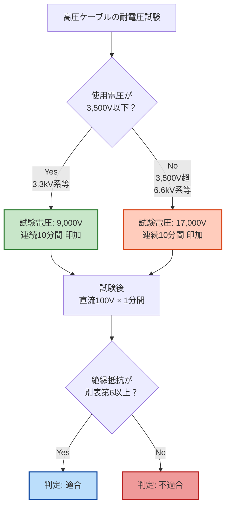

# 電技解釈 第10条 — 高圧ケーブル

!!! warning "📜 一次ソース確認のお願い（2026-05-10）"
    本ページは電気設備の技術基準の解釈（経済産業省告示）を学習用に整理したものです。電技解釈は eGov 法令API に登録されていないため、本Wikiの品質保証は経産省公式PDF（令和7年11月版）と wiki内クロスリファレンス・過去問データベース（kakomon.yml）への照合に依存しています。**重要な実務判断や試験直前の最終確認は、必ず経産省公式の最新告示PDF（[電気設備の技術基準の解釈](https://www.meti.go.jp/policy/safety_security/industrial_safety/sangyo/electric/detail/setsubi_kijun.html)）に当たってください**。誤記を発見された場合は GitHub Issues でご連絡ください。

!!! warning "⚠️ Phase C 監査警告（2026-05-10）"
    本ページは Phase D-B 修正前の旧版「電気設備の接地（A〜D種接地工事）」が **完全な誤同定** であったため、経産省告示令和7年11月版PDFの一次照合に基づき **「高圧ケーブル」** に全面書き直したページです。**A〜D種接地工事は本条ではなく [電技解釈 第17条](17.md) が正典**。旧版を引用していた外部資料・自分のノートがある場合、第10条＝接地ではなく **第10条＝高圧ケーブル** に置き換えてください。

!!! abstract "📊 試験対策メタ"
    - **出題頻度**: —（過去14年で第10条単独の穴埋出題は確認できず・kakomon.yml 第10条 登録 0件）
    - **重要度**: C（基本／高圧ケーブル選定の根拠条文として位置付ける）
    - **直近出題**: なし

> 使用電圧が **高圧の電路** に使用するケーブルが満たすべき性能基準を定める条文。**温度に耐えること**・**金属製の電気的遮へい層を有すること**・**10-1表の試験方法で交流 9,000V（使用電圧 3,500V以下）または 17,000V（3,500V超）の電圧を 10分間印加して耐えること** の3つが核心。

| 項目 | 内容 |
|------|------|
| 条文 | 電気設備の技術基準の解釈 第10条 |
| 規定内容 | 高圧ケーブルの構造・遮へい・試験電圧（耐電圧 9,000V/17,000V・10分間）等の性能基準 |
| 性格 | 性能基準（数値規定／構造規定の併存） |
| 委任元 | 電気設備に関する技術基準を定める省令 第5条第2項・第6条・第21条・第57条第1項 |
| 関連 | 第9条（低圧ケーブル）／第11条（特別高圧ケーブル）／第12条（電線の接続法）／第15条（高圧電路の絶縁性能）|
| **典拠（一次ソース）** | 電気設備の技術基準の解釈 令和7年11月版（`scripts/cache/kaishaku-meti-2025-11.pdf` L1226-1290 ／ 経産省告示） |
| **照合日** | 2026-05-10 |
| **隣接条文** | ← [第9条 低圧ケーブル（記事未作成）（低圧版の対応条文） ／ [第11条 特別高圧ケーブル（記事未作成） → |

---

## ⚡ 5秒で思い出す

- 第10条 = **高圧ケーブル** の性能基準（接地ではない／接地は [第17条](17.md)）
- 適用範囲 = **使用電圧が高圧の電路**（電気機械器具内の電路を除く）の電線に使うケーブル
- 必須構造 = **金属製の電気的遮へい層** を有すること（外装が金属なら除く・水底ケーブルの一部例外あり）
- 耐電圧試験 = **3,500V以下 → 9,000V** ／ **3,500V超 → 17,000V** ／ いずれも **連続して 10分間** 印加
- 例外で他条文のケーブル（太陽電池発電設備用直流／半導電性外装ちょう架／飛行場標識灯用）が認められる

??? question "セルフチェック: 解釈第10条＝高圧ケーブルの性能基準（省令第10条との番号一致の罠）"
    Q: 「解釈第10条＝電気設備の接地（A〜D種接地工事）」と覚えてよいか。なぜそう言えるか。

    **誤り。解釈第10条の主題は「高圧ケーブルの性能基準」で、接地ではない。** 「第10条」という番号が同じでも、**省令**と**解釈**は別の体系の別文書であり、同じ番号でもタイトルがまったく違う（省令第10条＝電気設備の接地／解釈第10条＝高圧ケーブル）。番号一致を根拠に内容を推測してはならず、接地工事の種類は **電技解釈 第17条** が正典。

??? question "セルフチェック: 耐電圧試験の電圧2段階（境界＝使用電圧の高低）"
    Q: 耐電圧試験の印加電圧が **9,000V** と **17,000V** の2段階に分かれるのはなぜか。何が境界を決めているか。

    **使用電圧の高低に応じて課す試験ストレスを変えているから。境界は使用電圧 3,500V。** 高い電圧で使うケーブルほど運用中に受ける電界ストレスが大きいため、より高い試験電圧で絶縁の健全性を確認する必要がある。結果として、**3,500V以下 → 交流 9,000V**／**3,500V超 → 交流 17,000V**、いずれも **連続して 10分間** 印加して耐える性能を求める（10-1表の試験方法）。

---

## 1. 全体像と要点

- **第10条 = 高圧ケーブル** の性能基準条文。**第9条（低圧）・第11条（特別高圧）と3点セット** で電圧階級ごとに対応する
- 構造要件 = **絶縁物で被覆 → 外装で保護 → 金属製の電気的遮へい層**（外装が金属なら不要）
- 耐電圧試験 = **9,000V または 17,000V を 10分間**（境界 3,500V）／ 直流絶縁抵抗試験 100V・1分（別表第6）も実施
- 第10条の適用除外（特殊ケーブルを使える場合）= **第46条第1項ただし書／第46条第2項／第154条の2**（太陽電池発電設備用直流ケーブル）／**第67条第一号ホ**（半導電性外装ちょう架用高圧ケーブル）／**第188条第1項第三号ロ**（飛行場標識灯用高圧ケーブル）
- 実務 = 高圧需要家の **引込ケーブル選定**・**竣工時の絶縁耐力試験** で本条文の数値を使う

### 第10条と隣接条文の役割分担

| 電圧階級 | 該当条文 | 性能基準の代表数値 |
|---|---|---|
| 低圧 | 解釈 第9条 | 別途規定（低圧用ケーブル）|
| **高圧** | **解釈 第10条**（本条） | **9,000V／17,000V × 10分間**（10-1表）|
| 特別高圧 | 解釈 第11条 | 別途規定（特別高圧ケーブル）|

??? question "セルフチェック: 高圧ケーブルの「金属製の電気的遮へい層」は何のためにあるか？"
    導体周辺の **電界を均一化** して絶縁体に局部的な高電界が掛かるのを防ぐ／**地絡時に故障電流の帰路** を確保して保護継電器を確実に動作させる／**接触安全** を高める（金属外装ケーブルでは外装が遮へい層を兼ねるため不要）。

---

## 2. 条文原文

??? note "📜 条文原文 — 経産省告示令和7年11月版（折り畳み・クリックで開く）"
    経済産業省告示「電気設備の技術基準の解釈」令和7年11月版（`scripts/cache/kaishaku-meti-2025-11.pdf` L1226-1290 / 2026-05-10 一次照合）から取得した **第10条第1項 全文**。電技解釈は eGov 法令API に登録されていないため、本ブロックは経産省PDFを正本として転記。

    **凡例**: <mark>黄色マーカー</mark> = 過去14年で穴埋め出題が想定される中核キーワード（**第10条単独の穴埋出題実績は kakomon.yml に未登録**のため、本ページの黄色マーカーは「**実出題実績ある語**」ではなく「**条文の中核数値・要件**」として暫定的に付している。要再確認）。**bold** は条文の主要語句。

    **【高圧ケーブル】（省令第5条第2項、第6条、第21条、第57条第1項）**

    **第10条** 使用電圧が<mark>高圧</mark>の電路（電気機械器具内の電路を除く。）の電線に使用するケーブルには、次の各号に適合する性能を有する高圧ケーブル、第5項各号に適合する性能を有する複合ケーブル（弱電流電線を電力保安通信線に使用するものに限る。）又はこれらのケーブルに保護被覆を施したものを使用すること。ただし、第46条第1項ただし書、同条第2項又は第154条の2の規定により太陽電池発電設備用直流ケーブルを使用する場合、第67条第一号ホの規定により半導電性外装ちょう架用高圧ケーブルを使用する場合、又は第188条第1項第三号ロの規定により飛行場標識灯用高圧ケーブルを使用する場合はこの限りでない。

    一 通常の使用状態における<mark>温度</mark>に耐えること。

    二 構造は、絶縁物で被覆した上を外装で保護した電気導体において、外装が金属である場合を除き、単心のものにあっては線心の上に、多心のものにあっては線心をまとめた上又は各線心の上に、<mark>金属製の電気的遮へい層</mark>を有するものであること。ただし、第127条第2項の規定により施設する高圧水底電線路に使用するケーブルは、外装及び金属製の電気的遮へい層を有しないものとすることができる。

    三 完成品は、次に適合するものであること。
       イ **10-1表** に規定する試験方法で、使用電圧が <mark>3,500V以下</mark> のものにあっては <mark>9,000V</mark>、使用電圧が **3,500Vを超える** ものにあっては <mark>17,000V</mark> の交流電圧を、<mark>連続して10分間</mark> 加えたとき、これに耐える性能を有すること。
       ロ イの試験の後において、金属外装ケーブルにあっては導体と外装の間、金属以外の外装のケーブルにあっては導体と遮へいとの間に、**100Vの直流電圧を1分間** 加えた後に測定した絶縁体の絶縁抵抗が、別表第6に規定する値以上であること。

    **10-1表（試験方法の概略）**

    | ケーブルの種類 | 単心／多心 | 試験方法 |
    |---|---|---|
    | 水底ケーブル以外の金属外装ケーブル | 単心 | 導体と金属外装との間に交流電圧を加える |
    | 水底ケーブル以外の金属外装ケーブル | 多心 | 導体相互間及び導体と金属外装との間に交流電圧を加える |
    | 水底ケーブル | 単心 | 清水中に1時間浸した後、導体と大地との間に交流電圧を加える |
    | 水底ケーブル | 多心 | 清水中に1時間浸した後、導体相互間及び導体と大地との間に交流電圧を加える |
    | 上記以外のケーブル | 単心 | 導体と遮へいとの間に交流電圧を加える |
    | 上記以外のケーブル | 多心 | 導体相互間及び導体と遮へいとの間に交流電圧を加える |

    **典拠**: 電気設備の技術基準の解釈 第10条第1項（経産省告示）／ 令和7年11月版PDF（`scripts/cache/kaishaku-meti-2025-11.pdf` L1226-1290）／ 2026-05-10 一次照合

    **第10条第2項以降の概要**（要点のみ・本ページの試験対策範囲外）: 第2項＝鉛被ケーブル及びアルミ被ケーブル（絶縁紙使用）／第3項＝鉛被・アルミ被ケーブルのうち第2項以外のもの並びにビニル外装・ポリエチレン外装・クロロプレン外装ケーブル／第4項＝CDケーブル／第5項＝複合ケーブル（弱電流電線を電力保安通信線に使用するものに限る）。各項とも10-1表を引用して **9,000V／17,000V × 10分間** の耐電圧試験性能を求める点で共通。

---

**以下は試験対策のための要約（条文確認の前段として）**

第10条第1項本文は、**高圧の電路** に使用するケーブルが満たすべき **性能基準** を定めるもので、構造（金属製電気的遮へい層）・耐熱性・耐電圧（9,000V／17,000V × 10分間）・絶縁抵抗（100Vdc・1分・別表第6）の4要件を一括で規定する。

| 要件 | 規定内容 |
|---|---|
| 適用範囲 | 使用電圧が **高圧** の電路の電線に使うケーブル（電気機械器具内の電路は除く）|
| 耐熱性 | 通常の使用状態の **温度** に耐えること |
| 構造 | **金属製の電気的遮へい層** を有すること（金属外装ケーブルは免除・水底ケーブルの例外あり）|
| 耐電圧試験 | **3,500V以下 → 9,000V** ／ **3,500V超 → 17,000V** を **10分間** 印加 |
| 絶縁抵抗試験 | 耐電圧試験の後、**100Vdc を 1分間** 印加して絶縁抵抗が別表第6以上 |

---

## 3. 原文解析（ブロック分解）

| 原文ブロック | 意味 | 試験のポイント |
|---|---|---|
| 「使用電圧が高圧の電路（電気機械器具内の電路を除く。）の電線に使用するケーブル」 | 適用範囲＝**高圧電路用ケーブル**（機械器具内部は対象外）| 「低圧」「特別高圧」は対象外（→ 第9条／第11条）|
| 「次の各号に適合する性能を有する高圧ケーブル…又はこれらのケーブルに保護被覆を施したものを使用すること」 | 性能基準を満たす品目のいずれかを使う義務 | 「第N号」全部に適合（一部だけでは不可）|
| 「ただし、…太陽電池発電設備用直流ケーブル／半導電性外装ちょう架用高圧ケーブル／飛行場標識灯用高圧ケーブル…はこの限りでない」 | 例外条文 | **3つの例外用途**（46条／67条／188条）を覚える |
| 「通常の使用状態における温度に耐えること」 | 第一号＝**耐熱性能** | 抽象規定。具体値は別規定 |
| 「金属製の電気的遮へい層を有するもの」 | 第二号＝**構造要件** | 「金属外装は除く」「水底ケーブルの例外」も併記 |
| 「9,000V…17,000V…連続して10分間」 | 第三号イ＝**耐電圧試験** | **3,500V境界 / 9,000V or 17,000V / 10分** がワンセット |
| 「100Vの直流電圧を1分間…別表第6」 | 第三号ロ＝**絶縁抵抗試験** | 耐電圧試験 **後** に実施する点が要注意 |

??? question "セルフチェック: 高圧ケーブルの耐電圧試験は試験電圧 9,000V/17,000V を 1分間でよいか？"
    **誤り**。条文は **連続して 10分間** と明記する。**1分間**は耐電圧試験 **後** に実施する **絶縁抵抗試験**（100Vdc）の印加時間。耐電圧試験（交流）と絶縁抵抗試験（直流）の **2つの時間を混同しない** こと。

---

## 4. かみ砕き解説（因果理解）

### なぜ高圧ケーブルに金属製の電気的遮へい層が必要か

高圧電路では絶縁体内部の **電界が極めて高く** なる。電界が不均一だと局所的に絶縁が劣化（部分放電 → 絶縁破壊）する。金属製電気的遮へい層は導体周辺の **電界を均一化** し、絶縁劣化を防ぐ役割を持つ。さらに、**地絡事故時** には故障電流が遮へい層を通って大地に戻るため、保護継電器が確実に動作できる（接地が前提）。

実務では、高圧ケーブルの遮へい層は **B種接地工事を施した接地線** と接続して大地に落とすのが一般的。第10条（ケーブル本体の規格）と [第17条](17.md)（接地工事）が施工現場で組み合わさる。

### なぜ試験電圧が 9,000V／17,000V／10分間 なのか

| 区分 | 使用電圧 | 試験電圧 | 倍率（参考）|
|---|---|---|---|
| 低い側 | 3,500V以下（典型 = 3.3kV系）| 9,000V | 約2.7倍 |
| 高い側 | 3,500V超（典型 = 6.6kV系）| 17,000V | 約2.6倍 |

- **使用電圧の約2.5〜2.7倍** の交流電圧を加える ＝ 通常運転で起こりうる **過電圧（雷インパルス・開閉サージ）** に対する **マージン確認**
- **10分間** ＝ 短時間印加では検出できない **絶縁体内部のボイド・水トリー** などの劣化を顕在化させる時間
- 試験 **後** に直流 100V × 1分間で絶縁抵抗を測ることで、耐電圧試験で絶縁が損傷していないかを **健全性確認**

!!! tip "暗記の核心"
    「**3,500V境界 ／ 9,000V／17,000V ／ 10分間 ／ 直流100V・1分（別表第6）**」を1セットで覚える。試験で問われるとしたら **倍率（約2.5〜2.7倍）** より **数値そのもの** が問われる可能性が高い。

### 例外条文の物理的意味

| 例外条文 | 用途 | なぜ例外か |
|---|---|---|
| 第46条第1項ただし書／第46条第2項／第154条の2 | 太陽電池発電設備用直流ケーブル | **直流系統** は商用周波交流の耐電圧試験（10-1表）が物理的に意味を持たない |
| 第67条第一号ホ | 半導電性外装ちょう架用高圧ケーブル | 配電線路の **ちょう架（吊り下げ）施工** 用に最適化された専用ケーブル |
| 第188条第1項第三号ロ | 飛行場標識灯用高圧ケーブル | 飛行場の **標識灯回路** に固有の規格を要求するため |

---

## 5. 図で理解

### 高圧ケーブルの基本構造（断面図のイメージ）

<svg viewBox="0 0 800 320" xmlns="http://www.w3.org/2000/svg" width="100%" preserveAspectRatio="xMidYMid meet">
<defs>
<filter id="shHV10" x="-20%" y="-20%" width="140%" height="140%"><feDropShadow dx="0" dy="2" stdDeviation="2" flood-opacity="0.15"/></filter>
</defs>
<text x="400" y="26" text-anchor="middle" font-size="15" font-weight="700" fill="#212121">高圧ケーブルの基本構造（第10条第1項第二号の要件）</text>
<text x="400" y="44" text-anchor="middle" font-size="11" fill="#666">外装が金属でない場合、金属製の電気的遮へい層が必須</text>

<circle cx="220" cy="180" r="110" fill="#fafafa" stroke="#424242" stroke-width="2" filter="url(#shHV10)"/>
<circle cx="220" cy="180" r="92" fill="#37474f" stroke="#263238" stroke-width="1"/>
<circle cx="220" cy="180" r="80" fill="#fff8e1" stroke="#f9a825" stroke-width="1"/>
<circle cx="220" cy="180" r="62" fill="#bdbdbd" stroke="#616161" stroke-width="1"/>
<circle cx="220" cy="180" r="50" fill="#fff8e1" stroke="#f9a825" stroke-width="1"/>
<circle cx="220" cy="180" r="32" fill="#ef9a9a" stroke="#c62828" stroke-width="1.5"/>
<text x="220" y="186" text-anchor="middle" font-size="11" font-weight="700" fill="#b71c1c">導体</text>

<line x1="330" y1="80" x2="220" y2="180" stroke="#9e9e9e" stroke-width="1"/>
<text x="335" y="76" font-size="11" font-weight="700" fill="#424242">外装（被覆）</text>
<text x="335" y="92" font-size="10" fill="#616161">ビニル／ポリエチレン／鉛／アルミ等</text>

<line x1="330" y1="120" x2="240" y2="180" stroke="#9e9e9e" stroke-width="1"/>
<text x="335" y="116" font-size="11" font-weight="700" fill="#1565c0">金属製の電気的遮へい層 ★</text>
<text x="335" y="132" font-size="10" fill="#1565c0">第二号 — 外装が金属でない場合 必須</text>

<line x1="330" y1="160" x2="260" y2="180" stroke="#9e9e9e" stroke-width="1"/>
<text x="335" y="156" font-size="11" font-weight="700" fill="#f57f17">絶縁体</text>
<text x="335" y="172" font-size="10" fill="#f57f17">ポリエチレン／ゴム混合物等</text>

<line x1="330" y1="200" x2="280" y2="180" stroke="#9e9e9e" stroke-width="1"/>
<text x="335" y="196" font-size="11" font-weight="700" fill="#616161">半導電層（任意）</text>
<text x="335" y="212" font-size="10" fill="#616161">電界均一化補助</text>

<line x1="330" y1="240" x2="252" y2="180" stroke="#9e9e9e" stroke-width="1"/>
<text x="335" y="236" font-size="11" font-weight="700" fill="#b71c1c">導体（銅／アルミ）</text>
<text x="335" y="252" font-size="10" fill="#b71c1c">通電部</text>

<rect x="555" y="70" width="225" height="220" rx="10" fill="#e3f2fd" stroke="#1565c0" stroke-width="1.5"/>
<text x="667" y="92" text-anchor="middle" font-size="12" font-weight="700" fill="#0d47a1">遮へい層の役割</text>
<line x1="565" y1="100" x2="770" y2="100" stroke="#1565c0" stroke-width="1"/>
<text x="565" y="120" font-size="10" font-weight="700" fill="#0d47a1">① 電界の均一化</text>
<text x="575" y="134" font-size="10" fill="#1565c0">絶縁体内の局部高電界を防止</text>
<text x="565" y="156" font-size="10" font-weight="700" fill="#0d47a1">② 地絡電流の帰路</text>
<text x="575" y="170" font-size="10" fill="#1565c0">B種接地に接続→保護継電器動作</text>
<text x="565" y="192" font-size="10" font-weight="700" fill="#0d47a1">③ 接触安全</text>
<text x="575" y="206" font-size="10" fill="#1565c0">外面を低電位に保つ</text>
<text x="565" y="228" font-size="10" font-weight="700" fill="#0d47a1">免除条件</text>
<text x="575" y="242" font-size="10" fill="#1565c0">外装が金属（鉛被／アルミ被）</text>
<text x="575" y="256" font-size="10" fill="#1565c0">→ 外装が遮へい層を兼ねる</text>
<text x="565" y="278" font-size="10" font-weight="700" fill="#bf360c">例外</text>
<text x="575" y="292" font-size="10" fill="#bf360c">第127条第2項の高圧水底電線路</text>
</svg>

**読み解き**: 高圧ケーブルは **導体 → 絶縁体 → 金属製電気的遮へい層 → 外装** という同心円構造が基本。**外装が金属の場合**（鉛被ケーブル・アルミ被ケーブル）は外装そのものが遮へい層の機能を兼ねるため、別途の遮へい層は不要。

### 耐電圧試験の判定フロー

### 「9,000V／17,000V／10分」記憶マップ

<svg viewBox="0 0 800 240" xmlns="http://www.w3.org/2000/svg" width="100%" preserveAspectRatio="xMidYMid meet">
<defs>
<filter id="shMap10" x="-20%" y="-20%" width="140%" height="140%"><feDropShadow dx="0" dy="2" stdDeviation="2" flood-opacity="0.15"/></filter>
</defs>
<text x="400" y="26" text-anchor="middle" font-size="15" font-weight="700" fill="#212121">高圧ケーブル試験電圧の暗記マップ（第10条第1項第三号イ）</text>
<text x="400" y="44" text-anchor="middle" font-size="11" fill="#666">境界 3,500V／使用電圧の約2.5〜2.7倍／時間は10分間（共通）</text>

<rect x="40" y="70" width="340" height="140" rx="14" fill="#c8e6c9" stroke="#2e7d32" stroke-width="2.5" filter="url(#shMap10)"/>
<text x="210" y="98" text-anchor="middle" font-size="14" font-weight="700" fill="#1b5e20">使用電圧 3,500V以下</text>
<text x="210" y="118" text-anchor="middle" font-size="10" fill="#1b5e20">代表 3.3kV系</text>
<line x1="80" y1="128" x2="340" y2="128" stroke="#2e7d32" stroke-width="1"/>
<text x="210" y="158" text-anchor="middle" font-size="28" font-weight="800" fill="#1b5e20">9,000V</text>
<text x="210" y="180" text-anchor="middle" font-size="13" font-weight="700" fill="#1b5e20">連続 10分間</text>
<text x="210" y="200" text-anchor="middle" font-size="10" fill="#2e7d32">使用電圧の約2.7倍</text>

<rect x="420" y="70" width="340" height="140" rx="14" fill="#ffccbc" stroke="#d84315" stroke-width="2.5" filter="url(#shMap10)"/>
<text x="590" y="98" text-anchor="middle" font-size="14" font-weight="700" fill="#bf360c">使用電圧 3,500V超</text>
<text x="590" y="118" text-anchor="middle" font-size="10" fill="#bf360c">代表 6.6kV系</text>
<line x1="460" y1="128" x2="720" y2="128" stroke="#d84315" stroke-width="1"/>
<text x="590" y="158" text-anchor="middle" font-size="28" font-weight="800" fill="#bf360c">17,000V</text>
<text x="590" y="180" text-anchor="middle" font-size="13" font-weight="700" fill="#bf360c">連続 10分間</text>
<text x="590" y="200" text-anchor="middle" font-size="10" fill="#d84315">使用電圧の約2.6倍</text>
</svg>

**読み解き**: 試験電圧は **使用電圧の約2.5〜2.7倍** の交流／時間は **10分間で共通**。境界は **3,500V**（3.3kV系と6.6kV系の中間）。実務の竣工時絶縁耐力試験では本条の数値が直接適用される。

---

## 6. 試験で問われること

第10条は kakomon.yml に単独穴埋出題実績が登録されていない（2026-05-10 時点）。出題されるとすれば以下の論点が想定される（要再確認）。

| 出題で狙われる箇所（想定） | 形式 |
|---|---|
| 「9,000V／17,000V」 | 試験電圧の数値穴埋 |
| 「3,500V」 | 境界値の数値穴埋 |
| 「10分間」 | 試験時間の数値穴埋 |
| 「金属製の電気的遮へい層」 | 構造要件の用語穴埋 |
| 「使用電圧が高圧の電路」 | 適用範囲の用語穴埋 |
| 「100V の直流電圧を1分間」 | 絶縁抵抗試験との混同 |

!!! note "出題予測（要再確認）"
    第10条の単独出題は確認されていないが、実務問題（絶縁耐力試験の試験電圧計算）や 「電技解釈の構造（第9条＝低圧／第10条＝高圧／第11条＝特別高圧）」を問う知識問題の **背景知識** として参照される可能性がある。試験対策としては **「9,000V／17,000V／10分間／3,500V境界」を 1セット** で覚えておけば足りる。

---

## 7. 頻出ひっかけ

### 🔴 致命的（これを間違えたら即失点）

1. ❌ 「電技解釈第10条 = 電気設備の接地（A〜D種接地工事）」
    - → ✅ **誤り**。第10条は **高圧ケーブル** の性能基準。**A〜D種接地工事は [電技解釈 第17条](17.md)** が正典。タイトル混同に注意

### 🟡 注意（数値の混同）

2. ❌ 「高圧ケーブルの試験電圧は使用電圧の **2倍**」
    - → ✅ 第10条が要求するのは **3,500V以下 → 9,000V**（約2.7倍）／ **3,500V超 → 17,000V**（約2.6倍）。「2倍」ではなく **固定値（9,000V／17,000V）** を覚える
3. ❌ 「耐電圧試験の印加時間は **1分間**」
    - → ✅ 耐電圧試験（交流）は **10分間**。**1分間** は試験 **後** に実施する **絶縁抵抗試験**（100Vdc）の印加時間。2つの時間を混同しない

### 🟢 軽度（条文構造の細部）

4. ❌ 「外装が金属でも電気的遮へい層は必須」
    - → ✅ **外装が金属である場合は除く**（第二号本文）。鉛被ケーブル・アルミ被ケーブルは外装が遮へい層を兼ねる
5. ❌ 「太陽電池発電設備用直流ケーブルにも本条が適用される」
    - → ✅ **第46条第1項ただし書／同条第2項／第154条の2** の規定により太陽電池発電設備用直流ケーブルを使う場合は本条適用外（ただし書）

---

## 8. 関連ページ・関連条文

### 第10条と直接関係する条文

- **[電技解釈 第17条](17.md)** — **A種・B種・C種・D種 接地工事**（旧版第10.mdが誤って扱っていたテーマの正典）
- **[電技解釈 第19条](19.md)** — **電路に係る部分の保安原則**（接地・絶縁の上位規定／系統設計）
- **[電技解釈 第29条](29.md)** — 機械器具の金属製外箱等の接地（C種・D種接地の運用条文）
- **[電技解釈 第15条](15.md)** — 高圧電路の絶縁性能（本条の数値を絶縁耐力試験に適用する関連条文）
- **[電技解釈 第12条（記事未作成）** — 電線の接続法（高圧ケーブル相互の接続要件）

### 隣接条文（電圧階級別のケーブル規定）

- **第9条** — 低圧ケーブル（本条の低圧版・3点セット）
- **第11条** — 特別高圧ケーブル（本条の特別高圧版）

### 例外条文（本条適用外となるケーブル）

- **第46条** — 太陽電池発電設備の電線
- **第67条** — 高圧架空電線路の電線
- **第127条** — 水底電線路（本条第二号ただし書の例外）
- **第154条の2** — 太陽電池発電設備の直流配線
- **第188条** — 飛行場標識灯の施設

!!! note "旧版「電気設備の接地」を参照していた読者へ"
    第10条＝接地と理解していた場合、**正しくは [第17条](17.md) 〜 第19条 を参照** してください。本ページ冒頭の Phase C 監査警告も参照。

---

## 9. 用語集

| 用語 | 説明 |
|---|---|
| 高圧 | 交流 600V を超え 7,000V 以下／直流 750V を超え 7,000V 以下（電技省令 第2条による電圧区分）|
| 電気的遮へい層 | 高圧ケーブルの絶縁体外周に設ける金属層。電界の均一化と地絡電流の帰路機能を持つ |
| 金属外装ケーブル | 外装そのものが金属（鉛被／アルミ被）のケーブル。外装が遮へい層を兼ねる |
| 耐電圧試験 | ケーブルに使用電圧の数倍の交流電圧を一定時間印加し、絶縁破壊が起きないことを確認する試験 |
| 別表第6 | 直流 100V を1分間印加した後の絶縁抵抗の最低値を規定する表（電技解釈 別表第6） |
| 10-1表 | 第10条第1項第三号イが引用する **試験方法** の表。ケーブルの種類（金属外装／水底／その他）と単心／多心の組合せで試験方法を規定 |

### 3列翻訳テーブル（日常語 ⇆ 法規表現 ⇆ 試験での意味）

| 日常語・俗称 | 法規表現（条文表現）| 試験での意味・混同注意 |
|---|---|---|
| 高圧ケーブル本体 | 使用電圧が高圧の電路に使用するケーブル | **「電気機械器具内の電路を除く」** が条文上の限定（機器内部配線は対象外）|
| シールド | 金属製の電気的遮へい層 | 「シールド」は俗称。**条文上は「金属製の電気的遮へい層」**。穴埋めは条文表現で答える |
| 鉛被ケーブル／アルミ被ケーブル | 外装が金属である場合 | **遮へい層免除** の対象（条文第二号本文）|
| 絶縁耐力試験 | 連続して10分間…これに耐える性能を有すること | **印加時間 10分間** がワンセット。1分間（絶縁抵抗試験）と混同しない |
| 試験電圧 | 9,000V（3,500V以下）／17,000V（3,500V超）の交流電圧 | **使用電圧の倍数ではなく、固定値（9,000／17,000V）** で覚える |
| 後試験（絶縁抵抗） | 100Vの直流電圧を1分間加えた後に測定した絶縁抵抗 | 耐電圧試験（交流10分）の **後** に実施する直流試験。順序が固定 |
| ケーブル接続部 | （第12条 — 電線の接続法）| 第10条はケーブル本体の規格。**接続部の施工要件は第12条** |

---

## 10. 数値検証 PASS（一次ソース照合済 2026-05-10）

**数値検証 PASS** — 本ページに記載した全数値は経産省告示令和7年11月版（`scripts/cache/kaishaku-meti-2025-11.pdf` L1226-1290）と直接照合済み。

| 数値 | 内容 | 根拠条項 | PDF行 |
|---|---|---|---|
| 9,000V | 使用電圧 3,500V以下の試験電圧 | 第10条第1項第三号イ | L1253-1255 |
| 17,000V | 使用電圧 3,500V超の試験電圧 | 第10条第1項第三号イ | L1253-1255 |
| 3,500V | 試験電圧の境界使用電圧 | 第10条第1項第三号イ | L1253-1255 |
| 10分間 | 耐電圧試験の印加時間 | 第10条第1項第三号イ | L1253-1255 |
| 100V | 絶縁抵抗試験の直流印加電圧 | 第10条第1項第三号ロ | L1278-1280 |
| 1分間 | 絶縁抵抗試験の直流印加時間 | 第10条第1項第三号ロ | L1278-1280 |

---

## 11. 過去問実績

| 年度 | 問 | 形式 | 論点 |
|---|---|---|---|
| —（kakomon.yml に第10条登録なし）| — | — | 第10条単独の穴埋出題は kakomon DB 上 0件（2026-05-10 確認）|

!!! note "R08 出題予測（要再確認）"
    第10条は単独出題実績が確認できないが、絶縁耐力試験の数値（9,000V／17,000V／10分間）は実務上重要であり、 **解釈第15条（高圧電路の絶縁性能）と組合せた論点** で問われる可能性は残る。優先度は低めだが、「9,000V／17,000V／10分間／3,500V境界」を **1セット** で覚えておくと安全。

---

## 12. 最終チェック

### 数値の核心

- [ ] **9,000V** = 使用電圧 3,500V以下の試験電圧（交流）
- [ ] **17,000V** = 使用電圧 3,500V超の試験電圧（交流）
- [ ] **3,500V** = 試験電圧の境界使用電圧
- [ ] **10分間** = 耐電圧試験の印加時間
- [ ] 試験後の絶縁抵抗試験 = **100Vdc × 1分間**（別表第6以上）

### 構造要件

- [ ] **金属製の電気的遮へい層** が必須（外装が金属の場合は除く）
- [ ] 水底電線路（第127条第2項）の例外を承知している
- [ ] **絶縁物 → 外装 → 遮へい層** の同心円構造をイメージできる

### 適用範囲・例外

- [ ] 適用範囲 = **使用電圧が高圧の電路** の電線に使うケーブル
- [ ] 「電気機械器具内の電路を除く」の条件文を承知
- [ ] 例外用途3つ（**太陽電池発電設備用直流／半導電性外装ちょう架／飛行場標識灯**）を承知

### 法令体系

- [ ] **第10条 = 高圧ケーブル**（接地ではない）
- [ ] 接地工事は **[第17条](17.md)** が正典
- [ ] 委任元 = 電技省令 第5条第2項・第6条・第21条・第57条第1項

### 紛らわしい混同対策

- [ ] 試験電圧 9,000V/17,000V は **10分間**、絶縁抵抗試験 100Vdc は **1分間**（時間の混同に注意）
- [ ] 第10条 ≠ A〜D種接地（典型的な誤同定／旧版で実際に発生した事故）

---

## 監修ログ

- **2026-04-20 v1.0**: 初版作成。「電気設備の接地（A〜D種接地工事）」として執筆（**条文同定が誤りだった可能性が後に発覚**）
- **2026-05-10 v3.0 Phase D-B修正**: 旧版「電気設備の接地」誤同定を全面書き直し（A〜D種接地は [第17条](17.md) が正典）・経産省告示PDF L1228「使用電圧が高圧の電路…のケーブル」確定情報で **「高圧ケーブル」** に主題変更
- **2026-05-10 v3.0**: オーケストレータの誤判断（途中で「低圧ケーブル」と誤推定）でロールバックされた経緯あり・最終的にPDF直接確認で「高圧ケーブル」確定
- **2026-05-10 v3.0**: 一次ソース＝経産省告示令和7年11月版 PDF（`scripts/cache/kaishaku-meti-2025-11.pdf` L1226-1290）／第10条第1項本文・第三号イ／ロ・10-1表 を全文確認。kakomon.yml 第10条 登録 0件のため出題実績は「未登録」と明記。Phase C 警告ブロックを冒頭に保持

---

*最終確認: 2026-05-10 ｜ ステータス: v3.0（高圧ケーブルへ全面書き直し・経産省告示PDF L1226-1290 一次照合済）｜ 条文番号: ✅ 経産省告示令和7年11月版PDF直接照合済（2026-05-10）｜ 出題実績: ⚠️ kakomon.yml 第10条 登録 0件（要再確認）｜ 数値根拠: ✅ PDF L1253-1280 直接転記 ｜ テンプレ世代: v2.4 ｜ [バージョニング基準](../../reference/versioning.md)*
