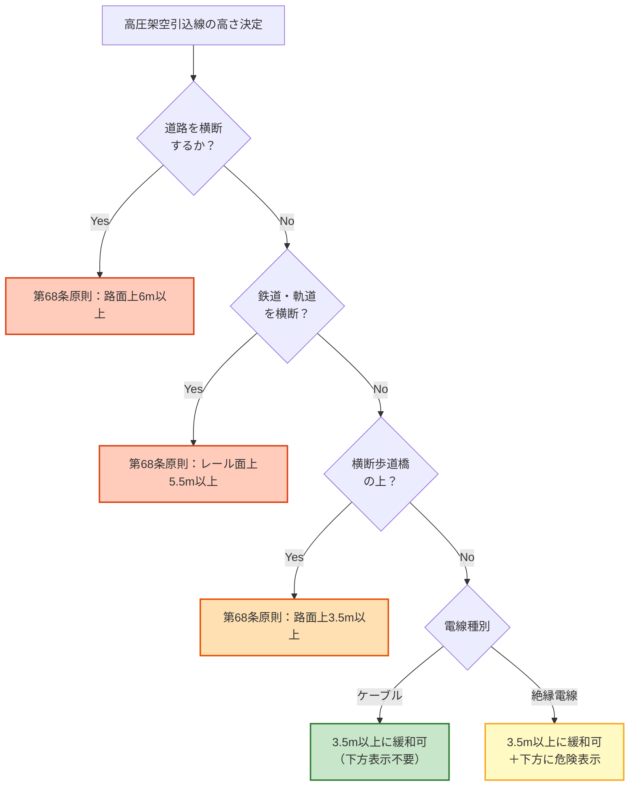

# 電技解釈 第117条 — 高圧架空引込線等の施設

!!! note "📊 試験対策メタ"
    **出題頻度**: 🔥🔥（過去14年で 2 回出題・H28＝R06上で同型再出題）

    **重要度**: B（重要・電線種類と高さ緩和の数値暗記が核）

    **直近出題**: R06上 問6（穴埋）／H28 問7（穴埋）

> 高圧架空引込線は、需要場所の引込口へ高圧電気を架空で引き込む電線路。条文は **電線の種類**（高圧絶縁電線／引下げ用高圧絶縁電線／ケーブル）、**施設方法**（がいし引き又はケーブル）、**高さ**（原則は第68条準用、条件適合で **3.5m以上** に緩和）、**ケーブル以外は下方に危険表示** の4点を規定する。穴埋め試験では **5mm／引下げ／3.5m／下方** の4キーワードがそのまま出題されている。

| 項目 | 内容 |
|------|------|
| 条文 | 電気設備の技術基準の解釈 第117条 |
| 規定内容 | 高圧架空引込線（屋側・屋上を含む）の施設要件 |
| 性格 | 施設規定（電線・施設方法・高さ・表示の組み合わせ） |
| 上位省令 | 省令 第6条（電線等の断線の防止）／第20条（電線等からの電撃の防止）／第25条（架空電線等の高さ）／第38条（連接引込線の禁止） |
| 関連 | 解釈第67条（高圧架空ケーブル工事）／第68条（低高圧架空電線の高さ）／第111条第2〜5項（高圧屋側電線路）／第116条（低圧架空引込線等の施設） |

---

## 1. 全体像と要点

- **電線の種類は3択**: ① 引張強さ **8.01**kN以上又は直径 **5**mm以上の硬銅線を使用する **高圧絶縁電線・特別高圧絶縁電線**、② **引下げ用高圧絶縁電線**、③ **ケーブル**
- **施設方法**: 絶縁電線 → **がいし引き工事**／ケーブル → **第67条**を準用
- **高さの原則**: 第68条第1項を準用（道路 6m / 鉄道 5.5m / 横断歩道橋 3.5m / その他 5m 以上）
- **緩和規定**: 道路横断・鉄道軌道横断・横断歩道橋上 のいずれにも該当しない場合は **3.5m以上** に緩和できる
- **危険表示**: ケーブル以外（裸電線ではなく絶縁電線でも）は **電線の下方に危険である旨の表示** が必要
- **連接引込線禁止**: 高圧の連接引込線は、省令第38条により原則禁止（特別の事情かつ承諾があれば例外）

### ① 全体像 — 第117条が決める4つのレイヤー

<div><svg viewBox="0 0 800 360" xmlns="http://www.w3.org/2000/svg" width="100%" preserveAspectRatio="xMidYMid meet">
<defs>
<filter id="sh117a" x="-20%" y="-20%" width="140%" height="140%"><feDropShadow dx="0" dy="2" stdDeviation="2" flood-opacity="0.15"/></filter>
<linearGradient id="gMain117" x1="0" y1="0" x2="0" y2="1"><stop offset="0%" stop-color="#bbdefb"/><stop offset="100%" stop-color="#90caf9"/></linearGradient>
<linearGradient id="g117a" x1="0" y1="0" x2="0" y2="1"><stop offset="0%" stop-color="#c8e6c9"/><stop offset="100%" stop-color="#a5d6a7"/></linearGradient>
<linearGradient id="g117b" x1="0" y1="0" x2="0" y2="1"><stop offset="0%" stop-color="#fff9c4"/><stop offset="100%" stop-color="#fff176"/></linearGradient>
<linearGradient id="g117c" x1="0" y1="0" x2="0" y2="1"><stop offset="0%" stop-color="#ffe0b2"/><stop offset="100%" stop-color="#ffb74d"/></linearGradient>
<linearGradient id="g117d" x1="0" y1="0" x2="0" y2="1"><stop offset="0%" stop-color="#ffccbc"/><stop offset="100%" stop-color="#ff8a65"/></linearGradient>
</defs>
<text x="400" y="26" text-anchor="middle" font-size="15" font-weight="700" fill="#212121">第117条 — 高圧架空引込線の4要件</text>
<text x="400" y="44" text-anchor="middle" font-size="11" fill="#666">電線・施設・高さ・表示 を1条文で束ねる施設規定</text>
<rect x="280" y="60" width="240" height="60" rx="12" fill="url(#gMain117)" stroke="#0d47a1" stroke-width="2.5" filter="url(#sh117a)"/>
<text x="400" y="85" text-anchor="middle" font-size="14" font-weight="800" fill="#0d47a1">解釈第117条</text>
<text x="400" y="105" text-anchor="middle" font-size="11" fill="#1565c0">高圧架空引込線等の施設</text>
<line x1="400" y1="125" x2="120" y2="155" stroke="#0d47a1" stroke-width="1.5" stroke-dasharray="3,2"/>
<line x1="400" y1="125" x2="307" y2="155" stroke="#0d47a1" stroke-width="1.5" stroke-dasharray="3,2"/>
<line x1="400" y1="125" x2="493" y2="155" stroke="#0d47a1" stroke-width="1.5" stroke-dasharray="3,2"/>
<line x1="400" y1="125" x2="680" y2="155" stroke="#0d47a1" stroke-width="1.5" stroke-dasharray="3,2"/>
<rect x="20" y="160" width="180" height="170" rx="14" fill="url(#g117a)" stroke="#2e7d32" stroke-width="2.5" filter="url(#sh117a)"/>
<text x="110" y="186" text-anchor="middle" font-size="13" font-weight="700" fill="#1b5e20">① 電線</text>
<line x1="40" y1="196" x2="180" y2="196" stroke="#2e7d32" stroke-width="1"/>
<text x="110" y="216" text-anchor="middle" font-size="10" fill="#1b5e20">高圧/特高絶縁電線</text>
<text x="110" y="232" text-anchor="middle" font-size="10" fill="#1b5e20">8.01kN／<tspan font-weight="800">5</tspan>mm硬銅線</text>
<text x="110" y="252" text-anchor="middle" font-size="10" fill="#1b5e20"><tspan font-weight="800">引下げ</tspan>用</text>
<text x="110" y="266" text-anchor="middle" font-size="10" fill="#1b5e20">高圧絶縁電線</text>
<text x="110" y="288" text-anchor="middle" font-size="10" fill="#1b5e20">ケーブル</text>
<text x="110" y="312" text-anchor="middle" font-size="9" fill="#2e7d32">3択のいずれか</text>
<rect x="207" y="160" width="200" height="170" rx="14" fill="url(#g117b)" stroke="#f9a825" stroke-width="2.5" filter="url(#sh117a)"/>
<text x="307" y="186" text-anchor="middle" font-size="13" font-weight="700" fill="#f57f17">② 施設方法</text>
<line x1="227" y1="196" x2="387" y2="196" stroke="#f9a825" stroke-width="1"/>
<text x="307" y="220" text-anchor="middle" font-size="11" fill="#f57f17">絶縁電線</text>
<text x="307" y="238" text-anchor="middle" font-size="11" font-weight="700" fill="#f57f17">→ がいし引き工事</text>
<text x="307" y="270" text-anchor="middle" font-size="11" fill="#f57f17">ケーブル</text>
<text x="307" y="288" text-anchor="middle" font-size="11" font-weight="700" fill="#f57f17">→ 第67条準用</text>
<text x="307" y="314" text-anchor="middle" font-size="9" fill="#f9a825">電線種別で工事方法切替</text>
<rect x="414" y="160" width="200" height="170" rx="14" fill="url(#g117c)" stroke="#e65100" stroke-width="2.5" filter="url(#sh117a)"/>
<text x="514" y="186" text-anchor="middle" font-size="13" font-weight="700" fill="#bf360c">③ 高さ</text>
<line x1="434" y1="196" x2="594" y2="196" stroke="#e65100" stroke-width="1"/>
<text x="514" y="218" text-anchor="middle" font-size="10" fill="#bf360c">原則：第68条1項準用</text>
<text x="514" y="236" text-anchor="middle" font-size="10" fill="#bf360c">（道路6m／鉄道5.5m）</text>
<text x="514" y="262" text-anchor="middle" font-size="10" fill="#bf360c">緩和：横断・橋上不該当</text>
<text x="514" y="282" text-anchor="middle" font-size="14" fill="#bf360c">→ <tspan font-weight="800">3.5</tspan><tspan font-weight="400" font-size="11">m</tspan> 以上 OK</text>
<text x="514" y="312" text-anchor="middle" font-size="9" fill="#e65100">引込専用の緩和規定</text>
<rect x="621" y="160" width="160" height="170" rx="14" fill="url(#g117d)" stroke="#d84315" stroke-width="2.5" filter="url(#sh117a)"/>
<text x="701" y="186" text-anchor="middle" font-size="13" font-weight="700" fill="#bf360c">④ 表示</text>
<line x1="641" y1="196" x2="761" y2="196" stroke="#d84315" stroke-width="1"/>
<text x="701" y="220" text-anchor="middle" font-size="10" fill="#bf360c">ケーブル以外は</text>
<text x="701" y="244" text-anchor="middle" font-size="11" fill="#bf360c">電線の <tspan font-weight="800">下方</tspan></text>
<text x="701" y="262" text-anchor="middle" font-size="11" fill="#bf360c">に <tspan font-weight="800">危険である</tspan></text>
<text x="701" y="280" text-anchor="middle" font-size="11" fill="#bf360c">旨の表示</text>
<text x="701" y="312" text-anchor="middle" font-size="9" fill="#d84315">緩和の前提条件</text>
<text x="400" y="350" text-anchor="middle" font-size="11" font-weight="700" fill="#0d47a1">2項：屋側・屋上部分は第111条第2〜5項を準用／省令第38条：高圧連接引込線は原則禁止</text>
</svg></div>

**読み解き**: 第117条は「電線」「施設方法」「高さ」「表示」の4レイヤーを束ねた**施設規定**。試験では「3.5m緩和の条件」と「下方表示の必要性」が一体で問われる（緩和を受けるなら表示も必要）。

### ② 要点（試験前30秒復習用）

| 観点 | 内容 |
|------|------|
| **電線3択** | 高圧/特高絶縁電線（**8.01**kN／**5**mm硬銅線）／**引下げ**用高圧絶縁電線／ケーブル |
| **施設方法** | 絶縁電線 → **がいし引き**工事／ケーブル → **第67条**準用 |
| **高さの緩和値** | 横断・橋上不該当なら **3.5**m以上 |
| **不適用** | 道路横断／鉄道・軌道横断／横断歩道橋上 → 緩和なし（原則の高さ） |
| **下方表示** | ケーブル**以外**は電線の **下方** に危険表示が必要 |
| **連接引込線** | 省令第38条で **原則禁止**（高圧・特高） |

??? question "セルフチェック: なぜ低圧（第116条）は2.5m緩和で済むのに、高圧（第117条）は3.5m必要なのか？"
    高圧は**接近放電（アーク放電）**のリスクがある。電線に直接触れなくても、近づくだけで空気が絶縁破壊して感電する。低圧は触れなければ大丈夫だが、高圧は **触れる前から危険距離** がある。

    そのため低圧の最低高さ（2.5m）に対し、高圧は **1m余裕を見て3.5m** が緩和下限となる。

??? question "セルフチェック: 道路を横断する高圧引込線で 3.5m に緩和できるか？"
    **できない**。条文は「道路を横断する場合・鉄道又は軌道を横断する場合・横断歩道橋の上に施設する場合」のいずれにも該当しないこと、を緩和の前提としている。道路横断は除外条件のひとつ。

    この場合は第68条第1項の原則値（道路横断は **路面上6m以上**）が適用される。

---

## 2. 条文原文

**電気設備の技術基準の解釈 第117条（高圧架空引込線等の施設）**

> 高圧架空引込線は、次の各号により施設すること。
>
> 一　電線は、次のいずれかのものであること。
>
> イ　引張強さ8.01kN以上のもの又は直径<mark>5</mark>mm以上の硬銅線を使用する、高圧絶縁電線又は特別高圧絶縁電線
>
> ロ　<mark>引下げ</mark>用高圧絶縁電線
>
> ハ　ケーブル
>
> 二　電線が絶縁電線である場合は、がいし引き工事により施設すること。
>
> 三　電線がケーブルである場合は、第67条の規定に準じて施設すること。
>
> 四　電線の高さは、第68条第1項の規定に準じること。ただし、次に適合する場合は、地表上<mark>3.5</mark>m以上とすることができる。
>
> イ　次の場合以外であること。
>
> （イ）道路を横断する場合
>
> （ロ）鉄道又は軌道を横断する場合
>
> （ハ）横断歩道橋の上に施設する場合
>
> ロ　電線がケーブル以外のものであるときは、その電線の<mark>下方</mark>に危険である旨の表示をすること。
>
> 2　高圧架空引込線の屋側部分又は屋上部分は、第111条第2項から第5項までの規定に準じて施設すること。

> <small>黄色マーカー = 過去問（H28問7・R06上問6）で実際に穴埋め出題された語句</small>

!!! note "上位省令との関係"
    省令第6条（電線等の断線の防止）・第20条（電線等からの電撃の防止）・第25条（架空電線等の高さ）の **解釈具体化**。さらに省令第38条（連接引込線の禁止）により、高圧の連接引込線は本条に拘らず原則禁止される。

### 過去問で問われた箇所

第117条は過去14年で2回出題（H28／R06上）。R06上問6は H28問7の **完全な再出題** で、4つの穴埋め箇所がまったく同じ。

| 出題で狙われるキーワード | 過去問での扱い |
|---|---|
| **5**（直径mm） | 硬銅線の最小直径として穴埋め（H28／R06上） |
| **引下げ**（用高圧絶縁電線） | 電線の種類として穴埋め（H28／R06上） |
| **3.5**（地表上m） | 緩和規定の高さとして穴埋め（H28／R06上） |
| **下方** | 危険表示の位置として穴埋め（H28／R06上） |
| **8.01**kN | 引張強さの暗記値（選択肢ひっかけで頻出） |
| **がいし引き** | 絶縁電線の施設方法（潜在的穴埋め候補） |
| **横断歩道橋** | 緩和不適用の条件（潜在的穴埋め候補） |

!!! tip "暗記の核心キーワード"
    - **8.01**kN／直径 **5**mm（硬銅線の最低スペック）
    - **引下げ**用高圧絶縁電線（条文の正式名称）
    - **3.5**m（緩和時の最低高さ）
    - **下方**に危険表示（ケーブル以外）
    - 緩和**不適用**の3条件＝**道路横断／鉄道・軌道横断／横断歩道橋上**

!!! note "出典"
    電気設備の技術基準の解釈（経済産業省 産業保安グループ電力安全課・令和7年11月版）第117条 — 引込線の施設要件全般を規定。第116条（低圧版）との対比で覚える。

---

## 3. 原文解析（ブロック分解）

条文を意味ブロック単位に分解し、それぞれの試験ポイントを整理する。

| 原文ブロック | 意味 | 試験のポイント |
|---|---|---|
| 「高圧架空引込線は、次の各号により施設すること」 | 適用範囲＝**高圧の架空引込線**（需要場所の引込口に至る部分） | 低圧は第116条／屋側・屋上部分は本条第2項で第111条準用 |
| 一号 イ「引張強さ8.01kN以上のもの又は直径5mm以上の硬銅線を使用する、高圧絶縁電線又は特別高圧絶縁電線」 | 通常の絶縁電線使用時の **電線スペック** | 「**8.01**kN／**5**mm」のセット暗記。低圧（5.26kN／4mm）と数値が違う |
| 一号 ロ「引下げ用高圧絶縁電線」 | 引下げ専用の絶縁電線（架空線を屋側に引き下ろす用途） | 「**引下げ**用」という条文の語感をそのまま暗記。「引込用」は誤り |
| 一号 ハ「ケーブル」 | 第3の選択肢 | ケーブルは無条件で使える（スペック規定なし） |
| 二号「絶縁電線である場合は、がいし引き工事により施設」 | 絶縁電線使用時の **施設方法**＝**がいし引き** | 「合成樹脂管」「金属管」は誤り。架空はがいし引き |
| 三号「ケーブルである場合は、第67条の規定に準じて施設」 | ケーブル使用時は **第67条（高圧架空ケーブル工事）準用** | ちょう架用線によるちょう架等の規定を呼び込む |
| 四号本文「高さは、第68条第1項の規定に準じる」 | 原則の高さ＝**第68条準用**（道路6m／鉄道5.5m／横断歩道橋3.5m／その他5m） | 「**第68条**」という参照先も穴埋め候補 |
| 四号ただし書き「ただし、次に適合する場合は、地表上3.5m以上とすることができる」 | **3.5m緩和** の宣言 | 「3.5m」は最も狙われる数値。「3m」「4m」の誤答に注意 |
| 四号 イ（イ）（ロ）（ハ） | 緩和**不適用**の3条件 | 「道路横断／鉄道・軌道横断／**横断歩道橋**上」の3点セット |
| 四号 ロ「ケーブル以外のものであるときは、その電線の下方に危険である旨の表示」 | **下方表示** の義務 | ケーブルなら表示不要。「**下方**」が穴埋め定番 |
| 第2項「屋側部分又は屋上部分は、第111条第2項から第5項までの規定に準じて施設」 | 屋側・屋上は第111条準用 | 第111条本則ではなく **第2〜5項のみ** 準用 |

??? question "セルフチェック: 「8.01kN は8kNと同じだから 8kN と覚えてOK」は正しいか？"
    **誤り**。条文表記は **8.01kN** で、選択肢には「8.0kN」「8.01kN」「9.0kN」が並ぶことがある。**0.01の桁まで条文どおり** に覚える。

    出題時に「8.0kN」を選ぶと不正解になるパターンが定番。

??? question "セルフチェック: 「引込用高圧絶縁電線」と書かれた選択肢があったら？"
    **不正解**。条文の正式名称は「**引下げ**用高圧絶縁電線」。「引込」「引下」「引下げ」のうち、条文どおりは「引下げ」。

    「引込線」の用途に使うのに、電線の名前は「引下げ用」というのが盲点で、ひっかけの定番。

---

## 4. かみ砕き解説（因果理解）

### 「引込線」と「引下げ（用電線）」の違い

混同しやすいが、**レイヤーが違う**用語。

| 用語 | 何を指す | 言い換え |
|------|---------|---------|
| **引込線** | 配電線（電柱）→ 需要家の建物 までの**電線路（ルート）** | 配達ルートの名前 |
| **引下げ用高圧絶縁電線** | 屋側に**引き下ろす**用途に最適化された**電線の製品種別** | そのルートで使う電線の一車種 |

つまり「**高圧引込線という"ルート"に、引下げ用高圧絶縁電線という"電線種"を使う**」という入れ子構造。条文も次の2階層で書かれている。

```
高圧架空引込線（ルートの名前）
 └ 電線は次のいずれか（このルートに使ってよい電線3択）
    ├ 高圧/特別高圧絶縁電線（8.01kN・5mm）
    ├ 引下げ用高圧絶縁電線  ← ここの「引下げ」は製品名
    └ ケーブル
```

!!! tip "覚え方：方向のイメージで区別"
    - **引込（ひきこみ）** = **横方向**のイメージ（外から中へ持ち込む）
    - **引下げ（ひきさげ）** = **縦方向**のイメージ（上から下へ降ろす）

    電柱上の架空電線から建物の屋側まで電線を **垂直に近い角度で降ろす** 用途に特化して設計された電線が「引下げ用」。曲げや支持に強く、屋側引下げの過酷な施工条件に耐える。

#### 図解：ルート（引込線）に電線種（引下げ用電線）を乗せる

<div><svg viewBox="0 0 820 440" xmlns="http://www.w3.org/2000/svg" width="100%" preserveAspectRatio="xMidYMid meet">
<defs>
<filter id="sh117r" x="-20%" y="-20%" width="140%" height="140%"><feDropShadow dx="0" dy="2" stdDeviation="2" flood-opacity="0.15"/></filter>
<marker id="arr117r" viewBox="0 0 10 10" refX="9" refY="5" markerWidth="6" markerHeight="6" orient="auto"><path d="M 0 0 L 10 5 L 0 10 z" fill="#bf360c"/></marker>
<linearGradient id="gPole117" x1="0" y1="0" x2="1" y2="0"><stop offset="0%" stop-color="#8d6e63"/><stop offset="50%" stop-color="#5d4037"/><stop offset="100%" stop-color="#8d6e63"/></linearGradient>
</defs>
<text x="410" y="22" text-anchor="middle" font-size="15" font-weight="700" fill="#212121">「引込線」＝ルート　／　「引下げ用電線」＝電線種</text>
<text x="410" y="40" text-anchor="middle" font-size="11" fill="#666">ルート（場所の名前）に、電線種（製品の名前）を組み合わせて施設する</text>
<rect x="0" y="370" width="820" height="70" fill="#a1887f" opacity="0.25"/>
<line x1="0" y1="370" x2="820" y2="370" stroke="#6d4c41" stroke-width="1.5"/>
<rect x="116" y="100" width="8" height="270" fill="url(#gPole117)"/>
<line x1="80" y1="120" x2="160" y2="120" stroke="#5d4037" stroke-width="3"/>
<rect x="346" y="100" width="8" height="270" fill="url(#gPole117)"/>
<line x1="306" y1="120" x2="386" y2="120" stroke="#5d4037" stroke-width="3"/>
<line x1="80" y1="116" x2="386" y2="116" stroke="#d32f2f" stroke-width="1.8"/>
<line x1="80" y1="124" x2="386" y2="124" stroke="#d32f2f" stroke-width="1.8"/>
<line x1="80" y1="132" x2="386" y2="132" stroke="#d32f2f" stroke-width="1.8"/>
<rect x="60" y="62" width="180" height="36" rx="4" fill="#ffebee" stroke="#d32f2f" stroke-width="1.5"/>
<text x="150" y="78" text-anchor="middle" font-size="11" font-weight="700" fill="#d32f2f">高圧配電線（外線）</text>
<text x="150" y="92" text-anchor="middle" font-size="9" fill="#d32f2f">第117条の対象外（架空電線路本体）</text>
<rect x="640" y="190" width="140" height="180" fill="#fafafa" stroke="#424242" stroke-width="1.8"/>
<polygon points="640,190 710,160 780,190" fill="#a1887f" stroke="#5d4037" stroke-width="1.5"/>
<rect x="660" y="220" width="30" height="34" fill="#90caf9" stroke="#1565c0" stroke-width="1"/>
<rect x="730" y="220" width="30" height="34" fill="#90caf9" stroke="#1565c0" stroke-width="1"/>
<rect x="690" y="290" width="40" height="80" fill="#6d4c41" stroke="#3e2723" stroke-width="1"/>
<text x="710" y="386" text-anchor="middle" font-size="10" fill="#424242">需要家（建物）</text>
<rect x="328" y="156" width="320" height="148" fill="#c8e6c9" opacity="0.22" stroke="#2e7d32" stroke-width="2" stroke-dasharray="6,3" rx="10"/>
<text x="488" y="176" text-anchor="middle" font-size="13" font-weight="800" fill="#1b5e20">高圧架空引込線（ルート）</text>
<text x="488" y="192" text-anchor="middle" font-size="10" fill="#1b5e20">外線から需要家の引込口へ電気を引き込む電線路</text>
<text x="488" y="206" text-anchor="middle" font-size="10" font-weight="700" fill="#1b5e20">第117条の対象</text>
<line x1="350" y1="135" x2="350" y2="220" stroke="#2e7d32" stroke-width="3" stroke-dasharray="4,2"/>
<text x="362" y="180" font-size="9" fill="#1b5e20">縦の引下げ</text>
<line x1="350" y1="220" x2="640" y2="240" stroke="#2e7d32" stroke-width="3" stroke-dasharray="4,2"/>
<text x="498" y="226" text-anchor="middle" font-size="9" fill="#1b5e20">横の引込（架渡し）</text>
<line x1="640" y1="240" x2="640" y2="290" stroke="#2e7d32" stroke-width="3" stroke-dasharray="4,2"/>
<text x="652" y="270" font-size="9" fill="#1b5e20">屋側引下げ</text>
<circle cx="640" cy="290" r="5" fill="#fff" stroke="#1b5e20" stroke-width="2"/>
<text x="650" y="306" font-size="9" fill="#1b5e20">引込口</text>
<rect x="20" y="248" width="270" height="116" fill="#fff" stroke="#0d47a1" stroke-width="2" rx="8" filter="url(#sh117r)"/>
<text x="155" y="270" text-anchor="middle" font-size="12" font-weight="700" fill="#0d47a1">このルートに使える電線（3択）</text>
<line x1="36" y1="278" x2="274" y2="278" stroke="#0d47a1" stroke-width="0.8"/>
<text x="40" y="296" font-size="11" fill="#1b5e20">① 高圧/特高絶縁電線（<tspan font-weight="700">5</tspan>mm/<tspan font-weight="700">8.01</tspan>kN）</text>
<rect x="36" y="304" width="238" height="22" rx="4" fill="#fff3e0" stroke="#bf360c" stroke-width="1.5"/>
<text x="40" y="320" font-size="11" font-weight="700" fill="#bf360c">② 引下げ用高圧絶縁電線　★製品名</text>
<text x="40" y="345" font-size="11" fill="#0d47a1">③ ケーブル</text>
<text x="155" y="362" text-anchor="middle" font-size="9" fill="#666">条文一号 イ・ロ・ハ のいずれか</text>
<path d="M 290 314 Q 318 280 348 220" fill="none" stroke="#bf360c" stroke-width="1.6" marker-end="url(#arr117r)" stroke-dasharray="3,2"/>
<text x="312" y="244" text-anchor="middle" font-size="10" fill="#bf360c" font-weight="700">電線種を</text>
<text x="312" y="258" text-anchor="middle" font-size="10" fill="#bf360c" font-weight="700">ルートに乗せる</text>
<rect x="540" y="312" width="240" height="48" rx="6" fill="#fffde7" stroke="#f9a825" stroke-width="1.5"/>
<text x="660" y="330" text-anchor="middle" font-size="10" font-weight="700" fill="#f57f17">屋側部分は本条 第2項</text>
<text x="660" y="346" text-anchor="middle" font-size="9" fill="#f57f17">（第111条第2〜5項を準用）</text>
<text x="410" y="416" text-anchor="middle" font-size="11" font-weight="700" fill="#212121">「引込線」（場所＝ルート）と「引下げ用電線」（製品＝電線種）は別レイヤー</text>
<text x="410" y="432" text-anchor="middle" font-size="10" fill="#666">第117条の主題は <tspan font-weight="700" fill="#1b5e20">緑のルート部分</tspan>。そこに <tspan font-weight="700" fill="#bf360c">3択の電線種</tspan> から1つを選んで施設する</text>
</svg></div>

**読み解き**: 緑の点線で囲った部分（電柱の架空線 → 屋側 → 引込口）が「**高圧引込線というルート**」。条文第117条はこのルートをどう作るかを規定する。そのルートに乗せる電線は **3択**（①高圧/特高絶縁電線・②引下げ用高圧絶縁電線・③ケーブル）で、②が **製品名としての「引下げ用」**。**ルート名と製品名は別レイヤー** であることを視覚で押さえる。

!!! note "ややこしい関連用語：配電柱内の「高圧引下げ線」"
    電柱の構造図では、横に走る高圧線から **柱上変圧器（トランス）** へ縦に降ろすジャンパ線も「**高圧引下げ線**」と呼ばれる（あなたの2枚目の参考図のラベル）。これは **配電事業者側の設備**で、第117条（需要家への引込）とは **別の場所**。

    ただし **電線製品としては同じ「引下げ用高圧絶縁電線」** を使うことが多い。つまり：

    | 「引下げ」が出てくる場面 | 場所 | 第117条の主題か |
    |---|---|---|
    | 配電柱の高圧線 → 柱上変圧器 のジャンパ | 配電事業者の設備内 | ❌ 対象外 |
    | 配電柱 → 需要家の屋側引込口 への電線路 | 需要家の引込線 | ⭕️ **対象** |
    | どちらでも使う電線製品 | カタログ上の品名 | （製品名）|

    「引下げ＝縦に降ろす」という設計思想が共通なので、**同じ製品が両方の場面で使われる**。条文用語の混乱を防ぐには「**ルートの名前か製品の名前か**」を毎回意識する。

!!! warning "選択肢に「引込用高圧絶縁電線」と書いてあったら誤り"
    条文の正式名称は **「引下げ用高圧絶縁電線」**。「引込線の用途に使う電線なのに、名前は引下げ用」というギャップがそのままひっかけポイント（H28問7・R06上問6 で実際に問われた）。

### なぜ高圧引込線は3択（しかも引下げ用）なのか

低圧引込線（第116条）と並べると、**高圧の特殊事情** が見えてくる。

| 観点 | 低圧（第116条） | 高圧（第117条） |
|------|---------------|---------------|
| 電線スペック | 引張強さ **2.30**kN以上又は **2.6**mm以上の絶縁電線 | 引張強さ **8.01**kN以上又は **5**mm以上の硬銅線 |
| 専用品 | 一般的な絶縁電線・ケーブル | **引下げ用** 高圧絶縁電線（専用品） |
| 施設方法 | がいし引き等 | **がいし引き**（必須） |
| 高さ緩和 | **2.5**m以上（特定条件） | **3.5**m以上（道路・鉄道・橋上不該当） |
| 連接引込線 | 制限はあるが施設可 | **原則禁止**（省令第38条） |

**因果**: 高圧は **接近放電** のリスクがあるため、

1. 機械的強度を高める（8.01kN・5mm硬銅線 = 低圧より太く強く）
2. 引込専用の電線設計（引下げ用高圧絶縁電線 = 屋側引下げの曲げ・支持に最適化）
3. 高さに余裕を持たせる（3.5m＝低圧+1m）
4. **裸電線は許されない**（条文に「裸」なし）

### 数値の根拠（暗記しない覚え方）

「8.01kN／5mm／3.5m」は丸暗記対象に見えるが、実は **物理現象とJIS規格** から導かれた**必然の数字**。一度ストーリーで理解すると、選択肢の「8.0」「4mm」「3m」が直感的に違和感として浮かぶようになる。

#### ① 直径5mmと8.01kNは「同じ物理量を2つの言い方で表現」

条文の「**8.01**kN以上のもの **又は** 直径**5**mm以上の硬銅線」は、別々の基準ではなく **JIS規格の硬銅線 5mm の物性値** をそのまま2軸で書いたもの。

| 対応関係 | 値 |
|---|---|
| 直径5mmの硬銅線（JIS規格品） | 断面積 約 19.6mm² |
| 硬銅線の引張強度（材料定数） | 約 408 N/mm² |
| その積（最大引張荷重） | 約 **8.0 kN** |
| 規格切上げ・実測ばらつき考慮した最低保証値 | **8.01 kN** |

→ 「**5mm 硬銅線 = 8.01kN 級**」と紐付ければ片方覚えれば足りる。「または」は **同じ電線スペックを **直径** で測ってもいいし **強度** で測ってもいい**、という意味。合金線・複合線など5mm未満でも 8.01kN を満たせばOK。

!!! tip "覚え方：「5mm 硬銅線 = 8.01kN」は1つのカードに書いて1セットで覚える"
    分けて覚えると「8.0」「8.5」「4.5kN」のひっかけに弱くなる。**1枚のカードに 5/8.01 をセット記載**して、片方を見たら相方が出てくる状態にする。

#### ② なぜ低圧2.6mm → 高圧5mm（ほぼ2倍の太さ）か

電線にかかる力は3つに分けて考えると整理しやすい。

| 力 | 内容 | 高圧線で増える理由 |
|---|---|---|
| **自重** | 電線自身の重量 | 高圧は径間が長い（柱間が広い）→ 自重の累積大 |
| **風圧荷重** | 風で電線が押される力 | 太い線は表面積も大きく荷重↑だが、強度↑が上回る設計 |
| **断線リスク** | 切れたときの波及範囲 | 高圧切れ＝地絡・火災・周辺停電。**安全率を高めに取る** |

つまり **「低圧2.6mm vs 高圧5mm」の段差は電圧差ではなく "切れた時の被害の差" を反映** している。電圧2倍だから線も2倍、ではない（電圧は絶縁の話、太さは機械強度の話）。

#### ③ 緩和高さ3.5m — 身体感覚で覚える

3.5mは **「人間が工具・運搬物を持ち上げても直接触れない最低ライン」** という実用設計値。

| 高さの目安 | 状況 |
|---|---|
| 〜1.7m | 一般成人の身長 |
| 〜2.0m | 手を伸ばして届く |
| 〜2.5m | **低圧緩和**（人だけ通る場所）— 触らなければ安全 |
| 〜3.0m | 梯子・棒・運搬物を頭上に持ち上げる |
| **3.5m** | **高圧緩和**— 工具を持ち上げても **直接接触はしない** |

しかも 3.5m は条文間で**意図的に揃えられている数字**。

- **第68条**「**横断歩道橋上**の架空電線」: 路面上 **3.5m**（歩道橋上で人が立っても触れない）
- **第117条**「高圧架空引込線の緩和」: 地表上 **3.5m**（同じ思想）

→ 「**3.5m＝歩道橋の上に人が立っても届かない高さ**」と紐付けると忘れない。

#### ④ 「+1m」の物理的意味（低圧2.5m → 高圧3.5m）

低圧と高圧の差「+1m」は、偶然の値ではなく **接近放電（アーク放電）の安全距離** に由来する。

- 低圧（〜600V）: 触れなければ感電しない → **手の届かない 2.5m** で足りる
- 高圧（600V超〜7,000V）: **空気の絶縁破壊で接触前に感電する** → 接近放電の安全距離 約1m を上乗せ

空気の絶縁破壊電圧は **約3kV/mm**（標準条件下）= **1mで約3,000kV** の見当だが、湿度・尖端電極効果・サージ等を見込むと、**高圧（最大7kV）に対して安全マージン1m**が実用設計値。これが「**+1m**」の出どころ。

→ 「**低圧2.5m + 接近放電1m = 高圧3.5m**」と式で覚えるのではなく、**「電圧が高いと近づくだけで危ない → だから1m余分に離す」** という物理イメージで記憶する。

!!! tip "覚え方：4つの数字を1本のストーリーで束ねる"
    「**5mmの硬銅線（=8.01kN）を、人が工具を持ち上げても届かない3.5mの高さ（=歩道橋上＋接近放電1mの余裕）に張る**」

    これを音読すると、4つの数字（5・8.01・3.5・+1）がひとつの場面として頭に入る。**バラバラに暗記しない**のが核心。

### 「3.5m緩和」の論理

条文は「原則 = 第68条準用（最も厳しいケースで道路6m）」を出発点に、**引込線の特性**（短い区間・需要家敷地内・取扱者が予測可能）を踏まえて緩和を許容する。

ただし、緩和には **2つの条件** が連動する：

| 条件 | 内容 | なぜ |
|------|------|------|
| **横断・橋上の不該当** | 道路横断・鉄道軌道横断・横断歩道橋上 のいずれにも該当しないこと | 不特定多数の通行リスクが高い場所では緩和不可 |
| **下方表示** | ケーブル以外なら下方に危険表示 | 低い高さ（3.5m）では作業者が誤って近づく恐れ。可視化で予防 |

??? question "セルフチェック: ケーブルなら下方表示は不要？"
    **その通り**。条文「ケーブル以外のものであるときは…表示をすること」は裏返せばケーブルは表示義務から除外。

    理由：ケーブルは外被（シース）で覆われており、外見からも「危険な裸絶縁電線ではない」と判別しやすい。一方、引下げ用絶縁電線は外被が薄く、誤接触のリスクが残る。

### 連接引込線の禁止（省令第38条）

第117条本文には書かれないが、**省令第38条** が「高圧又は特別高圧の連接引込線は施設してはならない」と明確に禁止している。

> 連接引込線：1需要家の引込線から分岐して、2軒目以降に供給する形の引込線

低圧では条件付きで施設可だが、高圧は **1需要家ごとに個別の引込線が必要**。これは事故波及を1需要家に限定するためのリスク管理。

!!! warning "ひっかけ：「ただし書きで連接引込線も施設可能」"
    省令第38条に「ただし、特別の事情があり、かつ造営物の所有者又は占有者の承諾を得た場合は、この限りでない」とあるため、形式上は **例外規定で施設可** になる。

    しかし試験での原則回答は **「高圧連接引込線は原則禁止」**。例外条項を選ばせる問題は稀で、「禁止」を覚えるのが第一。

---

## 5. 図で理解

### 判定フロー（高さの選び方）



### 電線3択と施設方法のひも付き

<div><svg viewBox="0 0 800 320" xmlns="http://www.w3.org/2000/svg" width="100%" preserveAspectRatio="xMidYMid meet">
<defs>
<filter id="sh117b" x="-20%" y="-20%" width="140%" height="140%"><feDropShadow dx="0" dy="2" stdDeviation="2" flood-opacity="0.15"/></filter>
</defs>
<text x="400" y="26" text-anchor="middle" font-size="15" font-weight="700" fill="#212121">電線種別 → 施設方法 → 表示要否</text>
<text x="400" y="44" text-anchor="middle" font-size="11" fill="#666">3択の電線が、施設方法と表示義務を一意に決める</text>
<rect x="40" y="64" width="200" height="220" rx="12" fill="#e8f5e9" stroke="#2e7d32" stroke-width="2" filter="url(#sh117b)"/>
<text x="140" y="88" text-anchor="middle" font-size="12" font-weight="700" fill="#1b5e20">① 高圧/特高絶縁電線</text>
<line x1="60" y1="98" x2="220" y2="98" stroke="#2e7d32" stroke-width="1"/>
<text x="140" y="120" text-anchor="middle" font-size="10" fill="#1b5e20">引張強さ <tspan font-weight="700">8.01</tspan>kN以上</text>
<text x="140" y="138" text-anchor="middle" font-size="10" fill="#1b5e20">又は直径 <tspan font-weight="700">5</tspan>mm以上の硬銅線</text>
<line x1="80" y1="158" x2="200" y2="158" stroke="#2e7d32" stroke-width="1" stroke-dasharray="2,2"/>
<text x="140" y="180" text-anchor="middle" font-size="11" font-weight="700" fill="#1b5e20">→ がいし引き工事</text>
<line x1="80" y1="198" x2="200" y2="198" stroke="#2e7d32" stroke-width="1" stroke-dasharray="2,2"/>
<text x="140" y="220" text-anchor="middle" font-size="10" fill="#bf360c">⚠ 下方に危険表示</text>
<text x="140" y="238" text-anchor="middle" font-size="9" fill="#bf360c">（ケーブル以外なので必要）</text>
<text x="140" y="266" text-anchor="middle" font-size="9" fill="#2e7d32">短距離・端子接続部に多用</text>
<rect x="300" y="64" width="200" height="220" rx="12" fill="#fffde7" stroke="#f9a825" stroke-width="2" filter="url(#sh117b)"/>
<text x="400" y="88" text-anchor="middle" font-size="12" font-weight="700" fill="#f57f17">② 引下げ用高圧絶縁電線</text>
<line x1="320" y1="98" x2="480" y2="98" stroke="#f9a825" stroke-width="1"/>
<text x="400" y="120" text-anchor="middle" font-size="10" fill="#f57f17">引下げ専用設計</text>
<text x="400" y="138" text-anchor="middle" font-size="10" fill="#f57f17">（屋側への引下げ用途に最適化）</text>
<line x1="340" y1="158" x2="460" y2="158" stroke="#f9a825" stroke-width="1" stroke-dasharray="2,2"/>
<text x="400" y="180" text-anchor="middle" font-size="11" font-weight="700" fill="#f57f17">→ がいし引き工事</text>
<line x1="340" y1="198" x2="460" y2="198" stroke="#f9a825" stroke-width="1" stroke-dasharray="2,2"/>
<text x="400" y="220" text-anchor="middle" font-size="10" fill="#bf360c">⚠ 下方に危険表示</text>
<text x="400" y="238" text-anchor="middle" font-size="9" fill="#bf360c">（絶縁電線なので必要）</text>
<text x="400" y="266" text-anchor="middle" font-size="9" fill="#f9a825">引込の主流（柔軟性高い）</text>
<rect x="560" y="64" width="200" height="220" rx="12" fill="#e3f2fd" stroke="#1565c0" stroke-width="2" filter="url(#sh117b)"/>
<text x="660" y="88" text-anchor="middle" font-size="12" font-weight="700" fill="#0d47a1">③ ケーブル</text>
<line x1="580" y1="98" x2="740" y2="98" stroke="#1565c0" stroke-width="1"/>
<text x="660" y="120" text-anchor="middle" font-size="10" fill="#0d47a1">高圧用ケーブル</text>
<text x="660" y="138" text-anchor="middle" font-size="10" fill="#0d47a1">（CV／CVT等）</text>
<line x1="600" y1="158" x2="720" y2="158" stroke="#1565c0" stroke-width="1" stroke-dasharray="2,2"/>
<text x="660" y="180" text-anchor="middle" font-size="11" font-weight="700" fill="#0d47a1">→ 第67条準用</text>
<text x="660" y="196" text-anchor="middle" font-size="9" fill="#0d47a1">（ちょう架等の規定）</text>
<line x1="600" y1="208" x2="720" y2="208" stroke="#1565c0" stroke-width="1" stroke-dasharray="2,2"/>
<text x="660" y="228" text-anchor="middle" font-size="10" fill="#2e7d32">✅ 下方表示は不要</text>
<text x="660" y="246" text-anchor="middle" font-size="9" fill="#2e7d32">（ケーブルなので除外）</text>
<text x="660" y="266" text-anchor="middle" font-size="9" fill="#0d47a1">高層・市街地で多用</text>
</svg></div>

**読み解き**: 電線3択のうち①②（絶縁電線）は **がいし引き＋下方表示** がセット、③（ケーブル）だけ **第67条準用＋下方表示なし**。試験で「ケーブルでも下方表示が必要」とあれば誤り。

### 緩和条件と原則高さの位置関係（断面イメージ）

<div><svg viewBox="0 0 800 360" xmlns="http://www.w3.org/2000/svg" width="100%" preserveAspectRatio="xMidYMid meet">
<defs>
<filter id="sh117c" x="-20%" y="-20%" width="140%" height="140%"><feDropShadow dx="0" dy="2" stdDeviation="2" flood-opacity="0.12"/></filter>
</defs>
<text x="400" y="22" text-anchor="middle" font-size="15" font-weight="700" fill="#212121">高さの基準値マップ — 第68条原則 vs 第117条緩和</text>
<text x="400" y="40" text-anchor="middle" font-size="11" fill="#666">引込線特有の3.5m緩和は「横断・橋上の不該当」が前提</text>
<line x1="60" y1="320" x2="740" y2="320" stroke="#5d4037" stroke-width="3"/>
<rect x="60" y="320" width="680" height="20" fill="#8d6e63" opacity="0.4"/>
<text x="40" y="324" text-anchor="end" font-size="10" fill="#5d4037">地表</text>
<line x1="80" y1="320" x2="80" y2="115" stroke="#9e9e9e" stroke-width="0.8" stroke-dasharray="2,3"/>
<line x1="80" y1="115" x2="200" y2="115" stroke="#d84315" stroke-width="2.5"/>
<polygon points="80,320 80,115 84,115 84,320" fill="#ffccbc" opacity="0.5"/>
<text x="140" y="105" text-anchor="middle" font-size="11" font-weight="700" fill="#bf360c">道路横断: 6m</text>
<text x="140" y="135" text-anchor="middle" font-size="9" fill="#bf360c">第68条原則</text>
<line x1="240" y1="320" x2="240" y2="135" stroke="#9e9e9e" stroke-width="0.8" stroke-dasharray="2,3"/>
<line x1="240" y1="135" x2="350" y2="135" stroke="#e65100" stroke-width="2.5"/>
<polygon points="240,320 240,135 244,135 244,320" fill="#ffe0b2" opacity="0.5"/>
<text x="295" y="125" text-anchor="middle" font-size="11" font-weight="700" fill="#bf360c">鉄道横断: 5.5m</text>
<text x="295" y="155" text-anchor="middle" font-size="9" fill="#bf360c">第68条原則</text>
<line x1="380" y1="320" x2="380" y2="160" stroke="#9e9e9e" stroke-width="0.8" stroke-dasharray="2,3"/>
<line x1="380" y1="160" x2="490" y2="160" stroke="#f9a825" stroke-width="2.5"/>
<polygon points="380,320 380,160 384,160 384,320" fill="#fff9c4" opacity="0.5"/>
<text x="435" y="150" text-anchor="middle" font-size="11" font-weight="700" fill="#f57f17">その他原則: 5m</text>
<text x="435" y="180" text-anchor="middle" font-size="9" fill="#f57f17">第68条原則</text>
<line x1="520" y1="320" x2="520" y2="225" stroke="#9e9e9e" stroke-width="0.8" stroke-dasharray="2,3"/>
<line x1="520" y1="225" x2="700" y2="225" stroke="#2e7d32" stroke-width="3"/>
<polygon points="520,320 520,225 700,225 700,320" fill="#c8e6c9" opacity="0.5"/>
<text x="610" y="215" text-anchor="middle" font-size="13" font-weight="800" fill="#1b5e20">第117条緩和: 3.5m</text>
<text x="610" y="245" text-anchor="middle" font-size="10" fill="#1b5e20">引込線特有の緩和</text>
<text x="610" y="263" text-anchor="middle" font-size="9" fill="#1b5e20">（横断・橋上のいずれにも該当しないとき）</text>
<text x="610" y="285" text-anchor="middle" font-size="9" fill="#bf360c">＋ ケーブル以外は下方に危険表示</text>
<line x1="60" y1="115" x2="730" y2="115" stroke="#bf360c" stroke-width="1" stroke-dasharray="3,3"/>
<text x="745" y="118" font-size="9" fill="#bf360c">6m</text>
<line x1="60" y1="135" x2="730" y2="135" stroke="#e65100" stroke-width="1" stroke-dasharray="3,3"/>
<text x="745" y="138" font-size="9" fill="#e65100">5.5m</text>
<line x1="60" y1="160" x2="730" y2="160" stroke="#f9a825" stroke-width="1" stroke-dasharray="3,3"/>
<text x="745" y="163" font-size="9" fill="#f9a825">5m</text>
<line x1="60" y1="225" x2="730" y2="225" stroke="#2e7d32" stroke-width="1.5" stroke-dasharray="3,3"/>
<text x="745" y="228" font-size="9" font-weight="700" fill="#2e7d32">3.5m</text>
</svg></div>

**読み解き**: 第68条原則は3レベル（6m／5.5m／5m）に分かれる。緩和の3.5mは **「その他原則の5m」をさらに1.5m下げた値**。緩和を受けるには「横断・橋上不該当」をクリアしなければならず、原則と緩和の使い分けが論点。

---

## 6. 第116条（低圧）との対比

低圧引込線（第116条）と数値・要件を並べ、ペアで暗記する。

| 観点 | 第116条（低圧） | 第117条（高圧） |
|------|---------------|---------------|
| 引張強さ／直径 | **2.30**kN／**2.6**mm（一般）／**1.38**kN／**2.0**mm（径間15m以下のときの絶縁電線等） | **8.01**kN／**5**mm |
| 専用品 | — | **引下げ**用高圧絶縁電線 |
| 施設方法 | — | **がいし引き**（絶縁電線のとき） |
| 高さ原則 | 第68条第1項に準じる（道路4m／鉄道5.5m／その他4m） | 第68条第1項に準じる（道路6m／鉄道5.5m／橋上3.5m／その他5m） |
| 高さ緩和 | **2.5**m以上（特定条件） | **3.5**m以上（横断・橋上不該当） |
| 下方表示 | 規定なし | **ケーブル以外**は下方に危険表示 |
| 連接引込線 | 第106条で条件付き施設可 | 省令第38条で **原則禁止** |

!!! tip "ペア暗記の核心"
    数値の段差を **「低圧 → 高圧」で約2倍** とイメージ：

    - 引張強さ: **2.30** → **8.01**kN（約3.5倍）
    - 直径: **2.6** → **5**mm（約2倍）
    - 高さ緩和: **2.5** → **3.5**m（+1m）

    高さは「+1m」、機械強度は「2〜3.5倍」と覚えると、低圧と取り違えない。

---

## 7. 頻出ひっかけ・落とし穴

試験で実際に失点しやすいポイントを、重大度別に整理した。

### 🔴 致命的（これを間違えたら即失点）

| # | ❌ 誤った認識 | ✅ 正しい認識 |
|---|--------------|--------------|
| 1 | 直径 **4**mm以上の硬銅線でよい | **5**mm以上の硬銅線（高圧版）。低圧用の4mmと取り違えない |
| 2 | 緩和時の高さは **3**m以上 | **3.5**m以上。0.5mの差で正誤が分かれる定番ひっかけ |
| 3 | 引込線だから **連接引込線も施設可** | 省令第38条で**原則禁止**（高圧・特高） |

### 🟡 注意（出題頻度高い）

| # | ❌ 誤った認識 | ✅ 正しい認識 |
|---|--------------|--------------|
| 4 | 「引込用高圧絶縁電線」が条文の正式名 | 正式名称は **「引下げ用高圧絶縁電線」**。「引込」「引下」は誤字 |
| 5 | 道路を横断する場合でも **3.5m緩和可** | 緩和の前提条件が **道路・鉄道横断・横断歩道橋上の不該当**。道路横断は緩和不可 |
| 6 | ケーブルでも **下方に危険表示** が必要 | 表示義務は「**ケーブル以外**」のとき。ケーブルは表示不要 |
| 7 | 引張強さは **8.0**kN以上 | 条文どおり **8.01**kN以上。0.01桁まで覚える |

### 🟢 軽微（余裕があれば）

| # | ❌ 誤った認識 | ✅ 正しい認識 |
|---|--------------|--------------|
| 8 | 屋側部分は **本条1項** で規定 | 屋側・屋上部分は **第2項** で **第111条第2〜5項を準用** |
| 9 | ケーブルは **第68条** を準用 | ケーブルの施設方法は **第67条**（高圧架空ケーブル工事）を準用 |
| 10 | 緩和不適用は **道路横断・鉄道横断の2つ** | **道路横断／鉄道又は軌道横断／横断歩道橋上の3つ**。横断歩道橋を忘れない |

---

## 8. 穴埋め過去問チャレンジ

!!! abstract "問題1: 電線の種類"
    高圧架空引込線において、電線が高圧絶縁電線又は特別高圧絶縁電線である場合、引張強さ 8.01kN 以上のもの又は直径（　ア　）mm 以上の硬銅線を使用する。また、（　イ　）用高圧絶縁電線、又はケーブルを使用することができる。

??? success "解答"
    - ア = **5**
    - イ = **引下げ**

    H28問7・R06上問6 で実際に問われた箇所。「**引下げ**」は条文の正式名称であり、「引込」「引下」と書くと不正解。

!!! abstract "問題2: 高さの緩和"
    高圧架空引込線の電線の高さは原則として第68条第1項の規定に準じるが、道路・鉄道又は軌道・横断歩道橋上のいずれにも該当しない場合は、地表上（　ウ　）m 以上とすることができる。

??? success "解答"
    - ウ = **3.5**

    「3m」「4m」のひっかけ選択肢が定番。低圧（第116条）の **2.5**m と取り違えないこと。

!!! abstract "問題3: 危険表示"
    緩和規定により地表上3.5m以上で施設する場合において、電線がケーブル以外のものであるときは、その電線の（　エ　）に危険である旨の表示をすること。

??? success "解答"
    - エ = **下方**

    上方／側面ではなく **下方**。地上から視認できる位置に表示することで、作業者が誤って近づくのを防ぐ。

!!! abstract "問題4: ケーブル時の準用条文"
    高圧架空引込線において、電線がケーブルである場合は、第（　オ　）条の規定に準じて施設すること。

??? success "解答"
    - オ = **67**

    第67条＝**高圧架空電線路のケーブル工事**（ちょう架用線等）。低圧のケーブル準用条文（第67条）と同じ番号なので混乱しないこと。

---

## 9. まぎらわしい選択肢と正解の違い

| 誤った記述 | 正しい記述 | なぜ違うか |
|---|---|---|
| 「直径 **4**mm 以上の硬銅線」 | **5**mm 以上の硬銅線 | 4mm は **低圧**（第116条）の規定。高圧は5mm |
| 「**引込**用高圧絶縁電線」 | **引下げ**用高圧絶縁電線 | 条文の正式名称は「引下げ用」。引込線の用途でも電線名は引下げ |
| 「地表上 **3**m 以上に緩和」 | 地表上 **3.5**m 以上 | 0.5m の差。低圧（2.5m）と取り違えないこと |
| 「電線の **上方** に危険表示」 | 電線の **下方** に危険表示 | 地上から視認できるよう **下方**。条文どおり |
| 「**ケーブル**でも下方に危険表示が必要」 | **ケーブル以外**のときに下方表示が必要 | ケーブルは外被があり、表示義務から除外 |
| 「道路横断時も **3.5m に緩和**できる」 | 道路横断は緩和**不適用**。原則の **6m以上** | 緩和は「横断・橋上不該当」が条件 |
| 「高圧連接引込線は **常に施設可** 」 | 省令第38条で **原則禁止** | 例外条項はあるが、原則は禁止 |

---

## 10. 関連条文・関連ページ

- [電技解釈 第59条：架空電線路の支持物](59.md) — 引込線を支える支持物の強度
- [電技解釈 第65条：架空電線の高さ](65.md) — 高さ規定の総則
- [電技解釈 第68条：低高圧架空電線の施設](68.md) — **本条が高さで準用する条文**
- [電技解釈 第71条：高圧架空電線の施設](71.md) — 高圧架空線本体の規定（引込線は本条）
- 電技解釈 第67条：高圧架空電線路のケーブル工事 — **本条がケーブル時に準用**
- 電技解釈 第111条第2〜5項：高圧屋側電線路の施設 — **本条第2項で屋側・屋上部分が準用**
- 電技解釈 第116条：低圧架空引込線等の施設 — **低圧版（ペアで暗記）**
- 省令第38条：連接引込線の禁止 — 高圧・特高の連接引込線は原則禁止
- [架空電線路テーマ](../../themes/kachiku-densen.md) — 架空電線路全体の横展開

---

## 11. 過去問実績

| 年度 | 問 | 形式 | 論点 |
|------|-----|------|------|
| R06上 | 問6 | 穴埋 | 高圧架空引込線の施設（H28再出題） |
| H28 | 問7 | 穴埋 | 高圧架空引込線の施設 |

!!! note "出題傾向"
    過去14年で2回出題。R06上 問6 は H28 問7 の **完全な再出題**（4つの穴埋め箇所がそのまま）。穴埋め4ヶ所は **5（mm）／引下げ／3.5（m）／下方** の固定セット。

!!! note "R08 出題予測"
    短期再出題（H28→R06上が8年差）の傾向から、R08までに再出題される可能性は低めだが、低圧版（第116条）は近年（R04下／R06下）に出題されており、**「低圧と高圧をペアで対比する横断問題」** として出る可能性はある。

    数値（**5**mm／**8.01**kN／**3.5**m）と「**引下げ**用」「**下方**表示」の語句は確実に押さえる。

---

## 12. 用語集

第117条の条文や出題で登場する主要用語を整理した。

| 用語 | 読み | 意味 | 試験での注意点 |
|------|------|------|----------------|
| 高圧架空引込線 | こうあつかくうひきこみせん | 高圧の電気を需要場所の引込口へ架空で引き込む電線路 | 屋側・屋上部分を含めて第117条が規定 |
| 引込線 | ひきこみせん | 一需要場所の取付け点から構内の引込口に至る電線 | 「連接引込線」とは別概念（高圧連接は原則禁止） |
| 連接引込線 | れんせつひきこみせん | 1需要家の引込線から分岐して、隣接する別需要家にも供給する形の引込線 | 高圧・特高は省令第38条で **原則禁止** |
| 引下げ用高圧絶縁電線 | ひきさげようこうあつぜつえんでんせん | 屋側引下げを含む引込用途に最適化された高圧絶縁電線 | 条文の正式名称。「引込用」と書くと誤り |
| 高圧絶縁電線 | こうあつぜつえんでんせん | 高圧電路用の絶縁電線（一般用） | 高圧引込線では **8.01kN／5mm硬銅線** のスペックが要求される |
| ケーブル | けーぶる | 導体を絶縁体・シース等で被覆した電線。CV/CVT等が代表例 | 第117条ではケーブル使用時のみ下方表示が **不要** |
| がいし引き工事 | がいしびきこうじ | がいしで電線を絶縁支持して敷設する工事方法 | 絶縁電線使用時の必須施設方法 |
| 横断歩道橋 | おうだんほどうきょう | 道路をまたぐ歩行者用の橋 | 緩和不適用の3条件のひとつ。試験で見落としやすい |
| 下方表示 | かほうひょうじ | 電線の下方に「危険である」旨を表示すること | 地上から見える位置に表示。条文どおり「下方」 |
| 第67条準用 | だいろくじゅうななじょうじゅんよう | ケーブル使用時に第67条（高圧架空ケーブル工事）の規定を適用すること | ちょう架用線等の規定が呼び込まれる |

---

## 13. 最終チェック

### 数値暗記

- [ ] 引張強さ **8.01**kN以上又は直径 **5**mm以上の硬銅線
- [ ] 緩和時の高さ = 地表上 **3.5**m以上
- [ ] 原則の高さ（第68条準用）= 道路 **6**m／鉄道 **5.5**m／橋上 **3.5**m／その他 **5**m
- [ ] 低圧の対応値（第116条）= 引張強さ **2.30**kN／**2.6**mm／緩和 **2.5**m

### 条文キーワード

- [ ] 電線3択 = 高圧/特高絶縁電線（**8.01**kN／**5**mm）／**引下げ**用高圧絶縁電線／**ケーブル**
- [ ] 絶縁電線 → **がいし引き** 工事
- [ ] ケーブル → 第 **67** 条準用
- [ ] 高さ原則 → 第 **68** 条第1項準用
- [ ] ケーブル以外 → **下方** に危険表示

### 緩和の論理

- [ ] 緩和不適用の3条件 = **道路横断／鉄道又は軌道横断／横断歩道橋上**
- [ ] 緩和を受ける場合は **下方表示** がセット（ケーブル以外）

### 関連条文

- [ ] 屋側・屋上部分 → 本条 **第2項**で **第111条第2〜5項** を準用
- [ ] 高圧連接引込線 → 省令 **第38条** で原則禁止
- [ ] 低圧版 → **第116条**（ペアで暗記）

### ひっかけ対策

- [ ] 「**4**mm」は誤り → **5**mm
- [ ] 「**3**m緩和」は誤り → **3.5**m
- [ ] 「**引込**用」は誤り → **引下げ**用
- [ ] 「**上方**表示」は誤り → **下方**表示
- [ ] 「ケーブルも表示必要」は誤り → ケーブル以外のとき必要

---

## 監修ログ

- **2026-05-05**: 新規作成（v1.0）。kijun/58.md v2.2 ゴールドスタンダードに準拠して14セクション完備。条文原文は denken-ou H28問7・R06上問6 の正解情報および電験3種対策-MACの法令引用と照合し、第1項各号（一〜四）と第2項（第111条第2〜5項準用）を確定。穴埋めキーワード4点（5／引下げ／3.5／下方）に `<mark>` を付与。
- **2026-05-05**: v1.1。第4章冒頭に「引込線 vs 引下げ用電線」の用語整理ブロックを追加（横方向＝引込／縦方向＝引下げ のイメージ／2階層構造の図解）。H28問7・R06上問6で「引込用高圧絶縁電線」が誤答ひっかけになる文脈を明示化。
- **2026-05-05**: v1.2。第4章に「数値の根拠（暗記しない覚え方）」サブセクション追加。4つの主要数値（**5**mm／**8.01**kN／**3.5**m／+1m）を物理現象・JIS規格・身体感覚・接近放電の安全距離 にひも付け、4数値を1本のストーリー（「5mm硬銅線を3.5m高さに張る」）に束ねる記憶モデルを提示。
- **2026-05-05**: v1.3。「引込線（ルート）vs 引下げ用電線（電線種）」を視覚化するSVG図を第4章に追加（電柱→屋側→引込口の緑ルート＋電線3択ピル＋"電線種をルートに乗せる"の矢印）。配電柱内の「高圧引下げ線」（柱上変圧器ジャンパ）と需要家への高圧引込線が **同じ電線製品を別の場所で使う** 関係を表で整理し、ユーザー混乱の根本原因を解消。

---

*最終確認: 2026-05-05 | ステータス: v1.3（ルート vs 電線種の図解追加） | [バージョニング基準](../../reference/versioning.md)*
