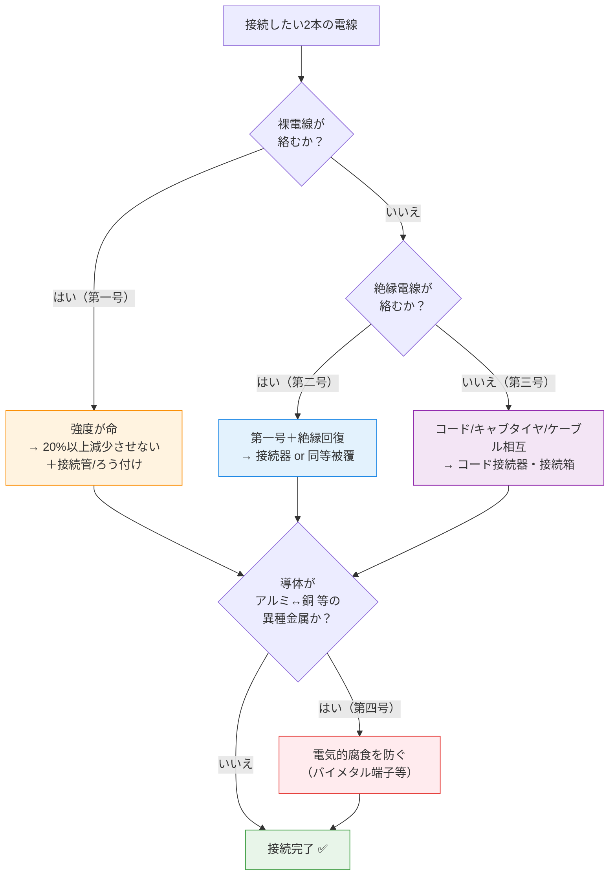
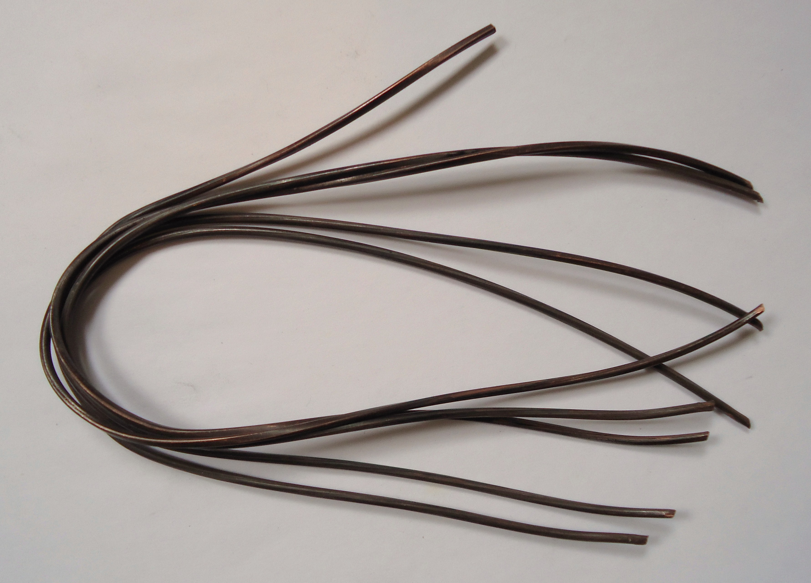
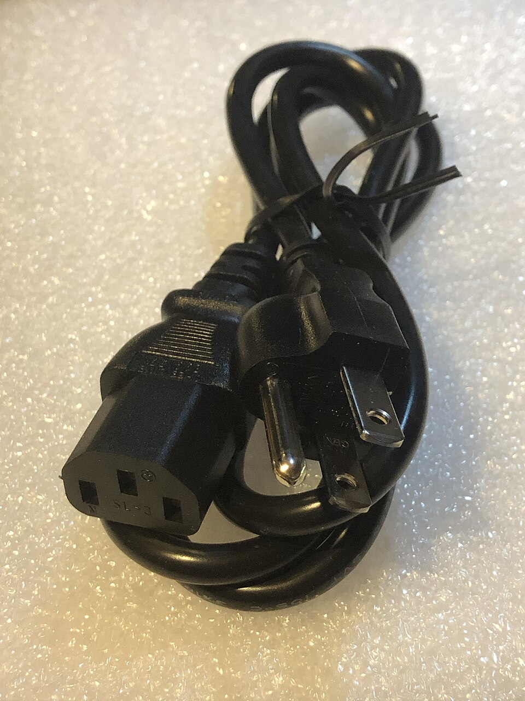
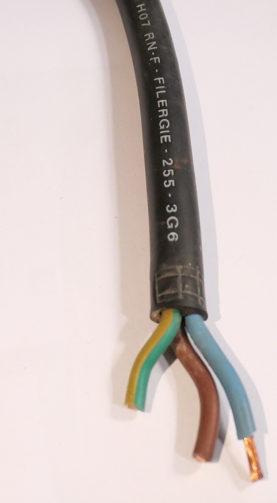
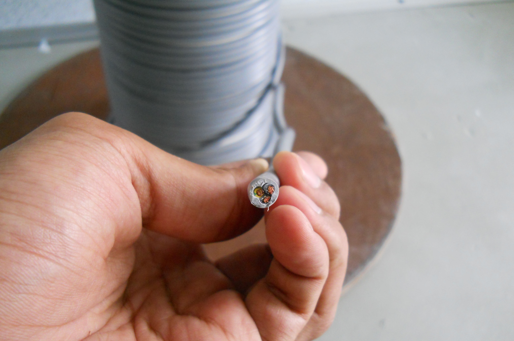

# 電技解釈 第12条 — 電線の接続法

!!! note "📊 試験対策メタ"
    - **出題頻度**: 🔥（過去14年で 1 回出題・省令第7条とセット）
    - **重要度**: B（基本＋数値の核心：引張強さ **20%** ／異種金属の電気的腐食）
    - **直近出題**: H23 問4（論説・適切なものを選ぶ／選択肢(2)が本条）

> 電線を接続するときの**具体的な施工方法**を定めた条文。核心は ==引張強さを20%以上減少させない==（＝80%以上保持）／**接続管・ろう付け**を使う／絶縁電線は**接続器か同等被覆**で絶縁を回復する、の3点。さらに ==アルミと銅==のような**異種金属接続では電気的腐食を防ぐ**ことが問われる。上位の原則（電気抵抗を増加させない・80%強度保持・絶縁回復）は[省令第7条](../kijun/7.md)が定め、本条はその**実施細目**。

| 項目 | 内容 |
|------|------|
| 条文 | 電気設備の技術基準の解釈 第12条 |
| 規定内容 | 電線の接続法（電線種別ごとの接続要件・引張強さ20%・接続器具・異種金属の腐食防止） |
| 性格 | 施設規定（施工方法）＋数値規定（20%） |
| 委任元 | [省令第7条（電線の接続）](../kijun/7.md)（一般原則） |
| 上位原則 | [省令第6条（電線等の断線の防止）](../kijun/6.md)（強度確保の思想） |
| **典拠（一次ソース）** | 電気設備の技術基準の解釈（制定 平成25年2月15日 20130215商局第4号／累次改正・2025年時点の最新版）第12条。委任元の[省令第7条](../kijun/7.md)は eGov 法令検索 lawid=409M50000400052 |
| **現行番号の確認** | 前文が **第181条・第182条・第192条**（がいし引き工事等＝現行の高番号条文）を参照しており、2013年改正後の**現行番号体系**であることを確認（旧番号でも接続法は第12条で不変） |
| **照合日** | 2026-06-08（第一号〜第五号の構成・20%・異種金属腐食を JEEA解説／METI解釈PDF で一次ソース照合） |
| **隣接条文** | ← 第13条（絶縁を要しない部分）／ 第11条（電線路に施設する開閉器等） → |
| **混同注意** | 同番号の **省令第12条**（特別高圧電路等の絶縁）とは別物。本条は**解釈**第12条。なお当wikiの旧 index.md は「第6条＝電線の接続法」と誤記していた（現行は**第12条**） |

---

## 1. 全体像と要点

!!! tip "💡 5秒で思い出す（試験直前の最終確認）"
    - 接続の大原則 → ==電気抵抗を増加させない==（省令第7条ゆずり）
    - 強度 → ==引張強さを20%以上減少させない==（＝**80%以上保持**）。**25%は誤り**
    - 例外 → **ジャンパー線**など**張力が著しく小さい**ときは20%ルール対象外
    - 方法 → **接続管その他の器具**を使用、又は**ろう付け**
    - 絶縁電線 → 上記に加え、**接続器**を使うか**同等以上の絶縁効力**で十分被覆
    - 異種金属 → **アルミと銅**等をつなぐときは**電気的腐食（電食）が生じないように**

「抵抗・強度・絶縁・腐食」の4管理対象。省令第7条が「抵抗・強度・絶縁」の原則、本条はそれに**異種金属の電食防止**と**電線種別ごとの具体策**を足したもの、と覚える。

??? question "セルフチェック: 接続で引張強さは元の何%以上を保持しなければならないか？例外は？"
    ==80%以上==保持（＝「20%以上減少させない」）。例外は、**ジャンパー線を接続する場合その他、電線に加わる張力が引張強さに比べて著しく小さい場合**。この例外を「含めて20%」と書くと誤り（H23問4の選択肢(2)の引っかけ）。

??? question "セルフチェック: アルミ電線と銅電線を直接ねじ止めで締めるだけではなぜ不十分か？"
    アルミと銅は**電気化学的性質が異なる**ため、接触部に水分が介在すると**異種金属接触腐食（電食）**が進み、接触抵抗増大→発熱→断線に至る。第四号は「電気的腐食が生じないようにすること」を要求し、実務では**銅アルミ用接続端子（バイメタル端子）**や適合接続管を使う。

---

## 2. 条文原文

??? note "📜 条文原文 — 電技解釈 完全版（折り畳み・クリックで開く）"
    電気設備の技術基準の解釈（20130215商局第4号・最新版）から整理した **第12条 全文**。本記事の解説・SVG・暗記表は試験対策のために整理したものなので、正確な条文文言を確認したい場合は本ブロックを参照すること。**2026-06-08 一次照合済**（号構成は公益社団法人 日本電気技術者協会(JEEA)解説で第一〜五号を照合）。

    **凡例**: <mark>黄色マーカー</mark> = 接続条文（省令第7条・本条）で **穴埋め・誤数値の引っかけとして実際に問われた／問われやすい** 中核語（H23問4(2)で「20%」を「25%」に変えた誤選択肢が出題）。**bold** は条文の主要語句（論述・予想範囲）。

    > **第12条（電線の接続法）**
    >
    > 電線を接続する場合は、第181条、第182条又は第192条の規定により施設する場合を除き、電線の<mark>電気抵抗</mark>を増加させないように接続するとともに、次の各号によること。
    >
    > **一　**裸電線（多心型電線の絶縁物で被覆していない導体を含む。以下この条において同じ。）相互、又は裸電線と絶縁電線（多心型電線の絶縁物で被覆した導体を含み、平形導体合成樹脂絶縁電線を除く。以下この条において同じ。）、キャブタイヤケーブル若しくはケーブルとを接続する場合は、次によること。
    > 　**イ　**電線の<mark>引張強さ</mark>を<mark>20%</mark>以上減少させないこと。ただし、ジャンパー線を接続する場合その他電線に加わる**張力が**電線の引張強さに比べて**著しく小さい場合**は、この限りでない。
    > 　**ロ　**接続部分には、<mark>接続管</mark>その他の器具を使用し、又は<mark>ろう付け</mark>すること。ただし、架空電線相互若しくは電車線相互又は鉱山の坑道内において電線相互を接続する場合であって、技術上困難であるときは、この限りでない。
    >
    > **二　**絶縁電線相互又は絶縁電線とコード、キャブタイヤケーブル若しくはケーブルとを接続する場合は、前号の規定に準じるほか、次のいずれかによること。
    > 　**イ　**接続部分の絶縁電線の絶縁物と<mark>同等以上の絶縁効力</mark>のある<mark>接続器</mark>を使用すること。
    > 　**ロ　**接続部分をその部分の絶縁電線の絶縁物と同等以上の絶縁効力のあるもので**十分に被覆**すること。
    >
    > **三　**コード相互、キャブタイヤケーブル相互、ケーブル相互又はこれらのもの相互を接続する場合は、**コード接続器、接続箱**その他の器具を使用すること。ただし、次のいずれかに該当する場合はこの限りでない。
> 　**イ　**断面積**8mm2以上**のキャブタイヤケーブル相互を接続する場合において、第一号及び第二号の規定に準じて接続し、かつ、次のいずれかによるとき
> 　　(イ) 接続部分の絶縁被覆を完全に硫化すること。
> 　　(ロ) 接続部分の上に堅ろうな金属製の防護装置を施すこと。
> 　**ロ　**金属被覆のないケーブル相互を接続する場合において、第一号及び第二号の規定に準じて接続するとき
    >
    > **四　**導体にアルミニウム（アルミニウムの合金を含む。以下この条において同じ。）を使用する電線と銅（銅の合金を含む。）を使用する電線とを接続する等、<mark>電気化学的性質の異なる導体</mark>を接続する場合には、接続部分に<mark>電気的腐食</mark>が生じないようにすること。
    >
    > **五　**導体にアルミニウムを使用する絶縁電線又はケーブルを、屋内配線、屋側配線又は屋外配線に使用する場合において、当該電線を接続するときは、次のいずれかの器具を使用すること。
> 　**イ　**電気用品安全法の適用を受ける**接続器**
> 　**ロ　**日本産業規格 JIS C 2810（1995）「屋内配線用電線コネクタ通則－分離不能形」の「4.2 温度上昇」、「4.3 ヒートサイクル」及び「5 構造」に適合する**接続管その他の器具**

    **黄色マーカー対象の根拠**:

    | マーカー語 | 出題形式 | 根拠 |
    |---|---|---|
    | 電気抵抗（増加させない） | 穴埋（接続の大原則） | 省令第7条で穴埋め実績（R03類題）・本条前文に共通 |
    | 引張強さ／20パーセント | 誤数値引っかけ・穴埋 | H23問4(2)で「25%」に改変した誤選択肢が出題 |
    | 接続管／ろう付け | 穴埋（接続方法） | 接続条文の定番穴埋め語 |
    | 同等以上の絶縁効力／接続器 | 穴埋（絶縁回復） | 省令第7条・H23問4(4)関連 |
    | 電気化学的性質の異なる導体／電気的腐食 | 穴埋・論述（異種金属） | 第四号固有の頻出論点（アルミ↔銅） |

    **典拠**: 電気設備の技術基準の解釈 第12条（20130215商局第4号・最新版）／JEEA「電気設備技術基準・解釈の解説〔その3〕」で号構成を照合 ／ 2026-06-08 一次照合

---

**以下は試験対策のための要約・解説（条文の丸暗記の前段として）**

> 電線を接続するときは、(1) **電気抵抗を増加させない**、(2) 裸電線・裸電線と他電線の接続では**引張強さを20%以上減少させず・接続管かろう付け**、(3) 絶縁電線の接続では**接続器か同等絶縁で被覆**、(4) **アルミと銅など異種金属は電食を防ぐ**ように接続する。

!!! warning "ただし書き（例外条件）を読み飛ばさない"
    第12条には **4つの例外（ただし書き・適用除外）** がある。原則だけで判断すると、論説問題の「ただし書き型」「除外条件見落とし型」で失点する。

    - **第一号イ ただし書き**: **ジャンパー線**を接続する場合その他、電線に加わる**張力が引張強さに比べて著しく小さい場合**は、20%ルール（引張強さを20%以上減少させない）の**対象外**。→ 「張力が小さい場合も含めて20%」は誤り。
    - **第一号ロ ただし書き**: **架空電線相互・電車線相互・鉱山の坑道内**で電線相互を接続する場合で**技術上困難**なときは、接続管・ろう付けは**要しない**。
    - **第三号 ただし書き**: **断面積8mm²以上のキャブタイヤケーブル相互**を接続する場合は、コード接続器・接続箱等の**器具使用義務の例外**。
    - **前文の適用除外**: **第181条・第182条・第192条**による場合（がいし引き工事・特殊な施設等）は、本条各号によらない。

---

## 3. 原文解析（ブロック分解）

| 号 | 原文の要点 | 意味（かみ砕き） | 試験のポイント |
|----|-----------|----------------|----------------|
| 前文 | 電気抵抗を増加させない | 接触不良→発熱→火災を防ぐ大原則 | 省令第7条と共通 |
| 第一号イ | 引張強さを **20%以上減少させない** | 機械的強度を**80%以上保持**（断線防止） | **頻出**（20%／25%・80%保持） |
| 第一号イ ただし書き | 張力が著しく小さい場合（ジャンパー線等）は除く | 力がかからない接続は強度要件を緩和 | 「含めて20%」は**誤り** |
| 第一号ロ | 接続管その他の器具／ろう付け | スリーブ圧着・はんだ等で確実に接続 | 接続方法の穴埋め |
| 第一号ロ ただし書き | 架空電線相互等で技術上困難なら不要 | 高所・坑道で器具が使えない現実への配慮 | 例外の存在を問う |
| 第二号 | 絶縁電線は前号＋**接続器 or 同等被覆** | 絶縁を**元と同等以上**に回復 | （絶縁回復）の穴埋め |
| 第三号 | コード・キャブタイヤ・ケーブル相互は**コード接続器・接続箱** | より線・可とう線は専用器具で接続 | 8mm²超キャブタイヤの例外 |
| 第四号 | 異種金属（アルミ↔銅）は**電食を防ぐ** | 電気化学反応による腐食→発熱を防止 | **頻出**（アルミと銅） |
| 第五号 | アルミ導体の屋内・屋側・地中は適合接続器具 | アルミは酸化被膜・クリープに弱く専用品 | 補足論点 |

---

## 4. かみ砕き解説 / 因果理解

> 接続部は電線の「弱点」。なぜ種別ごとに要件が違うのかを、電線の構造の違いから理解すると丸暗記が要らなくなる。

### なぜ電線種別ごとに要件が分かれるのか（因果チェーン）

- **裸電線（第一号）**: 絶縁被覆が無く、架空送電線のように**自重・張力がかかる**用途が多い → 「強度（20%）」が最優先。
- **絶縁電線（第二号）**: むき出しの導体を被覆で守っている → 接続で被覆をはがした以上、**絶縁を元どおりに回復**しないと漏電・地絡。
- **コード・キャブタイヤ・ケーブル（第三号）**: 細い素線をより合わせた**可とう（しなやか）電線**やシース付き → 個別のろう付けより**専用の接続器具（コード接続器・接続箱）**が確実。
- **異種金属（第四号）**: 現場でアルミ幹線と銅機器端子を直結する場面がある → **電食**を放置すると数年で発熱・脱落。

!!! tip "暗記の核心 — 4管理対象"
    省令第7条の **抵抗・強度・絶縁** に、解釈第12条が **電食（異種金属）** を加えた4本柱。「**ていこう・きょうど・ぜつえん・でんしょく**」と唱える。

### 認知補助 — 紛らわしい電線種別を先に整理する

似た名前で**別物**の電線が並ぶのが本条の難所。まず言葉のレイヤーを分ける（詳細な写真つきカタログはセクション6）。

| 用語 | 何を指すか | 絶縁被覆 | 外装（シース） | 第12条での主な登場 |
|------|-----------|:---:|:---:|------|
| **裸電線** | 導体むき出し（硬銅線・鋼心アルミより線等） | ✕ | ✕ | 第一号（強度20%） |
| **絶縁電線** | 導体＋絶縁体（IV・OW・DV等） | ✅ | ✕ | 第二号（絶縁回復） |
| **コード** | 細い素線の可とう線＋薄い絶縁（電気器具用） | ✅ | △ | 第二・三号 |
| **キャブタイヤケーブル** | 可とう導体＋**丈夫なゴム/ビニルシース**（移動用） | ✅ | ✅ | 第一〜三号 |
| **ケーブル** | 絶縁電線＋**外装シース**（VVF・CV等） | ✅ | ✅ | 第一〜三号 |

→ **「絶縁被覆だけ」=絶縁電線**、**「絶縁＋外装シースで丸ごと保護」=ケーブル/キャブタイヤ**。この線引きが第二号と第三号の境目。

??? question "セルフチェック: 絶縁電線とケーブルの構造上の決定的な違いは？"
    **外装（シース）の有無**。絶縁電線は導体を絶縁体で覆っただけ（例: IV線）。ケーブルはさらに**外装シース**で全体を保護し、機械的・耐候性能を持たせたもの（例: VVF・CV）。だから絶縁電線は原則そのままでは地中・水気のある場所に使えないが、ケーブルは使える。

---

## 5. 図で理解（断面構造で見分ける）

> 電線種別の違いは**断面構造**で一発で分かる。試験の選択肢も「絶縁体だけか・外装まであるか」で切り分けられる。

### 図解 1：5種の断面構造（裸 → 絶縁 → コード → キャブタイヤ → ケーブル）

<svg viewBox="0 0 720 230" xmlns="http://www.w3.org/2000/svg" font-family="sans-serif" font-size="11" style="width:100%;max-width:720px">
  <text x="360" y="18" text-anchor="middle" font-size="13" font-weight="bold" fill="#333">電線・ケーブルの断面構造比較</text>
  <!-- 裸電線 -->
  <text x="72" y="44" text-anchor="middle" font-weight="bold" fill="#b71c1c">裸電線</text>
  <circle cx="72" cy="100" r="26" fill="#ef9a9a" stroke="#b71c1c" stroke-width="2"/>
  <text x="72" y="104" text-anchor="middle" font-size="10" fill="#7f0000">導体</text>
  <text x="72" y="150" text-anchor="middle" font-size="9" fill="#555">被覆なし</text>
  <text x="72" y="164" text-anchor="middle" font-size="9" fill="#555">（硬銅線等）</text>
  <!-- 絶縁電線 -->
  <text x="216" y="44" text-anchor="middle" font-weight="bold" fill="#1565c0">絶縁電線</text>
  <circle cx="216" cy="100" r="30" fill="#90caf9" stroke="#1565c0" stroke-width="2"/>
  <circle cx="216" cy="100" r="18" fill="#ef9a9a" stroke="#b71c1c" stroke-width="1.5"/>
  <text x="216" y="104" text-anchor="middle" font-size="9" fill="#7f0000">導体</text>
  <text x="216" y="150" text-anchor="middle" font-size="9" fill="#1565c0">絶縁体のみ</text>
  <text x="216" y="164" text-anchor="middle" font-size="9" fill="#555">（IV・OV等）</text>
  <!-- コード -->
  <text x="360" y="44" text-anchor="middle" font-weight="bold" fill="#6a1b9a">コード</text>
  <ellipse cx="360" cy="100" rx="40" ry="24" fill="#ce93d8" stroke="#6a1b9a" stroke-width="2"/>
  <circle cx="345" cy="100" r="12" fill="#90caf9" stroke="#1565c0" stroke-width="1"/>
  <circle cx="345" cy="100" r="6" fill="#ef9a9a"/>
  <circle cx="375" cy="100" r="12" fill="#90caf9" stroke="#1565c0" stroke-width="1"/>
  <circle cx="375" cy="100" r="6" fill="#ef9a9a"/>
  <text x="360" y="150" text-anchor="middle" font-size="9" fill="#6a1b9a">細素線・可とう</text>
  <text x="360" y="164" text-anchor="middle" font-size="9" fill="#555">（器具用）</text>
  <!-- キャブタイヤ -->
  <text x="504" y="44" text-anchor="middle" font-weight="bold" fill="#37474f">キャブタイヤ</text>
  <circle cx="504" cy="100" r="34" fill="#546e7a" stroke="#263238" stroke-width="2.5"/>
  <circle cx="490" cy="92" r="10" fill="#90caf9"/><circle cx="518" cy="92" r="10" fill="#90caf9"/><circle cx="504" cy="115" r="10" fill="#90caf9"/>
  <text x="504" y="150" text-anchor="middle" font-size="9" fill="#37474f">丈夫なゴム外装</text>
  <text x="504" y="164" text-anchor="middle" font-size="9" fill="#555">（移動・可とう）</text>
  <!-- ケーブル -->
  <text x="648" y="44" text-anchor="middle" font-weight="bold" fill="#2e7d32">ケーブル</text>
  <rect x="616" y="74" width="64" height="52" rx="12" fill="#a5d6a7" stroke="#2e7d32" stroke-width="2.5"/>
  <circle cx="634" cy="92" r="9" fill="#90caf9" stroke="#1565c0"/><circle cx="662" cy="92" r="9" fill="#90caf9" stroke="#1565c0"/><circle cx="648" cy="112" r="9" fill="#90caf9" stroke="#1565c0"/>
  <text x="648" y="150" text-anchor="middle" font-size="9" fill="#2e7d32">絶縁＋外装シース</text>
  <text x="648" y="164" text-anchor="middle" font-size="9" fill="#555">（VVF・CV等）</text>
  <!-- 凡例 -->
  <rect x="200" y="192" width="14" height="14" fill="#ef9a9a" stroke="#b71c1c"/><text x="220" y="203" font-size="10" fill="#555">導体</text>
  <rect x="280" y="192" width="14" height="14" fill="#90caf9" stroke="#1565c0"/><text x="300" y="203" font-size="10" fill="#555">絶縁体</text>
  <rect x="370" y="192" width="14" height="14" fill="#546e7a" stroke="#263238"/><text x="390" y="203" font-size="10" fill="#555">外装シース（ゴム/ビニル）</text>
</svg>

→ 左から右へ**「保護の層」が増える**。裸電線は導体だけ、絶縁電線は＋絶縁体、ケーブル/キャブタイヤは＋外装。第12条が種別で要件を分けるのはこの構造差が理由。

### 図解 2：引張強さ「20%以上減少させない」＝「80%以上保持」

<svg viewBox="0 0 700 180" xmlns="http://www.w3.org/2000/svg" font-family="sans-serif" font-size="12" style="width:100%;max-width:700px">
  <text x="350" y="20" text-anchor="middle" font-size="13" font-weight="bold" fill="#333">第一号イ：接続後も元の引張強さの80%以上を保つ</text>
  <text x="60" y="58" font-size="11" fill="#333">元の電線</text>
  <rect x="160" y="46" width="460" height="20" fill="#90caf9" stroke="#1565c0" stroke-width="1.5"/>
  <text x="390" y="61" text-anchor="middle" font-size="11" fill="#0d47a1" font-weight="bold">100%</text>
  <text x="60" y="100" font-size="11" fill="#2e7d32">合格</text>
  <rect x="160" y="88" width="368" height="20" fill="#a5d6a7" stroke="#2e7d32" stroke-width="1.5"/>
  <rect x="528" y="88" width="92" height="20" fill="#fff" stroke="#2e7d32" stroke-width="1.5" stroke-dasharray="4,2"/>
  <text x="344" y="103" text-anchor="middle" font-size="11" fill="#1b5e20" font-weight="bold">80%以上保持 ✅</text>
  <text x="574" y="103" text-anchor="middle" font-size="10" fill="#388e3c">減少20%</text>
  <text x="60" y="142" font-size="11" fill="#c62828">誤答(25%)</text>
  <rect x="160" y="130" width="345" height="20" fill="#a5d6a7" stroke="#c62828" stroke-width="1.5" stroke-dasharray="3,2"/>
  <rect x="505" y="130" width="115" height="20" fill="#ffcdd2" stroke="#c62828" stroke-width="1.5"/>
  <text x="560" y="145" text-anchor="middle" font-size="10" fill="#b71c1c">減少25%</text>
  <text x="332" y="145" text-anchor="middle" font-size="10" fill="#b71c1c">「25%まで許容」は誤り（正は20%）</text>
  <text x="350" y="172" text-anchor="middle" font-size="10" fill="#555">ただし張力が著しく小さい接続（ジャンパー線等）は20%ルールの対象外</text>
</svg>

### 図解 3：異種金属接続の電食（第四号）

<svg viewBox="0 0 700 180" xmlns="http://www.w3.org/2000/svg" font-family="sans-serif" font-size="11" style="width:100%;max-width:700px">
  <text x="350" y="18" text-anchor="middle" font-size="13" font-weight="bold" fill="#333">アルミ ↔ 銅 を直接つなぐと電食（電気化学的腐食）が進む</text>
  <!-- NG -->
  <rect x="20" y="34" width="320" height="120" rx="8" fill="#fff3e0" stroke="#ef5350" stroke-width="1.5"/>
  <text x="180" y="54" text-anchor="middle" font-weight="bold" fill="#c62828">❌ 直結（ねじ止めのみ）</text>
  <rect x="50" y="80" width="120" height="16" fill="#cfd8dc" stroke="#607d8b"/><text x="110" y="92" text-anchor="middle" font-size="10">アルミ</text>
  <rect x="170" y="80" width="120" height="16" fill="#ffab91" stroke="#bf360c"/><text x="230" y="92" text-anchor="middle" font-size="10">銅</text>
  <circle cx="170" cy="88" r="7" fill="#fff59d" stroke="#f57f17"/>
  <text x="180" y="120" text-anchor="middle" font-size="10" fill="#c62828">水分＋電位差 → 電食 → 接触抵抗増大</text>
  <text x="180" y="138" text-anchor="middle" font-size="10" fill="#c62828">発熱 → 脱落・断線</text>
  <!-- OK -->
  <rect x="360" y="34" width="320" height="120" rx="8" fill="#f1f8e9" stroke="#66bb6a" stroke-width="1.5"/>
  <text x="520" y="54" text-anchor="middle" font-weight="bold" fill="#2e7d32">✅ 銅アルミ用端子（バイメタル）</text>
  <rect x="390" y="80" width="100" height="16" fill="#cfd8dc" stroke="#607d8b"/><text x="440" y="92" text-anchor="middle" font-size="10">アルミ</text>
  <rect x="490" y="76" width="40" height="24" fill="#b0bec5" stroke="#37474f"/><text x="510" y="115" text-anchor="middle" font-size="9" fill="#37474f">専用端子</text>
  <rect x="530" y="80" width="100" height="16" fill="#ffab91" stroke="#bf360c"/><text x="580" y="92" text-anchor="middle" font-size="10">銅</text>
  <text x="520" y="138" text-anchor="middle" font-size="10" fill="#2e7d32">異種金属を直接触れさせない → 電食防止</text>
</svg>

---

## 6. 電線・ケーブル種類カタログ（写真とセットで覚える）

> ここが本条の最重要セクション。**第12条に登場する5種の電線**を、実物写真・断面構造・特徴・条文での扱いで一覧化する。写真で質感を、断面（セクション5の図解1）で構造を、表で要件をひも付けて記憶する。

| 種類 | 代表例 | 構造の核心 | 第12条での扱い |
|------|--------|-----------|----------------|
| **裸電線** | 硬銅線・鋼心アルミより線 | 導体むき出し（被覆なし） | 第一号：強度20%＋接続管/ろう付け |
| **絶縁電線** | IV・OW・DV | 導体＋**絶縁体**（外装なし） | 第二号：第一号＋絶縁回復 |
| **コード** | ビニルコード・ゴムコード | 細素線の可とう導体＋薄い絶縁 | 第二・三号：コード接続器等 |
| **キャブタイヤケーブル** | ゴム/ビニルキャブタイヤ | 可とう導体＋**丈夫な外装シース** | 第一〜三号（8mm²超は第三号例外） |
| **ケーブル** | VVF・CV・CVT | 絶縁電線＋**外装シース** | 第一〜三号 |

### 📸 裸電線（硬銅線）

<figure markdown>
  { width="480" loading="lazy" }
  <figcaption>銅のより線（硬銅線のイメージ）— 導体がむき出しの<strong>裸電線</strong>。架空送電線のように張力がかかる用途が多く、第12条第一号は接続で<strong>引張強さを20%以上減少させない</strong>ことを求める。画像: <a href="https://commons.wikimedia.org/wiki/File:Copper_wires.JPG" target="_blank" rel="noopener">Mauro Cateb, Wikimedia Commons</a> / <a href="https://creativecommons.org/licenses/by-sa/3.0/" target="_blank" rel="noopener">CC BY-SA 3.0</a>（無改変・引用）</figcaption>
</figure>

### 📸 絶縁電線（IVのイメージ）

絶縁電線は **導体＋絶縁体だけ（外装シースなし）**。代表は IV線（600Vビニル絶縁電線）。断面はセクション5の図解1 の青リング部分を参照。CC適合の鮮明な実物写真が確保でき次第差し替え予定だが、見分けの本質は**「絶縁被覆はあるが外装シースがない」**という構造（断面図で代替）。

!!! tip "現場での見分け方"
    1本の導体に色付きビニル被覆だけ → **絶縁電線**（IV）。被覆をむくとすぐ導体。複数芯がさらに灰色や黒の外装でまとまっていれば → **ケーブル**（VVF等）。

### 📸 コード（電気器具用コード）

<figure markdown>
  { width="420" loading="lazy" }
  <figcaption>器具用の<strong>コード</strong>（プラグ付き電源コード）— 細い素線をより合わせた<strong>可とう（しなやか）導体</strong>に薄い絶縁を施したもの。固定配線ではなく器具の引き回しに使う。第12条では相互接続に<strong>コード接続器</strong>等を用いる（第三号）。画像: <a href="https://commons.wikimedia.org/wiki/File:U.S._power_cord_IEC_320.agr.jpg" target="_blank" rel="noopener">ArnoldReinhold, Wikimedia Commons</a> / <a href="https://creativecommons.org/licenses/by-sa/4.0/" target="_blank" rel="noopener">CC BY-SA 4.0</a>（無改変・引用・形状参考。プラグ規格は日本と異なる）</figcaption>
</figure>

### 📸 キャブタイヤケーブル

<figure markdown>
  { width="380" loading="lazy" }
  <figcaption><strong>キャブタイヤケーブル</strong>（写真は同等品の耐ゴムシース可とうケーブル H07RN-F）— 可とう導体を<strong>丈夫なゴム/ビニル外装</strong>で包み、移動・引き回しや屋外仮設に耐える。第12条では相互接続に接続器具を用いるが、<strong>断面積8mm²以上</strong>のキャブタイヤ相互接続には第三号の器具使用義務の例外がある。画像: <a href="https://commons.wikimedia.org/wiki/File:H07RNF.jpg" target="_blank" rel="noopener">FrankFlanagan, Wikimedia Commons</a> / <a href="https://creativecommons.org/licenses/by-sa/4.0/" target="_blank" rel="noopener">CC BY-SA 4.0</a>（無改変・引用。日本のキャブタイヤ規格とは細部仕様差あり）</figcaption>
</figure>

### 📸 ケーブル（3芯ケーブル）

<figure markdown>
  { width="480" loading="lazy" }
  <figcaption>3芯ケーブル — 銅導体を<strong>絶縁体で被覆</strong>し、さらに<strong>外装シース</strong>で束ねた構造。日本の<strong>VVF（600Vビニル絶縁ビニルシースケーブル平形）</strong>も同概念。絶縁電線との違いは「外装シースで丸ごと保護」されている点。画像: <a href="https://commons.wikimedia.org/wiki/File:3.core.cable.JPG" target="_blank" rel="noopener">Hafiz n, Wikimedia Commons</a> / <a href="https://creativecommons.org/licenses/by/3.0/" target="_blank" rel="noopener">CC BY 3.0</a>（無改変・引用・参考。日本のVVF/CVTとは細部仕様差あり）</figcaption>
</figure>

---

## 7. 試験で問われること

> 接続条文の出題は「数値の言い換え・誤数値」「接続方法の語句」「異種金属の電食」に集中する。

!!! note "出題パターン分類"
    1. **数値の引っかけ**: 「引張強さを（　）%以上減少させない」→ **20**。誤選択肢に **25** や「80%以上減少させない」。
    2. **例外の有無**: 「張力が著しく小さい場合**を含め**20%…」は誤り（**除く**が正）。
    3. **接続方法の語句**: 接続管・ろう付け・接続器・コード接続器・接続箱の穴埋め。
    4. **絶縁回復**: 絶縁電線は「絶縁物と（　）以上の絶縁効力」→ **同等**。
    5. **異種金属**: 「アルミと銅など（　）の異なる導体は電気的（　）が生じないように」→ **電気化学的性質**／**腐食**。
    6. **電線種別の識別**: 絶縁電線とケーブルの違い（外装の有無）を前提にした選択肢。

---

## 8. 頻出ひっかけ / 落とし穴

> 各項目の先頭 `[①〜⑥]` は弱点カテゴリ（①数値・境界／②主語・対象／⑥例外・除外）。

### 🔴 致命的（これを間違えたら即失点）

1. ❌ **[①数値]**「引張強さは**25%**まで減少してよい」
    - → ✅ 正しくは ==20%以上減少させない==（＝80%以上保持）。H23問4(2)がこの「25%」引っかけそのもの。
2. ❌ **[⑥例外]**「張力が著しく小さい場合**も含めて**20%ルールを守る」
    - → ✅ ジャンパー線等で張力が著しく小さい場合は**20%ルールの対象外（除く）**。「含めて」は誤り。
3. ❌ **[②主語]**「**アルミと銅**は同じ金属だから直接ねじ止めでよい」
    - → ✅ 電気化学的性質が異なる異種金属。**電食を防ぐ**処置（バイメタル端子等）が第四号で必須。

### 🟡 注意（紛らわしい誤解）

1. ❌ **[②主語]**「絶縁電線とケーブルは同じもの」
    - → ✅ **外装シースの有無**で別物。絶縁電線（IV）は絶縁体のみ、ケーブル（VVF）は外装シース付き。
2. ❌ **[⑥例外]**「接続部には**必ず**接続管かろう付けが要る」
    - → ✅ 原則はそうだが、**架空電線相互等で技術上困難**なときは第一号ロのただし書きで例外。

### 🟢 軽度（知っていると有利）

1. ❌ **[①数値]**「キャブタイヤ相互は太さに関わらず必ず接続器具」
    - → ✅ **断面積8mm²以上**のキャブタイヤ相互接続は第三号の器具使用義務の例外がある。

??? question "セルフチェック: H23問4で『電線の引張強さを25%以上減少させない…張力が著しく小さい場合を含め』が誤りである理由を2つ挙げよ"
    (1) 数値が誤り（正しくは ==20%==、25%ではない）。(2) 例外の扱いが逆（張力が著しく小さい場合は20%ルールから**除く**のであって「含め」ではない）。1つの選択肢に2つの誤りを仕込む典型パターン。

---

### ✅ 数値検証 PASS（一次ソース照合済 2026-06-08）

本記事の数値は電気設備の技術基準の解釈 第12条（20130215商局第4号・最新版）および JEEA 解説で一次照合済（**数値検証 PASS**）。根拠は以下の通り：

| 数値・語 | 出典条項 | 検証結果 |
|---------|----------|----------|
| **引張強さ 20%以上減少させない** | 第12条 第一号イ | ✅ PASS（「20パーセント以上減少させない」と一致・25%は誤り） |
| **張力が著しく小さい場合は除外** | 第12条 第一号イ ただし書き | ✅ PASS（ジャンパー線等の例外を確認） |
| **接続管・ろう付け** | 第12条 第一号ロ | ✅ PASS（接続方法の文言一致） |
| **同等以上の絶縁効力（接続器/被覆）** | 第12条 第二号イ・ロ | ✅ PASS（絶縁回復の要件） |
| **電気化学的性質の異なる導体／電気的腐食** | 第12条 第四号 | ✅ PASS（アルミ↔銅の電食防止） |
| **断面積8mm²以上のキャブタイヤ例外** | 第12条 第三号 ただし書き | ✅ PASS（器具使用義務の例外） |

暗記補助の概算値や教育的近似は本記事に含めない（断面構造SVGは構造の模式図であり寸法は実値ではない）。

---

## 9. 穴埋め過去問チャレンジ

!!! abstract "過去問 H23 法規 問4（論説・難易度 ★★☆☆☆）"
    「電気設備技術基準」及び「電気設備技術基準の解釈」に基づく、電線の接続に関する記述として**適切なもの**を選ぶ問題。本条（解釈第12条）は誤選択肢として登場した。

    > 次の記述は適切か？　「裸電線と絶縁電線とを接続する場合に断線のおそれがないようにするには、電線に加わる張力が電線の引張強さに比べて著しく小さい場合を <mark>含め</mark>、電線の引張強さを <mark>25</mark> ％以上減少させないように接続する。」

    出典: [電験王3 H23 法規 問4](https://denken-ou.com/houkih23-4/)

??? success "解答を見る"
    **この記述は誤り（不適切）。** 正しくは：

    | 誤 | 正 | 根拠 |
    |----|----|------|
    | 25% | **20%** | 第12条 第一号イ |
    | 「含め」 | **「除く」**（張力が著しく小さい場合は対象外） | 第一号イ ただし書き |

    - 1つの選択肢に**数値（25→20）**と**例外の扱い（含め→除く）**の二重の誤りを仕込む典型。
    - H23問4の**正解は別の選択肢(5)**（解釈第143条・住宅の屋内電路）。本条は「もっともらしい誤り」役だった。

!!! note "出題実績まとめ（改変の明記）"
    - kakomon.yml 登録: **H23問4**（article: 省令第7条＋解釈第12条／topic: 電線の接続）。
    - 上記引用は denken-ou.com の選択肢(2)を**そのまま（改変なし）**引用。穴埋め化のため空欄マーカーのみ付した。
    - 解釈第12条は**論説の誤選択肢**として頻出。「20%／接続管・ろう付け／同等以上の絶縁効力／電気的腐食」の語が狙われる。

---

## 10. まぎらわしい選択肢と正解の違い

| よくある誤答 | 正答 | なぜ違うか |
|------------|------|----------|
| 引張強さ **25%** 以上減少させない | **20%** 以上減少させない | 条文は20%。25%は典型的な誤数値 |
| **80%以上減少**させない | **20%以上減少**させない（＝80%以上保持） | 80%減少は残り20%でほぼ断線。表現が逆 |
| 張力が小さい場合**も含め**20% | 張力が著しく小さい場合は**除く** | ただし書きの例外を無視した誤り |
| 絶縁電線は接続部の絶縁を**省略可** | **同等以上の絶縁効力**で被覆 or 接続器 | 第二号で絶縁回復が必須 |
| アルミと銅は**直結でよい** | **電気的腐食を防ぐ**処置が必要 | 第四号（異種金属の電食防止） |
| 接続は**必ず**接続管/ろう付け | 架空電線相互等で技術上困難なら**例外** | 第一号ロ ただし書き |

---

## 📒 解いたら記録 → 間違えたら間違えノートへ（PDCAを回す）

!!! abstract "各過去問の「理解した／曖昧／間違えた」ボタンで解答結果を残せます"
    上の過去問の各ブロック下に出る **理解度ボタン（〇理解した／△曖昧／×間違えた）** とメモ欄で、解いた結果がブラウザの localStorage に保存されます（**Do→Check**）。

    👉 [**間違えノートを開く（法規Wiki／直前まちがいノート）**](https://kfurufuru.github.io/secretary-portal-public/denken-hoki-wiki.html#chokuzen-machigai)

    - **×間違えた** を押した問題は間違えノートに **自動集約** され、間違えた問題だけ抽出して再演習できる（**Check→Act**）
    - メモ欄に「なぜ間違えたか」を残すと、次回復習時に文脈ごと復元される
    - 同一オリジン（kfurufuru.github.io）配下なので、本Wiki／法規Wiki／理論Wiki のチェック記録は **すべて同じ間違えノートに集約**（横断PDCA）

---

## 11. 関連条文 / 関連ページ

**上位・委任元（省令側）**

- [省令第7条（電線の接続）](../kijun/7.md) — 本条の**委任元**。接続の一般原則（抵抗・強度80%・絶縁）。本条はその実施細目＋異種金属の電食。
- [省令第6条（電線等の断線の防止）](../kijun/6.md) — 「断線させない」という上位思想。接続部の強度保持はこの一環。

**並列・関連（解釈側）**

- 第13条（絶縁を要しない部分） — 接続後の絶縁回復（第二号）と対の論点。
- 第181条・第182条・第192条 — 本条前文で接続法の**適用除外**となる特殊施設（小勢力回路等）。
- 第143条（住宅の屋内電路） — H23問4の**正解選択肢**だった隣接論点。

**電線種別の関連ページ**

- [省令第57条（配線の使用電線）](../kijun/57.md) — 絶縁電線 vs ケーブル vs 裸電線の使い分け（本条の電線種別と同じ土俵）。

---

## 12. 過去問実績

> 出典: `docs/_data/kakomon.yml`（247問DB・H23〜R07下）を一次照合。

| 年度 | 問 | 形式 | 論点 | 関連条文 |
|------|-----|------|------|---------|
| H23 | 問4 | 論説（適切なものを選ぶ） | 電線の接続（誤選択肢に本条の「25%」引っかけ） | 省令第7条＋**解釈第12条**（正解は解釈第143条） |

!!! note "R08 出題予測"
    kakomon.yml では接続論点は**H23問4の1件**（省令第7条とセット登録）。論説の誤選択肢として「**20%↔25%**」「**含め↔除く**」「**異種金属の電食**」が狙われやすい。省令第7条の穴埋め（電気抵抗・20・絶縁）と本条をセットで整理しておくこと。

---

## 13. 用語集

### 3列翻訳テーブル — 日常語 ⇆ 法規表現 ⇆ 試験での意味

本条で扱う主要概念を、**日常語（現場や教科書の言い回し）／法規表現（条文上の語）／試験での意味（混同注意）** の3列で対照する。記述で日常語を使うと条文文言不一致で減点されるため、法規表現をそのまま再現できるようにする。

| 日常語 | 法規表現（条文上の語） | 試験での意味（混同注意） |
|--------|----------------------|------------------------|
| 切れない強さを保つ | 引張強さを20パーセント以上減少させない | **80%以上保持**。25%・80%減少は誤り |
| 力がかからない接続 | 張力が著しく小さい場合 | 20%ルールの**除外**条件（ジャンパー線等） |
| はんだ付け | ろう付け | 接続方法。接続管（圧着スリーブ等）と並ぶ |
| つなぎ部品 | 接続管・接続器・コード接続器・接続箱 | 電線種別で使う器具が変わる |
| 絶縁を元に戻す | 同等以上の絶縁効力のあるもので被覆 | 「同等以上」。「より高い」「2倍」は誤り |
| 銅とアルミの腐食 | 電気化学的性質の異なる導体の電気的腐食 | 第四号。直結NG・専用端子が必要 |
| しなやかな電線 | 可とう（コード・キャブタイヤ） | 移動・器具用。固定配線の絶縁電線と区別 |

### ②主語・対象の整理 — 「誰が／何を／何から守る」

| 観点 | 内容 |
|------|------|
| 何を対象に | **電線の接続箇所**（裸電線・絶縁電線・コード・キャブタイヤ・ケーブル） |
| 何を守る | 電気的連続性（抵抗）・機械的強度（20%）・絶縁・異種金属の電食 |
| 何から守る | 接触不良による発熱・火災／断線／漏電／腐食 |
| 適用除外 | 第181条・第182条・第192条による場合（特殊回路） |

---

## 14. 最終チェック

**📜 条文の核心**

- [ ] 接続の大原則「電気抵抗を増加させない」を即答できる
- [ ] 引張強さ「20%以上減少させない」＝「80%以上保持」を説明できる（25%は誤り）
- [ ] 張力が著しく小さい場合は20%ルールの**例外**だと言える

**🔧 接続方法と種別**

- [ ] 接続管・ろう付け（第一号）／接続器・同等被覆（第二号）／コード接続器・接続箱（第三号）を区別できる
- [ ] 絶縁電線とケーブルの違い（外装シースの有無）を即答できる
- [ ] 5種の電線（裸・絶縁・コード・キャブタイヤ・ケーブル）を断面構造で見分けられる

**⚡ 異種金属・例外**

- [ ] アルミと銅の接続で「電気的腐食を生じさせない」（第四号）と説明できる
- [ ] 架空電線相互等で技術上困難なら接続管/ろう付けの例外（第一号ロ）があると言える
- [ ] 断面積8mm²以上のキャブタイヤ相互の例外（第三号）を知っている

---
---

## 監修ログ

- **2026-08-28 監査是正**（ChatGPT/Fable 監査 → Claude 一次照合）: 条文原文の逐語是正。柱書「規定による場合を除き…接続するほか」→「規定により施設する場合を除き…接続するとともに」、第五号を「導体にアルミニウムを使用する絶縁電線又はケーブルを、屋内配線、屋側配線又は屋外配線に使用する場合において、当該電線を接続するときは」に訂正（従来「屋内、屋側又は地中」は原文にない）。典拠: 同梱PDF 第12条。
- **2026-06-08 v1.0 新規作成**:
    - **作成契機**: 編者指示「[densen-setsuzoku-dansen-boshi](https://denken.joho.info/hoki/densen-setsuzoku-dansen-boshi/) を wiki に追加。ケーブルの種類と写真はセットで記載」。外部ページは省令第6条・第7条＋解釈第12条を横断する内容で、Wiki側で唯一未作成だった**解釈第12条（電線の接続法）**を新規作成。
    - **条番号の確定**: denken-ou.com H23問4・JEEA解説「電気設備技術基準・解釈の解説〔その3〕」・METI解釈PDF（20130215商局第4号）の3ソースで**解釈第12条＝電線の接続法**を確認。当wikiの旧 `kaishaku/index.md` は「第6条＝電線の接続法」と誤記しており、本作成に合わせて訂正（kakomon.yml は当初から「解釈第12条」で正）。
    - **条文一次照合**: 第一号〜第五号の構成（裸電線→絶縁電線→コード/キャブタイヤ/ケーブル相互→異種金属腐食→アルミ導体特例）を JEEA 解説で照合。**数値検証 PASS**（20%・8mm²・異種金属の電食を一次照合）。
    - **採用画像（写真ポリシー v1.0 準拠）**:
        - [`assets/images/kodousen.jpg`](../../assets/images/kodousen.jpg)（裸電線・既存流用／Mauro Cateb, CC BY-SA 3.0）
        - [`assets/images/12-cord.jpg`](../../assets/images/12-cord.jpg)（コード／ArnoldReinhold, CC BY-SA 4.0・[File:U.S. power cord IEC 320.agr.jpg](https://commons.wikimedia.org/wiki/File:U.S._power_cord_IEC_320.agr.jpg)）
        - [`assets/images/12-cabtyre.jpg`](../../assets/images/12-cabtyre.jpg)（キャブタイヤ同等品 H07RN-F／FrankFlanagan, CC BY-SA 4.0・[File:H07RNF.jpg](https://commons.wikimedia.org/wiki/File:H07RNF.jpg)）
        - [`assets/images/57-cable3core.jpg`](../../assets/images/57-cable3core.jpg)（ケーブル・既存流用／Hafiz n, CC BY 3.0）
    - **採用理由**: 「絶縁電線 vs ケーブル vs 裸電線 vs コード vs キャブタイヤ」という**電線種別の混同論点**を、写真（質感）＋断面SVG（構造）＋3列翻訳で多重に解消。
    - **代替検討**: 絶縁電線（IV）はCC適合の鮮明な実物写真がWikimedia Commonsに見当たらず、断面SVG＋見分け方解説で代替（写真ポリシー「SVG優先」に合致）。編者の自社設備実機写真が入手できれば差し替え候補。
    - **ライセンス検証**: ✅ 全画像 CC BY / CC BY-SA を figcaption に著者・出典URL・ライセンス明記。日本規格との細部仕様差は「参考」と注記。
    - **6カテゴリ突合**: ①数値（20%/25%・数値検証PASS表）②主語（電線種別・用語集の対象整理）⑥例外（張力小・架空電線・8mm²・ただし書き型）をカバー。

---

*最終確認: 2026-06-08 | ステータス: v1.0（新規・テンプレv2.7準拠） ｜ 条文番号: ✅ 一次ソース照合済（解釈第12条＝電線の接続法・3ソース一致／旧index.md誤記を訂正） ｜ 出題実績: ✅ kakomon DB 1件照合済（H23問4） ｜ 数値根拠: ✅ 公式根拠記載済（20%・8mm²・異種金属電食・第一〜五号） ｜ [バージョニング基準](../../reference/versioning.md)*
