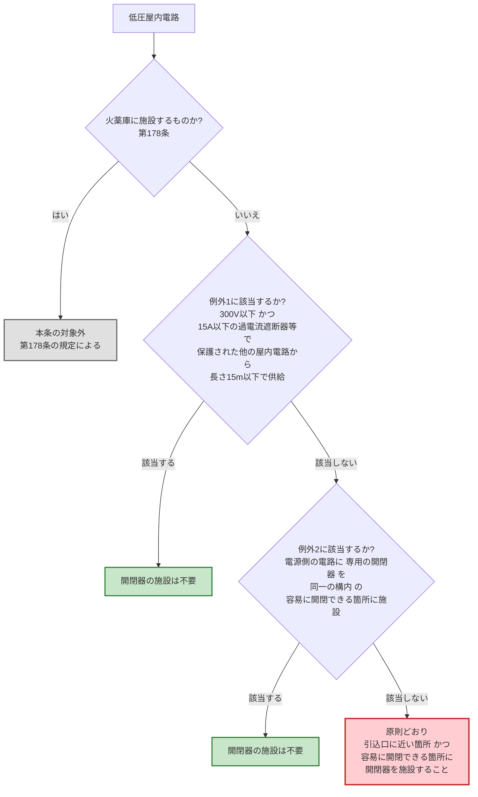

# 電技解釈 第147条 — 低圧屋内電路の引込口における開閉器の施設

!!! danger "⚠️ 条番号誤記の訂正（2026-07-26 全面書き直し）"
    本ページの旧版（v1.0）は「**引込口の施設**」として、引込口の **防水・防湿処理**、引込口装置（メーターボックス）、**防護管** を解説していましたが、これらは **第147条の規定ではありません**。経産省告示PDF（電気設備の技術基準の解釈・令和7年11月版）で確認したところ:

    - **第147条の真の主題** は「**低圧屋内電路の引込口における開閉器の施設**」＝ 引込口に近い箇所に **開閉器** を施設する義務と、その **例外2種** の規定です
    - 旧版が挙げていた防水・防湿処理／メーターボックス／防護管は、条文上の根拠を確認できませんでした（**根拠なき記述**として全面削除）
    - 本訂正は法令改正によるものではなく、**本Wiki側の条番号誤記** です（改正記録なし）。[第148条](148.md) は以前から本条を「幹線の起点となる引込口の **開閉器** の要件」として正しく参照しており、本ページのみがズレていました

!!! warning "📜 一次ソース確認のお願い"
    本ページは電気設備の技術基準の解釈（経済産業省が省令の解釈として示すもの）を学習用に整理したものです。電技解釈は eGov 法令API に登録されていないため、本Wikiの品質保証は経産省告示PDF原典への逐語照合＋過去問データベースへの照合に依存しています。**重要な実務判断や試験直前の最終確認は、必ず経産省公式の最新告示PDF（[電気設備の技術基準の解釈](https://www.meti.go.jp/policy/safety_security/industrial_safety/sangyo/electric/detail/setsubi_kijun.html)）に当たってください**。

!!! note "📊 試験対策メタ"
    **出題頻度**: —（過去14年で出題なし）

    **重要度**: C（基本。ただし [第148条](148.md)（低圧幹線）・[第149条](149.md)（低圧分岐回路）と合わせて「引込口 → 幹線 → 分岐回路」の開閉器・遮断器の連鎖として押さえると、配線設計系の設問全体で効く）

    **直近出題**: なし

| 項目 | 内容 |
|------|------|
| 条文 | 電気設備の技術基準の解釈 第147条 |
| 条文核心 | 低圧屋内電路には、**引込口に近い箇所** であって **容易に開閉することができる箇所** に **開閉器** を施設すること（例外2種あり） |
| 規定内容 | 低圧屋内電路の引込口における開閉器の施設義務と、その適用除外 |
| 性格 | 施設規定（「どこに何を置くか」。数値は例外側の 300V／15A／20A／15m のみ） |
| 委任元（上位） | 電技省令第56条（配線の感電又は火災の防止） |
| 構成 | 本文＝開閉器の施設義務（火薬庫に施設するものを除く）／第一号＝300V以下かつ長さ15m以下の他屋内電路から供給を受ける場合／第二号＝電源側の電路に専用開閉器を同一構内に施設する場合 |
| 関連 | [第148条](148.md)（低圧幹線の施設）／[第149条](149.md)（低圧分岐回路等の施設）／第178条（火薬庫の電気設備の施設） |
| **混同注意** | 本条＝**引込口** の開閉器（電路の入口を1か所で切る）／[第149条](149.md)＝**分岐回路** の開閉器・過電流遮断器（3m/8m・各極施設）。「開閉器」という同じ語が階層違いで登場する |
| **典拠（一次ソース）** | 電気設備の技術基準の解釈（経産省が示す省令の解釈・**令和7年11月版**）第147条 — 経産省告示PDF原典から本文・第一号・第二号を逐語抽出 |
| **照合日** | 2026-07-26（告示PDF原典を pymupdf で全文抽出し、`【低圧屋内電路の引込口における開閉器の施設】（省令第56条）第147条` の見出し・本文・例外2号を逐語照合） |
| **隣接条文** | 第146条（低圧配線に使用する電線） ← 本条（147・引込口の開閉器） → [第148条（低圧幹線の施設）](148.md) ／ 上位: 省令第56条 |

---

## 1. 5秒で思い出す

!!! tip "💡 試験直前の核心メモ（5秒で思い出す）"
    - 低圧屋内電路には **引込口に近い箇所** に **開閉器** を施設する
    - 場所の条件は2つ: **引込口に近い** ＋ **容易に開閉することができる**
    - 施設するのは **開閉器**（過電流遮断器ではない）
    - 適用除外: **火薬庫** に施設する低圧屋内電路（[第178条](#9-関連条文)）
    - 例外①: 使用電圧 ==300V以下== かつ、他の屋内電路から長さ ==15m以下== の電路で供給を受ける場合（他の屋内電路は ==15A以下== の過電流遮断器／==15A超20A以下== の配線用遮断器で保護されているものに限る）
    - 例外②: 電源側の電路に **専用の開閉器** を、**同一の構内** の容易に開閉できる箇所に施設する場合
    - 例外②のキモは「**専用**」と「**同一の構内**」— どちらか欠けても例外にならない

??? question "セルフチェック: なぜ「引込口に近い箇所」だけでなく「容易に開閉することができる箇所」も条件になっているのか？"
    **開閉器の目的が「緊急時と作業時に、確実に電気を止められること」だからです。**

    「引込口に近い」だけを満たしても、天井裏や施錠された機械室の奥にあれば、火災・感電事故の発生時に誰も電源を切れません。逆に「容易に開閉できる」だけを満たしても、引込口から遠ければ、その開閉器より上流の屋内配線が生きたまま残り、**切れない区間** が屋内に生じてしまいます。

    2つの条件は「**屋内配線のできるだけ全部を**（引込口に近い）、**必要なときに確実に**（容易に開閉できる）切れること」という1つの目的を、位置と操作性の両面から表現したものです。片方だけでは目的が達成されない、という因果で覚えてください。

---

## 2. 条文原文

??? note "📜 条文原文 — 経産省告示PDF（令和7年11月版）完全版（折り畳み・クリックで開く）"
    経済産業省「電気設備の技術基準の解釈」（令和7年11月版）原典PDFから逐語取得した **第147条 全文**（本文・第一号・第二号）。本記事の解説・暗記表は試験対策のために整理したものなので、正確な条文文言を確認したい場合は本ブロックを参照してください。**2026-07-26 一次照合済**。

    **凡例**: `**bold**` は条文の主要語句で **論述・予想範囲**。本条は過去14年で穴埋め出題が確認できないため、<mark>黄色マーカー</mark>（＝実際に穴埋め出題された語のみに付す）は **付していません**。

    **【低圧屋内電路の引込口における開閉器の施設】（省令第56条）**

    **第147条** 低圧屋内電路（第178条に規定する **火薬庫に施設するものを除く**。以下この条において同じ。）には、**引込口に近い箇所** であって、**容易に開閉することができる箇所** に **開閉器を施設すること**。ただし、次の各号のいずれかに該当する場合は、この限りでない。

    　一 低圧屋内電路の使用電圧が **300V以下** であって、他の屋内電路（**定格電流が15A以下の過電流遮断器** 又は **定格電流が15Aを超え20A以下の配線用遮断器** で保護されているものに限る。）に接続する **長さ15m以下** の電路から電気の供給を受ける場合

    　二 低圧屋内電路に接続する **電源側の電路**（当該電路に架空部分又は屋上部分がある場合は、その架空部分又は屋上部分より **負荷側** にある部分に限る。）に、当該低圧屋内電路に **専用の開閉器** を、これと **同一の構内** であって **容易に開閉することができる箇所** に施設する場合

### 原文解析（ブロック分解）

| ブロック | 原文 | 意味 | 試験のポイント |
|---|---|---|---|
| 適用対象 | 低圧屋内電路（第178条に規定する火薬庫に施設するものを除く。） | 低圧の屋内電路が対象。火薬庫は別建て（第178条） | 「火薬庫を **除く**」— 火薬庫は本条より厳しい規定が別にある |
| 場所①  | 引込口に近い箇所 | 屋内配線の入口 | 「引込口から3m以内」等の **距離指定は無い** |
| 場所②  | 容易に開閉することができる箇所 | 人が操作できる場所 | 場所条件は **2つとも** 必要 |
| 義務 | 開閉器を施設すること | 施設するのは **開閉器** | 「過電流遮断器」ではない |
| 例外① 電圧 | 使用電圧が300V以下であって | 電圧の上限 | **300V以下**（600V以下ではない） |
| 例外① 保護 | 定格電流が15A以下の過電流遮断器 又は 定格電流が15Aを超え20A以下の配線用遮断器 | 供給元の屋内電路が小容量で保護済み | **15A／15A超20A以下** の2段書き |
| 例外① 長さ | 接続する長さ15m以下の電路から電気の供給を受ける場合 | 引き回しが短い | **15m以下** |
| 例外② 場所 | 電源側の電路…に、専用の開閉器を、同一の構内であって容易に開閉することができる箇所に施設する場合 | 上流にすでに専用開閉器がある | **専用** ＋ **同一の構内** ＋ **容易に開閉** の3点セット |
| 例外② 限定 | 架空部分又は屋上部分がある場合は、その架空部分又は屋上部分より負荷側にある部分に限る | 屋外の危険区間より下流であること | 架空・屋上部分 **より負荷側**（電源側ではない） |

---

## 3. かみ砕き解説 — 「屋内配線を1か所で殺せるようにする」条文

電技省令第56条は「配線は、**感電又は火災のおそれがないように施設** しなければならない」と定めます。第147条は、その具体化のうち **「異常時に屋内配線をまとめて切る手段を用意せよ」** という部分を担当します。

屋内で電気火災や感電が起きたとき、あるいは屋内配線を改修するとき、**電気を止める手段が屋内側になければ** 電力会社の引込線まで遡らないと停電させられません。それでは初動が致命的に遅れます。だから条文は「引込口に **近い** 箇所」＝ できるだけ屋内配線の全体を殺せる位置に、「**容易に開閉** できる」＝ 誰でもすぐ操作できる状態で、開閉器を置けと要求します。

ここで施設が求められるのは **開閉器** であって、過電流遮断器ではありません。過電流遮断器は「異常電流を検知して **自動で** 切る」装置ですが、本条が要求しているのは「人が **意図的に** 切れる」手段です。**現場** の分電盤では主幹に配線用遮断器（開閉機能と過電流遮断機能を兼備）を置くことが多く、結果的に1台で両方の要求を満たしますが、**条文上の要求は別物** である点は試験で問われる余地があります。

### 例外はどちらも「すでに守られているから重ねなくてよい」

| 例外 | 何がすでに満たされているか | だから不要になるもの |
|---|---|---|
| **第一号** | 供給元の屋内電路が **15A以下の過電流遮断器**（または15A超20A以下の配線用遮断器）で保護済み ＋ 使用電圧 **300V以下** ＋ 引き回しが **15m以下** と短い | この程度の小規模・低リスクな電路にまで、独立した引込口開閉器を求めるのは過剰 |
| **第二号** | 電源側に **その電路専用の開閉器** が、**同一の構内** の **容易に開閉できる箇所** にすでにある | 上流の専用開閉器で目的（1か所で殺せる）が達成済み。二重に置く必要はない |

**設計** の **実務** では、第二号が効く典型が「1つの構内に複数棟があり、各棟の低圧屋内電路を主屋の配電盤の専用開閉器で個別に切れる」ケースです。第二号が **同一の構内** を要求するのは、開閉器が遠方の別敷地にあっては「容易に開閉できる」実質を欠くからです。

??? question "セルフチェック: 例外第二号で「専用の」開閉器であることが求められるのはなぜか。共用の開閉器ではなぜ駄目なのか？"
    **共用だと「その低圧屋内電路だけを切る」ことができず、切る決断ができなくなるからです。**

    本条の目的は、対象の低圧屋内電路を **確実に停電させられる手段** の確保です。上流の開閉器が複数の電路を束ねて切る共用のものだと、その1台を切れば無関係な設備まで止まります。すると異常が起きても「他が止まるから切れない」という判断が働き、**実質的に切れない開閉器** になってしまいます。

    条文が「当該低圧屋内電路に **専用の** 開閉器」と限定するのは、この骨抜きを防ぐためです。同じ理由で「**同一の構内**」「**容易に開閉することができる箇所**」も併せて要求され、3条件が揃って初めて例外が成立します。

??? question "セルフチェック: 例外第二号の「架空部分又は屋上部分より負荷側」という限定は何を避けているのか？"
    **屋外の危険区間を、開閉器で切れない範囲に残さないためです。**

    電源側の電路に架空部分や屋上部分があると、その区間は風雨・飛来物・断線・他物接触といった屋外特有のリスクに晒されます。もし専用開閉器をその **架空・屋上部分より電源側**（上流）に置くことを認めてしまうと、開閉器を切っても架空区間は生きたまま… ではなく逆で、開閉器より **負荷側** にある架空・屋上部分が停電範囲に含まれてしまう構成もあり得ます。

    条文はこれを避けるため、専用開閉器は「架空部分又は屋上部分 **より負荷側**」にあるものに限ると定めています。つまり **屋外の危険区間を跨がない位置** に開閉器を置けという限定です。「電源側に限る」と読み替えると意味が反転するので注意してください。

---

## 4. 図で理解

### ① 開閉器を施設するか、例外に乗るかの判定フロー

**読み解き**: まず **火薬庫** かどうかで対象そのものが分かれ（火薬庫は第178条へ）、次に例外2種のどちらかに乗れるかを見ます。どちらにも乗らなければ原則どおり開閉器を施設します。試験では「例外①の数値」「例外②の3条件」のいずれかを崩した選択肢が想定されます。

### ② 原則 — 引込口に近く、容易に開閉できる箇所

<svg viewBox="0 0 820 300" xmlns="http://www.w3.org/2000/svg" width="100%" preserveAspectRatio="xMidYMid meet">
<defs>
<filter id="sh147a" x="-20%" y="-20%" width="140%" height="140%"><feDropShadow dx="0" dy="2" stdDeviation="2" flood-opacity="0.15"/></filter>
</defs>
<text x="410" y="24" text-anchor="middle" font-size="15" font-weight="700" fill="#212121">第147条 本文 — 引込口の開閉器の位置</text>
<text x="410" y="42" text-anchor="middle" font-size="11" fill="#666">「引込口に近い箇所」かつ「容易に開閉することができる箇所」の2条件</text>

<line x1="30" y1="90" x2="150" y2="90" stroke="#424242" stroke-width="2.5"/>
<circle cx="30" cy="90" r="6" fill="#795548"/>
<text x="34" y="76" font-size="10" fill="#5d4037">電力会社の引込線</text>

<rect x="150" y="64" width="600" height="200" rx="10" fill="#fafafa" stroke="#616161" stroke-width="2.5" filter="url(#sh147a)"/>
<text x="450" y="86" text-anchor="middle" font-size="11" font-weight="700" fill="#424242">建物（屋内）</text>

<line x1="150" y1="90" x2="150" y2="90" stroke="#424242" stroke-width="2.5"/>
<circle cx="150" cy="90" r="8" fill="#fff" stroke="#e65100" stroke-width="2.5"/>
<text x="150" y="58" text-anchor="middle" font-size="11" font-weight="800" fill="#e65100">引込口</text>

<line x1="150" y1="90" x2="215" y2="90" stroke="#424242" stroke-width="2.5"/>
<rect x="215" y="62" width="96" height="58" rx="6" fill="#ffebee" stroke="#c62828" stroke-width="2.5"/>
<text x="263" y="84" text-anchor="middle" font-size="11" font-weight="800" fill="#c62828">開閉器</text>
<text x="263" y="100" text-anchor="middle" font-size="9" fill="#c62828">★ここに施設</text>
<text x="263" y="113" text-anchor="middle" font-size="9" fill="#c62828">（本条の義務）</text>

<line x1="311" y1="90" x2="420" y2="90" stroke="#424242" stroke-width="2.5"/>
<rect x="420" y="66" width="110" height="50" rx="6" fill="#e3f2fd" stroke="#1565c0" stroke-width="2"/>
<text x="475" y="86" text-anchor="middle" font-size="10" font-weight="700" fill="#0d47a1">低圧幹線</text>
<text x="475" y="102" text-anchor="middle" font-size="9" fill="#1565c0">（第148条）</text>

<line x1="530" y1="90" x2="600" y2="90" stroke="#424242" stroke-width="2"/>
<line x1="600" y1="90" x2="600" y2="150" stroke="#424242" stroke-width="2"/>
<line x1="600" y1="90" x2="690" y2="90" stroke="#424242" stroke-width="2"/>
<rect x="620" y="150" width="110" height="46" rx="6" fill="#e8f5e9" stroke="#2e7d32" stroke-width="2"/>
<text x="675" y="169" text-anchor="middle" font-size="10" font-weight="700" fill="#1b5e20">分岐回路</text>
<text x="675" y="185" text-anchor="middle" font-size="9" fill="#2e7d32">（第149条）</text>
<rect x="620" y="66" width="110" height="46" rx="6" fill="#e8f5e9" stroke="#2e7d32" stroke-width="2"/>
<text x="675" y="85" text-anchor="middle" font-size="10" font-weight="700" fill="#1b5e20">分岐回路</text>
<text x="675" y="101" text-anchor="middle" font-size="9" fill="#2e7d32">（第149条）</text>

<rect x="180" y="212" width="540" height="40" rx="8" fill="#fff8e1" stroke="#f9a825" stroke-width="1.5"/>
<text x="450" y="230" text-anchor="middle" font-size="10" font-weight="700" fill="#f57f17">開閉器が引込口から遠いと、その上流の屋内配線が「切れない区間」として残る</text>
<text x="450" y="245" text-anchor="middle" font-size="10" fill="#f57f17">操作しにくい場所だと、異常時に誰も切れない → 2条件は両方必要</text>

<text x="240" y="285" text-anchor="middle" font-size="10" font-weight="700" fill="#c62828">引込口 → 開閉器 → 幹線 → 分岐回路</text>
<text x="560" y="285" text-anchor="middle" font-size="10" fill="#666">147条 → 148条 → 149条 の順に条文が担当</text>
</svg>

**読み解き**: 屋内の電気は「引込口 → 開閉器（本条）→ 幹線（[第148条](148.md)）→ 分岐回路（[第149条](149.md)）」と下っていきます。本条が担当するのは **その最上流の1点** です。ここを押さえておくと、3条文が同じ配線系統の別レイヤを規定していることが見通せます。

### ③ 例外① — 300V以下・15A以下・15m以下

<svg viewBox="0 0 820 250" xmlns="http://www.w3.org/2000/svg" width="100%" preserveAspectRatio="xMidYMid meet">
<defs>
<filter id="sh147b" x="-20%" y="-20%" width="140%" height="140%"><feDropShadow dx="0" dy="2" stdDeviation="2" flood-opacity="0.13"/></filter>
</defs>
<text x="410" y="24" text-anchor="middle" font-size="15" font-weight="700" fill="#212121">例外第一号 — 3条件がすべて揃ったときだけ開閉器を省略できる</text>

<rect x="40" y="52" width="220" height="94" rx="10" fill="#e3f2fd" stroke="#1565c0" stroke-width="2" filter="url(#sh147b)"/>
<text x="150" y="76" text-anchor="middle" font-size="11" font-weight="700" fill="#0d47a1">他の屋内電路（供給元）</text>
<text x="150" y="98" text-anchor="middle" font-size="10" fill="#1565c0">定格 15A以下の過電流遮断器</text>
<text x="150" y="114" text-anchor="middle" font-size="10" fill="#1565c0">又は 15A超20A以下の</text>
<text x="150" y="130" text-anchor="middle" font-size="10" fill="#1565c0">配線用遮断器 で保護</text>

<line x1="260" y1="99" x2="470" y2="99" stroke="#e65100" stroke-width="3"/>
<polygon points="470,99 456,93 456,105" fill="#e65100"/>
<text x="365" y="88" text-anchor="middle" font-size="12" font-weight="800" fill="#e65100">長さ 15m 以下</text>

<rect x="470" y="52" width="220" height="94" rx="10" fill="#e8f5e9" stroke="#2e7d32" stroke-width="2" filter="url(#sh147b)"/>
<text x="580" y="76" text-anchor="middle" font-size="11" font-weight="700" fill="#1b5e20">当該 低圧屋内電路</text>
<text x="580" y="100" text-anchor="middle" font-size="12" font-weight="800" fill="#2e7d32">使用電圧 300V 以下</text>
<text x="580" y="124" text-anchor="middle" font-size="10" font-weight="700" fill="#2e7d32">→ 開閉器の施設は不要</text>

<rect x="60" y="172" width="700" height="58" rx="8" fill="#ffebee" stroke="#c62828" stroke-width="1.5"/>
<text x="410" y="192" text-anchor="middle" font-size="11" font-weight="700" fill="#b71c1c">3条件は AND — 1つでも欠ければ原則どおり開閉器が必要</text>
<text x="410" y="211" text-anchor="middle" font-size="10" fill="#c62828">「300V以下」を600V以下に／「15m以下」を15m未満や20m以下に／</text>
<text x="410" y="225" text-anchor="middle" font-size="10" fill="#c62828">「15A以下」を20A以下に すり替える選択肢が典型のひっかけ</text>
</svg>

**読み解き**: 例外①は「**低圧のなかでも低い電圧**（300V以下）」「**供給元が小容量で保護済み**（15A以下／15A超20A以下）」「**引き回しが短い**（15m以下）」の3拍子が揃った小規模な電路にだけ認められます。数値がどれか1つでも緩められた選択肢は誤りです。

---

## 5. 試験で問われること

本条は直接出題が確認できていませんが、[第148条](148.md)（低圧幹線）・[第149条](149.md)（低圧分岐回路）は出題実績があり、これらと連続した論点として問われる余地があります。想定される出題パターン:

1. **施設対象の取り違え型**: 「引込口に近い箇所に **過電流遮断器** を施設する」→ 誤り（本条が求めるのは **開閉器**）
2. **場所条件の欠落型**: 「引込口に近い箇所に施設すればよい」→ 不足（**容易に開閉することができる箇所** も必要）
3. **例外①の数値すり替え型**: 300V → 600V／15m → 20m／15A → 20A
4. **例外②の条件欠落型**: 「電源側に開閉器があればよい」→ 不足（**専用** ＋ **同一の構内** ＋ **容易に開閉できる箇所**）
5. **例外②の向きの反転型**: 「架空部分又は屋上部分より **電源側**」→ 誤り（**負荷側**）
6. **適用除外の見落とし**: 「すべての低圧屋内電路に適用される」→ 誤り（**火薬庫** に施設するものを除く）

---

## 6. 頻出ひっかけ・落とし穴

各項目の先頭の `[①〜⑥]` は弱点カテゴリ（①数値境界／②主語対象／⑥例外除外）を示します。

### 🔴 致命的（これを間違えたら即失点）

| # | ❌ 誤った認識 | ✅ 正しい認識 |
|---|--------------|--------------|
| 1 | **[②主語]** 引込口に近い箇所に施設するのは **過電流遮断器** である | 本条が求めるのは **開閉器**。過電流遮断器は「自動で切る」装置、開閉器は「人が切る」手段で目的が別 |
| 2 | **[①数値]** 例外①の使用電圧は **600V以下** | **300V以下**。低圧の上限（600V）ではなく、その内側の 300V |
| 3 | **[⑥例外]** 例外②は電源側に開閉器がありさえすればよい | **専用** の開閉器を、**同一の構内** の **容易に開閉することができる箇所** に施設した場合に限る（3条件） |

### 🟡 注意（出題頻度高い）

| # | ❌ 誤った認識 | ✅ 正しい認識 |
|---|--------------|--------------|
| 4 | **[①数値]** 例外①の電路の長さは **20m以下** | **15m以下** |
| 5 | **[②主語]** 例外②の専用開閉器は架空部分・屋上部分より **電源側** にあればよい | 架空部分又は屋上部分より **負荷側** にある部分に限る。向きが逆 |
| 6 | **[②主語]** 場所の条件は「引込口に近い箇所」だけ | 「引込口に近い箇所」**であって**「容易に開閉することができる箇所」— **2条件とも** 必要 |
| 7 | **[①数値]** 例外①の供給元は「20A以下の過電流遮断器で保護」 | **15A以下の過電流遮断器** 又は **15Aを超え20A以下の配線用遮断器**。器具の種類で境界が分かれる2段書き |

### 🟢 軽微（余裕があれば）

| # | ❌ 誤った認識 | ✅ 正しい認識 |
|---|--------------|--------------|
| 8 | **[⑥例外]** 本条はすべての低圧屋内電路に適用される | **火薬庫に施設するもの**（第178条に規定するもの）は除かれる |
| 9 | **[①数値]** 「引込口に近い箇所」には具体的な距離（3m 等）の指定がある | 条文に **距離の数値指定は無い**。[第149条](149.md)の 3m／8m と混同しない |

---

## 7. 穴埋め過去問チャレンジ

### ✅ 数値検証 PASS（一次ソース照合済 2026-07-26）

**数値検証 PASS** — 本記事に記載した第147条の全数値・規定語を、経産省告示PDF原典（電気設備の技術基準の解釈・令和7年11月版）から抽出した本文と逐語照合した結果、すべて一次ソース通りです。

| 値・規定語 | 出典条項 | 一次ソース該当箇所 |
|---|---|---|
| 開閉器（施設対象） | 第147条 本文 | 「引込口に近い箇所であって、容易に開閉することができる箇所に開閉器を施設すること」 |
| 引込口に近い箇所／容易に開閉することができる箇所 | 第147条 本文 | 同上（**2条件**） |
| 火薬庫に施設するものを除く | 第147条 本文括弧書 | 「（第178条に規定する火薬庫に施設するものを除く。…）」 |
| 300V以下（例外①の使用電圧） | 第147条第一号 | 「低圧屋内電路の使用電圧が300V以下であって」 |
| 15A以下の過電流遮断器（例外①の保護） | 第147条第一号括弧書 | 「定格電流が15A以下の過電流遮断器…で保護されているものに限る」 |
| 15A超20A以下の配線用遮断器（同） | 第147条第一号括弧書 | 「定格電流が15Aを超え20A以下の配線用遮断器で保護されているものに限る」 |
| 15m以下（例外①の電路の長さ） | 第147条第一号 | 「接続する長さ15m以下の電路から電気の供給を受ける場合」 |
| 専用の開閉器／同一の構内（例外②） | 第147条第二号 | 「当該低圧屋内電路に専用の開閉器を、これと同一の構内であって容易に開閉することができる箇所に施設する場合」 |
| 架空部分又は屋上部分より負荷側（例外②の限定） | 第147条第二号括弧書 | 「その架空部分又は屋上部分より負荷側にある部分に限る」 |

!!! abstract "問題1: 引込口の開閉器の原則と例外①（予想・本文/第一号論点）"
    低圧屋内電路（火薬庫に施設するものを除く。）には、（　ア　）に近い箇所であって、（　イ　）ことができる箇所に（　ウ　）を施設すること。ただし、低圧屋内電路の使用電圧が（　エ　）V以下であって、他の屋内電路（定格電流が15A以下の過電流遮断器又は定格電流が15Aを超え20A以下の配線用遮断器で保護されているものに限る。）に接続する長さ（　オ　）m以下の電路から電気の供給を受ける場合は、この限りでない。

??? success "解答を見る"
    - ア = **引込口**
    - イ = **容易に開閉する**
    - ウ = **開閉器**
    - エ = **300**
    - オ = **15**

    **改変あり**（過去問そのものではなく、第147条本文・第一号の条文から構成した予想穴埋めです。denken-ou.com に本条の出題解説ページは存在しません）。

??? note "解説と復習導線"
    (ウ)は **開閉器** であって過電流遮断器ではない点が最大の注意点です。(エ)(オ)は「**300V以下・15m以下**」をセットで覚えてください。低圧の上限 600V に引きずられて (エ) を 600 と答えるのが典型の失点パターンです。

!!! abstract "問題2: 例外②の3条件（予想・第二号論点）"
    低圧屋内電路に接続する電源側の電路（当該電路に架空部分又は屋上部分がある場合は、その架空部分又は屋上部分より（　ア　）にある部分に限る。）に、当該低圧屋内電路に（　イ　）の開閉器を、これと（　ウ　）であって容易に開閉することができる箇所に施設する場合は、引込口における開閉器の施設を要しない。

??? success "解答を見る"
    - ア = **負荷側**
    - イ = **専用**
    - ウ = **同一の構内**

    **改変あり**（過去問そのものではなく、第147条第二号の条文から構成した予想穴埋めです）。

??? note "解説と復習導線"
    (ア)は「電源側」と反転させる選択肢が作られます。(イ)の **専用** は「共用の開閉器では実質的に切れない」という趣旨、(ウ)の **同一の構内** は「遠方にあっては容易に開閉できない」という趣旨。3つとも **例外を骨抜きにしないための限定** だと理解すると取りこぼしません。

---

## 8. まぎらわしい選択肢と正解の違い

| 誤った記述 | 正しい記述 | なぜ違うか |
|---|---|---|
| 引込口に近い箇所に **過電流遮断器** を施設する | 引込口に近い箇所に **開閉器** を施設する | 自動遮断（過電流遮断器）と人による開閉（開閉器）は目的が別 |
| 例外①の使用電圧は **600V以下** | **300V以下** | 低圧の上限とは別の、内側の境界 |
| 例外①の電路の長さは **20m以下** | **15m以下** | 数値の取り違え |
| 例外②は電源側に開閉器があればよい | **専用** の開閉器を **同一の構内** の **容易に開閉できる箇所** に施設した場合 | 3条件が揃って初めて例外。共用・遠方では目的を達しない |
| 例外②の専用開閉器は架空・屋上部分より **電源側** | 架空・屋上部分より **負荷側** | 屋外の危険区間を跨がない位置に置く趣旨。向きが逆 |
| 本条はすべての低圧屋内電路に適用される | **火薬庫に施設するもの** は除く（第178条） | 火薬庫は別の（より厳しい）規定が担当 |
| 「引込口に近い箇所」は引込口から **3m以内** | 条文に **距離の数値指定は無い** | 3m は [第149条](149.md)（分岐回路の過電流遮断器）の数値 |

---

## 📒 解いたら記録 → 間違えたら間違えノートへ（PDCAを回す）

!!! abstract "各過去問の「理解した／曖昧／間違えた」ボタンで解答結果を残せます"
    上の過去問の各ブロック下に出る **理解度ボタン（〇理解した／△曖昧／×間違えた）** とメモ欄で、解いた結果がブラウザの localStorage に保存されます（**Do→Check**）。

    👉 [**間違えノートを開く（法規Wiki／直前まちがいノート）**](https://kfurufuru.github.io/secretary-portal-public/denken-hoki-wiki.html#chokuzen-machigai)

    - **×間違えた** を押した問題は間違えノートに **自動集約** され、間違えた問題だけ抽出して再演習できる（**Check→Act**）
    - メモ欄に「なぜ間違えたか」を残すと、次回復習時に文脈ごと復元される

---

## 9. 関連条文

**上位（委任元）**

- 電技省令第56条（配線の感電又は火災の防止） <!-- TODO: kijun/56.md に本条への言及を追加検討 -->

**引込口 → 幹線 → 分岐回路 の連鎖**

- **第147条 低圧屋内電路の引込口における開閉器の施設**（本条・最上流の1点）
- [第148条（低圧幹線の施設）](148.md) — 引込口の開閉器から先の幹線
- [第149条（低圧分岐回路等の施設）](149.md) — 幹線から分岐した各回路（**3m／8m** はこちら）

**適用除外の受け皿**

- 第178条 火薬庫の電気設備の施設 — 本条本文が除外している対象 <!-- TODO: 178.md は未作成 -->

**テーマページ**

- [電気使用場所の施設](../../themes/shiyo-basho.md) — 引込口から負荷までの全体像
- [配線工事](../../themes/haisen-koji.md) — 工事方法の総合まとめ

---

## 10. 過去問実績

過去14年（H23〜R07下）で **本条の出題は確認できていません**（`_data/kakomon.yml` に 解釈第147条 の登録なし・2026-07-26 時点）。

| 年度 | 問 | 形式 | 論点 | 備考 |
|---|---|---|---|---|
| — | — | — | — | 出題実績なし |

!!! note "R08 出題予測"
    本条単独での出題可能性は高くありません。ただし [第148条](148.md)（低圧幹線・H29／R01 出題）・[第149条](149.md)（低圧分岐回路・H24 出題）は繰り返し出題されており、**「引込口 → 幹線 → 分岐回路」を1問で辿らせる複合形式** が出た場合に本条の「**開閉器**」「**300V以下・15m以下**」が空欄になる余地があります。優先度は 148・149 を固めた後で十分です。

---

## 11. 用語集

| 用語 | 読み | 意味 | 試験での注意点 |
|------|------|------|----------------|
| 引込口 | ひきこみぐち | 屋外の引込線が建物の屋内配線につながる入口 | 本条の位置の基準点。距離の数値指定は無い |
| 開閉器 | かいへいき | 電路を人の操作で開閉する器具 | 本条が求めるのはこれ。**過電流遮断器ではない** |
| 過電流遮断器 | かでんりゅうしゃだんき | 過電流を検知して自動的に電路を遮断する器具 | 本条の要求対象ではない（[第149条](149.md)等が担当） |
| 低圧屋内電路 | ていあつおくないでんろ | 屋内に施設される低圧の電路 | 本条の対象。**火薬庫に施設するものは除く** |
| 構内 | こうない | 同一の管理者が占有する一区画の敷地 | 例外②の「**同一の構内**」— 別敷地は不可 |
| 負荷側 | ふかそく | 電源から見て下流側 | 例外②は架空・屋上部分より **負荷側** に限る |
| 火薬庫 | かやくこ | 火薬類を貯蔵する建造物 | 第178条が別途規定。本条の適用対象外 |

### 3列翻訳テーブル（日常語 ⇆ 法規表現 ⇆ 試験での意味）

| 日常語・言い換え | 法規表現（条文上の語） | 試験での意味・ひっかけ |
|---|---|---|
| 電気の入口 | 引込口 | 開閉器の位置の基準。**距離指定は無い** |
| 手で切れるスイッチ・主開閉器 | 開閉器 | 本条の義務対象。**過電流遮断器とすり替える** のが典型 |
| 勝手に落ちるブレーカー | 過電流遮断器 | 本条の要求ではない（自動 vs 手動の違い） |
| すぐ手が届く場所 | 容易に開閉することができる箇所 | 「引込口に近い」と **2条件セット**（片方だけは不可） |
| その電路だけを切る専用スイッチ | 専用の開閉器 | 例外②の必須語。**共用** では例外にならない |
| 同じ敷地の中 | 同一の構内 | 例外②の必須語。別敷地・遠方は不可 |
| 電気が流れていく先の側 | 負荷側 | 例外②は架空・屋上部分より負荷側（**電源側は誤り**） |

!!! tip "💡 暗記の核心（第147条を5秒で）"
    - 置くのは **開閉器**（過電流遮断器ではない）
    - 場所は **引込口に近い** ＋ **容易に開閉できる** の **2条件**
    - 対象外は **火薬庫**（第178条）
    - 例外①＝ **300V以下・15m以下**（供給元は15A以下／15A超20A以下で保護）
    - 例外②＝ **専用** ＋ **同一の構内** ＋ **容易に開閉できる**（架空・屋上部分より **負荷側**）

---

## 12. 最終チェック

### 原則

- [ ] 施設するのは **開閉器** であり、過電流遮断器ではないと言える
- [ ] 場所の条件は「**引込口に近い箇所**」＋「**容易に開閉することができる箇所**」の2つだと言える
- [ ] なぜ2条件とも必要かを、因果（切れない区間を残さない／異常時に確実に切れる）で説明できる

### 適用除外・例外

- [ ] **火薬庫** に施設する低圧屋内電路は本条の対象外（第178条）
- [ ] 例外①の3条件（**300V以下**／供給元が **15A以下の過電流遮断器** 又は **15A超20A以下の配線用遮断器** で保護／長さ **15m以下**）を全部言える
- [ ] 例外②の3条件（**専用** の開閉器／**同一の構内**／**容易に開閉することができる箇所**）を全部言える
- [ ] 例外②の限定は架空部分・屋上部分より **負荷側**（電源側ではない）

### 混同対策

- [ ] 「引込口に近い箇所」に **距離の数値指定は無い**（3m／8m は [第149条](149.md)）
- [ ] 引込口（本条）→ 幹線（[第148条](148.md)）→ 分岐回路（[第149条](149.md)）の担当分けが言える

---

## 監修ログ

| 日付 | 版 | 内容 |
|---|---|---|
| 2026-04-20 | v1.0 | 初版作成。主題を「引込口の施設」（防水・防湿処理／引込口装置／防護管）としていたが、**条文の一次照合を経ておらず主題そのものが誤り** |
| **2026-07-26** | **v2.0** | **全面書き直し（条番号誤記の訂正）**。経産省告示PDF原典（令和7年11月版）を pymupdf で全文抽出し `【低圧屋内電路の引込口における開閉器の施設】（省令第56条）第147条` を確認。旧版の主題（防水・防湿処理／メーターボックス／防護管）は条文上の根拠を確認できず **根拠なき記述として全面削除**。本文（開閉器の施設義務・火薬庫の除外）・第一号（300V以下／15A以下・15A超20A以下／15m以下）・第二号（専用・同一の構内・容易に開閉／架空屋上部分より負荷側）を逐語照合のうえ全面置換。本訂正は法令改正ではなく **本Wiki側の条番号誤記**（改正記録なし） |

---

*最終確認: 2026-07-26 ｜ ステータス: v2.0（全面書き直し・条番号誤記の訂正） ｜ 条文番号: ✅ 第147条 確定（低圧屋内電路の引込口における開閉器の施設・告示PDF原典逐語照合） ｜ 出題実績: 0件 ｜ 数値根拠: ✅ 数値検証 PASS（本文・第一号・第二号の全数値を原典照合） ｜ テンプレ世代: v2.7準拠 ｜ [バージョニング基準](../../reference/versioning.md)*
