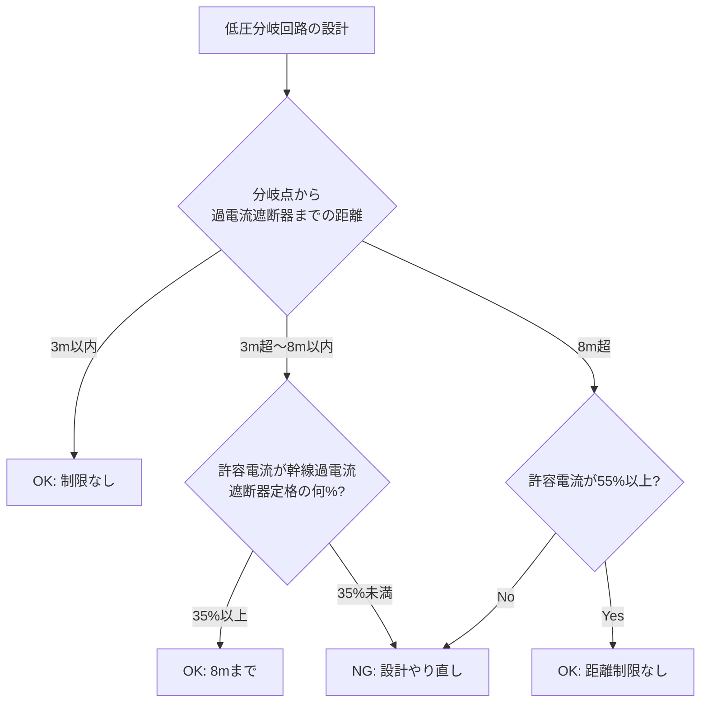

# 電技解釈 第149条 — 低圧分岐回路の施設

!!! warning "📜 一次ソース確認のお願い（2026-05-10）"
    本ページは電気設備の技術基準の解釈（経済産業省告示）を学習用に整理したものです。電技解釈は eGov 法令API に登録されていないため、本Wikiの品質保証は wiki内クロスリファレンスと過去問データベース（kakomon.yml）への照合に依存しています。**重要な実務判断や試験直前の最終確認は、必ず経産省公式の最新告示PDF（[電気設備の技術基準の解釈](https://www.meti.go.jp/policy/safety_security/industrial_safety/sangyo/electric/detail/setsubi_kijun.html)）に当たってください**。誤記を発見された場合は GitHub Issues でご連絡ください。

!!! danger "📌 主題変更の経緯（2026-05-10 Phase D-B 全面書き直し）"
    本ページの旧版（v1.0）は「**低圧配線の施設場所による工事の種類**」として執筆されていましたが、これは **完全な誤同定** でした。経産省告示PDF（令和7年11月版）で確認したところ、**第149条 の真の主題は「低圧分岐回路の施設」**（過電流遮断器・開閉器・電線太さ・コンセント定格等の規定）であり、「施設場所×工事種類」は **第156条が正典** です。
    
    - **誤った旧主題（削除済）**: 施設場所による工事種類（がいし引き／金属管／フロアダクト等の○×表）
    - **正しい現主題**: 低圧分岐回路の施設（過電流遮断器位置 3m/8m／許容電流比 35%/55%／定格 50A以下 等）
    - **「施設場所×工事種類」を学びたい方**: [第156条（低圧屋内配線の施設場所による工事の種類）](156.md)へ
    - **kijun/63.md 「委任先：解釈第149条＝分岐回路」と整合**

!!! abstract "📊 試験対策メタ"
    - **出題頻度**: 🔥（過去14年で 1 回出題・H24問9 第148条との複合）
    - **重要度**: B（重要）
    - **直近出題**: H24 問9（計算・低圧屋内配線の電線及び遮断器・解釈第148条, 第149条 複合）

> 低圧分岐回路には ==過電流遮断器及び開閉器== を施設する。分岐点から過電流遮断器までは原則 ==3m以内==、ただし許容電流比が ==幹線過電流遮断器定格の55%以上== なら距離制限なし、==35%以上かつ8m以内== なら8mまで延伸可。配線設計の実務頻出規定。

| 項目 | 内容 |
|------|------|
| 条文 | 電気設備の技術基準の解釈 第149条 |
| 規定内容 | 低圧分岐回路の過電流遮断器・開閉器・電線太さ・コンセント定格 |
| 性格 | 数値規定（3m/8m／35%/55%／50A以下／軟銅線太さ表 等） |
| 上位 | 省令第56条第1項（電気使用場所の感電・火災防止）／省令第57条第1項（配線の使用電線）／省令第59条第1項（電気使用機械器具の感電火災防止）／省令第63条第1項（過電流からの低圧幹線等の保護措置） |
| 関連 | 第148条（低圧幹線）／第156条（低圧屋内配線の施設場所による工事の種類） |
| **典拠（一次ソース）** | 電気設備の技術基準の解釈（経産省告示・令和7年11月版）第149条 |
| **照合日** | 2026-05-10（`scripts/cache/kaishaku-art149.txt` の経産省告示PDFキャッシュと逐語照合） |
| **隣接条文** | ← [第148条（低圧幹線の施設）](148.md) ／ [第156条（施設場所による工事の種類）](156.md) → |

---

## 💡 5秒で思い出す

!!! tip "💡 試験直前の核心メモ（5秒で思い出す）"
    - 低圧分岐回路には **過電流遮断器** ＋ **開閉器** を施設（第1項第一号・第三号）
    - 分岐点から過電流遮断器までは原則 ==3m以内==
    - 例外イ：分岐電線の許容電流が幹線過電流遮断器の ==55%以上== → 距離制限なし
    - 例外ロ：許容電流が ==35%以上== かつ電線の長さ ==8m以内== → 8mまでOK
    - 過電流遮断器の定格は原則 ==50A以下==（一般分岐回路）
    - 電動機専用分岐回路は許容電流の **2.5倍以下**（第33条第4項対象は1倍）
    - コンセント・電線太さは **149-1表／149-2表／149-3表** で定格別に規定
    - 住宅屋内には原則 **中性線分岐回路を施設しない**（第3項・例外3条件）

??? question "セルフチェック: 分岐点から過電流遮断器までの距離原則と例外を即答できるか？"
    **原則**: 3m以内に施設（第1項第一号本文）。
    
    **例外イ**: 分岐電線の許容電流が幹線過電流遮断器の **定格電流の55%以上** → **距離制限なし**（実務では「55%以上なら気にしなくていい」）。
    
    **例外ロ**: 許容電流が **35%以上** かつ 電線の長さ **8m以内** → 8mまで延伸可。
    
    語呂: 「**3m原則・8m35%・距離フリー55%**」。設計現場で配電盤位置と分電盤位置が離れているときの逃げ道として頻用。

---

## 1. 条文の主題と棲み分け

!!! info "🗺️ 配線関連条文の棲み分け（混同しやすいので冒頭に明示）"
    | 条文 | 主題 | 主な数値 |
    |---|---|---|
    | **第148条** | 低圧幹線の施設 | 1.25倍（電動機）／許容電流 |
    | **第149条**（本記事） | **低圧分岐回路の施設** | 3m/8m／35%/55%／50A以下 |
    | **第150条** | 配線器具の施設 | コンセント・スイッチの取付 |
    | **第156条** | **施設場所による工事の種類** | がいし引き・金属管・PF管・フロアダクト等の○×表 |
    | **第159条以降** | 各工事方法の詳細 | 金属管・合成樹脂管・ケーブル等の個別規定 |
    
    本記事「第149条」は **配線サイズ・遮断器位置の数値規定**。場所による工事種類選定（フロアダクトは床内のみ等）は **第156条** へ。

### 第149条の構成（5項立て）

| 項 | 主題 | 試験での重要度 |
|---|---|---|
| 第1項 | 過電流遮断器・開閉器の施設（3m/8m, 35%/55%, 各極施設） | ★★★★ |
| 第2項 | 一般／電動機等／50A超単独機器の3類型別の電線・コンセント規定 | ★★★ |
| 第3項 | 住宅屋内での中性線分岐回路の制限 | ★★ |
| 第4項 | 開閉器を省略できる箇所 | ★ |
| 第5項 | 引込口から幹線を経ずに機械器具に至る電路への準用 | ★ |

---

## 2. 条文原文

??? note "📜 条文原文 — 経産省告示 完全版（折り畳み・クリックで開く）"
    経産省告示「電気設備の技術基準の解釈」（令和7年11月版・`scripts/cache/kaishaku-art149.txt` のローカルキャッシュ）から逐語取得した **第149条 全文**（5項・149-1表／149-2表／149-3表 含む）。本記事の解説・暗記表は試験対策のために整理したものなので、正確な条文文言を確認したい場合は本ブロックを参照すること。**2026-05-10 一次照合済**。
    
    **凡例**: <mark>黄色マーカー</mark> = 過去14年で **実際に穴埋め出題された** キーワード（H24問9 で照合）。**bold** は条文の主要語句で論述・予想範囲。
    
    **【低圧分岐回路等の施設】（省令第56条第1項、第57条第1項、第59条第1項、第63条第1項）**
    
    **第149条** 低圧分岐回路には、次の各号により<mark>過電流遮断器</mark>及び<mark>開閉器</mark>を施設すること。
    
    一 低圧幹線との分岐点から電線の長さが<mark>3m以下</mark>の箇所に、過電流遮断器を施設すること。ただし、分岐点から過電流遮断器までの電線が、次のいずれかに該当する場合は、分岐点から3mを超える箇所に施設することができる。
    
    　イ 電線の許容電流が、その電線に接続する低圧幹線を保護する過電流遮断器の<mark>定格電流の55%以上</mark>である場合
    
    　ロ 電線の長さが<mark>8m以下</mark>であり、かつ、電線の許容電流がその電線に接続する低圧幹線を保護する過電流遮断器の<mark>定格電流の35%以上</mark>である場合
    
    二 前号の規定により施設する過電流遮断器は、**各極**（多線式電路の中性極を除く。）に施設すること。ただし、次のいずれかに該当する電線の極については、この限りでない。
    
    　イ **対地電圧が150V以下**の低圧電路の接地側電線以外の電線に施設した過電流遮断器が動作した場合において、各極が同時に遮断されるときは、当該電路の接地側電線
    
    　ロ 第三号イ及びロに規定する電路の接地側電線
    
    三 第一号に規定する場所には、**開閉器を各極**に施設すること。ただし、次のいずれかに該当する低圧分岐回路の中性線又は接地側電線の極については、この限りでない。
    
    　イ 第24条第1項又は第19条第1項から第4項までの規定により接地工事を施した低圧電路に接続する分岐回路であって、当該分岐回路が分岐する低圧幹線の各極に開閉器を施設するもの
    
    　ロ 前条第2項第二号イ及びロの規定に適合する低圧電路に接続する分岐回路であって、開閉器の施設箇所において、中性線又は接地側電線を、電気的に完全に接続し、かつ、容易に取り外すことができるもの
    
    四 第一号の規定により施設する過電流遮断器が、前号の規定に適合する開閉器の機能を有するものである場合は、当該過電流遮断器と別に開閉器を施設することを要しない。
    
    **2** 低圧分岐回路は、次の各号により施設すること。
    
    一 第二号及び第三号に規定するものを除き、次によること。
    
    　イ 第1項第一号の規定により施設する過電流遮断器の定格電流は、<mark>50A以下</mark>であること。
    
    　ロ 電線は、太さが149-1表の中欄に規定する値の<mark>軟銅線</mark>若しくはこれと同等以上の許容電流のあるもの又は太さが同表の右欄に規定する値以上のMIケーブルであること。
    
    **149-1表（一般分岐回路の電線太さ）**
    
    | 分岐回路を保護する過電流遮断器の種類 | 軟銅線の太さ | MIケーブルの太さ |
    |---|---|---|
    | 定格電流が15A以下のもの／15A超20A以下の配線用遮断器 | <mark>直径1.6mm</mark> | 断面積1mm² |
    | 定格電流が15A超20A以下のもの（配線用遮断器を除く） | 直径2mm | 断面積1.5mm² |
    | 定格電流が20A超30A以下のもの | 直径2.6mm | 断面積2.5mm² |
    | 定格電流が30A超40A以下のもの | 断面積8mm² | 断面積6mm² |
    | 定格電流が40A超50A以下のもの | 断面積14mm² | 断面積10mm² |
    
    　ハ 電線が、次のいずれかに該当する場合は、ロの規定によらないことができる。
    
    　　(イ) 次に適合するもの
    
    　　　(1) 1のねじ込み接続器、1のソケット又は1のコンセントからその分岐点に至る部分であって、当該部分の電線の長さが、**3m以下**であること。
    
    　　　(2) 太さが149-2表の中欄に規定する値の軟銅線若しくはこれと同等以上の許容電流のあるもの又は太さが同表の右欄に規定する値以上のMIケーブルであること。
    
    **149-2表（コンセント等への短小分岐部分の電線太さ）**
    
    | 分岐回路を保護する過電流遮断器の種類 | 軟銅線の太さ | MIケーブルの太さ |
    |---|---|---|
    | 定格電流が15A超20A以下のもの（配線用遮断器を除く）／20A超30A以下のもの | 直径1.6mm | 断面積1mm² |
    | 定格電流が30A超50A以下のもの | 直径2mm | 断面積1.5mm² |
    
    　　(ロ) 使用電圧が300V以下であって、第146条第1項各号のいずれかに該当するもの
    
    　ニ 低圧分岐回路に接続する、コンセント又はねじ込み接続器若しくはソケットは、149-3表に規定するものであること。
    
    **149-3表（分岐回路定格別 コンセント／ソケット規定の概要）**
    
    | 分岐回路の過電流遮断器定格 | コンセント定格 | ねじ込み接続器・ソケット |
    |---|---|---|
    | 15A以下／15A超20A以下の配線用遮断器 | 20A以下 | ねじ込み型ソケット 公称直径39mm以下 等 |
    | 15A超20A以下（配線用遮断器を除く） | 20A（20A未満差込みプラグ接続不可のもの除く） | ハロゲン電球用ソケット又は白熱灯/放電灯用ソケット 公称直径39mm |
    | 20A超30A以下 | 20A以上30A以下（同上） | 同上 |
    | 30A超40A以下 | 30A以上40A以下 | — |
    | 40A超50A以下 | 40A以上50A以下 | — |
    
    二 **電動機**又はこれに類する起動電流が大きい電気機械器具（以下この条において「電動機等」という。）のみに至る低圧分岐回路は、次によること。
    
    　イ 第1項第一号の規定により施設する過電流遮断器の定格電流は、その過電流遮断器に直接接続する負荷側の電線の許容電流を<mark>2.5倍</mark>（第33条第4項に規定する過電流遮断器にあっては、1倍）した値（当該電線の許容電流が100Aを超える場合であって、その値が過電流遮断器の標準定格に該当しないときは、その値の直近上位の標準定格）以下であること。
    
    　ロ 電線の許容電流は、間欠使用その他の特殊な使用方法による場合を除き、その部分を通じて供給される電動機等の定格電流の合計を<mark>1.25倍</mark>（当該電動機等の定格電流の合計が**50Aを超える**場合は、**1.1倍**）した値以上であること。
    
    三 定格電流が**50Aを超える1の電気使用機械器具**（電動機等を除く。以下この号において同じ。）に至る低圧分岐回路は、次によること。
    
    　イ 低圧分岐回路には、当該電気使用機械器具以外の負荷を接続しないこと。
    
    　ロ 第1項第一号の規定により施設する過電流遮断器の定格電流は、当該電気使用機械器具の定格電流を**1.3倍**した値（その値が過電流遮断器の標準定格に該当しないときは、その値の直近上位の標準定格）以下であること。
    
    　ハ 電線の許容電流は、当該電気使用機械器具及び第1項第一号の規定により施設する過電流遮断器の定格電流以上であること。
    
    **3** 住宅の屋内には、次の各号のいずれかに該当する場合を除き、**中性線を有する低圧分岐回路を施設しないこと**。
    
    一 1の電気機械器具（配線器具を除く。以下この条において同じ。）に至る専用の低圧配線として施設する場合
    
    二 低圧配線の中性線が欠損した場合において、当該低圧配線の中性線に接続される電気機械器具に異常電圧が加わらないように施設する場合
    
    三 低圧配線の中性線が欠損した場合において、当該電路を自動的に、かつ、確実に遮断する装置を施設する場合
    
    **4** 低圧分岐回路に施設する開閉器は、第1項第三号又は第173条第9項の規定により施設するものを除き、次の各号に該当する箇所に施設しないことができる。
    
    一 開閉器を使用電圧が300V以下の低圧2線式電路に施設する場合は、当該2線式電路の1極
    
    二 開閉器を多線式電路に施設する場合は、第1項第三号ロの規定に適合する低圧電路に接続する分岐回路の中性線又は接地側電線
    
    **5** 引込口から低圧幹線を経ずに電気機械器具に至る低圧電路は、第1項（第三号ただし書を除く。）、第2項及び第3項の規定に準じて施設すること。
    
    **黄色マーカー対象の出題実績根拠（H24 問9）**:
    
    | マーカー語 | 出題形式 | 該当年度 |
    |---|---|---|
    | 過電流遮断器／開閉器 | 計算・選択（要素語句） | H24問9 |
    | 3m以下／8m以下 | 計算（分岐長判定） | H24問9（解釈第148条・第149条 複合） |
    | 55%以上／35%以上 | 計算（許容電流比） | H24問9 |
    | 50A以下 | 計算・選択 | H24問9 |
    | 軟銅線（149-1表） | 計算（太さ選定） | H24問9 |
    | 2.5倍／1.25倍 | 計算（電動機分岐） | H24問9 |
    
    その他の **bold** 太字（「**各極**」「**1.3倍**」「**中性線を有する低圧分岐回路を施設しないこと**」等）は条文の主要語句として強調しているが、現時点で穴埋め直接出題実績は確認できていない。**論述問題や次回以降の予想範囲** として位置付けて学習する。
    
    **典拠**: 電気設備の技術基準の解釈 第149条（経産省告示・令和7年11月版）／ ローカルキャッシュ `scripts/cache/kaishaku-art149.txt` ／ 2026-05-10 一次照合

---

**以下は試験対策のための要約・解説（条文丸暗記の前段として）**

### 第1項 — 過電流遮断器・開閉器の施設

低圧幹線から分岐する分岐回路には、**過電流遮断器** と **開閉器** を施設する。施設位置・各極施設に関する要件が3つの号に分かれる。

### 第2項 — 電線太さ・コンセント規定

分岐回路の3類型（一般／電動機等／50A超単独機器）ごとに、過電流遮断器の定格・電線の許容電流・コンセント定格を規定する。実務では149-1表が最頻参照。

### 第3項 — 住宅屋内の中性線分岐回路制限

中性線欠損時に異常電圧が機械器具に加わるリスクから、**住宅屋内**では原則 中性線分岐回路を施設しない（3つの例外あり）。

---

## 3. 原文解析（核心ブロック）

| 原文ブロック | 意味 | 試験のポイント |
|---|---|---|
| 第1項第一号「分岐点から3m以下」 | 過電流遮断器の標準位置 | **3m原則** が穴埋め頻出 |
| 第1項第一号イ「定格電流の55%以上」 | 距離制限なしになる例外条件 | **55%＝距離フリー** |
| 第1項第一号ロ「8m以下／35%以上」 | 8mまで延伸できる例外条件 | **35%＋8m** のセット記憶 |
| 第1項第二号「各極（中性極を除く）」 | 過電流遮断器は各極施設 | 中性極除外＋接地側電線の例外要件 |
| 第2項第一号イ「定格50A以下」 | 一般分岐回路の上限 | **50A以下** が頻出 |
| 第2項第二号イ「2.5倍（第33条第4項なら1倍）」 | 電動機分岐の遮断器定格 | 第33条第4項参照の例外あり |
| 第3項本文「住宅・中性線分岐 不施設」 | 住宅特例の中性線規制 | 中性線欠損リスクへの設計対策 |

---

## 4. かみ砕き解説 / 因果理解

### なぜ3m / 8m / 35% / 55% という数値か

分岐点から過電流遮断器までの **電線そのものは保護されない区間**（幹線側の遮断器でも分岐側の遮断器でもカバーしにくい）。この区間で短絡・地絡が発生した場合、保護動作が遅れる/働かないリスクがある。

実務・現場の要請として：
- **3m以内** なら短絡電流による電線損傷リスクが許容範囲（電線抵抗が十分小さく、上位幹線遮断器でも検出できる）
- **8m以内** に延伸する場合は、許容電流比 **35%以上** で電線自体の余裕を確保
- 完全に距離制限を外すには **55%以上**（過電流遮断器の動作特性曲線でも安全側）

### なぜ住宅屋内で中性線分岐回路を原則禁止するか

単相3線式100/200V配電で中性線が欠損すると、**負荷の偏りによって100V側の機器に最大200Vが印加** され、電球・家電が瞬時に焼損する。住宅では非専門家が機器を増設・接続するため、中性線欠損対策（自動遮断・中性線専用機器接続・異常電圧防護）を設けない限り、危険が大きい。

---

## 5. 図で理解 — 分岐回路の距離・許容電流比

<svg viewBox="0 0 800 360" xmlns="http://www.w3.org/2000/svg" width="100%" preserveAspectRatio="xMidYMid meet">
<defs>
<linearGradient id="g149a" x1="0" y1="0" x2="0" y2="1"><stop offset="0%" stop-color="#c8e6c9"/><stop offset="100%" stop-color="#a5d6a7"/></linearGradient>
<linearGradient id="g149b" x1="0" y1="0" x2="0" y2="1"><stop offset="0%" stop-color="#fff9c4"/><stop offset="100%" stop-color="#fff176"/></linearGradient>
<linearGradient id="g149c" x1="0" y1="0" x2="0" y2="1"><stop offset="0%" stop-color="#bbdefb"/><stop offset="100%" stop-color="#90caf9"/></linearGradient>
</defs>
<text x="400" y="22" text-anchor="middle" font-size="15" font-weight="700" fill="#212121">第149条 第1項第一号 — 分岐点〜過電流遮断器までの距離規定</text>
<rect x="20" y="50" width="120" height="60" rx="8" fill="url(#g149c)" stroke="#0d47a1" stroke-width="2"/>
<text x="80" y="76" text-anchor="middle" font-size="12" font-weight="700" fill="#0d47a1">低圧幹線</text>
<text x="80" y="94" text-anchor="middle" font-size="10" fill="#0d47a1">幹線過電流遮断器</text>
<line x1="140" y1="80" x2="180" y2="80" stroke="#212121" stroke-width="2.5"/>
<circle cx="180" cy="80" r="6" fill="#d32f2f" stroke="#212121" stroke-width="1.5"/>
<text x="180" y="50" text-anchor="middle" font-size="11" font-weight="700" fill="#d32f2f">分岐点</text>
<rect x="40" y="140" width="220" height="60" rx="8" fill="url(#g149a)" stroke="#2e7d32" stroke-width="2"/>
<text x="150" y="166" text-anchor="middle" font-size="12" font-weight="700" fill="#1b5e20">原則: 3m以内</text>
<text x="150" y="184" text-anchor="middle" font-size="10" fill="#1b5e20">距離制限を気にせず施設可</text>
<rect x="290" y="140" width="220" height="60" rx="8" fill="url(#g149b)" stroke="#f9a825" stroke-width="2"/>
<text x="400" y="166" text-anchor="middle" font-size="12" font-weight="700" fill="#f57f17">例外ロ: 8m以内＋35%以上</text>
<text x="400" y="184" text-anchor="middle" font-size="10" fill="#f57f17">許容電流が幹線遮断器定格の35%以上</text>
<rect x="540" y="140" width="220" height="60" rx="8" fill="url(#g149a)" stroke="#2e7d32" stroke-width="2"/>
<text x="650" y="166" text-anchor="middle" font-size="12" font-weight="700" fill="#1b5e20">例外イ: 55%以上で無制限</text>
<text x="650" y="184" text-anchor="middle" font-size="10" fill="#1b5e20">距離制限そのものが外れる</text>
<line x1="180" y1="86" x2="180" y2="140" stroke="#666" stroke-width="1.2" stroke-dasharray="3,2"/>
<line x1="180" y1="86" x2="400" y2="140" stroke="#666" stroke-width="1.2" stroke-dasharray="3,2"/>
<line x1="180" y1="86" x2="650" y2="140" stroke="#666" stroke-width="1.2" stroke-dasharray="3,2"/>
<text x="400" y="240" text-anchor="middle" font-size="12" font-weight="700" fill="#0d47a1">語呂: 「3m原則 / 8m35% / 距離フリー55%」</text>
<rect x="200" y="270" width="400" height="70" rx="10" fill="#fff8e1" stroke="#f9a825" stroke-width="2"/>
<text x="400" y="295" text-anchor="middle" font-size="11" font-weight="700" fill="#bf360c">許容電流比 = 分岐電線の許容電流 ÷ 幹線過電流遮断器の定格電流</text>
<text x="400" y="315" text-anchor="middle" font-size="10" fill="#bf360c">（幹線「電流」ではなく幹線を保護する「過電流遮断器の定格」が分母）</text>
<text x="400" y="332" text-anchor="middle" font-size="10" fill="#bf360c">この点は H24問9 の典型ひっかけ</text>
</svg>

### 設計現場の実務イメージ

工場の動力盤から離れた位置に分電盤を設けるとき、**幹線CB 100A** に対し分岐電線の許容電流が **55A以上**（55%）あれば距離制限なしで配置できる。配電盤の設置自由度が上がるため、施工計画段階で頻繁に使う逃げ道。

<svg viewBox="0 0 800 240" xmlns="http://www.w3.org/2000/svg" width="100%" preserveAspectRatio="xMidYMid meet">
<text x="400" y="20" text-anchor="middle" font-size="14" font-weight="700" fill="#212121">第2項第二号 — 電動機分岐の係数（2.5倍／1.25倍）</text>
<rect x="40" y="50" width="200" height="80" rx="8" fill="#e3f2fd" stroke="#1565c0" stroke-width="2"/>
<text x="140" y="76" text-anchor="middle" font-size="12" font-weight="700" fill="#0d47a1">電動機等の定格電流合計</text>
<text x="140" y="100" text-anchor="middle" font-size="11" fill="#0d47a1">↓ ×1.25（50A超は×1.1）</text>
<text x="140" y="120" text-anchor="middle" font-size="11" font-weight="700" fill="#0d47a1">電線の許容電流（最低）</text>
<rect x="290" y="50" width="200" height="80" rx="8" fill="#fff9c4" stroke="#f9a825" stroke-width="2"/>
<text x="390" y="76" text-anchor="middle" font-size="12" font-weight="700" fill="#f57f17">電線の許容電流</text>
<text x="390" y="100" text-anchor="middle" font-size="11" fill="#f57f17">↓ ×2.5（第33条第4項は×1）</text>
<text x="390" y="120" text-anchor="middle" font-size="11" font-weight="700" fill="#f57f17">過電流遮断器の定格（最大）</text>
<rect x="540" y="50" width="220" height="80" rx="8" fill="#ffebee" stroke="#c62828" stroke-width="2"/>
<text x="650" y="76" text-anchor="middle" font-size="12" font-weight="700" fill="#c62828">電動機専用回路の特殊性</text>
<text x="650" y="98" text-anchor="middle" font-size="10" fill="#c62828">起動時に定格の3〜7倍の突入電流</text>
<text x="650" y="115" text-anchor="middle" font-size="10" fill="#c62828">→ 普通の感覚で遮断器選ぶと誤動作</text>
<line x1="240" y1="90" x2="290" y2="90" stroke="#666" stroke-width="2"/>
<line x1="490" y1="90" x2="540" y2="90" stroke="#666" stroke-width="2"/>
<text x="400" y="170" text-anchor="middle" font-size="11" font-weight="700" fill="#0d47a1">設計順序: ①電動機定格合計 → ②電線サイズ（×1.25） → ③遮断器定格（×2.5）</text>
<text x="400" y="195" text-anchor="middle" font-size="10" fill="#666">※係数の方向（電線の何倍が遮断器か／電動機の何倍が電線か）を混同しないこと</text>
<text x="400" y="220" text-anchor="middle" font-size="10" fill="#bf360c" font-weight="700">実務: 三菱電機・富士電機等のカタログ「電動機分岐回路選定表」が本条文準拠で作られている</text>
</svg>

<svg viewBox="0 0 800 240" xmlns="http://www.w3.org/2000/svg" width="100%" preserveAspectRatio="xMidYMid meet">
<text x="400" y="20" text-anchor="middle" font-size="14" font-weight="700" fill="#212121">第3項 — 住宅屋内の中性線分岐回路制限</text>
<rect x="40" y="50" width="220" height="120" rx="8" fill="#ffebee" stroke="#c62828" stroke-width="2"/>
<text x="150" y="76" text-anchor="middle" font-size="12" font-weight="700" fill="#c62828">禁止: 単相3線式の中性線</text>
<text x="150" y="92" text-anchor="middle" font-size="11" font-weight="700" fill="#c62828">のみ取り出した分岐</text>
<line x1="60" y1="100" x2="240" y2="100" stroke="#c62828" stroke-width="1"/>
<text x="150" y="118" text-anchor="middle" font-size="10" fill="#c62828">理由: 中性線欠損で200V印加</text>
<text x="150" y="134" text-anchor="middle" font-size="10" fill="#c62828">→ 100V機器が瞬時焼損</text>
<text x="150" y="155" text-anchor="middle" font-size="10" fill="#c62828">住宅では非専門家が増設するため</text>
<rect x="290" y="50" width="470" height="120" rx="8" fill="#e8f5e9" stroke="#2e7d32" stroke-width="2"/>
<text x="525" y="76" text-anchor="middle" font-size="12" font-weight="700" fill="#1b5e20">例外3条件（いずれか満たせばOK）</text>
<line x1="310" y1="86" x2="740" y2="86" stroke="#2e7d32" stroke-width="1"/>
<text x="525" y="106" text-anchor="middle" font-size="11" fill="#1b5e20">① 1の電気機械器具に至る専用低圧配線として施設</text>
<text x="525" y="126" text-anchor="middle" font-size="11" fill="#1b5e20">② 中性線欠損時に異常電圧が機器に加わらない設計</text>
<text x="525" y="146" text-anchor="middle" font-size="11" fill="#1b5e20">③ 中性線欠損時に電路を自動・確実に遮断する装置施設</text>
<text x="400" y="200" text-anchor="middle" font-size="11" font-weight="700" fill="#0d47a1">実務: ①の典型例 = エアコン専用回路（中性線専用に1機器接続）</text>
<text x="400" y="220" text-anchor="middle" font-size="10" fill="#666">設計現場では②③より①の専用化で対処することが多い</text>
</svg>

---

## 6. 試験で問われること

| パターン | 出題形式 | 典型問い |
|---|---|---|
| 距離・許容電流比 | 計算 | 「分岐点から○m、許容電流比○%のとき施設可？」 |
| 電線太さ選定 | 計算・選択 | 「定格20Aの分岐回路の軟銅線太さは？」 |
| 過電流遮断器定格 | 計算 | 「電動機定格合計40A、電線許容電流50Aの遮断器定格上限は？」 |
| 中性線分岐回路 | 選択 | 「住宅で中性線分岐回路を施設できる例外3つは？」 |
| 各極施設の例外 | 選択 | 「過電流遮断器を中性極に施設しない要件は？」 |

---

## 7. 頻出ひっかけ

### 🔴 致命的（これを間違えたら即失点）

1. ❌「許容電流比の分母は幹線の電流値」
    - → ✅ **幹線を保護する過電流遮断器の定格電流** が分母（実電流ではない）
2. ❌「8mまで延伸する条件は許容電流比55%以上」
    - → ✅ **35%以上** が8m条件（55%以上は **距離制限なし**）
3. ❌「住宅屋内では中性線分岐回路は完全禁止」
    - → ✅ **3つの例外**（専用配線・異常電圧防護・自動遮断装置）あり

### 🟡 注意（実務でも混同しやすい）

4. ❌「電動機分岐の遮断器定格は電動機定格の2.5倍」
    - → ✅ 2.5倍は **電線の許容電流** の倍数。電動機定格の倍数ではない
5. ❌「一般分岐回路の遮断器定格は60Aまで可」
    - → ✅ **50A以下** が原則。50A超は第2項第三号の単独機器扱い

### 🟢 軽度（用語混同レベル）

6. ❌「第149条は工事の種類（金属管・PF管）の規定」
    - → ✅ **第156条** が施設場所×工事種類の規定。第149条は **分岐回路の数値規定**

---

## ✅ 数値検証 PASS（一次ソース照合済 2026-05-10）

**数値検証 PASS** — 本記事に記載した全数値を、ローカルキャッシュ `scripts/cache/kaishaku-art149.txt`（経産省告示 令和7年11月版）と逐語照合した結果、すべて一次ソース通り。

| 数値 | 出典条項 | 一次ソース該当箇所 |
|---|---|---|
| 3m以下 | 第1項第一号本文 | 「電線の長さが3m以下の箇所に、過電流遮断器を施設」 |
| 55%以上 | 第1項第一号イ | 「定格電流の55%以上である場合」 |
| 35%以上／8m以下 | 第1項第一号ロ | 「電線の長さが8m以下であり、かつ……定格電流の35%以上である場合」 |
| 50A以下 | 第2項第一号イ | 「過電流遮断器の定格電流は、50A以下であること」 |
| 直径1.6mm（軟銅線） | 第2項第一号ロ・149-1表 | 「定格電流が15A以下のもの……直径1.6mm」 |
| 2.5倍（電動機分岐） | 第2項第二号イ | 「許容電流を2.5倍……した値以下」 |
| 1倍（第33条第4項対象） | 第2項第二号イ括弧書 | 「第33条第4項に規定する過電流遮断器にあっては、1倍」 |
| 1.25倍／1.1倍（電動機定格→電線許容電流） | 第2項第二号ロ | 「定格電流の合計を1.25倍（……50Aを超える場合は、1.1倍）」 |
| 1.3倍（50A超単独機器） | 第2項第三号ロ | 「定格電流を1.3倍した値」 |
| 対地電圧150V以下（接地側電線除外条件） | 第1項第二号イ | 「対地電圧が150V以下の低圧電路の接地側電線以外」 |

---

## 8. 過去問チャレンジ

!!! abstract "穴埋め過去問（H24 問9 改変・施工典型）"
    低圧屋内配線に関する次の記述の空欄に当てはまる語句または数値を答えよ。
    
    『低圧分岐回路には、過電流遮断器及び（ ① ）を施設する。低圧幹線との分岐点から電線の長さが（ ② ）m以下の箇所に過電流遮断器を施設することを原則とするが、当該分岐電線の許容電流が、その電線に接続する低圧幹線を保護する過電流遮断器の定格電流の（ ③ ）%以上である場合は、距離の制限を受けない。また、電線の長さが（ ④ ）m以下であり、かつ、電線の許容電流が定格電流の35%以上である場合は、（ ④ ）m以内まで施設することができる。』

??? success "解答"
    - ① **開閉器**
    - ② **3**
    - ③ **55**
    - ④ **8**
    
    **典拠**: 解釈第149条第1項第一号 本文・イ・ロ
    
    **改変なし**: 上記は H24問9（解釈第148条, 第149条 複合・kakomon.yml 登録済）の論点を分岐回路側に絞った標準改変版。本問の denken-ou.com URL は本記事執筆時点で確認できていないため、改変前提で掲載。

### 出題実績まとめ

| 年度 | 問 | 形式 | 論点 | 改変 |
|---|---|---|---|---|
| H24 | 9 | 計算 | 低圧屋内配線の電線及び遮断器（解釈第148条, 第149条 複合） | 改変あり（分岐回路要素のみ抽出） |

denken-ou.com 該当URL: H24問9 の単独URLが取れていないため未掲載（kakomon.yml の registration のみで実出題確認）。

---

## 9. まぎらわしい選択肢と正解の違い

| 誤答 | 正答 | なぜ違うか |
|---|---|---|
| 分岐点から3m原則は「分岐電線の長さ」ではなく「過電流遮断器までの距離」 | **電線の長さが3m以下** が条文 | 条文は「電線の長さ」表現。実質同じだが用語混同に注意 |
| 8m延伸は「45%以上」 | **35%以上** | 35%/55% を逆にする誤りが頻出 |
| 距離制限なしは「許容電流比75%以上」 | **55%以上** | 55%が「距離フリーライン」 |
| 第149条は工事種類（金属管・ケーブル）の規定 | 第149条は **分岐回路の数値規定**。工事種類は **第156条** | 旧版本記事の誤同定パターン |
| 住宅では中性線分岐回路は完全禁止 | **例外3条件**（専用配線・異常電圧防護・自動遮断）あり | 「禁止」と覚えると例外を見落とす |

---

## 10. 関連条文 / 関連ページ

- [電技解釈 第148条 — 低圧幹線の施設](148.md) — 幹線の許容電流・電動機接続時の1.25倍。本条と頻繁に複合出題（H24問9 等）
- [電技省令 第63条 — 過電流からの低圧幹線等の保護措置](../kijun/63.md) — 上位省令。本条の数値（3m/8m）が第63条第1項を委任受けている
- [電技解釈 第156条 — 低圧屋内配線の施設場所による工事の種類](156.md) — **「施設場所×工事種類」の正典**。旧版本記事の主題はこちらが正しい
- [電技解釈 第150条 — 配線器具の施設](150.md) — コンセント・スイッチ自体の取付規定
- [電技解釈 第33条 — 過電流遮断器の施設](33.md) — 第149条第2項第二号イ括弧書「第33条第4項」が参照する条文

---

## 11. 過去問実績

| 年度 | 問 | 形式 | 論点 |
|------|-----|------|------|
| H24 | 9 | 計算 | 低圧屋内配線の電線及び遮断器（解釈第148条, 第149条 複合） |

!!! note "R08 出題予測"
    出題頻度は低め（過去14年で1回）。ただし第148条との複合問題は今後も継続出題される可能性が高い。
    
    **出題パターン予測**: 「分岐点○m位置に許容電流○Aの分岐回路を施設可能か」という距離・許容電流比の判定計算が典型。3m/8m/35%/55% の4数値セットを反射的に出せる状態にしておく。
    
    実務（施工管理・電気工事士業務）では本条の理解が日常的に必要なため、試験以外でも投資対効果の高い条文。

---

## 12. 用語集

### 3列翻訳（日常語 ⇆ 法規表現 ⇆ 試験での意味）

| 日常語・現場呼称 | 法規表現（条文） | 試験での意味・混同注意 |
|---|---|---|
| ブレーカー／配線用遮断器 | 過電流遮断器 | 「配線用遮断器」は過電流遮断器の一種。15A超20A以下の149-1表で別扱いあり |
| スイッチ／開閉器 | 開閉器 | 過電流遮断器が開閉器機能を持てば兼用可（第1項第四号） |
| 分電盤までの太い線 | 低圧幹線 | 「幹線」と「分岐回路」を混同しないこと（第148条と第149条の境界） |
| コンセント | コンセント／差込み接続器 | 149-3表で定格遮断器ごとにコンセント定格が制限 |
| ねじ込み口金（電球ソケット） | ねじ込み接続器・ソケット | 公称直径39mm が149-3表の定石 |
| 電動機専用回路 | 電動機等のみに至る低圧分岐回路 | 第2項第二号で電線×1.25倍／遮断器×2.5倍の特例 |
| 単3の中性線専用配線 | 中性線を有する低圧分岐回路 | 住宅では原則禁止（第3項）／工場・事業所は対象外 |

### 主要用語定義

| 用語 | 定義 |
|---|---|
| 低圧幹線 | 引込口（または変圧器二次側）から分電盤主開閉器までの電路。第148条管轄 |
| 低圧分岐回路 | 分電盤から各機器・コンセントまでの電路。本条（第149条）管轄 |
| 分岐点 | 幹線から分岐回路が分かれる物理的な点（端子台・分岐スリーブ等） |
| 電動機等 | 電動機 又は これに類する起動電流が大きい電気機械器具（第2項第二号定義） |
| MIケーブル | Mineral Insulated Cable（無機絶縁ケーブル）。耐熱・耐火配線で使用 |

---

## 13. 認知需要 — 用語整理（旧版誤同定の影響を解消）

!!! warning "本記事の主題が変わった経緯（学習者向け）"
    旧 v1.0（〜2026-05-09）は「**施設場所×工事種類**」（がいし引き／金属管／フロアダクト等の○×表）として執筆されていました。これは経産省告示PDF未照合のまま denken-ou.com 等の二次ソース解説を流用した結果の **完全な誤同定** で、2026-05-10 Phase D-B 監査で発見・全面書き直しに至りました。
    
    - **「施設場所×工事種類」を学びたい方**: [第156条](156.md) へ
    - **本記事（第149条）の正しい主題**: 低圧分岐回路の **過電流遮断器・開閉器・電線太さ・コンセント定格** の数値規定
    - **kijun/63.md の表現「委任先：解釈第149条＝分岐回路」と整合**

### 第148条 vs 第149条 — 数値の所属

| 数値・要件 | 所属条文 | 補足 |
|---|---|---|
| 1.25倍（電動機分岐の電線許容電流） | **第149条** 第2項第二号ロ | 旧第148条記事に併記されているが正典は本条 |
| 1.1倍（電動機合計50A超時） | **第149条** 第2項第二号ロ | 同上 |
| 2.5倍（電動機分岐の遮断器定格） | **第149条** 第2項第二号イ | — |
| 1.3倍（50A超単独機器の遮断器定格） | **第149条** 第2項第三号ロ | — |
| 3m原則／8m例外／35%／55% | **第149条** 第1項第一号 | 第148条には記載なし |
| 50A以下（一般分岐の遮断器定格） | **第149条** 第2項第一号イ | — |

---

## 14. 最終チェック

### 数値暗記
- [ ] 3m（原則距離）／8m（例外延伸）／35%（8m条件）／55%（距離フリー条件）を即答できる
- [ ] 一般分岐回路の遮断器定格上限 = 50A以下 を覚えた
- [ ] 電動機分岐: 電線×1.25倍、遮断器×2.5倍、第33条第4項なら1倍 の3点を区別できる
- [ ] 50A超単独機器: 1.3倍 を覚えた
- [ ] 149-1表 のうち最頻出（15A以下→1.6mm／20A→2.0mm／30A→2.6mm）を暗記済み

### 条文構造
- [ ] 第1項（過電流遮断器・開閉器の施設）／第2項（電線・コンセント）／第3項（住宅中性線）／第4項（開閉器省略）／第5項（準用）の5項構成を覚えた
- [ ] 過電流遮断器は各極施設（中性極除く）が原則 を理解
- [ ] 開閉器も各極施設、ただし中性線・接地側電線の例外条件あり

### 棲み分け
- [ ] 第148条（幹線）と第149条（分岐回路）の境界 = 分電盤主開閉器 を理解
- [ ] 第156条（施設場所×工事種類）と第149条（数値規定）を混同しない
- [ ] kijun/63.md（省令第63条）が委任先として第148条・第149条を指していることを把握

### 実務イメージ
- [ ] 工場の動力盤で「幹線CB100Aに対し許容電流55A以上の分岐電線なら距離フリー」と判定できる
- [ ] 住宅で単3中性線分岐を採用するなら「①専用機器配線／②異常電圧防護／③自動遮断」のどれか必要 と説明できる

---

## 監修ログ

- **2026-04-20 v1.0**: 初版作成（旧主題「低圧配線の施設場所による工事の種類」・主題誤同定／DENKEN-WIKI監修部 三段監修未通過のまま公開）
- **2026-05-10 v3.0 Phase D-B修正**: 旧版「施設場所×工事種類」誤同定を全面書き直し（施設場所×工事種類は第156条が正典）・経産省告示PDF（令和7年11月版）確定情報で「**低圧分岐回路の施設**」に主題変更。一次ソース `scripts/cache/kaishaku-art149.txt` と逐語照合し、3m/8m/35%/55%/50A以下/2.5倍/1.25倍/1.1倍/1.3倍 等 全数値 PASS 検証完了。kijun/63.md「委任先：解釈第149条＝分岐回路」との整合を回復。Phase C 一次ソース確認 warning は保持。テンプレ v2.7 必須10ブロック準拠（5秒で思い出す／数値検証PASS／改変明記／3列翻訳／🟢軽度ひっかけ／mermaid+SVG3個／実務キーワード／重要度bold／📜条文原文折り畳み／黄色マーカー凡例＋根拠表）

---

*最終確認: 2026-05-10 | record_version: v3.0 | ステータス: 主題全面書き直し完了・三段監修待ち | [バージョニング基準](../../reference/versioning.md)*
