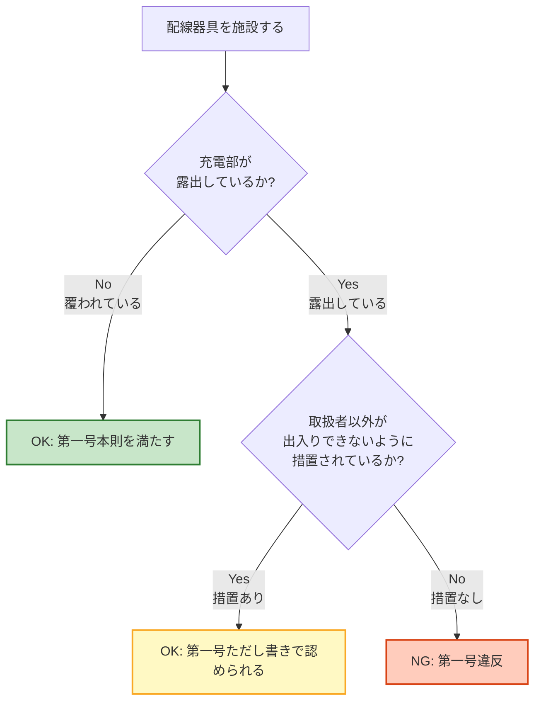

# 電技解釈 第150条 — 配線器具の施設

!!! warning "📜 一次ソース確認のお願い（2026-05-10）"
    本ページは電気設備の技術基準の解釈（経済産業省告示）を学習用に整理したものです。電技解釈は eGov 法令API に登録されていないため、本Wikiの品質保証は wiki内クロスリファレンスと過去問データベース（kakomon.yml）への照合に依存しています。**重要な実務判断や試験直前の最終確認は、必ず経産省公式の最新告示PDF（[電気設備の技術基準の解釈](https://www.meti.go.jp/policy/safety_security/industrial_safety/sangyo/electric/detail/setsubi_kijun.html)）に当たってください**。誤記を発見された場合は GitHub Issues でご連絡ください。

!!! note "📊 試験対策メタ"
    **出題頻度**: 🔥（出題頻度は低め・周辺条文との横断出題に注意）

    **重要度**: C（補助的・周辺条文と合わせて押さえる）

    **直近出題**: 直接出題は限定的。第148条・第149条・第151条の関連問題で文脈出題されることがある

> 電気使用場所に施設する配線器具（開閉器・接続器・点滅器など）について、**充電部の露出禁止**を原則とし、**防湿装置・電線接続・屋外防護**の4つの号で具体的な施設方法を定める条文。省令第59条（機械器具の感電防止）の解釈にあたる。

| 項目 | 内容 |
|------|------|
| 条文 | 電気設備の技術基準の解釈 第150条 |
| 規定内容 | 配線器具（開閉器・接続器・点滅器等）の施設方法 |
| 性格 | 4つの号で構成される施設方法規定 |
| 上位 | 省令第59条（機械器具の充電部露出禁止）／省令第56条（配線の感電・火災防止） |
| 関連 | 第151条（配線器具を除く電気機械器具）／第148条（低圧幹線）／第149条（工事の種類） |

---

## 1. 全体像と要点

| 観点 | 内容 |
|------|------|
| **第一号** | **充電部の露出禁止**（原則／例外: 取扱者以外が出入りできない場所） |
| **第二号** | **防湿装置**（湿気の多い場所／水気のある場所に施設する場合） |
| **第三号** | **電線接続の4要件**（ねじ止め＋堅ろう＋電気的完全＋張力除去） |
| **第四号** | **屋外防護装置**（損傷のおそれがある場所） |
| 配線器具 | 開閉器／接続器（コンセント等）／点滅器（スイッチ等）の総称 |
| 第151条との守備範囲 | 第150条 = 配線器具／第151条 = 配線器具を**除く**電気機械器具 |

### ① 全体像 — 第150条の4つの号

<svg viewBox="0 0 800 360" xmlns="http://www.w3.org/2000/svg" width="100%" preserveAspectRatio="xMidYMid meet">
<defs>
<filter id="sh150a" x="-20%" y="-20%" width="140%" height="140%"><feDropShadow dx="0" dy="2" stdDeviation="2" flood-opacity="0.15"/></filter>
<linearGradient id="g150A" x1="0" y1="0" x2="0" y2="1"><stop offset="0%" stop-color="#ffccbc"/><stop offset="100%" stop-color="#ff8a65"/></linearGradient>
<linearGradient id="g150B" x1="0" y1="0" x2="0" y2="1"><stop offset="0%" stop-color="#bbdefb"/><stop offset="100%" stop-color="#90caf9"/></linearGradient>
<linearGradient id="g150C" x1="0" y1="0" x2="0" y2="1"><stop offset="0%" stop-color="#c8e6c9"/><stop offset="100%" stop-color="#a5d6a7"/></linearGradient>
<linearGradient id="g150D" x1="0" y1="0" x2="0" y2="1"><stop offset="0%" stop-color="#fff9c4"/><stop offset="100%" stop-color="#fff176"/></linearGradient>
<linearGradient id="g150Main" x1="0" y1="0" x2="0" y2="1"><stop offset="0%" stop-color="#e1bee7"/><stop offset="100%" stop-color="#ba68c8"/></linearGradient>
</defs>
<text x="400" y="26" text-anchor="middle" font-size="15" font-weight="700" fill="#212121">第150条 — 配線器具の施設 4つの号</text>
<text x="400" y="44" text-anchor="middle" font-size="11" fill="#666">感電・漏電・火災・損傷の4リスクに対応した施設要件</text>
<rect x="280" y="58" width="240" height="56" rx="12" fill="url(#g150Main)" stroke="#4a148c" stroke-width="2.5" filter="url(#sh150a)"/>
<text x="400" y="83" text-anchor="middle" font-size="14" font-weight="800" fill="#4a148c">解釈第150条</text>
<text x="400" y="103" text-anchor="middle" font-size="11" fill="#6a1b9a">配線器具の施設</text>
<line x1="400" y1="118" x2="120" y2="155" stroke="#4a148c" stroke-width="1.5" stroke-dasharray="3,2"/>
<line x1="400" y1="118" x2="307" y2="155" stroke="#4a148c" stroke-width="1.5" stroke-dasharray="3,2"/>
<line x1="400" y1="118" x2="493" y2="155" stroke="#4a148c" stroke-width="1.5" stroke-dasharray="3,2"/>
<line x1="400" y1="118" x2="680" y2="155" stroke="#4a148c" stroke-width="1.5" stroke-dasharray="3,2"/>
<rect x="20" y="160" width="200" height="170" rx="14" fill="url(#g150A)" stroke="#bf360c" stroke-width="2.5" filter="url(#sh150a)"/>
<text x="120" y="184" text-anchor="middle" font-size="12" font-weight="700" fill="#bf360c">第一号</text>
<line x1="40" y1="194" x2="200" y2="194" stroke="#bf360c" stroke-width="1"/>
<text x="120" y="216" text-anchor="middle" font-size="13" font-weight="800" fill="#bf360c">充電部</text>
<text x="120" y="234" text-anchor="middle" font-size="13" font-weight="800" fill="#bf360c">露出禁止</text>
<text x="120" y="262" text-anchor="middle" font-size="10" fill="#bf360c">＋例外規定あり</text>
<text x="120" y="280" text-anchor="middle" font-size="10" fill="#bf360c">取扱者以外が</text>
<text x="120" y="295" text-anchor="middle" font-size="10" fill="#bf360c">出入りできない場所</text>
<text x="120" y="318" text-anchor="middle" font-size="10" font-weight="700" fill="#bf360c">対策: 感電</text>
<rect x="225" y="160" width="170" height="170" rx="14" fill="url(#g150B)" stroke="#0d47a1" stroke-width="2.5" filter="url(#sh150a)"/>
<text x="310" y="184" text-anchor="middle" font-size="12" font-weight="700" fill="#0d47a1">第二号</text>
<line x1="245" y1="194" x2="375" y2="194" stroke="#0d47a1" stroke-width="1"/>
<text x="310" y="222" text-anchor="middle" font-size="13" font-weight="800" fill="#0d47a1">防湿装置</text>
<text x="310" y="252" text-anchor="middle" font-size="10" fill="#0d47a1">湿気の多い場所</text>
<text x="310" y="268" text-anchor="middle" font-size="10" fill="#0d47a1">水気のある場所</text>
<text x="310" y="288" text-anchor="middle" font-size="10" fill="#0d47a1">→ 防湿措置必須</text>
<text x="310" y="318" text-anchor="middle" font-size="10" font-weight="700" fill="#0d47a1">対策: 漏電</text>
<rect x="400" y="160" width="170" height="170" rx="14" fill="url(#g150C)" stroke="#1b5e20" stroke-width="2.5" filter="url(#sh150a)"/>
<text x="485" y="184" text-anchor="middle" font-size="12" font-weight="700" fill="#1b5e20">第三号</text>
<line x1="420" y1="194" x2="550" y2="194" stroke="#1b5e20" stroke-width="1"/>
<text x="485" y="216" text-anchor="middle" font-size="12" font-weight="800" fill="#1b5e20">電線接続</text>
<text x="485" y="232" text-anchor="middle" font-size="12" font-weight="800" fill="#1b5e20">4要件</text>
<text x="485" y="254" text-anchor="middle" font-size="9" fill="#1b5e20">①ねじ止め</text>
<text x="485" y="268" text-anchor="middle" font-size="9" fill="#1b5e20">②堅ろう</text>
<text x="485" y="282" text-anchor="middle" font-size="9" fill="#1b5e20">③電気的完全</text>
<text x="485" y="296" text-anchor="middle" font-size="9" fill="#1b5e20">④張力なし</text>
<text x="485" y="318" text-anchor="middle" font-size="10" font-weight="700" fill="#1b5e20">対策: 火災</text>
<rect x="580" y="160" width="200" height="170" rx="14" fill="url(#g150D)" stroke="#f57f17" stroke-width="2.5" filter="url(#sh150a)"/>
<text x="680" y="184" text-anchor="middle" font-size="12" font-weight="700" fill="#f57f17">第四号</text>
<line x1="600" y1="194" x2="760" y2="194" stroke="#f57f17" stroke-width="1"/>
<text x="680" y="222" text-anchor="middle" font-size="13" font-weight="800" fill="#f57f17">屋外の</text>
<text x="680" y="240" text-anchor="middle" font-size="13" font-weight="800" fill="#f57f17">防護装置</text>
<text x="680" y="266" text-anchor="middle" font-size="10" fill="#f57f17">損傷を受ける</text>
<text x="680" y="282" text-anchor="middle" font-size="10" fill="#f57f17">おそれがある場合</text>
<text x="680" y="298" text-anchor="middle" font-size="10" fill="#f57f17">→ 堅ろうな防護</text>
<text x="680" y="320" text-anchor="middle" font-size="10" font-weight="700" fill="#f57f17">対策: 損傷</text>
<text x="400" y="350" text-anchor="middle" font-size="11" font-weight="700" fill="#4a148c">配線器具 = 開閉器・接続器（コンセント等）・点滅器（スイッチ等）</text>
</svg>

**読み解き**: 4つの号は別々のリスク（感電・漏電・火災・損傷）に対応している。「全部つながって1つの規定」ではなく、「4つの独立した安全要件」として整理する。

### ② 要点（試験前30秒復習用）

| 観点 | 内容 |
|------|------|
| **適用対象** | **配線器具**（開閉器・接続器・点滅器） |
| **第一号の核心** | 充電部の露出禁止＋取扱者以外が出入りできない場所の例外 |
| **第三号の核心** | 電線接続の**4要件**（ねじ止め／堅ろう／電気的完全／張力除去） |
| **省令との関係** | 省令第59条（充電部露出禁止）の解釈規定 |
| **第151条との違い** | 第150条 = 配線器具／第151条 = 配線器具を**除く**電気機械器具 |

??? question "セルフチェック: 「充電部の露出は一切禁止」は正しいか？"
    **誤り**。第一号には**ただし書き**があり、「**取扱者以外の者が出入りできないように措置した場所**に施設する場合」は充電部の露出が認められる。

    高圧キュービクルの内部のように、施錠管理されて専門家のみが扱う場所では、点検性・操作性のため充電部が露出する構造が許容される。「原則＋例外」のセットで覚える。

??? question "セルフチェック: 第150条と第151条はどう違うか？"
    適用対象が異なる。

    - **第150条** = 配線器具（**開閉器・接続器・点滅器**）の施設方法
    - **第151条** = 配線器具を**除く**電気機械器具（電動機・変圧器・電熱器など）の施設方法

    どちらも「充電部露出禁止」が原則だが、対象機器のカテゴリで条文が分かれている。

---

## 2. 条文原文

**電気設備の技術基準の解釈 第150条（配線器具の施設）**

> 電気使用場所に施設する配線器具は、次の各号により施設すること。
>
> 一　<mark>充電部分</mark>が<mark>露出</mark>しないように施設すること。ただし、<mark>取扱者以外</mark>の者が出入りできないように措置した場所に施設する場合は、この限りでない。
>
> 二　<mark>湿気の多い場所</mark>又は<mark>水気のある場所</mark>に施設するものは、<mark>防湿装置</mark>を施すこと。
>
> 三　配線器具に電線を接続する場合は、<mark>ねじ止め</mark>その他これと同等以上の効力のある方法により、<mark>堅ろう</mark>に、かつ、<mark>電気的に完全に</mark>接続するとともに、接続点に<mark>張力</mark>が加わらないようにすること。
>
> 四　屋外において電気機械器具に施設する開閉器、接続器、点滅器その他の器具は、<mark>損傷を受けるおそれ</mark>がある場合には、<mark>堅ろうな防護装置</mark>を施すこと。

> <small>黄色マーカー = 過去問で穴埋め出題が想定される語句</small>

!!! note "出典"
    電気設備の技術基準の解釈（経済産業省・最新版）第150条。本条文は省令第59条（機械器具の感電等の防止）の具体的解釈にあたる。

### 過去問で問われやすい箇所

第150条は単独出題は少ないが、第148条・第149条・第151条との横断問題や、配線器具の施設方法に関する論点で問われる。

| 出題で狙われるキーワード | 過去問での扱い |
|---|---|
| **充電部分** ／ **露出** | 原則の穴埋め |
| **取扱者以外** | 例外規定の穴埋め（重要） |
| **湿気の多い場所** ／ **水気のある場所** | 防湿装置適用条件の穴埋め |
| **ねじ止め** ／ **堅ろう** ／ **電気的に完全** ／ **張力** | 第三号の4要件の穴埋め |
| **損傷を受けるおそれ** | 第四号の適用条件の穴埋め |

!!! tip "暗記の核心キーワード"
    - **充電部の露出禁止＋ただし書き**（取扱者以外が出入りできない場所）
    - 第三号の**4要件**（ねじ止め／堅ろう／電気的完全／張力なし）
    - 適用対象 = **配線器具**（開閉器・接続器・点滅器）
    - 屋外の**損傷のおそれ**がある場合は**堅ろうな防護装置**

---

## 3. 原文解析（ブロック分解）

条文を意味ブロック単位に分解し、それぞれの試験ポイントを整理する。

| 原文ブロック | 意味 | 試験のポイント |
|---|---|---|
| 「電気使用場所に施設する 配線器具は」 | 適用範囲＝ **電気使用場所の配線器具** | 配線器具 = 開閉器／接続器／点滅器。 発変電所等の電気工作物は別条文 |
| 第一号 「充電部分が露出しないように 施設すること」 | 原則＝ **充電部の露出禁止** | 「いかなる場合も」は誤り。 例外あり |
| 「ただし、取扱者以外の者が 出入りできないように措置した 場所に施設する場合は、 この限りでない」 | 例外＝**取扱者限定エリア**は 露出可 | 「一般人立入禁止」だけでは不十分。 **措置**された場所であること |
| 第二号 「湿気の多い場所 又は水気のある場所に 施設するものは、 防湿装置を施すこと」 | 湿気／水気のある場所では **防湿装置**必須 | 「湿気の多い場所」と 「水気のある場所」は別概念 （解釈第142条で定義） |
| 第三号 「ねじ止めその他これと 同等以上の効力のある 方法により」 | 接続方法＝**ねじ止め** または同等以上 | 「ねじ止めのみ」は誤り。 圧着端子等も認められる |
| 「堅ろうに、かつ、 電気的に完全に接続する」 | 機械的強度＋電気的接触の **2要件**併記 | 「かつ」で並列。 どちらか一方では不足 |
| 「接続点に張力が 加わらないようにする」 | 機械的負荷を排除する 4要件の最後 | この要件が抜けた 選択肢が頻出 |
| 第四号 「屋外において…損傷を 受けるおそれがある場合には、 堅ろうな防護装置を施すこと」 | 屋外＋損傷リスク＝ **防護装置**必須 | 「屋外なら必ず」ではなく **損傷のおそれがある場合**のみ |

??? question "セルフチェック: 第三号の4要件のうち、抜けやすい1つは何か？"
    **「接続点に張力が加わらないようにする」** が抜けやすい。

    最初の3つ（ねじ止め・堅ろう・電気的完全）は接続方法そのものの要件で意識しやすいが、「張力除去」は機械的・物理的な要件で見落とされがち。

    張力（ケーブル自身の重量や引っ張り）が加わると、接続点が時間とともに緩み、接触抵抗増大→発熱→火災に至る。4つで1セット。

??? question "セルフチェック: 「湿気の多い場所」と「水気のある場所」は同じ意味か？"
    **異なる**。電技解釈第142条（用語の定義）で別々に定義されている。

    - **湿気の多い場所** = 水蒸気が充満する場所、または常時水分が天井から浸透する場所
    - **水気のある場所** = 水を扱う場所、雨露にさらされる場所、その他水滴が飛散する場所

    第二号は**両方**を対象とし、いずれの場合も防湿装置が必要。

---

## 4. かみ砕き解説（因果理解）

### なぜ「充電部の露出禁止」が原則か

配線器具のスイッチやコンセントは、人が直接手で操作する機器。露出した充電部があれば、操作中に直接触れて感電するリスクが極めて高い。

省令第59条が「機械器具の充電部分は露出しないよう施設すること」と性能規定として定めているのを受けて、解釈第150条で**配線器具に限定した具体的施設方法**を規定する。

### なぜ「取扱者以外が出入りできない場所」は例外か

専門知識を持つ取扱者のみが出入りする場所（例: 高圧受変電設備のキュービクル内部）では：

- **操作・点検の容易性** が必要（カバー全面化すると保守性が大幅低下）
- **誤操作のリスクが極小** （取扱者は感電リスクを理解している）
- **施錠等の措置** で一般人の侵入が物理的に遮断されている

このため、性能規定の趣旨（一般人の感電防止）を満たした上で、合理的な範囲で露出を認めている。

### なぜ第三号の接続要件は4つあるか

接続不良は配線器具事故の主要原因。接触抵抗増大→発熱→絶縁劣化→短絡・火災のシーケンスを断ち切るため、**4つの異なる故障モード**を別々に防いでいる。

| 要件 | 防止する故障モード |
|------|-----------------|
| ねじ止め（同等以上） | 単純な引き抜け・脱落 |
| 堅ろうに | 振動・経年劣化による緩み |
| 電気的に完全に | 接触面酸化による接触抵抗増大 |
| 張力除去 | ケーブル重量・引張力による接続点ストレス |

どれか1つが欠けると、別経路の故障につながる。だから4要件すべてを満たす必要がある。

### なぜ屋外は「損傷のおそれがある場合」のみ防護か

屋外でも、人が触れない高所や柵で囲まれた場所では損傷リスクが低い。「屋外なら必ず防護」と一律規定すると、過剰な設備投資になる。

そこで第四号は「**損傷を受けるおそれがある場合**」と条件を絞り、合理的な防護を求めている。具体的には：

- 通行人や車両の接触範囲
- 強風による飛来物の影響
- 動物（鳥獣）による物理損傷の可能性

このような場所のみ堅ろうな防護装置（金属箱・防護カバー等）が必要。

---

## 5. 図で理解

### 第一号（充電部露出禁止）の判定フロー

**読み解き**: 「充電部が露出していなければOK」「露出していても措置された場所ならOK」「露出かつ措置なしのみNG」の3パターン。

### 第三号（電線接続の4要件）

<svg viewBox="0 0 800 320" xmlns="http://www.w3.org/2000/svg" width="100%" preserveAspectRatio="xMidYMid meet">
<defs>
<filter id="sh150b" x="-20%" y="-20%" width="140%" height="140%"><feDropShadow dx="0" dy="2" stdDeviation="2" flood-opacity="0.15"/></filter>
</defs>
<text x="400" y="26" text-anchor="middle" font-size="15" font-weight="700" fill="#212121">第三号 — 電線接続の4要件と防止する故障モード</text>
<text x="400" y="44" text-anchor="middle" font-size="11" fill="#666">どれか1つでも欠けると別の経路で接続不良が発生する</text>
<rect x="40" y="68" width="170" height="200" rx="14" fill="#e8f5e9" stroke="#2e7d32" stroke-width="2" filter="url(#sh150b)"/>
<text x="125" y="94" text-anchor="middle" font-size="13" font-weight="700" fill="#1b5e20">①ねじ止め</text>
<line x1="55" y1="104" x2="195" y2="104" stroke="#2e7d32" stroke-width="1"/>
<text x="125" y="128" text-anchor="middle" font-size="11" fill="#1b5e20">またはこれと同等</text>
<text x="125" y="144" text-anchor="middle" font-size="11" fill="#1b5e20">以上の効力のある</text>
<text x="125" y="160" text-anchor="middle" font-size="11" fill="#1b5e20">方法</text>
<rect x="55" y="184" width="140" height="68" rx="8" fill="#fff" stroke="#2e7d32" stroke-width="1"/>
<text x="125" y="206" text-anchor="middle" font-size="10" font-weight="700" fill="#bf360c">防止モード</text>
<text x="125" y="224" text-anchor="middle" font-size="10" fill="#bf360c">単純な引き抜け</text>
<text x="125" y="240" text-anchor="middle" font-size="10" fill="#bf360c">脱落</text>
<rect x="220" y="68" width="170" height="200" rx="14" fill="#e3f2fd" stroke="#0d47a1" stroke-width="2" filter="url(#sh150b)"/>
<text x="305" y="94" text-anchor="middle" font-size="13" font-weight="700" fill="#0d47a1">②堅ろう</text>
<line x1="235" y1="104" x2="375" y2="104" stroke="#0d47a1" stroke-width="1"/>
<text x="305" y="128" text-anchor="middle" font-size="11" fill="#0d47a1">機械的強度を</text>
<text x="305" y="144" text-anchor="middle" font-size="11" fill="#0d47a1">確保した</text>
<text x="305" y="160" text-anchor="middle" font-size="11" fill="#0d47a1">接続状態</text>
<rect x="235" y="184" width="140" height="68" rx="8" fill="#fff" stroke="#0d47a1" stroke-width="1"/>
<text x="305" y="206" text-anchor="middle" font-size="10" font-weight="700" fill="#bf360c">防止モード</text>
<text x="305" y="224" text-anchor="middle" font-size="10" fill="#bf360c">振動・経年劣化</text>
<text x="305" y="240" text-anchor="middle" font-size="10" fill="#bf360c">による緩み</text>
<rect x="400" y="68" width="170" height="200" rx="14" fill="#fff3e0" stroke="#e65100" stroke-width="2" filter="url(#sh150b)"/>
<text x="485" y="94" text-anchor="middle" font-size="13" font-weight="700" fill="#e65100">③電気的完全</text>
<line x1="415" y1="104" x2="555" y2="104" stroke="#e65100" stroke-width="1"/>
<text x="485" y="128" text-anchor="middle" font-size="11" fill="#e65100">接触面が完全に</text>
<text x="485" y="144" text-anchor="middle" font-size="11" fill="#e65100">電気的に</text>
<text x="485" y="160" text-anchor="middle" font-size="11" fill="#e65100">繋がっている</text>
<rect x="415" y="184" width="140" height="68" rx="8" fill="#fff" stroke="#e65100" stroke-width="1"/>
<text x="485" y="206" text-anchor="middle" font-size="10" font-weight="700" fill="#bf360c">防止モード</text>
<text x="485" y="224" text-anchor="middle" font-size="10" fill="#bf360c">接触面酸化による</text>
<text x="485" y="240" text-anchor="middle" font-size="10" fill="#bf360c">接触抵抗増大</text>
<rect x="580" y="68" width="180" height="200" rx="14" fill="#f3e5f5" stroke="#6a1b9a" stroke-width="2" filter="url(#sh150b)"/>
<text x="670" y="94" text-anchor="middle" font-size="13" font-weight="700" fill="#4a148c">④張力なし</text>
<line x1="595" y1="104" x2="745" y2="104" stroke="#6a1b9a" stroke-width="1"/>
<text x="670" y="128" text-anchor="middle" font-size="11" fill="#4a148c">接続点に張力が</text>
<text x="670" y="144" text-anchor="middle" font-size="11" fill="#4a148c">加わらない</text>
<text x="670" y="160" text-anchor="middle" font-size="11" fill="#4a148c">機械配置</text>
<rect x="595" y="184" width="150" height="68" rx="8" fill="#fff" stroke="#6a1b9a" stroke-width="1"/>
<text x="670" y="206" text-anchor="middle" font-size="10" font-weight="700" fill="#bf360c">防止モード</text>
<text x="670" y="224" text-anchor="middle" font-size="10" fill="#bf360c">ケーブル自重・</text>
<text x="670" y="240" text-anchor="middle" font-size="10" fill="#bf360c">引張力ストレス</text>
<text x="400" y="295" text-anchor="middle" font-size="12" font-weight="700" fill="#bf360c">どれか1つが欠けると → 接触抵抗増大 → 発熱 → 絶縁劣化 → 短絡・火災</text>
</svg>

**読み解き**: 4要件は「同じ目的の冗長表現」ではなく、**それぞれ別の故障モードを防ぐ独立した要件**。試験では「3要件しか書かれていない選択肢」を×と判定する力が問われる。

---

## 6. 4つの号の詳細解説

### 第一号: 充電部の露出禁止（原則と例外）

**原則**: 電気使用場所の配線器具では、充電部が露出しないように施設する。

**例外**: 取扱者以外の者が出入りできないように措置した場所に施設する場合は、露出してもよい。

| 適用例 | 露出の可否 |
|--------|----------|
| 一般家庭・オフィスのコンセント・スイッチ | **不可**（覆い必須） |
| 工場の現場盤・端子箱（一般作業員も入る） | **不可**（カバー必須） |
| 高圧キュービクル内部（施錠管理） | **可**（取扱者限定） |
| 電気室（施錠・専門家限定） | **可** |

!!! warning "「取扱者」の範囲"
    「取扱者」= 電気の取扱いに関する専門知識・資格を有し、当該設備の操作・保守を行う者。一般作業員は含まない。

    「立入禁止」の表示だけでは不十分で、**施錠・柵等の物理的措置**が求められる。

### 第二号: 防湿装置（湿気・水気のある場所）

| 場所の種類 | 該当例 | 防湿措置 |
|----------|------|---------|
| 湿気の多い場所 | 浴室付近・地下室・洗濯室 | 防湿型コンセント・スイッチ |
| 水気のある場所 | 屋外・雨がかり・厨房洗い場 | 防水型・防雨型器具＋カバー |

!!! note "防湿装置の例"
    - **防湿型・防雨型コンセント**: パッキン付き・カバー付き
    - **防水仕様の押しボタンスイッチ**
    - **配線器具の取付け面のシーリング**

    内線規程・JISでも具体的構造が定められている。

### 第三号: 電線接続の4要件

| 要件 | 具体的な施工 |
|------|----------|
| ①ねじ止め（同等以上） | ねじ端子・圧着端子・差込形コネクタ等 |
| ②堅ろう | ねじトルク管理・端子押さえ機構 |
| ③電気的完全 | 心線の十分な挿入・酸化被膜の除去 |
| ④張力なし | ケーブル支持具・ステップル・余長確保 |

!!! tip "接続不良の典型例"
    心線の挿入不足で芯線が一部露出している → 第三号違反（電気的完全でない）。

    ケーブルが端子から直接引っ張られる配線 → 第三号違反（張力が加わる）。

    施工現場でよく見る不良。条文の意義を理解するとチェックポイントが明確になる。

### 第四号: 屋外の防護装置

| 損傷のおそれの判定 | 防護の要否 |
|----------------|---------|
| 通行人・車両が接触する可能性あり | **必要** |
| 強風による飛来物の影響あり | **必要** |
| 動物による物理損傷の可能性あり | **必要** |
| 高所・柵内で物理接触リスクなし | 不要 |

!!! warning "「屋外なら必ず防護」は誤り"
    第四号は「**損傷を受けるおそれがある場合には**」と条件付き。屋外であっても損傷リスクがなければ防護は不要。

    「屋外なら一律で防護装置」は条文の読みすぎ。

---

## 7. 省令（第59条）と解釈（第150条・第151条）の関係

### 省令第59条（性能規定）

> 電気使用場所に施設する電気機械器具は、感電、火災その他人体に危害を及ぼし、又は物件に損傷を与えるおそれがないように施設しなければならない。

### 解釈第150条・第151条（具体的方法）

| 条文 | 適用対象 | 主な内容 |
|------|--------|--------|
| **解釈第150条** | **配線器具**（開閉器・接続器・点滅器） | 充電部露出禁止・防湿・接続4要件・屋外防護 |
| **解釈第151条** | 電気機械器具（**配線器具を除く**） | 充電部露出禁止・人が触れるおそれ等 |

!!! note "上位法と下位法の関係"
    省令第59条 = 「感電・火災を防ぐこと」という**性能要件**。

    解釈第150条・第151条 = それぞれ配線器具・その他機械器具に対する**具体的な施設方法**。

    試験では「省令第59条の趣旨に従い、配線器具については解釈第150条で施設方法を定める」という法令体系の理解が問われる。

---

## 8. 頻出ひっかけ・落とし穴

試験で実際に失点しやすいポイントを、重大度別に整理した。

### 🔴 致命的（これを間違えたら即失点）

| # | ❌ 誤った認識 | ✅ 正しい認識 |
|---|--------------|--------------|
| 1 | 配線器具の充電部はいかなる場合も露出してはならない | **取扱者以外が出入りできないように措置した場所**では露出可（第一号ただし書き）。「いかなる場合」「すべて」「例外なく」は誤り |
| 2 | 電線接続は、ねじ止めで堅ろうに、電気的に完全に行えばよい | **4要件**（ねじ止め／堅ろう／電気的完全／**張力除去**）。最後の「張力が加わらない」が抜けると不完全 |
| 3 | 第150条は電気機械器具全般の施設方法を定めた条文である | 第150条は **配線器具**（開閉器／接続器／点滅器）に限定。**配線器具を除く**電気機械器具は **第151条** が規定 |

### 🟡 注意（出題頻度高い）

| # | ❌ 誤った認識 | ✅ 正しい認識 |
|---|--------------|--------------|
| 4 | 屋外に施設する配線器具は必ず堅ろうな防護装置を施す | 第四号は「**損傷を受けるおそれがある場合**」と条件付き。屋外でもリスクがなければ不要 |
| 5 | 湿気の多い場所と水気のある場所は同じ意味 | 解釈第142条で**別々に定義**。条文では両方が並列で挙げられている |
| 6 | ねじ止めしか認められない | 「ねじ止め**その他これと同等以上の効力のある方法**」。圧着端子・差込形コネクタ等も認められる |

### 🟢 軽微（余裕があれば）

| # | ❌ 誤った認識 | ✅ 正しい認識 |
|---|--------------|--------------|
| 7 | 「取扱者以外が立入禁止」の掲示のみで例外規定が適用される | 掲示のみでは不十分。**物理的な措置**（施錠／柵等）が必要 |
| 8 | 第150条の規定は配線工事の方法も含む | 第150条は**配線器具自体の施設**が対象。配線工事の種類は **第149条**、各工事の詳細は第156条以降 |

---

## 9. 穴埋め過去問チャレンジ

!!! abstract "問題1: 第一号の原則と例外"
    電気使用場所に施設する配線器具は、（　ア　）が露出しないように施設すること。ただし、（　イ　）の者が出入りできないように措置した場所に施設する場合は、この限りでない。

??? success "解答"
    - ア = **充電部分**
    - イ = **取扱者以外**

??? note "解説と復習導線"
    「充電部分」と「取扱者以外」のセットが第一号の核心。「取扱者」だけだと意味が逆になるので注意。

!!! abstract "問題2: 防湿装置の適用条件"
    （　ア　）の多い場所又は（　イ　）のある場所に施設する配線器具には、防湿装置を施すこと。

??? success "解答"
    - ア = **湿気**
    - イ = **水気**

??? note "解説と復習導線"
    別の用語として並列で規定されている点が重要。

!!! abstract "問題3: 第三号の4要件"
    配線器具に電線を接続する場合は、（　ア　）その他これと同等以上の効力のある方法により、（　イ　）に、かつ、（　ウ　）に接続するとともに、接続点に（　エ　）が加わらないようにすること。

??? success "解答"
    - ア = **ねじ止め**
    - イ = **堅ろう**
    - ウ = **電気的に完全**
    - エ = **張力**

??? note "解説と復習導線"
    4要件すべてが穴埋めの対象。「張力」が抜けやすいので意識して覚える。

!!! abstract "問題4: 屋外の防護装置"
    屋外において電気機械器具に施設する開閉器、接続器、点滅器その他の器具は、（　ア　）を受けるおそれがある場合には、（　イ　）な防護装置を施すこと。

??? success "解答"
    - ア = **損傷**
    - イ = **堅ろう**

??? note "解説と復習導線"
    「損傷を受けるおそれがある場合」が条件。「屋外なら必ず」の誤読に注意。

---

## 10. まぎらわしい選択肢と正解の違い

| 誤った記述 | 正しい記述 | なぜ違うか |
|---|---|---|
| 「配線器具の充電部は、いかなる場合も露出してはならない」 | **取扱者以外が出入りできないように措置した場所**では露出可 | ただし書きの例外がある（第一号） |
| 「電線接続は、ねじ止めで堅ろうに、電気的に完全に行えばよい」 | 上記＋**接続点に張力が加わらないようにする**（4要件） | 第三号は4要件で1セット |
| 「第150条は電気機械器具全般の施設方法を定めている」 | 第150条は**配線器具**に限定。配線器具を除く電気機械器具は**第151条** | 適用対象が異なる |
| 「屋外の配線器具には必ず防護装置を施す」 | **損傷を受けるおそれがある場合のみ**防護装置を施す（第四号） | 条件付きの規定 |
| 「電線接続はねじ止め以外認められない」 | **ねじ止めその他これと同等以上の効力のある方法** | 同等以上の方法も認められる |
| 「立入禁止の掲示のみで充電部露出が認められる」 | **取扱者以外が出入りできないように措置**（施錠等の物理的措置）が必要 | 掲示だけでは「措置」に該当しない |

---

## 11. 関連条文・関連ページ

- [電技省令 第59条：機械器具の感電等防止](../kijun/59.md) — **上位条文**（配線器具の感電防止の性能規定）
- [電技省令 第56条：配線の感電・火災防止](../kijun/56.md) — 配線設計（上流側）の性能規定
- [電技解釈 第148条（低圧幹線の施設）](148.md) — 配線器具の前段にある幹線の規定
- [電技解釈 第149条（施設場所による工事の種類）](149.md) — 工事種別の選定規定
- [電技解釈 第156条（合成樹脂管工事）](156.md) — 配線工事の具体的方法
- [電技解釈 第159条（金属管工事）](159.md) — 配線工事の具体的方法
- [電技解釈 第164条（ケーブル工事）](164.md) — 配線工事の具体的方法

---

## 12. 過去問実績

| 年度 | 問 | 形式 | 論点 | 旧条番号 |
|------|-----|------|------|---------|
| R06上 | 問9 | 穴埋 | 配線器具の施設 | 解釈第155条 |
| R02 | 問9 | 穴埋 | 低圧用の配線器具の施設 | 解釈第155条 |

!!! warning "条番号の注意（旧第155条＝現行第150条）"
    古い参考書や出題当時の体系では、配線器具の施設は **「解釈第155条」** として記載されている。電技解釈の改正で条番号が繰り上がり、**現行版では第150条**に対応する。本ページおよび当Wikiの過去問DB（kakomon.yml・2026-06に現行第150条へ訂正済み）は現行条番号に基づく。

!!! note "出題傾向"
    過去14年で **2回出題**（R02 問9・R06上 問9）。いずれも**穴埋め形式**で、第150条の4つの号のキーワード（充電部・露出・取扱者以外・湿気・水気・防湿・ねじ止め・堅ろう・電気的に完全・張力・損傷・防護装置）が空欄になる典型パターン。R06上での出題により、再出題周期に入った可能性がある。

!!! note "R08 出題予測"
    R02 → R06上の周期（4年）から、R08 でも再出題の可能性は中程度。特に**第三号の4要件**（ねじ止め／堅ろう／電気的に完全／張力）と**第一号のただし書き**（取扱者以外）は穴埋めの定番。条文を音読して暗記する優先度を上げておく。

---

## 13. 用語集

第150条の条文や出題で登場する主要用語を整理した。

| 用語 | 読み | 意味 | 試験での注意点 |
|------|------|------|----------------|
| 配線器具 | はいせんきぐ | 開閉器・接続器・点滅器など、電路の開閉・接続を行う器具の総称 | 第150条の適用対象。電動機・変圧器等は配線器具ではない（第151条） |
| 開閉器 | かいへいき | 電路を手動で開閉する機器（スイッチ等） | 過電流遮断器とは別概念 |
| 接続器 | せつぞくき | 電線同士・電線と機器を接続する器具（コンセント・プラグ等） | 第150条の対象 |
| 点滅器 | てんめつき | 電灯回路をオン・オフするスイッチ | 第150条の対象 |
| 充電部分 | じゅうでんぶぶん | 通常運転時に電圧がかかっている部分（電線・端子等） | 露出禁止が原則。例外あり |
| 取扱者 | とりあつかいしゃ | 電気の取扱いに関する専門知識・資格を有し、設備の操作・保守を行う者 | 一般作業員は含まない |
| 湿気の多い場所 | しっけのおおいばしょ | 水蒸気が充満する場所、または常時水分が天井から浸透する場所 | 解釈第142条で定義 |
| 水気のある場所 | みずけのあるばしょ | 水を扱う場所、雨露にさらされる場所、その他水滴が飛散する場所 | 解釈第142条で定義 |
| 防湿装置 | ぼうしつそうち | 湿気・水気から器具を保護する装置（防湿型・防雨型カバー等） | 第二号の要件 |
| ねじ止め | ねじどめ | ねじによる電線接続方法 | 同等以上の方法も認められる |
| 堅ろう | けんろう | 機械的強度が十分に確保された状態 | 「強固」と同義に近い |
| 張力 | ちょうりょく | 電線・ケーブルにかかる引張力 | 接続点に張力がかかると緩み・断線の原因 |
| 防護装置 | ぼうごそうち | 器具を物理的損傷から守る装置（防護カバー・防護箱等） | 第四号の要件 |

---

## 14. 最終チェック

### 条文構造

- [ ] 第150条 = **配線器具**（開閉器・接続器・点滅器）の施設方法
- [ ] **4つの号**で構成（充電部露出禁止／防湿／電線接続／屋外防護）
- [ ] 第151条との違い = 第150条は配線器具／第151条は配線器具を**除く**電気機械器具

### 第一号（充電部露出禁止）

- [ ] 原則 = 充電部分が露出しないように施設
- [ ] 例外 = **取扱者以外**が出入りできないように措置した場所
- [ ] 「立入禁止の掲示のみ」では不十分。**物理的措置**が必要

### 第二号（防湿装置）

- [ ] 適用 = **湿気の多い場所**または**水気のある場所**
- [ ] この2つは別概念（解釈第142条で別々に定義）

### 第三号（電線接続の4要件）

- [ ] ①**ねじ止め**（または同等以上の効力のある方法）
- [ ] ②**堅ろう**に接続
- [ ] ③**電気的に完全**に接続
- [ ] ④接続点に**張力**が加わらないようにする
- [ ] 4要件のうちどれか1つが欠けた選択肢は誤り

### 第四号（屋外の防護装置）

- [ ] 適用 = 屋外**かつ損傷を受けるおそれがある場合**
- [ ] 「屋外なら必ず防護」は誤り
- [ ] 必要な防護 = **堅ろうな防護装置**

### 法令体系

- [ ] **省令第59条**（機械器具の感電等防止）= 性能規定
- [ ] **解釈第150条** = 省令第59条の解釈（配線器具に限定）
- [ ] **解釈第151条** = 省令第59条の解釈（配線器具を除く電気機械器具）

### ひっかけ対策

- [ ] 「いかなる場合も充電部露出禁止」は誤り → 例外あり
- [ ] 「ねじ止めしか認められない」は誤り → 同等以上の方法も可
- [ ] 「3要件で接続OK」は誤り → 4要件すべて必要
- [ ] 「屋外なら必ず防護」は誤り → 損傷のおそれがある場合のみ

---

## 監修ログ

- **2026-05-04**: 第150条 初版作成。58条ゴールドスタンダード（v2.1）テンプレート構造に準拠。4つの号を独立リスク（感電・漏電・火災・損傷）として整理。第一号の例外規定・第三号の4要件・第151条との守備範囲分担を重点解説
- **2026-05-04**: v1.1改修。(1) 全体像と要点 ・→表形式に変換 (2) 原文解析テーブルを ` ` で改行・行高バランス調整 (3) 頻出ひっかけ ・→❌/✅対比表に変換 (4) 過去問実績を実データで補完（R02 問9・R06上 問9 を追加・旧第155条→現行第150条の対応関係を明記）
- **2026-05-05**: v1.2改修。(1) 全体像と要点・頻出ひっかけ表内に残っていた中黒「・」をすべて「／」に置換 (2) 原文解析テーブルを再バランス（過剰な改行を整理し、各セル2-3行・自然な意味区切りに統一）
- 2026-05-10 Phase C: 一次ソース確認warning（経産省告示PDF参照）を冒頭に配置（電技解釈はeGov未登録のため読者保護目的）

---

*最終確認: 2026-05-05 | ステータス: v1.2（中黒除去・原文解析テーブル再バランス） | [バージョニング基準](../../reference/versioning.md)*
