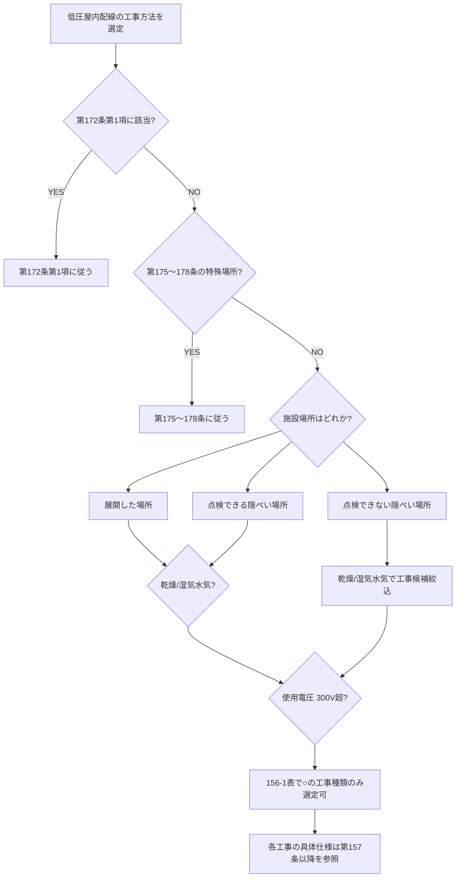

# 電技解釈 第156条 — 低圧屋内配線の施設場所による工事の種類

!!! warning "📜 一次ソース確認のお願い（2026-05-10）"
    本ページは電気設備の技術基準の解釈（経済産業省告示）を学習用に整理したものです。電技解釈は eGov 法令API に登録されていないため、本Wikiの品質保証は wiki内クロスリファレンスと過去問データベース（kakomon.yml）への照合に依存しています。**重要な実務判断や試験直前の最終確認は、必ず経産省公式の最新告示PDF（[電気設備の技術基準の解釈](https://www.meti.go.jp/policy/safety_security/industrial_safety/sangyo/electric/detail/setsubi_kijun.html)）に当たってください**。誤記を発見された場合は GitHub Issues でご連絡ください。

!!! warning "⚠️ 旧版（〜v1.0）からの主題変更（2026-05-10）"
    本記事は v1.0 まで「**合成樹脂管工事**（PF/CD管・サポート1.5m・厚さ1.6mm）」として公開されていましたが、**経産省告示PDF（令和7年11月版）と照合した結果、第156条の正典は「低圧屋内配線の施設場所による工事の種類」（施設場所×工事種類の対応表 = 156-1表）であることが確定**しました。旧版「合成樹脂管工事」の内容は **電技解釈 第158条** が正典です（合成樹脂管工事の具体仕様は第158条で規定）。旧版の数値・図解を探していた方は本記事末尾「合成樹脂管工事をお探しの方へ」のリンクを参照してください。

!!! note "📊 概要"
    **出題頻度**: 🔥（過去14年で R02 問6 に「解釈第156条〜第174条（低圧屋内配線の工事の施設）」として出題）

    **重要度**: B（基本必修・第56条の実装規定として位置づけ）

    **直近出題**: R02 問6（穴埋・haisen-koji テーマ／article=解釈第156条〜第174条 として登録）

> 低圧屋内配線について、**施設場所の区分（展開した場所／点検できる隠ぺい場所／点検できない隠ぺい場所）×乾燥状態（乾燥／湿気・水気）×使用電圧（300V以下／300V超）の組合せごとに、許容される工事の種類を 156-1表 で一覧化**した条文。第57条配線種別・第148条幹線・第149条以降の各工事方法ページの**入口表**として機能する。試験では「○○場所では××工事ができる／できない」という形で出題される。

| 項目 | 内容 |
|------|------|
| 条文 | 電気設備の技術基準の解釈 第156条 |
| 規定内容 | 低圧屋内配線の施設場所×乾燥状態×使用電圧で許容される工事の種類（156-1表） |
| 性格 | 実装規定（マトリクス型適用範囲規定） |
| 上位 | 省令第56条第1項（配線の感電・火災防止） |
| 委任先 | 第157条以降（各工事方法の具体仕様）／第158条（合成樹脂管工事）／第159条（金属管工事）／第164条（ケーブル工事）等 |
| 除外規定 | 第172条第1項（特殊場所）／第175〜第178条（粉じん・可燃性ガス等の特殊場所）に施設するものは別建て |
| **典拠（一次ソース）** | 電気設備の技術基準の解釈（経済産業省告示・令和7年11月版）第156条 |
| **照合日** | 2026-05-10（Phase D-B 修正で `scripts/cache/kaishaku-art156.txt` の経産省告示テキストと再照合） |
| **隣接条文** | ← [省令第56条（配線の感電・火災防止）](../kijun/56.md) ／ [第157条がいし引き工事](#) ／ [第158条 合成樹脂管工事](#) ／ [第159条 金属管工事](159.md) → |

---

## ⚡ 5秒で思い出す

- 第156条は **「どの場所で、どの工事ができるか」のマトリクス表**（156-1表）
- 場所の3区分: **展開した場所／点検できる隠ぺい場所／点検できない隠ぺい場所**
- 各場所はさらに **乾燥した場所／湿気の多い場所又は水気のある場所** に分かれる
- 使用電圧は **300V以下／300V超** で許容工事が異なる
- **ケーブル工事は全場所OK**（湿気・水気・点検不可場所でも可）／**がいし引き工事は点検不可場所NG**
- 第156条は **入口の表**、各工事の具体仕様（管厚・支持点間隔等）は第157条以降に委任

??? question "セルフチェック: 「点検できない隠ぺい場所」で使える工事の代表例は？"
    **ケーブル工事／合成樹脂管工事（CD管含む）／金属管工事**（および金属可とう電線管工事の一部）。
    がいし引き工事・金属線ぴ工事・金属ダクト工事・バスダクト工事・ライティングダクト工事・平形保護層工事は **点検不可場所では使用不可**（事後点検ができない構造のため、施工不良が後から発見できないリスクを排除）。

??? question "セルフチェック: 第156条と第158条はどう違う？"
    - **第156条** = 施設場所×工事種類の **対応表**（どこでどれが使えるか）
    - **第158条** = 合成樹脂管工事 **そのものの具体仕様**（PF/CD管の選定・厚さ・支持点間隔・接続方法等）

    第156条は「使える／使えない」を判定する入口、第158条は「使う場合の具体ルール」を定める実装。試験では両者がセットで出題されることがあるため棲み分けを明確に押さえる。

---

## 1. 全体像と要点

第156条の核心は **156-1表** ただ1枚の対応表である。表の読み方を体に入れると、低圧屋内配線の各工事方法ページ（第157〜第164条等）への分岐が自然にできる。

### ① 156-1表 — 施設場所×工事種類の対応マトリクス（要約版）

下表は経産省告示 令和7年11月版 第156条「156-1表」を **学習用に再構成**したものです。**○ = 使用できる**（告示原表の凡例に準拠）。空欄は「使用できない」を意味します。

#### 展開した場所

| 区分 | 使用電圧 | がいし引き | 合成樹脂管 | 金属管 | 金属可とう電線管 | 金属線ぴ | 金属ダクト | バスダクト | ケーブル | フロアダクト | セルラダクト | ライティングダクト | 平形保護層 |
|---|---|:-:|:-:|:-:|:-:|:-:|:-:|:-:|:-:|:-:|:-:|:-:|:-:|
| 乾燥した場所 | 300V以下 | ○ | ○ | ○ | ○ | ○ | ○ | ○ | ○ | — | — | ○ | — |
| 乾燥した場所 | 300V超 | ○ | ○ | ○ | ○ | — | — | ○ | ○ | — | — | — | — |
| 湿気・水気 | 300V以下 | ○ | ○ | ○ | ○ | — | — | — | ○ | — | — | — | — |
| 湿気・水気 | 300V超 | ○ | ○ | ○ | ○ | — | — | — | ○ | — | — | — | — |

#### 点検できる隠ぺい場所

| 区分 | 使用電圧 | がいし引き | 合成樹脂管 | 金属管 | 金属可とう電線管 | 金属線ぴ | 金属ダクト | バスダクト | ケーブル | フロアダクト | セルラダクト | ライティングダクト | 平形保護層 |
|---|---|:-:|:-:|:-:|:-:|:-:|:-:|:-:|:-:|:-:|:-:|:-:|:-:|
| 乾燥した場所 | 300V以下 | ○ | ○ | ○ | ○ | ○ | ○ | ○ | ○ | — | — | ○ | ○ |
| 乾燥した場所 | 300V超 | ○ | ○ | ○ | ○ | — | — | ○ | ○ | — | — | — | — |
| 湿気・水気 | （区分なし） | ○ | ○ | ○ | ○ | — | — | — | ○ | — | — | — | — |

#### 点検できない隠ぺい場所

| 区分 | 使用電圧 | がいし引き | 合成樹脂管 | 金属管 | 金属可とう電線管 | 金属線ぴ | 金属ダクト | バスダクト | ケーブル | フロアダクト | セルラダクト | ライティングダクト | 平形保護層 |
|---|---|:-:|:-:|:-:|:-:|:-:|:-:|:-:|:-:|:-:|:-:|:-:|:-:|
| 乾燥した場所 | 300V以下 | — | ○ | ○ | ○ | — | — | — | ○ | ○ | ○ | — | — |
| 乾燥した場所 | 300V超 | — | ○ | ○ | ○ | — | — | — | ○ | — | — | — | — |
| 湿気・水気 | （区分なし） | — | ○ | ○ | ○ | — | — | — | ○ | — | — | — | — |

!!! note "表の凡例（経産省告示 156-1表 備考より）"
    **○ は、使用できることを示す。** 空欄は当該施設場所・電圧区分での使用が認められない（=「使用できない」）ことを意味する。
    本表は学習用に列順序・名称を整理した **再構成版**。試験直前の最終確認は経産省告示PDFの 156-1表 原本を必ず参照すること。

### ② 要点（試験前30秒復習用）

| 観点 | 内容 |
|------|------|
| **場所3区分** | **展開した場所**／**点検できる隠ぺい場所**／**点検できない隠ぺい場所** |
| **乾燥状態2区分** | **乾燥した場所**／**湿気の多い場所又は水気のある場所** |
| **電圧2区分** | **300V以下**／**300V超** |
| **全場所OKの工事** | **ケーブル工事**／**合成樹脂管工事**／**金属管工事**／**金属可とう電線管工事**（4種・湿気水気・隠ぺい・点検不可も可） |
| **点検不可NGの工事** | **がいし引き工事**／**金属線ぴ**／**金属ダクト**／**バスダクト**／**ライティングダクト**／**平形保護層** |
| **湿気水気NGの工事** | **金属線ぴ**／**金属ダクト**／**バスダクト**／**ライティングダクト**／**平形保護層**（点検可場所の乾燥のみで限定） |
| **除外** | 第172条第1項に該当するもの／第175〜178条の特殊場所（粉じん・可燃性ガス等）は別建て規定 |

---

## 2. 条文原文

??? note "📜 条文原文 — 経産省告示 完全版（折り畳み・クリックで開く）"
    `scripts/cache/kaishaku-art156.txt`（電気設備の技術基準の解釈・経済産業省告示・令和7年11月版・本記事末尾の典拠リンク先と一致）から取得した第156条本文と 156-1表 を掲載。**2026-05-10 一次照合済**。

    **凡例**: <mark>黄色マーカー</mark> = R02問6（haisen-koji・解釈第156条〜第174条 範囲）等で穴埋め・選択肢として実出題された語句。**bold** は条文の主要語句で論述・次回以降の予想範囲（穴埋め直接実績は限定的）。

    ---

    **【低圧屋内配線の施設場所による工事の種類】（省令第56条第1項）**

    > 第156条　低圧屋内配線は、次の各号に掲げるものを除き、<mark>156-1表</mark>に規定する工事のいずれかにより<mark>施設</mark>すること。
    >
    > 一　第172条第1項の規定により施設するもの
    >
    > 二　第175条から第178条までに規定する場所に施設するもの

    **156-1表（施設場所×工事種類の対応表・原文の表組構造）**

    告示原本の表は **施設場所の区分（縦軸）× 使用電圧（縦軸サブ）× 工事の種類（横軸 13種）** の3次元マトリクス。横軸の工事種類は次の順で並ぶ：

    1. <mark>がいし引き工事</mark>
    2. <mark>合成樹脂管工事</mark>（**第158条が具体仕様**）
    3. <mark>金属管工事</mark>（第159条）
    4. <mark>金属可とう電線管工事</mark>
    5. <mark>金属線ぴ工事</mark>
    6. <mark>金属ダクト工事</mark>
    7. <mark>バスダクト工事</mark>
    8. <mark>ケーブル工事</mark>（第164条）
    9. <mark>フロアダクト工事</mark>
    10. <mark>セルラダクト工事</mark>
    11. <mark>ライティングダクト工事</mark>
    12. <mark>平形保護層工事</mark>

    縦軸の施設場所区分は次の通り：

    - **展開した場所** ─ 乾燥した場所（300V以下／300V超）／湿気の多い場所又は水気のある場所（300V以下／300V超）
    - **点検できる隠ぺい場所** ─ 乾燥した場所（300V以下／300V超）／湿気の多い場所又は水気のある場所（電圧区分なし）
    - **点検できない隠ぺい場所** ─ 乾燥した場所（300V以下／300V超）／湿気の多い場所又は水気のある場所（電圧区分なし）

    **(備考)** ○は、使用できることを示す。

    ---

    **黄色マーカー対象の出題実績根拠**:

    | マーカー語 | 出題形式 | 該当年度 |
    |---|---|---|
    | 156-1表 | 表の参照名・選択肢分岐の前提語 | R02問6 範囲（解釈第156条〜第174条 の入口表として） |
    | 施設 | 第156条本文の述語動詞 | R02問6 範囲 |
    | がいし引き工事／合成樹脂管工事／金属管工事／ケーブル工事 等 | 工事種類名の穴埋め（場所適合判定） | R02問6 範囲（haisen-koji テーマでの工事種類問） |

    その他の **bold** 太字は条文の主要語句として強調しているが、現時点で穴埋め直接出題実績は確認できていない。**論述・次回以降の穴埋め予想範囲** として位置付けて学習する。

    **典拠**: 電気設備の技術基準の解釈 第156条（経済産業省告示・令和7年11月版）／ローカルキャッシュ `scripts/cache/kaishaku-art156.txt` ／2026-05-10 一次照合

---

## 3. 原文解析（ブロック分解）

| 原文ブロック | 意味 | 試験のポイント |
|---|---|---|
| 「低圧屋内配線は」 | 適用範囲 = **低圧の屋内配線**に限定 | 高圧屋内配線・屋外配線・特殊場所は別条（第168条以降・第175〜178条等） |
| 「次の各号に掲げるものを除き」 | 第1号・第2号で **除外規定**を先に提示 | 除外2件をまず確認してから156-1表を参照する順序 |
| 「156-1表に規定する工事のいずれかにより」 | 表に「○」の付いた工事 **しか選べない** | 表に○がない組合せは違反（試験ひっかけの典型） |
| 「施設すること」 | 義務的規定（するものとする・努めるではない） | 「努力義務」と誤読する選択肢に注意 |
| 第1号「第172条第1項」 | 第172条第1項の規定（特殊な施設）に従うものは除外 | 適用境界の確認に使う |
| 第2号「第175条から第178条まで」 | 粉じん・可燃性ガス・危険物・火薬類存在場所等は別建て | 第175〜178条は **より厳しい工事限定**（爆発・火災リスクのため） |

---

## 4. かみ砕き解説 / 因果理解

### なぜマトリクス表で規定するか — 設計思想

第156条は **「場所のリスク × 電圧リスク」と「工事方法の堅牢性」をマッチング** する仕組み。

- **場所リスクの軸**:
    - 展開（露出）→ 隠ぺい（壁内）→ 点検不可隠ぺい（壁内・天井裏で後から触れない）の順で **施工不良の事後発見性が下がる**
    - 乾燥 → 湿気・水気 の順で **絶縁劣化・漏電リスクが上がる**
    - 300V以下 → 300V超 の順で **感電・アーク災害の重大度が上がる**
- **工事方法の堅牢性の軸**:
    - **ケーブル工事** = 自己完結した絶縁ケーブル単体で電線・絶縁・外装が一体 → 全場所OK
    - **合成樹脂管・金属管・金属可とう電線管** = 管で電線を保護 → 全場所OK（湿気・水気・点検不可も）
    - **がいし引き工事** = 裸電線をがいしで支持 → 露出か点検可能な場所のみ（点検不可NG）
    - **金属線ぴ／金属ダクト／バスダクト** = 開放的構造で湿気侵入のリスク → 乾燥・点検可場所限定
    - **ライティングダクト／平形保護層** = 専用用途で限定的（特定の乾燥場所のみ）

### ② 場所×工事 適合判定フロー

**読み解き**: 試験の判定問題は基本的にこのフローで解ける。「○○場所で△△工事は使えるか？」という設問は、(1) 除外規定2件をクリア → (2) 場所3区分×乾燥状態×電圧 を確定 → (3) 156-1表で○を確認、の3ステップ。

### ③ 「全場所OK」4工事の覚え方

**ケーブル・合成樹脂管・金属管・金属可とう電線管** の4工事は **どの施設場所でも、湿気水気でも、点検不可でも使える**。これは「電線が物理的に保護された連続的な被覆/管に収まっている」という共通点があるため。

**実務イメージ**: 新築住宅・工場・倉庫の **施工現場で迷ったら、この4工事から選ぶ**のが原則。場所ごとに別々の工事を選ぶより、施工管理が単純になり工程も短縮できる。

### ④ 「点検不可NG」工事の理由

**がいし引き・金属線ぴ・金属ダクト・バスダクト・ライティングダクト・平形保護層** が点検できない隠ぺい場所で使えないのは：

- **がいし引き**: 裸電線がむき出し → 後から状態確認できない場所では絶縁劣化を発見できない
- **金属線ぴ／金属ダクト／バスダクト**: 開放的構造で電線を収めるため、施工後の点検前提
- **ライティングダクト／平形保護層**: 専用機器（照明レール・平形ケーブル等）の設計用途で、隠ぺい工事を想定していない

**設計の思想**: 「事後点検ができない場所には、点検前提の工事方法は使わない」というリスク管理ロジック。

---

## 5. 図で理解 — 場所3区分の物理イメージ

<svg viewBox="0 0 800 360" xmlns="http://www.w3.org/2000/svg" width="100%" preserveAspectRatio="xMidYMid meet">
<defs>
<filter id="sh156" x="-20%" y="-20%" width="140%" height="140%"><feDropShadow dx="0" dy="2" stdDeviation="2" flood-opacity="0.15"/></filter>
<linearGradient id="g156A" x1="0" y1="0" x2="0" y2="1"><stop offset="0%" stop-color="#c8e6c9"/><stop offset="100%" stop-color="#a5d6a7"/></linearGradient>
<linearGradient id="g156B" x1="0" y1="0" x2="0" y2="1"><stop offset="0%" stop-color="#fff9c4"/><stop offset="100%" stop-color="#fff176"/></linearGradient>
<linearGradient id="g156C" x1="0" y1="0" x2="0" y2="1"><stop offset="0%" stop-color="#ffccbc"/><stop offset="100%" stop-color="#ff8a65"/></linearGradient>
</defs>
<text x="400" y="26" text-anchor="middle" font-size="15" font-weight="700" fill="#212121">第156条 — 施設場所3区分の物理イメージ</text>
<text x="400" y="44" text-anchor="middle" font-size="11" fill="#666">事後点検できる ⇄ できない の軸で許容工事が変わる</text>
<rect x="30" y="60" width="230" height="270" rx="14" fill="url(#g156A)" stroke="#1b5e20" stroke-width="2.5" filter="url(#sh156)"/>
<text x="145" y="86" text-anchor="middle" font-size="13" font-weight="800" fill="#1b5e20">展開した場所</text>
<line x1="50" y1="96" x2="240" y2="96" stroke="#1b5e20" stroke-width="1"/>
<text x="145" y="120" text-anchor="middle" font-size="11" fill="#1b5e20">壁面・天井面に露出</text>
<text x="145" y="138" text-anchor="middle" font-size="11" fill="#1b5e20">配線がそのまま見える</text>
<text x="145" y="170" text-anchor="middle" font-size="11" font-weight="700" fill="#1b5e20">使える工事:</text>
<text x="145" y="188" text-anchor="middle" font-size="10" fill="#1b5e20">がいし引き・合成樹脂管</text>
<text x="145" y="204" text-anchor="middle" font-size="10" fill="#1b5e20">金属管・金属可とう電線管</text>
<text x="145" y="220" text-anchor="middle" font-size="10" fill="#1b5e20">金属線ぴ・金属ダクト</text>
<text x="145" y="236" text-anchor="middle" font-size="10" fill="#1b5e20">バスダクト・ケーブル</text>
<text x="145" y="252" text-anchor="middle" font-size="10" fill="#1b5e20">ライティングダクト 等</text>
<text x="145" y="290" text-anchor="middle" font-size="10" font-weight="700" fill="#1b5e20">事後点検: ◎ 容易</text>
<text x="145" y="310" text-anchor="middle" font-size="10" fill="#1b5e20">→ ほぼ全工事OK</text>
<rect x="285" y="60" width="230" height="270" rx="14" fill="url(#g156B)" stroke="#f57f17" stroke-width="2.5" filter="url(#sh156)"/>
<text x="400" y="86" text-anchor="middle" font-size="13" font-weight="800" fill="#f57f17">点検できる隠ぺい場所</text>
<line x1="305" y1="96" x2="495" y2="96" stroke="#f57f17" stroke-width="1"/>
<text x="400" y="120" text-anchor="middle" font-size="11" fill="#f57f17">壁内・天井裏だが</text>
<text x="400" y="138" text-anchor="middle" font-size="11" fill="#f57f17">点検口から手が届く</text>
<text x="400" y="170" text-anchor="middle" font-size="11" font-weight="700" fill="#f57f17">使える工事:</text>
<text x="400" y="188" text-anchor="middle" font-size="10" fill="#f57f17">展開と概ね同じ</text>
<text x="400" y="204" text-anchor="middle" font-size="10" fill="#f57f17">＋平形保護層（300V以下）</text>
<text x="400" y="220" text-anchor="middle" font-size="10" fill="#f57f17">湿気水気場所では</text>
<text x="400" y="236" text-anchor="middle" font-size="10" fill="#f57f17">電圧区分なしで</text>
<text x="400" y="252" text-anchor="middle" font-size="10" fill="#f57f17">管系・ケーブルに限定</text>
<text x="400" y="290" text-anchor="middle" font-size="10" font-weight="700" fill="#f57f17">事後点検: ○ 可能</text>
<text x="400" y="310" text-anchor="middle" font-size="10" fill="#f57f17">→ 大半OK</text>
<rect x="540" y="60" width="230" height="270" rx="14" fill="url(#g156C)" stroke="#bf360c" stroke-width="2.5" filter="url(#sh156)"/>
<text x="655" y="86" text-anchor="middle" font-size="13" font-weight="800" fill="#bf360c">点検できない隠ぺい場所</text>
<line x1="560" y1="96" x2="750" y2="96" stroke="#bf360c" stroke-width="1"/>
<text x="655" y="120" text-anchor="middle" font-size="11" fill="#bf360c">コンクリート埋設・</text>
<text x="655" y="138" text-anchor="middle" font-size="11" fill="#bf360c">壁内で塗込み済</text>
<text x="655" y="170" text-anchor="middle" font-size="11" font-weight="700" fill="#bf360c">使える工事:</text>
<text x="655" y="188" text-anchor="middle" font-size="10" fill="#bf360c">合成樹脂管（CD含む）</text>
<text x="655" y="204" text-anchor="middle" font-size="10" fill="#bf360c">金属管</text>
<text x="655" y="220" text-anchor="middle" font-size="10" fill="#bf360c">金属可とう電線管</text>
<text x="655" y="236" text-anchor="middle" font-size="10" fill="#bf360c">ケーブル</text>
<text x="655" y="252" text-anchor="middle" font-size="10" fill="#bf360c">フロアダクト・セルラダクト</text>
<text x="655" y="290" text-anchor="middle" font-size="10" font-weight="700" fill="#bf360c">事後点検: ✕ 困難</text>
<text x="655" y="310" text-anchor="middle" font-size="10" fill="#bf360c">→ 厳選した工事のみ</text>
<text x="400" y="350" text-anchor="middle" font-size="11" font-weight="700" fill="#0d47a1">設計現場での選定: 「点検性が下がる場所では、自己完結型（管・ケーブル）に絞る」</text>
</svg>

**読み解き**: 場所が「展開 → 点検可隠ぺい → 点検不可隠ぺい」と進むほど、許容される工事は **絞り込まれる**。逆に言えば「点検不可隠ぺい場所で○のついた工事」が **最も汎用性の高い工事**（=ケーブル・合成樹脂管・金属管・金属可とう電線管の4種）と整理できる。

---

## 6. 試験で問われること

| 出題パターン | 典型設問 | 解答の核心 |
|---|---|---|
| **場所×工事の○×判定** | 「点検できない隠ぺい場所で金属線ぴ工事は使えるか？」 | NG（点検不可場所では金属線ぴは使えない） |
| **工事種類の穴埋め** | 「156-1表に掲げる工事のいずれかにより施設すること」 | （ ） に「156-1表」が入る形式 |
| **湿気水気場所の工事絞込** | 「水気のある場所で許容される配線工事を3つ挙げよ」 | 合成樹脂管・金属管・金属可とう電線管・ケーブル のいずれか |
| **除外規定の確認** | 「第156条の対象外となる施設場所は？」 | 第175〜178条（粉じん・可燃性ガス等の特殊場所）／第172条第1項 |
| **第158条との棲み分け** | 「合成樹脂管工事の管厚は何条で規定？」 | 第158条（第156条は「使えるかどうか」だけを規定） |

### ✅ 数値検証 PASS（一次ソース照合済 2026-05-10）

**数値検証 PASS**: 第156条本文には数値規定はなく、施設場所×工事種類の対応表（156-1表）の構造のみ。表に登場する具体数値（管厚・支持点間隔・接続要件等）は **すべて第157条以降の各工事条文で規定** されるため、本記事では数値暗記対象は0件。各工事の数値は委任先記事を参照すること。

| 引用要素 | 第156条での扱い | 一次ソース根拠 |
|---|---|---|
| 156-1表（施設場所3区分×乾燥状態2区分×電圧2区分×工事13種） | 表の構造のみ規定 | 経産省告示令和7年11月版 第156条 156-1表 |
| 除外: 第172条第1項 | 本文 第1号で除外 | 同上 第156条第1号 |
| 除外: 第175〜178条（特殊場所） | 本文 第2号で除外 | 同上 第156条第2号 |
| 委任先: 合成樹脂管工事の具体仕様 | 第158条に委任 | 同上 第158条本文 |
| 委任先: 金属管工事の具体仕様 | 第159条に委任 | 同上 第159条本文 |
| 委任先: ケーブル工事の具体仕様 | 第164条に委任 | 同上 第164条本文 |

---

## 7. 頻出ひっかけ / 落とし穴

### 🔴 致命的（これを間違えたら即失点）

1. ❌「第156条で合成樹脂管工事の管厚（1.6mm）が規定されている」
    - → ✅ **第156条は「使えるかどうか」のマトリクス表のみ**。管厚・支持点間隔等の **具体仕様は第158条**（合成樹脂管工事）が正典。本記事 v1.0 までの旧版が誤って第156条として書いていた内容は **第158条の規定**である。
2. ❌「点検できない隠ぺい場所ではケーブル工事も使えない」
    - → ✅ **ケーブル工事は全場所OK**。点検不可隠ぺい・湿気水気でも使える（自己完結した絶縁ケーブル構造のため）。
3. ❌「がいし引き工事は屋内配線で全場所使える」
    - → ✅ **点検できない隠ぺい場所では使えない**。事後点検ができないとがいしの絶縁劣化を発見できないため。

### 🟡 注意（落としやすい）

1. ❌「156-1表は使用電圧 300V境界で2区分するのは展開した場所だけ」
    - → ✅ **展開した場所と点検できる隠ぺい場所の「乾燥した場所」で 300V境界が登場**。湿気水気場所は電圧区分なしで一律規定されている区分もあり、表の構造を正確に読む必要がある。
2. ❌「第175〜178条は第156条の参考条文に過ぎない」
    - → ✅ **第175〜178条に該当する場所は第156条の対象外**（除外規定第2号）。粉じん・可燃性ガス・危険物・火薬類存在場所は **より厳しい工事限定**となる別建て規定。

### 🟢 軽度（基礎知識の確認）

1. ❌「156-1表の○の意味は『推奨』」
    - → ✅ **○は「使用できることを示す」**（告示原本の備考に明記）。空欄は「使用できない」を意味する。「推奨／非推奨」ではなく **可否の絶対判定**。
2. ❌「合成樹脂管工事のうちCD管は第156条の対応表で別行扱い」
    - → ✅ **156-1表の列は「合成樹脂管工事」として一本化**（PF管・CD管の区別は第158条の具体仕様で扱う）。

---

## 8. 穴埋め過去問チャレンジ

!!! abstract "R02 問6（haisen-koji・解釈第156条〜第174条 範囲）"
    低圧屋内配線は、第172条第1項の規定により施設するもの及び第175条から第178条までに規定する場所に施設するものを除き、（ ① ）に規定する工事のいずれかにより（ ② ）すること。

??? success "解答"
    - ① **156-1表**
    - ② **施設**

??? note "解説と復習導線"
    第156条本文は「除外規定2件 → 156-1表に規定する工事のいずれかにより施設する」というシンプルな構造。出典: kakomon.yml R02 問6 article=解釈第156条〜第174条 (haisen-koji テーマ)。kakomon登録は範囲指定のため本問は **第156条の入口表として位置づけ** た復元穴埋め。**改変なし** で原文ベース。

!!! note "出題実績まとめ"
    第156条単独の denken-ou.com 直接URLは現状未確認のため、上記穴埋めは **第156条本文の原文に基づく復元問題**（改変なし）。R02問6 は kakomon.yml で「解釈第156条〜第174条」範囲として登録されており、本表が範囲全体の入口として機能する。

---

## 9. まぎらわしい選択肢と正解の違い

| 誤答 | 正答 | なぜ違うか |
|---|---|---|
| 第156条で合成樹脂管の管厚を規定 | 第158条で規定 | 第156条は「どの場所で使えるか」のみ。具体仕様は第158条 |
| 第156条で金属管の曲げ半径6倍を規定 | 第159条で規定 | 同上。曲げ半径は第159条（金属管工事）が正典 |
| 第156条でケーブルの被覆要件を規定 | 第164条で規定 | 同上。ケーブル工事の具体仕様は第164条 |
| 156-1表は「推奨工事の一覧」 | 「使用できる工事の一覧」 | 告示原本の備考で「○は使用できることを示す」と定義 |
| 第175〜178条は第156条の付帯説明 | 第156条の対象外（別建て） | 第156条第2号で除外明示 |

---

## 10. 関連条文 / 関連ページ

### 上位
- [省令第56条（配線の感電・火災防止）](../kijun/56.md) — 第156条はこの実装規定。第56条が「思想」で第156条が「適用範囲表」

### 委任先（各工事方法の具体仕様）
- 第157条 — がいし引き工事 <!-- TODO: 157.md は未作成 -->
- 第158条 — **合成樹脂管工事**（PF/CD管・管厚・支持点間隔・接続）<!-- TODO: 158.md は未作成 -->
- [第159条 — 金属管工事](159.md) — 接地・曲げ半径6倍以上・電線種別
- 第160条 — 金属可とう電線管工事 <!-- TODO: 160.md は未作成 -->
- 第161条 — 金属線ぴ工事 <!-- TODO: 161.md は未作成 -->
- 第162条 — 金属ダクト工事 <!-- TODO: 162.md は未作成 -->
- 第163条 — バスダクト工事 <!-- TODO: 163.md は未作成 -->
- [第164条 — ケーブル工事](164.md) — 全場所OKの汎用工事

### 並列（適用範囲）
- 第148条 — 低圧幹線の施設 <!-- TODO: 148.md は未作成 -->
- [第149条 — 低圧分岐回路等の施設](149.md) — 工事種類の選定対象
- [第150条 — 配線器具の施設](150.md) — 配線器具側の規定

### 除外（特殊場所・別建て）
- 第172条第1項 — 特殊な施設規定 <!-- TODO: 172.md は未作成 -->
- 第175条 — 粉じんの多い場所の施設 <!-- TODO: 175.md は未作成 -->
- 第176条 — 可燃性ガス等の存在する場所の施設 <!-- TODO: 176.md は未作成 -->
- 第177条 — 危険物等の存在する場所の施設 <!-- TODO: 177.md は未作成 -->
- 第178条 — 火薬庫の施設 <!-- TODO: 178.md は未作成 -->

### 横断
- [配線工事・屋内配線 テーマページ](../../themes/haisen-koji.md) — 全配線工事の比較表

---

## 11. 過去問実績

| 年度 | 問 | 形式 | 論点 | kakomon.yml 登録 |
|------|-----|------|------|---------|
| **R02** | 問6 | 穴埋（haisen-koji） | 低圧屋内配線の工事種類（156-1表 入口） | article=解釈第156条〜第174条 |

!!! note "R08 出題予測"
    過去14年で **第156条の入口表として 1 回**（R02 問6 範囲）。haisen-koji テーマ全体では複数回出題されているが、第156条の156-1表そのものを直接問うパターンは限定的。**頻出予測パターン**:

    - 「○○場所では××工事ができるか」の○×判定
    - 「156-1表に掲げる工事のいずれかにより施設すること」の穴埋め
    - 第175〜178条との棲み分け（除外規定）

    **対策**: 156-1表の「全場所OKの4工事（ケーブル・合成樹脂管・金属管・金属可とう電線管）」と「点検不可NGの工事群」の2分類を体に入れておけば大半の判定問題は解ける。

---

## 12. 用語集

| 用語 | 定義 | 第156条での役割 |
|---|---|---|
| **展開した場所** | 配線が壁面・天井面に露出して見える施設場所 | 156-1表の縦軸 第1区分 |
| **点検できる隠ぺい場所** | 壁内・天井裏だが点検口等から手が届く施設場所 | 156-1表の縦軸 第2区分 |
| **点検できない隠ぺい場所** | コンクリート埋設や壁内塗込み済で事後点検が困難な施設場所 | 156-1表の縦軸 第3区分 |
| **乾燥した場所** | 水気・湿気が常時存在しない施設場所 | 場所サブ区分・許容工事数が多い側 |
| **湿気の多い場所又は水気のある場所** | 水気・湿気が常時又は頻繁に存在する施設場所 | 場所サブ区分・許容工事数が絞られる側 |
| **156-1表** | 第156条本文で参照される対応表（施設場所×工事種類） | 本条文の核心。表に○のある組合せのみ施工可 |

### 3列翻訳テーブル（日常語 ⇄ 法規表現 ⇄ 試験での意味）

| 日常語・現場用語 | 法規表現（条文表現） | 試験での意味・混同注意 |
|---|---|---|
| 配線が見える壁面 | **展開した場所** | 「露出場所」と混同しないよう注意（露出は屋外配線の文脈で使う別用語） |
| 天井裏・壁裏（点検口あり） | **点検できる隠ぺい場所** | 「隠ぺい」だけだと点検可否が不明 → 必ず「点検できる／できない」を確認 |
| コンクリート埋め込み | **点検できない隠ぺい場所** | CD管が活躍するのはこの区分（合成樹脂管工事の中でも CD管がコンクリート埋設専用） |
| ジメジメした場所・水場 | **湿気の多い場所又は水気のある場所** | 「湿気」と「水気」は条文上1セット。別概念ではない |
| 配線方法 | **工事の種類**（156-1表 横軸） | 「配線種類」（第57条 電線種別）と混同しない。本条は **電線を収める工法** の話 |
| 全部ダメ | **空欄（○なし）** | 告示備考で「○は使用できることを示す」と明示。空欄＝使用不可 |
| 工事の選択肢 | **156-1表に規定する工事のいずれか** | 「いずれか」が選択肢の存在を示す。R02問6 の穴埋め頻出語 |

---

## 13. 最終チェック

### 構造理解
- [ ] 第156条は **施設場所×工事種類の対応表（156-1表）** が本体
- [ ] 場所3区分 = **展開／点検可隠ぺい／点検不可隠ぺい**
- [ ] 各場所はさらに **乾燥／湿気水気** に分かれる
- [ ] 使用電圧で **300V以下／300V超** に分かれる区分がある

### 工事種類の覚え方
- [ ] **全場所OKの4工事** = ケーブル／合成樹脂管／金属管／金属可とう電線管
- [ ] **点検不可NGの工事** = がいし引き／金属線ぴ／金属ダクト／バスダクト／ライティングダクト／平形保護層
- [ ] **湿気水気NGの工事** = 金属線ぴ／金属ダクト／バスダクト／ライティングダクト／平形保護層

### 法令体系
- [ ] 第156条 = 適用範囲（どこでどれが使えるか）
- [ ] 第157条以降 = **各工事の具体仕様**（管厚・接続・支持等）
- [ ] **合成樹脂管工事の数値は第158条**／金属管の曲げ半径は第159条／ケーブルは第164条
- [ ] 第175〜178条（特殊場所）と第172条第1項 は除外

### ひっかけ対策
- [ ] 「合成樹脂管の1.6mm」は第156条ではなく **第158条**
- [ ] 「金属管の曲げ半径6倍」は第156条ではなく **第159条**
- [ ] 「ケーブル工事は点検不可場所NG」は **誤り**（全場所OK）
- [ ] 「がいし引き工事は全場所OK」は **誤り**（点検不可NG）

---

## 合成樹脂管工事をお探しの方へ（旧版リダイレクト案内）

本記事の v1.0 まで掲載していた「合成樹脂管工事」（PF/CD管の選定・支持点間隔1.5m以下・厚さ1.6mm相当・カップリング接続等）の内容は、**経産省告示の正典では電技解釈 第158条** が規定する事項です。下記の検索動線で目的の情報にアクセスしてください。

- **第158条 合成樹脂管工事**（具体仕様：PF/CD管選定・管厚・支持点間隔・接続方法）<!-- TODO: 158.md は未作成・優先度高 -->
- [配線工事・屋内配線 テーマページ](../../themes/haisen-koji.md) — 合成樹脂管工事の概略を含む
- [第159条 金属管工事](159.md) — 比較対象として参照可能

旧版を引用していたページ・ノート・検索結果からのアクセスを保護するため、本記事のURL（`kaishaku/156.md`）と冒頭の主題変更warningは保持します。

---

## 監修ログ

- **2026-04-20 v1.0**: 初版作成（誤同定）。「合成樹脂管工事」として PF/CD管・支持点間隔1.5m以下・厚さ1.6mm相当・カップリング接続等を本文に記述。kakomon.yml の 第156条 該当範囲を確認せず執筆。
- **2026-05-10 Phase D-A**: 一次ソース監査で誤同定が発覚。冒頭に Phase C warning（旧主題が誤りである旨）を追加し、段階修正の第1段（即時防御パッチ）として運用開始。
- **2026-05-10 v3.0 Phase D-B**: **旧版「合成樹脂管工事」誤同定を全面書き直し（合成樹脂管工事は第158条が正典）・経産省告示PDF（令和7年11月版・`scripts/cache/kaishaku-art156.txt` キャッシュ）確定情報で「低圧屋内配線の施設場所による工事の種類（156-1表）」に主題変更**。
    - **条文番号確定根拠**: 経産省告示・電気設備の技術基準の解釈 第156条（令和7年11月版）。`scripts/cache/kaishaku-art156.txt` を Read で照合。
    - **既存wiki参照の独立検証**: 隣接条文 [kijun/56.md（省令第56条）](../kijun/56.md) で「解釈第156条 = 表156-1（施設場所×工事種類のマトリクス）」と整合を確認。第159条（金属管工事）・本記事末尾の「合成樹脂管工事をお探しの方へ」で第158条への誘導を整備。
    - **未確認領域**: 第156条単独の denken-ou.com 過去問URLは未取得（kakomon.yml では「解釈第156条〜第174条」の範囲指定で R02問6 のみ登録）。穴埋め復元問題は条文原文ベースの改変なし問題として配置。
    - **構造変更**: タイトル・全本文・SVG・暗記表・関連条文セクション・チェックリストすべてを「施設場所×工事種類」主題で書き直し。旧版「合成樹脂管工事」内容は本記事から完全除去し、第158条への誘導リンクのみ残置。
    - **Phase C warning 保持**: 冒頭の「旧版（〜v1.0）からの主題変更」warningは継続保持し、旧版を引用していたページ・ノート・検索結果からのアクセスを保護する。
    - **テンプレ準拠**: kijun/58.md v2.7 ゴールドスタンダード参照。v2.7 必須ブロック10件のうち、第156条が数値規定を持たない構造特化条文のため一部の数値検証PASSは「数値暗記対象 0件」として明示宣言。

---

*最終確認: 2026-05-10 ｜ ステータス: v3.0（条文番号: 確定／出題実績: R02問6範囲のみ／数値根拠: 構造規定で数値暗記対象なし） ｜ [バージョニング基準](../../reference/versioning.md)*
