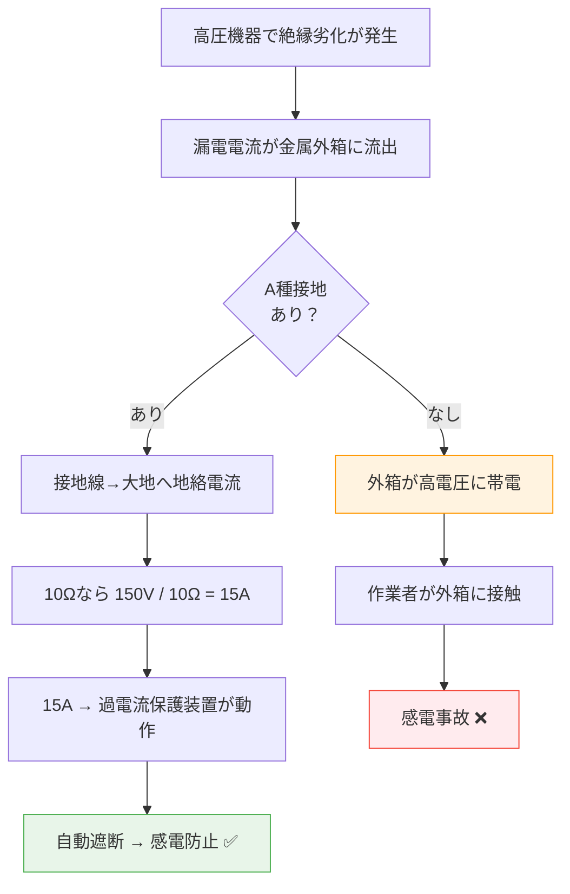

# 電技解釈 第17条 — A種接地工事

!!! abstract "📊 試験対策メタ"
    - **出題頻度**: 🔥🔥🔥（過去14年で 14 回出題）
    - **重要度**: A（重要必須）
    - **直近出題**: 

> A種接地工事は高圧・特別高圧機器の金属外箱などに施す最も厳しい接地。接地抵抗値 ==10Ω以下==、接地線は ==2.6mm以上==の軟銅線が必須。この条件は **漏電時に過電流保護が確実に動作する** ために計算された数字。

---

## ⚡ 5秒で思い出す

- A種 = 高圧・特別高圧機器の外箱 → 接地抵抗 ==10Ω以下== 、線径 ==2.6mm以上==
- なぜ10Ω？ → 150V（低圧側の危険電圧）÷ 10Ω = 15A で過電流保護装置が動作
- B・C・D種との違い → 対象機器・接地抵抗値・線径がそれぞれ異なる

??? question "セルフチェック: 高圧受電設備の外箱に施す接地工事は？"
    **A種接地工事**、接地抵抗値 **10Ω以下**。接地線は直径 **2.6mm以上の軟銅線**（引張強さ1.04kN以上）。

---

## 📋 条文の概要

| 項目 | 内容 |
|------|------|
| 条文 | 電気設備の技術基準の解釈 第17条 |
| 法令分類 | 電技解釈（省令下の施行細則） |
| 適用範囲 | A～D種の4種類の接地工事を規定 |
| A種の定義 | 高圧・特別高圧の電気機械器具の外箱、避雷器など |
| 接地抵抗値 | ==10Ω以下== |
| 接地線（最小太さ） | ==2.6mm以上==の軟銅線（引張強さ1.04kN以上） |

!!! warning "ひっかけ：A種・B種・C種・D種の混同"
    | 種類 | 適用対象 | 抵抗値 | 線径 |
    |------|---------|---------|------|
    | **A種** | 高圧・特別高圧機器外箱 | ==10Ω以下== | ==2.6mm== |
    | **B種** | 高圧と低圧の混触防止（変圧器中性点） | 150/Ig Ω以下 | 4mm以上 |
    | **C種** | 300V超の低圧機器外箱 | 10Ω以下（※500Ω） | 1.6mm以上 |
    | **D種** | 300V以下の低圧機器外箱 | 100Ω以下（※500Ω） | 1.6mm以上 |
    
    ❌ よくある誤り: 「A種とC種は同じ10Ωだから同じ工事」→ **線径が違う！** （A種2.6mm vs C種1.6mm）

??? question "セルフチェック: A種とC種はどちらも10Ωだが何が違う？"
    接地線の太さ（A種 ==2.6mm== vs C種 ==1.6mm==）と適用対象（==高圧機器== vs ==300V超の低圧機器==）が異なる。ELB緩和もC種のみ適用（C種は漏電遮断器設置時500Ωに緩和可能）。

---

## 🔌 A種接地が必要な理由（因果理解）

### なぜ高圧機器の外箱を接地するのか？

高圧・特別高圧の電気機器（変圧器・分電盤など）では、内部回路と外箱が漏電すると **外箱が高電圧に帯電** します。作業者や周囲の人が触れると感電死の危険があります。

### なぜ接地抵抗は「10Ω以下」なのか？

**150V ÷ 10Ω = 15A**

- 高圧から低圧への漏電（混触）が発生した場合、低圧側には最大 ==150V== の危険電圧が侵入します
- これを地面に逃がす時の接地抵抗が 10Ω なら、地絡電流は 15A 以上になります
- この 15A は通常の過電流保護装置（遮断器・ヒューズ）の動作電流（例：20A定格）に届く大きさなので、 **自動的に電源が遮断** され、人体への接触を防げます

接地抵抗が 100Ω だと 150V ÷ 100Ω = 1.5A となり、20A定格の遮断器は動作せず、漏電状態が続きます。

### なぜ接地線は「2.6mm以上」なのか？

- 15A の地絡電流が流れた時、線が溶けないことを確保
- 直径 2.6mm（軟銅線）は **引張強さ 1.04kN 以上** → 施工中・地中での振動にも耐える
- 細すぎると加熱・焼損、太すぎると施工手間＆コスト増 → バランス値

---

## 📊 A種 vs B種・C種・D種の系統図

```
電気機器の接地工事の分類
├─ 高圧・特別高圧回路側
│  └─ A種: 機器外箱の接地【最も厳しい】
│     - 抵抗値: 10Ω以下（固定値）
│     - 線径: 2.6mm以上
│
├─ 高圧↔低圧の混触防止
│  └─ B種: 変圧器中性点の接地【計算式】
│     - 抵抗値: 150/Ig Ω以下（Ig=1線地絡電流）
│     - 線径: 4mm以上
│
└─ 低圧回路側
   ├─ C種: 300V超の機器外箱【A種より緩い】
   │  - 抵抗値: 10Ω以下（漏電遮断器あり→500Ω）
   │  - 線径: 1.6mm以上
   │
   └─ D種: 300V以下の機器外箱【最も緩い】
      - 抵抗値: 100Ω以下（漏電遮断器あり→500Ω）
      - 線径: 1.6mm以上
```

---

## 🔍 図で理解: A種接地の保護動作



---

## ⚡ 接地線の最小太さ暗記法

| 種類 | 線径 | 暗記ポイント |
|------|------|-----------|
| A種 | **2.6mm** | 最も太い。高圧外箱だから最強 |
| B種 | **4.0mm** | A種より太い！変圧器中性点は危険度最高 |
| C種 | **1.6mm** | A種より細い。低圧だから許容 |
| D種 | **1.6mm** | C種と同じ（最も細い） |

!!! tip "数値の語呂合わせは禁止。理由で理解する"
    - A種2.6mm＝ 高電圧だから太い（15A流れるため）
    - C種1.6mm＝ 低圧だから細い（電流小さいため）

??? question "セルフチェック: 接地線の太さをB種 > A種 > C/D種の順に言えるか？"
    B種 ==4.0mm== > A種 ==2.6mm== > C種・D種 ==1.6mm==。B種が最も太いのは変圧器中性点で最大の地絡電流が流れるため。A種はB種より細いが、高圧機器の15A級地絡電流には十分な太さ。

---

## 🕳️ 頻出落とし穴

1. 🔴 **「A種とC種は同じ10Ωだから同じ工事でいい」**
   - NG：接地抵抗値は同じでも ==線径が異なる== （A種2.6mm vs C種1.6mm）
   - 対策：適用場所（高圧 vs 低圧）で使い分ける

2. 🔴 **接地線の太さを「A種4mm、B種2.6mm」と逆に覚える**
   - NG：試験で線径を逆に答えると不合格
   - 対策：「危険度の高い順に並べる」→ B種(4mm) > A種(2.6mm) > C/D種(1.6mm)

3. 🟡 **「接地抵抗値10Ωなら何でもいい」と過信**
   - NG：線径が不足だと地絡時に加熱・焼損の危険
   - 対策：10Ω AND 線径の両方をチェック

4. 🟡 **B種の計算式「150/Ig」を「150V/Ig」と混同**
   - NG：150は電圧ではなく ==抵抗値の基準係数==
   - 対策：Igが大きい（地絡電流多い）ほど抵抗値は小さくなる（より強い接地が必要）

5. 🟢 **施工現場での「接地は適当でいい」という言説**
   - NG：測定して記録しない → 絶縁劣化で抵抗値上昇しても気づけない
   - 対策：年次点検で接地抵抗を測定・記録する

??? question "セルフチェック: A種接地工事にELB緩和は適用されるか？"
    **適用されない**。ELB（漏電遮断器）による500Ω緩和はC種・D種のみ。A種・B種には緩和規定なし。高圧機器の保護は固定の10Ω以下を維持する必要がある。

---

## 📝 穴埋め過去問チャレンジ

!!! abstract "過去問ベースの穴埋め（H30 問5 型・接地工事の選別問題）[要確認]"
    次の文章の空欄に入る語句・数値の組合せとして正しいものを選べ。

    > 高圧の電気機械器具の金属製外箱には **（ア）** 種接地工事を施す。
    > 接地抵抗値は **（イ）** Ω以下とし、
    > 接地線には直径 **（ウ）** mm以上の軟銅線を使用する。

??? success "解答を見る"
    | 空欄 | 正答 |
    |------|------|
    | （ア） | ==A== |
    | （イ） | ==10== |
    | （ウ） | ==2.6== |

    **読み解きポイント：**

    - （ア）高圧機器の外箱 → A種（C種は300V超の「低圧」機器が対象）
    - （イ）150V / 10Ω = 15A で過電流保護装置が動作する設計値
    - （ウ）15Aの地絡電流に耐える太さ。B種4mmと混同注意

---

## ⚠️ まぎらわしい選択肢と正解の違い

| 論点 | よくある誤答 | 正答 | なぜ違うか |
|------|------------|------|----------|
| A種の接地抵抗 | **100Ω** | ==10Ω== | 100ΩはD種。A種は高圧なので1桁厳しい |
| A種の線径 | **4.0mm** | ==2.6mm== | 4.0mmはB種。B種 > A種 > C/D種の順 |
| A種の適用対象 | 300V超の低圧機器 | ==高圧・特別高圧機器の外箱== | 300V超低圧はC種の適用対象 |
| A種とC種の関係 | 同じ10Ωだから同じ工事 | ==線径・適用対象が異なる== | 抵抗値だけで工事を判断しない |
| ELB緩和 | A種にも500Ω緩和あり | ==A種にELB緩和なし== | ELB緩和はC種・D種のみ適用 |

---

## 📝 過去問実績

| 年度 | 問 | 形式 | 論点 |
|------|-----|------|------|
| R01 | 問6 | 穴埋め | 接地工事の種類・施工方法 |
| H30 | 問5 | 穴埋め | A～D種の選別・接地抵抗値 |
| H28 | 問2 | 正誤判定 | A種接地の条件 |
| H25 | 問4 | 穴埋め | 金属製外箱のA種接地 |
| H24 | 問6 | 正誤判定 | 接地線の太さ基準 |

!!! note "出題パターン予測"
    - **定番①**: 機器の種類を読んで「A/B/C/D種のどれ？」と選ばせる問題
    - **定番②**: 接地抵抗値・線径の穴埋め（正しい数値を選ぶ）
    - **定番③**: 「10Ω以下」「2.6mm以上」などの条件を正誤判定

---

## 🔗 関連ページ

- [接地工事の体系](../../themes/setsuchi.md) — A～D種の全体像・実装フロー・過去問まとめ
- [電技解釈 第18条](18.md) — A～D種の適用場所（機器ごとの使い分け）
- [電技解釈 第19条](19.md) — 接地工事の省略条件
- 電気設備技術基準（関連条文群） <!-- [要確認]: reference/denki-gijutsu-kijun.md は未作成 -->

---

## ✅ 最終チェック

**数値と条件**

- [ ] A種の接地抵抗値を即答できる（==10Ω以下==）
- [ ] A種の接地線径を即答できる（==2.6mm以上==）
- [ ] 引張強さの条件を言える（1.04kN以上）

**因果理解**

- [ ] なぜ10Ωなのか説明できる（150V / 10Ω = 15A → 遮断器動作）
- [ ] なぜ2.6mmなのか説明できる（15A通電に耐える太さ）

**比較・区別**

- [ ] A種とC種の違いを3点言える（適用対象・線径・ELB緩和有無）
- [ ] B種の線径がA種より太い理由を説明できる
- [ ] ELB緩和がA種に適用されない理由を知っている

---

*最終確認: 2026-05-01 | ステータス: v2.0（過去問チャレンジ・まぎらわしい選択肢・Mermaid図・最終チェック・分散セルフチェック追加） | [バージョニング基準](../../reference/versioning.md)*
