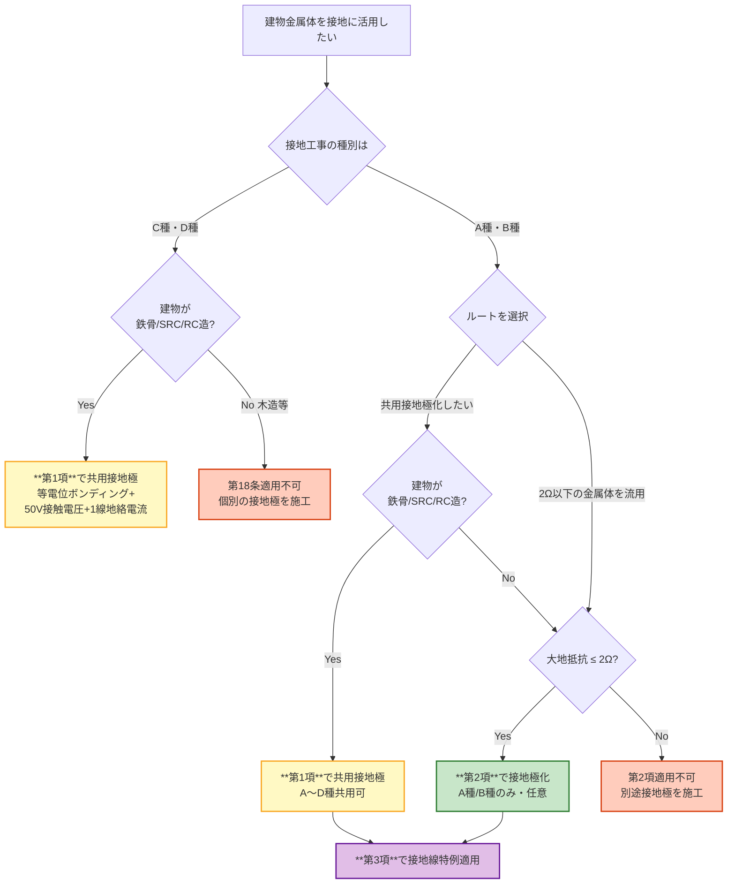

# 電技解釈 第18条 — 工作物の金属体を利用した接地工事

!!! warning "📜 一次ソース確認のお願い（2026-05-10）"
    本ページは電気設備の技術基準の解釈（経済産業省が省令の解釈として示すもの）を学習用に整理したものです。電技解釈は eGov 法令API に登録されていないため、本Wikiの品質保証は wiki内クロスリファレンスと過去問データベース（kakomon.yml）への照合に依存しています。**重要な実務判断や試験直前の最終確認は、必ず経産省公式の最新告示PDF（[電気設備の技術基準の解釈](https://www.meti.go.jp/policy/safety_security/industrial_safety/sangyo/electric/detail/setsubi_kijun.html)）に当たってください**。誤記を発見された場合は GitHub Issues でご連絡ください。

!!! note "📊 概要"
    **出題頻度**: 🔥（電験3種法規での直接出題実績は乏しい・補助知識）

    **重要度**: C（基本・補助知識）

    **直近出題**: 直接出題は確認できず（17条 A〜D種接地の周辺知識として参照されることがある）

> 第18条は **建物の鉄骨・鉄筋等の金属体** を接地に活用するための規定で **3項構造**：
>
> - **第1項（共用接地極ルート）**: 鉄骨造／SRC造／RC造の建物で、鉄骨・鉄筋等を **共用の接地極** として使用。**第17条第1項〜第4項（A〜D種）の接地工事その他の接地工事を含む**＝**A〜D種すべて対象**。**等電位ボンディング** ＋地中埋設＋ **50V を超える接触電圧を発生させない** ＋ **1線地絡電流** 経路を確保すれば **接地抵抗値によらず** 共用接地極として使用可能。
> - **第2項（2Ω・A/B種ルート）**: **大地との間の電気抵抗値が 2Ω以下** の建物金属体は、**非接地式高圧電路に施設する機械器具のA種接地工事**、または **非接地式高圧電路と低圧電路を結合する変圧器のB種接地工事の接地極** として **使用することができる**（任意規定・A種/B種限定）。
> - **第3項（接地線特例ルート）**: A種接地工事又はB種接地工事を、第1項又は第2項により施設する場合の **接地線の特例** を規定。

!!! tip "受験者向け：3項を1行で整理"
    - 第**1**項 → **共用接地極**（A〜D種・等電位ボンディング・50V接触電圧・1線地絡電流・**抵抗値によらず**）
    - 第**2**項 → **2Ω・A/B種**（非接地式高圧電路の機器A種／結合変圧器のB種）
    - 第**3**項 → **接地線の特例**（A種/B種を第1項または第2項により施設する場合）

| 項目 | 内容 |
|------|------|
| 条文 | 電気設備の技術基準の解釈 第18条 |
| 規定内容 | 工作物（建物の鉄骨・鉄筋等の金属体）を利用した接地工事の3項構造（共用接地極／2Ω以下A・B種／接地線特例） |
| 性格 | 鉄骨等利用の **本体規定**（第17条と並列の位置付け。第1項は **A〜D種の共用接地** を許容） |
| 委任先（直接の具体化） | なし（解釈本体・接地施工の具体化規定） |
| 関連条文（参照） | 解釈第17条（接地工事の種類及び施設方法）／解釈第19条（保安上又は機能上必要な場合における電路の接地）／省令第10条（電気設備の接地）／省令第11条（電気設備の接地の方法） |
| 上位 | 省令第10条・第11条（接地原則） |
| **典拠（一次ソース）** | 電気設備の技術基準の解釈（令和7年版）第18条 — 経済産業省が省令の解釈として示すもの ／ 公益社団法人 日本電気技術者協会「電気設備技術基準・解釈の解説〔その2〕電路の絶縁と接地」 |
| **照合日** | 2026-05-08（[JEEA講座](https://jeea.or.jp/course/contents/11102/) ／ [サンコーシヤ 接地規程](https://www.sankosha.co.jp/earthing-systems/earthing-ministerial-ordinance/) ／ [経産省 電技解釈 PDF](https://www.meti.go.jp/policy/safety_security/industrial_safety/sangyo/electric/files/dengikaishaku.pdf) で照合） |
| **隣接条文** | ← [第17条（接地工事の種類及び施設方法）](17.md) ／ [第19条（保安上又は機能上必要な場合における電路の接地）](19.md) → ／ 上位：[省令第10条（電気設備の接地）](../kijun/10.md) ／ [省令第11条（電気設備の接地の方法）](../kijun/11.md) |
| **混同注意** | 同番号の **電技省令第18条**（公害等の防止）／**電気事業法第18条**（事業計画変更）とは **別物**。本条は「電技解釈」第18条（鉄骨等利用の接地工事）。**第1項=共用接地極(A〜D)／第2項=2Ω以下(A・B限定)／第3項=接地線特例** の3項構造を取り違えないこと（旧版で逆順記述されていたため要注意） |

---

## 0. 隣接条文クラスタマップ — 接地工事クラスタ（17/18/19条）

!!! tip "なぜこのマップを冒頭に置くか"
    第18条は3項構造で、**第1項と第2項で対象接地工事の範囲が異なる**（第1項=A〜D含む／第2項=A・Bのみ）。**3条文の役割分担** と **項ごとの対象** を最初に整理することで、試験での **「どの条文・どの項の論点か」** を即座に判別できる。

### 接地工事クラスタの差分マップ

| 条文 | 規制対象 | 役割 | 試験での問われ方 |
|------|---------|------|------------------|
| 第17条 | A〜D種接地工事 | 接地工事の **本体規定**（種類・抵抗値・接地線太さ） | 数値暗記（10Ω／100Ω／150÷Ig 等）・接地線太さ |
| **第18条（本記事）** | **建物の鉄骨等の金属体を接地に活用** | **鉄骨等利用の本体規定**（第1項=A〜D共用接地／第2項=2Ω以下A・B特例／第3項=接地線特例） | 共用接地極・**等電位ボンディング**・**50V接触電圧**・**1線地絡電流**・大地抵抗 **2**Ω以下（第2項） |
| 第19条 | 中性点・特別高圧直流電路の接地 | **電路の接地**（電位安定・異常電圧抑制） | 中性点接地・異常電圧抑制・燃料電池電路 |

### 18条の独自性
- **3項構造**：共用接地極（第1項）／2Ω以下A・B種（第2項）／接地線特例（第3項）
- **第1項は接地抵抗値によらず使用可能**（等電位ボンディング＋50V接触電圧抑制＋1線地絡電流経路確保で代替）
- **第2項はA種・B種に限定**（C種・D種は第2項対象外。ただし第1項の共用接地ではA〜D含む）
- 第2項は **「使用することができる」** という任意規定

### 複合問題の典型パターン
1. **項判定型**: 「鉄骨を **共用** 接地極として使う場合の根拠は」 → **第18条第1項**
2. **項判定型**: 「大地抵抗 2Ω以下の建物金属体を A種接地極として使う場合は」 → **第18条第2項**
3. **対象種別判定型**: 「第18条 **第2項** が適用できる接地工事はどれか」 → **A種・B種のみ**（C種・D種は対象外）
4. **共用範囲判定型**: 「第18条 **第1項** で共用できる接地工事は」 → **A〜D種すべて**（第17条第1〜4項）
5. **要件判定型**: 「鉄筋を共用接地極にする際に必須の施工は」 → **等電位ボンディング**＋地中埋設

---

## 1. 全体像と要点

### 3項の役割を一覧で整理

| 項 | ルート名 | 対象建物・要件 | 対象接地工事 | 数値・要件 |
|---|---|---|---|---|
| **第1項** | **共用接地極** | 鉄骨造・SRC造・RC造／鉄骨・鉄筋を共用接地極化／**地中埋設＋等電位ボンディング** | **A〜D種すべて**（第17条第1項〜第4項） | **接地抵抗値によらず**使用可（**50V接触電圧** 抑制＋ **1線地絡電流** 経路確保が条件） |
| **第2項** | **2Ω・A/B種特例** | 建物の鉄骨その他の金属体／大地との間の電気抵抗値 **2**Ω以下 | **A種・B種のみ**（非接地式高圧電路機器のA種／高低圧結合変圧器のB種） | 大地抵抗 **2**Ω以下／**「使用することができる」**（任意） |
| **第3項** | **接地線特例** | 第1項又は第2項により施設する場合 | A種接地工事又はB種接地工事 | 接地線の特例（要旨） |

??? question "セルフチェック: 第18条 第2項 で対象外の接地工事はどれか"
    **C種・D種**。第2項は明示的に「**A種接地工事およびB種接地工事の接地極**」に限定している。C種・D種は **第2項では対象外**。ただし **第1項の共用接地極ではA〜D種を含む**（第17条第1項〜第4項の接地工事を共用）点に注意。

??? question "セルフチェック: 第1項で「接地抵抗値によらず」共用接地極にできる根拠は"
    **等電位ボンディング** で建物全体を同電位に保ち、かつ **1線地絡電流が流れた時に 50V を超える接触電圧が発生しない** こと。これにより接地抵抗値が大きくても感電リスクを抑え込めるため、**抵抗値によらず** 共用接地極として使用可能。

??? question "セルフチェック: なぜ第2項は2Ω以下が要件か"
    建物鉄骨等を **A種・B種** の単独接地極として使う場合、接地経路全体の信頼性を高めるべく、A種接地工事の数値（10Ω）よりも厳しい **2**Ω以下 を要求している（第1項のような等電位ボンディングによる代替がない単純な接地極流用のため）。

### 全体像 — 第18条の3項構造

<div><svg viewBox="0 0 820 420" xmlns="http://www.w3.org/2000/svg" width="100%" preserveAspectRatio="xMidYMid meet">
<defs>
<filter id="sh18a" x="-20%" y="-20%" width="140%" height="140%"><feDropShadow dx="0" dy="2" stdDeviation="2" flood-opacity="0.15"/></filter>
<linearGradient id="g18Main" x1="0" y1="0" x2="0" y2="1"><stop offset="0%" stop-color="#bbdefb"/><stop offset="100%" stop-color="#90caf9"/></linearGradient>
<linearGradient id="g18P1" x1="0" y1="0" x2="0" y2="1"><stop offset="0%" stop-color="#fff9c4"/><stop offset="100%" stop-color="#fff176"/></linearGradient>
<linearGradient id="g18P2" x1="0" y1="0" x2="0" y2="1"><stop offset="0%" stop-color="#c8e6c9"/><stop offset="100%" stop-color="#a5d6a7"/></linearGradient>
<linearGradient id="g18P3" x1="0" y1="0" x2="0" y2="1"><stop offset="0%" stop-color="#e1bee7"/><stop offset="100%" stop-color="#ce93d8"/></linearGradient>
</defs>
<text x="410" y="26" text-anchor="middle" font-size="15" font-weight="700" fill="#212121">第18条 — 工作物の金属体を利用した接地工事（3項構造）</text>
<text x="410" y="44" text-anchor="middle" font-size="11" fill="#666">第1項=共用接地極（A〜D種）／第2項=2Ω以下（A・B種限定）／第3項=接地線特例</text>
<rect x="290" y="60" width="240" height="56" rx="12" fill="url(#g18Main)" stroke="#0d47a1" stroke-width="2.5" filter="url(#sh18a)"/>
<text x="410" y="84" text-anchor="middle" font-size="14" font-weight="800" fill="#0d47a1">解釈第18条</text>
<text x="410" y="102" text-anchor="middle" font-size="11" fill="#1565c0">建物金属体を接地に活用</text>
<line x1="410" y1="116" x2="135" y2="160" stroke="#0d47a1" stroke-width="1.5" stroke-dasharray="3,2"/>
<line x1="410" y1="116" x2="410" y2="160" stroke="#0d47a1" stroke-width="1.5" stroke-dasharray="3,2"/>
<line x1="410" y1="116" x2="685" y2="160" stroke="#0d47a1" stroke-width="1.5" stroke-dasharray="3,2"/>
<rect x="20" y="170" width="230" height="220" rx="14" fill="url(#g18P1)" stroke="#f57f17" stroke-width="2.5" filter="url(#sh18a)"/>
<text x="135" y="196" text-anchor="middle" font-size="14" font-weight="800" fill="#f57f17">第1項</text>
<text x="135" y="214" text-anchor="middle" font-size="11" font-weight="700" fill="#f57f17">共用接地極ルート</text>
<line x1="40" y1="222" x2="230" y2="222" stroke="#f57f17" stroke-width="1"/>
<text x="135" y="244" text-anchor="middle" font-size="10" fill="#f57f17">鉄骨造・SRC・RC建物</text>
<text x="135" y="260" text-anchor="middle" font-size="10" fill="#f57f17">鉄骨・鉄筋を共用化</text>
<text x="135" y="284" text-anchor="middle" font-size="11" font-weight="800" fill="#f57f17">A〜D種すべて対象</text>
<text x="135" y="300" text-anchor="middle" font-size="9" fill="#f57f17">（第17条第1〜4項）</text>
<text x="135" y="322" text-anchor="middle" font-size="10" fill="#f57f17">等電位ボンディング</text>
<text x="135" y="338" text-anchor="middle" font-size="10" fill="#f57f17">50V接触電圧抑制</text>
<text x="135" y="354" text-anchor="middle" font-size="10" fill="#f57f17">1線地絡電流経路</text>
<text x="135" y="378" text-anchor="middle" font-size="11" font-weight="800" fill="#f57f17">抵抗値によらず可</text>
<rect x="270" y="170" width="280" height="220" rx="14" fill="url(#g18P2)" stroke="#2e7d32" stroke-width="2.5" filter="url(#sh18a)"/>
<text x="410" y="196" text-anchor="middle" font-size="14" font-weight="800" fill="#1b5e20">第2項</text>
<text x="410" y="214" text-anchor="middle" font-size="11" font-weight="700" fill="#1b5e20">2Ω・A/B種特例ルート</text>
<line x1="290" y1="222" x2="530" y2="222" stroke="#1b5e20" stroke-width="1"/>
<text x="410" y="244" text-anchor="middle" font-size="11" fill="#1b5e20">大地抵抗 2Ω以下 の</text>
<text x="410" y="260" text-anchor="middle" font-size="11" fill="#1b5e20">建物の鉄骨その他の金属体</text>
<text x="410" y="288" text-anchor="middle" font-size="13" font-weight="800" fill="#1b5e20">A種・B種接地工事 限定</text>
<text x="410" y="312" text-anchor="middle" font-size="10" fill="#1b5e20">A種：非接地式高圧電路の</text>
<text x="410" y="326" text-anchor="middle" font-size="10" fill="#1b5e20">　　機械器具の鉄台/外箱</text>
<text x="410" y="346" text-anchor="middle" font-size="10" fill="#1b5e20">B種：非接地式高圧電路と</text>
<text x="410" y="360" text-anchor="middle" font-size="10" fill="#1b5e20">　　低圧電路を結合する変圧器</text>
<text x="410" y="382" text-anchor="middle" font-size="11" font-weight="800" fill="#1b5e20">「使用することができる」(任意)</text>
<rect x="570" y="170" width="230" height="220" rx="14" fill="url(#g18P3)" stroke="#6a1b9a" stroke-width="2.5" filter="url(#sh18a)"/>
<text x="685" y="196" text-anchor="middle" font-size="14" font-weight="800" fill="#4a148c">第3項</text>
<text x="685" y="214" text-anchor="middle" font-size="11" font-weight="700" fill="#4a148c">接地線特例ルート</text>
<line x1="590" y1="222" x2="780" y2="222" stroke="#4a148c" stroke-width="1"/>
<text x="685" y="248" text-anchor="middle" font-size="11" fill="#4a148c">A種接地工事又は</text>
<text x="685" y="264" text-anchor="middle" font-size="11" fill="#4a148c">B種接地工事を</text>
<text x="685" y="288" text-anchor="middle" font-size="11" font-weight="800" fill="#4a148c">第1項又は第2項により</text>
<text x="685" y="304" text-anchor="middle" font-size="11" font-weight="800" fill="#4a148c">施設する場合の</text>
<text x="685" y="328" text-anchor="middle" font-size="13" font-weight="800" fill="#4a148c">接地線の特例</text>
<text x="685" y="358" text-anchor="middle" font-size="10" fill="#4a148c">17-3表の接地線太さに</text>
<text x="685" y="372" text-anchor="middle" font-size="10" fill="#4a148c">かかる読替え規定</text>
</svg></div>

---

## 2. 条文原文（要旨）

!!! warning "条文原文の取扱いについて"
    電技解釈は **経済産業省が省令の解釈として示すもの**（法令・告示ではない）であり、e-Gov法令検索（一般法律向け）には **収載されていない**。本記事の条文要旨は、[公益社団法人 日本電気技術者協会の解説](https://jeea.or.jp/course/contents/11102/)・[経産省告示PDF](https://www.meti.go.jp/policy/safety_security/industrial_safety/sangyo/electric/files/dengikaishaku.pdf)・[サンコーシヤ 接地規程一覧](https://www.sankosha.co.jp/earthing-systems/earthing-ministerial-ordinance/) で照合した **要旨** である。逐語原文の正確性が必要な場合は、経産省の解釈原本を参照されたい。

### 第1項（要旨）— 鉄骨等を共用接地極とする規定

**鉄骨造、鉄骨鉄筋コンクリート造または鉄筋コンクリート造** の建物において、当該建物の **鉄骨または鉄筋その他の金属体** を、**第17条第1項から第4項まで（A種・B種・C種・D種接地工事）の規定** その他の接地工事の **共用の接地極** に使用する場合は、次の各号により施設すること。

- 建物の **鉄骨または鉄筋コンクリートの一部を地中に埋設**
- 建物の鉄骨・鉄筋等を **接地工事の共用の接地極** として使用
- 建物の鉄骨その他の金属体に **等電位ボンディング** を施す
- **1線地絡電流** が流れた時に、**50V を超える接触電圧** を発生させないこと
- 上記要件を満たせば、**接地抵抗値によらず** 共用の接地極として使用可能

**穴埋めキーワード**: 鉄骨造／鉄骨鉄筋コンクリート造／鉄筋コンクリート造／共用の接地極／地中に埋設／等電位ボンディング／50V を超える接触電圧／1線地絡電流／接地抵抗値によらず

### 第2項（要旨）— 2Ω以下の金属体をA種/B種接地極とする特例

**大地との間の電気抵抗値が 2Ω以下** の値を保っている建物の **鉄骨その他の金属体** は、次の用途の **接地極として使用することができる**：

- **非接地式高圧電路** に施設する機械器具の鉄台もしくは金属製外箱に施す **A種接地工事**
- **非接地式高圧電路と低圧電路を結合する変圧器** の低圧電路に施す **B種接地工事**

**穴埋めキーワード**: 2Ω以下／非接地式高圧電路／A種接地工事／B種接地工事／接地極／使用することができる

### 第3項（要旨）— 接地線の特例

**A種接地工事又はB種接地工事** を、**第1項又は第2項** により施設する場合の **接地線** の特例。原文は「接地線は、**第17条第1項第三号**（同条第2項第四号で準用する場合を含む。）の規定によらず、第1項の規定により施設する場合にあっては**第164条第1項第二号及び第三号**、前項の規定により施設する場合にあっては**第164条第1項第一号から第三号まで**の規定に準じて施設することができる」。**「第17条第6項」ではない**（第6項はD種のみなし規定）。

**穴埋めキーワード**: A種接地工事／B種接地工事／第1項又は第2項／接地線

!!! note "第3項について"
    第3項は接地線の **形式的な特例規定** であり、電験3種試験で直接問われる例は確認できていない。学習優先度は第1項・第2項に置く。

### 適用対象テーブル（3項一覧）

| 項 | 適用条件 | 対象接地工事 | 任意/義務 |
|---|---|---|---|
| 第1項 | 鉄骨造・SRC造・RC造／地中埋設／等電位ボンディング／50V以下／1線地絡経路 | **A〜D種すべて**（第17条第1〜4項） | 共用化する場合は本規定により施設（要件遵守義務） |
| 第2項 | 大地抵抗 **2**Ω以下 の建物金属体 | **A種・B種** のみ | **「使用することができる」**（任意） |
| 第3項 | 第1項又は第2項により施設する場合 | A種接地工事又はB種接地工事 | 接地線の読替え |

---

## 3. 原文解析（ブロック分解）

### 第1項（共用接地極）のブロック分解

| ブロック | キーフレーズ | 試験ポイント |
|---------|------------|-------------|
| 適用建物 | 「**鉄骨造、鉄骨鉄筋コンクリート造または鉄筋コンクリート造** の建物」 | 3造の列挙暗記。木造・ブロック造は対象外 |
| 適用条件 | 「鉄骨または鉄筋その他の金属体を **第17条第1項から第4項までの規定** その他の接地工事の **共用の接地極** に使用する場合」 | **A〜D種を含む**点が核心（17条第1〜4項=A・B・C・D種） |
| 施工要件① | 「鉄骨または鉄筋コンクリートの一部を **地中に埋設**」 | 大地との確実な電気的接続 |
| 施工要件② | 「**等電位ボンディング** を施す」 | 異種金属系統間の電位差解消 |
| 性能要件 | 「**1線地絡電流** が流れた時に、**50V を超える接触電圧** を発生させない」 | 安全性能の明示数値（**50V**） |
| 抵抗値の特例 | 「**接地抵抗値によらず** 共用の接地極として使用可能」 | 等電位ボンディング＋50V抑制が代替担保 |

### 第2項（2Ω以下A/B種）のブロック分解

| ブロック | キーフレーズ | 試験ポイント |
|---------|------------|-------------|
| 適用対象 | 「大地との間の電気抵抗値が **2**Ω以下 の値を保っている建物の鉄骨その他の金属体」 | 数値「2Ω」と対象「建物の金属体」のセット暗記 |
| 適用範囲A | 「**非接地式高圧電路** に施設する機械器具の鉄台もしくは金属製外箱に施す **A種接地工事**」 | 「非接地式」が条件・A種限定 |
| 適用範囲B | 「**非接地式高圧電路と低圧電路を結合する変圧器** の低圧電路に施す **B種接地工事** の接地極」 | B種接地の対象が「変圧器低圧側」である基本も併せて確認 |
| 効果 | 「接地極として **使用することができる**」 | 「使用しなければならない」ではなく「使用することができる」（**任意規定**） |

### 第3項（接地線特例）のブロック分解

| ブロック | キーフレーズ | 試験ポイント |
|---------|------------|-------------|
| 適用条件 | 「A種接地工事又はB種接地工事を、**第1項又は第2項により施設する場合**」 | 第1項/第2項のいずれかに依拠する施設形態が前提 |
| 規定内容 | 「接地線の特例」 | **第17条第1項第三号**（第2項第四号で準用する場合を含む）によらず、**第164条第1項**の規定に準じて施設できる |

---

## 4. かみ砕き解説（因果理解）

### なぜ第18条が必要か — 接地極流用の経済合理性

別途接地極を埋設するには相応のコストと工事手間が必要。一方で **建物の鉄骨や鉄筋は基礎を通じて大地と直接接続** されており、これを接地極として活用できれば施工効率が大きく向上する。第18条は **建物金属体を接地極として認める** 法的枠組みを与える。

ただし安全性確保のため、**第1項では等電位ボンディング・50V抑制・1線地絡経路** という性能要件、**第2項では2Ω以下** という数値要件を課し、それぞれの条件下で流用を認める。

### 第1項：なぜ「接地抵抗値によらず」使用できるのか

通常の接地工事は **接地抵抗値で安全性を担保** する（A種10Ω・C種10Ω等）。しかし第1項は **接地抵抗値によらず** 共用接地極として使用できる。これを支える論理は：

1. **等電位ボンディング** で建物全体（鉄骨・鉄筋・配管・電気設備の接地系統）を **同電位** に保つ
2. **1線地絡電流** が流れた時、建物全体が同じ電位上昇するため、人体が触れる任意の金属系統間に **電位差が生じない**
3. これにより **接触電圧 ≦ 50V** に抑え込める → 感電リスク低下

つまり「接地抵抗値で電位上昇を抑える」という従来路線ではなく、「**等電位化** で電位差そのものをゼロ化する」というアプローチ。**抵抗値という単一指標ではなく、性能ベースの規定**。

### 第1項：なぜ A〜D種すべて対象か

条文に「**第17条第1項から第4項までの規定** その他の接地工事の **共用の接地極** に使用する」と明記されている。第17条第1〜4項は **A種・B種・C種・D種接地工事** をそれぞれ規定する条項。よって第1項の共用接地極は **A〜D種すべてを対象** とする。

旧版wikiの「第18条はA種・B種限定」という記述は **第2項の話を全条に拡大解釈した誤り**。

### 第2項：なぜ A種・B種のみか

第2項は **建物金属体そのものを単独の接地極として流用** する規定で、第1項のような等電位ボンディングによる代替担保がない。このため **接地経路の信頼性をより厳格に** 担保する必要があり、要件は：

- **大地抵抗 2Ω以下**（A種10Ωより一桁厳しい）
- 適用は **故障電流が大きく安全係数に余裕が必要なA種・B種** に限定

C種・D種（低圧機器の外箱）は **個別の接地極で施工することが原則** であり、第2項の対象外。ただし **第1項の共用接地極ではC・D種を含む** 点に注意。

### 第2項「使用することができる」=任意規定

条文末尾の **「使用することができる」** は **任意規定**。つまり「2Ω以下の建物金属体があっても、A種接地として使わなければならないわけではない」。設計者は別途接地極を打設しても良いし、第2項を活用しても良い。

### 等電位ボンディングの意義（第1項の核心施工）

異なる金属系統（鉄骨／給排水配管／電気設備の接地系統等）が **電気的に独立** していると、地絡・雷サージ時に系統間で **電位差** が生じる → 人体や機器に過電圧が印加される。

**等電位ボンディング** = これら金属系統を **電気的に接続** して **同電位** にすること：
- 感電リスク低減（人が金属系統を触っても電位差ゼロ）
- 機器保護（異常時の電位差による絶縁破壊を防止）
- 雷保護（落雷時の建物全体の電位上昇を一様化）

---

## 5. 図で理解

### 判定フロー（第18条のどの項か）



### 共用接地（第1項）と等電位ボンディングのイメージ

<div><svg viewBox="0 0 800 380" xmlns="http://www.w3.org/2000/svg" width="100%" preserveAspectRatio="xMidYMid meet">
<defs>
<filter id="sh18b" x="-20%" y="-20%" width="140%" height="140%"><feDropShadow dx="0" dy="2" stdDeviation="2" flood-opacity="0.12"/></filter>
</defs>
<text x="400" y="24" text-anchor="middle" font-size="15" font-weight="700" fill="#212121">第1項：RC造ビルの共用接地と等電位ボンディング</text>
<text x="400" y="42" text-anchor="middle" font-size="11" fill="#666">建物鉄筋を共用接地極化＋異種金属系統を電気的に接続→A〜D種すべて共用</text>
<rect x="200" y="60" width="400" height="240" rx="6" fill="#f5f5f5" stroke="#9e9e9e" stroke-width="1.5"/>
<text x="400" y="80" text-anchor="middle" font-size="11" font-weight="600" fill="#616161">RC造ビル（鉄筋コンクリート造）</text>
<rect x="220" y="100" width="40" height="160" rx="2" fill="#bcaaa4" stroke="#5d4037" stroke-width="1.5"/>
<rect x="540" y="100" width="40" height="160" rx="2" fill="#bcaaa4" stroke="#5d4037" stroke-width="1.5"/>
<line x1="240" y1="100" x2="240" y2="260" stroke="#37474f" stroke-width="2.5" stroke-dasharray="2,2"/>
<line x1="560" y1="100" x2="560" y2="260" stroke="#37474f" stroke-width="2.5" stroke-dasharray="2,2"/>
<text x="240" y="285" text-anchor="middle" font-size="10" font-weight="700" fill="#37474f">鉄筋</text>
<text x="560" y="285" text-anchor="middle" font-size="10" font-weight="700" fill="#37474f">鉄筋</text>
<rect x="290" y="120" width="80" height="42" rx="4" fill="#fff3e0" stroke="#bf360c" stroke-width="2"/>
<text x="330" y="138" text-anchor="middle" font-size="10" font-weight="700" fill="#bf360c">高圧機器</text>
<text x="330" y="154" text-anchor="middle" font-size="9" fill="#bf360c">A種</text>
<rect x="430" y="120" width="80" height="42" rx="4" fill="#e3f2fd" stroke="#0d47a1" stroke-width="2"/>
<text x="470" y="138" text-anchor="middle" font-size="10" font-weight="700" fill="#0d47a1">変圧器Tr</text>
<text x="470" y="154" text-anchor="middle" font-size="9" fill="#1565c0">B種</text>
<rect x="290" y="172" width="80" height="36" rx="4" fill="#e8f5e9" stroke="#2e7d32" stroke-width="1.5"/>
<text x="330" y="194" text-anchor="middle" font-size="10" font-weight="600" fill="#1b5e20">400V機器</text>
<text x="330" y="206" text-anchor="middle" font-size="9" fill="#1b5e20">C種</text>
<rect x="430" y="172" width="80" height="36" rx="4" fill="#f3e5f5" stroke="#6a1b9a" stroke-width="1.5"/>
<text x="470" y="194" text-anchor="middle" font-size="10" font-weight="600" fill="#4a148c">100V機器</text>
<text x="470" y="206" text-anchor="middle" font-size="9" fill="#4a148c">D種</text>
<rect x="290" y="218" width="80" height="32" rx="4" fill="#fce4ec" stroke="#ad1457" stroke-width="1.5"/>
<text x="330" y="240" text-anchor="middle" font-size="9" font-weight="600" fill="#880e4f">給排水/空調配管</text>
<rect x="430" y="218" width="80" height="32" rx="4" fill="#fce4ec" stroke="#ad1457" stroke-width="1.5"/>
<text x="470" y="240" text-anchor="middle" font-size="9" font-weight="600" fill="#880e4f">通信機器接地</text>
<line x1="290" y1="141" x2="240" y2="141" stroke="#bf360c" stroke-width="2"/>
<line x1="510" y1="141" x2="560" y2="141" stroke="#0d47a1" stroke-width="2"/>
<line x1="290" y1="190" x2="240" y2="190" stroke="#1b5e20" stroke-width="2"/>
<line x1="510" y1="190" x2="560" y2="190" stroke="#4a148c" stroke-width="2"/>
<line x1="290" y1="234" x2="240" y2="234" stroke="#ad1457" stroke-width="1.5" stroke-dasharray="3,2"/>
<line x1="510" y1="234" x2="560" y2="234" stroke="#ad1457" stroke-width="1.5" stroke-dasharray="3,2"/>
<line x1="240" y1="260" x2="240" y2="320" stroke="#37474f" stroke-width="3"/>
<line x1="560" y1="260" x2="560" y2="320" stroke="#37474f" stroke-width="3"/>
<line x1="160" y1="320" x2="640" y2="320" stroke="#3e2723" stroke-width="3"/>
<text x="400" y="340" text-anchor="middle" font-size="11" font-weight="700" fill="#3e2723">大地（基礎部分は地中埋設）</text>
<line x1="240" y1="280" x2="560" y2="280" stroke="#0288d1" stroke-width="2.5" stroke-dasharray="6,3"/>
<text x="400" y="276" text-anchor="middle" font-size="10" font-weight="700" fill="#0288d1">等電位ボンディング（A〜D全系統）</text>
<rect x="640" y="100" width="140" height="200" rx="6" fill="#ffffff" stroke="#bdbdbd" stroke-width="1" filter="url(#sh18b)"/>
<text x="710" y="120" text-anchor="middle" font-size="11" font-weight="700" fill="#424242">凡例</text>
<line x1="650" y1="138" x2="670" y2="138" stroke="#bf360c" stroke-width="2"/>
<text x="676" y="142" font-size="9" fill="#bf360c">A種接地</text>
<line x1="650" y1="156" x2="670" y2="156" stroke="#0d47a1" stroke-width="2"/>
<text x="676" y="160" font-size="9" fill="#0d47a1">B種接地</text>
<line x1="650" y1="174" x2="670" y2="174" stroke="#1b5e20" stroke-width="2"/>
<text x="676" y="178" font-size="9" fill="#1b5e20">C種接地</text>
<line x1="650" y1="192" x2="670" y2="192" stroke="#4a148c" stroke-width="2"/>
<text x="676" y="196" font-size="9" fill="#4a148c">D種接地</text>
<line x1="650" y1="210" x2="670" y2="210" stroke="#0288d1" stroke-width="2.5" stroke-dasharray="6,3"/>
<text x="676" y="214" font-size="9" fill="#0288d1">等電位</text>
<text x="676" y="226" font-size="9" fill="#0288d1">ボンディング</text>
<text x="650" y="248" font-size="9" fill="#424242">→ 第1項では</text>
<text x="650" y="262" font-size="9" fill="#424242">　A〜D全部を</text>
<text x="650" y="276" font-size="9" fill="#424242">　共用接地極化</text>
<text x="650" y="290" font-size="9" font-weight="700" fill="#424242">　50V以下抑制</text>
</svg></div>

**読み解き**: 第1項の共用接地極では、建物鉄筋がA種・B種・C種・D種すべての共通接地極となる。等電位ボンディングで建物全体が同電位を保ち、1線地絡電流が流れても接触電圧は50V以下に抑えられる。これにより接地抵抗値によらず使用可能。

---

## 6. 施設形態別の物理イメージ

### 適用可能な建物構造

| 建物構造 | 第1項適用 | 第2項適用 | 想定シーン |
|---------|----------|----------|----------|
| **鉄骨造（S造）** | ✅（共用接地極化＋等電位ボンディング） | ✅（鉄骨が大地抵抗2Ω以下を満たすなら） | 工場・体育館・大規模倉庫 |
| **鉄骨鉄筋コンクリート造（SRC造）** | ✅ | ✅ | 高層ビル・大型商業施設 |
| **鉄筋コンクリート造（RC造）** | ✅ | ✅（鉄筋が条件を満たすなら） | マンション・中規模オフィスビル |
| 木造・ブロック造 | ❌（建物金属体そのものが対象外） | ❌（大地抵抗条件を満たす金属体がない） | 戸建住宅は別途接地極を施工 |

### 大地抵抗 2Ω以下を満たす条件（第2項用）
- **基礎の地中埋設深度** が十分（鉄筋・鉄骨の一部が地中にあること）
- 周囲土壌の **大地抵抗率** が低い（湿潤地・粘土質）
- 建物の **規模** が大きい（接触面積が大きいほど抵抗値は低下）

→ 大規模建造物では満たしやすく、小規模建物では満たしにくい傾向。

### 第1項の典型シーン（共用接地極設計）

| 場面 | 共用範囲 | 代表的な接続 |
|---|---|---|
| 高層オフィスビル | A種（高圧機器）・B種（変圧器中性点）・C/D種（低圧負荷）・通信接地・避雷設備 | 鉄筋コンクリートを共用接地極＋全金属系統に等電位ボンディング |
| 工場（SRC造） | 高圧キュービクル・三相400V系（C種）・三相200V系（D種）・配管系 | 鉄骨を共用接地極＋分電盤接地母線に集約 |
| 大型商業施設 | エスカレータ・空調機器・照明系（D種）・防災設備（接地） | RC建物鉄筋＋等電位ボンディング |

---

## 7. 核心キーワード物理解説

### 大地抵抗値（第2項の核心）

接地極と大地（無限遠）との間の電気抵抗。理論上は **接地極の形状・寸法**、**周囲土壌の大地抵抗率（ρ）**、**埋設深度** で決まる。

- **2**Ω以下 が要件される理由：故障電流（A種で数百A〜千A級）が流れたときの **接地点の電位上昇** を抑制するため。電位上昇 = 故障電流 × 接地抵抗 で決まり、抵抗が低いほど安全。

!!! warning "暗記補助：物理根拠ではなく公式根拠で覚える"
    「2Ω以下」は **法令上の数値基準** であり、物理的に「絶対に2Ωでなければならない」という導出があるわけではない。設計上の安全余裕を考慮した行政判断。試験では **数値そのもの** を覚えること。

### 50V を超える接触電圧（第1項の核心数値）

人体が金属体に触れた時に印加される電圧の上限値。**50V** は感電リスクが顕著に上がる閾値として国際的に採用されている（IEC・JIS の安全規格）。

- 第1項は「**1線地絡電流が流れた時に 50V を超える接触電圧を発生させない**」ことを性能要件とする
- これにより接地抵抗値が大きくても感電リスクを抑え込める論理

### 1線地絡電流（第1項の評価電流）

電路で1相が地絡した際に大地に流れる電流。第1項では「この1線地絡電流が流れた時の接触電圧」を 50V 以下に抑える設計を要求。

- 配電系統の規模・対地静電容量・電源インピーダンス等で決まる
- 第1項の性能評価では、想定される最大の1線地絡電流値で評価

### 等電位ボンディング（第1項の核心施工）

異なる金属系統を **電気的に接続** して **同電位** にする施工。

- **意義①** 地絡時の系統間電位差解消 → 人体感電リスク低減
- **意義②** 雷サージ時の建物全体の電位上昇を一様化 → 機器保護
- **意義③** 静電気帯電による異常電圧の発生抑制

| 接続対象 | 例 |
|---------|-----|
| 建築金属体 | 鉄骨・鉄筋 |
| 給排水設備 | 給水管・排水管・ガス管 |
| 空調設備 | ダクト・冷媒配管 |
| 電気設備の接地系統 | A種・B種・C種・D種接地端子 |
| 通信設備の接地系統 | 通信機器の接地端子 |

→ 上記をすべて電気的に接続することが「総合等電位ボンディング」の理想形。

### 共用接地極（第1項の対象）

複数の接地系統（A種・B種・C種・D種・避雷設備・通信設備等）が **同一の接地極** を共用する方式。

- **メリット**: 施工コスト削減・等電位化の効果（電位差解消）
- **デメリット**: 雷サージ等の異常電流が他系統に波及するリスク
- **対策**: 等電位ボンディングと、必要に応じてSPD（避雷器）の併用

---

## 8. 適用範囲と除外

### 第1項の適用範囲（AND条件）

第1項を適用するには、以下の **すべて** を満たす必要がある：

| # | 要件 | チェックポイント |
|---|------|----------------|
| 1 | 建物が **鉄骨造／SRC造／RC造** | 木造・ブロック造は対象外 |
| 2 | 鉄骨・鉄筋等を **共用の接地極** に使用 | 単独の接地極利用なら第2項側 |
| 3 | 鉄骨または鉄筋の一部が **地中に埋設** | 大地との確実な電気的接続 |
| 4 | **等電位ボンディング** を施工 | 異種金属系統間の電位差解消 |
| 5 | **1線地絡電流** が流れた時 **50V を超える接触電圧** を発生させない | 性能評価で確認 |

→ 上記を満たせば **接地抵抗値によらず** 共用接地極として使用可能。**A〜D種すべて** を共用化できる。

### 第2項の適用範囲（AND条件）

| # | 要件 | チェックポイント |
|---|------|----------------|
| 1 | 接地工事の種別が **A種または B種** | C種・D種は **第2項対象外**（第1項なら対象） |
| 2 | 建物の金属体（鉄骨・鉄筋等） | 個別の金属管・避雷導線等は対象外 |
| 3 | **大地抵抗値が 2Ω以下** | 実測または計算で確認 |
| 4 | A種の場合：**非接地式高圧電路** に施設する機械器具の外箱・鉄台 | 接地式高圧電路の機器は対象外 |
| 5 | B種の場合：**非接地式高圧電路と低圧電路を結合する変圧器** の低圧電路 | 接地式高圧電路と低圧電路の結合変圧器は対象外 |

→ 任意規定（「使用することができる」）。

### 第3項の適用条件
- A種接地工事又はB種接地工事を **第1項又は第2項** により施設する場合
- 接地線について、第17条第1項第三号（第2項第四号で準用する場合を含む）によらず第164条第1項の規定に準じることができる

### 除外（適用できないケース）

- ❌ 木造・ブロック造の建物（建物金属体そのものが構造材として存在しない）
- ❌ 第2項で大地抵抗値が **2**Ω 超（要件未達 → 第1項の共用接地極ルートを検討）
- ❌ 第2項で接地式高圧電路の機器（A種接地でも本条適用外）
- ⚠️ **「C種・D種は第18条全体で対象外」は誤り**（**第2項のみ対象外** であって、**第1項の共用接地極では A〜D種を含む**）

---

## 9. A/B 2層暗記表（3項比較）

### A層（最重要・即答できるべき要点）

| 項目 | **第1項**（共用接地極） | **第2項**（2Ω・A/B種特例） | **第3項**（接地線特例） |
|------|------------------------|-----------------------------|-----------------------|
| **対象建物** | 鉄骨造・SRC造・RC造 | 任意の建物の鉄骨等の金属体 | （第1項又は第2項に依拠） |
| **対象接地工事** | **A〜D種すべて**（第17条第1〜4項） | **A種・B種のみ** | A種・B種 |
| **数値要件** | 接触電圧 **≦50V**／**1線地絡電流** で評価 | 大地抵抗 **2**Ω以下 | （接地線太さの読替え） |
| **施工要件** | 地中埋設＋**等電位ボンディング**＋50V抑制＋1線地絡経路確保 | （大地抵抗値の確認） | 接地線特例 |
| **接地抵抗値の扱い** | **抵抗値によらず** 共用化可能 | 2Ω以下が要件 | （該当なし） |
| **任意性** | 共用化する場合は本規定により施設 | **「使用することができる」**（任意） | 第1項/第2項に依拠 |

### B層（次に覚える詳細）

| 観点 | 詳細 |
|------|------|
| **第1項の建物条件** | 鉄骨造／鉄骨鉄筋コンクリート造／鉄筋コンクリート造（3造） |
| **第1項の対象範囲** | 第17条 **第1項〜第4項** の接地工事＝**A・B・C・D種すべて** |
| **第1項の安全担保** | 等電位ボンディングで電位差ゼロ化＋1線地絡電流時の接触電圧≦50V |
| **第2項の数値** | **2**Ω以下 を実測で確認・季節変動を考慮（乾燥期測定が望ましい） |
| **第2項のA種範囲** | 非接地式高圧電路の機械器具の鉄台・金属外箱 |
| **第2項のB種範囲** | 非接地式高圧電路と低圧電路を結合する変圧器の低圧電路 |
| **第2項の任意性** | 「使用することができる」（採用は設計者判断） |
| **C種・D種の扱い** | **第2項では対象外**／**第1項なら対象**（混同注意） |

---

## 10. 省令と解釈の関係

```
【上位】電気事業法 第39条（事業用電気工作物の維持）
                 │
                 ▼
【省令】電気設備に関する技術基準を定める省令
        ├── 第10条（電気設備の接地）：接地原則
        └── 第11条（電気設備の接地の方法）：接地施工の方法を解釈に委任
                 │
                 ▼ 委任
【解釈】電気設備の技術基準の解釈
        ├── 第17条 接地工事の種類及び施設方法（A〜D種本体）
        ├── 第18条 工作物の金属体を利用した接地工事 ← 本記事（鉄骨等利用の本体規定）
        │           ├── 第1項：共用接地極（A〜D種・等電位ボンディング・50V接触電圧）
        │           ├── 第2項：2Ω以下のA・B種特例（任意）
        │           └── 第3項：接地線特例
        └── 第19条 保安上又は機能上必要な場合における電路の接地
```

- **省令第10条・第11条**: 接地の **原則** と **方法** を規定（数値や具体施工は解釈に委任）
- **解釈第17条**: 接地工事の **本体規定**（A〜D種・抵抗値・接地線太さ）
- **解釈第18条**: 鉄骨等利用の **本体規定**（共用接地極／2Ω以下A・B種特例／接地線特例）
- **解釈第19条**: **電路** の接地（中性点等）を規定

→ 第18条は「第17条の補助」ではなく、**第17条と並列の本体規定**（鉄骨等の建物金属体を活用するための独立した枠組み）。

---

## 11. 条文別暗記マップ — 接地工事クラスタの役割分担

!!! tip "なぜこの暗記マップが必要か"
    第18条は3項構造で、**項ごとに対象接地工事の範囲が異なる**（第1項=A〜D／第2項=A・Bのみ）。**3条文の役割と18条内3項の役割を1表で可視化** することで、複合問題で迷わない暗記の核を提供する。

### 接地クラスタ役割マップ

| 条文 | 正式タイトル | 規制対象 | 数値の核心 | 試験での役割 |
|------|------------|---------|-----------|------------|
| 解釈第17条 | 接地工事の種類及び施設方法 | A種・B種・C種・D種接地工事 | A種10Ω／C種10Ω・500Ω／D種100Ω・500Ω／B種150÷Ig | **本体規定**（数値暗記の主戦場） |
| **解釈第18条（本記事）** | 工作物の金属体を利用した接地工事 | 鉄骨等利用（**第1項=A〜D種共用接地／第2項=A・B種の接地極流用／第3項=接地線特例**） | 第1項：等電位ボンディング・**50V接触電圧**・**1線地絡電流**・接地抵抗値によらず／第2項：**大地抵抗 2Ω以下**／第3項：接地線特例 | **鉄骨等利用の本体規定**（共用接地はA〜D含む／2Ω規定のみA・B限定） |
| 解釈第19条 | 保安上又は機能上必要な場合における電路の接地 | 中性点・特別高圧直流電路・燃料電池電路 | 引張強さ 2.46kN／接地線太さ等 | **電路の接地**（中性点接地・異常電圧抑制） |

### 横展開：複合問題での問われ方

| 出題テーマ | 関連条文 | 正答の根拠 |
|----------|---------|----------|
| A種の接地抵抗値（10Ω以下） | **第17条** | **第1項第一号**（緩和規定なし） |
| B種の接地抵抗値（150／300／600÷Ig） | **第17条** | **第2項第一号・17-1表**（17-1表は**B種専用**） |
| C種の接地抵抗値（10Ω・0.5秒遮断で500Ω） | **第17条** | **第3項第一号** |
| D種の接地抵抗値（100Ω・0.5秒遮断で500Ω） | **第17条** | **第4項第一号** |
| 接地線の太さ | **第17条** | A種＝第1項第二号／B種＝第2項第三号・**17-3表**（17-3表も**B種専用**）／C・D種＝第3項第二号 |
| 鉄骨を **2**Ω以下 で接地極にする条件（A・B限定） | **第18条** | **第2項**：大地抵抗2Ω以下 |
| 鉄骨を **共用接地極** にする条件（A〜D含む） | **第18条** | **第1項**：等電位ボンディング・50V接触電圧 |
| 接地抵抗値によらず共用化できる根拠 | **第18条** | **第1項**の性能要件（50V抑制） |
| C種接地に建物金属体を使えるか | **第18条** | **第1項なら可**（共用接地極）／**第2項では不可**（A・B限定） |
| 第18条の **接地線の特例** | **第18条** | **第3項** |
| 中性点接地の規定 | **第19条** | 中性点・特別高圧直流電路 |

---

## 12. 試験対策

### A. 試験で問われる5切り口

第18条に関する出題は、以下の5つの切り口に分類できる。各切り口を意識して問題文を読むと、論点を即座に特定できる。

| # | 切り口 | 典型的な問い方 | 正答の核心 |
|---|--------|---------------|----------|
| 1 | **項判定** | 「鉄骨を共用接地極とする場合の根拠は」 | **第1項**（A〜D種共用） |
| 2 | **項判定** | 「大地抵抗2Ω以下の金属体をA種接地極とする場合の根拠は」 | **第2項**（A・B種限定） |
| 3 | **対象種別判定** | 「第18条 **第2項** が適用できる接地工事は」 | A種・B種のみ（C種・D種は第2項対象外） |
| 4 | **共用範囲判定** | 「第18条 **第1項** で共用できる接地工事は」 | **A〜D種すべて**（第17条第1〜4項） |
| 5 | **施工要件** | 「鉄筋を共用接地極にする際に必要な施工は」 | **等電位ボンディング**＋地中埋設＋50V接触電圧抑制 |

### B. 頻出ひっかけ・落とし穴

| 重大度 | ❌ 誤った認識 | ✅ 正しい認識 |
|--------|--------------|--------------|
| 🔴 致命的 | 「第18条はA種・B種限定」 | **第1項はA〜D種すべて対象**（第17条第1〜4項）／**第2項のみA・B種限定** |
| 🔴 致命的 | 「C種・D種は第18条で対象外」 | **第2項のみ対象外**。**第1項の共用接地極ではA〜D種含む** |
| 🔴 致命的 | 第1項=2Ω以下／第2項=共用接地極 | **項番号が逆**：第1項=共用接地極／第2項=2Ω以下 |
| 🟡 注意 | 第1項も接地抵抗値の数値要件がある | **第1項は接地抵抗値によらず** 使用可能（50V接触電圧抑制で代替担保） |
| 🟡 注意 | 大地抵抗が10Ω以下なら鉄骨を接地極にできる（第2項） | **2**Ω以下 が要件（A種接地の10Ωとは別基準・1桁厳しい） |
| 🟡 注意 | 木造でも鉄骨が入っていれば第18条が適用できる | 第1項は **鉄骨造／SRC造／RC造** に限定 |
| 🟡 注意 | 共用接地極にすれば等電位ボンディングは省略できる | 共用接地極にする場合こそ **等電位ボンディング必須**（第1項） |
| 🟢 軽微 | 第2項は「使用しなければならない」 | **「使用することができる」**（任意規定） |

### C. 穴埋め過去問チャレンジ

!!! abstract "問題1: 第1項の建物構造と施工要件"
    電気設備の技術基準の解釈 第18条第1項では、（　ア　）造、（　イ　）造または（　ウ　）造の建物において、当該建物の鉄骨または鉄筋等の金属体を、第17条第1項から第4項までの規定その他の接地工事の（　エ　）の接地極に使用する場合は、建物の鉄骨または鉄筋コンクリートの一部を（　オ　）するとともに、（　カ　）を施すこととされている。

??? success "解答"
    - ア = **鉄骨**
    - イ = **鉄骨鉄筋コンクリート**
    - ウ = **鉄筋コンクリート**
    - エ = **共用**
    - オ = **地中に埋設**
    - カ = **等電位ボンディング**

??? note "解説と復習導線"
    3造の列挙暗記＋共用接地極＋地中埋設＋等電位ボンディングのセット暗記。

!!! abstract "問題2: 第1項の性能要件と接地抵抗値"
    第18条第1項の規定により共用の接地極とする場合は、（　ア　）が流れた時に、（　イ　）Vを超える接触電圧を発生させないこと。これらの要件を満たせば、（　ウ　）によらず共用の接地極として使用することができる。

??? success "解答"
    - ア = **1線地絡電流**
    - イ = **50**
    - ウ = **接地抵抗値**

??? note "解説と復習導線"
    第1項の核心数値「**50V**」と「**接地抵抗値によらず**」を押さえる。

!!! abstract "問題3: 第2項の数値要件と対象接地工事"
    電気設備の技術基準の解釈 第18条第2項では、大地との間の電気抵抗値が（　ア　）Ω以下の値を保っている建物の鉄骨その他の金属体は、（　イ　）接地工事および（　ウ　）接地工事の接地極として使用することができる、と規定している。

??? success "解答"
    - ア = **2**
    - イ = **A種**
    - ウ = **B種**

??? note "解説と復習導線"
    「2Ω」「A種」「B種」のセット暗記。**第2項のみA・B限定**（第1項はA〜D含む）。

!!! abstract "問題4: 第3項の接地線特例"
    第18条第3項は、（　ア　）接地工事又は（　イ　）接地工事を、第（　ウ　）項又は第（　エ　）項により施設する場合の接地線の特例を規定する。

??? success "解答"
    - ア = **A種**
    - イ = **B種**
    - ウ = **1**
    - エ = **2**

??? note "解説と復習導線"
    第3項は接地線の形式的特例。第1項・第2項のいずれかに依拠することが前提。

### D. 派生問題群（想定問題で論点網羅）

!!! note "出題実績の補強について"
    第18条は電験3種法規での **直接出題実績が乏しい**。しかし接地工事クラスタ（17/18/19条）の **複合問題** や、保安規程・実務知識を問う問題で **副次的に登場する可能性** がある。下記は想定問題。

!!! example "想定問題1（項判定）"
    建物の鉄骨を **共用の接地極** として使用し、A種・B種・C種・D種の接地工事を共用したい。根拠条文として正しいものはどれか。

    1. 第18条第1項
    2. 第18条第2項
    3. 第18条第3項
    4. 第17条第1項
    5. 第19条第1項

??? success "解答と解説"
    **正解: 1（第18条第1項）**

    第1項は鉄骨等を **共用の接地極** とする規定で、第17条第1項〜第4項（A〜D種）の接地工事を共用できる。第2項はA種・B種限定の特例。

!!! example "想定問題2（C種の取扱い）"
    使用電圧300Vを超える低圧機器の **C種接地工事** に、建物の鉄骨を接地極として使用したい。電技解釈第18条のうち、根拠となる項はどれか。

    1. 第1項のみ
    2. 第2項のみ
    3. 第1項または第2項のいずれでも可
    4. 第3項
    5. 第18条全体で対象外

??? success "解答と解説"
    **正解: 1（第1項のみ）**

    第1項は **A〜D種すべて対象**（第17条第1〜4項）でC種を含む。第2項は **A種・B種限定** のためC種は対象外。「**第18条全体で対象外**」は誤り（旧版wikiの誤認）。

!!! example "想定問題3（接地抵抗値）"
    第18条第1項の規定により、建物の鉄骨を共用の接地極として使用する場合に、**接地抵抗値**について正しいものはどれか。

    1. 10Ω以下でなければならない
    2. 2Ω以下でなければならない
    3. 100Ω以下でなければならない
    4. 接地抵抗値によらず使用可能（性能要件で代替担保）
    5. 500Ω以下でなければならない

??? success "解答と解説"
    **正解: 4（接地抵抗値によらず使用可能）**

    第1項は **等電位ボンディング** ＋**1線地絡電流時の接触電圧≦50V** という性能要件で安全を担保するため、**接地抵抗値の数値要件はない**。これが第1項の独自性。

### E. まぎらわしい選択肢と正解の違い

| 誤った記述 | 正しい記述 | なぜ違うか |
|---|---|---|
| 「第18条はA種・B種限定」 | **第1項はA〜D含む／第2項のみA・B限定** | 第1項は第17条第1〜4項を共用 |
| 「C種・D種は第18条で対象外」 | **第2項のみ対象外**（第1項なら対象） | 旧版wikiの誤認 |
| 「第1項=2Ω以下／第2項=共用接地極」 | **項番号が逆**（第1項=共用／第2項=2Ω以下） | 一次ソース照合済 |
| 「第1項にも接地抵抗値の数値要件がある」 | **接地抵抗値によらず**（50V接触電圧抑制で代替） | 第1項の独自性 |
| 「第2項は10Ω以下」 | **2**Ω以下（A種10Ωとは別基準） | A種10Ωとの混同に注意 |
| 「第2項は接地式高圧電路でも使える」 | **非接地式高圧電路** に限定 | 接地式は対象外 |
| 「第2項は使用しなければならない」 | **「使用することができる」**（任意） | 任意規定 |
| 「第18条で独立した接地工事種別が規定されている」 | 接地工事の種別は依然 A〜D種（第17条）／**第18条は接地極の在り方を規定** | 種別自体は第17条 |

---

## 17. 実務シーン — 主任技術者の引用場面

!!! info "なぜこのセクションが必要か"
    第18条は **建築電気設備の設計・施工** で最も頻繁に引用される接地関連条文の一つ。特に **大規模ビル・工場の竣工時** に主任技術者が確認する論点。実務イメージを持つことで、暗記から脱却し長期記憶に定着する。

### シーン① — 新築ビルの共用接地計画書レビュー（第1項の主戦場）

ビル新築時の **接地計画書** を主任技術者が確認する際、第18条第1項の **共用接地極＋等電位ボンディング** の整合性を検証する。

- 鉄筋を共用接地極とする場合、**地中埋設深度** が十分か
- **等電位ボンディング** の **接続対象範囲**（建築金属体・配管・通信機器接地）が網羅されているか
- A種・B種・C種・D種の **接地極側** が建物鉄筋に統合されているか
- **1線地絡電流** が流れた時の **接触電圧 ≦ 50V** を性能評価で確認

### シーン② — 大地抵抗値の竣工試験（第2項適用時）

第18条第2項を適用する場合、**鉄骨/鉄筋と大地の間の電気抵抗値を実測** し、2Ω以下を確認する必要がある。

- 接地抵抗計（コールラウシュブリッジ法または電位降下法）で測定
- 季節変動を考慮し、**最も大地抵抗が高くなる乾燥期** での測定値を採用するのが望ましい
- 測定記録を **保安規程の付帯資料** として保管

### シーン③ — 改修工事時の整合性確認

既存ビルの増改築時、新規の高圧機器に **A種接地** を施す際、既存の **建物鉄筋を流用** するか **別途接地極を打設** するかを判断。

- 鉄筋利用の場合：第1項（共用接地極化）または第2項（2Ω以下測定）のどちらが適用可能か検討
- 別途接地極の場合：第17条本体に基づく単独接地（A種10Ω以下）

| 場面 | 必要書類 | 第18条との関係 |
|------|---------|---------------|
| 新築ビル接地計画 | 接地計画書・等電位ボンディング図・1線地絡電流評価書 | **第1項** 遵守の組織的担保 |
| 竣工試験 | 大地抵抗測定記録（第2項適用時） | **第2項** の数値要件確認 |
| 改修工事 | 施工計画書・既存接地系統図 | 第1項/第2項の選択判断 |

!!! note "実務での但書"
    上記はあくまで典型的な参照場面の例であり、実運用は事業者・案件・行政指導により異なる。共用接地極の採否は、**雷サージ波及リスク** や **現地の大地抵抗率** を考慮して総合判断するのが望ましい。

---

## 📒 解いたら記録 → 間違えたら間違えノートへ（PDCAを回す）

!!! abstract "各過去問の「理解した／曖昧／間違えた」ボタンで解答結果を残せます"
    上の過去問の各ブロック下に出る **理解度ボタン（〇理解した／△曖昧／×間違えた）** とメモ欄で、解いた結果がブラウザの localStorage に保存されます（**Do→Check**）。

    👉 [**間違えノートを開く（法規Wiki／直前まちがいノート）**](https://kfurufuru.github.io/secretary-portal-public/denken-hoki-wiki.html#chokuzen-machigai)

    - **×間違えた** を押した問題は間違えノートに **自動集約** され、間違えた問題だけ抽出して再演習できる（**Check→Act**）
    - メモ欄に「なぜ間違えたか」を残すと、次回復習時に文脈ごと復元される
    - 同一オリジン（kfurufuru.github.io）配下なので、本Wiki／法規Wiki／理論Wiki のチェック記録は **すべて同じ間違えノートに集約**（横断PDCA）

---

## 18. 関連条文・関連ページ

- 直前確認・図解（法規Wiki）: [接地工事（種類・施設方法）（電験3種法規Wiki）](https://kfurufuru.github.io/secretary-portal-public/denken-hoki-wiki.html#setsuchi-koji) — 過去問のひっかけ・暗記表・図解で直前確認
- [電技解釈 第17条 — 接地工事の種類及び施設方法](17.md) — **A〜D種接地工事の本体規定**（種類・抵抗値・接地線太さ）
- [電技解釈 第19条 — 保安上又は機能上必要な場合における電路の接地](19.md) — 中性点・特別高圧直流電路の接地
- [電技省令 第10条 — 電気設備の接地](../kijun/10.md) — **上位条文**（接地の原則）
- [電技省令 第11条 — 電気設備の接地の方法](../kijun/11.md) — **上位条文**（接地施工の方法を解釈に委任）
- [テーマ: 接地工事](../../themes/setsuchi.md) — 接地全般の設計・施工・試験

---

## 19. 過去問実績

### 主軸（直近14年で第18条「工作物の金属体を利用した接地工事」を直接論点とする問題）

| 年度 | 問 | 形式 | 論点 | 難度 |
|------|-----|------|------|------|
| — | — | — | **直近14年で第18条本体の直接出題は確認できず** | — |

### なぜ第18条本体の出題が少ないか

- 第18条は **建築電気設備の実務寄り** の規定で、電験3種法規では補助的扱い
- 共用接地・等電位ボンディングは設計実務の論点で、暗記中心の電験3種では問いづらい
- 接地工事の **数値暗記の主戦場は第17条**（A〜D種）に集中

### 古い参考実績

確認できる範囲では古い参考実績も乏しい。第18条本体が複合問題で副次的に登場する可能性はあるが、単独出題は極めて稀。

### R08 出題予測

!!! note "予測"
    **単独出題確率は低い**（中程度未満）。ただし、以下のシナリオで **副次的に登場する可能性** はある：

    - 接地工事クラスタ（17/18/19条）の **複合論説問題**
    - 「建物鉄骨を接地極として利用する場合の要件」を **誤りの選択肢** として配置するひっかけ
    - 等電位ボンディングを **第2項で必須** とする誤った記述の判別（正しくは第1項で必須）
    - 「**第18条はA・B限定**」を正しいとする選択肢（誤答誘導）

    優先度は **第17条本体の数値暗記** が最重要、第18条は **補助知識として「3項構造（共用接地／2Ω/A・B／接地線特例）」「2Ω以下」「等電位ボンディング」「50V接触電圧」「1線地絡電流」「接地抵抗値によらず（第1項）」** を押さえれば足りる。

---

## 20. 用語集

第18条の条文や出題で登場する主要用語を整理した。

| 用語 | 読み | 意味 | 試験での注意点 |
|------|------|------|---------------|
| 工作物 | こうさくぶつ | 建物・構造物等、人工的に作られた地上または地中の物体 | 第18条の対象は **建物の金属体**（鉄骨・鉄筋等） |
| 大地抵抗値 | だいちていこうち | 接地極と大地（無限遠）との間の電気抵抗 | 第2項は **2**Ω以下 が要件。A種の接地抵抗（10Ω以下）と混同しない |
| 接地極 | せっちきょく | 大地と直接接触して接地系統を構成する金属体 | 第18条は **建物金属体** を接地極とみなす規定 |
| 共用の接地極 | きょうようのせっちきょく | 複数の接地系統が同一の接地極を共用する方式 | **第1項の核心概念**（A〜D種を共用） |
| 等電位ボンディング | とうでんいぼんでぃんぐ | 異種金属系統を電気的に接続して電位差をゼロ化する施工 | **第1項で必須化**。共用接地時の核心施工 |
| 接触電圧 | せっしょくでんあつ | 人体が金属体に触れた時に印加される電圧 | 第1項は **50V を超えない** ことを性能要件とする |
| 1線地絡電流 | いっせんちらくでんりゅう | 電路で1相が地絡した際に大地に流れる電流 | 第1項の **性能評価電流**（接触電圧50V以下を担保） |
| 鉄骨造（S造） | てっこつぞう | 主要構造部が鉄骨で構成される建物 | 第1項の対象構造 |
| 鉄骨鉄筋コンクリート造（SRC造） | てっこつてっきんこんくりーとぞう | 鉄骨と鉄筋コンクリートの両方を構造材とする建物 | 第1項の対象構造 |
| 鉄筋コンクリート造（RC造） | てっきんこんくりーとぞう | 主要構造部が鉄筋コンクリートで構成される建物 | 第1項の対象構造 |
| 非接地式高圧電路 | ひせっちしきこうあつでんろ | 中性点を接地していない高圧電路 | **第2項のA種・B種接地** の対象条件 |
| A種接地工事 | えーしゅせっちこうじ | 高圧・特別高圧機器の外箱等に施す接地（接地抵抗10Ω以下） | 第18条で建物金属体を接地極化できる対象（第1項・第2項とも） |
| B種接地工事 | びーしゅせっちこうじ | 高低圧結合変圧器の低圧側中性点に施す接地（150÷Ig 等） | 第18条で建物金属体を接地極化できる対象（第1項・第2項とも） |
| C種・D種接地工事 | しーしゅ・でぃーしゅせっちこうじ | 低圧機器外箱の接地（300V超→C種10Ω／300V以下→D種100Ω） | **第1項のみ対象**（第2項では対象外） |

---

## 21. 最終チェック

### 数値・要件暗記

- [ ] 第1項の建物条件 = **鉄骨造／SRC造／RC造**
- [ ] 第1項の対象接地工事 = **A〜D種すべて**（第17条第1〜4項）
- [ ] 第1項の性能要件 = **1線地絡電流時の接触電圧 ≦ 50V**
- [ ] 第1項の特例 = **接地抵抗値によらず** 使用可能
- [ ] 第2項の数値要件 = **2**Ω以下（大地抵抗）
- [ ] 第2項の対象接地工事 = **A種・B種のみ**（C種・D種は対象外）
- [ ] 第2項の任意性 = **「使用することができる」**
- [ ] 第3項 = A種/B種を第1項又は第2項により施設する場合の **接地線特例**

### 条文キーワード

- [ ] 第1項：**鉄骨造・SRC造・RC造／共用の接地極／地中に埋設／等電位ボンディング／50V接触電圧／1線地絡電流／接地抵抗値によらず**
- [ ] 第2項：**2Ω以下／非接地式高圧電路／A種接地工事／B種接地工事／使用することができる**
- [ ] 第3項：**A種接地工事又はB種接地工事／第1項又は第2項／接地線**

### 因果理解

- [ ] なぜ第1項は接地抵抗値によらず使用できるか = **等電位ボンディング＋1線地絡電流時の接触電圧≦50V** が代替担保
- [ ] なぜ第1項はA〜D種を含むか = 条文に「第17条第1項から第4項までの規定」と明記
- [ ] なぜ第2項はA種・B種のみか = 単独接地極流用のため接地経路の信頼性をより厳格化
- [ ] なぜ第2項は2Ω以下か = A種10Ωより一桁厳しい数値で **接地点の電位上昇を抑制**

### 法令体系

- [ ] **第18条 = 鉄骨等利用の本体規定**（第17条と並列・「補助規定」ではない）
- [ ] 上位 = **省令第10条・第11条**（接地原則／接地方法）
- [ ] 関連 = **第17条**（接地工事本体）／**第19条**（電路接地）

### ひっかけ対策

- [ ] 「第18条はA・B限定」→ **誤り**（**第2項のみ**A・B限定）
- [ ] 「C・D種は第18条全体で対象外」→ **誤り**（第2項のみ対象外・第1項なら対象）
- [ ] 「第1項=2Ω以下／第2項=共用接地極」→ **項番号が逆**
- [ ] 「第1項にも接地抵抗値の数値要件がある」→ **誤り**（性能要件で代替）
- [ ] 「共用接地化すれば等電位ボンディングは省略可」→ **誤り**（第1項で必須）

---


## 📜 条文原文（同梱PDF 逐語転記）

!!! note "条文原文 — 電技解釈 第18条（令和7年11月版・逐語）"
    経産省告示PDF（`docs/assets/pdf/denken-kaishaku-r07-11.pdf`）の抽出テキストから
    項・号の構造ごと転記した。`scripts/check_law_verbatim.py` が本ブロックを原典と逐語照合する。
    表は原文の枠を崩さず転記できないため `※` で示し、本ページの解説表に委ねている。

    > **第1項** 鉄骨造、鉄骨鉄筋コンクリート造又は鉄筋コンクリート造の建物において、当該建物の鉄骨又は鉄筋その他の金属体（以下この条において「鉄骨等」という。）を、前条第1項から第4項までに規定する接地工事その他の接地工事に係る共用の接地極に使用する場合には、建物の鉄骨又は鉄筋コンクリートの一部を地中に埋設するとともに、等電位ボンディング（導電性部分間において、その部分間に発生する電位差を軽減するために施す電気的接続をいう。）を施すこと。また、鉄骨等をA種接地工事又はB種接地工事の接地極として使用する場合には、更に次の各号により施設すること。なお、これらの場合において、鉄骨等は、接地抵抗値によらず、共用の接地極として使用することができる。
    >
    > 　一 特別高圧又は高圧の機械器具の金属製外箱に施す接地工事の接地線に1線地絡電流が流れた場合において、建物の柱、梁、床、壁等の構造物の導電性部分間に50Vを超える接触電圧（人が複数の導電性部分に同時に接触した場合に発生する導電性部分間の電圧をいう。以下この項において同じ。）が発生しないように、建物の鉄骨又は鉄筋は、相互に電気的に接続されていること。
    >
    > 　二 前号に規定する場合において、接地工事を施した電気機械器具又は電気機械器具以外の金属製の機器若しくは設備を施設するときは、これらの金属製部分間又はこれらの金属製部分と建物の柱、梁、床、壁等の構造物の導電性部分間に、50Vを超える接触電圧が発生しないように施設すること。
    >
    > 　三 第一号に規定する場合において、当該建物の金属製部分と大地との間又は当該建物及び隣接する建物の外壁の金属製部分間に、50Vを超える接触電圧が発生しないように施設すること。ただし、建物の外壁に金属製部分が露出しないように施設する等の感電防止対策を施す場合は、この限りでない。
    >
    > 　四 第一号、第二号及び前号の規定における1線地絡電流が流れた場合の接触電圧を推定するために用いる接地抵抗値は、実測値又は民間規格評価機関として日本電気技術規格委員会が承認した規格である「病院電気設備の安全基準」の「適用」の欄に規定する要件によること。
    >
    > **第2項** 大地との間の電気抵抗値が2Ω以下の値を保っている建物の鉄骨その他の金属体は、これを次の各号に掲げる接地工事の接地極に使用することができる。
    >
    > 　一 非接地式高圧電路に施設する機械器具等に施すA種接地工事
    >
    > 　二 非接地式高圧電路と低圧電路を結合する変圧器に施すB種接地工事
    >
    > **第3項** A種接地工事又はB種接地工事を、第1項又は前項の規定により施設する場合における接地線は、第17条第1項第三号（同条第2項第四号で準用する場合を含む。）の規定によらず、第1項の規定により施設する場合にあっては第164条第1項第二号及び第三号の規定、前項の規定により施設する場合にあっては第164条第1項第一号から第三号までの規定に準じて施設することができる。

---

## 監修ログ

- **2026-08-29 監査是正**: 「条文原文（同梱PDF 逐語転記）」節を新設し、経産省告示PDF（令和7年11月版）の抽出テキストから項・号の構造ごと逐語転記した。従来このページは「照合済」と宣言しながら**機械が逐語照合できる条文原文を持たなかった**ため、宣言の裏付けが取れなかった。本節の追加により `scripts/check_law_verbatim.py` の照合対象になる（転記後の全引用が原典と一致することを確認済み）。表は原文の枠を崩さず転記できないため`※` で示し、本ページの解説表に委ねている。
- **2026-08-28 監査是正**（Fable 一任セッション・Claude 一次照合）: 第3項の接地線の特例を原文どおり是正（「第17条**第6項**各号・17-3表に対する読替え」→ 原文「接地線は、**第17条第1項第三号**（同条第2項第四号で準用する場合を含む。）の規定によらず、…**第164条第1項**…の規定に準じて施設することができる」。第17条第6項はD種のみなし規定で無関係）。あわせて出題テーマ表の「A・B・C・D種の接地抵抗値＝17-1表」の誤帰属を是正（**17-1表・17-3表はB種専用**。A種＝第1項第一号／C種＝第3項第一号／D種＝第4項第一号）。典拠: 同梱PDF 令和7年11月版 p.32-33・第18条本文。
- **2026-05-08 v1.0**: 初版作成。**条文番号誤記事件の修正**として、旧版（B種接地工事の解説）を破棄し、第18条本体「工作物の金属体を利用した接地工事」として全面書き直し。
- **2026-05-08 v1.1 ChatGPT校閲反映：3項構造の訂正**
    - **訂正の経緯**: v1.0は「第1項=2Ω以下A・B種／第2項=共用接地極（2項目構造）」と誤って記述していた。一次ソース（[JEEA講座](https://jeea.or.jp/course/contents/11102/) ／ [サンコーシヤ 接地規程](https://www.sankosha.co.jp/earthing-systems/earthing-ministerial-ordinance/)）で照合した結果、**正しい構造は第1項=共用接地極（A〜D種）／第2項=2Ω以下A・B種特例／第3項=接地線特例 の3項構造** であることが判明。ChatGPT校閲指摘を受けて全面再構築。
    - **構造的訂正**:
        - 第1項と第2項の役割を **逆転**
        - 第3項（接地線特例）を **新規追加**
        - 「第18条はA種・B種限定」「C・D種は第18条対象外」という旧版の誤った断定を **「第2項のみA・B限定／第1項はA〜D含む」** に訂正
        - 第1項のキーワード **「共用の接地極」「地中埋設」「等電位ボンディング」「1線地絡電流」「50Vを超える接触電圧を発生させない」「接地抵抗値によらず共用の接地極として使用可能」** を網羅追加
        - 第2項のキーワード **「大地抵抗2Ω以下」「非接地式高圧電路に施設する機械器具のA種接地工事」「非接地式高圧電路と低圧電路を結合する変圧器のB種接地工事」「使用することができる（任意規定）」** を整理
    - **波及修正**: 17.md／19.md の 第0条 隣接条文クラスタマップ・第11条 条文別暗記マップでの第18条記述も同セッションで整合修正
    - **未確認領域**: 第3項「接地線の特例」の **逐語原文** は本記事では取得できておらず、要旨記載のみ。試験対策上は要旨で十分だが、行政手続等で逐語原文が必要な場合は経産省の解釈原本を別途参照されたい。
- 2026-05-10 Phase C: 一次ソース確認warning（経産省告示PDF参照）を冒頭に配置（電技解釈はeGov未登録のため読者保護目的）

---

*最終確認: 2026-05-08 | ステータス: v1.1（v2.4.3テンプレ準拠・3項構造訂正・ChatGPT校閲反映） ｜ 条文番号: ✅ 一次ソース照合済（JEEA／経産省告示PDF／サンコーシヤ） ｜ 出題実績: ⚠️ 直接出題確認できず（補助知識として位置づけ） ｜ 数値根拠: ✅ 公式根拠記載済（第1項=50V接触電圧+等電位ボンディング+1線地絡電流／第2項=2Ω以下／第3項=接地線特例） ｜ [バージョニング基準](../../reference/versioning.md) ｜ [テンプレv2.4仕様](../../reference/template-v24.md)*
