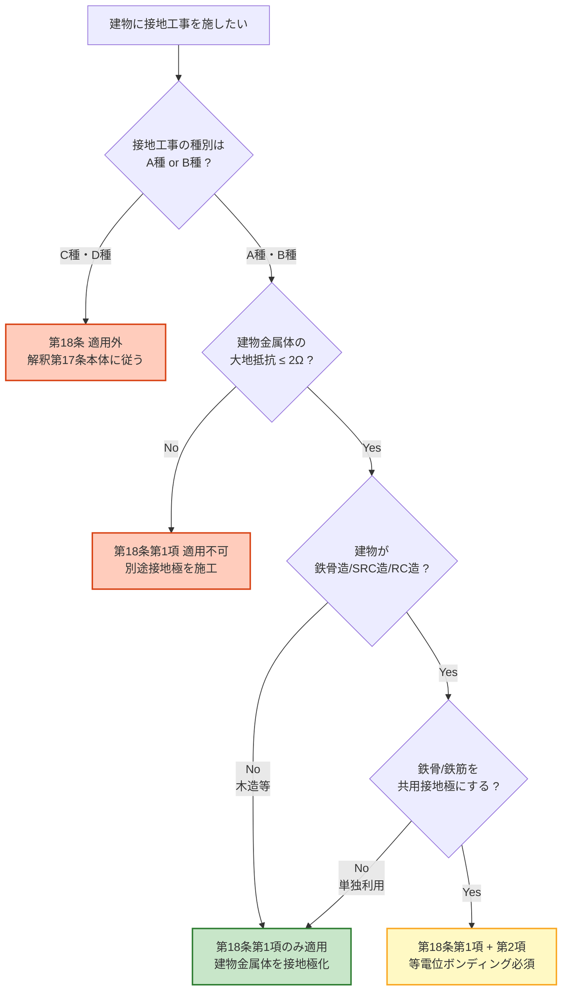

# 電技解釈 第18条 — 工作物の金属体を利用した接地工事

!!! note "📊 概要"
    **出題頻度**: 🔥（電験3種法規での直接出題実績は乏しい・補助知識）

    **重要度**: C（基本・補助知識）

    **直近出題**: 直接出題は確認できず（17条 A/B種接地の周辺知識として参照されることがある）

> 建物の **鉄骨・鉄筋等の金属体** を、**A種・B種接地工事の接地極** として利用できる規定。第1項は **大地抵抗2Ω以下** が要件。第2項は鉄骨造／鉄骨鉄筋コンクリート造／鉄筋コンクリート造の建物で **共用接地極** とする場合に **等電位ボンディング** を必須化する。**17条本体（A〜D種接地工事）の代替接地極規定** であり、独立した接地種別ではない点が試験対策の核心。

| 項目 | 内容 |
|------|------|
| 条文 | 電気設備の技術基準の解釈 第18条 |
| 規定内容 | 工作物の金属体を接地極として流用する条件 |
| 性格 | 接地施工の **代替手段規定**（17条本体に対する補助） |
| 委任先（直接の具体化） | なし（解釈本体・接地施工の具体化規定） |
| 関連条文（参照） | 解釈第17条（A〜D種接地工事の本体）／解釈第19条（保安上又は機能上必要な場合における電路の接地）／省令第10条（電気設備の接地）／省令第11条（電気設備の接地の方法） |
| 上位 | 省令第10条・第11条（接地原則） |
| **典拠（一次ソース）** | 電気設備の技術基準の解釈（令和7年版）第18条 — 経済産業省告示 ／ 公益社団法人 日本電気技術者協会「電気設備技術基準・解釈の解説〔その2〕電路の絶縁と接地」 |
| **照合日** | 2026-05-08（[JEEA講座](https://jeea.or.jp/course/contents/11102/) ／ [サンコーシヤ 接地規程](https://www.sankosha.co.jp/earthing-systems/earthing-ministerial-ordinance/) ／ [経産省 電技解釈 PDF](https://www.meti.go.jp/policy/safety_security/industrial_safety/sangyo/electric/files/dengikaishaku.pdf) で照合） |
| **隣接条文** | ← [第17条（接地工事の種類及び施設方法）](17.md) ／ [第19条（保安上又は機能上必要な場合における電路の接地）](19.md) → ／ 上位：[省令第10条（電気設備の接地）](../kijun/10.md) ／ [省令第11条（電気設備の接地の方法）](../kijun/11.md) |
| **混同注意** | 同番号の **電技省令第18条**（公害等の防止）／**電気事業法第18条**（事業計画変更）とは **別物**。本条は「電技解釈」第18条（接地極の代替手段規定） |

---

## 0. 隣接条文クラスタマップ — 接地工事クラスタ（17/18/19条）

!!! tip "なぜこのマップを冒頭に置くか"
    第18条は **第17条の本体規定（A〜D種接地工事）に対する代替接地極規定** であり、単独で読んでも意味が掴みづらい。**3条文の役割分担** を最初に整理することで、試験での **「どの条文の論点か」** を即座に判別できる土台を作る。

### 接地工事クラスタの差分マップ

| 条文 | 規制対象 | 役割 | 試験での問われ方 |
|------|---------|------|------------------|
| **第17条** | A〜D種接地工事 | 接地工事の **本体規定**（種類・抵抗値・接地線太さ） | 数値暗記（10Ω／100Ω／150/Ig 等）・接地線太さ |
| **第18条（本記事）** | **工作物の金属体を接地極に流用** | **接地極の代替手段**（鉄骨/鉄筋利用） | 大地抵抗 **2Ω以下**・**等電位ボンディング**・A/B種限定 |
| 第19条 | 中性点・特別高圧直流電路の接地 | **電路の接地**（電位安定・異常電圧抑制） | 中性点接地・異常電圧抑制・燃料電池電路 |

### 18条の独自性
- **接地極そのもの** を規定する条文（接地抵抗値ではない）
- **A種・B種接地のみ** を対象（C種・D種は対象外）
- 適用条件が **大地抵抗2Ω以下** という極めて厳格な数値
- 第2項は **等電位ボンディング** という建築電気設備の核心概念を導入

### 複合問題の典型パターン
1. **対象種別判定型**: 「大地抵抗2Ω以下の鉄骨を接地極として利用できる接地工事はどれか」 → **A種・B種**（C種・D種は対象外）
2. **代替手段選択型**: 「別途接地極を埋設せずに接地工事を施す方法は何条に規定されているか」 → **第18条**
3. **共用接地条件型**: 「鉄筋コンクリート造の建物で鉄筋を共用接地極とする際に必要な施工は何か」 → **等電位ボンディング**

---

## 1. 全体像と要点

- **第1項**: 大地抵抗 **2Ω以下** の建物鉄骨等の金属体を **A種・B種接地工事の接地極** として使用可
- **第2項**: 鉄骨造／SRC造／RC造の建物で鉄骨/鉄筋を **共用接地極** とする場合は **等電位ボンディング** 必須
- **対象**: A種・B種のみ（C種・D種は対象外）
- なぜこの条文が必要か: 別途接地極を埋設するコストが高い → 既存建造物の金属体を流用したい → ただし安全性確保のため厳格な要件を課す
- 等電位ボンディングの意義: 異種金属系統（鉄骨/配管/電気設備）の電位差を解消し、地絡・雷サージ時の感電と火災を防止

??? question "セルフチェック: 第18条で対象外の接地工事はどれか"
    **C種・D種**。第18条第1項は明示的に **A種接地工事およびB種接地工事の接地極** に限定している。C種・D種接地は対象外。

??? question "セルフチェック: なぜ大地抵抗2Ω以下という条件か"
    建物鉄骨等を接地極として使う場合、**接地極の品質保証** が必要。一般的なA種接地の接地抵抗値は10Ω以下だが、**鉄骨自体が接地極** となるため、接地経路全体の信頼性を高めるべく **より厳しい2Ω以下** を要求している。

### 全体像 — 第18条の位置づけ

<div><svg viewBox="0 0 800 380" xmlns="http://www.w3.org/2000/svg" width="100%" preserveAspectRatio="xMidYMid meet">
<defs>
<filter id="sh18a" x="-20%" y="-20%" width="140%" height="140%"><feDropShadow dx="0" dy="2" stdDeviation="2" flood-opacity="0.15"/></filter>
<linearGradient id="g18Main" x1="0" y1="0" x2="0" y2="1"><stop offset="0%" stop-color="#bbdefb"/><stop offset="100%" stop-color="#90caf9"/></linearGradient>
<linearGradient id="g18A" x1="0" y1="0" x2="0" y2="1"><stop offset="0%" stop-color="#c8e6c9"/><stop offset="100%" stop-color="#a5d6a7"/></linearGradient>
<linearGradient id="g18B" x1="0" y1="0" x2="0" y2="1"><stop offset="0%" stop-color="#fff9c4"/><stop offset="100%" stop-color="#fff176"/></linearGradient>
</defs>
<text x="400" y="26" text-anchor="middle" font-size="15" font-weight="700" fill="#212121">第18条 — 工作物の金属体を接地極として利用</text>
<text x="400" y="44" text-anchor="middle" font-size="11" fill="#666">第17条本体（A〜D種接地）に対する代替接地極規定</text>
<rect x="280" y="60" width="240" height="64" rx="12" fill="url(#g18Main)" stroke="#0d47a1" stroke-width="2.5" filter="url(#sh18a)"/>
<text x="400" y="86" text-anchor="middle" font-size="14" font-weight="800" fill="#0d47a1">解釈第18条</text>
<text x="400" y="106" text-anchor="middle" font-size="11" fill="#1565c0">工作物の金属体を利用した接地工事</text>
<line x1="400" y1="124" x2="160" y2="160" stroke="#0d47a1" stroke-width="1.5" stroke-dasharray="3,2"/>
<line x1="400" y1="124" x2="640" y2="160" stroke="#0d47a1" stroke-width="1.5" stroke-dasharray="3,2"/>
<rect x="40" y="170" width="240" height="180" rx="14" fill="url(#g18A)" stroke="#2e7d32" stroke-width="2.5" filter="url(#sh18a)"/>
<text x="160" y="196" text-anchor="middle" font-size="13" font-weight="700" fill="#1b5e20">第1項</text>
<text x="160" y="214" text-anchor="middle" font-size="11" font-weight="700" fill="#1b5e20">建物金属体の流用</text>
<line x1="60" y1="222" x2="260" y2="222" stroke="#2e7d32" stroke-width="1"/>
<text x="160" y="244" text-anchor="middle" font-size="11" fill="#1b5e20">大地抵抗 2Ω以下</text>
<text x="160" y="262" text-anchor="middle" font-size="11" fill="#1b5e20">の建物鉄骨等</text>
<text x="160" y="290" text-anchor="middle" font-size="13" font-weight="700" fill="#1b5e20">A種・B種接地</text>
<text x="160" y="308" text-anchor="middle" font-size="11" fill="#1b5e20">の接地極として使用可</text>
<text x="160" y="334" text-anchor="middle" font-size="10" fill="#2e7d32">非接地式高圧電路機器・</text>
<text x="160" y="346" text-anchor="middle" font-size="10" fill="#2e7d32">高低圧結合変圧器低圧側</text>
<rect x="520" y="170" width="240" height="180" rx="14" fill="url(#g18B)" stroke="#f9a825" stroke-width="2.5" filter="url(#sh18a)"/>
<text x="640" y="196" text-anchor="middle" font-size="13" font-weight="700" fill="#f57f17">第2項</text>
<text x="640" y="214" text-anchor="middle" font-size="11" font-weight="700" fill="#f57f17">建物の共用接地</text>
<line x1="540" y1="222" x2="740" y2="222" stroke="#f9a825" stroke-width="1"/>
<text x="640" y="244" text-anchor="middle" font-size="11" fill="#f57f17">鉄骨造／SRC造／</text>
<text x="640" y="262" text-anchor="middle" font-size="11" fill="#f57f17">RC造の建物</text>
<text x="640" y="290" text-anchor="middle" font-size="13" font-weight="700" fill="#f57f17">等電位</text>
<text x="640" y="308" text-anchor="middle" font-size="13" font-weight="700" fill="#f57f17">ボンディング必須</text>
<text x="640" y="334" text-anchor="middle" font-size="10" fill="#f57f17">異種金属系統間の</text>
<text x="640" y="346" text-anchor="middle" font-size="10" fill="#f57f17">電位差を解消</text>
</svg></div>

---

## 2. 条文原文（要旨）

!!! warning "条文原文の取扱いについて"
    電技解釈は **経済産業省告示** であり、e-Gov法令検索（一般法律向け）には **収載されていない**。本記事の条文要旨は、[公益社団法人 日本電気技術者協会の解説](https://jeea.or.jp/course/contents/11102/)・[経産省告示PDF](https://www.meti.go.jp/policy/safety_security/industrial_safety/sangyo/electric/files/dengikaishaku.pdf)・[サンコーシヤ 接地規程一覧](https://www.sankosha.co.jp/earthing-systems/earthing-ministerial-ordinance/) で照合した **要旨** である。逐語原文の正確性が必要な場合は、経産省告示原本を参照されたい。

### 第1項（要旨）

大地との間の電気抵抗値が **2Ω以下** の値を保っている建物の鉄骨その他の金属体は、**非接地式高圧電路に施設する機械器具の鉄台もしくは金属製外箱に施すA種接地工事**、または **非接地式高圧電路と低圧電路を結合する変圧器の低圧電路に施すB種接地工事の接地極** として使用することができる。

**穴埋めキーワード**: 2Ω以下／A種接地工事／B種接地工事／接地極

### 第2項（要旨）

**鉄骨造、鉄骨鉄筋コンクリート造または鉄筋コンクリート造** の建物において、当該建物の **鉄骨または鉄筋その他の金属体** を **接地工事に係る共用の接地極** に使用する場合には、建物の鉄骨または鉄筋コンクリートの一部を **地中に埋設** するとともに、**等電位ボンディング** を施すこととされている。

**穴埋めキーワード**: 鉄骨造／鉄骨鉄筋コンクリート造／鉄筋コンクリート造／共用接地極／等電位ボンディング

### 適用対象テーブル

| 第1項 | 第2項 |
|------|------|
| 大地抵抗 **2Ω以下** の建物の金属体 | 鉄骨造／SRC造／RC造の建物 |
| **A種・B種接地工事の接地極** として使用可 | 鉄骨/鉄筋を **共用接地極** に使用可 |
| 主目的：別途接地極の埋設を不要にする | 主目的：建物全体の電位差解消 |
| 要件：大地抵抗値の数値基準 | 要件：等電位ボンディング施工 |

---

## 3. 原文解析（ブロック分解）

### 第1項のブロック分解

| ブロック | キーフレーズ | 試験ポイント |
|---------|------------|-------------|
| 適用対象 | 「大地との間の電気抵抗値が **2Ω以下** の値を保っている建物の鉄骨その他の金属体」 | 数値「2Ω」と対象「建物の金属体」のセット暗記 |
| 適用範囲 | 「**非接地式高圧電路** に施設する機械器具の鉄台もしくは金属製外箱に施す **A種接地工事**」 | 「非接地式」が条件であること・A種限定 |
| 適用範囲（並列） | 「**非接地式高圧電路と低圧電路を結合する変圧器** の低圧電路に施す **B種接地工事** の接地極」 | B種接地の対象が「変圧器低圧側」である基本も併せて確認 |
| 効果 | 「接地極として使用することができる」 | 「使用しなければならない」ではなく「使用することができる」（任意規定） |

### 第2項のブロック分解

| ブロック | キーフレーズ | 試験ポイント |
|---------|------------|-------------|
| 適用対象 | 「**鉄骨造、鉄骨鉄筋コンクリート造または鉄筋コンクリート造** の建物」 | 3造の列挙暗記。木造・ブロック造は対象外 |
| 適用条件 | 「鉄骨または鉄筋その他の金属体を **接地工事に係る共用の接地極** に使用する場合」 | 「共用」が要件 — 単独使用なら本項は不適用 |
| 施工要件① | 「鉄骨または鉄筋コンクリートの一部を **地中に埋設**」 | 大地との確実な電気的接続 |
| 施工要件② | 「**等電位ボンディング** を施す」 | 異種金属系統間の電位差解消 |

---

## 4. かみ砕き解説（因果理解）

### 物理的因果 — なぜ建物金属体を接地極にできるのか

建物の鉄骨や鉄筋は、**地中に埋設された基礎** を通じて大地と直接接続されている。この接続経路の **電気抵抗が十分に低ければ**（2Ω以下）、別途打ち込んだ接地極と同等の機能を果たす。

つまり「建物そのものが大規模な接地極」として機能する状態を、法的に **接地極とみなしてよい** と認めたのが第18条第1項。

### 法的因果 — なぜA種・B種限定か

| 接地種別 | 用途 | 第18条適用 | 理由 |
|---------|------|-----------|------|
| A種 | 高圧・特別高圧機器の外箱 | ✅ 対象 | 故障電流が大きく、確実な接地経路が必要 → 大地抵抗2Ω以下を満たすなら建物金属体で代替可 |
| B種 | 変圧器低圧側中性点 | ✅ 対象（条件あり） | 高低圧混触防止のため、確実な接地が必要 |
| C種・D種 | 低圧機器の外箱 | ❌ 対象外 | 低圧機器は **個別の接地極** で施工することが原則 |

C種・D種は **個別機器単位の接地** が基本思想であり、共用接地極化することは別途の規定（接地工事の併用：解釈第17条第2項）で扱われる。

### 等電位ボンディングの意義

異なる金属系統（鉄骨／給排水配管／電気設備の接地系統等）が **電気的に独立** していると、地絡・雷サージ時に系統間で **電位差** が生じる → 人体や機器に過電圧が印加される。

**等電位ボンディング** = これら金属系統を **電気的に接続** して **同電位** にすること。
- 感電リスク低減（人が金属系統を触っても電位差ゼロ）
- 機器保護（異常時の電位差による絶縁破壊を防止）
- 雷保護（落雷時の建物全体の電位上昇を一様化）

---

## 5. 図で理解

### 判定フロー（第18条の適用可否）



### 共用接地と等電位ボンディングのイメージ

<div><svg viewBox="0 0 800 380" xmlns="http://www.w3.org/2000/svg" width="100%" preserveAspectRatio="xMidYMid meet">
<defs>
<filter id="sh18b" x="-20%" y="-20%" width="140%" height="140%"><feDropShadow dx="0" dy="2" stdDeviation="2" flood-opacity="0.12"/></filter>
</defs>
<text x="400" y="24" text-anchor="middle" font-size="15" font-weight="700" fill="#212121">RC造ビルの共用接地と等電位ボンディング</text>
<text x="400" y="42" text-anchor="middle" font-size="11" fill="#666">建物鉄筋を接地極化＋異種金属系統を電気的に接続</text>
<rect x="200" y="60" width="400" height="240" rx="6" fill="#f5f5f5" stroke="#9e9e9e" stroke-width="1.5"/>
<text x="400" y="80" text-anchor="middle" font-size="11" font-weight="600" fill="#616161">RC造ビル（鉄筋コンクリート造）</text>
<rect x="220" y="100" width="40" height="160" rx="2" fill="#bcaaa4" stroke="#5d4037" stroke-width="1.5"/>
<rect x="540" y="100" width="40" height="160" rx="2" fill="#bcaaa4" stroke="#5d4037" stroke-width="1.5"/>
<line x1="240" y1="100" x2="240" y2="260" stroke="#37474f" stroke-width="2.5" stroke-dasharray="2,2"/>
<line x1="560" y1="100" x2="560" y2="260" stroke="#37474f" stroke-width="2.5" stroke-dasharray="2,2"/>
<text x="240" y="285" text-anchor="middle" font-size="10" font-weight="700" fill="#37474f">鉄筋</text>
<text x="560" y="285" text-anchor="middle" font-size="10" font-weight="700" fill="#37474f">鉄筋</text>
<rect x="290" y="120" width="80" height="50" rx="4" fill="#e3f2fd" stroke="#1565c0" stroke-width="2"/>
<text x="330" y="142" text-anchor="middle" font-size="10" font-weight="700" fill="#0d47a1">変圧器</text>
<text x="330" y="158" text-anchor="middle" font-size="9" fill="#1565c0">B種接地</text>
<rect x="430" y="120" width="80" height="50" rx="4" fill="#fff3e0" stroke="#e65100" stroke-width="2"/>
<text x="470" y="142" text-anchor="middle" font-size="10" font-weight="700" fill="#bf360c">高圧機器</text>
<text x="470" y="158" text-anchor="middle" font-size="9" fill="#e65100">A種接地</text>
<rect x="290" y="195" width="80" height="40" rx="4" fill="#f3e5f5" stroke="#6a1b9a" stroke-width="1.5"/>
<text x="330" y="220" text-anchor="middle" font-size="10" font-weight="600" fill="#4a148c">給排水配管</text>
<rect x="430" y="195" width="80" height="40" rx="4" fill="#e8f5e9" stroke="#2e7d32" stroke-width="1.5"/>
<text x="470" y="220" text-anchor="middle" font-size="10" font-weight="600" fill="#1b5e20">空調配管</text>
<line x1="330" y1="170" x2="240" y2="170" stroke="#1565c0" stroke-width="2"/>
<line x1="470" y1="170" x2="560" y2="170" stroke="#bf360c" stroke-width="2"/>
<line x1="330" y1="195" x2="240" y2="195" stroke="#6a1b9a" stroke-width="1.5" stroke-dasharray="3,2"/>
<line x1="470" y1="195" x2="560" y2="195" stroke="#2e7d32" stroke-width="1.5" stroke-dasharray="3,2"/>
<text x="280" y="180" text-anchor="middle" font-size="9" fill="#1565c0">B種</text>
<text x="520" y="180" text-anchor="middle" font-size="9" fill="#bf360c">A種</text>
<line x1="240" y1="260" x2="240" y2="320" stroke="#37474f" stroke-width="3"/>
<line x1="560" y1="260" x2="560" y2="320" stroke="#37474f" stroke-width="3"/>
<line x1="160" y1="320" x2="640" y2="320" stroke="#3e2723" stroke-width="3"/>
<text x="400" y="340" text-anchor="middle" font-size="11" font-weight="700" fill="#3e2723">大地（基礎部分は地中埋設）</text>
<line x1="240" y1="195" x2="560" y2="195" stroke="#0288d1" stroke-width="2" stroke-dasharray="6,3"/>
<text x="400" y="190" text-anchor="middle" font-size="10" font-weight="700" fill="#0288d1">等電位ボンディング</text>
<rect x="640" y="100" width="140" height="200" rx="6" fill="#ffffff" stroke="#bdbdbd" stroke-width="1" filter="url(#sh18b)"/>
<text x="710" y="120" text-anchor="middle" font-size="11" font-weight="700" fill="#424242">凡例</text>
<line x1="650" y1="135" x2="670" y2="135" stroke="#1565c0" stroke-width="2"/>
<text x="676" y="139" font-size="9" fill="#1565c0">B種接地線</text>
<line x1="650" y1="155" x2="670" y2="155" stroke="#bf360c" stroke-width="2"/>
<text x="676" y="159" font-size="9" fill="#bf360c">A種接地線</text>
<line x1="650" y1="175" x2="670" y2="175" stroke="#0288d1" stroke-width="2" stroke-dasharray="6,3"/>
<text x="676" y="179" font-size="9" fill="#0288d1">ボンディング</text>
<line x1="650" y1="195" x2="670" y2="195" stroke="#37474f" stroke-width="2.5" stroke-dasharray="2,2"/>
<text x="676" y="199" font-size="9" fill="#37474f">建物鉄筋</text>
<text x="650" y="225" font-size="9" fill="#424242">→ 鉄筋が共用</text>
<text x="650" y="240" font-size="9" fill="#424242">　接地極</text>
<text x="650" y="260" font-size="9" fill="#424242">→ 配管も電気的に</text>
<text x="650" y="275" font-size="9" fill="#424242">　接続して</text>
<text x="650" y="290" font-size="9" fill="#424242">　電位差ゼロ化</text>
</svg></div>

**読み解き**: 建物鉄筋がA種・B種接地の **共用接地極** となり、給排水配管・空調配管などの異種金属系統も **等電位ボンディング** で電気的に接続される。これにより、地絡・雷サージ時にも建物全体が同電位を保ち、感電・火災リスクが低減する。

---

## 6. 施設形態別の物理イメージ

### 適用可能な建物構造

| 建物構造 | 第1項適用 | 第2項適用 | 想定シーン |
|---------|----------|----------|----------|
| **鉄骨造（S造）** | ✅（鉄骨が大地抵抗2Ω以下を満たすなら） | ✅（共用接地化する場合） | 工場・体育館・大規模倉庫 |
| **鉄骨鉄筋コンクリート造（SRC造）** | ✅（鉄骨/鉄筋が条件を満たすなら） | ✅ | 高層ビル・大型商業施設 |
| **鉄筋コンクリート造（RC造）** | ✅（鉄筋が条件を満たすなら） | ✅ | マンション・中規模オフィスビル |
| 木造・ブロック造 | ❌（大地抵抗条件を満たす金属体がない） | ❌（第2項対象外） | 戸建住宅は別途接地極を施工 |

### 大地抵抗 2Ω以下を満たす条件
- **基礎の地中埋設深度** が十分（鉄筋・鉄骨の一部が地中にあること）
- 周囲土壌の **大地抵抗率** が低い（湿潤地・粘土質）
- 建物の **規模** が大きい（接触面積が大きいほど抵抗値は低下）

→ 大規模建造物では満たしやすく、小規模建物では満たしにくい傾向。

---

## 7. 核心キーワード物理解説

### 大地抵抗値（接地抵抗値）

接地極と大地（無限遠）との間の電気抵抗。理論上は **接地極の形状・寸法**、**周囲土壌の大地抵抗率（ρ）**、**埋設深度** で決まる。

- **2Ω以下** が要件される理由：故障電流（A種で数百A〜千A級）が流れたときの **接地点の電位上昇** を抑制するため。電位上昇 = 故障電流 × 接地抵抗 で決まり、抵抗が低いほど安全。

!!! warning "暗記補助：物理根拠ではなく公式根拠で覚える"
    「2Ω以下」は **法令上の数値基準** であり、物理的に「絶対に2Ωでなければならない」という導出があるわけではない。設計上の安全余裕を考慮した行政判断。試験では **数値そのもの** を覚えること。

### 等電位ボンディング（Equipotential Bonding）

異なる金属系統を **電気的に接続** して **同電位** にする施工。

- **意義①** 地絡時の系統間電位差解消 → 人体感電リスク低減
- **意義②** 雷サージ時の建物全体の電位上昇を一様化 → 機器保護
- **意義③** 静電気帯電による異常電圧の発生抑制

| 接続対象 | 例 |
|---------|-----|
| 建築金属体 | 鉄骨・鉄筋 |
| 給排水設備 | 給水管・排水管・ガス管 |
| 空調設備 | ダクト・冷媒配管 |
| 電気設備の接地系統 | A種・B種・C種・D種接地端子 |
| 通信設備の接地系統 | 通信機器の接地端子 |

→ 上記をすべて電気的に接続することが「総合等電位ボンディング」の理想形。

### 共用接地（共用接地極）

複数の接地系統（A種・B種・避雷設備・通信設備等）が **同一の接地極** を共用する方式。

- **メリット**: 施工コスト削減・等電位化の効果（電位差解消）
- **デメリット**: 雷サージ等の異常電流が他系統に波及するリスク
- **対策**: 等電位ボンディングと、必要に応じてSPD（避雷器）の併用

---

## 8. 適用範囲と除外

### 適用範囲（AND条件）

第1項を適用するには、以下の **すべて** を満たす必要がある：

| # | 要件 | チェックポイント |
|---|------|----------------|
| 1 | 接地工事の種別が A種 または B種 | C種・D種は対象外 |
| 2 | 建物の金属体（鉄骨・鉄筋等） | 個別の金属管・避雷導線等は対象外 |
| 3 | 大地抵抗値が 2Ω以下 | 実測または計算で確認 |
| 4 | A種の場合：非接地式高圧電路に施設する機械器具の外箱・鉄台 | 接地式高圧電路の機器は対象外 |
| 5 | B種の場合：非接地式高圧電路と低圧電路を結合する変圧器の低圧電路 | 接地式高圧電路と低圧電路の結合変圧器は対象外 |

### 第2項の追加要件（共用接地極とする場合）

| # | 要件 | チェックポイント |
|---|------|----------------|
| A | 建物が 鉄骨造／SRC造／RC造 | 木造・ブロック造は対象外 |
| B | 鉄骨または鉄筋の一部が 地中に埋設 | 大地との確実な電気的接続 |
| C | 等電位ボンディングを施工 | 異種金属系統間の電位差解消 |

### 除外（適用できないケース）

- ❌ 木造・ブロック造の建物（建物金属体そのものが存在しない）
- ❌ 大地抵抗値が 2Ω 超（要件未達）
- ❌ C種・D種接地工事（対象外）
- ❌ 接地式高圧電路の機器（A種接地でも本条適用外。理由：接地式高圧電路では既に系統側に接地点があるため、機器外箱の接地は別経路で行う必要がある）

---

## 9. A/B 2層暗記表（第1項 vs 第2項）

| 項目 | **第1項**（金属体を接地極化） | **第2項**（建物の共用接地） |
|------|------------------------------|----------------------------|
| **主目的** | 別途接地極の埋設を不要にする | 建物全体の電位差を解消する |
| **対象建物** | 任意の建物（鉄骨・鉄筋等の金属体があるもの） | 鉄骨造・SRC造・RC造に限定 |
| **対象接地** | A種・B種 | 共用接地極全般 |
| **数値要件** | 大地抵抗 **2Ω以下** | （明示的な数値要件なし） |
| **施工要件** | 大地抵抗値の確認 | **地中埋設** ＋ **等電位ボンディング** |
| **適用任意性** | 「使用することができる」（任意） | 共用化する場合は等電位ボンディング **必須** |

---

## 10. 省令と解釈の関係

```
【上位】電気事業法 第39条（事業用電気工作物の維持）
                 │
                 ▼
【省令】電気設備に関する技術基準を定める省令
        ├── 第10条（電気設備の接地）：接地原則
        └── 第11条（電気設備の接地の方法）：接地施工の方法を解釈に委任
                 │
                 ▼ 委任
【解釈】電気設備の技術基準の解釈
        ├── 第17条 接地工事の種類及び施設方法（A〜D種本体）
        ├── 第18条 工作物の金属体を利用した接地工事 ← 本記事（接地極の代替手段）
        └── 第19条 保安上又は機能上必要な場合における電路の接地
```

- **省令第10条・第11条**: 接地の **原則** と **方法** を規定（数値や具体施工は解釈に委任）
- **解釈第17条**: 接地工事の **本体規定**（A〜D種・抵抗値・接地線太さ）
- **解釈第18条**: 第17条の **接地極部分** の代替手段を提供
- **解釈第19条**: **電路** の接地（中性点等）を規定

→ 第18条は **第17条の補助規定** として位置づけられる。単独で「第18条接地工事」という種別があるわけではない。

---

## 11. 条文別暗記マップ — 接地工事クラスタの役割分担

!!! tip "なぜこの暗記マップが必要か"
    第18条は単独では意味が薄く、**第17条との関係** を理解しなければ試験で正答を導けない。本マップは **17/18/19条の役割を1表で可視化** し、複合問題で迷わない暗記の核を提供する。

### 接地クラスタ役割マップ

| 条文 | 正式タイトル | 規制対象 | 数値の核心 | 試験での役割 |
|------|------------|---------|-----------|------------|
| **解釈第17条** | 接地工事の種類及び施設方法 | A種・B種・C種・D種接地工事 | A種 10Ω／C種 10Ω・500Ω／D種 100Ω・500Ω／B種 150 or 300 ÷ Ig | **本体規定**（数値暗記の主戦場） |
| **解釈第18条** | 工作物の金属体を利用した接地工事 | A種・B種の **接地極** を建物金属体で代替 | **2Ω以下**（大地抵抗）／等電位ボンディング | **接地極の代替手段**（補助知識） |
| **解釈第19条** | 保安上又は機能上必要な場合における電路の接地 | 中性点・特別高圧直流電路・燃料電池電路 | 引張強さ 2.46kN／接地線太さ等 | **電路の接地**（中性点接地・異常電圧抑制） |

### 横展開：複合問題での問われ方

| 出題テーマ | 関連条文 | 正答の根拠 |
|----------|---------|----------|
| A・B・C・D種の接地抵抗値 | **第17条** | 17-1表 |
| 接地線の太さ | **第17条** | 17条第1項各号 |
| 鉄骨を接地極にする条件 | **第18条** | 第1項：大地抵抗2Ω以下 |
| 共用接地時の必須施工 | **第18条** | 第2項：等電位ボンディング |
| 中性点接地の規定 | **第19条** | 中性点・特別高圧直流電路 |
| C種接地に建物金属体を使えるか | **第18条** | ❌ 適用対象はA種・B種のみ |

---

## 12. 試験対策

### A. 試験で問われる5切り口

第18条に関する出題は、以下の5つの切り口に分類できる。各切り口を意識して問題文を読むと、論点を即座に特定できる。

| # | 切り口 | 典型的な問い方 | 正答の核心 |
|---|--------|---------------|----------|
| 1 | **対象種別判定** | 「第18条が適用できる接地工事はどれか」 | A種・B種のみ（C種・D種は対象外） |
| 2 | **数値基準** | 「建物の鉄骨を接地極とするための大地抵抗値は」 | **2Ω以下** |
| 3 | **建物構造** | 「共用接地極にできる建物構造はどれか」 | 鉄骨造／SRC造／RC造 |
| 4 | **施工要件** | 「鉄筋を共用接地極にする際に必要な施工は」 | 等電位ボンディング ＋ 地中埋設 |
| 5 | **位置づけ** | 「第18条は何条との関係で読むべきか」 | 第17条本体の **接地極代替手段** |

### B. 頻出ひっかけ・落とし穴

| 重大度 | ❌ 誤った認識 | ✅ 正しい認識 |
|--------|--------------|--------------|
| 🔴 致命的 | C種・D種接地でも建物金属体を流用できる | **A種・B種のみ**。C種・D種は対象外 |
| 🔴 致命的 | 大地抵抗が10Ω以下なら鉄骨を接地極にできる | **2Ω以下** が要件（A種の10Ω以下とは別基準） |
| 🟡 注意 | 木造でも鉄骨が入っていれば第18条が適用できる | 第2項は **鉄骨造／SRC造／RC造** に限定。木造は対象外 |
| 🟡 注意 | 共用接地極にすれば等電位ボンディングは省略できる | 共用接地極にする場合こそ **等電位ボンディング必須** |
| 🟢 軽微 | 第18条は独立した接地工事の種別である | **第17条本体に対する代替接地極規定**。独立した種別ではない |

### C. 穴埋め過去問チャレンジ

!!! abstract "問題1: 第1項の数値要件"
    電気設備の技術基準の解釈 第18条第1項では、大地との間の電気抵抗値が（　ア　）Ω以下の値を保っている建物の鉄骨その他の金属体は、（　イ　）接地工事および（　ウ　）接地工事の接地極として使用することができる、と規定している。

??? success "解答"
    - ア = **2**
    - イ = **A種**
    - ウ = **B種**

    「2Ω」「A種」「B種」のセット暗記。C種・D種は本条の対象外（ひっかけ選択肢の定番）。

!!! abstract "問題2: 第2項の建物構造"
    第18条第2項は、（　ア　）造、（　イ　）造または（　ウ　）造の建物において、当該建物の鉄骨または鉄筋等の金属体を接地工事に係る共用の接地極に使用する場合の規定である。

??? success "解答"
    - ア = **鉄骨**
    - イ = **鉄骨鉄筋コンクリート**
    - ウ = **鉄筋コンクリート**

    3造の列挙暗記。木造・ブロック造は対象外。

!!! abstract "問題3: 共用接地時の施工要件"
    建物の鉄骨または鉄筋を共用の接地極に使用する場合は、建物の鉄骨または鉄筋コンクリートの一部を（　ア　）するとともに、（　イ　）を施すこととされている。

??? success "解答"
    - ア = **地中に埋設**
    - イ = **等電位ボンディング**

    「地中埋設」と「等電位ボンディング」のセット暗記。

!!! abstract "問題4: 第18条の位置づけ"
    第18条は、解釈第（　ア　）条の接地工事本体規定に対する、（　イ　）の代替手段を提供する条文である。対象となる接地工事の種別は（　ウ　）と（　エ　）に限られる。

??? success "解答"
    - ア = **17**
    - イ = **接地極**
    - ウ = **A種**
    - エ = **B種**

    「17条の接地極代替手段」「A種・B種限定」が条文の位置づけの核心。

### D. 派生問題群（想定問題で論点網羅）

!!! note "出題実績の補強について"
    第18条は電験3種法規での **直接出題実績が乏しい**（過去14年で確認できず）。しかし接地工事クラスタ（17/18/19条）の **複合問題** や、保安規程・実務知識を問う問題で **副次的に登場する可能性** がある。下記は想定問題。

!!! example "想定問題1（選択肢）"
    次のうち、解釈第18条が適用できる接地工事の組合せとして正しいものはどれか。

    1. A種接地工事のみ
    2. **A種接地工事およびB種接地工事**
    3. B種接地工事のみ
    4. すべての種別（A〜D種）
    5. C種接地工事およびD種接地工事

??? success "解答と解説"
    **正解: 2**

    第18条第1項は明示的に「A種接地工事およびB種接地工事の接地極として使用することができる」と規定している。C種・D種は対象外。

!!! example "想定問題2（数値判定）"
    建物の鉄骨を解釈第18条第1項に基づく接地極として利用するには、当該鉄骨と大地との間の電気抵抗値を何Ω以下に保つ必要があるか。

??? success "解答と解説"
    **正解: 2Ω以下**

    A種接地工事の接地抵抗値（10Ω以下）と混同しないこと。第18条の要件は **接地極自体の品質保証** のため、より厳しい2Ω以下を要求している。

!!! example "想定問題3（建物構造）"
    解釈第18条第2項に基づき、建物の鉄筋を共用接地極とする場合に対象外となる建物構造はどれか。

    1. 鉄骨造
    2. 鉄骨鉄筋コンクリート造
    3. 鉄筋コンクリート造
    4. **木造**
    5. すべて対象

??? success "解答と解説"
    **正解: 4**

    第18条第2項は **鉄骨造・SRC造・RC造** に限定。木造は対象外（建物金属体が構造材として存在しないため）。

### E. まぎらわしい選択肢と正解の違い

| 誤った記述 | 正しい記述 | なぜ違うか |
|---|---|---|
| 「第18条はC種・D種接地にも適用できる」 | **A種・B種にのみ適用** | 条文に明示。C種・D種は対象外 |
| 「大地抵抗10Ω以下で鉄骨を接地極化できる」 | **2Ω以下** が要件 | 10Ω は A種接地の抵抗値。第18条の数値ではない |
| 「木造建物でも鉄骨入りなら共用接地できる」 | 鉄骨造／SRC造／RC造 **に限定**（第2項） | 第2項は建物構造そのものを限定列挙 |
| 「共用接地化すれば等電位ボンディングは省略できる」 | **共用接地時こそ等電位ボンディング必須**（第2項） | 共用化に伴うリスク（系統間電位差）を解消するため |
| 「第18条で独立した接地工事種別が規定されている」 | 第17条本体の **接地極の代替手段**（独立種別ではない） | 接地工事の種別は依然として A〜D種（第17条） |
| 「接地式高圧電路の機器でも第18条が使える」 | **非接地式高圧電路** に施設する機器のみ（第1項） | 接地式高圧電路は対象外 |

---

## 17. 実務シーン — 主任技術者の引用場面

!!! info "なぜこのセクションが必要か"
    第18条は **建築電気設備の設計・施工** で最も頻繁に引用される接地関連条文の一つ。特に **大規模ビル・工場の竣工時** に主任技術者が確認する論点。実務イメージを持つことで、暗記から脱却し長期記憶に定着する。

### シーン① — 新築ビルの接地計画書レビュー

ビル新築時の **接地計画書** を主任技術者が確認する際、第18条第2項の **共用接地極＋等電位ボンディング** の整合性を検証する。

- 鉄筋を共用接地極とする場合、地中埋設深度が十分か
- 等電位ボンディングの **接続対象範囲**（建築金属体・配管・通信機器接地）が網羅されているか
- A種・B種接地の **接地極側** が建物鉄筋に統合されているか

### シーン② — 大地抵抗値の竣工試験

第18条第1項を適用する場合、**鉄骨/鉄筋と大地の間の電気抵抗値を実測** し、2Ω以下を確認する必要がある。

- 接地抵抗計（コールラウシュブリッジ法または電位降下法）で測定
- 季節変動を考慮し、**最も大地抵抗が高くなる乾燥期** での測定値を採用するのが望ましい
- 測定記録を **保安規程の付帯資料** として保管

### シーン③ — 改修工事時の整合性確認

既存ビルの増改築時、新規の高圧機器に **A種接地** を施す際、既存の **建物鉄筋を流用** するか **別途接地極を打設** するかを判断。

- 鉄筋利用の場合：第18条第1項要件（大地抵抗2Ω以下）の再測定
- 別途接地極の場合：第17条本体に基づく単独接地（A種10Ω以下）

| 場面 | 必要書類 | 第18条との関係 |
|------|---------|---------------|
| 新築ビル接地計画 | 接地計画書・等電位ボンディング図 | 第18条第2項遵守の組織的担保 |
| 竣工試験 | 大地抵抗測定記録 | 第18条第1項の数値要件確認 |
| 改修工事 | 施工計画書・既存接地系統図 | 第17条本体 vs 第18条適用の選択判断 |

!!! note "実務での但書"
    上記はあくまで典型的な参照場面の例であり、実運用は事業者・案件・行政指導により異なる。共用接地極の採否は、**雷サージ波及リスク** や **現地の大地抵抗率** を考慮して総合判断するのが望ましい。

---

## 18. 関連条文・関連ページ

- [電技解釈 第17条 — 接地工事の種類及び施設方法](17.md) — **本体規定**（A〜D種・抵抗値・接地線太さ）
- [電技解釈 第19条 — 保安上又は機能上必要な場合における電路の接地](19.md) — 中性点・特別高圧直流電路の接地
- [電技省令 第10条 — 電気設備の接地](../kijun/10.md) — **上位条文**（接地の原則）
- [電技省令 第11条 — 電気設備の接地の方法](../kijun/11.md) — **上位条文**（接地施工の方法を解釈に委任）
- [テーマ: 接地工事](../../themes/setsuchi.md) — 接地全般の設計・施工・試験

---

## 19. 過去問実績

### 主軸（直近14年で第18条「工作物の金属体を利用した接地工事」を直接論点とする問題）

| 年度 | 問 | 形式 | 論点 | 難度 |
|------|-----|------|------|------|
| — | — | — | **直近14年で第18条本体の直接出題は確認できず** | — |

!!! warning "kakomon.yml の登録ずれについて"
    本wikiの過去問データベース（`kakomon.yml`）には「解釈§18」登録が2件（R05上 問12 ／ R05下 問11）あるが、いずれも内容は **B種接地工事の抵抗値・1線地絡事故の計算** であり、**本来の根拠条文は第17条**（A〜D種接地工事の本体）である。これは旧版18.md（B種接地工事として誤掲載）に合わせて kakomon.yml が登録されたものと推察される。

    | 年度 | 問 | 内容 | 本来の根拠 |
    |------|-----|------|----------|
    | R05上 | 問12 | B種接地工事の抵抗値及び常時流れる電流（計算） | **解釈第17条** |
    | R05下 | 問11 | 需要設備付近で発生した1線地絡事故（計算） | **解釈第17条**（B種接地抵抗計算） |

    → kakomon.yml の修正（§18 → §17 への登録移行）は次セッションで実施予定。**第18条本体「工作物の金属体を利用した接地工事」の単独出題は、現時点で確認できる範囲では極めて稀**。

### なぜ第18条本体の出題が少ないか

- 第18条は第17条の補助規定であり、**独立論点として問いづらい**
- 共用接地・等電位ボンディングは **建築電気設備の実務寄り** で、電験3種法規の出題範囲では補助的扱い
- 接地工事の **数値暗記の主戦場は第17条**（A〜D種）に集中

### 古い参考実績（年代が離れているため復習扱い）

確認できる範囲では古い参考実績も乏しい。第18条本体が複合問題で副次的に登場する可能性はあるが、単独出題は極めて稀。

### R08 出題予測

!!! note "予測"
    **単独出題確率は低い**（中程度未満）。ただし、以下のシナリオで **副次的に登場する可能性** はある：

    - 接地工事クラスタ（17/18/19条）の **複合論説問題**
    - 「建物鉄骨を接地極として利用する場合の要件」を **誤りの選択肢** として配置するひっかけ
    - 等電位ボンディングを **C種・D種でも必須** とする誤った記述の判別

    優先度は **第17条本体の数値暗記** が最重要、第18条は **補助知識として「2Ω以下」「A種・B種限定」「等電位ボンディング」** を押さえれば足りる。

---

## 20. 用語集

第18条の条文や出題で登場する主要用語を整理した。

| 用語 | 読み | 意味 | 試験での注意点 |
|------|------|------|---------------|
| 工作物 | こうさくぶつ | 建物・構造物等、人工的に作られた地上または地中の物体 | 第18条の対象は **建物の金属体**（鉄骨・鉄筋等） |
| 大地抵抗値 | だいちていこうち | 接地極と大地（無限遠）との間の電気抵抗 | 第18条は **2Ω以下** が要件。A種の接地抵抗（10Ω以下）と混同しない |
| 接地極 | せっちきょく | 大地と直接接触して接地系統を構成する金属体 | 第18条は **建物金属体** を接地極とみなす規定 |
| 等電位ボンディング | とうでんいぼんでぃんぐ | 異種金属系統を電気的に接続して電位差をゼロ化する施工 | 第18条第2項で必須化。共用接地時の核心施工 |
| 共用接地極 | きょうようせっちきょく | 複数の接地系統が同一の接地極を共有する方式 | 第18条第2項の対象 |
| 鉄骨造（S造） | てっこつぞう | 主要構造部が鉄骨で構成される建物 | 第18条第2項の対象構造 |
| 鉄骨鉄筋コンクリート造（SRC造） | てっこつてっきんこんくりーとぞう | 鉄骨と鉄筋コンクリートの両方を構造材とする建物 | 第18条第2項の対象構造 |
| 鉄筋コンクリート造（RC造） | てっきんこんくりーとぞう | 主要構造部が鉄筋コンクリートで構成される建物 | 第18条第2項の対象構造 |
| 非接地式高圧電路 | ひせっちしきこうあつでんろ | 中性点を接地していない高圧電路 | 第18条第1項のA種・B種接地の対象条件 |
| A種接地工事 | えーしゅせっちこうじ | 高圧・特別高圧機器の外箱等に施す接地（接地抵抗10Ω以下） | 第18条で建物金属体を接地極化できる対象 |
| B種接地工事 | びーしゅせっちこうじ | 高低圧結合変圧器の低圧側中性点に施す接地（150÷Ig 等） | 第18条で建物金属体を接地極化できる対象 |

---

## 21. 最終チェック

### 数値暗記

- [ ] 第18条第1項の大地抵抗値要件 = **2Ω以下**
- [ ] 対象接地種別 = **A種・B種のみ**（C種・D種は対象外）

### 条文キーワード

- [ ] 第1項：**建物の鉄骨その他の金属体／2Ω以下／A種・B種接地工事の接地極**
- [ ] 第2項：**鉄骨造・SRC造・RC造／共用接地極／地中埋設／等電位ボンディング**
- [ ] 第1項対象条件：**非接地式高圧電路** に施設する機器（A種）／非接地式高圧電路と低圧電路を結合する **変圧器** の低圧電路（B種）

### 因果理解

- [ ] なぜ建物金属体を接地極にできるか = 鉄骨/鉄筋が **基礎を通じて大地と接続** されているため
- [ ] なぜ2Ω以下か = **接地点の電位上昇を抑制** するため（電位上昇 = 故障電流 × 接地抵抗）
- [ ] なぜ等電位ボンディングが必要か = **異種金属系統間の電位差を解消** し、感電・火災・機器破損を防止

### 法令体系

- [ ] **第18条 = 第17条本体の接地極代替手段**（独立種別ではない）
- [ ] 上位 = **省令第10条・第11条**（接地原則／接地方法）
- [ ] 関連 = **第17条**（接地工事本体）／**第19条**（電路の接地）

### ひっかけ対策

- [ ] 「C種・D種にも適用できる」→ **誤り**（A種・B種のみ）
- [ ] 「大地抵抗10Ω以下で適用」→ **誤り**（2Ω以下）
- [ ] 「木造建物でも適用できる」→ **誤り**（鉄骨造／SRC造／RC造に限定・第2項）
- [ ] 「共用接地化すれば等電位ボンディングは省略可」→ **誤り**（共用接地時こそ必須）

---

## 監修ログ

- **2026-05-08 v1.0**: 初版作成。**条文番号誤記事件の修正**として、旧版（B種接地工事の解説）を破棄し、第18条本体「工作物の金属体を利用した接地工事」として全面書き直し。
    - **誤記の経緯**: 旧版（v1.0・2026-04-20作成）は第17条のB種接地工事の内容を第18条として誤掲載していた。隣接記事（17.md「A種接地工事」／19.md「C・D種接地工事」）も同様にA〜D種を3条文に誤分割していた構造的誤り。
    - **一次ソース照合**: [JEEA 電気設備技術基準・解釈の解説〔その2〕](https://jeea.or.jp/course/contents/11102/) ／ [サンコーシヤ 接地規程一覧](https://www.sankosha.co.jp/earthing-systems/earthing-ministerial-ordinance/) ／ [経産省 電技解釈 PDF](https://www.meti.go.jp/policy/safety_security/industrial_safety/sangyo/electric/files/dengikaishaku.pdf) ／ [電験3種対策-MAC 法令文（17〜19条）](https://ameblo.jp/denken3taisaku-mac/entry-12778730072.html) で照合済み。
    - **構造**: v2.4.3 テンプレート完全準拠。メタ宣言（YAMLフロントマター）／隣接条文クラスタマップ（§0）／条文原文（要旨）／原文解析／かみ砕き解説／Mermaid判定フロー＋SVG共用接地図／施設形態別物理イメージ／核心キーワード物理解説／適用範囲と除外／A/B 2層暗記表／省令と解釈の関係／**条文別暗記マップ（v2.4.3新規・接地クラスタ役割分担）**／試験対策（5切り口・ひっかけ・穴埋め4問・派生問題3問・まぎらわしい選択肢）／実務シーン3場面／関連ページ／過去問実績（主軸/古い参考分離・直接出題なし明示）／用語集／最終チェック。
    - **未確認領域**: 経産省告示の **逐語原文** は本記事では取得できておらず、JEEA講座および接地規程解説からの **要旨** を記載している。試験対策上は要旨で十分だが、行政手続等で逐語原文が必要な場合は経産省告示原本を別途参照されたい。
    - **隣接記事との整合**: 17.md／19.md にも同様の条文番号誤記が確認されており、本セッションでは **冒頭タイトル誤記の警告admonition＋誤参照修正** のみ実施。本文構造の全面再構築は次セッションで実施予定。

---

*最終確認: 2026-05-08 | ステータス: v1.0（v2.4.3テンプレ準拠・条文番号誤記訂正版） ｜ 条文番号: ✅ 一次ソース照合済（JEEA／経産省告示PDF） ｜ 出題実績: ⚠️ 直接出題確認できず（補助知識として位置づけ） ｜ 数値根拠: ✅ 公式根拠記載済（第1項 2Ω以下／第2項 等電位ボンディング） ｜ [バージョニング基準](../../reference/versioning.md) ｜ [テンプレv2.4仕様](../../reference/template-v24.md)*
