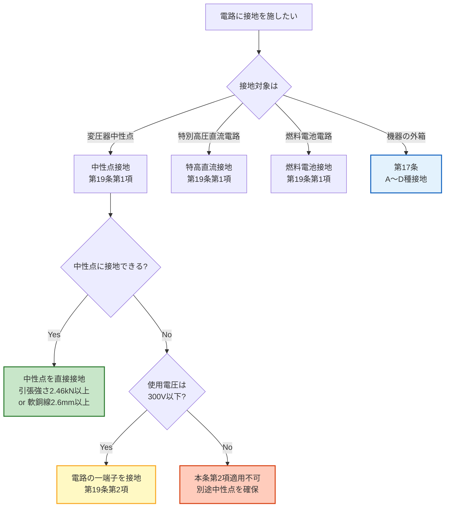

# 電技解釈 第19条 — 保安上又は機能上必要な場合における電路の接地

!!! warning "📜 一次ソース確認のお願い（2026-05-10）"
    本ページは電気設備の技術基準の解釈（経済産業省告示）を学習用に整理したものです。電技解釈は eGov 法令API に登録されていないため、本Wikiの品質保証は wiki内クロスリファレンスと過去問データベース（kakomon.yml）への照合に依存しています。**重要な実務判断や試験直前の最終確認は、必ず経産省公式の最新告示PDF（[電気設備の技術基準の解釈](https://www.meti.go.jp/policy/safety_security/industrial_safety/sangyo/electric/detail/setsubi_kijun.html)）に当たってください**。誤記を発見された場合は GitHub Issues でご連絡ください。

!!! note "📊 概要"
    **出題頻度**: 🔥（電験3種法規での直接出題実績は乏しい・補助知識）

    **重要度**: C（基本・補助知識）

    **直近出題**: 直接出題は確認できず（17条 A/B種接地と「電路の接地」の区別を問う複合問題で副次的に登場する可能性あり）

> 第19条は **電路（の中性点等）に施す接地** の規定。第17条が **機器外箱の接地** を規定するのに対し、本条は **電路自体の電位を安定化** する目的の接地（**中性点接地**・**特別高圧直流電路の接地**・**燃料電池電路の接地**）を扱う。**異常電圧の抑制**・**対地電圧の低下**・**保護装置の確実な動作確保** が主たる狙い。第17条（機器外箱）／第18条（接地極の代替手段）／第19条（電路の接地）で **接地工事クラスタ** を構成する。

| 項目 | 内容 |
|------|------|
| 条文 | 電気設備の技術基準の解釈 第19条 |
| 規定内容 | 保安上または機能上必要な場合における **電路の接地**（中性点・特別高圧直流電路・燃料電池電路） |
| 性格 | 電路の **電位安定化** のための接地規定（機器外箱の接地ではない） |
| 委任先（直接の具体化） | なし（解釈本体・電路接地の具体化規定） |
| 関連条文（参照） | 解釈第17条（接地工事の種類及び施設方法）／解釈第18条（工作物の金属体を利用した接地工事）／解釈第24条（高低圧混触防止）／省令第10条（電気設備の接地）／省令第11条（電気設備の接地の方法）／省令第12条（特別高圧電路等と結合する変圧器等の施設） |
| 上位 | 省令第10条・第11条（接地原則・接地方法）・省令第12条 |
| **典拠（一次ソース）** | 電気設備の技術基準の解釈（令和7年11月版）第19条 — 経済産業省告示 ／ 公益社団法人 日本電気技術者協会「電気設備技術基準・解釈の解説〔その2〕電路の絶縁と接地」 |
| **照合日** | 2026-05-08（[JEEA講座](https://jeea.or.jp/course/contents/11102/) ／ [経産省 電技解釈 PDF](https://www.meti.go.jp/policy/safety_security/industrial_safety/sangyo/electric/files/dengikaishaku.pdf) ／ [電験3種対策-MAC：法令文（17〜19条）](https://ameblo.jp/denken3taisaku-mac/entry-12778730072.html) で照合） |
| **隣接条文** | ← [第18条（工作物の金属体を利用した接地工事）](18.md) ／ 第20条（計器用変成器の2次側電路の接地）<!-- TODO: 20.md は未作成 --> → ／ 上位：[省令第10条（電気設備の接地）](../kijun/10.md) ／ [省令第11条（電気設備の接地の方法）](../kijun/11.md) |
| **混同注意** | 同番号の **電技省令第19条**（公害等の防止）／**電気事業法第19条**とは **別物**。本条は「電技解釈」第19条（電路の接地）。**第17条（機器外箱の接地）と混同しやすい** が、本条は **電路自体の接地**（中性点・直流電路等）を規定する別論点 |

---

## 0. 隣接条文クラスタマップ — 接地工事クラスタ（17/18/19条）

!!! tip "なぜこのマップを冒頭に置くか"
    第19条は「電路の接地」を規定する条文だが、wiki旧版では「C種・D種接地工事」として誤掲載されていた構造的誤りがあり（2026-05-08 訂正）、**第17条（機器外箱の接地）／第18条（接地極の代替）／第19条（電路の接地）** の役割分担を最初に整理することが正しい理解の前提となる。

### 接地工事クラスタの差分マップ

| 条文 | 規制対象 | 役割 | 試験での問われ方 |
|------|---------|------|------------------|
| 第17条 | A〜D種接地工事 | 接地工事の **本体規定**（種類・抵抗値・接地線太さ） | 数値暗記（10Ω／100Ω／150÷Ig 等）・接地線太さ |
| 第18条 | **工作物の金属体を接地極に流用** | 鉄骨等の利用（**第1項＝共用接地極（A〜D種含む）／第2項＝2Ω以下のA・B種接地極特例／第3項＝接地線特例**） | 大地抵抗 **2Ω以下**（第2項）・**等電位ボンディング**・**50V接触電圧**・**1線地絡電流** |
| **第19条（本記事）** | **中性点・特別高圧直流電路・燃料電池電路** | **電路の接地**（電位安定・異常電圧抑制） | 接地対象3種・引張強さ2.46kN・「電路の一端子」緩和 |

### 19条の独自性
- **接地の対象が「機器の外箱」ではなく「電路」そのもの**（中性点・直流電路の特定極等）
- **電路の電位安定化** が目的（機器の感電防止が目的の第17条とは別論点）
- 接地線の要件は **引張強さ 2.46kN以上** または **直径 2.6mm以上の軟銅線**（B種特別高圧結合と同等の太さ）
- 中性点接地が困難な低圧（300V以下）電路では **「電路の一端子」を接地** する例外規定

### 複合問題の典型パターン
1. **対象判定型**: 「中性点接地が必要な電路はどれか」 → 第19条の対象3種から該当判定
2. **緩和型**: 「使用電圧300V以下の低圧電路で中性点に接地を施し難いとき、接地できるのは」 → **電路の一端子**
3. **線径型**: 「保安上又は機能上必要な場合の電路の接地に用いる接地線の最小直径は」 → **2.6mm以上**（軟銅線）／引張強さ **2.46kN以上**
4. **目的型**: 「中性点接地の主目的は」 → **異常電圧の抑制・対地電圧の低下・保護装置の動作確保**

---

## 1. 全体像と要点

- **第19条の規定対象**: **電路** に施す接地（機器外箱ではない）。具体的には3種類：
    - **中性点接地**: 三相変圧器の中性点を大地に接地
    - **特別高圧直流電路の接地**: 直流電路の特定極（プラス極／マイナス極／中性極）を接地
    - **燃料電池電路の接地**: 燃料電池発電設備の電路接地
- **接地の目的**: ①異常電圧の抑制（雷サージ・開閉サージ・地絡サージ）／②対地電圧の低下（中性点接地で対地電圧を線間電圧 → 相電圧に低減）／③保護装置の動作確保（地絡時の電流経路確保）
- **接地線の要件**: 引張強さ **2.46kN以上** の容易に腐食し難い金属線、または **直径 2.6mm以上** の軟銅線
- **緩和規定**: 使用電圧 **300V以下** の電路で **中性点に接地を施し難いとき** は **「電路の一端子」を接地** してよい
- **接地極の要件**: 危険を生ずるおそれのないよう施設

??? question "セルフチェック: 第19条と第17条の最大の違いは？"
    第17条は **機器の外箱・鉄台に施す接地**（漏電時に外箱が高電圧に帯電するのを防止）。第19条は **電路自体に施す接地**（電路の電位を安定化し異常電圧を抑制）。**接地の対象が異なる** ため、論点と数値も異なる。

??? question "セルフチェック: 中性点接地の主目的を3つ挙げよ"
    ①**異常電圧の抑制**（雷サージ・開閉サージで電位が浮かないようにする）／②**対地電圧の低下**（接地により対地電圧が相電圧 ≒ 線間電圧÷√3 に下がる）／③**保護装置の確実な動作**（地絡時に大地経由で電流を流して保護継電器を動作させる）。

### 全体像 — 第19条の3つの接地対象

<div><svg viewBox="0 0 800 400" xmlns="http://www.w3.org/2000/svg" width="100%" preserveAspectRatio="xMidYMid meet">
<defs>
<filter id="sh19a" x="-20%" y="-20%" width="140%" height="140%"><feDropShadow dx="0" dy="2" stdDeviation="2" flood-opacity="0.15"/></filter>
<linearGradient id="g19M" x1="0" y1="0" x2="0" y2="1"><stop offset="0%" stop-color="#bbdefb"/><stop offset="100%" stop-color="#90caf9"/></linearGradient>
<linearGradient id="g19A" x1="0" y1="0" x2="0" y2="1"><stop offset="0%" stop-color="#fff9c4"/><stop offset="100%" stop-color="#fff176"/></linearGradient>
<linearGradient id="g19B" x1="0" y1="0" x2="0" y2="1"><stop offset="0%" stop-color="#c8e6c9"/><stop offset="100%" stop-color="#a5d6a7"/></linearGradient>
<linearGradient id="g19C" x1="0" y1="0" x2="0" y2="1"><stop offset="0%" stop-color="#e1bee7"/><stop offset="100%" stop-color="#ce93d8"/></linearGradient>
</defs>
<text x="400" y="26" text-anchor="middle" font-size="15" font-weight="700" fill="#212121">第19条 — 保安上又は機能上必要な場合における電路の接地</text>
<text x="400" y="44" text-anchor="middle" font-size="11" fill="#666">電路の電位安定化を目的とする3つの接地対象</text>
<rect x="280" y="60" width="240" height="56" rx="12" fill="url(#g19M)" stroke="#0d47a1" stroke-width="2.5" filter="url(#sh19a)"/>
<text x="400" y="84" text-anchor="middle" font-size="14" font-weight="800" fill="#0d47a1">解釈第19条</text>
<text x="400" y="102" text-anchor="middle" font-size="11" fill="#1565c0">電路の接地（電位安定化）</text>
<line x1="400" y1="116" x2="160" y2="160" stroke="#0d47a1" stroke-width="1.5" stroke-dasharray="3,2"/>
<line x1="400" y1="116" x2="400" y2="160" stroke="#0d47a1" stroke-width="1.5" stroke-dasharray="3,2"/>
<line x1="400" y1="116" x2="640" y2="160" stroke="#0d47a1" stroke-width="1.5" stroke-dasharray="3,2"/>
<rect x="40" y="170" width="240" height="200" rx="14" fill="url(#g19A)" stroke="#f57f17" stroke-width="2.5" filter="url(#sh19a)"/>
<text x="160" y="196" text-anchor="middle" font-size="14" font-weight="800" fill="#f57f17">①中性点接地</text>
<text x="160" y="214" text-anchor="middle" font-size="10" font-weight="700" fill="#f57f17">三相変圧器の中性点</text>
<line x1="60" y1="222" x2="260" y2="222" stroke="#f57f17" stroke-width="1"/>
<text x="160" y="244" text-anchor="middle" font-size="11" fill="#f57f17">対地電圧を相電圧に</text>
<text x="160" y="262" text-anchor="middle" font-size="11" fill="#f57f17">低下させる</text>
<text x="160" y="290" text-anchor="middle" font-size="11" fill="#f57f17">異常電圧を抑制</text>
<text x="160" y="308" text-anchor="middle" font-size="11" fill="#f57f17">地絡保護動作確保</text>
<text x="160" y="338" text-anchor="middle" font-size="10" fill="#f57f17">300V以下で困難なら</text>
<text x="160" y="354" text-anchor="middle" font-size="10" font-weight="700" fill="#f57f17">「電路の一端子」を接地</text>
<rect x="280" y="170" width="240" height="200" rx="14" fill="url(#g19B)" stroke="#2e7d32" stroke-width="2.5" filter="url(#sh19a)"/>
<text x="400" y="196" text-anchor="middle" font-size="14" font-weight="800" fill="#1b5e20">②特別高圧</text>
<text x="400" y="214" text-anchor="middle" font-size="14" font-weight="800" fill="#1b5e20">直流電路の接地</text>
<line x1="300" y1="222" x2="500" y2="222" stroke="#1b5e20" stroke-width="1"/>
<text x="400" y="244" text-anchor="middle" font-size="11" fill="#1b5e20">プラス極／マイナス極</text>
<text x="400" y="262" text-anchor="middle" font-size="11" fill="#1b5e20">／中性極のいずれか</text>
<text x="400" y="290" text-anchor="middle" font-size="11" fill="#1b5e20">直流送電・</text>
<text x="400" y="308" text-anchor="middle" font-size="11" fill="#1b5e20">大規模太陽光発電等</text>
<text x="400" y="338" text-anchor="middle" font-size="10" fill="#1b5e20">電位浮遊を防ぎ</text>
<text x="400" y="354" text-anchor="middle" font-size="10" font-weight="700" fill="#1b5e20">系統絶縁を保護</text>
<rect x="520" y="170" width="240" height="200" rx="14" fill="url(#g19C)" stroke="#6a1b9a" stroke-width="2.5" filter="url(#sh19a)"/>
<text x="640" y="196" text-anchor="middle" font-size="14" font-weight="800" fill="#4a148c">③燃料電池</text>
<text x="640" y="214" text-anchor="middle" font-size="14" font-weight="800" fill="#4a148c">電路の接地</text>
<line x1="540" y1="222" x2="740" y2="222" stroke="#4a148c" stroke-width="1"/>
<text x="640" y="244" text-anchor="middle" font-size="11" fill="#4a148c">燃料電池発電設備</text>
<text x="640" y="262" text-anchor="middle" font-size="11" fill="#4a148c">の電路接地</text>
<text x="640" y="290" text-anchor="middle" font-size="11" fill="#4a148c">直流出力電路の</text>
<text x="640" y="308" text-anchor="middle" font-size="11" fill="#4a148c">電位安定化</text>
<text x="640" y="338" text-anchor="middle" font-size="10" fill="#4a148c">分散型電源としての</text>
<text x="640" y="354" text-anchor="middle" font-size="10" font-weight="700" fill="#4a148c">系統連系時の安全</text>
</svg></div>

---

## 2. 条文原文（要旨）

!!! warning "条文原文の取扱いについて"
    電技解釈は **経済産業省告示** であり、e-Gov法令検索（一般法律向け）には **収載されていない**。本記事の条文要旨は、[公益社団法人 日本電気技術者協会の解説](https://jeea.or.jp/course/contents/11102/)・[経産省告示PDF](https://www.meti.go.jp/policy/safety_security/industrial_safety/sangyo/electric/files/dengikaishaku.pdf)・[電験3種対策-MAC ブログ](https://ameblo.jp/denken3taisaku-mac/entry-12778730072.html) で照合した **要旨** である。逐語原文の正確性が必要な場合は、経産省告示原本を参照されたい。

### 第1項（要旨）— 接地対象と接地施工

保安上または機能上、電路を接地する必要がある場合（**電路の中性点**、**特別高圧の直流電路**、**燃料電池の電路** その他これらに類する電路）には、次の各号により接地工事を施すこと。

- **接地極**：危険を生ずるおそれがないように施設する
- **接地線**：引張強さ **2.46kN 以上** の容易に腐食し難い金属線、または **直径 2.6mm 以上** の軟銅線であって、故障の際に流れる電流を **安全に通じることができるもの** を使用する

**穴埋めキーワード**: 中性点／特別高圧の直流電路／燃料電池の電路／2.46kN／2.6mm

### 第2項（要旨）— 中性点接地の代替（緩和規定）

使用電圧が **300V 以下** の電路において、その **中性点に接地を施し難いとき** は、**電路の一端子** に接地を施すことができる。

**穴埋めキーワード**: 300V以下／中性点／電路の一端子

### 適用対象テーブル

| 接地対象 | 接地の目的 | 典型的な施設場所 |
|---------|-----------|----------------|
| **電路の中性点** | 異常電圧の抑制・対地電圧の低下・保護装置の動作確保 | 三相変圧器二次側中性点・配電系統 |
| **特別高圧の直流電路** | 電位浮遊の防止・系統絶縁の保護 | 直流送電・大規模太陽光発電所 |
| **燃料電池の電路** | 直流出力電路の電位安定化 | 分散型電源としての燃料電池発電設備 |

---

## 3. 原文解析（ブロック分解）

### 第1項のブロック分解

| ブロック | キーフレーズ | 試験ポイント |
|---------|------------|-------------|
| 適用対象 | 「**電路の中性点**、**特別高圧の直流電路**、**燃料電池の電路** その他これらに類する電路」 | **3種類の接地対象** を順序通り暗記 |
| 接地極の要件 | 「危険を生ずるおそれがないように施設する」 | 抽象規定。具体的な打設深さ等は内線規程等の下位規程で扱う |
| 接地線の引張強さ | 「引張強さ **2.46kN 以上** の容易に腐食し難い金属線」 | B種特別高圧結合と同等の強度。低圧機器接地（C・D種0.39kN）より厳しい |
| 接地線の代替 | 「または直径 **2.6mm 以上** の軟銅線」 | 軟銅線で代替可。直径は B種高圧結合・A種と同等 |
| 接地線の機能要件 | 「故障の際に流れる電流を **安全に通じることができるもの**」 | 包括規定（短時間許容電流の判定は内線規程1350-3 等で別途行う） |

### 第2項のブロック分解（緩和規定）

| ブロック | キーフレーズ | 試験ポイント |
|---------|------------|-------------|
| 適用条件 | 「使用電圧が **300V 以下** の電路」 | 高圧・特別高圧電路には適用されない |
| 適用前提 | 「中性点に **接地を施し難いとき**」 | 単相2線式や三相3線式（中性点が無い結線）等が該当 |
| 緩和内容 | 「**電路の一端子** に接地を施すことができる」 | 中性点の代替として電路の任意の1端子を接地 |

---

## 4. かみ砕き解説（因果理解）

### なぜ電路を接地するのか — 機器外箱接地（第17条）との違い

| 観点 | 第17条（機器外箱の接地） | **第19条（電路の接地）** |
|------|------------------------|------------------------|
| 接地対象 | 機器の **金属外箱・鉄台** | 電路 **そのもの**（中性点・直流電路等） |
| 主目的 | 漏電時の **感電防止** | 電路の **電位安定化**（異常電圧抑制・対地電圧低下） |
| 接地の動機 | 故障時の人体保護 | 平常時から電路を地電位に拘束 |
| 数値の核心 | 接地抵抗値（10Ω・100Ω 等） | 接地線の引張強さ・直径（2.46kN・2.6mm） |

### 中性点接地の3大目的

#### ①異常電圧の抑制
- 中性点が大地と絶縁されている（非接地）と、雷サージ・開閉サージで **電位が浮遊** しやすい
- 中性点を接地すると、サージ電流が大地に流れて **電位上昇が抑制** される
- → 系統機器の絶縁破壊リスクが低下

#### ②対地電圧の低下
- 三相3線式 200V（非接地）の対地電圧 = **200V**（線間電圧そのまま）
- 三相4線式 200/100V（中性点接地）の対地電圧 = **115V**（相電圧 = 線間電圧÷√3）
- → 機器の絶縁設計が **緩く** できる（低圧機器のコスト低減）

#### ③保護装置の確実な動作
- 中性点を接地すると、地絡時に大地経由で **地絡電流が確実に流れる**
- → 地絡継電器（GR・OCGR）が **確実に動作** して系統を遮断できる
- 非接地系統では地絡電流が極めて小さい（対地静電容量経由の数mA〜数A）→ 検出が困難

### なぜ第19条の接地線は「2.46kN・2.6mm」なのか

- 中性点接地等では、地絡時に **大電流が流れる可能性** がある（特に特別高圧系統）
- B種特別高圧結合（4mm・2.46kN）と同等の機械的強度を要求
- 軟銅線で代替する場合は **直径2.6mm以上**（A種・B種高圧結合と同等）

### 第2項「電路の一端子」緩和の意義

- 単相2線式や三相3線式（Δ結線）では **物理的に中性点が存在しない** 場合がある
- 使用電圧 **300V以下** の低圧電路に限り、**任意の1端子** を接地して中性点接地と同等の効果を得る
- 高圧・特別高圧電路には本緩和は適用されない（中性点接地が原則）

---

## 5. 図で理解

### 適用判定フロー（第19条）



### 中性点接地と非接地の対地電圧比較

<div><svg viewBox="0 0 800 380" xmlns="http://www.w3.org/2000/svg" width="100%" preserveAspectRatio="xMidYMid meet">
<defs>
<filter id="sh19b" x="-20%" y="-20%" width="140%" height="140%"><feDropShadow dx="0" dy="2" stdDeviation="2" flood-opacity="0.12"/></filter>
</defs>
<text x="400" y="24" text-anchor="middle" font-size="15" font-weight="700" fill="#212121">中性点接地の効果：対地電圧の低下と異常電圧の抑制</text>
<text x="400" y="42" text-anchor="middle" font-size="11" fill="#666">同じ線間200Vでも、接地有無で対地電圧と絶縁要求が変わる</text>
<rect x="40" y="80" width="340" height="260" rx="6" fill="#fff3e0" stroke="#e65100" stroke-width="2"/>
<text x="210" y="106" text-anchor="middle" font-size="13" font-weight="700" fill="#bf360c">非接地系統（中性点なし）</text>
<line x1="100" y1="140" x2="320" y2="140" stroke="#bf360c" stroke-width="2"/>
<line x1="100" y1="170" x2="320" y2="170" stroke="#bf360c" stroke-width="2"/>
<line x1="100" y1="200" x2="320" y2="200" stroke="#bf360c" stroke-width="2"/>
<text x="80" y="144" text-anchor="end" font-size="10" fill="#bf360c">L1</text>
<text x="80" y="174" text-anchor="end" font-size="10" fill="#bf360c">L2</text>
<text x="80" y="204" text-anchor="end" font-size="10" fill="#bf360c">L3</text>
<text x="210" y="240" text-anchor="middle" font-size="11" fill="#bf360c">対地電圧 = 線間電圧</text>
<text x="210" y="262" text-anchor="middle" font-size="14" font-weight="800" fill="#bf360c">200V</text>
<text x="210" y="290" text-anchor="middle" font-size="10" fill="#bf360c">機器の絶縁要求：高い</text>
<text x="210" y="310" text-anchor="middle" font-size="10" fill="#bf360c">サージ時の電位浮遊：大</text>
<text x="210" y="328" text-anchor="middle" font-size="10" fill="#bf360c">地絡電流：極小（検出困難）</text>
<rect x="420" y="80" width="340" height="260" rx="6" fill="#e8f5e9" stroke="#2e7d32" stroke-width="2"/>
<text x="590" y="106" text-anchor="middle" font-size="13" font-weight="700" fill="#1b5e20">中性点接地系統</text>
<line x1="480" y1="140" x2="700" y2="140" stroke="#1b5e20" stroke-width="2"/>
<line x1="480" y1="170" x2="700" y2="170" stroke="#1b5e20" stroke-width="2"/>
<line x1="480" y1="200" x2="700" y2="200" stroke="#1b5e20" stroke-width="2"/>
<line x1="590" y1="170" x2="590" y2="220" stroke="#1b5e20" stroke-width="2"/>
<rect x="570" y="220" width="40" height="20" rx="2" fill="#a5d6a7" stroke="#1b5e20" stroke-width="1"/>
<text x="590" y="234" text-anchor="middle" font-size="9" font-weight="700" fill="#1b5e20">N</text>
<line x1="590" y1="240" x2="590" y2="270" stroke="#1b5e20" stroke-width="3"/>
<line x1="560" y1="270" x2="620" y2="270" stroke="#3e2723" stroke-width="3"/>
<text x="460" y="144" text-anchor="end" font-size="10" fill="#1b5e20">L1</text>
<text x="460" y="174" text-anchor="end" font-size="10" fill="#1b5e20">N</text>
<text x="460" y="204" text-anchor="end" font-size="10" fill="#1b5e20">L3</text>
<text x="590" y="290" text-anchor="middle" font-size="11" fill="#1b5e20">対地電圧 = 相電圧</text>
<text x="590" y="312" text-anchor="middle" font-size="14" font-weight="800" fill="#1b5e20">115V（200÷√3）</text>
<text x="590" y="330" text-anchor="middle" font-size="10" fill="#1b5e20">絶縁要求 緩い・地絡電流大・検出容易</text>
</svg></div>

**読み解き**: 同じ線間電圧 200V でも、中性点接地により対地電圧は **200V → 115V** に低下する。これにより機器の絶縁設計コストが下がり、地絡時の電流も増えて保護装置が確実に動作する。

---

## 6. 施設形態別の物理イメージ

### シーン① — 高圧需要家のB種接地と中性点接地

工場・ビルの **高圧受電設備** で、6.6kV/200V 変圧器の低圧側中性点を接地する。

- 第24条（高低圧混触防止）で **B種接地** が義務化（→ 解釈第17条）
- 第19条は **電路接地としての中性点接地** を別の論点で規定（保安・機能上の要請）
- 実務上は **B種接地と中性点接地の役割が重なる**（同じ中性点に接地）が、根拠条文は2つ

### シーン② — 大規模太陽光発電の特別高圧直流電路

メガソーラー（数十MW級）では、**直流出力をパワーコンディショナで昇圧** し、特別高圧直流系統を構成する。この **直流電路の特定極**（プラス極／マイナス極／中性極）を接地して **電位浮遊を防止**。

- 接地点：直流ケーブルの中性極（接地式直流系統）または プラス極／マイナス極の片側
- 効果：直流系統の絶縁設計を簡素化・地絡保護の動作確保
- 接地線：引張強さ 2.46kN以上 の金属線、または直径 2.6mm以上の軟銅線

### シーン③ — 燃料電池発電設備（業務・産業用）

ビル・工場の **分散型電源** として施設される燃料電池発電設備（直流出力 + パワーコンディショナで交流変換）。

- 直流出力電路（燃料電池スタックの出力部）を接地
- 系統連系時の電位安定化と、直流地絡検出のための接地経路確保
- 第19条が直接の根拠条文（「燃料電池の電路」が条文に明記）

### 施設形態の対応表

| 場面 | 機器例 | 第19条の適用箇所 | 接地線要件 |
|------|--------|----------------|-----------|
| 高圧変圧器中性点 | 6.6kV/200V Tr の中性点 | 中性点接地 | 引張強さ2.46kN以上 or 2.6mm軟銅線 |
| 特別高圧直流送電 | HVDC変換所・大規模太陽光 | 特別高圧直流電路 | 同上 |
| 燃料電池発電設備 | 業務・産業用 燃料電池 | 燃料電池電路 | 同上 |
| 三相3線式200V（中性点なし） | 単相負荷を含む低圧電路（300V以下） | 第2項（電路の一端子接地） | 同上 |

---

## 7. 核心キーワード物理解説

### 中性点（Neutral Point）

三相変圧器の3相が結合する **中性の点**（Y結線の場合は3相の共通端子）。理想的には電位がゼロになる点で、ここを接地することで **電路全体を地電位に拘束** できる。

- Y結線：3相が中央の1点で結合 → 中性点が物理的に存在
- Δ結線：3相が三角形に結合 → 中性点は **存在しない**（仮想中性点を計算で求めることはあるが物理端子はない）
- → Δ結線の電路では「中性点接地」が物理的に困難 → 第19条第2項の「電路の一端子」緩和の出番

### 異常電圧（Abnormal Voltage）

平常運転時の定格電圧を超える、過渡的または定常的に高い電圧。原因は3種：

- **雷サージ**：落雷で電路に飛び込む高電圧パルス（数千V〜数十万V）
- **開閉サージ**：遮断器・断路器の開閉操作で発生する過渡電圧（定格の3〜10倍）
- **地絡サージ**：1線地絡時に健全相の対地電圧が一時的に √3 倍に上昇

中性点接地により **異常電圧の継続時間が短縮** され、**ピーク値も抑制** される。

### 対地電圧（Voltage to Ground）

電路と大地との間の電圧。**絶縁設計の基準** となる重要パラメータ。

| 系統方式 | 線間電圧 | 対地電圧 |
|---------|---------|---------|
| 三相3線式（非接地） | 200V | **200V** |
| 三相4線式（中性点接地） | 200V | **115V**（200÷√3） |
| 単相2線式（中性点なし） | 100V | **100V** |
| 単相3線式（中性点接地） | 100/200V | **100V** |

→ 中性点接地により対地電圧が **線間電圧 → 相電圧** に低下する。

### 引張強さ（Tensile Strength）

接地線が施工中・地中で受ける機械的応力に耐える最小強度。第19条では **2.46kN以上** が要求される。

| 接地工事種類 | 引張強さ | 該当 |
|---|---|---|
| C種・D種接地（第17条） | 0.39kN以上 | 1.6mm軟銅線 |
| A種・B種高圧結合（第17条） | 1.04kN以上 | 2.6mm軟銅線 |
| **第19条** ／ B種特別高圧結合（第17条） | **2.46kN以上** | 4mm軟銅線 相当 |

→ 第19条の接地線は **B種特別高圧結合と同等の機械的強度**。軟銅線で代替する場合は2.6mm以上（直径要件のみで強度要件は緩い）。

!!! warning "暗記補助：物理根拠ではなく公式根拠で覚える"
    「2.46kN」「2.6mm」の数値は **法令上の規定値** であり、物理的に「絶対にこの値でなければならない」という導出があるわけではない。設計上の安全余裕を考慮した行政判断。試験では **数値そのもの** を覚えること。

---

## 8. 適用範囲と除外

### 適用範囲（第1項）

第19条第1項を適用する電路：

| # | 接地対象 | 説明 |
|---|---------|------|
| 1 | **電路の中性点** | 三相変圧器の中性点等 |
| 2 | **特別高圧の直流電路** | HVDC送電・大規模太陽光発電所等 |
| 3 | **燃料電池の電路** | 分散型電源としての燃料電池発電設備 |
| 4 | これらに類する電路 | 政令・告示で具体化される追加対象 |

### 第2項（緩和規定）の適用条件（AND）

| # | 要件 | チェックポイント |
|---|------|----------------|
| 1 | 使用電圧 **300V 以下** の電路 | 高圧・特別高圧は対象外 |
| 2 | **中性点に接地を施し難い** | Δ結線・単相2線式・中性点が物理的にない場合 |
| 3 | 「電路の一端子」を接地する | 任意の1端子を選択 |

### 除外（適用できないケース）

- ❌ 機器の金属外箱の接地（**第17条**の対象）
- ❌ 接地極を建物金属体で代替する（**第18条**の対象）
- ❌ 高圧電路の中性点接地が困難な場合の「電路の一端子」緩和（第2項は **300V以下に限定**）
- ❌ 第19条の接地工事を「A〜D種接地工事」と呼ぶ（**A〜D種は第17条の名称**であり、第19条は独立した呼称ではない）

---

## 9. A/B 2層暗記表（第1項 vs 第2項）

| 項目 | **第1項**（電路の接地・本体） | **第2項**（中性点代替の緩和） |
|------|------------------------------|----------------------------|
| **接地対象** | 中性点／特別高圧直流電路／燃料電池電路 | 使用電圧300V以下の電路の **一端子** |
| **接地の主目的** | 異常電圧抑制／対地電圧低下／保護装置動作 | 中性点接地が困難な場合の代替 |
| **適用電圧** | 高圧・特別高圧・低圧すべて | **300V以下** に限定 |
| **接地線の引張強さ** | **2.46kN 以上** | 同左 |
| **接地線の直径（軟銅線代替）** | **2.6mm 以上** | 同左 |
| **接地線の機能要件** | 故障電流を安全に通じる | 同左 |
| **接地極** | 危険を生ずるおそれがないように施設 | 同左 |

---

## 10. 省令と解釈の関係

```
【上位】電気事業法 第39条（事業用電気工作物の維持）
                 │
                 ▼
【省令】電気設備に関する技術基準を定める省令
        ├── 第10条（電気設備の接地）：接地原則
        ├── 第11条（電気設備の接地の方法）：接地施工の方法を解釈に委任
        └── 第12条（特別高圧電路等と結合する変圧器等の施設・中性点接地の根拠）
                 │
                 ▼ 委任
【解釈】電気設備の技術基準の解釈
        ├── 第17条 接地工事の種類及び施設方法（A〜D種本体・機器外箱）
        ├── 第18条 工作物の金属体を利用した接地工事（接地極の代替手段）
        └── 第19条 保安上又は機能上必要な場合における電路の接地 ← 本記事（電路の接地）
```

- **省令第10条・第11条**: 接地の **原則** と **方法** を規定（数値や具体施工は解釈に委任）
- **省令第12条**: 特別高圧電路等と結合する変圧器の中性点接地等の根拠
- **解釈第17条**: 機器外箱の接地（A〜D種本体）
- **解釈第18条**: 接地極の代替手段（建物金属体利用）
- **解釈第19条（本記事）**: **電路自体の接地**（中性点・特別高圧直流電路・燃料電池電路）

→ 第19条は接地工事クラスタの **機能的補完** 条文。第17条が「機器外箱を地電位に拘束」、第19条が「電路自体を地電位に拘束」という役割分担。

---

## 11. 条文別暗記マップ — 接地工事クラスタの役割分担

!!! tip "なぜこの暗記マップが必要か"
    第19条は単独では出題実績が乏しく、**第17条との対比** で正答を導く問題に使われやすい。本マップは **17/18/19条の役割を1表で可視化** し、複合問題で迷わない暗記の核を提供する。

### 接地クラスタ役割マップ

| 条文 | 正式タイトル | 規制対象 | 数値の核心 | 試験での役割 |
|------|------------|---------|-----------|------------|
| 解釈第17条 | 接地工事の種類及び施設方法 | A種・B種・C種・D種接地工事（**機器外箱**） | A種10Ω／C種10Ω・500Ω／D種100Ω・500Ω／B種150÷Ig | **本体規定**（数値暗記の主戦場） |
| 解釈第18条 | 工作物の金属体を利用した接地工事 | 鉄骨等利用（**第1項=A〜D種共用接地／第2項=A・B種の接地極流用／第3項=接地線特例**） | 第1項：等電位ボンディング・50V接触電圧／第2項：**大地抵抗 2Ω以下**／第3項：接地線特例 | **鉄骨等利用の本体規定**（共用接地はA〜D含む／2Ω規定のみA・B限定） |
| **解釈第19条（本記事）** | 保安上又は機能上必要な場合における電路の接地 | **中性点・特別高圧直流電路・燃料電池電路**（電路自体） | 引張強さ **2.46kN**／直径 **2.6mm**／緩和 **300V以下で電路の一端子** | **電路の接地**（電位安定化・補助知識） |

### 横展開：複合問題での問われ方

| 出題テーマ | 関連条文 | 正答の根拠 |
|----------|---------|----------|
| A・B・C・D種の接地抵抗値 | 第17条 | 17-1表 |
| 接地線の最小太さ（A〜D種） | 第17条 | 17-3表 |
| 中性点接地の根拠条文 | **第19条** | 第1項 |
| 「電路の一端子」緩和の電圧条件 | **第19条** | 第2項：**300V以下** |
| 鉄骨を接地極にする条件（2Ω以下・A種/B種限定） | 第18条 | **第18条第2項**：大地抵抗2Ω以下 |
| 共用接地時の必須施工（A〜D種共用） | 第18条 | **第18条第1項**：等電位ボンディング・50V接触電圧 |
| 燃料電池電路の接地 | **第19条** | 第1項列挙 |
| 接地工事の **省略** 条件 | **第29条** 等 | 本第19条にも省略規定なし |

---

## 12. 試験対策

### A. 試験で問われる5切り口

第19条に関する出題は、以下の5つの切り口に分類できる。

| # | 切り口 | 典型的な問い方 | 正答の核心 |
|---|--------|---------------|----------|
| 1 | **接地対象判定** | 「第19条の接地対象として正しいものは」 | 中性点／特別高圧直流電路／燃料電池電路（の3種） |
| 2 | **数値（引張強さ）** | 「電路の接地に用いる接地線の引張強さは」 | **2.46kN以上**（または直径2.6mm以上の軟銅線） |
| 3 | **緩和規定** | 「中性点に接地を施し難い場合に電路の一端子を接地できる電圧は」 | **300V以下** |
| 4 | **接地の目的** | 「中性点接地の主目的は」 | 異常電圧抑制／対地電圧低下／保護装置動作確保 |
| 5 | **位置づけ判定** | 「第19条と第17条の最大の違いは」 | 第17条＝機器外箱／第19条＝電路自体 |

### B. 頻出ひっかけ・落とし穴

| 重大度 | ❌ 誤った認識 | ✅ 正しい認識 |
|--------|--------------|--------------|
| 🔴 致命的 | 第19条はC種・D種接地工事の規定 | **第19条は電路の接地**（C・D種は **第17条**） |
| 🔴 致命的 | 「電路の一端子」緩和は高圧電路でも使える | **300V以下に限定**（第2項） |
| 🟡 注意 | 第19条の接地線は4mm以上 | **引張強さ2.46kN以上**（軟銅線で代替するなら直径 **2.6mm以上**） |
| 🟡 注意 | 中性点接地はA種・B種接地と同じ意味 | **別概念**：A・B種は機器外箱／中性点接地は電路接地（第19条） |
| 🟡 注意 | 燃料電池電路の接地は第17条 | **第19条**（条文に「燃料電池の電路」と明記） |
| 🟢 軽微 | 第19条にもELB緩和（500Ω）がある | **第19条には接地抵抗の数値規定なし**（線径・引張強さのみ） |

### C. 穴埋め過去問チャレンジ

!!! abstract "問題1: 第19条の接地対象"
    電気設備の技術基準の解釈 第19条は、保安上または機能上、電路を接地する必要がある場合の規定である。具体的な接地対象として、（　ア　）、（　イ　）の直流電路、（　ウ　）の電路 その他これらに類する電路を挙げている。

??? success "解答"
    | 空欄 | 正答 |
    |------|------|
    | （ア） | **中性点** |
    | （イ） | **特別高圧** |
    | （ウ） | **燃料電池** |

    3種類の接地対象を順序通り暗記。

!!! abstract "問題2: 第19条の接地線"
    第19条の電路の接地に用いる接地線は、引張強さ（　ア　）kN以上の容易に腐食し難い金属線、または直径（　イ　）mm以上の（　ウ　）であって、故障の際に流れる電流を安全に通じることができるものを使用する。

??? success "解答"
    | 空欄 | 正答 |
    |------|------|
    | （ア） | **2.46** |
    | （イ） | **2.6** |
    | （ウ） | **軟銅線** |

    引張強さ2.46kN は B種特別高圧結合と同等の強度。

!!! abstract "問題3: 第2項の緩和規定"
    使用電圧が（　ア　）V以下の電路において、その（　イ　）に接地を施し難いときは、電路の（　ウ　）に接地を施すことができる。

??? success "解答"
    | 空欄 | 正答 |
    |------|------|
    | （ア） | **300** |
    | （イ） | **中性点** |
    | （ウ） | **一端子** |

    300V以下に限定。高圧・特別高圧電路には適用されない。

!!! abstract "問題4: 中性点接地の主目的"
    中性点接地の主目的を3つ挙げよ。

??? success "解答"
    1. **異常電圧の抑制**（雷サージ・開閉サージで電位が浮遊するのを防ぐ）
    2. **対地電圧の低下**（線間電圧 → 相電圧 ≒ 線間電圧÷√3 に低減）
    3. **保護装置の確実な動作**（地絡時に大地経由で電流を流して継電器を動作させる）

### D. 派生問題群（想定問題で論点網羅）

!!! note "出題実績の補強について"
    第19条は電験3種法規での **直接出題実績が乏しい**。しかし接地工事クラスタ（17/18/19条）の **複合問題** や、保安規程・実務知識を問う問題で **副次的に登場する可能性** がある。下記は想定問題。

!!! example "想定問題1（接地対象判定）"
    解釈第19条が定める「保安上又は機能上必要な場合における電路の接地」の対象として、不適切なものはどれか。

    1. 三相変圧器の中性点
    2. 特別高圧の直流電路
    3. 燃料電池の電路
    4. **高圧の電気機械器具の金属製外箱** ← 答え
    5. その他これらに類する電路

??? success "解答と解説"
    **正解: 4**

    高圧機器の金属製外箱は **第17条 A種接地工事** の対象であり、第19条の規定対象ではない。第19条は **電路自体** に施す接地。

!!! example "想定問題2（緩和規定の電圧条件）"
    使用電圧が（　）V以下の電路において、その中性点に接地を施し難いときは、電路の一端子に接地を施すことができる。空欄に入る数値はどれか。

    1. 100
    2. 200
    3. **300** ← 答え
    4. 600
    5. 750

??? success "解答と解説"
    **正解: 3（300V以下）**

    高圧（600V超）には本緩和は適用されない。第19条第2項は **使用電圧300V以下** に限定。

!!! example "想定問題3（接地線の規格）"
    第19条の電路の接地に用いる接地線の規格として、誤っているものはどれか。

    1. 引張強さ 2.46kN以上の容易に腐食し難い金属線
    2. 直径 2.6mm以上の軟銅線
    3. 故障の際に流れる電流を安全に通じることができるもの
    4. **接地抵抗値 100Ω以下** ← 答え
    5. 危険を生ずるおそれがない接地極

??? success "解答と解説"
    **正解: 4**

    第19条には **接地抵抗値の数値規定はない**（接地線の引張強さ・直径・機能要件のみ規定）。100Ω はD種接地（第17条）の数値であり混同に注意。

### E. まぎらわしい選択肢と正解の違い

| 誤った記述 | 正しい記述 | なぜ違うか |
|---|---|---|
| 「第19条はC種・D種接地工事の規定」 | **第19条は電路の接地**（C・D種は **第17条**） | wiki旧版での誤分類。第17条にC・D種は内包される |
| 「第19条にも接地抵抗値の規定がある」 | **接地抵抗値の規定なし**（線径・引張強さのみ） | 抵抗値規定は第17条が一手に引き受ける |
| 「電路の一端子緩和は高圧電路でも適用」 | **300V以下に限定**（第2項） | 高圧では中性点接地が原則 |
| 「第19条の接地線は1.6mm以上」 | **直径 2.6mm以上**（軟銅線で代替時） | C・D種の1.6mm（第17条）と混同しない |
| 「中性点接地と機器外箱接地は同じ目的」 | **目的が異なる**：中性点＝電位安定／外箱＝感電防止 | 両者は接地工事クラスタ内で役割分担 |
| 「第19条にもELB緩和（500Ω）が適用」 | **第19条には抵抗値の数値規定がないため緩和規定もない** | ELB緩和はC・D種（第17条）固有 |

---

## 17. 実務シーン — 主任技術者の引用場面

!!! info "なぜこのセクションが必要か"
    第19条は **発電設備（特別高圧直流・燃料電池）** や **配電系統の中性点接地** の設計・施工で参照される条文。電験3種では出題稀少だが、実務（特に発電所・大規模需要家）では頻繁に引用される。

### シーン① — 高圧需要家の中性点接地計画

工場・ビルの **高圧変圧器（6.6kV/200V）** で、低圧側中性点を接地する。

- B種接地（第24条・第17条）と中性点接地（第19条）の **両方の根拠** を保安規程に記載
- 接地線：直径 2.6mm以上の軟銅線（B種高圧結合と同等で兼用）
- 中性点が物理的にない場合（Δ結線変圧器等）は第19条第2項の緩和を適用検討

### シーン② — 大規模太陽光発電の特別高圧直流電路接地

メガソーラーで、PV直流出力 → パワーコンディショナ → 特別高圧直流系統の **直流電路の特定極** を接地する。

- 第19条第1項の「特別高圧の直流電路」が直接の根拠
- 接地点の選定（プラス極／マイナス極／中性極）は **系統の絶縁設計** に応じて決定
- 接地線は引張強さ2.46kN以上 or 軟銅線2.6mm以上

### シーン③ — 燃料電池発電設備の接地（業務・産業用）

ビル・工場の **分散型電源** として施設される燃料電池発電設備。直流出力電路を接地する。

- 第19条第1項の「燃料電池の電路」が直接の根拠
- 系統連系時の電位安定化と直流地絡検出のための接地経路確保
- 燃料電池の保安規程に第19条の引用を明記

| 場面 | 必要書類 | 第19条との関係 |
|------|---------|---------------|
| 高圧需要家の中性点接地 | 保安規程・接地計画書 | 第1項 中性点接地 |
| 大規模太陽光発電（特別高圧直流） | 単線結線図・接地系統図 | 第1項 特別高圧直流電路 |
| 燃料電池発電設備 | 接続契約・保安規程 | 第1項 燃料電池電路 |
| 三相3線式200V Δ結線（中性点なし） | 施工計画書 | 第2項 電路の一端子緩和 |

!!! note "実務での但書"
    上記はあくまで典型的な参照場面の例であり、実運用は事業者・案件・行政指導により異なる。中性点接地の設計（直接接地・抵抗接地・消弧リアクトル接地等）は系統規模・地絡電流の観点から総合判断するのが望ましい。

---

## 18. 関連条文・関連ページ

- [電技解釈 第17条 — 接地工事の種類及び施設方法](17.md) — **A〜D種接地工事の本体**（機器外箱の接地・数値暗記の主戦場）
- [電技解釈 第18条 — 工作物の金属体を利用した接地工事](18.md) — **接地極の代替手段**（建物鉄骨・鉄筋を流用・A種/B種限定）
- 電技解釈 第20条（計器用変成器の2次側電路の接地）— 計器用変成器の2次側接地（A種・D種）<!-- TODO: 20.md は未作成 -->
- 電技解釈 第24条（高低圧混触防止）— B種接地の **数値根拠** （150V以下）の上位ロジック <!-- TODO: 24.md は未作成 -->
- [電技解釈 第29条 — 機械器具の金属製外箱等の接地](29.md) — 接地工事の **省略条件** が規定されている各論
- [電技省令 第10条 — 電気設備の接地](../kijun/10.md) — **上位条文**（接地の原則）
- [電技省令 第11条 — 電気設備の接地の方法](../kijun/11.md) — **上位条文**（接地施工の方法を解釈に委任）
- 電技省令 第12条（特別高圧電路等と結合する変圧器等の施設）— 中性点接地の上位根拠 <!-- TODO: ../kijun/12.md は未作成 -->
- [テーマ: 接地工事](../../themes/setsuchi.md) — 接地全般の設計・施工・試験

---

## 19. 過去問実績

### 主軸（直近14年で第19条「保安上又は機能上必要な場合における電路の接地」を直接論点とする問題）

| 年度 | 問 | 形式 | 論点 | 難度 |
|------|-----|------|------|------|
| — | — | — | **直近14年で第19条本体の直接出題は確認できず** | — |

!!! warning "kakomon.yml の登録について"
    本wikiの過去問データベース（`kakomon.yml`）では「解釈第19条」として直接登録されている問題は **0件**（2026-05-08 確認）。第19条は接地工事クラスタの中で **直接出題実績が最も乏しい** 条文。

### なぜ第19条本体の出題が少ないか

- **接地工事の試験対策の主戦場は第17条**（A〜D種・抵抗値・線太さ）
- 第19条の「電路の接地」は **電力分野の発電・送配電** 寄りの論点で、電験3種法規ではあまり問われない
- 中性点接地の **目的論** は電力科目で扱われることが多い

### 古い参考実績（年代が離れているため復習扱い）

確認できる範囲では古い参考実績も乏しい。第19条本体が複合問題で副次的に登場する可能性はあるが、単独出題は極めて稀。

### R08 出題予測

!!! note "予測"
    **単独出題確率は低い**（中程度未満）。ただし、以下のシナリオで **副次的に登場する可能性** はある：

    - 接地工事クラスタ（17/18/19条）の **複合論説問題**：「次のうち第19条の規定対象でないものは」
    - **「電路の一端子」緩和の電圧条件（300V以下）** を誤りの選択肢で誤誘導するひっかけ
    - **中性点接地の目的**（異常電圧抑制／対地電圧低下／保護装置動作）を問う論説
    - **燃料電池電路の接地**を「第17条」と誤誘導する選択肢

    優先度は **第17条本体の数値暗記** が最重要、第19条は **補助知識として「3つの接地対象」「2.46kN／2.6mm」「300V以下緩和」** を押さえれば足りる。

---

## 20. 用語集

第19条の条文や出題で登場する主要用語を整理した。

| 用語 | 読み | 意味 | 試験での注意点 |
|------|------|------|---------------|
| 中性点 | ちゅうせいてん | 三相変圧器の3相が結合する中性の点（Y結線で物理的に存在） | Δ結線では物理的に存在しない |
| 中性点接地 | ちゅうせいてんせっち | 中性点を大地に接地する施工 | 第19条第1項の主たる対象 |
| 異常電圧 | いじょうでんあつ | 雷サージ・開閉サージ・地絡サージ等で発生する高電圧 | 中性点接地で抑制される |
| 対地電圧 | たいちでんあつ | 電路と大地との間の電圧 | 中性点接地により相電圧に低下 |
| 特別高圧直流電路 | とくべつこうあつちょくりゅうでんろ | 7000V超の直流電路 | HVDC送電・大規模太陽光発電所 |
| 燃料電池電路 | ねんりょうでんちでんろ | 燃料電池発電設備の電路 | 第19条第1項に明記 |
| 引張強さ | ひっぱりつよさ | 接地線が機械的応力に耐える最小強度（kN） | 第19条は2.46kN以上 |
| 軟銅線 | なんどうせん | 焼き鈍した柔らかい銅線。施工性が良い | 接地線の標準材料 |
| 電路の一端子 | でんろのいったんし | 中性点が無い電路で、任意の1端子を接地点として用いる | 第2項の緩和（300V以下のみ） |
| Y結線（スター結線） | わいけっせん | 三相を1点で結ぶ結線方式 | 中性点が物理的に存在 |
| Δ結線（デルタ結線） | でるたけっせん | 三相を三角形に結ぶ結線方式 | 中性点が物理的に存在しない |
| 1線地絡電流 | いっせんちらくでんりゅう | 1相が地絡した際に大地に流れる電流（Ig） | 接地系統の安全評価の基本 |

---

## 21. 最終チェック

### 数値暗記

- [ ] 接地線の引張強さ = **2.46kN 以上**（軟銅線代替なら直径 **2.6mm 以上**）
- [ ] 第2項緩和の電圧条件 = **300V 以下**（中性点に接地を施し難いとき → 電路の一端子）
- [ ] 接地抵抗値の数値規定は **なし**（第17条との重要な違い）

### 条文キーワード

- [ ] 第1項の接地対象3種 = **中性点／特別高圧の直流電路／燃料電池の電路**
- [ ] 第1項の接地線：**故障の際に流れる電流を安全に通じることができるもの**
- [ ] 第2項の緩和：**使用電圧300V以下／中性点に接地を施し難いとき／電路の一端子**

### 因果理解

- [ ] 中性点接地の3大目的 = **異常電圧抑制／対地電圧低下／保護装置の動作確保**
- [ ] なぜ対地電圧が下がるか = 中性点が地電位に拘束 → 各相の対地電圧が **相電圧（線間電圧÷√3）** に
- [ ] なぜ「電路の一端子」緩和か = Δ結線等で中性点が物理的に存在しない場合の代替手段

### 法令体系

- [ ] **第19条 = 電路の接地**（中性点・特別高圧直流・燃料電池）
- [ ] 第17条との違い = 第17条＝**機器外箱**／第19条＝**電路自体**
- [ ] 上位 = 省令第10条・第11条・**第12条**（中性点接地の上位根拠）

### ひっかけ対策

- [ ] 「第19条はC・D種接地の規定」→ **誤り**（C・D種は第17条／第19条は電路の接地）
- [ ] 「電路の一端子緩和は高圧でも使える」→ **誤り**（300V以下のみ）
- [ ] 「第19条の接地線は1.6mm」→ **誤り**（軟銅線代替なら2.6mm以上）
- [ ] 「燃料電池電路の接地は第17条」→ **誤り**（**第19条**に明記）

---

## 監修ログ

- **2026-05-08 v1.0 全面差し替え（条文番号誤記訂正）**: タイトル「C種・D種接地工事」→ **「保安上又は機能上必要な場合における電路の接地」** に全面差し替え。
    - **誤記の経緯**: 旧版（v1.0・2026-04-20作成）は **第17条のC種・D種接地工事** を第19条として誤掲載していた誤記事。隣接記事（旧17.md「A種接地工事」／旧18.md「B種接地工事」）も同様にA〜D種を3条文に誤分割していた構造的誤り。
    - **正しい第19条**: 「保安上又は機能上必要な場合における電路の接地」であり、内容は **中性点接地・特別高圧直流電路・燃料電池電路** など **電路自体の接地** に関する規定。
    - **C種・D種コンテンツ**: 本セッションで再構築された **17.md（v3.0）** に統合済（A〜D種統合本体規定）。本記事には残さない。
    - **一次ソース照合**: [JEEA 電気設備技術基準・解釈の解説〔その2〕](https://jeea.or.jp/course/contents/11102/) ／ [経産省 電技解釈 PDF](https://www.meti.go.jp/policy/safety_security/industrial_safety/sangyo/electric/files/dengikaishaku.pdf) ／ [電験3種対策-MAC 法令文（17〜19条）](https://ameblo.jp/denken3taisaku-mac/entry-12778730072.html) で照合済み。
    - **構造**: v2.4.3 テンプレート完全準拠（17.md／18.mdと同一構成）。YAMLメタ宣言／隣接条文クラスタマップ（第0条）／3つの接地対象SVG（第1条）／第1項・第2項要旨（第2条）／ブロック分解（第3条）／因果理解（中性点接地3大目的・対地電圧低下原理／第4条）／Mermaid適用判定フロー＋中性点接地と非接地の対地電圧比較SVG（第5条）／施設形態3シーン（第6条）／核心キーワード4語（第7条）／適用範囲と除外（第8条）／A/B 2層暗記表（第9条）／省令体系図（第10条）／**条文別暗記マップ（第11条）**／試験対策（5切り口・ひっかけ・穴埋め4問・派生問題3問・まぎらわしい選択肢／第12条）／実務シーン3場面（第17条）／関連条文（第18条）／過去問実績（直接出題なし明示／第19条）／用語集12語（第20条）／最終チェック（第21条）。
    - **未確認領域**: 経産省告示の **逐語原文** は本記事では取得できておらず、JEEA講座および電技解釈解説からの **要旨** を記載している。試験対策上は要旨で十分だが、行政手続等で逐語原文が必要な場合は経産省告示原本を別途参照されたい。
    - **隣接記事との整合**: 17.md（v3.0・2026-05-08）／18.md（v1.0・2026-05-08）／19.md（本記事 v1.0・2026-05-08）の3条文整合化が本セッションで完了。kakomon.ymlの第18条登録ずれ（2件→第17条）も同セッションで訂正済。
- 2026-05-10 Phase C: 一次ソース確認warning（経産省告示PDF参照）を冒頭に配置（電技解釈はeGov未登録のため読者保護目的）

---

*最終確認: 2026-05-08 | ステータス: v1.0（v2.4.3テンプレ準拠・条文番号誤記訂正版） ｜ 条文番号: ✅ 一次ソース照合済（JEEA／経産省告示PDF／電験3種対策-MAC） ｜ 出題実績: ⚠️ 直接出題確認できず（補助知識として位置づけ） ｜ 数値根拠: ✅ 公式根拠記載済（引張強さ2.46kN／直径2.6mm／第2項300V以下緩和） ｜ [バージョニング基準](../../reference/versioning.md) ｜ [テンプレv2.4仕様](../../reference/template-v24.md)*
