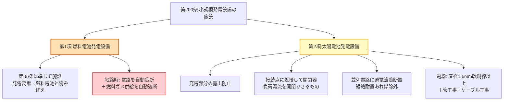

# 電技解釈 第200条 — 小規模発電設備の施設

!!! danger "条番号・主題の訂正（2026-06-12）— 本ページは「小規模発電設備の施設」へ全面改修"
    本ページは過去に主題が二転三転した経緯があります。最新の一次照合で実主題を確定し、全面改修しました。

    - **旧主題（誤り1）**: 初版v1.0は「小勢力回路の施設」と誤記。
    - **旧主題（誤り2）**: v2.0でkakomon.yml旧登録に基づき「太陽電池モジュールの絶縁性能」へ変更。しかしこの登録自体が誤りで、根拠2問（H28問6・R05上問4）はいずれも**第16条第5項からの出題**と判明（denken-ou一次照合・2026-06-11）。kakomon.ymlは同日`解釈第16条`へ訂正済み。太陽電池モジュールの**絶縁性能**は [第16条 — 機械器具等の絶縁性能](16.md) で学習してください。
    - **実主題（確定）**: 第200条 = **小規模発電設備の施設**（電技解釈 第5章第5節の単独条）。第1項が**燃料電池発電設備**、第2項が**太陽電池発電設備**の施設方法を規定します。経済産業省告示「電気設備の技術基準の解釈」の原文で逐語照合済み（2026-06-12照合・告示キャッシュ準拠）。これにより旧記事の `[要確認: 告示PDF取得不能]` フラグは**解除**しました。
    - **処遇**: 被リンク互換のためURL・ファイル名は維持します。

!!! warning "一次ソース確認のお願い"
    本ページは電気設備の技術基準の解釈（経済産業省告示）を学習用に整理したものです。電技解釈は e-Gov 法令検索に登録されていないため、本Wikiの品質保証は経産省告示原文キャッシュ＋過去問データベースへの照合に依存しています。**重要な実務判断や試験直前の最終確認は、必ず経産省公式の最新告示PDF（[電気設備の技術基準の解釈](https://www.meti.go.jp/policy/safety_security/industrial_safety/sangyo/electric/detail/setsubi_kijun.html)）に当たってください**。

!!! note "📊 概要"
    **出題頻度**: ★☆☆☆☆（第200条として現DB（H23〜R07下）に登録ゼロ。実績は pre-DB の H21問8 のみ）

    **重要度**: C（出題実績が希少。試験直結度は構造的に低い。施設方法の理解中心）

    **直近出題**: なし（実績は平成21年 問8「太陽電池発電所の施設」＝第200条第2項に対応する1件のみ）

> 第200条は **小規模発電設備**（燃料電池・太陽電池）を需要場所に施設するときの方法を定める。第1項は **燃料電池発電設備**（地絡時の電路遮断＋燃料ガス供給遮断）、第2項は **太陽電池発電設備**（充電部の露出防止・開閉器・過電流遮断器・電線の太さと工事方法）を規定する。施設方法の規定であり、試験頻度は低い。

| 項目 | 内容 |
|------|------|
| 条文 | 電気設備の技術基準の解釈 第200条 |
| 規定内容 | 小規模発電設備（燃料電池・太陽電池）の施設方法 |
| 性格 | 施設規定（施設方法・保護装置・工事方法を規定。耐電圧の数値規定ではない） |
| 上位（委任元） | 電技省令第4条（損傷防止）・第15条（地絡保護）・第59条第1項（電気使用場所の発電設備） |
| 構成 | 第1項＝燃料電池発電設備／第2項＝太陽電池発電設備 |
| 第1項の準用先 | 解釈第45条（発電機等の機械的強度・「発電要素」を「燃料電池」と読み替え） |
| 第2項の準用先 | 工事方法: 第158条（合成樹脂管）・第159条（金属管）・第160条（金属可とう電線管）・第164条（屋内ケーブル）・第166条第1項第七号（屋側屋外ケーブル） |
| **典拠（一次ソース）** | 電気設備の技術基準の解釈 第200条（経産省告示・e-Gov未登録）— 経産省告示原文キャッシュで逐語照合 |
| **照合日** | 2026-06-12（経産省告示原文で第1項・第2項を逐語確定） |
| **混同注意** | 本条＝小規模発電設備の**施設方法**／[第16条](16.md)＝機械器具等の**絶縁性能**（太陽電池モジュールの絶縁耐力は第16条第5項）。主題が別物 |

---

## 💡 5秒で思い出す

!!! tip "💡 5秒で思い出す（試験直前の最終確認）"
    - 第200条 = **小規模発電設備の施設**（第1項 燃料電池／第2項 太陽電池）
    - 第1項（燃料電池）: 第45条に準じて施設＋地絡時に **電路の自動遮断** と **燃料ガス供給の自動遮断**
    - 第2項（太陽電池）: **充電部分を露出させない**／負荷側の接続点に近接して **開閉器**／並列接続電路に **過電流遮断器**（短絡電流に耐えるなら除外）
    - 第2項の電線: **直径1.6mmの軟銅線** 又は同等以上。工事方法は合成樹脂管・金属管・金属可とう電線管・ケーブルのいずれか
    - 「太陽電池モジュールの**絶縁性能**（最大使用電圧の倍率・試験時間）」は第200条ではなく **[第16条第5項](16.md)**

??? question "セルフチェック: 第200条第1項（燃料電池）と第2項（太陽電池）で、保護の着眼点はどう違うか？"
    第1項（燃料電池）は **燃料ガスという可燃物** を扱うため、電気的な地絡保護に加えて **燃料ガス供給の自動遮断** まで要求する点が固有。電気事故が火災・爆発に直結しないよう、ガス側もセットで止める。第2項（太陽電池）は **昼間は止められない直流電源** が常時発電するため、**充電部の露出防止**（感電防止）と **接続点近接の開閉器・過電流遮断器**（区分開閉と短絡保護）が中心。発電源の性質（可燃物か／常時発電の直流か）が保護要件の違いを生む。

---

## 1. 全体像と要点

- **対象**: 需要場所に施設する **小規模発電設備**（燃料電池発電設備・太陽電池発電設備）
- **第1項（燃料電池）**: 第45条（発電機等の施設）に準じて施設し、地絡時に電路を自動遮断するとともに **燃料ガスの供給も自動遮断** する装置を施設
- **第2項（太陽電池）**: 充電部の露出防止／接続点近接の開閉器／並列電路の過電流遮断器／電線の太さ（直径1.6mm軟銅線以上）と工事方法（管工事・ケーブル工事）／接続の堅ろう性
- **性格**: 施設方法の規定。耐電圧試験の倍率・時間のような数値規定ではない（それは第16条）
- **設計思想**: 小規模でも発電設備は **常時または間欠的に電圧源** となるため、感電・火災・短絡・地絡を施設方法で予防する

??? question "セルフチェック: なぜ太陽電池発電設備の電路には「接続点に近接して」開閉器を置くのか？"
    太陽電池は **日射があれば常に発電する直流電源** であり、商用電源のように元から断つことができない。点検・故障時に発電側を切り離すには、負荷側電路の **接続点の近く** に区分用の開閉器（負荷電流を開閉できるもの）が要る。離れた位置だと、開閉器と接続点の間の電路が充電されたまま残り危険。近接配置で「切れば近傍まで無充電」を担保する。

---

## 2. 条文原文

??? note "📜 条文原文 — 経済産業省告示「電気設備の技術基準の解釈」第200条（逐語）"
    本ブロックは経済産業省告示原文キャッシュ（2026-06-12照合）からの逐語転記です。要約・解説は折り畳みの外（本文）に分離しています。

    **【小規模発電設備の施設】（省令第4条、第15条、第59条第1項）**

    > **第200条** 小規模発電設備である燃料電池発電設備は、次の各号によること。
    >
    > 一 第45条の規定に準じて施設すること。この場合において、同条第一号ロの規定における「発電要素」は「燃料電池」と読み替えるものとする。
    >
    > 二 燃料電池発電設備に接続する電路に地絡を生じたときに、電路を自動的に遮断し、燃料電池への燃料ガスの供給を自動的に遮断する装置を施設すること。
    >
    > **2** 小規模発電設備である太陽電池発電設備は、次の各号により施設すること。
    >
    > 一 太陽電池モジュール、電線及び開閉器その他の器具は、次の各号によること。
    >
    > 　イ 充電部分が露出しないように施設すること。
    >
    > 　ロ 太陽電池モジュールに接続する負荷側の電路（複数の太陽電池モジュールを施設する場合にあっては、その集合体に接続する負荷側の電路）には、その接続点に近接して開閉器その他これに類する器具（負荷電流を開閉できるものに限る。）を施設すること。
    >
    > 　ハ 太陽電池モジュールを並列に接続する電路には、その電路に短絡を生じた場合に電路を保護する過電流遮断器その他の器具を施設すること。ただし、当該電路が短絡電流に耐えるものである場合は、この限りでない。（関連省令第14条）
    >
    > 　ニ 電線は、次によること。ただし、機械器具の構造上その内部に安全に施設できる場合は、この限りでない。
    >
    > 　　(イ) 電線は、直径1.6mmの軟銅線又はこれと同等以上の強さ及び太さのものであること。（関連省令第6条）
    >
    > 　　(ロ) 次のいずれかにより施設すること。
    >
    > 　　　(1) 合成樹脂管工事により、第158条の規定に準じて施設すること。
    >
    > 　　　(2) 金属管工事により、第159条の規定に準じて施設すること。
    >
    > 　　　(3) 金属可とう電線管工事により、第160条の規定に準じて施設すること。
    >
    > 　　　(4) ケーブル工事により、屋内に施設する場合にあっては第164条の規定に、屋側又は屋外に施設する場合にあっては第166条第1項第七号の規定に準じて施設すること。
    >
    > 　　(ハ) 第145条第2項並びに第167条第2項及び第3項の規定に準じて施設すること。
    >
    > 　ホ 太陽電池モジュール及び開閉器その他の器具に電線を接続する場合は、ねじ止めその他の方法により、堅ろうに、かつ、電気的に完全に接続するとともに、接続点に張力が加わらないようにすること。（関連省令第7条）

**要約（教育目的・原文は上の折り畳み）**: 第1項は燃料電池発電設備について「第45条に準じた施設」＋「地絡時の電路自動遮断＆燃料ガス供給自動遮断」。第2項は太陽電池発電設備について「充電部の露出防止／接続点近接の開閉器／並列電路の過電流遮断器（短絡耐量があれば除外）／電線は直径1.6mm軟銅線以上＋管工事・ケーブル工事／接続は堅ろうかつ張力をかけない」。

---

## 3. 原文解析（ブロック分解）

### 第1項（燃料電池発電設備）

| 原文ブロック | 意味 | 試験のポイント |
|---|---|---|
| 「第45条の規定に準じて施設」 | 発電機等の施設基準を準用（「発電要素」→「燃料電池」と読み替え） | 準用条文（第45条）と読み替え語に注意 |
| 「地絡を生じたときに、電路を自動的に遮断し」 | 地絡時の電路自動遮断 | 一般の地絡保護と同趣旨 |
| 「燃料電池への燃料ガスの供給を自動的に遮断」 | **ガス供給の自動遮断**（燃料電池固有） | 電気の遮断だけでなく **ガスも止める** のが固有点 |

### 第2項（太陽電池発電設備）

| 原文ブロック | 意味 | 試験のポイント |
|---|---|---|
| 「充電部分が露出しないように施設」 | 感電防止（充電部の露出禁止） | 直流の常時発電源ゆえ重要 |
| 「接続点に近接して開閉器…（負荷電流を開閉できるものに限る）」 | 区分用開閉器を接続点の近くに | 「近接して」「負荷電流を開閉できる」が要件 |
| 「並列に接続する電路には…過電流遮断器…ただし短絡電流に耐えるものは除外」 | 短絡保護の過電流遮断器（ただし書きで除外あり） | **ただし書き**（短絡耐量があれば不要）を読み落とさない |
| 「直径1.6mmの軟銅線又はこれと同等以上」 | 電線の最小太さ | 数値「1.6mm」「軟銅線」 |
| 「合成樹脂管／金属管／金属可とう電線管／ケーブル工事」 | 工事方法の選択肢（準用先あり） | 第158・159・160・164・166条の準用 |
| 「ねじ止めその他…堅ろうに、かつ、電気的に完全に接続…張力が加わらない」 | 接続の堅ろう性・張力禁止 | 接続部の機械的・電気的健全性 |

---

## 4. かみ砕き解説（因果理解）

### なぜ燃料電池は「燃料ガスも遮断」するのか

燃料電池発電設備は **燃料ガス（水素・都市ガス改質等）** を電気に変換する。電路に地絡が生じたとき、電気だけ止めても **改質器や配管に燃料ガスが供給され続ける** と、火災・ガス漏れのリスクが残る。そこで第1項第二号は「電路の自動遮断」と「**燃料ガス供給の自動遮断**」をセットで要求する。電気事故が **可燃物事故** に波及しないようにする因果設計。なお発電設備本体の機械的強度等は第45条（発電機等の施設）を準用し、「発電要素」を「燃料電池」と読み替えて適用する。

### なぜ太陽電池は「充電部露出禁止＋近接開閉器＋過電流遮断器」なのか

太陽電池は **日射がある限り発電を止められない直流電源**。商用交流のように元から断てないため、施設方法で危険を抑える。

1. **充電部分の露出防止** … 直流の常時発電源は触れれば感電。露出させない。
2. **接続点に近接した開閉器** … 点検・故障時に発電側を区分するため。離れていると開閉器〜接続点間が充電されたまま残る。「負荷電流を開閉できるもの」に限るのは、通電中に安全に切れる必要があるため。
3. **並列電路の過電流遮断器** … 複数モジュールを並列接続すると、1回路の短絡時に他の健全回路から短絡電流が流れ込む。これを遮断して電路を保護する。ただし電路自体が **短絡電流に耐える** なら不要（ただし書き）。
4. **電線の太さ（直径1.6mm軟銅線以上）と工事方法** … 機械的損傷・劣化を防ぐため最小太さと管・ケーブル工事を規定。

---

## 5. 図で理解

### 第200条の構成（第1項 燃料電池／第2項 太陽電池）

**読み解き**: 第200条は1条のなかに **燃料電池（第1項）** と **太陽電池（第2項）** の2系統を持つ。燃料電池側は「電気＋ガスの二重遮断」、太陽電池側は「露出防止・開閉器・過電流遮断器・電線」の施設要件が核心。

### 太陽電池発電設備の施設イメージ（第2項）

<svg viewBox="0 0 780 280" xmlns="http://www.w3.org/2000/svg" width="100%" preserveAspectRatio="xMidYMid meet">
<defs>
<filter id="sh200pv" x="-20%" y="-20%" width="140%" height="140%"><feDropShadow dx="0" dy="2" stdDeviation="2" flood-opacity="0.15"/></filter>
<marker id="arr200" markerWidth="10" markerHeight="10" refX="9" refY="3" orient="auto"><path d="M0,0 L0,6 L9,3 z" fill="#424242"/></marker>
</defs>
<text x="390" y="24" text-anchor="middle" font-size="15" font-weight="700" fill="#212121">太陽電池発電設備の施設（第200条第2項）</text>
<text x="390" y="42" text-anchor="middle" font-size="11" fill="#666">充電部露出防止・接続点近接の開閉器・並列電路の過電流遮断器</text>
<rect x="40" y="80" width="150" height="100" rx="10" fill="#fff9c4" stroke="#f9a825" stroke-width="2.5" filter="url(#sh200pv)"/>
<text x="115" y="112" text-anchor="middle" font-size="12" font-weight="700" fill="#f57f17">太陽電池モジュール</text>
<text x="115" y="134" text-anchor="middle" font-size="10" fill="#f57f17">直流・常時発電</text>
<text x="115" y="156" text-anchor="middle" font-size="10" fill="#666">充電部は露出禁止</text>
<line x1="190" y1="120" x2="270" y2="120" stroke="#424242" stroke-width="2" marker-end="url(#arr200)"/>
<rect x="270" y="92" width="80" height="56" rx="8" fill="#ffebee" stroke="#c62828" stroke-width="2.5" filter="url(#sh200pv)"/>
<text x="310" y="116" text-anchor="middle" font-size="10" font-weight="700" fill="#b71c1c">過電流</text>
<text x="310" y="132" text-anchor="middle" font-size="10" fill="#b71c1c">遮断器</text>
<text x="310" y="166" text-anchor="middle" font-size="9" fill="#c62828">並列電路の短絡保護</text>
<line x1="350" y1="120" x2="430" y2="120" stroke="#424242" stroke-width="2" marker-end="url(#arr200)"/>
<circle cx="455" cy="120" r="9" fill="#fff" stroke="#1565c0" stroke-width="2.5"/>
<text x="455" y="96" text-anchor="middle" font-size="10" font-weight="700" fill="#0d47a1">開閉器</text>
<text x="455" y="170" text-anchor="middle" font-size="9" fill="#1565c0">接続点に近接</text>
<line x1="464" y1="120" x2="560" y2="120" stroke="#424242" stroke-width="2" marker-end="url(#arr200)"/>
<circle cx="585" cy="120" r="7" fill="#fff" stroke="#e65100" stroke-width="2.5"/>
<text x="585" y="98" text-anchor="middle" font-size="9" font-weight="700" fill="#e65100">接続点</text>
<line x1="592" y1="120" x2="660" y2="120" stroke="#424242" stroke-width="2" marker-end="url(#arr200)"/>
<rect x="660" y="92" width="90" height="56" rx="8" fill="#e3f2fd" stroke="#1565c0" stroke-width="2" filter="url(#sh200pv)"/>
<text x="705" y="116" text-anchor="middle" font-size="11" font-weight="700" fill="#0d47a1">負荷側電路</text>
<text x="705" y="134" text-anchor="middle" font-size="9" fill="#1565c0">（構内）</text>
<rect x="40" y="210" width="710" height="50" rx="8" fill="#f1f8e9" stroke="#558b2f" stroke-width="1.5"/>
<text x="395" y="232" text-anchor="middle" font-size="11" fill="#33691e">電線は直径1.6mmの軟銅線以上 ＋ 合成樹脂管／金属管／金属可とう電線管／ケーブル工事のいずれか</text>
<text x="395" y="250" text-anchor="middle" font-size="10" fill="#558b2f">接続はねじ止め等で堅ろう・電気的に完全に・接続点に張力をかけない</text>
</svg>

**読み解き**: モジュール → 過電流遮断器（並列電路の短絡保護）→ 接続点近接の開閉器 → 負荷側電路、という動線で施設要件が並ぶ。充電部は露出させず、電線は最小太さ・指定工事方法で施工する。

---

## 6. 試験で問われること

### 過去問チャレンジ（穴埋）

!!! abstract "穴埋め例題（H21問8「太陽電池発電所の施設」＝第200条第2項に対応・改変あり再構成）"
    小規模発電設備である太陽電池発電設備は、太陽電池モジュールに接続する負荷側の電路には、その接続点に（　ア　）して開閉器その他これに類する器具（負荷電流を開閉できるものに限る。）を施設すること。また、太陽電池モジュールを並列に接続する電路には、その電路に短絡を生じた場合に電路を保護する（　イ　）その他の器具を施設すること。電線は、直径（　ウ　）mmの軟銅線又はこれと同等以上の強さ及び太さのものであること。

    （出典: [denken-ou.com H21問8解説](https://denken-ou.com/houkih21-8/)）

??? success "解答を見る"
    - ア = **近接**
    - イ = **過電流遮断器**
    - ウ = **1.6**

    **改変あり**（H21問8 を題材に、第200条第2項の条文文言を穴埋め化した再構成。実出題そのものの逐語ではない）。

### ✅ 数値検証 PASS（一次ソース照合済 2026-06-12）

**数値検証 PASS** — 本記事に記載した第200条の規定値・キーワードを、経済産業省告示原文キャッシュ（2026-06-12照合）と逐語照合した結果、すべて原文通り。

| 値・規定語 | 出典条項 | 一次ソース該当箇所 |
|---|---|---|
| 燃料ガス供給の自動遮断 | 第200条第1項第二号 | 「電路を自動的に遮断し、燃料電池への燃料ガスの供給を自動的に遮断する装置を施設」 |
| 第45条を準用（発電要素→燃料電池） | 第200条第1項第一号 | 「第45条の規定に準じて施設…『発電要素』は『燃料電池』と読み替える」 |
| 接続点に近接して開閉器 | 第200条第2項第一号ロ | 「その接続点に近接して開閉器その他これに類する器具（負荷電流を開閉できるものに限る。）」 |
| 並列電路に過電流遮断器（短絡耐量あれば除外） | 第200条第2項第一号ハ | 「過電流遮断器その他の器具を施設…ただし、当該電路が短絡電流に耐えるものである場合は、この限りでない」 |
| 直径1.6mmの軟銅線（電線の最小太さ） | 第200条第2項第一号ニ(イ) | 「直径1.6mmの軟銅線又はこれと同等以上の強さ及び太さのもの」 |

### 📝 出題実績まとめ（改変明記）

| 年度 | 問 | 形式 | 論点 | 出典 |
|------|-----|------|------|------|
| H21 | 問8 | 穴埋 | 太陽電池発電所の施設（第200条第2項に対応） | [houkih21-8](https://denken-ou.com/houkih21-8/) |

**改変明記**: 上の穴埋め例題は H21問8 を題材に第200条第2項の条文を穴埋め化した **改変あり** の再構成です。H21問8 は現過去問DB（kakomon.yml・H23〜）の範囲外（pre-DB）のため、DB登録はありません。

!!! warning "「H30問2 は第200条の再出題」は誤り"
    一部の年度ページに H21問8 の「再出題（H30問2）」という記載がありますが、これは **誤り**です。H30問2 は「太陽電池発電所等の設置に係る **電気事業法** の取扱い」（事業法第38条・論説）であり、第200条の施設規定とは別物です。「太陽電池発電所」という語の一致による混同で、本ページの過去問実績に H30問2 は **含めません**。

---

## 7. 頻出ひっかけ / 落とし穴

各項目の先頭の `[①〜⑥]` は弱点カテゴリ（②主語対象／⑥例外除外）を示します。

### 🔴 致命的（これを間違えたら即失点）

1. ❌ **[②主語]**「第200条は太陽電池モジュールの**絶縁性能**（最大使用電圧の倍率・試験時間）を定める」
    - → ✅ 第200条は **施設方法**（露出防止・開閉器・過電流遮断器・電線）の規定。**絶縁性能**は [第16条第5項](16.md) の所管。主題が別物
2. ❌ **[②主語]**「燃料電池の地絡時は電路を遮断すれば足りる」
    - → ✅ 電路の自動遮断に加えて **燃料ガスの供給も自動遮断** する装置が必要（第1項第二号）

### 🟡 注意（混同・誤読しやすい）

1. ❌ **[⑥例外]**「太陽電池の並列接続電路には**常に**過電流遮断器が必要」
    - → ✅ 「ただし、当該電路が **短絡電流に耐えるもの** である場合は、この限りでない」（第2項第一号ハのただし書き）。除外条件を読み落とさない

### 🟢 軽度（実務で気づけば足りる）

1. ❌ **[⑥例外]**「太陽電池の電線は直径1.6mm軟銅線でなければならない」
    - → ✅ 「直径1.6mmの軟銅線 **又はこれと同等以上** の強さ及び太さ」。1.6mmは下限で、同等以上なら可。なお「機械器具の構造上その内部に安全に施設できる場合」はこの限りでない

---

## 8. まぎらわしい選択肢と正解の違い

| 誤った記述 | 正しい記述 | なぜ違うか |
|--------|--------|------|
| 第200条 = 太陽電池モジュールの絶縁性能 | 第200条 = 小規模発電設備の施設 | 絶縁性能は第16条第5項。主題の取り違え |
| 燃料電池の地絡時は電路のみ遮断 | 電路＋**燃料ガス供給**を自動遮断 | 可燃物（燃料ガス）事故への波及防止が固有要件 |
| 開閉器は接続点から離して施設 | 接続点に **近接** して施設 | 離すと開閉器〜接続点間が充電のまま残る |
| 並列電路は常に過電流遮断器が必要 | 短絡電流に耐えるなら **不要**（ただし書き） | 第2項第一号ハの除外条件 |

---

## 9. 関連条文・関連ページ

**準用先（第200条が準じて施設する条文）**

- [第45条 — 燃料電池等の施設](45.md)（第1項第一号が準用。「発電要素」を「燃料電池」と読み替え）
- [第46条 — 太陽電池発電所等の電線等の施設](46.md)（第2項の太陽電池発電設備の電線・支持物に対応する一般条）
- 第158条（合成樹脂管工事）・[第159条（金属管工事）](159.md)・第160条（金属可とう電線管工事）・[第164条（屋内ケーブル工事）](164.md)・第166条第1項第七号（屋側屋外ケーブル工事）— 第2項の電線工事方法の準用先

**主題が紛らわしい条文**

- [第16条 — 機械器具等の絶縁性能](16.md) — 太陽電池モジュールの**絶縁性能**（最大使用電圧の倍率・試験時間）はこちら。本条（施設方法）とは別

**分散型電源の系統連系（小規模発電の連系側）**

- [第220条（用語の定義）](220.md)・[第226条（低圧連系の施設要件）](226.md)・[第227条（低圧連系の保護装置）](227.md)・[第228条（高圧連系の施設要件）](228.md)・[第229条（高圧連系の保護装置）](229.md) — 小規模発電設備を商用系統へ連系する場合の要件

**上位（委任元）**

- 電技省令第4条（電気設備の損傷防止）／第15条（地絡に対する保護対策）／第59条第1項（電気使用場所に施設する発電設備）

---

## 10. 過去問実績

過去14年（H23〜R07下）の現過去問DB（kakomon.yml）には第200条の登録は **ゼロ**。pre-DB（H18〜H22）に1件のみ。

| 年度 | 問 | 形式 | 論点 | 備考 |
|------|-----|------|------|------|
| H21 | 問8 | 穴埋 | 太陽電池発電所の施設（第200条第2項に対応） | pre-DB（kakomon.yml未登録）。「再出題（H30問2）」の記載は誤り（H30問2は事業法第38条） |

!!! note "出題傾向"
    第200条は施設方法の規定で、現DB期間（H23〜R07下）では出題実績がない。試験直結度は構造的に低い。太陽電池モジュールの**絶縁性能**（最大使用電圧の倍率・試験時間）の出題は [第16条](16.md) を、分散型電源の **系統連系** の出題は [第226条](226.md)〜[第229条](229.md) を参照のこと。

!!! note "R08 出題予測"
    小規模太陽光・燃料電池の普及で施設規定への関心は高いが、本条そのものの穴埋め出題頻度は低位推移と想定。出題されるなら第2項（接続点近接の開閉器・並列電路の過電流遮断器・電線の太さ）が狙われやすい。

---

## 11. 用語集

| 用語 | 読み | 意味 | 試験での注意点 |
|------|------|------|----------------|
| 小規模発電設備 | しょうきぼはつでんせつび | 需要場所に施設する小規模の発電設備（燃料電池・太陽電池等） | 第200条は燃料電池（第1項）と太陽電池（第2項）を規定 |
| 燃料電池発電設備 | ねんりょうでんちはつでんせつび | 燃料ガスを電気に変換する発電設備 | 地絡時は電路＋燃料ガス供給を自動遮断 |
| 太陽電池モジュール | たいようでんち—— | 太陽電池セルを直列接続して1枚にしたパネル | 第200条は **施設方法**／絶縁性能は第16条第5項 |
| 接続点 | せつぞくてん | 太陽電池の負荷側電路がつながる点 | 開閉器はこの点に **近接** して施設 |
| 過電流遮断器 | かでんりゅうしゃだんき | 過電流（短絡含む）を検出して電路を遮断する器具 | 並列電路の短絡保護。短絡耐量があればただし書きで除外 |

### 3列翻訳テーブル — 日常語 ⇆ 法規表現 ⇆ 試験での意味

| 日常語・言い換え | 法規表現（条文上の語） | 試験での意味・ひっかけ |
|--------|--------------------|----------------------|
| 燃料電池のガスを止める仕組み | 燃料ガスの供給を自動的に遮断する装置 | 電路遮断だけでは不足（燃料電池固有要件） |
| パネルのすぐ近くのスイッチ | 接続点に近接して施設する開閉器 | 「近接」が要件。離して置くと不可 |
| 短絡を守るブレーカー | 過電流遮断器 | 並列電路の短絡保護。短絡耐量があれば不要（除外） |
| パネル本体の絶縁の良し悪し | （第16条の）絶縁性能 | 第200条ではない。主題の取り違えに注意 |

---

## 12. 最終チェック

### 主題理解

- [ ] 第200条 = **小規模発電設備の施設**（第1項 燃料電池／第2項 太陽電池）
- [ ] 太陽電池モジュールの **絶縁性能** は第200条ではなく [第16条第5項](16.md)
- [ ] 施設方法の規定であり、耐電圧試験の倍率・時間のような数値規定ではない

### 第1項（燃料電池）

- [ ] 第45条に準じて施設（「発電要素」→「燃料電池」と読み替え）
- [ ] 地絡時に **電路の自動遮断** ＋ **燃料ガス供給の自動遮断**

### 第2項（太陽電池）

- [ ] 充電部分の **露出防止**
- [ ] 負荷側電路の接続点に **近接** して開閉器（負荷電流を開閉できるもの）
- [ ] 並列電路に **過電流遮断器**（短絡電流に耐えるなら除外＝ただし書き）
- [ ] 電線は **直径1.6mmの軟銅線** 又は同等以上＋管工事・ケーブル工事

### ひっかけ対策

- [ ] 「H30問2 は第200条の再出題」は誤り（H30問2は事業法第38条）
- [ ] 並列電路の過電流遮断器の **ただし書き**（短絡耐量）を読み落とさない

---

## 監修ログ

- **2026-04-20 v1.0**: 初版作成（主題を「小勢力回路の施設」と誤記）。
- **2026-05-10 v2.0**: kakomon.yml旧登録に基づき主題を「太陽電池モジュールの絶縁性能」へ変更（経産省PDF未取得のため数値は要再確認フラグ付き）。
- **2026-06-11 v2.1**: 根拠2問（H28問6・R05上問4）を denken-ou 一次照合した結果いずれも **第16条第5項** からの出題と判明。kakomon.yml を `解釈第16条` へ訂正し、出題実績を [16.md](16.md) へ再帰属。
- **2026-06-12 v3.0 実主題へ全面改修**: 経済産業省告示「電気設備の技術基準の解釈」原文（告示キャッシュ・2026-06-12照合）で第200条を逐語確定。実主題＝**小規模発電設備の施設**（第1項 燃料電池発電設備／第2項 太陽電池発電設備）と確定し、旧版の絶縁試験（第16条の内容）を全除去して施設方法に置換。`[要確認: 告示PDF取得不能]` フラグを解除。過去問実績を H21問8（pre-DB・第200条第2項に対応）のみとし、誤った「H30問2 再出題」記載を除去（H30問2は事業法第38条）。被リンク互換のためURL・ファイル名は維持。

---

*最終確認: 2026-06-12 ｜ ステータス: v3.0（実主題=小規模発電設備の施設へ全面改修・METI告示一次確定） ｜ 条文番号: ✅ 第200条 確定（小規模発電設備の施設） ｜ 出題実績: ★☆☆☆☆（現DB登録ゼロ・pre-DB H21問8 のみ） ｜ 数値根拠: ✅ 数値検証 PASS（経産省告示原文・2026-06-12照合） ｜ テンプレ世代: v2.7準拠（重要度C相応に比例的構成） ｜ [バージョニング基準](../../reference/versioning.md)*
