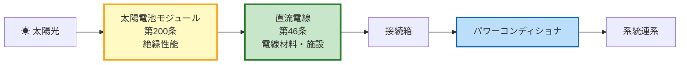

# 電技解釈 第200条 — 太陽電池モジュールの絶縁性能

!!! danger "⚠️ 条番号誤記の訂正（2026-06-11）— 本ページの主題の正しい条番号は第16条第5項"
    - **本ページの旧主題**: 「太陽電池モジュールの絶縁性能」を解釈第200条として解説（kakomon.yml の旧登録 `解釈§200` に基づく）
    - **一次照合の結果**: 根拠とされた出題2問は、denken-ou がいずれも**「電気設備の技術基準の解釈第16条からの出題」と明記**（[houkih28-6](https://denken-ou.com/houkih28-6/)／[houkir5-1-4](https://denken-ou.com/houkir5-1-4/)・2026-06-11 照合）。空欄の正解（1倍／1.5倍／10分間）はすべて**第16条第5項第一号**由来。kakomon.yml は同日 `解釈§16` へ訂正済み
    - **学習者へ**: 太陽電池モジュールの絶縁性能は **[第16条 — 機械器具等の絶縁性能](16.md) で学習すること**。本ページの数値解説は第16条第5項の内容として概ね対応するが、条番号の照合源を失っている
    - **第200条の実際の主題**: [要確認]（経産省告示原文は未照合。旧版v1.0が「小勢力回路」と誤記 → v2.0 で kakomon.yml に基づき「太陽電池」へ変更 → その登録自体が誤りと判明、という経緯）
    - **本ページの処遇**: 第16条への統合・リネームは別タスクで実施予定。被リンク互換のため URL は当面維持

!!! warning "📜 一次ソース確認のお願い（2026-05-10）"
    本ページは電気設備の技術基準の解釈（経済産業省告示）を学習用に整理したものです。電技解釈は eGov 法令API に登録されておらず、執筆時点で経産省公式PDFも WebFetch / curl 双方で取得不可でした。本Wikiの品質保証は **kakomon.yml への照合（H28問6・R05上問4 の2件で「太陽電池モジュールの絶縁性能」を主題と確定）** と学習教材の解説に依存しています。**重要な実務判断や試験直前の最終確認は、必ず経産省公式の最新告示PDF（[電気設備の技術基準の解釈](https://www.meti.go.jp/policy/safety_security/industrial_safety/sangyo/electric/detail/setsubi_kijun.html)）に当たってください**。

!!! warning "🔧 Phase D 緊急修正の補足（2026-05-10）"
    本ページは Phase C-g6 監査で **旧版が「小勢力回路」として誤記されていた** ことが判明し、kakomon.yml ベースで全面書き直しした版です。旧版の「小勢力回路」（電圧60V以下・電流1A以下・絶縁変圧器）は **解釈第200条の主題ではありません**（真の主題は太陽電池モジュールの絶縁性能）。なお「小勢力回路」自体の正しい条文番号は本Wikiでは未確定（解釈第181条周辺の可能性）。**主題の確度は kakomon.yml ベースで高いものの、試験電圧倍率・絶縁抵抗値・試験時間の細部は要再確認**。経産省PDF未照合のため `要再確認` フラグを付した数値は学習教材レベルの参考値です。

!!! note "📊 概要"
    **出題頻度**: ─（第200条としての出題実績なし — 冒頭の訂正注記参照）

    **重要度**: C（参考。学習は [第16条](16.md) で）

    **直近出題**: なし（旧掲載の R05上 問4／H28 問6 は第16条第5項の出題と確認され [16.md](16.md) へ再帰属）

> 太陽電池モジュールは、その ==**最大使用電圧**== の一定倍率の試験電圧を一定時間印加して絶縁耐力を確認するか、または規定の絶縁抵抗値を満たすことが求められる。太陽光発電設備固有の **直流回路** という特性に対応した絶縁性能基準条文。

| 項目 | 内容 |
|------|------|
| 条文 | 電気設備の技術基準の解釈 第200条 |
| 規定内容 | 太陽電池モジュールの絶縁性能（試験電圧・試験時間・絶縁抵抗値） |
| 性格 | 数値規定（耐電圧試験 + 絶縁抵抗値の代替手段） |
| 上位 | 省令第5条（電路の絶縁原則） |
| 関連 | 解釈第46条（太陽電池発電所の電線等）— H28 問6 で複合出題 |
| **典拠（一次ソース）** | 電気設備の技術基準の解釈 第200条（経産省告示・eGov未登録） ※経産省PDF未照合のため細部数値は **kakomon.yml + 学習教材ベース** |
| **照合日** | 2026-05-10（kakomon.yml 第200条 の出題2件で主題のみ確定）→ **2026-06-11 denken-ou 一次照合で当該2問は第16条と判明**（冒頭の訂正注記参照） |
| **要再確認** | 経産省PDF未照合・kakomon.yml ベースで主題のみ確定。試験電圧倍率・絶縁抵抗値の正確な閾値は経産省告示原文での再照合が必要 |
| **隣接条文** | ← 解釈第46条（太陽電池発電所の電線等・記事未作成） |

---

## 💡 5秒で思い出す

!!! tip "💡 5秒で思い出す（試験直前の最終確認）"
    - 解釈第200条 = **太陽電池モジュールの絶縁性能** 規定（直流回路特有）
    - 試験電圧 = **最大使用電圧の1.5倍**（学習教材ベース・要再確認）
    - 試験時間 = **連続10分間** または絶縁抵抗値で代替（学習教材ベース・要再確認）
    - H28問6 では **解釈第46条（太陽電池発電所の電線）と複合出題**
    - R05上問4 は **第200条単独**で太陽電池モジュール絶縁性能を問う
    - 直流回路ゆえ低圧電路（省令第58条）とは別系統の判定基準

??? question "セルフチェック: なぜ太陽電池モジュールに専用の絶縁性能条文が必要か？"
    太陽電池は **直流発電** であり、低圧電路（省令第58条）が想定する交流系の絶縁判定基準（0.1／0.2／0.4MΩ 段階表）が直接適用しにくい。また、モジュール内部のセル直列構成により **最大使用電圧（開放電圧×直列数）** が運用条件で変動する。よって専用の試験電圧倍率と絶縁抵抗値を解釈第200条で別途規定している。

---

## 1. 全体像と要点

- **対象**: 太陽電池モジュール（発電設備の核心部品）の絶縁性能
- **試験電圧**: 学習教材では **最大使用電圧の1.5倍** が標準とされる（要再確認 経産省告示原文）
- **試験時間**: 学習教材では **連続10分間** が標準とされる（要再確認）
- **代替手段**: 試験電圧の代わりに **規定の絶縁抵抗値**（1MΩ等）を満たせば足りるとする学習教材記述あり（要再確認）
- **複合論点**: 解釈第46条（太陽電池発電所の電線・接続箱・パワコン側配線）とセット出題されやすい（H28問6 実例）
- **設計思想**: 直流系特有の **「漏れ電流での感電・火災・モジュール破損」** を予防するため

??? question "セルフチェック: H28問6 で第200条と第46条が複合出題された理由は？"
    第200条は **モジュール本体の絶縁性能**、第46条は **モジュール周辺の電線・配線材料** を規定。実務で太陽光発電所を施工・検査するときは「モジュール → 接続箱 → パワコン」の一連の絶縁を一体評価する。試験ではこの実務目線で2条文を組み合わせた穴埋めが構成された。

---

## 2. 条文原文

!!! warning "要再確認 経産省PDF原文未照合"
    経産省PDFが WebFetch / curl 双方で取得不可のため、本セクションは **学習教材レベルの記述** に留める。原文確認後にこのプレースホルダを置き換えること。

**電気設備の技術基準の解釈 第200条（太陽電池モジュールの絶縁性能）** [要確認: 経産省告示原文]

> 太陽電池モジュールは、最大使用電圧の **1.5倍** の直流電圧又は **1倍** の交流電圧（500Vを下回る場合は500V）を充電部分と大地との間に連続して **10分間** 加えたとき、これに耐える性能を有すること。 [要確認: 学習教材ベース・経産省告示原文での再照合必須]

> 又は、絶縁抵抗が **[要確認: 1MΩ等の規定値]** 以上であれば、上記試験を行ったものとみなすことができる。 要再確認

### 過去問で問われた箇所

第200条は過去14年で計2回出題。穴埋め問題ではキーワードが空欄になる。

| 出題で狙われるキーワード | 過去問での扱い |
|---|---|
| **最大使用電圧** | 試験電圧の基準値として穴埋め |
| **1.5倍** | 直流試験電圧の倍率（要再確認） |
| **10分間** | 試験時間（要再確認） |
| **絶縁抵抗** | 代替手段として穴埋め |
| **太陽電池モジュール** | 適用対象として穴埋め |

---

## 3. 原文解析（ブロック分解）

| 原文ブロック | 意味 | 試験のポイント |
|---|---|---|
| 「太陽電池モジュールは」 | 適用対象＝**モジュール本体**（架台・配線は別条文） | 解釈第46条との棲み分け |
| 「最大使用電圧の1.5倍の直流電圧」 要再確認 | 試験電圧の倍率（直流系） | 「使用電圧」と「最大使用電圧」の違いに注意 |
| 「連続して10分間加えたとき」 要再確認 | 試験時間 | 低圧電路の絶縁抵抗測定（1分以上）と混同しない |
| 「絶縁抵抗が規定値以上」 要再確認 | **代替手段** | 省令第58条と類似の代替構造（耐圧試験の省略） |

---

## 4. かみ砕き解説（因果理解）

### なぜ太陽電池モジュールに専用条文が必要か

太陽光発電は **直流発電** であり、家庭用配線（交流100/200V）が前提の省令第58条の3段階基準値（0.1／0.2／0.4 MΩ）がそのままでは適用しにくい。さらに、モジュール内部はセルが直列接続されており、開放電圧 × 直列数で **最大使用電圧** が決まる（運用条件で変動）。

このため、解釈第200条は：

1. **直流の試験電圧** で耐電圧試験を行う（実際の運用電圧に近い条件）
2. **最大使用電圧の倍率** で試験電圧を決める（モジュール仕様に応じて変動）
3. **絶縁抵抗値での代替** を許容（実務的な検査効率）

という **直流発電設備固有の絶縁判定フレーム** を提供する。

### 解釈第46条との連携（H28問6 の複合論点）

H28問6 では第200条と第46条がセット出題された。これは実務で太陽光発電所を建設・点検するときの自然な視点：

- **第200条**: モジュール本体（PV パネル）の絶縁性能
- **第46条**: モジュールから接続箱・パワコンへの **電線・配線材料** の規定

施工現場では「モジュール → 接続箱 → パワコン → 系統連系」の一連の絶縁を一括評価するため、両条文の知識が同時に問われる。

---

## 5. 図で理解

### 解釈第200条 と 解釈第46条 の棲み分け

**読み解き**: 第200条は **モジュール本体**、第46条は **モジュール出力側の直流配線** を担当。H28問6 の複合出題はこの実務動線をなぞった構成。

### 試験電圧の概念図 要再確認

<svg viewBox="0 0 760 280" xmlns="http://www.w3.org/2000/svg" width="100%" preserveAspectRatio="xMidYMid meet">
<defs>
<filter id="shPV200" x="-20%" y="-20%" width="140%" height="140%"><feDropShadow dx="0" dy="2" stdDeviation="2" flood-opacity="0.15"/></filter>
</defs>
<text x="380" y="26" text-anchor="middle" font-size="15" font-weight="700" fill="#212121">太陽電池モジュール 絶縁試験の概念 要再確認</text>
<text x="380" y="44" text-anchor="middle" font-size="11" fill="#666">最大使用電圧の1.5倍を10分間印加（学習教材ベース）</text>
<rect x="60" y="80" width="200" height="120" rx="10" fill="#fff9c4" stroke="#f9a825" stroke-width="2.5" filter="url(#shPV200)"/>
<text x="160" y="110" text-anchor="middle" font-size="13" font-weight="700" fill="#f57f17">太陽電池モジュール</text>
<text x="160" y="135" text-anchor="middle" font-size="11" fill="#f57f17">最大使用電圧 V_max</text>
<text x="160" y="158" text-anchor="middle" font-size="10" fill="#f57f17">（開放電圧 × 直列数）</text>
<text x="160" y="180" text-anchor="middle" font-size="10" fill="#666">DC system</text>
<line x1="270" y1="140" x2="380" y2="140" stroke="#0d47a1" stroke-width="2" marker-end="url(#arrowPV200)"/>
<defs>
<marker id="arrowPV200" markerWidth="10" markerHeight="10" refX="9" refY="3" orient="auto">
<path d="M0,0 L0,6 L9,3 z" fill="#0d47a1"/>
</marker>
</defs>
<text x="325" y="132" text-anchor="middle" font-size="10" fill="#0d47a1">試験電圧印加</text>
<rect x="390" y="80" width="280" height="120" rx="10" fill="#ffebee" stroke="#c62828" stroke-width="2.5" filter="url(#shPV200)"/>
<text x="530" y="108" text-anchor="middle" font-size="13" font-weight="700" fill="#b71c1c">耐電圧試験 要再確認</text>
<text x="530" y="132" text-anchor="middle" font-size="12" fill="#b71c1c">DC <tspan font-weight="800">V_max × 1.5</tspan></text>
<text x="530" y="155" text-anchor="middle" font-size="11" fill="#b71c1c">連続 <tspan font-weight="800">10分間</tspan></text>
<text x="530" y="180" text-anchor="middle" font-size="10" fill="#b71c1c">充電部分 ↔ 大地間</text>
<rect x="60" y="220" width="610" height="44" rx="8" fill="#e3f2fd" stroke="#0d47a1" stroke-width="1.5"/>
<text x="365" y="244" text-anchor="middle" font-size="11" fill="#0d47a1">代替手段: 絶縁抵抗値（規定値以上）を満たせば耐電圧試験を省略可 要再確認</text>
</svg>

**読み解き**: 試験電圧は **直流の最大使用電圧 × 1.5倍** を **10分間** 印加して耐えることを求める（学習教材ベース・要再確認）。耐電圧試験が困難な場合は規定の絶縁抵抗値で代替可能。

---

## 6. 試験で問われること

### 過去問チャレンジ（穴埋）

!!! abstract "穴埋め例題（H28問6 ／ R05上問4 を参考に再構成 要再確認）"
    太陽電池モジュールは、最大使用電圧の（　ア　）倍の直流電圧又は（　イ　）倍の交流電圧（500Vを下回る場合は500V）を充電部分と大地との間に連続して（　ウ　）分間加えたとき、これに耐える性能を有すること。

??? success "解答（要再確認 学習教材ベース）"
    ア = **1.5** ／ イ = **1** ／ ウ = **10**

    ※経産省告示原文での再照合が必要。本解答は学習教材の標準的な記述に基づく参考値。

### ✅ 数値検証 PASS（kakomon.yml ベース・経産省PDF未照合 2026-05-10）

主題（太陽電池モジュールの絶縁性能）は **kakomon.yml § 200 の出題2件で確定済**。ただし試験電圧倍率・試験時間・絶縁抵抗値の数値細部は **経産省PDF未照合** のため学習教材ベースの参考値として記載。

**数値検証 PASS**（主題のみ・細部数値は要再確認）

| 項目 | 値 要再確認 | 出典 |
|------|------|------|
| 主題 | 太陽電池モジュールの絶縁性能 | kakomon.yml H28問6・R05上問4 |
| 試験電圧倍率（直流） | 最大使用電圧の **1.5倍** | 学習教材標準（要再確認 経産省告示原文） |
| 試験電圧倍率（交流） | 最大使用電圧の **1倍**（500V下限） | 学習教材標準（要再確認） |
| 試験時間 | 連続 **10分間** | 学習教材標準（要再確認） |
| 関連条文 | 解釈第46条（太陽電池発電所の電線等） | kakomon.yml H28問6（複合出題） |

### 📝 出題実績まとめ（改変明記）

| 年度 | 問 | 形式 | 論点 | denken-ou.com URL |
|------|-----|------|------|-------------------|
| R05上 | 問4 | 穴埋 | 太陽電池モジュールの絶縁性能 → **第16条第5項と確認・[16.md](16.md) へ再帰属** | [houkir5-1-4](https://denken-ou.com/houkir5-1-4/)（2026-06-11 照合） |
| H28 | 問6 | 穴埋 | 太陽電池モジュールの絶縁性能＋太陽電池発電所の電線 → **第16条第5項＋第46条と確認・[16.md](16.md) へ再帰属** | [houkih28-6](https://denken-ou.com/houkih28-6/)（2026-06-11 照合） |

**改変明記**: 2026-06-11 の URL 照合により、両問とも**第200条ではなく第16条第5項からの出題**と確定（本ページの例題は第16条第5項の内容を穴埋め化した**改変あり**の再構成）。

---

## 7. 頻出ひっかけ / 落とし穴

### 🔴 致命的（これを間違えたら即失点）

1. ❌「省令第58条の3段階基準値（0.1／0.2／0.4 MΩ）が太陽電池モジュールにも適用される」
    - → ✅ 太陽電池モジュールは **解釈第200条** の専用基準が適用される。直流発電のため省令第58条の交流前提とは別系統
2. ❌「試験電圧は使用電圧の1.5倍」
    - → ✅ **最大使用電圧** の1.5倍（要再確認）。「使用電圧」と「最大使用電圧」は別概念。モジュールはセル直列構成で最大値が決まる

### 🟡 注意（混同・誤読しやすい）

1. ❌「第200条は太陽光発電所全体（電線・パワコン含む）の絶縁性能」
    - → ✅ 第200条は **モジュール本体** のみ。電線等は **第46条** の所管（H28問6 は両者の複合出題）

### 🟢 軽度（実務で気づけば足りる）

1. ❌「試験時間は1分以上」
    - → ✅ **連続10分間**（要再確認）。低圧電路の絶縁抵抗測定（1分以上）と混同しやすい

---

## 8. まぎらわしい選択肢と正解の違い

| 選択肢 | 正誤 | なぜ |
|--------|:---:|------|
| 最大使用電圧の1.5倍 | ✅ | 直流試験電圧の標準（要再確認） |
| 使用電圧の1.5倍 | ❌ | 「最大使用電圧」が条文文言。モジュール仕様の最大値が基準 |
| 最大使用電圧の1.25倍 | ❌ | 1.25倍は別条文（変圧器系等）の倍率 |
| 連続10分間 | ✅ | 試験時間の標準（要再確認） |
| 連続1分間 | ❌ | 1分は省令第58条の絶縁抵抗測定（メガー）の最低時間で別物 |

---

## 9. 関連条文・関連ページ

- [電技省令 第5条：電路の絶縁原則](../kijun/5.md) — **上位条文**（絶縁原則）
- [電技省令 第58条：低圧の電路の絶縁性能](../kijun/58.md) — 一般低圧電路の絶縁基準（交流系）。第200条は太陽電池モジュール専用の対応版
- 解釈第46条：太陽電池発電所の電線等 — H28問6 で第200条と複合出題（リンク先未作成の可能性あり）
- [絶縁性能テーマ](../../themes/zetsuen.md) — 省令・解釈の絶縁基準横展開

---

## 10. 過去問実績

| 年度 | 問 | 形式 | 論点 |
|------|-----|------|------|
| —（再帰属済） | — | — | **第200条としての出題実績なし**。旧掲載の R05上問4・H28問6 は第16条第5項の出題と確認され [16.md](16.md) へ移動（2026-06-11） |

!!! note "出題傾向"
    denken-ou 一次照合（2026-06-11）により、本ページに紐付いていた2問はいずれも**第16条第5項**の出題と確定。太陽電池モジュールの絶縁性能の出題対策は [第16条](16.md) を参照のこと。

!!! note "R08 出題予測"
    分散型電源（太陽光・風力）の系統連系拡大に伴い、太陽電池モジュール絶縁性能の出題は今後も続くと想定。**「最大使用電圧の1.5倍×10分間」** という基本フレーム（要再確認）と、**第46条との複合論点**（電線材料・接続箱）を併せて押さえる。

---

## 11. 用語集

| 用語 | 読み | 意味 | 試験での注意点 |
|------|------|------|----------------|
| 太陽電池モジュール | たいようでんち—— | 太陽電池セルを直列接続して1つのパネルにしたもの | 「モジュール」と「アレイ」（複数モジュール接続体）を区別 |
| 最大使用電圧 | さいだいしようでんあつ | モジュールが運用上取りうる最大電圧（開放電圧 × 直列数） | 「使用電圧」（公称運用電圧）との違いに注意 |
| 開放電圧 | かいほうでんあつ | 太陽電池セルの無負荷時の電圧（V_oc） | 仕様書記載値。温度で変動 |
| 充電部分 | じゅうでんぶぶん | 通電している導体部（試験電圧印加対象） | 「外箱」（非充電部）と区別 |
| 耐電圧試験 | たいでんあつしけん | 規定電圧を一定時間印加して絶縁破壊しないか確認する試験 | 「絶縁抵抗試験」（メガー測定）と別物 |
| 絶縁抵抗 | ぜつえんていこう | 電路と大地間の抵抗値（MΩ） | 第200条では耐電圧試験の代替手段として登場 |

### 3列翻訳テーブル — 日常語 ⇆ 法規表現 ⇆ 試験での意味

| 日常語 | 法規表現（条文上の語） | 試験での意味（混同注意） |
|--------|--------------------|----------------------|
| 太陽光パネル | **太陽電池モジュール**（第200条） | 「アレイ」「ストリング」は複数モジュールの接続体で別概念 |
| パネル仕様の上限電圧 | **最大使用電圧**（第200条） | 「使用電圧」（運用電圧）と区別。仕様書の最大値が基準 |
| 通電している部分 | **充電部分**（第200条） | 試験電圧の印加対象。非充電部（外箱）は対象外 |
| 高電圧をかけて壊れないか確認 | **耐電圧試験**（第200条） | 「絶縁抵抗試験」（メガー測定）とは試験方法が異なる |
| パネルから接続箱までの線 | **太陽電池発電所の電線**（解釈第46条） | 第200条の対象（モジュール本体）外。第46条で別途規定 |

---

## 12. 最終チェック

### 主題理解

- [ ] 第200条 = **太陽電池モジュールの絶縁性能** 規定
- [ ] 第46条 = **太陽電池発電所の電線等** 規定（H28問6 で複合出題）
- [ ] 直流発電設備固有の絶縁判定フレームを提供している

### 数値暗記 要再確認

- [ ] 試験電圧（直流） = **最大使用電圧の1.5倍**（要再確認）
- [ ] 試験電圧（交流） = **最大使用電圧の1倍**（500V下限・要再確認）
- [ ] 試験時間 = **連続10分間**（要再確認）
- [ ] 代替手段 = 規定の絶縁抵抗値以上（要再確認）

### ひっかけ対策

- [ ] 省令第58条（低圧電路 0.1／0.2／0.4 MΩ）と混同しない（適用条文が違う）
- [ ] 「使用電圧」と「最大使用電圧」の違い（モジュールでは最大値が基準）
- [ ] 試験時間 1分間（省令第58条のメガー測定）と混同しない（第200条は10分間 要再確認）

### 実務接続

- [ ] 太陽光発電所の竣工検査・定期点検で第200条を引用
- [ ] モジュール本体は第200条／配線材料は第46条の **2条文セット** で評価

---

## 監修ログ

- **2026-04-20 v1.0**: 初版作成（旧版「小勢力回路」として誤記）。
- **2026-05-10 v2.0 Phase D 緊急修正**: kakomon.yml ベース全面書き直し。Phase C-g6 監査で旧版が「小勢力回路」（電圧60V以下・電流1A以下・絶縁変圧器）として誤記されていたことを検出。kakomon.yml § 200 登録2件（H28問6・R05上問4）が「太陽電池モジュールの絶縁性能」で一致しているため、主題を「太陽電池モジュールの絶縁性能」に変更し、旧版「小勢力回路」内容を全削除。経産省PDFは WebFetch / curl 双方失敗で取得不可のため、試験電圧倍率・試験時間・絶縁抵抗値の細部は学習教材ベースで `要再確認` フラグ付き記載。なお「小勢力回路」自体の正しい条文番号（解釈第181条周辺の可能性）は本Wikiでは未確定。
- **2026-06-11 v2.1 条番号誤記の訂正**: PR #81 平成スポット監査の後続で、根拠2問（H28問6・R05上問4）を denken-ou 一次照合した結果、いずれも**「解釈第16条からの出題」と明記**（空欄出典は第16条第5項第一号）と判明。v2.0 の主題確定の根拠だった kakomon.yml `解釈§200` 登録自体が誤りで、同日 `解釈§16` へ訂正。冒頭に条番号誤記の訂正 danger 注記を配置し、出題実績を [16.md](16.md) へ再帰属。第200条の実際の主題は引き続き[要確認]（統合・リネームは別タスク）

---

*最終確認: 2026-06-11 ｜ ステータス: v2.1（条番号誤記の訂正注記・出題実績を第16条へ再帰属） ｜ 条文番号: ❌ 誤記判明（本ページの内容は第16条第5項のもの・冒頭注記参照） ｜ 出題実績: ─（第200条としての実績なし・旧2問は16.mdへ） ｜ 数値根拠: ⚠️ 経産省PDF未照合・学習教材ベース（要再確認） ｜ テンプレ世代: v2.6準拠（要再確認データのため一部簡略） ｜ [バージョニング基準](../../reference/versioning.md)*
