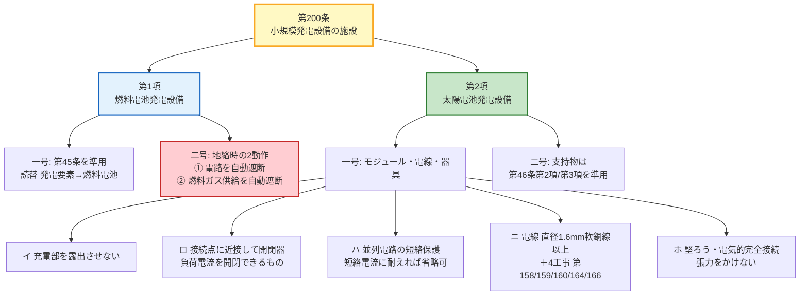

# 電技解釈 第200条 — 小規模発電設備の施設

!!! success "✅ 条番号・主題 確定（2026-06-12 Wayback経由 経済産業省告示PDF一次照合）"
    **第200条 = 小規模発電設備（燃料電池発電設備＋太陽電池発電設備）の施設規定**で確定（委任元: 電技省令第4条・第15条・第59条第1項）。Wayback Machine 経由で取得した経済産業省告示PDF（電気設備の技術基準の解釈・平成30年改正反映版）の第200条・準用先の第45条・第46条第2項/第3項を逐語照合済みです。本ページは旧版v1.0「小勢力回路の施設」（誤記）→ v2.0「太陽電池モジュールの絶縁性能」（誤・実体は[第16条](16.md)第5項）→ v3.0 実主題「小規模発電設備の施設」で全面書き直しした版です。**太陽電池モジュールの絶縁性能（1倍/1.5倍/10分間）を学びに来た方は [第16条 — 機械器具等の絶縁性能](16.md) を参照してください**（本条は絶縁「性能」ではなく「施設方法」の規定）。

!!! warning "📜 一次ソース確認のお願い"
    本ページは電気設備の技術基準の解釈（経済産業省告示）を学習用に整理したものです。電技解釈は eGov 法令API に登録されていないため、本Wikiの品質保証は wiki内クロスリファレンス＋過去問データベース＋一次ソースキャッシュへの照合に依存しています。**取得できた一次PDFは平成30年改正版（旧称「小出力発電設備」表記）であり、現行告示の逐語は[要確認: 現行版PDF未達・2023年3月改正での「小規模発電設備」への改称と推定]です**。重要な実務判断や試験直前の最終確認は、必ず経済産業省公式の最新告示PDF（[電気設備の技術基準の解釈](https://www.meti.go.jp/policy/safety_security/industrial_safety/sangyo/electric/detail/setsubi_kijun.html)）に当たってください。

!!! note "📊 試験対策メタ"
    **出題頻度**: ─（kakomon.yml（H23〜R07・247問）で第200条を根拠とする出題は 0 件。H21問8 がDB収録範囲外の参考実績）

    **重要度**: C（基本条文。小規模事業用電気工作物の制度改正で注目度が上昇中）

    **直近出題**: なし（H23〜R07 の範囲では出題実績なし）

> 小規模発電設備（一般家庭の太陽光・エネファーム等）には、大規模発電所と同じ重装備の規定を課すのは過剰です。第200条は **第1項で燃料電池発電設備**、**第2項で太陽電池発電設備** の施設方法を、上位条文の準用＋必要最小限の固有規定で簡潔に定めます。数値らしい数値は **直径1.6mmの軟銅線** のみで、大半は他条文の準用で構成されているのが特徴です。

| 項目 | 内容 |
|------|------|
| 条文 | 電気設備の技術基準の解釈 第200条 |
| 条文核心 | **第1項（燃料電池）**: 第45条準用＋地絡時に電路を自動遮断し燃料ガス供給も自動遮断／**第2項（太陽電池）**: 充電部非露出・接続点に近接して開閉器・並列接続電路の短絡保護・直径1.6mm軟銅線＋4工事のいずれか・支持物は第46条第2項/第3項準用 |
| 規定内容 | 小規模発電設備（燃料電池・太陽電池）の施設方法 |
| 性格 | 施設規定（固有の数値は直径1.6mm軟銅線のみ・大半は準用） |
| 委任元（上位） | 電技省令第4条（損傷防止）・第15条（地絡保護）・第59条第1項（機械器具の感電火災防止） |
| 関連 | [第16条（機械器具等の絶縁性能）](16.md)（旧版の誤帰属先）／第45条（燃料電池等の施設）／第46条（太陽電池発電所等の電線等）／[第29条（機械器具の金属製外箱等の接地）](29.md)／[電気事業法第38条](../jigyoho/38.md) |
| **典拠（一次ソース）** | 電気設備の技術基準の解釈（制定20130215商局第4号）第200条 — **平成30年10月1日付改正反映版**（経済産業省告示）。Wayback Machine 経由で取得した告示PDFを逐語照合（取得版アーカイブ日: 2025-05-07） ※現行版の用語のみ[要確認: 現行版PDF未達・「小規模発電設備」への改称と推定] |
| **照合日** | 2026-06-12（Wayback経由 経済産業省告示PDF 第200条・第45条・第46条第2項/第3項を逐語照合） |
| **隣接条文** | ← 第199条の2（V2H等・記事未作成） ／ 本条（200・小規模発電設備の施設） → 第201条（電気鉄道等・章境界） |
| **混同注意** | **[第16条](16.md)第5項＝太陽電池モジュールの絶縁性能（本ページ旧版が誤帰属していた先）／第46条＝太陽電池発電所（事業用・高圧側を含む大規模側）本体の電線・支持物規定／第45条＝燃料電池発電所側の規定**。本条（第200条）は小規模側の「施設方法」を準用中心に定める条文 |

---

## 1. 5秒で思い出す

- 第200条 = **小規模発電設備の施設**（第1項＝燃料電池／第2項＝太陽電池の2本立て）
- **第1項（燃料電池）**: 第45条を準用（読替: 「発電要素」→「燃料電池」）＋地絡時に **電路遮断＋燃料ガス供給遮断の2動作**
- **第2項（太陽電池）**: 充電部を露出させない・接続点に **近接して開閉器**・並列接続電路に **短絡保護**・電線は **直径1.6mm軟銅線** 以上＋4工事のいずれか
- 太陽電池の **支持物** は第46条第2項/第3項を準用（自重・地震・風圧・積雪に耐える）
- **絶縁「性能」（1.5倍/10分間）は [第16条](16.md)第5項** — 本条は絶縁「方法」の規定（混同最多）

??? question "セルフチェック: なぜ小規模発電設備に専用の簡素な条文（第200条）を置くのか？"
    一般家庭の太陽光発電やエネファーム（燃料電池）にまで、発電所並みの重い規定をフルセットで課すのは過剰です。そこで第200条は、燃料電池には第45条、太陽電池の支持物には第46条第2項/第3項を **準用** し、配線工事も第158条以下の既存工事規定を **準用** することで、固有の規定（接続点近接の開閉器・並列短絡保護・直径1.6mm軟銅線など）を必要最小限に絞り、安全性と簡素さを両立させています。

---

## 2. 条文原文（一次ソース照合・旧称表記）

!!! abstract "電気設備の技術基準の解釈 第200条（小出力発電設備の施設）"
    > **第1項**　小出力発電設備である燃料電池発電設備は、次の各号によること。
    >
    > 　一　第45条の規定に準じて施設すること。この場合において、同条第一号ロの規定における「発電要素」は「燃料電池」と読み替えるものとする。
    >
    > 　二　燃料電池発電設備に接続する電路に地絡を生じたときに、電路を自動的に遮断し、燃料電池への燃料ガスの供給を自動的に遮断する装置を施設すること。
    >
    > **第2項**　小出力発電設備である太陽電池発電設備は、次の各号により施設すること。
    >
    > 　一　太陽電池モジュール、電線及び開閉器その他の器具は、次によること。
    >
    > 　　イ　充電部分が露出しないように施設すること。
    >
    > 　　ロ　太陽電池モジュールに接続する負荷側の電路（複数の太陽電池モジュールを施設する場合にあっては、その集合体に接続する負荷側の電路）には、その接続点に近接して開閉器その他これに類する器具（負荷電流を開閉できるものに限る。）を施設すること。
    >
    > 　　ハ　太陽電池モジュールを並列に接続する電路には、その電路に短絡を生じた場合に電路を保護する過電流遮断器その他の器具を施設すること。ただし、当該電路が短絡電流に耐えるものである場合は、この限りでない。（関連省令第14条）
    >
    > 　　ニ　電線は、次によること。ただし、機械器具の構造上その内部に安全に施設できる場合は、この限りでない。
    >
    > 　　　(イ)　電線は、直径1.6mmの軟銅線又はこれと同等以上の強さ及び太さのものであること。（関連省令第6条）
    >
    > 　　　(ロ)　合成樹脂管工事（第158条）・金属管工事（第159条）・金属可とう電線管工事（第160条）・ケーブル工事（屋内は第164条、屋側又は屋外は第166条第1項第七号）のいずれかにより施設すること。
    >
    > 　　　(ハ)　第145条第2項並びに第167条第2項及び第3項の規定に準じて施設すること。
    >
    > 　　ホ　太陽電池モジュール及び開閉器その他の器具に電線を接続する場合は、ねじ止めその他の方法により、堅ろうに、かつ、電気的に完全に接続するとともに、接続点に張力が加わらないようにすること。（関連省令第7条）
    >
    > 　二　太陽電池モジュールの支持物は、第46条第2項又は第3項の規定に準じて施設すること。

    > <small>本条は kakomon.yml（H23〜R07）で出題 0 件のため、本ページでは黄色マーカー（実出題語のハイライト）は使用せず、重要語は **太字** で運用します。引用は **取得できた一次PDF＝平成30年改正版（旧称「小出力発電設備」表記）** の逐語です。現行告示は「小規模発電設備」へ改称されたと推定され、本文・タイトルは現行称を採用しています（[要確認: 現行版PDF未達・2023年3月改正での改称と推定]）。</small>

---

## 3. 原文解析（ブロック分解）

| 原文ブロック | 意味 | 試験のポイント |
|---|---|---|
| 第1項一号「第45条の規定に準じて施設」＋「『発電要素』は『燃料電池』と読み替える」 | 燃料電池は **第45条（燃料電池等の施設）** をそのまま準用。ただし第45条の「発電要素」という語は「燃料電池」に置き換える | **読替**が論点。第45条は燃料電池「等」の一般規定で語が「発電要素」、第200条第1項は燃料電池に限定するため読み替える |
| 第1項二号「地絡を生じたときに、電路を自動的に遮断し、燃料電池への燃料ガスの供給を自動的に遮断する装置」 | 地絡発生時に **電路遮断＋燃料ガス供給遮断** の2動作を行う | **2動作セット**が頻出。「電路を切るだけ」は誤り。燃料ガスは可燃性なので供給も断つ |
| 第2項一号イ「充電部分が露出しないように施設」 | 通電部が露出しない構造で設置する | 感電防止の基本。太陽電池は日照中は常時発電＝常時充電状態 |
| 第2項一号ロ「接続点に近接して開閉器その他これに類する器具（負荷電流を開閉できるものに限る。）」 | モジュール負荷側電路の接続点の近くに、**負荷電流を開閉できる開閉器** を置く | 「**近接して**」「**負荷電流を開閉できる**」が条件。遮断器でなくてもよい点に注意 |
| 第2項一号ハ「並列に接続する電路には……短絡を生じた場合に電路を保護する過電流遮断器その他の器具。ただし、当該電路が短絡電流に耐えるものである場合は、この限りでない」 | 並列接続電路には短絡保護を施設。ただし電路が短絡電流に耐えるなら省略可 | **ただし書きによる省略可**が論点。「常に必須」は誤り |
| 第2項一号ニ(イ)「直径1.6mmの軟銅線又はこれと同等以上」 | 電線は直径1.6mm軟銅線以上の強さ・太さ | 本条で **唯一の具体的数値**。関連省令第6条（電線の接続） |
| 第2項一号ニ(ロ)「合成樹脂管工事・金属管工事・金属可とう電線管工事・ケーブル工事のいずれか」 | 配線は第158条以下の **4工事を準用** | 工事方法は既存の屋内配線規定を流用。ケーブル工事は屋内/屋側・屋外で準用条が分かれる |
| 第2項二号「支持物は、第46条第2項又は第3項の規定に準じて施設」 | 架台（支持物）は **第46条第2項/第3項** を準用 | 第46条のうち準用するのは **支持物の項（第2項/第3項）だけ**。第46条全体ではない |

---

## 4. かみ砕き解説（因果理解）

### なぜ小規模に専用条文（準用中心）なのか

太陽光発電やエネファーム（燃料電池）は、いまや一般家庭や小規模事業所に広く普及しています。これらに大規模発電所と同じ重装備の規定をフルセットで課すと過剰です。そこで第200条は、

1. 燃料電池は **第45条（燃料電池等の施設）を丸ごと準用**（語だけ「発電要素」→「燃料電池」に読替）
2. 太陽電池の支持物は **第46条第2項/第3項（太陽電池発電所等の支持物）を準用**
3. 太陽電池の配線は **第158条以下の屋内配線工事規定を準用**

という形で、既存条文を最大限流用します。固有の規定は「接続点近接の開閉器」「並列短絡保護」「直径1.6mm軟銅線」「接続の堅ろう性」など必要最小限に絞られ、安全確保と規定の簡素さを両立させています。

### 制度接続（2022年改正・電気事業法第38条）

[電気事業法第38条](../jigyoho/38.md)の2022年改正（令和5年3月20日施行）で、太陽光発電の「一般用電気工作物」の上限が **50kW未満 → 10kW未満** に引き下げられ、その間（太陽光10kW以上50kW未満等）を埋める **「小規模事業用電気工作物」** が新設されました。第200条はこれら **小規模発電設備**（一般用＋小規模事業用）の施設基準を、電技解釈の側から具体的に定める条文です。制度改正により小規模発電設備の点検義務化等が進んだことで、本条の実務・試験上の重要度は今後上昇すると見込まれます。

### 第1項の因果（燃料電池＝可燃性ガスを扱う）

燃料電池は内部で **燃料ガス（水素や都市ガス改質ガス）** を扱います。可燃性ガスを扱う設備で地絡（漏電）が起きると、アーク（火花）が **着火源** となり火災・爆発に直結しかねません。だから第1項二号は、地絡発生時に **電路を遮断する** だけでなく **燃料ガスの供給そのものを自動で断つ** ことまで要求します。電気を切るだけでは可燃性ガスが供給され続けるため危険、という因果がこの2動作セットの理由です。

### 第2項の因果（直流・常時発電という特性）

太陽電池は **日照中は常時発電** し、**直流** を出力します。交流のような自然な電流ゼロ点がないため、

- **接続点近接の開閉器**（負荷電流を開閉できるもの）で、点検・保守時に確実に電路を切り分けられるようにする
- **並列接続電路の短絡保護** で、複数モジュールを並列にしたときの循環短絡電流に備える
- **施工品質**（直径1.6mm以上の軟銅線・堅ろうで電気的に完全な接続・張力をかけない）で、長期屋外暴露下の劣化・接触不良を防ぐ

という具体策が並びます。いずれも「直流・常時発電・屋外設置」という太陽光固有のリスクに対応した因果になっています。

---

## 5. 図で理解

第200条の2項分岐（燃料電池／太陽電池）と、それぞれの準用先・固有規定をツリーで押さえます。

**読み解き**: 第200条は「燃料電池（第1項）」と「太陽電池（第2項）」の2本立て。燃料電池は第45条準用＋地絡時2動作が核心、太陽電池はイ〜ホの施設細目＋支持物の第46条準用が核心です。赤枠の **地絡時2動作**（電路遮断＋燃料ガス遮断）が第1項最大の論点です。

---

## 6. 試験で問われること

第200条そのものは直近14年（H23〜R07）の出題実績がありませんが、**DB範囲外の H21問8** が第2項（太陽電池）の穴埋めとして出題されており、再出題型として押さえる価値があります。穴埋めで狙われやすい語句は次のとおりです。

1. **(イ) 充電部分が露出しない** — 太陽電池の施設原則
2. **(ロ) 接続点に近接して開閉器**（負荷電流を開閉できるもの）— 「遮断器」でなくてよい点が論点
3. **(ハ) 過電流遮断器**（並列接続電路の短絡保護）— ただし書きによる省略可
4. **(ニ) 直径1.6mmの軟銅線** — 本条唯一の具体的数値
5. **(ホ) 堅ろうに、かつ、電気的に完全に接続** — 接続の品質
6. **第1項二号 燃料ガスの供給を自動的に遮断** — 燃料電池の地絡時2動作

!!! abstract "穴埋め例題（H21問8 を一次照合のうえ再構成・DB収録範囲外の参考）"
    小規模発電設備である太陽電池発電設備は、次により施設すること。太陽電池モジュール、電線及び開閉器その他の器具は、充電部分が（　ア　）しないように施設すること。太陽電池モジュールに接続する負荷側の電路には、その接続点に近接して（　イ　）その他これに類する器具（負荷電流を開閉できるものに限る。）を施設すること。太陽電池モジュール及び開閉器その他の器具に電線を接続する場合は、ねじ止めその他の方法により、（　ウ　）に、かつ、電気的に完全に接続すること。

??? success "解答を見る"
    - ア = **露出**
    - イ = **開閉器**
    - ウ = **堅ろう**

    （出典: [denken-ou.com H21問8解説](https://denken-ou.com/houkih21-8/)）

    **改変あり**（過去問そのものの逐語ではなく、第200条第2項一号イ・ロ・ホの条文文言をベースに穴埋め化した再構成。H21問8 は kakomon.yml の収録範囲（H23〜R07）外で、`docs/kakomon/H21.md` に記録される参考実績です）。

### ✅ 数値検証 PASS（2026-06-12 Wayback告示PDF逐語照合）

**数値検証 PASS** — 本記事に記載した第200条の数値・準用条文番号を、Wayback Machine 経由で取得した経済産業省告示PDF（電気設備の技術基準の解釈・平成30年改正反映版）の第200条・第45条・第46条第2項/第3項と逐語照合した結果、すべて一次ソース通りです。

| 値・規定 | 出典条項 | 一次ソース該当箇所 |
|---|---|---|
| 直径1.6mmの軟銅線（電線の最小） | 第2項一号ニ(イ)（関連省令第6条） | 「電線は、直径1.6mmの軟銅線又はこれと同等以上の強さ及び太さのものであること」 |
| 準用先（燃料電池） | 第1項一号 | 第45条（燃料電池等の施設）— 読替「発電要素」→「燃料電池」 |
| 準用先（太陽電池の支持物） | 第2項二号 | 第46条第2項又は第3項（太陽電池発電所等の支持物） |
| 準用先（太陽電池の配線工事） | 第2項一号ニ(ロ) | 第158条・第159条・第160条・第164条・第166条第1項第七号 |
| 準用先（電線路の準用） | 第2項一号ニ(ハ) | 第145条第2項並びに第167条第2項及び第3項 |
| JIS C 8955(2017)（支持物の設計荷重） | 第46条第2項二号（本条第2項二号経由で準用） | 「JIS C 8955(2017)に規定する設計用荷重……許容応力度以下」 |

---

## 7. 頻出ひっかけ / 落とし穴

### 🔴 致命的（これを間違えたら即失点）

1. ❌「第200条＝太陽電池モジュールの絶縁性能（最大使用電圧の1.5倍/10分間）」
    - → ✅ それは **[第16条](16.md)第5項** の論点です。第200条は絶縁「性能」ではなく **施設方法**（充電部非露出・開閉器・短絡保護・配線工事・支持物）の規定。**本Wikiの旧版自身が誤帰属していた最重要の混同** です
2. ❌「燃料電池は地絡時に電路を遮断すればよい」
    - → ✅ **電路の自動遮断＋燃料ガス供給の自動遮断の2動作**（第1項二号）。燃料ガスは可燃性のため、電気を切るだけでは供給され続けて危険

### 🟡 注意（混同・誤読しやすい）

1. ❌「並列に接続する電路の過電流遮断器は常に必須」
    - → ✅ 「**当該電路が短絡電流に耐えるものである場合は、この限りでない**」（第2項一号ハ ただし書き）。**短絡電流に耐えるなら省略可**
2. ❌「太陽電池の支持物は第46条の全規定を準用する」
    - → ✅ 準用するのは **第46条第2項又は第3項（支持物の項）だけ**。第46条は太陽電池発電所（事業用・高圧側を含む）の電線等を広く規定する条文で、本条第2項二号がそのうち支持物の部分のみを準用します
3. ❌「接続点には過電流遮断器を置く」
    - → ✅ 第2項一号ロは「**開閉器その他これに類する器具（負荷電流を開閉できるものに限る。）**」。遮断器ではなく、負荷電流を開閉できる開閉器でよい

### 🟢 軽微（知っていると有利）

1. ❌「第45条をそのまま準用するだけ（読替なし）」
    - → ✅ 第1項一号は「**『発電要素』は『燃料電池』と読み替える**」読替付き準用
2. ❌「ケーブル工事は屋内・屋外とも第164条を準用」
    - → ✅ ケーブル工事は **屋内が第164条**、**屋側又は屋外が第166条第1項第七号** と準用条が分かれる

---

## 8. まぎらわしい選択肢と正解の違い

| 誤った記述 | 正しい記述 | なぜ違うか |
|---|---|---|
| 第200条は太陽電池モジュールの **絶縁性能**（1.5倍/10分間）を定める | 第200条は小規模発電設備の **施設方法** を定める。絶縁性能は[第16条](16.md)第5項 | 「性能（試験電圧・時間）」と「方法（施設要件）」は別軸。旧版の誤帰属が混同の元 |
| 燃料電池は地絡時に **電路を遮断** すればよい | 電路遮断＋ **燃料ガス供給の自動遮断** の2動作 | 燃料ガスは可燃性。電気を切るだけでは供給が続き火災リスクが残る |
| 並列接続電路の過電流遮断器は **常に必須** | 電路が **短絡電流に耐える** 場合は省略可（ただし書き） | 条文末尾の「この限りでない」を読み落とすと誤り |
| 第200条は太陽光発電所 **全体（電線・パワコン含む）の本体規定** | 第200条は **小規模側** の施設方法。事業用・高圧側を含む本体規定は第46条 | 第46条（太陽電池発電所等）と棲み分け。本条第2項二号は支持物だけ第46条を準用 |

---

## 9. 関連条文・関連ページ

**本条の主題に直接関わる条文**

- [電技解釈 第16条 — 機械器具等の絶縁性能](16.md) — **太陽電池モジュールの絶縁性能（第5項）**。本ページ旧版が誤帰属していた先。絶縁「性能」はこちら、本条は絶縁「方法」
- 第45条（燃料電池等の施設）— 本条第1項が準用（読替「発電要素」→「燃料電池」・記事未作成）
- 第46条（太陽電池発電所等の電線等）— 本条第2項二号が支持物の項（第2項/第3項）を準用。太陽電池発電所（事業用・高圧側を含む）本体の規定・記事未作成
- [電技解釈 第29条 — 機械器具の金属製外箱等の接地](29.md) — 本条で施設する開閉器その他の器具の金属製外箱等の接地基準（関連）
- 第199条の2（電気自動車等から電気を供給する設備の施設・V2H）— 直前条。[第220条](220.md)・[第221条](221.md)で言及あり（記事未作成）

**上位（委任元）**

- [電気設備技術基準 第4条 — 電気設備における感電、火災等の防止](../kijun/4.md)
- [電技省令 第15条 — 地絡に対する保護対策](../kijun/15.md)
- [電気設備技術基準 第59条 — 電気使用場所に施設する電気機械器具の感電、火災等の防止](../kijun/59.md)（第1項）

**制度接続**

- [電気事業法 第38条 — 電気工作物の定義と分類](../jigyoho/38.md) — 「小規模事業用電気工作物」の定義（2022年改正・令和5年3月20日施行）。本条が施設基準を定める対象範囲の根拠

---

## 10. 過去問実績

過去14年（H23〜R07下）の出題実績を一次データ（kakomon.yml）と照合した結果は以下のとおりです。

| 年度 | 問 | 形式 | 論点 |
|---|---|---|---|
| —（H23〜R07） | — | — | kakomon.yml 247問中、第200条を根拠とする出題は **0件** |

- **H21問8**（DB収録範囲外・参考実績）: 第2項（太陽電池発電設備）の穴埋め出題。`docs/kakomon/H21.md` に記録（🔁 再出題・H30問2等）。解説: [denken-ou.com H21問8](https://denken-ou.com/houkih21-8/)

!!! note "R08 出題予測"
    2022年の電気事業法改正（[第38条](../jigyoho/38.md)）で「小規模事業用電気工作物」（太陽光10kW以上50kW未満等）が新設され、点検義務化等の制度が定着しつつあります。これに伴い、第200条第2項（太陽電池の施設方法）の出題価値が上昇すると見込まれます。**H21問8 の再出題型**（充電部非露出・接続点近接の開閉器・並列短絡保護・直径1.6mm軟銅線・接続の堅ろう性）に注意してください。

---

## 11. 用語集

第200条の条文で登場する主要用語を整理します。

| 用語 | 読み | 意味 | 試験での注意点 |
|------|------|------|----------------|
| 小規模発電設備 | しょうきぼはつでんせつび | 一般用＋小規模事業用の小規模な発電設備（太陽光・燃料電池等） | 旧称「小出力発電設備」。2023年改正で改称（推定・[要確認: 現行逐語]） |
| 燃料電池発電設備 | ねんりょうでんちはつでんせつび | 燃料ガスの化学反応で発電する設備（エネファーム等） | 第1項の対象。地絡時2動作が論点 |
| 発電要素 | はつでんようそ | 第45条が用いる燃料電池等の発電部の総称 | 第200条第1項一号で「燃料電池」に読み替える |
| 太陽電池モジュール | たいようでんち—— | 太陽電池セルを直列接続して1枚のパネルにしたもの | 「アレイ」（複数モジュール接続体）と区別 |
| 充電部分 | じゅうでんぶぶん | 通電している導体部 | 露出させないことが第2項一号イの要件 |
| 軟銅線 | なんどうせん | 焼きなまし処理した柔らかい銅線 | 第2項一号ニ(イ)で直径1.6mm以上を要求 |
| 支持物 | しじぶつ | 太陽電池モジュールを支える架台 | 第46条第2項/第3項を準用（本体は本条外） |

### 3列翻訳テーブル（日常語 ⇆ 法規表現 ⇆ 試験での意味）

条文の堅い表現を日常語と試験での意味に橋渡しします。

| 日常語・言い換え | 法規表現（条文上の語） | 試験での意味・ひっかけ |
|---|---|---|
| 家庭用太陽光・屋根のパネル | 小規模発電設備である太陽電池発電設備 | 第200条第2項の対象（事業用・高圧側の本体は第46条） |
| エネファーム（家庭用燃料電池） | 燃料電池発電設備 | 第200条第1項の対象（地絡時2動作が論点） |
| パネルわきのスイッチ | 接続点に近接して開閉器（負荷電流を開閉できるもの） | **遮断器でなくてよい**（負荷電流を開閉できる開閉器で足りる） |
| しっかりネジ留めする | 堅ろうに、かつ、電気的に完全に接続 | 張力が加わらないようにする点も要件（第2項一号ホ） |
| （旧称）小出力発電設備 | 小規模発電設備 | 2023年3月改正で改称（推定・[要確認: 現行逐語]） |

!!! tip "💡 暗記の核心（第200条を5秒で）"
    - **2本立て**: 第1項＝燃料電池（第45条準用）／第2項＝太陽電池（イ〜ホ＋支持物第46条準用）
    - **燃料電池の地絡**: 電路遮断＋ **燃料ガス供給遮断の2動作**（電気だけ切るのは誤り）
    - **太陽電池の開閉器**: 接続点に近接して **開閉器**（負荷電流を開閉できるもの。遮断器でなくてよい）
    - **唯一の数値**: 電線は **直径1.6mm軟銅線** 以上（あとは準用）
    - **混同回避**: 絶縁「性能」（1.5倍/10分間）は **[第16条](16.md)第5項**、本条は絶縁「方法」

---

## 12. 最終チェック

### 主題理解

- [ ] 第200条 = **小規模発電設備の施設**（第1項＝燃料電池／第2項＝太陽電池の2本立て）
- [ ] 絶縁「性能」（1.5倍/10分間）は **[第16条](16.md)第5項**、本条は絶縁「方法」（施設要件）
- [ ] 固有の具体的数値は **直径1.6mm軟銅線** のみ・大半は準用で構成

### 規定内容

- [ ] 第1項一号: 燃料電池は **第45条** を準用（読替「発電要素」→「燃料電池」）
- [ ] 第1項二号: 地絡時に **電路遮断＋燃料ガス供給遮断の2動作**
- [ ] 第2項一号: 充電部非露出・接続点近接の開閉器・並列短絡保護・直径1.6mm軟銅線＋4工事・堅ろうな接続
- [ ] 第2項二号: 支持物は **第46条第2項/第3項** を準用

### ひっかけ対策

- [ ] 第200条を「太陽電池の絶縁性能」と混同しない（それは[第16条](16.md)第5項）
- [ ] 並列電路の過電流遮断器は **短絡電流に耐えれば省略可**（常に必須ではない）
- [ ] 接続点は **開閉器**（負荷電流を開閉できるもの）であり遮断器ではない

### 制度接続

- [ ] [電気事業法第38条](../jigyoho/38.md)の2022年改正で「小規模事業用電気工作物」が新設（太陽光10kW以上50kW未満等）
- [ ] 第200条はこれら小規模発電設備の施設基準を電技解釈側で定める条文

---

## 監修ログ

- **2026-04-20 v1.0**: 初版作成（旧版「小勢力回路」として誤記）。
- **2026-05-10 v2.0 Phase D 緊急修正**: kakomon.yml ベース全面書き直し。Phase C-g6 監査で旧版が「小勢力回路」（電圧60V以下・電流1A以下・絶縁変圧器）として誤記されていたことを検出。kakomon.yml § 200 登録2件（H28問6・R05上問4）が「太陽電池モジュールの絶縁性能」で一致しているため、主題を「太陽電池モジュールの絶縁性能」に変更し、旧版「小勢力回路」内容を全削除。経産省PDFは WebFetch / curl 双方失敗で取得不可のため、試験電圧倍率・試験時間・絶縁抵抗値の細部は学習教材ベースで `要再確認` フラグ付き記載。なお「小勢力回路」自体の正しい条文番号（解釈第181条周辺の可能性）は本Wikiでは未確定。
- **2026-06-11 v2.1 条番号誤記の訂正**: PR #81 平成スポット監査の後続で、根拠2問（H28問6・R05上問4）を denken-ou 一次照合した結果、いずれも**「解釈第16条からの出題」と明記**（空欄出典は第16条第5項第一号）と判明。v2.0 の主題確定の根拠だった kakomon.yml `解釈第200条` 登録自体が誤りで、同日 `解釈第16条` へ訂正。冒頭に条番号誤記の訂正 danger 注記を配置し、出題実績を [16.md](16.md) へ再帰属。第200条の実際の主題は引き続き[要確認: 経産省告示原文での照合が必要]（統合・リネームは別タスク）
- **2026-06-12 v2.2 実主題の準一次確定**: denken-ou houkih21-8（H21問8 解説）が解釈第200条第2項の条文抜粋を直接引用しており、実主題＝「小規模発電設備である太陽電池発電設備の施設」と確定（準一次）。nav・index.md の残存「小勢力回路」ラベルを是正。第16条への統合は不要と判定（重複コンテンツのため）
- **2026-06-12 v3.0 実主題で全面書き直し**: Wayback Machine 経由で経済産業省告示PDF（平成30年改正反映版）の第200条・準用先の第45条・第46条第2項/第3項を逐語取得し一次照合。第1項＝燃料電池発電設備／第2項＝太陽電池発電設備の2項構成で再構築（旧版が紛れていた「太陽電池モジュールの絶縁性能」は[第16条](16.md)第5項の論点として明確に切り分け）。固有数値は直径1.6mm軟銅線のみ・大半は準用という条文構造を反映。現行版の用語（小規模／小出力）は[要確認: 現行告示逐語未達・2023年3月改正での改称と推定]。kaishaku/index.md・192.md の残骸ラベル（「小勢力回路」）、mkdocs.yml nav・articles/index.md・reuse-ranking.md（絶縁性能の正帰属＝第16条）も同時是正

---

*最終確認: 2026-06-12 ｜ ステータス: v3.0（実主題「小規模発電設備の施設」で全面書き直し） ｜ 条文番号: ✅ 一次ソース照合済（Wayback 経済産業省告示PDF 平成30年改正版・現行用語のみ[要確認: 現行版逐語未達]） ｜ 出題実績: ✅ kakomon DB 照合済（H23〜R07 で 0件・H21問8 はDB範囲外の参考） ｜ 数値根拠: ✅ 公式根拠記載済（直径1.6mm軟銅線・JIS C 8955・準用条文群） ｜ テンプレ世代: v2.7準拠 ｜ [バージョニング基準](../../reference/versioning.md)*
