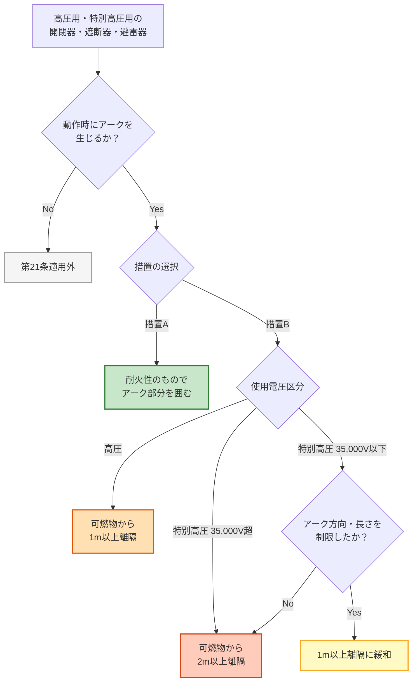

# 電技解釈 第21条 — アークを生じる器具の施設

!!! note "📊 試験対策メタ"
    **出題頻度**: —（過去14年で出題実績未確認）

    **重要度**: C（基本・離隔距離の数値暗記が核）

    **直近出題**: —

> 高圧用・特別高圧用の **開閉器・遮断器・避雷器** その他これらに類する器具で、動作時に **アークを生じる** ものは、火災防止のため次のいずれかで施設する。① **耐火性のもの** でアーク部分を囲む、または ② 木製の壁・天井 その他の **可燃性のもの** から **離隔距離以上**（高圧 **1m** ／特別高圧 **2m**。35,000V以下でアーク方向・長さを制限したものは **1m** に緩和）離す。アークによる近接可燃物への着火を防ぐ施設規定。

| 項目 | 内容 |
|------|------|
| 条文 | 電気設備の技術基準の解釈 第21条 |
| 規定内容 | アークを生じる高圧・特別高圧用器具の火災防止施設要件 |
| 性格 | 施設規定（措置の二者択一＋離隔距離数値） |
| 上位省令 | 省令第9条（高圧又は特別高圧の電気機械器具の危険の防止） |
| 関連 | 解釈第22条（電磁誘導障害の防止）／解釈第34・35条（過電流遮断器）／解釈第38条（避雷器の施設） |

---

## 1. 全体像と要点

- **対象機器**: **高圧用又は特別高圧用** の **開閉器・遮断器・避雷器** その他これらに類する器具のうち、**動作時にアークを生じる** もの
- **措置**: 次の **いずれか**（二者択一）
    - **① 耐火性のもので囲む**（アークを生じる部分を耐火物で囲い込み）
    - **② 可燃物から離隔**（木製壁・天井 その他の可燃性のものから所定距離以上を離す）
- **離隔距離**: 高圧 → **1m** 以上 ／ 特別高圧 → **2m** 以上
- **特別高圧の緩和**: 使用電圧 **35,000V以下** で、動作時のアーク方向・長さを **火災発生のおそれがないよう制限** した器具は、特別高圧でも **1m** 以上に緩和
- **核心の因果**: アーク = 高温・高エネルギー放電 → 周辺可燃物への着火リスク → 「囲む」または「離す」で物理的隔離

### ① 全体像 — 第21条が定める2つの選択肢

<svg viewBox="0 0 800 380" xmlns="http://www.w3.org/2000/svg" width="100%" preserveAspectRatio="xMidYMid meet">
<defs>
<filter id="sh21a" x="-20%" y="-20%" width="140%" height="140%"><feDropShadow dx="0" dy="2" stdDeviation="2" flood-opacity="0.15"/></filter>
<linearGradient id="gMain21" x1="0" y1="0" x2="0" y2="1"><stop offset="0%" stop-color="#bbdefb"/><stop offset="100%" stop-color="#90caf9"/></linearGradient>
<linearGradient id="g21a" x1="0" y1="0" x2="0" y2="1"><stop offset="0%" stop-color="#c8e6c9"/><stop offset="100%" stop-color="#a5d6a7"/></linearGradient>
<linearGradient id="g21b" x1="0" y1="0" x2="0" y2="1"><stop offset="0%" stop-color="#ffe0b2"/><stop offset="100%" stop-color="#ffb74d"/></linearGradient>
<linearGradient id="g21c" x1="0" y1="0" x2="0" y2="1"><stop offset="0%" stop-color="#ffccbc"/><stop offset="100%" stop-color="#ff8a65"/></linearGradient>
</defs>
<text x="400" y="26" text-anchor="middle" font-size="15" font-weight="700" fill="#212121">第21条 — アークを生じる器具の2つの施設方法</text>
<text x="400" y="44" text-anchor="middle" font-size="11" fill="#666">アーク（高温放電）→ 可燃物着火を防ぐため「囲む」か「離す」を選ぶ</text>
<rect x="280" y="60" width="240" height="60" rx="12" fill="url(#gMain21)" stroke="#0d47a1" stroke-width="2.5" filter="url(#sh21a)"/>
<text x="400" y="85" text-anchor="middle" font-size="14" font-weight="800" fill="#0d47a1">解釈第21条</text>
<text x="400" y="105" text-anchor="middle" font-size="11" fill="#1565c0">アークを生じる器具の施設</text>
<line x1="400" y1="125" x2="200" y2="160" stroke="#0d47a1" stroke-width="1.5" stroke-dasharray="3,2"/>
<line x1="400" y1="125" x2="600" y2="160" stroke="#0d47a1" stroke-width="1.5" stroke-dasharray="3,2"/>
<rect x="60" y="165" width="280" height="180" rx="14" fill="url(#g21a)" stroke="#2e7d32" stroke-width="2.5" filter="url(#sh21a)"/>
<text x="200" y="192" text-anchor="middle" font-size="13" font-weight="700" fill="#1b5e20">① 耐火性のもので囲む</text>
<line x1="80" y1="202" x2="320" y2="202" stroke="#2e7d32" stroke-width="1"/>
<text x="200" y="226" text-anchor="middle" font-size="11" fill="#1b5e20">アークを生じる部分を</text>
<text x="200" y="244" text-anchor="middle" font-size="11" fill="#1b5e20">耐火性の壁・箱・遮蔽板で</text>
<text x="200" y="262" text-anchor="middle" font-size="11" font-weight="700" fill="#1b5e20">物理的に囲い込む</text>
<text x="200" y="290" text-anchor="middle" font-size="10" fill="#2e7d32">例: 耐火金属製キュービクル</text>
<text x="200" y="306" text-anchor="middle" font-size="10" fill="#2e7d32">　　アーク遮蔽カバー</text>
<text x="200" y="328" text-anchor="middle" font-size="10" fill="#1b5e20">→ 離隔距離の制約から解放</text>
<rect x="460" y="165" width="280" height="180" rx="14" fill="url(#g21b)" stroke="#e65100" stroke-width="2.5" filter="url(#sh21a)"/>
<text x="600" y="192" text-anchor="middle" font-size="13" font-weight="700" fill="#bf360c">② 可燃物から離隔</text>
<line x1="480" y1="202" x2="720" y2="202" stroke="#e65100" stroke-width="1"/>
<text x="600" y="226" text-anchor="middle" font-size="11" fill="#bf360c">木製の壁・天井等の可燃物から</text>
<text x="600" y="252" text-anchor="middle" font-size="14" fill="#bf360c">高圧 → <tspan font-weight="800">1</tspan><tspan font-weight="400" font-size="12">m</tspan> 以上</text>
<text x="600" y="276" text-anchor="middle" font-size="14" fill="#bf360c">特別高圧 → <tspan font-weight="800">2</tspan><tspan font-weight="400" font-size="12">m</tspan> 以上</text>
<text x="600" y="302" text-anchor="middle" font-size="10" fill="#bf360c">35,000V以下＋アーク制限なら</text>
<text x="600" y="318" text-anchor="middle" font-size="11" font-weight="700" fill="#bf360c">特別高圧でも <tspan font-weight="800">1</tspan><tspan font-weight="400" font-size="10">m</tspan> 以上に緩和</text>
<text x="400" y="365" text-anchor="middle" font-size="11" font-weight="700" fill="#0d47a1">2方式は二者択一（一方を満たせば良い）</text>
</svg>

**読み解き**: 第21条は「囲む」と「離す」の二者択一構造。耐火性で囲めば離隔距離の縛りから解放されるため、屋内変電所・キュービクル等の **空間制約が厳しい場所では①が選ばれやすい**。一方、屋外開放型の発変電所では **②の離隔距離** を取って施設するのが基本。35,000V以下のアーク制限器具は特別高圧でも1mに緩和される点が頻出ポイント。

### ② 要点（試験前30秒復習用）

| 観点 | 内容 |
|------|------|
| **対象機器** | 高圧用 又は 特別高圧用 の **開閉器・遮断器・避雷器** その他類するもの（**動作時にアークを生じる**もの） |
| **措置** | 二者択一：**① 耐火性で囲む** ／ **② 可燃物から離隔** |
| **離隔距離（高圧）** | **1m** 以上 |
| **離隔距離（特別高圧）** | **2m** 以上 |
| **特別高圧の緩和条件** | 使用電圧 **35,000V以下** ＋ アーク方向・長さを火災発生のおそれがないよう制限 → **1m** 以上 |
| **対象となる可燃物** | 木製の壁又は天井 **その他の可燃性のもの** |

??? question "セルフチェック: なぜアーク器具にだけ離隔距離規定があるのか？"
    通常運転中の機器は外箱内に閉じ込められているため発熱はあっても発火源にはなりにくい。一方、**遮断器の遮断時・避雷器の動作時** には電極間に **アーク放電**（数千〜数万℃ の高温プラズマ）が発生し、周辺の可燃物に着火するおそれがある。

    省令第9条（電気機械器具の危険防止）に対する **解釈での具体策** が第21条。火災 = 「発火源 × 可燃物 × 酸素」の三要素 → アーク（発火源）と可燃物の間に **物理的距離 or 耐火障壁** を入れる発想。

??? question "セルフチェック: 35,000V以下の特別高圧で1mに緩和される理由は？"
    アークの規模（長さ・熱量）はおおむね **電圧に依存** する。35,000V以下の比較的低い特別高圧帯では、アーク方向・長さを **構造的に制限** すれば、35,000V超のフルサイズ特別高圧と同等の2m離隔は不要 → 高圧と同じ1mで十分という工学判断。

    制限手段は具体的にはアーク収納箱・指向性遮蔽板・消弧装置などで、解釈条文では「動作時に生じるアークの方向及び長さを火災が発生するおそれがないように制限したもの」と表現される。

---

## 2. 条文原文

**電気設備の技術基準の解釈 第21条（アークを生じる器具の施設）**

> 高圧用又は特別高圧用の**開閉器**、**遮断器**又は**避雷器**その他これらに類する器具（以下この条において「開閉器等」という。）であって、動作時に**アーク**を生じるものは、次の各号のいずれかにより施設すること。
>
> 一　**耐火性**のもので**アークを生じる部分を囲む**こと。
>
> 二　**木製の壁又は天井その他の可燃性のもの**から次の表に規定する**離隔距離以上**を離すこと。

> <small>※ 黄色マーカー（&lt;mark&gt;）は使用していない — 第21条は過去14年で出題実績が確認できないため、穴埋め出題語句が特定できない。出題実績判明後にマーカー追加予定。</small>

**開閉器等の使用電圧の区分と離隔距離**

| 開閉器等の使用電圧の区分 | 離隔距離 |
|------|------|
| **高圧** | **1m** |
| **特別高圧** | **2m**（**35,000V以下** の特別高圧用開閉器等であって、動作時に生じる**アークの方向及び長さ**を**火災が発生するおそれがないよう制限**したものは、**1m**） |

→ 第1号（耐火囲み）と第2号（離隔距離）は **「いずれか」** であり、両方を満たす必要はない。耐火囲みを採用すれば離隔距離の表は適用されない。

!!! note "出典"
    電気設備の技術基準の解釈（令和7年11月版）第21条 — 数値（1m／2m／35,000V）は本条本文の表に直接規定。上位は電気設備に関する技術基準を定める省令 第9条（高圧又は特別高圧の電気機械器具の危険の防止）。

---

## 3. 原文解析（ブロック分解）

条文を意味ブロック単位に分解し、それぞれの試験ポイントを整理する。

| 原文ブロック | 意味 | 試験のポイント |
|---|---|---|
| 「高圧用又は特別高圧用の」 | 適用範囲＝**高圧 / 特別高圧** 用機器のみ | **低圧用は対象外**（低圧は通常アーク規模が小さく省令第9条の対象外） |
| 「開閉器、遮断器又は避雷器その他これらに類する器具」 | 対象機器の **例示列挙** | 遮断器・断路器・避雷器 が代表。「これらに類する器具」で広く包含 |
| 「動作時にアークを生じるもの」 | 適用条件＝**アーク発生が前提** | 通常運転中ではなく、**動作時（遮断・地絡保護動作・落雷時）** のアーク |
| 「次の各号のいずれかにより」 | 措置は **二者択一** | ①と②は**OR条件**。両方満たす必要はない |
| 「耐火性のもので…囲むこと」 | 第1号 = **物理的隔離（囲む方式）** | 耐火性 = 不燃材料（金属・コンクリート等）。可燃物との **直接接触防止** |
| 「木製の壁又は天井その他の可燃性のもの」 | 第2号の対象＝**可燃物全般** | 木製は **例示**。「その他の可燃性のもの」で布・紙・プラスチック等も含む |
| 「離隔距離以上を離す」 | 第2号 = **空間隔離（離す方式）** | 表の数値（高圧1m／特別高圧2m）が **最低基準** |
| 「35,000V以下…アークの方向及び長さを…制限したもの…1m」 | 特別高圧の **緩和規定** | 電圧条件（35,000V以下）と構造条件（アーク制限）の **両方を満たす** ことが必須 |

??? question "セルフチェック: 「高圧用又は特別高圧用の遮断器の動作時に生じるアークが、たまたま耐火性の柱に向かう構造だから対策不要」と判断できるか？"
    **誤り**。第21条は **「いずれか」** の措置を **意図的に施設** する義務を課している。たまたま周囲が耐火物だから良いという解釈は条文上認められず、第1号（耐火性で囲む）か第2号（離隔距離以上）の **いずれかを設計上明示的に選ぶ** 必要がある。

??? question "セルフチェック: 「常時アークが出ているわけではない遮断器」は対象外か？"
    **対象**。条文の「動作時にアークを生じるもの」は**遮断・投入動作の瞬間にアークを生じる器具**を意味する。通常時は静止していても、動作時にアークが出る限り適用される。むしろ遮断器の本来の機能上、動作時のアーク発生は不可避なので、ほぼすべての高圧・特別高圧遮断器が対象になる。

---

## 4. かみ砕き解説（因果理解）

### なぜアーク器具に火災防止規定が必要か

電気火災の三要素 = **発火源 × 可燃物 × 酸素**。

- **発火源**: アーク放電（数千〜数万℃ の高温プラズマ・スパッタ）
- **可燃物**: 木製壁・天井／樹脂被覆ケーブル／紙類／粉じん 等
- **酸素**: 大気中に常時存在（除外不可）

3要素のうち **酸素は除けない** ため、**発火源と可燃物の隔離** が現実的な対策となる。

### 2つの措置の物理的意味

| 措置 | 隔離方法 | 物理的意義 |
|------|---------|----------|
| **① 耐火性で囲む** | **障壁による隔離** | 耐火物がアークの輻射熱・スパッタを吸収・遮断 → 可燃物に到達させない |
| **② 離隔距離** | **距離による減衰** | アークの輻射熱は距離の **2乗に反比例** → 一定距離で着火閾値以下に低下 |

### なぜ高圧1m／特別高圧2m か

アークの **熱量・スパッタ飛散範囲** は電圧（≒投入エネルギー）に概ね比例する。電圧が上がれば必要離隔距離も大きくなる、という単純な工学判断。

| 電圧帯 | 想定アーク規模 | 離隔距離 | 倍率 |
|------|--------------|---------|-----|
| 高圧（〜7,000V） | 中規模 | **1m** | 基準 |
| 特別高圧 35,000V以下＋アーク制限 | 中規模相当に抑制 | **1m** | 高圧と同等 |
| 特別高圧 35,000V超 等 | 大規模 | **2m** | 2倍 |

!!! tip "暗記のコツ"
    - 「**高圧 = 1m / 特別高圧 = 2m**」は **電圧倍率にざっくり比例** で覚える
    - 「**35,000V以下＋アーク制限 → 1m緩和**」は「**3.5万V以下なら高圧扱いで良い**」と語呂で覚える
    - 「**囲む or 離す**」は **二者択一の OR** （「両方やれ」ではない）

### 対象機器のイメージ

| 機器 | 動作時アーク発生の典型例 |
|------|-----|
| **開閉器** | 負荷電流の開閉時にスイッチ接点間に短時間のアーク |
| **遮断器** | 短絡・過負荷時に大電流を遮断する瞬間に大きなアーク |
| **避雷器** | 雷サージ通過時に放電ギャップで大電流アーク |
| **断路器**（類する器具） | 軽負荷遮断時に小規模アーク |

「その他これらに類する器具」 = 開閉動作や保護動作で電極間にアークが発生する装置全般。

!!! warning "ひっかけ：低圧の遮断器も対象？"
    **対象外**。第21条は冒頭で「**高圧用又は特別高圧用**」と限定している。低圧の配線用遮断器（MCCB）等は別条文（低圧電路の保護＝解釈第34条系）で扱われ、第21条のアーク離隔距離規定は適用されない。

---

## 5. 図で理解

### 措置選択フロー

### 離隔距離の数値ビジュアル

<svg viewBox="0 0 800 360" xmlns="http://www.w3.org/2000/svg" width="100%" preserveAspectRatio="xMidYMid meet">
<defs>
<filter id="sh21b" x="-20%" y="-20%" width="140%" height="140%"><feDropShadow dx="0" dy="2" stdDeviation="2" flood-opacity="0.15"/></filter>
<linearGradient id="garc21" x1="0" y1="0" x2="1" y2="0"><stop offset="0%" stop-color="#fff59d"/><stop offset="50%" stop-color="#ff8a65"/><stop offset="100%" stop-color="#ef5350"/></linearGradient>
</defs>
<text x="400" y="26" text-anchor="middle" font-size="15" font-weight="700" fill="#212121">アーク器具と可燃物の離隔距離</text>
<text x="400" y="44" text-anchor="middle" font-size="11" fill="#666">電圧帯別の最低離隔距離（1m / 1m / 2m）</text>
<rect x="40" y="70" width="240" height="240" rx="10" fill="#f5fff5" stroke="#a5d6a7" stroke-width="1.5"/>
<text x="160" y="92" text-anchor="middle" font-size="12" font-weight="700" fill="#1b5e20">高圧</text>
<text x="160" y="108" text-anchor="middle" font-size="10" fill="#2e7d32">（〜7,000V）</text>
<rect x="70" y="180" width="50" height="60" rx="4" fill="#90caf9" stroke="#0d47a1" stroke-width="2"/>
<text x="95" y="215" text-anchor="middle" font-size="9" font-weight="700" fill="#0d47a1">遮断器</text>
<line x1="120" y1="210" x2="180" y2="210" stroke="url(#garc21)" stroke-width="3" stroke-dasharray="4,3"/>
<text x="150" y="200" text-anchor="middle" font-size="9" fill="#d84315">アーク</text>
<rect x="200" y="160" width="40" height="100" rx="2" fill="#a1887f" stroke="#5d4037" stroke-width="1.5"/>
<text x="220" y="155" text-anchor="middle" font-size="9" fill="#5d4037">木壁</text>
<line x1="120" y1="270" x2="200" y2="270" stroke="#1b5e20" stroke-width="2"/>
<polygon points="120,270 128,266 128,274" fill="#1b5e20"/>
<polygon points="200,270 192,266 192,274" fill="#1b5e20"/>
<text x="160" y="288" text-anchor="middle" font-size="13" font-weight="800" fill="#1b5e20"><tspan font-weight="800">1</tspan><tspan font-weight="400" font-size="11">m</tspan> 以上</text>
<rect x="290" y="70" width="240" height="240" rx="10" fill="#fffde7" stroke="#fdd835" stroke-width="1.5"/>
<text x="410" y="92" text-anchor="middle" font-size="12" font-weight="700" fill="#f57f17">特別高圧 35,000V以下</text>
<text x="410" y="108" text-anchor="middle" font-size="10" fill="#f9a825">＋ アーク制限あり</text>
<rect x="320" y="180" width="50" height="60" rx="4" fill="#90caf9" stroke="#0d47a1" stroke-width="2"/>
<text x="345" y="215" text-anchor="middle" font-size="9" font-weight="700" fill="#0d47a1">遮断器</text>
<rect x="358" y="195" width="14" height="30" rx="2" fill="#e0e0e0" stroke="#616161" stroke-width="1"/>
<text x="378" y="180" font-size="8" fill="#616161">制限板</text>
<line x1="370" y1="210" x2="430" y2="210" stroke="url(#garc21)" stroke-width="2" stroke-dasharray="4,3"/>
<rect x="450" y="160" width="40" height="100" rx="2" fill="#a1887f" stroke="#5d4037" stroke-width="1.5"/>
<text x="470" y="155" text-anchor="middle" font-size="9" fill="#5d4037">木壁</text>
<line x1="370" y1="270" x2="450" y2="270" stroke="#f57f17" stroke-width="2"/>
<polygon points="370,270 378,266 378,274" fill="#f57f17"/>
<polygon points="450,270 442,266 442,274" fill="#f57f17"/>
<text x="410" y="288" text-anchor="middle" font-size="13" font-weight="800" fill="#f57f17"><tspan font-weight="800">1</tspan><tspan font-weight="400" font-size="11">m</tspan> 以上（緩和）</text>
<rect x="540" y="70" width="240" height="240" rx="10" fill="#fff5f5" stroke="#ef9a9a" stroke-width="1.5"/>
<text x="660" y="92" text-anchor="middle" font-size="12" font-weight="700" fill="#bf360c">特別高圧</text>
<text x="660" y="108" text-anchor="middle" font-size="10" fill="#d84315">35,000V超 など</text>
<rect x="555" y="180" width="50" height="60" rx="4" fill="#90caf9" stroke="#0d47a1" stroke-width="2"/>
<text x="580" y="215" text-anchor="middle" font-size="9" font-weight="700" fill="#0d47a1">遮断器</text>
<line x1="605" y1="210" x2="715" y2="210" stroke="url(#garc21)" stroke-width="4" stroke-dasharray="4,3"/>
<text x="660" y="200" text-anchor="middle" font-size="9" fill="#bf360c">大規模アーク</text>
<rect x="725" y="160" width="40" height="100" rx="2" fill="#a1887f" stroke="#5d4037" stroke-width="1.5"/>
<text x="745" y="155" text-anchor="middle" font-size="9" fill="#5d4037">木壁</text>
<line x1="605" y1="270" x2="725" y2="270" stroke="#bf360c" stroke-width="2"/>
<polygon points="605,270 613,266 613,274" fill="#bf360c"/>
<polygon points="725,270 717,266 717,274" fill="#bf360c"/>
<text x="665" y="288" text-anchor="middle" font-size="13" font-weight="800" fill="#bf360c"><tspan font-weight="800">2</tspan><tspan font-weight="400" font-size="11">m</tspan> 以上</text>
<text x="400" y="338" text-anchor="middle" font-size="11" font-weight="700" fill="#0d47a1">いずれの場合も「耐火性で囲む」を採用すれば離隔距離規定は適用されない</text>
</svg>

**読み解き**: 高圧と「特別高圧 35,000V以下＋アーク制限」は同じ1mライン。35,000V超や制限のない特別高圧は2mが必要。電圧と離隔距離が **概ね比例** する設計思想が読み取れる。

### 「囲む」と「離す」の二者択一構造

<svg viewBox="0 0 800 280" xmlns="http://www.w3.org/2000/svg" width="100%" preserveAspectRatio="xMidYMid meet">
<defs>
<filter id="sh21c" x="-20%" y="-20%" width="140%" height="140%"><feDropShadow dx="0" dy="2" stdDeviation="2" flood-opacity="0.12"/></filter>
</defs>
<text x="400" y="24" text-anchor="middle" font-size="15" font-weight="700" fill="#212121">アーク隔離 — 障壁方式 vs 距離方式</text>
<text x="400" y="42" text-anchor="middle" font-size="11" fill="#666">どちらか一方を満たせば良い（OR条件）</text>
<rect x="40" y="60" width="340" height="180" rx="10" fill="#e8f5e9" stroke="#2e7d32" stroke-width="1.5" filter="url(#sh21c)"/>
<text x="210" y="84" text-anchor="middle" font-size="13" font-weight="700" fill="#1b5e20">方式A: 耐火性で囲む（障壁方式）</text>
<rect x="80" y="110" width="60" height="80" rx="4" fill="#90caf9" stroke="#0d47a1" stroke-width="2"/>
<text x="110" y="155" text-anchor="middle" font-size="10" font-weight="700" fill="#0d47a1">遮断器</text>
<rect x="70" y="100" width="80" height="100" rx="6" fill="none" stroke="#424242" stroke-width="3" stroke-dasharray="4,2"/>
<text x="110" y="92" text-anchor="middle" font-size="10" fill="#424242">耐火カバー</text>
<rect x="200" y="110" width="40" height="80" rx="2" fill="#a1887f" stroke="#5d4037" stroke-width="1.5"/>
<text x="220" y="100" text-anchor="middle" font-size="9" fill="#5d4037">木壁</text>
<line x1="155" y1="150" x2="195" y2="150" stroke="#9e9e9e" stroke-width="1.5" stroke-dasharray="3,2"/>
<text x="175" y="142" text-anchor="middle" font-size="8" fill="#9e9e9e">距離不問</text>
<text x="280" y="135" text-anchor="middle" font-size="11" fill="#1b5e20">アークは耐火カバーで</text>
<text x="280" y="150" text-anchor="middle" font-size="11" fill="#1b5e20">遮断 → 可燃物まで</text>
<text x="280" y="165" text-anchor="middle" font-size="11" font-weight="700" fill="#1b5e20">距離は無制約</text>
<text x="210" y="222" text-anchor="middle" font-size="10" fill="#2e7d32">屋内変電所・キュービクル向き</text>
<rect x="420" y="60" width="340" height="180" rx="10" fill="#fff3e0" stroke="#e65100" stroke-width="1.5" filter="url(#sh21c)"/>
<text x="590" y="84" text-anchor="middle" font-size="13" font-weight="700" fill="#bf360c">方式B: 可燃物から離隔（距離方式）</text>
<rect x="450" y="110" width="60" height="80" rx="4" fill="#90caf9" stroke="#0d47a1" stroke-width="2"/>
<text x="480" y="155" text-anchor="middle" font-size="10" font-weight="700" fill="#0d47a1">遮断器</text>
<rect x="660" y="110" width="40" height="80" rx="2" fill="#a1887f" stroke="#5d4037" stroke-width="1.5"/>
<text x="680" y="100" text-anchor="middle" font-size="9" fill="#5d4037">木壁</text>
<line x1="510" y1="150" x2="660" y2="150" stroke="#e65100" stroke-width="2"/>
<polygon points="510,150 518,146 518,154" fill="#e65100"/>
<polygon points="660,150 652,146 652,154" fill="#e65100"/>
<text x="585" y="142" text-anchor="middle" font-size="11" font-weight="700" fill="#e65100">1m / 2m 以上</text>
<text x="585" y="222" text-anchor="middle" font-size="10" fill="#bf360c">屋外発変電所・大型機器向き</text>
<text x="400" y="268" text-anchor="middle" font-size="12" font-weight="700" fill="#0d47a1">★ 二者択一：A or B のいずれか満たせば良い（両方は不要）</text>
</svg>

**読み解き**: 屋内変電所のように空間が限られる場所では **耐火カバー（方式A）** が現実的。屋外開放型・広い変電所では **離隔距離（方式B）** で対応する。試験では「両方満たす必要がある」と書く選択肢がひっかけとして出ることに注意。

---

## 6. 適用シーン別の措置選び方

### 屋内変電所（キュービクル式）

- 空間制約が厳しいため **方式A（耐火性で囲む）** が一般的
- キュービクル外箱自体が耐火性 → そのまま第21条第1号適合
- 内部の壁・天井（金属／コンクリート）は可燃物に該当しないため離隔距離も実質緩和

### 屋外発変電所（開放型）

- 敷地に余裕があるため **方式B（離隔距離）** が選択しやすい
- 木製建物・倉庫・植栽（可燃物）から1m／2m以上を確保
- 35,000V以下でアーク制限器具を採用すれば敷地レイアウトに有利

### 連接区分開閉器・柱上開閉器

- 屋外で電柱に取り付ける場合、周辺の **木造家屋・看板・植栽** との離隔を確認
- 多くは耐火性外箱の機器が選定される（方式A）

| シーン | 推奨措置 | 理由 |
|------|--------|------|
| 屋内キュービクル | 方式A（耐火囲み） | 機器構造で自動対応・空間効率 |
| 屋外開放型変電所 | 方式B（離隔距離） | 敷地に余裕・コスト最小 |
| 柱上開閉器 | 方式A（耐火外箱） | 周辺可燃物との距離確保が困難 |
| 屋内大型遮断器（GIS等） | 方式A（金属容器収納） | ガス絶縁機器自体が耐火・密閉構造 |

---

## 7. 関連条文との関係

### 上位省令との関係

**省令第9条**（高圧又は特別高圧の電気機械器具の危険の防止）が上位概念。

> 高圧又は特別高圧の電気機械器具は、取扱者以外の者が容易に触れるおそれがないように施設しなければならない。ただし、接触による危険のおそれがない場合は、この限りでない。

第21条は省令第9条のうち **「火災防止」観点の具体策** として位置付けられる。「触れるおそれ」とは別系統の規定（=第23条「立入の防止」が触れる側、第21条が火災側）。

### 関連解釈条文

| 条文 | 関連内容 |
|------|------|
| **解釈第22条** | 変電所等からの電磁誘導障害の防止（同じ第2章 発電所・変電所章の連続条文） |
| **解釈第34・35条** | 過電流遮断器の遮断容量・性能（遮断器の動作条件側の規定） |
| **解釈第38条** | 避雷器の施設（避雷器の設置場所・接地条件） |
| **解釈第40条** | ガス絶縁機器の施設（GIS等は構造上アーク密閉 → 第21条適合） |
| **解釈第41条** | 水素冷却式発電機等の施設（同種の火災防止観点） |

### 省令と解釈の役割分担

| レイヤー | 規定内容 |
|------|------|
| **省令第9条** | 「危険の防止」の **原則** 提示（具体的数値なし） |
| **解釈第21条** | アーク器具についての **具体的措置と数値**（1m／2m／35,000V／耐火性） |
| **JEC・JEAC等の規程** | より詳細な施工標準（耐火性能評価方法等） |

---

## 8. 頻出ひっかけ・落とし穴

試験で失点しやすいポイントを重大度別に整理した。

### 🔴 致命的（これを間違えたら即失点）

| # | ❌ 誤った認識 | ✅ 正しい認識 |
|---|--------------|--------------|
| 1 | 「囲む」と「離隔距離」の **両方** を満たさなければならない | **いずれか** で良い（二者択一）。条文「次の各号のいずれかにより」 |
| 2 | 高圧の離隔距離は **2m** | 高圧 = **1m**、特別高圧 = **2m**（高低を取り違えない） |
| 3 | 35,000V以下なら **無条件** で特別高圧でも1m | 「35,000V以下」**かつ** 「アーク方向・長さを制限」の **両条件** が必要 |

### 🟡 注意（出題頻度想定）

| # | ❌ 誤った認識 | ✅ 正しい認識 |
|---|--------------|--------------|
| 4 | 低圧の遮断器も対象 | **対象外**。条文冒頭「**高圧用又は特別高圧用**」で限定 |
| 5 | 「木製の壁又は天井」だけが離隔対象 | 「**その他の可燃性のもの**」を含む（紙・布・樹脂・粉じん 等） |
| 6 | 通常運転中にアークが出ない遮断器は対象外 | 「**動作時**にアークを生じる」が要件。動作時にアークが出るなら対象（=ほぼ全ての遮断器） |

### 🟢 軽微（余裕があれば）

| # | ❌ 誤った認識 | ✅ 正しい認識 |
|---|--------------|--------------|
| 7 | 耐火性 = コンクリートのみ | 耐火性 = **不燃材料全般**（金属・コンクリート・耐火ボード等） |
| 8 | 第21条は省令本文に直接書かれている | 第21条は **解釈** 上の規定。省令側は第9条で原則のみ |

---

## 9. 穴埋め過去問チャレンジ

!!! abstract "問題1: 対象機器"
    高圧用又は特別高圧用の（　ア　）、（　イ　）又は（　ウ　）その他これらに類する器具であって、動作時に（　エ　）を生じるものは、所定の措置により施設しなければならない。

??? success "解答"
    - ア = **開閉器**
    - イ = **遮断器**
    - ウ = **避雷器**
    - エ = **アーク**

    例示3機器は条文の語順通り「開閉器→遮断器→避雷器」で覚える。

!!! abstract "問題2: 措置の選択肢"
    アークを生じる器具は、（　ア　）のものでアークを生じる部分を囲むか、又は木製の壁・天井 その他の（　イ　）から所定の（　ウ　）以上を離す、のいずれかにより施設しなければならない。

??? success "解答"
    - ア = **耐火性**
    - イ = **可燃性のもの**
    - ウ = **離隔距離**

    「**いずれか**」が条文上の鍵。両方ではなくOR条件。

!!! abstract "問題3: 離隔距離の数値"
    アークを生じる開閉器等の使用電圧が高圧の場合、可燃性のものから（　ア　）m以上、特別高圧の場合は原則（　イ　）m以上の離隔距離を確保する。ただし、使用電圧が（　ウ　）V以下の特別高圧で、動作時のアークの方向及び長さを火災が発生するおそれがないよう制限したものは、（　エ　）m以上に緩和される。

??? success "解答"
    - ア = **1**
    - イ = **2**
    - ウ = **35,000**
    - エ = **1**

    数値4つは「1／2／35,000／1」の順で語呂化。「**特別高圧でも35,000V以下＋アーク制限なら高圧と同じ1m**」が緩和の本質。

!!! abstract "問題4: 上位省令"
    第21条は、省令第（　ア　）条「高圧又は特別高圧の（　イ　）の危険の防止」の具体化規定であり、火災防止の観点からアーク器具の施設要件を定めている。

??? success "解答"
    - ア = **9**
    - イ = **電気機械器具**

    上位省令は **第9条**。試験では「省令第何条が上位か」を直接問う問題は少ないが、関連条文として理解しておくと論説対策に有効。

---

## 10. まぎらわしい選択肢と正解の違い

| 誤った記述 | 正しい記述 | なぜ違うか |
|---|---|---|
| 「耐火性で囲み、**かつ** 離隔距離以上を離す」 | 「耐火性で囲む、**又は** 離隔距離以上を離す」 | 条文は **「いずれか」**（OR）。両方は不要 |
| 「高圧の離隔距離は2m以上」 | 高圧 = **1m**、特別高圧 = **2m** | 高低の取り違え |
| 「特別高圧は無条件に1mで良い」 | **35,000V以下** ＋ **アーク制限あり** で1m | 緩和には2条件 **両方** が必要 |
| 「対象は全ての電圧の遮断器」 | **高圧用 又は 特別高圧用** に限定 | 低圧用は対象外 |
| 「離隔対象は木製の壁・天井のみ」 | 「**その他の可燃性のもの**」を含む | 木製は例示。可燃物全般が対象 |
| 「動作時以外にもアークが出れば対象」 | **動作時にアークを生じる** ものが対象 | 条文は「動作時」と限定 |
| 「省令第21条である」 | **解釈** 第21条である（上位は省令第9条） | 解釈レベルの規定 |

---

## 11. 関連条文・関連ページ

- [電技解釈 条文一覧](index.md) — 解釈全体の構造
- [電技省令 第9条] — **上位省令**（高圧・特別高圧電気機械器具の危険防止）
- [電技解釈 第22条](22.md) — 変電所等からの電磁誘導障害の防止（同章連続条文）
- [電技解釈 第33条](33.md) — 過電流遮断器の施設
- [電技解釈 第36条](36.md) — 地絡遮断装置の施設
- [電技解釈 第37条](37.md) — 地絡遮断装置の性能
- [電技解釈 第38条](38.md) — 避雷器等の施設
- [発変電所テーマ](../../themes/hatsuhendenjo.md) — 発電所・変電所の施設規定横展開

---

## 12. 過去問実績

| 年度 | 問 | 形式 | 論点 |
|------|-----|------|------|
| — | — | — | 過去14年で出題実績未確認（追って追記予定） |

!!! note "出題傾向"
    第21条は基本条文ながら、過去14年の出題実績は本記事執筆時点で確認できていない。ただし発変電所章（第2章）の冒頭付近に位置し、火災防止という基本テーマを扱うため、**省令第9条と組み合わせた論説問題** や **離隔距離の数値穴埋め** で出題される可能性は十分ある。

!!! note "R08 出題予測"
    出題されるとすれば以下のパターンが想定される。

    - **数値穴埋め**: 「高圧→1m／特別高圧→2m／35,000V／1m」の4数値セット
    - **二者択一構造の理解**: 「いずれか」を「両方」と書き換えるひっかけ
    - **対象機器の判別**: 開閉器・遮断器・避雷器の3つ＋「これらに類する器具」
    - **緩和条件の2条件**: 35,000V以下 ＋ アーク方向・長さの制限

    数値暗記＋二者択一＋緩和2条件 の3点を押さえれば対応可能。

---

## 13. 用語集

| 用語 | 読み | 意味 | 試験での注意点 |
|------|------|------|----------------|
| アーク | あーく | 電極間に発生する高温・高エネルギーの放電現象。プラズマ状態 | 「動作時に生じる」が条文要件。常時放電ではない |
| 開閉器 | かいへいき | 電路を開閉する機器（負荷開閉器・断路器等） | 条文では遮断器・避雷器と並列例示 |
| 遮断器 | しゃだんき | 短絡・過負荷時に大電流を遮断する保護機器（CB） | 動作時のアーク規模が大きい代表機器 |
| 避雷器 | ひらいき | 雷サージを大地に放電して機器を保護する装置（LA） | サージ通過時のアーク発生器具 |
| 耐火性のもの | たいかせいのもの | 不燃材料（金属・コンクリート・耐火ボード等）でできた構造物 | 「耐火性」は不燃材料全般。コンクリート限定ではない |
| 離隔距離 | りかくきょり | アーク器具と可燃物の間に確保すべき最低距離 | 高圧=1m／特別高圧=2m／緩和時=1m |
| 可燃性のもの | かねんせいのもの | 木製の壁・天井 その他可燃性のある材料全般 | 「木製」は例示。紙・布・樹脂・粉じん等も含む |
| アークの方向及び長さの制限 | あーくのほうこうおよびながさのせいげん | アーク収納箱・指向性遮蔽板・消弧装置等で発生アークを構造的に抑制すること | 35,000V以下緩和の要件 |
| 35,000V | さんまんごせんぼると | 特別高圧でも高圧並みの離隔距離（1m）が認められる電圧上限 | 緩和条件の電圧境界 |
| 動作時 | どうさじ | 開閉動作・遮断動作・サージ放電動作の瞬間 | 通常運転中ではなく **動作時** が要件 |

---

## 14. 最終チェック

### 数値暗記

- [ ] 高圧の離隔距離 = **1m** 以上
- [ ] 特別高圧の離隔距離（原則）= **2m** 以上
- [ ] 緩和電圧上限 = **35,000V** 以下
- [ ] 緩和時の離隔距離 = **1m** 以上（高圧と同じ）

### 条文キーワード

- [ ] 対象機器 = **開閉器・遮断器・避雷器** その他これらに類する器具
- [ ] 適用条件 = **動作時にアークを生じる** もの
- [ ] 適用電圧 = **高圧用又は特別高圧用**（低圧は対象外）
- [ ] 措置の構造 = 第1号（**耐火性で囲む**）／第2号（**離隔距離**）の **いずれか**
- [ ] 離隔対象 = 木製の壁・天井 **その他の可燃性のもの**

### 因果理解

- [ ] なぜ規定があるか = **アーク（発火源）と可燃物の隔離による火災防止**
- [ ] なぜ二者択一か = 屋内（耐火囲み）／屋外（離隔距離）で **設計に柔軟性** を与えるため
- [ ] なぜ電圧で距離が変わるか = **アーク規模（熱量・スパッタ範囲）が電圧に概ね比例**

### 法令体系

- [ ] **省令第9条** = 上位（電気機械器具の危険防止の原則）
- [ ] **解釈第21条** = 具体化（アーク器具の措置と数値）
- [ ] 第21条は **解釈** であり省令ではない

### 緩和条件

- [ ] 緩和の **第1条件** = 使用電圧 35,000V以下
- [ ] 緩和の **第2条件** = アーク方向・長さを火災発生のおそれがないよう制限
- [ ] **両条件** を満たして初めて1mに緩和（片方だけでは不可）

### ひっかけ対策

- [ ] 「囲む と 離す の **両方** が必要」は誤り → **いずれか**
- [ ] 「高圧 = 2m」は誤り → **1m**
- [ ] 「35,000V以下なら無条件で1m」は誤り → **アーク制限も必要**
- [ ] 「低圧の遮断器も対象」は誤り → **高圧・特別高圧のみ**
- [ ] 「木製限定」は誤り → **可燃性のもの全般**

---

## 監修ログ

- **2026-05-05**: 初版作成（v1.0）。kijun/58.md ゴールドスタンダード v2.2 のテンプレート構造に準拠（14セクション＋監修ログ）。出題実績未確認のため過去問実績欄は空欄、`<mark>`マーカーは凡例で明示の上不使用。条文原文は令和7年11月版電技解釈第21条に基づく。

---

*最終確認: 2026-05-05 | ステータス: v1.0（初版・テンプレート v2.2 準拠） | [バージョニング基準](../../reference/versioning.md)*
