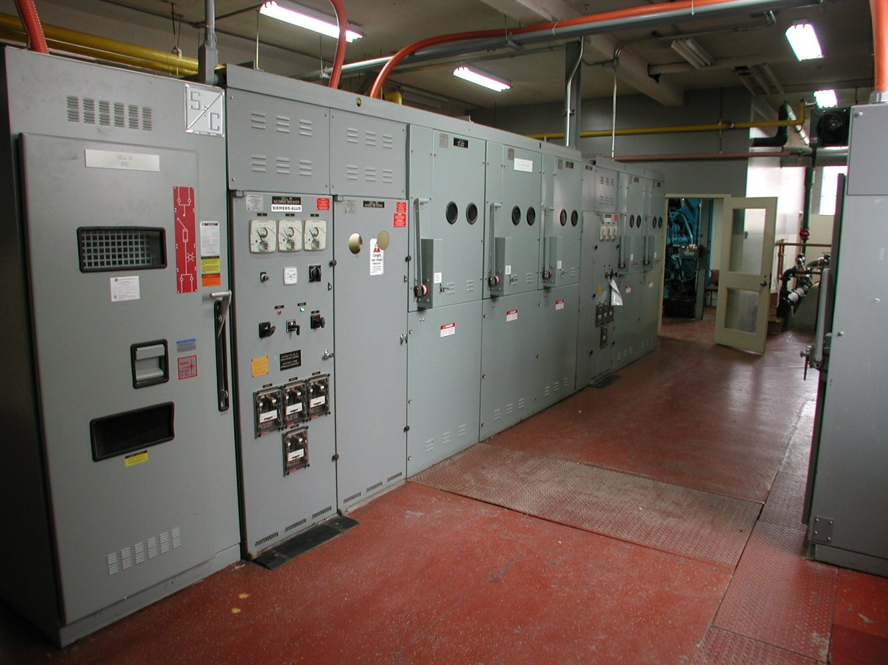
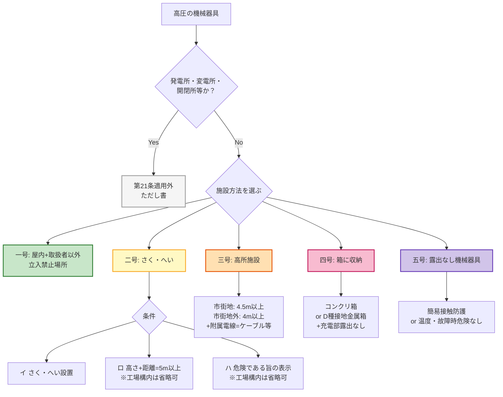

# 電技解釈 第21条 — 高圧の機械器具の施設

!!! warning "📜 一次ソース確認のお願い（2026-05-13 PDF更新）"
    本ページは電気設備の技術基準の解釈（経済産業省告示）を学習用に整理したものです。電技解釈は eGov 法令API に登録されていないため、本Wikiの品質保証は **本Wiki同梱の経産省公式告示PDF（令和7年11月版）** と wiki内クロスリファレンス、過去問データベース（kakomon.yml）への照合に依存しています。**重要な実務判断や試験直前の最終確認は、必ず最新告示PDF（[📕 電気設備の技術基準の解釈 令和7年11月版（本Wiki同梱）](../../assets/pdf/denken-kaishaku-r07-11.pdf) ／ 配布元: [経産省公式ページ](https://www.meti.go.jp/policy/safety_security/industrial_safety/sangyo/electric/detail/setsubi_kijun.html)）に当たってください**。誤記を発見された場合は GitHub Issues でご連絡ください。

!!! note "📊 試験対策メタ"
    **出題頻度**: 🔥🔥🔥🔥🔥（過去14年で 5 回出題、R04下〜R06上の3年連続出題後R07空白）

    **重要度**: B（重要。5施設方法の理解と「5m／4.5m／4m／危険である旨」の数値暗記が核）

    **直近出題**: R06上 問4（論説）／R05下 問4（穴埋）／R04下 問3（穴埋、第29条複合）／H28 問3（論説）／H21 問6（論説）

> 高圧（6.6kV等）の機械器具（変圧器・高圧開閉器・コンデンサ等）に取扱者以外の者が触れて感電するのを防ぐため、施設方法を **5つの号** に列挙して規定する。**ただし書** で「発電所・変電所・開閉所等」は対象外（敷地全体が立入制限のため）。試験の核心は **二号のさく・へい**（高さ＋距離 = **5m以上**）と **三号の地表上 4.5m**（市街地外 **4m**）の数値、および **「危険である旨の表示」** という条文の正確な表現。

| 項目 | 内容 |
|------|------|
| 条文 | 電気設備の技術基準の解釈 第21条 |
| 規定内容 | 高圧の機械器具の施設方法（5号列挙） |
| 性格 | 施設規定（数値規定＋構造規定の混合） |
| 上位省令 | 省令第9条（高圧又は特別高圧の電気機械器具の危険の防止） |
| 関連 | 解釈第22条（特別高圧用の機械器具の施設）／解釈第29条（機械器具の金属製外箱等の接地＝A種）／解釈第38条（避雷器等の施設） |
| **典拠（一次ソース）** | 電験王3 R05下問4 解説（denken-ou.com/houkir5-2-4） ／ jeea.or.jp 解説〔その3〕（jeea.or.jp/course/contents/11103） ／ [📕 経産省告示PDF 令和7年11月版（本Wiki同梱）](../../assets/pdf/denken-kaishaku-r07-11.pdf) |
| **照合日** | 2026-05-10（条文番号 第21条 と正式タイトル「高圧の機械器具の施設」を3ソース横断照合・隣接条文欄を 19.md と整合修正） |
| **隣接条文** | ← [第19条（保安上又は機能上必要な場合における電路の接地）](19.md) ／ 第20条（計器用変成器の二次側電路の接地）[要再確認] ／ [第22条（特別高圧用機械器具）](22.md) → |
| **混同注意** | 同番号の **省令第21条**（架空電線及び地中電線の感電の防止）とは **別物** |

---

## 1. 全体像と要点

| 観点 | ポイント |
|------|----------|
| **対象機器** | **高圧** の機械器具（変圧器、高圧開閉器、コンデンサ、断路器 等） |
| **施設方法** | 次の **5つの号** の **いずれか** で施設する（OR 条件、各号の詳細は下記 ① 全体像SVG） |
| **ただし書** | **発電所、変電所、開閉所** 又はこれらに準ずる場所では本条適用外（既に立入制限あり） |
| **核心の数値** | **5m**（二号 さく+距離） ／ **4.5m**（三号 市街地） ／ **4m**（三号 市街地外） ／ **危険である旨の表示** |
| **核心の例外** | 工場等の構内では二号のロ（5m）・ハ（表示）を省略可（イ＝さく自体は必要、距離と表示のみ免除） |

### ① 全体像 — 第21条が定める5つの施設方法

<svg viewBox="0 0 800 400" xmlns="http://www.w3.org/2000/svg" width="100%" preserveAspectRatio="xMidYMid meet">
<defs>
<filter id="sh21a" x="-20%" y="-20%" width="140%" height="140%"><feDropShadow dx="0" dy="2" stdDeviation="2" flood-opacity="0.15"/></filter>
<linearGradient id="gMain21" x1="0" y1="0" x2="0" y2="1"><stop offset="0%" stop-color="#bbdefb"/><stop offset="100%" stop-color="#90caf9"/></linearGradient>
<linearGradient id="g21a" x1="0" y1="0" x2="0" y2="1"><stop offset="0%" stop-color="#c8e6c9"/><stop offset="100%" stop-color="#a5d6a7"/></linearGradient>
<linearGradient id="g21b" x1="0" y1="0" x2="0" y2="1"><stop offset="0%" stop-color="#fff9c4"/><stop offset="100%" stop-color="#fff176"/></linearGradient>
<linearGradient id="g21c" x1="0" y1="0" x2="0" y2="1"><stop offset="0%" stop-color="#ffe0b2"/><stop offset="100%" stop-color="#ffb74d"/></linearGradient>
<linearGradient id="g21d" x1="0" y1="0" x2="0" y2="1"><stop offset="0%" stop-color="#f8bbd0"/><stop offset="100%" stop-color="#f48fb1"/></linearGradient>
<linearGradient id="g21e" x1="0" y1="0" x2="0" y2="1"><stop offset="0%" stop-color="#d1c4e9"/><stop offset="100%" stop-color="#b39ddb"/></linearGradient>
</defs>
<text x="400" y="26" text-anchor="middle" font-size="15" font-weight="700" fill="#212121">第21条 — 高圧機械器具の5つの施設方法</text>
<text x="400" y="44" text-anchor="middle" font-size="11" fill="#666">人が触れるおそれを物理的に排除する5択（いずれか満たせばOK）</text>
<rect x="280" y="60" width="240" height="56" rx="12" fill="url(#gMain21)" stroke="#0d47a1" stroke-width="2.5" filter="url(#sh21a)"/>
<text x="400" y="84" text-anchor="middle" font-size="14" font-weight="800" fill="#0d47a1">解釈第21条</text>
<text x="400" y="103" text-anchor="middle" font-size="11" fill="#1565c0">高圧の機械器具の施設</text>
<text x="400" y="135" text-anchor="middle" font-size="10" fill="#bf360c">※ ただし書: 発電所・変電所・開閉所等は対象外</text>
<line x1="400" y1="116" x2="100" y2="160" stroke="#0d47a1" stroke-width="1.5" stroke-dasharray="3,2"/>
<line x1="400" y1="116" x2="250" y2="160" stroke="#0d47a1" stroke-width="1.5" stroke-dasharray="3,2"/>
<line x1="400" y1="116" x2="400" y2="160" stroke="#0d47a1" stroke-width="1.5" stroke-dasharray="3,2"/>
<line x1="400" y1="116" x2="550" y2="160" stroke="#0d47a1" stroke-width="1.5" stroke-dasharray="3,2"/>
<line x1="400" y1="116" x2="700" y2="160" stroke="#0d47a1" stroke-width="1.5" stroke-dasharray="3,2"/>
<rect x="20" y="160" width="148" height="218" rx="12" fill="url(#g21a)" stroke="#2e7d32" stroke-width="2" filter="url(#sh21a)"/>
<text x="94" y="184" text-anchor="middle" font-size="12" font-weight="700" fill="#1b5e20">一号</text>
<text x="94" y="202" text-anchor="middle" font-size="11" font-weight="700" fill="#1b5e20">屋内立入禁止</text>
<line x1="35" y1="212" x2="153" y2="212" stroke="#2e7d32" stroke-width="1"/>
<text x="94" y="232" text-anchor="middle" font-size="10" fill="#1b5e20">取扱者以外の者が</text>
<text x="94" y="248" text-anchor="middle" font-size="10" fill="#1b5e20">出入りできない</text>
<text x="94" y="264" text-anchor="middle" font-size="10" fill="#1b5e20">措置をした場所</text>
<text x="94" y="290" text-anchor="middle" font-size="10" fill="#2e7d32">例: 鍵付き電気室</text>
<text x="94" y="306" text-anchor="middle" font-size="10" fill="#2e7d32">　　キュービクル室</text>
<rect x="172" y="160" width="148" height="218" rx="12" fill="url(#g21b)" stroke="#f9a825" stroke-width="2" filter="url(#sh21a)"/>
<text x="246" y="184" text-anchor="middle" font-size="12" font-weight="700" fill="#f57f17">二号</text>
<text x="246" y="202" text-anchor="middle" font-size="11" font-weight="700" fill="#f57f17">さく・へい</text>
<line x1="187" y1="212" x2="305" y2="212" stroke="#f9a825" stroke-width="1"/>
<text x="246" y="232" text-anchor="middle" font-size="10" fill="#f57f17">イ さく・へい設置</text>
<text x="246" y="252" text-anchor="middle" font-size="13" fill="#f57f17">ロ 高さ+距離</text>
<text x="246" y="270" text-anchor="middle" font-size="14" fill="#f57f17">≧ <tspan font-weight="800">5</tspan><tspan font-weight="400" font-size="11">m</tspan></text>
<text x="246" y="290" text-anchor="middle" font-size="10" fill="#f57f17">ハ 危険である旨</text>
<text x="246" y="306" text-anchor="middle" font-size="10" fill="#f57f17">　　の表示</text>
<text x="246" y="334" text-anchor="middle" font-size="9" fill="#f9a825">※ 工場構内はロ・ハ省略可</text>
<rect x="324" y="160" width="148" height="218" rx="12" fill="url(#g21c)" stroke="#e65100" stroke-width="2" filter="url(#sh21a)"/>
<text x="398" y="184" text-anchor="middle" font-size="12" font-weight="700" fill="#bf360c">三号</text>
<text x="398" y="202" text-anchor="middle" font-size="11" font-weight="700" fill="#bf360c">高所施設</text>
<line x1="339" y1="212" x2="457" y2="212" stroke="#e65100" stroke-width="1"/>
<text x="398" y="232" text-anchor="middle" font-size="10" fill="#bf360c">附属高圧電線=</text>
<text x="398" y="248" text-anchor="middle" font-size="10" fill="#bf360c">ケーブル又は</text>
<text x="398" y="264" text-anchor="middle" font-size="10" fill="#bf360c">引下げ用絶縁電線</text>
<text x="398" y="288" text-anchor="middle" font-size="14" fill="#bf360c">地表上 ≧ <tspan font-weight="800">4.5</tspan><tspan font-weight="400" font-size="11">m</tspan></text>
<text x="398" y="306" text-anchor="middle" font-size="10" fill="#bf360c">市街地外: <tspan font-weight="800">4</tspan>m</text>
<text x="398" y="334" text-anchor="middle" font-size="9" fill="#e65100">例: 柱上変圧器</text>
<rect x="476" y="160" width="148" height="218" rx="12" fill="url(#g21d)" stroke="#c2185b" stroke-width="2" filter="url(#sh21a)"/>
<text x="550" y="184" text-anchor="middle" font-size="12" font-weight="700" fill="#880e4f">四号</text>
<text x="550" y="202" text-anchor="middle" font-size="11" font-weight="700" fill="#880e4f">箱に収納</text>
<line x1="491" y1="212" x2="609" y2="212" stroke="#c2185b" stroke-width="1"/>
<text x="550" y="232" text-anchor="middle" font-size="10" fill="#880e4f">コンクリート製箱</text>
<text x="550" y="250" text-anchor="middle" font-size="10" fill="#880e4f">又は</text>
<text x="550" y="270" text-anchor="middle" font-size="11" fill="#880e4f"><tspan font-weight="800">D種接地</tspan>金属箱</text>
<text x="550" y="296" text-anchor="middle" font-size="10" fill="#880e4f">＋ 充電部露出なし</text>
<text x="550" y="334" text-anchor="middle" font-size="9" fill="#c2185b">例: キュービクル</text>
<rect x="628" y="160" width="148" height="218" rx="12" fill="url(#g21e)" stroke="#673ab7" stroke-width="2" filter="url(#sh21a)"/>
<text x="702" y="184" text-anchor="middle" font-size="12" font-weight="700" fill="#311b92">五号</text>
<text x="702" y="202" text-anchor="middle" font-size="11" font-weight="700" fill="#311b92">露出なし機械</text>
<line x1="643" y1="212" x2="761" y2="212" stroke="#673ab7" stroke-width="1"/>
<text x="702" y="232" text-anchor="middle" font-size="10" fill="#311b92">充電部分が</text>
<text x="702" y="248" text-anchor="middle" font-size="10" fill="#311b92">露出しない機械器具</text>
<text x="702" y="270" text-anchor="middle" font-size="10" fill="#311b92">イ 簡易接触防護</text>
<text x="702" y="288" text-anchor="middle" font-size="10" fill="#311b92">ロ 温度上昇等で</text>
<text x="702" y="304" text-anchor="middle" font-size="10" fill="#311b92">　 危険なし</text>
<text x="702" y="334" text-anchor="middle" font-size="9" fill="#673ab7">例: 樹脂モールド機器</text>
</svg>

**読み解き**: 二号と四号がよく似ているが構造が違う — **二号は外側にさくを設けて距離で人を遠ざける方式**、**四号は内側に箱で覆って人と充電部を物理的に分離する方式**。実務でも工場等は **四号（キュービクル）** が圧倒的に多く、屋外柱上変圧器が **三号（高所）**、農村部の屋外変電設備が **二号（さく・へい）** という棲み分けになる。

!!! note "📷 電気室・キュービクル方式の実例（四号の代表例）"
    四号「**コンクリート製箱又はD種接地金属箱に収納**」の代表例として、工場・大規模建物に設置される **電気室（主配電盤・キュービクル方式）** の実例。
    
    <figure markdown>
      { width="500" loading="lazy" }
      <figcaption>大規模建物の電気室（switchgear）— 高圧機械器具を金属製の箱に収納し、充電部分が露出しない構造。第21条 <strong>四号</strong> の典型例。日本のキュービクル式高圧受電設備（JIS C 4620）も基本的にこの「箱収納」方式の一種。画像: <a href="https://commons.wikimedia.org/wiki/File:Electrical_switchgear.JPG" target="_blank" rel="noopener">Electrical switchgear（P199）</a>（Public Domain, Wikimedia Commons・参考・北米仕様）</figcaption>
    </figure>
    
    **第21条 四号 vs 二号の識別ポイント**:
    
    - **四号（箱に収納）** = キュービクル・スイッチギア・分電盤等。**充電部分が外に露出しない**ことが要件。さく・距離・表示は不要
    - **二号（さく・へい）** = 屋外変電設備等。**充電部分は露出**しているが、さくの高さ＋距離合計5m以上＋「危険である旨」の表示で人を遠ざける
    - 試験で「キュービクルに さく・へい必要か？」と問われたら → **不要**（四号適用で二号は要らない・OR条件）

### ② 要点（試験前30秒復習用）

| 観点 | 内容 |
|------|------|
| **適用対象** | **高圧の機械器具**（特別高圧は **第22条**） |
| **適用除外** | **発電所・変電所・開閉所** 又はこれらに準ずる場所（ただし書） |
| **5施設方法** | **一号**（屋内立入禁止）／**二号**（さく+5m+表示）／**三号**（地表上4.5m or 4m）／**四号**（D種箱）／**五号**（露出なし機器） |
| **二号の核心** | さく・へいの **高さ + さくから充電部までの距離 = 5m以上** ＋ **「危険である旨」** の表示 |
| **三号の核心** | 地表上 **4.5m**（市街地）／**4m**（市街地外）以上 ＋ 附属高圧電線=ケーブル又は引下げ用絶縁電線 |
| **工場構内特例** | 二号のロ（5m）・ハ（表示）を省略可（=イのさく自体は必要） |

??? question "セルフチェック: なぜ「5m以上」「4.5m以上」など複数の数値が出てくるのか？"
    **二号の5m** = さくの高さ ＋ さくから充電部までの **距離の和**（手を伸ばしても届かない実用安全距離）。

    **三号の4.5m** = 地表上の **充電部の高さ**（脚立なしで人が触れられない高さ＝市街地で2階の天井付近）。

    **三号の4m**（市街地外） = 人口密度が低い区域での **緩和** 値。

    数値の意味づけ（何を測っているか）が異なる点に注意。「5m＝高さ＋距離の和」「4.5m/4m＝充電部の絶対高さ」と切り分ける。

??? question "セルフチェック: 工場内の高圧キュービクルにさく・へいは必要か？"
    **不要**。キュービクル ＝ 充電部分が露出しない金属製の箱に収納 → **四号** に該当する。四号を満たせば二号（さく・へい）は不要（二者択一の OR 条件）。

    実務でも、現代の工場・ビルの高圧受電設備はほぼ全てキュービクル方式（四号）であり、二号のさく・へいを設けるケースは屋外変電設備や農村部に限定される。

---

## 2. 条文原文

**電気設備の技術基準の解釈 第21条（高圧の機械器具の施設）**

> **高圧の機械器具**（**これに附属する高圧電線であってケーブル以外のものを含む。以下この条において同じ。**）は、次の各号のいずれかにより施設すること。**ただし、発電所又は変電所、開閉所若しくはこれらに準ずる場所に施設する場合はこの限りでない。**
>
> **一**　屋内であって、**取扱者以外の者が出入りできないように措置した場所**に施設すること。
>
> **二**　次により施設すること。ただし、**工場等の構内**においては、**ロ及びハの規定によらないことができる**。
>
> 　イ　人が触れるおそれがないように、機械器具の周囲に**適当なさく、へい等**を設けること。
>
> 　ロ　イの規定により施設するさく、へい等の高さと、当該さく、へい等から機械器具の充電部分までの距離との和を<mark>**5**</mark>**m以上**とすること。
>
> 　ハ　<mark>**危険である**</mark>**旨の表示**をすること。
>
> **三**　機械器具に附属する高圧電線に**ケーブル又は引下げ用高圧絶縁電線**を使用し、機械器具を人が触れるおそれがないように**地表上**<mark>**4.5**</mark>**m（市街地外においては**<mark>**4**</mark>**m）以上**の高さに施設すること。
>
> **四**　機械器具を**コンクリート製の箱又はD種接地工事を施した金属製の箱**に収め、かつ、**充電部分が露出しないように**施設すること。
>
> **五**　**充電部分が露出しない機械器具**を、次のいずれかにより施設すること。
>
> 　イ　**簡易接触防護措置**を施すこと。
>
> 　ロ　温度上昇により、又は故障の際に、その近傍の大地との間に生じる電位差により、人若しくは家畜又は他の工作物に危険のおそれがないように施設すること。

> <small>黄色マーカー（&lt;mark&gt;）は **R05下 問4 で実際に穴埋め出題された語句のみ**（5／危険である／4.5／4 の4語）。R06上 問4・H21 問6 は論説形式で穴埋めなし。**太字** はそれ以外の重要キーワード。</small>

!!! note "出典"
    電気設備の技術基準の解釈（令和7年11月版）第21条 — 上位は省令第9条（高圧又は特別高圧の電気機械器具の危険の防止）。条文本文は電験王3 R05下問4 解説（denken-ou.com/houkir5-2-4）等で照合済み。

---

## 3. 原文解析（ブロック分解）

条文を意味ブロック単位に分解し、それぞれの試験ポイントを整理する。

| 原文ブロック | 意味 | 試験のポイント |
|---|---|---|
| 「**高圧の機械器具**は」 | 適用範囲＝**高圧用**（特別高圧は **第22条** で別建て） | 低圧は対象外。特別高圧との取り違えに注意 |
| 「**（これに附属する高圧電線であってケーブル以外のものを含む。以下この条において同じ。）**」 | **「機械器具」の定義拡張** — 附属する非ケーブル高圧電線（引下げ用高圧絶縁電線等）も含む | 三号で「附属電線=ケーブル又は引下げ用高圧絶縁電線」と限定する根拠。**ケーブル使用時は附属電線ではなく単独電線扱い**となる場面に注意 |
| 「次の各号のいずれかにより施設すること」 | **5号の OR 条件** | 「いずれか」が鍵。複数満たす必要なし |
| 「ただし、**発電所又は変電所、開閉所**…」 | **適用除外** | 発変電所等は敷地全体が立入制限 → 個別の囲い不要 |
| 一号「**取扱者以外の者が出入りできないように措置**」 | **アクセス制御** | 鍵管理・施錠等の運用措置 |
| 二号「機械器具の周囲に**適当なさく、へい等**」 | **物理障壁** | さくの素材は問わないが「適当」=用途に耐える性能 |
| 二号ロ「**高さ**と…**距離との和を5m以上**」 | **2変数の和** | 「さくの高さ単独で5m」ではない。**和** が5m以上 |
| 二号ハ「**危険である旨の表示**」 | **警告掲示** | 条文の正確な表現は「**危険である旨**」。「立入禁止」は誤り |
| 二号ただし書「**工場等の構内**では…ロ及びハの規定によらないことができる」 | **省略特例** | 工場等の閉鎖空間では距離・表示は不要（ただしさく自体は必要） |
| 三号「**ケーブル又は引下げ用高圧絶縁電線**」 | **附属電線の限定** | この条件を満たさないと三号は使えない |
| 三号「**地表上4.5m（市街地外においては4m）以上**」 | **絶対高さ** | 数値は2つ（4.5/4）。市街地区分で切替 |
| 四号「**コンクリート製の箱又はD種接地工事を施した金属製の箱**」 | **収納方式** | コンクリ箱は接地不要、金属箱は **D種接地工事必須** |
| 四号「充電部分が露出しないように」 | **露出禁止** | 箱に入れただけでなく、内部の充電部が外から見えない構造が必要 |
| 五号「充電部分が露出しない機械器具」 | **機器側の構造** | 四号「箱に入れる」と異なり、機器自体に露出がない |
| 五号イ「**簡易接触防護措置**」 | **接触防止措置** | 第1条の用語定義に基づく軽度の防護 |

??? question "セルフチェック: 「さくの高さが5m」と単独で書いてある選択肢は正しいか？"
    **誤り**。条文は **「高さ + 距離 の和」** を5m以上と規定している。さくの高さだけが5mである必要はない。例えば「さく高2m＋距離3m」「さく高1.5m＋距離3.5m」も適合（和=5m）。

??? question "セルフチェック: 「立入禁止の表示」は条文上正しい表現か？"
    **誤り**。条文は **「危険である旨の表示」** と規定している。「立入禁止」「高圧危険」等の類似表現は誤答候補として頻出。条文の **正確な日本語表現** を覚える必要がある。

---

## 4. かみ砕き解説（因果理解）

### なぜ高圧機械器具に施設規定が必要か

高圧（6.6kV等）の機械器具に **取扱者以外の者** が触れると、人体抵抗 数百Ω〜数kΩ に対して数A 以上の電流が流れ、**即座に感電死亡事故** に直結する。

電力会社の発電所、変電所、開閉所は **敷地全体が立入禁止** なので、ただし書で本条適用外とされる（既に他の措置で危険防止済み）。一方で **工場、ビル、電柱に設置される高圧機器** は一般人や工場従業員が近づける環境にあり、ここを規制するのが第21条。

### 5施設方法の物理的意味

| 号 | 隔離方法 | 物理的意義 |
|---|---------|----------|
| **一号** | 場所による隔離 | 屋内＋鍵管理で **そもそも人が近づけない** |
| **二号** | さく・へいによる距離隔離 | 物理障壁＋距離で **手が届かない** |
| **三号** | 高さによる隔離 | 地表上4.5m / 4m で **物理的に届かない** |
| **四号** | 箱による隔離 | 金属/コンクリ箱で **物理的に触れられない** |
| **五号** | 機器構造による隔離 | 充電部が露出していない機器を選定 |

すべて **「人と充電部の物理的接触を防ぐ」** という共通目的だが、実装方法が異なる。設置場所、コスト、運用条件で5択から最適解を選ぶ設計思想。

### なぜ 5m / 4.5m / 4m と 3段階に分けているのか

二号の「5m」と三号の「4.5m／4m」は、すべて **「人が充電部に届かない距離」** という同じ目的でありながら **測り方が違う**。この違いを理解すると、3つの数値の関係が一本の論理で見える。

#### ① 人体側の前提 — 「手の届く最大距離」の見積もり

| 要素 | 寸法（目安） | 出典・備考 |
|---|---|---|
| 身長（成人男性） | 約 1.7m | 統計的標準体格 |
| 腕のリーチ（肩から指先） | 約 0.7m | 直立で挙手したときの追加分 |
| **直立時の到達点** | **約 2.4m** | 身長 + 腕（地面から指先） |
| 軽量脚立（家庭用） | 0.6〜1.5m | 2〜4段の踏み台 |
| 一般的なはしご脚立 | 1.5〜2.0m | 屋外作業で持ち出されやすい |
| **脚立を使った到達点** | **約 4.0〜4.4m** | 直立到達 + 脚立高 |
| 棒や工具を持つ場合 | さらに +1m前後 | 釣り竿、剪定鋏、長尺工具 等 |

→ 「素手で立って触れる範囲」は約 2.4m、「脚立や棒を併用すると」約 4〜5m に達する。**条文の 4m／4.5m／5m は、この上限を超えるよう設定された実用安全距離** と読める。

#### ② 二号「5m」 — さくの高さ＋距離の **和**

二号は **物理障壁（さく・へい）の存在を前提** にした規定。さくを乗り越えるには更にもう一段の障害があるため、地表ベタの裸の高さよりは緩く設定できる。

| パターン | さく高 | 距離 | 和 | 適合 | 想定 |
|---|---|---|---|---|---|
| 高さ重視 | 3m | 2m | 5m | ✅ | 高さで稼ぐ（フェンス＋少距離）|
| 距離重視 | 2m | 3m | 5m | ✅ | 距離で稼ぐ（低めのさく＋広い緩衝域）|
| 中間 | 2.5m | 2.5m | 5m | ✅ | バランス型 |
| 不足 | 2m | 2m | 4m | ❌ | さくも距離も足りない |

**「和」で規定する設計上の意味**:
- さく高単独で 5m は現実的でない（重機やコンクリ基礎が必要、コスト膨大）
- 距離単独で 5m も敷地が狭い場所では成立しない
- 「合計5m」とすることで、現場ごとに **高さと距離を自由に配分** できる柔軟性を確保している

#### ③ 三号「4.5m／4m」 — 充電部の **絶対高さ**（地表 → 充電部）

三号は **さく・へいなしで高さだけで隔離する** 方式（柱上変圧器が典型）。「下から手を伸ばす／脚立を立てる」だけが脅威で、横からの接近は地面で物理的に阻まれる。よって **二号より 0.5m 低くても安全余裕が確保される** という設計思想。

| 区域 | 高さ | 想定接触リスクと根拠 |
|---|---|---|
| **市街地** | **4.5m** 以上 | 建物2階軒先が概ね 4.0〜4.5m。脚立や工具を使った接触の可能性が高い。一般人や子どもが近くを通る頻度も高いため、上限見積もり（脚立+棒で約4m強）を確実に超える **4.5m** とする |
| **市街地外** | **4m** 以上 | 農地や山間部では人口密度が低く、脚立を持ち込む頻度も少ない。家屋も低層が主で 2階軒先より低い。素手到達（2.4m）と脚立到達（〜4m）の上限ぎりぎりに **4m** で緩和 |

→ 市街地と市街地外で **0.5m の差** がつくのは、人口密度と建物高さ（≒ 接触機会と接触手段）の差を反映したもの。

#### ④ 二号「5m」と三号「4.5m」の関係 — 「和」と「絶対高さ」で測り方が違う

| 観点 | 二号 | 三号 |
|---|---|---|
| 障壁 | さく・へいあり（2段階突破が必要）| なし（高さのみ）|
| 数値の意味 | **高さ + 距離 の和** | **充電部の絶対高さ** |
| 数値（市街地）| **5m** | **4.5m** |
| 緩和の理由 | さく自体が物理障壁 → 0.5m緩和 | 立入頻度の高い市街地は厳しめ |
| 例 | 屋外開放型変電設備 | 柱上変圧器 |

3つの数値はバラバラに見えるが、**「人体到達上限 + 安全マージン」** という一本の物理ロジックで読み解ける。

!!! warning "数値根拠のガード"
    上記の「人体寸法 → 4〜5m」という説明は、暗記補助のための **物理的読み解き** であって、経産省告示や日本電気協会の **公式数学的導出ではない**。条文制定時の実際の根拠は、IEC/JIS の安全距離規格、過去の事故統計、電力会社の架線設計慣例などが総合的に勘案された結果と推測されるが、本Wikiでは一次資料を確認できていない。試験対策としては「**人体到達上限を超える設計値**」と理解した上で、**4m／4.5m／5m の3点セットを正確に暗記** することが優先。

工場敷地外の **柱上変圧器** が市街地と市街地外で別寸法になる根拠は上記④の枠組みで一貫している。実務では電力会社の架線設計基準と整合する。

### なぜ四号で D種接地工事が必要か

金属製の箱は **充電部からの絶縁劣化** で **箱外面が高圧化** するリスクがある。**D種接地工事**（接地抵抗 100Ω以下）を施せば、漏電時に大地へ電流を逃がせる → 箱に触れた人の感電を防止。

なお、**箱内部の機械器具自体の金属外箱**（変圧器のタンク等）は **解釈第29条** により別途 **A種接地工事**（接地抵抗 10Ω以下）が必要。**箱の接地（D種）と機器の接地（A種）は別物**。

!!! warning "ひっかけ：箱接地と機器外箱接地の混同"
    - **第21条 四号の D種** = 機器を **収める箱** の接地（コンクリ箱は不要、金属箱のみ）
    - **第29条の A種** = 機器自体（変圧器、遮断器 等）の **金属製外箱や台** の接地
    - 試験では「高圧機器の外箱接地は何種か」と聞かれたら **A種**（第29条）が正解

---

## 5. 図で理解

### 施設方法の選択フロー

### 二号「さく・へい」— 高さ＋距離 = 5m以上の図解

<svg viewBox="0 0 800 320" xmlns="http://www.w3.org/2000/svg" width="100%" preserveAspectRatio="xMidYMid meet">
<defs>
<filter id="sh21b" x="-20%" y="-20%" width="140%" height="140%"><feDropShadow dx="0" dy="2" stdDeviation="2" flood-opacity="0.15"/></filter>
</defs>
<text x="400" y="24" text-anchor="middle" font-size="15" font-weight="700" fill="#212121">二号: さく・へいの高さ ＋ さくから充電部までの距離 ≧ 5m</text>
<text x="400" y="42" text-anchor="middle" font-size="11" fill="#666">和が5m以上であれば、高さと距離の配分は自由</text>
<line x1="60" y1="270" x2="740" y2="270" stroke="#5d4037" stroke-width="2"/>
<rect x="60" y="262" width="680" height="8" fill="#a1887f"/>
<rect x="120" y="190" width="20" height="80" fill="#90caf9" stroke="#0d47a1" stroke-width="1.5"/>
<text x="130" y="280" text-anchor="middle" font-size="9" fill="#0d47a1">さく高2m</text>
<line x1="115" y1="270" x2="115" y2="190" stroke="#0d47a1" stroke-width="1" stroke-dasharray="2,2"/>
<polygon points="111,200 119,200 115,190" fill="#0d47a1"/>
<polygon points="111,260 119,260 115,270" fill="#0d47a1"/>
<text x="100" y="232" text-anchor="middle" font-size="10" font-weight="700" fill="#0d47a1">2m</text>
<line x1="140" y1="208" x2="240" y2="208" stroke="#f57f17" stroke-width="2" stroke-dasharray="3,2"/>
<polygon points="140,204 140,212 132,208" fill="#f57f17"/>
<polygon points="240,204 240,212 248,208" fill="#f57f17"/>
<text x="190" y="200" text-anchor="middle" font-size="10" font-weight="700" fill="#f57f17">距離3m</text>
<rect x="240" y="180" width="40" height="40" rx="4" fill="#ef5350" stroke="#b71c1c" stroke-width="2"/>
<text x="260" y="207" text-anchor="middle" font-size="10" font-weight="700" fill="#fff">充電部</text>
<text x="190" y="298" text-anchor="middle" font-size="11" font-weight="800" fill="#1b5e20">和=5m ✅ 適合</text>
<rect x="345" y="220" width="20" height="50" fill="#90caf9" stroke="#0d47a1" stroke-width="1.5"/>
<text x="355" y="280" text-anchor="middle" font-size="9" fill="#0d47a1">さく高1.5m</text>
<line x1="340" y1="270" x2="340" y2="220" stroke="#0d47a1" stroke-width="1" stroke-dasharray="2,2"/>
<polygon points="336,230 344,230 340,220" fill="#0d47a1"/>
<polygon points="336,260 344,260 340,270" fill="#0d47a1"/>
<text x="328" y="250" text-anchor="middle" font-size="10" font-weight="700" fill="#0d47a1">1.5m</text>
<line x1="365" y1="238" x2="495" y2="238" stroke="#f57f17" stroke-width="2" stroke-dasharray="3,2"/>
<polygon points="365,234 365,242 357,238" fill="#f57f17"/>
<polygon points="495,234 495,242 503,238" fill="#f57f17"/>
<text x="430" y="230" text-anchor="middle" font-size="10" font-weight="700" fill="#f57f17">距離3.5m</text>
<rect x="495" y="210" width="40" height="40" rx="4" fill="#ef5350" stroke="#b71c1c" stroke-width="2"/>
<text x="515" y="237" text-anchor="middle" font-size="10" font-weight="700" fill="#fff">充電部</text>
<text x="430" y="298" text-anchor="middle" font-size="11" font-weight="800" fill="#1b5e20">和=5m ✅ 適合</text>
<rect x="600" y="200" width="20" height="70" fill="#90caf9" stroke="#0d47a1" stroke-width="1.5"/>
<text x="610" y="280" text-anchor="middle" font-size="9" fill="#0d47a1">さく高2m</text>
<line x1="595" y1="270" x2="595" y2="200" stroke="#0d47a1" stroke-width="1" stroke-dasharray="2,2"/>
<polygon points="591,210 599,210 595,200" fill="#0d47a1"/>
<polygon points="591,260 599,260 595,270" fill="#0d47a1"/>
<text x="583" y="240" text-anchor="middle" font-size="10" font-weight="700" fill="#0d47a1">2m</text>
<line x1="620" y1="218" x2="700" y2="218" stroke="#d84315" stroke-width="2" stroke-dasharray="3,2"/>
<polygon points="620,214 620,222 612,218" fill="#d84315"/>
<polygon points="700,214 700,222 708,218" fill="#d84315"/>
<text x="660" y="210" text-anchor="middle" font-size="10" font-weight="700" fill="#d84315">距離2m</text>
<rect x="700" y="190" width="40" height="40" rx="4" fill="#ef5350" stroke="#b71c1c" stroke-width="2"/>
<text x="720" y="217" text-anchor="middle" font-size="10" font-weight="700" fill="#fff">充電部</text>
<text x="660" y="298" text-anchor="middle" font-size="11" font-weight="800" fill="#bf360c">和=4m ❌ 不適合</text>
<text x="400" y="74" text-anchor="middle" font-size="10" fill="#1565c0">＋ 危険である旨の表示が必須（工場構内では省略可）</text>
</svg>

**読み解き**: 「**和** が5m以上」が条文の正確な要件。「さくの高さ単独で5m」ではない。実務では人が乗り越えられない高さ（2m前後）を確保しつつ、残りを距離で稼ぐ設計が一般的。3つ目の例（和4m）は不適合。

### 三号「地表上4.5m / 市街地外4m」— 柱上変圧器の典型

<svg viewBox="0 0 800 340" xmlns="http://www.w3.org/2000/svg" width="100%" preserveAspectRatio="xMidYMid meet">
<defs>
<filter id="sh21c" x="-20%" y="-20%" width="140%" height="140%"><feDropShadow dx="0" dy="2" stdDeviation="2" flood-opacity="0.12"/></filter>
</defs>
<text x="400" y="24" text-anchor="middle" font-size="15" font-weight="700" fill="#212121">三号: 充電部の地表上の高さ規定</text>
<text x="400" y="42" text-anchor="middle" font-size="11" fill="#666">市街地は人口密度高 → 厳しめ／市街地外は緩和</text>
<line x1="60" y1="290" x2="740" y2="290" stroke="#5d4037" stroke-width="2"/>
<rect x="60" y="282" width="680" height="8" fill="#a1887f"/>
<rect x="170" y="290" width="280" height="20" fill="#bdbdbd" opacity="0.4"/>
<text x="310" y="304" text-anchor="middle" font-size="11" font-weight="700" fill="#424242">市街地</text>
<rect x="450" y="290" width="270" height="20" fill="#c8e6c9" opacity="0.4"/>
<text x="585" y="304" text-anchor="middle" font-size="11" font-weight="700" fill="#1b5e20">市街地外</text>
<rect x="305" y="100" width="10" height="180" fill="#5d4037"/>
<rect x="290" y="105" width="40" height="30" rx="4" fill="#90caf9" stroke="#0d47a1" stroke-width="2"/>
<text x="310" y="125" text-anchor="middle" font-size="10" font-weight="700" fill="#0d47a1">変圧器</text>
<line x1="240" y1="120" x2="290" y2="120" stroke="#d32f2f" stroke-width="2"/>
<line x1="330" y1="120" x2="380" y2="120" stroke="#d32f2f" stroke-width="2"/>
<line x1="240" y1="120" x2="240" y2="100" stroke="#5d4037" stroke-width="1"/>
<line x1="380" y1="120" x2="380" y2="100" stroke="#5d4037" stroke-width="1"/>
<line x1="305" y1="280" x2="305" y2="135" stroke="#1b5e20" stroke-width="1.5" stroke-dasharray="3,2"/>
<polygon points="301,145 309,145 305,135" fill="#1b5e20"/>
<polygon points="301,275 309,275 305,285" fill="#1b5e20"/>
<text x="270" y="220" text-anchor="middle" font-size="13" font-weight="800" fill="#1b5e20">≧ <tspan font-weight="800">4.5</tspan><tspan font-weight="400" font-size="11">m</tspan></text>
<rect x="595" y="135" width="10" height="145" fill="#5d4037"/>
<rect x="580" y="140" width="40" height="30" rx="4" fill="#90caf9" stroke="#0d47a1" stroke-width="2"/>
<text x="600" y="160" text-anchor="middle" font-size="10" font-weight="700" fill="#0d47a1">変圧器</text>
<line x1="530" y1="155" x2="580" y2="155" stroke="#d32f2f" stroke-width="2"/>
<line x1="620" y1="155" x2="670" y2="155" stroke="#d32f2f" stroke-width="2"/>
<line x1="530" y1="155" x2="530" y2="135" stroke="#5d4037" stroke-width="1"/>
<line x1="670" y1="155" x2="670" y2="135" stroke="#5d4037" stroke-width="1"/>
<line x1="595" y1="280" x2="595" y2="170" stroke="#bf360c" stroke-width="1.5" stroke-dasharray="3,2"/>
<polygon points="591,180 599,180 595,170" fill="#bf360c"/>
<polygon points="591,275 599,275 595,285" fill="#bf360c"/>
<text x="555" y="232" text-anchor="middle" font-size="13" font-weight="800" fill="#bf360c">≧ <tspan font-weight="800">4</tspan><tspan font-weight="400" font-size="11">m</tspan></text>
<rect x="80" y="180" width="50" height="60" fill="#fdd835" stroke="#f57f17" stroke-width="2" rx="4"/>
<text x="105" y="215" text-anchor="middle" font-size="9" fill="#f57f17">家屋</text>
<rect x="690" y="220" width="40" height="60" fill="#fdd835" stroke="#f57f17" stroke-width="2" rx="4"/>
<text x="710" y="252" text-anchor="middle" font-size="9" fill="#f57f17">畑</text>
<text x="400" y="74" text-anchor="middle" font-size="11" font-weight="700" fill="#0d47a1">附属する高圧電線 = ケーブル 又は 引下げ用高圧絶縁電線</text>
<text x="400" y="328" text-anchor="middle" font-size="10" fill="#666">※ 充電部の地表上の高さ ≠ さくの高さ（二号と混同しないこと）</text>
</svg>

**読み解き**: 三号の「地表上4.5m / 4m」は **充電部の高さそのもの**（二号の「和」とは別概念）。柱上変圧器の標準設置高さは概ね4.5m前後で、市街地と市街地外の境界で実装が異なる。

---

## 6. 適用シーン別の措置選び方

### 典型4シーンを絵で見る

<svg viewBox="0 0 800 360" xmlns="http://www.w3.org/2000/svg" width="100%" preserveAspectRatio="xMidYMid meet">
<defs>
<filter id="sh21d" x="-20%" y="-20%" width="140%" height="140%"><feDropShadow dx="0" dy="2" stdDeviation="2" flood-opacity="0.15"/></filter>
<linearGradient id="g21scn_a" x1="0" y1="0" x2="0" y2="1"><stop offset="0%" stop-color="#c8e6c9"/><stop offset="100%" stop-color="#a5d6a7"/></linearGradient>
<linearGradient id="g21scn_b" x1="0" y1="0" x2="0" y2="1"><stop offset="0%" stop-color="#fff9c4"/><stop offset="100%" stop-color="#fff176"/></linearGradient>
<linearGradient id="g21scn_c" x1="0" y1="0" x2="0" y2="1"><stop offset="0%" stop-color="#ffe0b2"/><stop offset="100%" stop-color="#ffb74d"/></linearGradient>
<linearGradient id="g21scn_d" x1="0" y1="0" x2="0" y2="1"><stop offset="0%" stop-color="#f8bbd0"/><stop offset="100%" stop-color="#f48fb1"/></linearGradient>
</defs>
<text x="400" y="22" text-anchor="middle" font-size="15" font-weight="700" fill="#212121">適用シーン別の典型例 — どの号で施設するか</text>
<text x="400" y="40" text-anchor="middle" font-size="11" fill="#666">屋内変電室 / 屋外変電設備 / 柱上変圧器 / キュービクル の4パターン</text>

<rect x="14" y="56" width="186" height="280" rx="10" fill="url(#g21scn_a)" stroke="#2e7d32" stroke-width="2" filter="url(#sh21d)"/>
<text x="107" y="78" text-anchor="middle" font-size="13" font-weight="800" fill="#1b5e20">一号</text>
<text x="107" y="96" text-anchor="middle" font-size="11" font-weight="700" fill="#1b5e20">屋内変電室</text>
<line x1="30" y1="104" x2="184" y2="104" stroke="#2e7d32" stroke-width="1"/>
<rect x="40" y="130" width="134" height="120" fill="#fff" stroke="#1b5e20" stroke-width="2"/>
<rect x="40" y="130" width="134" height="22" fill="#a5d6a7"/>
<text x="107" y="146" text-anchor="middle" font-size="10" font-weight="700" fill="#1b5e20">変電室</text>
<rect x="60" y="165" width="38" height="60" fill="#90caf9" stroke="#0d47a1" stroke-width="1.5"/>
<text x="79" y="200" text-anchor="middle" font-size="9" fill="#0d47a1">高圧</text>
<text x="79" y="213" text-anchor="middle" font-size="9" fill="#0d47a1">機器</text>
<rect x="115" y="165" width="38" height="60" fill="#90caf9" stroke="#0d47a1" stroke-width="1.5"/>
<text x="134" y="200" text-anchor="middle" font-size="9" fill="#0d47a1">高圧</text>
<text x="134" y="213" text-anchor="middle" font-size="9" fill="#0d47a1">機器</text>
<rect x="98" y="232" width="18" height="18" fill="#ffeb3b" stroke="#f57f17" stroke-width="1.5"/>
<circle cx="107" cy="241" r="3" fill="#5d4037"/>
<text x="107" y="262" text-anchor="middle" font-size="10" font-weight="700" fill="#1b5e20">鍵管理</text>
<text x="107" y="282" text-anchor="middle" font-size="10" fill="#1b5e20">取扱者以外</text>
<text x="107" y="298" text-anchor="middle" font-size="10" fill="#1b5e20">立入禁止</text>
<text x="107" y="320" text-anchor="middle" font-size="9" fill="#2e7d32">例: 中規模ビル</text>

<rect x="206" y="56" width="186" height="280" rx="10" fill="url(#g21scn_b)" stroke="#f9a825" stroke-width="2" filter="url(#sh21d)"/>
<text x="299" y="78" text-anchor="middle" font-size="13" font-weight="800" fill="#f57f17">二号</text>
<text x="299" y="96" text-anchor="middle" font-size="11" font-weight="700" fill="#f57f17">屋外変電設備</text>
<line x1="222" y1="104" x2="376" y2="104" stroke="#f9a825" stroke-width="1"/>
<line x1="220" y1="280" x2="378" y2="280" stroke="#5d4037" stroke-width="2"/>
<line x1="240" y1="280" x2="240" y2="200" stroke="#6d4c41" stroke-width="2"/>
<line x1="248" y1="280" x2="248" y2="200" stroke="#6d4c41" stroke-width="2"/>
<line x1="256" y1="280" x2="256" y2="200" stroke="#6d4c41" stroke-width="2"/>
<line x1="264" y1="280" x2="264" y2="200" stroke="#6d4c41" stroke-width="2"/>
<line x1="272" y1="280" x2="272" y2="200" stroke="#6d4c41" stroke-width="2"/>
<line x1="280" y1="280" x2="280" y2="200" stroke="#6d4c41" stroke-width="2"/>
<rect x="300" y="220" width="50" height="40" rx="4" fill="#ef5350" stroke="#b71c1c" stroke-width="2"/>
<text x="325" y="244" text-anchor="middle" font-size="9" font-weight="700" fill="#fff">高圧機器</text>
<line x1="290" y1="232" x2="298" y2="232" stroke="#bf360c" stroke-width="2" stroke-dasharray="3,2"/>
<text x="295" y="226" text-anchor="middle" font-size="8" font-weight="700" fill="#bf360c">距離</text>
<line x1="225" y1="200" x2="285" y2="200" stroke="#bf360c" stroke-width="1.5" stroke-dasharray="2,2"/>
<text x="255" y="195" text-anchor="middle" font-size="9" font-weight="700" fill="#bf360c">高さ</text>
<rect x="232" y="208" width="20" height="14" fill="#ffeb3b" stroke="#bf360c" stroke-width="1.5"/>
<text x="242" y="218" text-anchor="middle" font-size="6.5" fill="#bf360c">危険</text>
<text x="299" y="298" text-anchor="middle" font-size="11" font-weight="800" fill="#f57f17">高さ+距離 ≧ 5m</text>
<text x="299" y="314" text-anchor="middle" font-size="9" fill="#f57f17">＋「危険である旨」表示</text>
<text x="299" y="332" text-anchor="middle" font-size="9" fill="#f9a825">工場構内はロ・ハ省略可</text>

<rect x="398" y="56" width="186" height="280" rx="10" fill="url(#g21scn_c)" stroke="#e65100" stroke-width="2" filter="url(#sh21d)"/>
<text x="491" y="78" text-anchor="middle" font-size="13" font-weight="800" fill="#bf360c">三号</text>
<text x="491" y="96" text-anchor="middle" font-size="11" font-weight="700" fill="#bf360c">柱上変圧器</text>
<line x1="414" y1="104" x2="568" y2="104" stroke="#e65100" stroke-width="1"/>
<line x1="410" y1="295" x2="572" y2="295" stroke="#5d4037" stroke-width="2"/>
<rect x="486" y="135" width="10" height="160" fill="#5d4037"/>
<rect x="471" y="140" width="40" height="30" rx="4" fill="#90caf9" stroke="#0d47a1" stroke-width="2"/>
<text x="491" y="160" text-anchor="middle" font-size="9" font-weight="700" fill="#0d47a1">変圧器</text>
<line x1="425" y1="155" x2="471" y2="155" stroke="#d32f2f" stroke-width="2"/>
<line x1="511" y1="155" x2="565" y2="155" stroke="#d32f2f" stroke-width="2"/>
<line x1="491" y1="295" x2="491" y2="170" stroke="#bf360c" stroke-width="1.5" stroke-dasharray="3,2"/>
<polygon points="487,180 495,180 491,170" fill="#bf360c"/>
<polygon points="487,290 495,290 491,295" fill="#bf360c"/>
<text x="463" y="240" text-anchor="middle" font-size="12" font-weight="800" fill="#bf360c">4.5m</text>
<text x="463" y="258" text-anchor="middle" font-size="8" fill="#bf360c">市街地外:4m</text>
<text x="491" y="314" text-anchor="middle" font-size="9" font-weight="700" fill="#bf360c">附属電線=ケーブル</text>
<text x="491" y="328" text-anchor="middle" font-size="9" font-weight="700" fill="#bf360c">/引下げ用絶縁</text>

<rect x="590" y="56" width="186" height="280" rx="10" fill="url(#g21scn_d)" stroke="#c2185b" stroke-width="2" filter="url(#sh21d)"/>
<text x="683" y="78" text-anchor="middle" font-size="13" font-weight="800" fill="#880e4f">四号</text>
<text x="683" y="96" text-anchor="middle" font-size="11" font-weight="700" fill="#880e4f">キュービクル</text>
<line x1="606" y1="104" x2="760" y2="104" stroke="#c2185b" stroke-width="1"/>
<rect x="616" y="140" width="134" height="130" fill="#9e9e9e" stroke="#424242" stroke-width="2.5"/>
<rect x="622" y="146" width="122" height="118" fill="#bdbdbd" stroke="#616161" stroke-width="1.5"/>
<text x="683" y="170" text-anchor="middle" font-size="10" font-weight="700" fill="#212121">金属箱</text>
<rect x="635" y="180" width="42" height="50" fill="#90caf9" stroke="#0d47a1" stroke-width="1.5"/>
<text x="656" y="210" text-anchor="middle" font-size="8" fill="#0d47a1">充電部</text>
<rect x="689" y="180" width="42" height="50" fill="#90caf9" stroke="#0d47a1" stroke-width="1.5"/>
<text x="710" y="210" text-anchor="middle" font-size="8" fill="#0d47a1">充電部</text>
<text x="683" y="248" text-anchor="middle" font-size="9" font-weight="700" fill="#212121">露出なし</text>
<line x1="683" y1="270" x2="683" y2="305" stroke="#388e3c" stroke-width="2.5"/>
<line x1="668" y1="305" x2="698" y2="305" stroke="#388e3c" stroke-width="3"/>
<line x1="672" y1="312" x2="694" y2="312" stroke="#388e3c" stroke-width="2"/>
<line x1="676" y1="319" x2="690" y2="319" stroke="#388e3c" stroke-width="1.5"/>
<text x="683" y="332" text-anchor="middle" font-size="10" font-weight="800" fill="#388e3c">D種接地</text>

<text x="400" y="354" text-anchor="middle" font-size="9" fill="#666">※ 五号（充電部分が露出しない機械器具＋簡易接触防護等）は樹脂モールド機器など特殊用途</text>
</svg>

**読み解き**: 設置環境とコスト制約で号を選ぶ。屋内なら一号（鍵管理）、屋外で敷地に余裕があれば二号（さく＋距離）、電柱なら三号（高所）、コンパクトに収めたい工場やビルなら四号（キュービクル）。実務では四号が圧倒的多数。

### 各シーンの要点

| シーン | 推奨号 | 措置の要点 |
|------|------|----------|
| 屋内変電室（中規模ビル） | **一号** | 鍵管理＋取扱者以外立入禁止の運用 |
| 屋外開放型変電設備（農村部、大型発電所周辺） | **二号** | さく・へい等＋（高さ＋距離）≧5m＋「危険である旨」。工場構内であればロ・ハ省略で **さくのみ** でも可 |
| 屋外柱上変圧器（電柱の上） | **三号** | 地表上4.5m（市街地外4m）＋附属電線はケーブル又は引下げ用高圧絶縁電線 |
| キュービクル受電（工場、ビルの標準） | **四号** | D種接地金属箱＋充電部露出なし。さくと距離は不要、危険表示は箱表面に貼付 |
| 樹脂モールド機器 等 | **五号** | 機器自体に充電部露出がない＋簡易接触防護等 |

---

## 📒 解いたら記録 → 間違えたら間違えノートへ（PDCAを回す）

!!! abstract "各過去問の「理解した／曖昧／間違えた」ボタンで解答結果を残せます"
    上の過去問の各ブロック下に出る **理解度ボタン（〇理解した／△曖昧／×間違えた）** とメモ欄で、解いた結果がブラウザの localStorage に保存されます（**Do→Check**）。

    👉 [**間違えノートを開く（法規Wiki／直前まちがいノート）**](https://kfurufuru.github.io/secretary-portal-public/denken-hoki-wiki.html#chokuzen-machigai)

    - **×間違えた** を押した問題は間違えノートに **自動集約** され、間違えた問題だけ抽出して再演習できる（**Check→Act**）
    - メモ欄に「なぜ間違えたか」を残すと、次回復習時に文脈ごと復元される
    - 同一オリジン（kfurufuru.github.io）配下なので、本Wiki／法規Wiki／理論Wiki のチェック記録は **すべて同じ間違えノートに集約**（横断PDCA）

---

## 7. 関連条文との関係

### 上位省令との関係

**省令第9条**（高圧又は特別高圧の電気機械器具の危険の防止）が上位概念。

> 高圧又は特別高圧の電気機械器具は、取扱者以外の者が容易に触れるおそれがないように施設しなければならない。

第21条は省令第9条のうち **「高圧」** 側の具体策。**「特別高圧」** 側は **第22条** で規定される。

### 関連解釈条文

| 条文 | 関連内容 |
|------|------|
| **解釈第22条** | **特別高圧用の機械器具の施設**（第21条と対をなす特高版） |
| **解釈第29条** | **機械器具の金属製外箱等の接地** = 高圧・特高は **A種接地工事**（10Ω以下） |
| **解釈第38条** | 避雷器等の施設（別論点・混同に注意） |
| **解釈第17条** | A種接地工事の方法（接地線太さ・接地抵抗等の詳細） |
| **解釈第19条** | C種・D種接地工事の方法（四号で使うD種の根拠） |

### 接地工事の使い分け（混同注意）

| 接地工事 | 対象 | 接地抵抗 | 根拠条文 |
|------|------|---------|---------|
| **A種** | 高圧・特高機器の **金属製外箱・台** | 10Ω以下 | 解釈第29条 |
| **D種** | 第21条 四号の **金属製の箱** | 100Ω以下 | 解釈第21条 四号 |

「機器の外箱」と「機器を収める箱」で接地種別が異なる点に要注意。

### 省令と解釈の役割分担

| レイヤー | 規定内容 |
|------|------|
| **省令第9条** | 「危険の防止」の **原則** 提示（具体的数値なし） |
| **解釈第21条** | 高圧側の **5施設方法と数値**（5m／4.5m／4m／D種等） |
| **解釈第22条** | 特別高圧側の施設方法（電圧区分別の高さ規定） |

### 高圧（第21条）vs 特別高圧（第22条）の距離比較

第21条の「**5m一律**」と異なり、第22条（特別高圧用）は **電圧区分により距離が変わる**（22-1表）。試験では「特別高圧でも5m」「高圧でも6m」のような取り違えが頻出。

| 区分 | 適用条文 | さく高さ＋距離（または地表上の高さ）|
|---|---|---|
| 高圧（600V超〜7,000V以下） | **第21条** | **5m** 一律 |
| 特別高圧 35,000V以下 | **第22条** 22-1表 | **5m**（高圧と同じ） |
| 特別高圧 35,000V超 160,000V以下 | **第22条** 22-1表 | **6m** |
| 特別高圧 160,000V超 | **第22条** 22-1表 | **(6 + c) m** ※ |

> ※ **c の計算式**: c = ⌈(使用電圧[V] − 160,000) ÷ 10,000⌉ × **0.12**（端数切上げ）
>
> **計算例（220,000V の場合）**: c = (220,000 − 160,000) ÷ 10,000 × 0.12 = 6 × 0.12 = **0.72m** → 必要高さ **6.72m**

!!! tip "覚え方"
    - 高圧（〜7kV）は **5m 一律**（高圧の電圧帯が狭いため）
    - 特別高圧は「**35kV以下=5m / 35kV超160kV以下=6m / それ超=6m+電圧分**」の3段階
    - 35kV境界 = 「高圧と同じ5mで済む特別高圧の上限」
    - 160kV境界 = 「6m固定の上限」「これを超えると電圧依存で増加」

!!! warning "ひっかけ：第21条と第22条の混同"
    - **「特別高圧でも5m」だけ覚える** → 35kV超では誤り（**6m** が必要）
    - **「160kV超は7m」と暗記** → 誤り（公式 **6 + 0.12×n** で計算する）
    - **第21条で電圧区分を持ち出す** → 第21条は **電圧区分なし**。区分は第22条の話

---

## 8. 頻出ひっかけと落とし穴

試験で失点しやすいポイントを重大度別に整理した。

### 🔴 致命的（これを間違えたら即失点）

| # | ❌ 誤った認識 | ✅ 正しい認識 |
|---|--------------|--------------|
| 1 | 「**さくの高さ**5m以上」 | **「高さ + 距離 の和」** が5m以上（さく単独ではない） |
| 2 | 表示は **「立入禁止」** の表示 | 条文は **「危険である旨」** の表示。「立入禁止」は誤り |
| 3 | 市街地 4m／市街地外 4.5m（逆転） | **市街地 4.5m**／**市街地外 4m**（市街地が厳しい） |

### 🟡 注意（出題頻度高い）

| # | ❌ 誤った認識 | ✅ 正しい認識 |
|---|--------------|--------------|
| 4 | キュービクルにもさく・へいが必要 | **四号**（充電部露出なし）でさく不要 |
| 5 | 三号の高さ規定にさく・へいの追加が必要 | 三号は **高さだけで成立**。さく不要 |
| 6 | 工場構内ではさく自体も省略可 | 工場構内で省略できるのは **二号のロ・ハ** のみ。**イ（さく自体）は必要** |
| 7 | 高圧機器の外箱接地はD種 | 機器自体の **金属製外箱** は **A種**（解釈第29条）。**D種は四号の「収める箱」**側 |

### 🟢 軽微（余裕があれば）

| # | ❌ 誤った認識 | ✅ 正しい認識 |
|---|--------------|--------------|
| 8 | 第21条はすべての高圧機器に適用 | **発電所・変電所・開閉所等** はただし書で **適用外** |
| 9 | 三号の附属電線は何でも良い | **ケーブル又は引下げ用高圧絶縁電線** に限定 |
| 10 | 第22条は第21条と同内容 | **第22条 = 特別高圧用**（第21条は高圧用）。電圧区分が異なる |

---

## 9. 穴埋め過去問チャレンジ

!!! abstract "問題1: 二号のさく・へい（R05下 問4 型）"
    高圧の機械器具を屋外に施設する場合は、さく・へい等を設けて施設すること。さく・へいを設ける場合は、さく・へいの高さとさく・へいから充電部分までの距離との和を（　ア　）m以上とし、かつ、さく・へい等に（　イ　）旨の表示をすること。充電部分が地表上（　ウ　）m（市街地外においては（　エ　）m）以上の高さにある場合は、さく・へい等を省略できる。

??? success "解答"
    - ア = **5**
    - イ = **危険である**
    - ウ = **4.5**
    - エ = **4**

??? note "解説と復習導線"
    （ア）の「**5**」と（イ）の「**危険である**」は最頻出。「**立入禁止**」「**4.5**」（ア欄）は典型ひっかけ選択肢。

    ---

    **❌ 間違えた場合の復習先**

    - **数値「5m / 4.5m / 4m」の根拠** → 本記事「[**4. かみ砕き解説**](https://kfurufuru.github.io/denken-wiki/articles/kaishaku/21/#4)」（なぜ「和で5m」「市街地4.5m / 市街地外4m」か）／「[**5. 図で理解**](https://kfurufuru.github.io/denken-wiki/articles/kaishaku/21/#5)」（二号さく・へいSVG、および三号地表上4.5m/4m SVG）
    - **「危険である旨」の正確な表現**（「立入禁止」と取り違え） → 本記事「[**2. 条文原文**](https://kfurufuru.github.io/denken-wiki/articles/kaishaku/21/#2)」二号ハ ／「[**8. 頻出ひっかけ**](https://kfurufuru.github.io/denken-wiki/articles/kaishaku/21/#8)」#2
    - **市街地 4.5m / 市街地外 4m の混同**（逆転ひっかけ） → 本記事「[**8. 頻出ひっかけ**](https://kfurufuru.github.io/denken-wiki/articles/kaishaku/21/#8)」#3 ／「[**10. まぎらわしい選択肢**](https://kfurufuru.github.io/denken-wiki/articles/kaishaku/21/#10)」
    - **横断的に押さえる** → [テーマ: 高圧機械器具の施設](../../themes/koatsu-kiki-shisetsu.md)

!!! abstract "問題2: 適用除外（ただし書）"
    高圧の機械器具は、次の各号のいずれかにより施設すること。ただし、（　ア　）又は変電所、（　イ　）若しくはこれらに準ずる場所に施設する場合はこの限りでない。

??? success "解答"
    - ア = **発電所**
    - イ = **開閉所**

??? note "解説と復習導線"
    ただし書の3場所セット「**発電所、変電所、開閉所**」を語順通りに覚える。

    ---

    **❌ 間違えた場合の復習先**

    - **ただし書の構造**（「いずれか」と「ただし」の違い）→ 本記事「[**2. 条文原文**](https://kfurufuru.github.io/denken-wiki/articles/kaishaku/21/#2)」冒頭ただし書 ／「[**3. 原文解析**](https://kfurufuru.github.io/denken-wiki/articles/kaishaku/21/#3)」（ただし書ブロック）
    - **なぜ発電所等は適用除外か**（敷地全体が立入制限のため）→ 本記事「[**1. 全体像と要点**](https://kfurufuru.github.io/denken-wiki/articles/kaishaku/21/#1)」②要点 適用除外行 ／「[**8. 頻出ひっかけ**](https://kfurufuru.github.io/denken-wiki/articles/kaishaku/21/#8)」#8
    - **3場所の語順「発電所、変電所、開閉所」** → 本記事「[**2. 条文原文**](https://kfurufuru.github.io/denken-wiki/articles/kaishaku/21/#2)」（条文の語順そのまま暗記）

!!! abstract "問題3: 四号の収納方式"
    機械器具を（　ア　）製の箱又は（　イ　）接地工事を施した（　ウ　）製の箱に収め、かつ、（　エ　）が露出しないように施設すること。

??? success "解答"
    - ア = **コンクリート**
    - イ = **D種**
    - ウ = **金属**
    - エ = **充電部分**

??? note "解説と復習導線"
    四号の **D種接地工事** は「箱」側の接地。**機器自体の外箱はA種**（解釈第29条）と区別する。

    ---

    **❌ 間違えた場合の復習先**

    - **四号の構造（コンクリ箱 / 金属箱+D種）** → 本記事「[**2. 条文原文**](https://kfurufuru.github.io/denken-wiki/articles/kaishaku/21/#2)」四号 ／「[**3. 原文解析**](https://kfurufuru.github.io/denken-wiki/articles/kaishaku/21/#3)」（四号ブロック）
    - **なぜD種接地が必要か**（金属箱が漏電で高圧化するリスク）→ 本記事「[**4. かみ砕き解説**](https://kfurufuru.github.io/denken-wiki/articles/kaishaku/21/#4)」内「なぜ四号で D種接地工事が必要か」
    - **機器外箱(A種) と 収納箱(D種) の混同**（最頻出ひっかけ）→ 本記事「[**7. 関連条文との関係**](https://kfurufuru.github.io/denken-wiki/articles/kaishaku/21/#7)」（接地工事の使い分け表）／「[**8. 頻出ひっかけ**](https://kfurufuru.github.io/denken-wiki/articles/kaishaku/21/#8)」#7
    - **関連条文ページ**: [解釈第19条 C種・D種接地工事](19.md) ／ [解釈第29条 機械器具の金属製外箱等の接地（A種）](29.md)

!!! abstract "問題4: 三号の附属電線（R06上 問4 関連）"
    機械器具に附属する高圧電線に（　ア　）又は（　イ　）を使用し、機械器具を人が触れるおそれがないように地表上（　ウ　）m（市街地外においては（　エ　）m）以上の高さに施設すること。

??? success "解答"
    - ア = **ケーブル**
    - イ = **引下げ用高圧絶縁電線**
    - ウ = **4.5**
    - エ = **4**

??? note "解説と復習導線"
    三号は「**附属高圧電線の限定**」とセットで覚える。何でもいいわけではない。

    ---

    **❌ 間違えた場合の復習先**

    - **三号の附属電線限定**（ケーブル又は引下げ用高圧絶縁電線）→ 本記事「[**2. 条文原文**](https://kfurufuru.github.io/denken-wiki/articles/kaishaku/21/#2)」三号 ／「[**8. 頻出ひっかけ**](https://kfurufuru.github.io/denken-wiki/articles/kaishaku/21/#8)」#9
    - **地表上 4.5m / 4m の数値根拠** → 本記事「[**4. かみ砕き解説**](https://kfurufuru.github.io/denken-wiki/articles/kaishaku/21/#4)」（なぜ市街地区分か）／「[**5. 図で理解**](https://kfurufuru.github.io/denken-wiki/articles/kaishaku/21/#5)」（三号 柱上変圧器 SVG）
    - **二号「和で5m」と三号「絶対高さ4.5m / 4m」の取り違え** → 本記事「[**1. 全体像と要点**](https://kfurufuru.github.io/denken-wiki/articles/kaishaku/21/#1)」②要点（数値の意味づけが異なる）／「[**10. まぎらわしい選択肢**](https://kfurufuru.github.io/denken-wiki/articles/kaishaku/21/#10)」

---

## 10. まぎらわしい選択肢と正解の違い

| 誤った記述 | 正しい記述 | なぜ違うか |
|---|---|---|
| 「さくの高さが5m以上」 | 「**高さ + 距離 の和** が5m以上」 | 二号ロは **和** を規定 |
| 「立入禁止の表示」 | 「**危険である旨** の表示」 | 条文は「危険である旨」 |
| 「市街地外 4.5m／市街地 4m」 | 「**市街地 4.5m**／**市街地外 4m**」 | 市街地が厳しい（人口密度高） |
| 「キュービクルにもさく必要」 | キュービクル = **四号**でさく不要 | 5号は OR 条件 |
| 「工場構内ではさく自体省略可」 | **イ（さく自体）は必要**。**ロ・ハ** のみ省略可 | ただし書はロ・ハに限定 |
| 「高圧機器の外箱はD種接地」 | **A種**（解釈第29条）。D種は四号の「箱」側 | 機器外箱と収納箱は別物 |
| 「三号は高さだけ満たせば良い」 | 高さ ＋ **附属電線=ケーブル/引下げ用絶縁電線** が必要 | 電線種類の限定あり |
| 「発電所内の高圧機器も第21条に従う」 | 発電所等は **ただし書で適用外** | 既に他の措置で対応 |
| 「第21条と第22条は同内容」 | **第21条=高圧／第22条=特別高圧** | 電圧区分が異なる |

---

## 11. 関連条文・関連ページ

- [電技解釈 条文一覧](index.md) — 解釈全体の構造
- 電技省令 第9条 — **上位省令**（高圧および特別高圧の電気機械器具の危険防止）
- [電技解釈 第17条](17.md) — A種接地工事の方法
- [電技解釈 第19条](19.md) — C種・D種接地工事（四号のD種根拠）
- 電技解釈 第22条 — **特別高圧用の機械器具の施設**（第21条と対をなす）
- [電技解釈 第29条](29.md) — 機械器具の金属製外箱等の接地（高圧・特高は A種）
- [電技解釈 第38条](38.md) — 避雷器等の施設（混同注意、別論点）
- [高圧機械器具の施設テーマ](../../themes/koatsu-kiki-shisetsu.md) — テーマ別横断解説

---

## 12. 過去問実績

| 年度 | 問 | 形式 | 論点 |
|------|-----|------|------|
| R06上 | 問4 | 論説 | 高圧の機械器具の施設 正誤判定（解釈第21条） |
| R05下 | 問4 | 穴埋 | さく・へい等の数値（5m／危険である／4.5m／4m） |
| R04下 | 問3 | 穴埋 | 高圧以上の機械器具の危険防止＋A種接地（第29条複合） |
| H28 | 問3 | 論説 | 高圧の機械器具の施設の工事例 正誤判定（第1項各号。不適切＝(3) 簡易接触防護措置で充電部露出） |
| H21 | 問6 | 論説 | 高圧用の機械器具を施設することができる場合 |

!!! note "出題傾向"
    過去14年で5回出題。**R04下〜R06上の3年連続出題**後 **R07空白**。穴埋め形式（5m／危険である旨／4.5m／4m の数値）と論説形式（5施設方法の適否判定）の両方で出題される。H28問3 は [denken-ou houkih28-3](https://denken-ou.com/houkih28-3/) 一次照合で全選択肢が第21条第1項と確認され、旧登録（解釈第29条）から再帰属（2026-06-11・kakomon.yml 同日訂正）。

!!! note "R08 出題予測"
    R07で空白だったため **R08で再登場の可能性高**。狙われる論点は以下の3つ。

    - **数値穴埋め**: 「5m／危険である／4.5m／4m」の4点セット（R05下問4 型）
    - **適否判定論説**: キュービクル、さく省略時の表示、市街地区分逆転 等（R06上問4 型）
    - **第29条複合**: 高圧機器の外箱接地は **A種**（D種ではない、混同に注意）

    数値暗記＋5施設方法の理解＋接地種別（A種/D種）の3点で対応可能。

---

## 13. 用語集

| 用語 | 読み | 意味 | 試験での注意点 |
|------|------|------|----------------|
| 高圧 | こうあつ | 交流600V超〜7,000V以下 又は 直流750V超〜7,000V以下 | 第21条の対象範囲。低圧・特別高圧と区分 |
| 機械器具 | きかいきぐ | 変圧器・開閉器・コンデンサ・断路器 等の電気機器全般 | 機器の種類は問わない（高圧用であれば対象） |
| さく・へい等 | さく・へいとう | 周囲を物理的に囲む障壁 | 素材は問わない。「適当な」=用途に耐える性能 |
| 危険である旨の表示 | きけんであるむねのひょうじ | 「危険」等の警告掲示 | 「立入禁止」は誤答候補。条文の正確な表現を覚える |
| 充電部分 | じゅうでんぶぶん | 通電している電線・端子等の露出部分 | さくからの距離・露出有無の判定基準 |
| 市街地 | しがいち | 人家が連続している地域 | 三号の高さ判定に影響（4.5m or 4m） |
| 附属する高圧電線 | ふぞくするこうあつでんせん | 機械器具に接続される高圧側の電線。**主文括弧書きで「ケーブル以外のもの」が「機械器具」の定義に含まれる**（＝この条全体で機械器具と同等の規制対象） | 三号では **ケーブル又は引下げ用高圧絶縁電線** に限定。主文の定義範囲と三号の使用可能種別はそれぞれ別ロジック |
| 引下げ用高圧絶縁電線 | ひきさげようこうあつぜつえんでんせん | 柱上変圧器等への引下げ専用の高圧絶縁電線（DV線等） | 一般の高圧絶縁電線とは別規格 |
| D種接地工事 | でぃーしゅせっちこうじ | 接地抵抗100Ω以下（漏電遮断器0.5秒以内なら500Ω） | 第21条 四号は **箱** の接地。機器外箱の **A種** と区別 |
| 簡易接触防護措置 | かんいせっしょくぼうごそち | 軽度の接触防止措置（解釈第1条で定義） | 五号で登場。簡易=完全防護より弱い |
| ただし書 | ただしがき | 条文の例外規定 | 第21条の **ただし書** = 発電所・変電所・開閉所等は適用外 |

---

## 14. 最終チェック

### 数値暗記

- [ ] 二号: さく・へいの **高さ + 距離 の和** = **5m以上**
- [ ] 三号: 地表上 **4.5m**（市街地）／**4m**（市街地外）以上
- [ ] 四号: 金属箱は **D種接地工事**（接地抵抗 100Ω以下）
- [ ] 関連: 機器外箱は **A種**（第29条、10Ω以下）

### 条文キーワード

- [ ] 表示は **「危険である旨」**（「立入禁止」は誤り）
- [ ] 適用除外 = **発電所、変電所、開閉所** 又はこれらに準ずる場所
- [ ] 三号附属電線 = **ケーブル又は引下げ用高圧絶縁電線**
- [ ] 工場構内特例 = 二号の **ロ・ハのみ省略可**（イのさく自体は必要）

### 5施設方法の理解

- [ ] **一号**: 屋内かつ取扱者以外立入禁止
- [ ] **二号**: さく・へい＋5m＋表示
- [ ] **三号**: 高さ4.5m / 4m＋附属電線限定
- [ ] **四号**: コンクリ箱 or D種金属箱＋露出なし
- [ ] **五号**: 露出なし機器＋簡易接触防護等

### 因果理解

- [ ] なぜ規定があるか = **取扱者以外の者の感電防止**（高圧は触れると即死亡）
- [ ] なぜ5択か = 設置場所、コスト、運用条件で **最適解を選ぶ柔軟性**
- [ ] なぜ「和」で5m か = 高さと距離の **配分自由度**（実用設計上の柔軟性）
- [ ] なぜ市街地は厳しい = 人口密度と接触リスクが高いため

### 法令体系

- [ ] **省令第9条** = 上位（高圧と特高機器の危険防止の原則）
- [ ] **解釈第21条** = 高圧側の具体化
- [ ] **解釈第22条** = 特別高圧側の具体化（対をなす）
- [ ] **解釈第29条** = 機器外箱の接地（A種）

### ひっかけ対策

- [ ] 「**さく単独で5m**」は誤り → **和で5m**
- [ ] 「**立入禁止**の表示」は誤り → **危険である旨**
- [ ] 「**市街地4m / 市街地外4.5m**」は逆 → **市街地4.5m / 市街地外4m**
- [ ] 「**機器外箱はD種**」は誤り → **A種**（D種は四号の収納箱側）
- [ ] 「**工場構内ではさく自体省略可**」は誤り → **ロ・ハのみ**省略可

---

## 監修ログ

- **2026-05-05 初版作成 → 即時撤回**: 当初「アークを生じる器具の施設」として作成したが、kakomon DB（R06上問4、H21問6）と公式解説（電験王3、jeea.or.jp）との照合により **解釈第21条 = 「高圧の機械器具の施設」** が正と確定。誤記事を revert（`commit 396cfc3`）。
- **2026-05-05 v1.0 再作成**: kijun/58.md ゴールドスタンダード v2.2 のテンプレート構造に準拠（14セクション＋監修ログ）。条文本文は電験王3 R05下問4 解説（denken-ou.com/houkir5-2-4）と照合の上、5号構成（ただし書あり）で記載。出題実績は kakomon DB の R06上問4、R05下問4、R04下問3、H21問6 の4件を反映。重要度Bに引き上げ。
- **2026-05-05 v1.1 マーカー付与**: 「2. 条文原文」に R05下問4 で実際に穴埋め出題された4語句（**5** / **危険である** / **4.5** / **4**）に `<mark>` を付与。R06上問4、H21問6 は論説形式のため対象外。凡例コメントを更新し、マーカーの根拠を明示。
- **2026-05-05 v1.2 テンプレートv2.3移行**: メタテーブルに「典拠／照合日／隣接条文／混同注意」4行追加。フッタにステータスラベル3軸（条文番号／出題実績／数値根拠）導入。誤記事件再発防止の構造化。
    - **条文番号確定根拠**: 電験王3 R05下問4 解説 ／ jeea.or.jp 解説〔その3〕 ／ 経産省PDF（3ソース横断照合）
    - **既存wiki参照の独立検証**: 実施（テーマページの第38条表記が誤りと判明 → 5/5 中に themes/koatsu-kiki-shisetsu.md を第21条に修正済）
    - **未確認領域**: なし
- **2026-05-05 v1.3 復習導線追加 → v1.4 表記統一**: 「9. 穴埋め過去問チャレンジ」の全4問の解答ブロックに「❌ 間違えた場合の復習先」を追加。理解度バッジで「間違えた」を選んだ際に、本記事内の該当節（2/3/4/5/7/8/10章）と関連条文ページ（kaishaku/19.md・29.md）／テーマページ（koatsu-kiki-shisetsu.md）への復習導線を提示。v1.4 で（1）解答 admonition 内のネスト解消（!!! tip 撤去 → 横線＋太字見出し方式）、（2）章節記号文字を全廃し「N. 節名」表記に統一。
- **2026-05-05 v1.5 高圧vs特別高圧 対比表追加**: ユーザー指摘により、第22条（特別高圧用の機械器具の施設）の22-1表数値（35kV以下=5m／35kV超160kV以下=6m／160kV超=6+c m, c=⌈(V−160,000)/10,000⌉×0.12）を一次ソース（電験王1 R03問2解説 / jeea.or.jp 解説〔その3〕）で照合し、「7. 関連条文との関係」末尾に「高圧（第21条）vs 特別高圧（第22条）の距離比較」表を追加。第21条が「5m一律」であるのに対し第22条が電圧区分依存である違いを明示し、混同ひっかけパターンを警告。
- **2026-05-10 v1.6 Phase B修正：隣接条文欄『第19条 C/D種接地工事→保安上又は機能上必要な場合における電路の接地』『第20条 電線の混触防止→計器用変成器の二次側電路の接地』に訂正（19.mdと整合）**: 隣接条文欄の第19条タイトル誤記（旧wiki分類「C/D種接地工事」由来）と第20条タイトル誤記（省令第28条「電線の混触防止」と混同）を訂正。19.md L13 と L34 のメタ表「保安上又は機能上必要な場合における電路の接地」「第20条（計器用変成器の2次側電路の接地）」を正典として整合化。第20条の正式タイトル「計器用変成器の二次側電路の接地」は経産省告示原本（電技解釈PDF）で完全裏取りできていないため `[要再確認]` フラグ付き。照合日を 2026-05-10 に更新。
- 2026-05-10 Phase C: 一次ソース確認warning（経産省告示PDF参照）を冒頭に配置（電技解釈はeGov未登録のため読者保護目的）
- **2026-05-13 v1.7 可読性改善（編者指摘）**: (1) 本文段落の列挙系「・」を読点「、」に置換し、リズムを改善。条文原文ブロック・表セル・SVGテキスト・保護用語（さく・へい／A種・D種／C種・D種／ロ・ハ／パス区切り `19.md・29.md`）は維持。(2) 「1. 全体像と要点」冒頭の入れ子bulletリストを5行の2列表に置換し、不必要な先頭「・」を排除（直後の全体像SVGと内容重複していた一号〜五号のネスト箇条書きも統合）。(3) 「6. 適用シーン別の措置選び方」冒頭に4パネルSVG（屋内変電室／屋外変電設備／柱上変圧器／キュービクル）を追加して事例を視覚化、後段の重複表を統合して「各シーンの要点」1表に集約。
- **2026-05-13 v1.7.1 数値根拠の詳細化（編者指摘）**: 「4. かみ砕き解説」の「なぜ二号は5m」「なぜ三号は4.5m/4m」セクションを統合し「なぜ 5m / 4.5m / 4m と 3段階に分けているのか」として再構成。①人体到達上限の見積もり表（直立2.4m → 脚立併用4m → 棒使用5m）、②二号「和で5m」の設計柔軟性、③三号「絶対高さ4.5m／4m」の人口密度区分根拠、④二号と三号の関係（測り方の違い）の4段階で展開。物理根拠が公式導出でない旨を !!! warning でガード明示（feedback_pedagogical_approximation_guard 準拠）。
- **2026-05-13 v1.8 一次ソースPDF同梱（編者指摘）**: 経産省告示「電気設備の技術基準の解釈 令和7年11月版」PDF（3.9MB）を `docs/assets/pdf/denken-kaishaku-r07-11.pdf` として本Wikiに同梱。冒頭の「一次ソース確認のお願い」warning と「典拠（一次ソース）」表の経産省PDF参照を、外部リンク（METI 公式ページ）から **同梱PDFへの直接リンク** に差し替え（METI公式ページは「配布元」として併記）。これにより GH Pages 上で即座に告示原文 PDF を参照できる体制が確立。同テンプレートを使う他43記事への展開は別タスクで実施予定。
- **2026-05-13 v1.8.1 一次ソース照合による条文補完（編者指摘）**: 「2. 条文原文」の主文に **欠落していた括弧書き「（これに附属する高圧電線であってケーブル以外のものを含む。以下この条において同じ。）」を追記**。電験王3 R05下問4 の逐語引用（denken-ou.com/houkir5-2-4）と照合して発覚。これは「機械器具」の定義拡張条項であり、三号の「附属電線=ケーブル又は引下げ用高圧絶縁電線」の限定との関係を理解する基礎。「3. 原文解析」表にも対応ブロックを追加し、「13. 用語集」の「附属する高圧電線」エントリも定義拡張の文脈を明示するよう補強。feedback_law_verbatim_first（条文逐語維持）違反の自己修正。
    - **発覚経緯**: 同梱PDF（v1.8）が画像主体でテキスト抽出失敗 → 代替として denken-ou.com の逐語引用で照合 → 主文括弧書き欠落を発見
    - **未確認領域**: 経産省告示PDF原本（同梱版）との完全1文字単位照合は画像PDFのため実施不可。今後OCR or 経産省側の検索可能版が入手できた段階で再照合予定
- **2026-05-13 v1.8.2 問題と解説の折り畳み分離（編者指摘）**: 「9. 穴埋め過去問チャレンジ」の全4問について、従来は1つの `??? success "解答"` フォールドに「解答 + 解説 + 復習導線」がまとまっていたものを、`??? success "解答"`（解答のみ）と `??? note "解説と復習導線"`（解説と復習導線）の **2フォールドに分離**。学習者が「① 問題を読む → ② 解答だけ開いて自己採点 → ③ 必要に応じて解説を開いて理解」の三段階フローを取れるようUIを最適化。
- **2026-05-23 v1.8.3 改訂**:
    - 採用画像: [`assets/images/21-cubicle.jpg`](../../assets/images/21-cubicle.jpg) (出典: [Electrical switchgear](https://commons.wikimedia.org/wiki/File:Electrical_switchgear.JPG), P199, Public Domain)
    - 採用理由: 「**四号（箱に収納）vs 二号（さく・へい）**」の混同論点を視覚化。実物写真で「箱収納」の規模感・構造を体感できる。R06上問4・H21問6 で問われる「キュービクルにさく・へい必要か（→不要）」の判定根拠が一目で分かる
    - 代替検討: 既存の全体像SVG（5施設方法）で四号は「キュービクル例」ラベル付き模式図あり → 写真は「実物の質感補完」用途で配置。SVG は構造説明、写真は規模感が役割分担
    - ライセンス検証: ✅ Public Domain 確認済、figcaption に著者・出典URL を明記。日本のJIS C 4620キュービクルとは仕様差があるため「参考・北米仕様」と注記
    - [写真導入ポリシー（reference/photo-policy.md）](../../reference/photo-policy.md) v1.0 の優先度A適用第2弾

---

*最終確認: 2026-06-11 | ステータス: v1.8.4（H28問3 を出題実績へ追加・houkih28-3 一次照合）｜ 条文番号: ✅ 一次ソース3点照合済 ｜ 出題実績: ✅ kakomon DB 5件照合済（H28問3 は旧登録 解釈第29条 から 2026-06-11 再帰属）｜ 条文原文: ⚠️ 同梱PDFは画像主体でテキスト抽出不可・denken-ou.com R05下問4 逐語引用で照合（v1.8.1で主文括弧書き欠落を補完済）｜ 数値根拠: ⚠️ 学習教材ベース（5m/4.5m/4m の安全距離由来は実用設計値、公式数学的導出は不明・本文に !!! warning ガード明示済）／第22条22-1表は電験王1 R03問2解説で照合済 ｜ 隣接条文: ⚠️ 第20条タイトルは19.md準拠、経産省告示原本での完全照合は[要再確認] ｜ [バージョニング基準](../../reference/versioning.md)*
