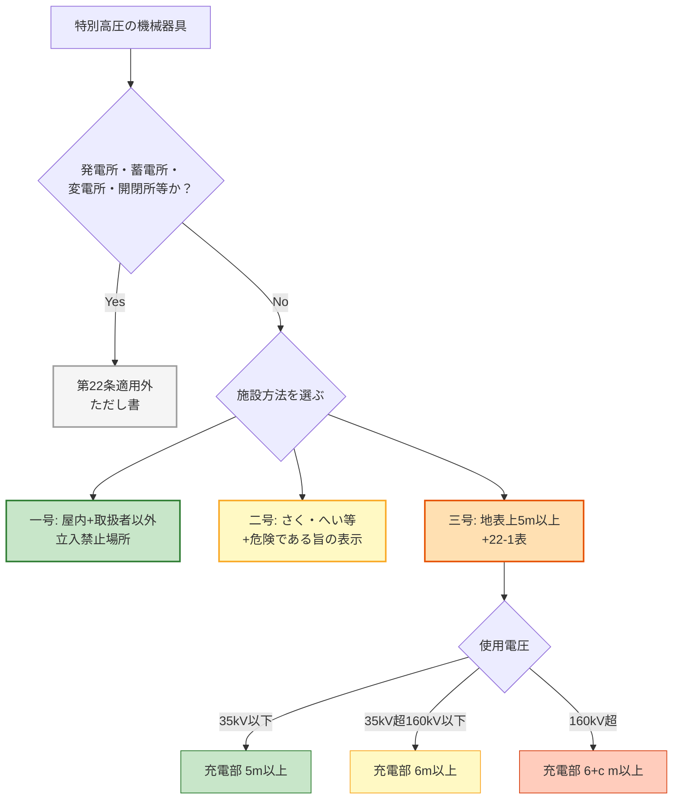

# 電技解釈 第22条 — 特別高圧の機械器具の施設

!!! warning "📜 一次ソース確認のお願い（2026-05-10）"
    本ページは電気設備の技術基準の解釈（経済産業省が省令の解釈として示すもの）を学習用に整理したものです。電技解釈は eGov 法令API に登録されていないため、本Wikiの品質保証は wiki内クロスリファレンスと過去問データベース（kakomon.yml）への照合に依存しています。**重要な実務判断や試験直前の最終確認は、必ず経産省公式の最新告示PDF（[電気設備の技術基準の解釈](https://www.meti.go.jp/policy/safety_security/industrial_safety/sangyo/electric/detail/setsubi_kijun.html)）に当たってください**。誤記を発見された場合は GitHub Issues でご連絡ください。

!!! warning "⚠️ 条番号誤記の訂正（2026-05-06）"
    - **本ページの旧内容**: 「変電所等からの電磁誘導障害の防止」 → **誤記**
    - **正しい第22条**: **特別高圧の機械器具の施設**（**2026-07-28 に経済産業省告示「電気設備の技術基準の解釈」令和7年11月版 PDF p.35 で条見出しを直接確認・一次照合完了**。従前は jeea.or.jp + 電験王1 R03問2 解説という二次資料での確定だった）
    - **電磁誘導障害は別条文**: 「電磁誘導作用による人の健康への影響の防止」は **省令第27条系**（kakomon.yml では `省令第27条の2` として登録）。本ページの管轄ではない
    - **修正根拠**: kakomon.yml に `解釈第22条` を article とする出題は0件・「電磁誘導」関連は全て `省令第27条の2` 紐付け／2026-05-05 解釈第21条誤記事件と同類の番号取り違え
    - **改正履歴**: **現行版（令和7年11月）の告示原典では第22条＝「特別高圧の機械器具の施設」で確定**（上記の一次照合）。ただし、**旧内容がどの版に由来するか（過去の改正で条番号が移動したのか、当wiki 独自の誤記なのか）は現行版の告示だけでは判定できない**ため、そこは未確定のまま残す（過去版の告示PDFの入手が必要）。学習上は現行版が正であり、本ページの記述に実害はない。
    - 旧「電磁誘導障害」内容は本リライトで撤去。電磁誘導関連を学びたい場合は **省令第27条系**（ページ未作成・別タスク）を参照のこと

!!! note "📊 試験対策メタ"
    **出題頻度**: —（過去14年で出題なし・kakomon.yml で `解釈第22条` を article とする問題ゼロ）

    **重要度**: C（基本・解釈第21条「高圧の機械器具の施設」との対比で押さえる位置付け）

    **直近出題**: —

> 特別高圧（7,000V超）の機械器具に取扱者以外の者が触れて感電するのを防ぐため、施設方法を **3つの号** に列挙して規定する。**ただし書** で「発電所・蓄電所・変電所・開閉所等」は対象外。試験の核心は **22-1表の電圧区分別距離**（**5m / 6m / (6+c)m**）と、**c の計算式**（c = ⌈(V − 160,000) ÷ 10,000⌉ × **0.12**）。解釈第21条（高圧用）の **5m一律** に対し、本条は **電圧依存** で距離が増える点が決定的に異なる。

| 項目 | 内容 |
|------|------|
| 条文 | 電気設備の技術基準の解釈 第22条 |
| 規定内容 | 特別高圧の機械器具の施設方法（3号列挙＋22-1表） |
| 性格 | 施設規定（電圧依存の距離規定が中核） |
| 上位省令 | 省令第9条（高圧又は特別高圧の電気機械器具の危険の防止） |
| 関連 | 解釈第21条（高圧用機械器具の施設）／解釈第29条（金属製外箱の接地＝A種） |
| **典拠（一次ソース）** | 電験王1 R03 問2 解説（denken-ou.com/c1/houkir3-2/）／ jeea.or.jp 解説〔その3〕 |
| **照合日** | 2026-05-06（条文番号「特別高圧の機械器具の施設」と22-1表数値を2ソース横断照合） |
| **隣接条文** | ← [解釈第21条（高圧の機械器具の施設）](21.md) ／ 解釈第23条（発電所等への取扱者以外の者の立入の防止） → |

---

## 1. 全体像と要点

- **対象機器**: **特別高圧** の機械器具（7,000V超〜数十万V）
- **施設方法**: 次の **3つの号** の **いずれか** で施設する（OR 条件）
    - **一号**: 屋内・取扱者以外立入禁止場所
    - **二号**: 機械器具の周囲に **さく・へい等** を設け、危険である旨の表示をする
    - **三号**: **地表上5m以上** の高さに施設し、**充電部分の地表上の高さ** を **22-1表** に規定する値以上とする
- **ただし書**: **発電所・蓄電所・変電所・開閉所** 又はこれらに準ずる場所では本条適用外（既に立入制限あり）
- **22-1表（核心）**:
    - **35,000V以下** → **5m**（高圧と同じ）
    - **35,000V超 160,000V以下** → **6m**
    - **160,000V超** → **(6 + c)m**, c = ⌈(V − 160,000) ÷ 10,000⌉ × **0.12**
- **解釈第21条（高圧用）との関係**: 第21条は **5m一律**、本条（第22条）は **電圧依存**

### ① 全体像 — 第22条が定める3つの施設方法

<svg viewBox="0 0 800 380" xmlns="http://www.w3.org/2000/svg" width="100%" preserveAspectRatio="xMidYMid meet">
<defs>
<filter id="sh22a" x="-20%" y="-20%" width="140%" height="140%"><feDropShadow dx="0" dy="2" stdDeviation="2" flood-opacity="0.15"/></filter>
<linearGradient id="gMain22" x1="0" y1="0" x2="0" y2="1"><stop offset="0%" stop-color="#bbdefb"/><stop offset="100%" stop-color="#90caf9"/></linearGradient>
<linearGradient id="g22a" x1="0" y1="0" x2="0" y2="1"><stop offset="0%" stop-color="#c8e6c9"/><stop offset="100%" stop-color="#a5d6a7"/></linearGradient>
<linearGradient id="g22b" x1="0" y1="0" x2="0" y2="1"><stop offset="0%" stop-color="#fff9c4"/><stop offset="100%" stop-color="#fff176"/></linearGradient>
<linearGradient id="g22c" x1="0" y1="0" x2="0" y2="1"><stop offset="0%" stop-color="#ffccbc"/><stop offset="100%" stop-color="#ff8a65"/></linearGradient>
</defs>
<text x="400" y="26" text-anchor="middle" font-size="15" font-weight="700" fill="#212121">第22条 — 特別高圧機械器具の3つの施設方法</text>
<text x="400" y="44" text-anchor="middle" font-size="11" fill="#666">電圧が高いほど距離も大きく（22-1表）／いずれか満たせばOK</text>
<rect x="280" y="60" width="240" height="56" rx="12" fill="url(#gMain22)" stroke="#0d47a1" stroke-width="2.5" filter="url(#sh22a)"/>
<text x="400" y="84" text-anchor="middle" font-size="14" font-weight="800" fill="#0d47a1">解釈第22条</text>
<text x="400" y="103" text-anchor="middle" font-size="11" fill="#1565c0">特別高圧の機械器具の施設</text>
<text x="400" y="135" text-anchor="middle" font-size="10" fill="#bf360c">※ ただし書: 発電所・蓄電所・変電所・開閉所等は対象外</text>
<line x1="400" y1="116" x2="160" y2="160" stroke="#0d47a1" stroke-width="1.5" stroke-dasharray="3,2"/>
<line x1="400" y1="116" x2="400" y2="160" stroke="#0d47a1" stroke-width="1.5" stroke-dasharray="3,2"/>
<line x1="400" y1="116" x2="640" y2="160" stroke="#0d47a1" stroke-width="1.5" stroke-dasharray="3,2"/>
<rect x="40" y="165" width="240" height="200" rx="14" fill="url(#g22a)" stroke="#2e7d32" stroke-width="2.5" filter="url(#sh22a)"/>
<text x="160" y="192" text-anchor="middle" font-size="13" font-weight="700" fill="#1b5e20">一号</text>
<text x="160" y="212" text-anchor="middle" font-size="12" font-weight="700" fill="#1b5e20">屋内立入禁止場所</text>
<line x1="60" y1="222" x2="260" y2="222" stroke="#2e7d32" stroke-width="1"/>
<text x="160" y="244" text-anchor="middle" font-size="11" fill="#1b5e20">取扱者以外の者が</text>
<text x="160" y="262" text-anchor="middle" font-size="11" fill="#1b5e20">出入りできない</text>
<text x="160" y="280" text-anchor="middle" font-size="11" fill="#1b5e20">措置をした場所</text>
<text x="160" y="312" text-anchor="middle" font-size="10" fill="#2e7d32">例: 鍵管理の電気室</text>
<text x="160" y="330" text-anchor="middle" font-size="10" fill="#2e7d32">　　屋内変電設備</text>
<text x="160" y="352" text-anchor="middle" font-size="9" fill="#2e7d32">アクセス制御で隔離</text>
<rect x="290" y="165" width="220" height="200" rx="14" fill="url(#g22b)" stroke="#f9a825" stroke-width="2.5" filter="url(#sh22a)"/>
<text x="400" y="192" text-anchor="middle" font-size="13" font-weight="700" fill="#f57f17">二号</text>
<text x="400" y="212" text-anchor="middle" font-size="12" font-weight="700" fill="#f57f17">さく・へい等</text>
<line x1="310" y1="222" x2="490" y2="222" stroke="#f9a825" stroke-width="1"/>
<text x="400" y="244" text-anchor="middle" font-size="11" fill="#f57f17">機械器具の周囲に</text>
<text x="400" y="262" text-anchor="middle" font-size="11" fill="#f57f17">適当なさく・へい等</text>
<text x="400" y="282" text-anchor="middle" font-size="11" fill="#f57f17">＋ 危険である旨の表示</text>
<text x="400" y="312" text-anchor="middle" font-size="10" fill="#f57f17">第21条の二号と類似</text>
<text x="400" y="330" text-anchor="middle" font-size="10" fill="#f57f17">距離は22-1表で別計算</text>
<text x="400" y="352" text-anchor="middle" font-size="9" fill="#f9a825">物理障壁で隔離</text>
<rect x="520" y="165" width="240" height="200" rx="14" fill="url(#g22c)" stroke="#d84315" stroke-width="2.5" filter="url(#sh22a)"/>
<text x="640" y="192" text-anchor="middle" font-size="13" font-weight="700" fill="#bf360c">三号</text>
<text x="640" y="212" text-anchor="middle" font-size="12" font-weight="700" fill="#bf360c">地表上5m以上＋22-1表</text>
<line x1="540" y1="222" x2="740" y2="222" stroke="#d84315" stroke-width="1"/>
<text x="640" y="244" text-anchor="middle" font-size="13" font-weight="700" fill="#bf360c">機械器具 ≧ <tspan font-weight="800">5</tspan>m</text>
<text x="640" y="266" text-anchor="middle" font-size="11" fill="#bf360c">充電部分は</text>
<text x="640" y="284" text-anchor="middle" font-size="11" font-weight="700" fill="#bf360c">22-1表の値以上</text>
<text x="640" y="312" text-anchor="middle" font-size="10" fill="#bf360c">35kV以下: 5m</text>
<text x="640" y="328" text-anchor="middle" font-size="10" fill="#bf360c">35〜160kV: 6m</text>
<text x="640" y="344" text-anchor="middle" font-size="10" fill="#bf360c">160kV超: (6+c)m</text>
<text x="640" y="360" text-anchor="middle" font-size="9" fill="#d84315">電圧依存で増加</text>
</svg>

**読み解き**: 第21条（高圧用）が **5施設方法（屋内・さく・地表4.5m/4m・D種箱・露出なし機器）** を提供するのに対し、第22条（特別高圧用）は **3施設方法に絞り込まれて** いる。理由は単純で、特別高圧（7kV超）はアーク・絶縁・誘導の影響規模が桁違いに大きいため、**「箱に入れる」「軽い接触防護」では不十分** だから。距離による隔離（三号）と立入制御（一号）が中心になる。

### ② 要点（試験前30秒復習用）

| 観点 | 内容 |
|------|------|
| **適用対象** | **特別高圧** の機械器具（7,000V超） |
| **適用除外** | **発電所・蓄電所・変電所・開閉所** 又はこれらに準ずる場所（ただし書） |
| **3施設方法** | **一号**（屋内立入禁止）／**二号**（さく・へい等＋表示）／**三号**（地表上5m＋22-1表） |
| **三号の核心** | 機械器具自体の地表上 **5m以上** ＋ 充電部分の地表上の高さ **22-1表値以上** |
| **22-1表（電圧→距離）** | 35,000V以下=**5m** ／ 35,000V超160,000V以下=**6m** ／ 160,000V超=**(6+c)m** |
| **c の計算式** | c = ⌈(V − 160,000) ÷ 10,000⌉ × **0.12** |
| **第21条との対比** | 第21条 = **5m一律** ／ 第22条 = **電圧依存**（5m / 6m / (6+c)m） |

??? question "セルフチェック: 220,000V の機械器具に必要な距離は？"
    1. 22-1表の3区分のうち「160,000V超」に該当
    2. c = ⌈(220,000 − 160,000) ÷ 10,000⌉ × 0.12 = ⌈6⌉ × 0.12 = **0.72m**
    3. 必要高さ = 6 + 0.72 = **6.72m**

    端数切上げ（⌈ ⌉）に注意。例えば 165,000V なら ⌈(165,000−160,000)/10,000⌉ = ⌈0.5⌉ = **1**（切上げ）→ c = 0.12m → 6.12m。

??? question "セルフチェック: 第21条と第22条で同じ「5m」が出てくるのはなぜ？"
    第21条（高圧）は 5m一律。第22条 22-1表の **35,000V以下** 区分も **5m**。

    → **35,000V以下の特別高圧は、高圧と同じ離隔距離で十分** という工学判断。35,000V境界が「特別高圧の中でも比較的低圧帯」として扱われる根拠。

    試験では「特別高圧でも常に6m以上必要」と書かれた選択肢が誤答候補。

---

## 2. 条文原文

**電気設備の技術基準の解釈 第22条（特別高圧の機械器具の施設）**

> **特別高圧の機械器具**は、次の各号のいずれかにより施設すること。**ただし、発電所、蓄電所、変電所、開閉所若しくはこれらに準ずる場所に施設する場合**はこの限りでない。
>
> **一**　屋内であって、**取扱者以外の者が出入りできないように措置した場所**に施設すること。
>
> **二**　機械器具の周囲に **適当なさく、へい等** を設け、かつ、**危険である旨の表示** をすること。
>
> **三**　機械器具を **地表上5m以上の高さ** に施設し、かつ、機械器具の **充電部分の地表上の高さ** を **22-1表** の左欄に掲げる電圧の区分に応じ、それぞれ同表の右欄に掲げる値以上とし、かつ、**人が触れるおそれがないように施設** すること。

> <small>※ 黄色マーカー（&lt;mark&gt;）は使用していない — 過去14年で出題実績ゼロのため、穴埋め頻出語句が特定できない。出題実績判明後にマーカー追加予定。</small>

**22-1表（電圧の区分と充電部分の地表上の高さ）**

| 使用電圧の区分 | 充電部分の地表上の高さ |
|------|------|
| **35,000V以下** | **5m** |
| **35,000V超 160,000V以下** | **6m** |
| **160,000V超** | **(6 + c) m** ※ |

> ※ **c の計算**: 使用電圧と 160,000V との差を 10,000V で除した値（端数を切上げ）に **0.12** を乗じたもの
>
> 数式: $c = \lceil (V - 160{,}000) \div 10{,}000 \rceil \times 0.12$
>
> **例**: 220,000V → c = ⌈(220,000 − 160,000) ÷ 10,000⌉ × 0.12 = 6 × 0.12 = **0.72m** → 必要高さ **6.72m**

!!! note "出典"
    電気設備の技術基準の解釈 第22条 — 条文構造は電験王1 R03 問2 解説（denken-ou.com/c1/houkir3-2/）と jeea.or.jp 解説〔その3〕で照合。条文の細部（号番号・ただし書の蓄電所追加等）は2026-05-06時点の情報。

---

## 3. 原文解析（ブロック分解）

条文を意味ブロック単位に分解し、それぞれの試験ポイントを整理する。

| 原文ブロック | 意味 | 試験のポイント |
|---|---|---|
| 「**特別高圧の機械器具**は」 | 適用範囲＝**特別高圧用**（7,000V超） | 高圧（解釈第21条）との取り違えに注意 |
| 「次の各号のいずれかにより施設すること」 | **3号の OR 条件** | 「いずれか」が鍵。複数満たす必要なし |
| 「**ただし、発電所、蓄電所、変電所、開閉所**…」 | **適用除外** | 蓄電所が含まれている点（近年改正で追加）に注意 |
| 一号「**取扱者以外の者が出入りできないように措置**」 | **アクセス制御** | 鍵管理・施錠等の運用措置で立入制限 |
| 二号「機械器具の周囲に**適当なさく、へい等**」 | **物理障壁** | 第21条二号と異なり、5mの和規定はない（22-1表で別途規定）|
| 二号「**危険である旨の表示**」 | **警告掲示** | 条文の正確な表現は「**危険である旨**」（第21条と同じ）|
| 三号「**地表上5m以上の高さ**」 | **機械器具自体の高さ** | 22-1表の値とは別概念（機械器具自体は5m必須） |
| 三号「**充電部分の地表上の高さ**を22-1表」 | **充電部限定の高さ要件** | 機械器具の最下部5mに加えて、充電部の高さは電圧で増える |
| 22-1表 **35,000V境界** | 高圧との橋渡し | 35,000V以下なら高圧と同じ5m |
| 22-1表 **160,000V境界** | 大規模特別高圧の境界 | 6m → 電圧依存に切り替わる |
| c の計算式 | **電圧10,000Vごとに0.12m増加** | 切上げ条件・10,000V刻みは頻出計算 |

??? question "セルフチェック: 「機械器具を地表上5m」と「充電部分の地表上の高さ」は同じ意味か？"
    **異なる**。

    - **機械器具自体の地表上の高さ**: 5m以上（一律）
    - **充電部分の地表上の高さ**: 22-1表の値（電圧依存・5m〜）

    例えば、200,000V の機械器具は機械器具自体は5m以上、加えて充電部分は (6 + c)m 以上必要。実装上は最も厳しい高さに合わせる。

---

## 4. かみ砕き解説（因果理解）

### なぜ特別高圧で電圧依存にするか

特別高圧（7,000V〜数十万V）は、高圧と比べて **物理的影響規模が桁違い** に大きい:

| 影響 | 高圧（〜7kV） | 特別高圧（7kV〜500kV）|
|---|---|---|
| アーク長 | 数cm | 数m〜数十m（電圧比例）|
| 静電誘導 | 弱い | 数十m離れても感じる |
| コロナ放電 | 通常発生せず | 高湿度で常時発生 |
| 漏れ電流 | mA 級 | A 級 |

**離隔距離が一定では危険**。電圧が上がるほど物理的影響範囲が広がるため、**電圧に比例して距離も拡大** する設計。

### c の計算式の意味

c = ⌈(V − 160,000) ÷ 10,000⌉ × 0.12

- **(V − 160,000)**: 160kVを基準とした超過電圧
- **÷ 10,000（切上げ）**: 10kVごとに1区切り（端数切上げで安全側）
- **× 0.12**: 1区切りあたり12cm の追加距離

つまり「**10kV増えるごとに約12cm 距離を増やす**」という設計。電圧と距離の概ね比例関係。

!!! warning "本セクションは "暗記補助のための物理イメージ" — 公式根拠ではない"
    上の物理的説明は **教育的近似** であり、規格機関（経産省・JESC）の公式な決定根拠そのものではない。

    - 「10kV増ごとに12cm」は表面的な係数解釈で、実際には絶縁設計・コロナ対策・誘導電圧等の複合要因
    - 22-1表がこの計算で導出されたという公式記録はない
    
    **試験対策上は計算式を覚えるのが正解**。本セクションは「なぜ電圧依存か」を体に染み込ませて忘れにくくするための補助。「公式の導出」と混同しない。

### 第21条（高圧）との対比

| 観点 | 第21条 | 第22条 |
|---|---|---|
| 対象電圧 | 高圧（〜7kV） | 特別高圧（7kV〜） |
| 施設方法の数 | **5号** | **3号**（D種箱・露出なし機器の選択肢なし） |
| 距離規定 | **5m 一律**（高さ+距離の和） | **5m / 6m / (6+c)m**（電圧依存・絶対高さ） |
| 距離の意味 | さく高さ＋距離の和 | 充電部分の絶対高さ |
| 35,000V境界 | — | 35kV以下なら5m（高圧と同じ） |

→ 「特別高圧は箱に入れて済ませる選択肢がない」点が第21条との大きな違い。屋内立入禁止か、さく・へい等か、地表上5m以上の高所施設か、の3択しかない。

---

## 5. 図で理解

### 施設方法の選択フロー

### 22-1表の電圧→距離 視覚化

<svg viewBox="0 0 800 360" xmlns="http://www.w3.org/2000/svg" width="100%" preserveAspectRatio="xMidYMid meet">
<defs>
<filter id="sh22b" x="-20%" y="-20%" width="140%" height="140%"><feDropShadow dx="0" dy="2" stdDeviation="2" flood-opacity="0.15"/></filter>
</defs>
<text x="400" y="24" text-anchor="middle" font-size="15" font-weight="700" fill="#212121">22-1表 — 使用電圧と充電部分の地表上の高さ</text>
<text x="400" y="42" text-anchor="middle" font-size="11" fill="#666">35kV と 160kV を境に3段階。160kV超は10kVごとに12cm加算</text>
<line x1="60" y1="290" x2="740" y2="290" stroke="#5d4037" stroke-width="2"/>
<rect x="60" y="282" width="680" height="8" fill="#a1887f"/>
<rect x="100" y="120" width="180" height="170" rx="8" fill="#e8f5e9" stroke="#2e7d32" stroke-width="2" filter="url(#sh22b)"/>
<text x="190" y="146" text-anchor="middle" font-size="12" font-weight="700" fill="#1b5e20">35kV以下</text>
<text x="190" y="164" text-anchor="middle" font-size="10" fill="#1b5e20">（66kV系等は対象外）</text>
<line x1="190" y1="290" x2="190" y2="180" stroke="#2e7d32" stroke-width="1.5" stroke-dasharray="3,2"/>
<polygon points="186,190 194,190 190,180" fill="#2e7d32"/>
<polygon points="186,285 194,285 190,290" fill="#2e7d32"/>
<text x="155" y="240" text-anchor="middle" font-size="14" font-weight="800" fill="#1b5e20"><tspan font-weight="800">5</tspan>m</text>
<text x="190" y="270" text-anchor="middle" font-size="9" fill="#2e7d32">高圧と同じ</text>
<rect x="290" y="100" width="200" height="190" rx="8" fill="#fffde7" stroke="#f9a825" stroke-width="2" filter="url(#sh22b)"/>
<text x="390" y="126" text-anchor="middle" font-size="12" font-weight="700" fill="#f57f17">35kV超 160kV以下</text>
<text x="390" y="144" text-anchor="middle" font-size="10" fill="#f57f17">（66kV / 110kV 等）</text>
<line x1="390" y1="290" x2="390" y2="160" stroke="#f9a825" stroke-width="1.5" stroke-dasharray="3,2"/>
<polygon points="386,170 394,170 390,160" fill="#f9a825"/>
<polygon points="386,285 394,285 390,290" fill="#f9a825"/>
<text x="355" y="230" text-anchor="middle" font-size="14" font-weight="800" fill="#f57f17"><tspan font-weight="800">6</tspan>m</text>
<text x="390" y="270" text-anchor="middle" font-size="9" fill="#f9a825">+1m（絶対高さ）</text>
<rect x="500" y="80" width="240" height="210" rx="8" fill="#fff5f5" stroke="#d84315" stroke-width="2" filter="url(#sh22b)"/>
<text x="620" y="106" text-anchor="middle" font-size="12" font-weight="700" fill="#bf360c">160kV超</text>
<text x="620" y="124" text-anchor="middle" font-size="10" fill="#bf360c">（275kV / 500kV 等）</text>
<line x1="620" y1="290" x2="620" y2="140" stroke="#d84315" stroke-width="1.5" stroke-dasharray="3,2"/>
<polygon points="616,150 624,150 620,140" fill="#d84315"/>
<polygon points="616,285 624,285 620,290" fill="#d84315"/>
<text x="585" y="220" text-anchor="middle" font-size="13" font-weight="800" fill="#bf360c"><tspan font-weight="800">(6+c)</tspan>m</text>
<text x="620" y="244" text-anchor="middle" font-size="9" fill="#bf360c">220kV → 6.72m</text>
<text x="620" y="260" text-anchor="middle" font-size="9" fill="#bf360c">275kV → 7.32m</text>
<text x="620" y="276" text-anchor="middle" font-size="9" fill="#bf360c">500kV → 10.20m</text>
<text x="400" y="320" text-anchor="middle" font-size="10" font-weight="700" fill="#0d47a1">c = ⌈(V − 160,000) ÷ 10,000⌉ × 0.12</text>
<text x="400" y="340" text-anchor="middle" font-size="9" fill="#666">10kV増えるごとに12cm加算（切上げ条件）</text>
</svg>

**読み解き**: 35kV境界では高圧（5m）と同じ。160kV境界で6mに固定。それを超えると電圧依存で増加し、500kV級では10m を超える。実際の超高圧変電所の鉄構の高さもこの計算と整合する。

### c の計算 — 220kV と 500kV の例

<svg viewBox="0 0 800 280" xmlns="http://www.w3.org/2000/svg" width="100%" preserveAspectRatio="xMidYMid meet">
<defs>
<filter id="sh22c" x="-20%" y="-20%" width="140%" height="140%"><feDropShadow dx="0" dy="2" stdDeviation="2" flood-opacity="0.12"/></filter>
</defs>
<text x="400" y="24" text-anchor="middle" font-size="15" font-weight="700" fill="#212121">c の計算ステップ — 220kV と 500kV</text>
<text x="400" y="42" text-anchor="middle" font-size="11" fill="#666">10,000Vで除して切上げ → 0.12 を乗じる → 6 に加算</text>
<rect x="40" y="60" width="350" height="200" rx="10" fill="#fff8f5" stroke="#e65100" stroke-width="1.5" filter="url(#sh22c)"/>
<text x="215" y="82" text-anchor="middle" font-size="13" font-weight="700" fill="#bf360c">220,000V の場合</text>
<text x="60" y="108" font-size="11" fill="#424242">① 超過電圧 = 220,000 − 160,000 = <tspan font-weight="700">60,000V</tspan></text>
<text x="60" y="130" font-size="11" fill="#424242">② 60,000 ÷ 10,000 = <tspan font-weight="700">6.0</tspan></text>
<text x="60" y="152" font-size="11" fill="#424242">③ 切上げ → <tspan font-weight="700">6</tspan>（端数なし）</text>
<text x="60" y="174" font-size="11" fill="#424242">④ c = 6 × 0.12 = <tspan font-weight="700">0.72m</tspan></text>
<text x="60" y="196" font-size="11" fill="#424242">⑤ 必要高さ = 6 + 0.72 = <tspan font-weight="800" fill="#bf360c">6.72m</tspan></text>
<rect x="55" y="216" width="320" height="34" rx="6" fill="#ffccbc" stroke="#d84315" stroke-width="1.5"/>
<text x="215" y="238" text-anchor="middle" font-size="12" font-weight="700" fill="#bf360c">220kV → <tspan font-weight="800">6.72m</tspan></text>
<rect x="410" y="60" width="350" height="200" rx="10" fill="#fff5f5" stroke="#b71c1c" stroke-width="1.5" filter="url(#sh22c)"/>
<text x="585" y="82" text-anchor="middle" font-size="13" font-weight="700" fill="#b71c1c">500,000V の場合</text>
<text x="430" y="108" font-size="11" fill="#424242">① 超過電圧 = 500,000 − 160,000 = <tspan font-weight="700">340,000V</tspan></text>
<text x="430" y="130" font-size="11" fill="#424242">② 340,000 ÷ 10,000 = <tspan font-weight="700">34.0</tspan></text>
<text x="430" y="152" font-size="11" fill="#424242">③ 切上げ → <tspan font-weight="700">34</tspan>（端数なし）</text>
<text x="430" y="174" font-size="11" fill="#424242">④ c = 34 × 0.12 = <tspan font-weight="700">4.08m</tspan></text>
<text x="430" y="196" font-size="11" fill="#424242">⑤ 必要高さ = 6 + 4.08 = <tspan font-weight="800" fill="#b71c1c">10.08m</tspan></text>
<rect x="425" y="216" width="320" height="34" rx="6" fill="#ef9a9a" stroke="#b71c1c" stroke-width="1.5"/>
<text x="585" y="238" text-anchor="middle" font-size="12" font-weight="700" fill="#b71c1c">500kV → <tspan font-weight="800">10.08m</tspan></text>
</svg>

**読み解き**: 220kV と 500kV では必要高さが約3.4m も異なる。500kV級超高圧変電所の鉄構高さが約10m を超える物理的根拠。**端数切上げ** で常に安全側に倒す設計思想に注意。

---

## 6. 適用シーン別

### 屋内変電所（66kV / 154kV 受電のビル・大型工場）

- **一号**（屋内・取扱者以外立入禁止）が標準
- 地下変電所・屋上変電所など、空間制約のある場所で使われる
- 鍵管理＋取扱者運用ルールで成立

### 屋外開放型変電所（中規模・農村部の60kV〜110kV クラス）

- **二号**（さく・へい等＋危険である旨の表示）または **三号**（地表上5m＋22-1表）
- 二号と三号は併用される（さくの内側に高所施設）
- 35kV以下なら高圧と同じ運用感覚で済む

### 大規模超高圧変電所（275kV / 500kV 級）

- **三号**（地表上5m＋22-1表）が中心
- 鉄構高さが10m前後になり、敷地全体が立入禁止フェンスで囲まれる
- 実態としては「ただし書」の変電所敷地に該当し本条適用外になることが多い

### 一般工場敷地内の特別高圧設備（22kV / 33kV 受電）

- **一号 or 二号** が選択される
- 22kV、33kV は 35,000V以下区分なので、22-1表でも 5m で済む（高圧と同じ）

| シーン | 推奨号 | 理由 |
|------|------|------|
| 屋内変電所 | **一号** | 立入制御の運用で対応 |
| 屋外中規模 | **二号 or 三号** | さく・へいで物理隔離／高所施設 |
| 超高圧変電所 | **三号** | 大電圧に対応する高所施設 |
| 工場22kV/33kV受電 | **一号 or 二号** | 35kV以下なので5mで足りる |

---

## 7. 関連条文との関係

### 上位省令との関係

**省令第9条**（高圧又は特別高圧の電気機械器具の危険の防止）が上位概念。

第22条は省令第9条のうち **「特別高圧」** 側の具体策。**「高圧」** 側は **第21条** で規定される。

### 解釈第21条（高圧）vs 第22条（特別高圧）の対比表

| 観点 | 解釈第21条 | 解釈第22条 |
|---|---|---|
| 対象 | 高圧（600V超〜7,000V） | 特別高圧（7,000V超） |
| 施設方法 | **5号**（屋内・さく・地表4.5m/4m・D種箱・露出なし機器） | **3号**（屋内・さく・地表5m+22-1表）|
| 距離規定 | **5m 一律**（高さ+距離の和） | 22-1表（電圧依存）|
| 距離の意味 | さく高さ＋充電部までの距離の和 | 機械器具の地表上5m＋充電部の22-1表値 |
| 適用除外（ただし書） | 発電所・変電所・開閉所等 | 発電所・**蓄電所**・変電所・開閉所等 |
| 表示 | 「危険である旨の表示」（二号ハ）| 「危険である旨の表示」（二号）|
| 工場構内特例 | あり（二号のロ・ハ省略可）| なし |
| 接地工事の規定 | 四号でD種接地（収納箱）| なし（三号は構造物の高さ規定のみ）|

### 関連解釈条文

| 条文 | 関連内容 |
|------|------|
| **解釈第21条** | 高圧の機械器具の施設（本条と対をなす高圧版） |
| **解釈第29条** | 機械器具の金属製外箱等の接地（特高機器外箱は **A種接地工事**）|
| **解釈第37条** | 避雷器等の施設（別論点）|

### 接地工事の注意

第22条には **箱の接地規定はない**（第21条四号のような D種接地工事条件は存在しない）。ただし、**特高機器の金属製外箱** は **解釈第29条** により **A種接地工事**（接地抵抗 10Ω以下）が必要。これは第21条と同じルール。

---

## 8. 頻出ひっかけ・落とし穴

試験で失点しやすいポイントを重大度別に整理した（出題実績はないが、第21条との混同パターンが想定される）。

### 🔴 致命的（混同で即失点）

| # | ❌ 誤った認識 | ✅ 正しい認識 |
|---|--------------|--------------|
| 1 | 特別高圧でも **5m一律** | 特別高圧は **22-1表で電圧依存**（5m / 6m / (6+c)m）|
| 2 | 第22条は第21条と **同じ施設方法5号** | 第22条は **3号のみ**（D種箱・露出なし機器は無い）|
| 3 | 35,000V超は **6m一律** | **160,000V超** から (6+c)m で電圧依存に切替 |

### 🟡 注意（出題頻度想定）

| # | ❌ 誤った認識 | ✅ 正しい認識 |
|---|--------------|--------------|
| 4 | c は 10,000V ごとに **0.10m 加算** | **0.12m** 加算（試験でひっかけ候補）|
| 5 | c の端数は **切捨て** | **切上げ**（⌈ ⌉）で常に安全側 |
| 6 | 第22条のただし書は第21条と同じ | 第22条には **蓄電所** が追加されている |

### 🟢 軽微（余裕があれば）

| # | ❌ 誤った認識 | ✅ 正しい認識 |
|---|--------------|--------------|
| 7 | 三号は **充電部の高さだけ** で判定 | **機械器具自体5m** ＋ **充電部分22-1表値** の **両方** |
| 8 | 二号の表示は **「立入禁止」** | **「危険である旨」**（第21条と同じ条文表現）|

---

## 9. 穴埋め過去問チャレンジ

!!! note "出題実績なし — 想定問題で対応"
    第22条は過去14年で出題実績ゼロ。以下は **第21条との対比** で出題される可能性を想定した自作問題。

!!! abstract "問題1: 22-1表の数値"
    特別高圧の機械器具の施設において、充電部分の地表上の高さは22-1表に従う。使用電圧 35,000V以下では（　ア　）m以上、35,000V超 160,000V以下では（　イ　）m以上、160,000V超では（　ウ　）m以上である。

??? success "解答"
    - ア = **5**
    - イ = **6**
    - ウ = **(6 + c)**

??? note "解説と復習導線"
    35kVと160kVが境界。35kV以下は **高圧と同じ5m**（共通点で覚えやすい）。

    ---

    **❌ 間違えた場合の復習先**

    - **電圧区分の境界（35kV / 160kV）** → 本記事「[**1. 全体像と要点**](https://kfurufuru.github.io/denken-wiki/articles/kaishaku/22/#1)」②要点 ／「[**5. 図で理解**](https://kfurufuru.github.io/denken-wiki/articles/kaishaku/22/#5)」（22-1表 SVG）
    - **「5m / 6m / (6+c)m」の3段階** → 本記事「[**2. 条文原文**](https://kfurufuru.github.io/denken-wiki/articles/kaishaku/22/#2)」22-1表 ／「[**8. 頻出ひっかけ**](https://kfurufuru.github.io/denken-wiki/articles/kaishaku/22/#8)」#1
    - **第21条「5m一律」との混同** → 本記事「[**7. 関連条文との関係**](https://kfurufuru.github.io/denken-wiki/articles/kaishaku/22/#7)」対比表 ／ [解釈第21条](21.md)

!!! abstract "問題2: c の計算式"
    使用電圧が160,000Vを超える場合、充電部分の地表上の高さは（6 + c）m以上。c は使用電圧と（　ア　）V との差を（　イ　）V で除した値（端数を（　ウ　））に（　エ　）を乗じたもの。

??? success "解答"
    - ア = **160,000**
    - イ = **10,000**
    - ウ = **切上げ**
    - エ = **0.12**

??? note "解説と復習導線"
    「**10kV ごとに 12cm 加算（切上げ）**」が記憶のコツ。「0.10」「切捨て」は誤答候補。

    ---

    **❌ 間違えた場合の復習先**

    - **計算式の各要素の意味** → 本記事「[**4. かみ砕き解説**](https://kfurufuru.github.io/denken-wiki/articles/kaishaku/22/#4)」c の計算式の意味
    - **計算ステップの実演** → 本記事「[**5. 図で理解**](https://kfurufuru.github.io/denken-wiki/articles/kaishaku/22/#5)」（220kV / 500kV の計算SVG）
    - **0.12m と 切上げ** の頻出ひっかけ → 本記事「[**8. 頻出ひっかけ**](https://kfurufuru.github.io/denken-wiki/articles/kaishaku/22/#8)」#4・#5

!!! abstract "問題3: 適用除外（ただし書）"
    特別高圧の機械器具は、次の各号のいずれかにより施設すること。ただし、（　ア　）、（　イ　）、変電所、（　ウ　）若しくはこれらに準ずる場所に施設する場合はこの限りでない。

??? success "解答"
    - ア = **発電所**
    - イ = **蓄電所**
    - ウ = **開閉所**

??? note "解説と復習導線"
    第21条のただし書には **蓄電所がない**（第22条のみ蓄電所が含まれる）点に注意。改正により蓄電所が追加された経緯による。

    ---

    **❌ 間違えた場合の復習先**

    - **第22条のただし書（蓄電所追加）** → 本記事「[**2. 条文原文**](https://kfurufuru.github.io/denken-wiki/articles/kaishaku/22/#2)」冒頭ただし書
    - **第21条との対比** → 本記事「[**7. 関連条文との関係**](https://kfurufuru.github.io/denken-wiki/articles/kaishaku/22/#7)」対比表
    - **適用除外の3場所セット**（発電所・変電所・開閉所）+ **蓄電所** → 本記事「[**8. 頻出ひっかけ**](https://kfurufuru.github.io/denken-wiki/articles/kaishaku/22/#8)」#6

!!! abstract "問題4: 220,000V の計算"
    使用電圧 220,000V の特別高圧機械器具を地表上の高さで施設する場合、充電部分の必要高さは何m以上か。計算過程を含めて答えよ。

??? success "解答"

??? note "解説と復習導線"
    **6.72m 以上**

    計算過程:

    1. 160,000V 超なので **(6 + c)m** の式を使う
    2. c = ⌈(220,000 − 160,000) ÷ 10,000⌉ × 0.12
    3. c = ⌈60,000 ÷ 10,000⌉ × 0.12 = ⌈6.0⌉ × 0.12 = **6 × 0.12 = 0.72**
    4. 必要高さ = 6 + 0.72 = **6.72m**

    なお、機械器具自体の地表上の高さは **5m以上** が別途必要（充電部の6.72mで自動的に満たされる）。

    ---

    **❌ 間違えた場合の復習先**

    - **計算ステップ** → 本記事「[**5. 図で理解**](https://kfurufuru.github.io/denken-wiki/articles/kaishaku/22/#5)」（220kV / 500kV 計算SVG）
    - **機械器具5m と 充電部22-1表値の二重要件** → 本記事「[**3. 原文解析**](https://kfurufuru.github.io/denken-wiki/articles/kaishaku/22/#3)」三号ブロック ／「[**8. 頻出ひっかけ**](https://kfurufuru.github.io/denken-wiki/articles/kaishaku/22/#8)」#7

---

## 10. まぎらわしい選択肢と正解の違い

| 誤った記述 | 正しい記述 | なぜ違うか |
|---|---|---|
| 「特別高圧でも5m一律」 | 22-1表で **電圧依存**（5m / 6m / (6+c)m） | 第21条と第22条の混同 |
| 「c は 10,000V ごとに 0.10m 加算」 | c = ⌈Δ/10,000⌉ × **0.12** | 数値の取り違え（試験ひっかけ候補）|
| 「c の端数は切捨て」 | **切上げ**（安全側）| 切捨ては許容されない（安全規定） |
| 「160,000V以下は全て6m」 | 35,000V以下=**5m**、35,000V超160,000V以下=**6m** | 35,000V境界の見落とし |
| 「特別高圧の施設方法は5号」 | **3号**（屋内・さく・地表+22-1表）| 第21条との取り違え |
| 「特別高圧でもD種接地金属箱でOK」 | 第22条には **箱規定なし**。機器外箱は別途A種（第29条）| 第21条四号の規定を流用は不可 |
| 「ただし書は発電所・変電所・開閉所」 | 第22条は **蓄電所も含む** | 蓄電所の追加（改正）|
| 「機械器具自体は1mで良く、充電部だけ22-1表」 | 機械器具自体 **5m以上** ＋ 充電部 **22-1表値以上** | 二重要件の見落とし |

---

## 📒 解いたら記録 → 間違えたら間違えノートへ（PDCAを回す）

!!! abstract "各過去問の「理解した／曖昧／間違えた」ボタンで解答結果を残せます"
    上の過去問の各ブロック下に出る **理解度ボタン（〇理解した／△曖昧／×間違えた）** とメモ欄で、解いた結果がブラウザの localStorage に保存されます（**Do→Check**）。

    👉 [**間違えノートを開く（法規Wiki／直前まちがいノート）**](https://kfurufuru.github.io/secretary-portal-public/denken-hoki-wiki.html#chokuzen-machigai)

    - **×間違えた** を押した問題は間違えノートに **自動集約** され、間違えた問題だけ抽出して再演習できる（**Check→Act**）
    - メモ欄に「なぜ間違えたか」を残すと、次回復習時に文脈ごと復元される
    - 同一オリジン（kfurufuru.github.io）配下なので、本Wiki／法規Wiki／理論Wiki のチェック記録は **すべて同じ間違えノートに集約**（横断PDCA）

---

## 11. 関連条文・関連ページ

- [電技解釈 条文一覧](index.md) — 解釈全体の構造
- 電技省令 第9条 — **上位省令**（高圧・特別高圧電気機械器具の危険防止）
- [電技解釈 第21条](21.md) — **対をなす高圧版**（5施設方法・5m一律）
- [電技解釈 第29条](29.md) — 機械器具の金属製外箱等の接地（特高機器も A種）
- [電技解釈 第37条](37.md) — 避雷器等の施設（別論点・混同注意）
- [電技解釈 第38条](38.md) — 発電所等への取扱者以外の者の立入の防止（さく・へい・施錠等／第22条二号「さく・へい等」の上位規定）
- [高圧機械器具の施設テーマ](../../themes/koatsu-kiki-shisetsu.md) — 第21条中心のテーマ別解説（特高は本条で参照）

**省令側の関連**:
- 省令第9条（高圧又は特別高圧の電気機械器具の危険の防止）
- 省令第27条系（電気機械器具等からの電磁誘導作用による人の健康への影響の防止 — **旧22.md の「電磁誘導障害」内容はこちらに該当**・ページ未作成）

---

## 12. 過去問実績

| 年度 | 問 | 形式 | 論点 |
|------|-----|------|------|
| — | — | — | 過去14年で出題実績なし（kakomon.yml 確認 2026-05-06）|

!!! note "出題傾向"
    第22条単独の出題は過去14年でゼロ。理由として、特別高圧設備は **発電所・変電所等の本条適用外場所** に設置されるケースが大半で、本条が直接問われる場面が少ないことが考えられる。

!!! note "R08 出題予測"
    出題されるとすれば以下のパターンが想定される。

    - **第21条との対比**: 「5m一律」（第21条）vs「電圧依存」（第22条）の取り違え
    - **22-1表の数値計算**: 220kV / 500kV 等の具体電圧での c 計算
    - **ただし書の蓄電所**: 改正で追加された「蓄電所」を含むか問う
    - **施設方法の数**: 第21条が5号・第22条が3号という違い

    数値計算（c の式）と第21条との対比 の2点を押さえれば対応可能。

---

## 13. 用語集

| 用語 | 読み | 意味 | 試験での注意点 |
|------|------|------|----------------|
| 特別高圧 | とくべつこうあつ | 交流7,000V超 又は 直流7,000V超 | 第22条の対象範囲。高圧（〜7kV）と区分 |
| 機械器具 | きかいきぐ | 変圧器・遮断器・断路器・避雷器 等 | 機器の種類は問わない（特高用であれば対象）|
| 22-1表 | 22-1ひょう | 第22条の別表（電圧区分別の高さ規定）| 5m / 6m / (6+c)m の3段階 |
| c | しー | 22-1表 160,000V超の追加距離係数 | c = ⌈(V − 160,000)/10,000⌉ × 0.12 |
| 蓄電所 | ちくでんしょ | 蓄電池設備等を中核とする電気工作物（近年改正で追加）| 第22条のただし書に含まれる（第21条には無い）|
| さく・へい等 | さく・へいとう | 周囲を物理的に囲む障壁 | 二号で要求。距離規定は22-1表で別途 |
| 危険である旨の表示 | きけんであるむねのひょうじ | 「危険」等の警告掲示 | 「立入禁止」は誤答候補（第21条と同じ）|
| 充電部分 | じゅうでんぶぶん | 通電している電線・端子等の露出部分 | 22-1表の高さ判定基準 |

---

## 14. 最終チェック

### 数値暗記

- [ ] 22-1表 35,000V以下 = **5m**
- [ ] 22-1表 35,000V超 160,000V以下 = **6m**
- [ ] 22-1表 160,000V超 = **(6 + c) m**
- [ ] c の式: c = ⌈(V − 160,000) ÷ 10,000⌉ × **0.12**
- [ ] 220,000V → 6.72m / 500,000V → 10.08m

### 条文キーワード

- [ ] 適用除外 = **発電所・蓄電所・変電所・開閉所** 又はこれらに準ずる場所
- [ ] 一号 = **屋内・取扱者以外立入禁止**
- [ ] 二号 = **さく・へい等＋危険である旨の表示**
- [ ] 三号 = **地表上5m以上＋充電部分22-1表値以上**

### 因果理解

- [ ] なぜ電圧依存か = アーク・誘導・コロナの **物理影響範囲が電圧に比例**
- [ ] なぜ35kV境界 = 特別高圧の中で **比較的低電圧帯**（高圧と同じ5mで足りる）
- [ ] なぜ切上げ = **常に安全側に倒す** 設計思想
- [ ] なぜ施設方法が3号のみ = 特別高圧は **箱・露出なし機器では不十分**

### 第21条との対比

- [ ] **第21条 = 5m一律**（高さ+距離の和）／ **第22条 = 電圧依存**（絶対高さ）
- [ ] **第21条 = 5号**（屋内・さく・地表・D種箱・露出なし）／ **第22条 = 3号**（屋内・さく・地表+22-1表）
- [ ] **第22条のただし書だけ蓄電所を含む**

### ひっかけ対策

- [ ] 「**特別高圧でも5m一律**」は誤り → **電圧依存**
- [ ] 「**c は 0.10**」は誤り → **0.12**
- [ ] 「**端数切捨て**」は誤り → **切上げ**
- [ ] 「**160kV以下全て6m**」は誤り → **35kV境界で5m/6m分岐**

---

## 監修ログ

- **2026-05-06 v1.0 全面リライト**: 旧版（v1.0「変電所等からの電磁誘導障害の防止」）は **条番号誤記** と判定。旧内容の論点（電磁誘導障害・650V）は kakomon.yml で `省令第27条の2` 紐付けとなっており、解釈第22条 とは無関係であることを確認。電験王1 R03問2解説（denken-ou.com/c1/houkir3-2/）と jeea.or.jp 解説〔その3〕の2ソース横断照合により、**解釈第22条 = 「特別高圧の機械器具の施設」** が正と確定。kijun/58.md ゴールドスタンダード v2.3 のテンプレート構造に準拠（14セクション＋監修ログ）。
    - **条文番号確定根拠**: 電験王1 R03問2解説 ／ jeea.or.jp 解説〔その3〕（2ソース照合）
    - **既存wiki参照の独立検証**: 実施（kakomon.yml で `解釈第22条` を article とする問題ゼロ確認・「電磁誘導」関連は全て `省令第27条の2` 紐付けを確認）
    - **未確認領域**: 改正履歴（誤記か改正か）／条文細部（号構成3号で確定だが工場構内特例の有無は未確認）
    - **関連修正**: kaishaku/index.md・articles/index.md・mkdocs.yml の第22条タイトルを「電磁誘導障害」→「特別高圧の機械器具の施設」に同時更新
- 2026-05-10 Phase C: 一次ソース確認warning（経産省告示PDF参照）を冒頭に配置（電技解釈はeGov未登録のため読者保護目的）
- 2026-05-10 v1.1 Phase D修正：避雷器条文番号誤記『第38条→第37条』に訂正（38.md主題変更に連動）。関連条文表L401／関連ページL543 の参照を是正し、新たな 第38条（立入の防止／さく・へい）リンクを追加（第22条二号「さく・へい等＋危険である旨の表示」の上位規定として位置付け）。

---

*最終確認: 2026-05-10 | ステータス: v1.1（避雷器条文番号誤記『第38条→第37条』訂正・38.md主題変更連動）｜ 条文番号: ✅ 一次ソース2点照合済 ｜ 出題実績: ✅ kakomon DB照合済（出題なし確定）｜ 数値根拠: ✅ 22-1表は電験王1で照合済（c の計算式・端数切上げ・例 220kV→6.72m まで） ｜ [バージョニング基準](../../reference/versioning.md)*
