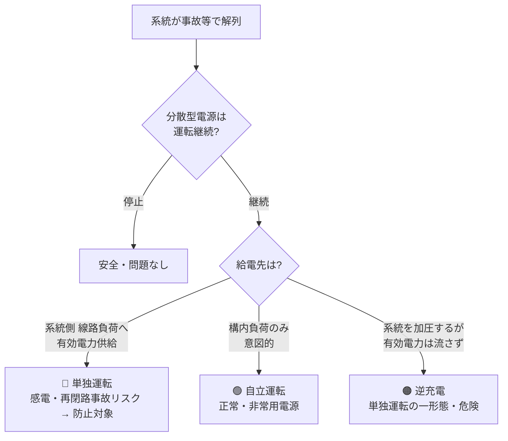

# 電技解釈 第220条 — 分散型電源の系統連系設備に係る用語の定義

!!! info "📌 条番号是正のお知らせ（2026-06-08 確定）"
    本記事は **第220条＝分散型電源の系統連系設備に係る用語の定義**（経産省告示PDF一次照合で確定・委任元: 電技省令第1条）です。
    この `/220/` URL で従来配信していた **「直流流出防止変圧器の施設」は [第221条](221.md) に移設** されました。直流流出防止変圧器を探している場合は第221条を参照してください。

!!! warning "📜 一次ソース確認のお願い"
    本ページは電気設備の技術基準の解釈（経済産業省告示）を学習用に整理したものです。電技解釈は eGov 法令API に登録されていないため、本Wikiの品質保証は wiki内クロスリファレンスと過去問データベース（kakomon.yml）への照合に依存しています。**重要な実務判断や試験直前の最終確認は、必ず経産省公式の最新告示PDF（[電気設備の技術基準の解釈](https://www.meti.go.jp/policy/safety_security/industrial_safety/sangyo/electric/detail/setsubi_kijun.html)）に当たってください**。

!!! abstract "📊 試験対策メタ"
    - **出題頻度**: 🔥🔥🔥🔥（過去14年で 4 回出題：H23問6・H27問9・R01問9・R05下問7／用語定義は分散型電源テーマの基礎で頻出）
    - **重要度**: A（連系設備すべての前提語彙・正誤判定／穴埋めの定番）🔥
    - **直近出題**: R05下 問7（用語定義の穴埋め）／ R07下 問9（第199条の2 電気自動車 V2H）
    - **照合日**: 2026-06-08（経産省告示PDF一次照合・R01問9/H23問6 の選択肢文と整合）

> 分散型電源（太陽光・風力・蓄電池など）を電力系統に連系するための **共通の用語** を定義する条文。==**単独運転**== ==**逆潮流**== ==**自立運転**== ==**解列**== ==**転送遮断**== ==**受動的／能動的単独運転検出**== など、第221条以降のすべての連系規定で使う言葉の意味をここで確定する。**用語の正確な区別（特に「単独運転 vs 自立運転」「逆潮流 vs 逆充電」）が正誤判定問題の核心**。

| 項目 | 内容 |
|------|------|
| 条文 | 電気設備の技術基準の解釈 第220条 |
| 規定内容 | 分散型電源の系統連系設備に係る用語の定義（分散型電源・逆潮流・単独運転・自立運転・逆充電・解列・転送遮断・線路無電圧確認装置・受動的／能動的方式 等） |
| 性格 | 定義条文（以降の第221〜232条すべての前提語彙） |
| 委任元（上位） | 電技省令第1条（用語の定義） |
| 下位・関連 | [第221条（直流流出防止）](221.md)／[第226条（低圧施設要件）](226.md)／[第227条（低圧保護）](227.md)／[第229条（高圧保護）](229.md)／[第232条（例外）](232.md) |
| 関連条文（V2H） | 第199条の2（電気自動車等から電気を供給する設備＝V2H／R07下問9 で初出題。分散型電源章（第220条台）ではなく第199条の2 に規定） |

---

## ⚡ 5秒で思い出す

!!! tip "直前に見る核心"
    - **単独運転 vs 自立運転** ＝ 「意図せず」止まらない（危険）か「意図して」自家給電（正常）か
    - **逆潮流** ＝ 構内 → 系統 への **有効電力** の流れ（売電方向）
    - **逆充電** ＝ 系統停電中に分散型電源だけが系統を **加圧**（有効電力は供給していない）状態 → 作業者感電リスク
    - **解列** ＝ 系統から切り離すこと
    - **転送遮断** ＝ 系統側の遮断器動作を **通信で伝えて** 分散型電源を切る（外からの指令・受動）
    - 単独運転検出は **受動的方式（待つ）＋能動的方式（仕掛ける）の両方** が原則

??? question "セルフチェック: 「単独運転」と「自立運転」はどう違う？"
    どちらも「系統から解列された状態で発電継続」だが、**供給先と意図が違う**。
    **単独運転**＝解列後も **線路（系統側）負荷** に給電し続ける異常状態（停電作業者の感電・再閉路時の機器損傷を招く・防止対象）。
    **自立運転**＝解列後に **自分の構内負荷にのみ** 給電する正常・意図的な状態（停電時の非常用電源）。

---

## 📖 用語の定義（本条の中核）

!!! note "黄色マーカー凡例"
    <mark>黄色マーカー</mark> ＝ 過去問で実際に穴埋め・正誤判定の対象になった語（H23問6・H27問9・R01問9・R05下問7）。**太字** ＝ 区別を問われる論述頻出語。

| 用語 | 定義（告示の趣旨） | 試験のポイント |
|------|------|------|
| **分散型電源** | 電気事業法に規定する発電事業の用に供する発電設備等 **以外** の発電設備等であって、一般送配電事業者・配電事業者が運用する電力系統に連系するもの | 「事業用の大規模発電所」は分散型電源ではない |
| <mark>逆潮流</mark> | 分散型電源設置者の構内から、一般送配電事業者・配電事業者が運用する **電力系統側へ向かう有効電力** の流れ | 「無効電力」ではなく **有効電力**。方向は **構内→系統** |
| <mark>単独運転</mark> | 分散型電源を連系している電力系統が事故等により系統電源と切り離された状態において、当該分散型電源が **線路負荷に有効電力を供給** しながら運転を継続している状態 | 供給先＝**線路（系統）負荷**。防止対象の **異常** |
| <mark>逆充電</mark> | 系統が切り離された状態で、当該分散型電源のみが連系線路を **加圧** し、かつ当該線路へ **有効電力を供給していない** 状態 | 「加圧するが有効電力は流さない」が単独運転との差 |
| <mark>自立運転</mark> | 分散型電源が、連系している電力系統から解列された状態において、**当該設置者の構内負荷にのみ** 電力を供給している状態 | 供給先＝**構内負荷のみ**。意図的・正常 |
| <mark>解列</mark> | 電力系統から **切り離す** こと | 「解列」＝切り離し。連系の反対語 |
| <mark>転送遮断</mark> | 遮断器の遮断信号を **通信回線で伝送** し、別の場所にある遮断器を動作させること | 「自分で異常検知」ではなく **外部から信号** を受けて遮断（受動） |
| **線路無電圧確認装置** | 電力系統側の **電圧の有無を確認** するための装置 | 再閉路時事故防止（[第224条](224.md)）で登場。設置は **変電所引出口** |
| **受動的方式（単独運転検出）** | 単独運転移行時に生じる **電圧位相・周波数等の変化** を検出する方式 | 「待つ」方式。負荷と発電が均衡すると検出困難（不感帯） |
| **能動的方式（単独運転検出）** | 平常時から出力に **微小な変動を与えておき**、単独運転移行時の応答変化で検出する方式 | 「仕掛ける」方式。不感帯が小さい |

---

## 📜 条文原文（折り畳み）

!!! info "条文の構造（号建て）"
    第220条は **第1項** のみで構成され、その中で **第一号〜第十号** の形で各用語を号建てで定義する（項の枝分かれはなく、本条は第1項の各号で定義列挙する構造）。穴埋め・正誤は「どの号の定義か」を取り違えると失点するため、号ごとに語と定義をセットで覚える。

??? note "📜 第220条 第1項 各号 主要定義 — 告示文の趣旨（一次照合 2026-06-08）"
    第220条第1項は分散型電源の系統連系設備に用いる用語を **第一号以降** に号建てで定義する。主要なものは以下のとおり（号番号は告示の配列順。語の正式表現を保持。詳細・全号は経産省告示PDFを参照）。

    - **第一号 分散型電源**：電気事業法に規定する発電事業の用に供する発電設備等以外の発電設備等であって、一般送配電事業者・配電事業者が運用する電力系統に連系するもの。
    - **逆潮流**：分散型電源設置者の構内から、一般送配電事業者・配電事業者が運用する電力系統側へ向かう有効電力の流れ。
    - **単独運転**：分散型電源を連系している電力系統が事故等により系統電源と切り離された状態において、当該分散型電源が線路負荷に有効電力を供給しつつ運転を継続している状態。
    - **逆充電**：上記の切り離された状態において、当該分散型電源のみが連系している線路を加圧し、かつ当該線路へ有効電力を供給していない状態。
    - **自立運転**：分散型電源が連系している電力系統から解列された状態において、当該分散型電源設置者の構内負荷にのみ電力を供給している状態。
    - **線路無電圧確認装置**：電力系統の電圧の有無を確認するための装置。
    - **転送遮断装置**：遮断器の遮断信号を通信回線を介して伝送し、別の構内に施設された遮断器を動作させる装置。
    - **受動的方式の単独運転検出装置／能動的方式の単独運転検出装置**：それぞれ上表の趣旨。

!!! note "出典・版数"
    電気設備の技術基準の解釈（経済産業省告示・最新告示版）第220条第1項 — eGov 法令API 未登録のため、一次ソース（経産省告示PDF）で 2026-06-08 一次照合。**典拠**: 電気設備の技術基準の解釈（制定 20130215商局第4号）第220条。記事 template_version: 2.7 ／ 本ページ version: v1.0。R01問9・H23問6 の選択肢文と整合確認済。

---

## 🔀 図で理解 — 解列後の3つの状態

### 単線結線図 — 単独運転と自立運転の違い

<svg viewBox="0 0 720 470" xmlns="http://www.w3.org/2000/svg" width="100%" preserveAspectRatio="xMidYMid meet">
<defs>
<marker id="kr220-red" markerWidth="10" markerHeight="10" refX="8" refY="3" orient="auto"><path d="M0,0 L8,3 L0,6 Z" fill="#c62828"/></marker>
<marker id="kr220-green" markerWidth="10" markerHeight="10" refX="8" refY="3" orient="auto"><path d="M0,0 L8,3 L0,6 Z" fill="#2e7d32"/></marker>
</defs>

<text x="16" y="26" font-size="15" fill="#c62828" font-weight="700">① 単独運転 ＝ 危険（連系開閉器が開かない）</text>
<rect x="350" y="100" width="152" height="108" rx="8" fill="none" stroke="#888" stroke-dasharray="5 4" stroke-width="1.4"/>
<text x="495" y="113" text-anchor="end" font-size="9.5" fill="#666" font-weight="700">構内側</text>
<line x1="56" y1="110" x2="104" y2="110" stroke="#444" stroke-width="2"/>
<circle cx="56" cy="110" r="15" fill="#fff" stroke="#444" stroke-width="1.6"/>
<path d="M47 110 q4.5 -8 9 0 q4.5 8 9 0" fill="none" stroke="#444" stroke-width="1.4"/>
<text x="56" y="142" text-anchor="middle" font-size="10" fill="#333">電力系統</text>
<text x="56" y="154" text-anchor="middle" font-size="9" fill="#c62828" font-weight="700">事故で停電</text>
<line x1="108" y1="103" x2="122" y2="117" stroke="#c62828" stroke-width="2.2"/>
<line x1="122" y1="103" x2="108" y2="117" stroke="#c62828" stroke-width="2.2"/>
<text x="115" y="96" text-anchor="middle" font-size="10" fill="#c62828" font-weight="700">事故</text>
<line x1="126" y1="110" x2="180" y2="110" stroke="#444" stroke-width="2"/>
<circle cx="192" cy="110" r="11" fill="none" stroke="#444" stroke-width="1.6"/>
<circle cx="205" cy="110" r="11" fill="none" stroke="#444" stroke-width="1.6"/>
<text x="198" y="138" text-anchor="middle" font-size="10" fill="#333">柱上変圧器</text>
<line x1="216" y1="110" x2="262" y2="110" stroke="#444" stroke-width="2"/>
<circle cx="262" cy="110" r="3.2" fill="#444"/>
<line x1="262" y1="110" x2="262" y2="150" stroke="#444" stroke-width="2"/>
<rect x="247" y="150" width="30" height="18" fill="#fff" stroke="#444" stroke-width="1.4"/>
<text x="262" y="184" text-anchor="middle" font-size="10" fill="#333">線路負荷</text>
<text x="262" y="196" text-anchor="middle" font-size="9" fill="#777">(他需要家)</text>
<text x="262" y="138" text-anchor="middle" font-size="10" fill="#c62828" font-weight="700">⚡感電危険</text>
<line x1="262" y1="110" x2="300" y2="110" stroke="#444" stroke-width="2"/>
<circle cx="300" cy="110" r="3.2" fill="#444"/>
<circle cx="340" cy="110" r="3.2" fill="#444"/>
<line x1="300" y1="110" x2="340" y2="110" stroke="#c62828" stroke-width="2.6"/>
<text x="320" y="96" text-anchor="middle" font-size="10" fill="#c62828" font-weight="700">連系開閉器（閉）</text>
<line x1="340" y1="110" x2="392" y2="110" stroke="#444" stroke-width="2"/>
<circle cx="392" cy="110" r="3.2" fill="#444"/>
<text x="392" y="128" text-anchor="middle" font-size="9" fill="#666">構内母線</text>
<line x1="450" y1="110" x2="392" y2="110" stroke="#444" stroke-width="2"/>
<line x1="450" y1="110" x2="450" y2="150" stroke="#444" stroke-width="2"/>
<rect x="435" y="150" width="30" height="18" fill="#fff" stroke="#444" stroke-width="1.4"/>
<text x="450" y="184" text-anchor="middle" font-size="10" fill="#333">構内負荷</text>
<line x1="392" y1="110" x2="392" y2="150" stroke="#444" stroke-width="2"/>
<rect x="366" y="150" width="52" height="34" rx="3" fill="#fff" stroke="#2e7d32" stroke-width="1.8"/>
<line x1="370" y1="180" x2="414" y2="154" stroke="#2e7d32" stroke-width="1.4"/>
<text x="378" y="176" font-size="11" fill="#2e7d32" font-weight="700">=</text>
<text x="404" y="166" font-size="11" fill="#2e7d32" font-weight="700">~</text>
<text x="392" y="198" text-anchor="middle" font-size="9.5" fill="#2e7d32" font-weight="700">分散型電源(PCS)</text>
<line x1="384" y1="84" x2="150" y2="84" stroke="#c62828" stroke-width="2.4" marker-end="url(#kr220-red)"/>
<text x="268" y="78" text-anchor="middle" font-size="11" fill="#c62828" font-weight="700">発電が系統側の線路へ逆流（解列されていない）</text>

<line x1="16" y1="232" x2="704" y2="232" stroke="#ddd" stroke-width="1" stroke-dasharray="5 4"/>

<text x="16" y="260" font-size="15" fill="#2e7d32" font-weight="700">② 自立運転 ＝ 正常（解列して構内のみ）</text>
<rect x="350" y="334" width="152" height="104" rx="8" fill="#eefaf2" stroke="#2e7d32" stroke-dasharray="5 4" stroke-width="1.5"/>
<text x="426" y="454" text-anchor="middle" font-size="9.5" fill="#2e7d32" font-weight="700">構内側＝手元に残る（母線・構内負荷・PCS）</text>
<line x1="56" y1="344" x2="104" y2="344" stroke="#999" stroke-width="2"/>
<circle cx="56" cy="344" r="15" fill="#fff" stroke="#999" stroke-width="1.6"/>
<path d="M47 344 q4.5 -8 9 0 q4.5 8 9 0" fill="none" stroke="#999" stroke-width="1.4"/>
<text x="56" y="376" text-anchor="middle" font-size="10" fill="#333">電力系統</text>
<text x="56" y="388" text-anchor="middle" font-size="9" fill="#888">停電</text>
<text x="92" y="320" text-anchor="middle" font-size="9.5" fill="#888" font-weight="700">系統側（切り離す相手）</text>
<line x1="108" y1="337" x2="122" y2="351" stroke="#c62828" stroke-width="2.2"/>
<line x1="122" y1="337" x2="108" y2="351" stroke="#c62828" stroke-width="2.2"/>
<line x1="126" y1="344" x2="180" y2="344" stroke="#999" stroke-width="2"/>
<circle cx="192" cy="344" r="11" fill="none" stroke="#999" stroke-width="1.6"/>
<circle cx="205" cy="344" r="11" fill="none" stroke="#999" stroke-width="1.6"/>
<text x="198" y="372" text-anchor="middle" font-size="10" fill="#333">柱上変圧器</text>
<line x1="216" y1="344" x2="262" y2="344" stroke="#999" stroke-width="2"/>
<circle cx="262" cy="344" r="3.2" fill="#999"/>
<line x1="262" y1="344" x2="262" y2="384" stroke="#999" stroke-width="2"/>
<rect x="247" y="384" width="30" height="18" fill="#fff" stroke="#999" stroke-width="1.4"/>
<text x="262" y="418" text-anchor="middle" font-size="10" fill="#333">線路負荷</text>
<text x="244" y="332" text-anchor="middle" font-size="10" fill="#2e7d32" font-weight="700">無電圧＝安全</text>
<line x1="262" y1="344" x2="300" y2="344" stroke="#999" stroke-width="2"/>
<circle cx="300" cy="344" r="3.2" fill="#2e7d32"/>
<circle cx="340" cy="344" r="3.2" fill="#2e7d32"/>
<line x1="300" y1="344" x2="330" y2="324" stroke="#2e7d32" stroke-width="2.6"/>
<text x="318" y="306" text-anchor="middle" font-size="10" fill="#2e7d32" font-weight="700">連系開閉器（開＝解列）</text>
<text x="300" y="364" text-anchor="middle" font-size="9.5" fill="#c62828" font-weight="700">◀ 切り離すのは系統だけ</text>
<line x1="340" y1="344" x2="392" y2="344" stroke="#444" stroke-width="2"/>
<circle cx="392" cy="344" r="3.2" fill="#444"/>
<text x="392" y="362" text-anchor="middle" font-size="9" fill="#666">構内母線</text>
<line x1="450" y1="344" x2="392" y2="344" stroke="#444" stroke-width="2"/>
<line x1="450" y1="344" x2="450" y2="384" stroke="#444" stroke-width="2"/>
<rect x="435" y="384" width="30" height="18" fill="#fff" stroke="#444" stroke-width="1.4"/>
<text x="450" y="418" text-anchor="middle" font-size="10" fill="#333">構内負荷</text>
<line x1="392" y1="344" x2="392" y2="384" stroke="#444" stroke-width="2"/>
<rect x="366" y="384" width="52" height="34" rx="3" fill="#fff" stroke="#2e7d32" stroke-width="1.8"/>
<line x1="370" y1="414" x2="414" y2="388" stroke="#2e7d32" stroke-width="1.4"/>
<text x="378" y="410" font-size="11" fill="#2e7d32" font-weight="700">=</text>
<text x="404" y="400" font-size="11" fill="#2e7d32" font-weight="700">~</text>
<text x="392" y="432" text-anchor="middle" font-size="9.5" fill="#2e7d32" font-weight="700">分散型電源(PCS)</text>
<line x1="396" y1="294" x2="456" y2="294" stroke="#2e7d32" stroke-width="2.4" marker-end="url(#kr220-green)"/>
<text x="424" y="286" text-anchor="middle" font-size="11" fill="#2e7d32" font-weight="700">構内負荷のみへ給電（系統側へは出ない）</text>
</svg>

単独運転は連系開閉器が開かず、分散型電源が系統側の線路（他需要家・作業者がいる側）へ給電し続ける＝感電・機器損傷の危険。検出したら速やかに解列し、自分の構内負荷だけに給電する自立運転へ移行する。

### 単独運転検出 — 受動的方式と能動的方式の違い

<svg viewBox="0 0 760 440" xmlns="http://www.w3.org/2000/svg" width="100%" preserveAspectRatio="xMidYMid meet">
<defs>
<marker id="det220-blue" markerWidth="10" markerHeight="10" refX="8" refY="3" orient="auto"><path d="M0,0 L8,3 L0,6 Z" fill="#1565c0"/></marker>
<marker id="det220-purple" markerWidth="9" markerHeight="9" refX="7" refY="3" orient="auto"><path d="M0,0 L7,3 L0,6 Z" fill="#6a1b9a"/></marker>
</defs>
<text x="16" y="26" font-size="14" fill="#1565c0" font-weight="700">A. 受動的方式 ＝ 受け身で「観測」するだけ（系統が作る変化を待つ）</text>
<rect x="20" y="78" width="116" height="46" rx="4" fill="#eef3ff" stroke="#1565c0" stroke-width="1.5"/>
<text x="78" y="99" text-anchor="middle" font-size="12" fill="#1565c0" font-weight="700">分散型電源</text>
<text x="78" y="116" text-anchor="middle" font-size="11" fill="#1565c0">＋検出器（観測）</text>
<path d="M168 108 q11 -20 22 0 q11 20 22 0 q11 -20 22 0 q11 20 22 0 q11 -20 22 0 q11 20 22 0 q11 -20 22 0 q11 20 22 0 q11 -20 22 0 q11 20 22 0" fill="none" stroke="#555" stroke-width="2"/>
<line x1="388" y1="72" x2="388" y2="150" stroke="#c62828" stroke-width="1.4" stroke-dasharray="5 4"/>
<text x="388" y="66" text-anchor="middle" font-size="11" fill="#c62828" font-weight="700">系統が解列した瞬間</text>
<path d="M388 108 q9 -28 18 0 q9 28 18 0 q9 -28 18 0 q9 28 18 0 q9 -28 18 0 q9 28 18 0" fill="none" stroke="#c62828" stroke-width="2.2"/>
<text x="540" y="104" text-anchor="middle" font-size="11" fill="#c62828" font-weight="700">位相の跳躍</text>
<text x="540" y="120" text-anchor="middle" font-size="11" fill="#c62828" font-weight="700">周波数・電圧の変化</text>
<line x1="430" y1="150" x2="140" y2="132" stroke="#1565c0" stroke-width="1.8" marker-end="url(#det220-blue)"/>
<text x="290" y="166" text-anchor="middle" font-size="11" fill="#1565c0" font-weight="700">この「変化」を観測して遮断（自分は何もしない）</text>
<text x="20" y="190" font-size="11.5" fill="#2e7d32" font-weight="700">✓ 検出が速い（変化が出ればすぐ反応）</text>
<text x="350" y="190" font-size="11.5" fill="#c62828" font-weight="700">✕ 不感帯：発電≒負荷だと変化が出ず見逃す</text>
<line x1="16" y1="212" x2="744" y2="212" stroke="#ddd" stroke-width="1" stroke-dasharray="5 4"/>
<text x="16" y="242" font-size="14" fill="#6a1b9a" font-weight="700">B. 能動的方式 ＝ 自ら「微小な擾乱」を与え、その反応を見る（仕掛ける）</text>
<rect x="20" y="296" width="116" height="46" rx="4" fill="#f7edf7" stroke="#6a1b9a" stroke-width="1.5"/>
<text x="78" y="317" text-anchor="middle" font-size="12" fill="#6a1b9a" font-weight="700">分散型電源</text>
<text x="78" y="334" text-anchor="middle" font-size="11" fill="#6a1b9a">擾乱を注入</text>
<line x1="140" y1="312" x2="180" y2="312" stroke="#6a1b9a" stroke-width="1.6" marker-end="url(#det220-purple)"/>
<line x1="140" y1="326" x2="180" y2="326" stroke="#6a1b9a" stroke-width="1.6" marker-end="url(#det220-purple)"/>
<text x="232" y="284" text-anchor="middle" font-size="11" fill="#6a1b9a" font-weight="700">微小な擾乱を常時注入</text>
<path d="M196 320 q9 -7 18 0 q9 7 18 0 q9 -7 18 0 q9 7 18 0 q9 -7 18 0 q9 7 18 0 q9 -7 18 0 q9 7 18 0" fill="none" stroke="#555" stroke-width="2"/>
<text x="268" y="356" text-anchor="middle" font-size="11" fill="#555">系統あり：応答 小（大きな系統が吸収）</text>
<line x1="400" y1="266" x2="400" y2="350" stroke="#c62828" stroke-width="1.4" stroke-dasharray="5 4"/>
<text x="400" y="260" text-anchor="middle" font-size="11" fill="#c62828" font-weight="700">解列の瞬間</text>
<path d="M400 320 q9 -30 18 0 q9 30 18 0 q9 -30 18 0 q9 30 18 0 q9 -30 18 0 q9 30 18 0" fill="none" stroke="#c62828" stroke-width="2.2"/>
<text x="500" y="356" text-anchor="middle" font-size="11" fill="#c62828" font-weight="700">系統なし：応答 増幅 → 検出</text>
<text x="20" y="392" font-size="11.5" fill="#2e7d32" font-weight="700">✓ 不感帯でも検出できる（受動の弱点を補う）</text>
<text x="380" y="392" font-size="11.5" fill="#b8860b" font-weight="700">△ 応答にやや時間がかかる</text>
<line x1="16" y1="410" x2="744" y2="410" stroke="#eee" stroke-width="1"/>
<text x="380" y="430" text-anchor="middle" font-size="12" fill="#333" font-weight="700">受動＝系統の変化を「待って観測」／能動＝自ら「揺さぶって反応を見る」。実際は両方式を組み合わせる。</text>
</svg>

両方式は **役割が逆**。受動的は系統が切れた瞬間に生じる変化を「待って観測」するだけで速いが、発電と負荷が釣り合うと変化が出ない「不感帯」で見逃す。能動的は自ら微小な擾乱を与え続け、解列すると応答が増幅するので不感帯でも検出できる（やや時間）。だから両者を組み合わせるのが基本。

!!! info "実務イメージ"
    現場では、停電作業（系統側の保守・施工）に入る前に系統を解列する。このとき需要家構内の太陽光 PCS が単独運転・逆充電を起こすと、停電したはずの線路が加圧され **作業者が感電** する。これを防ぐのが単独運転検出装置と解列であり、設計・施工・保守のすべてで前提になる用語群。

!!! tip "💡 暗記の核心 — 用語の覚え分け（給電先・有効電力・指令元の3軸）"
    解列後の3状態は **「どこへ給電するか」** で割り切る。

    - **単独運転** ＝ 線路（系統側）負荷へ **有効電力あり**（意図せず継続・**異常**・防止対象）
    - **自立運転** ＝ 構内負荷のみへ **有効電力あり**（意図的・**正常**・非常用電源）
    - **逆充電** ＝ 系統線路を **加圧するが有効電力ゼロ**（停電線を生かす・危険）

    平常時の **逆潮流** だけが「構内→系統の有効電力」（売電方向）。遮断の指令元で区別すると、**転送遮断＝外から通信で受けて切る（受動）／能動的検出＝自ら微小変動を仕掛けて切る**。語呂は「**単・自・逆**（たん・じ・ぎゃく）＝線路へ・構内へ・加圧だけ」。

---

## 🕳️ 頻出ひっかけ・落とし穴

> 重要度: 🔴致命（混同即失点）/ 🟡注意 / 🟢軽微

1. 🔴 **[②主語・対象]** ❌「逆潮流＝**無効電力**が系統へ流れること」
    - → ✅ 正しくは **有効電力**。方向は **構内→系統**
2. 🔴 **[用語混同]** ❌「単独運転と自立運転は同じ」
    - → ✅ 供給先が違う。**単独＝線路（系統）負荷へ（異常）／自立＝構内負荷のみ（正常・意図的）**
3. 🔴 **[用語混同]** ❌「逆潮流と逆充電は同じ」
    - → ✅ **逆潮流＝平常時の有効電力流出／逆充電＝系統停電中に加圧するが有効電力は流さない**
4. 🟡 **[②主語・対象]** ❌「転送遮断＝分散型電源が **自ら** 異常を検知して遮断」
    - → ✅ 転送遮断は **系統側の信号を通信で受けて** 遮断（自ら検知は能動的単独運転検出）
5. 🟡 **[⑥例外・除外]** ❌「単独運転検出は受動的方式だけでよい」
    - → ✅ **受動的＋能動的の両方** が原則（[第227条](227.md)・[第229条](229.md)）
6. 🟢 **[用語]** ❌「解列はめったに使わない難語」 → ✅「解列」＝系統から **切り離す** こと（「連系」の反対）。定義は単純で頻出

---

## ✏️ 穴埋め・正誤過去問チャレンジ

!!! info "出典・改変の明記"
    実過去問は [denken-ou.com](https://denken-ou.com/) の解説に基づく。選択肢文は条文の趣旨を保つ範囲での **要約（軽微な改変あり）**。完全な原文は各出典URLを参照。

!!! abstract "R01 問9（論説・誤り選択）— 用語の定義 ｜ [denken-ou.com](https://denken-ou.com/houkir1-9/)"
    分散型電源の系統連系設備に係る用語に関する次の記述のうち、**誤っているもの** はどれか。

    1. 「単独運転」とは、解列された状態において、分散型電源が線路負荷に有効電力を供給している状態をいう。
    2. 「逆潮流」とは、構内から電力系統側へ向かう有効電力の流れをいう。
    3. 「自立運転」とは、解列された状態において、構内負荷にのみ電力を供給している状態をいう。
    4. 「転送遮断」とは、分散型電源側の保護リレーが系統の異常を **能動的に検知して** 解列する方式をいう。
    5. 「解列」とは、電力系統から切り離すことをいう。

    ??? success "解答・解説"
        **正解: (4)** — 誤り。**転送遮断**は「系統側（変電所等）の遮断器動作・信号を **通信回線で伝送** して分散型電源側の遮断器を動作させる」方式。分散型電源が自ら能動的に検知するのは **能動的方式の単独運転検出**。(1)(2)(3)(5) はいずれも本条の定義どおり。
        > 💡 得点のカギ: 「**外から信号を受けて切る（転送遮断・受動）**」vs「**自分で異常を感知して切る（能動的単独運転検出）**」の対比。

??? example "H23 問6 / H27 問9（用語の定義・穴埋／正誤）"
    H23問6・H27問9 はいずれも本条の用語定義（逆潮流・単独運転・自立運転・転送遮断・受動的／能動的方式）の正誤・穴埋め。R05下問7 も同テーマ。
    ??? success "学習ポイント"
        定義を「**供給先（線路負荷／構内負荷）**」「**方向（構内→系統）**」「**意図の有無**」「**検知が能動か受動か**」の4軸で整理すると、どの年度の出題でも対応できる。

---

## 📒 解いたら記録 → 間違えたら間違えノートへ（PDCAを回す）

!!! abstract "各過去問の「理解した／曖昧／間違えた」ボタンで解答結果を残せます"
    上の穴埋め・正誤過去問チャレンジ（R01問9・H23問6/H27問9 ほか）の各ブロック下に出る **理解度ボタン（〇理解した／△曖昧／×間違えた）** とメモ欄を押すと、解いた結果がブラウザの localStorage に保存されます（**Do→Check**）。

    👉 [**間違えノートを開く（法規Wiki／直前まちがいノート）**](https://kfurufuru.github.io/secretary-portal-public/denken-hoki-wiki.html#chokuzen-machigai)

    - **×間違えた** を押した問題は間違えノートに **自動集約** され、間違えた問題だけ抽出して再演習できる（**Check→Act**）
    - メモ欄に「なぜ間違えたか」を残すと、次回復習時に文脈ごと復元される
    - 同一オリジン（kfurufuru.github.io）配下なので、本Wiki／法規Wiki／理論Wiki のチェック記録は **すべて同じ間違えノートに集約**（横断PDCA）

---

## 🔍 まぎらわしい選択肢と正解の違い

| 誤答に出る表現 | 正しい定義 | なぜそう区別するのか（理由で覚える） |
|---|---|---|
| 逆潮流＝無効電力の流れ | 逆潮流＝**有効電力**の流れ（構内→系統） | 「潮流」とは実際に**送られて消費・売買される正味の電力**のこと。無効電力は系統と機器の間を往復するだけで正味は移動せず、売電（逆潮流）の対象にならない。だから逆潮流は有効電力で数える |
| 単独運転＝構内負荷にのみ給電 | それは **自立運転**。単独運転は **線路（系統）負荷** に給電 | 単独運転が危険なのは「**停電したはずの系統側の線路が生き続ける**」から。給電先が系統側だから停電作業者が感電する。構内負荷だけなら系統に影響せず安全＝自立運転。**給電先が危険か安全かを分ける** |
| 逆充電＝有効電力を系統へ供給 | 逆充電＝加圧するが **有効電力は供給しない** | 「**電圧をかける（加圧）**」と「**有効電力を送る**」は別の話。逆充電は電圧だけ与えている状態で、それでも停電線が“生きて”感電源になる。さらに有効電力まで送れば単独運転。**電圧の有無と有効電力の有無は独立** |
| 転送遮断＝自ら異常検知して遮断 | 転送遮断＝**通信で受信した信号** で遮断 | 「転送」の字のとおり、**異常を判断するのは系統側（変電所等）**で、その遮断信号を通信回線で“転送”されて受け取り切るだけ（受動）。自分で異常を感知して切るのは能動的単独運転検出。**“誰が異常を判断するか”が分かれ目** |

---

## 🔗 関連条文・関連ページ

- [第221条（直流流出防止変圧器の施設）](221.md) — 逆変換装置連系の前提装置
- [第226条（低圧連系時の施設要件）](226.md) — 低圧連系の施設要件
- [第227条（低圧連系時の系統連系用保護装置）](227.md) — 低圧の保護装置（受動的＋能動的）
- [第228条（高圧連系時の施設要件）](228.md) — 配電用変圧器の逆向き潮流防止
- [第229条（高圧連系時の系統連系用保護装置）](229.md) — 高圧の保護装置
- [第224条（再閉路時の事故防止）](224.md) — 線路無電圧確認装置・転送遮断が登場
- [第232条（高圧・特別高圧連系の例外）](232.md)
- テーマ: [分散型電源・系統連系](../../themes/bunsan-dengen.md) ／ [単独運転の防止（深掘り）](../../themes/tandoku-unten-boushi.md)
- 上位: [電技省令 第1条（用語の定義）](../kijun/1.md)
- 直前確認・図解（法規Wiki）: [系統連系・保護装置（電験3種法規Wiki）](https://kfurufuru.github.io/secretary-portal-public/denken-hoki-wiki.html#keito-renkei) — 用語のひっかけ・単独運転検出の2方式（受動的／能動的）図あり

---

## 📈 過去問実績

| 年度 | 問 | 形式 | 何が問われたか |
|------|-----|------|--------------|
| H23 | 問6 | 論説（誤り選択） | 逆潮流・転送遮断・単独運転 等の用語の正誤 |
| H27 | 問9 | 穴埋め | 能動的／受動的単独運転検出 等の用語 |
| R01 | 問9 | 論説（誤り選択） | 単独運転・自立運転・転送遮断・解列の定義 |
| R05下 | 問7 | 穴埋め | 逆潮流・単独運転 等の用語の定義 |

!!! note "R08 出題予測"
    用語定義は分散型電源テーマの **基礎** として周期的に出題される。特に「単独運転／自立運転／逆充電」「転送遮断（受動）／能動的検出」の区別が正誤判定で狙われやすい。V2H（[第199条の2](../../themes/bunsan-dengen.md)）の新出題（R07下問9）も継続注視。

---

## 📚 用語集（3列翻訳）

| 日常語・言い換え | 法規表現（条文用語） | 試験での意味・混同注意 |
|---|---|---|
| 勝手に電気を送り続ける | 単独運転 | 系統解列後も **線路負荷** に給電する異常。防止対象 |
| 停電時に自分の家だけ使う | 自立運転 | 構内負荷のみ・意図的・正常 |
| 売電（余りを系統へ） | 逆潮流 | 構内→系統の **有効電力** の流れ |
| 停電線を生かしてしまう | 逆充電 | 加圧するが有効電力は流さない |
| 系統から外す | 解列 | 切り離し |
| 上流から落とす指令 | 転送遮断 | 通信で遮断信号を伝送（受動） |

---

## ✅ 最終チェック

- [ ] 単独運転（線路負荷へ給電・異常）と自立運転（構内負荷のみ・正常）を供給先で区別できる
- [ ] 逆潮流は「構内→系統の有効電力」と言える（無効電力ではない）
- [ ] 逆充電は「加圧するが有効電力は供給しない」と言える
- [ ] 転送遮断は「外部信号で遮断（受動）」、能動的検出は「自ら変動を与えて検知」と区別できる
- [ ] 単独運転検出は受動的＋能動的の両方が原則と言える
- [ ] 旧220.md（直流流出防止変圧器）は[第221条](221.md)へ移動したことを理解している

---

*最終確認: 2026-06-10 | ステータス: v1.1（V2H関連条文を第199条の2へ訂正（旧記載「第220条の2」は誤り・denken-ou一次照合）・v1.0: 条番号是正・新規作成／テンプレv2.7 準拠・暗記核心＋号建て構造を追記）| template_version: 2.7 | 典拠: 電気設備の技術基準の解釈（制定 20130215商局第4号）第220条第1項（経産省告示PDF一次照合・eGov未登録のため一次ソースキャッシュ照合）／委任元 電技省令第1条 | 出題実績: H23問6・H27問9・R01問9・R05下問7（kakomon.yml 整合） | [バージョニング基準](../../reference/versioning.md)*
