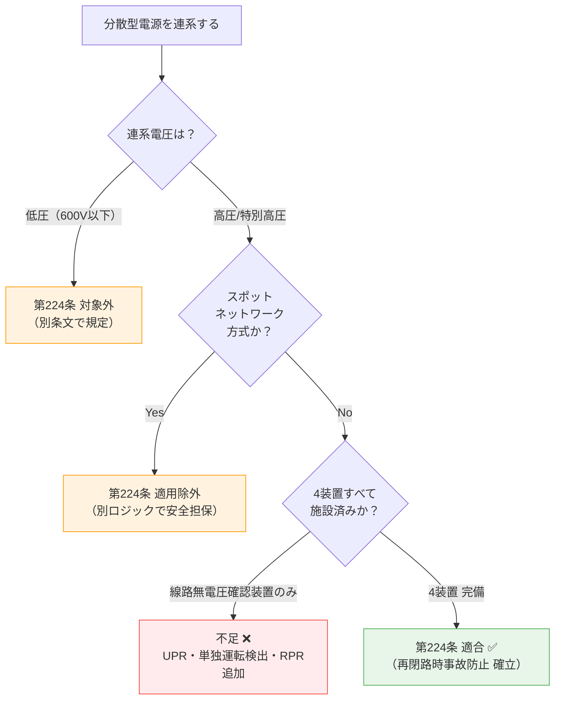

# 電技解釈 第224条 — 高圧又は特別高圧連系時の再閉路時事故防止

!!! abstract "📊 試験対策メタ"
    - **出題頻度**: 🔥🔥（過去14年で R6下問7 に確実出題、加えてH29問9 該当の可能性[要確認: 旧条番号]）
    - **重要度**: A（重要）
    - **直近出題**: R06下問7 穴埋（線路無電圧確認装置・不足電力リレー・単独運転検出装置・逆電力リレー の名称）

> 分散型電源を ****高圧又は特別高圧の電力系統**** に連系する場合に、****再閉路時の事故防止**** のために要求される保護装置を定める。****スポットネットワーク受電方式は除外****。系統側の事故で上位遮断器が開放した後、復旧の再閉路が行われる瞬間に分散型電源が解列されていないと、位相不整合・大電流で機器破損・感電事故が起きる。これを防ぐため、****線路無電圧確認装置**** ****不足電力リレー（UPR）**** ****単独運転検出装置**** ****逆電力リレー（RPR）**** を組み合わせて施設する。

---

## 1. 5秒で思い出す

- 適用範囲：****高圧又は特別高圧**** の系統に分散型電源を連系する場合（****スポットネットワーク方式は除く****）
- 目的：****再閉路時の事故防止****（系統復電瞬間に分散型電源が解列されていないと事故）
- 必須装置（4種・キーワード）：
  1. ****線路無電圧確認装置****（変電所引出口に施設）
  2. ****不足電力リレー（UPR）****
  3. ****単独運転検出装置****
  4. ****逆電力リレー（RPR）****
- 線路無電圧確認装置の役割：再閉路前に系統側が無電圧であることを確認
- 第227条（高圧連系の施設要件）と組で運用される

??? question "セルフチェック: 第224条が適用される連系区分は？"
    ****高圧（6.6kV等）または特別高圧（22kV以上）**** の電力系統に分散型電源を連系する場合。低圧（600V以下）連系は対象外。さらに ****スポットネットワーク受電方式**** も対象外。

??? question "セルフチェック: 「線路無電圧確認装置」を施設する場所は？"
    ****分散型電源を連系する変電所の引出口****。系統側の事故で遮断器が開いた後、再閉路前に「線路が確実に無電圧であること」を確認するため、変電所側に置く必要がある。

---

## 2. 条文原文

!!! info "条文原文の照合（要確認）"
    e-Gov公式（電気設備の技術基準の解釈）または経済産業省公式PDFで第224条本文を確認のうえ転記する。
    現時点では denken-ou.com 過去問解説からの部分引用にとどまる。

> **電気設備の技術基準の解釈 第224条（再閉路時の事故防止）**
>
> [要確認: e-Gov公式の本文をここに一字一句で転記]
>
> 趣旨（要約）：高圧又は特別高圧の電力系統に分散型電源を連系する場合（スポットネットワーク受電方式での連系を除く）は、再閉路時の事故防止のため、線路無電圧確認装置・不足電力リレー・単独運転検出装置・逆電力リレー等を組み合わせて施設すること。

---

## 3. 原文解析

| ブロック | 原文（趣旨） | 意味 | 試験ポイント |
|---------|------|------|-------------|
| 適用主語 | **高圧又は特別高圧**の電力系統に分散型電源を連系する場合 | 600V超〜の系統が対象 | 低圧連系は対象外 |
| 除外規定 | **スポットネットワーク受電方式で連系する場合を除く** | 都市部大規模ビル等の特殊方式は別規定 | ****穴埋め定番****（除外条件を覚える） |
| 目的 | **再閉路時の事故防止のために** | 系統復電時の事故を防ぐ | 単独運転防止とは別軸の目的 |
| 装置① | **線路無電圧確認装置**を施設 | 変電所引出口に設置 | R6下問7（ア）正解 |
| 装置② | **不足電力リレー（UPR）** | 電力潮流の異常検出 | R6下問7（イ）正解 |
| 装置③ | **単独運転検出装置** | 系統解列状態の検出 | R6下問7（ウ）正解 |
| 装置④ | **逆電力リレー（RPR）** | 逆潮流の検出 | R6下問7（エ）正解 |

!!! warning "ひっかけ：「第224条は低圧連系の保護装置」"
    **誤り**。第224条は ****高圧又は特別高圧**** の連系における再閉路防止が対象。低圧連系の保護は別条文。古い問題集や旧版の解説では条番号の対応が異なる場合があるため、最新版の電技解釈で確認する。

!!! warning "ひっかけ：「スポットネットワーク方式も第224条の対象」"
    **誤り**。スポットネットワーク受電方式は ****第224条の適用除外****。都市部の地下変電所・大規模ビル向けの特殊方式で、複数系統からの受電・自動切替により連続供給を担保する仕組み。

---

## 4. かみ砕き解説

> 第224条の核心は「**系統側で事故 → 遮断 → 復旧（再閉路）の瞬間に、分散型電源側が確実に解列されているか**」を多重に保証すること。

### なぜ再閉路時の事故防止が必要か

| ステップ | 事象 | リスク |
|---------|------|------|
| ① | 系統側で事故発生 → 上位遮断器が開放 | 系統側が無電圧化 |
| ② | 分散型電源が単独運転継続（解列失敗） | 配電線が「見かけ上の電源」付き状態 |
| ③ | 系統復電（再閉路） | ****位相不整合の電圧重畳 → 大電流 → 機器破損**** |
| ④ | 復電作業中の作業員が触れる | ****感電事故**** |

この一連の流れを断ち切るため、第224条は「**無電圧確認**」「**電力潮流の異常検出**」「**単独運転検出**」「**逆潮流検出**」の4軸で多重防御する。

### 4つの保護装置の役割分担

| 装置 | 略称 | 何を見ているか | 動作 |
|------|------|---------------|------|
| ****線路無電圧確認装置**** | — | 系統側電圧の有無 | 系統が有電圧なら再閉路可・無電圧確認後に再投入 |
| ****不足電力リレー**** | **UPR** | 電力潮流の不足・低下 | 系統解列により潮流が減少 → 検出 → 解列 |
| ****単独運転検出装置**** | — | 系統と分散型電源の連結状態 | 受動的＋能動的方式で単独運転を検出 |
| ****逆電力リレー**** | **RPR** | 逆潮流（系統側への電力流出） | 逆潮流発生 → 検出 → 解列 |

### 線路無電圧確認装置とは

****変電所の引出口**** に設置し、系統が無電圧であることを電気的に確認する装置。再閉路（事故復旧後の遮断器再投入）を行う直前にこの装置で系統状態を見て、無電圧であれば「分散型電源が解列されている」と判断できる。これが線路無電圧確認装置の本質的な役割。

### スポットネットワーク受電方式が除外される理由

スポットネットワーク方式は ****3回線受電・ネットワークプロテクタによる自動切替**** が前提の特殊方式。複数系統で冗長化されているため、単一回線の事故でも他系統で給電継続できる。第224条のような単一系統前提の再閉路防止規定とは設計思想が異なるため除外される。

!!! tip "暗記の核心"
    **「高圧・特別高圧の連系では、系統復電の瞬間に分散型電源が必ず切れていること」を4つの装置で保証する**

    1. **線路無電圧確認装置**：再閉路前に系統が無電圧であることを確認（変電所側で確認）
    2. **不足電力リレー（UPR）**：系統解列で潮流が減ると動作
    3. **単独運転検出装置**：分散型電源が孤立運転になっていることを検出
    4. **逆電力リレー（RPR）**：逆潮流（系統側への流出）を検出

    ****スポットネットワークは除外****（特殊方式のため別ロジック）

---

## 5. 図で理解

### 図解 1：再閉路時事故の発生メカニズムと第224条の防御線

<svg viewBox="0 0 720 320" xmlns="http://www.w3.org/2000/svg" font-family="sans-serif" font-size="12" style="width:100%;max-width:720px">
  <text x="360" y="20" text-anchor="middle" font-size="13" font-weight="bold" fill="#333">第224条 — 再閉路時事故の発生フローと4装置の防御</text>
  <defs>
    <marker id="arr224b" markerWidth="8" markerHeight="6" refX="8" refY="3" orient="auto">
      <polygon points="0 0,8 3,0 6" fill="#333"/>
    </marker>
  </defs>
  <!-- ステップ1 -->
  <rect x="20" y="50" width="160" height="240" rx="8" fill="#ffebee" stroke="#e53935" stroke-width="1.5"/>
  <text x="100" y="72" text-anchor="middle" font-weight="bold" fill="#c62828">① 系統側事故</text>
  <text x="35" y="100" font-size="10" fill="#b71c1c">高圧/特別高圧の</text>
  <text x="35" y="116" font-size="10" fill="#b71c1c">配電線で事故発生</text>
  <text x="35" y="140" font-size="10" fill="#b71c1c">↓</text>
  <text x="35" y="160" font-size="10" font-weight="bold" fill="#b71c1c">上位遮断器 開放</text>
  <text x="35" y="184" font-size="10" fill="#b71c1c">↓ 系統側 無電圧</text>
  <text x="35" y="208" font-size="10" fill="#b71c1c">しかし分散型電源は</text>
  <text x="35" y="224" font-size="10" fill="#b71c1c">発電継続中（単独運転）</text>
  <text x="35" y="252" font-size="10" font-weight="bold" fill="#b71c1c">⚠ 配電線が「見かけ上</text>
  <text x="35" y="268" font-size="10" font-weight="bold" fill="#b71c1c">　 電源あり」状態</text>
  <line x1="185" y1="170" x2="215" y2="170" stroke="#333" stroke-width="2" marker-end="url(#arr224b)"/>
  <!-- ステップ2 -->
  <rect x="220" y="50" width="180" height="240" rx="8" fill="#fff3e0" stroke="#ff9800" stroke-width="1.5"/>
  <text x="310" y="72" text-anchor="middle" font-weight="bold" fill="#e65100">② 第224条 4装置で検出</text>
  <text x="235" y="98" font-size="10" font-weight="bold" fill="#bf360c">▶ 線路無電圧確認装置</text>
  <text x="245" y="114" font-size="9" fill="#bf360c">変電所引出口で系統電圧確認</text>
  <text x="235" y="138" font-size="10" font-weight="bold" fill="#bf360c">▶ 不足電力リレー（UPR）</text>
  <text x="245" y="154" font-size="9" fill="#bf360c">電力潮流の低下を検出</text>
  <text x="235" y="178" font-size="10" font-weight="bold" fill="#bf360c">▶ 単独運転検出装置</text>
  <text x="245" y="194" font-size="9" fill="#bf360c">受動的＋能動的方式で検出</text>
  <text x="235" y="218" font-size="10" font-weight="bold" fill="#bf360c">▶ 逆電力リレー（RPR）</text>
  <text x="245" y="234" font-size="9" fill="#bf360c">逆潮流を検出</text>
  <text x="235" y="262" font-size="10" font-weight="bold" fill="#bf360c">→ 自動解列を発動</text>
  <text x="235" y="278" font-size="9" fill="#bf360c">　 多重化で確実性UP</text>
  <line x1="405" y1="170" x2="435" y2="170" stroke="#333" stroke-width="2" marker-end="url(#arr224b)"/>
  <!-- ステップ3 -->
  <rect x="440" y="50" width="260" height="240" rx="8" fill="#e8f5e9" stroke="#43a047" stroke-width="1.5"/>
  <text x="570" y="72" text-anchor="middle" font-weight="bold" fill="#2e7d32">③ 安全な再閉路</text>
  <text x="455" y="100" font-size="10" fill="#1b5e20">事故復旧後、上位遮断器が</text>
  <text x="455" y="116" font-size="10" fill="#1b5e20">再投入（再閉路）</text>
  <text x="455" y="142" font-size="10" font-weight="bold" fill="#1b5e20">この瞬間：</text>
  <text x="455" y="158" font-size="10" font-weight="bold" fill="#1b5e20">分散型電源は確実に解列済み</text>
  <text x="455" y="184" font-size="10" fill="#1b5e20">→ 位相不整合の重畳なし</text>
  <text x="455" y="200" font-size="10" fill="#1b5e20">→ 機器破損なし</text>
  <text x="455" y="216" font-size="10" fill="#1b5e20">→ 復電作業中の作業員も安全</text>
  <text x="455" y="244" font-size="10" font-weight="bold" fill="#1b5e20">系統電圧・周波数の正常確認後</text>
  <text x="455" y="260" font-size="10" font-weight="bold" fill="#1b5e20">に分散型電源を再連系</text>
</svg>

### 図解 2：4装置の検出原理マッピング

<svg viewBox="0 0 720 280" xmlns="http://www.w3.org/2000/svg" font-family="sans-serif" font-size="12" style="width:100%;max-width:720px">
  <text x="360" y="20" text-anchor="middle" font-size="13" font-weight="bold" fill="#333">4つの保護装置 — 何を見て、どう動作するか</text>
  <!-- 線路無電圧確認装置 -->
  <rect x="20" y="50" width="160" height="200" rx="8" fill="#e3f2fd" stroke="#1565c0" stroke-width="2"/>
  <text x="100" y="72" text-anchor="middle" font-weight="bold" fill="#0d47a1">線路無電圧確認装置</text>
  <text x="100" y="92" text-anchor="middle" font-size="10" fill="#1565c0">設置場所</text>
  <text x="100" y="108" text-anchor="middle" font-size="11" font-weight="bold" fill="#0d47a1">変電所引出口</text>
  <line x1="35" y1="120" x2="165" y2="120" stroke="#1565c0" stroke-width="0.5"/>
  <text x="100" y="138" text-anchor="middle" font-size="10" fill="#1565c0">検出対象</text>
  <text x="100" y="154" text-anchor="middle" font-size="11" font-weight="bold" fill="#0d47a1">系統電圧の有無</text>
  <line x1="35" y1="166" x2="165" y2="166" stroke="#1565c0" stroke-width="0.5"/>
  <text x="100" y="184" text-anchor="middle" font-size="10" fill="#1565c0">役割</text>
  <text x="35" y="204" font-size="9" fill="#0d47a1">再閉路前に系統が</text>
  <text x="35" y="218" font-size="9" fill="#0d47a1">確実に無電圧で</text>
  <text x="35" y="232" font-size="9" fill="#0d47a1">あることを確認</text>
  <!-- 不足電力リレー UPR -->
  <rect x="195" y="50" width="160" height="200" rx="8" fill="#fff3e0" stroke="#f57c00" stroke-width="2"/>
  <text x="275" y="72" text-anchor="middle" font-weight="bold" fill="#e65100">不足電力リレー（UPR）</text>
  <text x="275" y="92" text-anchor="middle" font-size="10" fill="#f57c00">略称</text>
  <text x="275" y="108" text-anchor="middle" font-size="11" font-weight="bold" fill="#e65100">UPR</text>
  <line x1="210" y1="120" x2="340" y2="120" stroke="#f57c00" stroke-width="0.5"/>
  <text x="275" y="138" text-anchor="middle" font-size="10" fill="#f57c00">検出対象</text>
  <text x="275" y="154" text-anchor="middle" font-size="11" font-weight="bold" fill="#e65100">電力潮流の低下</text>
  <line x1="210" y1="166" x2="340" y2="166" stroke="#f57c00" stroke-width="0.5"/>
  <text x="275" y="184" text-anchor="middle" font-size="10" fill="#f57c00">動作条件</text>
  <text x="210" y="204" font-size="9" fill="#e65100">系統解列で受電潮流が</text>
  <text x="210" y="218" font-size="9" fill="#e65100">減少 → 設定値以下</text>
  <text x="210" y="232" font-size="9" fill="#e65100">→ 解列指令</text>
  <!-- 単独運転検出装置 -->
  <rect x="370" y="50" width="160" height="200" rx="8" fill="#f1f8e9" stroke="#388e3c" stroke-width="2"/>
  <text x="450" y="72" text-anchor="middle" font-weight="bold" fill="#1b5e20">単独運転検出装置</text>
  <text x="450" y="92" text-anchor="middle" font-size="10" fill="#388e3c">方式</text>
  <text x="450" y="108" text-anchor="middle" font-size="11" font-weight="bold" fill="#1b5e20">受動的＋能動的</text>
  <line x1="385" y1="120" x2="515" y2="120" stroke="#388e3c" stroke-width="0.5"/>
  <text x="450" y="138" text-anchor="middle" font-size="10" fill="#388e3c">検出対象</text>
  <text x="450" y="154" text-anchor="middle" font-size="11" font-weight="bold" fill="#1b5e20">単独運転状態</text>
  <line x1="385" y1="166" x2="515" y2="166" stroke="#388e3c" stroke-width="0.5"/>
  <text x="450" y="184" text-anchor="middle" font-size="10" fill="#388e3c">特徴</text>
  <text x="385" y="204" font-size="9" fill="#1b5e20">不感帯対策で</text>
  <text x="385" y="218" font-size="9" fill="#1b5e20">受動的のみは不可</text>
  <text x="385" y="232" font-size="9" fill="#1b5e20">能動的併用が原則</text>
  <!-- 逆電力リレー RPR -->
  <rect x="545" y="50" width="160" height="200" rx="8" fill="#fce4ec" stroke="#c2185b" stroke-width="2"/>
  <text x="625" y="72" text-anchor="middle" font-weight="bold" fill="#880e4f">逆電力リレー（RPR）</text>
  <text x="625" y="92" text-anchor="middle" font-size="10" fill="#c2185b">略称</text>
  <text x="625" y="108" text-anchor="middle" font-size="11" font-weight="bold" fill="#880e4f">RPR</text>
  <line x1="560" y1="120" x2="690" y2="120" stroke="#c2185b" stroke-width="0.5"/>
  <text x="625" y="138" text-anchor="middle" font-size="10" fill="#c2185b">検出対象</text>
  <text x="625" y="154" text-anchor="middle" font-size="11" font-weight="bold" fill="#880e4f">逆潮流</text>
  <line x1="560" y1="166" x2="690" y2="166" stroke="#c2185b" stroke-width="0.5"/>
  <text x="625" y="184" text-anchor="middle" font-size="10" fill="#c2185b">動作条件</text>
  <text x="560" y="204" font-size="9" fill="#880e4f">系統側へ電力流出</text>
  <text x="560" y="218" font-size="9" fill="#880e4f">（逆潮流契約なし時）</text>
  <text x="560" y="232" font-size="9" fill="#880e4f">→ 即解列</text>
</svg>

### 判定フローチャート: 第224条の適用判定

---

## 6. 第222条・第227条との位置づけ

| 比較項目 | 第222条 | 第224条 | 第227条 |
|---------|--------|---------|--------|
| 対象 | 低圧連系 | **高圧/特別高圧連系** | 高圧連系 |
| 規定内容 | 低圧連系の施設要件 | **再閉路時の事故防止** | 高圧連系の施設要件 |
| キー装置 | 逆変換装置・蓄電池等 | **線路無電圧確認装置・UPR・単独運転検出・RPR** | OVR・UVR・OFR・UFR・OCR等 |
| 除外規定 | — | **スポットネットワーク方式** | — |
| 第224条との関係 | 別系統（低圧） | 本条 | 同じ高圧連系で組合せ運用 |

!!! info "条文の役割分担（高圧/特別高圧連系）"
    第227条＝「**高圧連系で常時必要な保護装置**」（電圧・周波数異常検出）  
    第224条＝「**再閉路時の事故防止に特化した装置**」（線路無電圧確認装置等）  
    
    両者はセットで運用される。試験では「再閉路防止＝第224条／施設要件＝第227条」と覚える。

---

## 7. 試験で問われること

> 出題は「4つの保護装置の名称穴埋め」「適用範囲（高圧/特別高圧かつスポットネットワーク除外）」「線路無電圧確認装置の設置場所」に集中。

!!! note "出題予測（過去14年の統計）"
    第224条の出題は次の3軸が定番。

    1. **4装置の名称穴埋め（R6下問7 が代表）**
       - 正解: 線路無電圧確認装置・不足電力リレー（UPR）・単独運転検出装置・逆電力リレー（RPR）
       - ひっかけ: OVR・UVR等の電圧/周波数リレーで埋めさせる選択肢

    2. **適用範囲**
       - 正解: 高圧又は特別高圧、スポットネットワーク方式は除外
       - ひっかけ: 「低圧も含む」「スポットネットワークも対象」

    3. **線路無電圧確認装置の設置場所**
       - 正解: 変電所引出口
       - ひっかけ: 「分散型電源側の出力端」「連系点の負荷側」

---

## 8. 頻出ひっかけ

1. 🔴 **「第224条は低圧連系も対象」** — 誤り。****高圧又は特別高圧のみ****
2. 🔴 **「スポットネットワーク方式も第224条の対象」** — 誤り。****適用除外****
3. 🔴 **「線路無電圧確認装置は分散型電源側に設置」** — 誤り。****変電所引出口**** に設置
4. 🟡 **「不足電力リレー＝UVR」** — 誤り。**UPR（Under Power Relay）**。UVR（Under Voltage Relay）は別物
5. 🟡 **「単独運転検出は受動的方式のみで足りる」** — 誤り。受動的方式には不感帯あり。****能動的方式との併用**** が原則
6. 🟡 **「逆電力リレー＝OVR」** — 誤り。**RPR（Reverse Power Relay）**。OVRは過電圧
7. 🟢 **「再閉路時の事故防止と単独運転防止は同じ目的」** — 誤り。**目的が異なる**（再閉路防止＝復電瞬間の事故防止／単独運転防止＝系統解列状態での発電継続防止）

??? question "セルフチェック: なぜ線路無電圧確認装置は分散型電源側ではなく変電所側に置くのか？"
    再閉路の判断は ****系統側（変電所側）の上位遮断器**** で行うため。系統側で「線路が無電圧（=分散型電源も解列済み）」と確認できて初めて安全に再閉路できる。分散型電源側に置いても、系統側遮断器に情報が伝わらなければ再閉路防止にならない。

---

## 9. 穴埋め過去問チャレンジ

!!! abstract "R6下問7（難易度 ★★★★☆）"
    次の文章は「電気設備技術基準の解釈」第224条に関する記述である。空欄（ア）〜（エ）に入る語句の組合せとして正しいものを選べ。

    > 高圧又は特別高圧の電力系統に分散型電源を連系する場合（スポットネットワーク受電方式で連系する場合を除く。）は、再閉路時の事故防止のために、分散型電源を連系する変電所の引出口に <mark>（ア）</mark> を施設すること。
    > 加えて、<mark>（イ）</mark>・<mark>（ウ）</mark>・<mark>（エ）</mark> を組み合わせて施設し、系統異常時に分散型電源を自動的に解列する。

??? success "解答を見る"
    | 空欄 | 正答 |
    |------|------|
    | （ア） | ==線路無電圧確認装置== |
    | （イ） | ==不足電力リレー== |
    | （ウ） | ==単独運転検出装置== |
    | （エ） | ==逆電力リレー== |

    **読み解きポイント：**

    - （ア）==線路無電圧確認装置== ：変電所引出口に設置。「線路（系統側）が無電圧であることを確認」がそのまま装置名
    - （イ）==不足電力リレー（UPR）== ：UVRと混同しやすい。「電力（Power）」が不足するのを検出する
    - （ウ）==単独運転検出装置== ：受動的＋能動的方式の組合せ
    - （エ）==逆電力リレー（RPR）== ：逆潮流（系統側への流出）を検出

---

## 10. まぎらわしい選択肢と正解の違い

| 空欄 | よくある誤答 | 正答 | なぜ違うか |
|------|------------|------|----------|
| （ア） | **過電圧継電器（OVR）** | **線路無電圧確認装置** | OVRは電圧が高い時に動作。再閉路前に「無電圧」を確認する装置とは目的が違う |
| （イ） | **不足電圧リレー（UVR）** | **不足電力リレー（UPR）** | UVRは「電圧 V」、UPRは「電力 P」。検出対象が違う |
| （ウ） | **過電流リレー（OCR）** | **単独運転検出装置** | OCRは過電流を検出。単独運転検出は系統と連結されているかを判断する |
| （エ） | **不足周波数リレー（UFR）** | **逆電力リレー（RPR）** | UFRは周波数低下、RPRは逆潮流。検出する物理量が違う |
| 適用範囲 | **低圧連系も含む** | **高圧又は特別高圧のみ** | 第224条は高圧/特別高圧の再閉路に特化。低圧は別条文 |
| 除外 | **スポットネットワークも対象** | **スポットネットワークは除外** | 特殊方式で別ロジックの安全担保がある |

### 一目でわかる用語比較（リレー類）

| 略号 | 名称（英語） | 検出対象 | 第224条で必要か |
|------|------------|---------|--------------|
| ****UPR**** | Under Power Relay | 電力（潮流）の不足 | ****必須**** |
| ****RPR**** | Reverse Power Relay | 逆潮流 | ****必須**** |
| OVR | Over Voltage Relay | 電圧の過剰 | 第227条で必須 |
| UVR | Under Voltage Relay | 電圧の不足 | 第227条で必須 |
| OFR | Over Frequency Relay | 周波数の過剰 | 第227条で必須 |
| UFR | Under Frequency Relay | 周波数の不足 | 第227条で必須 |
| OCR | Over Current Relay | 電流の過剰 | 第227条で必須 |

---

## 11. 関連条文

**同章（分散型電源の系統連系設備）**

- [電技解釈 第220条（直流流出防止変圧器の施設）](220.md) — インバータ連系の根本要件
- [電技解釈 第222条（低圧連系時の施設要件）](222.md) — 低圧連系の対応条文
- [電技解釈 第227条（高圧連系時の施設要件）](227.md) — 本条と組で運用（OVR・UVR・OFR・UFR・OCR）
- [電技解釈 第229条（逆潮流の制限）](229.md) — RPR の必要性根拠
- [電技解釈 第232条（単独運転の防止）](232.md) — 単独運転防止の上位規定

**理解の助けとなる横展開**

- [分散型電源の連系区分早見表](../../reference/distributed-power-zones.md) — 低圧／高圧／特別高圧の要件比較

**第224条の位置づけフロー（高圧/特別高圧連系）**

| ステップ | 条文 | 内容 | 役割 |
|---------|------|------|------|
| 1 | 解釈第220条 | 直流流出防止 | インバータ連系の前提条件 |
| 2 | 解釈第227条 | 高圧連系の施設要件 | 機器・電圧/周波数リレー |
| 3 | **解釈第224条** | **再閉路時の事故防止** | **線路無電圧確認装置・UPR・単独運転検出・RPR** |
| 4 | 解釈第229条 | 逆潮流の制限 | RPR 必要性の根拠 |
| 5 | 解釈第232条 | 単独運転の防止 | 単独運転検出の上位規定 |

---

## 12. 過去問実績

| 年度 | 問 | 論点 | 形式 | 出典 |
|------|-----|------|------|------|
| **R06下** | **問7** | **線路無電圧確認装置・UPR・単独運転検出装置・RPR の名称穴埋め** | 穴埋 | denken-ou.com 確認済 |
| H29 | 問9 | [要確認: 当時§224 に該当する論点。電技解釈改正で条番号が変わっている可能性あり] | 穴埋 | kakomon.yml |

!!! warning "H29問9 の条番号について（要確認）"
    ローカル kakomon.yml では H29問9 が「解釈§224 / 低圧連系時の系統連系用保護装置」として登録されている。しかし現行の電技解釈第224条は「**高圧/特別高圧連系の再閉路時事故防止**」であり、論点が一致しない。
    
    **推定原因**: 電技解釈の改正で条番号が変わった可能性。H29当時の§224と現行§224は別内容かもしれない。e-Gov公式履歴または当時の問題冊子で再確認が必要。

!!! note "R08 出題予測"
    **頻出論点**: R6下問7 と同パターンの「4装置の名称穴埋め」。再エネ拡大に伴い高圧連系案件が増加傾向のため、出題頻度上昇が予想される。
    
    **複合出題の可能性**: 第227条（高圧連系の施設要件）との組合せで、「常時の保護装置（OVR等）」と「再閉路時の事故防止装置（線路無電圧確認装置等）」を比較させる選択問題が想定される。

---

## 13. 最終チェック

**📜 条文の核心**

- [ ] 第224条が「**高圧又は特別高圧連系の再閉路時事故防止**」を規定する条文だと言える
- [ ] **スポットネットワーク受電方式は適用除外** だと即答できる
- [ ] 低圧連系は対象外（別条文）であることを区別できる

**🛡 4装置の体系**

- [ ] **線路無電圧確認装置・不足電力リレー（UPR）・単独運転検出装置・逆電力リレー（RPR）** の4つを順序通り即答できる
- [ ] **線路無電圧確認装置は変電所引出口に設置** と即答できる
- [ ] UPR と UVR の違い（電力 vs 電圧）を説明できる
- [ ] RPR と OVR の違い（逆潮流 vs 過電圧）を説明できる

**🧠 体系理解**

- [ ] 第224条（再閉路防止）と第227条（高圧連系の常時保護）の役割分担を説明できる
- [ ] 再閉路時事故の発生メカニズム（系統事故→単独運転継続→再閉路で位相不整合→機器破損）を説明できる
- [ ] スポットネットワーク方式が除外される理由（複数系統冗長化の特殊方式）を説明できる

---

*最終確認: 2026-05-02 | ステータス: v2.0（R6下問7 反映・条文内容を高圧/特別高圧連系の再閉路防止に修正） | [バージョニング基準](../../reference/versioning.md)*
