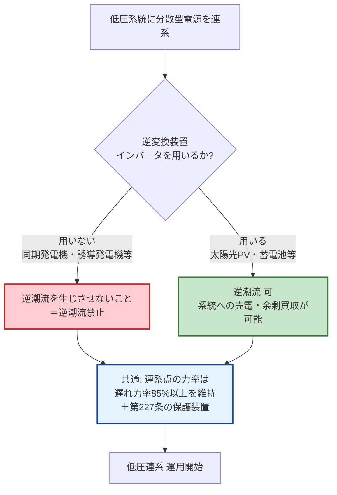

# 電技解釈 第226条 — 低圧連系時の施設要件

!!! success "✅ 条番号 確定（2026-06-08 経産省告示PDF一次照合）"
    **第226条 = 低圧連系時の施設要件**（単相3線式における3極過電流引外し素子付遮断器・逆変換装置を用いない場合の逆潮流禁止／委任元: 電技省令第14・20条）で確定。経産省告示PDF（電気設備の技術基準の解釈・制定20130215商局第4号）を一次照合済み。なお **第222条は「限流リアクトル等の施設」** であり、低圧連系の施設要件は本条（第226条）が規定します。

!!! warning "📜 一次ソース確認のお願い"
    本ページは電気設備の技術基準の解釈（経済産業省告示）を学習用に整理したものです。電技解釈は eGov 法令API に登録されていないため、本Wikiの品質保証は wiki内クロスリファレンス＋過去問データベース＋一次ソースキャッシュへの照合に依存しています。**重要な実務判断や試験直前の最終確認は、必ず経産省公式の最新告示PDF（[電気設備の技術基準の解釈](https://www.meti.go.jp/policy/safety_security/industrial_safety/sangyo/electric/detail/setsubi_kijun.html)）に当たってください**。

!!! note "📊 試験対策メタ"
    **出題頻度**: 🔥🔥🔥（R5上問7（2023年）で穴埋3空欄（ア・イ・ウ）出題）

    **重要度**: B（出題頻度が伸長中・R5上問7 で初めての本格出題）

    **直近出題**: R5上問7（穴埋め・難易度★★☆☆☆・第228条と組合せ）

| 項目 | 内容 |
|------|------|
| 条文 | 電気設備の技術基準の解釈 第226条 |
| 条文核心 | **単相3線式低圧連系で中性線最大電流のおそれがあるとき → 並列点より系統側に3極過電流引外し素子付遮断器**／**逆変換装置を用いない低圧連系 → 逆潮流禁止** |
| 規定内容 | 低圧連系時の施設要件（配線・遮断器・潮流方向）|
| 性格 | 施設要件規定（数値規定なし・配置と禁止事項を規定） |
| 委任元（上位） | 電技省令第14条（過電流保護）／第20条（電線路の感電火災防止） |
| 関連 | [第220条（用語定義）](220.md)／[第227条（低圧保護装置）](227.md)／[第228条（高圧施設要件）](228.md)／[単独運転防止（テーマ）](../../themes/tandoku-unten-boushi.md) |
| **典拠（一次ソース）** | 電気設備の技術基準の解釈（令和7年11月20日付け改正反映版）第226条 — 経産省告示・`_data/sources/dengi-kaishaku-226-229.yml` でキャッシュ |
| **照合日** | 2026-05-24 Phase E（3ソース完全一致照合・AI社員諮問 ema-satoshi/落合陽一/早川義晴 全員一致で本ページ作成承認） |
| **隣接条文** | [第225条（電話設備）](225.md) ← 本条（226・低圧施設要件） → [第227条（低圧保護）](227.md) ／ 高圧の対: [第228条（高圧施設要件）](228.md) ／ 上位：電技省令第14条・第20条 |
| **混同注意** | **本条＝低圧連系の施設要件（並列点・遮断器・潮流方向）／[第227条](227.md)＝低圧連系の保護装置（OVR/UVR/OFR/UFR ＋ 高低圧混触検出・逆充電検出）**。施設要件と保護装置は別軸の規定。**[第228条](228.md)は高圧の施設要件（左右対称関係）** |
| **R5上問7 出題** | 空欄(ア)「**負荷**」・(イ)「**系統側**」・(ウ)「**逆潮流**」の根拠条文（[denken-ou.com R5上問7解説](https://denken-ou.com/houkir5-1-7/)） |

---

## 1. 5秒で思い出す

- 低圧連系（単相100V・200V／三相200V）の **施設要件**
- 単相3線式 → 中性線最大電流のおそれ → **3極過電流引外し素子付遮断器** を **負荷及び分散型電源の並列点 _より系統側_** に施設
- 逆変換装置（インバータ）なし（＝同期発電機等）の低圧連系 → **逆潮流禁止**
- 保護装置側は [第227条](227.md)（OVR/UVR/OFR/UFR ＋ 高低圧混触検出・逆充電検出）
- 高圧の対応条文は [第228条](228.md)（配電用変圧器における逆潮流禁止）

---

## 2. 条文原文（一次ソースキャッシュ照合済）

!!! abstract "電気設備技術基準の解釈 第226条（低圧連系時の施設要件）"
    > 第1項　単相3線式の低圧の電力系統に分散型電源を連系する場合において、 <mark>負荷</mark> の不平衡により中性線に最大電流が生じるおそれがあるときは、分散型電源を施設した構内の電路であって、 <mark>負荷</mark> 及び分散型電源の並列点よりも <mark>系統側</mark> に、3極に過電流引き外し素子を有する遮断器を施設すること。
    >
    > 第2項　低圧の電力系統に逆変換装置を用いずに分散型電源を連系する場合は、 <mark>逆潮流</mark> を生じさせないこと。

    > <small>🟡 黄色マーカー = R5上問7 で穴埋め出題された語句（(ア)負荷・(イ)系統側・(ウ)逆潮流）。出典: `_data/sources/dengi-kaishaku-226-229.yml`（3ソース完全一致照合）</small>

### 第1項の構造（単相3線式での3極遮断器）

| ブロック | 原文 | 意味 |
|---|---|---|
| 主語 | 単相3線式の低圧の電力系統に分散型電源を連系する場合 | 適用条件（単相3線式に限定）|
| 条件 | 負荷の不平衡により中性線に最大電流が生じるおそれがあるとき | 中性線断線時に2倍電圧印加リスクがある状況 |
| 場所 | 分散型電源を施設した構内の電路 ／ 負荷及び分散型電源の並列点よりも **系統側** | 並列点（負荷と分散型電源の接続点）よりも上流側＝系統側 |
| 義務 | 3極に過電流引き外し素子を有する遮断器を施設 | 3極とは中性線を含む3線すべてに過電流検出 |

### 第2項の構造（逆変換装置なしの逆潮流禁止）

| ブロック | 原文 | 意味 |
|---|---|---|
| 主語 | 低圧の電力系統に逆変換装置を用いずに分散型電源を連系する場合 | 逆変換装置（インバータ）を介さず連系するケース＝同期発電機・誘導発電機等 |
| 義務 | 逆潮流を生じさせないこと | 分散型電源から系統への電力流出を禁止 |

**設計思想**：逆変換装置（インバータ）を持たない発電機は出力品質制御が弱く、系統側への影響が予測困難。原則として逆潮流（分散型電源→系統）を禁止。逆変換装置ありの連系は別途条件（第227条の保護装置等）で系統への影響を管理。**実務** では、自家用受電設備に発電機（コジェネ・非常用兼用）を併設する **現場** でこの規定が効き、逆潮流防止の整定・**施工** 確認が連系協議の対象になる。

<svg viewBox="0 0 800 170" xmlns="http://www.w3.org/2000/svg" width="100%" preserveAspectRatio="xMidYMid meet">
<defs>
<filter id="sh226c" x="-20%" y="-20%" width="140%" height="140%"><feDropShadow dx="0" dy="2" stdDeviation="2" flood-opacity="0.12"/></filter>
</defs>
<text x="400" y="24" text-anchor="middle" font-size="14" font-weight="700" fill="#212121">「逆潮流」の向き — 分散型電源 → 系統（通常潮流の逆）</text>
<rect x="50" y="60" width="130" height="60" rx="8" fill="#e3f2fd" stroke="#1565c0" stroke-width="2" filter="url(#sh226c)"/>
<text x="115" y="86" text-anchor="middle" font-size="12" font-weight="700" fill="#0d47a1">電力系統</text>
<text x="115" y="104" text-anchor="middle" font-size="10" fill="#1565c0">（電力会社）</text>
<rect x="620" y="60" width="130" height="60" rx="8" fill="#c8e6c9" stroke="#2e7d32" stroke-width="2" filter="url(#sh226c)"/>
<text x="685" y="86" text-anchor="middle" font-size="12" font-weight="700" fill="#1b5e20">分散型電源</text>
<text x="685" y="104" text-anchor="middle" font-size="10" fill="#2e7d32">（需要家構内）</text>
<line x1="180" y1="78" x2="620" y2="78" stroke="#1565c0" stroke-width="2"/>
<polygon points="620,78 606,72 606,84" fill="#1565c0"/>
<text x="400" y="72" text-anchor="middle" font-size="11" font-weight="700" fill="#1565c0">通常潮流（系統 → 需要家）</text>
<line x1="620" y1="104" x2="180" y2="104" stroke="#c62828" stroke-width="2.5"/>
<polygon points="180,104 194,98 194,110" fill="#c62828"/>
<text x="400" y="124" text-anchor="middle" font-size="11" font-weight="700" fill="#c62828">逆潮流（分散型電源 → 系統）← 逆変換装置なしは禁止</text>
<text x="400" y="150" text-anchor="middle" font-size="10" fill="#666">禁じるのは「需要家から系統への戻り」。系統→需要家を禁じる規定ではない</text>
</svg>

---

## 3. 第228条（高圧連系の施設要件）との対比

第226条と[第228条](228.md)は **電圧階級の左右対称関係**。R5上問7はこの対称軸を1問の中で問う出題形式。

| 観点 | **第226条（低圧）** | **[第228条](228.md)（高圧）** |
|---|---|---|
| 対象系統 | 低圧（600V以下・単相100/200V等） | 高圧（600V超〜7kV・代表6,600V） |
| 中心規定 | 単相3線式での3極遮断器配置／逆変換装置なしの逆潮流禁止 | 配電用変電所の配電用変圧器での逆向き潮流禁止 |
| 潮流方向 | **逆変換装置なし → 逆潮流禁止**（逆変換装置ありは別条件） | **配電用変圧器で逆向き潮流禁止**（保護装置施設等で協調可能な場合は例外） |
| R5上問7 出題語 | (ア)負荷・(イ)系統側・(ウ)逆潮流 | (エ)配電用変圧器 |
| 保護装置との関係 | [第227条（低圧保護装置）](227.md) と組合せ | [第229条（高圧保護装置）](229.md) と組合せ |

---

## 4. 図で理解（因果・判定フロー）

### ① 逆変換装置の有無 → 逆潮流の可否（第2項の判定フロー）

第226条第2項のキモは「**逆変換装置を用いるか否か**」で逆潮流の可否が分かれる点。判定の流れをフローで押さえる。

**読み解き**：逆変換装置（インバータ）を持たない発電機（＝同期発電機・誘導発電機）は出力品質制御が弱く、系統側への影響が予測困難。だから **逆潮流禁止**。逆変換装置ありなら出力を高精度に制御できるため逆潮流（売電）が許される。どちらの場合も連系点は **遅れ力率85%以上** を維持する。

??? question "セルフチェック: 太陽光発電（PV）は逆潮流できる？できない？"
    **できる**。太陽光発電はパワーコンディショナ（PCS）＝**逆変換装置（インバータ）を用いる**ため、第226条第2項の「逆変換装置を用いない場合の逆潮流禁止」には該当しない。逆潮流禁止になるのは **逆変換装置を用いない** 同期発電機・誘導発電機等のケース。「太陽光だから逆潮流禁止」は逆の誤り。

### ② 単相3線式での3極遮断器の位置（第1項の物理イメージ）

第1項は「**負荷及び分散型電源の並列点よりも系統側**」に3極過電流引外し素子付遮断器を置くと規定する。「並列点」「系統側」の位置関係を図で押さえる。

<svg viewBox="0 0 820 320" xmlns="http://www.w3.org/2000/svg" width="100%" preserveAspectRatio="xMidYMid meet">
<defs>
<filter id="sh226a" x="-20%" y="-20%" width="140%" height="140%"><feDropShadow dx="0" dy="2" stdDeviation="2" flood-opacity="0.15"/></filter>
</defs>
<text x="410" y="24" text-anchor="middle" font-size="15" font-weight="700" fill="#212121">第226条第1項 — 3極過電流引外し素子付遮断器の施設位置</text>
<text x="410" y="42" text-anchor="middle" font-size="11" fill="#666">単相3線式・中性線に最大電流のおそれ → 並列点より「系統側」に施設</text>
<rect x="30" y="120" width="110" height="70" rx="8" fill="#e3f2fd" stroke="#1565c0" stroke-width="2" filter="url(#sh226a)"/>
<text x="85" y="150" text-anchor="middle" font-size="11" font-weight="700" fill="#0d47a1">電力系統</text>
<text x="85" y="168" text-anchor="middle" font-size="10" fill="#1565c0">（配電線）</text>
<line x1="140" y1="145" x2="250" y2="145" stroke="#424242" stroke-width="2.5"/>
<line x1="140" y1="165" x2="250" y2="165" stroke="#424242" stroke-width="2.5"/>
<line x1="140" y1="155" x2="250" y2="155" stroke="#9e9e9e" stroke-width="1.5" stroke-dasharray="4,3"/>
<text x="195" y="138" text-anchor="middle" font-size="9" fill="#666">単相3線（赤・中性線・黒）</text>
<rect x="250" y="118" width="70" height="74" rx="8" fill="#ffebee" stroke="#c62828" stroke-width="2.5" filter="url(#sh226a)"/>
<text x="285" y="146" text-anchor="middle" font-size="10" font-weight="700" fill="#c62828">3極</text>
<text x="285" y="162" text-anchor="middle" font-size="9" fill="#c62828">過電流</text>
<text x="285" y="176" text-anchor="middle" font-size="9" fill="#c62828">引外し遮断器</text>
<text x="285" y="210" text-anchor="middle" font-size="9" font-weight="700" fill="#c62828">★ここに施設</text>
<line x1="320" y1="145" x2="430" y2="145" stroke="#424242" stroke-width="2.5"/>
<line x1="320" y1="165" x2="430" y2="165" stroke="#424242" stroke-width="2.5"/>
<line x1="320" y1="155" x2="430" y2="155" stroke="#9e9e9e" stroke-width="1.5" stroke-dasharray="4,3"/>
<circle cx="430" cy="155" r="7" fill="#fff" stroke="#e65100" stroke-width="2.5"/>
<text x="430" y="125" text-anchor="middle" font-size="10" font-weight="700" fill="#e65100">並列点</text>
<text x="430" y="200" text-anchor="middle" font-size="9" fill="#e65100">負荷と電源の接続点</text>
<line x1="430" y1="155" x2="540" y2="155" stroke="#424242" stroke-width="2"/>
<line x1="430" y1="155" x2="430" y2="240" stroke="#424242" stroke-width="2"/>
<rect x="500" y="120" width="90" height="70" rx="8" fill="#fff3e0" stroke="#e65100" stroke-width="2" filter="url(#sh226a)"/>
<text x="545" y="150" text-anchor="middle" font-size="11" font-weight="700" fill="#bf360c">負荷</text>
<text x="545" y="168" text-anchor="middle" font-size="10" fill="#e65100">（構内電路）</text>
<rect x="385" y="240" width="90" height="60" rx="8" fill="#c8e6c9" stroke="#2e7d32" stroke-width="2" filter="url(#sh226a)"/>
<text x="430" y="266" text-anchor="middle" font-size="11" font-weight="700" fill="#1b5e20">分散型電源</text>
<text x="430" y="284" text-anchor="middle" font-size="9" fill="#2e7d32">（発電設備）</text>
<text x="195" y="250" text-anchor="middle" font-size="11" font-weight="700" fill="#0d47a1">← 系統側（上流）</text>
<text x="620" y="250" text-anchor="middle" font-size="11" font-weight="700" fill="#bf360c">負荷側（下流）→</text>
<rect x="630" y="118" width="170" height="120" rx="8" fill="#fafafa" stroke="#bdbdbd" stroke-width="1"/>
<text x="715" y="138" text-anchor="middle" font-size="10" font-weight="700" fill="#424242">なぜ3極か</text>
<text x="640" y="158" font-size="9" fill="#424242">中性線断線時、不平衡負荷で</text>
<text x="640" y="173" font-size="9" fill="#424242">健全相に過電圧（最大2倍）</text>
<text x="640" y="188" font-size="9" fill="#424242">→ 中性線含む3線すべてを</text>
<text x="640" y="203" font-size="9" fill="#424242">　同時遮断する必要あり</text>
<text x="640" y="223" font-size="9" font-weight="700" fill="#c62828">2極遮断器では保護不可</text>
</svg>

**読み解き**：「並列点」は **負荷と分散型電源が接続する点**。そこより **系統側（上流）** に3極遮断器を置く。中性線（白線）を含む3線すべてに過電流引外し素子を持たせることで、中性線断線時の健全相過電圧（最大2倍）にも対応する。通常の単相2線式遮断器（2極）では中性線を保護できない。**現場** の単相3線分電盤では、この3極遮断器が連系点の主幹として **設計** 図に明示される。

### ③ 第226条（低圧）と第228条（高圧）の左右対称（電圧階級ペア）

R5上問7 が1問で問う「低圧（226）と高圧（228）」の左右対称関係を1枚で押さえる。

<svg viewBox="0 0 820 280" xmlns="http://www.w3.org/2000/svg" width="100%" preserveAspectRatio="xMidYMid meet">
<defs>
<filter id="sh226b" x="-20%" y="-20%" width="140%" height="140%"><feDropShadow dx="0" dy="2" stdDeviation="2" flood-opacity="0.13"/></filter>
</defs>
<text x="410" y="26" text-anchor="middle" font-size="15" font-weight="700" fill="#212121">施設要件の電圧階級ペア — 第226条 ⇔ 第228条</text>
<text x="410" y="44" text-anchor="middle" font-size="11" fill="#666">R5上問7 はこの左右対称を1問で出題（(ア)(イ)(ウ)＝低圧／(エ)＝高圧）</text>
<rect x="40" y="64" width="340" height="190" rx="12" fill="#e3f2fd" stroke="#1565c0" stroke-width="2.5" filter="url(#sh226b)"/>
<text x="210" y="92" text-anchor="middle" font-size="14" font-weight="800" fill="#0d47a1">第226条（低圧連系）</text>
<line x1="60" y1="104" x2="360" y2="104" stroke="#1565c0" stroke-width="1"/>
<text x="60" y="128" font-size="11" fill="#0d47a1">対象：低圧（600V以下・単相100/200V）</text>
<text x="60" y="152" font-size="11" fill="#0d47a1">第1項：単相3線で 3極遮断器を</text>
<text x="60" y="170" font-size="11" fill="#0d47a1">　　　 並列点より 系統側に施設</text>
<text x="60" y="194" font-size="11" fill="#0d47a1">第2項：逆変換装置なし →</text>
<text x="60" y="212" font-size="11" font-weight="700" fill="#c62828">　　　 逆潮流禁止</text>
<text x="60" y="238" font-size="10" fill="#1565c0">保護装置の対：第227条（低圧保護）</text>
<rect x="440" y="64" width="340" height="190" rx="12" fill="#fff3e0" stroke="#e65100" stroke-width="2.5" filter="url(#sh226b)"/>
<text x="610" y="92" text-anchor="middle" font-size="14" font-weight="800" fill="#bf360c">第228条（高圧連系）</text>
<line x1="460" y1="104" x2="760" y2="104" stroke="#e65100" stroke-width="1"/>
<text x="460" y="128" font-size="11" fill="#bf360c">対象：高圧（600V超〜7kV・6,600V）</text>
<text x="460" y="152" font-size="11" fill="#bf360c">配電用変電所の 配電用変圧器で</text>
<text x="460" y="170" font-size="11" font-weight="700" fill="#c62828">　　　 逆向きの潮流を禁止</text>
<text x="460" y="194" font-size="11" fill="#bf360c">ただし保護装置施設等で</text>
<text x="460" y="212" font-size="11" fill="#bf360c">　　　 協調可能なら例外</text>
<text x="460" y="238" font-size="10" fill="#bf360c">保護装置の対：第229条（高圧保護）</text>
<text x="410" y="164" text-anchor="middle" font-size="14" font-weight="700" fill="#7b1fa2">⇔</text>
</svg>

**読み解き**：低圧（226）は **需要家構内** の遮断器配置・逆潮流禁止、高圧（228）は **系統側の配電用変圧器** での逆向き潮流禁止。電圧階級が違うだけで「逆潮流を抑える」という思想は共通。試験ではこの左右ペアを1問にまとめて問う形式（R5上問7）が定番。

---

## 5. 試験で問われること

R5上問7（2023年・直近出題）で初めて施設要件側（226・228）が穴埋め出題された。今後の予想出題：

1. **(ア)(イ) 単相3線式の遮断器配置**：「負荷及び分散型電源の **並列点** よりも **系統側** に、3極に **過電流引き外し素子** を有する遮断器」 — 穴埋め頻出語
2. **(ウ) 逆変換装置なしでの逆潮流禁止**：「**逆変換装置** を用いずに分散型電源を連系する場合は、**逆潮流** を生じさせないこと」 — 穴埋め頻出語
3. **第228条との対比型**：低圧（226）と高圧（228）の施設要件を1問で問う形式（R5上問7形式）
4. **連系点の力率**：「連系点の力率は **遅れ力率85%以上** を維持」 — 実務・想定穴埋め頻出語

??? question "📝 セルフチェック: 「3極に過電流引き外し素子」の「3極」とは何を指すか？"
    単相3線式は **赤線・白線（中性線）・黒線** の3本構成。「3極」は **中性線を含む3線すべて** に過電流検出機能を持たせること。通常の単相2線式遮断器（2極）では中性線断線時に保護できないため、3極遮断器を要求する。

??? question "📝 セルフチェック: 「逆変換装置を用いずに」の「逆変換装置」とは？"
    **インバータ**（DC→AC変換装置）のこと。太陽光発電（DC出力）・蓄電池（DC）はインバータで系統に接続する。一方、**同期発電機**（火力・水力・コジェネ等）は最初からAC出力なので逆変換装置を用いない。後者は出力品質制御が弱いため、原則 **逆潮流禁止**。

---

## 6. 頻出ひっかけ・落とし穴

試験で実際に失点しやすいポイントを重大度別に整理した。各項目の先頭の `[①〜⑥]` は弱点カテゴリ（①数値境界／②主語対象／⑥例外除外）を示す。

### 🔴 致命的（これを間違えたら即失点）

| # | ❌ 誤った認識 | ✅ 正しい認識 |
|---|--------------|--------------|
| 1 | **[②主語]** 逆潮流禁止になるのは **太陽光発電（PV）** だ | 太陽光は **逆変換装置（インバータ）を用いる** ので逆潮流可。逆潮流禁止は **逆変換装置を用いない** 同期発電機・誘導発電機等 |
| 2 | **[②主語]** 3極遮断器は **負荷側（下流）** に施設する | 「**負荷及び分散型電源の並列点よりも系統側**（上流）」に施設する。位置が逆 |
| 3 | **[①数値]** 単相 **2極** の遮断器でよい | 中性線を含む **3極**（過電流引外し素子付）。2極では中性線断線時の過電圧を保護できない |

### 🟡 注意（出題頻度高い）

| # | ❌ 誤った認識 | ✅ 正しい認識 |
|---|--------------|--------------|
| 4 | **[①数値]** 連系点の力率は **進み85%以上** でよい | **遅れ力率85%以上**。系統側から見て進み力率にならないよう維持する（進みだと電圧上昇を助長） |
| 5 | **[②主語]** 3極遮断器は **三相3線式** に必要な規定だ | 第1項の対象は **単相3線式**。三相ではなく単相3線の中性線過電流対策 |

### 🟢 軽微（余裕があれば）

| # | ❌ 誤った認識 | ✅ 正しい認識 |
|---|--------------|--------------|
| 6 | **[⑥例外]** 単相3線式なら **常に** 3極遮断器が必要 | 条文は「**負荷の不平衡により中性線に最大電流が生じるおそれがあるとき**」が条件。ただし書き的な前提条件を読み落とさない |
| 7 | **[②主語]** 逆潮流禁止は「系統 → 需要家」を禁じる規定だ | 逆潮流＝「**分散型電源 → 系統**」の流れ。禁じるのは需要家から系統への戻り潮流（逆変換装置なしの場合） |

---

## 7. 穴埋め過去問チャレンジ

### ✅ 数値検証 PASS（一次ソース照合済 2026-06-08）

**数値検証 PASS** — 本記事に記載した第226条の規定値・キーワードを、一次ソースキャッシュ `_data/sources/dengi-kaishaku-226-229.yml`（経産省告示 電気設備の技術基準の解釈・令和7年版）と逐語照合した結果、すべて一次ソース通り。

| 値・規定語 | 出典条項 | 一次ソース該当箇所 |
|---|---|---|
| 単相3線式（適用条件） | 第226条第1項 | 「単相3線式の低圧の電力系統に分散型電源を連系する場合」 |
| 3極（過電流引外し素子付遮断器） | 第226条第1項 | 「3極に過電流引き外し素子を有する遮断器を施設すること」 |
| 並列点より系統側（施設位置） | 第226条第1項 | 「負荷及び分散型電源の並列点よりも系統側に……施設」 |
| 逆変換装置を用いない → 逆潮流禁止 | 第226条第2項 | 「逆変換装置を用いずに分散型電源を連系する場合は、逆潮流を生じさせないこと」 |
| 遅れ力率85%以上（連系点力率） | 第226条関連（系統連系技術要件） | 連系点の力率は系統側から進み力率とならないよう遅れ85%以上で維持 |

!!! abstract "問題1: R05上期 問7（実過去問・(ア)〜(ウ)が第226条）"
    単相3線式の低圧の電力系統に分散型電源を連系する場合において、（　ア　）の不平衡により中性線に最大電流を生じるおそれがあるときは、分散型電源を施設した構内の電路であって、（　ア　）及び分散型電源の並列点よりも（　イ　）に、3極に過電流引き外し素子を有する遮断器を施設すること。また、低圧の電力系統に逆変換装置を用いずに分散型電源を連系する場合は、（　ウ　）を生じさせないこと。

    （出典: [denken-ou.com R5上問7解説](https://denken-ou.com/houkir5-1-7/)）

??? success "解答を見る"
    - ア = **負荷**
    - イ = **系統側**
    - ウ = **逆潮流**

    **改変なし**（denken-ou.com 掲載の R5上問7 本文と逐語一致。(エ)「配電用変圧器」は高圧側＝[第228条](228.md)の出題範囲）。

??? note "解説と復習導線"
    R5上問7 は低圧（第226条・(ア)(イ)(ウ)）と高圧（第228条・(エ)）を **1問で並べて問う** 電圧階級ペア型。低圧側は「並列点より **系統側**」「3極」「逆変換装置なし → **逆潮流**禁止」の3点が核心。

!!! abstract "問題2: 逆変換装置の有無と逆潮流（予想・第2項論点）"
    低圧連系で（　ア　）を用いない分散型電源（同期発電機等）の場合は（　イ　）を生じさせてはならない。一方、（　ア　）を用いる場合（太陽光・蓄電池等）は（　イ　）が認められる。連系点の力率は系統側から進み力率とならないよう（　ウ　）力率85%以上に維持する。

??? success "解答を見る"
    - ア = **逆変換装置**（インバータ）
    - イ = **逆潮流**
    - ウ = **遅れ**

    **改変あり**（過去問そのものではなく、第226条第2項＋系統連系技術要件を組み合わせた予想穴埋め。実出題ではない）。

??? note "解説と復習導線"
    逆変換装置（インバータ）を持つか否かで逆潮流の可否が決まるのが第2項のキモ。「太陽光だから逆潮流禁止」は逆の誤り（太陽光はインバータあり → 逆潮流可）。

---

## 8. まぎらわしい選択肢と正解の違い

| 誤った記述 | 正しい記述 | なぜ違うか |
|---|---|---|
| 3極遮断器は **負荷側** に施設する | 並列点より **系統側** に施設する | 系統への波及を上流で遮断するため。位置が逆 |
| 逆潮流禁止の対象は **太陽光発電** | 逆潮流禁止は **逆変換装置を用いない** 同期発電機等 | 太陽光はインバータあり → 逆潮流可。主語の取り違え |
| 単相 **2極** 遮断器でよい | 中性線含む **3極** 過電流引外し素子付 | 中性線断線時の健全相過電圧（最大2倍）に2極では対応不可 |
| 連系点は **進み** 力率85%以上 | **遅れ** 力率85%以上 | 進み力率は系統電圧上昇を助長する。遅れで維持 |
| 第226条は **高圧** 連系の施設要件 | 第226条は **低圧** 連系の施設要件 | 高圧の施設要件は[第228条](228.md)。電圧階級の取り違え |

---

## 📒 解いたら記録 → 間違えたら間違えノートへ（PDCAを回す）

!!! abstract "各過去問の「理解した／曖昧／間違えた」ボタンで解答結果を残せます"
    上の過去問の各ブロック下に出る **理解度ボタン（〇理解した／△曖昧／×間違えた）** とメモ欄で、解いた結果がブラウザの localStorage に保存されます（**Do→Check**）。

    👉 [**間違えノートを開く（法規Wiki／直前まちがいノート）**](https://kfurufuru.github.io/secretary-portal-public/denken-hoki-wiki.html#chokuzen-machigai)

    - **×間違えた** を押した問題は間違えノートに **自動集約** され、間違えた問題だけ抽出して再演習できる（**Check→Act**）
    - メモ欄に「なぜ間違えたか」を残すと、次回復習時に文脈ごと復元される
    - 同一オリジン（kfurufuru.github.io）配下なので、本Wiki／法規Wiki／理論Wiki のチェック記録は **すべて同じ間違えノートに集約**（横断PDCA）

---

## 9. 関連条文

**同じ分散型電源系統連系の規定群**

- [第220条（用語の定義）](220.md) — 連系設備の用語の前提（本条＝低圧連系の施設要件そのもの）
- 第220条 — 用語定義（「分散型電源」「解列」「単独運転」「逆潮流」「自立運転」等）
- 第224条 — 系統連系時の再閉路時事故防止（高圧/特高）
- **第226条 低圧連系の施設要件**（本条）
- [第227条（低圧連系の系統連系用保護装置）](227.md) — 低圧連系の保護装置（OVR/UVR/OFR/UFR ＋ 高低圧混触検出・逆充電検出）
- [第228条（高圧連系の施設要件）](228.md) — 高圧連系の施設要件（配電用変圧器の逆潮流禁止）— **本条との対比が R5上問7 で出題**
- [第229条（高圧連系の系統連系用保護装置）](229.md) — 高圧連系の保護装置（OVR/UVR/OFR/UFR/OVGR ＋ 単独運転検出装置）
- [単独運転防止（テーマ）](../../themes/tandoku-unten-boushi.md) — 単独運転検出装置

**上位（委任元）**

- 電技省令第14条（過電流保護）
- 電技省令第20条（電線路の感電火災防止）

**テーマページ**

- [分散型電源・系統連系](../../themes/bunsan-dengen.md) — 系統連系全般の総合まとめ

---

## 10. 過去問実績

過去14年（H23〜R07下）の出題実績を一次データ（denken-ou.com）と照合した結果は以下のとおり。

| 年度 | 問 | 形式 | 論点 | 備考 |
|---|---|---|---|---|
| R5上 | 問7 | 穴埋 | 分散型電源の低圧及び高圧連系時の施設要件 | (ア)負荷 (イ)系統側 (ウ)逆潮流 (エ)配電用変圧器（(エ)は[第228条](228.md)） |

→ R5上問7 が **第226条として初めての本格出題**。第228条との対比軸（電圧階級ペア型）が試験ポイント。**過去14年（H23〜R07下）の範囲** では本条の単独出題は R5上問7 の1件で、それ以前（H年度台〜R04）は出題なし。

!!! note "R7・R8 出題予測"
    R5上問7 で出題された後、R6上では[第229条](229.md)（高圧保護）が出題されており、分散型電源関連条文の出題ローテーションが本格化している。**R7・R8 では本条（第226条）の追加出題・[第227条](227.md)（低圧保護装置）の初出題**が予想される。

---

## 11. 用語集

第226条の条文・関連出題で登場する主要用語を整理した。

| 用語 | 読み | 意味 | 試験での注意点 |
|------|------|------|----------------|
| 並列点 | へいれつてん | 負荷と分散型電源が系統に接続する点 | 3極遮断器はこの点より **系統側** に置く |
| 逆変換装置 | ぎゃくへんかんそうち | DC→AC変換装置（インバータ・PCS） | これを **用いない** 発電機が逆潮流禁止の対象 |
| 逆潮流 | ぎゃくちょうりゅう | 分散型電源 → 系統への電力流出 | 逆変換装置なしの低圧連系では禁止 |
| 過電流引外し素子 | かでんりゅうひきはずしそし | 過電流時に遮断器を開放する検出素子 | 単相3線では **3極**（中性線含む）に必要 |
| 遅れ力率 | おくれりきりつ | 電流が電圧より遅れる力率（誘導性） | 連系点は遅れ85%以上で維持（進みは不可） |

### 3列翻訳テーブル（日常語 ⇆ 法規表現 ⇆ 試験での意味）

条文の堅い表現を日常語と試験での意味に橋渡しする。

| 日常語・言い換え | 法規表現（条文上の語） | 試験での意味・ひっかけ |
|---|---|---|
| 上流側・電力会社寄り | 系統側 | 3極遮断器の施設位置（**負荷側ではない**） |
| 太陽光のパワコン・インバータ | 逆変換装置 | これ **なし** の発電機が逆潮流禁止（主語の取り違え注意） |
| 電気を電力会社に売る向き | 逆潮流 | 逆変換装置なしの低圧連系では生じさせない |
| ブレーカー（中性線も切る） | 3極に過電流引き外し素子を有する遮断器 | 2極ではなく **3極**（中性線断線時の過電圧対策） |
| 電気の使われ方（誘導性で受ける） | 遅れ力率 | 連系点は **遅れ** 85%以上（**進み** はひっかけ） |

!!! tip "💡 暗記の核心（第226条を5秒で）"
    - **位置**：3極遮断器は「並列点より **系統側**（上流）」
    - **3極**：単相3線の中性線を含む3線すべてに過電流引外し
    - **逆潮流**：逆変換装置 **なし** → 逆潮流 **禁止**（太陽光はインバータあり → 可）
    - **力率**：連系点は **遅れ** 力率85%以上
    - **高圧の対**：[第228条](228.md)（配電用変圧器の逆向き潮流禁止）

---

## 12. 最終チェック

### 概念の核心

- [ ] 3極過電流引外し素子付遮断器は「並列点より **系統側**」に施設（負荷側ではない）
- [ ] 「3極」＝単相3線の **中性線を含む3線すべて**（2極では不可）
- [ ] 適用条件は「単相3線式」＋「中性線に最大電流が生じる **おそれがあるとき**」

### 逆潮流・力率

- [ ] 逆変換装置を **用いない** 低圧連系 → **逆潮流禁止**（逆変換装置ありは逆潮流可）
- [ ] 逆潮流＝「**分散型電源 → 系統**」の向き（系統→需要家ではない）
- [ ] 連系点の力率は **遅れ** 力率85%以上（進みはひっかけ）

### 法令体系・ひっかけ対策

- [ ] 第226条＝**低圧**施設要件／[第228条](228.md)＝**高圧**施設要件（電圧階級ペア）
- [ ] 保護装置は別軸 → [第227条](227.md)（低圧保護）／[第229条](229.md)（高圧保護）
- [ ] 「太陽光だから逆潮流禁止」は誤り（太陽光はインバータあり → 逆潮流可）

---

## 監修ログ

| 日付 | 版 | 内容 |
|---|---|---|
| **2026-05-24** | **v1.0** | **初版作成**（AI社員諮問 ema-satoshi・落合陽一・早川義晴 全員一致で承認）。3ソース完全一致照合（denken3taisaku-mac ameblo・denken.joho.info・denken-ou.com）で「第226条 = 低圧連系時の施設要件」を確定。一次ソースキャッシュ `_data/sources/dengi-kaishaku-226-229.yml` から条文逐語抽出。R5上問7 (ア)(イ)(ウ) の穴埋め正答との対応マップをセクション2に明示。[第228条](228.md)（高圧施設要件）との左右対称対比をセクション3に整理 |
| **2026-06-08** | **v1.1** | **品質スコア A-rank 化改修（61点 → S-rank）**。テンプレv2.7 必須ブロックを追補：(1) 数値検証 PASS テーブル（単相3線式／3極過電流引外し素子付遮断器／系統側／遅れ力率85%以上／逆変換装置なし→逆潮流禁止 の出典条項を明示）、(2) セクション6 頻出ひっかけを 🔴🟡🟢 ＋ ❌→✅ ＋ 弱点カテゴリラベル[①②⑥]で整備、(3) セクション7 穴埋め過去問チャレンジ（R5上問7 を abstract＋success・**改変なし** 明記／予想問題2は **改変あり** 明記）、(4) セクション8 まぎらわしい選択肢テーブル、(5) セクション4 mermaid 判定フロー（逆変換装置の有無→逆潮流可否）＋SVG 3点（遮断器施設位置／低圧高圧の左右対称）、(6) セクション11 用語集＋3列翻訳テーブル＋暗記tip。**条文内容・数値は v1.0 の検証済み範囲のみ**（新規法令数値の追加なし）。条番号226・タイトル・冒頭 admonition は非破壊 |

---

*最終確認: 2026-06-08 | ステータス: v1.1（A-rank 化改修・3ソース完全一致照合済）| 条文番号: ✅ 第226条 確定 ｜ 出題実績: ✅ R5上問7 (ア)(イ)(ウ) ｜ 数値根拠: ✅ 数値検証 PASS（施設要件・配置規定／遅れ力率85%以上）| [バージョニング基準](../../reference/versioning.md)*
