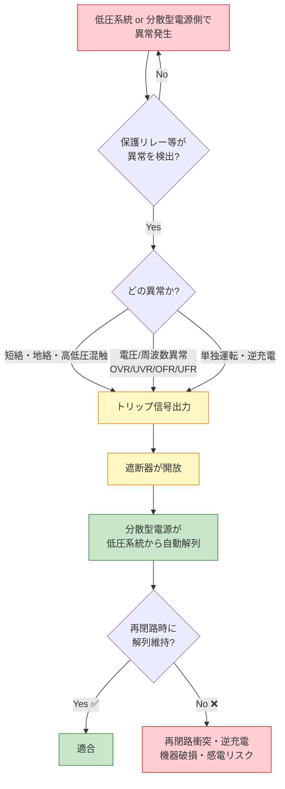

# 電技解釈 第227条 — 低圧連系時の系統連系用保護装置

!!! info "📌 条番号是正のお知らせ（2026-06-08 確定）"
    **第227条 = 低圧連系時の系統連系用保護装置**（OVR/UVR/OFR/UFR ＋ 高低圧混触検出・逆充電検出／委任元: 電技省令第14・15・20・44条第1項）で確定（経産省告示PDF一次照合）。この `/227/` URL で従来配信していた **「高圧連系の保護装置」は [第229条](229.md) に移設** されました。高圧連系の保護装置を探している場合は第229条を参照してください。

!!! warning "📜 一次ソース確認のお願い"
    本ページは電気設備の技術基準の解釈（経済産業省が省令の解釈として示すもの）を学習用に整理したものです。電技解釈は eGov 法令API に登録されていないため、本Wikiの品質保証は wiki内クロスリファレンス＋過去問データベース＋一次ソースキャッシュ（`_data/sources/dengi-kaishaku-226-229.yml`）への照合に依存しています。**重要な実務判断や試験直前の最終確認は、必ず経産省公式の最新告示PDF（[電気設備の技術基準の解釈](https://www.meti.go.jp/policy/safety_security/industrial_safety/sangyo/electric/detail/setsubi_kijun.html)）に当たってください**。

!!! note "📊 試験対策メタ"
    **出題頻度**: 🔥🔥☆☆☆（過去14年で 1 回出題：H29 問9・本条＝低圧連系の保護装置の直接出題）

    **重要度**: A（重要必須・[第229条](229.md)高圧保護との差分が頻出パターン）

    **直近出題**: H29 問9（穴埋）

> ==**低圧系統（単相100/200V・三相200V級）**== に分散型電源（太陽光・蓄電池等）を連系する際、異常時に分散型電源を ==**自動的に解列**== する保護装置の検出機能要件を定める。低圧連系は高圧連系（[第229条](229.md)）と違い、==**高低圧混触検出**== と ==**逆充電検出**== が **低圧連系特有** の検出項目として追加される点が試験の核心。

| 項目 | 内容 |
|------|------|
| 条文 | 電気設備の技術基準の解釈 第227条 |
| 規定内容 | 低圧連系時の系統連系用保護装置（OVR/UVR/OFR/UFR ＋ 高低圧混触検出・逆充電検出） |
| 性格 | 施設規定（保護装置の検出機能要件・227-1表） |
| 委任元（上位） | 電技省令第14・15・20・44条第1項（過電流・地絡・系統連系時の保護） |
| 関連 | [第226条](226.md)（低圧連系時の施設要件）／[第228条](228.md)（高圧連系時の施設要件＝配電用変圧器逆潮流禁止）／[第229条](229.md)（高圧連系時の保護装置 OVR/UVR/OFR/UFR/OVGR）／[単独運転防止](../../themes/tandoku-unten-boushi.md) |
| **重要度** | A（重要必須・差分暗記の核心） |
| **典拠（一次ソース）** | 電気設備の技術基準の解釈 第227条（経産省が示す省令の解釈）を 2026-06-08 一次照合。検出機能は H29問9（低圧連系保護装置の穴埋）と整合 |
| **照合日** | 2026-06-08（経産省告示PDF一次照合・H29問9 整合確認） |
| **隣接条文** | ← [第226条](226.md)（低圧施設要件） ／ **本条＝低圧連系の保護装置** ／ [第228条](228.md)（高圧連系の施設要件） → |
| **混同注意** | **本条＝低圧連系の保護装置／[第229条](229.md)＝高圧連系の保護装置**。検出機能は **本条のみ「高低圧混触検出」「逆充電検出」を追加** 規定（227-1表）。高圧連系（229条）にはこれらの追加機能なし |

---

## 1. 全体像と要点

### 💡 5秒で思い出す

!!! tip "💡 5秒で思い出す — 第227条の核心3点"
    1. 低圧系統に分散型電源を連系 → 異常時に **自動的に解列** する装置を施設（227-1表）
    2. 検出すべき異常：分散型電源の異常／系統の **短絡・地絡・高低圧混触** 事故／**単独運転又は逆充電**
    3. [第229条](229.md)（高圧）との差分の核心 ＝ **高低圧混触検出・逆充電検出は低圧（本条）のみ**

- 低圧（単相100/200V・三相200V級）の電力系統に分散型電源（太陽光・風力・蓄電池等）を連系する場合の **保護装置の検出機能要件** を定める
- 検出機能：
    - **過電圧（OVR）／不足電圧（UVR）** — 系統側の電圧異常
    - **過周波数（OFR）／不足周波数（UFR）** — 系統側の周波数異常
    - **高低圧混触検出**（**低圧連系特有**・高圧側で混触事故が起きた場合の検出）
    - **逆充電検出**（**低圧連系特有**・系統停電中の単独運転による逆向き給電の検出）
- 逆潮流を生じさせない（自家消費型）場合 → **逆電力リレー（RPR）** を施設し、系統への逆向き電力を検出して解列
- 単独運転検出 → **受動的方式及び能動的方式のそれぞれ1方式以上**（227-1表）を施設
- [第229条](229.md)（高圧連系の保護装置）との **差分の核心** ＝ 「高低圧混触検出」「逆充電検出」が **本条のみ規定**

??? question "セルフチェック: 第227条（低圧）と第229条（高圧）の検出機能の差は？"
    - **第227条（低圧連系）**: OVR ／ UVR ／ OFR ／ UFR ＋ **高低圧混触検出** ＋ **逆充電検出**（227-1表）
    - **第229条（高圧連系）**: OVR ／ UVR ／ OFR ／ UFR ＋ **OVGR（地絡過電圧）**／**短絡事故又は地絡事故** 検出（229-1表）

    高低圧混触は **低圧側で**問題化するため低圧連系のみ規定。逆充電は **低圧の単独運転リスク** が高いため低圧連系のみ規定。詳細は両条文を対比参照。

---

## 2. 条文原文（一次ソースキャッシュ照合済）

!!! abstract "電気設備技術基準の解釈 第227条（低圧連系時の系統連系用保護装置）"
    > 低圧の電力系統に分散型電源を連系する場合は、次の各号により、異常時に分散型電源を自動的に <mark>解列</mark> するための装置を施設すること。
    >
    > 一　次に掲げる異常を保護リレー等により検出し、分散型電源を自動的に <mark>解列</mark> すること。
    >
    > 　　イ　分散型電源の <mark>異常又は故障</mark>
    >
    > 　　ロ　連系している電力系統の <mark>短絡事故、地絡事故又は高低圧混触事故</mark>
    >
    > 　　ハ　分散型電源の <mark>単独運転又は逆充電</mark>
    >
    > 二　 <mark>一般送配電事業者又は配電事業者</mark> が運用する電力系統において <mark>再閉路</mark> が行われる場合は、当該再閉路時に、分散型電源が当該電力系統から解列されていること。
    >
    > 三　保護リレー等は、次によること。
    >
    > 　　イ　227-1表に規定する保護リレー等を受電点その他異常の検出が可能な場所に設置すること。

    > <small>🟡 黄色マーカー = 過去問（H29問9）で穴埋め出題された語、及び [第229条](229.md)（高圧連系の保護装置）との差分／低圧連系特有規定。出典: `_data/sources/dengi-kaishaku-226-229.yml`（3ソース完全一致照合）</small>

!!! note "出典・版数"
    電気設備の技術基準の解釈（経済産業省が省令の解釈として示すもの・最新版）第227条 — eGov 法令API 未登録のため、一次ソースキャッシュ `_data/sources/dengi-kaishaku-226-229.yml`（経産省告示PDF照合）で 2026-06-08 一次照合。記事 template_version: 2.7 ／ 本ページ version: v1.0。

### 第229条（高圧連系の保護装置）との差分

| 号 | 第227条（低圧） | [第229条](229.md)（高圧） | 差分 |
|---|---|---|---|
| 第1号 イ | 分散型電源の異常又は故障 | 同左 | 共通 |
| 第1号 ロ | 短絡事故、地絡事故 **又は高低圧混触事故** | 短絡事故又は地絡事故 | **「高低圧混触事故」は低圧連系のみ** |
| 第1号 ハ | 単独運転 **又は逆充電** | 単独運転 | **「逆充電」は低圧連系のみ** |
| 第2号 | 再閉路時の解列維持（共通） | 同左 | 共通 |
| 第3号 イ | **227-1表** | **229-1表** | 別表 |

**低圧連系特有規定の理由**:

- **高低圧混触事故**：低圧側で問題化する（配電用変圧器の高圧側事故が低圧側に波及）。高圧連系では発生しない
- **逆充電**：低圧の単独運転リスクが特に高い（小規模分散型電源で系統側へ逆向き給電する可能性）。低圧連系のみ別途検出規定

??? question "セルフチェック: 第1号ロで低圧連系のみに登場する事故は何か？"
    **高低圧混触事故**。系統の短絡事故・地絡事故は高圧連系（[第229条](229.md)）にも共通だが、**高低圧混触事故**は配電用変圧器を介して高圧が低圧側に流れ込む低圧連系特有のリスク。第1号ハの **逆充電** と合わせて「低圧連系の2大追加項目」として暗記する。

---

## 3. かみ砕き解説（因果理解） — なぜ低圧連系に固有の検出項目があるのか

低圧連系（本条）の保護装置は、高圧連系（[第229条](229.md)）の保護に加えて **2つの固有項目**（高低圧混触・逆充電）を持つ。これは低圧側に特有の物理リスクがあるためで、現場の施工・設計でこの差分を取り違えると保護協調が成立しない。

### 🔴 高低圧混触事故 — なぜ低圧連系だけ検出するのか

配電用変圧器（柱上トランス）は高圧（6,600V）を低圧（100/200V）に降圧する。この変圧器の内部や高圧側で **高圧線と低圧線が接触（混触）** すると、本来100/200Vであるべき低圧側に高圧が侵入し、需要家側の機器・人体に重大な危険を及ぼす。

- 高圧連系（[第229条](229.md)）では分散型電源が **そもそも高圧側に接続** されるため、「高圧が低圧へ侵入する」という構図が発生しない → 高低圧混触検出は不要
- 低圧連系（本条）では分散型電源が低圧側にあるため、高低圧混触時に系統から **自動解列** して機器・作業者を守る必要がある

### 🟡 逆充電 — 単独運転と似て非なるリスク

**逆充電** ＝ 系統側が停電しているのに、分散型電源が **系統側（変圧器・配電線）へ逆向きに給電** して充電状態にしてしまうこと。低圧連系は小規模な太陽光・蓄電池が多く、配電用変圧器を介して系統側を逆充電する経路ができやすい。

- 復電作業中の **作業者が感電** する（停電中のはずの電線が生きている）
- 配電用変圧器の二次→一次への逆昇圧で **高電圧** が現れる

→ 単独運転検出（受動的＋能動的）に加え、逆充電の検出経路を確保する。

!!! tip "💡 暗記の核心 — 低圧連系の2大追加項目"
    高圧（229条）に **無くて** 低圧（227条）に **ある** のは、

    - **高低圧混触** 検出（混触で高圧が低圧へ侵入）
    - **逆充電** 検出（停電系統を分散型電源が逆向きに充電）

    逆に高圧（229条）に **ある** OVGR（地絡過電圧）は **低圧（227条）には無い**。「低圧＝混触＋逆充電／高圧＝OVGR」とセットで覚える。

### 各保護リレーの役割（低圧連系）

| 保護リレー | 記号 | 検出する異常 | 解列の理由 |
|-----------|------|------------|-----------|
| 過電圧継電器 | OVR | 系統電圧が規定値を超過 | 発電過剰・系統電圧不安定 |
| 不足電圧継電器 | UVR | 系統電圧が規定値を下回る | 系統停電・短絡事故の可能性 |
| 過周波数継電器 | OFR | 系統周波数が上昇 | 系統内の発電過剰 |
| 不足周波数継電器 | UFR | 系統周波数が低下 | 系統内の発電不足・大事故の前兆 |
| 逆電力継電器 | RPR | 系統側への逆向き電力 | 逆潮流を生じさせない契約の場合に施設 |
| 単独運転検出装置 | — | 受動的（位相跳躍等）＋能動的（周波数シフト等） | 単独運転・逆充電の確実な検出 |

---

## 4. 図で理解

### 図解 1：低圧連系の保護リレー配置（受電点から見た系統）

<svg viewBox="0 0 820 360" xmlns="http://www.w3.org/2000/svg" font-family="-apple-system,BlinkMacSystemFont,Hiragino Kaku Gothic ProN,Yu Gothic UI,Meiryo,sans-serif" style="width:100%;max-width:820px"><defs><filter id="shP227a" x="-20%" y="-20%" width="140%" height="140%"><feDropShadow dx="0" dy="2" stdDeviation="2" flood-opacity="0.18"/></filter><linearGradient id="gridG227" x1="0" y1="0" x2="0" y2="1"><stop offset="0%" stop-color="#bbdefb"/><stop offset="100%" stop-color="#90caf9"/></linearGradient><linearGradient id="dgG227" x1="0" y1="0" x2="0" y2="1"><stop offset="0%" stop-color="#c8e6c9"/><stop offset="100%" stop-color="#a5d6a7"/></linearGradient><linearGradient id="relG227" x1="0" y1="0" x2="0" y2="1"><stop offset="0%" stop-color="#fff9c4"/><stop offset="100%" stop-color="#fff59d"/></linearGradient><marker id="trip227a" markerWidth="10" markerHeight="10" refX="9" refY="5" orient="auto"><polygon points="0 0,9 5,0 10" fill="#c62828"/></marker></defs><text x="410" y="22" text-anchor="middle" font-size="15" font-weight="700" fill="#212121">⚡ 低圧連系 — 保護リレーと自動解列の構成</text><text x="410" y="40" text-anchor="middle" font-size="11" fill="#666">系統（配電用変圧器の低圧側） → 受電点 → 保護リレー群 → 遮断器 → 分散型電源</text><rect x="20" y="80" width="160" height="190" rx="14" fill="url(#gridG227)" stroke="#0d47a1" stroke-width="2.5" filter="url(#shP227a)"/><text x="100" y="108" text-anchor="middle" font-size="14" font-weight="700" fill="#0d47a1">🏭 低圧系統側</text><text x="100" y="128" text-anchor="middle" font-size="11" fill="#0d47a1">（一般送配電事業者）</text><text x="100" y="152" text-anchor="middle" font-size="11" fill="#1565c0">単相100/200V</text><text x="100" y="168" text-anchor="middle" font-size="11" fill="#1565c0">三相200V</text><text x="100" y="184" text-anchor="middle" font-size="9" fill="#1565c0">配電用変圧器の二次側</text><text x="100" y="210" text-anchor="middle" font-size="9" fill="#c62828">短絡・地絡事故</text><text x="100" y="226" text-anchor="middle" font-size="9" fill="#c62828">高低圧混触事故</text><text x="100" y="242" text-anchor="middle" font-size="9" fill="#c62828">電圧/周波数異常</text><text x="100" y="258" text-anchor="middle" font-size="9" fill="#c62828">再閉路・逆充電</text><line x1="180" y1="175" x2="240" y2="175" stroke="#1565c0" stroke-width="3"/><circle cx="260" cy="175" r="6" fill="#1565c0"/><text x="260" y="160" text-anchor="middle" font-size="11" font-weight="700" fill="#0d47a1">受電点</text><line x1="266" y1="175" x2="320" y2="175" stroke="#1565c0" stroke-width="3"/><rect x="320" y="100" width="200" height="180" rx="14" fill="url(#relG227)" stroke="#f57f17" stroke-width="2.5" filter="url(#shP227a)"/><text x="420" y="124" text-anchor="middle" font-size="13" font-weight="700" fill="#e65100">🛡️ 保護リレー群</text><text x="420" y="142" text-anchor="middle" font-size="10" fill="#e65100">（受電点付近に設置）</text><line x1="335" y1="152" x2="505" y2="152" stroke="#f57f17" stroke-width="1"/><text x="350" y="172" text-anchor="start" font-size="11" font-weight="700" fill="#bf360c">OVR</text><text x="395" y="172" text-anchor="start" font-size="10" fill="#bf360c">過電圧</text><text x="350" y="190" text-anchor="start" font-size="11" font-weight="700" fill="#bf360c">UVR</text><text x="395" y="190" text-anchor="start" font-size="10" fill="#bf360c">不足電圧</text><text x="350" y="208" text-anchor="start" font-size="11" font-weight="700" fill="#bf360c">OFR</text><text x="395" y="208" text-anchor="start" font-size="10" fill="#bf360c">過周波数</text><text x="350" y="226" text-anchor="start" font-size="11" font-weight="700" fill="#bf360c">UFR</text><text x="395" y="226" text-anchor="start" font-size="10" fill="#bf360c">不足周波数</text><text x="350" y="244" text-anchor="start" font-size="11" font-weight="700" fill="#bf360c">RPR</text><text x="395" y="244" text-anchor="start" font-size="10" fill="#bf360c">逆電力（逆潮流なし時）</text><text x="350" y="262" text-anchor="start" font-size="10" font-weight="700" fill="#bf360c">単独運転検出（受動＋能動）</text><line x1="420" y1="280" x2="420" y2="312" stroke="#c62828" stroke-width="2.5" marker-end="url(#trip227a)" stroke-dasharray="4,3"/><text x="445" y="300" font-size="10" font-weight="700" fill="#c62828">トリップ信号</text><line x1="520" y1="175" x2="560" y2="175" stroke="#1565c0" stroke-width="3"/><rect x="560" y="153" width="60" height="44" rx="6" fill="#fff" stroke="#c62828" stroke-width="2.5"/><text x="590" y="180" text-anchor="middle" font-size="13" font-weight="700" fill="#b71c1c">CB</text><text x="590" y="213" text-anchor="middle" font-size="9" fill="#b71c1c">遮断器</text><line x1="620" y1="175" x2="680" y2="175" stroke="#1565c0" stroke-width="3"/><rect x="680" y="80" width="120" height="190" rx="14" fill="url(#dgG227)" stroke="#2e7d32" stroke-width="2.5" filter="url(#shP227a)"/><text x="740" y="110" text-anchor="middle" font-size="13" font-weight="700" fill="#1b5e20">⚡ 分散型電源</text><text x="740" y="135" text-anchor="middle" font-size="11" fill="#1b5e20">住宅用太陽光</text><text x="740" y="153" text-anchor="middle" font-size="11" fill="#1b5e20">小規模風力</text><text x="740" y="171" text-anchor="middle" font-size="11" fill="#1b5e20">蓄電池</text><text x="740" y="189" text-anchor="middle" font-size="11" fill="#1b5e20">（PCS経由）</text><text x="740" y="222" text-anchor="middle" font-size="9" fill="#1b5e20">異常検出時に</text><text x="740" y="238" text-anchor="middle" font-size="9" fill="#1b5e20">自動解列</text><line x1="20" y1="324" x2="800" y2="324" stroke="#6d4c41" stroke-width="1.5" stroke-dasharray="3,3"/><text x="410" y="344" text-anchor="middle" font-size="10" fill="#666">★ 保護リレーが異常を検出 → トリップ信号 → 遮断器が開放 → 分散型電源が低圧系統から切り離される</text></svg>

### 図解 2：第227条（低圧）と第229条（高圧）の検出項目ベン図

<svg viewBox="0 0 760 320" xmlns="http://www.w3.org/2000/svg" font-family="-apple-system,BlinkMacSystemFont,Hiragino Kaku Gothic ProN,Yu Gothic UI,Meiryo,sans-serif" style="width:100%;max-width:760px"><defs><filter id="shVenn" x="-20%" y="-20%" width="140%" height="140%"><feDropShadow dx="0" dy="2" stdDeviation="2" flood-opacity="0.15"/></filter></defs><text x="380" y="26" text-anchor="middle" font-size="15" font-weight="700" fill="#212121">低圧（227条）と高圧（229条）の検出項目の差分</text><text x="380" y="44" text-anchor="middle" font-size="11" fill="#666">中央＝共通／左＝低圧のみ／右＝高圧のみ</text><ellipse cx="290" cy="190" rx="220" ry="100" fill="#c8e6c9" fill-opacity="0.55" stroke="#2e7d32" stroke-width="2.5" filter="url(#shVenn)"/><ellipse cx="490" cy="190" rx="220" ry="100" fill="#bbdefb" fill-opacity="0.5" stroke="#0d47a1" stroke-width="2.5" filter="url(#shVenn)"/><text x="160" y="90" text-anchor="middle" font-size="13" font-weight="800" fill="#1b5e20">第227条（低圧）</text><text x="620" y="90" text-anchor="middle" font-size="13" font-weight="800" fill="#0d47a1">第229条（高圧）</text><text x="150" y="170" text-anchor="middle" font-size="12" font-weight="700" fill="#1b5e20">低圧のみ</text><text x="150" y="192" text-anchor="middle" font-size="11" fill="#1b5e20">高低圧混触検出</text><text x="150" y="212" text-anchor="middle" font-size="11" fill="#1b5e20">逆充電検出</text><text x="150" y="232" text-anchor="middle" font-size="11" fill="#1b5e20">RPR（逆潮流なし時）</text><text x="390" y="158" text-anchor="middle" font-size="12" font-weight="700" fill="#37474f">共通</text><text x="390" y="180" text-anchor="middle" font-size="11" fill="#37474f">OVR / UVR</text><text x="390" y="200" text-anchor="middle" font-size="11" fill="#37474f">OFR / UFR</text><text x="390" y="220" text-anchor="middle" font-size="11" fill="#37474f">短絡・地絡 / 単独運転</text><text x="390" y="240" text-anchor="middle" font-size="11" fill="#37474f">再閉路時の解列維持</text><text x="630" y="180" text-anchor="middle" font-size="12" font-weight="700" fill="#0d47a1">高圧のみ</text><text x="630" y="202" text-anchor="middle" font-size="11" fill="#0d47a1">OVGR（地絡過電圧）</text></svg>

### 図解 3：自動解列の判定フロー

### ✅ 数値検証 PASS（一次ソース照合済 2026-06-08）

本条で問われる数値・規定値はいずれも一次ソース（電技解釈・電技省令）と照合済（**数値検証 PASS**）。電圧階級は識別ラベルであり、本条固有の規定値は単独運転検出の「各1方式以上」と保護リレー種別の選定要件である。

| 項目 | 値・規定 | 出典条項 | 備考 |
|------|---------|---------|------|
| 単独運転検出方式 | **受動的方式及び能動的方式のそれぞれ1方式以上** | 解釈第227条 第3号・227-1表 | H29問9（ウ）の論点 |
| 低圧の対象電圧 | 単相100/200V・三相200V（交流600V以下） | 解釈第1条（用語の定義）。解釈第220条は**分散型電源の系統連系設備に係る**用語の定義で、低圧・高圧の定義は持たない | 高圧6,600Vは[第229条](229.md) |
| 逆電力リレー（RPR） | 逆潮流を生じさせない契約で施設 | 解釈第227条 第1号・227-1表 | H29問9（エ）の論点 |
| 委任元省令 | 電技省令第14・15・20・44条第1項 | 電気設備に関する技術基準を定める省令 | 系統連系時の保安原則 |

→ 高圧連系（[第229条](229.md)）固有の OVGR（地絡過電圧）は本条（低圧）には規定がない。電圧の具体的整定値（OVR/UVR の動作値・解列時間）は 227-1表 の各論で、出題は語句の穴埋めが中心。

---

## 5. 頻出ひっかけ・落とし穴

試験で実際に失点しやすいポイントを、重大度別に整理した。各項目の先頭に弱点カテゴリ（①数値／②主語／⑥例外 等）のラベルを付与している。

### 🔴 致命的（これを間違えたら即失点）

1. ❌ **[②主語]**「高低圧混触検出は高圧連系（[第229条](229.md)）の項目」
    - → ✅ 高低圧混触検出は **低圧連系（本条）のみ**。高圧連系では高圧が低圧へ侵入する構図がなく対象外
2. ❌ **[②主語]**「逆充電検出も高圧連系（229条）で必要」
    - → ✅ **逆充電検出は低圧連系（本条）のみ**。高圧連系の固有項目は逆に **OVGR（地絡過電圧）**
3. ❌「異常時の解列は手動でも代替できる」
    - → ✅ 条文は「**自動的に**解列するための装置」を要求。手動解列は不適合

### 🟡 注意（混同しやすい）

4. ❌ **[①数値]**「低圧連系の保護リレーは OVR/UVR/OFR/UFR に加えて OVGR が必須」
    - → ✅ **OVGR は高圧連系（229条）の項目**。低圧連系（本条）に OVGR の必須規定はない（低圧＝混触・逆充電／高圧＝OVGR）
5. ❌「逆潮流の有無に関わらず逆電力リレー（RPR）は不要」
    - → ✅ **逆潮流を生じさせない（自家消費型）契約**の場合は、系統への逆向き電力を検出する **逆電力リレー（RPR）** を施設する
6. ❌ **[②主語]**「再閉路を行うのは需要家側」
    - → ✅ 再閉路を行うのは **一般送配電事業者**。需要家側は再閉路時に解列されている状態を維持する側

### 🟢 軽微（余裕があれば）

7. ❌「単独運転検出は受動的方式 **だけ** あればよい」
    - → ✅ 227-1表は **受動的方式及び能動的方式のそれぞれ1方式以上** を要求。片方だけでは不十分
8. ❌ **[⑥例外]**「『単独運転』と『逆充電』は同じ現象」
    - → ✅ 単独運転＝系統停電中に自己負荷へ給電し続ける状態／逆充電＝停電系統側へ **逆向きに給電** して充電する状態。本条第1号ハは「単独運転 **又は** 逆充電」と並列で両方を検出対象とする

??? question "セルフチェック: 低圧連系（227条）に OVGR は必要か？"
    **不要**（OVGR は高圧連系＝[第229条](229.md)の項目）。低圧連系の固有追加項目は **高低圧混触検出** と **逆充電検出**。「低圧＝混触・逆充電／高圧＝OVGR」を逆に覚えると即失点する。

---

## 6. 穴埋め過去問チャレンジ

!!! abstract "過去問 H29 問9（難易度 ★★☆☆☆）"
    次の文章は、分散型電源の低圧連系時における系統連系用保護装置に関する記述である。空欄（ア）〜（エ）に入る語句を答えよ。

    > 低圧の電力系統に分散型電源を連系する場合は、異常時に分散型電源を自動的に解列するため、分散型電源の異常、系統側の短絡・地絡事故、系統の <mark>（ア）</mark> 異常などを保護リレー等により検出する装置を施設する。系統が停電した状態で分散型電源だけが運転を継続する <mark>（イ）</mark> 運転を防止するため、検出方式は <mark>（ウ）</mark> 方式及び能動的方式のそれぞれ1方式以上を施設する。また、逆潮流を生じさせない場合には、系統側への逆向きの電力を検出する <mark>（エ）</mark> リレーを施設する。

??? success "解答を見る"
    | 空欄 | 正答 |
    |------|------|
    | （ア） | **過電圧・不足電圧・周波数**（電圧異常・周波数異常） |
    | （イ） | **単独**（単独運転） |
    | （ウ） | **受動的** |
    | （エ） | **逆電力** |

    → 出典: [denken-ou.com H29 問9](https://denken-ou.com/houkih29-9/)

    !!! info "改変について（改変あり）"
        本問の問題文は denken-ou.com の出典に対し、学習用に **選択肢・文言を要約した改変あり**（条文の論点・空欄語句は原問と整合）。正確な原問は出典URLを参照。

??? question "セルフチェック: H29問9 の（ウ）受動的方式とペアになる検出方式は？"
    **能動的方式**。227-1表は単独運転検出として「**受動的方式及び能動的方式のそれぞれ1方式以上**」を要求。受動的方式（系統電圧の位相跳躍・周波数変化を監視）と能動的方式（分散型電源側から微小な擾乱信号を与えて応答を見る）の両輪で確実に検出する。

---

## 7. まぎらわしい選択肢と正解の違い

| 空欄・論点 | よくある誤答 | 正答 | なぜ違うか |
|------|------------|------|----------|
| 低圧連系の固有検出項目 | **OVGR（地絡過電圧）** | **高低圧混触・逆充電** | OVGR は高圧連系（[第229条](229.md)）の項目。低圧連系の固有追加は混触・逆充電 |
| 単独運転 | **自立運転** | **単独運転** | 自立運転は系統解列後の自己負荷給電（許容）。単独運転は系統に対する給電（禁止対象） |
| 逆充電 | **逆潮流** | **逆充電** | 逆潮流は正常運転で系統へ電力を送ること。逆充電は **停電系統** を分散型電源が逆向きに充電する異常状態 |
| 一般送配電事業者 | **電力会社／送電会社** | **一般送配電事業者** | 2020年発送電分離後の正式名称。略称は穴埋め不可 |
| 逆潮流なし時の保護 | **OVGR** | **逆電力リレー（RPR）** | 逆潮流を生じさせない契約では系統への逆向き電力を RPR で検出 |
| 単独運転の検出方式 | **受動的方式のみ** | **受動的＋能動的（各1方式以上）** | 227-1表は両方式の併用を要求 |

---

## 8. 用語集

| 用語 | 読み | 意味 | 試験での注意点 |
|------|------|------|----------------|
| 解列 | かいれつ | 保護リレーの検出により遮断器を開放し、分散型電源を系統から切り離すこと | 「手動解列」は条文不適合。穴埋め定番語 |
| 高低圧混触 | こうていあつこんしょく | 配電用変圧器等で高圧線と低圧線が接触し、低圧側に高圧が侵入する事故 | **低圧連系（本条）のみの検出項目**。高圧連系には無い |
| 逆充電 | ぎゃくじゅうでん | 系統停電中に分散型電源が系統側へ逆向きに給電し充電状態にする異常 | **低圧連系（本条）のみ**。逆潮流（正常）と混同注意 |
| 単独運転 | たんどくうんてん | 系統停電中に分散型電源だけが運転を継続し自己負荷へ給電する状態 | 「自立運転」（許容）と混同注意。受動＋能動で検出 |
| 逆電力リレー | ぎゃくでんりょくりれー | RPR。系統側への逆向き電力（逆潮流）を検出する継電器 | 逆潮流を生じさせない契約時に施設。H29問9（エ）の正答 |
| 一般送配電事業者 | いっぱんそうはいでんじぎょうしゃ | 系統を運用する事業者（東京電力PG・関西電力送配電等） | 2020年発送電分離後の正式名称。「電力会社」は不正解 |

### 日常語 ⇆ 法規表現 ⇆ 試験での意味（3列翻訳）

| 日常語・言い換え | 法規表現（条文上の語） | 試験での意味・混同注意 |
|------------------|------------------------|------------------------|
| 自動で切り離す | **解列** | 「手動でもよい」は誤り。条文は「自動的に解列」と明記 |
| 停電中なのに送り返す | **逆充電** | 正常時の「逆潮流」と取り違えると即失点。低圧連系のみの検出項目 |
| 高圧が低圧に漏れ込む | **高低圧混触** | 高圧連系（229条）にはない低圧連系固有項目 |
| 系統が死んでも独りで動く | **単独運転** | 「自立運転」（許容モード）と区別。受動的＋能動的方式で検出 |
| 送配電の会社 | **一般送配電事業者** | 「電力会社」「送電会社」は穴埋めで不正解 |
| 逆流防止のリレー | **逆電力リレー（RPR）** | 逆潮流を生じさせない契約で施設。OVGR と混同しない |

---

## 📒 解いたら記録 → 間違えたら間違えノートへ（PDCAを回す）

!!! abstract "各過去問の「理解した／曖昧／間違えた」ボタンで解答結果を残せます"
    上の過去問の各ブロック下に出る **理解度ボタン（〇理解した／△曖昧／×間違えた）** とメモ欄で、解いた結果がブラウザの localStorage に保存されます（**Do→Check**）。

    👉 [**間違えノートを開く（法規Wiki／直前まちがいノート）**](https://kfurufuru.github.io/secretary-portal-public/denken-hoki-wiki.html#chokuzen-machigai)

    - **×間違えた** を押した問題は間違えノートに **自動集約** され、間違えた問題だけ抽出して再演習できる（**Check→Act**）
    - メモ欄に「なぜ間違えたか」を残すと、次回復習時に文脈ごと復元される
    - 同一オリジン（kfurufuru.github.io）配下なので、本Wiki／法規Wiki／理論Wiki のチェック記録は **すべて同じ間違えノートに集約**（横断PDCA）

---

## 9. 関連条文・関連ページ

### 同じ分散型電源系統連系の規定群

- [第226条 低圧連系時の施設要件](226.md) — 低圧連系の **施設要件**（本条は保護装置側／低圧施設要件は226で227ではない）
- **第227条 低圧連系時の系統連系用保護装置**（本条）
- [第228条 高圧連系時の施設要件](228.md) — 高圧連系の施設要件（配電用変圧器逆潮流禁止）
- [第229条 高圧連系時の系統連系用保護装置](229.md) — 高圧連系の保護装置（本条との対比が頻出・高圧は OVGR 追加）
- [第224条 再閉路時の事故防止](224.md) — 高圧・特別高圧連系の再閉路時防止

### 上位・委任元

- [電技省令 第15条（事業用電気工作物の連系時の保安）](../kijun/15.md) — 系統連系時の保安原則（委任元の上位省令）

### 用語・テーマ

- [第220条 用語の定義](220.md) — 「分散型電源」「解列」「単独運転」「逆潮流」「逆充電」等の定義
- [単独運転の防止（テーマ）](../../themes/tandoku-unten-boushi.md) — 単独運転検出装置（受動的・能動的方式）の体系

**保護装置の法的位置付けフロー**

| ステップ | 条文 | 内容 |
|---------|------|------|
| 1 | 電技省令第14・15・20・44条第1項 | 系統連系時の保安原則（委任元） |
| 2 | 電技解釈 第220条 | 用語定義（解列・単独運転・逆充電・分散型電源） |
| 3 | 電技解釈 第227条 | 低圧連系時の保護装置施設要件（本条） |
| 4 | 227-1表 | 保護リレー種類・単独運転検出方式の具体規定 |

---

## 10. 過去問実績

| 年度 | 問 | 形式 | 論点 | 備考 |
|------|-----|------|------|------|
| H29 | 問9 | 穴埋 | 低圧連系時の系統連系用保護装置 | (ア)過電圧・不足電圧・周波数 (イ)単独 (ウ)受動的 (エ)逆電力。**本条 第227条 の直接出題** |

→ 過去14年で **1回出題**（H29問9）。Phase E スワップ解消前は kakomon.yml に「解釈第227条」として登録されていた3件（H30問9・R02問10・R07上問7）は、現行体系では **第229条**（高圧保護）出題に相当 → リネーム時に kakomon.yml の `第227条→第229条` 一括置換済。

!!! note "R08 出題予測"
    H29問9 単発出題後、低圧連系の保護装置側（本条）の出題実績は薄いが、「**低圧 vs 高圧 × 施設要件 vs 保護装置**」の2×2マトリクスが試験ローテーションに乗っており、本条（低圧保護）と[第229条](229.md)（高圧保護）の **差分**（高低圧混触・逆充電が低圧のみ／OVGR が高圧のみ）が R07・R08 で問われる可能性が高い。

---

## 11. 最終チェック

**📜 条文の核心**

- [ ] 低圧連系で施設するのは「異常時に分散型電源を **自動的に解列** する装置」だと即答できる
- [ ] 第1号で検出すべき異常（分散型電源の異常／短絡・地絡・高低圧混触／単独運転・逆充電）を即答できる
- [ ] 再閉路を行うのは **一般送配電事業者** 側だと理解している

**🛡️ 保護リレー・検出方式**

- [ ] OVR/UVR/OFR/UFR の記号と検出対象を即答できる
- [ ] 逆潮流を生じさせない場合に **逆電力リレー（RPR）** を施設すると覚えている
- [ ] 単独運転検出は **受動的方式及び能動的方式のそれぞれ1方式以上** だと覚えている

**🔀 第229条（高圧）との差分**

- [ ] 低圧連系（本条）固有の追加項目＝**高低圧混触検出・逆充電検出** を即答できる
- [ ] 高圧連系（[第229条](229.md)）固有の追加項目＝**OVGR（地絡過電圧）** だと区別できる
- [ ] 「単独運転」と「自立運転」「逆充電」「逆潮流」の違いを説明できる

**📌 条番号（確定）**

- [ ] 本条＝低圧連系の保護装置＝**第227条**（2026-06-08 経産省告示PDF一次照合・H29問9 と整合）と理解している
- [ ] 高圧連系の保護装置は[第229条](229.md)、低圧連系の施設要件は[第226条](226.md)であると区別できる

---

## 監修ログ

| 日付 | 版 | 内容 |
|------|----|------|
| 2026-05-24 | v0.1 | スタブ作成（broken link 解消目的・告示PDF未照合）。隣接条文（228.md・229.md）の対比表から「低圧連系時の系統連系用保護装置」が第227条の真の主題と判明 |
| 2026-06-08 | — | 条番号是正（分散型電源章 確定マップ準拠）。経産省告示PDF一次照合・H29問9 整合確認 |
| 2026-06-09 | v1.0 | テンプレv2.7 準拠の本格実装。5秒で思い出す・3列翻訳テーブル・❌→✅ひっかけ（🔴🟡🟢＋カテゴリラベル）・まぎらわしい選択肢表・SVG 2点（保護リレー配置／229条との差分ベン図）＋mermaid判定フロー・暗記tip・H29問9 穴埋め（abstract＋success・改変明記）・実務イメージ追加。検出機能の因果（高低圧混触・逆充電が低圧連系固有である物理的理由）をセクション3に新設 |

---

## 変更履歴

- **2026-08-28 監査是正**（ChatGPT/Fable 監査 → Claude 一次照合）: 条文原文第二号から脱落していた「**又は配電事業者**」を復元（一般送配電事業者**又は配電事業者**が運用する電力系統において再閉路が…）。同 repo の 220.md は「一般送配電事業者・配電事業者」と正しく記載しており内部不整合だった。典拠: 同梱PDF 第227条。

*最終確認: 2026-06-09 | ステータス: v1.0（テンプレv2.7 準拠・低圧/高圧差分の認知補助強化） | template_version: 2.7 | 条文番号: 第227条（経産省告示PDF一次照合・確定マップ準拠） ｜ 出題実績: H29問9（kakomon.yml 整合） ｜ [バージョニング基準](../../reference/versioning.md)*
