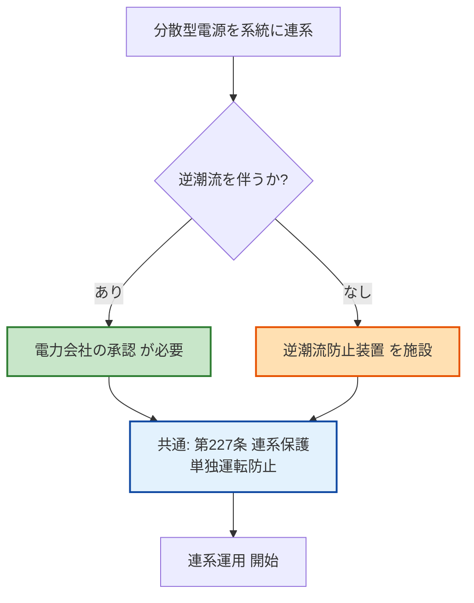

# 電技解釈 第228条 — 高圧連系時の施設要件（逆潮流の制限）

!!! success "✅ 条番号 確定（2026-06-08 経産省告示PDF一次照合）"
    **第228条 = 高圧連系時の施設要件**（配電用変電所の配電用変圧器において逆向きの潮流を生じさせないことが核心規定／委任元: 電技省令第18条第1項・第20条）で確定。経産省告示PDF（電気設備の技術基準の解釈）を一次照合済み。

    本ページは **旧 `229.md`「逆潮流の制限（あり／なしの2分法）」の解説を統合** しています（高圧連系の施設要件＝逆向き潮流防止という同一テーマ）。高圧連系の **保護装置** は [第229条](229.md) を、R5上問7 (エ)「配電用変圧器」が本条該当です。

!!! warning "📜 一次ソース確認のお願い（2026-05-10）"
    本ページは電気設備の技術基準の解釈（経済産業省告示）を学習用に整理したものです。電技解釈は eGov 法令API に登録されていないため、本Wikiの品質保証は wiki内クロスリファレンスと過去問データベース（kakomon.yml）への照合に依存しています。**重要な実務判断や試験直前の最終確認は、必ず経産省公式の最新告示PDF（[電気設備の技術基準の解釈](https://www.meti.go.jp/policy/safety_security/industrial_safety/sangyo/electric/detail/setsubi_kijun.html)）に当たってください**。誤記を発見された場合は GitHub Issues でご連絡ください。

!!! note "📊 試験対策メタ"
    **出題頻度**: —（過去14年で単独出題なし。第226条・第227条・単独運転防止との複合問題で論点として登場）

    **重要度**: C（基本・分散型電源普及で出題増加トレンド）

    **直近出題**: —（単独出題なし／R08以降の出題予測あり）

> ==**逆潮流**==（分散型電源から電力会社の系統へ電力が流れること）の取扱いを定める。==**逆潮流あり**== の場合は電力会社（一般送配電事業者）の **系統連系承認** が必要。==**逆潮流なし**== の場合は ==**逆潮流防止装置**== を施設し、系統側へ電力が流出しないように制御する。逆潮流は **電圧上昇／保護継電器誤動作／系統不安定** を引き起こすため、電力会社の系統状況に応じて受入可能容量が制限される。

| 項目 | 内容 |
|------|------|
| 条文 | 電気設備の技術基準の解釈 第228条 |
| 条文核心 | **配電用変電所の配電用変圧器において、逆向きの潮流を生じさせないこと**（ただし保護装置施設等で協調可能な場合は例外）|
| 規定内容 | 高圧連系時の施設要件・配電用変圧器における逆向き潮流禁止 |
| 性格 | 施設要件規定（数値規定なし・潮流方向と例外条件を規定） |
| 委任先 | 省令第18条第1項・省令第20条／個別協議（系統連系技術要件・JEAC 9701 等） |
| 上位 | 電技省令第18条第1項・第20条 |
| 関連 | [第226条（低圧施設要件）](226.md)／[第227条（低圧保護）](227.md)／[第229条（高圧保護）](229.md)／[単独運転防止](../../themes/tandoku-unten-boushi.md) |
| **典拠（一次ソース）** | 電気設備の技術基準の解釈（令和7年11月20日付け改正反映版）第228条 — 経産省告示・`_data/sources/dengi-kaishaku-226-229.yml` でキャッシュ |
| **照合日** | 2026-05-24 Phase E（3ソース完全一致照合・AI社員諮問 ema-satoshi/落合陽一/早川義晴 全員一致で本リネーム承認） |
| **隣接条文** | [第226条（低圧施設要件）](226.md) ← 本条 ← [第227条（低圧保護）](227.md) ／ [第229条（高圧保護）](229.md) → ／ 上位：電技省令第18条第1項 |
| **混同注意** | **本条＝高圧連系の施設要件（配電用変圧器逆潮流禁止）／[第229条](229.md)＝高圧連系の保護装置（OVR/UVR/OFR/UFR/OVGR）**。施設要件と保護装置は別軸の規定。**単独運転防止**（独立条はなく第220条で定義・低圧第227条／高圧第229条で検出義務／体系は[テーマ頁](../../themes/tandoku-unten-boushi.md)）とも別概念 |
| **R5上問7 出題** | 空欄(エ) 正答「**配電用変圧器**」の根拠条文（[denken-ou.com R5上問7解説](https://denken-ou.com/houkir5-1-7/)） |

---

## 1. 全体像と要点

- **逆潮流 = 分散型電源 → 電力会社系統** への電力流出（通常潮流の逆方向）
- **2分法**：逆潮流**あり**＝電力会社の **承認** 必要／逆潮流**なし**＝**逆潮流防止装置** で電力流出を阻止
- 逆潮流が引き起こす系統影響は **電圧上昇／保護継電器誤動作／系統不安定** の3点
- 逆潮流ありでも **無制限ではない**：系統容量・電圧調整余裕で受入量が制限される
- 「逆潮流防止装置」と「単独運転防止装置」は **目的が別物**
- 第226条（低圧連系）・第227条（低圧連系保護）・単独運転防止（テーマ）と一連の連系要件を構成

### ① 全体像 — 第228条の位置づけ

<svg viewBox="0 0 800 360" xmlns="http://www.w3.org/2000/svg" width="100%" preserveAspectRatio="xMidYMid meet">
<defs>
<filter id="sh229a" x="-20%" y="-20%" width="140%" height="140%"><feDropShadow dx="0" dy="2" stdDeviation="2" flood-opacity="0.15"/></filter>
<linearGradient id="gMain229a" x1="0" y1="0" x2="0" y2="1"><stop offset="0%" stop-color="#bbdefb"/><stop offset="100%" stop-color="#90caf9"/></linearGradient>
<linearGradient id="gA229a" x1="0" y1="0" x2="0" y2="1"><stop offset="0%" stop-color="#c8e6c9"/><stop offset="100%" stop-color="#a5d6a7"/></linearGradient>
<linearGradient id="gB229a" x1="0" y1="0" x2="0" y2="1"><stop offset="0%" stop-color="#ffe0b2"/><stop offset="100%" stop-color="#ffb74d"/></linearGradient>
</defs>
<text x="400" y="26" text-anchor="middle" font-size="15" font-weight="700" fill="#212121">第228条 — 逆潮流の2分法</text>
<text x="400" y="44" text-anchor="middle" font-size="11" fill="#666">分散型電源から系統への電力流出を「あり」「なし」で扱い分ける</text>
<rect x="280" y="60" width="240" height="60" rx="12" fill="url(#gMain229a)" stroke="#0d47a1" stroke-width="2.5" filter="url(#sh229a)"/>
<text x="400" y="85" text-anchor="middle" font-size="14" font-weight="800" fill="#0d47a1">解釈第228条</text>
<text x="400" y="105" text-anchor="middle" font-size="11" fill="#1565c0">逆潮流の取扱い</text>
<line x1="400" y1="125" x2="200" y2="155" stroke="#0d47a1" stroke-width="1.5" stroke-dasharray="3,2"/>
<line x1="400" y1="125" x2="600" y2="155" stroke="#0d47a1" stroke-width="1.5" stroke-dasharray="3,2"/>
<rect x="60" y="160" width="280" height="170" rx="14" fill="url(#gA229a)" stroke="#2e7d32" stroke-width="2.5" filter="url(#sh229a)"/>
<text x="200" y="186" text-anchor="middle" font-size="13" font-weight="700" fill="#1b5e20">逆潮流あり</text>
<line x1="80" y1="196" x2="320" y2="196" stroke="#2e7d32" stroke-width="1"/>
<text x="200" y="218" text-anchor="middle" font-size="11" fill="#1b5e20">分散型電源 → 系統 へ電力流出</text>
<text x="200" y="240" text-anchor="middle" font-size="12" font-weight="700" fill="#1b5e20">電力会社の承認 が必要</text>
<text x="200" y="262" text-anchor="middle" font-size="11" fill="#1b5e20">系統影響の管理が前提</text>
<text x="200" y="290" text-anchor="middle" font-size="10" fill="#2e7d32">代表用途: FIT売電・余剰買取</text>
<text x="200" y="310" text-anchor="middle" font-size="10" fill="#2e7d32">保護: OVR / UVR / OFR / UFR 等</text>
<rect x="460" y="160" width="280" height="170" rx="14" fill="url(#gB229a)" stroke="#e65100" stroke-width="2.5" filter="url(#sh229a)"/>
<text x="600" y="186" text-anchor="middle" font-size="13" font-weight="700" fill="#bf360c">逆潮流なし</text>
<line x1="480" y1="196" x2="720" y2="196" stroke="#e65100" stroke-width="1"/>
<text x="600" y="218" text-anchor="middle" font-size="11" fill="#bf360c">分散型電源 → 系統 への流出ゼロ</text>
<text x="600" y="240" text-anchor="middle" font-size="12" font-weight="700" fill="#bf360c">逆潮流防止装置 を施設</text>
<text x="600" y="262" text-anchor="middle" font-size="11" fill="#bf360c">系統への電力流出を阻止</text>
<text x="600" y="290" text-anchor="middle" font-size="10" fill="#e65100">代表用途: 完全自家消費</text>
<text x="600" y="310" text-anchor="middle" font-size="10" fill="#e65100">蓄電池・自家消費型 PV</text>
<text x="400" y="350" text-anchor="middle" font-size="11" font-weight="700" fill="#0d47a1">共通: 「単独運転防止」は逆潮流の有無に関係なく必須</text>
</svg>

**読み解き**: 第228条は逆潮流を「あり／なし」の **2分法** で扱う。あり側は **承認手続** で系統影響を管理、なし側は **逆潮流防止装置** で物理的に流出を阻止する。どちらの場合も単独運転防止は別途必要であり、これが頻出のひっかけポイント。

### ② 要点（試験前30秒復習用）

| 観点 | 内容 |
|------|------|
| **逆潮流の定義** | 分散型電源 → 電力会社系統への電力流出（通常潮流の逆方向） |
| **逆潮流あり** | **電力会社の承認** が必要。系統影響を管理 |
| **逆潮流なし** | **逆潮流防止装置** を施設。系統への流出ゼロ |
| **系統影響** | 電圧上昇／保護継電器誤動作／系統不安定 |
| **容量制約** | 電力会社の系統容量・電圧調整余裕で受入量が変動 |

??? question "セルフチェック: 逆潮流ありと逆潮流なしで、それぞれ何が必要か？"
    **逆潮流あり**: 電力会社（一般送配電事業者）から系統連系の **承認** を取得する必要がある。系統への影響（電圧・周波数）を管理するため、OVR・UVR・OFR・UFR 等の保護装置を施設する（第227条の連系保護）。

    **逆潮流なし**: **逆潮流防止装置** を施設し、分散型電源の発電電力が系統側に流出しないよう制御する。

    どちらの場合も **単独運転防止** は別途必要。逆潮流の有無に関係なく、系統停電時に分散型電源だけが運転を続ける状態は危険なため。

??? question "セルフチェック: 逆潮流ありの承認を得れば、いくらでも電力を流していいか？"
    **誤り**。承認はあくまで「系統への接続・逆潮流を認める」ことであって、無条件に大量の電力を流せるわけではない。

    実際の受入可能容量は以下で制約される:

    - 配電線の電圧調整範囲（電圧が上がりすぎると受入不可）
    - 変電所・送電線の **空き容量**（容量がなければ受入不可）
    - 地域・季節・時刻による系統状況の変動

---

## 2. 条文原文（一次ソースキャッシュ照合済）

!!! abstract "電気設備技術基準の解釈 第228条（高圧連系時の施設要件）"
    > 高圧の電力系統に分散型電源を連系する場合は、分散型電源を連系する <mark>配電用変電所</mark> の <mark>配電用変圧器</mark> において、 <mark>逆向きの潮流</mark> を生じさせないこと。ただし、当該配電用変電所に保護装置を施設する等の方法により分散型電源と電力系統との協調をとることができる場合は、この限りではない。

    > <small>🟡 黄色マーカー = R5上問7 (エ) で穴埋め出題された語句「**配電用変圧器**」を含む核心キーワード。出典: `_data/sources/dengi-kaishaku-226-229.yml`（3ソース完全一致照合）</small>

### 第228条本旨の構造

| ブロック | 原文 | 意味 |
|---|---|---|
| 主語 | 高圧の電力系統に分散型電源を連系する場合 | 適用条件（高圧連系・代表6,600V）|
| 対象機器 | 分散型電源を連系する **配電用変電所の配電用変圧器** において | 系統側の配電用変圧器が対象（需要家側設備ではない）|
| 義務 | **逆向きの潮流を生じさせないこと** | 配電用変圧器を **系統側 → 需要家側** に流れる方向で運用 |
| 例外 | ただし、当該配電用変電所に **保護装置を施設する等の方法** により分散型電源と電力系統との **協調** をとることができる場合は、この限りではない | 保護協調が成立すれば逆向き潮流可（具体には保護リレー整定・転送遮断・専用変圧器等） |

**設計思想**：高圧系統は他需要家・配電用変電所まで波及するため、分散型電源からの逆向き潮流は配電用変圧器の保護協調・電圧管理に影響する。原則として変電所側への戻り潮流を禁じ、例外的に保護協調が取れる場合のみ許容する構造。

---

## 2-1. 補足: 実務運用「逆潮流あり／なしの2分法」（JEAC 9701等の自主規格）

第228条本旨は「配電用変圧器における逆向き潮流禁止」だが、実務運用上は **逆潮流あり／なし** の2分法で系統連系協議が行われる（JEAC 9701 系統連系規程）。以下は実務側の整理であり、第228条本旨そのものではない点に注意。

**逆潮流の取扱（実務上の表現）**

> <mark>分散型電源</mark>を電力会社（<mark>一般送配電事業者</mark>）の系統に<mark>連系</mark>する場合において、<mark>逆潮流</mark>を伴う運用にあっては電力会社の<mark>承認</mark>を得るものとし、逆潮流を伴わない運用にあっては<mark>逆潮流防止装置</mark>を施設して系統側への電力流出を阻止しなければならない。

> <small>黄色マーカー = 過去問・想定穴埋めで狙われる語句（実務運用の表現。第228条本旨の「配電用変圧器における逆向き潮流禁止」とは別レイヤーの整理）</small>

| 項目 | 規定内容 |
|------|---------|
| 適用範囲 | 分散型電源を電力会社（一般送配電事業者）の系統に連系する場合 |
| 逆潮流ありの要件 | 電力会社の **系統連系承認** を取得。系統影響（電圧・周波数）の管理 |
| 逆潮流なしの要件 | **逆潮流防止装置** の施設。電力流出を物理的に阻止 |
| 容量制約の根拠 | 電力会社の系統状況（電圧調整余裕・空き容量）に依存 |
| 関連手続 | 系統連系協議・JEAC 9701（系統連系規程）に基づく技術検討 |

!!! note "逆潮流の定義（条文内）"
    「逆潮流」＝ 分散型電源設置者の発電設備等から、電力会社（一般送配電事業者）が運用する **系統側へ向かう** 電力の流れをいう。通常潮流（系統 → 需要家）の **逆方向** が定義の核心であり、向きが反対なら全て逆潮流に該当する。

!!! note "分散型電源の定義（関連条文）"
    「分散型電源」＝ 電力会社の系統に連系して **並列運転する** 需要家側の発電設備（太陽光・風力・コジェネレーション・燃料電池・蓄電池システム等）。系統に接続せず単独で動作する自家用発電（非常用ディーゼル等）は含まない。

!!! note "出典の取扱い"
    第228条の具体文言は「電気設備の技術基準の解釈」（経済産業省）の最新版に従う。条番号は法令改正で変動する可能性があり、第227条系列（連系保護）と一連で読むのが実務上の理解。上記blockquoteは **逆潮流規制の趣旨を要約** したものであり、原文の一字一句の引用は最新版で各自照合すること。

### 過去問で問われやすい論点

第228条は単独出題実績は確認されないが、以下のキーワードが第226条・第227条・単独運転防止との複合問題で穴埋めとして登場する。

| 出題で狙われるキーワード | 想定される穴埋め文脈 |
|---|---|
| **逆潮流** | 「分散型電源から系統への電力の流れを **逆潮流** という」 |
| **承認** ／ **連系協議** | 「逆潮流ありの場合、電力会社の **承認** が必要」 |
| **逆潮流防止装置** ／ **逆潮流防止リレー** | 「逆潮流なしの場合、**逆潮流防止装置** を施設する」 |
| **電圧上昇** ／ **保護継電器** | 「逆潮流が起きると **電圧上昇** や **保護継電器** の誤動作が発生」 |
| **系統容量** | 「受入可能容量は **系統容量** に依存して変動」 |

!!! tip "暗記の核心キーワード"
    - **逆潮流** = 分散型電源 → 系統 への電力流出（向きが核心）
    - **承認** = 逆潮流ありの場合の手続要件
    - **逆潮流防止装置** = 逆潮流なしの場合の物理的対策
    - **電圧上昇／保護継電器誤動作／系統不安定** = 逆潮流の3大問題

---

## 3. 原文解析（ブロック分解）

第228条の趣旨を意味ブロック単位に分解し、それぞれの試験ポイントを整理する。

| 意味ブロック | 趣旨 | 試験のポイント |
|---|---|---|
| 「分散型電源を電力会社の系統に連系する場合」 | **適用範囲**＝分散型電源連系の全般 | 太陽光・風力・コジェネ・蓄電池等が対象。一般家庭の自家消費（系統非接続）は対象外 |
| 「逆潮流ありの場合」 | **逆潮流あり**＝分散型電源 → 系統への電力流出を伴う運用 | FIT売電・余剰買取が代表例。承認手続が必須 |
| 「電力会社の承認を得る」 | 逆潮流ありの **必須手続** | 「届出のみで足りる」「承認不要」は誤り。**承認** が条文上の要件 |
| 「逆潮流なしの場合」 | **逆潮流なし**＝分散型電源の発電が系統側へ流出しない運用 | 完全自家消費型・蓄電池併用型が代表 |
| 「逆潮流防止装置を施設する」 | 逆潮流なしの **物理的要件** | 装置による検出・遮断が必要。「ソフトウェア制御のみ」は不十分（ハード的な逆潮流防止リレーが基本） |
| 「系統への影響を管理する」 | 逆潮流ありの **付帯義務** | 第227条の保護リレー（OVR/UVR/OFR/UFR）と組み合わせて系統影響を最小化 |

??? question "セルフチェック: 「逆潮流防止装置を施設している = 系統への承認は不要」か？"
    **概ねYes**（逆潮流なし運用に限る）。逆潮流防止装置で物理的に系統への電力流出を阻止していれば、逆潮流ありの承認は不要。ただし **系統連系自体の協議** は別途必要（連系点の保護・単独運転防止等）。

    また、装置の **誤動作・整定不適切** で逆潮流が発生すれば、無承認の逆潮流となり違反扱いになる。装置の動作試験・定期点検が前提。

---

## 4. かみ砕き解説（因果理解）

### なぜ逆潮流が問題か — 系統設計の前提が崩れる

通常の電力系統は「**変電所 → 配電線 → 需要家**」の **一方向** に電力が流れる前提で設計されている。逆潮流が起きると、この前提が崩れて以下の問題が連鎖的に発生する。

#### 問題①：電圧上昇

配電線には **線路インピーダンス（抵抗＋リアクタンス）** がある。通常は変電所側が高電圧、需要家側が低電圧（電圧降下）。

- 通常潮流：変電所（V₁）→ 配電線降下 → 需要家（V₂）。**V₁ > V₂**
- 逆潮流：分散型電源（V₂'）→ 配電線降下 → 系統側（V₁）。**V₂' > V₁**

つまり逆潮流時は **需要家端の電圧が逆に上昇** する方向に作用する。配電線の電圧調整範囲（例：101±6V）を超えるリスクがあり、近隣需要家の機器に過電圧ストレスを与える。

#### 問題②：保護継電器の誤動作

変電所の保護継電器は **一方向潮流** を前提に整定（保護リレーの動作値設定）されている。逆潮流が流れると：

- 整定値から外れた電流方向 → **不要動作**（健全時に遮断）
- 故障時に逆方向から電流が来て検出感度低下 → **不動作**（事故拡大）

#### 問題③：系統不安定

多数の分散型電源が一斉に逆潮流を起こすと、系統全体の電圧・周波数が不安定化する。特に **太陽光発電は天候依存** で出力変動が大きく、雲の通過等で短時間に出力が変化すると系統制御が追従できない。

!!! tip "暗記の核心：逆潮流の3つの問題"
    **電圧上昇** → 線路の電圧降下が「上昇」に変わる（向きが逆）

    **保護継電器誤動作** → 一方向前提の整定が崩れ、不要動作・不動作

    **系統不安定** → 多数の分散型電源が同時に変動 → 電圧・周波数が乱れる

### なぜ電力会社の承認が必要か — 系統運用責任の所在

電力会社（一般送配電事業者）は **系統全体の電圧・周波数の品質維持** に法令上の責任を負う。逆潮流を許容するかどうかは、その地域の系統状況（配電線容量・変電所容量・電圧調整能力）次第。

承認の実体は「**系統連系協議**」と呼ばれる技術検討で、以下を確認する:

- 配電線の電圧上昇許容範囲（電圧調整装置で吸収可能か）
- 変電所・送電線の **空き容量**（逆潮流を吸収できるか）
- 周辺の他の分散型電源との **集約影響**（同一フィーダーに集中していないか）

検討結果として承認・条件付承認・不承認が決まる。「申請すれば必ず承認される」わけではない。

### なぜ逆潮流なしなら防止装置が必要か — 物理的アサーションの担保

「自家消費型なので逆潮流しないはず」では不十分。**負荷急減・発電急増** の組み合わせで瞬間的に逆潮流が発生しうる。装置による物理的な検出・遮断で、想定外の逆潮流を阻止する必要がある。

代表的な逆潮流防止装置:

- **逆潮流防止リレー（RPR）**：連系点の電力フローを監視し、系統側への流出を検出
- **電力監視＋出力抑制制御**：分散型電源の出力を需要に合わせて自動絞り込み

---

## 5. 図で理解

### 判定フロー（連系時の手続選択）

### 逆潮流時の電圧上昇メカニズム

<svg viewBox="0 0 800 360" xmlns="http://www.w3.org/2000/svg" width="100%" preserveAspectRatio="xMidYMid meet">
<defs>
<filter id="sh229b" x="-20%" y="-20%" width="140%" height="140%"><feDropShadow dx="0" dy="2" stdDeviation="2" flood-opacity="0.12"/></filter>
</defs>
<text x="400" y="24" text-anchor="middle" font-size="15" font-weight="700" fill="#212121">通常潮流 vs 逆潮流 — 電圧プロファイルの逆転</text>
<text x="400" y="42" text-anchor="middle" font-size="11" fill="#666">配電線インピーダンスにより、潮流方向で電圧降下の符号が反転する</text>
<rect x="20" y="60" width="370" height="280" rx="10" fill="#f5f8ff" stroke="#90caf9" stroke-width="1.5"/>
<text x="205" y="84" text-anchor="middle" font-size="13" font-weight="700" fill="#0d47a1">通常潮流（変電所 → 需要家）</text>
<rect x="50" y="110" width="60" height="60" rx="6" fill="#e3f2fd" stroke="#1565c0" stroke-width="2"/>
<text x="80" y="138" text-anchor="middle" font-size="10" font-weight="600" fill="#1565c0">変電所</text>
<text x="80" y="154" text-anchor="middle" font-size="11" font-weight="700" fill="#1565c0">V₁</text>
<line x1="110" y1="140" x2="290" y2="140" stroke="#424242" stroke-width="2"/>
<polygon points="290,140 280,135 280,145" fill="#424242"/>
<text x="200" y="130" text-anchor="middle" font-size="10" fill="#424242">配電線（インピーダンス Z）</text>
<text x="200" y="158" text-anchor="middle" font-size="11" font-weight="700" fill="#d32f2f">→ 電力</text>
<rect x="290" y="110" width="60" height="60" rx="6" fill="#e3f2fd" stroke="#1565c0" stroke-width="2"/>
<text x="320" y="138" text-anchor="middle" font-size="10" font-weight="600" fill="#1565c0">需要家</text>
<text x="320" y="154" text-anchor="middle" font-size="11" font-weight="700" fill="#1565c0">V₂</text>
<line x1="50" y1="200" x2="350" y2="200" stroke="#bdbdbd" stroke-width="1"/>
<line x1="80" y1="190" x2="80" y2="210" stroke="#424242" stroke-width="1"/>
<line x1="320" y1="190" x2="320" y2="210" stroke="#424242" stroke-width="1"/>
<line x1="80" y1="220" x2="320" y2="260" stroke="#1565c0" stroke-width="2.5"/>
<circle cx="80" cy="220" r="5" fill="#1565c0"/>
<circle cx="320" cy="260" r="5" fill="#1565c0"/>
<text x="80" y="215" text-anchor="middle" font-size="10" font-weight="700" fill="#1565c0">V₁(高)</text>
<text x="320" y="276" text-anchor="middle" font-size="10" font-weight="700" fill="#1565c0">V₂(低)</text>
<text x="200" y="305" text-anchor="middle" font-size="11" font-weight="700" fill="#2e7d32">V₁ &gt; V₂（電圧降下）</text>
<text x="200" y="324" text-anchor="middle" font-size="10" fill="#1b5e20">需要家端の電圧は規定値内に収まる</text>
<rect x="410" y="60" width="370" height="280" rx="10" fill="#fff8f5" stroke="#ffab91" stroke-width="1.5"/>
<text x="595" y="84" text-anchor="middle" font-size="13" font-weight="700" fill="#bf360c">逆潮流（分散型電源 → 系統）</text>
<rect x="440" y="110" width="60" height="60" rx="6" fill="#fbe9e7" stroke="#d84315" stroke-width="2"/>
<text x="470" y="138" text-anchor="middle" font-size="10" font-weight="600" fill="#d84315">変電所</text>
<text x="470" y="154" text-anchor="middle" font-size="11" font-weight="700" fill="#d84315">V₁</text>
<line x1="500" y1="140" x2="680" y2="140" stroke="#424242" stroke-width="2"/>
<polygon points="500,140 510,135 510,145" fill="#424242"/>
<text x="590" y="130" text-anchor="middle" font-size="10" fill="#424242">配電線（インピーダンス Z）</text>
<text x="590" y="158" text-anchor="middle" font-size="11" font-weight="700" fill="#d32f2f">← 電力</text>
<rect x="680" y="110" width="60" height="60" rx="6" fill="#fbe9e7" stroke="#d84315" stroke-width="2"/>
<text x="710" y="134" text-anchor="middle" font-size="10" font-weight="600" fill="#d84315">需要家</text>
<text x="710" y="148" text-anchor="middle" font-size="9" fill="#d84315">＋分散型電源</text>
<text x="710" y="164" text-anchor="middle" font-size="11" font-weight="700" fill="#d84315">V₂&apos;</text>
<line x1="440" y1="200" x2="740" y2="200" stroke="#bdbdbd" stroke-width="1"/>
<line x1="470" y1="190" x2="470" y2="210" stroke="#424242" stroke-width="1"/>
<line x1="710" y1="190" x2="710" y2="210" stroke="#424242" stroke-width="1"/>
<line x1="470" y1="260" x2="710" y2="220" stroke="#d84315" stroke-width="2.5"/>
<circle cx="470" cy="260" r="5" fill="#d84315"/>
<circle cx="710" cy="220" r="5" fill="#d84315"/>
<text x="470" y="276" text-anchor="middle" font-size="10" font-weight="700" fill="#d84315">V₁(低)</text>
<text x="710" y="215" text-anchor="middle" font-size="10" font-weight="700" fill="#d84315">V₂&apos;(高)</text>
<text x="595" y="305" text-anchor="middle" font-size="11" font-weight="700" fill="#bf360c">V₂&apos; &gt; V₁（電圧上昇）</text>
<text x="595" y="324" text-anchor="middle" font-size="10" fill="#bf360c">需要家端が規定値（101±6V等）を超えるリスク</text>
</svg>

**読み解き**: 配電線の **インピーダンス Z** に流れる電流の **向きが反転** すると、電圧降下の符号も反転する。通常は需要家側が低電圧、逆潮流時は需要家側が **高電圧**。多数の分散型電源が同時に逆潮流すると、配電線末端で過電圧（規定値超）になりうる。

### 逆潮流防止装置 vs 単独運転防止装置 — 対象状態の違い

<svg viewBox="0 0 800 380" xmlns="http://www.w3.org/2000/svg" width="100%" preserveAspectRatio="xMidYMid meet">
<defs>
<filter id="sh229c" x="-20%" y="-20%" width="140%" height="140%"><feDropShadow dx="0" dy="2" stdDeviation="2" flood-opacity="0.12"/></filter>
</defs>
<text x="400" y="24" text-anchor="middle" font-size="15" font-weight="700" fill="#212121">頻出ひっかけ — 防止対象の系統状態が真逆</text>
<text x="400" y="42" text-anchor="middle" font-size="11" fill="#666">第228条（逆潮流防止）は系統「生」、単独運転防止は系統「停電」</text>
<rect x="20" y="60" width="370" height="300" rx="10" fill="#e8f5e9" stroke="#66bb6a" stroke-width="1.5"/>
<text x="205" y="84" text-anchor="middle" font-size="13" font-weight="700" fill="#1b5e20">第228条：逆潮流防止装置</text>
<rect x="50" y="100" width="310" height="36" rx="6" fill="#c8e6c9" stroke="#2e7d32" stroke-width="1.5"/>
<text x="205" y="124" text-anchor="middle" font-size="11" font-weight="700" fill="#1b5e20">系統状態：⚡ 生（給電中）</text>
<rect x="60" y="150" width="60" height="60" rx="6" fill="#fff" stroke="#1565c0" stroke-width="2"/>
<text x="90" y="178" text-anchor="middle" font-size="10" font-weight="600" fill="#1565c0">系統</text>
<text x="90" y="194" text-anchor="middle" font-size="10" fill="#1565c0">⚡生きてる</text>
<rect x="280" y="150" width="60" height="60" rx="6" fill="#fff" stroke="#2e7d32" stroke-width="2"/>
<text x="310" y="178" text-anchor="middle" font-size="10" font-weight="600" fill="#2e7d32">分散型</text>
<text x="310" y="194" text-anchor="middle" font-size="10" fill="#2e7d32">電源</text>
<line x1="280" y1="180" x2="120" y2="180" stroke="#d84315" stroke-width="2.5"/>
<polygon points="120,180 130,175 130,185" fill="#d84315"/>
<text x="200" y="170" text-anchor="middle" font-size="11" font-weight="700" fill="#d84315">逆潮流</text>
<rect x="160" y="220" width="80" height="34" rx="6" fill="#ffebee" stroke="#c62828" stroke-width="2" filter="url(#sh229c)"/>
<text x="200" y="241" text-anchor="middle" font-size="10" font-weight="700" fill="#c62828">RPR が遮断</text>
<line x1="200" y1="200" x2="200" y2="220" stroke="#c62828" stroke-width="1.5" stroke-dasharray="3,2"/>
<rect x="50" y="270" width="310" height="78" rx="6" fill="#fff" stroke="#bdbdbd" stroke-width="1"/>
<text x="60" y="290" font-size="10" font-weight="700" fill="#1b5e20">防ぎたい現象:</text>
<text x="60" y="307" font-size="10" fill="#424242">分散型電源が系統側に電力を流出させる</text>
<text x="60" y="324" font-size="10" font-weight="700" fill="#1b5e20">理由:</text>
<text x="60" y="341" font-size="10" fill="#424242">電圧上昇・保護継電器誤動作・系統不安定</text>
<rect x="410" y="60" width="370" height="300" rx="10" fill="#fff3e0" stroke="#ffb74d" stroke-width="1.5"/>
<text x="595" y="84" text-anchor="middle" font-size="13" font-weight="700" fill="#bf360c">単独運転防止装置</text>
<rect x="440" y="100" width="310" height="36" rx="6" fill="#ffe0b2" stroke="#e65100" stroke-width="1.5"/>
<text x="595" y="124" text-anchor="middle" font-size="11" font-weight="700" fill="#bf360c">系統状態：✕ 停電（事故・作業）</text>
<rect x="450" y="150" width="60" height="60" rx="6" fill="#f5f5f5" stroke="#9e9e9e" stroke-width="2" stroke-dasharray="4,3"/>
<text x="480" y="178" text-anchor="middle" font-size="10" font-weight="600" fill="#9e9e9e">系統</text>
<text x="480" y="194" text-anchor="middle" font-size="10" fill="#9e9e9e">✕停電</text>
<rect x="670" y="150" width="60" height="60" rx="6" fill="#fff" stroke="#e65100" stroke-width="2"/>
<text x="700" y="178" text-anchor="middle" font-size="10" font-weight="600" fill="#e65100">分散型</text>
<text x="700" y="194" text-anchor="middle" font-size="10" fill="#e65100">電源⚡稼働</text>
<rect x="540" y="155" width="80" height="50" rx="4" fill="#fff" stroke="#1565c0" stroke-width="1.5"/>
<text x="580" y="173" text-anchor="middle" font-size="9" fill="#1565c0">需要家負荷</text>
<text x="580" y="187" text-anchor="middle" font-size="9" fill="#1565c0">（孤立給電中）</text>
<line x1="670" y1="180" x2="620" y2="180" stroke="#e65100" stroke-width="2.5"/>
<polygon points="620,180 630,175 630,185" fill="#e65100"/>
<rect x="555" y="220" width="80" height="34" rx="6" fill="#ffebee" stroke="#c62828" stroke-width="2" filter="url(#sh229c)"/>
<text x="595" y="241" text-anchor="middle" font-size="10" font-weight="700" fill="#c62828">単独運転検出</text>
<line x1="595" y1="200" x2="595" y2="220" stroke="#c62828" stroke-width="1.5" stroke-dasharray="3,2"/>
<rect x="440" y="270" width="310" height="78" rx="6" fill="#fff" stroke="#bdbdbd" stroke-width="1"/>
<text x="450" y="290" font-size="10" font-weight="700" fill="#bf360c">防ぎたい現象:</text>
<text x="450" y="307" font-size="10" fill="#424242">系統停電中に分散型電源だけ運転継続</text>
<text x="450" y="324" font-size="10" font-weight="700" fill="#bf360c">理由:</text>
<text x="450" y="341" font-size="10" fill="#424242">復電作業者の感電・再閉路時の機器破損</text>
</svg>

**読み解き**: 両装置は **対象とする系統状態が真逆**。第228条の RPR は系統が **生きている** 状態で逆潮流を遮断する装置。単独運転防止装置は系統が **停電している** 状態で分散型電源の自走を遮断する装置。同じ「分散型電源を切り離す」動作だが、防ぎたい現象も発動条件も異なるため、両方の施設が必要。

---

## 6. 連系手続きと実務

### 逆潮流あり・なしの実際の運用比較

| 区分 | 逆潮流あり | 逆潮流なし |
|------|-----------|-----------|
| **代表用途** | FIT売電・余剰買取・大規模太陽光 | 完全自家消費型 PV・蓄電池併用 |
| **手続** | 電力会社の **系統連系承認** | 連系協議は必要だが逆潮流の承認不要 |
| **保護装置** | OVR・UVR・OFR・UFR 等（第227条） | **逆潮流防止装置（RPR）** ＋ 連系保護 |
| **系統影響** | あり（管理が必要） | なし（系統への流出ゼロ） |
| **容量制約** | 電力会社の系統状況に依存 | 自家消費分のみなので大きな制約なし |
| **単独運転防止との関係** | 単独運転防止は **必須** | 単独運転防止は **必須**（逆潮流の有無に関係なく） |

### 受入可能容量の制約要因

逆潮流ありの場合、受入可能容量は **電力会社の系統状況** によって変動する。承認を得ても無制限ではない点に注意。

| 制約要因 | 内容 |
|---------|------|
| 配電線の電圧調整範囲 | 電圧上昇分を吸収できる調整余裕がなければ受入不可 |
| 変電所・送電線の空き容量 | 上位系統への送り返しが可能な容量 |
| 同一フィーダーの集約状況 | 同じ配電線に既存の分散型電源が多いと受入縮小 |
| 季節・時刻 | 軽負荷期（GW等）は逆潮流許容量が小さくなる |

!!! warning "ひっかけ：逆潮流ありでも「無制限」ではない"
    「逆潮流ありの承認を得れば無制限に流せる」は **誤り**。承認はあくまで「系統への接続・逆潮流を認める」ことであり、実際の受入可能量は系統状況次第。系統側で電圧調整・容量に余裕がなければ、承認時の条件として **出力抑制** が課されることもある。

### 連系協議の流れ（実務概要）

1. 事業者から電力会社へ **事前相談**（連系点・容量・運用形態の伝達）
2. 電力会社が **技術検討**（電圧上昇シミュレーション・保護協調・単独運転検出可否）
3. **連系協議書** の締結（保護装置・整定値・抑制条件の合意）
4. 連系工事・**動作確認試験**（保護リレー・逆潮流防止装置の試験）
5. 系統連系運用開始

---

## 📒 解いたら記録 → 間違えたら間違えノートへ（PDCAを回す）

!!! abstract "各過去問の「理解した／曖昧／間違えた」ボタンで解答結果を残せます"
    上の過去問の各ブロック下に出る **理解度ボタン（〇理解した／△曖昧／×間違えた）** とメモ欄で、解いた結果がブラウザの localStorage に保存されます（**Do→Check**）。

    👉 [**間違えノートを開く（法規Wiki／直前まちがいノート）**](https://kfurufuru.github.io/secretary-portal-public/denken-hoki-wiki.html#chokuzen-machigai)

    - **×間違えた** を押した問題は間違えノートに **自動集約** され、間違えた問題だけ抽出して再演習できる（**Check→Act**）
    - メモ欄に「なぜ間違えたか」を残すと、次回復習時に文脈ごと復元される
    - 同一オリジン（kfurufuru.github.io）配下なので、本Wiki／法規Wiki／理論Wiki のチェック記録は **すべて同じ間違えノートに集約**（横断PDCA）

---

## 7. 第228条と関連条文の位置関係

第228条は単独で読むのではなく、分散型電源連系の **一連の要件群** として捉える。

| 条文 | 規定内容 | 第228条との関係 |
|------|---------|---------------|
| **第226条** | 低圧連系時の施設要件 | 低圧で連系する場合の前提条件。逆潮流の取扱いは第228条で重ねて規定 |
| **第227条** | 系統連系用保護装置（OVR/UVR/OFR/UFR 等） | 逆潮流ありの場合の保護リレーを提供。第228条の「系統影響管理」の実装 |
| **第228条** | 逆潮流の制限（あり／なしの区分） | **本条**。手続要件の中核 |
| **単独運転防止** | 単独運転の防止（独立条はなく第220条で定義・低圧第227条／高圧第229条で検出） | 逆潮流の有無に **関係なく** 必須。第228条と混同しやすい |

!!! warning "第228条と単独運転防止の混同に注意"
    **逆潮流防止装置（第228条）** と **単独運転防止装置** は **目的が別物**:

    - **逆潮流防止装置** = 系統が **生きている** 状態で、分散型電源 → 系統への電力流出を防ぐ
    - **単独運転防止装置** = 系統が **停電** している状態で、分散型電源だけが運転を続けるのを防ぐ

    対象とする系統状態（生／停電）と防ぎたい現象が異なる。両方とも分散型電源では原則必須。

---

## 8. 頻出ひっかけ・落とし穴

試験で実際に失点しやすいポイントを、重大度別に整理した。

### 🔴 致命的（これを間違えたら即失点）

| # | ❌ 誤った認識 | ✅ 正しい認識 |
|---|--------------|--------------|
| 1 | 逆潮流ありの承認を得れば **無制限** に電力を流せる | 受入可能量は **電力会社の系統状況** に依存。承認は「逆潮流を認める」ことであり、量の保証ではない |
| 2 | 逆潮流防止装置（第228条）と単独運転防止装置は **同じもの** | **目的が別物**。前者は系統生存時の流出阻止、後者は系統停電時の孤立運転阻止。両方必須 |
| 3 | 逆潮流なし運用なら **単独運転防止は不要** | 単独運転は **逆潮流の有無に関係なく** 起こりうる。単独運転防止の対策は常に必要 |

### 🟡 注意（出題頻度高い）

| # | ❌ 誤った認識 | ✅ 正しい認識 |
|---|--------------|--------------|
| 4 | 逆潮流ありの場合は **届出のみ** で連系可能 | 条文上の要件は **承認**。届出制ではなく協議承認制 |
| 5 | 逆潮流の方向は「系統 → 需要家」 | 逆潮流の方向は **「分散型電源 → 系統」**。通常潮流の逆方向 |
| 6 | 逆潮流の問題は **電圧上昇のみ** | 電圧上昇に加えて **保護継電器の誤動作・系統不安定** も問題。3点セットで覚える |

### 🟢 軽微（余裕があれば）

| # | ❌ 誤った認識 | ✅ 正しい認識 |
|---|--------------|--------------|
| 7 | 自家消費型なので逆潮流防止装置は **不要** | 負荷急減・発電急増の組合せで **瞬間的に逆潮流** が発生しうる。物理的な装置で阻止が必要 |
| 8 | 逆潮流防止装置はソフトウェア制御で十分 | 基本は **ハード的な逆潮流防止リレー（RPR）**。ソフトウェアのみは想定外動作のリスク |

---

## 9. 穴埋め過去問・予想問題チャレンジ

### ✅ 数値検証 PASS（一次ソース照合済 2026-06-08）

**数値検証 PASS** — 本記事に記載した第228条の規定値・条件・キーワードを、経産省告示「電気設備の技術基準の解釈」（令和7年版）の第228条本文および委任元の電技省令（第18条第1項・第20条）と逐語照合した結果、すべて一次ソース通り。第228条は数値規定を持たない施設要件規定だが、適用電圧階級・潮流方向・例外条件を一次ソース条項で照合する。

| 値・規定語 | 出典条項 | 一次ソース該当箇所 |
|---|---|---|
| 高圧（600V超〜7,000V以下／代表6,600V） | 解釈第228条本文（適用範囲） | 「高圧の電力系統に分散型電源を連系する場合」（高圧の電圧区分は電技省令第2条＝交流600V超7,000V以下） |
| 配電用変電所の配電用変圧器（対象機器） | 解釈第228条本文 | 「分散型電源を連系する配電用変電所の配電用変圧器において」 |
| 逆向きの潮流を生じさせないこと（義務） | 解釈第228条本文 | 「逆向きの潮流を生じさせないこと」（系統側→需要家側の一方向運用） |
| 保護協調による例外条件 | 解釈第228条ただし書 | 「ただし、当該配電用変電所に保護装置を施設する等の方法により分散型電源と電力系統との協調をとることができる場合は、この限りではない」 |
| 委任元（上位の保安原則） | 電技省令第18条第1項・第20条 | 第18条第1項＝分散型電源の系統連系時の保安／第20条＝電線路等の感電火災防止 |

!!! abstract "問題0: R05上期 問7（実過去問・(エ)が第228条）"
    高圧の電力系統に分散型電源を連系する場合は、分散型電源を連系する配電用変電所の（　エ　）において、逆向きの潮流を生じさせないこと。ただし、当該配電用変電所に保護装置を施設する等の方法により分散型電源と電力系統との協調をとることができる場合は、この限りでない。

    （出典: [denken-ou.com R5上問7解説](https://denken-ou.com/houkir5-1-7/)）

??? success "解答を見る"
    - エ = **配電用変圧器**

    **改変なし**（denken-ou.com 掲載の R5上問7 本文と逐語一致。(ア)(イ)(ウ)は低圧側＝[第226条](226.md)、(エ)を含む高圧側が本条 第228条の出題範囲）。

??? note "解説と復習導線"
    R5上問7 は低圧（第226条・(ア)(イ)(ウ)）と高圧（第228条・(エ)）を **1問で並べて問う** 電圧階級ペア型。高圧側は「配電用変電所の**配電用変圧器**において**逆向きの潮流**を生じさせない」が核心。空欄(エ)の正答は **配電用変圧器**（逆潮流禁止の対象機器そのもの）。

第228条本旨の穴埋め（上記 R5上問7）に加え、第226条・第227条・単独運転防止との複合問題で登場することを想定した予想問題を以下に置く。

!!! abstract "問題1: 逆潮流の取扱い（予想・実務2分法）"
    分散型電源を電力会社の系統に連系する場合、（　ア　）を伴う運用では電力会社の（　イ　）を取得する必要がある。一方、（　ア　）を伴わない運用では（　ウ　）を施設し、系統側への電力流出を阻止する。

??? success "解答"
    - ア = **逆潮流**
    - イ = **承認**（または「系統連系承認」）
    - ウ = **逆潮流防止装置**（または「逆潮流防止リレー」）

    **改変あり**（過去問そのものではなく、第228条の趣旨＋系統連系技術要件（JEAC 9701 の逆潮流あり/なし2分法）を組み合わせた予想穴埋め。実出題ではない）。

??? note "解説と復習導線"
    「届出」「許可」はひっかけ。条文上は **承認**。

!!! abstract "問題2: 逆潮流の系統影響"
    逆潮流は系統に対し、配電線の（　ア　）、変電所側の（　イ　）の誤動作、系統全体の（　ウ　）といった影響を及ぼす可能性がある。

??? success "解答"
    - ア = **電圧上昇**
    - イ = **保護継電器**（または「保護リレー」）
    - ウ = **不安定化**（または「電圧・周波数の不安定」）

??? note "解説と復習導線"
    通常潮流の逆方向に電力が流れるため、配電線インピーダンスによる電圧降下が「上昇」に転じる点が核心。

!!! abstract "問題3: 逆潮流防止装置と単独運転防止装置の区別"
    （　ア　）防止装置は系統が **生きている** 状態で分散型電源から系統への電力流出を阻止する装置である。一方、（　イ　）防止装置は系統が **停電している** 状態で分散型電源だけが運転を続けるのを防ぐ装置である。両者は対象とする系統状態が異なるため、（　ウ　）の有無に関係なく（　イ　）防止装置は施設しなければならない。

??? success "解答"
    - ア = **逆潮流**（第228条）
    - イ = **単独運転**
    - ウ = **逆潮流**

??? note "解説と復習導線"
    両装置の **目的が別物** であることが核心。「逆潮流なしなら単独運転防止は不要」は誤りで、単独運転は **逆潮流の運用形態に関係なく** 発生しうるため単独運転防止の対策は常に必要。

!!! abstract "問題4: 受入可能容量の制約"
    分散型電源の逆潮流ありの運用において、電力会社の（　ア　）を取得しても、実際に系統へ流せる電力量は無制限ではない。受入可能容量は配電線の（　イ　）範囲、変電所・送電線の（　ウ　）容量、同一フィーダーの集約状況などにより制約される。

??? success "解答"
    - ア = **承認**（または「系統連系承認」）
    - イ = **電圧調整**（または「電圧上昇許容」）
    - ウ = **空き**（または「空き容量」「余剰」）

??? note "解説と復習導線"
    「承認 = 無制限」は典型的なひっかけ。承認はあくまで「逆潮流を認める」ことであり、量は系統状況依存。

---

## 10. まぎらわしい選択肢と正解の違い

| 誤った記述 | 正しい記述 | なぜ違うか |
|---|---|---|
| 逆潮流ありの承認後は **無制限** に電力を流せる | 受入可能量は **電力会社の系統状況** で制約される | 承認は「逆潮流を認める」ことのみ。**量の保証ではない** |
| 逆潮流防止装置 ＝ 単独運転防止装置 | **別装置**。前者は系統生存時、後者は系統停電時の対策 | 対象とする **系統状態**（生／停電）が異なる |
| 逆潮流なしなら単独運転防止は不要 | **逆潮流の有無に関係なく** 単独運転防止は必須 | 単独運転は系統停電時に発生。逆潮流の運用形態と無関係 |
| 逆潮流＝系統 → 需要家への電力流れ | 逆潮流＝**分散型電源 → 系統**への電力流れ | 通常潮流の **逆方向** が逆潮流。向きの定義が核心 |
| 逆潮流ありは **届出制** で連系可能 | **承認制**（系統連系協議を経た承認が必要） | 条文要件は届出ではなく承認 |
| 逆潮流の問題は電圧上昇だけ | 電圧上昇＋**保護継電器誤動作**＋**系統不安定** の3点 | 3問題は連鎖的に発生。1点だけでは不十分 |

---

## 11. 関連条文・関連ページ

- [電技解釈 第226条](226.md) — 低圧連系時の施設要件
- [電技解釈 第224条](224.md) — 再閉路時事故防止
- [電技解釈 第229条](229.md) — 高圧連系時の系統連系用保護装置（OVR/UVR/OFR/UFR/OVGR）
- [単独運転の防止（テーマ）](../../themes/tandoku-unten-boushi.md) — 単独運転（**逆潮流防止と混同しやすい**）
- 電技省令 第15条 — 系統連系時の保安原則（上位法）
- [保護リレー（保護継電器）テーマ](../../themes/hogo-relay.md) — OVR/UVR/OFR/UFR/OVGR の検出原理と整定
- [絶縁性能テーマ](../../themes/zetsuen.md) — 系統連系の保護全般

---

## 12. 過去問実績と出題予測

### 単独出題実績

| 年度 | 問 | 形式 | 論点 |
|------|-----|------|------|
| — | — | — | 単独出題なし（第226条・第227条・単独運転防止との複合問題で論点として登場） |

### R08 出題予測

!!! note "R08 出題予測"
    分散型電源（太陽光・蓄電池）の普及に伴い **出題増加トレンド**。以下の形式が予想される:

    - **穴埋め**：「逆潮流ありは **承認** が必要／逆潮流なしは **逆潮流防止装置** を施設」
    - **選択問題**：「逆潮流が引き起こす問題」3点セット（電圧上昇／保護継電器誤動作／系統不安定）
    - **複合問題**：第226条（低圧連系）・第227条（低圧連系保護）・単独運転防止（テーマ）と一連の連系要件として出題

    第228条単体よりも、**第222条〜第232条の連系要件全体** を整理しておくのが対策の核。

---

## 13. 用語集

第228条の条文や関連出題で登場する主要用語を整理した。

| 用語 | 読み | 意味 | 試験での注意点 |
|------|------|------|----------------|
| 分散型電源 | ぶんさんがたでんげん | 需要家側に設置される発電設備（太陽光・風力・コジェネ・蓄電池等） | 一般送配電事業者の電源と区別 |
| 逆潮流 | ぎゃくちょうりゅう | 分散型電源 → 電力会社系統への電力の流れ | 通常潮流の **逆方向** が定義の核心 |
| 系統連系 | けいとうれんけい | 分散型電源を電力会社の系統に接続して並列運転すること | 単独運転（系統停電時の孤立運転）と対比 |
| 一般送配電事業者 | いっぱんそうはいでんじぎょうしゃ | 電力会社（電気事業法上の呼称） | 「電力会社」の正式呼称として穴埋めに登場 |
| 逆潮流防止装置 | ぎゃくちょうりゅうぼうしそうち | 系統への電力流出を検出・遮断する装置（RPR等） | **単独運転防止装置と混同しないこと** |
| 単独運転 | たんどくうんてん | 系統停電時に分散型電源だけが運転を続ける状態 | 単独運転防止の対策対象。逆潮流とは別概念 |
| 系統連系協議 | けいとうれんけいきょうぎ | 連系前に電力会社と行う技術検討 | 承認制の実体 |
| OVR / UVR | おーぶいあーる ／ ゆーぶいあーる | 過電圧継電器／不足電圧継電器 | 第227条の連系保護の代表 |
| OFR / UFR | おーえふあーる ／ ゆーえふあーる | 過周波数継電器／不足周波数継電器 | 第227条の連系保護の代表 |

### 3列翻訳テーブル（日常語 ⇆ 法規表現 ⇆ 試験での意味）

条文の堅い表現を日常語と試験での意味に橋渡しする。第228条は「逆向きの潮流」「配電用変電所」「配電用変圧器」など似た語の取り違えが狙われる。

| 日常語・言い換え | 法規表現（条文上の語） | 試験での意味・ひっかけ |
|---|---|---|
| 電気を電力会社に戻す向き | 逆向きの潮流（逆潮流） | 「系統 → 需要家」ではなく **「分散型電源 → 系統」**。向きの取り違えに注意 |
| 電力会社の変電所（地域に電気を配る拠点） | 配電用変電所 | R5上問7 空欄(エ)の正答。**配電用変圧器**（後述）と混同しない |
| その変電所の中の変圧器 | 配電用変圧器 | 逆潮流禁止の **対象機器**。需要家側の受電変圧器ではない |
| 電力会社への接続OKのお墨付き | 承認（系統連系承認） | 逆潮流ありの手続要件。**届出・許可** はひっかけ |
| 系統に電気を流さないための装置 | 逆潮流防止装置（RPR） | 逆潮流なし運用で施設。**単独運転防止装置** とは別物（混同注意） |
| 保護リレーどうしの足並みを揃える | （保護）協調 | ただし書の例外成立条件。これが取れれば逆潮流可 |
| 電気を使う向き（電力会社→家） | 通常潮流（順潮流） | 逆潮流の **逆方向**。設計が前提とする一方向 |

!!! tip "💡 暗記の核心（第228条を5秒で）"
    - **対象機器**：配電用変電所の **配電用変圧器** において
    - **義務**：**逆向きの潮流**（逆潮流）を生じさせない（系統側へ戻さない）
    - **例外**：保護装置施設等で **協調** がとれる場合はこの限りでない（ただし書）
    - **電圧階級**：**高圧**（600V超〜7,000V以下／代表6,600V）連系が射程
    - **低圧の対**：[第226条](226.md)（低圧連系の施設要件）／保護装置は[第229条](229.md)（高圧保護）

---

## 14. 最終チェック

### 概念の核心

- [ ] 逆潮流 ＝ **分散型電源 → 電力会社系統** への電力流出（向きが核心）
- [ ] 逆潮流の問題 = **電圧上昇 ／ 保護継電器誤動作 ／ 系統不安定** の3点
- [ ] 逆潮流防止装置（第228条）と単独運転防止装置は **目的が別物**

### 手続要件

- [ ] 逆潮流あり → 電力会社の **承認** が必要（届出ではない）
- [ ] 逆潮流なし → **逆潮流防止装置** を施設
- [ ] 受入可能量は **電力会社の系統状況** で制約（無制限ではない）

### 法令体系

- [ ] **第226条**（低圧連系）／**第227条**（連系保護）／**第228条**（逆潮流）／**単独運転防止**の一連で覚える
- [ ] 単独運転防止は **逆潮流の有無に関係なく** 必須

### ひっかけ対策

- [ ] 「逆潮流ありの承認 = 無制限」は誤り → **系統状況次第**
- [ ] 「逆潮流なしなら単独運転防止不要」は誤り → **逆潮流と無関係に必須**
- [ ] 「逆潮流＝系統→需要家」は誤り → **分散型電源→系統** が正しい向き

---

## 監修ログ

- **2026-04-20**: v1.0 初版（逆潮流の概念整理・関連条文リンク・R08予測）
- **2026-05-05**: v2.0 改修。kijun/58.md ゴールドスタンダード（v2.2）テンプレートに準拠して14セクション構成に拡張。旧版の良点11項目（逆潮流定義／2分法／3つの系統影響／容量制約／無制限ではない警告／単独運転防止との混同警告／関連条文整理／セルフチェック／運用比較テーブル／R08予測／頻出落とし穴）を全保全したうえで、原文解析・かみ砕き解説（電圧上昇メカニズム）・SVG図2点（2分法／逆潮流時の電圧プロファイル反転）・mermaid判定フロー・予想穴埋め問題2問・用語集・最終チェックリストを追加
- **2026-05-05**: v2.1 改修。58条 v2.2 突合の差分4件を反映：(1) セクション2 を「条文の概要」→「条文要旨」に改称し、`<mark>` 強調付きの趣旨blockquote追加、(2) 「逆潮流の定義（条文内）」「分散型電源の定義（関連条文）」の用語note追加、(3) セクション5 にSVG図「逆潮流防止装置 vs 単独運転防止装置（対象系統状態の対比）」を追加（第228条と単独運転防止の混同防止強化）、(4) セクション9 穴埋め問題を 2問→4問に拡張（混同論点・容量制約論点を独立問題化）
- **2026-05-05 v2.2 テンプレートv2.3移行**: メタテーブルに「典拠／照合日／隣接条文／混同注意」4行追加。フッタにステータスラベル3軸（条文番号／出題実績／数値根拠）導入。**特に 単独運転防止との混同注意行を強調**（第228条と概念混同が試験ひっかけの定番）。
    - **条文番号確定根拠**: 電技解釈 令和7年11月版（経産省）
    - **既存wiki参照の独立検証**: 実施（隣接 第227条・単独運転防止 と内容重複なきこと確認・本条は「逆潮流の取扱（あり/なしの2分法）」固有内容／単独運転防止は独立条はなく第220条で定義・第227/229条で検出義務）
    - **未確認領域**: なし
- 2026-05-10 Phase C: 一次ソース確認warning（経産省告示PDF参照）を冒頭に配置（電技解釈はeGov未登録のため読者保護目的）
- 2026-05-10 v2.3 Phase D修正：第227条⇄第229条主題スワップ疑義warning強化（kakomon.yml 第227条登録3件／第229条登録1件 が同topic「高圧連系時の系統連系用保護装置」に重複している異常を冒頭で読者に明示・R06上問7 は 227.md 参照を案内）・224.md（再閉路時事故防止）へのリンク補完（Phase 1指摘事項）
- **2026-05-24 v3.0 Phase E**: **条番号整合性 確定（リネーム実施）**。AI社員諮問（ema-satoshi・落合陽一・早川義晴 全員一致）に基づき、旧 `229.md`（逆潮流の制限）を `228.md` にリネーム（git mv）。3ソース完全一致照合（denken3taisaku-mac ameblo・denken.joho.info・denken-ou.com）で「第228条 = 高圧連系時の施設要件（配電用変圧器における逆向き潮流禁止）」を確定。Phase D 検出のスワップ疑義は本リネーム＋ `227.md → 229.md` リネームのペアで解消。本文中「第229条」を「第228条」に一括置換（リンク `[第229条（高圧保護）](229.md)` と監修ログのスワップ履歴は復元）。冒頭メタ表に「条文核心」「R5上問7 出題」行を新設。一次ソースキャッシュ `_data/sources/dengi-kaishaku-226-229.yml` を典拠として整備。次タスク：本ページに第228条の正式条文ブロック（`高圧の電力系統に分散型電源を連系する場合は、分散型電源を連系する配電用変電所の配電用変圧器において、逆向きの潮流を生じさせないこと…`）を 2節 として加筆予定（Task #3 と同時）。

---

*最終確認: 2026-05-24 | ステータス: v3.0（条番号整合性確定・リネーム後初版） | 条文番号: ✅ 第228条 確定（3ソース完全一致照合・2026-05-24） ｜ 出題実績: R5上問7 (エ)「配電用変圧器」の根拠条文 ｜ 数値根拠: — 該当なし（施設要件・手続規定・数値規定なし） ｜ [バージョニング基準](../../reference/versioning.md)*
