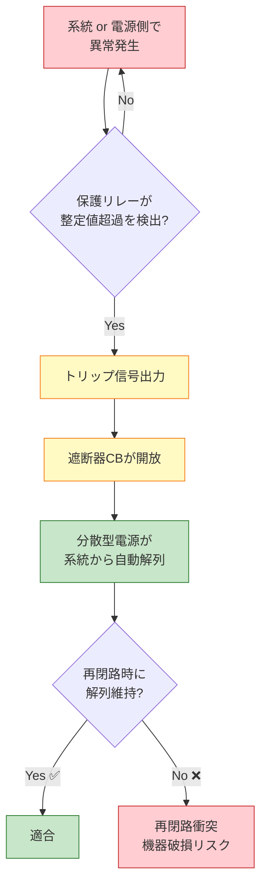

# 電技解釈 第229条 — 高圧連系時の系統連系用保護装置

!!! info "📌 条番号是正のお知らせ（2026-06-08 確定）"
    本記事は **旧 `227.md`（高圧連系時の系統連系用保護装置）の内容を、経産省告示PDF一次照合で確定した現行の第229条へ移設** したものです（H30問9・R02問10・R06上問7・R07上問7 はいずれも本条＝第229条）。この `/229/` URL で従来配信していた **「逆潮流の制限」は [第228条](228.md)（高圧連系時の施設要件）** に統合されました。低圧連系時の保護装置は [第227条](227.md) です。

!!! warning "📜 一次ソース確認のお願い（2026-05-10）"
    本ページは電気設備の技術基準の解釈（経済産業省告示）を学習用に整理したものです。電技解釈は eGov 法令API に登録されていないため、本Wikiの品質保証は wiki内クロスリファレンスと過去問データベース（kakomon.yml）への照合に依存しています。**重要な実務判断や試験直前の最終確認は、必ず経産省公式の最新告示PDF（[電気設備の技術基準の解釈](https://www.meti.go.jp/policy/safety_security/industrial_safety/sangyo/electric/detail/setsubi_kijun.html)）に当たってください**。誤記を発見された場合は GitHub Issues でご連絡ください。

!!! note "📊 試験対策メタ"
    **出題頻度**: 🔥🔥🔥🔥（過去14年で 4 回出題：H30 問9・R02 問10・R06上 問7・R07上 問7・分散型電源で最頻出）

    **重要度**: A（重要必須・穴埋め定番）

    **直近出題**: R07上 問7（穴埋め）

> ==**高圧系統（6,600V等）**== に分散型電源を連系する際の **保護装置の施設要件** を定める。系統側・分散型電源側双方の異常を ==**OVR・UVR・OFR・UFR**== 等の保護リレーで検出し、==**自動解列**== により切り離す。低圧連系（第222条系列）より検出すべき異常の種類が多く、保護要件が厳格。

| 項目 | 内容 |
|------|------|
| 条文 | 電技解釈 第229条（委任元: 電技省令第14・15・20・44条第1項） |
| 規定内容 | 高圧連系時に自動解列するための保護装置の施設義務 |
| 性格 | 施設要件規定（保護リレーの種類・検出対象・設置場所を規定） |
| 委任先 | 229-1表（保護リレー種類・整定値・動作時間の具体数値） |
| 上位 | 電技省令第15条等（系統連系時の保安原則） |
| 対象系統 | 高圧系統（600V超〜7,000V以下、代表は6,600V） |
| 分散型電源の例 | 大規模太陽光・風力発電・コジェネレーション・蓄電池システム |
| 主要保護リレー | OVR・UVR・OFR・UFR（電圧・周波数の異常検出）／単独運転検出装置／地絡過電圧継電器（OVGR） |
| 異常時の動作 | **自動解列**（分散型電源を系統から自動的に切り離す） |
| 系統側との関係 | 一般送配電事業者と **連絡** をとり、再閉路時に解列されている状態を維持 |

---

## 1. 5秒で思い出す

- 高圧連系 = 6,600V等の高圧系統に分散型電源を接続
- 大規模太陽光・風力・コジェネレーション等が対象
- 必要な保護リレー: ==OVR・UVR・OFR・UFR・OVGR==
- 系統異常時は ==自動解列==（自動で切り離す）
- 検出すべき異常: ==分散型電源の異常／系統の短絡・地絡事故／単独運転==
- 一般送配電事業者と ==連絡== をとり、==再閉路== 時に解列状態を維持

??? question "セルフチェック: 高圧連系で必要な4種の保護継電器の名称と検出対象は？"
    - **OVR（過電圧継電器）**: 系統電圧が規定値を超えたことを検出
    - **UVR（不足電圧継電器）**: 系統電圧が規定値を下回ったことを検出
    - **OFR（過周波数継電器）**: 系統周波数が規定値を超えたことを検出
    - **UFR（不足周波数継電器）**: 系統周波数が規定値を下回ったことを検出

    いずれも検出時に分散型電源を系統から **自動解列**（切り離し）する。

??? question "セルフチェック: 「単独運転」とは何か、なぜ検出する必要があるか？"
    **単独運転** ＝ 系統側が停電しているにもかかわらず、分散型電源だけが運転を続けて自分側の負荷に給電している状態。

    検出する理由：
    1. 復電作業中の作業者が **感電** する危険
    2. 位相のずれた電圧が再閉路時に再投入されて **機器が破損** する
    3. 系統運用者の制御から外れた電源が動き続ける

    → 単独運転検出装置（受動的方式：電圧位相跳躍検出等／能動的方式：周波数シフト等）で検出し、自動解列。

---

## 2. 条文原文

!!! abstract "条文原文（高圧連系時の系統連系用保護装置）"
    **電気設備技術基準の解釈 第229条（高圧連系時の系統連系用保護装置）**

    > 高圧の電力系統に分散型電源を連系する場合は、次の各号により、異常時に分散型電源を自動的に <mark>解列</mark> するための装置を施設すること。
    >
    > 一　次に掲げる異常を保護リレー等により検出し、分散型電源を自動的に <mark>解列</mark> すること。
    >
    > 　　イ　分散型電源の <mark>異常又は故障</mark>
    >
    > 　　ロ　連系している電力系統の <mark>短絡事故又は地絡事故</mark>
    >
    > 　　ハ　分散型電源の <mark>単独運転</mark>
    >
    > 二　 <mark>一般送配電事業者</mark> が運用する電力系統において <mark>再閉路</mark> が行われる場合は、当該再閉路時に、分散型電源が当該電力系統から解列されていること。
    >
    > 三　保護リレー等は、次によること。
    >
    > 　　イ　229-1表に規定する保護リレー等を、受電点その他故障の検出が可能な場所に設置すること。

    > <small>🟡 黄色マーカー = 過去問で穴埋め出題された語句（H30 問9・R02 問10・R06上 問7）</small>

    > <small>※穴埋め語句は H30問9・R02問10・R06上問7 と整合。条文番号は 2026-06-08 経産省告示PDF で一次照合済。</small>

??? question "📝 ここまでの理解チェック: 第1号で検出すべき3種の異常を即答できるか？"
    **イ. 分散型電源の異常又は故障**／**ロ. 系統の短絡事故又は地絡事故**／**ハ. 分散型電源の単独運転**

    過去問では「短絡事故又は地絡事故」「単独運転」が穴埋めの定番（R02 問10・R06上 問7）。

---

## 3. 原文解析

**第1号の分解（保護リレーによる異常検出と自動解列）**

| ブロック | 原文 | 意味 | 試験のポイント |
|---------|------|------|-------------|
| 主語 | 高圧の電力系統に分散型電源を連系する場合 | 適用条件（高圧＝6,600V級） | 低圧連系（[第227条](227.md)）との **対比** が頻出 |
| 義務 | 自動的に解列するための装置を施設 | 受動的に切り離すのではなく、検出と同時に **自動** | 「手動解列」は誤り選択肢 |
| 検出対象イ | 分散型電源の異常又は故障 | 発電機側の故障（過電圧・過電流等） | 穴埋め頻出 |
| 検出対象ロ | 短絡事故又は地絡事故 | 系統側の故障 | **R02 問10 (ア) ＝ 「短絡事故又は地絡事故」** |
| 検出対象ハ | 単独運転 | 系統停電中に発電機だけ運転継続する状態 | **H30 問9 (ア)・R06上 問7 (エ) ＝ 「単独運転」** |

**第2号の分解（再閉路時の解列維持）**

| ブロック | 原文 | 意味 |
|---------|------|------|
| 関係者 | 一般送配電事業者 | 系統運用者（東京電力PG・関西電力送配電 等） — **R02 問10 (イ)** |
| 動作 | 再閉路が行われる場合 | 系統側で事故除去後に自動再投入する動作 — **H30 問9 (イ)** |
| 要求 | 再閉路時に解列されていること | 再閉路の瞬間に発電機が系統から切り離されている必要 |

**第3号の分解（保護リレーの設置場所）**

| ブロック | 原文 | 意味 |
|---------|------|------|
| 装置 | 保護リレー等 | OVR/UVR/OFR/UFR/OVGR・単独運転検出装置 |
| 設置場所 | 受電点その他故障の検出が可能な場所 | 高圧連系点（PCS入口 or 受電盤）|
| 詳細 | 別表（229-1表） | リレー種類・整定値・検出時間が表で規定 |

??? question "📝 ここまでの理解チェック: 「再閉路時の解列維持」が必要な理由を1行で"
    系統が事故除去後に再投入される瞬間、分散型電源が単独運転で生き残っていると **位相のずれた電圧同士が衝突して機器破損** につながるため。再閉路前に必ず解列されている必要がある。

---

## 4. かみ砕き解説 — なぜ高圧連系は保護要件が多いのか

!!! note "🎯 核心キーワード — 「常時保護」⇔「再閉路時防止」の対比（第224条との役割分担）"
    本条（第229条）と[第224条](224.md)は **どちらも高圧連系の保護**を扱うが、**保護のタイミングと検出対象が異なる**。出題ではこの **対比軸** が「条文の役割を入れ替える」誤答として使われる。

    | 観点 | **本条（第229条）** | **[第224条](224.md)** |
    |------|----------------------|---------------------|
    | 核心キーワード | **「常時保護」＋「自動解列」** | **「再閉路時の事故防止」** |
    | 検出タイミング | 系統運用中の **異常発生時** に常時監視 | 系統側で事故除去→**再投入の瞬間** |
    | 主要装置 | **OVR・UVR・OFR・UFR・OVGR・単独運転検出装置** | **線路無電圧確認装置・UPR・RPR・単独運転検出** |
    | 検出対象 | 電圧／周波数の逸脱・地絡・短絡・単独運転 | 系統側無電圧の確認（再閉路前に分散型電源が解列されているか）|
    | 条文設計の狙い | **分散型電源を系統から守る／系統に擾乱を与えない** | **再閉路の瞬間の位相不整合・大電流による機器破損防止** |

    **反例（counterfactual）**：
    
    - 「**再閉路時の機器破損を防ぐため OVR・UVR を施設する**」と書かれていれば **不適切** → これは第224条の論点（線路無電圧確認装置等）。
    - 「**常時の電圧逸脱検出のために線路無電圧確認装置を施設する**」と書かれていれば **不適切** → 線路無電圧確認装置は再閉路時の判定用であり、常時保護は OVR 等が担う。

    **OVGR が地絡検出に特化する物理的根拠**：地絡事故時には系統に **零相電圧** が発生する（中性点に対する不平衡）。OVGR（地絡過電圧継電器）は **零相電圧の上昇のみを検出**するため、通常の三相平衡時には動作しない。OVR（過電圧継電器）は **三相全体の電圧上昇**を検出するもので、地絡事故の特異な零相成分は捉えられない。試験で「地絡事故の検出には OVR を用いる」と書かれていれば **不適切**（→ 正答は OVGR）。

!!! tip "暗記の核心：高圧連系で保護リレーが多種類必要な3つの理由"
    1. **影響範囲が広い** — 高圧系統は配電区域全体に波及するため、誤動作・異常運転が長引くと多数の需要家に影響
    2. **大規模電源** — 高圧連系は産業用・発電事業者の大型電源。出力が大きい分、系統への擾乱も大きい
    3. **単独運転のリスク** — 高圧系統での単独運転は感電・機器破損の被害が大きい。受動・能動の両方式で確実に検出する必要

### 各保護リレーの検出原理

| 継電器 | 記号 | 検出する系統の変化 | 解列の理由 |
|--------|------|-----------------|-----------|
| 過電圧継電器 | OVR | 電圧が高くなりすぎた | 発電過剰・系統電圧不安定 |
| 不足電圧継電器 | UVR | 電圧が低くなりすぎた | 系統停電・短絡事故の可能性 |
| 過周波数継電器 | OFR | 周波数が上がりすぎた | 系統内の発電過剰 |
| 不足周波数継電器 | UFR | 周波数が下がりすぎた | 系統内の発電不足・大事故の前兆 |
| 地絡過電圧継電器 | OVGR | 系統側の地絡事故時の電圧上昇を検出 | 地絡事故の波及防止 — **R02 問10 (ウ)・R06上 問7 (ウ)** |

!!! warning "R06上 問7 で出題されたひっかけ"
    「地絡事故の検出には（ウ）継電器が用いられる」の穴埋めで、「過電圧」（OVR）と「地絡過電圧」（OVGR）を混同させる選択肢が登場。

    - **OVR（過電圧継電器）** = 系統**全体の電圧上昇**を検出
    - **OVGR（地絡過電圧継電器）** = **地絡時の零相電圧上昇**を検出

    正答は **「地絡過電圧」**。「過電圧」ではない。
| 単独運転検出装置 | — | 受動的（位相跳躍）／能動的（周波数シフト） | 単独運転状態の確実な検出 |

### 自動解列までの流れ

| ステップ | 内容 |
|---------|------|
| ① 異常発生 | 系統または分散型電源側で異常（電圧/周波数逸脱・地絡・単独運転）|
| ② 検出 | 保護リレーが整定値を超えたことを検出 |
| ③ 信号出力 | リレー → 遮断器のトリップコイルへ |
| ④ 解列 | 遮断器が開放、分散型電源が系統から切り離される |
| ⑤ 再投入 | 系統正常化後、運用者の手順で再投入（自動再投入は原則しない）|

---

## 5. 図で理解

### 図解 1：高圧連系の保護リレー配置（受電点から見た系統）

<svg viewBox="0 0 820 360" xmlns="http://www.w3.org/2000/svg" font-family="-apple-system,BlinkMacSystemFont,Hiragino Kaku Gothic ProN,Yu Gothic UI,Meiryo,sans-serif" style="width:100%;max-width:820px"><defs><filter id="shP227" x="-20%" y="-20%" width="140%" height="140%"><feDropShadow dx="0" dy="2" stdDeviation="2" flood-opacity="0.18"/></filter><linearGradient id="gridG" x1="0" y1="0" x2="0" y2="1"><stop offset="0%" stop-color="#bbdefb"/><stop offset="100%" stop-color="#90caf9"/></linearGradient><linearGradient id="dgG" x1="0" y1="0" x2="0" y2="1"><stop offset="0%" stop-color="#c8e6c9"/><stop offset="100%" stop-color="#a5d6a7"/></linearGradient><linearGradient id="relG" x1="0" y1="0" x2="0" y2="1"><stop offset="0%" stop-color="#fff9c4"/><stop offset="100%" stop-color="#fff59d"/></linearGradient><marker id="trip227" markerWidth="10" markerHeight="10" refX="9" refY="5" orient="auto"><polygon points="0 0,9 5,0 10" fill="#c62828"/></marker></defs><text x="410" y="22" text-anchor="middle" font-size="15" font-weight="700" fill="#212121">⚡ 高圧連系 — 保護リレーと自動解列の構成</text><text x="410" y="40" text-anchor="middle" font-size="11" fill="#666">系統 → 受電点 → 保護リレー群 → 遮断器（CB） → 分散型電源</text><rect x="20" y="80" width="160" height="180" rx="14" fill="url(#gridG)" stroke="#0d47a1" stroke-width="2.5" filter="url(#shP227)"/><text x="100" y="110" text-anchor="middle" font-size="14" font-weight="700" fill="#0d47a1">🏭 系統側</text><text x="100" y="130" text-anchor="middle" font-size="11" fill="#0d47a1">（一般送配電事業者）</text><text x="100" y="160" text-anchor="middle" font-size="11" fill="#1565c0">6,600 V</text><text x="100" y="180" text-anchor="middle" font-size="10" fill="#1565c0">配電用変電所</text><text x="100" y="210" text-anchor="middle" font-size="9" fill="#c62828">短絡事故・地絡事故</text><text x="100" y="226" text-anchor="middle" font-size="9" fill="#c62828">電圧/周波数異常</text><text x="100" y="242" text-anchor="middle" font-size="9" fill="#c62828">再閉路</text><line x1="180" y1="170" x2="240" y2="170" stroke="#1565c0" stroke-width="3"/><circle cx="260" cy="170" r="6" fill="#1565c0"/><text x="260" y="155" text-anchor="middle" font-size="11" font-weight="700" fill="#0d47a1">受電点</text><line x1="266" y1="170" x2="320" y2="170" stroke="#1565c0" stroke-width="3"/><rect x="320" y="100" width="200" height="170" rx="14" fill="url(#relG)" stroke="#f57f17" stroke-width="2.5" filter="url(#shP227)"/><text x="420" y="124" text-anchor="middle" font-size="13" font-weight="700" fill="#e65100">🛡️ 保護リレー群</text><text x="420" y="142" text-anchor="middle" font-size="10" fill="#e65100">（受電点付近に設置）</text><line x1="335" y1="152" x2="505" y2="152" stroke="#f57f17" stroke-width="1"/><text x="350" y="172" text-anchor="start" font-size="11" font-weight="700" fill="#bf360c">OVR</text><text x="395" y="172" text-anchor="start" font-size="10" fill="#bf360c">過電圧</text><text x="350" y="190" text-anchor="start" font-size="11" font-weight="700" fill="#bf360c">UVR</text><text x="395" y="190" text-anchor="start" font-size="10" fill="#bf360c">不足電圧</text><text x="350" y="208" text-anchor="start" font-size="11" font-weight="700" fill="#bf360c">OFR</text><text x="395" y="208" text-anchor="start" font-size="10" fill="#bf360c">過周波数</text><text x="350" y="226" text-anchor="start" font-size="11" font-weight="700" fill="#bf360c">UFR</text><text x="395" y="226" text-anchor="start" font-size="10" fill="#bf360c">不足周波数</text><text x="350" y="244" text-anchor="start" font-size="11" font-weight="700" fill="#bf360c">OVGR</text><text x="395" y="244" text-anchor="start" font-size="10" fill="#bf360c">地絡過電圧</text><text x="350" y="262" text-anchor="start" font-size="10" font-weight="700" fill="#bf360c">単独運転検出装置</text><line x1="420" y1="270" x2="420" y2="305" stroke="#c62828" stroke-width="2.5" marker-end="url(#trip227)" stroke-dasharray="4,3"/><text x="445" y="290" font-size="10" font-weight="700" fill="#c62828">トリップ信号</text><line x1="520" y1="170" x2="560" y2="170" stroke="#1565c0" stroke-width="3"/><rect x="560" y="148" width="60" height="44" rx="6" fill="#fff" stroke="#c62828" stroke-width="2.5"/><text x="590" y="175" text-anchor="middle" font-size="13" font-weight="700" fill="#b71c1c">CB</text><text x="590" y="208" text-anchor="middle" font-size="9" fill="#b71c1c">遮断器</text><line x1="620" y1="170" x2="680" y2="170" stroke="#1565c0" stroke-width="3"/><rect x="680" y="80" width="120" height="180" rx="14" fill="url(#dgG)" stroke="#2e7d32" stroke-width="2.5" filter="url(#shP227)"/><text x="740" y="110" text-anchor="middle" font-size="13" font-weight="700" fill="#1b5e20">⚡ 分散型電源</text><text x="740" y="135" text-anchor="middle" font-size="11" fill="#1b5e20">大規模太陽光</text><text x="740" y="153" text-anchor="middle" font-size="11" fill="#1b5e20">風力発電</text><text x="740" y="171" text-anchor="middle" font-size="11" fill="#1b5e20">コジェネ</text><text x="740" y="189" text-anchor="middle" font-size="11" fill="#1b5e20">蓄電池</text><text x="740" y="220" text-anchor="middle" font-size="9" fill="#1b5e20">異常検出時に</text><text x="740" y="236" text-anchor="middle" font-size="9" fill="#1b5e20">自動解列</text><line x1="20" y1="320" x2="800" y2="320" stroke="#6d4c41" stroke-width="1.5" stroke-dasharray="3,3"/><text x="410" y="340" text-anchor="middle" font-size="10" fill="#666">★ 保護リレーが異常を検出 → トリップ信号 → 遮断器(CB)が開放 → 分散型電源が系統から切り離される</text></svg>

### 図解 2：自動解列の判定フロー

---

## 6. 第227条（低圧連系の保護装置）vs 第229条（高圧連系の保護装置）比較

| 比較項目 | 第227条 低圧連系の保護 | 第229条 高圧連系の保護 |
|---------|-------------|-------------|
| 系統電圧 | 600V以下 | 600V超（代表: 6,600V） |
| 分散型電源規模 | 小規模（住宅用等） | 大規模（産業用・発電事業等） |
| 保護リレー | OVR/UVR/OFR/UFR | OVR・UVR・OFR・UFR・OVGR + 単独運転検出装置 |
| 検出すべき異常 | 短絡・地絡・高低圧混触・単独運転・逆充電 | 短絡・地絡・単独運転（高低圧混触・逆充電は対象外）|
| 自動解列 | 必要 | 必要（より厳格） |
| 再閉路時の解列 | 必要 | 必要 |

!!! note "出題予測"
    第227条（低圧保護）との対比が最頻出パターン。「高圧連系に必要な保護リレーの種類」の穴埋め（OVR・UVR・OFR・UFR・OVGRの空欄）や、「高圧連系の要件として正しいものを選べ」の選択問題が予想される。

---

## 7. 試験で問われること

> 出題は「自動解列のトリガとなる異常」「保護リレーの種類」「再閉路時の解列維持」の3パターンに集中。

!!! note "出題予測（過去14年の統計）"
    1. **検出すべき異常の穴埋め**: 「分散型電源の異常／系統の短絡事故又は地絡事故／単独運転」
        - 正答頻出語: ==短絡事故又は地絡事故==・==単独運転==・==地絡過電圧==
        - ひっかけ: 「高低圧混触」（これは低圧連系側の項目）

    2. **再閉路と一般送配電事業者**: 「○○○ が運用する電力系統において再閉路が行われる場合」
        - 正答: ==一般送配電事業者== — R02 問10 (イ)
        - ひっかけ: 「電力会社」「送配電事業者」などの不正確な略称

    3. **保護リレーの記号と検出対象**: OVR/UVR/OFR/UFR/OVGR
        - **R06上 問7 (ウ) ＝ 「地絡過電圧」**（OVGR）

    4. **発電電圧・系統側の用語**: R06上 問7 で初出
        - **R06上 問7 (ア) ＝ 「発電電圧」 / (イ) ＝ 「系統側」**

??? question "📝 ここまでの理解チェック: 過去問で出た穴埋め頻出語を5つ即答できるか？"
    **単独運転 / 短絡事故又は地絡事故 / 地絡過電圧 / 一般送配電事業者 / 再閉路** の5語セット。これに **発電電圧 / 系統側** を加えて7語が網羅範囲。

---

## 8. 頻出ひっかけ・落とし穴

試験で実際に失点しやすいポイントを、重大度別に整理した。

### 🔴 致命的（これを間違えたら即失点）

1. ❌「高圧連系で検出すべき異常に『高低圧混触』が含まれる」
    - → ✅ 高低圧混触は **低圧連系側**（[第227条](227.md)）の項目。高圧連系では「**短絡事故又は地絡事故**」と「**単独運転**」が中心
2. ❌「自動解列は手動でも代替可能」
    - → ✅ 条文は「**自動的に**解列するための装置」を要求。手動解列は不適合
3. ❌「再閉路時に分散型電源が動いていても問題ない」
    - → ✅ 再閉路時は **必ず解列されている状態** を維持。位相のずれた電圧同士が衝突すると **機器破損**

### 🟡 注意（出題頻度高い）

4. ❌「保護リレーは変電所側に設置する」
    - → ✅ 設置場所は **「受電点」その他故障検出が可能な場所**（需要家側）
5. ❌「単独運転検出は OVR/UVR で代用できる」
    - → ✅ 単独運転は専用の **単独運転検出装置**（受動的方式＋能動的方式）が必要。電圧変動だけでは確実に検出できない
6. ❌「『電力会社』と書いて正解になる」
    - → ✅ 正答は **「一般送配電事業者」**（2020年の発送電分離後の正式名称）

!!! warning "R02 問10 で出題されたひっかけ"
    「○○が運用する電力系統において再閉路が行われる場合」の穴埋めで「電力会社」「送電会社」が誤答選択肢として登場。条文上の正式名称は **「一般送配電事業者」**。

### 🟢 軽微（余裕があれば）

7. ❌「高圧と低圧で保護リレーは全く別物」
    - → ✅ OVR/UVR/OFR/UFR は **共通**。差分は OVGR・単独運転検出装置の追加要求と整定値の厳しさ
8. ❌「地絡過電圧継電器（OVGR）と過電圧継電器（OVR）は同じもの」
    - → ✅ OVR は **系統電圧の上昇** を検出。OVGR は **地絡時の零相電圧上昇** を検出。検出原理が異なる

??? question "セルフチェック: 「単独運転」と「自立運転」の違いを言えるか？"
    - **単独運転** ＝ 系統が停電したのに、分散型電源が **系統に対して** 給電を続ける状態（**禁止対象**）
    - **自立運転** ＝ 系統解列後、分散型電源が **自己負荷だけに** 給電する状態（許容される運用モード）

    両者は系統との連系状態で明確に区別される。穴埋めで「単独運転」を「自立運転」と書くのは誤り。

---

## 9. 穴埋め過去問チャレンジ

!!! abstract "過去問 H30 問9（難易度 ★★☆☆☆）"
    次の文章は分散型電源の連系時の系統連系用保護装置に関する記述である。空欄に入る語句を答えよ。

    > 分散型電源の <mark>（ア）</mark> を保護リレー等により検出し、自動的に分散型電源を解列すること。一般送配電事業者が運用する電力系統において <mark>（イ）</mark> が行われる場合は、当該再閉路時に分散型電源が当該電力系統から解列されていること。また、保護リレー等の設置に関しては、受電点その他故障の検出が可能な場所への設置と、一般送配電事業者との <mark>（ウ）</mark> をとる必要がある。

??? success "解答を見る"
    | 空欄 | 正答 |
    |------|------|
    | （ア） | **単独運転** |
    | （イ） | **再閉路** |
    | （ウ） | **連絡** |

    → 出典: [denken-ou.com H30 問9](https://denken-ou.com/houkih30-9/)

!!! abstract "過去問 R02 問10（難易度 ★★☆☆☆）"
    > 分散型電源の高圧連系時、連系している電力系統の <mark>（ア）</mark> を保護リレー等により検出し自動的に解列すること。 <mark>（イ）</mark> が運用する電力系統において再閉路が行われる場合は、当該再閉路時に分散型電源が解列されていること。地絡事故の検出には <mark>（ウ）</mark> 継電器を用いる。

??? success "解答を見る"
    | 空欄 | 正答 |
    |------|------|
    | （ア） | **短絡事故又は地絡事故** |
    | （イ） | **一般送配電事業者** |
    | （ウ） | **地絡過電圧** |

    → 出典: [denken-ou.com R02 問10](https://denken-ou.com/houkir2-10/)

!!! abstract "過去問 R06上 問7（難易度 ★★☆☆☆・直近出題）"
    > 高圧連系時の系統連系用保護装置に関し、 <mark>（ア）</mark> 異常時には電源側保護リレーで検出し解列する。 <mark>（イ）</mark> の事故時には系統との連系点で検出し解列する。地絡事故の検出には <mark>（ウ）</mark> 継電器が用いられる。さらに <mark>（エ）</mark> 状態を検出して自動解列することも要求される。

??? success "解答を見る"
    | 空欄 | 正答 |
    |------|------|
    | （ア） | **発電電圧** |
    | （イ） | **系統側** |
    | （ウ） | **地絡過電圧** |
    | （エ） | **単独運転** |

    → 出典: [denken-ou.com R06上 問7](https://denken-ou.com/houkir6-1-7/)

---

## 10. まぎらわしい選択肢と正解の違い

| 空欄 | よくある誤答 | 正答 | なぜ違うか |
|------|------------|------|----------|
| 単独運転 | **自立運転** | **単独運転** | 自立運転は系統解列後の自己負荷給電（許容）。単独運転は系統に対する給電（禁止対象）|
| 短絡事故又は地絡事故 | **高低圧混触** | **短絡事故又は地絡事故** | 高低圧混触は **低圧連系側** の項目。高圧連系では混触は対象外 |
| 一般送配電事業者 | **電力会社／送電会社** | **一般送配電事業者** | 2020年の発送電分離以降の **正式名称**。略称は穴埋めで不可 |
| 地絡過電圧 | **過電圧** | **地絡過電圧** | OVR（過電圧）と OVGR（地絡過電圧）は別物。OVGRは地絡時の零相電圧上昇を検出 |
| 再閉路 | **遮断／復電** | **再閉路** | 再閉路は事故除去後の **自動再投入動作** の専門用語 |
| 連絡 | **連系／通信** | **連絡** | 一般送配電事業者との「**連絡**」は条文の専門用語 |

### 一目でわかる用語比較

| 比較軸 | 単独運転 | 自立運転 | 解列 |
|--------|---------|---------|------|
| 系統との関係 | 系統側に給電（禁止） | 系統解列後の自己負荷のみ | 系統から切り離す動作 |
| 試験での位置 | 第229条の検出対象 | 運用モード（許容）| 第229条の動作 |
| 穴埋めでの扱い | 正答頻出 | 誤答選択肢 | — |

---

## 11. 関連条文

**上位・並列条文**

- [電技解釈 第227条（低圧連系時の系統連系用保護装置）](227.md) — 本条（高圧保護）との対比が頻出（高低圧混触・逆充電が低圧のみ）
- [電技解釈 第226条（低圧連系時の施設要件）](226.md) — 低圧連系の施設要件
- [電技解釈 第228条（高圧連系時の施設要件）](228.md) — 配電用変圧器の逆向き潮流防止
- [電技解釈 第224条（再閉路時の事故防止）](224.md) — 高圧/特高連系の再閉路時防止（常時保護の本条と対）
- [単独運転の防止（テーマ）](../../themes/tandoku-unten-boushi.md) — 単独運転検出装置の体系

**用語の根拠**

- [電技解釈 第220条（用語の定義）](220.md) — 「分散型電源」「解列」「単独運転」「逆潮流」「自立運転」等

**テーマ別解説**

- [保護リレー（保護継電器）テーマ](../../themes/hogo-relay.md) — OVR/UVR/OFR/UFR/OVGR の検出原理を5象限マトリクスで整理

**保護リレーの法的位置付けフロー**

| ステップ | 条文 | 内容 |
|---------|------|------|
| 1 | 電技省令第15条 等 | 系統連系時の保安原則 |
| 2 | 電技解釈 第220条 | 用語定義（解列・単独運転・分散型電源）|
| 3 | 電技解釈 第229条 | 高圧連系時の保護装置施設要件 |
| 4 | 229-1表 | リレー種類・整定値・動作時間の数値規定 |

---

## 12. 過去問実績

| 年度 | 問 | 形式 | 論点 | 備考 |
|------|-----|------|------|------|
| R06上 | 問7 | 穴埋 | 高圧連系時の系統連系用保護装置 | (ア)発電電圧 (イ)系統側 (ウ)地絡過電圧 (エ)単独運転 |
| R02 | 問10 | 穴埋 | 高圧連系時の系統連系用保護装置 | (ア)短絡事故又は地絡事故 (イ)一般送配電事業者 (ウ)地絡過電圧 |
| H30 | 問9 | 穴埋 | 分散型電源の連系時の系統連系用保護装置 | (ア)単独運転 (イ)再閉路 (ウ)連絡 |

→ **過去14年で3回出題**。R06上で再度出題され、出題波が高い局面。

!!! note "R08 出題予測"
    再エネ普及・高圧連系案件の増加に伴い出題増加傾向。直近R06上で出題されたため R07・R08 でも継続出題の可能性が高い。
    **「自動解列のトリガとなる異常（短絡事故・地絡事故・単独運転・地絡過電圧）」「再閉路時の解列維持」「一般送配電事業者との連絡」** が定番テーマ。第227条（低圧連系の保護装置）との比較問題も想定される。

---

## 13. 用語集

| 用語 | 読み | 意味 | 試験での注意点 |
|------|------|------|----------------|
| 自動解列 | じどうかいれつ | 保護リレーの検出により遮断器を自動で開放し、分散型電源を系統から切り離すこと | 「手動解列」は条文不適合。穴埋め定番語 |
| 単独運転 | たんどくうんてん | 系統が停電中に分散型電源だけが運転を継続し系統側に給電している状態 | 「自立運転」（自己負荷のみ給電・許容）と混同注意 |
| 自立運転 | じりつうんてん | 系統解列後に分散型電源が自己負荷のみに給電する運転モード | 許容される運用モード。穴埋めでの誤答選択肢 |
| 再閉路 | さいへいろ | 系統側で事故除去後に遮断器を自動的に再投入する動作 | 「復電」「遮断」とは別概念。H30問9(イ)の正答 |
| 一般送配電事業者 | いっぱんそうはいでんじぎょうしゃ | 系統を運用する事業者（東京電力PG・関西電力送配電等） | 2020年発送電分離後の正式名称。「電力会社」は不正解 |
| 逆潮流 | ぎゃくちょうりゅう | 分散型電源の発電電力が需要を超えて系統側に流れること | 高圧連系では逆潮流の有無で保護装置の要件が変わる |
| OVR | オーブイアール | Over Voltage Relay（過電圧継電器）。系統電圧上昇を検出 | OVGR（地絡過電圧）との混同に注意 |
| OVGR | オーブイジーアール | Over Voltage Ground Relay（地絡過電圧継電器）。零相電圧上昇を検出 | R02問10・R06上問7で「地絡過電圧」が正答 |
| 受電点 | じゅでんてん | 需要家が系統から電力を受ける接続点 | 保護リレーの設置場所として条文に明記 |

---

## 14. 最終チェック

**📜 条文の核心**

- [ ] 高圧連系の対象電圧（600V超〜7,000V以下、代表6,600V）を即答できる
- [ ] 検出すべき3種の異常（分散型電源の異常／短絡・地絡事故／単独運転）を即答できる
- [ ] 再閉路時に解列されている必要がある理由を説明できる（位相衝突・機器破損リスク）

**🛡️ 保護リレー**

- [ ] OVR/UVR/OFR/UFR/OVGR の記号と検出対象を即答できる
- [ ] 単独運転検出装置の必要性（OVR/UVRでは代用不可）を説明できる
- [ ] 保護リレーの設置場所が「受電点その他故障の検出が可能な場所」であることを覚えている

**📚 用語・関係者**

- [ ] 「一般送配電事業者」が穴埋めの正答（「電力会社」では不可）と知っている
- [ ] 「単独運転」と「自立運転」の違いを説明できる
- [ ] 第227条（低圧連系）と第229条（高圧連系）の保護要件の違いを言える

**📌 条番号（確定）**

- [ ] 本条＝高圧連系の保護装置＝**第229条**（2026-06-08 経産省告示PDF一次照合・H30/R02/R06上/R07上 と整合）と理解している
- [ ] 低圧連系の保護装置は[第227条](227.md)であると区別できる

---

## 監修ログ

| 日付 | 版 | 内容 |
|------|----|------|
| 2026-04-20 | v1.0 | 初版（高圧連系の施設要件として作成） |
| 2026-05-04 | v1.1 | テンプレ準拠化（条文原文・原文解析・図解・穴埋め過去問・最終チェック追加）／ 条番号誤記の可能性を冒頭に注記（要確認） |
- 2026-05-10 Phase C: 一次ソース確認warning（経産省告示PDF参照）を冒頭に配置（電技解釈はeGov未登録のため読者保護目的）
- **2026-05-19 v1.2**（古舘）: **条文核心キーワード抽出規律の水平展開適用**（[feedback_law_clause_essence_check.md](../../reference/versioning.md)）。jigyoho/43.md v2.2 で導入した5ステップ規律を本ページに適用。セクション4冒頭に「🎯 核心キーワード — 『常時保護』⇔『再閉路時防止』の対比」note を新設。①第224条（再閉路時防止）と本条（常時保護＋単独運転）の役割分担を5列表で明示。②OVGR と OVR の物理的区別（零相電圧 vs 三相電圧）を立法趣旨レベルで説明。③反例として「再閉路時防止のため OVR/UVR を施設」「常時保護のため線路無電圧確認装置を施設」「地絡検出に OVR」の3パターンを明示。文言一致確認だけで終わらせない規律の適用例。

---

*最終確認: 2026-05-19 | ステータス: v1.2（5ステップ規律適用・「常時保護⇔再閉路時防止」対比軸明示） | [バージョニング基準](../../reference/versioning.md)*
