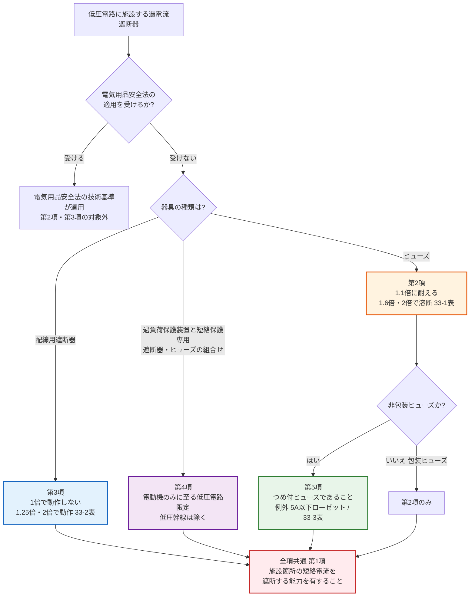

# 電技解釈 第33条 — 低圧電路に施設する過電流遮断器の性能等

!!! danger "⚠️ 条番号誤記の訂正（2026-07-26 全面書き直し）"
    本ページの旧版（v1.1）は「**過電流遮断器の施設**」として、分岐点からの施設位置（3m／8m）・許容電流比（35%／55%）を解説していましたが、これは **完全な誤同定** でした。経産省告示PDF（電気設備の技術基準の解釈・令和7年11月版）で確認したところ:

    - **旧版が書いていた内容**（分岐回路の遮断器位置 3m/8m・許容電流比 35%/55%）は **[第149条（低圧分岐回路等の施設）](149.md)** の規定です
    - **第33条の真の主題** は「**低圧電路に施設する過電流遮断器の性能等**」＝ ヒューズ・配線用遮断器が満たすべき **動作特性（時間電流特性）** の規定です
    - 分岐回路の遮断器位置を学びたい方は **[第149条](149.md)** へ、幹線の施設は **[第148条](148.md)** へどうぞ
    - 本訂正は法令改正によるものではなく、**本Wiki側の条番号誤記** です（改正記録なし）。[kijun/14.md](../kijun/14.md) と [reference/numbers.md](../../reference/numbers.md) は以前から本条を「低圧の過電流遮断器の性能」として正しく参照しており、本ページのみがズレていました

!!! warning "📜 一次ソース確認のお願い"
    本ページは電気設備の技術基準の解釈（経済産業省が省令の解釈として示すもの）を学習用に整理したものです。電技解釈は eGov 法令API に登録されていないため、本Wikiの品質保証は経産省告示PDF原典への逐語照合＋過去問データベースへの照合に依存しています。**重要な実務判断や試験直前の最終確認は、必ず経産省公式の最新告示PDF（[電気設備の技術基準の解釈](https://www.meti.go.jp/policy/safety_security/industrial_safety/sangyo/electric/detail/setsubi_kijun.html)）に当たってください**。

!!! note "📊 試験対策メタ"
    **出題頻度**: —（過去14年で本条の直接出題は確認できず）

    **重要度**: B（直接出題は無いが、委任元の [省令第14条](../kijun/14.md) が繰り返し出題され、その「具体化された中身」が本条。1.1倍／1倍という **境界値の非対称** は選択肢作成の格好の材料）

    **直近出題**: なし（R05上問3 は [省令第14条](../kijun/14.md) の条文抜き出しであり、本条からの出題ではありません — 後述「10. 過去問実績」参照）

| 項目 | 内容 |
|------|------|
| 条文 | 電気設備の技術基準の解釈 第33条 |
| 条文核心 | **ヒューズ＝定格の 1.1倍に耐える**／**配線用遮断器＝定格の 1倍で動作しない**。両者とも **2倍** の電流で表の時間内に動作すること |
| 規定内容 | 低圧電路に施設する過電流遮断器（ヒューズ・配線用遮断器・組合せ装置・非包装ヒューズ）の **性能**（遮断能力・時間電流特性） |
| 性格 | 数値規定（時間電流特性の表が中心・施設位置の規定ではない） |
| 委任元（上位） | [電技省令第14条](../kijun/14.md)（過電流からの電線及び電気機械器具の保護対策） |
| 構成 | 第1項＝短絡電流の遮断能力／第2項＝ヒューズの性能（33-1表）／第3項＝配線用遮断器の性能（33-2表）／第4項＝過負荷保護装置と短絡保護専用遮断器等の組合せ／第5項＝非包装ヒューズ（33-3表） |
| 関連 | 第34条（高圧・特別高圧の過電流遮断器の性能等）／第35条（過電流遮断器の施設の **例外**）／[第148条](148.md)（低圧幹線）／[第149条](149.md)（低圧分岐回路） |
| **混同注意** | **本条＝低圧の過電流遮断器の「性能」**／**[第149条](149.md)＝分岐回路の遮断器の「位置と定格」**（3m/8m・35%/55%）。旧版が取り違えていた軸はここ |
| **典拠（一次ソース）** | 電気設備の技術基準の解釈（経産省が示す省令の解釈・**令和7年11月版**）第33条 — 経産省告示PDF原典から第1項〜第5項・33-1〜33-3表を逐語抽出 |
| **照合日** | 2026-07-26（告示PDF原典を pymupdf で全文抽出し、`【低圧電路に施設する過電流遮断器の性能等】（省令第14条）第33条` の見出し・全項・全表を逐語照合） |
| **隣接条文** | 第32条（PCB使用電気機械器具の施設禁止） ← 本条（33・低圧の性能） → 第34条（高圧・特別高圧の性能） ／ 上位: [電技省令第14条](../kijun/14.md) |

---

## 1. 5秒で思い出す

!!! tip "💡 試験直前の核心メモ（5秒で思い出す）"
    - 本条は **性能規定**。「どこに付けるか」ではなく「**どう動くべきか**」
    - **ヒューズ**: 定格の ==1.1倍== の電流に **耐える**（溶断しない）
    - **配線用遮断器**: 定格の ==1倍== の電流で **動作しない**
    - → **1.1倍 と 1倍 は非対称**。ここが最大のひっかけポイント
    - 両者とも **2倍** の電流で 33-1表／33-2表の時間内に動作（30A以下ならどちらも ==2分==）
    - 第2の見どころは **1.6倍（ヒューズ）** vs **1.25倍（配線用遮断器）** の非対称
    - 組合せ装置（第4項）: 整定電流は定格の ==13倍以下==、整定の1.2倍で ==0.2秒== 以内に動作
    - 非包装ヒューズは **つめ付ヒューズ**（例外: 5A以下のローゼット等／33-3表の端子間長さ）

??? question "セルフチェック: ヒューズは「1.1倍に耐える」、配線用遮断器は「1倍で動作しない」。なぜ同じ値に揃っていないのか？"
    **溶断（不可逆）と引外し（可逆）で、要求される安全余裕の意味が違うからです。**

    ヒューズは一度溶断すると **交換が必要**（不可逆）。定格ぴったりの電流で溶断してしまうと、正常運転中に無用な停電と交換作業が発生します。そこで **定格の1.1倍まで耐える**＝10%の余裕を明示的に要求しています。

    配線用遮断器は引外し後に **再投入できる**（可逆）ため、余裕を10%も積む必要がありません。代わりに「**定格の1倍では動作しない**」という最低ラインだけを規定します。

    試験では「配線用遮断器は1.1倍に耐える」「ヒューズは1倍で溶断しない」のように **数値を入れ替えた選択肢** が作られます。「不可逆な方（ヒューズ）に余裕が大きい」と因果で覚えると入れ替えに強くなります。

---

## 2. 条文原文

??? note "📜 条文原文 — 経産省告示PDF（令和7年11月版）完全版（折り畳み・クリックで開く）"
    経済産業省「電気設備の技術基準の解釈」（令和7年11月版）原典PDFから逐語取得した **第33条 全文**（第1項〜第5項・33-1表／33-2表／33-3表を含む）。本記事の解説・暗記表は試験対策のために整理したものなので、正確な条文文言を確認したい場合は本ブロックを参照してください。**2026-07-26 一次照合済**。

    **凡例**: `**bold**` は条文の主要語句で **論述・予想範囲**。本条は過去14年で直接の穴埋め出題が確認できないため、<mark>黄色マーカー</mark>（＝実際に穴埋め出題された語のみに付す）は **付していません**。

    **【低圧電路に施設する過電流遮断器の性能等】（省令第14条）**

    **第33条** 低圧電路に施設する過電流遮断器は、これを施設する箇所を通過する **短絡電流を遮断する能力** を有するものであること。ただし、当該箇所を通過する最大短絡電流が **10,000A** を超える場合において、過電流遮断器として **10,000A以上** の短絡電流を遮断する能力を有する配線用遮断器を施設し、当該箇所より電源側の電路に当該配線用遮断器の短絡電流を遮断する能力を超え、当該最大短絡電流以下の短絡電流を当該配線用遮断器より **早く、又は同時に遮断する能力** を有する、過電流遮断器を施設するときは、この限りでない。

    **2** 過電流遮断器として低圧電路に施設する **ヒューズ**（電気用品安全法の適用を受けるもの、配電用遮断器と組み合わせて1の過電流遮断器として使用するもの及び第4項に規定するものを除く。）は、**水平に取り付けた場合**（板状ヒューズにあっては、板面を水平に取り付けた場合）において、次の各号に適合するものであること。

    　一 **定格電流の1.1倍の電流に耐える** こと。

    　二 33-1表の左欄に掲げる定格電流の区分に応じ、**定格電流の1.6倍及び2倍** の電流を通じた場合において、それぞれ同表の右欄に掲げる時間内に **溶断** すること。

    **33-1表（ヒューズの溶断時間）**

    | 定格電流の区分 | 1.6倍の電流を通じた場合 | 2倍の電流を通じた場合 |
    |---|---|---|
    | 30A以下 | 60分 | 2分 |
    | 30Aを超え60A以下 | 60分 | 4分 |
    | 60Aを超え100A以下 | 120分 | 6分 |
    | 100Aを超え200A以下 | 120分 | 8分 |
    | 200Aを超え400A以下 | 180分 | 10分 |
    | 400Aを超え600A以下 | 240分 | 12分 |
    | 600A超過 | 240分 | 20分 |

    **3** 過電流遮断器として低圧電路に施設する **配線用遮断器**（電気用品安全法の適用を受けるもの及び次項に規定するものを除く。）は、次の各号に適合するものであること。

    　一 **定格電流の1倍の電流で自動的に動作しない** こと。

    　二 33-2表の左欄に掲げる定格電流の区分に応じ、**定格電流の1.25倍及び2倍** の電流を通じた場合において、それぞれ同表の右欄に掲げる時間内に **自動的に動作** すること。

    **33-2表（配線用遮断器の動作時間）**

    | 定格電流の区分 | 1.25倍の電流を通じた場合 | 2倍の電流を通じた場合 |
    |---|---|---|
    | 30A以下 | 60分 | 2分 |
    | 30Aを超え50A以下 | 60分 | 4分 |
    | 50Aを超え100A以下 | 120分 | 6分 |
    | 100Aを超え225A以下 | 120分 | 8分 |
    | 225Aを超え400A以下 | 120分 | 10分 |
    | 400Aを超え600A以下 | 120分 | 12分 |
    | 600Aを超え800A以下 | 120分 | 14分 |
    | 800Aを超え1,000A以下 | 120分 | 16分 |
    | 1,000Aを超え1,200A以下 | 120分 | 18分 |
    | 1,200Aを超え1,600A以下 | 120分 | 20分 |
    | 1,600Aを超え2,000A以下 | 120分 | 22分 |
    | 2,000A超過 | 120分 | 24分 |

    **4** 過電流遮断器として低圧電路に施設する **過負荷保護装置と短絡保護専用遮断器又は短絡保護専用ヒューズを組み合わせた装置** は、**電動機のみに至る低圧電路**（低圧幹線（第142条に規定するものをいう。）を除く。）で使用するものであって、次の各号に適合するものであること。

    　一 過負荷保護装置は、次に適合するものであること。

    　　イ 電動機が焼損するおそれがある過電流を生じた場合に、自動的にこれを遮断すること。

    　　ロ 電気用品安全法の適用を受ける **電磁開閉器**、又は民間規格評価機関として日本電気技術規格委員会が承認した規格（接触器及びモータスタータ）の「適用」の欄に規定する要件に適合すること（構造・完成品とも）。

    　二 **短絡保護専用遮断器** は、次に適合するものであること。

    　　イ 過負荷保護装置が短絡電流によって焼損する前に、当該短絡電流を遮断する能力を有すること。

    　　ロ **定格電流の1倍の電流で自動的に動作しない** こと。

    　　ハ **整定電流は、定格電流の13倍以下** であること。

    　　ニ **整定電流の1.2倍の電流を通じた場合において、0.2秒以内** に自動的に動作すること。

    　三 **短絡保護専用ヒューズ** は、次に適合するものであること。

    　　イ 過負荷保護装置が短絡電流によって焼損する前に、当該短絡電流を遮断する能力を有すること。

    　　ロ 短絡保護専用ヒューズの定格電流は、**過負荷保護装置の整定電流の値**（その値が短絡保護専用ヒューズの標準定格に該当しない場合は、その値の直近上位の標準定格）**以下** であること。

    　　ハ **定格電流の1.3倍の電流に耐える** こと。

    　　ニ **整定電流の10倍の電流を通じた場合において、20秒以内に溶断** すること。

    　四 過負荷保護装置と短絡保護専用遮断器又は短絡保護専用ヒューズは、**専用の1の箱の中に収める** こと。

    **5** 低圧電路に施設する **非包装ヒューズ** は、**つめ付ヒューズ** であること。ただし、次の各号のいずれかのものを使用する場合は、この限りでない。

    　一 ローゼットその他これに類するものに収める **定格電流5A以下** のもの

    　二 硬い金属製で、端子間の長さが33-3表に規定する値以上のもの

    **33-3表（非包装ヒューズの端子間の長さ）**

    | 定格電流の区分 | 端子間の長さ |
    |---|---|
    | 10A未満 | 100mm |
    | 10A以上20A未満 | 120mm |
    | 20A以上30A未満 | 150mm |

### 原文解析（第1項・第2項・第3項のブロック分解）

| ブロック | 原文 | 意味 | 試験のポイント |
|---|---|---|---|
| 第1項 原則 | これを施設する箇所を通過する短絡電流を遮断する能力を有すること | 遮断器は「その場所に流れうる最大の短絡電流」を切れること | 「定格電流」ではなく **短絡電流** の遮断能力 |
| 第1項 但書 | 最大短絡電流が10,000Aを超える場合…電源側に…早く、又は同時に遮断する能力を有する過電流遮断器を施設 | 上流の遮断器に肩代わりさせる（**カスケード遮断**） | 「**早く、又は同時に**」— 上流が遅れてはならない |
| 第2項第一号 | 定格電流の1.1倍の電流に耐えること | ヒューズは定格の10%増までは溶断しない | 配線用遮断器の「1倍」と **非対称** |
| 第2項第二号 | 定格電流の1.6倍及び2倍…溶断すること | ヒューズの時間電流特性（33-1表） | 配線用遮断器は 1.6倍ではなく **1.25倍** |
| 第2項 柱書 | 水平に取り付けた場合において | 試験条件（取付姿勢）の指定 | 「垂直に取り付けた場合」は誤り |
| 第3項第一号 | 定格電流の1倍の電流で自動的に動作しないこと | 配線用遮断器は定格ちょうどでは引き外さない | ヒューズの「1.1倍に耐える」と **非対称** |
| 第3項第二号 | 定格電流の1.25倍及び2倍…自動的に動作すること | 配線用遮断器の時間電流特性（33-2表） | 表の区分が 33-1表と **微妙にズレる**（後述） |

---

## 3. かみ砕き解説 — なぜ「性能」を条文で縛るのか

[電技省令第14条](../kijun/14.md) は「電路の必要な箇所には、過電流による過熱焼損から電線及び電気機械器具を保護し、かつ、火災の発生を防止できるよう、過電流遮断器を施設しなければならない」とだけ定めます。**「施設しろ」とは書いてあるが、「どんな性能のものを」とは書いていない** のです。

ここで性能を野放しにすると、次の2つの失敗が起きます。

1. **鈍すぎる遮断器** — 定格の2倍が流れても切れない ⇒ 電線が過熱焼損し、省令第14条の目的（火災防止）が達成できない
2. **敏感すぎる遮断器** — 定格ちょうど、あるいはそれ以下で動作する ⇒ 正常な負荷でも停電が頻発し、**現場** では遮断器を外して使うという最悪の運用を招く

第33条は、この **上限（必ず切れること）と下限（無用に切れないこと）の両方** を数値で挟み込んだ条文です。33-1表・33-2表の「◯倍の電流を◯分以内」という書き方は、その挟み込みを **時間電流特性**（電流が大きいほど早く切れる）として表現したものです。

### 数値の意味 — 1.6倍／1.25倍・2倍はどこから来るか

| 倍率 | 何を守るための値か | 覚え方 |
|---|---|---|
| **1.1倍**（ヒューズが耐える） | 交換の手間が大きいヒューズに10%の余裕を与える | 不可逆だから余裕 **あり** |
| **1倍**（配線用遮断器が動作しない） | 再投入できるので余裕は最低限でよい | 可逆だから余裕 **なし** |
| **1.6倍 / 1.25倍**（長時間側） | 電線の許容電流をわずかに超えた状態を **時間をかけて** 排除する。電線は熱容量があるため即断は不要 | ヒューズは鈍い（1.6）、遮断器は敏感（1.25） |
| **2倍**（短時間側） | 明らかな過負荷。電線の温度上昇が加速するため **短時間** で切る | どちらも 2倍で共通・30A以下なら **2分** |

!!! warning "本セクションの倍率の意味づけは『暗記補助のための整理』 — 公式の決定根拠ではない"
    「不可逆だから余裕あり」「電線に熱容量があるから即断不要」という説明は、数値を体に馴染ませるための **教育的近似** です。1.1／1.25／1.6／2 という値が規格委員会でこの論理から導出されたという公式記録を確認したわけではありません。**試験対策上は表の数値そのものを覚えるのが正解** です。

??? question "セルフチェック: 第1項ただし書き（10,000A超のカスケード遮断）で、電源側の遮断器が「遅れて」動作してはいけないのはなぜか？"
    **下流の配線用遮断器が、自分の遮断能力を超える短絡電流に晒される時間を作らないためです。**

    但し書きの状況は「その場所を通る最大短絡電流が 10,000A を超えるのに、そこに置く配線用遮断器の遮断能力は 10,000A 級しかない」というもの。10,000A を超える短絡が起きた瞬間、下流の遮断器は **自力では切れません**（切ろうとして自身が破壊される）。

    そこで電源側の遮断器に肩代わりさせるのですが、電源側が下流より遅れて動作すると、その遅れの間だけ下流の遮断器が過大な短絡電流を受け続けます。だから条文は「**当該配線用遮断器より早く、又は同時に** 遮断する能力」と、遅れを明確に排除しています。

    「上流は下流より遅く動作させて選択遮断する」という保護協調の一般原則とは **逆向き** の要求である点が、この但し書きの理解の勘所です。

---

## 4. 図で理解

### ① どの性能規定が適用されるか（第2項〜第5項の判定フロー）

第33条は「低圧の過電流遮断器」を一括で縛る条文ではなく、**器具の種類ごとに適用される項が分かれます**。まずどの項を見るのかを判定できることが第一歩です。

**読み解き**: 第1項（短絡電流の遮断能力）は **すべての低圧過電流遮断器に共通** する土台です。その上に、器具の種類ごとの時間電流特性が第2項（ヒューズ）・第3項（配線用遮断器）として乗ります。第4項の組合せ装置は **電動機のみに至る低圧電路** に用途が限定され、**低圧幹線（第142条に規定するもの）は除かれる** 点が条文上の重要な限定です。**設計** の **現場** では、まずこの分岐で参照すべき表が決まります。

### ② ヒューズと配線用遮断器の時間電流特性（1.1倍／1倍の非対称）

本条最大の得点源は「**耐える側の値**」の非対称です。数直線で位置関係を押さえます。

<svg viewBox="0 0 820 300" xmlns="http://www.w3.org/2000/svg" width="100%" preserveAspectRatio="xMidYMid meet">
<defs>
<filter id="sh33a" x="-20%" y="-20%" width="140%" height="140%"><feDropShadow dx="0" dy="2" stdDeviation="2" flood-opacity="0.15"/></filter>
</defs>
<text x="410" y="24" text-anchor="middle" font-size="15" font-weight="700" fill="#212121">第33条 — ヒューズと配線用遮断器の「切れ始める境界」</text>
<text x="410" y="42" text-anchor="middle" font-size="11" fill="#666">定格電流を1.0として、どの倍率から動作を要求されるか</text>

<text x="60" y="92" font-size="12" font-weight="700" fill="#e65100">ヒューズ（第2項）</text>
<line x1="60" y1="120" x2="760" y2="120" stroke="#9e9e9e" stroke-width="1.5"/>
<rect x="60" y="106" width="126" height="28" rx="4" fill="#c8e6c9" stroke="#2e7d32" stroke-width="1.5"/>
<text x="123" y="125" text-anchor="middle" font-size="10" font-weight="700" fill="#1b5e20">耐える（溶断しない）</text>
<line x1="186" y1="100" x2="186" y2="146" stroke="#2e7d32" stroke-width="2.5"/>
<text x="186" y="164" text-anchor="middle" font-size="12" font-weight="800" fill="#2e7d32">1.1倍</text>
<text x="186" y="180" text-anchor="middle" font-size="9" fill="#2e7d32">ここまで耐える</text>
<rect x="186" y="106" width="264" height="28" rx="4" fill="#fff8e1" stroke="#f9a825" stroke-width="1.2"/>
<text x="318" y="125" text-anchor="middle" font-size="10" fill="#f57f17">規定なし（メーカ特性）</text>
<line x1="450" y1="100" x2="450" y2="146" stroke="#e65100" stroke-width="2.5"/>
<text x="450" y="164" text-anchor="middle" font-size="12" font-weight="800" fill="#e65100">1.6倍</text>
<text x="450" y="180" text-anchor="middle" font-size="9" fill="#e65100">60〜240分で溶断</text>
<rect x="450" y="106" width="180" height="28" rx="4" fill="#ffe0b2" stroke="#e65100" stroke-width="1.2"/>
<line x1="630" y1="100" x2="630" y2="146" stroke="#c62828" stroke-width="2.5"/>
<text x="630" y="164" text-anchor="middle" font-size="12" font-weight="800" fill="#c62828">2倍</text>
<text x="630" y="180" text-anchor="middle" font-size="9" fill="#c62828">2〜20分で溶断</text>
<rect x="630" y="106" width="130" height="28" rx="4" fill="#ffcdd2" stroke="#c62828" stroke-width="1.2"/>

<text x="60" y="222" font-size="12" font-weight="700" fill="#1565c0">配線用遮断器（第3項）</text>
<line x1="60" y1="250" x2="760" y2="250" stroke="#9e9e9e" stroke-width="1.5"/>
<rect x="60" y="236" width="66" height="28" rx="4" fill="#c8e6c9" stroke="#2e7d32" stroke-width="1.5"/>
<text x="93" y="255" text-anchor="middle" font-size="9" font-weight="700" fill="#1b5e20">動作しない</text>
<line x1="126" y1="230" x2="126" y2="276" stroke="#2e7d32" stroke-width="2.5"/>
<text x="126" y="294" text-anchor="middle" font-size="12" font-weight="800" fill="#2e7d32">1倍</text>
<rect x="126" y="236" width="219" height="28" rx="4" fill="#fff8e1" stroke="#f9a825" stroke-width="1.2"/>
<text x="235" y="255" text-anchor="middle" font-size="10" fill="#f57f17">規定なし</text>
<line x1="345" y1="230" x2="345" y2="276" stroke="#1565c0" stroke-width="2.5"/>
<text x="345" y="294" text-anchor="middle" font-size="12" font-weight="800" fill="#1565c0">1.25倍</text>
<rect x="345" y="236" width="285" height="28" rx="4" fill="#bbdefb" stroke="#1565c0" stroke-width="1.2"/>
<text x="487" y="255" text-anchor="middle" font-size="9" fill="#0d47a1">60〜120分で動作</text>
<line x1="630" y1="230" x2="630" y2="276" stroke="#c62828" stroke-width="2.5"/>
<text x="630" y="294" text-anchor="middle" font-size="12" font-weight="800" fill="#c62828">2倍</text>
<rect x="630" y="236" width="130" height="28" rx="4" fill="#ffcdd2" stroke="#c62828" stroke-width="1.2"/>
<text x="695" y="255" text-anchor="middle" font-size="9" fill="#b71c1c">2〜24分で動作</text>

<rect x="200" y="198" width="420" height="20" rx="4" fill="#f3e5f5" stroke="#6a1b9a" stroke-width="1.5" stroke-dasharray="4,3"/>
<text x="410" y="212" text-anchor="middle" font-size="10" font-weight="700" fill="#4a148c">★ 1.1倍 vs 1倍 ／ 1.6倍 vs 1.25倍 の非対称が最大のひっかけ</text>
</svg>

**読み解き**: 左端（耐える／動作しない側）が **ヒューズ 1.1倍・配線用遮断器 1倍** で食い違い、長時間側も **ヒューズ 1.6倍・配線用遮断器 1.25倍** で食い違います。一致するのは **右端の 2倍だけ**。「2倍は共通、それ以外は非対称」と1行で覚えると選択肢の入れ替えを見抜けます。

### ③ 第1項ただし書き — カスケード遮断（10,000A超）

<svg viewBox="0 0 820 260" xmlns="http://www.w3.org/2000/svg" width="100%" preserveAspectRatio="xMidYMid meet">
<defs>
<filter id="sh33b" x="-20%" y="-20%" width="140%" height="140%"><feDropShadow dx="0" dy="2" stdDeviation="2" flood-opacity="0.13"/></filter>
</defs>
<text x="410" y="24" text-anchor="middle" font-size="15" font-weight="700" fill="#212121">第1項ただし書き — 上流に肩代わりさせる（カスケード遮断）</text>
<text x="410" y="42" text-anchor="middle" font-size="11" fill="#666">最大短絡電流が 10,000A を超え、下流の配線用遮断器だけでは切れない場合</text>

<rect x="30" y="80" width="120" height="66" rx="8" fill="#e3f2fd" stroke="#1565c0" stroke-width="2" filter="url(#sh33b)"/>
<text x="90" y="108" text-anchor="middle" font-size="11" font-weight="700" fill="#0d47a1">電源</text>
<text x="90" y="126" text-anchor="middle" font-size="9" fill="#1565c0">（変圧器等）</text>

<line x1="150" y1="113" x2="230" y2="113" stroke="#424242" stroke-width="2.5"/>
<rect x="230" y="78" width="130" height="70" rx="8" fill="#ffebee" stroke="#c62828" stroke-width="2.5" filter="url(#sh33b)"/>
<text x="295" y="102" text-anchor="middle" font-size="10" font-weight="700" fill="#c62828">電源側の</text>
<text x="295" y="117" text-anchor="middle" font-size="10" font-weight="700" fill="#c62828">過電流遮断器</text>
<text x="295" y="136" text-anchor="middle" font-size="9" fill="#c62828">★早く or 同時に遮断</text>

<line x1="360" y1="113" x2="440" y2="113" stroke="#424242" stroke-width="2.5"/>
<rect x="440" y="78" width="130" height="70" rx="8" fill="#fff3e0" stroke="#e65100" stroke-width="2.5" filter="url(#sh33b)"/>
<text x="505" y="102" text-anchor="middle" font-size="10" font-weight="700" fill="#bf360c">配線用遮断器</text>
<text x="505" y="118" text-anchor="middle" font-size="9" fill="#e65100">遮断能力</text>
<text x="505" y="133" text-anchor="middle" font-size="10" font-weight="800" fill="#e65100">10,000A 以上</text>

<line x1="570" y1="113" x2="650" y2="113" stroke="#424242" stroke-width="2.5"/>
<circle cx="678" cy="113" r="26" fill="#ffcdd2" stroke="#b71c1c" stroke-width="2"/>
<text x="678" y="110" text-anchor="middle" font-size="9" font-weight="700" fill="#b71c1c">短絡</text>
<text x="678" y="123" text-anchor="middle" font-size="9" font-weight="700" fill="#b71c1c">事故点</text>
<text x="678" y="158" text-anchor="middle" font-size="10" font-weight="800" fill="#b71c1c">最大短絡電流</text>
<text x="678" y="173" text-anchor="middle" font-size="10" font-weight="800" fill="#b71c1c">10,000A 超</text>

<rect x="60" y="196" width="700" height="46" rx="8" fill="#f3e5f5" stroke="#6a1b9a" stroke-width="1.5"/>
<text x="410" y="215" text-anchor="middle" font-size="11" font-weight="700" fill="#4a148c">下流の配線用遮断器は自力で切れない → 電源側が肩代わりする</text>
<text x="410" y="233" text-anchor="middle" font-size="10" fill="#4a148c">条文は「当該配線用遮断器より 早く、又は同時に 遮断する能力」を要求（遅れは不可）</text>
</svg>

**読み解き**: 通常の保護協調は「上流ほど遅く動作させて、事故点に最も近い遮断器だけを切る（選択遮断）」ですが、この但し書きは **逆に上流を先に（または同時に）動かす** ことを求めます。下流の遮断器を守るための例外規定だからです。**実務** では上下の遮断器を同一メーカで組み合わせ、カスケード遮断の **施工** 可否をメーカ試験データで確認します。

### ④ 第4項 — 組合せ装置は「専用の1の箱」に収める

<svg viewBox="0 0 820 250" xmlns="http://www.w3.org/2000/svg" width="100%" preserveAspectRatio="xMidYMid meet">
<defs>
<filter id="sh33c" x="-20%" y="-20%" width="140%" height="140%"><feDropShadow dx="0" dy="2" stdDeviation="2" flood-opacity="0.13"/></filter>
</defs>
<text x="410" y="24" text-anchor="middle" font-size="15" font-weight="700" fill="#212121">第4項 — 過負荷保護＋短絡保護の役割分担（電動機のみに至る低圧電路）</text>
<text x="410" y="42" text-anchor="middle" font-size="11" fill="#666">低圧幹線（第142条に規定するもの）は対象外</text>

<rect x="120" y="66" width="580" height="120" rx="12" fill="#ede7f6" stroke="#6a1b9a" stroke-width="2.5" stroke-dasharray="7,4" filter="url(#sh33c)"/>
<text x="410" y="88" text-anchor="middle" font-size="12" font-weight="800" fill="#4a148c">★ 専用の1の箱の中に収めること（第四号）</text>

<rect x="150" y="100" width="230" height="72" rx="8" fill="#e8f5e9" stroke="#2e7d32" stroke-width="2"/>
<text x="265" y="122" text-anchor="middle" font-size="11" font-weight="700" fill="#1b5e20">過負荷保護装置</text>
<text x="265" y="140" text-anchor="middle" font-size="9" fill="#2e7d32">電動機の焼損のおそれある</text>
<text x="265" y="154" text-anchor="middle" font-size="9" fill="#2e7d32">過電流を自動遮断</text>
<text x="265" y="167" text-anchor="middle" font-size="9" font-weight="700" fill="#2e7d32">（電磁開閉器 等）</text>

<rect x="440" y="100" width="230" height="72" rx="8" fill="#fff3e0" stroke="#e65100" stroke-width="2"/>
<text x="555" y="120" text-anchor="middle" font-size="11" font-weight="700" fill="#bf360c">短絡保護専用遮断器／ヒューズ</text>
<text x="555" y="138" text-anchor="middle" font-size="9" fill="#e65100">遮断器: 整定 13倍以下・</text>
<text x="555" y="151" text-anchor="middle" font-size="9" fill="#e65100">整定の1.2倍で 0.2秒以内</text>
<text x="555" y="166" text-anchor="middle" font-size="9" fill="#e65100">ヒューズ: 1.3倍に耐え・10倍で20秒</text>

<line x1="380" y1="136" x2="440" y2="136" stroke="#6a1b9a" stroke-width="2"/>
<text x="410" y="130" text-anchor="middle" font-size="10" font-weight="700" fill="#4a148c">＋</text>

<rect x="120" y="200" width="580" height="36" rx="8" fill="#ffebee" stroke="#c62828" stroke-width="1.5"/>
<text x="410" y="216" text-anchor="middle" font-size="10" font-weight="700" fill="#b71c1c">短絡保護側は「過負荷保護装置が焼損する前に」短絡電流を遮断する能力が必要</text>
<text x="410" y="230" text-anchor="middle" font-size="9" fill="#c62828">＝ 遅い方（過負荷保護）を、速い方（短絡保護）が守る二段構え</text>
</svg>

**読み解き**: 電動機は始動時に定格の数倍の突入電流が流れるため、単独の過電流遮断器では「始動で誤動作するか、過負荷を見逃すか」の二択になります。そこで **緩やかに効く過負荷保護** と **鋭く効く短絡保護** を分業させ、両者を **専用の1の箱** に収めて一体の装置として扱うのが第4項です。

---

## 5. 試験で問われること

本条は直接出題が確認できていませんが、委任元の [省令第14条](../kijun/14.md) は繰り返し出題されており、その具体化として本条の数値が問われる余地があります。想定される出題パターン:

1. **倍率の入れ替え型**: 「配線用遮断器は定格電流の **1.1倍** の電流に耐えること」→ 誤り（1.1倍はヒューズ／配線用遮断器は **1倍で動作しない**）
2. **長時間側の入れ替え型**: 「ヒューズは定格電流の **1.25倍** 及び2倍の電流で溶断」→ 誤り（ヒューズは **1.6倍**／1.25倍は配線用遮断器）
3. **表の時間読み取り型**: 「定格 30A のヒューズに2倍の電流を通じたとき、何分以内に溶断するか」→ **2分**
4. **取付姿勢の条件**: 第2項の柱書「**水平に取り付けた場合**」を「垂直」に変える
5. **第4項の用途限定**: 「組合せ装置は低圧幹線にも使用できる」→ 誤り（**電動機のみに至る低圧電路** に限られ、低圧幹線は除く）
6. **非包装ヒューズ**: 「非包装ヒューズは **筒形ヒューズ** であること」→ 誤り（**つめ付ヒューズ**）

??? question "セルフチェック: 33-1表（ヒューズ）と 33-2表（配線用遮断器）で、定格電流の区分の切り方はどう違うか。なぜ違いが生まれるのか？"
    **33-1表は 30A / 60A / 100A / 200A / 400A / 600A で区切り、33-2表は 30A / 50A / 100A / 225A / 400A / 600A… と区切ります。**

    2番目の区分が **60A（ヒューズ）と 50A（配線用遮断器）** で食い違い、4番目も **200A と 225A** で食い違います。さらに 33-2表は 600A で終わらず、800A・1,000A・1,200A・1,600A・2,000A 超まで細かく続きます。

    これは両者の **標準定格のラインナップが異なる** ことの反映です（配線用遮断器は大容量側の製品系列が広い）。試験対策としては「**表を混ぜない**」ことが要点で、ヒューズの問題に 225A という区分が出てきたら、それは 33-2表からの混入＝誤りと判断できます。

??? question "セルフチェック: 第4項の組合せ装置から「低圧幹線」が除かれているのはなぜか？"
    **第4項の組合せ装置は「電動機のみに至る低圧電路」という単一負荷を前提に整定されているからです。**

    過負荷保護装置は電動機の熱的特性に合わせて整定され、短絡保護専用遮断器は整定電流の13倍以下という緩い動作点を持ちます。これは「その先に電動機しかない」ことを前提にした設計です。

    低圧幹線（第142条に規定するもの）は複数の分岐回路と多様な負荷を束ねるため、電動機1台向けの整定では他の負荷の保護が成立しません。だから条文が明示的に除外しています。幹線の保護は [第148条](148.md) が別途規定します。

---

## 6. 頻出ひっかけ・落とし穴

各項目の先頭の `[①〜⑥]` は弱点カテゴリ（①数値境界／②主語対象／⑥例外除外）を示します。

### 🔴 致命的（これを間違えたら即失点）

| # | ❌ 誤った認識 | ✅ 正しい認識 |
|---|--------------|--------------|
| 1 | **[①数値]** 配線用遮断器は定格電流の **1.1倍** の電流に耐えること | **1.1倍はヒューズ**（第2項第一号）。配線用遮断器は「**定格電流の1倍の電流で自動的に動作しない**」（第3項第一号）。**耐える側の値が非対称** |
| 2 | **[①数値]** ヒューズは定格電流の **1.25倍** 及び2倍で溶断 | ヒューズは **1.6倍** 及び2倍（33-1表）。**1.25倍は配線用遮断器**（33-2表） |
| 3 | **[②主語]** 第33条は過電流遮断器を **どこに施設するか**（3m／8m）を定める条文 | 本条は **性能**（時間電流特性・遮断能力）の規定。施設位置と定格の規定は **[第149条](149.md)**（分岐回路）・**[第148条](148.md)**（幹線） |

### 🟡 注意（出題頻度高い）

| # | ❌ 誤った認識 | ✅ 正しい認識 |
|---|--------------|--------------|
| 4 | **[①数値]** 第1項ただし書きの基準は最大短絡電流 **1,000A** 超 | **10,000A** 超。桁を1つ落とす誤り |
| 5 | **[②主語]** 但し書きでは電源側の遮断器が下流より **遅れて** 動作すればよい | 「当該配線用遮断器より **早く、又は同時に** 遮断する能力」。遅れは不可（通常の選択遮断とは逆向きの要求） |
| 6 | **[⑥例外]** ヒューズの試験条件に取付姿勢の指定はない | 第2項柱書に「**水平に取り付けた場合**（板状ヒューズは板面を水平に）」と明記 |
| 7 | **[①数値]** 短絡保護専用遮断器の整定電流は定格の **10倍以下** | **13倍以下**（第4項第二号ハ）。10倍は短絡保護専用 **ヒューズ** の「整定電流の10倍で20秒以内に溶断」（同第三号ニ）との混同 |

### 🟢 軽微（余裕があれば）

| # | ❌ 誤った認識 | ✅ 正しい認識 |
|---|--------------|--------------|
| 8 | **[⑥例外]** 非包装ヒューズは常に **つめ付ヒューズ** でなければならない | 原則はつめ付だが例外2つ（**5A以下** でローゼット等に収めるもの／硬い金属製で端子間長さが 33-3表以上のもの）。ただし書きの読み落とし |
| 9 | **[⑥例外]** 電気用品安全法の適用を受けるヒューズにも第2項の性能規定が適用される | 第2項柱書で **適用除外**（電気用品安全法の技術基準が適用される） |
| 10 | **[②主語]** 第4項の組合せ装置は **低圧幹線** にも使える | 「電動機のみに至る低圧電路（**低圧幹線を除く**）」に限定 |

---

## 7. 穴埋め過去問チャレンジ

### ✅ 数値検証 PASS（一次ソース照合済 2026-07-26）

**数値検証 PASS** — 本記事に記載した第33条の全数値を、経産省告示PDF原典（電気設備の技術基準の解釈・令和7年11月版）から抽出した本文と逐語照合した結果、すべて一次ソース通りです。

| 値・規定語 | 出典条項 | 一次ソース該当箇所 |
|---|---|---|
| 10,000A（ただし書きの閾値・遮断能力） | 第33条第1項ただし書 | 「最大短絡電流が10,000Aを超える場合において、…10,000A以上の短絡電流を遮断する能力を有する配線用遮断器」 |
| 1.1倍（ヒューズが耐える） | 第33条第2項第一号 | 「定格電流の1.1倍の電流に耐えること」 |
| 1.6倍・2倍（ヒューズの溶断） | 第33条第2項第二号 | 「定格電流の1.6倍及び2倍の電流を通じた場合において、…溶断すること」 |
| 33-1表 60分/2分（30A以下） | 第33条第2項 33-1表 | 「30A以下 ｜ 60分 ｜ 2分」 |
| 33-1表 240分/20分（600A超過） | 第33条第2項 33-1表 | 「600A超過 ｜ 240分 ｜ 20分」 |
| 1倍（配線用遮断器が動作しない） | 第33条第3項第一号 | 「定格電流の1倍の電流で自動的に動作しないこと」 |
| 1.25倍・2倍（配線用遮断器の動作） | 第33条第3項第二号 | 「定格電流の1.25倍及び2倍の電流を通じた場合において、…自動的に動作すること」 |
| 33-2表 120分/24分（2,000A超過） | 第33条第3項 33-2表 | 「2,000A超過 ｜ 120分 ｜ 24分」 |
| 13倍以下（短絡保護専用遮断器の整定電流） | 第33条第4項第二号ハ | 「整定電流は、定格電流の13倍以下であること」 |
| 1.2倍・0.2秒以内（同 動作時間） | 第33条第4項第二号ニ | 「整定電流の1.2倍の電流を通じた場合において、0.2秒以内に自動的に動作すること」 |
| 1.3倍に耐える（短絡保護専用ヒューズ） | 第33条第4項第三号ハ | 「定格電流の1.3倍の電流に耐えること」 |
| 10倍・20秒以内（同 溶断） | 第33条第4項第三号ニ | 「整定電流の10倍の電流を通じた場合において、20秒以内に溶断すること」 |
| 5A以下（非包装ヒューズの例外） | 第33条第5項第一号 | 「ローゼットその他これに類するものに収める定格電流5A以下のもの」 |
| 33-3表 100mm/120mm/150mm | 第33条第5項 33-3表 | 「10A未満 100mm／10A以上20A未満 120mm／20A以上30A未満 150mm」 |

!!! abstract "問題1: ヒューズと配線用遮断器の性能（予想・第2項/第3項論点）"
    低圧電路に施設するヒューズ（電気用品安全法の適用を受けるもの等を除く。）は、（　ア　）に取り付けた場合において、定格電流の（　イ　）倍の電流に耐え、かつ、定格電流の1.6倍及び2倍の電流を通じた場合において、それぞれ所定の時間内に溶断するものであること。

    また、低圧電路に施設する配線用遮断器（電気用品安全法の適用を受けるもの等を除く。）は、定格電流の（　ウ　）倍の電流で自動的に動作せず、かつ、定格電流の（　エ　）倍及び2倍の電流を通じた場合において、それぞれ所定の時間内に自動的に動作するものであること。

??? success "解答を見る"
    - ア = **水平**
    - イ = **1.1**
    - ウ = **1**
    - エ = **1.25**

    **改変あり**（過去問そのものではなく、第33条第2項・第3項の条文から構成した予想穴埋めです。denken-ou.com に本条の出題解説ページは存在しません）。

??? note "解説と復習導線"
    (イ)と(ウ)、(エ)と「1.6」が **入れ替えのひっかけ対** になります。「**耐えるのはヒューズの1.1倍**」「**動作しないのは遮断器の1倍**」「**長時間側はヒューズ1.6・遮断器1.25**」「**短時間側は両方2倍**」の4行で整理してください。

!!! abstract "問題2: 33-1表・33-2表の読み取り（予想・表の論点）"
    定格電流 30A のヒューズに定格電流の2倍の電流を通じた場合、（　ア　）分以内に溶断しなければならない。また、定格電流 30A の配線用遮断器に定格電流の1.25倍の電流を通じた場合、（　イ　）分以内に自動的に動作しなければならない。

    さらに、過負荷保護装置と短絡保護専用遮断器を組み合わせた装置において、短絡保護専用遮断器の整定電流は定格電流の（　ウ　）倍以下であり、整定電流の1.2倍の電流を通じた場合において（　エ　）秒以内に自動的に動作しなければならない。

??? success "解答を見る"
    - ア = **2**（33-1表・30A以下／2倍の欄）
    - イ = **60**（33-2表・30A以下／1.25倍の欄）
    - ウ = **13**
    - エ = **0.2**

    **改変あり**（過去問そのものではなく、33-1表・33-2表・第4項第二号から構成した予想穴埋めです）。

??? note "解説と復習導線"
    30A以下の区分では、ヒューズも配線用遮断器も「**長時間側 60分・短時間側 2分**」で一致します。表の最小区分だけは共通なので、まずここを起点に覚え、大容量側で区分が食い違っていく（60A vs 50A、200A vs 225A）と押さえると効率的です。

---

## 8. まぎらわしい選択肢と正解の違い

| 誤った記述 | 正しい記述 | なぜ違うか |
|---|---|---|
| 配線用遮断器は定格電流の **1.1倍** に耐える | 配線用遮断器は定格電流の **1倍** で動作しない | 1.1倍はヒューズ側の値。不可逆なヒューズにだけ10%の余裕がある |
| ヒューズは **1.25倍** 及び2倍で溶断 | ヒューズは **1.6倍** 及び2倍で溶断 | 1.25倍は配線用遮断器（33-2表）。表の混入 |
| 第33条は分岐点から **3m以下** に遮断器を施設する規定 | 3m／8m は **[第149条](149.md)**（低圧分岐回路等の施設） | 第33条は性能規定であって位置の規定ではない |
| 最大短絡電流 **1,000A** 超でカスケード遮断が認められる | **10,000A** 超 | 桁の取り違え |
| 電源側の遮断器は下流より **遅れて** 動作すればよい | **早く、又は同時に** 遮断する能力が必要 | 下流の遮断器を過大電流に晒す時間を作らないため |
| 非包装ヒューズは **筒形ヒューズ** であること | **つめ付ヒューズ** であること | 第5項本文。例外は5A以下ローゼット等・33-3表の端子間長さ |
| 短絡保護専用遮断器の整定電流は定格の **10倍以下** | **13倍以下** | 10倍は短絡保護専用 **ヒューズ** の溶断試験（整定の10倍で20秒以内）との混同 |

---

## 📒 解いたら記録 → 間違えたら間違えノートへ（PDCAを回す）

!!! abstract "各過去問の「理解した／曖昧／間違えた」ボタンで解答結果を残せます"
    上の過去問の各ブロック下に出る **理解度ボタン（〇理解した／△曖昧／×間違えた）** とメモ欄で、解いた結果がブラウザの localStorage に保存されます（**Do→Check**）。

    👉 [**間違えノートを開く（法規Wiki／直前まちがいノート）**](https://kfurufuru.github.io/secretary-portal-public/denken-hoki-wiki.html#chokuzen-machigai)

    - **×間違えた** を押した問題は間違えノートに **自動集約** され、間違えた問題だけ抽出して再演習できる（**Check→Act**）
    - メモ欄に「なぜ間違えたか」を残すと、次回復習時に文脈ごと復元される

---

## 9. 関連条文

**上位（委任元）**

- [電技省令第14条（過電流からの電線及び電気機械器具の保護対策）](../kijun/14.md) — 本条の委任元。R05上問3 で条文抜き出し出題

**過電流遮断器の条文群（解釈 第33〜35条）**

- **第33条 低圧電路に施設する過電流遮断器の性能等**（本条）
- 第34条 高圧又は特別高圧の電路に施設する過電流遮断器の性能等 — 高圧側の対 <!-- TODO: 34.md は未作成 -->
- 第35条 過電流遮断器の施設の **例外** — 遮断器を施設してはならない箇所等 <!-- TODO: 35.md は未作成 -->

**位置・定格の規定（本条と混同しやすい）**

- [第148条（低圧幹線の施設）](148.md) — 幹線の電線太さ・遮断器定格
- [第149条（低圧分岐回路等の施設）](149.md) — 分岐点からの距離（3m／8m）・許容電流比（35%／55%）・定格50A以下

**テーマページ**

- [保護装置](../../themes/hogo-sochi.md) — 過電流保護・地絡保護の総合まとめ
- [電気火災の防止](../../themes/denki-kasai.md) — 過電流と火災の因果

---

## 10. 過去問実績

過去14年（H23〜R07下）の出題実績を一次データ（denken-ou.com）と照合した結果は以下のとおりです。

| 年度 | 問 | 形式 | 論点 | 本条との関係 |
|---|---|---|---|---|
| R05上 | 問3 | 穴埋 | 過電流からの電線及び電気機械器具の保護対策 | **[省令第14条](../kijun/14.md)の条文抜き出し**（空欄＝電路／過熱焼損／火災）。**本条からの出題ではない** |

!!! warning "📌 出題実績の帰属訂正（2026-07-26）"
    旧版は R05上問3 を「第33条の直接出題（過去14年で1回）」として掲載していましたが、[denken-ou.com R05上問3 解説](https://denken-ou.com/houkir5-1-3/) を一次照合したところ、**解説は省令第14条のみを根拠として示し、解釈第33条には一切言及していません**。空欄(ア)(イ)(ウ)＝「電路」「過熱焼損」「火災」はいずれも省令第14条の条文語であり、本条（性能規定）の語ではありません。

    これを受けて `_data/kakomon.yml` の当該エントリも `article: "省令§14, 解釈§33"` → `article: "省令§14"` へ是正しました。したがって **本条の直接出題実績は 0件** です。

!!! note "R08 出題予測"
    委任元の [省令第14条](../kijun/14.md) は繰り返し出題される定番条文であり、その具体化である本条の数値（**1.1倍／1倍**、**1.6倍／1.25倍**、**2倍**）は選択肢を作りやすい素材です。近年の法規は「省令＋解釈の複合出題」が増えており、省令第14条の抜き出しに解釈第33条の倍率を絡める形式が出た場合、**耐える側の値の非対称**（ヒューズ1.1倍 / 遮断器1倍）が最初の関門になると予想されます。

---

## 11. 用語集

| 用語 | 読み | 意味 | 試験での注意点 |
|------|------|------|----------------|
| 過電流遮断器 | かでんりゅうしゃだんき | 過負荷電流・短絡電流を自動遮断する器具の総称 | ヒューズ・配線用遮断器の両方を含む上位概念 |
| 配線用遮断器 | はいせんようしゃだんき | 引外し機構で電路を開閉する遮断器（MCCB・ブレーカ） | 「定格の **1倍で動作しない**」（1.1倍ではない） |
| 溶断 | ようだん | ヒューズのエレメントが熱で溶けて電路を切ること | 不可逆（交換が必要）。遮断器の「動作」と区別 |
| 整定電流 | せいていでんりゅう | 保護装置が動作を開始するよう設定した電流値 | 短絡保護専用遮断器は **定格の13倍以下** |
| 非包装ヒューズ | ひほうそうヒューズ | 可溶体がむき出しのヒューズ | 原則 **つめ付ヒューズ**（例外2つあり） |
| つめ付ヒューズ | つめつきヒューズ | 端子部に「つめ」を持つ非包装ヒューズ | 第5項の原則形。「筒形」はひっかけ |
| ローゼット | — | 天井の照明器具取付口の配線器具 | 第5項第一号の例外（定格 **5A以下**）の舞台 |
| カスケード遮断 | — | 下流の遮断能力を上流の遮断器で補う保護方式 | 第1項ただし書きの実務名称（条文にこの語は無い） |

### 3列翻訳テーブル（日常語 ⇆ 法規表現 ⇆ 試験での意味）

| 日常語・言い換え | 法規表現（条文上の語） | 試験での意味・ひっかけ |
|---|---|---|
| ブレーカー・MCCB | 配線用遮断器 | 「定格の **1倍** で動作しない」（1.1倍はヒューズ） |
| ヒューズが飛ぶ | 溶断する | 不可逆。だから **1.1倍** まで耐える余裕を与えられている |
| 何もしなくても大丈夫な電流 | 定格電流の1.1倍に耐える／1倍で自動的に動作しない | **耐える側の値が器具で非対称**（最大のひっかけ） |
| 切れ始める設定値 | 整定電流 | 短絡保護専用遮断器は **13倍以下**（10倍はヒューズ側の溶断試験） |
| 上流のブレーカーが先に落ちる | 電源側の過電流遮断器が早く、又は同時に遮断する | 10,000A 超の但し書き。**通常の選択遮断とは逆向き** |
| むき出しのヒューズ | 非包装ヒューズ | 原則 **つめ付**。「筒形」はひっかけ |

!!! tip "💡 暗記の核心（第33条を5秒で）"
    - **性能の条文**（位置は [第149条](149.md)・[第148条](148.md)）
    - **ヒューズ 1.1倍に耐える／遮断器 1倍で動作しない** ← 非対称
    - **長時間側 ヒューズ1.6・遮断器1.25／短時間側 両方2倍**
    - **30A以下は両方 60分・2分**（表の起点）
    - **10,000A 超 → 上流が早く or 同時に**（カスケード遮断）
    - **非包装は つめ付ヒューズ**（例外: 5A以下ローゼット・33-3表）

---

## 12. 最終チェック

### 条文の位置づけ

- [ ] 第33条は **性能規定**（時間電流特性）であり、施設位置の規定ではないと言える
- [ ] 施設位置・定格は [第149条](149.md)（分岐回路）・[第148条](148.md)（幹線）が担当すると言える
- [ ] 委任元は [電技省令第14条](../kijun/14.md)（過電流からの保護対策）だと言える

### 数値（最重要）

- [ ] ヒューズ＝定格の **1.1倍に耐える**／配線用遮断器＝定格の **1倍で動作しない** を取り違えない
- [ ] 長時間側は ヒューズ **1.6倍**／配線用遮断器 **1.25倍**、短時間側は **両方2倍**
- [ ] 30A以下の区分は 33-1表・33-2表とも **60分／2分**
- [ ] 第1項ただし書きの閾値は **10,000A** 超（1,000A ではない）
- [ ] 短絡保護専用遮断器＝整定 **13倍以下**・整定の1.2倍で **0.2秒** 以内

### 例外・ただし書き

- [ ] ヒューズの試験条件は「**水平に取り付けた場合**」
- [ ] 電気用品安全法の適用を受けるものは第2項・第3項の **対象外**
- [ ] 第4項の組合せ装置は「**電動機のみに至る低圧電路**」限定（**低圧幹線は除く**）
- [ ] 非包装ヒューズは **つめ付ヒューズ**（例外: **5A以下** のローゼット等／33-3表の端子間長さ）
- [ ] カスケード遮断で電源側は「**早く、又は同時に**」遮断（遅れは不可）

---

## 監修ログ

| 日付 | 版 | 内容 |
|---|---|---|
| 2026-06-10 | v1.1 | 過去問実績の誤引用を denken-ou 一次照合で訂正（H25問6＝解釈第34条／H27問4＝解釈第37条／R03問3＝省令第27条の2 を別条文出題と確定し除外）。ただし **記事の主題そのものが誤同定である点は未検出** のまま残置 |
| **2026-07-26** | **v2.0** | **全面書き直し（条番号誤記の訂正）**。経産省告示PDF原典（令和7年11月版）を pymupdf で全文抽出し `【低圧電路に施設する過電流遮断器の性能等】（省令第14条）第33条` を確認。旧版の主題「過電流遮断器の施設（3m/8m・35%/55%）」は **[第149条](149.md)の規定** であり誤同定と確定。第1項〜第5項・33-1表／33-2表／33-3表を逐語照合のうえ全面置換。あわせて R05上問3 の帰属を [denken-ou.com 解説](https://denken-ou.com/houkir5-1-3/) で再照合し **省令第14条のみからの出題** と確定、`_data/kakomon.yml` の `解釈§33` 登録を除去。本訂正は法令改正ではなく **本Wiki側の条番号誤記**（改正記録なし） |

---

*最終確認: 2026-07-26 ｜ ステータス: v2.0（全面書き直し・条番号誤記の訂正） ｜ 条文番号: ✅ 第33条 確定（低圧電路に施設する過電流遮断器の性能等・告示PDF原典逐語照合） ｜ 出題実績: 直接出題 0件（R05上問3 は省令第14条） ｜ 数値根拠: ✅ 数値検証 PASS（第1〜5項・33-1〜33-3表 全数値を原典照合） ｜ テンプレ世代: v2.7準拠 ｜ [バージョニング基準](../../reference/versioning.md)*
