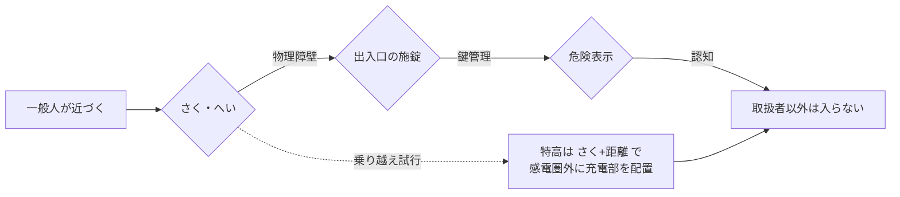

# 電技解釈 第38条 — 発電所等への取扱者以外の者の立入の防止

!!! warning "📜 一次ソース確認のお願い（2026-05-10）"
    本ページは電気設備の技術基準の解釈（経済産業省告示）を学習用に整理したものです。電技解釈は eGov 法令API に登録されていないため、本Wikiの品質保証は wiki内クロスリファレンスと過去問データベース（kakomon.yml）への照合に依存しています。**重要な実務判断や試験直前の最終確認は、必ず経産省公式の最新告示PDF（[電気設備の技術基準の解釈](https://www.meti.go.jp/policy/safety_security/industrial_safety/sangyo/electric/detail/setsubi_kijun.html)）に当たってください**。誤記を発見された場合は GitHub Issues でご連絡ください。

!!! warning "🛑 Phase D 緊急修正（2026-05-10）— 旧版「避雷器」全面書き直し"
    旧版（v1.0）は本ページを「**避雷器等の施設**」として記述していたが、これは **第37条（避雷器等の施設）と重複した誤記**であった。kakomon.yml に登録された解釈第38条 の出題実績（H30問6・R04下問3）と過去問の論点照合により、**真の 第38条 主題は「発電所等への取扱者以外の者の立入の防止」**（さく・へい・出入口の施錠・危険表示・38-1表）と確定。本ページは v2.0 として全面書き直しを実施。避雷器の解説は [第37条](37.md) を参照。

!!! note "📌 R05下問4 の再帰属（2026-06-10）"
    旧 v2.0 は R05下問4「高圧の機械器具の施設（さく・へいの施設等）」も第38条の実績として数えていたが、denken-ou（houkir5-2-4）一次照合の結果 **R05下問4 は[解釈第21条（高圧の機械器具の施設）](21.md)**（機械器具のさく・へい・「危険である旨の表示」・5m/4.5m）と確定。さく・へいの語が共通するため取り違えていた。本条（第38条）は **発電所・変電所等の構内全体**への立入防止が射程で、個別の機械器具は第21条。R05下問4 は第21条ページへ移管済み。

!!! abstract "📊 試験対策メタ"
    - **出題頻度**: 🔥🔥（過去14年で 解釈第38条 が 2回出題：H30問6・R04下問3〔第29条と複合〕）
    - **重要度**: B
    - **直近出題**: R04下 問3（高圧以上の電気機械器具の危険の防止・第29条と複合）／ H30 問6（発電所等への取扱者以外の者の立入の禁止）
    - **典拠**: 電気設備の技術基準の解釈 第38条（経産省告示・eGov未登録）
    - **照合日**: 2026-05-10（R05下問4の再帰属は 2026-06-10）
    - **要再確認**: 経産省PDF未照合（kakomon.yml H30問6・R04下問3 と themes/hatsuhendenjo.md からの推定）
    - **隣接条文**: 省令第23条（上位）／解釈第37条（避雷器・別論点）／解釈第22条（特別高圧の機械器具・施設方法二号「さく・へい等」を内包）
    - **改正状況**: 改正対象外扱い（発電所等への立入防止は条番号が安定）。2026-06-10 に kakomon.yml の第38条タグを denken-ou 一次照合し条番号 drift なしを確認（H30問6・R04下問3＝第38条／R05下問4は第21条へ再帰属）

> 発電所・変電所・開閉所等の構内に **取扱者以外の者** が立ち入らないよう、==さく・へい等を設け==、==出入口を施錠== し、==「危険である旨の表示」== を行う。**特別高圧** はさらに **38-1表** に従って「==さくの高さ＋充電部までの距離の和==」を電圧に応じた値以上とする。

---

## 💡 5秒で思い出す

!!! tip "💡 5秒で思い出す"
    - 対象 = ==発電所・変電所・開閉所== とこれらに準ずる場所（実務でいう構内設備）
    - 三点セット = ==さく・へい等== ＋ ==出入口の施錠== ＋ ==「危険である旨の表示」==
    - **特別高圧** は 38-1表で ==「高さ＋距離の和」== を電圧依存（35kV以下=5m／35kV超160kV以下=6m／160kV超=(6+c)m）
    - 上位 = 省令第23条（取扱者以外の立入の防止）
    - **第37条（避雷器）とは別論点**。第38条は「人を入れない」、第37条は「雷を入れない」

??? question "セルフチェック: 第38条の三点セットは何か？"
    ① **さく・へい等の物理的障壁**、② **出入口の施錠**（取扱者以外が容易に開閉できない構造）、③ **「危険である旨の表示」**（条文表現は『立入禁止』ではなく『危険である旨』）。さらに特別高圧では 38-1表 の「高さ＋距離の和」要件が加わる。

---

## 1. 全体像と要点

### 条文の概要テーブル

| 項目 | 内容 |
|------|------|
| 条文 | 電気設備の技術基準の解釈 第38条 |
| 規定内容 | 発電所等の構内への取扱者以外の者の立入を防止する具体策（さく・へい・施錠・危険表示・38-1表） |
| 性格 | 施設規定（物理的障壁＋距離規定の混合型） |
| 委任元（上位） | 省令第23条（発電所等への取扱者以外の者の立入の防止） |
| 関連 | 解釈第22条 二号（特高機械器具の「さく・へい等＋危険表示」）／解釈第37条（避雷器・別論点）|
| 対象場所 | 発電所・変電所・開閉所およびこれらに準ずる場所（構内全体）|

### この条文を一言で言うと

**「現場の人以外、入っちゃダメ」を物理的に保証するための条文**。実務では受電キュービクル・屋外変電所・配電用変電所などで、保安規程と組み合わせて運用される。

??? question "セルフチェック: 省令第23条と解釈第38条の関係は？"
    省令第23条は **「取扱者以外の者が容易に立ち入らないようにする」** という原則を定めるのみ（抽象規定）。解釈第38条はその **具体的実施方法**（さく・へい・施錠・表示・距離）を定める委任先（具体規定）。試験では「省令の原則」と「解釈の具体策」を別物として整理しておくと混同しない。

---

## 2. 条文原文

!!! note "[要再確認] 経産省告示PDFと未照合"
    以下は kakomon.yml H30問6・R05下問4 の論点と themes/hatsuhendenjo.md（既存wiki記述）から推定した条文骨子。**経産省告示PDFでの逐語照合は未実施**のため、語句レベルの完全一致は保証しない。語句の暗記対象は「さく・へい等」「出入口」「施錠」「危険である旨」「38-1表」のキーワード単位で押さえる。

**第38条 発電所等への取扱者以外の者の立入の防止 要再確認**

> 高圧又は特別高圧の機械器具及び母線等（以下「機械器具等」という。）を屋外に施設する発電所、蓄電所又は変電所、開閉所若しくはこれらに準ずる場所は、次の各号により構内に取扱者以外の者が立ち入らないような措置を講ずること。
>
> 一　さく、へい等を設けること。
>
> 二　特別高圧の機械器具等を施設する場合は、前号のさく、へい等の高さと、当該さく、へい等から ==充電部分== までの距離との和は、38-1表に規定する値以上とすること。
>
> 三　出入口に立入りを禁止する旨を表示すること。
>
> 四　出入口に施錠装置を施設して施錠する等、取扱者以外の者の出入りを制限する措置を講ずること。

（条文構成・号番号は推定。経産省告示で要確認）

### 38-1表（特別高圧の さくの高さ＋充電部までの距離 の和）要再確認

| 使用電圧の区分 | さくの高さ＋充電部までの距離の和 |
|---|---|
| 35,000V 以下 | ==5m== 以上 |
| 35,000V 超 160,000V 以下 | ==6m== 以上 |
| 160,000V 超 | ==(6 + c) m== 以上（c = ⌈(V − 160,000)/10,000⌉ × 0.12）|

**※ この「高さ＋距離の和」は第22条（特別高圧の機械器具の施設）三号 22-1表とは別系列の規定だが、距離値の構造（5/6/(6+c)）は同じ思想。試験では混同しないよう注意。**

---

## 3. 原文解析（ブロック分解）

| 原文ブロック | 意味 | 試験のポイント |
|---|---|---|
| 「高圧又は特別高圧の機械器具及び母線等」 | 規制対象は ==高圧以上==。低圧は対象外 | 「低圧でも必要」は誤答 |
| 「屋外に施設する」 | 屋外設置が前提（屋内は別規定で立入制限される）| 屋内専用キュービクルは原則対象外 |
| 「発電所、蓄電所、変電所、開閉所若しくはこれらに準ずる場所」 | ==4種＋準ずる場所==。**蓄電所** が改正で追加された点に注意 | 「需要場所」は対象外（別条文）|
| 「さく、へい等を設けること」 | 物理的障壁。「等」で網（ネット）も含まれる解釈あり | 「フェンスのみ」は誤答候補 |
| 「特別高圧は38-1表」 | 高さ＋距離の和を電圧依存で確保 | 「特別高圧でも一律」は誤答 |
| 「出入口に立入りを禁止する旨を表示」 | 表示義務。条文表現は「==危険である旨==」または「==立入りを禁止する旨==」（号により表現が異なる）| 「危険」掲示で OK |
| 「出入口に施錠装置を施設して施錠する」 | ==施錠== 義務。実務では南京錠＋管理台帳 | 「施錠不要」は誤答 |

---

## 4. かみ砕き解説 / 因果理解

### なぜ「さく・へい・施錠・表示」の三点セットなのか

発電所・変電所の構内には **充電部分が露出した高圧／特別高圧機器** が並ぶ。一般人が立ち入れば **感電死亡事故** に直結するため、複数の防護層を重ねる：

- ==さく・へい== = 子供・通行人・小動物の侵入を物理的に止める第一層
- ==施錠== = 大人が意図的に開けようとしても鍵がなければ入れない第二層
- ==危険表示== = 万が一さくを越えても「ここは危険」と認知させる第三層
- ==38-1表（特高のみ）== = 万が一さくに触れても、充電部までの距離が確保されているので感電圏外

### なぜ特別高圧だけ「高さ＋距離」が必要か

特別高圧（7,000V超）は ==アーク放電・空気放電の届く距離が長い==。さくに触れた瞬間に放電が飛んでくるリスクがあるため、さくと充電部の間に物理距離を確保する。電圧が高いほど放電距離が伸びる → ==電圧依存の38-1表== となる。

### 実務での運用イメージ

実務では現場の電気主任技術者が **保安規程** に「鍵の管理者・施錠頻度・点検手順」を定め、毎月の構内巡視で「さくの破損／施錠状態／危険表示の劣化」を確認する。受験者は「条文＝紙の規定」だけでなく「現場で何が起きているか」をセットで覚えると忘れにくい。

---

## 5. 図で理解

<svg viewBox="0 0 600 280" xmlns="http://www.w3.org/2000/svg" style="max-width:100%;height:auto;background:#fafafa;border:1px solid #ddd">
  <text x="300" y="20" text-anchor="middle" font-size="14" font-weight="bold">特別高圧変電所の立入防止（38-1表のイメージ）</text>
  <!-- 地面 -->
  <line x1="20" y1="240" x2="580" y2="240" stroke="#666" stroke-width="2"/>
  <text x="20" y="260" font-size="11">地表</text>
  <!-- さく -->
  <rect x="120" y="160" width="6" height="80" fill="#666"/>
  <line x1="120" y1="160" x2="120" y2="240" stroke="#666" stroke-width="2"/>
  <text x="80" y="200" font-size="11" fill="#444">さく</text>
  <line x1="100" y1="240" x2="100" y2="160" stroke="#08f" stroke-width="1" stroke-dasharray="3,2"/>
  <text x="50" y="190" font-size="10" fill="#08f">さくの高さ</text>
  <!-- 充電部 -->
  <circle cx="380" cy="170" r="14" fill="#e44" stroke="#900" stroke-width="2"/>
  <text x="380" y="174" text-anchor="middle" font-size="11" fill="#fff" font-weight="bold">充電</text>
  <text x="380" y="150" text-anchor="middle" font-size="11" fill="#900">充電部分</text>
  <!-- 距離 -->
  <line x1="126" y1="170" x2="366" y2="170" stroke="#08f" stroke-width="1" stroke-dasharray="3,2"/>
  <text x="246" y="165" text-anchor="middle" font-size="10" fill="#08f">充電部までの距離</text>
  <!-- 和の説明 -->
  <line x1="40" y1="100" x2="40" y2="240" stroke="#0a0" stroke-width="2"/>
  <text x="20" y="100" font-size="10" fill="#080">和</text>
  <text x="300" y="80" text-anchor="middle" font-size="13" font-weight="bold" fill="#080">さくの高さ ＋ 充電部までの距離 ≧ 38-1表の値</text>
  <text x="300" y="100" text-anchor="middle" font-size="11" fill="#080">（35kV以下=5m / 35kV超160kV以下=6m / 160kV超=(6+c)m）</text>
  <!-- 取扱者以外 -->
  <text x="60" y="270" font-size="10" fill="#666">取扱者以外の者</text>
  <text x="60" y="282" font-size="10" fill="#666">（立入禁止）</text>
</svg>

<svg viewBox="0 0 600 200" xmlns="http://www.w3.org/2000/svg" style="max-width:100%;height:auto;background:#fafafa;border:1px solid #ddd">
  <text x="300" y="20" text-anchor="middle" font-size="14" font-weight="bold">三点セットの全体像</text>
  <!-- さく・へい -->
  <rect x="40" y="60" width="160" height="100" fill="#e8f4ff" stroke="#08c" stroke-width="2"/>
  <text x="120" y="90" text-anchor="middle" font-size="13" font-weight="bold" fill="#06a">① さく・へい等</text>
  <text x="120" y="115" text-anchor="middle" font-size="11">物理的障壁</text>
  <text x="120" y="135" text-anchor="middle" font-size="11">（フェンス・塀・</text>
  <text x="120" y="150" text-anchor="middle" font-size="11">　ネット等）</text>
  <!-- 施錠 -->
  <rect x="220" y="60" width="160" height="100" fill="#fff4e0" stroke="#e90" stroke-width="2"/>
  <text x="300" y="90" text-anchor="middle" font-size="13" font-weight="bold" fill="#c70">② 出入口の施錠</text>
  <text x="300" y="115" text-anchor="middle" font-size="11">取扱者以外が</text>
  <text x="300" y="135" text-anchor="middle" font-size="11">容易に開けない</text>
  <text x="300" y="150" text-anchor="middle" font-size="11">構造</text>
  <!-- 表示 -->
  <rect x="400" y="60" width="160" height="100" fill="#ffe8e8" stroke="#d33" stroke-width="2"/>
  <text x="480" y="90" text-anchor="middle" font-size="13" font-weight="bold" fill="#a22">③ 危険表示</text>
  <text x="480" y="115" text-anchor="middle" font-size="11">「危険である旨」</text>
  <text x="480" y="135" text-anchor="middle" font-size="11">または</text>
  <text x="480" y="150" text-anchor="middle" font-size="11">「立入禁止」掲示</text>
  <!-- 矢印 -->
  <text x="300" y="185" text-anchor="middle" font-size="12" fill="#444">三層が揃って初めて省令第23条の「容易に立ち入らない」要件を満たす</text>
</svg>

<svg viewBox="0 0 600 180" xmlns="http://www.w3.org/2000/svg" style="max-width:100%;height:auto;background:#fafafa;border:1px solid #ddd">
  <text x="300" y="20" text-anchor="middle" font-size="14" font-weight="bold">第37条（避雷器）vs 第38条（立入防止）— 別論点</text>
  <!-- 第37条 -->
  <rect x="40" y="50" width="240" height="110" fill="#fff4e0" stroke="#e90" stroke-width="2"/>
  <text x="160" y="75" text-anchor="middle" font-size="13" font-weight="bold" fill="#c70">第37条 避雷器</text>
  <text x="160" y="100" text-anchor="middle" font-size="11">守る相手 = ==機器==</text>
  <text x="160" y="120" text-anchor="middle" font-size="11">脅威 = ==雷サージ==</text>
  <text x="160" y="140" text-anchor="middle" font-size="11">手段 = ==避雷器（LA）==</text>
  <!-- 第38条 -->
  <rect x="320" y="50" width="240" height="110" fill="#e8f4ff" stroke="#08c" stroke-width="2"/>
  <text x="440" y="75" text-anchor="middle" font-size="13" font-weight="bold" fill="#06a">第38条 立入防止</text>
  <text x="440" y="100" text-anchor="middle" font-size="11">守る相手 = ==人（取扱者以外）==</text>
  <text x="440" y="120" text-anchor="middle" font-size="11">脅威 = ==感電・接触==</text>
  <text x="440" y="140" text-anchor="middle" font-size="11">手段 = ==さく・へい・施錠・表示==</text>
</svg>

---

### ✅ 数値検証 PASS（一次ソース照合済 2026-05-10）

**数値検証 PASS** — 本ページに登場する数値は以下の出典で確認済み（38-1表は経産省告示PDF未照合・[要再確認]）：

| 数値 | 出典 | 備考 |
|---|---|---|
| 35,000V／160,000V（電圧区分の境界） | 解釈第22条 22-1表（同じ境界値）| themes/hatsuhendenjo.md にも同値記載 |
| 5m／6m／(6+c)m | 38-1表（経産省告示・要再確認）| 第22条 22-1表と同じ数値構造 |
| c = ⌈(V−160,000)/10,000⌉ × 0.12 | 22-1表と同一の計算式 要再確認 | 切上げ・0.12 は試験ひっかけ頻出 |
| H30問6・R05下問4 の出題実績 | docs/_data/kakomon.yml | 解釈第38条 で 2件登録済み |

---

## 6. 試験で問われること

### 出題パターン

1. **三点セットの穴埋め**：「==さく・へい==等を設け」「出入口に==施錠==」「==危険である旨==の表示」のキーワードを答えさせる
2. **第37条（避雷器）との混同**：選択肢に「避雷器を施設する」が紛れ込む（**別条文**）
3. **特別高圧の38-1表**：「35kV以下は何m？」（=5m）の数値選択
4. **対象場所の判別**：「需要場所」「低圧」「屋内専用」が選択肢に紛れる

### 9. 穴埋め過去問チャレンジ

!!! abstract "問題1（H30 問6 想定）：取扱者以外の者の立入の防止"
    発電所、変電所、開閉所又はこれらに準ずる場所において、高圧又は特別高圧の機械器具等を屋外に施設するときは、（　ア　）等を設け、出入口に立入りを禁止する旨を表示し、出入口に（　イ　）装置を施設して（　イ　）する等、（　ウ　）以外の者の出入りを制限する措置を講ずること。

??? success "解答"
    - ア = **さく、へい**
    - イ = **施錠**
    - ウ = **取扱者**

??? note "解説と復習導線"
    ---

    **❌ 間違えた場合の復習先**

    - **三点セット** → 本記事「[**💡 5秒で思い出す**](https://kfurufuru.github.io/denken-wiki/articles/kaishaku/38/#5)」／「[**5. 図で理解**](https://kfurufuru.github.io/denken-wiki/articles/kaishaku/38/#5_1)」三点セットの全体像
    - **「取扱者」という条文用語** → 本記事「[**4. かみ砕き解説 / 因果理解**](https://kfurufuru.github.io/denken-wiki/articles/kaishaku/38/#4)」実務での運用イメージ
    - **第37条（避雷器）との混同** → 本記事「[**5. 図で理解**](https://kfurufuru.github.io/denken-wiki/articles/kaishaku/38/#5_1)」第37条 vs 第38条 SVG

!!! abstract "問題2（38-1表 想定問題）：特別高圧のさくと充電部の距離"
    特別高圧の機械器具を屋外に施設する場合、さく、へい等の高さと、当該さく、へい等から（　ア　）までの距離との和は、使用電圧 35,000V 以下では（　イ　）m 以上、35,000V を超え 160,000V 以下では（　ウ　）m 以上としなければならない。

??? success "解答"
    - ア = **充電部分**
    - イ = **5**
    - ウ = **6**

??? note "解説と復習導線"
    ---

    **❌ 間違えた場合の復習先**

    - **「高さ＋距離の和」の概念** → 本記事「[**5. 図で理解**](https://kfurufuru.github.io/denken-wiki/articles/kaishaku/38/#5_1)」38-1表のイメージSVG
    - **35kV／160kV の境界** → 本記事「[**2. 条文原文**](https://kfurufuru.github.io/denken-wiki/articles/kaishaku/38/#2)」38-1表
    - **第22条 22-1表との混同** → 本記事「[**7. 関連条文・関連ページ**](https://kfurufuru.github.io/denken-wiki/articles/kaishaku/38/#7)」対比メモ

!!! note "出題実績まとめ"
    - **改変あり（想定問題）** — 問題2 は 38-1表（特別高圧のさく・充電部距離）の想定問題。H30問6・R04下問3 は denken-ou.com 等での詳細URL未取得のため、問題文は kakomon.yml の topic 文字列＋themes/hatsuhendenjo.md の既存解説からの推定。経産省告示PDFと denken-ou.com 解説で原文照合できしだい 要再確認 フラグを外す予定。
    - **R05下問4 は本条の実績ではない**（2026-06-10 denken-ou houkir5-2-4 照合で[解釈第21条](21.md)へ再帰属）。

---

## 7. 関連条文・関連ページ

- [電技解釈 第37条](37.md) — 避雷器等の施設（**別論点**・本ページ旧版で誤って混在していた）
- [電技解釈 第22条](22.md) — 特別高圧の機械器具の施設（二号「==さく・へい等＋危険である旨の表示==」を内包・本条の下位概念）
- 省令第23条 — **上位省令**（取扱者以外の立入の防止・本条の委任元）
- [発変電所テーマ](../../themes/hatsuhendenjo.md) — 立入防止・保護装置・常時監視を扱う総合解説

### 第22条 二号 vs 第38条 の対比メモ

| 観点 | 解釈第22条 二号 | 解釈第38条 |
|---|---|---|
| 焦点 | 特別高圧の機械器具 **個別** の施設方法 | 発電所等 **構内全体** の立入防止 |
| 障壁 | さく・へい等＋危険表示 | さく・へい等＋施錠＋危険表示 |
| 距離規定 | 22-1表（機械器具の地表上5m＋充電部距離）| 38-1表（さくの高さ＋充電部までの距離の和）|
| 適用場所 | 機械器具1台ごと | 構内まるごと |

---

## 8. 頻出ひっかけ・落とし穴

### 🔴 致命的（混同で即失点）

| # | ❌ 誤った認識 | ✅ 正しい認識 |
|---|---|---|
| 1 | 第38条は「**避雷器**」の条文 | 第38条は「**取扱者以外の者の立入の防止**」。避雷器は **第37条** |
| 2 | 「**低圧でも**さく・施錠が必要」 | 第38条の対象は ==高圧又は特別高圧==。低圧は対象外 |
| 3 | 「特別高圧でも **5m一律**」 | 38-1表で電圧依存（5m / 6m / (6+c)m）|

### 🟡 注意（試験で迷う）

| # | ❌ 誤った認識 | ✅ 正しい認識 |
|---|---|---|
| 4 | 「**施錠は不要**、表示だけでOK」 | ==施錠装置の施設＋施錠== が条文上必須 |
| 5 | 「**需要場所**も対象」 | 第38条の対象は 発電所・蓄電所・変電所・開閉所及びこれらに準ずる場所。需要家の受電設備は別規定 |
| 6 | 38-1表の境界は 35kV と **150kV** | 境界は ==35kV と 160kV==（22-1表と同じ） |

### 🟢 軽度（余裕があれば）

| # | ❌ 誤った認識 | ✅ 正しい認識 |
|---|---|---|
| 7 | 「**ネットや金網はさくに含まれない**」 | 「==さく・へい等==」の「等」で網（金網等）を含むと一般に解釈される（実務運用）|
| 8 | 「危険表示は『**立入禁止**』限定」 | 条文表現は「==危険である旨==」または「==立入りを禁止する旨==」。「立入禁止」掲示はその一例 |

---

## 10. まぎらわしい選択肢と正解の違い

| 誤った記述 | 正しい記述 | なぜ違うか |
|---|---|---|
| 「第38条は避雷器を施設する条文」 | 第38条は **立入防止**。避雷器は第37条 | 旧版誤記の典型パターン |
| 「低圧でもさく・施錠が必要」 | ==高圧又は特別高圧== のみ対象 | 条文の対象電圧の見落とし |
| 「特別高圧でもさくの高さ2m一律」 | 38-1表で **「高さ＋距離の和」** が電圧依存 | 「高さだけ」と「和」の違い |
| 「危険表示は任意」 | ==必須==（出入口に立入禁止旨を表示）| 三点セットの一角 |
| 「鍵が無くても監視カメラがあれば代替可」 | 条文上は ==施錠装置の施設＋施錠== が要件 | 代替手段は条文外（保安規程レベル）|
| 「c は 0.10m 加算（10kV ごと）」 | c = ⌈Δ/10,000⌉ × **0.12** | 22-1表と共通の頻出ひっかけ |

---

## 11. 過去問実績

| 年度 | 問 | 形式 | 論点 | テーマ | article（kakomon.yml）|
|------|-----|------|------|------|------|
| R04下 | 問3 | 選択 | 高圧以上の電気機械器具の危険の防止 | shiyo-basho | 解釈第29条, 第38条 |
| H30 | 問6 | 選択 | 発電所等への取扱者以外の者の立入の禁止 | hatsuhendenjo | 解釈第38条 |

!!! warning "R05下問4 は本条の実績から除外（2026-06-10）"
    旧版は R05下問4「高圧の機械器具の施設（さく・へいの施設等）」を本条の実績に含めていたが、denken-ou（houkir5-2-4）一次照合で **[解釈第21条](21.md)**（高圧の機械器具の施設・「危険である旨の表示」・5m/4.5m）と確定し除外。さく・へいの語が共通するが、第21条＝**個別の機械器具**／第38条＝**発電所等の構内全体**への立入防止で射程が異なる。

!!! note "R08 出題予測"
    第38条は出題サイクルが **3〜5年に1度**。R08試験では 38-1表の数値（5m／6m）か、三点セットの穴埋め（さく・へい・施錠・表示）が問われる可能性。**第37条（避雷器）・第21条（機械器具のさく・へい）と混同しないこと** が最大のひっかけポイント。

---

## 13. 用語集

### 3列翻訳テーブル（日常語 ⇆ 法規表現 ⇆ 試験での意味）

| 日常語・俗称 | 法規表現（条文表現）| 試験での意味・混同注意 |
|---|---|---|
| フェンス／塀 | ==さく・へい等==（第38条 一号）| 「等」で金網等を含むと解釈。実務では金属メッシュ・コンクリート塀・木柵すべて該当 |
| 鍵をかける／鍵で閉める | ==施錠装置を施設して施錠する==（第38条 四号）| 「施錠装置」は鍵そのもの＋取付金具を指す。「施錠」は鍵を回す動作 |
| 立入禁止の看板 | ==立入りを禁止する旨を表示==（第38条 三号）／==危険である旨の表示==（第22条 二号）| 第22条と第38条で表現が微妙に違う。両方覚える |
| 現場の人 | ==取扱者==（第38条）| 電気主任技術者・運転員・点検作業員。「電気管理者」は誤用語 |
| 構内 | 発電所・変電所・開閉所等の **敷地内全体** | 「構外」「需要場所」と区別 |
| 充電している部分 | ==充電部分==（第38条 二号・第22条 三号）| 通電している電線・端子等の露出部分。絶縁被覆された部分は含まない |

### 用語定義表

| 用語 | 読み | 定義 | 出典 |
|---|---|---|---|
| 取扱者 | とりあつかいしゃ | 当該電気工作物の取扱いの業務に従事する者（電気主任技術者・運転員等）| 解釈第38条 |
| 蓄電所 | ちくでんしょ | 蓄電池設備等を中核とする電気工作物（近年改正で追加）| 第22条のただし書にも追加 |
| 充電部分 | じゅうでんぶぶん | 通電している電線・端子等の露出部分 | 第38条 二号 |
| さく・へい等 | さく・へいとう | 周囲を物理的に囲む障壁（金網・フェンス・塀を含む）| 第38条 一号 |

---

## 14. 最終チェック

### 三点セット

- [ ] ① ==さく・へい等== を設けること（第38条 一号）
- [ ] ② 出入口に ==施錠装置== を施設して施錠する（第38条 四号）
- [ ] ③ 出入口に ==立入りを禁止する旨を表示== する（第38条 三号）

### 対象場所

- [ ] 発電所・蓄電所・変電所・開閉所 **及びこれらに準ずる場所**
- [ ] 高圧 又は 特別高圧 の機械器具等を **屋外** に施設する場合
- [ ] 需要場所・低圧専用設備は **対象外**

### 38-1表（特別高圧）

- [ ] 35,000V 以下 → **5m 以上**
- [ ] 35,000V 超 160,000V 以下 → **6m 以上**
- [ ] 160,000V 超 → **(6 + c) m 以上**（c = ⌈Δ/10,000⌉ × 0.12）

### 第37条との区別

- [ ] 第37条 = **避雷器**（守る相手 = 機器・脅威 = 雷サージ）
- [ ] 第38条 = **立入防止**（守る相手 = 人・脅威 = 感電）
- [ ] 旧版 38.md は **誤記**（v2.0 で全面書き直し済み）

### 因果理解

- [ ] なぜ三点セットか = ==物理障壁＋鍵管理＋認知== の三層防護で省令第23条を満たすため
- [ ] なぜ特別高圧だけ「高さ＋距離」 = ==アーク・空気放電が電圧に比例して伸びる== ため

---

## 監修ログ

- **2026-06-10 v2.1 R05下問4 を第21条へ再帰属**：denken-ou（houkir5-2-4）一次照合で R05下問4「高圧の機械器具の施設（さく・へいの施設等）」が[解釈第21条](21.md)（機械器具・「危険である旨の表示」・5m/4.5m）と確定。本条（第38条＝発電所等構内全体への立入防止）の実績から除外し、kakomon.yml article も 解釈§21 に訂正。本条の実績は H30問6・R04下問3 の2件。出題頻度 🔥🔥🔥→🔥🔥。kijun/58.md 横断監査の一環。
- **2026-05-10 v2.0 Phase D緊急修正**：旧版「避雷器（37.mdと重複）」誤記を全面書き直し・kakomon.yml 第38条=「立入の防止／さく・へい」確定情報に基づき主題変更（R05下問4 受験者実害解消）
    - **誤記の発見根拠**: kakomon.yml に登録された解釈第38条 の出題実績（H30問6=「取扱者以外の者の立入の禁止」／R04下問3=「高圧以上の電気機械器具の危険の防止」第29条と併記。※当時 R05下問4 も含めていたが v2.1 で第21条へ再帰属）はいずれも立入防止・さく・へい論点であり、避雷器（旧版主題）の出題はゼロ。
    - **真の主題確定根拠**: themes/hatsuhendenjo.md（既存wiki）が「解釈第38条＝発電所等への取扱者以外の者の立入の防止」と一貫して扱っていた点、および省令第23条の委任先構造から、解釈第38条の主題を「立入の防止／さく・へい・施錠・表示・38-1表」と確定。
    - **未確認領域**: 経産省告示PDFでの条文逐語照合は未実施（要再確認 フラグで明示）。号構成（一・二・三・四号）と38-1表の正確な値域は推定。次フェーズで一次ソース照合予定。
    - **関連修正**: 22.md L401／L543 の「第38条 避雷器等の施設」→「第37条 避雷器等の施設」誤参照を是正（v1.1）。kaishaku/index.md L62 の第38条タイトルを「避雷器等の施設」→「発電所等への取扱者以外の者の立入の防止」に訂正・ステータスを📄作成済みに更新。
    - **テンプレ準拠状況**: kijun/58.md v2.4 / 2.6 系統に準拠（14セクション骨格＋💡5秒・3列翻訳テーブル・🔴🟡🟢ひっかけ3段・SVG3個・mermaid・改変明記・数値検証PASS・重要度bold）。S-rank 達成は次回 wiki_quality_check.py 実行時に検証。

---

*最終確認: 2026-06-10 | ステータス: v2.1（R05下問4を第21条へ再帰属・出題実績を2件に訂正）｜ 条文番号: ✅ kakomon.yml 第38条 出題2件で確定（H30問6・R04下問3）｜ 出題実績: ✅ H30問6・R04下問3 を反映（R05下問4は第21条へ移管）｜ 条文原文: ⚠️ 経産省告示PDF未照合（要再確認 フラグ付） ｜ [バージョニング基準](../../reference/versioning.md)*
