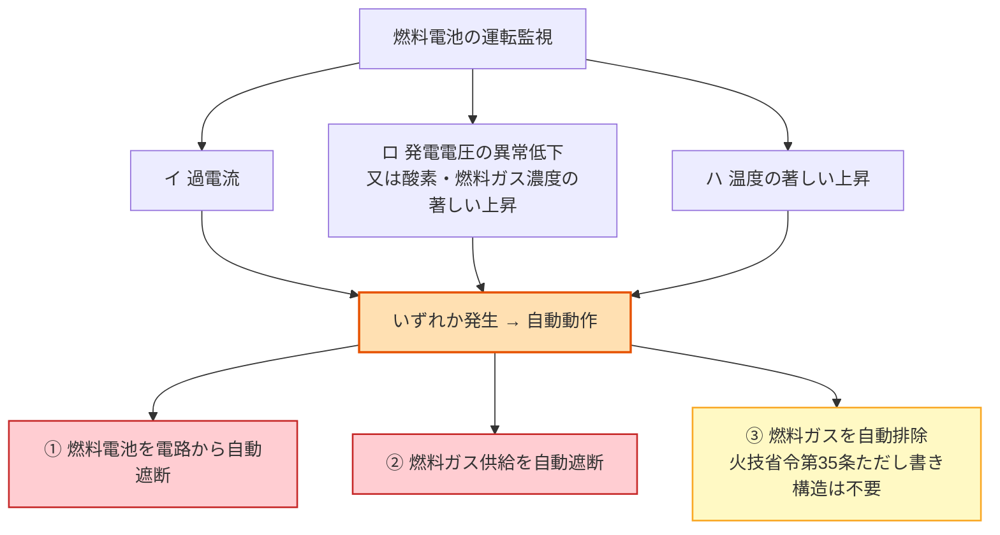

# 電技解釈 第45条 — 燃料電池等の施設

!!! warning "一次ソース確認のお願い"
    本ページは電気設備の技術基準の解釈（経済産業省告示）を学習用に整理したものです。電技解釈は e-Gov 法令検索に登録されていないため、本Wikiの品質保証は経産省告示原文キャッシュ＋過去問データベースへの照合に依存しています。**重要な実務判断や試験直前の最終確認は、必ず経産省公式の最新告示PDF（[電気設備の技術基準の解釈](https://www.meti.go.jp/policy/safety_security/industrial_safety/sangyo/electric/detail/setsubi_kijun.html)）に当たってください**。

!!! note "📊 概要"
    **出題頻度**: ─（第45条として現過去問DB（kakomon.yml・H23〜R07下）に登録ゼロ）

    **重要度**: C（出題実績が希少。施設方法の理解が中心で試験直結度は低い）

    **直近出題**: なし

    **価値訴求**: 第45条は **[第200条第1項](200.md)（小規模燃料電池発電設備＝エネファーム等）の準用元** です。第200条第1項は「第45条の規定に準じて施設」と委任しており、エネファームなど身近な燃料電池の施設基準の **大本**がこの第45条にあたります。

> 第45条は **燃料電池発電所** に施設する燃料電池・電線・開閉器その他器具の施設方法を定める。核心は、異常時に **3つの条件**（過電流・発電電圧の異常低下や酸素／燃料ガス濃度の上昇・温度の異常上昇）のいずれかが生じたら、**3つの動作**（電路の自動遮断＋燃料ガス供給の自動遮断＋燃料ガスの自動排除）をセットで行う装置を施設すること。可燃ガスの滞留＝火災・爆発を防ぐのが本質。

| 項目 | 内容 |
|------|------|
| 条文 | 電気設備の技術基準の解釈 第45条 |
| 規定内容 | 燃料電池発電所の燃料電池・電線・開閉器等の施設方法 |
| 性格 | 施設規定（保護装置・接続方法を規定。耐電圧の数値規定ではない） |
| 上位（委任元） | 電技省令第4条（損傷防止）・第44条第1項（発電機・燃料電池等の異常時保護） |
| 構成 | 第一号＝異常時の自動遮断・排除装置／第二号＝充電部露出防止／第三号＝直流幹線の過電流遮断器／第四号＝電線接続の堅ろう性 |
| 主な準用先（被準用） | [第200条第1項](200.md)（小規模燃料電池発電設備が「第45条の規定に準じて施設」） |
| 隣接条文 | 第44条（発電機・燃料電池等の保護装置・蓄電池含む）／第47条（常時監視をしない発電所の施設）※いずれも記事未作成 |
| **典拠（一次ソース）** | 電気設備の技術基準の解釈 第45条（経産省告示・e-Gov未登録）— Wayback 経由 経産省告示PDF（平成30年改正版）で逐語照合 |
| **照合日** | 2026-06-13（経産省告示原文で第一号〜第四号を逐語確認） |

---

## 💡 5秒で思い出す

!!! tip "💡 5秒で思い出す（試験直前の最終確認）"
    - 第45条 = **燃料電池等の施設**（燃料電池発電所の燃料電池・電線・開閉器等）
    - 異常時の **3条件**: イ **過電流**／ロ **発電電圧の異常低下** 又は **酸素濃度・燃料ガス濃度の著しい上昇**／ハ **温度の著しい上昇**
    - そのとき行う **3動作**: ① **電路を自動遮断** ② **燃料ガスの供給を自動遮断** ③ **燃料ガスを自動排除**
    - **充電部分は露出させない**（第二号）／**直流幹線の短絡** には **過電流遮断器**（短絡耐量等があれば除外）（第三号）
    - 電線接続は **ねじ止め等で堅ろう・電気的に完全に・張力をかけない**（第四号）
    - 第45条は **[第200条第1項](200.md)** の準用元（小規模燃料電池＝エネファーム等）

??? question "セルフチェック: 燃料電池の異常時に、なぜ電路の遮断だけでなく「燃料ガスの供給遮断」と「燃料ガスの排除」まで要求するのか？"
    燃料電池は **燃料ガス（水素・都市ガス改質ガス等）という可燃物** を扱う。電気を止めても、燃料ガスが供給され続けたり設備内に滞留したままだと、**火災・爆発のリスク** が残る。そこで第一号は、異常検知時に「電路の遮断」に加えて「**ガス供給の元を止める**（供給遮断）」と「**すでに溜まったガスを追い出す**（排除）」までをワンセットで要求する。電気事故を可燃物事故に波及させないための三重の安全措置。

---

## 1. 全体像と要点

- **対象**: **燃料電池発電所** に施設する燃料電池・電線・開閉器その他の器具
- **第一号（異常時保護）**: 次の3つの場合に、**燃料電池を自動的に電路から遮断** し、**燃料ガス供給を自動遮断** するとともに **燃料ガスを自動排除** する装置を施設
    - イ 過電流が生じた場合
    - ロ 発電電圧に異常低下が生じた場合、又は酸素濃度・燃料ガス濃度が著しく上昇した場合
    - ハ 温度が著しく上昇した場合
    - **ただし書き**: 火技省令（発電用火力設備に関する技術基準を定める省令）第35条ただし書きに規定する構造の燃料電池設備は、**ガス排除装置は不要**
- **第二号（感電防止）**: **充電部分が露出しないよう** に施設
- **第三号（短絡保護）**: **直流幹線部分の短絡** に対し **過電流遮断器** を施設（ただし、電路が短絡電流に耐える場合・燃料電池と電力変換装置が1の筐体に収まる構造の場合は除外）
- **第四号（接続の健全性）**: 電線接続は **ねじ止め等で堅ろうに・電気的に完全に・接続点に張力が加わらない** ように施設
- **性格**: 施設方法の規定。耐電圧試験の倍率・時間のような数値規定ではない

??? question "セルフチェック: 第45条と隣の第44条は何が違うのか？"
    第44条は「発電機・燃料電池・蓄電池等の **保護装置**」を広く定める条で、過電流・過電圧・冷却・水位異常などで自動的に電路から遮断する装置を扱います（蓄電池の保護装置はこちらで H28問5 に出題実績あり）。第45条は、その中でも **燃料電池発電所の燃料電池・電線・開閉器の施設方法** に絞り、可燃ガス特有の「ガス供給遮断・ガス排除」や充電部露出防止・直流幹線の短絡保護・接続の堅ろう性まで具体化します。第44条＝保護装置の一般則、第45条＝燃料電池の施設の具体、という関係で理解します。

---

## 2. 条文原文

??? note "📜 条文原文 — 経済産業省告示「電気設備の技術基準の解釈」第45条（逐語）"
    本ブロックは Wayback 経由の経済産業省告示PDF（平成30年改正版・2026-06-13照合）からの逐語転記です。要約・解説は折り畳みの外（本文）に分離しています。

    **【燃料電池等の施設】（省令第4条、第44条第1項）**

    > **第45条** 燃料電池発電所に施設する燃料電池、電線及び開閉器その他器具は、次の各号によること。
    >
    > 一 燃料電池には、次に掲げる場合に燃料電池を自動的に電路から遮断し、また、燃料電池内の燃料ガスの供給を自動的に遮断するとともに、燃料電池内の燃料ガスを自動的に排除する装置を施設すること。ただし、発電用火力設備に関する技術基準を定める省令（平成9年通商産業省令第51号）第35条ただし書きに規定する構造を有する燃料電池設備については、燃料電池内の燃料ガスを自動的に排除する装置を施設することを要しない。
    >
    > 　イ 燃料電池に過電流が生じた場合
    >
    > 　ロ 発電要素の発電電圧に異常低下が生じた場合、又は燃料ガス出口における酸素濃度若しくは空気出口における燃料ガス濃度が著しく上昇した場合
    >
    > 　ハ 燃料電池の温度が著しく上昇した場合
    >
    > 二 充電部分が露出しないように施設すること。
    >
    > 三 直流幹線部分の電路に短絡を生じた場合に、当該電路を保護する過電流遮断器を施設すること。ただし、次のいずれかの場合は、この限りでない。（関連省令第14条）
    >
    > 　イ 電路が短絡電流に耐えるものである場合
    >
    > 　ロ 燃料電池と電力変換装置とが1の筐体に収められた構造のものである場合
    >
    > 四 燃料電池及び開閉器その他の器具に電線を接続する場合は、ねじ止めその他の方法により、堅ろうに接続するとともに、電気的に完全に接続し、接続点に張力が加わらないように施設すること。（関連省令第7条）

    （マーカー凡例: 本ページは現過去問DBに出題ゼロのため、==マーカー== は使用していません。試験頻出語は本文中で **太字** により強調しています。）

**要約（教育目的・原文は上の折り畳み）**: 燃料電池発電所では、（一）過電流・発電電圧の異常低下や酸素／燃料ガス濃度の上昇・温度の著しい上昇のいずれかで「電路遮断＋燃料ガス供給遮断＋燃料ガス排除」を自動で行う装置を施設（火技省令第35条ただし書き構造はガス排除装置不要）、（二）充電部を露出させない、（三）直流幹線の短絡には過電流遮断器（短絡耐量がある・パワコン一体構造なら除外）、（四）電線接続は堅ろうかつ電気的に完全に・張力をかけない、と定める。

---

## 3. 原文解析（ブロック分解）

| 原文ブロック | 意味 | 試験のポイント |
|---|---|---|
| 「燃料電池を自動的に電路から遮断し、…燃料ガスの供給を自動的に遮断…燃料ガスを自動的に排除」 | 異常時の **3動作セット**（電路遮断＋供給遮断＋排除） | 電気だけでなく **ガスも止め、さらに追い出す** のが核心 |
| 「イ 過電流が生じた場合」 | 異常条件① 過電流 | 3条件のひとつ |
| 「ロ 発電電圧に異常低下…又は酸素濃度若しくは…燃料ガス濃度が著しく上昇」 | 異常条件② 発電電圧の異常低下／酸素・燃料ガス濃度の上昇 | 「又は」で並ぶ複数事象を1つの号にまとめている |
| 「ハ 温度が著しく上昇した場合」 | 異常条件③ 温度の著しい上昇 | 3条件のひとつ |
| 「ただし、…火技省令第35条ただし書き…構造…ガスを自動的に排除する装置を…要しない」 | **排除装置の例外** | 例外で外れるのは「排除装置」のみ（遮断・供給遮断は残る） |
| 「充電部分が露出しないように施設」 | 感電防止（第二号） | 直流の発電源ゆえ重要 |
| 「直流幹線部分の電路に短絡…過電流遮断器…ただし…」 | 直流幹線の短絡保護（第三号） | **ただし書き**（短絡耐量／パワコン一体）で除外あり |
| 「ねじ止め…堅ろうに…電気的に完全に…張力が加わらない」 | 接続の機械的・電気的健全性（第四号） | 接続部の堅ろう性・張力禁止 |

---

## 4. かみ砕き解説（因果理解）

### なぜ「電路遮断・ガス供給遮断・ガス排除」の3点セットなのか

燃料電池は **燃料ガスを電気化学反応で電気に変換** する。トラブル時に怖いのは感電よりも **可燃ガスの滞留による火災・爆発**。そこで第一号は段階を分けて止める。

1. **電路を自動遮断** … 電気側の事故拡大を止める（過電流・地絡等）。
2. **燃料ガスの供給を自動遮断** … ガスの **元栓を閉める**。新たなガスが入ってこないようにする。
3. **燃料ガスを自動排除** … すでに **設備内に溜まったガスを追い出す**。滞留＝爆発リスクを除く。

この「入口を止めて、中身も追い出す」という二段構えが燃料電池固有の安全設計。なお火技省令第35条ただし書きに規定する構造（そもそもガスが滞留しにくい構造）を持つ設備では、③のガス排除装置は省略できる。

### 異常を検知する「3条件」の意味

- **イ 過電流** … 電気的な過負荷・短絡の兆候。
- **ロ 発電電圧の異常低下／酸素・燃料ガス濃度の上昇** … 発電要素（セル）の劣化・破損や、ガスの異常な混入を示す。酸素出口に燃料ガスが、空気出口に燃料ガスが回り込むのは内部リーク＝危険信号。
- **ハ 温度の著しい上昇** … 反応の暴走・冷却不良。火災の前兆。

これらは「電気の異常」だけでなく「**化学反応・ガスの異常**」まで監視対象に含めている点が、火力・水力の発電機保護と異なる。

### なぜ直流幹線に過電流遮断器なのか

燃料電池は **直流** を出力する。直流幹線部分で短絡が起きると大電流が流れ、電路・機器を損傷する。そこで第三号は短絡保護の過電流遮断器を要求する。ただし、電路自体が **短絡電流に耐える** 場合や、**燃料電池と電力変換装置（パワコン）が1の筐体** に収まり外部に危険な直流幹線が露出しない構造なら、個別の過電流遮断器は不要（ただし書き）。

---

## 5. 図で理解

### 異常時の「3条件 → 3動作」（第一号）

**読み解き**: 左の **3条件**（イ・ロ・ハ）のいずれかが成立したら、右の **3動作**（電路遮断・供給遮断・排除）を自動で行う。③のガス排除のみ、火技省令第35条ただし書き構造では省略可。

### 燃料電池発電所の施設イメージ（第一号〜第四号）

<svg viewBox="0 0 780 290" xmlns="http://www.w3.org/2000/svg" width="100%" preserveAspectRatio="xMidYMid meet">
<defs>
<filter id="sh45fc" x="-20%" y="-20%" width="140%" height="140%"><feDropShadow dx="0" dy="2" stdDeviation="2" flood-opacity="0.15"/></filter>
<marker id="arr45" markerWidth="10" markerHeight="10" refX="9" refY="3" orient="auto"><path d="M0,0 L0,6 L9,3 z" fill="#424242"/></marker>
</defs>
<text x="390" y="24" text-anchor="middle" font-size="15" font-weight="700" fill="#212121">燃料電池発電所の施設（第45条）</text>
<text x="390" y="42" text-anchor="middle" font-size="11" fill="#666">異常時の遮断・ガス供給遮断・ガス排除／充電部露出防止／直流幹線の過電流遮断器</text>
<rect x="40" y="80" width="150" height="110" rx="10" fill="#ffe0b2" stroke="#e65100" stroke-width="2.5" filter="url(#sh45fc)"/>
<text x="115" y="112" text-anchor="middle" font-size="12" font-weight="700" fill="#e65100">燃料電池</text>
<text x="115" y="134" text-anchor="middle" font-size="10" fill="#e65100">直流出力</text>
<text x="115" y="154" text-anchor="middle" font-size="9" fill="#666">充電部は露出禁止</text>
<text x="115" y="172" text-anchor="middle" font-size="9" fill="#666">（第二号）</text>
<line x1="190" y1="120" x2="270" y2="120" stroke="#424242" stroke-width="2" marker-end="url(#arr45)"/>
<rect x="270" y="92" width="90" height="56" rx="8" fill="#ffebee" stroke="#c62828" stroke-width="2.5" filter="url(#sh45fc)"/>
<text x="315" y="114" text-anchor="middle" font-size="10" font-weight="700" fill="#b71c1c">過電流遮断器</text>
<text x="315" y="132" text-anchor="middle" font-size="9" fill="#b71c1c">直流幹線の短絡保護</text>
<text x="315" y="166" text-anchor="middle" font-size="9" fill="#c62828">第三号（除外あり）</text>
<line x1="360" y1="120" x2="440" y2="120" stroke="#424242" stroke-width="2" marker-end="url(#arr45)"/>
<rect x="440" y="92" width="110" height="56" rx="8" fill="#e3f2fd" stroke="#1565c0" stroke-width="2" filter="url(#sh45fc)"/>
<text x="495" y="116" text-anchor="middle" font-size="11" font-weight="700" fill="#0d47a1">電力変換装置</text>
<text x="495" y="134" text-anchor="middle" font-size="9" fill="#1565c0">（パワコン）</text>
<text x="495" y="166" text-anchor="middle" font-size="9" fill="#1565c0">一体構造なら遮断器除外</text>
<line x1="550" y1="120" x2="630" y2="120" stroke="#424242" stroke-width="2" marker-end="url(#arr45)"/>
<rect x="630" y="92" width="110" height="56" rx="8" fill="#f1f8e9" stroke="#558b2f" stroke-width="2" filter="url(#sh45fc)"/>
<text x="685" y="124" text-anchor="middle" font-size="11" font-weight="700" fill="#33691e">交流電路へ</text>
<rect x="40" y="210" width="700" height="62" rx="8" fill="#fff3e0" stroke="#e65100" stroke-width="1.5"/>
<text x="390" y="232" text-anchor="middle" font-size="11" fill="#e65100" font-weight="700">異常時（過電流／発電電圧の異常低下・酸素・燃料ガス濃度の上昇／温度の著しい上昇）</text>
<text x="390" y="252" text-anchor="middle" font-size="10" fill="#bf360c">① 電路を自動遮断　② 燃料ガス供給を自動遮断　③ 燃料ガスを自動排除（第一号）</text>
<text x="390" y="268" text-anchor="middle" font-size="9" fill="#8d6e63">電線接続はねじ止め等で堅ろう・電気的に完全に・接続点に張力をかけない（第四号）</text>
</svg>

**読み解き**: 燃料電池（直流）→ 直流幹線の過電流遮断器 → 電力変換装置（パワコン）→ 交流電路、という動線。充電部は露出させず、異常時には下段の3動作を自動で行う。

---

## 6. 試験で問われること

- **3動作セットの内容**: 「電路遮断だけでよいか」のひっかけ。正しくは電路遮断＋ガス供給遮断＋ガス排除。
- **3条件の内容**: 過電流・発電電圧の異常低下／酸素・燃料ガス濃度の上昇・温度の著しい上昇。
- **除外条件**: 火技省令第35条ただし書き構造はガス排除装置不要／直流幹線の過電流遮断器は短絡耐量・パワコン一体で除外。
- **第200条第1項との関係**: 小規模燃料電池は第45条を準用し、さらに地絡時の電路遮断＋燃料ガス供給遮断が追加される。

### 穴埋め過去問チャレンジ（教育目的・改変あり再構成）

!!! abstract "穴埋め例題（第45条第一号の条文文言・教育目的の再構成）"
    燃料電池発電所に施設する燃料電池には、過電流が生じた場合、発電電圧に異常低下が生じた場合等に、燃料電池を自動的に電路から（　ア　）し、また、燃料電池内の燃料ガスの供給を自動的に（　イ　）するとともに、燃料電池内の燃料ガスを自動的に（　ウ　）する装置を施設すること。

    （第45条そのものは現過去問DB（H23〜R07下）に出題実績がないため、本例題は条文文言を穴埋め化した **教育目的の再構成** です。）

??? success "解答を見る"
    - ア = **遮断**（電路から自動的に遮断）
    - イ = **遮断**（燃料ガスの供給を自動遮断）
    - ウ = **排除**（燃料ガスを自動排除）

    **改変あり**（第45条第一号の条文を穴埋め化した教育目的の再構成。実出題そのものの逐語ではありません）。「遮断・遮断・排除」の3動作セットが核心です。

### ✅ 数値検証 PASS（一次ソース照合済 2026-06-13）

**数値検証 PASS** — 第45条は耐電圧の倍率・時間のような **数値規定を持たない施設条文** です（本文中の数字は条番号・引用条項であり規定値ではありません）。施設要件の主要文言を Wayback 経由 経産省告示PDF（2026-06-13照合）と逐語照合した結果、すべて原文通りです。

| 規定語・キーワード | 出典条項 | 一次ソース該当箇所 |
|---|---|---|
| 電路の自動遮断＋燃料ガス供給の自動遮断＋燃料ガスの自動排除 | 第45条第一号 | 「自動的に電路から遮断し…燃料ガスの供給を自動的に遮断…燃料ガスを自動的に排除する装置」 |
| ガス排除装置の例外（火技省令第35条ただし書き構造） | 第45条第一号ただし書き | 「火技省令第35条ただし書きに規定する構造…排除する装置を施設することを要しない」 |
| 充電部分の露出防止 | 第45条第二号 | 「充電部分が露出しないように施設すること」 |
| 直流幹線の過電流遮断器（短絡耐量・パワコン一体で除外） | 第45条第三号 | 「直流幹線部分の電路に短絡を生じた場合に…過電流遮断器を施設…ただし…」 |

!!! note "出題形式の見立て"
    第45条そのものは現過去問DB（H23〜R07下）に出題実績がない。出題されるなら第一号（3条件→3動作）の穴埋め・正誤判定が中心になりやすい。試験対策としては、まず準用先の [第200条第1項](200.md)（小規模燃料電池）とセットで「燃料電池は電気だけでなくガスも止める」を押さえるのが効率的。

---

## 7. 頻出ひっかけ / 落とし穴

### 🔴 致命的（これを間違えたら即失点）

1. ❌ **「燃料電池の異常時は電路を遮断すればよい」**
    - → ✅ **3動作セット**（① 電路の自動遮断 ② 燃料ガス供給の自動遮断 ③ 燃料ガスの自動排除）が必要。可燃ガスの滞留＝火災・爆発リスクの除去が本質（第一号）

### 🟡 注意（混同・誤読しやすい）

1. ❌ **「第45条は第44条（保護装置）と同じ内容」**
    - → ✅ 第44条は発電機・燃料電池・**蓄電池等の保護装置の一般則**（蓄電池の保護装置は H28問5 に出題実績）。第45条は **燃料電池発電所の施設の具体**（ガス供給遮断・ガス排除・充電部露出防止・直流幹線の短絡保護・接続の堅ろう性）。隣接だが別物
2. ❌ **「第45条と第200条第1項は同じ規定」**
    - → ✅ 第200条第1項（小規模燃料電池）は「第45条に準じて施設」と **準用** したうえで、さらに **地絡時の電路遮断＋燃料ガス供給遮断** を追加する。第45条が大本、第200条第1項が小規模向けの上乗せ

### 🟢 軽度（実務で気づけば足りる）

1. ❌ **「異常時は必ずガス排除装置が要る」**
    - → ✅ **火技省令第35条ただし書き** に規定する構造の燃料電池設備は、**ガス排除装置は不要**。例外で外れるのは「排除装置」のみで、電路遮断・ガス供給遮断は残る
2. ❌ **「直流幹線には常に過電流遮断器が必要」**
    - → ✅ **電路が短絡電流に耐える** 場合、又は **燃料電池と電力変換装置が1の筐体** に収まる構造の場合は **不要**（第三号ただし書きの2例外）

---

## 8. まぎらわしい選択肢と正解の違い

| 誤った記述 | 正しい記述 | なぜ違うか |
|--------|--------|------|
| 異常時は電路を遮断すれば足りる | 電路遮断＋**燃料ガス供給遮断＋燃料ガス排除** | 可燃ガス事故への波及防止が燃料電池固有の要件（第一号） |
| ガス排除装置は常に必要 | 火技省令第35条ただし書き構造は **不要** | 例外で外れるのは排除装置のみ |
| 直流幹線には常に過電流遮断器が必要 | 短絡耐量あり又はパワコン一体なら **不要** | 第三号ただし書きの2例外 |
| 第45条＝第44条 | 第44条＝保護装置の一般則／第45条＝燃料電池の施設の具体 | 守備範囲が違う |

---

## 9. 関連条文・関連ページ

**被準用（第45条を準用する条文）**

- [第200条第1項 — 小規模発電設備の施設（燃料電池）](200.md) — 「第45条の規定に準じて施設」（第一号ロの「発電要素」を「燃料電池」と読み替え）。小規模では地絡時の電路遮断＋燃料ガス供給遮断が追加

**隣接条文（同章・発電所等の施設）**

- 第44条 — 発電機・燃料電池・蓄電池等の保護装置 ※記事未作成（蓄電池の保護装置は H28問5 に出題実績）
- 第47条 — 常時監視をしない発電所の施設 ※記事未作成

**上位（委任元）**

- 電技省令第4条（電気設備の損傷防止）／第44条第1項（発電機・燃料電池等の異常時の自動遮断）

**関連法令**

- 発電用火力設備に関する技術基準を定める省令（平成9年通商産業省令第51号）第35条 — ガス排除装置の例外構造の根拠

---

## 10. 過去問実績

過去14年（H23〜R07下）の現過去問DB（kakomon.yml）に第45条の登録は **ゼロ**。

| 年度 | 問 | 形式 | 論点 | 備考 |
|------|-----|------|------|------|
| （該当なし） | — | — | — | 現DB期間に第45条単独の出題実績なし |

!!! note "出題傾向"
    第45条は施設方法の規定で、現DB期間（H23〜R07下）に出題実績がない。燃料電池まわりは、準用先の [第200条第1項](200.md)（小規模燃料電池）とセットで理解するのが効率的。

!!! note "R08 出題予測"
    エネファーム等の小規模燃料電池の普及で関心は高いが、本条そのものの穴埋め出題頻度は低位推移と想定。出題されるなら第一号（3条件→3動作）が狙われやすい。

---

## 11. 用語集

| 用語 | 読み | 意味 | 試験での注意点 |
|------|------|------|----------------|
| 燃料電池 | ねんりょうでんち | 燃料ガスを電気化学反応で電気に変換する装置 | 異常時は電路＋ガス供給を遮断し、ガスを排除 |
| 発電要素 | はつでんようそ | 発電を担う基本単位（セル） | 第200条第1項では「発電要素」を「燃料電池」と読み替え |
| 燃料ガス | ねんりょうガス | 燃料電池に供給される可燃ガス（水素・改質ガス等） | 可燃物ゆえ供給遮断＋排除が必要 |
| 直流幹線 | ちょくりゅうかんせん | 燃料電池が出力する直流の主要電路 | 短絡時は過電流遮断器で保護（除外あり） |
| 電力変換装置 | でんりょくへんかんそうち | 直流を交流に変換する装置（パワコン） | 燃料電池と1の筐体なら遮断器除外 |

### 3列翻訳テーブル — 日常語 ⇆ 法規表現 ⇆ 試験での意味

| 日常語・言い換え | 法規表現（条文上の語） | 試験での意味・ひっかけ |
|--------|--------------------|----------------------|
| エネファーム | （小規模の）燃料電池発電設備 | 小規模は [第200条第1項](200.md) で第45条を準用 |
| ガス漏れ防止の3点措置 | 電路の自動遮断・燃料ガス供給の自動遮断・燃料ガスの自動排除 | 電路遮断だけでは不足（燃料電池固有） |
| パワコン一体型 | 燃料電池と電力変換装置とが1の筐体に収められた構造 | 直流幹線の過電流遮断器が除外される条件 |
| ガスを追い出す装置 | 燃料ガスを自動的に排除する装置 | 火技省令第35条ただし書き構造では不要 |

---

## 12. 最終チェック

### 主題理解

- [ ] 第45条 = **燃料電池等の施設**（燃料電池発電所の燃料電池・電線・開閉器等）
- [ ] 施設方法の規定であり、耐電圧試験の倍率・時間のような数値規定ではない
- [ ] 第45条は [第200条第1項](200.md)（小規模燃料電池）の準用元

### 第一号（異常時保護）

- [ ] 3条件: 過電流／発電電圧の異常低下・酸素／燃料ガス濃度の上昇／温度の著しい上昇
- [ ] 3動作: 電路の自動遮断＋燃料ガス供給の自動遮断＋燃料ガスの自動排除
- [ ] 火技省令第35条ただし書き構造は **ガス排除装置が不要**

### 第二号〜第四号

- [ ] 充電部分の **露出防止**（第二号）
- [ ] 直流幹線の短絡には **過電流遮断器**（短絡耐量／パワコン一体で除外＝第三号ただし書き）
- [ ] 電線接続は **ねじ止め等で堅ろう・電気的に完全に・張力をかけない**（第四号）

### ひっかけ対策

- [ ] 「異常時は電路遮断だけでよい」は誤り（3動作セット）
- [ ] 第44条（保護装置の一般則）と第45条（燃料電池の施設）の違い

---

## 監修ログ

- **2026-06-13 v1.0**: 初版作成。Wayback 経由 経産省告示PDF（平成30年改正版）で第45条第一号〜第四号を逐語照合。準用先の [第200条第1項](200.md)（小規模燃料電池）と相互リンク。現過去問DB（H23〜R07下）に第45条の出題実績がないため、出題頻度 ─・重要度 C・==マーカー== 不使用（重要語は太字）として、第200条 v3 に比例的な構成で作成。

---

*最終確認: 2026-06-13 ｜ ステータス: v1.0（新規作成・METI告示一次照合） ｜ 条文番号: ✅ 第45条 確定（燃料電池等の施設） ｜ 出題実績: ─（現DB登録ゼロ） ｜ 数値根拠: 規定値なし（施設規定・主要文言は告示原文で逐語確認） ｜ 典拠: Wayback 平成30年版告示PDF（現行逐語）[要確認: 現行版PDF未達] ｜ テンプレ世代: v2.7準拠 ｜ [バージョニング基準](../../reference/versioning.md)*
