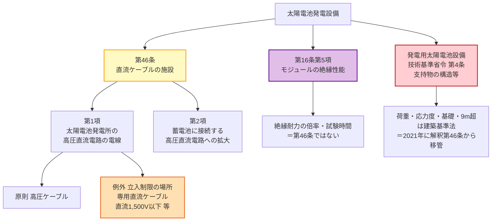

# 電技解釈 第46条 — 太陽電池発電設備用直流ケーブルの施設

!!! danger "📌 法令改正による内容変更（2026-07-26 改修）— 支持物の規定は本条から移管済み"
    本ページの旧版（v1.0）は第46条を「**太陽電池発電所等の電線等の施設**」として、第1項＝電線／**第2項・第3項＝支持物（架台）の荷重・強度** の3項構成で解説していました。しかし現行の電技解釈（**令和7年11月版**）で第46条は **全2項ともケーブル仕様のみ** となっており、**支持物の規定は本条に存在しません**。

    - **旧第46条 第2項・第4項**（太陽電池モジュールの支持物）は、**[発電用太陽電池設備に関する技術基準を定める省令](https://laws.e-gov.go.jp/law/503M60000400029)（令和3年経済産業省令第29号）第4条（支持物の構造等）** へ移管されました
    - 同省令第4条には、旧規定と同趣旨の内容（自重・地震荷重・風圧荷重・積雪荷重に安定／応力度が **許容応力度以下**／材料の品質・防食／接合部の存在応力伝達／基礎は **杭基礎又は鉄筋コンクリート造の直接基礎** 等／太陽電池アレイの最高の高さが **9mを超える** 場合は建築基準法の構造強度規定に適合）が置かれています
    - **移管の根拠**: 現行告示PDF末尾の附則に「改正後の電気設備の技術基準の解釈 **第46条第2項**（／**第4項**）の規定にかかわらず、なお従前の例による」という **太陽電池モジュールの支持物に関する経過措置** が残っており、支持物規定が第46条にあった事実と、その後の削除を裏づけます
    - **試験対策**: 支持物（架台）の論点は **電技解釈ではなく上記の専用省令** が根拠です。古い教材・過去問解説が「解釈第46条第2項」と記載していても、現行体系では条番号が異なります

!!! warning "📜 一次ソース確認のお願い"
    本ページは電気設備の技術基準の解釈（経済産業省が省令の解釈として示すもの）を学習用に整理したものです。電技解釈は e-Gov 法令検索に登録されていないため、本Wikiの品質保証は経産省告示PDF原典への逐語照合＋過去問データベースへの照合に依存しています。**重要な実務判断や試験直前の最終確認は、必ず経産省公式の最新告示PDF（[電気設備の技術基準の解釈](https://www.meti.go.jp/policy/safety_security/industrial_safety/sangyo/electric/detail/setsubi_kijun.html)）に当たってください**。

!!! note "📊 試験対策メタ"
    **出題頻度**: ★☆☆☆☆（過去14年（H23〜R07下）で1回＝H28問6。[第16条第5項](16.md) と複合の穴埋）

    **重要度**: B−（出題は希少だが、太陽光発電の **高圧直流電路の電線** の唯一の根拠条で、第16条との複合出題で問われた実績がある）

    **直近出題**: H28問6（穴埋・「太陽電池モジュールの絶縁性能及び太陽光発電所の電線」）

| 項目 | 内容 |
|------|------|
| 条文 | 電気設備の技術基準の解釈 第46条 |
| 条文核心 | 太陽電池発電所の **高圧直流電路の電線は高圧ケーブル** が原則。立入制限措置を講じた場所では、直流 ==1,500V== 以下等の条件を満たす **太陽電池発電設備用直流ケーブル** を使用可 |
| 規定内容 | 太陽電池発電設備用直流ケーブルの仕様と、その使用が認められる場所・電路 |
| 性格 | 施設規定（電線の種類・構造・材料・試験。絶縁耐力の数値規定ではない） |
| 委任元（上位） | 電技省令第4条（電気設備の損傷防止） |
| 構成 | **全2項**。第1項＝太陽電池発電所の高圧直流電路の電線（原則＝高圧ケーブル／例外＝専用直流ケーブル・第一号〜第六号の仕様）／第2項＝**蓄電池** に接続する高圧直流電路への使用拡大 |
| **混同注意** | 本条＝太陽電池の **電線（ケーブル仕様）**／[第16条第5項](16.md)＝太陽電池モジュールの **絶縁性能**。H28問6 はこの **2条複合**。**支持物は本条ではなく [発電用太陽電池設備技術基準省令 第4条](https://laws.e-gov.go.jp/law/503M60000400029)** |
| **典拠（一次ソース）** | 電気設備の技術基準の解釈（経産省が示す省令の解釈・**令和7年11月版**）第46条 — 経産省告示PDF原典から第1項・第2項を逐語抽出 ／ 支持物の移管先は [e-Gov 法令検索](https://laws.e-gov.go.jp/law/503M60000400029)（令和三年経済産業省令第二十九号）で確認 |
| **照合日** | 2026-07-26（告示PDF原典を pymupdf で全文抽出し `【太陽電池発電設備用直流ケーブルの施設】（省令第4条）第46条` の見出し・全2項を逐語照合。支持物の移管先は e-Gov API で第4条本文を取得し確認） |
| **隣接条文** | [第45条（燃料電池等の施設）](45.md) ← 本条（46・太陽電池の直流ケーブル） → 第47条（常時監視と同等な監視を確実に行える発電所の施設） ／ 上位: 電技省令第4条 |

---

## 1. 5秒で思い出す

!!! tip "💡 試験直前の核心メモ（5秒で思い出す）"
    - 第46条 = **太陽電池発電設備用直流ケーブルの施設**（**全2項**・支持物は本条にない）
    - 第1項 原則: 太陽電池発電所の **高圧の直流電路の電線** は **高圧ケーブル**
    - 第1項 例外: **取扱者以外の者が立ち入らないような措置** を講じた場所では、専用の **太陽電池発電設備用直流ケーブル** を使用可
    - 専用ケーブルの主な条件: 使用電圧 **直流 ==1,500V== 以下**／導体 **断面積60mm²以下** の軟銅線等／絶縁体・外装は架橋ポリオレフィン混合物等／完成品試験に適合
    - 第2項: **蓄電池** に接続する高圧直流電路にも、[第10条](10.md)第1項にかかわらず同じ専用ケーブルを使用可（発電所・蓄電所・変電所等で立入制限措置のある場所）
    - **絶縁性能は第46条ではなく [第16条第5項](16.md)**。H28問6 は両条の **複合**
    - **支持物（架台）は本条ではなく [発電用太陽電池設備技術基準省令 第4条](https://laws.e-gov.go.jp/law/503M60000400029)**

??? question "セルフチェック: H28問6 で問われた「太陽電池の電線・絶縁」は、第46条と第16条のどちらが何を担当するのか？"
    H28問6 は **2条複合** の穴埋めです。**絶縁性能**（最大使用電圧の倍率・試験時間など、太陽電池モジュールの絶縁耐力）の部分は **[第16条第5項](16.md)** が所管します。一方、**電線**（高圧直流電路の電線の種類・専用直流ケーブルの使用電圧 ==1,500V== 以下等）の部分が **第46条第1項** に対応します。

    空欄(エ)の「1,500V」は第46条第1項第一号が出典です（[denken-ou houkih28-6](https://denken-ou.com/houkih28-6/) が「第46条第1項の一」と明記）。「太陽電池の電線・絶縁はぜんぶ第16条」と早合点しないでください。

??? question "セルフチェック: なぜ「立入制限の場所」でだけ専用直流ケーブルが認められるのか。高圧ケーブルとの安全性の差はどこで埋めているのか？"
    **「人が触れない」ことと「ケーブル自体の性能」の二段構えで、高圧ケーブル相当の安全水準を確保しているからです。**

    太陽光発電設備は屋外に広大に敷設され、直流電路の全区間を高圧ケーブルで配線すると過大なコストになります。一方、太陽電池の直流電路は **日射がある限り発電し続ける** ため、電源を落として無電圧にすることが難しく、絶縁が破れたときのリスクは交流以上とも言えます。

    そこで条文は、まず **取扱者以外の者が立ち入らないような措置** を要求して「人が接近する確率」を潰し、そのうえで専用ケーブル側にも **直流1,500V以下** という電圧上限と、耐電圧（直流15,000V／交流6,500Vを5分間）・低温（-40℃）・耐候（キセノンアーク）・ニードル貫通といった **屋外長期使用に耐える完成品試験** を課しています。どちらか一方だけでは足りない、という構造です。

---

## 2. 条文原文

??? note "📜 条文原文 — 経産省告示PDF（令和7年11月版）完全版（折り畳み・クリックで開く）"
    経済産業省「電気設備の技術基準の解釈」（令和7年11月版）原典PDFから逐語取得した **第46条 全文**（第1項・第2項・46-1表）。第1項第四号〜第六号は参照規格名が長いため、**数値・材料・試験条件はすべて原文どおり残したうえで規格名称のみ短縮** しています。**2026-07-26 一次照合済**。

    **凡例**: <mark>黄色マーカー</mark> = 過去14年で **実際に穴埋め出題された** 語（H28問6 空欄(エ)＝1,500V のみ）。`**bold**` は条文の主要語句で論述・予想範囲。

    **【太陽電池発電設備用直流ケーブルの施設】（省令第4条）**

    **第46条** 太陽電池発電所に施設する **高圧の直流電路の電線**（電気機械器具内の電線を除く。）は、**高圧ケーブル** であること。ただし、**取扱者以外の者が立ち入らないような措置を講じた場所** において、次の各号に適合する **太陽電池発電設備用直流ケーブル** を使用する場合は、この限りでない。

    　一 使用電圧は、**直流 <mark>1,500V</mark> 以下** であること。

    　二 構造は、**絶縁物で被覆した上を外装で保護した電気導体** であること。

    　三 導体は、**断面積60mm²以下** の別表第1に規定する **軟銅線** 又はこれと同等以上の強さのものであること。

    　四 絶縁体は、次に適合するものであること。

    　　イ 材料は、**架橋ポリオレフィン混合物、架橋ポリエチレン混合物又はエチレンゴム混合物** であること。

    　　ロ 厚さは、46-1表に規定する値を標準値とし、その平均値が標準値以上、その最小値が **標準値の90%から0.1mmを減じた値以上** であること。

    **46-1表（絶縁体の厚さ）**

    | 導体の公称断面積（mm²） | 絶縁体の厚さ（mm） |
    |---|---|
    | 2以上14以下 | 0.7 |
    | 14を超え38以下 | 0.9 |
    | 38を超え60以下 | 1.0 |

    　　ハ 所定の規格（定格電圧0.6/1kVのケーブル）の方法により試験を行ったとき、次に適合すること。

    　　　(イ) 室温において引張強さ及び伸びの試験を行ったとき、**引張強さが6.5N/mm²以上、伸びが125%以上** であること。

    　　　(ロ) **150℃に168時間加熱** した後に(イ)の試験を行ったとき、引張強さ・伸びとも (イ)の値の **70%以上** であること。

    　五 外装は、次に適合するものであること。

    　　イ 材料は、架橋ポリオレフィン混合物、架橋ポリエチレン混合物又はエチレンゴム混合物であって、所定の規格の方法により試験を行ったとき、室温で **引張強さが8.0N/mm²以上、伸びが125%以上**、150℃168時間加熱後は各 **70%以上** であること。

    　　ロ 厚さは、次の計算式により計算した値を標準値とし、その平均値が標準値以上、その最小値が **標準値の85%から0.1mmを減じた値以上** であること。

    　　　**t ＝ 0.035D ＋ 1.0**

    　　　t は、外装の厚さ（単位: mm。小数点二位以下は四捨五入する。）
    　　　D は、丸形のものにあっては外装の内径、その他のものにあっては外装の内短径と内長径の和を2で除した値（単位: mm）

    　六 完成品は、次に適合するものであること。

    　　イ **清水中に1時間浸した後**、導体と大地との間に **直流15,000V 又は交流6,500V を連続して5分間** 加えたとき、これに耐える性能を有すること。

    　　ロ イの試験の後において、導体と大地との間に **100Vの直流電圧を1分間** 加えた後に測定した絶縁体の絶縁抵抗が **1,000**MΩ-km **以上** であること。

    　　ハ 所定の規格の方法により、**-40±2℃** の状態で低温曲げ・低温伸び・低温衝撃の試験を行ったとき、これに適合すること。

    　　ニ 所定の規格（定格電圧0.6/1kVのケーブル）の方法により試験を行ったとき、これに適合すること。

    　　ホ **キセノンアークランプ** による暴露試験（JIS K 7350-2(2008)）を行ったとき、**クラックが生じない** こと。

    　　ヘ 室温において、ばね鋼製のニードルに荷重を加え絶縁被覆を貫通させたとき、ニードルと導体とが電気的に接触した際の荷重（4回の平均値）が次の計算式の値以上であること。

    　　　**F ＝ 150 × 導体外径**（F は荷重・単位: N）

    　　ト ケーブル表面に **深さ0.05mm** の切り込みを入れた3つの試験片について、1つは **-15℃**、1つは室温、もう1つは **85℃** に3時間放置した後、外装の外径の **(3±0.3)倍** の直径を有する円筒に巻き、室温に戻した後、清水中に1時間浸し、導体と大地との間に **300Vの交流電圧を連続して5分間** 加えたとき、これに耐える性能を有すること。

    **2** **発電所、蓄電所又は変電所若しくはこれに準ずる場所** であって取扱者以外の者が立ち入らないような措置を講じた場所に施設する **蓄電池に接続する高圧の直流電路の電線**（電気機械器具内の電線を除く。）には、**[第10条](10.md)第1項の規定にかかわらず**、前項各号に適合する **太陽電池発電設備用直流ケーブル** を使用することができる。

### 原文解析（ブロック分解）

| ブロック | 原文 | 意味 | 試験のポイント |
|---|---|---|---|
| 第1項 原則 | 太陽電池発電所に施設する高圧の直流電路の電線（電気機械器具内の電線を除く。）は、高圧ケーブルであること | 原則は **高圧ケーブル** | 「電気機械器具内の電線」は対象外 |
| 第1項 但書の前提 | 取扱者以外の者が立ち入らないような措置を講じた場所において | 例外の **場所条件** | 立入制限が無ければ例外に乗れない |
| 第一号 | 使用電圧は、直流1,500V以下 | 専用ケーブルの電圧上限 | **H28問6 空欄(エ) = 1,500V** |
| 第二号 | 絶縁物で被覆した上を外装で保護した電気導体 | 二重保護の構造 | 絶縁体 **＋** 外装の2層 |
| 第三号 | 導体は、断面積60mm²以下の軟銅線又はこれと同等以上の強さ | 導体の上限断面積 | **60mm²以下**（以上ではない） |
| 第四号ロ | 平均値が標準値以上、最小値が標準値の90%から0.1mmを減じた値以上 | 絶縁体の厚さの判定 | 絶縁体は **90%**、外装は **85%**（第五号ロ）で **非対称** |
| 第六号イ | 清水中に1時間浸した後、直流15,000V又は交流6,500Vを5分間 | 完成品の耐電圧試験 | **直流と交流で値が違う**（15,000 / 6,500） |
| 第六号ロ | 絶縁抵抗が **1,000**MΩ-km 以上 | 完成品の絶縁抵抗 | 単位が **MΩ-km**（km 当たり） |
| 第2項 | 発電所、蓄電所又は変電所若しくはこれに準ずる場所…蓄電池に接続する高圧の直流電路 | 蓄電池電路への **使用拡大** | 主語が「太陽電池」ではなく **蓄電池** |

---

## 3. かみ砕き解説（因果理解）

### なぜ高圧直流電路は「高圧ケーブル」が原則なのか

太陽電池の高圧直流電路は **日射がある限り発電し続ける直流** です。交流のように電流ゼロ点（1秒間に100〜120回訪れる）が無いため、地絡・短絡時にアークが自然消弧しにくく、いったん事故に至ると継続しやすい性質があります。加えて、系統を切り離しても **モジュール自体が電源** なので、電路を無電圧にすることが容易ではありません。

だから第1項は、絶縁体と外装でしっかり保護された **高圧ケーブル** を原則としています。

### なぜ「立入制限の場所」だけ専用直流ケーブルを許すのか

太陽光発電設備は屋外に広く敷設されるため、全区間を高圧ケーブルで配線するのは過大になりえます。そこで **取扱者以外の者が立ち入らないような措置** を講じた場所に限り、第一号〜第六号の条件を満たす **太陽電池発電設備用直流ケーブル（ソーラーケーブル）** を許容します。

**人が触れない**（場所の条件）＋ **ケーブル自体が一定の安全性能を持つ**（第一号〜第六号）の二段構えで安全を担保する、という設計です。**実務** の **設計** では、フェンス・施錠等の立入制限措置が先に成立していることを確認してからケーブル選定に進みます。

### 第六号の完成品試験は「屋外に20年置く」ための試験

専用ケーブルの試験項目は、いずれも屋外長期使用の劣化要因に対応しています。

| 試験 | 想定している劣化要因 | **現場** で起きること |
|---|---|---|
| 清水浸漬後の耐電圧（直流15,000V／交流6,500V・5分） | 雨水・結露 | 水の浸入を起点とした絶縁破壊 |
| 低温 -40±2℃（曲げ・伸び・衝撃） | 寒冷地の冬季 | 被覆が硬化して割れる |
| キセノンアーク暴露 | 紫外線 | 外装の白化・クラック |
| ニードル貫通 **F ＝ 150 × 導体外径** | **施工** 時の踏みつけ・小石 | 被覆が貫通して地絡 |
| 切り込み＋低温／室温／85℃で円筒巻き | 施工時の傷＋温度サイクル | 傷を起点に亀裂が進展 |

高圧ケーブルの代替として認める以上、**屋外に直接敷設して長期間使う** ことに耐える証明を要求している、というのが第六号の骨格です。

### 第2項 — 太陽電池以外（蓄電池）への使用拡大

第2項は主語が **蓄電池** に変わります。発電所・**蓄電所**・変電所又はこれに準ずる場所で立入制限措置がある場所に限り、蓄電池に接続する高圧直流電路にも同じ専用ケーブルを使えるという規定です。

条文が「**[第10条](10.md)第1項の規定にかかわらず**」と断っているのは、第10条第1項が高圧ケーブルの規格を定めているためで、その特則として本条の専用ケーブルを認める構造になっています。近年の **蓄電所** の制度化に対応した規定で、名称は「太陽電池発電設備用直流ケーブル」のままですが **用途は蓄電池電路にも広がっている** 点が読み取りどころです。

---

## 4. 図で理解

### ① 第46条の守備範囲と、隣接する条文の役割分担

**読み解き**: 太陽電池発電設備の論点は **3つの根拠に分かれます**。電線＝本条、絶縁性能＝[第16条第5項](16.md)、支持物＝**専用省令**。H28問6 は上2つの複合でした。旧版が本条に含めていた支持物は、現在は3つ目の枠に移っています。

### ② 第1項 — 原則と例外

<svg viewBox="0 0 800 260" xmlns="http://www.w3.org/2000/svg" width="100%" preserveAspectRatio="xMidYMid meet">
<defs>
<filter id="sh46pv" x="-20%" y="-20%" width="140%" height="140%"><feDropShadow dx="0" dy="2" stdDeviation="2" flood-opacity="0.15"/></filter>
</defs>
<text x="400" y="24" text-anchor="middle" font-size="15" font-weight="700" fill="#212121">太陽電池発電所の高圧直流電路の電線（第46条第1項）</text>
<rect x="60" y="56" width="300" height="160" rx="10" fill="#e8f5e9" stroke="#2e7d32" stroke-width="2.5" filter="url(#sh46pv)"/>
<text x="210" y="84" text-anchor="middle" font-size="13" font-weight="700" fill="#1b5e20">原則</text>
<text x="210" y="112" text-anchor="middle" font-size="12" fill="#1b5e20">高圧の直流電路の電線は</text>
<text x="210" y="134" text-anchor="middle" font-size="13" font-weight="700" fill="#1b5e20">高圧ケーブル</text>
<text x="210" y="160" text-anchor="middle" font-size="10" fill="#558b2f">（電気機械器具内の電線を除く）</text>
<text x="210" y="190" text-anchor="middle" font-size="10" fill="#558b2f">絶縁・外装がしっかりした電線</text>
<rect x="440" y="56" width="300" height="160" rx="10" fill="#fff3e0" stroke="#e65100" stroke-width="2.5" filter="url(#sh46pv)"/>
<text x="590" y="84" text-anchor="middle" font-size="13" font-weight="700" fill="#bf360c">例外</text>
<text x="590" y="106" text-anchor="middle" font-size="11" fill="#bf360c">取扱者以外の者が立ち入らない</text>
<text x="590" y="122" text-anchor="middle" font-size="11" fill="#bf360c">ような措置を講じた場所では</text>
<text x="590" y="146" text-anchor="middle" font-size="11" font-weight="700" fill="#bf360c">太陽電池発電設備用直流ケーブル</text>
<text x="590" y="170" text-anchor="middle" font-size="10" fill="#e65100">直流1,500V以下／導体60mm²以下</text>
<text x="590" y="188" text-anchor="middle" font-size="10" fill="#e65100">架橋ポリオレフィン等／完成品試験適合</text>
<line x1="360" y1="136" x2="440" y2="136" stroke="#9e9e9e" stroke-width="2" stroke-dasharray="5,3"/>
<text x="400" y="130" text-anchor="middle" font-size="11" font-weight="700" fill="#616161">or</text>
<text x="400" y="240" text-anchor="middle" font-size="10" fill="#666">立入制限（場所）＋ ケーブルの安全性能（1,500V以下等）の 両方 が揃って初めて専用直流ケーブルが可</text>
</svg>

**読み解き**: 高圧直流電路の電線は **高圧ケーブルが原則**。立入制限の場所に限り、使用電圧 ==1,500V== 以下等の条件を満たす **専用直流ケーブル** が例外として認められます。片方だけでは足りません。

### ③ 専用直流ケーブルの構造と厚さの判定（第二号〜第五号）

<svg viewBox="0 0 800 290" xmlns="http://www.w3.org/2000/svg" width="100%" preserveAspectRatio="xMidYMid meet">
<defs>
<filter id="sh46b" x="-20%" y="-20%" width="140%" height="140%"><feDropShadow dx="0" dy="2" stdDeviation="2" flood-opacity="0.13"/></filter>
</defs>
<text x="400" y="24" text-anchor="middle" font-size="15" font-weight="700" fill="#212121">太陽電池発電設備用直流ケーブルの構造（第二号〜第五号）</text>

<circle cx="170" cy="150" r="86" fill="#eceff1" stroke="#455a64" stroke-width="2.5" filter="url(#sh46b)"/>
<circle cx="170" cy="150" r="58" fill="#fff3e0" stroke="#e65100" stroke-width="2.5"/>
<circle cx="170" cy="150" r="28" fill="#ffe0b2" stroke="#bf360c" stroke-width="2.5"/>
<text x="170" y="155" text-anchor="middle" font-size="11" font-weight="700" fill="#bf360c">導体</text>
<text x="170" y="108" text-anchor="middle" font-size="10" font-weight="700" fill="#e65100">絶縁体</text>
<text x="170" y="80" text-anchor="middle" font-size="10" font-weight="700" fill="#37474f">外装</text>
<line x1="256" y1="150" x2="316" y2="150" stroke="#455a64" stroke-width="1.5"/>

<text x="330" y="82" font-size="11" font-weight="700" fill="#bf360c">導体（第三号）</text>
<text x="330" y="100" font-size="10" fill="#5d4037">断面積 60mm² 以下の軟銅線 又は同等以上</text>

<text x="330" y="132" font-size="11" font-weight="700" fill="#e65100">絶縁体（第四号）</text>
<text x="330" y="150" font-size="10" fill="#5d4037">架橋ポリオレフィン／架橋ポリエチレン／エチレンゴム</text>
<text x="330" y="166" font-size="10" fill="#5d4037">厚さ 46-1表（0.7 / 0.9 / 1.0 mm）</text>
<text x="330" y="182" font-size="10" font-weight="700" fill="#c62828">最小値 ≧ 標準値の 90% − 0.1mm</text>

<text x="330" y="214" font-size="11" font-weight="700" fill="#37474f">外装（第五号）</text>
<text x="330" y="232" font-size="10" fill="#5d4037">厚さ t ＝ 0.035D ＋ 1.0</text>
<text x="330" y="248" font-size="10" font-weight="700" fill="#c62828">最小値 ≧ 標準値の 85% − 0.1mm</text>

<rect x="55" y="252" width="230" height="24" rx="6" fill="#ffebee" stroke="#c62828" stroke-width="1.5"/>
<text x="170" y="268" text-anchor="middle" font-size="10" font-weight="700" fill="#b71c1c">90%（絶縁体）と 85%（外装）は非対称</text>
</svg>

**読み解き**: 構造は「導体 → 絶縁体 → 外装」の3層です。厚さの合否判定は **平均値が標準値以上** かつ **最小値が「標準値の◯% − 0.1mm」以上** という2段構えで、この◯% が **絶縁体は90%／外装は85%** と食い違います。外装のほうが緩いのは、外装が機械的保護であって絶縁の主役ではないためです。

---

## 5. 頻出ひっかけ・落とし穴

各項目の先頭の `[①〜⑥]` は弱点カテゴリ（①数値境界／②主語対象／⑥例外除外）を示します。

### 🔴 致命的（これを間違えたら即失点）

| # | ❌ 誤った認識 | ✅ 正しい認識 |
|---|--------------|--------------|
| 1 | **[②主語]** 太陽電池の絶縁・電線はぜんぶ第16条 | **絶縁性能（モジュールの絶縁耐力）＝[第16条第5項](16.md)／電線＝第46条**。H28問6 はこの **2条複合** |
| 2 | **[②主語]** 太陽電池モジュールの **支持物（架台）** の荷重・強度は解釈第46条第2項 | 現行では **[発電用太陽電池設備技術基準省令 第4条](https://laws.e-gov.go.jp/law/503M60000400029)**。解釈第46条には支持物の規定は **存在しない**（2021年に移管） |
| 3 | **[①数値]** 専用直流ケーブルの使用電圧は **直流1,000V以下** | **直流1,500V以下**（第一号・H28問6 空欄(エ)） |

### 🟡 注意（出題頻度高い）

| # | ❌ 誤った認識 | ✅ 正しい認識 |
|---|--------------|--------------|
| 4 | **[⑥例外]** 高圧の直流電路は必ず高圧ケーブル | **取扱者以外の者が立ち入らないような措置** を講じた場所では専用直流ケーブル可（第1項ただし書き） |
| 5 | **[⑥例外]** 専用直流ケーブルは条件を満たせばどこでも使える | **立入制限の場所** という **場所の条件** が別途必要。ケーブルの性能だけでは足りない |
| 6 | **[①数値]** 導体は断面積 **60mm²以上** | **60mm²以下**。上限であって下限ではない |
| 7 | **[②主語]** 第2項も太陽電池の電路の規定 | 第2項の主語は **蓄電池** に接続する高圧直流電路（発電所・**蓄電所**・変電所等） |

### 🟢 軽微（余裕があれば）

| # | ❌ 誤った認識 | ✅ 正しい認識 |
|---|--------------|--------------|
| 8 | **[①数値]** 厚さの最小値判定は絶縁体・外装とも同じ割合 | **絶縁体は90%**（第四号ロ）／**外装は85%**（第五号ロ）から 0.1mm を減じた値以上。非対称 |
| 9 | **[①数値]** 完成品の耐電圧試験は直流・交流とも同じ電圧 | **直流15,000V 又は交流6,500V**（第六号イ）。値が異なる |
| 10 | **[⑥例外]** 第2項は太陽電池発電所だけに適用される | 第2項の適用場所は **発電所、蓄電所又は変電所若しくはこれに準ずる場所**（立入制限措置のあるもの） |

---

## 6. 穴埋め過去問チャレンジ

### ✅ 数値検証 PASS（一次ソース照合済 2026-07-26）

**数値検証 PASS** — 本記事に記載した第46条の全数値を、経産省告示PDF原典（電気設備の技術基準の解釈・令和7年11月版）から抽出した本文と逐語照合した結果、すべて一次ソース通りです。支持物の移管先の数値は e-Gov 法令検索の当該省令本文で確認しました。

| 値・規定語 | 出典条項 | 一次ソース該当箇所 |
|---|---|---|
| 使用電圧 直流 **1,500V** 以下 | 第46条第1項第一号 | 「使用電圧は、直流1,500V以下であること」（H28問6 空欄(エ)） |
| 導体 断面積 **60mm²** 以下・軟銅線 | 第46条第1項第三号 | 「導体は、断面積60mm²以下の別表第1に規定する軟銅線又はこれと同等以上の強さのもの」 |
| 絶縁体の厚さ **0.7／0.9／1.0** mm | 第46条第1項第四号ロ・46-1表 | 「2以上14以下: 0.7／14を超え38以下: 0.9／38を超え60以下: 1.0」 |
| 絶縁体の最小値 標準値の **90%** −0.1mm | 第46条第1項第四号ロ | 「その最小値が標準値の90%から0.1mmを減じた値以上」 |
| 外装の厚さ **t＝0.035D＋1.0** | 第46条第1項第五号ロ | 「t＝0.035D＋1.0」 |
| 外装の最小値 標準値の **85%** −0.1mm | 第46条第1項第五号ロ | 「その最小値が標準値の85%から0.1mmを減じた値以上」 |
| 耐電圧 直流 **15,000V** 又は交流 **6,500V**・**5分間** | 第46条第1項第六号イ | 「清水中に1時間浸した後…15,000Vの直流電圧又は6,500Vの交流電圧を連続して5分間加えたとき」 |
| 絶縁抵抗 **1,000**MΩ-km 以上 | 第46条第1項第六号ロ | 「絶縁体の絶縁抵抗が1,000MΩ-km以上であること」 |
| 低温試験 **-40±2℃** | 第46条第1項第六号ハ | 「-40±2℃の状態で試験を行ったとき」 |
| ニードル荷重 **F＝150×導体外径** | 第46条第1項第六号ヘ | 「Ｆ＝150×導体外径」 |
| 支持物: 高さ **9m** 超で建築基準法 | **発電用太陽電池設備技術基準省令 第4条第六号** | 「太陽電池アレイ…の最高の高さが九メートルを超える場合には、構造強度等に係る建築基準法…の規定に適合するものであること」 |

!!! abstract "問題1: H28問6（実過去問・(エ)が第46条第1項第一号）"
    太陽電池発電所に施設する高圧の直流電路の電線（電気機械器具内の電線を除く。）は、原則として高圧ケーブルであること。ただし、取扱者以外の者が立ち入らないような措置を講じた場所において、所定の条件に適合する太陽電池発電設備用直流ケーブルを使用する場合は、この限りでない。当該直流ケーブルの使用電圧は、直流（　エ　）V 以下であること。

    （出典: [denken-ou.com H28問6解説](https://denken-ou.com/houkih28-6/)。同解説は本空欄の根拠を「第46条第1項の一」と明記）

??? success "解答を見る"
    - エ = **1,500**（直流1,500V以下）

    **改変あり**（H28問6 は [第16条第5項](16.md) との複合問題で、空欄(ア)〜(ウ)は第16条側。本チャレンジは第46条に対応する **(エ)単独を抽出** した部分再構成です。空欄(ア)〜(ウ)は [第16条](16.md) を参照してください）。

??? note "解説と復習導線"
    「太陽電池の問題＝ぜんぶ第16条」と決めつけると、電線の使用電圧 ==1,500V== 以下（第46条第1項第一号）の根拠条を取り違えます。**絶縁性能＝第16条第5項／電線＝第46条／支持物＝専用省令** の三分割で覚えてください。

!!! abstract "問題2: 専用直流ケーブルの仕様（予想・第1項第一号〜第六号論点）"
    太陽電池発電設備用直流ケーブルは、使用電圧が直流（　ア　）V 以下であり、導体は断面積（　イ　）mm² 以下の軟銅線又はこれと同等以上の強さのものであること。また、完成品は清水中に1時間浸した後、導体と大地との間に直流（　ウ　）V 又は交流6,500V を連続して（　エ　）分間加えたとき、これに耐える性能を有すること。

??? success "解答を見る"
    - ア = **1,500**
    - イ = **60**
    - ウ = **15,000**
    - エ = **5**

    **改変あり**（過去問そのものではなく、第46条第1項第一号・第三号・第六号イの条文から構成した予想穴埋めです）。

??? note "解説と復習導線"
    (イ)は「**以下**」であって「以上」ではない点が要注意です（導体が太すぎるものを専用ケーブルとして認めない趣旨）。(ウ)(エ)は「**直流15,000V／交流6,500V を5分間**」をセットで覚えてください。

---

## 7. まぎらわしい選択肢と正解の違い

| 誤った記述 | 正しい記述 | なぜ違うか |
|---|---|---|
| 太陽電池の絶縁・電線はすべて第16条 | 絶縁性能＝[第16条第5項](16.md)／電線＝第46条 | H28問6 は2条複合。守備範囲が違う |
| 支持物の荷重・強度は解釈第46条第2項 | **[発電用太陽電池設備技術基準省令 第4条](https://laws.e-gov.go.jp/law/503M60000400029)** | 2021年に解釈第46条から移管。現行の解釈第46条に支持物の規定は無い |
| 高圧直流電路は必ず高圧ケーブル | 立入制限の場所では専用直流ケーブル（直流1,500V以下等）可 | 第1項ただし書きの例外 |
| 専用直流ケーブルの使用電圧は直流 **1,000V** 以下 | 直流 **1,500V** 以下 | 第一号の数値 |
| 導体は断面積 **60mm²以上** | 断面積 **60mm²以下** | 上限規定。以上／以下の反転 |
| 第46条第2項も太陽電池の電路の規定 | 第2項は **蓄電池** に接続する高圧直流電路 | 主語が変わる。蓄電所の制度化に対応した規定 |

---

## 📒 解いたら記録 → 間違えたら間違えノートへ（PDCAを回す）

!!! abstract "各過去問の「理解した／曖昧／間違えた」ボタンで解答結果を残せます"
    上の過去問の各ブロック下に出る **理解度ボタン（〇理解した／△曖昧／×間違えた）** とメモ欄で、解いた結果がブラウザの localStorage に保存されます（**Do→Check**）。

    👉 [**間違えノートを開く（法規Wiki／直前まちがいノート）**](https://kfurufuru.github.io/secretary-portal-public/denken-hoki-wiki.html#chokuzen-machigai)

    - **×間違えた** を押した問題は間違えノートに **自動集約** され、間違えた問題だけ抽出して再演習できる（**Check→Act**）
    - メモ欄に「なぜ間違えたか」を残すと、次回復習時に文脈ごと復元される
    - 同一オリジン（kfurufuru.github.io）配下なので、本Wiki／法規Wiki／理論Wiki のチェック記録は **すべて同じ間違えノートに集約**（横断PDCA）

---

## 8. 関連条文・関連ページ

**複合出題・主題が紛らわしい条文**

- [第16条 — 機械器具等の電路の絶縁性能](16.md) — 太陽電池モジュールの **絶縁性能**（絶縁耐力）はこちら。H28問6 で第46条と **複合出題**

**支持物（本条から移管された論点）**

- [発電用太陽電池設備に関する技術基準を定める省令（令和3年経産省令第29号）第4条](https://laws.e-gov.go.jp/law/503M60000400029) — **支持物の構造等**（荷重・応力度・材料・接合部・基礎・9m超の建築基準法適合）

**関連（本条を参照・本条が参照する条文）**

- [第10条 — 高圧ケーブル](10.md) — 第1項の原則「高圧ケーブル」の規格。第2項が「第10条第1項の規定にかかわらず」と特則を置く
- [第200条 — 小規模発電設備の施設](200.md) — 小規模の太陽電池発電設備（充電部露出防止・開閉器・過電流遮断器・電線）

**隣接条文**

- [第45条 — 燃料電池等の施設](45.md)
- 第47条 — 常時監視と同等な監視を確実に行える発電所の施設 <!-- TODO: 47.md は未作成 -->

**上位（委任元）**

- 電技省令第4条（電気設備の損傷防止）

---

## 9. 過去問実績

過去14年（H23〜R07下）の現過去問DB（`_data/kakomon.yml`）に第46条は **1件**（H28問6・[第16条](16.md)と複合）。

| 年度 | 問 | 形式 | 論点 | 備考 |
|------|-----|------|------|------|
| H28 | 問6 | 穴埋 | 太陽電池モジュールの絶縁性能（第16条第5項）及び太陽光発電所の電線（第46条第1項） | kakomon.yml の article は `解釈§16, §46`。空欄(エ)=1,500V が第46条第1項第一号 |

!!! note "出題傾向"
    第46条の単独出題は希少ですが、H28問6 のように **[第16条](16.md)（絶縁性能）と複合** して問われた実績があります。出題されるなら第1項（高圧ケーブル原則・専用直流ケーブルの **直流1,500V以下** 条件）が狙われやすいでしょう。

!!! note "R08 出題予測"
    太陽光発電・蓄電池の普及で本条の重要性は高まっています。特に **第2項（蓄電池に接続する高圧直流電路への使用拡大）** は蓄電所の制度化に対応した比較的新しい規定で、「蓄電所」という用語とセットで問われる余地があります。支持物の論点が出る場合、根拠は **解釈ではなく [発電用太陽電池設備技術基準省令](https://laws.e-gov.go.jp/law/503M60000400029)** である点に注意してください。

---

## 10. 用語集

| 用語 | 読み | 意味 | 試験での注意点 |
|------|------|------|----------------|
| 太陽電池発電設備用直流ケーブル | たいようでんちはつでんせつびようちょくりゅうケーブル | 太陽光発電の直流電路用に規格化された専用ケーブル（ソーラーケーブル） | **立入制限の場所** で **直流1,500V以下** 等の条件下で使用可 |
| 高圧ケーブル | こうあつケーブル | 高圧電路用のケーブル（[第10条](10.md)が規格を規定） | 第1項の **原則**。専用ケーブルは例外 |
| 電気機械器具内の電線 | でんきかいききぐないのでんせん | 機器の内部に施設される電線 | 第1項の「高圧ケーブル」原則の **対象外** |
| 蓄電所 | ちくでんしょ | 系統に接続する蓄電池を設置する事業所 | **第2項** の適用場所の1つ。近年制度化 |
| 架橋ポリオレフィン混合物 | かきょうポリオレフィンこんごうぶつ | 分子を架橋させ耐熱・耐候性を高めた樹脂 | 絶縁体・外装の材料（第四号イ・第五号イ） |
| 支持物 | しじぶつ | 太陽電池モジュールを支える工作物（架台） | **本条の規定ではない**（専用省令 第4条） |
| 許容応力度 | きょようおうりょくど | 部材が安全に耐えられる応力の上限 | 支持物の判定基準（専用省令 第4条第二号） |

### 3列翻訳テーブル（日常語 ⇆ 法規表現 ⇆ 試験での意味）

| 日常語・言い換え | 法規表現（条文上の語） | 試験での意味・ひっかけ |
|---|---|---|
| ソーラーケーブル・PVケーブル | 太陽電池発電設備用直流ケーブル | 立入制限 ＋ **直流1,500V以下** 等の条件で使用可 |
| 関係者以外立入禁止のフェンス・施錠 | 取扱者以外の者が立ち入らないような措置 | 例外の **場所条件**。ケーブル性能だけでは足りない |
| 電線の太さ | 導体の断面積 | **60mm²以下**（以上ではない） |
| 被覆の外側の保護層 | 外装 | 厚さの最小値判定は **85%**（絶縁体は90%） |
| 蓄電池を置く事業所 | 蓄電所 | **第2項** の適用場所。主語が太陽電池から蓄電池に変わる |
| パネルの架台 | 支持物 | **解釈第46条ではなく専用省令 第4条**（2021年移管） |
| パネルの絶縁の良し悪し | （第16条の）絶縁性能 | 第46条ではない。H28問6 は2条複合 |

!!! tip "💡 暗記の核心（第46条を5秒で）"
    - 本条は **ケーブル仕様の条文**（**全2項**・支持物は無い）
    - 原則 **高圧ケーブル** ／ 例外 **立入制限の場所 ＋ 専用直流ケーブル**
    - 専用ケーブル: **直流1,500V以下**・導体 **60mm²以下**
    - 厚さ判定は **絶縁体90% / 外装85%**（非対称）
    - 完成品耐電圧は **直流15,000V 又は交流6,500V を5分間**
    - 第2項は主語が **蓄電池**（発電所・蓄電所・変電所等）
    - 三分割: **電線＝46条／絶縁性能＝[16条第5項](16.md)／支持物＝専用省令4条**

---

## 11. 最終チェック

### 主題理解

- [ ] 第46条 = **太陽電池発電設備用直流ケーブルの施設**（**全2項**）と言える
- [ ] 太陽電池モジュールの **絶縁性能** は第46条ではなく [第16条第5項](16.md) だと言える
- [ ] **支持物（架台）** は解釈第46条ではなく **発電用太陽電池設備技術基準省令 第4条** だと言える
- [ ] H28問6 は第46条（電線）と第16条第5項（絶縁性能）の **複合** だと言える

### 第1項（電線）

- [ ] 高圧の直流電路の電線は原則 **高圧ケーブル**（電気機械器具内の電線を除く）
- [ ] 例外の前提は **取扱者以外の者が立ち入らないような措置を講じた場所**
- [ ] 専用直流ケーブルの使用電圧は **直流1,500V以下**、導体は **断面積60mm²以下**
- [ ] 厚さの最小値判定は **絶縁体90%／外装85%** から 0.1mm を減じた値以上
- [ ] 完成品の耐電圧は **直流15,000V 又は交流6,500V を5分間**、絶縁抵抗は **1,000**MΩ-km 以上

### 第2項（蓄電池）

- [ ] 第2項の主語は **蓄電池に接続する高圧の直流電路** だと言える
- [ ] 適用場所は **発電所・蓄電所・変電所若しくはこれに準ずる場所** で立入制限措置のあるところ
- [ ] 「**[第10条](10.md)第1項の規定にかかわらず**」という特則の形をとっていると言える

---

## 📜 条文原文（同梱PDF 逐語転記）

!!! note "条文原文 — 電技解釈 第46条（令和7年11月版・逐語）"
    経産省告示PDF（`docs/assets/pdf/denken-kaishaku-r07-11.pdf`）の抽出テキストから
    項・号の構造ごと転記した。`scripts/check_law_verbatim.py` が本ブロックを原典と逐語照合する。
    表は原文の枠を崩さず転記できないため `※` で示し、本ページの解説表に委ねている。

    > **第1項** 太陽電池発電所に施設する高圧の直流電路の電線（電気機械器具内の電線を除く。）は、高圧ケーブルであること。ただし、取扱者以外の者が立ち入らないような措置を講じた場所において、次の各号に適合する太陽電池発電設備用直流ケーブルを使用する場合は、この限りでない。
    >
    > 　一 使用電圧は、直流1,500V以下であること。
    >
    > 　二 構造は、絶縁物で被覆した上を外装で保護した電気導体であること。
    >
    > 　三 導体は、断面積60㎟以下の別表第1に規定する軟銅線又はこれと同等以上の強さのものであること。
    >
    > 　四 絶縁体は、次に適合するものであること。
    >
    > 　　イ 材料は、架橋ポリオレフィン混合物、架橋ポリエチレン混合物又はエチレンゴム混合物であること。
    >
    > 　　ロ 厚さは、46-1表に規定する値を標準値とし、その平均値が標準値以上、その最小値が標準値の90%から0.1mmを減じた値以上であること。
    >
    > ※ 46-1表 は本ページの解説表を参照（原文の表は未転記）
    >
    > 　五 外装は、次に適合するものであること。
    >
    > 　　イ 材料は、架橋ポリオレフィン混合物、架橋ポリエチレン混合物又はエチレンゴム混合物であって、民間規格評価機関として日本電気技術規格委員会が承認した規格である「定格電圧1kV～30kVの押出絶縁電力ケーブル及びその附属品－定格電圧0.6/1kVのケーブル」の「適用」の欄に規定する方法により試験を行ったとき、次に適合するものであること。
    >
    > 　　　(イ) 室温において引張強さ及び伸びの試験を行ったとき、引張強さが8.0N/㎟以上、伸びが125%以上であること。
    >
    > 　　　(ロ) 150℃に168時間加熱した後に(イ)の試験を行ったとき、引張強さが(イ)の試験の際に得た値の70%以上、伸びが(イ)の試験の際に得た値の70%以上であること。
    >
    > 　　ロ 厚さは、次の計算式により計算した値を標準値とし、その平均値が標準値以上、その最小値が標準値の85%から0.1mmを減じた値以上であること。t＝0.035D＋1.0t は、外装の厚さ（単位：㎜。小数点二位以下は四捨五入する。）D は、丸形のものにあっては外装の内径、その他のものにあっては外装の内短径と内長径の和を2で除した値（単位：㎜）
    >
    > 　六 完成品は、次に適合するものであること。
    >
    > 　　イ 清水中に1時間浸した後、導体と大地との間に15,000Vの直流電圧又は6,500Vの交流電圧を連続して5分間加えたとき、これに耐える性能を有すること。
    >
    > 　　ロ イの試験の後において、導体と大地との間に100Vの直流電圧を1分間加えた後に測定した絶縁体の絶縁抵抗が1,000MΩ-km以上であること。
    >
    > 　　ハ 民間規格評価機関として日本電気技術規格委員会が承認した規格である「電気・光ファイバケーブル－非金属材料の試験方法－第504部：機械試験－絶縁体及びシースの低温曲げ試験」、「電気・光ファイバケーブル－非金属材料の試験方法－第505部：機械試験－絶縁体及びシースの低温伸び試験」及び「電気・光ファイバケーブル－非金属材料の試験方法－第506部：機械試験－絶縁体及びシースの低温衝撃試験」の「適用」の欄に規定する方法により、-40±2℃の状態で試験を行ったとき、これに適合すること。
    >
    > 　　ニ 民間規格評価機関として日本電気技術規格委員会が承認した規格である「定格電圧1kV～30kVの押出絶縁電力ケーブル及びその附属品－定格電圧0.6/1kVのケーブル」の「適用」の欄に規定する方法により試験を行ったとき、これに適合すること。
    >
    > 　　ホ 民間規格評価機関として日本電気技術規格委員会が承認した規格である「プラスチック－実験室光源による暴露試験方法 第1部：通則」及び日本産業規格JIS K 7350-2（2008）「プラスチック－実験室光源による暴露試験方法－第2部：キセノンアークランプ」の試験方法により試験したとき、クラックが生じないこと。
    >
    > 　　ヘ 室温において、ばね鋼製のニードルに荷重を加え絶縁被覆を貫通させたとき、ニードルと導体とが電気的に接触した際の荷重（4回の平均値をとるものとする。）が次の計算式により計算した値以上であること。Ｆ＝150× 導体外径Ｆは、荷重（単位：N）
    >
    > 　　ト ケーブルの表面に深さ0.05mmの切り込みを入れた3つの試験片について、1つは-15℃、1つは室温、もう1つは85℃に3時間放置した後、外装の外径の（3±0.3）倍の直径を有する円筒に巻き、次に試験片を放置して室温に戻した後、清水中に1時間浸し、導体と大地との間に300Vの交流電圧を連続して5分間加えたとき、これに耐える性能を有すること。
    >
    > **第2項** 発電所、蓄電所又は変電所若しくはこれに準ずる場所であって取扱者以外の者が立ち入らないような措置を講じた場所に施設する蓄電池に接続する高圧の直流電路の電線（電気機械器具内の電線を除く。）には、第10条第1項の規定にかかわらず、前項各号に適合する太陽電池発電設備用直流ケーブルを使用することができる。

---

## 監修ログ

- **2026-08-29 監査是正**: 「条文原文（同梱PDF 逐語転記）」節を新設し、経産省告示PDF（令和7年11月版）の抽出テキストから項・号の構造ごと逐語転記した。従来このページは「照合済」と宣言しながら**機械が逐語照合できる条文原文を持たなかった**ため、宣言の裏付けが取れなかった。本節の追加により `scripts/check_law_verbatim.py` の照合対象になる（転記後の全引用が原典と一致することを確認済み）。表は原文の枠を崩さず転記できないため`※` で示し、本ページの解説表に委ねている。
| 日付 | 版 | 内容 |
|---|---|---|
| 2026-06-13 | v1.0 | 初版作成。Wayback 経由 経産省告示PDF で第46条の要件を確認したが、**参照した版が古く**、第1項＝電線／第2項・第3項＝支持物 の3項構成として執筆。H28問6（[denken-ou houkih28-6](https://denken-ou.com/houkih28-6/)・空欄(エ)=1,500V）を一次照合 |
| **2026-07-26** | **v2.0** | **改正追従の是正**。経産省告示PDF原典（**令和7年11月版**）を pymupdf で全文抽出し `【太陽電池発電設備用直流ケーブルの施設】（省令第4条）第46条` を確認。現行第46条は **全2項ともケーブル仕様のみ** で、旧版が第2項・第3項として記載していた **支持物の規定は本条に存在しない** ことを確定。支持物の移管先を [e-Gov 法令検索](https://laws.e-gov.go.jp/law/503M60000400029) で特定し、**発電用太陽電池設備に関する技術基準を定める省令（令和3年経産省令第29号）第4条（支持物の構造等）** と確認（第4条第六号に「太陽電池アレイの最高の高さが九メートルを超える場合には…建築基準法…の規定に適合」を確認）。H1 を原典見出しへ是正し、支持物節を削除して冒頭に改正注記を追加。第1項第一号〜第六号・46-1表・第2項（蓄電池への使用拡大）を逐語照合のうえ再構成。旧版が記載していた「[第200条第2項](200.md)が本条第2項・第3項を準用」は現行第200条の本文に **準用規定が存在しない** ため削除 |

---

*最終確認: 2026-07-26 ｜ ステータス: v2.0（改正追従の是正・支持物の移管を反映） ｜ 条文番号: ✅ 第46条 確定（太陽電池発電設備用直流ケーブルの施設・告示PDF原典逐語照合） ｜ 出題実績: ★☆☆☆☆（H28問6・第16条と複合） ｜ 数値根拠: ✅ 数値検証 PASS（第1項第一〜六号・46-1表・第2項を原典照合／支持物の移管先は e-Gov 照合） ｜ テンプレ世代: v2.7準拠 ｜ [バージョニング基準](../../reference/versioning.md)*
