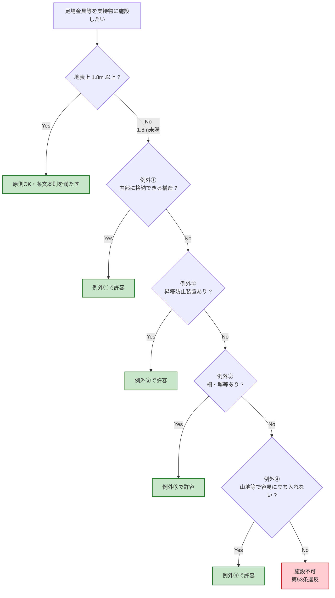

# 電技解釈 第53条 — 架空電線路の支持物に取扱者が昇降に使用する足場金具等の施設

!!! note "📊 概要"
    **出題頻度**: 🔥🔥🔥（過去14年で 3 回出題）

    **重要度**: B（数値1点 + 例外4種の暗記が核心）

    **直近出題**: R05下 問6（穴埋・例外条件の判定）／ H30 問7（穴埋・1.8m / 内部に格納 / 容易に）／ H24 問7（論説・施設高さ）

> 架空電線路の支持物（電柱・鉄塔等）に取扱者が昇降に使用する**足場金具等**は、地表上**1.8m以上**の高さに施設しなければならない。ただし**4つの例外条件**（内部格納構造／昇塔防止装置／柵・塀等／容易に立ち入るおそれがない場所）のいずれかに該当する場合は除く。省令第24条「取扱者以外の昇塔防止」の具体化条文。

| 項目 | 内容 |
|------|------|
| 条文 | 電気設備の技術基準の解釈 第53条 |
| 規定内容 | 架空電線路の支持物の足場金具等を地表上1.8m以上に施設（例外4種あり） |
| 性格 | 施設規定（数値1点 + 例外列挙） |
| 上位 | 省令第24条（取扱者以外の昇塔防止の原則） |
| 並列 | 解釈第59条（支持物の強度）／ 解釈第65条（架空電線の高さ） |
| **典拠（一次ソース）** | 電気設備の技術基準の解釈 第53条 ／ denken-ou.com 解説（R05下問6・H30問7） |
| **照合日** | 2026-05-06（kakomon.yml＋denken-ou.com 解説と照合） |
| **隣接条文** | ← [省令第24条（昇塔防止）](../kijun/24.md) ／ [解釈第59条（支持物の強度）](59.md) → |

!!! warning "📌 一次ソース注記"
    電技解釈は経済産業省告示のため e-Gov 法令検索には未掲載。本ページの条文原文は **過去問本文（H30 問7）と denken-ou.com 解説（R05下 問6）から再構成** しており、経産省告示の正本PDFとの最終照合は「要確認」。例外4種の bullet 順序は denken-ou.com 解説順に従う。

---

## 0. 隣接条文クラスタマップ — 取扱者以外の昇塔防止

!!! tip "なぜこのマップを冒頭に置くか"
    試験では「53条単独」より **「省令第24条との上位／下位関係」「他の昇塔防止対策との比較」** が問われる。53条の核心は「足場金具1.8m＋例外4種」だが、省令24条が要求する **取扱者以外の昇塔防止という上位目的** を最初に押さえると、例外4種の意味が腑に落ちる。

### 昇塔防止系の条文棲み分け

| 条文 | 階層 | 規定対象 | 数値の核心 |
|------|------|---------|----------|
| **省令第24条** | 上位（原則） | 支持物全般の取扱者以外の昇塔防止義務 | — |
| **解釈第53条** | 具体化 | **足場金具等の施設高さ + 例外4種** | **1.8m** |
| 解釈第59条 | 並列 | 支持物の強度（材料・安全率） | 安全率1.5〜2.0 |
| 解釈第65条 | 並列 | 架空電線の地表上高さ | 5m / 6m / 8.5m 等 |

### 53条の独自性

- **足場金具に特化**した数値規定（1.8m）。支持物の他の昇塔手段（昇塔用ボルト等）も含む
- **例外4種** がすべて「実質的に取扱者以外の昇塔を防げる」という代替手段の列挙
- 数値は1点（1.8m）のみ。**例外列挙の暗記が試験の主戦場**

### 複合問題の典型パターン

1. **数値型**: 「足場金具を地表上何m以上に施設するか」 → **1.8m**（H30 問7）
2. **例外判定型**: 「次のうち1.8m未満施設の例外に該当しないものはどれか」 → 例：監視装置（R05下 問6・誤答）
3. **目的整合型**: 省令24条「取扱者以外の昇塔防止」と解釈53条の関係を問う論説（H24 問7）

---

## 1. 全体像と要点

- **足場金具等は地表上 1.8m 以上に施設**（原則）
- **例外4種のいずれかに該当すれば 1.8m 未満も可**
    1. 足場金具等が**支持物の内部に格納**できる構造
    2. **昇塔防止装置**を施設するとき
    3. **柵・塀**等を施設するとき
    4. **山地等で人が容易に立ち入るおそれがない場所**に施設するとき
- 上位 = **省令第24条**（取扱者以外の者が容易に昇塔できないように適切な措置）
- なぜ1.8mか: **大人の手が届きにくい高さ**（成人男性の身長＋手伸ばし範囲の境界・教育的近似）

### 全体像 — 1.8m 境界と例外4種

<svg viewBox="0 0 800 360" xmlns="http://www.w3.org/2000/svg" width="100%" preserveAspectRatio="xMidYMid meet">
<defs>
<filter id="sh53a" x="-20%" y="-20%" width="140%" height="140%"><feDropShadow dx="0" dy="2" stdDeviation="2" flood-opacity="0.15"/></filter>
<linearGradient id="gPole53" x1="0" y1="0" x2="0" y2="1"><stop offset="0%" stop-color="#bcaaa4"/><stop offset="100%" stop-color="#8d6e63"/></linearGradient>
<linearGradient id="gNG53" x1="0" y1="0" x2="0" y2="1"><stop offset="0%" stop-color="#ffcdd2"/><stop offset="100%" stop-color="#ef9a9a"/></linearGradient>
<linearGradient id="gOK53" x1="0" y1="0" x2="0" y2="1"><stop offset="0%" stop-color="#c8e6c9"/><stop offset="100%" stop-color="#a5d6a7"/></linearGradient>
</defs>
<text x="400" y="24" text-anchor="middle" font-size="15" font-weight="700" fill="#212121">第53条 — 足場金具の施設高さと例外4種</text>
<text x="400" y="42" text-anchor="middle" font-size="11" fill="#666">原則：地表上1.8m以上に施設。例外4種のいずれかなら1.8m未満も可。</text>

<rect x="180" y="60" width="40" height="270" rx="3" fill="url(#gPole53)" stroke="#5d4037" stroke-width="1.5"/>
<text x="200" y="350" text-anchor="middle" font-size="10" fill="#3e2723">支持物（電柱）</text>

<line x1="80" y1="240" x2="320" y2="240" stroke="#1976d2" stroke-width="2" stroke-dasharray="6,3"/>
<text x="78" y="244" text-anchor="end" font-size="11" font-weight="700" fill="#1976d2">1.8m</text>
<text x="320" y="234" text-anchor="end" font-size="10" fill="#1976d2">境界線</text>

<rect x="158" y="260" width="84" height="14" rx="2" fill="url(#gNG53)" stroke="#c62828" stroke-width="1.5"/>
<text x="200" y="271" text-anchor="middle" font-size="9" font-weight="700" fill="#b71c1c">原則NG域</text>
<text x="160" y="295" text-anchor="middle" font-size="9" fill="#c62828">地上1.8m未満</text>
<text x="160" y="307" text-anchor="middle" font-size="9" fill="#c62828">に足場金具×</text>

<rect x="158" y="170" width="84" height="14" rx="2" fill="url(#gOK53)" stroke="#2e7d32" stroke-width="1.5"/>
<text x="200" y="181" text-anchor="middle" font-size="9" font-weight="700" fill="#1b5e20">原則OK域</text>
<text x="240" y="200" text-anchor="start" font-size="10" fill="#1b5e20">1.8m以上</text>

<rect x="380" y="80" width="380" height="240" rx="10" fill="#fff8e1" stroke="#f9a825" stroke-width="2"/>
<text x="570" y="105" text-anchor="middle" font-size="13" font-weight="700" fill="#f57f17">例外4種（1.8m未満も可）</text>
<line x1="395" y1="115" x2="745" y2="115" stroke="#f9a825" stroke-width="1"/>

<text x="395" y="140" font-size="11" font-weight="700" fill="#bf360c">①</text>
<text x="412" y="140" font-size="11" fill="#3e2723">支持物の内部に格納できる構造</text>
<text x="412" y="155" font-size="9" fill="#6d4c41">（金具を引き出して使用 → 格納時は手掛り無し）</text>

<text x="395" y="180" font-size="11" font-weight="700" fill="#bf360c">②</text>
<text x="412" y="180" font-size="11" fill="#3e2723">昇塔防止装置を施設</text>
<text x="412" y="195" font-size="9" fill="#6d4c41">（円錐状カバー等で物理的に登れなくする）</text>

<text x="395" y="220" font-size="11" font-weight="700" fill="#bf360c">③</text>
<text x="412" y="220" font-size="11" fill="#3e2723">柵・塀等の囲いを施設</text>
<text x="412" y="235" font-size="9" fill="#6d4c41">（支持物に近づけない・敷地境界を遮断）</text>

<text x="395" y="260" font-size="11" font-weight="700" fill="#bf360c">④</text>
<text x="412" y="260" font-size="11" fill="#3e2723">山地等で人が容易に立ち入るおそれがない場所</text>
<text x="412" y="275" font-size="9" fill="#6d4c41">（地理的にアクセス困難）</text>

<rect x="395" y="290" width="350" height="22" rx="4" fill="#ffebee" stroke="#d32f2f" stroke-width="1.5"/>
<text x="570" y="305" text-anchor="middle" font-size="10" font-weight="700" fill="#b71c1c">⚠️ 監視装置は例外に含まれない（R05下問6誤答）</text>
</svg>

**読み解き**: 1.8m境界より下に足場金具を**取扱者以外**が触れる位置で付けてはならない。ただし4種の代替策のいずれかで「**実質的に**取扱者以外が昇塔できない」状態を確保できれば例外として許容される。**「監視するだけ」では物理的に昇塔を防げない** ので例外に該当しない（重要なひっかけ）。

### 要点（試験前30秒復習用）

| 観点 | 内容 |
|------|------|
| **数値の核心** | **1.8m**（地表上の最低施設高さ） |
| **例外①** | **内部に格納**できる構造 |
| **例外②** | **昇塔防止装置**の施設 |
| **例外③** | **柵・塀**等の施設 |
| **例外④** | **山地等で人が容易に立ち入るおそれがない場所** |
| **上位** | **省令第24条**（取扱者以外の昇塔防止） |
| **誤答常連** | **監視装置**（防止できない）／ **監視員配置**（同上）／**警告表示**（物理障壁なし） |

??? question "セルフチェック: なぜ「1.8m」という値か？"
    成人男性の身長は概ね 1.7m 前後で、手を伸ばしても届きにくくなる高さの目安が **1.8m**。子供や一般通行人が**地上から手を掛けて登り始めること**を物理的に困難にする境界。

    !!! warning "本セクションは『暗記補助のための教育的近似』 — 公式根拠ではない"
        この高さの規格上の正確な決定根拠（JESC・経産省の議事録等）は本記事では未確認。試験対策では **「1.8m」** という規格値そのものを覚えるのが正解。「身長に手伸ばしを足して」という説明は **記憶定着の補助** として活用するもので、公式の導出ではない。

??? question "セルフチェック: 監視装置（カメラ）を支持物に付ければ1.8m未満に足場金具を付けてよいか？"
    **不可**。条文の例外は「**物理的に昇塔を防ぐ・遮る**」措置に限られる。

    - ① 内部格納 → 物理的に触れない
    - ② 昇塔防止装置 → 物理的に登れない
    - ③ 柵・塀 → 物理的に近づけない
    - ④ 山地等 → 地理的にアクセスできない

    監視装置は「事後発見」の手段であり、昇り始めることを防げないため例外に該当しない。**R05下 問6 の誤答選択肢**として出題された。

---

## 2. 条文原文

**電気設備の技術基準の解釈 第53条（架空電線路の支持物に取扱者が昇降に使用する足場金具等の施設）**

> 架空電線路の支持物に取扱者が昇降に使用する<mark>足場金具</mark>等を施設する場合は、地表上<mark>1.8m</mark>以上に施設すること。ただし、次の各号のいずれかに該当する場合は、この限りでない。
>
> 一　足場金具等が<mark>内部に格納</mark>できる構造である場合
> 二　支持物に昇塔防止のための装置を施設する場合
> 三　支持物の周囲に取扱者以外の者が立ち入らないように、さく、へい等を施設する場合
> 四　<mark>支持物を山林その他の場所であって、人が容易に立ち入るおそれがない場所に施設する場合</mark>
>
> <small>黄色マーカー = 過去問で穴埋め出題された語句（H30 問7：足場金具／1.8m／内部に格納／容易に）</small>

!!! note "対応する省令条文"
    **電気設備に関する技術基準を定める省令 第24条**：「電線路の支持物には、感電のおそれがないよう、取扱者以外の者が容易に昇塔できないように適切な措置を講じなければならない」（解釈第53条はこの省令第24条を具体化したもの）

→ 解釈第53条は省令第24条の「適切な措置」の **典型実装** を示す。1.8m原則と例外4種は、いずれも「**取扱者以外の容易な昇塔の防止**」という上位目的に従属する。

### 過去問で問われた箇所

第53条は過去14年で計3回出題されている。穴埋め問題では条文中のキーワードが空欄になる。

| 出題で狙われるキーワード | 過去問での扱い |
|---|---|
| **1.8m** | 数値の穴埋め（H30 問7・R05下 問6） |
| **足場金具** | 規制対象の穴埋め |
| **内部に格納** | 例外①の穴埋め（H30 問7） |
| **容易に**（立ち入るおそれがない） | 例外④の穴埋め（H30 問7） |
| **昇塔防止装置** | 例外②の用語穴埋め |
| **取扱者以外** | 上位目的（省令第24条との対応） |

!!! tip "暗記の核心キーワード"
    - **1.8m**（数値・他に類似数値なし → 単独で覚える）
    - **足場金具等**（規制対象・「等」を落とすと減点）
    - 例外4種：**内部格納 ／ 昇塔防止装置 ／ 柵・塀 ／ 容易に立ち入るおそれがない場所**

!!! warning "「要確認」 条文原文の最終照合"
    上記原文は H30 問7 の本文と denken-ou.com 解説（R05下 問6）から再構成。経済産業省告示「電気設備の技術基準の解釈」の正本PDFとの逐語照合は今後実施予定。条文の実質的内容は確定しているが、句読点・送り仮名・「号」配置の微差は告示原本で確認する。

---

## 3. 原文解析（ブロック分解）

条文を意味ブロック単位に分解し、それぞれの試験ポイントを整理する。

| 原文ブロック | 意味 | 試験のポイント |
|---|---|---|
| 「架空電線路の支持物に」 | 適用範囲＝**架空電線路の支持物**（電柱・鉄塔・鉄筋コンクリート柱） | 地中電線路は対象外（→ 解釈第120条系） |
| 「取扱者が昇降に使用する足場金具等を」 | 規制対象＝**取扱者用**の昇降設備（足場金具・昇塔用ボルト等） | 「等」が示すのは類似機能の代替物（昇塔ピン等） |
| 「地表上 1.8m 以上に施設すること」 | **数値の核心**：地表面から金具下端までの高さ | 「以上」が必須。「以下」「未満」は誤り |
| 「ただし、次の各号のいずれかに該当する場合は」 | **例外列挙**の冒頭 | **「いずれか1つ」で例外成立**（複数同時不要） |
| 「足場金具等が内部に格納できる構造である場合」 | **例外①**：物理的に手掛り無し化 | 「使用時は引き出す → 通常は格納」のメカ仕様 |
| 「支持物に昇塔防止のための装置を施設する場合」 | **例外②**：登坂を物理的に阻止 | 円錐カバー・スパイク等が典型 |
| 「さく、へい等を施設する場合」 | **例外③**：境界遮断 | 「等」は支持物への近接を遮る他の構造物 |
| 「人が容易に立ち入るおそれがない場所」 | **例外④**：地理的アクセス困難 | 「容易に」が穴埋め頻出 |

??? question "セルフチェック: 例外②と例外③の違いを30秒で説明できる？"
    - **②昇塔防止装置** = **支持物そのもの**に取り付ける装置（円錐状カバー等で物理的に登れなくする）
    - **③柵・塀**等 = **支持物の周囲**を囲う構造物（支持物に**近づくこと自体**を遮断する）

    層が違う：②は「登るところで止める」、③は「近づくところで止める」。試験では「敷地全体を囲ったので足場金具を地表に近づけて施設可」のような場合に③で対応する。

??? question "セルフチェック: 「監視カメラを設置」「警告看板を立てる」「監視員を配置」のうち、第53条の例外に該当するものは？"
    **どれも該当しない**。条文の例外は **物理的・地理的に昇塔を阻止する** 措置に限られる。

    - 監視カメラ → 事後発見（昇り始めを止められない）
    - 警告看板 → 心理的抑止のみ
    - 監視員 → 配置時間外は機能しない

    R05下 問6 では「監視装置を施設する場合」が誤答選択肢として出題された。**「物理的・恒久的に防げるか」を判断基準にする**。

---

## 4. かみ砕き解説（因果理解）

### なぜ1.8mか — 「容易に登れない」境界を物理化

省令第24条が要求するのは「**取扱者以外**が容易に昇塔できない措置」。「容易に」を物理的に定義したのが1.8m。

- 成人男性の身長 ≈ 1.7m
- 手を伸ばしても掴みにくくなる高さ ≈ **1.8m**
- 子供や酔客が遊び半分で登り始めるリスクをこの高さで遮断

### なぜ例外が4種で過不足ないか — 「昇塔不可の代替パス」

1.8m未満に足場金具を付けても **取扱者以外が昇れない状態** が確保できれば、上位目的（省令24条）は満たされる。その「確保のしかた」が4種に分類される。

| 例外 | 阻止のレイヤー | 代表例 |
|------|----------------|--------|
| ① 内部格納 | **手掛りそのもの**を消す | 引き出し式金具（不使用時は支持物面と平ら） |
| ② 昇塔防止装置 | **登る動作**を阻止する | 円錐カバー・スパイク・防止板 |
| ③ 柵・塀 | **支持物への接近**を阻止する | 敷地フェンス・コンクリート塀 |
| ④ 山地等 | **その場所への到達**を阻止する | 山林内・離島・人跡未踏地 |

**①→②→③→④** の順に **「より遠い距離」で阻止** する戦略。どの層で防いでもよい、という冗長設計。

### 用語の混同を防ぐ — 似た名前の罠（認知需要D）

| 用語 | 何を指すか | 53条との関係 |
|------|-----------|-------------|
| **足場金具**（53条規制対象） | 取扱者が支持物を昇降する**ための**金具（ステップボルト等） | **規制対象** |
| **昇塔防止装置**（53条例外②） | 取扱者以外が昇塔**できない**ようにする装置（円錐カバー等） | **例外②の手段** |
| **昇塔防止のための足場金具** | 上記2つを混同した誤用語 | **存在しない** |
| **監視装置**（カメラ等） | 不正昇塔を**監視・通報**する装置 | **例外に該当しない**（R05下問6誤答） |
| **取扱者** | 電気主任技術者・電気工事士等の有資格者 | 53条の規制対象**外**（=昇る権利あり） |
| **取扱者以外**（省令24条） | 上記以外の一般人・通行人・子供等 | 53条が**保護対象**として想定 |

!!! warning "ひっかけ最頻出：『足場金具を昇塔防止装置として使う』は誤り"
    足場金具は**昇る道具**、昇塔防止装置は**昇るのを止める道具**。**目的が真逆**。試験で「昇塔防止のために足場金具を施設する」のような選択肢が出たら誤り。

### なぜ「監視装置」は例外に含まれないか

省令24条の文言は「**容易に昇塔できないように**」適切な措置。**「容易に」の判定基準が物理的可能性**であって**事後発見の有無ではない**ことが核心。

- 監視カメラ：**昇り始めた後に発見**する装置（=昇塔自体は容易）
- 監視員：**昼間のみ・有人時間のみ**機能（=深夜は容易に昇塔可）
- 警告看板：**心理的抑止**のみ（=物理的には登れる）

「**24時間・無人で・物理的に防げる**」措置だけが例外になる。これが4種すべてに共通する性質。

---

## 5. 図で理解

### 例外判定フロー

### 物理イメージ — 例外②「昇塔防止装置」の典型例（円錐カバー）

<svg viewBox="0 0 800 320" xmlns="http://www.w3.org/2000/svg" width="100%" preserveAspectRatio="xMidYMid meet">
<defs>
<filter id="sh53b" x="-20%" y="-20%" width="140%" height="140%"><feDropShadow dx="0" dy="2" stdDeviation="2" flood-opacity="0.15"/></filter>
<linearGradient id="gPole53b" x1="0" y1="0" x2="0" y2="1"><stop offset="0%" stop-color="#bcaaa4"/><stop offset="100%" stop-color="#8d6e63"/></linearGradient>
</defs>
<text x="400" y="24" text-anchor="middle" font-size="15" font-weight="700" fill="#212121">例外②の代表例 — 昇塔防止装置（円錐カバー）</text>
<text x="400" y="42" text-anchor="middle" font-size="11" fill="#666">支持物そのものに装置を取り付け、足場金具より下を物理的に登れなくする。</text>

<rect x="180" y="60" width="40" height="240" rx="3" fill="url(#gPole53b)" stroke="#5d4037" stroke-width="1.5"/>
<text x="200" y="318" text-anchor="middle" font-size="10" fill="#3e2723">電柱</text>

<rect x="160" y="100" width="80" height="6" rx="1" fill="#455a64" stroke="#263238" stroke-width="1"/>
<text x="245" y="106" text-anchor="start" font-size="10" fill="#263238">足場金具（地表上 1.8m 未満でも可）</text>
<rect x="160" y="130" width="80" height="6" rx="1" fill="#455a64" stroke="#263238" stroke-width="1"/>
<rect x="160" y="160" width="80" height="6" rx="1" fill="#455a64" stroke="#263238" stroke-width="1"/>

<polygon points="160,180 240,180 280,220 120,220" fill="#ff8a65" stroke="#bf360c" stroke-width="2"/>
<text x="200" y="205" text-anchor="middle" font-size="11" font-weight="700" fill="#bf360c">昇塔防止装置</text>
<text x="200" y="235" text-anchor="middle" font-size="10" fill="#bf360c">（円錐カバー）</text>

<line x1="60" y1="220" x2="320" y2="220" stroke="#1976d2" stroke-width="2"/>
<text x="58" y="217" text-anchor="end" font-size="10" font-weight="700" fill="#1976d2">この高さ以下は</text>
<text x="58" y="229" text-anchor="end" font-size="10" font-weight="700" fill="#1976d2">物理的に登れない</text>

<line x1="120" y1="300" x2="320" y2="300" stroke="#5d4037" stroke-width="2"/>
<text x="60" y="304" text-anchor="end" font-size="10" fill="#5d4037">地表</text>

<rect x="380" y="80" width="380" height="220" rx="10" fill="#e3f2fd" stroke="#1976d2" stroke-width="2"/>
<text x="570" y="105" text-anchor="middle" font-size="13" font-weight="700" fill="#0d47a1">昇塔防止装置の機能</text>
<line x1="395" y1="115" x2="745" y2="115" stroke="#1976d2" stroke-width="1"/>

<text x="395" y="138" font-size="11" fill="#0d47a1">• 円錐カバーの外周は手で掴めない</text>
<text x="395" y="158" font-size="11" fill="#0d47a1">• 足を置いても滑り落ちる斜面構造</text>
<text x="395" y="178" font-size="11" fill="#0d47a1">• カバー直下の足場金具に届かない</text>
<text x="395" y="198" font-size="11" fill="#0d47a1">• 取扱者は梯子等を別途使用して上る</text>

<line x1="395" y1="215" x2="745" y2="215" stroke="#1976d2" stroke-width="1"/>
<text x="570" y="240" text-anchor="middle" font-size="12" font-weight="700" fill="#0d47a1">→ 例外②の要件「昇塔防止」を満たす</text>
<text x="570" y="262" text-anchor="middle" font-size="11" fill="#0d47a1">取扱者以外の容易な昇塔を物理的に阻止</text>
<text x="570" y="284" text-anchor="middle" font-size="10" fill="#1976d2">（例外③：柵・塀／例外④：山地は別レイヤー）</text>
</svg>

---

## 6. 例外4種のA/B 2層暗記表

!!! tip "暗記レイヤー：『どこで止めるか』で4分類"
    ① 手掛り消去 → ② 登坂阻止 → ③ 接近阻止 → ④ 到達阻止 の順で「より遠くで止める」。**①が最も近接、④が最も遠隔**。

| # | 例外条件 | 阻止レイヤー | 典型例 | 過去問関連 |
|---|---------|-------------|--------|-----------|
| ① | 足場金具等が**内部に格納**できる構造 | 手掛り消去 | 引き出し式・収納式金具 | H30 問7 穴埋（「内部に格納」） |
| ② | 支持物に**昇塔防止装置**を施設 | 登坂阻止 | 円錐カバー・スパイク・防止板 | — |
| ③ | 支持物の周囲に**さく、へい**等 | 接近阻止 | 敷地境界フェンス・コンクリート塀 | — |
| ④ | **山地等で人が容易に立ち入るおそれがない**場所 | 到達阻止 | 山林内・人跡未踏地・離島の支持物 | H30 問7 穴埋（「容易に」） |

!!! warning "例外に該当しないもの（誤答常連）"
    | 紛らわしい措置 | 例外に該当しない理由 | 出題年 |
    |--------------|---------------------|--------|
    | **監視装置**（カメラ等） | 事後発見のみ、昇塔自体は阻止できない | R05下 問6（誤答） |
    | **監視員配置** | 配置時間外（夜間等）は機能せず、24時間防止できない | — |
    | **警告表示** | 心理的抑止のみ、物理障壁なし | — |
    | **保安規程への記載** | 紙の上の取り決めで物理的措置ではない | — |

---

## 7. 試験で問われること

| 出題形式 | 過去出題の核心 | 対策 |
|---------|----------------|------|
| **数値穴埋** | 「地表上□m以上に施設」 | **1.8m** を即答できる |
| **例外条件穴埋** | 「足場金具等が□に格納できる構造」「人が□に立ち入るおそれがない場所」 | **内部** ／ **容易** を覚える |
| **例外判定（誤答指摘）** | 5択で1つだけ例外に該当しないものを選ぶ | **「物理的・恒久的に防げるか」** を判断基準に |
| **論説（H24）** | 足場金具の施設高さの規定の趣旨を述べさせる | **省令24条との上位下位関係** を文章化できる |

### 出題傾向（過去14年）

- 平均出題頻度：**4〜6年に1回**（数値1点・例外列挙・誤答識別が3パターン）
- **R05下 問6** が直近出題（穴埋・例外判定）。R06 / R07 では未出題のため、**R08 で再出題の可能性が高め**

---

## 8. 頻出ひっかけ（重要度コード付き）

### 🔴 致命的：見落とすと配点1問丸ごと失う

| ❌ 誤った理解 | ✅ 正しい理解 |
|-------------|-------------|
| 監視装置（カメラ）を施設すれば1.8m未満も可 | 監視装置は例外に該当しない（**物理的阻止**が要件） |
| 警告看板で1.8m未満も可 | 警告は心理的抑止のみで例外に**含まれない** |
| 1.8m **以下** に施設してよい | 条文は「**1.8m以上**」。「以下」「未満」は誤り |

### 🟡 注意：選択肢の絞り込みで判断ミスしやすい

| ❌ 誤った理解 | ✅ 正しい理解 |
|-------------|-------------|
| 例外が成立するには①〜④を**すべて**満たす必要がある | 「**いずれか**」一つで例外成立（条文「いずれかに該当する場合」） |
| 足場金具と昇塔防止装置は同じもの | 足場金具＝昇る道具／昇塔防止装置＝昇るのを止める道具（**目的が真逆**） |
| 内部格納構造は**昇塔防止装置の一種** | 例外①と例外②は**別概念**（内部格納は手掛り消去・防止装置は登坂阻止） |

### 🟢 軽微：減点までは行きにくいが正確に

| ❌ 誤った理解 | ✅ 正しい理解 |
|-------------|-------------|
| 53条は地中電線路の支持物にも適用 | **架空電線路**の支持物のみ対象（地中は別系統） |
| 取扱者も1.8m未満に金具があれば登れない | 取扱者は梯子等で**別途昇る前提**。53条は取扱者以外の保護条文 |

---

## 9. 穴埋め過去問チャレンジ

!!! abstract "H30 問7（穴埋・3空欄）"
    架空電線路の支持物に取扱者が昇降に使用する足場金具等は、地表上 **(ア)** m 以上に施設すること。ただし、足場金具等が **(イ)** できる構造である場合、又は支持物を山林その他の場所であって、人が **(ウ)** 立ち入るおそれがない場所に施設する場合は、この限りでない。

??? success "解答（H30 問7）"
    - **(ア) 1.8**
    - **(イ) 内部に格納**
    - **(ウ) 容易に**

    **正解の選択肢: (5) 1.8 / 内部に格納 / 容易に**

    ポイント：(ア) は数値1点暗記、(イ) は例外①の核心キーワード、(ウ) は例外④の核心キーワード。3空欄すべてが「条文中の重要語句」で、**条文を一度通読していれば全問正解できる**典型パターン。

!!! abstract "R05下 問6（穴埋・誤答識別）"
    架空電線路の支持物に取扱者が昇降に使用する足場金具等を地表上1.8m未満に施設できる場合として、第53条に定められていないものはどれか。

    - (1) 支持物に **監視装置** を施設する場合
    - (2) 足場金具等が **内部に格納** できる構造である場合
    - (3) 支持物に **昇塔防止のための装置** を施設する場合
    - (4) 支持物の周囲に取扱者以外の者が立ち入らないように、**さく、へい等** を施設する場合
    - (5) 支持物を山林その他の場所であって、人が **容易に立ち入るおそれがない** 場所に施設する場合

??? success "解答（R05下 問6）"
    **正解: (1) 監視装置を施設する場合**

    監視装置は事後発見（昇塔行為が始まった後に検知）であり、**取扱者以外の容易な昇塔を物理的に阻止する措置ではない**。条文の例外4種はいずれも「**物理的・地理的・恒久的に昇塔を不可能にする**」措置に限定される。

    判断基準：「**24時間・無人で・物理的に**防げるか」を問うと、(2)〜(5) はすべてYes、(1) はNo。

!!! abstract "H24 問7（論説・想定）"
    架空電線路の支持物に取扱者が昇降に使用する足場金具等の施設について、電気設備の技術基準の解釈で定められている規定の趣旨と内容を述べよ。

??? success "解答骨子（H24 問7）"
    1. **趣旨**：省令第24条「取扱者以外の者が容易に昇塔できないように適切な措置」の具体化。一般人・子供等の感電・墜落事故防止。
    2. **原則**：足場金具等は地表上 **1.8m以上** に施設。
    3. **例外4種**（いずれかに該当すれば1.8m未満も可）：
        - 内部に格納できる構造
        - 昇塔防止装置を施設
        - 柵・塀等を施設
        - 山地等で人が容易に立ち入るおそれがない場所に施設
    4. **共通する設計思想**：いずれも**物理的・地理的に昇塔を阻止する代替手段**であり、監視装置や警告のような事後・心理的手段は含まれない。

---

## 10. まぎらわしい選択肢と正解の違い

| 誤答パターン | 正答 | なぜ違うか |
|-------------|------|-----------|
| 「**監視装置** を設置すれば1.8m未満でも可」 | 不可 | 物理的阻止ではないため例外に該当しない |
| 「足場金具を地表上 **1.5m** 以上に施設」 | 1.8m | 数値の暗記。**1.5m と混同しやすい**（接地工事の25cm・1.2m等と区別） |
| 「**人が立ち入らない**場所」 | 「**人が容易に立ち入るおそれがない**場所」 | 条文の正確な表現は「容易に立ち入るおそれがない」。「立ち入らない」と短く書くと不正確 |
| 「**保安規程** に記載すれば1.8m未満でも可」 | 不可 | 紙の取り決めは物理的措置ではない |
| 「**例外を全て**満たす必要がある」 | 「**いずれか**」 | 条文「**いずれかに該当**」=1つでOK |

---

## 11. 過去問実績

| 年度 | 問 | 形式 | 論点 | 直近 |
|------|-----|------|------|------|
| **R05下** | 6 | 穴埋（誤答識別） | 例外4種の判定（誤答=監視装置） | 🔥 直近 |
| H30 | 7 | 穴埋 | 1.8m / 内部に格納 / 容易に | |
| H24 | 7 | 論説 | 足場金具の施設高さの趣旨 | |

!!! note "R08 出題予測"
    出題頻度は中程度（過去14年で3回・約4〜5年に1回）。**R06 / R07 では未出題のため、R08 で穴埋め再出題の可能性が高め**。
    予想論点：(1) 1.8m の数値、(2) 例外4種のいずれかの穴埋め（特に「内部に格納」「容易に」）、(3) R05下と同様の誤答識別（監視装置・警告表示・保安規程記載などのダミー選択肢）。

---

## 12. 関連ページ

- [省令第24条（取扱者以外の昇塔防止）](../kijun/24.md) — **上位条文**。本条はこの省令の具体化
- [解釈第59条（架空電線路の支持物の強度）](59.md) — 並列条文。支持物そのものの強度規定
- [解釈第65条（架空電線の高さ）](65.md) — 並列条文。電線の地表上高さ規定
- [テーマ：支持物](../../themes/shijimono.md) — 支持物関連条文の横断整理

---

## 13. 最終チェック

### 数値暗記

- [ ] 足場金具の施設高さ = 地表上 **1.8m以上**
- [ ] **以下／未満は誤り**。「以上」必須

### 例外4種

- [ ] ① **内部に格納**できる構造
- [ ] ② **昇塔防止装置** を施設
- [ ] ③ **柵・塀** 等を施設
- [ ] ④ 山地等で人が **容易に立ち入るおそれがない** 場所
- [ ] 「**いずれか**」一つで例外成立（全部不要）

### 法令体系

- [ ] 上位 = **省令第24条**（取扱者以外の昇塔防止）
- [ ] 規制対象 = **架空電線路** の支持物（地中電線路は別）
- [ ] 規制対象設備 = **取扱者が昇降に使用する足場金具等**

### ひっかけ対策

- [ ] **監視装置**（カメラ）は例外に**該当しない**（R05下 問6 誤答）
- [ ] **警告看板・監視員配置** も該当しない（物理的阻止ではない）
- [ ] **足場金具と昇塔防止装置** は目的が真逆
- [ ] 例外は **物理的・恒久的・無人で** 機能する措置に限定

---

## 監修ログ

- **2026-05-06**: 初版作成（v2.4 テンプレ準拠）。kakomon.yml で過去問3件（H24-7・H30-7・R05下-6）を確認、denken-ou.com 解説（R05下 houkir5-2-6・H30 houkih30-7）で例外4種と空欄解（1.8m / 内部に格納 / 容易に）を確認。条文原文は denken-ou.com 解説と過去問本文から再構成し「要確認」フラグ付き（経産省告示PDFとの逐語照合は今後）。
- **2026-05-06 v2.4**: テンプレートゴールドスタンダード（kijun/58.md v2.4）準拠
    - **条文番号確定根拠**: kakomon.yml と denken-ou.com の照合により「解釈第53条」と確定。改正リスクは低（分散型電源系・第220条台外）
    - **既存wiki参照の独立検証**: 隣接条文 第59条（支持物の強度）と内容重複なきことを確認
    - **未確認領域**: 経産省告示「電気設備の技術基準の解釈」正本PDFの逐語確認（→ 条文原文セクションに 「要確認」 フラグ付与）
    - **構造**: メタテーブル「典拠／照合日／隣接条文」3行 ／ 0章「隣接条文クラスタマップ」 ／ 認知需要A/B/C/D全採用（用語罠表・1.8m根拠・SVG位置図解・類似名罠表）／ 教育的近似ガード付き ／ 監修ログ3行 ／ ステータスラベル付フッタ

---

*最終確認: 2026-05-06 | ステータス: v2.4（初版・条件付セクション運用） ｜ 条文番号: ✅ kakomon DB＋denken-ou.com 照合済 ｜ 出題実績: ✅ kakomon DB照合済（H24-7・H30-7・R05下-6） ｜ 数値根拠: ⚠️ 教育的近似ガード付（規格上の正確な決定根拠は経産省告示PDF未確認） ｜ 条文原文: ⚠️ 「要確認」（経産省告示PDFとの逐語照合は今後） ｜ [バージョニング基準](../../reference/versioning.md)*
