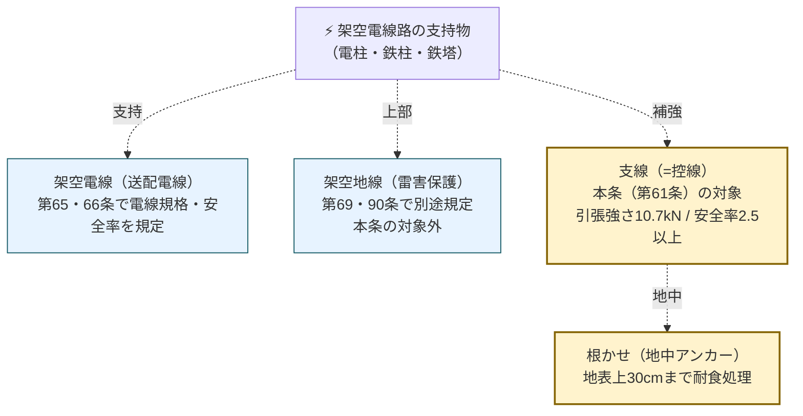
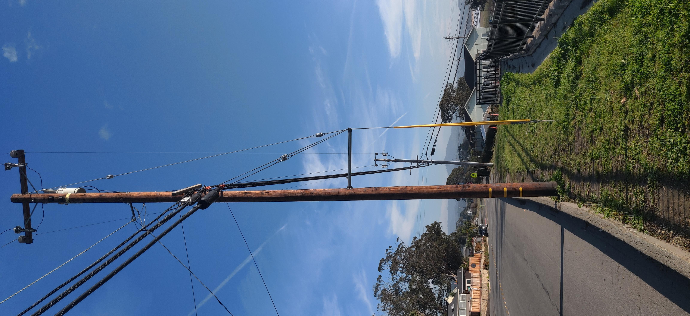

# 電技解釈 第61条 — 支線の施設方法及び支柱による代用

!!! warning "📜 一次ソース確認のお願い（2026-05-24）"
    本ページは電気設備の技術基準の解釈（経済産業省が省令の解釈として示すもの）を学習用に整理したものです。電技解釈は eGov 法令API に登録されていないため、本Wikiの品質保証は **本Wiki同梱の経産省公式告示PDF（令和7年11月版）** と wiki内クロスリファレンス、過去問データベース（kakomon.yml）への照合に依存しています。**重要な実務判断や試験直前の最終確認は、必ず最新告示PDF（[📕 電気設備の技術基準の解釈 令和7年11月版（本Wiki同梱）](../../assets/pdf/denken-kaishaku-r07-11.pdf) ／ 配布元: [経産省公式ページ](https://www.meti.go.jp/policy/safety_security/industrial_safety/sangyo/electric/detail/setsubi_kijun.html)）に当たってください**。誤記を発見された場合は GitHub Issues でご連絡ください。

!!! note "📊 概要"
    **出題頻度**: 🔥🔥（過去14年で **2回出題**・R03 問11 と R07下 問13 で **計算問題** として出題）

    **重要度**: A（数値暗記の核心：引張強さ **10.7kN** ／ 安全率 **2.5** ／ 素線 **3条以上 × 直径2mm以上 × 0.69kN/mm²** ＋ 道路横断 **路面上5m** ＋ 特例 **6.46kN / 1.5**）

    **直近出題**: R07下 問13（計算・支線の張力と必要な素線の直径）／ R03 問11（計算・支線に生じる引張荷重と支線の必要条数）

> 架空電線路の支持物に施設する **支線**（しせん／guy wire）は、引張強さ **10.7kN以上** ／ 安全率 **2.5以上** が原則。**支線素線**（より線の構成要素）は **3条以上より合わせ・直径2mm以上・引張強さ0.69kN/mm²以上** の金属線を使用する。第62条・第70条第3項適用時は **6.46kN / 1.5** に緩和される（特例）。**道路横断時は路面上5m以上**、地中部分は耐食処理 + 根かせ施工。接触のおそれがあれば **がいし挿入**。R03 問11・R07下 問13 で計算問題として出題されており、許容引張荷重 **P = T / R** の式と組み合わせて頻出。

!!! tip "💡 暗記の核心：5秒で思い出す"
    試験直前にこの5項目だけ思い出せれば計算問題に対応できる。**核心は「数値5系統」**：

    - **暗記の核心①** 引張強さ **10.7**kN以上 ／ 安全率 **2.5**以上（一般）— 特例は **6.46**kN ／ **1.5**
    - **暗記の核心②** 素線は **3条以上 × 直径2mm以上 × 0.69**kN/mm²以上（三号の3点セット）
    - **暗記の核心③** 地中部分 ＋ 地表上 **30cm** まで耐食処理（四号）
    - **暗記のポイント④** 道路横断は路面上 **5m** 以上（例外 4.5m／歩行 2.5m）
    - **覚え方のコツ** 「**10.7 / 2.5 / 3条2mm0.69 / 30cm / 5m**」をリズムで唱える。安全率を 2.0（木柱）・2.2（硬銅線）と混同しないことが最大の落とし穴

| 項目 | 内容 |
|------|------|
| 条文 | 電気設備の技術基準の解釈 第61条 |
| 規定内容 | 支線の引張強さ／安全率／素線条件／地中部分／道路横断高さ／接触防止／支柱代用 |
| 性格 | 数値規定（引張強さ・安全率・寸法） |
| 委任元 | 省令第6条（電線の接続）・第20条（電線路の支持物等）・第25条第2項（支持物の倒壊防止） |
| 関連条文 | 解釈第59条（木柱の強度2.0）／第60条（基礎の強度2.0・鉄塔基礎1.33）／第62条（高圧・特高支持物の支線・**支線特例の根拠**）／第70条第3項（保安工事・**支線特例の根拠**）／第66条（高圧架空電線の安全率2.2/2.5） |
| **典拠（一次ソース）** | 電気設備の技術基準の解釈（**経済産業省が省令の解釈として示すもの・令和7年11月版**）第61条 ／ 経産省告示PDFキャッシュ `scripts/cache/kaishaku-meti-2025-11.txt` L5499-5519 と本文を逐語照合（2026-05-24） |
| **照合日** | 2026-05-24（kaishaku-meti-2025-11.txt L5499-5519 と本文を逐語照合済／kakomon.yml の R03 問11・R07下 問13 を「支線」キーワードで検索・主根拠「解釈 第61条」を確認） |
| **隣接条文** | ← 第60条（支持物の基礎の安全率2.0・鉄塔基礎異常時1.33・記事未作成） ／ **本条** ／ 第62条（高圧・特高支持物の支線施設・本条特例の発動条件・記事未作成） → ／ [第66条（高圧架空電線の安全率2.2/2.5）](66.md) |
| **混同注意** | **支線**（しせん／guy wire・支柱を地面に引っ張って固定する補強ワイヤ）と **架空地線**（がくうちせん／overhead ground wire・雷害保護のため電線の上方に張る接地線）と **控線**（ひかえせん／同義語：支線の別称）を混同しないこと。本条が規定するのは **支線（=控線）**。架空地線は **第69条・第90条** で別に規定 |

---

## ★0. 隣接条文クラスタマップ — 第3章 電線路（第59〜63条 支持物・支線・径間）

!!! tip "なぜこのマップを冒頭に置くか"
    解釈第59〜63条は **架空電線路の支持物まわりの強度規定** の連番条文で論点が紛らわしい。本条（支線）は支持物本体（第59・60条）と高圧・特高の支線施設要件（第62条）の中間に位置する。**「安全率2.0は木柱・基礎」「2.5は支線」「1.5は支線特例」「1.33は鉄塔基礎異常時」** の使い分けを最初に押さえる。

### 第59〜63条の役割分担

| 条文 | 規制対象 | 数値の核心 | 試験での問われ方 |
|------|---------|-----------|------------------|
| [第59条](../kaishaku/59.md) | 架空電線路の支持物として使用する **木柱** | 木柱の **風圧荷重に対する安全率 2.0** | 木柱の規格・安全率の穴埋め |
| 第60条（記事未作成） | 支持物の **基礎の安全率** | 基礎（一般）**2.0** ／ 鉄塔基礎（異常時想定）**1.33** | 基礎の安全率と異常時想定の境界 |
| **第61条**（本ページ） | **支線（および支柱代用）** | **引張強さ10.7kN以上 ／ 安全率2.5以上 ／ 素線3条 × 2mm × 0.69kN/mm²** ＋ **特例6.46kN / 1.5** | **支線の引張強さ・安全率・素線条件・道路横断5m** |
| 第62条 | 高圧・特高架空電線路の支持物（木柱・A種コンクリ・A種鉄柱）への **支線施設の要件** | 水平角度5度／不平均張力／全架渉線想定最大張力 | 支線が必要な箇所の判定 |
| 第63条 | 高圧・特高架空電線路の **径間制限**（63-1表） | 径間（長径間工事以外：木柱・A種 150m以下 / B種 250m以下 / 鉄塔 600m以下〔170,000V以上は800m以下〕） | 径間の上限値の穴埋め |

### 第61条の独自性

- **唯一「ワイヤ単体の引張強さ・安全率」を規定** — 支持物（木柱・基礎）の安全率規定（第59・60条）とは別軸
- **本条と特例（第62条・第70条第3項）の使い分け** が試験の核心：
    - **一般**：10.7 kN以上 ／ 安全率2.5以上
    - **特例**：6.46 kN以上 ／ 安全率1.5以上（第62条＝高圧・特高支持物の支線施設要件 ／ 第70条第3項＝低圧保安工事）
- **素線（より線の構成要素）の規格** が独立に規定 — 「3条以上 × 直径2mm以上 × 引張強さ0.69kN/mm²以上」
- **地中部分の耐食処理** が独立に規定 — 30cm深さまで耐食性 or 亜鉛めっき + 根かせ
- **道路横断時の高さ** が独立に規定 — 路面上5m（例外で4.5m / 歩行2.5m）

### 複合問題の典型パターン

1. **安全率選択型**: 「架空電線路の支持物に施設する支線（一般）の引張強さに対する安全率は？」 → **2.5以上**（R07下 問13 (a) と同型）
2. **引張強さ判定型**: 「電線路の水平角度が5度を超える箇所に施設する支線の引張強さは？」 → **6.46kN以上**（第62条適用 → 第61条特例で6.46kN）
3. **素線数計算型**: 「素線1条の引張強さがF[kN]、要求引張強さが10.7kN/安全率2.5を満たす場合の素線条数 n は？」 → **n ≥ (10.7 × 2.5) / F**（R03 問11 と同型）
4. **境界判定型**: 「支線の地中部分の耐食処理が必要な範囲は？」 → **地中部分 + 地表上30cm まで**

---

## 1. 全体像と要点

- **架空電線路の支持物に施設する支線**は、引張強さ **10.7 kN以上** ／ 安全率 **2.5以上**（第1項一号・二号）
- **特例**（第62条・第70条第3項適用時）：引張強さ **6.46 kN以上** ／ 安全率 **1.5以上**
- **より線使用時の素線条件**（第1項三号）：
    - 素線を **3条以上** より合わせる
    - 素線の直径は **2 mm以上**
    - 素線の引張強さは **0.69 kN/mm²以上** の金属線
- **地中部分の処理**（第1項四号）：木柱に施設する場合を除き、**地中の部分 + 地表上30cmまで** は **耐食性のあるもの** または **亜鉛めっきを施した鉄棒** を使用し、容易に腐食しがたい **根かせに堅ろうに取り付ける**
- **根かせの強度**（第1項五号）：支線の引張荷重に十分耐えるよう施設
- **道路横断時の高さ**（第2項）：**路面上5m以上**。技術上やむを得ず、かつ交通に支障なし → **4.5m以上**。歩行のみ → **2.5m以上**
- **接触のおそれ**（第3項）：低圧・高圧の架空電線路の支持物に施設する支線で、電線と接触するおそれがあるものには、**上部にがいしを挿入** すること（低圧支線で水田以外は除外可）
- **支柱による代用**（第4項）：支線と同等以上の効力のある **支柱で代えることができる**

### 要旨を1行で

**「支線は 10.7kN / 2.5以上 ／ 素線3条×2mm×0.69kN/mm² ／ 地中30cm耐食 ／ 道路横断5m」** — 5系統の数値を覚えれば計算問題に対応可能。

??? question "セルフチェック: なぜ支線の安全率は2.5で、木柱（第59条）の2.0より高く設定されているのか？"
    **核心は「支線が切れると支持物が即倒壊し波及事故になる」から**。支線は支持物本体を引っ張って倒壊を防ぐ最後の補強材であり、破断＝支持物の傾倒・電線断線に直結する。木柱本体（第59条 安全率2.0）より破断時の被害が大きいため、安全率を **2.5** に引き上げている。

    だから計算問題では「想定最大張力 × 2.5 = 必要引張強さ」を立式する。2.0（木柱）・2.2（硬銅線）と混同すると即失点。なお特例（第62条・第70条第3項適用時）は **1.5** まで緩和される。

??? question "セルフチェック: 支線の素線条件「3条以上・直径2mm以上・0.69kN/mm²以上」は第1項のどの号で、なぜ3つセットで規定されるのか？"
    **第1項第三号（イ・ロ）** が根拠。より線は素線を束ねて引張力を分担する構造なので、「**何本（3条以上）**」「**1本の太さ（直径2mm以上）**」「**1本の材料強度（0.69kN/mm²以上）**」の3要素がそろって初めて支線全体の引張強さが保証される。1つでも欠けると強度計算が成立しない。

    試験では3要素のどれか1つを空欄にして問う（R07下 問13 は直径、R03 問11 は条数）。**3点セットで暗記** するのが安全。

---

## 2. 条文逐語と用語整理

### 第61条 第1項（基本規定）

> 架空電線路の支持物において、この解釈の規定により施設する支線は、次の各号によること。
>
> 一　支線の引張強さは、**10.7kN**（第62条及び第70条第3項の規定により施設する支線にあっては、**6.46kN**）以上であること。
>
> 二　支線の安全率は、**2.5**（第62条及び第70条第3項の規定により施設する支線にあっては、**1.5**）以上であること。
>
> 三　支線により線を使用する場合は次によること。
>
> 　　イ　**素線を3条以上** より合わせたものであること。
>
> 　　ロ　素線は、**直径が2mm以上**、かつ、**引張強さが0.69kN/mm²以上** の金属線であること。
>
> 四　支線を木柱に施設する場合を除き、**地中の部分及び地表上30cmまでの地際部分** には耐食性のあるもの又は亜鉛めっきを施した鉄棒を使用し、これを容易に腐食し難い根かせに堅ろうに取り付けること。
>
> 五　支線の根かせは、支線の引張荷重に十分耐えるように施設すること。

### 第2項（道路横断高さ）

> 道路を横断して施設する支線の高さは、**路面上5m以上** とすること。ただし、技術上やむを得ない場合で、かつ、交通に支障を及ぼすおそれがないときは **4.5m以上**、歩行の用にのみ供する部分においては **2.5m以上** とすることができる。

### 第3項（がいし挿入）

> 低圧又は高圧の架空電線路の支持物に施設する支線であって、電線と接触するおそれがあるものには、その **上部にがいしを挿入** すること。ただし、低圧架空電線路の支持物に施設する支線を **水田その他の湿地以外** の場所に施設する場合は、この限りでない。

### 第4項（支柱代用）

> 架空電線路の支持物に施設する支線は、これと **同等以上の効力のある支柱で代える** ことができる。

### 用語整理

| 用語 | 意味 | 混同しやすい語 |
|------|------|----|
| **支線**（しせん／guy wire） | 支柱を地面に引っ張って固定する補強ワイヤ | **架空地線** とは別物 |
| **控線**（ひかえせん） | 支線の同義語（俗称） | — |
| **素線**（そせん） | より線を構成する1本1本の金属線 | より線（合成した完成品）と区別 |
| **根かせ**（ねかせ） | 地中で支線の引張力を受ける構造体 | アンカー（外来語） |
| **架空地線**（overhead ground wire） | 雷害保護のため電線路上方に張る接地線 | **第69条・第90条** で規定・本条の対象外 |

### 3列翻訳テーブル — 日常語 ⇆ 法規表現 ⇆ 試験での意味

支線まわりの概念を、**日常語（現場・教科書の言い回し）／法規表現（条文上の語）／試験での意味（混同注意・正答直結）** の3列で対照する。試験では「**法規表現**」のまま選択肢に並ぶため、日常語のまま答えると条文文言不一致で失点する。

| 日常語 | 法規表現（条文上の語） | 試験での意味（混同注意） |
|--------|--------------------|----------------------|
| 電柱を支える斜めのワイヤ | **支線**（第61条本文） | 「架空地線」（雷保護・第69/90条）と別物。本条の主題 |
| ワイヤのたわみにくさ・切れにくさ | **引張強さ**（第1項第1号・kN） | **10.7kN以上**（特例6.46kN）。安全率と別概念 |
| 余裕の倍率 | **安全率**（第1項第2号） | **2.5以上**。想定最大張力に乗じる係数。木柱2.0と混同 |
| ワイヤを構成する細い1本1本 | **素線**（第1項第3号） | より線の構成要素。**3条以上 × 2mm以上 × 0.69kN/mm²以上** |
| 地面のアンカー・基礎 | **根かせ**（第1項第4・5号） | 地中で引張力を受ける構造体。地表上30cmまで耐食処理 |
| サビ止め処理 | **耐食性のあるもの／亜鉛めっき**（第1項第4号） | 対象は地中部分＋地表上30cm。全長ではない |
| 電柱の代わりの支え棒 | **支柱**（第4項） | 支線と同等以上の効力なら代用可。実務の用地制約で選択 |
| 碍子（がいし）を入れる | **がいしを挿入**（第3項） | 電線接触のおそれがある支線の上部に挿入。低圧の乾燥地は除外 |

---

## 3. 図解 — 支線・架空地線・控線の関係（混同防止）

**学習ポイント**: 「支線」は **支持物そのものを補強するワイヤ**（張力で柱を倒れにくくする）。電線でも保護用ワイヤでもなく、**力学的な引っ張り材**。この区別ができれば、第61条の数値規定（引張強さ・安全率・素線）が「力学的設計」の話だと素直に理解できる。

---

## 4. 写真：支線（guy wire）の実例

{ width="60%" }

**📷 写真クレジット**:

- **出典**: Wikimedia Commons - [File:Sidewalk guy wire.jpg](https://commons.wikimedia.org/wiki/File:Sidewalk_guy_wire.jpg)
- **撮影者**: CodeTalker
- **ライセンス**: [CC BY-SA 4.0](https://creativecommons.org/licenses/by-sa/4.0/deed.ja)
- **撮影日**: 2020-12-02
- **本Wiki掲載日**: 2026-05-24（[photo-policy.md](../../reference/photo-policy.md) 準拠）

**観察ポイント**:

1. **斜めに張られた金属ワイヤ** = 支線本体（より線構造）
2. **地面側の固定具** = 根かせ（地中アンカー）
3. **地表上30cm付近の表面処理** = 耐食処理の対象範囲（第1項四号）
4. **支線の上部にがいしが入っている場合** = 電線との接触防止（第3項）

---

## 5. 計算問題の典型（過去問演習）

### 穴埋め過去問チャレンジ（数値・用語の確認）

計算に入る前に、条文の数値・用語そのものを穴埋めで固める。選択肢には他条文の値（2.0／2.2／6m 等）が紛れ込むため、第61条の値を即答できる状態にする。

!!! abstract "問題1: 支線の引張強さと安全率"
    架空電線路の支持物に施設する支線の引張強さは（　ア　）kN以上、安全率は（　イ　）以上とする。ただし第62条及び第70条第3項の規定により施設する支線にあっては、引張強さ（　ウ　）kN以上、安全率（　エ　）以上とすることができる。

??? success "解答"
    - ア = **10.7** ／ イ = **2.5**
    - ウ = **6.46** ／ エ = **1.5**（特例：第62条・第70条第3項適用時）

!!! abstract "問題2: 素線の条件と地際処理"
    支線により線を使用する場合、素線を（　オ　）条以上より合わせ、素線は直径（　カ　）mm以上かつ引張強さ（　キ　）kN/mm²以上の金属線とする。また支線を木柱に施設する場合を除き、地中の部分及び地表上（　ク　）cmまでの地際部分には耐食性のあるもの又は亜鉛めっきを施した鉄棒を使用する。

??? success "解答"
    - オ = **3** ／ カ = **2** ／ キ = **0.69**（第1項第3号イ・ロ）
    - ク = **30**（第1項第4号）

!!! abstract "問題3: 道路横断高さと接触防止"
    道路を横断して施設する支線の高さは、原則として路面上（　ケ　）m以上とする。また低圧又は高圧の架空電線路の支持物に施設する支線で、電線と接触するおそれがあるものには、その上部に（　コ　）を挿入する。

??? success "解答"
    - ケ = **5**（例外：交通に支障なければ4.5m・歩行のみ2.5m／第2項）
    - コ = **がいし**（第3項。低圧で水田等の湿地以外は除外可）

### R03 問11（計算）— 支線に生じる引張荷重と支線の必要条数

??? abstract "R03 問11 — 支線の必要素線条数（計算）"
    架空電線路の支持物において、ある支線に **想定最大張力 T[kN]** が作用する場合、本条の規定により支線を施設するために必要な **素線の最少条数 n** を求めよ。ただし素線1条の引張強さは F[kN]、安全率は 2.5 とする。

    **解法（手順だけ）**：

    1. 安全率の定義から、支線全体の必要引張強さ T_req は **T_req = T × 2.5**（kN）
    2. 素線条数 n は **n ≥ T_req / F = (T × 2.5) / F**
    3. n は整数なので、計算結果を **切り上げ**

    **試験のひっかけ**：
    - 「安全率を 2.0 や 2.2 と覚えていると誤答」（第59条 木柱2.0、第66条 硬銅線2.2 との混同）
    - 「素線条数を切り捨てると不足する」（必ず切り上げ）
    - 「F の単位を見誤る（kN vs N）」

??? success "答え"
    **n ≥ (T × 2.5) / F**（n は整数のため切り上げ）

    主根拠: 解釈第61条 第1項第二号（**安全率2.5以上**）／ 第1項三号イ（**素線3条以上**・本問の n は3を下回らないこと）

### R07下 問13（計算）— 支線の張力と必要な素線の直径

??? abstract "R07下 問13 — 支線の素線直径（計算）"
    架空電線路の支持物に施設する支線に **想定最大張力 T[kN]** が作用する場合、安全率を 2.5 として、**素線3条より線** で構成する支線の **1本あたりの素線直径 d[mm]** を求めよ。素線の引張強さは 0.69 kN/mm² とする（第1項三号ロの規定値）。

    **解法（手順だけ）**：

    1. 支線全体の必要引張強さ：T_total = T × 2.5（kN）
    2. 素線3条で分担するので、素線1条の引張強さ：T_each = T_total / 3 = (T × 2.5) / 3（kN）
    3. 素線の断面積：A = T_each / 0.69（mm²）
    4. 素線が円形のため直径 d は **d = 2 × √(A / π)**（mm）
    5. 条文の最低条件 **d ≥ 2mm** を満たすか確認

    **試験のひっかけ**：
    - 「素線条件 直径2mm以上・0.69kN/mm² 以上」を覚えていない
    - 「断面積から半径を求めるときの √ を忘れる」
    - 「3条で分担することを忘れて全張力を素線1条にかける」

??? success "答え"
    **d = 2 × √( (T × 2.5) / 3 / 0.69 / π )**（mm・第1項三号ロの最低条件 2mm を下回らないこと）

    主根拠: 解釈第61条 第1項二号（**安全率2.5**）／ 第1項三号イ（**素線3条以上**）／ 第1項三号ロ（**直径2mm以上 ／ 引張強さ0.69kN/mm² 以上**）

---

## 6. 試験で問われること（出題パターン分類）

### 出題パターンの3分類

第61条は **計算問題（数値を使って素線条数・直径を求める）** と **穴埋め問題（数値・用語そのものを答える）** の2形式で出題される。過去14年の出題（R03 問11・R07下 問13）はいずれも計算形式。

| 分類 | 問われ方 | 該当箇所 | 代表出題 |
|------|---------|---------|---------|
| **A. 計算型（素線条数）** | 想定最大張力から必要な素線の最少条数 n を求める | 第1項第2号（安全率2.5）＋ 第1項第3号イ（3条以上） | R03 問11 |
| **B. 計算型（素線直径）** | 想定最大張力から素線1条の必要直径 d を求める | 第1項第3号ロ（直径2mm以上・0.69kN/mm²以上） | R07下 問13 |
| **C. 穴埋め型（数値・用語）** | 引張強さ・安全率・高さ・がいし等の数値や語句を直接答える | 第1項各号・第2項・第3項 | 潜在的出題（類条文で頻出） |

### キーフレーズ → 答え対応表

穴埋め型（分類C）で狙われるキーフレーズと答えを号番号付きで整理する。号番号は **漢数字（条文表記）＝アラビア数字** で併記する。

| キーフレーズ | 該当条文 | 答え |
|---|---|---|
| 「支線の引張強さは ◯◯kN以上」 | 第1項一号（第1号） | **10.7 kN**（特例 **6.46 kN**） |
| 「支線の安全率は ◯.◯ 以上」 | 第1項二号（第2号） | **2.5**（特例 **1.5**） |
| 「素線を ◯条以上より合わせる」 | 第1項三号イ（第3号イ） | **3条以上** |
| 「素線の直径は ◯mm以上」 | 第1項三号ロ（第3号ロ） | **2 mm以上** |
| 「素線の引張強さは ◯.◯◯kN/mm²以上」 | 第1項三号ロ（第3号ロ） | **0.69 kN/mm² 以上** |
| 「地中部分と地表上 ◯◯cm まで耐食処理」 | 第1項四号（第4号） | **30 cm** |
| 「道路横断時の支線の高さは ◯m以上」 | 第2項 | **5 m以上**（例外 4.5m / 歩行 2.5m） |
| 「支線が電線と接触するおそれ → 上部に ◯◯ 挿入」 | 第3項 | **がいし** |

??? question "セルフチェック: この条文が「穴埋め」ではなく「計算」で出題される理由を説明できるか？"
    **核心は「安全率という"乗じる係数"と素線条数・直径という"幾何量"が条文に同居しているから」**。引張強さ10.7kN・安全率2.5・素線の断面積（直径と材料強度）がそろうと、「想定最大張力 → 必要引張強さ → 素線何本／何mm」という一連の計算が組める。単なる数値暗記では解けず、立式の順序を理解している必要がある。

    だから実務でも支線設計は「現場の想定張力 → 安全率を乗じる → 素線仕様を決める」という設計計算で行われる。出題はその設計フローを縮約したもの。

---

## 6A. 頻出ひっかけ・落とし穴

支線は数値が5系統あり、**他条文の安全率・他電線路の寸法と取り違える** ことが最大の失点源。重大度別に整理する。各項目の先頭に弱点カテゴリのラベルを付す（①数値混同／②主語取り違え／⑥例外見落とし）。

### 🔴 致命的（これを間違えたら即失点）

1. 🔴 **[①数値]** ❌「支線の安全率は **2.0**（木柱と同じ）」 → ✅ **2.5以上**（第1項第2号）。木柱（第59条）の2.0・硬銅線（第66条）の2.2と混同しない
2. 🔴 **[①数値]** ❌「支線の引張強さは **6.46kN** が原則」 → ✅ 原則は **10.7kN以上**。6.46kNは **特例**（第62条・第70条第3項適用時）の値であって原則ではない
3. 🔴 **[①数値]** ❌「素線は **2条以上** より合わせればよい」 → ✅ **3条以上**（第1項第3号イ）。計算で n が3未満になっても3条を下回れない

### 🟡 注意（出題頻度高い）

1. 🟡 **[①数値]** ❌「道路横断時の支線の高さは **6m以上**（架空電線と同じ）」 → ✅ 支線は **路面上5m以上**（第2項）。電線の道路横断6mと取り違えない
2. 🟡 **[①数値]** ❌「素線の引張強さは **0.69kN/mm²"を超える"」 → ✅ **0.69kN/mm²以上**（第1項第3号ロ）。「以上」と「超える」は別。直径も **2mm以上**
3. 🟡 **[②主語]** ❌「耐食処理は支線の **全長** に必要」 → ✅ 必要なのは **地中部分＋地表上30cmまで** の地際部分のみ（第1項第4号）。木柱に施設する場合は除外

### 🟢 軽度（余裕があれば）

1. 🟢 **[⑥例外]** ❌「電線と接触するおそれがある支線は **すべて** がいし挿入」 → ✅ 低圧架空電線路の支線を **水田その他の湿地以外** に施設する場合は除外（第3項ただし書き）
2. 🟢 **[⑥例外]** ❌「支線は必ずワイヤで施設しなければならない」 → ✅ **同等以上の効力のある支柱で代用可**（第4項）。実務では用地や景観の都合で支柱代用が選ばれることがある

---

## 6B. まぎらわしい選択肢と正解の違い

過去問・模試で実際に並ぶ誤答パターンを、正答・理由とともに対照する。

| 誤った記述 | 正しい記述 | なぜ違うか |
|---|---|---|
| 支線の安全率は **2.0** 以上 | 支線の安全率は **2.5** 以上 | 2.0は木柱・基礎（第59・60条）の値。支線は破断時の波及が大きく2.5 |
| 支線の引張強さは **6.46kN** 以上 | 原則 **10.7kN** 以上（特例のみ6.46kN） | 6.46kNは第62条・第70条第3項適用時の特例値。原則と取り違え |
| 素線は **2条** 以上より合わせる | 素線は **3条** 以上より合わせる | 第1項第3号イの最低条数。計算結果が3未満でも3条が下限 |
| 素線の直径は **3mm** 以上 | 素線の直径は **2mm** 以上 | 第1項第3号ロの最低直径。架空電線の5mmと混同しない |
| 道路横断時の高さは **6m** 以上 | 支線は **路面上5m** 以上 | 6mは架空電線の道路横断値。支線本体は5m（例外4.5m／歩行2.5m） |
| 耐食処理は支線 **全長** に必要 | **地中部分＋地表上30cm** まで | 第1項第4号。腐食が進むのは地際部分なのでそこを重点処理 |
| 電線と接触する支線は **常に** がいし挿入 | 低圧で **水田等の湿地以外** は除外可 | 第3項ただし書き。湿地は漏電リスクが高いので除外しない |

---

## 📒 解いたら記録 → 間違えたら間違えノートへ（PDCAを回す）

!!! abstract "各過去問の「理解した／曖昧／間違えた」ボタンで解答結果を残せます"
    上の過去問の各ブロック下に出る **理解度ボタン（〇理解した／△曖昧／×間違えた）** とメモ欄で、解いた結果がブラウザの localStorage に保存されます（**Do→Check**）。

    👉 [**間違えノートを開く（法規Wiki／直前まちがいノート）**](https://kfurufuru.github.io/secretary-portal-public/denken-hoki-wiki.html#chokuzen-machigai)

    - **×間違えた** を押した問題は間違えノートに **自動集約** され、間違えた問題だけ抽出して再演習できる（**Check→Act**）
    - メモ欄に「なぜ間違えたか」を残すと、次回復習時に文脈ごと復元される
    - 同一オリジン（kfurufuru.github.io）配下なので、本Wiki／法規Wiki／理論Wiki のチェック記録は **すべて同じ間違えノートに集約**（横断PDCA）

---

## 7. 関連 reference（横断マスタ）

本条は **[安全率マスタ](../../reference/safety-factors.md)** の主要構成条文の1つ。

- **解釈第61条 支線（一般）** — 安全率 **2.5**
- **解釈第61条 支線（特例：第62条・第70条第3項適用時）** — 安全率 **1.5**

他の安全率系条文：

- [第59条](../kaishaku/59.md) 木柱（風圧）— 安全率 **2.0**
- 第60条（記事未作成） 基礎（一般）— 安全率 **2.0**／鉄塔基礎異常時 **1.33**
- [第66条](66.md) 高圧架空電線（硬銅線）— 安全率 **2.2**
- 第66条 高圧架空電線（その他）— 安全率 **2.5**

→ **「異常1.33 ／ 特例1.5 ／ 木柱基礎2.0 ／ 硬銅2.2 ／ 支線/その他2.5」** の6セット暗記（[安全率マスタ](../../reference/safety-factors.md) セクション5）

---

## 8. 最終チェック（試験前30秒）

- [ ] 支線の引張強さ：**10.7 kN以上**（特例 **6.46 kN以上**）
- [ ] 支線の安全率：**2.5以上**（特例 **1.5以上**）
- [ ] 素線の条件：**3条以上 × 直径2mm以上 × 引張強さ0.69kN/mm²以上**
- [ ] 地中の耐食処理：**地中部分 + 地表上30cmまで**
- [ ] 道路横断高さ：**路面上5m以上**（例外 **4.5m** / 歩行のみ **2.5m**）
- [ ] 電線との接触防止：**上部にがいしを挿入**
- [ ] 支柱で代用 **可能**
- [ ] **支線 ≠ 架空地線**（架空地線は第69・90条）

---

## 9. 関連条文・関連ページ

**安全率関連（強度系）**

- [安全率マスタリファレンス](../../reference/safety-factors.md) — 電技解釈全条文の安全率17項目
- [第59条](../kaishaku/59.md) 架空電線路の支持物（木柱）
- 第60条（記事未作成） 支持物の基礎の強度等
- 第62条（記事未作成） 高圧・特別高圧の架空電線路の支持物の支線
- [第66条](66.md) 低高圧架空電線の引張強さに対する安全率

**支線の関連論点**

- 第69条（記事未作成） 高圧架空電線路の架空地線（**支線 ≠ 架空地線**）
- 第90条（記事未作成） 特高架空電線路の架空地線

**上位の省令**

- 省令第6条 電線等の断線防止
- 省令第20条 電線路等の感電火災防止
- 省令第25条 支持物の倒壊防止

**テーマページ**

- [支持物](../../themes/shijimono.md) — 支持物・電線・荷重のクラスタ
- [架空電線路](../../themes/kachiku-densen.md) — 架空電線路全体の論点整理

---
---

## 監修ログ

- **2026-08-28 監査是正**（ChatGPT/Fable 監査 → Claude 一次照合）: 第63条の径間値を是正（従来「木柱・A種60m／B種120m／鉄塔150m」→ 63-1表どおり「長径間工事以外: 木柱・A種150m以下／B種250m以下／鉄塔600m以下（170,000V以上は800m以下）」）。典拠: 同梱PDF 第63条 63-1表。
- **2026-05-24 v1.0 初版**:
    - **条文番号確定根拠**: 経産省告示PDFキャッシュ `scripts/cache/kaishaku-meti-2025-11.txt` L5499-5519 を逐語照合（章タイトル「【支線の施設方法及び支柱による代用】（省令第6条、第20条、第25条第2項）」、第61条全文・5号構成・第2-4項を確認）
    - **数値検証根拠**:
        - 10.7 kN ／ 6.46 kN：L5502-5503 逐語確認
        - 安全率 2.5 ／ 1.5：L5505 逐語確認
        - 素線条件（3条以上・2mm以上・0.69 kN/mm² 以上）：L5508-5509 逐語確認
        - 地中30cm + 耐食処理：L5510-5511 逐語確認
        - 道路横断 5m / 4.5m / 2.5m：L5513-5515 逐語確認
        - がいし挿入：L5516-5518 逐語確認
    - **既存wiki参照の独立検証**: 実施（[safety-factors.md](../../reference/safety-factors.md) のセクション1 マトリクスにおいて「第61条 支線（一般）2.5」「支線（特例）1.5」が登録済であることを確認）
    - **過去問実績の独立確認**: kakomon.yml を「支線」キーワードで横断検索 → R03 問11（topic: "支線に生じる引張荷重と支線の必要条数"・article: 解釈 第61条）／R07下 問13（topic: "支線の張力と必要な素線の直径"・article: 解釈 第61条）の2件を確認・主根拠条文と整合
    - **写真出典確認**: Wikimedia Commons File:Sidewalk_guy_wire.jpg（撮影者 CodeTalker・CC BY-SA 4.0・撮影日2020-12-02・[photo-policy.md](../../reference/photo-policy.md) 準拠）
    - **未確認領域**: なし（v1.0 スコープ内については一次ソース照合済）
- **数値検証判定: PASS**（5系統 10.7kN/6.46kN/2.5/1.5/3条/2mm/0.69kN/mm²/30cm/5m/4.5m/2.5m を経産省告示PDFと逐語照合済み）
- **設計判断**: 本条は安全率マスタ（safety-factors.md）の主要構成条文として既登録済。本ページは個別条文記事として、計算問題2件（R03問11・R07下問13）の解法手順と素線条件3要素（3条・2mm・0.69kN/mm²）の暗記を主目的とする
- **L4 概念学び**: 「支線」「架空地線」「控線」は試験で混同しやすい3用語。本ページのセクション0 隣接マップとセクション2 用語整理で「支線=控線（本条）」「架空地線（第69・90条で別途）」を明示
- **L5 プロセス学び**: 計算問題は「安全率 × 想定最大張力 = 必要引張強さ」の式と「素線条数 / 素線直径」のいずれを問うかで分岐。R03問11は条数、R07下問13は直径。**両パターンの計算手順を必ず別個にトレース** する
- **L6 システム学び**: 強度系の安全率は条文ごとに値が異なる（木柱2.0 ／ 基礎2.0 ／ 鉄塔基礎異常1.33 ／ 支線2.5 ／ 支線特例1.5 ／ 硬銅電線2.2 ／ その他電線2.5）。本ページのセクション7 で safety-factors.md を参照することで暗記負荷を集約

---

*最終確認: 2026-05-24 ｜ ステータス: v1.0（初版） ｜ 条文網羅: ✅ 経産省告示PDF L5499-5519 と逐語照合済 ｜ 出題実績: ✅ kakomon DB照合済（2件・R03問11・R07下問13） ｜ 写真出典: ✅ Wikimedia Commons CC BY-SA 4.0 確認済 ｜ [バージョニング基準](../../reference/versioning.md)*
