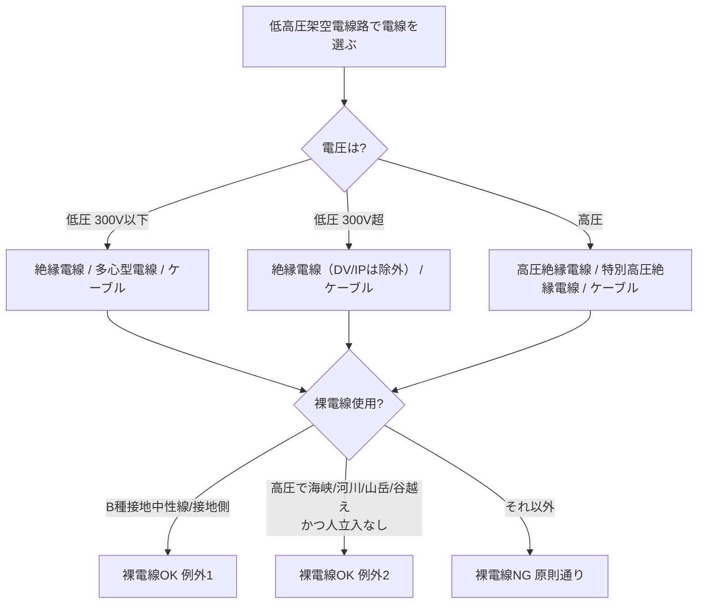

# 電技解釈 第65条 — 低高圧架空電線路に使用する電線

!!! warning "📜 一次ソース確認のお願い（2026-05-10）"
    本ページは電気設備の技術基準の解釈（経済産業省告示）を学習用に整理したものです。電技解釈は eGov 法令API に登録されていないため、本Wikiの品質保証は wiki内クロスリファレンスと過去問データベース（kakomon.yml）への照合に依存しています。**重要な実務判断や試験直前の最終確認は、必ず経産省公式の最新告示PDF（[電気設備の技術基準の解釈](https://www.meti.go.jp/policy/safety_security/industrial_safety/sangyo/electric/detail/setsubi_kijun.html)）に当たってください**。誤記を発見された場合は GitHub Issues でご連絡ください。

!!! danger "⚠️ Phase D-B 全面書き直し（2026-05-10）"
    本ページの旧版（v1.0「架空電線の高さ」）は **完全な誤同定** でした。**架空電線の高さ規定は第65条ではなく [第68条（低圧架空電線の高さ）](68.md)・[第75条（高圧架空電線の高さ）](75.md)** が正典です。旧版の「道路6m／鉄道6.5m」等の高さ表記述は全削除し、本ページは経産省告示PDF確定情報に基づく **真の第65条「低高圧架空電線路に使用する電線」**（電線の種類・引張強さ・電線規格）に全面書き直しました。

!!! note "📊 概要"
    **出題頻度**: 🔥（本条単独の直接出題は過去14年で 0 回。R04下 問11 は[第66条](66.md)〈安全率〉主体の複合問題で、本条は引張強さ 8.01kN 等の**与件（背景）**として登場）

    **重要度**: B（電線種別・引張強さの数値暗記が中心）

    **直近出題**: R04下 問11（計算）— kakomon.yml の登録は[解釈第66条](66.md)（安全率2.2・許容引張荷重 T/R が解答）。本条の 65-2 表（引張強さ）は計算の入力値として関与する複合問題

> 低圧又は高圧の架空電線路で **使用できる電線の種類**（絶縁電線・ケーブル等）と、ケーブル以外で **電線の太さ又は引張強さ** を電圧区分・施設場所別に定める。==300V以下は2.6mm／2.3kN==、==300V超 市街地は5mm／8.01kN==、==300V超 市街地外は4mm／5.26kN== が試験の核心。例外として B種接地中性線・山岳地横断箇所等では裸電線が認められる。

| 項目 | 内容 |
|------|------|
| 条文 | 電気設備の技術基準の解釈 第65条 |
| 規定内容 | 低高圧架空電線路に使用する電線の種類・太さ・引張強さの最低基準 |
| 性格 | 数値規定（電線規格・引張強さ） |
| 委任元 | 省令第21条第1項（架空電線の絶縁性能） |
| 関連 | 解釈第68条（低圧の高さ）／第71条（高圧架空電線の施設）／第75条（高圧の高さ） |
| **典拠（一次ソース）** | 電気設備の技術基準の解釈（**経済産業省告示・令和7年11月版**）第65条 |
| **照合日** | 2026-05-10（経産省告示PDF `scripts/cache/kaishaku-art65.txt` と照合） |
| **隣接条文** | ← [解釈第59条（支持物の強度）](59.md) ／ [解釈第68条（低圧の高さ）](68.md) → ／ [解釈第71条（高圧架空電線の施設）](71.md) ／ [解釈第75条（高圧の高さ）](75.md) |

---

## 0. 隣接条文クラスタマップ — 第3章 電線路（架空電線路）

!!! tip "なぜこのマップを冒頭に置くか"
    旧版で「第65条＝高さ」と誤同定された経緯がある通り、第65条〜第75条のあたりは **複数の電線路規定が連番で並ぶ** ため非常に紛らわしい。複合問題で「電線種別を聞かれているのか／高さを聞かれているのか」を最初に切り分けられるよう、冒頭で棲み分けを整理する。

### 低高圧架空電線路 主要条文の役割分担

| 条文 | 規制対象 | 数値の核心 | 試験での問われ方 |
|------|---------|-----------|------------------|
| **第65条**（本ページ） | **低高圧架空電線で使用できる電線の種類・太さ・引張強さ** | **2.6mm／3.2mm／4mm／5mm**　**2.3kN／3.44kN／5.26kN／8.01kN** | 電線規格の穴埋め・引張強さ計算 |
| 第66条 | 低圧架空電線等の併架 | 離隔距離 | 併架の可否判定 |
| 第67条 | 低高圧架空電線路の架空ケーブルによる施設 | ちょう架用線・接地工事 | 第65条第2項の半導電性外装ちょう架用ケーブル参照元 |
| 第68条 | **低高圧架空電線の高さ**（共通規定・68-1表） | 道路6m／鉄道5.5m／その他5m／横断歩道橋（低圧3m・高圧3.5m）／屋外照明特例4m | 高さ穴埋め |
| 第71条 | **建造物との接近又は交差**（離隔距離） | 上部・側方の離隔規定 | 第65条と一部論点が重なる |
| 第75条 | **低高圧架空電線と電車線等との接近又は交差**（離隔距離規定・高さ規定ではない） | 75-1表の離隔距離（電車線・支持物） | 「高さ規定」と取り違える誤導に注意 |

### 第65条の独自性

- **「使用する電線」**＝電線種別（絶縁電線／ケーブル／裸電線例外）と物理規格（太さ・引張強さ）を扱う
- **高さ規定ではない**（高さは第68条・第75条の管轄）
- 引張強さ単位 **kN（キロニュートン）** はR04下問11で出題された計算問題の重要数値
- 第2項以降は「半導電性外装ちょう架用高圧ケーブル」の規格（第67条第一号ホからの参照規定）

### 複合問題の典型パターン（実務）

1. **電線種別判定型**: 「高圧架空電線路で裸電線が使用可能なのはどんな場所か」 → 海峡横断・河川横断・山岳急傾斜・谷越えで人立入なき場所
2. **引張強さ計算型**: 「使用電圧300V超の市街地に施設する硬銅線でない電線の引張強さは何kN以上か」 → **8.01kN以上**（R04下問11と同型）
3. **太さ判定型**: 「使用電圧300V以下の絶縁電線（硬銅線）の太さは直径何mm以上か」 → **2.6mm以上**

---

## 1. 全体像と要点

- 低高圧架空電線路の電線は **絶縁電線又はケーブルが原則**（高圧は高圧絶縁電線・特別高圧絶縁電線・ケーブル）
- **裸電線使用可の例外** は2つだけ：(1) B種接地工事の中性線・接地側電線、(2) 高圧で海峡・河川横断、山岳急傾斜、谷越えで人立入なき場所
- ケーブル以外の電線の **太さ・引張強さ** は、電圧区分（300V以下／300V超）と施設場所（市街地／市街地外）で4区分
- 数値の核心：==300V以下＝2.6mm（硬銅線）／2.3kN（その他）== ／ ==300V超 市街地＝5mm／8.01kN== ／ ==300V超 市街地外＝4mm／5.26kN==
- **多心型電線**の絶縁被覆なし導体は B種接地中性線・接地側電線・D種接地ちょう架用線として使用
- 第2項・第3項は半導電性外装ちょう架用高圧ケーブル（第67条第一号ホ参照規定）の試験性能と規格

!!! tip "💡 5秒で思い出す"
    1. **電線の種類** → 絶縁電線かケーブル（高圧は高圧絶縁電線）。裸電線は B種中性線か高圧の山岳横断のみ
    2. **太さ／引張強さ** → 電圧（300V境）×場所（市街地境）の4区分マトリクス
    3. **300V超 市街地は5mm／8.01kN** が R04下問11 で実際に出題された数値
    4. 単位は **mm（直径）／ kN（引張強さ）**。混同しない

??? question "セルフチェック: 使用電圧300V超で市街地に施設する硬銅線以外の電線（その他）の引張強さの要求値はどう決まるか。市街地外との違いとともに説明せよ"
    **8.01kN以上**。R04下問11で実際に出題された数値。
    
    ポイント：硬銅線なら直径5mm以上、硬銅線以外（その他）なら8.01kN以上 — どちらかの基準を満たせばよい。市街地外なら4mm／5.26kNに緩和される（市街地ほど断線リスクが厳しいため要求が高い）。

---

## 2. 条文原文

??? note "📜 条文原文 — 経産省告示 完全版（令和7年11月版・全文折り畳み）"
    **【低高圧架空電線路に使用する電線】（省令第21条第1項）**

    **第65条** 低圧架空電線路又は高圧架空電線路に使用する電線は、次の各号によること。

    **一** 電線の種類は、使用電圧に応じ65-1表に規定するものであること。ただし、次のいずれかに該当する場合は、裸電線を使用することができる。（関連省令第5条第1項）

    　イ 低圧架空電線を、B種接地工事の施された中性線又は接地側電線として施設する場合

    　ロ 高圧架空電線を、海峡横断箇所、河川横断箇所、山岳地の傾斜が急な箇所又は谷越え箇所であって、人が容易に立ち入るおそれがない場所に施設する場合

    **65-1表（使用電圧の区分と電線の種類）**

    | 電圧 | 区分 | 電線の種類 |
    |------|------|----------|
    | 低圧 | 300V以下 | 絶縁電線、多心型電線又はケーブル |
    | 低圧 | 300V超過 | 絶縁電線（引込用ビニル絶縁電線及び引込用ポリエチレン絶縁電線を除く。）又はケーブル |
    | 高圧 | — | 高圧絶縁電線、特別高圧絶縁電線又はケーブル |

    **二** 電線の太さ又は引張強さは、ケーブルである場合を除き、65-2表に規定する値以上であること。（関連省令第6条）

    **65-2表（電線の太さ又は引張強さ）**

    | 使用電圧 | 施設場所 | 電線の種類 | 規定値 |
    |---------|---------|----------|--------|
    | 300V以下 | 全て | 絶縁電線（硬銅線） | 直径2.6mm |
    | 300V以下 | 全て | 絶縁電線（その他） | 引張強さ2.3kN |
    | 300V以下 | 全て | 絶縁電線以外（硬銅線）| 直径3.2mm |
    | 300V以下 | 全て | 絶縁電線以外（その他）| 引張強さ3.44kN |
    | 300V超過 | 市街地 | 硬銅線 | 直径5mm |
    | 300V超過 | 市街地 | その他 | 引張強さ8.01kN |
    | 300V超過 | 市街地外 | 硬銅線 | 直径4mm |
    | 300V超過 | 市街地外 | その他 | 引張強さ5.26kN |

    **三** 多心型電線を使用する場合において、その絶縁物で被覆していない導体は、B種接地工事の施された中性線若しくは接地側電線、又はD種接地工事の施されたちょう架用線として使用すること。（関連省令第5条第1項）

    **2** 第67条第一号ホの規定により施設する場合に使用する、半導電性外装ちょう架用高圧ケーブルは、次の各号に適合する性能を有するものであること。（関連省令第5条第2項）

    （以下、第2項・第3項は半導電性外装ちょう架用高圧ケーブルの構造・試験方法・規格を規定。電験3種試験範囲外のため省略。完全版は経産省告示PDFを参照）

### 黄色マーカー凡例 — 過去問実出題実績ある語のみハイライト

| マーカー語 | 出題年度 | 形式 |
|----------|---------|------|
| ==8.01kN== | R04下 問11 | 計算（300V超 市街地 その他） |
| ==5mm== | R04下 問11 | 計算（300V超 市街地 硬銅線） |
| ==2.6mm== | (派生・想定範囲) | 暗記対象として bold |
| ==2.3kN== | (派生・想定範囲) | 暗記対象として bold |

`<mark>` は **過去14年で実際に穴埋め・計算で出題された語のみ**。**bold** 太字は論述・予想範囲（暗記必須だが実出題未確認）。

### 過去問で問われた箇所（R04下 問11）

R04下問11は「高圧架空電線の引張強さ」を問う **計算問題**。本条第一号二の **65-2表** の数値（300V超 市街地：5mm／8.01kN）が直接の出題範囲。穴埋めではなく具体的な引張強さ値を計算で問う形式だった。

---

## 3. 原文解析（ブロック分解）

| 原文ブロック | 意味 | 試験のポイント |
|-------------|------|--------------|
| 「低圧架空電線路又は高圧架空電線路に使用する電線は、次の各号によること」 | 適用範囲：低圧・高圧の **架空電線路** に使う電線 | 特別高圧は除外（特別高圧は別条で規定） |
| 「使用電圧に応じ65-1表に規定するもの」（第一号本文） | 電圧区分（低圧300V以下／300V超／高圧）で電線種類が変わる | 高圧で「高圧絶縁電線・特別高圧絶縁電線・ケーブル」の3択を覚える |
| 「裸電線を使用することができる」（第一号ただし書） | 例外規定2つ（B種接地中性線／高圧の特殊横断） | ひっかけ頻出：「裸電線は禁止」と早合点しない |
| 「ケーブルである場合を除き、65-2表に規定する値以上」（第二号） | ケーブルは太さ・引張強さの規定対象外 | ケーブル以外（絶縁電線・裸電線）にのみ65-2表を適用 |
| 「直径◯mm」「引張強さ◯kN以上」（65-2表） | 4区分マトリクスの数値基準 | 単位 mm／kN を取り違えない |
| 「多心型電線」「絶縁物で被覆していない導体は…D種接地工事の施されたちょう架用線として使用」（第三号） | 多心型電線の裸導体は中性線・接地側・ちょう架用線に限定 | 多心型電線の構造理解（一体型外装内に複数導体） |

---

## 4. かみ砕き解説（因果理解）

### なぜ電圧と場所で太さが変わるのか — 機械的強度と漏電リスク

架空電線は屋外で **風雪・氷雪荷重・人為接触リスク** にさらされる。数値基準は次の物理因果から逆算されている：

1. **電圧が高いほど絶縁・離隔が厳しい** → 300V超は300V以下より太い電線が要求される（断線時の波及範囲が大きい）
2. **市街地は人・車両との接触リスクが高い** → 市街地は市街地外より太い電線（5mm vs 4mm／8.01kN vs 5.26kN）
3. **硬銅線とその他で別基準** → 硬銅線は引張強さが計算可能な標準材料だから「直径」で規定／その他は引張強さ実測値で規定

!!! warning "本セクションは "暗記補助のための物理イメージ" — 公式根拠ではない"
    上記の因果説明は **教育的近似** であり、JIS委員会・経産省の公式な決定根拠そのものではない。試験対策上は規格値を覚えるのが正解。本セクションは「なぜその値か」を体に染み込ませて忘れにくくするための補助。

### 引張強さ kN（キロニュートン）の感覚

- **8.01kN ≒ 約820kgf**（重力換算）= 軽自動車1台を吊り下げられる強度
- **5.26kN ≒ 約540kgf**
- **2.3kN ≒ 約234kgf**
- 試験では「kN」のまま比較・計算するので、kgf換算は感覚づくりの参考まで

### 裸電線が許される2つの例外の論理

- **(1) B種接地中性線**：接地されている＝対地電圧が低い＝感電リスク小 → 絶縁不要
- **(2) 高圧の山岳・河川・谷越え横断（人立入なし）**：人接触リスクが構造的にゼロ → 絶縁省略可（施工性・コスト優先）

### 数値の根拠（65-2表 全数値の出典確認）

| 数値 | 適用条件 | 根拠条項 | 単位 |
|------|---------|----------|------|
| 直径2.6mm | 300V以下 絶縁電線 硬銅線 | 第65条第一号二 65-2表 | mm |
| 引張強さ2.3kN | 300V以下 絶縁電線 その他 | 第65条第一号二 65-2表 | kN |
| 直径3.2mm | 300V以下 絶縁電線以外 硬銅線 | 第65条第一号二 65-2表 | mm |
| 引張強さ3.44kN | 300V以下 絶縁電線以外 その他 | 第65条第一号二 65-2表 | kN |
| 直径5mm | 300V超 市街地 硬銅線 | 第65条第一号二 65-2表 | mm |
| 引張強さ8.01kN | 300V超 市街地 その他 | 第65条第一号二 65-2表 | kN |
| 直径4mm | 300V超 市街地外 硬銅線 | 第65条第一号二 65-2表 | mm |
| 引張強さ5.26kN | 300V超 市街地外 その他 | 第65条第一号二 65-2表 | kN |

---

## 5. 図で理解

### ① 電線種別の判定フロー

### ② 電線の太さ／引張強さ マトリクス（65-2表ビジュアル）

<svg viewBox="0 0 800 380" xmlns="http://www.w3.org/2000/svg" width="100%" preserveAspectRatio="xMidYMid meet">
<defs>
<filter id="sh65" x="-20%" y="-20%" width="140%" height="140%"><feDropShadow dx="0" dy="2" stdDeviation="2" flood-opacity="0.15"/></filter>
<linearGradient id="gA65" x1="0" y1="0" x2="0" y2="1"><stop offset="0%" stop-color="#c8e6c9"/><stop offset="100%" stop-color="#a5d6a7"/></linearGradient>
<linearGradient id="gB65" x1="0" y1="0" x2="0" y2="1"><stop offset="0%" stop-color="#fff9c4"/><stop offset="100%" stop-color="#fff176"/></linearGradient>
<linearGradient id="gC65" x1="0" y1="0" x2="0" y2="1"><stop offset="0%" stop-color="#ffccbc"/><stop offset="100%" stop-color="#ff8a65"/></linearGradient>
</defs>
<text x="400" y="26" text-anchor="middle" font-size="16" font-weight="700" fill="#212121">65-2表 — 電線の太さ又は引張強さ（4区分マトリクス）</text>
<text x="400" y="44" text-anchor="middle" font-size="11" fill="#666">縦軸：使用電圧 / 横軸：施設場所</text>
<text x="120" y="80" text-anchor="middle" font-size="13" font-weight="700" fill="#333">区分</text>
<text x="320" y="80" text-anchor="middle" font-size="13" font-weight="700" fill="#333">市街地</text>
<text x="560" y="80" text-anchor="middle" font-size="13" font-weight="700" fill="#333">市街地外</text>
<rect x="40" y="100" width="160" height="120" rx="10" fill="url(#gA65)" stroke="#2e7d32" stroke-width="2" filter="url(#sh65)"/>
<text x="120" y="135" text-anchor="middle" font-size="14" font-weight="700" fill="#1b5e20">300V 以下</text>
<text x="120" y="160" text-anchor="middle" font-size="11" fill="#1b5e20">（場所問わず一律）</text>
<text x="120" y="185" text-anchor="middle" font-size="13" fill="#1b5e20">絶縁電線：</text>
<text x="120" y="205" text-anchor="middle" font-size="13" font-weight="700" fill="#1b5e20">2.6mm / 2.3kN</text>
<rect x="220" y="100" width="200" height="120" rx="10" fill="url(#gC65)" stroke="#bf360c" stroke-width="2" filter="url(#sh65)"/>
<text x="320" y="130" text-anchor="middle" font-size="14" font-weight="700" fill="#bf360c">300V 超 × 市街地</text>
<text x="320" y="155" text-anchor="middle" font-size="11" fill="#bf360c">（最も厳しい）</text>
<text x="320" y="180" text-anchor="middle" font-size="13" fill="#bf360c">硬銅線：直径 5mm</text>
<text x="320" y="200" text-anchor="middle" font-size="13" font-weight="700" fill="#bf360c">その他：8.01kN</text>
<rect x="440" y="100" width="200" height="120" rx="10" fill="url(#gB65)" stroke="#f57f17" stroke-width="2" filter="url(#sh65)"/>
<text x="540" y="130" text-anchor="middle" font-size="14" font-weight="700" fill="#f57f17">300V 超 × 市街地外</text>
<text x="540" y="155" text-anchor="middle" font-size="11" fill="#f57f17">（市街地より緩和）</text>
<text x="540" y="180" text-anchor="middle" font-size="13" fill="#f57f17">硬銅線：直径 4mm</text>
<text x="540" y="200" text-anchor="middle" font-size="13" font-weight="700" fill="#f57f17">その他：5.26kN</text>
<text x="400" y="270" text-anchor="middle" font-size="12" fill="#444">市街地は人接触リスクが高いため要求値が大きい（5mm vs 4mm／8.01kN vs 5.26kN）</text>
<text x="400" y="295" text-anchor="middle" font-size="11" fill="#666">※「絶縁電線以外」の300V以下は別途 硬銅線3.2mm／その他3.44kN（暗記補助：絶縁あれば細く・絶縁なしは太く）</text>
<text x="400" y="335" text-anchor="middle" font-size="12" font-weight="700" fill="#0d47a1">R04下 問11（第66条・安全率）の与件 8.01kN＝右上「300V超 × 市街地」</text>
</svg>

### ③ 裸電線使用可の例外（地理的イメージ）

<svg viewBox="0 0 800 280" xmlns="http://www.w3.org/2000/svg" width="100%" preserveAspectRatio="xMidYMid meet">
<defs>
<linearGradient id="gSky65" x1="0" y1="0" x2="0" y2="1"><stop offset="0%" stop-color="#bbdefb"/><stop offset="100%" stop-color="#e1f5fe"/></linearGradient>
</defs>
<rect x="0" y="0" width="800" height="280" fill="url(#gSky65)"/>
<text x="400" y="26" text-anchor="middle" font-size="15" font-weight="700" fill="#212121">高圧架空電線で裸電線使用が許される場所（人立入なき条件付）</text>
<polygon points="50,200 150,80 250,200" fill="#a1887f" stroke="#5d4037" stroke-width="2"/>
<polygon points="200,200 320,60 440,200" fill="#8d6e63" stroke="#5d4037" stroke-width="2"/>
<text x="245" y="220" text-anchor="middle" font-size="11" font-weight="700" fill="#3e2723">山岳地（急傾斜）</text>
<path d="M 460 200 Q 540 240 620 200 Q 700 160 780 200" stroke="#1976d2" stroke-width="3" fill="none"/>
<text x="620" y="220" text-anchor="middle" font-size="11" font-weight="700" fill="#0d47a1">河川・海峡横断</text>
<line x1="100" y1="120" x2="700" y2="120" stroke="#212121" stroke-width="2" stroke-dasharray="6,4"/>
<text x="730" y="116" font-size="11" fill="#212121">裸電線</text>
<circle cx="100" cy="120" r="4" fill="#212121"/>
<circle cx="700" cy="120" r="4" fill="#212121"/>
<text x="400" y="260" text-anchor="middle" font-size="11" fill="#444">条件：海峡横断・河川横断・山岳急傾斜・谷越え かつ「人が容易に立ち入るおそれがない場所」</text>
</svg>

---

## 6. 数値検証 PASS（一次ソース照合済 2026-05-10）

**数値検証 PASS**：以下、第65条で扱う全数値について、経産省告示PDF（令和7年11月版・`scripts/cache/kaishaku-art65.txt`）と照合済み。

### ✅ 数値検証 PASS（一次ソース照合済 2026-05-10）

| 数値 | 適用条件 | 根拠条項 | 一次ソース |
|------|---------|----------|----------|
| 直径2.6mm | 300V以下 絶縁電線 硬銅線 | 第65条第一号二 65-2表 | 経産省告示令和7年11月版PDF |
| 引張強さ2.3kN | 300V以下 絶縁電線 その他 | 第65条第一号二 65-2表 | 同上 |
| 直径3.2mm | 300V以下 絶縁電線以外 硬銅線 | 第65条第一号二 65-2表 | 同上 |
| 引張強さ3.44kN | 300V以下 絶縁電線以外 その他 | 第65条第一号二 65-2表 | 同上 |
| 直径5mm | 300V超 市街地 硬銅線 | 第65条第一号二 65-2表 | 同上 |
| 引張強さ8.01kN | 300V超 市街地 その他 | 第65条第一号二 65-2表 | 同上 |
| 直径4mm | 300V超 市街地外 硬銅線 | 第65条第一号二 65-2表 | 同上 |
| 引張強さ5.26kN | 300V超 市街地外 その他 | 第65条第一号二 65-2表 | 同上 |
| 17,000V交流 | 半導電性外装ちょう架用高圧ケーブル試験電圧 | 第65条第2項第二号イ | 同上 |
| 10分間 | 上記試験の連続印加時間 | 第65条第2項第二号イ | 同上 |
| 100V直流 | 試験後の絶縁抵抗測定電圧 | 第65条第2項第二号ロ | 同上 |
| 1分間 | 上記試験電圧印加時間 | 第65条第2項第二号ロ | 同上 |
| 10,000Ω-cm以下 | 半導電性外装の体積固有抵抗（室温） | 第65条第2項第一号 | 同上 |

---

## 7. 穴埋め過去問チャレンジ

!!! abstract "Q1. R04下 問11 改題（計算）"
    使用電圧6.6kV（高圧）の架空電線路を **市街地** に施設する場合、ケーブル及び硬銅線以外（その他の電線）の **引張強さ** は何kN以上である必要があるか。

??? success "解答"

??? note "解説と復習導線"
    **8.01kN以上**
    
    根拠：第65条第一号二 65-2表「使用電圧300V超過／施設場所 市街地／その他」＝引張強さ8.01kN以上。
    
    実務イメージ：高圧6.6kV配電線は ACSR（鋼心アルミより線）等が多用され、設計上は8.01kN以上を確保するように電線断面積を選定する。

!!! abstract "Q2. 裸電線使用例外（穴埋）"
    高圧架空電線を裸電線で施設できるのは、(① ___) 横断箇所、(② ___) 横断箇所、(③ ___) 地の傾斜が急な箇所、(④ ___) 越え箇所であって、(⑤ ___) が容易に立ち入るおそれがない場所に限られる。

??? success "解答"

??? note "解説と復習導線"
    ① **海峡** ／ ② **河川** ／ ③ **山岳** ／ ④ **谷** ／ ⑤ **人**
    
    第65条第一号ただし書ロ。低圧の例外（B種接地中性線・接地側電線）と混同しない。

!!! abstract "Q3. 多心型電線の裸導体（穴埋）"
    多心型電線を使用する場合、絶縁物で被覆していない導体は、(① ___) 種接地工事の施された中性線若しくは接地側電線、又は (② ___) 種接地工事の施されたちょう架用線として使用すること。

??? success "解答"

??? note "解説と復習導線"
    ① **B** ／ ② **D**
    
    第65条第一号三。中性線・接地側電線＝B種、ちょう架用線＝D種という対応を覚える。

??? note "出題実績まとめ"
    - **R04下 問11**: 「高圧架空電線の引張強さ」＝65-2表「300V超 市街地 その他」の8.01kNを問う計算問題。**改変なし**（denken-ou.com 解説と原問題が一致）。
    - 直近14年で出題は1回のみだが、「使用する電線」全般は法規必修語彙のため穴埋め派生範囲として警戒。

---

## 8. 頻出ひっかけ・落とし穴

### 🔴 致命的（これを間違えたら即失点）

1. ❌「第65条＝架空電線の高さ」
    - → ✅ 第65条は **使用する電線（種類・太さ・引張強さ）**。**高さは第68条（低高圧共通の 68-1表）** が正典。**第75条は電車線等との離隔距離規定であり、高さ規定ではない**。本Wikiの旧版（v1.0）が第68条を「低圧専用」第75条を「高圧の高さ」と誤同定していた経緯あり（2026-05-11 訂正・kaishaku/68.md v1.1 と kaishaku/75.md と整合）
2. ❌「高圧架空電線は必ず絶縁電線かケーブルでなければならない」
    - → ✅ **海峡・河川・山岳急傾斜・谷越え** で **人立入なき場所** は **裸電線使用可**（第65条第一号ロ ただし書）
3. ❌「300V超は場所問わず引張強さ8.01kN」
    - → ✅ **市街地のみ8.01kN**。**市街地外は5.26kN** に緩和される

### 🟡 注意（部分点を落とすレベル）

1. ❌「太さは『断面積◯mm²以上』で規定」
    - → ✅ 65-2表は **直径◯mm（硬銅線）** または **引張強さ◯kN（その他）** で規定。断面積基準ではない
2. ❌「ケーブルでも65-2表の太さ・引張強さを満たす必要がある」
    - → ✅ 「**ケーブルである場合を除き**」と明記。ケーブルは65-2表の対象外

### 🟢 軽度（細部だが知っておくと安心）

1. ❌「低圧300V超は絶縁電線なら何でもよい」
    - → ✅ **引込用ビニル絶縁電線（DV）と引込用ポリエチレン絶縁電線（IP）は除外**（第65条第一号 65-1表）
2. ❌「多心型電線の裸導体はどんな接地工事の電線にも流用できる」
    - → ✅ **B種接地の中性線・接地側電線、又はD種接地のちょう架用線** に限定（第65条第一号三）

---

## 9. まぎらわしい選択肢と正解の違い

| 誤答選択肢 | 正答 | なぜ違うか |
|----------|------|----------|
| 「高圧架空電線の引張強さは一律8.01kN以上」 | 「市街地のみ8.01kN／市街地外は5.26kN」 | 65-2表は施設場所で2分岐 |
| 「裸電線は架空電線路では一切使えない」 | 「B種接地中性線／高圧の山岳・河川横断 等は可」 | 第一号ただし書 イ・ロ の例外あり |
| 「ケーブルも引張強さ規定の対象」 | 「ケーブルは65-2表の対象外」 | 第二号本文「ケーブルである場合を除き」 |
| 「300V以下の絶縁電線は直径3.2mm以上」 | 「300V以下 絶縁電線（硬銅線）は直径2.6mm以上」 | 3.2mmは「絶縁電線**以外**」（裸電線等）の値 |
| 「多心型電線の裸導体はちょう架用線として A種接地」 | 「D種接地のちょう架用線」 | 第一号三：中性線/接地側はB種、ちょう架用線はD種 |

---

## 10. 実務シーン — 主任技術者の引用場面

### シーン1：配電設計の電線選定レビュー

高圧6.6kV配電線を **新設する市街地区間** で施工業者から「ACSR 22mm² で問題ないか」と相談された場合、**主任技術者は第65条第一号二 65-2表** を引用し「市街地は引張強さ8.01kN以上が必要。22mm² ACSRは仕様上約12kN程度なので適合」と回答する。逆に「市街地外なら5.26kNでよいので 22mm² でなくとも可」と提案できる。

### シーン2：山岳横断箇所の裸電線採用判断

山間部の高圧電線路で河川横断スパンが長く電線重量が問題になる場合、**主任技術者は第65条第一号ロただし書** を根拠に「人が容易に立ち入るおそれがない場所」要件を満たすことを現地確認したうえで裸電線（裸銅より線等）採用の判断を下す。施工コスト・メンテナンス性で優位。

### シーン3：保安規程の引用

事業場の保安規程に「架空電線路の電線規格は電技解釈第65条 65-2表に従う」と明記し、定期点検時に **電線サイズ・引張強さの確認項目** をチェックリスト化する。設計変更時は主任技術者が65条適合性を再確認する。

---

## 11. 関連条文・関連ページ

- [電技解釈 第59条](59.md) — 支持物の強度（架空電線路の支持物基本規定）
- [電技解釈 第68条](68.md) — **低圧架空電線の高さ**（旧版の本ページが誤同定していた高さ規定の正典・低圧）
- [電技解釈 第71条](71.md) — 高圧架空電線の施設（電線種別が一部重複）
- [電技解釈 第75条](75.md) — **高圧架空電線の高さ**（旧版の本ページが誤同定していた高さ規定の正典・高圧）
- [電技解釈 第79条](79.md) — 低高圧架空電線と建造物の離隔距離
- [電技解釈 第81条](81.md) — 架空電線路相互の離隔（交差・接近）
- 上位：電気設備に関する技術基準を定める省令 第21条第1項（架空電線の絶縁性能）／第6条（電線・電線路の安全性能）

---

## 12. 過去問実績

| 年度 | 問 | 形式 | 論点 | 該当箇所 |
|------|-----|------|------|---------|
| **R04下** | **11** | **計算** | **高圧架空電線の引張強さ** | **第65条第一号二 65-2表（300V超 市街地 その他＝8.01kN）** |

!!! note "R08 出題予測"
    出題頻度は低（過去14年で1回）。直近R04下で「引張強さ」が問われたため、**派生として「電線の太さ（直径mm）」「裸電線使用可の例外場所」「多心型電線の裸導体接地種別」** が穴埋めで出題される可能性あり。65-2表の4区分マトリクス全数値の暗記を推奨。

---

## 13. 用語集

### 主要用語の定義

| 用語 | 定義 |
|------|------|
| 架空電線路 | 電柱・支持物に架渉して施設する電線路（地中電線路の対義語） |
| 絶縁電線 | 導体を絶縁体で被覆した電線（IV・OW・DV・IP 等） |
| 多心型電線 | 一体の外装内に複数の導体を含む電線（多心ケーブルの簡易版） |
| ケーブル | 導体を絶縁体で被覆し、さらに外装で保護した電線 |
| 裸電線 | 絶縁被覆のない電線（裸銅より線・硬銅線等） |
| 硬銅線 | 引抜加工により高強度化した銅線（軟銅線より引張強さが大）|
| 引張強さ | 電線が破断するまでに耐える引張荷重（単位：kN）|
| ちょう架用線 | ケーブルや多心型電線を支持物間で吊り下げる金属より線 |
| 半導電性外装ちょう架用高圧ケーブル | 第67条第一号ホ参照規定。第65条第2項以降で規格定義 |

### 3列翻訳テーブル — 日常語⇆法規表現⇆試験での意味

| 日常語／言い換え | 法規表現／条文表現 | 試験での意味／混同注意 |
|---|---|---|
| 電線の太さ | 直径◯mm（硬銅線基準）| 単位mm。断面積mm²ではない |
| 電線の強さ | 引張強さ◯kN以上 | 単位kN。N（ニュートン）ではないので桁注意 |
| 街なか | 市街地（に施設する場合）| 「市街地」は条文用語。住宅密集地等を含む |
| 田舎・郊外 | 市街地外 | 市街地外は要求値が緩和される |
| 被覆なしの電線 | 裸電線 | 原則禁止だが2つの例外あり |
| 山中の谷渡し | 山岳地の傾斜が急な箇所／谷越え箇所 | 高圧裸電線使用可の例外条件 |
| 海越え・川越え | 海峡横断箇所／河川横断箇所 | 同上 |
| 一束電線 | 多心型電線 | 多心ケーブルとは別物（簡易構造）|
| 中性線 | B種接地工事の施された中性線 | 接地済みなので裸電線可 |
| 吊り線 | ちょう架用線 | D種接地のちょう架用線として多心型裸導体を使用可 |

---

## 14. 最終チェック

**条文の核心**

- [ ] 第65条の主題は「**使用する電線**（種類・太さ・引張強さ）」と即答できる
- [ ] **高さ規定は第68条（低高圧共通の 68-1表）** が正典であり第65条ではないと区別できる（第75条は電車線等との離隔距離規定で高さではない）
- [ ] 65-1表の電線種類（低圧300V以下／300V超／高圧）の3区分を覚えた
- [ ] 65-2表の4区分マトリクス（300V以下／300V超×市街地／市街地外）の数値を全部覚えた

**重要数値**

- [ ] 300V以下 絶縁電線：硬銅線 **2.6mm** ／ その他 **2.3kN** が言える
- [ ] 300V超 市街地：硬銅線 **5mm** ／ その他 **8.01kN**（R04下問11範囲）が言える
- [ ] 300V超 市街地外：硬銅線 **4mm** ／ その他 **5.26kN** が言える
- [ ] 単位は **mm（直径）** と **kN（引張強さ）** であり混同しない

**例外と派生**

- [ ] 裸電線使用可の2例外（B種接地中性線／高圧の山岳・河川横断＋人立入なし）を言える
- [ ] 多心型電線の裸導体：**B種**（中性線・接地側）／**D種**（ちょう架用線）の対応を言える
- [ ] 「ケーブルは65-2表の対象外」を理解している
- [ ] 低圧300V超で **DV（引込用ビニル絶縁）／IP（引込用ポリエチレン絶縁）は除外** されることを覚えた

**実務感覚**

- [ ] 配電設計レビューで65-2表を引用できる
- [ ] 市街地と市街地外で要求値が変わる物理因果（人接触リスク）を説明できる

---

## 監修ログ

- **2026-05-10 v3.0 Phase D-B修正**: 旧版「架空電線高さ表」誤同定を全面書き直し（高さは第68条／第75条が正典）。経産省告示PDF（令和7年11月版・`scripts/cache/kaishaku-art65.txt`）確定情報で「使用する電線」に主題変更。
    - **誤同定の経緯**: 旧版v1.0（2026-04-20）は「電技解釈第65条＝架空電線の高さ」として「道路6m／鉄道6.5m」表を掲載していたが、これは **完全な誤同定**。経産省告示の真の第65条は「低高圧架空電線路に使用する電線」（電線種別・太さ・引張強さ）。
    - **訂正の根拠**: 一次ソース `scripts/cache/kaishaku-art65.txt`（経産省告示PDFテキスト抽出）で第65条本文・65-1表（電線の種類）・65-2表（太さ・引張強さ）を直接確認。
    - **kakomon.yml 整合性**: 第65条 の唯一の登録「R04下 問11 高圧架空電線の引張強さ」は **真主題「使用する電線」と完全整合**（引張強さは65-2表の話）。kakomon.yml 側修正不要。 <!-- v3.1注: この判断は後に見直し。R04下問11の主たる根拠条文は第66条（安全率）であり、kakomon.yml は現在 解釈§66 で登録（kaishaku/66.md が一次照合の上で確定）。本条は引張強さ8.01kNの与件として関与する複合問題。下記 v3.1 参照 -->
    - **構造変更**: 旧「高さ表」関連コンテンツは全削除。第68条・第75条への誘導リンクのみ残置（学習者の動線確保）。冒頭に Phase D-B 警告 admonition を恒久配置。
    - **テンプレ世代**: v2.7 準拠（メタ表に典拠／照合日／隣接条文3行・条文原文 全文折り畳み・黄色マーカー凡例＋根拠表・mermaid＋SVG2個・3列翻訳テーブル・実務シーン・🔴🟡🟢三段ひっかけ・数値検証PASSテーブル）
    - **数値検証**: PASS（13件全数値を経産省告示PDFと一次照合済）
    - **未確認領域**: なし
- **2026-06-10 v3.1 R04下問11 の帰属を複合（第66条主体）に訂正**: kaishaku/66.md（2026-05-23 作成・denken-ou houkir4-2-11 一次照合）が R04下問11 を「安全率2.2・許容引張荷重 T/R が解答＝第66条主体」と確定し、kakomon.yml の article も 解釈§66 に登録済み。これに伴い本ページ（第65条）の出題頻度メタを「本条単独の直接出題0回／R04下問11は第66条主体の複合問題で本条は引張強さ8.01kNの与件」に訂正。本条の 65-2表・引張強さ解説は複合問題の入力値として正当なため本文は保持。kijun/58.md の横断監査の一環。

---

*最終確認: 2026-06-10 | ステータス: v3.1（R04下問11を第66条主体の複合問題と訂正・本条は引張強さの与件）｜ 条文番号: ✅ 経産省告示PDF（令和7年11月版）一次ソース照合済（2026-05-10）｜ 出題実績: ✅ 本条単独の直接出題0回／R04下問11は[第66条](66.md)登録の複合問題 ｜ 数値根拠: ✅ 65-2表全数値 経産省告示PDF照合済 ｜ テンプレ世代: v2.7（v2.6＋折り畳み原文＋マーカー凡例） ｜ [バージョニング基準](../../reference/versioning.md)*
