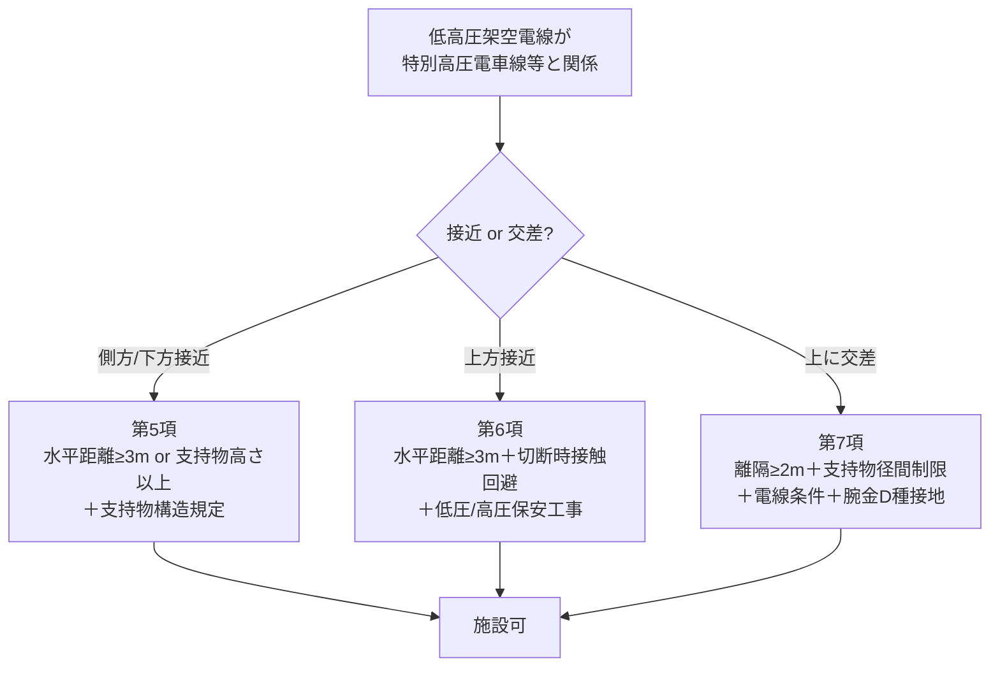

# 電技解釈 第75条 — 低高圧架空電線と電車線路又は電車線路の支線との接近又は交差

!!! warning "📜 一次ソース確認のお願い（2026-05-10）"
    本ページは電気設備の技術基準の解釈（経済産業省告示）を学習用に整理したものです。電技解釈は eGov 法令API に登録されていないため、本Wikiの品質保証は wiki内クロスリファレンスと過去問データベース（kakomon.yml）への照合に依存しています。**重要な実務判断や試験直前の最終確認は、必ず経産省公式の最新告示PDF（[電気設備の技術基準の解釈](https://www.meti.go.jp/policy/safety_security/industrial_safety/sangyo/electric/detail/setsubi_kijun.html)）に当たってください**。誤記を発見された場合は GitHub Issues でご連絡ください。

!!! danger "📌 旧版誤同定の訂正（Phase D-B / 2026-05-10）"
    本ページは旧版で「**高圧架空電線の高さ**（道路横断6m／鉄道横断6.5m 等）」として記述されていましたが、これは **完全な誤同定** でした。経産省告示PDF（令和7年11月版）で確認した第75条の真の主題は **「低高圧架空電線と電車線路（電車線等）又は電車線路の支線（電車線等の支持物）との接近又は交差」** です。

    **架空電線の高さ規定** は低圧・高圧共通で **第68条**（kaishaku/68.md）が正典です。本ページの旧記述（道路6m／鉄道6.5m／その他5m／山地4m）は全て削除し、高さに関心のある方は [第68条](68.md) を参照してください。

!!! abstract "📊 試験対策メタ"
    - **出題頻度**: —（kakomon.yml に第75条の単独出題エントリなし。2026-05-10 時点）
    - **重要度**: C（基本・直接出題実績は限定的だが、電車線路との離隔は架空電線路施設規定の典型論点）
    - **直近出題**: なし（出題実績ゼロ）
    - **典拠（一次ソース）**: 電気設備の技術基準の解釈（経済産業省告示・**令和7年11月版**）第75条
    - **照合日**: 2026-05-10（経産省告示PDF・`scripts/cache/kaishaku-art75.txt` と照合）
    - **隣接条文**: ← [解釈第68条（架空電線の高さ）](68.md)

> 第75条は、**低圧又は高圧の架空電線が、低圧・高圧・特別高圧の電車線等（または電車線等の支持物）と接近・交差する場合**の **離隔距離** と **施設方法** を規定する条文。低高圧（電車側）との関係は **75-1表の離隔距離** が核心。特別高圧電車線等との関係は **第5項以降**（水平距離・支持物構造・保安工事）で別建て。**「架空電線の高さ」（道路6m・鉄道6.5m 等）は本条ではなく第68条が正典**（旧版誤同定を訂正済）。

| 項目 | 内容 |
|------|------|
| 条文 | 電気設備の技術基準の解釈 第75条 |
| 規定内容 | 低高圧架空電線と電車線等・電車線等の支持物との接近・交差時の離隔距離と施設方法 |
| 性格 | 数値規定（離隔距離）＋ 施設規定（保安工事・支持物構造） |
| 上位 | 省令第28条（架空電線路と他の工作物との接近・交差） |
| 関連 | 第74条（低高圧架空電線等の併架・共架）・第68条（架空電線の高さ） |
| 主な数値 | 低圧⇔低圧電車線 0.3m〜0.6m ／ 高圧⇔電車線 0.4m〜0.8m ／ 特別高圧電車線との水平離隔 ≥3m |
| **典拠（一次ソース）** | 経済産業省告示「電気設備の技術基準の解釈」**令和7年11月版** 第75条 |
| **照合日** | 2026-05-10（江間が経産省告示PDFキャッシュと照合） |
| **隣接条文** | ← [解釈第68条（架空電線の高さ）](68.md) |

---

## 1. 全体像と要点

- 第75条が扱うのは **電車線路（線路上を走る電車に給電する架空線）との接近・交差** の話
- 規定対象は2系統:
    - 1. **低圧電車線等・高圧電車線等** との関係 → **75-1表** の離隔距離（0.3〜0.8m）＋ 保安工事
    - 2. **特別高圧電車線等** との関係 → 水平距離 ≥ 3m ＋ 支持物構造規定（鉄筋コンクリート柱等）
- **架空電線の高さ（道路横断6m 等）は本条の主題ではない** → [第68条](68.md) を参照
- **保安工事**: 接近・交差時は対応する保安工事（低圧保安工事・高圧保安工事）の適用が原則
- **支持物との関係**: 電車線等の「支持物」（架線柱）も離隔規定の対象（75-1表 右列）

??? question "セルフチェック: 第75条の主題は何か？"
    **低高圧架空電線と「電車線等」または「電車線等の支持物」との接近・交差時の離隔距離と施設方法**。

    「架空電線の高さ」（道路横断・鉄道横断時の高さ）は **第68条**（低高圧共通）が正典。本ページの旧版（道路6m／鉄道6.5m）は誤同定だったため削除済。

??? question "セルフチェック: 高圧架空電線（裸線・ケーブル以外）が高圧電車線と接近する場合、必要な離隔距離は？"
    **0.8m 以上**（75-1表 高圧架空電線「その他」× 高圧の電車線等の欄）。

    高圧架空電線がケーブルなら 0.4m まで緩和される。

---

## 2. 条文原文（要約）

!!! note "📜 条文の構成（経産省告示・令和7年11月版）"
    第75条は全 **7項** で構成される長大条文。要旨を箇条書きで整理する。

??? note "📜 条文原文（要旨抜粋・一次ソース照合済）"

    **第1項（基本ルール・75-1表）**

    > 低圧架空電線又は高圧架空電線が、低圧若しくは高圧の電車線等又は電車線等の支持物と接近又は交差する場合における、相互の離隔距離は、75-1表に規定する値以上であること。

    **75-1表（離隔距離の最小値）**

    | 架空電線の種類 | 低圧の電車線等 | 高圧の電車線等 | 低圧又は高圧の電車線等の支持物 |
    |---|---|---|---|
    | **低圧架空電線**：高圧絶縁電線・特別高圧絶縁電線 又は ケーブル | 0.3m | 1.2m | 0.3m |
    | **低圧架空電線**：その他 | 0.6m | 1.2m | 0.3m |
    | **高圧架空電線**：ケーブル | 0.4m | 0.4m | 0.3m |
    | **高圧架空電線**：その他 | 0.8m | 0.8m | 0.6m |

    **第2項**: 低圧架空電線が高圧の電車線等と **接近状態** に施設される場合 → 第74条第3項に準じる
    **第3項**: 低圧架空電線が高圧の電車線等の **上に交差** して施設される場合 → 低圧架空電線路を **低圧保安工事** で施設（第24条第1項の電路接地工事を施したものは除く）
    **第4項**: 高圧架空電線が低圧・高圧の電車線等と接近・交差する場合 → 高圧架空電線路を **高圧保安工事** で施設
    **第5項**: 低圧・高圧架空電線が **特別高圧電車線等** と接近する場合 → 電車線等の **側方又は下方** に施設し、次のいずれかに適合:
    -    一. 水平距離 ≥ 電車線等の支持物の地表上高さ
    -    二. 水平距離 ≥ **3m** ＋ 支持物が鉄筋コンクリート柱／鉄柱（径間≤60m）等
    -    三. 支持物・離隔距離・保護網の組合せ条件
    **第6項**: 第5項によらず、特別高圧電車線等の **上方接近** が認められる施設条件（水平距離≥3m＋切断・倒壊時の接触回避＋低圧/高圧保安工事＋支持物条件）
    **第7項**: 低圧・高圧架空電線が特別高圧電車線等の **上に交差** する場合の詳細施設条件（離隔≥2m・支持物径間制限・電線条件・腕金D種接地等）

    **典拠**: 経済産業省告示「電気設備の技術基準の解釈」令和7年11月版 第75条 ／ ローカルキャッシュ `scripts/cache/kaishaku-art75.txt` ／ 2026-05-10 一次照合

---

## 3. 用語の整理

| 用語 | 意味 | 注意点 |
|---|---|---|
| **電車線等** | 電車線（パンタグラフ等が摺動する架線）と、それに付随する電気的に接続された設備 | 「電車線」単独ではなく「等」を含む点に注意 |
| **電車線等の支持物** | 電車線等を支える架線柱・ビーム・腕金等 | 75-1表で離隔対象として独立列で規定 |
| **接近** | 並行して近接して施設される状態 | 「上に交差」とは別概念 |
| **交差** | 立体的に上下で交わる状態 | 「上に交差」「下に交差」で施設要件が変わる |
| **低圧保安工事 / 高圧保安工事** | 第70条等で規定される強化施設方式（電線種別・引張強さ・支持物条件） | 接近・交差時の追加要件として頻出 |

---

## 4. なぜこの条文が必要か（因果理解）

### 電車線路の特殊性
- **電車線（トロリ線）は常時通電** している裸導体（架空電線と異なり絶縁被覆なし）
- パンタグラフが擦り上げる構造のため、**機械的振動・摩耗・スパーク** が常時発生
- 架空電線が接近・接触すると、**両系統の電気的な短絡・地絡** に直結

### 離隔距離の設計思想
- **電車線が低圧（DC600V／DC750V 等）でも、架空電線側との電位差** がアーク発生に十分
- ケーブル・絶縁電線を使えば離隔は緩和（被覆で接触リスクが減る）
- 裸電線（「その他」）は最も大きな離隔が必要
- **特別高圧電車線**（新幹線AC25kV等）との関係は **桁違いの離隔（≥3m＋構造規定）** が必要

### 支持物との離隔がある理由
- 電車線等の支持物（鋼製架線柱）は **地絡時に大地電位ではなく中間電位** になりうる
- 倒壊・接触事故時に架空電線へ波及するリスクを物理距離で防ぐ

---

## 5. 図で理解

### ① 75-1表の構造（離隔マトリクス）

<svg viewBox="0 0 760 360" xmlns="http://www.w3.org/2000/svg" width="100%" preserveAspectRatio="xMidYMid meet">
<defs>
<filter id="sh75a" x="-20%" y="-20%" width="140%" height="140%"><feDropShadow dx="0" dy="2" stdDeviation="2" flood-opacity="0.15"/></filter>
</defs>
<text x="380" y="24" text-anchor="middle" font-size="15" font-weight="700" fill="#212121">75-1表 — 低高圧架空電線と電車線等の離隔距離マトリクス</text>
<text x="380" y="42" text-anchor="middle" font-size="11" fill="#666">単位: m（最小値・以上）</text>

<rect x="60" y="60" width="180" height="40" fill="#e3f2fd" stroke="#1565c0"/>
<text x="150" y="85" text-anchor="middle" font-size="12" font-weight="700" fill="#0d47a1">架空電線の種類</text>
<rect x="240" y="60" width="140" height="40" fill="#fff9c4" stroke="#f9a825"/>
<text x="310" y="85" text-anchor="middle" font-size="12" font-weight="700" fill="#f57f17">低圧の電車線等</text>
<rect x="380" y="60" width="140" height="40" fill="#ffccbc" stroke="#d84315"/>
<text x="450" y="85" text-anchor="middle" font-size="12" font-weight="700" fill="#bf360c">高圧の電車線等</text>
<rect x="520" y="60" width="180" height="40" fill="#c8e6c9" stroke="#2e7d32"/>
<text x="610" y="80" text-anchor="middle" font-size="11" font-weight="700" fill="#1b5e20">電車線等の支持物</text>
<text x="610" y="94" text-anchor="middle" font-size="10" fill="#1b5e20">（低圧・高圧）</text>

<rect x="60" y="100" width="180" height="50" fill="#f5f5f5" stroke="#999"/>
<text x="150" y="120" text-anchor="middle" font-size="11" fill="#212121">低圧架空電線</text>
<text x="150" y="138" text-anchor="middle" font-size="10" fill="#666">（高圧絶縁/特高絶縁/ケーブル）</text>
<rect x="240" y="100" width="140" height="50" fill="#fff" stroke="#999"/>
<text x="310" y="130" text-anchor="middle" font-size="14" font-weight="700" fill="#1b5e20">0.3</text>
<rect x="380" y="100" width="140" height="50" fill="#fff" stroke="#999"/>
<text x="450" y="130" text-anchor="middle" font-size="14" font-weight="700" fill="#bf360c">1.2</text>
<rect x="520" y="100" width="180" height="50" fill="#fff" stroke="#999"/>
<text x="610" y="130" text-anchor="middle" font-size="14" font-weight="700" fill="#1b5e20">0.3</text>

<rect x="60" y="150" width="180" height="50" fill="#f5f5f5" stroke="#999"/>
<text x="150" y="170" text-anchor="middle" font-size="11" fill="#212121">低圧架空電線</text>
<text x="150" y="188" text-anchor="middle" font-size="10" fill="#666">（その他＝裸線等）</text>
<rect x="240" y="150" width="140" height="50" fill="#fff" stroke="#999"/>
<text x="310" y="180" text-anchor="middle" font-size="14" font-weight="700" fill="#f57f17">0.6</text>
<rect x="380" y="150" width="140" height="50" fill="#fff" stroke="#999"/>
<text x="450" y="180" text-anchor="middle" font-size="14" font-weight="700" fill="#bf360c">1.2</text>
<rect x="520" y="150" width="180" height="50" fill="#fff" stroke="#999"/>
<text x="610" y="180" text-anchor="middle" font-size="14" font-weight="700" fill="#1b5e20">0.3</text>

<rect x="60" y="200" width="180" height="50" fill="#f5f5f5" stroke="#999"/>
<text x="150" y="220" text-anchor="middle" font-size="11" fill="#212121">高圧架空電線</text>
<text x="150" y="238" text-anchor="middle" font-size="10" fill="#666">（ケーブル）</text>
<rect x="240" y="200" width="140" height="50" fill="#fff" stroke="#999"/>
<text x="310" y="230" text-anchor="middle" font-size="14" font-weight="700" fill="#1b5e20">0.4</text>
<rect x="380" y="200" width="140" height="50" fill="#fff" stroke="#999"/>
<text x="450" y="230" text-anchor="middle" font-size="14" font-weight="700" fill="#1b5e20">0.4</text>
<rect x="520" y="200" width="180" height="50" fill="#fff" stroke="#999"/>
<text x="610" y="230" text-anchor="middle" font-size="14" font-weight="700" fill="#1b5e20">0.3</text>

<rect x="60" y="250" width="180" height="50" fill="#f5f5f5" stroke="#999"/>
<text x="150" y="270" text-anchor="middle" font-size="11" fill="#212121">高圧架空電線</text>
<text x="150" y="288" text-anchor="middle" font-size="10" fill="#666">（その他＝裸線等）</text>
<rect x="240" y="250" width="140" height="50" fill="#fff" stroke="#999"/>
<text x="310" y="280" text-anchor="middle" font-size="14" font-weight="700" fill="#bf360c">0.8</text>
<rect x="380" y="250" width="140" height="50" fill="#fff" stroke="#999"/>
<text x="450" y="280" text-anchor="middle" font-size="14" font-weight="700" fill="#bf360c">0.8</text>
<rect x="520" y="250" width="180" height="50" fill="#fff" stroke="#999"/>
<text x="610" y="280" text-anchor="middle" font-size="14" font-weight="700" fill="#f57f17">0.6</text>

<text x="380" y="335" text-anchor="middle" font-size="11" font-weight="700" fill="#0d47a1">対特別高圧電車線等は本表対象外（第5〜7項で別規定・水平距離≥3m＋構造規定）</text>
</svg>

**読み解き**: マトリクスの **行** = 架空電線側の種類（低圧/高圧×ケーブル/裸線）、**列** = 相手方（電車線種別×支持物）。**裸線×電車線** の交点で離隔が大きく、**ケーブル×支持物** の交点で離隔が小さい（被覆と支持物の中間電位リスク差を反映）。

### ② 接近・交差の3パターン（特別高圧電車線等）

---

## 6. 頻出ひっかけ・誤同定の罠

### 🔴 致命的（旧版誤同定の名残）

1. ❌「第75条は **高圧架空電線の高さ** を規定する条文」
    - → ✅ **第75条は電車線路との接近・交差の離隔距離** を規定。**高さは第68条**（低高圧共通）が正典
2. ❌「高圧架空電線の道路横断は **第75条** で 6m 以上」
    - → ✅ **第68条** で規定（低高圧共通の高さ条文）。第75条には道路高さの規定なし
3. ❌「高圧架空電線の鉄道横断は **第75条** で 6.5m 以上」
    - → ✅ これも **第68条** の高さ規定。第75条は「電車線等との **離隔距離**（水平距離も含む）」であり、鉄道横断時の **高さ** とは別概念

### 🟡 注意

4. ❌「電車線との離隔は架空電線がケーブルなら一律緩和」
    - → ✅ **高圧電車線**との関係では「ケーブル 0.4m」だが「裸線 0.8m」と差がある。**低圧電車線**でも低圧架空電線（裸）は 0.6m 必要
5. ❌「特別高圧電車線等との離隔も 75-1表 で読める」
    - → ✅ **75-1表は低圧・高圧電車線等まで**。特別高圧は第5〜7項で別建て（水平距離≥3m）

### 🟢 軽度

6. ❌「電車線等の支持物は離隔対象外」
    - → ✅ **75-1表 右列で独立規定**。低圧/高圧支持物への離隔は 0.3m〜0.6m

---

## 7. 試験で問われること

第75条は **kakomon.yml に直接の出題エントリなし**（2026-05-10 時点）だが、以下の論点で出題される可能性がある:

- 電車線等との **離隔距離の数値**（75-1表）
- 接近・交差時の **保安工事の適用関係**（低圧保安工事・高圧保安工事）
- 特別高圧電車線等との **水平距離 ≥ 3m** ルール
- 「電車線等の **支持物**」も離隔対象である点

**対策**: 75-1表 を「低圧×ケーブル ⇔ 低圧電車線 = 0.3m」のように行列で覚える。特別高圧との関係は「**水平 3m 以上＋構造規定**」のセットで覚える。

---

## 8. 関連条文・関連ページ

- [解釈第68条](68.md) — **架空電線の高さ**（低高圧共通・道路横断・鉄道横断・その他の場所・山地特例）。**本ページの旧版で扱っていた高さ規定はすべて第68条が正典**
- 解釈第74条 — 低高圧架空電線等の併架・共架（接近状態の準用元）
- 解釈第70条 — 低高圧保安工事（第75条で適用される強化施設）
- 省令第28条 — 架空電線路と他の工作物との接近・交差（上位省令）

---

## 9. 過去問実績

| 年度 | 問 | 形式 | 論点 |
|------|-----|------|------|
| — | — | — | kakomon.yml に第75条の登録エントリなし（2026-05-10 時点） |

!!! note "出題予測（R08）"
    第75条単独での過去14年出題は確認できないが、架空電線路の施設規定（第68条＝高さ／第74条＝併架／第75条＝電車線路接近）は **施設条件の複合問題** として束で問われる傾向がある。
    特に **75-1表の離隔数値** と **特別高圧電車線等の水平距離 3m** は丸暗記しておくと安心。

---

## 10. 最終チェック

- [ ] 第75条の **真の主題** が「電車線路（電車線等）との接近・交差」であると理解した
- [ ] 旧版にあった「道路6m／鉄道6.5m／その他5m／山地4m」は **第68条が正典** だと知った
- [ ] 75-1表の **0.3／0.4／0.6／0.8／1.2 m** の使い分けを理解した
- [ ] 特別高圧電車線等との関係は **水平距離 ≥ 3m ＋ 支持物構造規定** だと覚えた
- [ ] 接近・交差時に **低圧保安工事／高圧保安工事** が適用される枠組みを理解した

---

## 監修ログ

- 2026-05-10 v3.0 Phase D-B修正：旧版「高圧架空電線の高さ」誤同定を全面書き直し（高さは第68条が正典）・経産省告示PDF確定情報で「電車線路との接近又は交差」に主題変更。typo「電車線等」「電車線等の支持物」用語を統一。75-1表を SVG マトリクスで視覚化。Phase C 一次ソース確認 warning は保持。
- 2026-04-20 v1.0 初版作成（旧版・第75条を「高圧架空電線の高さ」と誤同定。道路横断6m／鉄道横断6.5m 等を記述。**全面書き直し対象**）

---

*最終確認: 2026-05-10 | ステータス: v3.0（Phase D-B 全面書き直し） | 典拠: 経産省告示 令和7年11月版 第75条 | [バージョニング基準](../../reference/versioning.md)*
