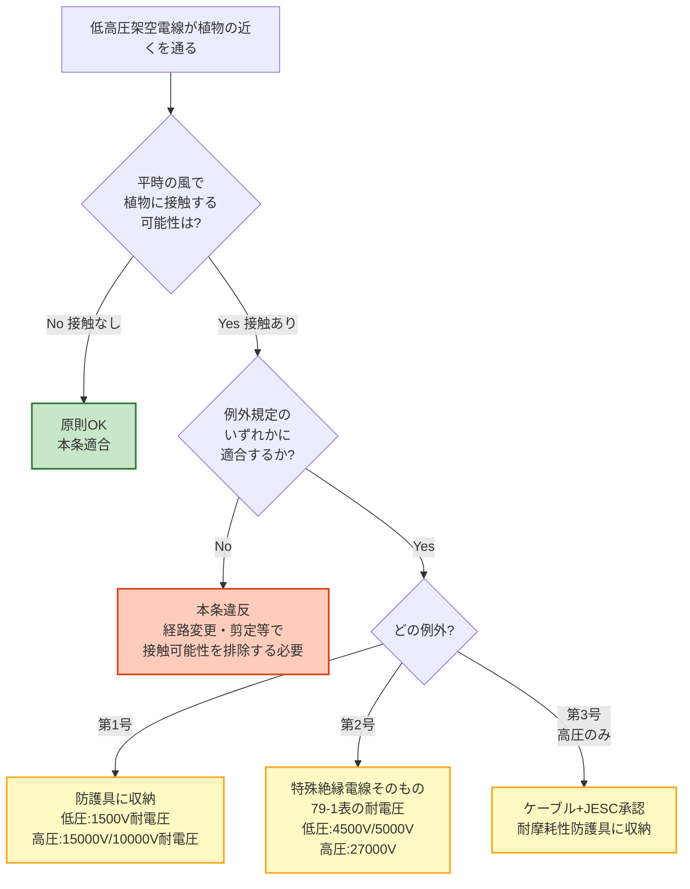

# 電技解釈 第79条 — 低高圧架空電線と植物との接近

!!! warning "📜 一次ソース確認のお願い（2026-05-10）"
    本ページは電気設備の技術基準の解釈（経済産業省が省令の解釈として示すもの）を学習用に整理したものです。電技解釈は eGov 法令API に登録されていないため、本Wikiの品質保証は wiki内クロスリファレンスと過去問データベース（kakomon.yml）への照合に依存しています。**重要な実務判断や試験直前の最終確認は、必ず経産省公式の最新告示PDF（[電気設備の技術基準の解釈](https://www.meti.go.jp/policy/safety_security/industrial_safety/sangyo/electric/detail/setsubi_kijun.html)）に当たってください**。誤記を発見された場合は GitHub Issues でご連絡ください。

!!! danger "⚠️ Phase D-B 修正（2026-05-10）— 旧版「建造物の離隔距離」誤同定の全面書き直し"
    本ページの旧版（v1.0）は条文タイトルを **「低高圧架空電線と建造物の離隔距離」** と誤同定し、低圧1m／高圧1.2m／絶縁電線0.4m 等の数値を解説していました。Phase D-B 監査（経産省告示PDF・令和7年11月版／lawid 該当箇所）で第79条の正本タイトルは **「低高圧架空電線と植物との接近」** であることが確定し、旧版内容は完全な誤同定だったため全面書き直しを実施しました。**建造物との離隔距離規定をお探しの方は本記事ではなく [架空電線の高さ・離隔の関連条文](#11-関連ページ) の各記事を参照してください**。

!!! abstract "📊 試験対策メタ"
    - **出題頻度**: —（過去14年で出題なし）
    - **重要度**: C（基本）
    - **直近出題**: なし（kakomon.yml 第79条 登録 0 件）

> 低圧架空電線又は高圧架空電線は、平時吹いている風等により、**植物に接触しないように施設する**ことが原則。例外として、(1) 摩耗検知層付き防護具に収める／(2) 摩耗検知層を被覆した特殊絶縁電線を使用する／(3) 高圧の場合はケーブル＋耐摩耗性防護具に収める、のいずれかに適合すれば緩和される。

| 項目 | 内容 |
|------|------|
| 条文 | 電気設備の技術基準の解釈 第79条 |
| 規定内容 | 低高圧架空電線が植物（樹木等）と接触しないための施設要件 |
| 性格 | 施設規定（原則禁止＋3例外） |
| 上位省令 | 省令第5条第1項（電路の絶縁原則）／省令第29条（架空電線等の感電・火災防止） |
| **典拠（一次ソース）** | 電気設備の技術基準の解釈（経済産業省が省令の解釈として示すもの・令和7年11月版）第79条 |
| **照合日** | 2026-05-10（`scripts/cache/kaishaku-art79.txt` で経産省告示PDFと照合） |
| **隣接条文** | ← [第75条（高圧架空電線の高さ）](75.md) ／ [第81条（架空電線と他の架空電線路との離隔）](81.md) → |

---

## 1. 全体像と要点

- **原則**: 平時吹いている風等により、低高圧架空電線が **植物に接触しない** ように施設する
- 「平時の風」を前提にしており、台風等の異常気象下での接触まで完全に防ぐ趣旨ではない
- 例外規定は **3パターン**：(1) 防護具収納、(2) 特殊絶縁電線使用、(3) 高圧ケーブル＋防護具
- いずれの例外も「**摩耗検知層**」というキーワードが核心 — 樹木との擦れによる絶縁体摩耗を可視化する構造
- 緩和の試験電圧（耐電圧試験値）は導体断面積・電圧種別で 4 段階（低圧1500V／4500V／5000V、高圧10000V〜27000V）
- 旧版で扱っていた「建造物との離隔距離（1m／1.2m／0.4m）」は本条の論点ではない（誤同定だった）

??? question "セルフチェック: 第79条が規制する「接触」は何との接触か？"
    **植物（主に樹木）** との接触。建造物・他の電線・地表との関係は別条文（第71条／第75条／第78条／第81条等）で個別規定される。
    
    第79条は架空電線の経路に存在する樹木が「平時の風で揺れて電線と擦れる」状況を念頭に置き、絶縁体の摩耗・地絡・感電・火災を防ぐ趣旨。

??? question "セルフチェック: 「平時吹いている風等により植物に接触しないこと」を満たさない場合、即違反になるか？"
    **即違反にはならない**。本条は原則本文の直後に「ただし、次の各号のいずれかによる場合は、この限りでない」と続き、3つの例外（防護具収納／特殊絶縁電線／高圧ケーブル＋防護具）のいずれかを満たせば施設可能。
    
    つまり実務では「樹木との接触が避けられない経路」では、原則を満たさない代わりに例外規定の要件（摩耗検知層付き構造）を満たすことで施設できる。

---

## 2. 条文原文

??? note "📜 条文原文 — 電技解釈完全版（折り畳み・クリックで開く）"
    経産省告示PDF（電気設備の技術基準の解釈・令和7年11月版／`scripts/cache/kaishaku-art79.txt`）から取得した **第79条 全文**（条文本文＋表）。本記事の解説・暗記表は試験対策のために整理したものなので、正確な条文文言を確認したい場合は本ブロックを参照すること。**2026-05-10 一次照合済**。
    
    **凡例**: <mark>黄色マーカー</mark> = 過去14年で実際に穴埋め出題された語のみを対象とする運用だが、第79条は **kakomon.yml 登録 0 件** のため本記事ではマーカー対象なし。**bold** は条文の主要語句として強調（穴埋め予想範囲扱い）。
    
    **第79条（見出し）**
    
    > 【低高圧架空電線と植物との接近】（省令第5条第1項、第29条）
    
    **第79条 第1項本文**
    
    > 低圧架空電線又は高圧架空電線は、**平時吹いている風等**により、**植物に接触しないように施設**すること。
    
    > ただし、次の各号のいずれかによる場合は、この限りでない。
    
    **第1号（防護具収納）**
    
    > 一　低圧架空電線又は高圧架空電線を、次に適合する防護具に収めて施設すること。
    > 
    > イ　構造は、絶縁耐力及び耐摩耗性を有する**摩耗検知層**の上部に**摩耗層**を施した構造で、外部から電線に接触するおそれがないように電線を覆うことができること。
    > 
    > ロ　完成品は、摩耗検知層が露出した状態で、次に適合するものであること。
    > 
    > 　(イ) 低圧架空電線に使用するものは、充電部分に接する内面と充電部分に接しない外面との間に、**1,500Vの交流電圧** を連続して**1分間** 加えたとき、これに耐える性能を有すること。
    > 
    > 　(ロ) 高圧架空電線に使用するものは、乾燥した状態において **15,000Vの交流電圧** を、また、**日本産業規格** JIS C 0920（2003）「電気機械器具の外郭による保護等級（IPコード）」に規定する「14.2.3 オシレーティングチューブ又は散水ノズルによる第二特性数字3に対する試験」の試験方法により散水した直後の状態において **10,000Vの交流電圧** を、充電部分に接する内面と充電部分に接しない外面との間に連続して1分間加えたとき、それぞれに耐える性能を有すること。
    > 
    > 　(ハ) 民間規格評価機関として日本電気技術規格委員会が承認した規格である「ゴム・プラスチック絶縁電線試験方法」の「適用」の欄に規定する要件に適合すること。
    
    **第2号（特殊絶縁電線そのもの）**
    
    > 二　低圧架空電線又は高圧架空電線が、次に適合するものであること。
    > 
    > イ　構造は、**絶縁電線の上部に絶縁耐力及び耐摩耗性を有する摩耗検知層を施し、更にその上部に摩耗層を施した構造**で、絶縁電線を一様な厚さに被覆したものであること。
    > 
    > ロ　完成品は、摩耗検知層が露出した状態で、次に適合するものであること。
    > 
    > 　(イ) 清水中に1時間浸した後、導体と大地との間に **79-1表** に規定する交流電圧を連続して1分間加えたとき、これに耐える性能を有すること。
    
    **79-1表（耐電圧試験電圧）**
    
    | 電線の種類 | 交流電圧 |
    |---|---|
    | 低圧（導体の断面積が **300mm²以下** のもの） | **4,500V** |
    | 低圧（導体の断面積が **300mm²を超える** もの） | **5,000V** |
    | 高圧 | **27,000V** |
    
    > 　(ロ) 民間規格評価機関として日本電気技術規格委員会が承認した規格である「ゴム・プラスチック絶縁電線試験方法」の「適用」の欄に規定する要件に適合すること。
    
    **第3号（高圧ケーブル＋耐摩耗性防護具）**
    
    > 三　高圧の架空電線にケーブルを使用し、かつ、民間規格評価機関として日本電気技術規格委員会が承認した規格である「**耐摩耗性能を有する「ケーブル用防護具」の構造及び試験方法**」の「適用」の欄に規定する要件に適合する防護具に収めて施設すること。
    
    **典拠**: 電気設備の技術基準の解釈 第79条（経済産業省が省令の解釈として示すもの・令和7年11月版） ／ ローカルキャッシュ `scripts/cache/kaishaku-art79.txt` ／ 2026-05-10 一次照合

---

**以下は試験対策のための要約・解説（条文丸暗記の前段として）**

第79条の構造は **「原則1つ＋例外3つ」** のシンプルな施設規定。

- 原則: 平時の風で植物に接触しないこと
- 例外1（防護具収納）: 低圧1500V／高圧15000V（乾燥）・10000V（散水）の耐電圧
- 例外2（特殊絶縁電線そのもの）: 79-1表（低圧4500V／5000V・高圧27000V）の耐電圧
- 例外3（高圧ケーブル＋防護具）: JESC承認「耐摩耗性ケーブル用防護具」要件適合

---

## 3. 原文解析（ブロック分解）

| 原文ブロック | 意味 | 試験のポイント |
|---|---|---|
| 「低圧架空電線又は高圧架空電線は」 | 適用範囲＝**架空** の **低圧／高圧** 電線（特高は別条文） | 地中線・特別高圧は対象外 |
| 「平時吹いている風等により」 | 条件＝**通常気象下** での電線揺動 | 台風・暴風等の異常気象は別途判断 |
| 「植物に接触しないように施設すること」 | 原則＝**接触禁止施設**（接触の可能性そのものを排除） | 「離隔距離 N m 以上」のような数値規定はない（後述ひっかけ） |
| 「ただし、次の各号のいずれかによる場合は、この限りでない」 | 例外3パターンへの分岐 | 「いずれか」＝OR 条件。3つ全部満たす必要はない |
| 「摩耗検知層」 | 全例外に共通する核心構造＝**摩耗の可視化層** | 絶縁層が摩耗で露出すると保安員に視認され交換判断ができる |
| 「摩耗検知層が露出した状態で…耐電圧」 | 摩耗が進行しても **最低限の絶縁性能を保つ** | 試験電圧は条文で固定値（条文丸暗記対象） |

??? question "セルフチェック: 第79条には「離隔距離 ○m 以上」という数値規定があるか？"
    **ない**。第79条は離隔距離型の規定ではなく、「**接触しないように施設**」という結果義務を課す規定。
    
    旧版（v1.0）は本条を「建造物との離隔距離」と誤同定し低圧1m／高圧1.2m等の数値を載せていたが、それは別条文（建造物との接近・離隔は第71条系列）の数値を取り違えたもの。第79条そのものに離隔距離数値は存在しない。

---

## 4. かみ砕き解説（因果理解）

### なぜ「植物との接近」を独立条文で扱うか

架空電線が施設される空間には、必ず樹木・蔓植物・街路樹などの植物が存在する。電線と植物の関係は他の障害物（建造物・道路・他電線）と決定的に違う点が3つある：

1. **植物は成長する**：施設時点で離隔があっても、数年後に枝が伸びて電線に届くようになる
2. **風で揺れて擦れる**：建造物のような剛体接触ではなく、慢性的な摩耗を引き起こす
3. **湿った樹皮は導電性を持つ**：雨天時の樹木は完全絶縁体ではなく、地絡経路になり得る

この3要因が複合するため、単純な「離隔距離 N m 以上」では制御できず、**接触そのものを禁止＋接触前提の特殊構造を例外として許容** という規定構造になっている。

### なぜ「摩耗検知層」が条文の核心か

樹木と電線の接触で最も怖いのは「**摩耗が見えないまま絶縁が破壊される**」こと。第79条の例外規定3つすべてに「摩耗検知層」が登場するのは、以下の安全設計思想による：

```
[最外層: 摩耗層] ← 樹木との接触で先に摩耗
        ↓ 摩耗が進行
[中間層: 摩耗検知層] ← 露出すると目視で確認できる（色・材質で区別）
        ↓ 摩耗検知層も露出した状態でも耐電圧試験をクリア
[内層: 絶縁層] ← 最後の防衛線・基本絶縁性能
        ↓
[充電部（導体）]
```

**摩耗検知層が露出した状態で耐電圧試験をクリアする** という条文文言は、「摩耗が見えるようになっても、まだ最低限の絶縁性能は確保されている」ことを保証する設計思想。視認 → 交換判断 → 事故未然防止のサイクルを成立させる。

### 例外3パターンの使い分け

| 例外 | 適用場面 | 具体例 |
|---|---|---|
| 第1号（防護具に収める） | 既存電線をそのままに、外側に保護管を被せる場合 | 街路樹剪定が困難な区間に後付け |
| 第2号（特殊絶縁電線そのもの） | 新設時に最初から摩耗検知層付き電線を使用 | 山林通過区間の新設配電線 |
| 第3号（高圧ケーブル＋防護具） | 高圧の特に厳しい樹木接触環境 | 高圧配電線が密生樹林を通過する経路 |

実務では、新設は第2号（電線そのものの選定）が多く、既設改修は第1号（外付け防護具）が多い。第3号は「高圧」「ケーブル使用」が前提のため適用場面が限定される。

---

## 5. 図で理解

### 第79条の判定フロー



### 摩耗検知層の構造イメージ

<div><svg viewBox="0 0 800 320" xmlns="http://www.w3.org/2000/svg" width="100%" preserveAspectRatio="xMidYMid meet">
<defs>
<filter id="sh79a" x="-20%" y="-20%" width="140%" height="140%"><feDropShadow dx="0" dy="2" stdDeviation="2" flood-opacity="0.15"/></filter>
</defs>
<text x="400" y="26" text-anchor="middle" font-size="15" font-weight="700" fill="#212121">第79条 摩耗検知層付き電線・防護具の断面構造</text>
<text x="400" y="44" text-anchor="middle" font-size="11" fill="#666">最外層から摩耗 → 検知層が露出 → 視認交換 → 事故防止</text>

<circle cx="200" cy="180" r="20" fill="#bdbdbd" stroke="#616161" stroke-width="2"/>
<text x="200" y="184" text-anchor="middle" font-size="10" font-weight="700" fill="#212121">導体</text>
<circle cx="200" cy="180" r="40" fill="none" stroke="#1565c0" stroke-width="6"/>
<circle cx="200" cy="180" r="60" fill="none" stroke="#fbc02d" stroke-width="6"/>
<circle cx="200" cy="180" r="80" fill="none" stroke="#388e3c" stroke-width="6"/>

<line x1="260" y1="180" x2="320" y2="120" stroke="#1565c0" stroke-width="1.2"/>
<text x="325" y="120" font-size="11" font-weight="700" fill="#1565c0">絶縁層（基本絶縁）</text>
<text x="325" y="135" font-size="10" fill="#1565c0">最後の防衛線</text>

<line x1="265" y1="170" x2="320" y2="180" stroke="#fbc02d" stroke-width="1.2"/>
<text x="325" y="180" font-size="11" font-weight="700" fill="#f57f17">摩耗検知層</text>
<text x="325" y="195" font-size="10" fill="#f57f17">露出すると視認可能</text>

<line x1="270" y1="225" x2="320" y2="245" stroke="#388e3c" stroke-width="1.2"/>
<text x="325" y="248" font-size="11" font-weight="700" fill="#1b5e20">摩耗層（最外層）</text>
<text x="325" y="263" font-size="10" fill="#1b5e20">樹木と最初に擦れる犠牲層</text>

<rect x="540" y="80" width="240" height="220" rx="10" fill="#f5f5f5" stroke="#bdbdbd" stroke-width="1.5"/>
<text x="660" y="105" text-anchor="middle" font-size="12" font-weight="700" fill="#212121">摩耗の進行と検知</text>
<line x1="555" y1="115" x2="765" y2="115" stroke="#bdbdbd" stroke-width="1"/>
<text x="660" y="135" text-anchor="middle" font-size="10" fill="#1b5e20">①新品: 摩耗層が健全</text>
<text x="660" y="155" text-anchor="middle" font-size="10" fill="#388e3c">↓ 樹木と擦れて摩耗が進行</text>
<text x="660" y="175" text-anchor="middle" font-size="10" fill="#f57f17">②摩耗層が削れて検知層が露出</text>
<text x="660" y="195" text-anchor="middle" font-size="10" fill="#f9a825">↓ 巡視で目視確認</text>
<text x="660" y="215" text-anchor="middle" font-size="10" fill="#d84315">③検知層が露出 = 交換時期</text>
<text x="660" y="235" text-anchor="middle" font-size="10" fill="#bf360c">↓ 絶縁層は健全 = 事故前に交換</text>
<rect x="555" y="248" width="210" height="40" rx="6" fill="#c8e6c9" stroke="#2e7d32" stroke-width="1.5"/>
<text x="660" y="265" text-anchor="middle" font-size="10" font-weight="700" fill="#1b5e20">摩耗検知層が露出しても</text>
<text x="660" y="280" text-anchor="middle" font-size="10" font-weight="700" fill="#1b5e20">条文の耐電圧試験はクリア</text>
</svg></div>

**読み解き**: 摩耗層 → 摩耗検知層 → 絶縁層 → 導体 という多重構造により、**絶縁破壊に至る前に視認による交換判断を可能にする** のが第79条例外規定の設計思想。条文の耐電圧試験要件は「摩耗検知層が露出した状態で」と明記されており、視認時点でも基本絶縁性能が残っていることを保証する。

### 例外規定の耐電圧試験値まとめ

<div><svg viewBox="0 0 800 280" xmlns="http://www.w3.org/2000/svg" width="100%" preserveAspectRatio="xMidYMid meet">
<defs>
<filter id="sh79b" x="-20%" y="-20%" width="140%" height="140%"><feDropShadow dx="0" dy="2" stdDeviation="2" flood-opacity="0.12"/></filter>
</defs>
<text x="400" y="24" text-anchor="middle" font-size="15" font-weight="700" fill="#212121">第79条 例外規定 耐電圧試験値の早見表</text>
<text x="400" y="42" text-anchor="middle" font-size="11" fill="#666">「内面と外面の間」「導体と大地の間」に交流電圧を1分間印加</text>

<rect x="40" y="60" width="240" height="200" rx="10" fill="#e3f2fd" stroke="#1565c0" stroke-width="2" filter="url(#sh79b)"/>
<text x="160" y="84" text-anchor="middle" font-size="13" font-weight="700" fill="#0d47a1">第1号 防護具収納</text>
<line x1="55" y1="92" x2="265" y2="92" stroke="#1565c0" stroke-width="1"/>
<text x="160" y="112" text-anchor="middle" font-size="11" font-weight="700" fill="#1565c0">低圧</text>
<text x="160" y="132" text-anchor="middle" font-size="14" font-weight="800" fill="#0d47a1">1,500V</text>
<text x="160" y="148" text-anchor="middle" font-size="9" fill="#1565c0">（内面/外面間 1分）</text>
<line x1="60" y1="160" x2="260" y2="160" stroke="#90caf9" stroke-width="1" stroke-dasharray="3,2"/>
<text x="160" y="178" text-anchor="middle" font-size="11" font-weight="700" fill="#1565c0">高圧</text>
<text x="160" y="198" text-anchor="middle" font-size="13" font-weight="800" fill="#0d47a1">乾燥 15,000V</text>
<text x="160" y="218" text-anchor="middle" font-size="13" font-weight="800" fill="#0d47a1">散水後 10,000V</text>
<text x="160" y="238" text-anchor="middle" font-size="9" fill="#1565c0">（JIS C 0920 散水試験基準）</text>

<rect x="290" y="60" width="240" height="200" rx="10" fill="#fff8e1" stroke="#f9a825" stroke-width="2" filter="url(#sh79b)"/>
<text x="410" y="84" text-anchor="middle" font-size="13" font-weight="700" fill="#f57f17">第2号 特殊絶縁電線（79-1表）</text>
<line x1="305" y1="92" x2="515" y2="92" stroke="#f9a825" stroke-width="1"/>
<text x="410" y="112" text-anchor="middle" font-size="11" font-weight="700" fill="#f57f17">低圧（断面積 ≤ 300mm²）</text>
<text x="410" y="132" text-anchor="middle" font-size="14" font-weight="800" fill="#f57f17">4,500V</text>
<line x1="310" y1="142" x2="510" y2="142" stroke="#ffe082" stroke-width="1" stroke-dasharray="3,2"/>
<text x="410" y="160" text-anchor="middle" font-size="11" font-weight="700" fill="#f57f17">低圧（断面積 > 300mm²）</text>
<text x="410" y="180" text-anchor="middle" font-size="14" font-weight="800" fill="#f57f17">5,000V</text>
<line x1="310" y1="190" x2="510" y2="190" stroke="#ffe082" stroke-width="1" stroke-dasharray="3,2"/>
<text x="410" y="208" text-anchor="middle" font-size="11" font-weight="700" fill="#f57f17">高圧</text>
<text x="410" y="228" text-anchor="middle" font-size="14" font-weight="800" fill="#f57f17">27,000V</text>
<text x="410" y="248" text-anchor="middle" font-size="9" fill="#f57f17">（清水中1時間→導体/大地間 1分）</text>

<rect x="540" y="60" width="240" height="200" rx="10" fill="#fce4ec" stroke="#c2185b" stroke-width="2" filter="url(#sh79b)"/>
<text x="660" y="84" text-anchor="middle" font-size="13" font-weight="700" fill="#880e4f">第3号 高圧ケーブル＋防護具</text>
<line x1="555" y1="92" x2="765" y2="92" stroke="#c2185b" stroke-width="1"/>
<text x="660" y="118" text-anchor="middle" font-size="11" fill="#880e4f">耐電圧の数値規定なし</text>
<text x="660" y="140" text-anchor="middle" font-size="11" font-weight="700" fill="#880e4f">JESC承認規格</text>
<text x="660" y="158" text-anchor="middle" font-size="10" fill="#880e4f">「耐摩耗性能を有する</text>
<text x="660" y="172" text-anchor="middle" font-size="10" fill="#880e4f">ケーブル用防護具の</text>
<text x="660" y="186" text-anchor="middle" font-size="10" fill="#880e4f">構造及び試験方法」</text>
<text x="660" y="206" text-anchor="middle" font-size="10" fill="#880e4f">の「適用」要件に適合</text>
<line x1="560" y1="218" x2="760" y2="218" stroke="#f48fb1" stroke-width="1" stroke-dasharray="3,2"/>
<text x="660" y="238" text-anchor="middle" font-size="10" fill="#880e4f">高圧ケーブル前提</text>
<text x="660" y="252" text-anchor="middle" font-size="10" fill="#880e4f">（低圧は対象外）</text>
</svg></div>

**読み解き**: 試験電圧は「**例外1号低圧 1,500V**」「**例外1号高圧 乾燥15,000V／散水10,000V**」「**例外2号 79-1表（低圧4,500V/5,000V／高圧27,000V）**」を **3つ並べて記憶** すると整理しやすい。低圧でも例外1号と2号で試験電圧が大きく異なる点（1,500V vs 4,500V/5,000V）は、構造の違い（外付け vs 電線そのもの）に対応。

---

## 6. 試験で問われること（予想）

第79条は kakomon.yml 登録 0 件 / 過去14年で出題なし のため、出題実績ベースのパターン抽出はできない。以下は条文構造から推測される **出題されるとしたらこの形** という仮想パターン。

| 仮想出題パターン | 想定空欄 | 正解 |
|---|---|---|
| 「低高圧架空電線は、平時吹いている（　）等により、（　）に接触しないように施設すること」 | 風／植物 | 風／植物 |
| 「ただし、防護具に収める場合は、（　）の上部に摩耗層を施した構造であること」 | 摩耗検知層 | 摩耗検知層 |
| 「特殊絶縁電線（高圧）の耐電圧試験は、清水中に1時間浸した後、導体と大地との間に（　）Vの交流電圧を1分間加えても耐えること」 | 27,000 | 27,000 |
| 「第3号により高圧の架空電線に（　）を使用し、JESC承認の耐摩耗性防護具に収めて施設すること」 | ケーブル | ケーブル |

!!! note "出題予測（R08以降）"
    出題頻度は **★☆☆☆☆**（過去14年で出題実績ゼロ・kakomon.yml 0 件）。最優先学習対象ではない。
    
    ただし、**令和の改正で「摩耗検知層」というキーワードが新規追加** された経緯（旧条文より具体化）があるため、**改正論点として今後出題される可能性** はある。最低限「植物との接近 ＝ 摩耗検知層」を結びつけて記憶しておく。

---

## 7. 頻出ひっかけ

### 🔴 致命的（旧版誤同定の警告）

1. ❌「第79条は架空電線と **建造物** の離隔距離（低圧1m／高圧1.2m／絶縁電線0.4m）を定める」
    - → ✅ **第79条は「植物との接近」**。建造物との離隔は別条文系列（旧版v1.0の誤同定 — Phase D-B 修正済）

### 🟡 注意

1. ❌「第79条には離隔距離 ○m 以上 という数値規定がある」
    - → ✅ **離隔距離型ではなく接触禁止型**。原則は「接触しないように施設」で、緩和は耐電圧試験値（電圧）で判定
2. ❌「『平時吹いている風』なので台風時も含めて完全に接触防止する義務」
    - → ✅ 「**平時** の風」と限定されており、異常気象（台風・暴風）下の一時接触まで本条で禁止する趣旨ではない
3. ❌「特殊絶縁電線の耐電圧試験は乾燥状態で実施」
    - → ✅ 第2号は「**清水中に1時間浸した後**」の状態で耐電圧試験を行う（湿潤条件での絶縁性能を保証）

### 🟢 軽度

1. ❌「第3号は低圧ケーブルでも適用できる」
    - → ✅ 第3号は条文に「**高圧の架空電線にケーブルを使用**」と明記。**低圧ケーブルは対象外**
2. ❌「摩耗検知層 = 樹木との摩擦を検知するセンサー（電子部品）」
    - → ✅ 電子部品ではなく、**目視で識別可能な物理層**（色・材質を絶縁層と区別した中間層）。露出すると保安員が視認できる構造

---

## 8. 過去問実績

| 年度 | 問 | 形式 | 論点 |
|------|-----|------|------|
| — | — | — | **過去14年で出題実績なし**（kakomon.yml 第79条 登録 0 件） |

!!! note "なぜ第79条は出題されないのか（推測）"
    第79条は施設規定としては典型的だが、以下の理由で電験3種試験では問われにくいと推測される：
    
    - 「摩耗検知層」「JESC承認規格」など実務的すぎるキーワードが多く、3種学習者の知識範囲とずれる
    - 第75条（高さ）・第71条系（建造物接近）・第81条（電線路相互）など、より基本的な離隔系条文の方が試験で頻出
    - 例外3パターンと耐電圧試験値（4種類）の組み合わせが暗記負荷の割に得点機会が少ない
    
    **学習優先度**: 同じ第8章（架空電線路）の中では、第65条／第68条／第75条／第81条等を優先する。

---

## 📒 解いたら記録 → 間違えたら間違えノートへ（PDCAを回す）

!!! abstract "各過去問の「理解した／曖昧／間違えた」ボタンで解答結果を残せます"
    上の過去問の各ブロック下に出る **理解度ボタン（〇理解した／△曖昧／×間違えた）** とメモ欄で、解いた結果がブラウザの localStorage に保存されます（**Do→Check**）。

    👉 [**間違えノートを開く（法規Wiki／直前まちがいノート）**](https://kfurufuru.github.io/secretary-portal-public/denken-hoki-wiki.html#chokuzen-machigai)

    - **×間違えた** を押した問題は間違えノートに **自動集約** され、間違えた問題だけ抽出して再演習できる（**Check→Act**）
    - メモ欄に「なぜ間違えたか」を残すと、次回復習時に文脈ごと復元される
    - 同一オリジン（kfurufuru.github.io）配下なので、本Wiki／法規Wiki／理論Wiki のチェック記録は **すべて同じ間違えノートに集約**（横断PDCA）

---

## 9. 関連ページ

### 旧版「建造物との離隔距離」をお探しの方へ

旧版v1.0 で扱っていた **建造物との離隔距離（低圧1m／高圧1.2m／絶縁電線緩和0.4m 等）** は第79条の論点ではない。建造物との接近・離隔距離は **第71条系列** および隣接条文で規定されているため、以下を参照してください：

- [第71条（高圧架空電線の施設）](71.md) — 使用電線の規格
- [第65条（架空電線の高さ）](65.md) — 地表・道路からの高さ
- [第75条（高圧架空電線の高さ）](75.md) — 高圧架空電線の高さ
- [第81条（架空電線と他の架空電線路との離隔）](81.md) — 電線路相互間の離隔（交差・接近）

### 第79条 関連条文

- [省令第5条](../kijun/5.md)（電路の絶縁原則）— 第79条の上位省令
- [省令第29条] — 架空電線等の感電・火災防止（第79条の上位省令）
- [第75条（高圧架空電線の高さ）](75.md) — 架空電線路 章の隣接条文
- [第81条（架空電線と他の架空電線路との離隔）](81.md) — 架空電線路 章の隣接条文

---

## 10. 用語集

| 用語 | 意味 | 第79条での扱い |
|------|------|---------------|
| 摩耗検知層 | 絶縁層と最外層（摩耗層）の間に配置される識別可能な層。摩耗で露出すると視認できる | 例外規定3パターンすべての核心キーワード |
| 摩耗層 | 電線・防護具の最外層。樹木と最初に接触し犠牲的に摩耗する | 第1号・第2号で構造規定 |
| JESC承認規格 | 民間規格評価機関「日本電気技術規格委員会」が承認した規格 | 第3号で「耐摩耗性能を有するケーブル用防護具」要件として参照 |
| JIS C 0920 | 電気機械器具の外郭による保護等級（IPコード） | 第1号(ロ)(ロ) で散水試験の方法として参照 |
| 平時吹いている風 | 通常気象下での風（台風等の異常気象を除く） | 原則本文の前提条件 |
| 79-1表 | 第2号で参照される耐電圧試験電圧表（低圧4500V/5000V／高圧27000V） | 例外2号の核心数値 |

---

## 11. 関連ページ

（上記「9. 関連ページ」参照）

---

## 12. 最終チェック

### 知識確認
- [ ] 第79条の主題は「**植物との接近**」と即答できるか
- [ ] 原則本文「平時吹いている風等により、植物に接触しないように施設」を諳んじられるか
- [ ] 例外3パターン（防護具／特殊絶縁電線／高圧ケーブル＋防護具）を区別できるか
- [ ] 「摩耗検知層」というキーワードと、その安全設計思想（露出 → 視認 → 交換）を説明できるか

### 数値確認
- [ ] 第1号 低圧の耐電圧試験電圧（**1,500V**）
- [ ] 第1号 高圧の耐電圧試験電圧（乾燥 **15,000V** ／散水 **10,000V**）
- [ ] 第2号 79-1表の耐電圧試験電圧（低圧 **4,500V** / **5,000V** ／高圧 **27,000V**）
- [ ] 第2号 高圧の境界断面積（**300mm²**）

### ひっかけ確認
- [ ] 「建造物との離隔距離」と混同していないか（旧版誤同定の論点）
- [ ] 「離隔距離 ○m 以上」型の数値規定ではなく「接触禁止＋耐電圧」型と理解しているか
- [ ] 「平時の風」という限定（台風等は対象外）を意識しているか
- [ ] 第3号は「高圧ケーブル」専用で低圧ケーブルは対象外と区別できているか

---

## 監修ログ

- 2026-04-20 v1.0 初版（**誤同定**：「低高圧架空電線と建造物の離隔距離」として作成・低圧1m／高圧1.2m／絶縁電線0.4m 等の数値を解説）
- 2026-05-10 v3.0 Phase D-B 修正：旧版「建造物との離隔距離」誤同定を全面書き直し・経産省告示PDF（令和7年11月版）確定情報で「**植物との接近**」に主題変更。旧版の建造物上部規定・絶縁電線緩和・離隔距離数値は全削除。例外3パターン（防護具／特殊絶縁電線／高圧ケーブル＋防護具）と摩耗検知層・耐電圧試験値（1500V／4500V/5000V／15000V／10000V／27000V）を新規追加。Phase C warning は形式を統一して保持。一次ソース：`scripts/cache/kaishaku-art79.txt`（経産省告示PDF逐語）。

---


## 変更履歴

- **2026-08-29 監査是正**: 第1項第一号ロ(ロ)の条文原文から「**日本産業規格**」が脱落していた（原文「また、日本産業規格 JIS C 0920（2003）…」）。新設した逐語照合ゲート `scripts/check_law_verbatim.py` が検出。
- **2026-08-28 監査是正**（ChatGPT/Fable 監査 → Claude 一次照合）: 条文原文の逐語是正（散水試験の特定を「JIS C 0920（2003）に規定する散水試験の方法」→ 原文どおり「JIS C 0920（2003）「電気機械器具の外郭による保護等級（IPコード）」に規定する「14.2.3 オシレーティングチューブ又は散水ノズルによる第二特性数字3に対する試験」の試験方法」）。典拠: 同梱PDF 第79条。

*最終確認: 2026-05-10 | record_version: v3.0 | ステータス: 全面書き直し版（経産省告示PDF確定）| [バージョニング基準](../../reference/versioning.md)*
