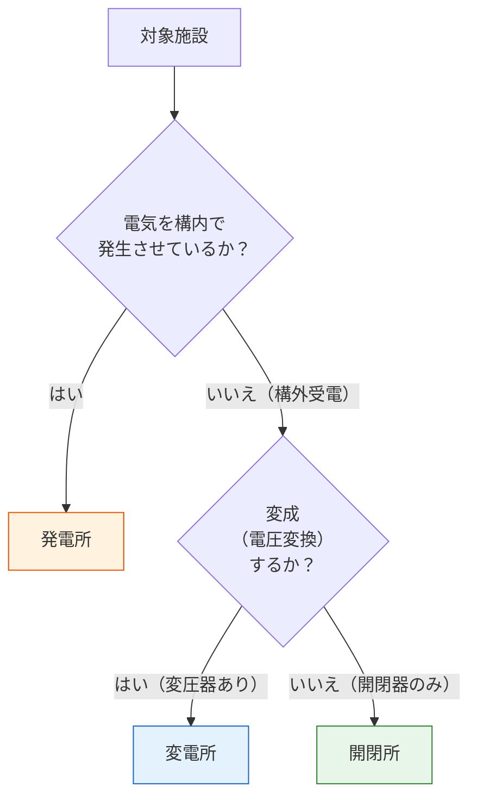

# 電気設備技術基準 第1条 — 用語の定義

!!! note "📊 試験対策メタ"
    **出題頻度**: 🔥🔥🔥（過去14年で 6 回・「省令第1条〜第4条」総則レンジ出題として頻出）

    **重要度**: A（保安原則の総則として直近6年で4回連続出題）

    **直近出題**: R07下 問3（穴埋・第1条〜第4条 総則レンジ）

> 電技の出発点となる用語定義。**電路**・**電線路**・**変電所**・**開閉所** など、法令全体で使われる言葉の意味を確定する条文。第1条**単独**の出題はないが、**第1条〜第4条 総則レンジ**として H23・R01・R04下・R05下・R06下・R07下と頻出しており、用語定義は保安原則と一体で問われる。

| 項目 | 内容 |
|------|------|
| 条文 | 電気設備技術基準 第1条 |
| 規定内容 | 電路・電線路・変電所・開閉所・電気機械器具・接続点等の定義 |
| 性格 | 用語定義（法令全体の前提・他条文への語彙供給） |
| 試験での扱い | 第1条〜第4条 総則レンジ出題で **変成・通常・含まない**等のキーワードが頻出。直近6年で4回連続出題 |
| 関連条文 | 第2条（電圧種別）・第3〜4条（保安原則）・第5条（電路絶縁）・第12条（混触防止） |
| **典拠（一次ソース）** | 電気設備に関する技術基準を定める省令（平成九年通商産業省令第五十二号、令和5年改正版）第1条 — 経産省 e-Gov 法令検索 |
| **照合日** | 2026-05-05（kakomon.yml 照合・第1条〜第4条総則レンジ出題6件確認 H23/R01/R04下/R05下/R06下/R07下） |
| **隣接条文** | （冒頭条文・前なし） ／ [第2条（電圧種別）](2.md) → |
| **混同注意** | 同番号の **電気事業法第1条**（目的）／**電気工事士法第1条**（目的）／**解釈第1条**（用語の定義）／**電気関係報告規則第1条**（定義）とは **別物**。本条は「電技省令」第1条 |

---

## 1. 全体像と要点

### ① 全体像 — 第1条の位置づけ（初学者向け：先に森を見る）

> **4つの視覚化パターン** で第1条の役割を多角的に理解できる。自分に合うパターンをタブで切り替えて。

=== "🌳 ハブ&スポーク（語彙供給）"

    
<svg viewBox="0 0 800 380" xmlns="http://www.w3.org/2000/svg" font-family="-apple-system,BlinkMacSystemFont,Hiragino Kaku Gothic ProN,Yu Gothic UI,Meiryo,sans-serif" style="width:100%;max-width:800px"><defs><filter id="shadow1" x="-20%" y="-20%" width="140%" height="140%"><feDropShadow dx="0" dy="2" stdDeviation="2" flood-opacity="0.15"/></filter><linearGradient id="gradMain1" x1="0" y1="0" x2="0" y2="1"><stop offset="0%" stop-color="#bbdefb"/><stop offset="100%" stop-color="#90caf9"/></linearGradient><linearGradient id="gradSub1" x1="0" y1="0" x2="0" y2="1"><stop offset="0%" stop-color="#fff9c4"/><stop offset="100%" stop-color="#fff59d"/></linearGradient><marker id="arr1Hub" markerWidth="10" markerHeight="10" refX="9" refY="5" orient="auto"><polygon points="0 0,9 5,0 10" fill="#1565c0"/></marker></defs><text x="400" y="26" text-anchor="middle" font-size="15" font-weight="700" fill="#212121">📚 第1条 — 全条文への「語彙供給ハブ」</text><text x="400" y="44" text-anchor="middle" font-size="11" fill="#666">中央＝定義 / 周囲＝定義語を使う各条文</text><circle cx="400" cy="200" r="80" fill="url(#gradMain1)" stroke="#0d47a1" stroke-width="3" filter="url(#shadow1)"/><text x="400" y="195" text-anchor="middle" font-size="20" font-weight="800" fill="#0d47a1">第1条</text><text x="400" y="218" text-anchor="middle" font-size="11" font-weight="600" fill="#0d47a1">用語の定義</text><line x1="395" y1="120" x2="240" y2="80" stroke="#1565c0" stroke-width="1.8" marker-end="url(#arr1Hub)"/><rect x="100" y="55" width="160" height="50" rx="10" fill="url(#gradSub1)" stroke="#f9a825" stroke-width="1.8" filter="url(#shadow1)"/><text x="180" y="76" text-anchor="middle" font-size="12" font-weight="700" fill="#bf360c">第2条 電圧の種別</text><text x="180" y="93" text-anchor="middle" font-size="10" fill="#5d4037">「電路」を低/高/特別高圧に区分</text><line x1="475" y1="160" x2="640" y2="80" stroke="#1565c0" stroke-width="1.8" marker-end="url(#arr1Hub)"/><rect x="555" y="55" width="170" height="50" rx="10" fill="url(#gradSub1)" stroke="#f9a825" stroke-width="1.8" filter="url(#shadow1)"/><text x="640" y="76" text-anchor="middle" font-size="12" font-weight="700" fill="#bf360c">第5条 電路の絶縁</text><text x="640" y="93" text-anchor="middle" font-size="10" fill="#5d4037">「電路」を大地から絶縁する</text><line x1="475" y1="240" x2="640" y2="320" stroke="#1565c0" stroke-width="1.8" marker-end="url(#arr1Hub)"/><rect x="555" y="295" width="170" height="50" rx="10" fill="url(#gradSub1)" stroke="#f9a825" stroke-width="1.8" filter="url(#shadow1)"/><text x="640" y="316" text-anchor="middle" font-size="12" font-weight="700" fill="#bf360c">第12条 混触防止</text><text x="640" y="333" text-anchor="middle" font-size="10" fill="#5d4037">「変電所」「電路」が登場</text><line x1="395" y1="280" x2="240" y2="320" stroke="#1565c0" stroke-width="1.8" marker-end="url(#arr1Hub)"/><rect x="100" y="295" width="160" height="50" rx="10" fill="url(#gradSub1)" stroke="#f9a825" stroke-width="1.8" filter="url(#shadow1)"/><text x="180" y="316" text-anchor="middle" font-size="12" font-weight="700" fill="#bf360c">第19条以降 電線路</text><text x="180" y="333" text-anchor="middle" font-size="10" fill="#5d4037">「電線路」「支持物」を使用</text></svg>

    **読み解き**: 第1条で定義された語が、すべての他条文に「部品」として供給される。定義が不明確だと、他条文の解釈もぶれる。

=== "🏛 ピラミッド（階層）"

    
<svg viewBox="0 0 700 380" xmlns="http://www.w3.org/2000/svg" font-family="-apple-system,BlinkMacSystemFont,Hiragino Kaku Gothic ProN,Yu Gothic UI,Meiryo,sans-serif" style="width:100%;max-width:700px"><defs><filter id="shP1" x="-20%" y="-20%" width="140%" height="140%"><feDropShadow dx="0" dy="2" stdDeviation="2" flood-opacity="0.15"/></filter><linearGradient id="pTopK" x1="0" y1="0" x2="0" y2="1"><stop offset="0%" stop-color="#bbdefb"/><stop offset="100%" stop-color="#90caf9"/></linearGradient><linearGradient id="pMidK" x1="0" y1="0" x2="0" y2="1"><stop offset="0%" stop-color="#ffe0b2"/><stop offset="100%" stop-color="#ffcc80"/></linearGradient><linearGradient id="pBotK" x1="0" y1="0" x2="0" y2="1"><stop offset="0%" stop-color="#c8e6c9"/><stop offset="100%" stop-color="#a5d6a7"/></linearGradient></defs><text x="350" y="26" text-anchor="middle" font-size="15" font-weight="700" fill="#212121">🏛 法令ピラミッド — 定義は最上位の前提</text><polygon points="350,50 470,110 230,110" fill="url(#pTopK)" stroke="#0d47a1" stroke-width="3" filter="url(#shP1)"/><text x="350" y="82" text-anchor="middle" font-size="14" font-weight="800" fill="#0d47a1">📚 第1条</text><text x="350" y="100" text-anchor="middle" font-size="11" fill="#0d47a1">用語の定義（前提）</text><polygon points="200,130 500,130 540,200 160,200" fill="url(#pMidK)" stroke="#ef6c00" stroke-width="2" filter="url(#shP1)"/><text x="350" y="156" text-anchor="middle" font-size="13" font-weight="700" fill="#e65100">⚖️ 第2〜78条 各論</text><text x="350" y="178" text-anchor="middle" font-size="11" fill="#ef6c00">第1条の定義語を使って</text><text x="350" y="195" text-anchor="middle" font-size="11" fill="#ef6c00">具体的な義務・基準を規定</text><polygon points="160,220 540,220 590,290 110,290" fill="url(#pBotK)" stroke="#2e7d32" stroke-width="2" filter="url(#shP1)"/><text x="350" y="248" text-anchor="middle" font-size="12" font-weight="700" fill="#1b5e20">📐 電技解釈（第1〜237条）</text><text x="350" y="266" text-anchor="middle" font-size="10" fill="#2e7d32">省令の各条を具体化（数値・方法）</text><text x="350" y="283" text-anchor="middle" font-size="10" fill="#2e7d32">同じ用語を引き継いで使用</text><rect x="160" y="310" width="380" height="55" rx="10" fill="#fff8e1" stroke="#f9a825" stroke-width="2" filter="url(#shP1)"/><text x="350" y="332" text-anchor="middle" font-size="11" font-weight="700" fill="#bf360c">🔑 ポイント</text><text x="350" y="352" text-anchor="middle" font-size="10" fill="#5d4037">定義が不明確だと下位条文の適用範囲がぶれる</text></svg>

    **読み解き**: 上から下へ「定義 → 義務 → 数値」。第1条の語が下位条文の **適用対象を決める** 基礎となる。

=== "🃏 3区分カード（施設の分類）"

    
<svg viewBox="0 0 800 280" xmlns="http://www.w3.org/2000/svg" font-family="-apple-system,BlinkMacSystemFont,Hiragino Kaku Gothic ProN,Yu Gothic UI,Meiryo,sans-serif" style="width:100%;max-width:800px"><defs><filter id="shC1" x="-20%" y="-20%" width="140%" height="140%"><feDropShadow dx="0" dy="3" stdDeviation="3" flood-opacity="0.18"/></filter><linearGradient id="cF" x1="0" y1="0" x2="0" y2="1"><stop offset="0%" stop-color="#ffcdd2"/><stop offset="100%" stop-color="#ef9a9a"/></linearGradient><linearGradient id="cH" x1="0" y1="0" x2="0" y2="1"><stop offset="0%" stop-color="#bbdefb"/><stop offset="100%" stop-color="#90caf9"/></linearGradient><linearGradient id="cK" x1="0" y1="0" x2="0" y2="1"><stop offset="0%" stop-color="#c8e6c9"/><stop offset="100%" stop-color="#a5d6a7"/></linearGradient></defs><text x="400" y="26" text-anchor="middle" font-size="15" font-weight="700" fill="#212121">🃏 3つの施設 — 発電所/変電所/開閉所の役割</text><rect x="30" y="60" width="240" height="200" rx="16" fill="url(#cF)" stroke="#c62828" stroke-width="3" filter="url(#shC1)"/><text x="150" y="92" text-anchor="middle" font-size="32" fill="#c62828">⚡</text><text x="150" y="124" text-anchor="middle" font-size="14" font-weight="700" fill="#b71c1c">発電所</text><line x1="60" y1="138" x2="240" y2="138" stroke="#c62828" stroke-width="1.5"/><text x="150" y="162" text-anchor="middle" font-size="11" fill="#5d4037">電気を <tspan font-weight="700" fill="#b71c1c">発生</tspan> させる場所</text><text x="150" y="186" text-anchor="middle" font-size="11" fill="#5d4037">発電機・原動機等を設置</text><text x="150" y="222" text-anchor="middle" font-size="10" fill="#b71c1c" font-weight="700">構内で発生</text><text x="150" y="240" text-anchor="middle" font-size="10" fill="#666">変電所との違い：構内発生</text><rect x="280" y="60" width="240" height="200" rx="16" fill="url(#cH)" stroke="#0d47a1" stroke-width="3" filter="url(#shC1)"/><text x="400" y="92" text-anchor="middle" font-size="32" fill="#0d47a1">🔄</text><text x="400" y="124" text-anchor="middle" font-size="14" font-weight="700" fill="#0d47a1">変電所</text><line x1="310" y1="138" x2="490" y2="138" stroke="#0d47a1" stroke-width="1.5"/><text x="400" y="162" text-anchor="middle" font-size="11" fill="#5d4037">構外受電 → <tspan font-weight="700" fill="#0d47a1">変成</tspan> する所</text><text x="400" y="186" text-anchor="middle" font-size="11" fill="#5d4037">変圧器を設置</text><text x="400" y="222" text-anchor="middle" font-size="10" fill="#0d47a1" font-weight="700">変成あり（電圧変換）</text><text x="400" y="240" text-anchor="middle" font-size="10" fill="#666">開閉所との違い：変圧器有</text><rect x="530" y="60" width="240" height="200" rx="16" fill="url(#cK)" stroke="#2e7d32" stroke-width="3" filter="url(#shC1)"/><text x="650" y="92" text-anchor="middle" font-size="32" fill="#2e7d32">🔘</text><text x="650" y="124" text-anchor="middle" font-size="14" font-weight="700" fill="#1b5e20">開閉所</text><line x1="560" y1="138" x2="740" y2="138" stroke="#2e7d32" stroke-width="1.5"/><text x="650" y="162" text-anchor="middle" font-size="11" fill="#5d4037">構外受電 → <tspan font-weight="700" fill="#1b5e20">開閉のみ</tspan></text><text x="650" y="186" text-anchor="middle" font-size="11" fill="#5d4037">開閉器・遮断器を設置</text><text x="650" y="222" text-anchor="middle" font-size="10" fill="#1b5e20" font-weight="700">変成しない（電圧そのまま）</text><text x="650" y="240" text-anchor="middle" font-size="10" fill="#666">系統切替拠点が典型</text></svg>

    **読み解き**: 試験で最も問われる「3施設の弁別」。**変成の有無**＝変電所と開閉所を分ける唯一の鍵。**構内発生 vs 構外受電**＝発電所と他2つを分ける鍵。

=== "📋 1枚インフォグラフィック"

    
<svg viewBox="0 0 800 460" xmlns="http://www.w3.org/2000/svg" font-family="-apple-system,BlinkMacSystemFont,Hiragino Kaku Gothic ProN,Yu Gothic UI,Meiryo,sans-serif" style="width:100%;max-width:800px"><defs><filter id="shI1" x="-20%" y="-20%" width="140%" height="140%"><feDropShadow dx="0" dy="2" stdDeviation="2.5" flood-opacity="0.18"/></filter><linearGradient id="iMain1" x1="0" y1="0" x2="0" y2="1"><stop offset="0%" stop-color="#1976d2"/><stop offset="100%" stop-color="#0d47a1"/></linearGradient><linearGradient id="iSub1" x1="0" y1="0" x2="0" y2="1"><stop offset="0%" stop-color="#fff8e1"/><stop offset="100%" stop-color="#ffecb3"/></linearGradient></defs><rect x="0" y="0" width="800" height="460" fill="#fafafa"/><text x="400" y="32" text-anchor="middle" font-size="18" font-weight="800" fill="#212121">📋 第1条 — 1枚で分かる用語の体系</text><text x="400" y="52" text-anchor="middle" font-size="12" fill="#666">電路（線・通路）/ 施設（発電所・変電所・開閉所）/ 接続点（境界）の3カテゴリ</text><rect x="260" y="80" width="280" height="100" rx="16" fill="url(#iMain1)" stroke="#0d47a1" stroke-width="2" filter="url(#shI1)"/><text x="400" y="115" text-anchor="middle" font-size="22" font-weight="800" fill="#fff">電技省令</text><text x="400" y="148" text-anchor="middle" font-size="36" font-weight="800" fill="#fff">第1条</text><text x="400" y="170" text-anchor="middle" font-size="11" fill="#bbdefb">用語の定義</text><rect x="40" y="210" width="220" height="115" rx="12" fill="url(#iSub1)" stroke="#f9a825" stroke-width="2" filter="url(#shI1)"/><text x="150" y="235" text-anchor="middle" font-size="13" font-weight="700" fill="#e65100">📜 線・通路系</text><line x1="70" y1="245" x2="230" y2="245" stroke="#f9a825" stroke-width="1"/><text x="150" y="268" text-anchor="middle" font-size="11" font-weight="600" fill="#5d4037">電路 / 電線路</text><text x="150" y="288" text-anchor="middle" font-size="10" fill="#bf360c" font-weight="700">通常使用状態で通電</text><text x="150" y="308" text-anchor="middle" font-size="9" fill="#6d4c41">大地・接地点は含まない</text><rect x="290" y="210" width="220" height="115" rx="12" fill="url(#iSub1)" stroke="#f9a825" stroke-width="2" filter="url(#shI1)"/><text x="400" y="235" text-anchor="middle" font-size="13" font-weight="700" fill="#e65100">🏭 施設系</text><line x1="320" y1="245" x2="480" y2="245" stroke="#f9a825" stroke-width="1"/><text x="400" y="268" text-anchor="middle" font-size="11" font-weight="600" fill="#5d4037">発電所 / 変電所 / 開閉所</text><text x="400" y="288" text-anchor="middle" font-size="10" fill="#bf360c" font-weight="700">変成の有無で弁別</text><text x="400" y="308" text-anchor="middle" font-size="9" fill="#6d4c41">変電所＝変圧器あり</text><rect x="540" y="210" width="220" height="115" rx="12" fill="url(#iSub1)" stroke="#f9a825" stroke-width="2" filter="url(#shI1)"/><text x="650" y="235" text-anchor="middle" font-size="13" font-weight="700" fill="#e65100">🔗 境界系</text><line x1="570" y1="245" x2="730" y2="245" stroke="#f9a825" stroke-width="1"/><text x="650" y="268" text-anchor="middle" font-size="11" font-weight="600" fill="#5d4037">接続点 / 引込線</text><text x="650" y="288" text-anchor="middle" font-size="10" fill="#bf360c" font-weight="700">事業者と需要家の境</text><text x="650" y="308" text-anchor="middle" font-size="9" fill="#6d4c41">責任分界点の正式名</text><rect x="60" y="350" width="680" height="80" rx="12" fill="#f1f8e9" stroke="#2e7d32" stroke-width="2" filter="url(#shI1)"/><text x="400" y="375" text-anchor="middle" font-size="13" font-weight="700" fill="#1b5e20">🔑 試験対策の核心</text><text x="400" y="397" text-anchor="middle" font-size="12" font-weight="700" fill="#1b5e20">頻出キーワード3語: 通常・変成・含まない</text><text x="400" y="416" text-anchor="middle" font-size="11" fill="#2e7d32">他条文（第2・5・12条）の穴埋めで間接的に問われる前提語彙</text></svg>

    **読み解き**: 第1条の用語は「線・通路系」「施設系」「境界系」の3カテゴリに整理できる。試験前の最終チェック用に最適。

| 関連条文 | 第1条との関係 | 第1条で定義された語をどう使うか |
|---------|------|------|
| 第2条 電圧の種別 | **下位** | 「電路」を低圧/高圧/特別高圧に区分する |
| 第5条 電路の絶縁 | **下位** | 「電路」を大地から絶縁する義務を規定 |
| 第12条 混触防止 | **下位** | 「変電所」「電路」の用語で混触防止義務を規定 |
| 第19条以降 電線路の保安 | **下位** | 「電線路」「支持物」「引込線」等の用語を使用 |

→ 第1条は「**用語の体系を確定する** 総則規定」。下位条文すべての適用範囲がここで決まる。

### ② 要点（既習者向け：試験前30秒復習用）

| 観点 | 内容 |
|------|------|
| **電路** | **通常**の使用状態で電気が通じているところ（大地・接地点は含まない） |
| **変電所** | 構外から伝送された電気を **変成** する所 |
| **開閉所** | 構外から伝送された電気を開閉するが **変成しない** 所 |
| **電線路** | 電線 + **支持物等** の一式（電線単体ではない） |
| **接続点** | 電気事業者と需要家の電気設備の境界（責任分界点の正式名称） |

??? question "セルフチェック: 変電所と開閉所の違いは何か？"
    **変圧器で電圧を変える（変成）かどうか**。変電所は変成あり、開閉所は変成なし（開閉器のみ）。どちらも「構外から伝送された電気を扱う」点は共通。

??? question "セルフチェック: 電路に大地は含まれるか？"
    **含まれない**。電路の定義「通常の使用状態で電気が通じているところ」には大地・接地点は入らない。これが第5条「電路は大地から絶縁」が成立する前提。

---

## 2. 条文原文

!!! note "条文原文の照合状況"
    e-Gov公式（lawid=337M50000400052）の最終照合は **「要確認」**。
    本ページでは出題上重要な5用語（電路・電気機械器具・発電所・変電所・開閉所・電線路・接続点）に絞って掲載。実際の第1条には他にも引込線・支持物・配線等の定義が含まれる。

> **電気設備技術基準 第1条（用語の定義）**
>
> この省令において、次の各号に掲げる用語の意義は、それぞれ当該各号に定めるところによる。

| 号 | 用語 | 定義（要点） |
|----|------|----|
| 一 | <mark>電路</mark> | 通常の使用状態で電気が通じているところをいう |
| 二 | 電気機械器具 | 電路を構成する機械器具をいう |
| 三 | 発電所 | 発電機、原動機、燃料電池、太陽電池等を施設して電気を発生させる所をいう |
| 四 | 変電所 | 構外から伝送される電気を <mark>変成</mark> する所であって、変成した電気をさらに構外に伝送するものをいう |
| 五 | 開閉所 | 構外から伝送される電気の開閉を行うが <mark>変成しない</mark> 所をいう |
| 六 | 電線路 | 発電所、変電所、開閉所及びこれらに類する場所並びに電気使用場所相互間の電線並びにこれを支持し、又は保蔵する工作物をいう |
| 七 | 接続点 | 電気事業者と需要家との電気設備の接続される点をいう |

> <small>🟡 黄色マーカー = 第1条**単独**の出題実績はないが、**第1条〜第4条 総則レンジ穴埋め**（H23・R04下・R05下・R07下等）で空欄候補となる蓋然性が高い語句。**第1条単独出題ベースの実マーキングではなく、総則レンジ出題に基づく想定マーキング**である点に注意。</small>

---

## 3. 原文解析

| 用語 | 原文（要点） | 試験ポイント |
|------|-------------|-------------|
| 電路 | 通常の使用状態で電気が通じているところ | **大地・接地点を含まない**（第5条絶縁原則の前提） |
| 電気機械器具 | 電路を構成する機械器具 | 「電路」の定義を引き継ぐ。電路に接続して使用するもの |
| 発電所 | 電気を発生させる所 | **構内で発電** する点が変電所と異なる |
| 変電所 | 構外から伝送された電気を **変成** する所 | 想定空欄の典型＝変成 |
| 開閉所 | 構外から伝送された電気を開閉するが **変成しない** 所 | 想定空欄の典型＝変成しない |
| 電線路 | 電線・支持物等の一式 | 電線単体ではなく **支持物含む** |
| 接続点 | 電気事業者と需要家の設備の境界 | 責任分界点の正式名称 |

??? question "📝 ここまでの理解チェック: 電気機械器具と機器外箱は同じか？"
    **異なる**。電気機械器具は「電路を構成する」もの全体。機器外箱（金属製の箱・覆い）は機器の **非充電部** であり、電路ではない。第5条の絶縁対象は「電路」、A/C/D種接地の対象は「機器外箱」と整理できる。

---

## 4. 法規特有表現

> 定義系条文では、用語そのものが法規表現。日常語からの変換と、用語間の混同パターンを押さえる。

| 日常語 | 法規表現 | 試験での意味 | 混同注意 | 例文（条文調） |
|---|---|---|---|---|
| 普通の状態で電気が流れている | 通常の使用状態で電気が通じている | 電路の定義条件。異常時・停電中は除外 | 「常に電気が通じている」だと範囲が広すぎる | 通常の使用状態で電気が通じているところをいう |
| 電圧を変える設備 | 変成する | 変電所のキーワード | 「変電」「変圧」「変成」を混在 | 構外から伝送される電気を変成する所 |
| 電気を入り切りする設備 | 開閉する（変成しない） | 開閉所のキーワード | 変電所と区別が必須 | 構外から伝送される電気の開閉を行うが変成しない所 |
| 電気事業者と契約者の境目 | 接続点 | 責任分界点の正式名称 | 「分界点」「需給点」と混在 | 電気事業者と需要家との電気設備の接続される点 |

### この条文で覚えるべき言い回し

| 言い回し | 役割 |
|---------|------|
| **通常の使用状態** | 電路の定義条件、絶縁義務の対象を絞る語 |
| **構外から伝送された電気** | 変電所・開閉所共通の前提 |
| **変成する／変成しない** | 変電所と開閉所を分ける唯一の語 |
| **電線路** | 電線 ＋ 支持物等の一式 |
| **接続される点** | 接続点の正式定義表現 |

### ひっかけ表現

| 誤った理解 | 正しい理解 |
|---|---|
| 「電路」は電線そのもの | 通常の使用状態で電気が通じているところ（大地・接地点は含まない） |
| 「電線路」は電線だけ | 電線 + 支持物（電柱・鉄塔）等の一式 |
| 「変電」「変圧」「変成」を同じに扱う | 法令上は **変成** が正式（変電所の定義語） |
| 「設置する」と「施設する」を同じに扱う | 法規では「**施設する**」が正式 |

??? question "📝 ここまでの理解チェック: 「絶縁」と「電路」の関係を1行で説明せよ"
    第1条の電路定義に「大地・接地点を含まない」が暗黙にあるからこそ、第5条「電路は大地から絶縁」が成立する。電路に大地が含まれていたら、自分自身を自分から絶縁することになり論理破綻する。

---

## 5. かみ砕き解説

> 用語定義は丸暗記ではなく「なぜその区別が必要か」を押さえる。区別の根拠が分かれば試験での選択肢判定が早い。

### 変電所 vs 開閉所 — なぜ区別するのか

この区別は「どの設備に変圧器が必要か」という設計判断に直結するため、法令上も明確に分けられている。

| 項目 | 変電所 | 開閉所 |
|------|--------|--------|
| 主な機器 | 変圧器・開閉器・保護継電器など | 開閉器・母線・保護継電器など |
| 電圧の変成 | あり | なし |
| 典型例 | 一次変電所・配電用変電所 | 特別高圧の系統切替拠点 |
| 法令上の区別が必要な理由 | 変成を伴う設備には追加の安全基準が課される | 変成なしでも系統管理は必要 |

!!! tip "暗記の核心"
    **変電所 = 変成あり / 開閉所 = 変成なし**

    変圧器（Transformer）が中にあれば変電所。開閉器（Switch）だけなら開閉所。
    実設備でいえば、系統の切替拠点（スイッチングステーション）が開閉所の典型。

### 電路の定義 — なぜ「通常の使用状態」か

「電路」を「電気が流れる可能性があるところ」と定義してしまうと範囲が広がりすぎる。**通常の使用状態**で電気が通じている場所に限定することで、絶縁義務・感電保護の対象を合理的に絞る。

| 限定語 | 除外されるもの | 理由 |
|--------|--------------|------|
| **「通常の」** | 異常時（事故・点検中の通電など） | 異常時まで対象にすると保護設計が破綻 |
| **「電気が通じている」** | 充電されていない停電中の電線 | 物理的に電気が流れていない状態は絶縁不要 |

### 電線路は「電線」ではなく「電線＋支持物」

電線路の定義に **支持物等** が含まれるのは、保安の対象として **電柱・鉄塔・腕金・がいし** 等の支持構造物も一体管理する必要があるため。電線が切れて落下する事故は、支持物の不良が原因のことが多い。

??? question "セルフチェック: 自家発電設備しかない構内に変圧器がある。これは変電所か？"
    **変電所ではない**。変電所の定義は「構外から伝送される電気を変成する所」。自家発電のみの構内にある変圧器は **発電所内の機器** という扱い。「構外受電」が変電所の必須要件。

---

## 6. 図で理解

### 図解 1：電力系統での3施設の位置関係

<svg viewBox="0 0 760 240" xmlns="http://www.w3.org/2000/svg" font-family="sans-serif" font-size="12" style="width:100%;max-width:760px"><defs><marker id="arrFlow1" markerWidth="8" markerHeight="6" refX="8" refY="3" orient="auto"><polygon points="0 0,8 3,0 6" fill="#666"/></marker></defs><text x="380" y="22" text-anchor="middle" font-size="13" font-weight="bold" fill="#333">電力系統での3施設の位置づけ — 上流から下流へ</text><rect x="20" y="55" width="150" height="100" rx="8" fill="#fff3e0" stroke="#e65100" stroke-width="1.5"/><text x="95" y="80" text-anchor="middle" font-weight="bold" fill="#bf360c">発電所</text><text x="95" y="100" text-anchor="middle" font-size="10" fill="#333">電気を発生</text><text x="95" y="118" text-anchor="middle" font-size="10" fill="#333">（発電機・原動機）</text><text x="95" y="140" text-anchor="middle" font-size="9" fill="#666">構内で発生</text><line x1="170" y1="105" x2="210" y2="105" stroke="#666" stroke-width="2" marker-end="url(#arrFlow1)"/><rect x="220" y="55" width="180" height="100" rx="8" fill="#e3f2fd" stroke="#1565c0" stroke-width="1.5"/><text x="310" y="80" text-anchor="middle" font-weight="bold" fill="#0d47a1">変電所</text><text x="310" y="100" text-anchor="middle" font-size="10" fill="#333">構外から受電→変成</text><text x="310" y="118" text-anchor="middle" font-size="10" fill="#1565c0" font-weight="bold">変圧器あり</text><text x="310" y="140" text-anchor="middle" font-size="9" fill="#666">電圧を変える</text><line x1="400" y1="105" x2="440" y2="105" stroke="#666" stroke-width="2" marker-end="url(#arrFlow1)"/><rect x="450" y="55" width="180" height="100" rx="8" fill="#e8f5e9" stroke="#2e7d32" stroke-width="1.5"/><text x="540" y="80" text-anchor="middle" font-weight="bold" fill="#1b5e20">開閉所</text><text x="540" y="100" text-anchor="middle" font-size="10" fill="#333">構外から受電→開閉のみ</text><text x="540" y="118" text-anchor="middle" font-size="10" fill="#2e7d32" font-weight="bold">変圧器なし</text><text x="540" y="140" text-anchor="middle" font-size="9" fill="#666">電圧変えない</text><line x1="630" y1="105" x2="670" y2="105" stroke="#666" stroke-width="2" marker-end="url(#arrFlow1)"/><rect x="680" y="78" width="60" height="55" rx="8" fill="#fce4ec" stroke="#c2185b" stroke-width="1.5"/><text x="710" y="100" text-anchor="middle" font-size="10" font-weight="bold" fill="#880e4f">需要家</text><text x="710" y="118" text-anchor="middle" font-size="9" fill="#880e4f">使用場所</text><rect x="20" y="175" width="720" height="35" rx="5" fill="#fffde7" stroke="#f9a825"/><text x="380" y="197" text-anchor="middle" font-size="11" fill="#bf360c" font-weight="bold">区別の鍵：「変成（変圧器の有無）」と「構内発生 vs 構外受電」</text></svg>

### 図解 2：電路と機器外箱の違い（第5条の前提）

<svg viewBox="0 0 700 280" xmlns="http://www.w3.org/2000/svg" font-family="sans-serif" font-size="12" style="width:100%;max-width:700px"><text x="350" y="22" text-anchor="middle" font-size="13" font-weight="bold" fill="#333">電路（充電部） vs 機器外箱（非充電部） — 第1条の電路は前者のみ</text><rect x="100" y="50" width="500" height="180" rx="10" fill="#fff" stroke="#5c6bc0" stroke-width="2.5"/><text x="350" y="70" text-anchor="middle" font-size="11" font-weight="700" fill="#3949ab">電気機械器具（外箱で囲まれた機器）</text><rect x="180" y="100" width="340" height="80" rx="6" fill="#ffebee" stroke="#c62828" stroke-width="2" stroke-dasharray="4,2"/><text x="350" y="125" text-anchor="middle" font-size="12" font-weight="700" fill="#b71c1c">⚡ 電路（充電部）</text><text x="350" y="145" text-anchor="middle" font-size="10" fill="#5d4037">通常の使用状態で電気が通じているところ</text><text x="350" y="165" text-anchor="middle" font-size="10" fill="#b71c1c" font-weight="700">→ 第5条の絶縁対象</text><text x="100" y="40" text-anchor="middle" font-size="10" fill="#3949ab">機器外箱（非充電部）</text><line x1="100" y1="42" x2="100" y2="50" stroke="#3949ab" stroke-width="1"/><text x="650" y="40" text-anchor="middle" font-size="10" fill="#3949ab">→ A/C/D種接地の対象</text><line x1="600" y1="42" x2="600" y2="50" stroke="#3949ab" stroke-width="1"/><text x="350" y="200" text-anchor="middle" font-size="10" fill="#666">電路 ⊂ 電気機械器具 ⊂（機器外箱で囲まれる）</text><line x1="50" y1="245" x2="650" y2="245" stroke="#6d4c41" stroke-width="2"/><text x="350" y="262" text-anchor="middle" font-size="10" fill="#6d4c41">🌍 大地（電路に含まれない）</text></svg>

### 図解 3：電気機械器具の具体例 — 電路上に配置される代表機器

#### 図3-A: 単線結線図 — 直列 / 並列分岐 / 信号制御の区別

<svg viewBox="0 0 820 280" xmlns="http://www.w3.org/2000/svg" font-family="-apple-system,BlinkMacSystemFont,Hiragino Kaku Gothic ProN,Yu Gothic UI,Meiryo,sans-serif" style="width:100%;max-width:820px"><defs><filter id="shD3a" x="-20%" y="-20%" width="140%" height="140%"><feDropShadow dx="0" dy="2" stdDeviation="2" flood-opacity="0.15"/></filter><linearGradient id="gHV3a" x1="0" y1="0" x2="0" y2="1"><stop offset="0%" stop-color="#ffcdd2"/><stop offset="100%" stop-color="#ef9a9a"/></linearGradient><linearGradient id="gC3a" x1="0" y1="0" x2="0" y2="1"><stop offset="0%" stop-color="#bbdefb"/><stop offset="100%" stop-color="#90caf9"/></linearGradient><linearGradient id="gLV3a" x1="0" y1="0" x2="0" y2="1"><stop offset="0%" stop-color="#fff9c4"/><stop offset="100%" stop-color="#fff59d"/></linearGradient><marker id="arrM3a" markerWidth="8" markerHeight="6" refX="8" refY="3" orient="auto"><polygon points="0 0,8 3,0 6" fill="#c62828"/></marker></defs><text x="410" y="22" text-anchor="middle" font-size="14" font-weight="700" fill="#212121">⚙️ 電気機械器具の具体例 — 接続形態で3分類</text><text x="410" y="40" text-anchor="middle" font-size="11" fill="#666">太線=主回路（直列） / 細線=並列・分岐 / 破線=信号制御系（別図参照）</text><line x1="20" y1="58" x2="60" y2="58" stroke="#c62828" stroke-width="2.5"/><text x="65" y="62" font-size="10" fill="#c62828" font-weight="600">主回路（直列）</text><line x1="170" y1="58" x2="210" y2="58" stroke="#c62828" stroke-width="1.2"/><text x="215" y="62" font-size="10" fill="#c62828" font-weight="600">並列・分岐</text><line x1="295" y1="58" x2="335" y2="58" stroke="#1565c0" stroke-width="1.5" stroke-dasharray="4,3"/><text x="340" y="62" font-size="10" fill="#1565c0" font-weight="600">信号制御</text><circle cx="35" cy="130" r="22" fill="none" stroke="#c62828" stroke-width="2"/><text x="35" y="135" text-anchor="middle" font-size="11" fill="#c62828">電源</text><line x1="57" y1="130" x2="80" y2="130" stroke="#c62828" stroke-width="2.5"/><rect x="80" y="110" width="50" height="40" rx="4" fill="url(#gHV3a)" stroke="#c62828" stroke-width="1.5" filter="url(#shD3a)"/><text x="105" y="125" text-anchor="middle" font-size="9" font-weight="700" fill="#b71c1c">断路器</text><text x="105" y="139" text-anchor="middle" font-size="9" fill="#5d4037">DS</text><line x1="130" y1="130" x2="170" y2="130" stroke="#c62828" stroke-width="2.5"/><rect x="170" y="110" width="50" height="40" rx="4" fill="url(#gHV3a)" stroke="#c62828" stroke-width="1.5" filter="url(#shD3a)"/><text x="195" y="125" text-anchor="middle" font-size="9" font-weight="700" fill="#b71c1c">遮断器</text><text x="195" y="139" text-anchor="middle" font-size="9" fill="#5d4037">CB</text><line x1="220" y1="130" x2="255" y2="130" stroke="#c62828" stroke-width="2.5"/><rect x="255" y="110" width="40" height="40" rx="4" fill="url(#gC3a)" stroke="#0d47a1" stroke-width="1.5" filter="url(#shD3a)"/><text x="275" y="125" text-anchor="middle" font-size="9" font-weight="700" fill="#0d47a1">CT</text><text x="275" y="140" text-anchor="middle" font-size="8" fill="#5d4037">一次</text><line x1="295" y1="130" x2="325" y2="130" stroke="#c62828" stroke-width="2.5"/><rect x="325" y="100" width="75" height="60" rx="6" fill="url(#gC3a)" stroke="#0d47a1" stroke-width="2" filter="url(#shD3a)"/><text x="362" y="120" text-anchor="middle" font-size="11" font-weight="700" fill="#0d47a1">変圧器</text><text x="362" y="138" text-anchor="middle" font-size="9" fill="#0d47a1">TR</text><text x="362" y="153" text-anchor="middle" font-size="8" fill="#5d4037">変成</text><line x1="400" y1="130" x2="430" y2="130" stroke="#c62828" stroke-width="2.5"/><rect x="430" y="105" width="65" height="50" rx="6" fill="#fff3e0" stroke="#ef6c00" stroke-width="2" filter="url(#shD3a)"/><text x="462" y="125" text-anchor="middle" font-size="11" font-weight="700" fill="#e65100">配電盤</text><text x="462" y="142" text-anchor="middle" font-size="8" fill="#5d4037">機器集約</text><line x1="495" y1="130" x2="520" y2="130" stroke="#c62828" stroke-width="2.5"/><rect x="520" y="110" width="60" height="40" rx="4" fill="url(#gLV3a)" stroke="#f9a825" stroke-width="1.5" filter="url(#shD3a)"/><text x="550" y="125" text-anchor="middle" font-size="9" font-weight="700" fill="#bf360c">開閉器</text><text x="550" y="140" text-anchor="middle" font-size="8" fill="#5d4037">SW+ヒューズ</text><line x1="580" y1="130" x2="610" y2="130" stroke="#c62828" stroke-width="2.5" marker-end="url(#arrM3a)"/><circle cx="640" cy="130" r="26" fill="#e8f5e9" stroke="#2e7d32" stroke-width="2" filter="url(#shD3a)"/><text x="640" y="128" text-anchor="middle" font-size="14" font-weight="700" fill="#1b5e20">M</text><text x="640" y="144" text-anchor="middle" font-size="9" fill="#1b5e20">電動機</text><text x="335" y="86" text-anchor="middle" font-size="10" fill="#c62828" font-style="italic">主回路（直列）— 電流の通り道に入る機器</text><line x1="150" y1="150" x2="150" y2="178" stroke="#c62828" stroke-width="1.2"/><rect x="125" y="178" width="50" height="28" rx="3" fill="#ffcdd2" stroke="#c62828" stroke-width="1.2"/><text x="150" y="196" text-anchor="middle" font-size="9" font-weight="700" fill="#b71c1c">LA 避雷器</text><line x1="150" y1="206" x2="150" y2="232" stroke="#c62828" stroke-width="1.2"/><line x1="135" y1="232" x2="165" y2="232" stroke="#6d4c41" stroke-width="2"/><line x1="140" y1="240" x2="160" y2="240" stroke="#6d4c41" stroke-width="1.5"/><line x1="145" y1="248" x2="155" y2="248" stroke="#6d4c41" stroke-width="1"/><text x="150" y="265" text-anchor="middle" font-size="8" fill="#666">大地</text><text x="200" y="194" font-size="9" fill="#c62828" font-style="italic">並列接続</text><text x="200" y="206" font-size="9" fill="#c62828" font-style="italic">→ 大地</text><line x1="312" y1="160" x2="312" y2="180" stroke="#1565c0" stroke-width="1.2"/><rect x="290" y="180" width="44" height="26" rx="3" fill="#bbdefb" stroke="#0d47a1" stroke-width="1.2"/><text x="312" y="197" text-anchor="middle" font-size="9" font-weight="700" fill="#0d47a1">VT</text><line x1="312" y1="206" x2="312" y2="225" stroke="#1565c0" stroke-width="1.2"/><rect x="290" y="225" width="44" height="26" rx="3" fill="#f3e5f5" stroke="#6a1b9a" stroke-width="1"/><text x="312" y="241" text-anchor="middle" font-size="9" fill="#4a148c">電圧計</text><text x="345" y="195" font-size="9" fill="#0d47a1" font-style="italic">並列分岐</text><text x="345" y="207" font-size="9" fill="#0d47a1" font-style="italic">→ 計器</text><rect x="430" y="200" width="220" height="50" rx="6" fill="#e8eaf6" stroke="#3949ab" stroke-width="1.5" stroke-dasharray="4,3" filter="url(#shD3a)"/><text x="540" y="220" text-anchor="middle" font-size="11" font-weight="700" fill="#1a237e">🛡️ 保護継電器（信号・制御系）</text><text x="540" y="240" text-anchor="middle" font-size="9" fill="#3949ab">CT/VTの計測値で異常を検出 → CBへトリップ指令</text><text x="540" y="270" text-anchor="middle" font-size="9" fill="#3949ab" font-style="italic">※主回路にも並列分岐にも入らない別経路（信号線）</text></svg>

> **読み解き**: 主回路（太線・横方向）に直列で入る機器と、並列・分岐（細線・縦方向）で接続される機器を区別する。LA・VTは電路に **接続される** が **直列機器ではない**。保護継電器は CT/VT の計測値で動作する **信号・制御系** で、主回路にも並列分岐にも属さない別経路。

#### 接続形態による3分類

| 分類 | 例 | 電路との関係 |
|---|---|---|
| **① 主回路（直列）** | 断路器・遮断器・CT一次・変圧器・開閉器・ヒューズ・電動機 | **電流の通り道** に入る |
| **② 並列・分岐** | VT・避雷器（LA）・SPD | 電路に **接続される** が直列機器ではない |
| **③ 信号・制御系** | 保護継電器 | CT/VTから信号を受け、CBを動作させる |

> **試験のキモ**: 過去問では「電路上に配置される機器」を直列／並列で問うパターンがある。**LA・VTは並列**、**保護継電器は信号系** と整理しておく。

#### 図3-B: 機能別5カテゴリ

<svg viewBox="0 0 820 290" xmlns="http://www.w3.org/2000/svg" font-family="-apple-system,BlinkMacSystemFont,Hiragino Kaku Gothic ProN,Yu Gothic UI,Meiryo,sans-serif" style="width:100%;max-width:820px"><defs><filter id="shD3b" x="-20%" y="-20%" width="140%" height="140%"><feDropShadow dx="0" dy="2" stdDeviation="2" flood-opacity="0.15"/></filter></defs><text x="410" y="22" text-anchor="middle" font-size="14" font-weight="700" fill="#212121">📚 電気機械器具の機能別5カテゴリ</text><text x="410" y="40" text-anchor="middle" font-size="11" fill="#666">電路を「変える・切る・守る・使う・集める」役割で整理</text><rect x="20" y="55" width="150" height="170" rx="10" fill="#e3f2fd" stroke="#0d47a1" stroke-width="1.8" filter="url(#shD3b)"/><text x="95" y="80" text-anchor="middle" font-size="20">🔄</text><text x="95" y="102" text-anchor="middle" font-size="12" font-weight="700" fill="#0d47a1">変成装置</text><line x1="35" y1="110" x2="155" y2="110" stroke="#0d47a1" stroke-width="1"/><text x="95" y="130" text-anchor="middle" font-size="10" font-weight="600" fill="#5d4037">・変圧器 (TR)</text><text x="95" y="148" text-anchor="middle" font-size="10" font-weight="600" fill="#5d4037">・計器用変成器</text><text x="95" y="164" text-anchor="middle" font-size="9" fill="#5d4037">  (CT・VT)</text><text x="95" y="190" text-anchor="middle" font-size="9" fill="#1565c0" font-style="italic">電圧・電流を変える</text><text x="95" y="205" text-anchor="middle" font-size="9" fill="#1565c0" font-style="italic">／計測用に変換</text><text x="95" y="220" text-anchor="middle" font-size="8" fill="#666">変える</text><rect x="180" y="55" width="150" height="170" rx="10" fill="#ffebee" stroke="#c62828" stroke-width="1.8" filter="url(#shD3b)"/><text x="255" y="80" text-anchor="middle" font-size="20">⚡</text><text x="255" y="102" text-anchor="middle" font-size="12" font-weight="700" fill="#b71c1c">開閉装置</text><line x1="195" y1="110" x2="315" y2="110" stroke="#c62828" stroke-width="1"/><text x="255" y="128" text-anchor="middle" font-size="10" font-weight="600" fill="#5d4037">・遮断器 (CB)</text><text x="255" y="144" text-anchor="middle" font-size="10" font-weight="600" fill="#5d4037">・断路器 (DS)</text><text x="255" y="160" text-anchor="middle" font-size="10" font-weight="600" fill="#5d4037">・開閉器 (SW)</text><text x="255" y="176" text-anchor="middle" font-size="10" font-weight="600" fill="#5d4037">・ヒューズ</text><text x="255" y="200" text-anchor="middle" font-size="9" fill="#c62828" font-style="italic">電流の通断を制御</text><text x="255" y="220" text-anchor="middle" font-size="8" fill="#666">作る・切る</text><rect x="340" y="55" width="150" height="170" rx="10" fill="#fff3e0" stroke="#ef6c00" stroke-width="1.8" filter="url(#shD3b)"/><text x="415" y="80" text-anchor="middle" font-size="20">🛡️</text><text x="415" y="102" text-anchor="middle" font-size="12" font-weight="700" fill="#e65100">保護装置</text><line x1="355" y1="110" x2="475" y2="110" stroke="#ef6c00" stroke-width="1"/><text x="415" y="130" text-anchor="middle" font-size="10" font-weight="600" fill="#5d4037">・避雷器 (LA)</text><text x="415" y="146" text-anchor="middle" font-size="10" font-weight="600" fill="#5d4037">・SPD</text><text x="415" y="162" text-anchor="middle" font-size="10" font-weight="600" fill="#5d4037">・保護継電器</text><text x="415" y="190" text-anchor="middle" font-size="9" fill="#e65100" font-style="italic">異常電圧・電流から</text><text x="415" y="205" text-anchor="middle" font-size="9" fill="#e65100" font-style="italic">設備を保護</text><text x="415" y="220" text-anchor="middle" font-size="8" fill="#666">守る</text><rect x="500" y="55" width="150" height="170" rx="10" fill="#e8f5e9" stroke="#2e7d32" stroke-width="1.8" filter="url(#shD3b)"/><text x="575" y="80" text-anchor="middle" font-size="20">⚙️</text><text x="575" y="102" text-anchor="middle" font-size="12" font-weight="700" fill="#1b5e20">負荷装置</text><line x1="515" y1="110" x2="635" y2="110" stroke="#2e7d32" stroke-width="1"/><text x="575" y="130" text-anchor="middle" font-size="10" font-weight="600" fill="#5d4037">・電動機 (M)</text><text x="575" y="146" text-anchor="middle" font-size="10" font-weight="600" fill="#5d4037">・照明器具</text><text x="575" y="162" text-anchor="middle" font-size="10" font-weight="600" fill="#5d4037">・電熱器</text><text x="575" y="178" text-anchor="middle" font-size="10" font-weight="600" fill="#5d4037">・コンデンサ</text><text x="575" y="200" text-anchor="middle" font-size="9" fill="#2e7d32" font-style="italic">電気を機械力・熱・光に</text><text x="575" y="220" text-anchor="middle" font-size="8" fill="#666">使う</text><rect x="660" y="55" width="150" height="170" rx="10" fill="#f3e5f5" stroke="#6a1b9a" stroke-width="1.8" filter="url(#shD3b)"/><text x="735" y="80" text-anchor="middle" font-size="20">📦</text><text x="735" y="102" text-anchor="middle" font-size="12" font-weight="700" fill="#4a148c">集合装置</text><line x1="675" y1="110" x2="795" y2="110" stroke="#6a1b9a" stroke-width="1"/><text x="735" y="128" text-anchor="middle" font-size="10" font-weight="600" fill="#5d4037">・配電盤</text><text x="735" y="144" text-anchor="middle" font-size="10" font-weight="600" fill="#5d4037">・分電盤</text><text x="735" y="160" text-anchor="middle" font-size="10" font-weight="600" fill="#5d4037">・制御盤</text><text x="735" y="176" text-anchor="middle" font-size="10" font-weight="600" fill="#5d4037">・開閉器箱</text><text x="735" y="200" text-anchor="middle" font-size="9" fill="#6a1b9a" font-style="italic">複数機器を集約</text><text x="735" y="220" text-anchor="middle" font-size="8" fill="#666">集める</text><rect x="20" y="240" width="780" height="40" rx="8" fill="#fff8e1" stroke="#f9a825" stroke-width="1.5"/><text x="410" y="260" text-anchor="middle" font-size="11" font-weight="700" fill="#bf360c">💡 暗記フレーズ</text><text x="410" y="275" text-anchor="middle" font-size="11" fill="#5d4037">電気機械器具 ＝「電路を <tspan font-weight="700" fill="#bf360c">作る・切る・守る・変える・使う</tspan>」機器</text></svg>

> **読み解き**: 機能別の代表機器を5カテゴリで整理。**変成・開閉・保護・負荷・集合** すべてが「電路を構成する機械器具」=電気機械器具に含まれる。

!!! warning "⚠️ 外箱（フレーム）の取り扱い — 試験での整理"
    機器の **金属製外箱・フレーム** は、通常は電気が通じる **電路ではない**（非充電部）。
    ただし機械器具の **外装・非充電金属部** として扱われ、A種・C種・D種接地などの対象になる。
    試験では「**電路＝充電部**」「**金属製外箱＝非充電部・接地対象**」と区別する。
    「外箱は電気機械器具ではない」と雑に断定しない。

??? question "セルフチェック: 変圧器の鉄箱・配電盤の金属外箱は、通常の使用状態で電路に含まれるか？"
    **含まれない**。通常は非充電部であり、A種・C種・D種接地などの対象として扱う。
    ただし、機械器具の外装部であるため、「電気機械器具そのものではない」と雑に切り捨てず、「**電路ではない**」と整理する。

    第5条の絶縁対象は「電路（充電部）」、A・C・D種接地の対象は「機器外箱（非充電部）」と分けて覚える。

### 判定フローチャート: ある施設は変電所か？開閉所か？発電所か？

---

## 7. なぜ用語定義が独立した条文として置かれるのか

> 第1条の用語定義は、後続条文の適用範囲を決める基礎。「通常の使用状態」「変成」等の限定が外れると、義務規定の対象が無限に広がってしまう。

### 用語定義の階層的役割

第1条（用語定義）→ 第5条（電路の絶縁）→ 解釈第14・15・16条（絶縁性能の数値）

第1条の語が抽象的に見えても、後続条文の数値規定の **適用対象を決める** ため、定義の精度が重要。

### 🃏 誤解しやすい理解カード集

下記4枚のカードで、第1条の典型的な誤解を一気に解く。**❌**（よくある誤解）と **✅**（正しい理解）を対比させて記憶に定着させる。

!!! warning "カード①: 電路に大地は含まれるか"
    **❌ 電路は電気が流れる経路全体だから大地も含まれる**

    **✅ 電路の定義「通常の使用状態で電気が通じているところ」に大地・接地点は含まれない**

    > 第5条「電路は大地から絶縁」が成立するための論理的前提。電路に大地が含まれていたら自己矛盾になる。

!!! warning "カード②: 変電所と開閉所の弁別"
    **❌ 規模の大小・電圧の高低で区別する**

    **✅ 変成（電圧変換）の有無のみで区別する**

    > 大規模でも変圧器がなければ開閉所、小規模でも変圧器があれば変電所。
    > 唯一の判定基準は「変成するか／しないか」。

!!! warning "カード③: 電線路と電線の混同"
    **❌ 電線路 = 電線そのもの**

    **✅ 電線路 = 電線 ＋ 支持物等の一式**

    > 電柱・鉄塔・腕金・がいし等の支持構造物も電線路に含まれる。電線が切れる事故は支持物不良が原因のことが多いため、一体管理する。

!!! warning "カード④: 電気機械器具と機器外箱"
    **❌ 電気機械器具と機器外箱は同じもの**

    **✅ 電気機械器具は「電路を構成する機械器具」。外箱は非充電部で電路ではない**

    > 第5条「電路の絶縁」の対象は電路（充電部）。
    > A/C/D種接地は機器外箱（非充電部）への接地で、第5条の対象外。

---

## 8. 試験で問われること

> 出題パターンは「第1条〜第4条 総則レンジの穴埋め・論説」。第1条単独ではなく、保安原則（第3条〜第4条）と一体で問われる。

!!! note "出題予測（過去14年の統計）"
    第1条の単独出題は **0回** だが、**「省令第1条〜第4条」総則レンジ** として H23・R01・R04下・R05下・R06下・R07下の **6回** 出題されている（直近6年で4回連続）。

    1. **総則レンジ穴埋め（最頻出）**: 「電気設備の保安原則」を題材に 第1条〜第4条 から複数空欄
       - 出題例: H23問3・R04下問2・R05下問3・R07下問3
       - 第1条の用語（電路・変電所等）と第3〜4条の保安原則語句が混在

    2. **総則論説**: 「電気設備技術基準の総則」「保安原則」のテーマで誤り選択
       - 出題例: R01問3・R06下問3
       - 第1条の用語定義の誤り（変電所と開閉所を入れ替える等）が選択肢に混入

    3. **第5条との連動**: 「電路は何から絶縁するか」
       - 正解: 大地
       - 第1条の電路定義（大地・接地点を含まない）と第5条の絶縁原則をセットで問う

    4. **想定空欄パターン**: 「変電所とは構外から伝送される電気を（　）する所」
       - 正解: 変成
       - 「変成しない」が開閉所の定義語であることとセットで覚える

??? question "📝 ここまでの理解チェック: 第1条〜第4条 総則レンジで問われやすい第1条の語は？"
    **電路・変成（変電所）・変成しない（開閉所）** の3語が中心。総則レンジ出題では第1条用語と第3〜4条の保安原則語句が混在するため、用語定義を曖昧にすると複数空欄で連鎖失点する。

---

## 9. 頻出ひっかけ

| 重要度 | 誤った理解 | 正しい理解 |
|:---:|---|---|
| 🔴 | 大地・接地点を電路に含めてしまう | 電路の定義には含まれない。絶縁義務の根拠がここにある |
| 🔴 | 変電所と開閉所を混同する | 変成（電圧変換）があれば変電所、なければ開閉所 |
| 🟡 | 電線路を「電線のこと」と思い込む | 電線路 = 電線 + 支持物等の一式。電線単体ではない |
| 🟡 | 「構外から伝送された」を見落とす | 変電所・開閉所の定義に共通する要件。構内で発生した電気を扱う設備は発電所 |
| 🟡 | 電気機械器具と機器外箱を同視する | 電気機械器具は電路を構成するもの全体。外箱は非充電部で電路ではない |
| 🟢 | 「変電」「変圧」「変成」を厳密に区別しない | 法令上は **変成** が変電所の定義語 |

??? question "セルフチェック: 「設置する」と「施設する」の違いは？"
    法令上の正式表現は「**施設する**」。日常語では「設置」が一般的だが、電技省令・解釈ともに「施設」を使う。穴埋めで「設置」を選ぶと不正解になる場合がある。

---

## 10. 穴埋め過去問チャレンジ

!!! note "想定問題（単独出題実績ゼロ・難易度 ★★☆☆☆）"
    過去14年で第1条の単独出題はないが、定義語が他条文の穴埋めで問われる場合に備えた **想定問題**。
    次の文章は「電気設備技術基準」第1条の用語定義に関する記述である。空欄（ア）〜（ウ）に入る語句として正しいものを選べ。

    > 「電路」とは，<mark>（ア）</mark> の使用状態で電気が通じているところをいう。
    > 「変電所」とは，構外から伝送される電気を <mark>（イ）</mark> する所であって， <mark>（イ）</mark> した電気をさらに構外に伝送するものをいう。
    > 「開閉所」とは，構外から伝送される電気の開閉を行うが， <mark>（イ）</mark> <mark>（ウ）</mark> 所をいう。

??? success "解答を見る"
    | 空欄 | 正答 |
    |------|------|
    | （ア） | **通常** |
    | （イ） | **変成** |
    | （ウ） | **しない** |

    **読み解きポイント：**

    - （ア）**通常** ：「通常の使用状態」で限定することで、絶縁義務の対象を合理的に絞る
    - （イ）**変成** ：変電所の核心キーワード。変圧器による電圧変換
    - （ウ）**しない** ：開閉所は「変成しない」点が変電所との決定的な違い

---

## 11. まぎらわしい選択肢と正解の違い

| 用語 | よくある誤答 | 正答 | なぜ違うか |
|------|------------|------|----------|
| 電路（範囲） | **大地・接地点も含む** | **大地・接地点は含まない** | 第5条「電路は大地から絶縁」が成立する論理的前提 |
| 変電所/開閉所 | **どちらも変成する** | **変電所のみ変成・開閉所はしない** | 変圧器の有無が決定的な弁別基準 |
| 電線路 | **電線そのもの** | **電線＋支持物等の一式** | 支持物（電柱・鉄塔）も含む |
| 構外/構内 | **構内で発電したものも変電所で扱う** | **変電所は構外受電が前提** | 構内発電は発電所 |
| 電路の限定 | **異常時も含む** | **通常の使用状態のみ** | 異常時まで含めると保護設計が破綻 |

### 一目でわかる施設区分

| 施設 | 電気の発生 | 構外受電 | 変成 | 開閉 |
|------|:---------:|:-------:|:----:|:----:|
| 発電所 | ✅ | — | △ | △ |
| 変電所 | — | ✅ | ✅ | ✅ |
| 開閉所 | — | ✅ | ❌ | ✅ |

### 一目でわかる用語比較（電路系）

| 比較軸 | 電路 | 電線路 | 電気機械器具 |
|--------|------|--------|------------|
| 対象 | 通電している部分 | 電線＋支持物 | 電路を構成する機械器具 |
| 含まれるもの | 充電部のみ | 電線・電柱・鉄塔・がいし等 | 変圧器・遮断器等 |
| 含まれないもの | 大地・接地点・機器外箱 | 電気使用場所自体 | 機器外箱（非充電部） |
| 主な関連条文 | 第5条（絶縁） | 第19条以降（保安） | 第14条（過電流保護） |

---

## 12. 関連条文

**第1条の用語を直接使う主要条文**

- [電圧の種別 第2条](2.md) — 「電路」を低圧・高圧・特別高圧に区分
- [感電・火災等の防止 第4条](4.md) — 第1条の用語を用いた総則的安全規定
- [電路の絶縁 第5条](5.md) — 「電路は大地から絶縁」の原則条文。第1条の電路定義が前提

**接地・混触関連（変電所・電路の用語が登場）**

- 電技省令第10条 — 電気設備の接地（「電気設備」の用語を引き継ぐ）
- 電技省令第12条 — 高低圧混触による危険の防止（「変電所」「電路」が登場）

**電線路の用語を引き継ぐ条文**

- 電技省令第19条以降 — 電線路の保安（支持物・引込線・架空電線等）

**用語の体系図（第1条が下位条文に語彙を供給）**

| 第1条で定義 | 下位条文での用法 |
|-----------|----------------|
| 電路 | 第2条（電圧種別）・第5条（絶縁）・第14条（過電流保護）等 |
| 変電所 | 第12条（混触防止）・第19条以降（電線路保安） |
| 電線路 | 第19〜25条（架空電線・地中電線等） |
| 電気機械器具 | 第14条（過電流保護）・第15条（地絡保護） |
| 接続点 | 電気事業法・解釈第220条（責任分界） |

---

## 13. 過去問実績

| 年度 | 問 | 形式 | 論点 | 範囲 |
|------|-----|------|------|------|
| H23 | 問3 | 穴埋 | 電気設備の保安原則 | 省令第1条〜第4条 |
| R01 | 問3 | 論説 | 電気設備技術基準の総則 | 省令第1条〜第4条 |
| R04下 | 問2 | 穴埋 | 電気設備技術基準に規定されているもの | 省令第1条〜第4条 |
| R05下 | 問3 | 穴埋 | 電気設備技術基準に規定される保安原則 | 省令第1条〜第4条 |
| R06下 | 問3 | 論説 | 電気設備技術基準の保安原則 | 省令第1条〜第4条 |
| R07下 | 問3 | 穴埋 | 電気設備の保安原則 | 省令第1条〜第4条 |

→ **第1条〜第4条 総則レンジで6回出題**。**直近6年で4回連続**（R04下・R05下・R06下・R07下）。第1条単独の問題は無いが、用語定義の曖昧さが直接失点に繋がる構造。

!!! note "R08 出題予測"
    R04下から **4年連続** で第1条〜第4条総則レンジが出題されており、R08でも継続出題の可能性が高い。
    過去6回の出題形式は **穴埋4回・論説2回**。穴埋では「電路は **通常の使用状態** で電気が通じているところ」「**変成** する所」等の第1条キーワードが空欄になりやすい。
    論説では用語定義の入れ替え（変電所⇄開閉所、構外⇄構内）が誤り選択肢として混入する典型パターン。
    **学習戦略**: 第1条〜第4条をひとまとめのブロックとして暗記し、用語定義（第1条）と保安原則（第3条〜第4条）を一体で押さえる。

---

## 14. 最終チェック

**📜 用語定義の核心**

- [ ] 電路の定義「通常の使用状態で電気が通じているところ」を即答できる
- [ ] 電路に大地・接地点が含まれないことを即答できる
- [ ] 変電所と開閉所の違いを「変成の有無」で即答できる

**🏭 施設区分**

- [ ] 発電所・変電所・開閉所の役割分担を1行ずつ言える
- [ ] 「構外から伝送された」が変電所・開閉所共通の要件と説明できる
- [ ] 電線路が「電線＋支持物等の一式」であると説明できる

**🔗 関連条文との接続**

- [ ] 第5条（電路の絶縁）の前提が第1条の電路定義であると説明できる
- [ ] 第2条（電圧の種別）の対象が第1条の電路であると知っている
- [ ] 第12条（混触防止）の主語「変電所」が第1条で定義されることを知っている

**🃏 ひっかけ対策**

- [ ] 「変電」「変圧」「変成」を区別できる（正式は変成）
- [ ] 「設置」と「施設」を区別できる（法規は施設）
- [ ] 電気機械器具と機器外箱を区別できる（電路 vs 非充電部）

---

## 監修ログ

- **2026-05-05**: テンプレート v2.7世代（kijun/5.md準拠）への再構築。`!!! note "📊 試験対策メタ"` ブロック導入、全体像4タブ視覚化（ハブ&スポーク／ピラミッド／3区分カード／インフォグラフィック）追加、誤解カード集（4枚）追加、まぎらわしい選択肢テーブル拡張、最終チェックを4カテゴリ化。本条は用語定義条文のため数値テーブルなし。
- **2026-05-05（過去問実績修正）**: 当初「単独出題0件」と記載していたが、kakomon.yml で「省令第1条〜第4条」総則レンジとして6回出題（H23/R01/R04下/R05下/R06下/R07下）が確認されたため、出題頻度を ★☆☆☆☆ → 🔥🔥🔥（重要度A）に修正。過去問実績テーブル・R08予測も更新。
- **数値検証判定: PASS**（用語定義条文・数値なし）
- **`<mark>` 運用**: 第1条**単独**の出題実績は0件のため、原文中のマーカーは **想定空欄候補** として配置（第1条〜第4条総則レンジ出題の中で第1条用語が空欄になる蓋然性は高いが、第1条単独出題ベースの実マーキングではない点を section 2 凡例で明示）。
- **2026-05-05 v2.8 テンプレートv2.3移行**: メタテーブルに「典拠／照合日／隣接条文／混同注意」4行追加。フッタにステータスラベル3軸（条文番号／出題実績／数値根拠）導入。
    - **条文番号確定根拠**: 電技省令 平成九年通商産業省令第五十二号 令和5年改正版（経産省 e-Gov 法令検索）
    - **既存wiki参照の独立検証**: 実施（隣接 kijun/2（電圧種別）と内容重複なきこと確認・本条は「用語定義」固有内容）
    - **未確認領域**: なし

---

*最終確認: 2026-05-05 | ステータス: v2.8（テンプレートv2.3移行）｜ 条文番号: ✅ 一次ソース照合済（電技省令第1条） ｜ 出題実績: ✅ kakomon DB 6件照合済（第1条〜第4条総則レンジ：H23/R01/R04下/R05下/R06下/R07下） ｜ 数値根拠: — 該当なし（用語定義条文・数値規定なし） ｜ [バージョニング基準](../../reference/versioning.md)*
