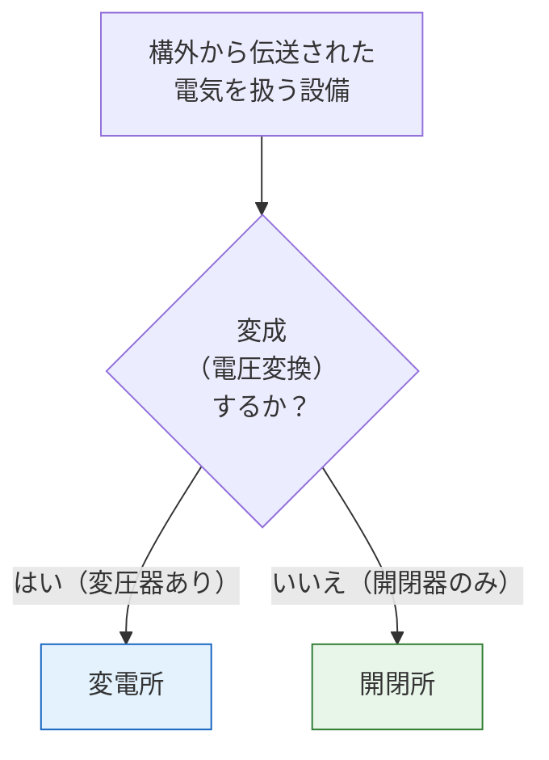

# 電気設備技術基準 第1条 — 用語の定義

**出題頻度**: 0回/14年 ★☆☆☆☆

> 電技の出発点となる用語定義。**電路**・**電線路**・**変電所**・**開閉所** など、法令全体で使われる言葉の意味を確定する条文。概念の「なぜその区別が必要か」を理解することが試験対策の核心。

| 項目 | 内容 |
|------|------|
| 条文 | 電気設備技術基準 第1条 |
| 規定内容 | 電路・電線路・変電所・開閉所・電気機械器具・接続点等の定義 |
| 性格 | 用語定義（法令全体の前提） |
| 試験重要度 | 穴埋め定番（**変成**・**通常**・**含まない**の3語が頻出） |
| 関連条文 | 第2条（電圧種別）・第4条（感電火災防止）・第5条（電路絶縁） |

---

## 1. 5秒で思い出す

- **電路** = 「通常の使用状態で電気が通じているところ」（大地・接地点は電路外）
- **変電所** = 構外から受けた電気を **変成** する場所
- **開閉所** = 構外から受けた電気を開閉するが **変成しない** 場所
- **電線路** = 電線 + 支持物等（電力輸送のための一式）
- 発電所・変電所・開閉所の「**構外**」という言葉が区別の鍵

??? question "セルフチェック: 変電所と開閉所の違いは何か？"
    **変圧器で電圧を変える（変成）かどうか**。変電所は変成あり、開閉所は変成なし（開閉器のみ）。どちらも「構外から伝送された電気を扱う」点は共通。

??? question "セルフチェック: 電路に大地は含まれるか？"
    **含まれない**。電路の定義「通常の使用状態で電気が通じているところ」には大地・接地点は入らない。これが第5条「電路は大地から絶縁」が成立する前提。

---

## 2. 条文原文

!!! note "条文原文の照合（要確認）"
    e-Gov公式（https://elaws.e-gov.go.jp/document?lawid=337M50000400052）または
    METI公式PDFを参照し、第1条の本文（全用語の定義文）を一字一句で貼り付ける。
    用語が多いため、表形式または箇条書きで整理しても可。

> **電気設備技術基準 第1条（用語の定義）**
>
> [要確認: e-Gov公式の本文をここに転記。電路・電線路・変電所・開閉所・発電所等の各定義]

---

## 3. 原文解析

| 用語 | 原文（要点） | 試験ポイント |
|------|-------------|-------------|
| 電路 | 通常の使用状態で電気が通じているところ | **大地・接地点を含まない**（第5条絶縁原則の前提） |
| 電気機械器具 | 電路に接続して電気的に使用する機械・器具 | 「電路に接続」が要件 |
| 発電所 | 発電機・原動機等から電気を発生させる場所 | 構内で発電する点が変電所と異なる |
| 変電所 | 構外から伝送された電気を**変成**する場所 | （ア）穴埋め定番＝変成 |
| 開閉所 | 構外から伝送された電気を開閉するが**変成しない**場所 | （イ）穴埋め定番＝変成しない |
| 電線路 | 電線・支持物等の一式 | 電線単体ではなく**支持物含む** |
| 接続点 | 電気事業者と需要家の設備の境界 | 責任分界点 |

---

## 4. 法規特有表現

!!! note "例文の取り扱い"
    例文列は条文の言い回しに倣った要約。条文原文そのものは section 2 を参照。

> 定義系条文では、用語そのものが法規表現。日常語からの変換と、用語間の混同パターンを押さえる。

| 日常語 | 法規表現 | 試験での意味 | 混同注意 | 例文（条文調） |
|---|---|---|---|---|
| 普通の状態で電気が流れている | 通常の使用状態で電気が通じている | 電路の定義条件。異常時・停電中は除外 | 「常に電気が通じている」だと範囲が広すぎる | 通常の使用状態で電気が通じているところをいう |
| 電圧を変える設備 | 変成する | 変電所のキーワード | 「変電」「変圧」「変成」を混在 | 構外から伝送された電気を変成する所 |
| 電気を入り切りする設備 | 開閉する（変成しない） | 開閉所のキーワード | 変電所と区別が必須 | 構外から伝送された電気の開閉を行うが変成しない所 |
| 電気事業者と契約者の境目 | 接続点 | 責任分界点の正式名称 | 「分界点」「需給点」と混在 | 電気事業者と需要家の電気設備との接続点 |

### この条文で覚えるべき言い回し

- 「**通常の使用状態**」（電路の定義条件、絶縁義務の対象を絞る語）
- 「**構外から伝送された電気**」（変電所・開閉所共通の前提）
- 「**変成する／変成しない**」（変電所と開閉所を分ける唯一の語）
- 「**電線路**」（電線**＋支持物等の一式**を指す。電線単体ではない）

### ひっかけ表現

| 誤った理解 | 正しい理解 |
|---|---|
| 「電路」は電線そのもの | 通常の使用状態で電気が通じているところ（大地・接地点は含まない） |
| 「電線路」は電線だけ | 電線 + 支持物（電柱・鉄塔）等の一式 |
| 「変電」「変圧」「変成」を同じに扱う | 法令上は **変成** が正式（変電所の定義語） |
| 「設置する」と「施設する」を同じに扱う | 法規では「**施設する**」が正式 |

---

## 5. かみ砕き解説

> 用語定義は丸暗記ではなく「なぜその区別が必要か」を押さえる。区別の根拠が分かれば試験での選択肢判定が早い。

### 変電所 vs 開閉所 — なぜ区別するのか

この区別は「どの設備に変圧器が必要か」という設計判断に直結するため、法令上も明確に分けられている。

| 項目 | 変電所 | 開閉所 |
|------|--------|--------|
| 主な機器 | 変圧器・開閉器・保護継電器など | 開閉器・母線・保護継電器など |
| 電圧の変成 | あり | なし |
| 典型例 | 一次変電所・配電用変電所 | 特別高圧の系統切替拠点 |
| 法令上の区別が必要な理由 | 変成を伴う設備には追加の安全基準が課される | 変成なしでも系統管理は必要 |

!!! tip "暗記の核心"
    **変電所 = 変成あり / 開閉所 = 変成なし**

    変圧器（Transformer）が中にあれば変電所。開閉器（Switch）だけなら開閉所。
    実設備でいえば、系統の切替拠点（スイッチングステーション）が開閉所の典型。

### 電路の定義 — なぜ「通常の使用状態」か

「電路」を「電気が流れる可能性があるところ」と定義してしまうと範囲が広がりすぎる。**通常の使用状態**で電気が通じている場所に限定することで、絶縁義務・感電保護の対象を合理的に絞る。

---

## 6. 図で理解

### 図解 1：発電所・変電所・開閉所の役割分担

<svg viewBox="0 0 700 220" xmlns="http://www.w3.org/2000/svg" font-family="sans-serif" font-size="12" style="width:100%;max-width:700px">
  <text x="350" y="20" text-anchor="middle" font-size="13" font-weight="bold" fill="#333">電力系統での3施設の位置づけ</text>
  <rect x="20" y="55" width="150" height="100" rx="8" fill="#fff3e0" stroke="#e65100" stroke-width="1.5"/>
  <text x="95" y="80" text-anchor="middle" font-weight="bold" fill="#bf360c">発電所</text>
  <text x="95" y="100" text-anchor="middle" font-size="10" fill="#333">電気を発生</text>
  <text x="95" y="118" text-anchor="middle" font-size="10" fill="#333">（発電機・原動機）</text>
  <text x="95" y="140" text-anchor="middle" font-size="9" fill="#666">構内で発生</text>
  <line x1="170" y1="105" x2="210" y2="105" stroke="#666" stroke-width="2" marker-end="url(#arr2)"/>
  <defs><marker id="arr2" markerWidth="8" markerHeight="6" refX="8" refY="3" orient="auto"><polygon points="0 0,8 3,0 6" fill="#666"/></marker></defs>
  <rect x="220" y="55" width="180" height="100" rx="8" fill="#e3f2fd" stroke="#1565c0" stroke-width="1.5"/>
  <text x="310" y="80" text-anchor="middle" font-weight="bold" fill="#0d47a1">変電所</text>
  <text x="310" y="100" text-anchor="middle" font-size="10" fill="#333">構外から受電→変成</text>
  <text x="310" y="118" text-anchor="middle" font-size="10" fill="#1565c0" font-weight="bold">変圧器あり</text>
  <text x="310" y="140" text-anchor="middle" font-size="9" fill="#666">電圧を変える</text>
  <line x1="400" y1="105" x2="440" y2="105" stroke="#666" stroke-width="2" marker-end="url(#arr2)"/>
  <rect x="450" y="55" width="180" height="100" rx="8" fill="#e8f5e9" stroke="#2e7d32" stroke-width="1.5"/>
  <text x="540" y="80" text-anchor="middle" font-weight="bold" fill="#1b5e20">開閉所</text>
  <text x="540" y="100" text-anchor="middle" font-size="10" fill="#333">構外から受電→開閉のみ</text>
  <text x="540" y="118" text-anchor="middle" font-size="10" fill="#2e7d32" font-weight="bold">変圧器なし</text>
  <text x="540" y="140" text-anchor="middle" font-size="9" fill="#666">電圧変えない</text>
  <rect x="20" y="175" width="610" height="35" rx="5" fill="#fffde7" stroke="#f9a825"/>
  <text x="325" y="197" text-anchor="middle" font-size="11" fill="#bf360c" font-weight="bold">区別の鍵：「変成（変圧器の有無）」</text>
</svg>

### 判定フローチャート: 「変電所か開閉所か」

---

## 7. なぜ「通常の使用状態」で限定するのか

> 第1条の用語定義は、後続条文の適用範囲を決める基礎。「通常の使用状態」という限定が外れると、絶縁義務（第5条）の対象が無限に広がってしまう。

電路定義「通常の使用状態で電気が通じているところ」には2つの限定がある：

1. **「通常の」**: 異常時（事故・点検中の通電など）は除外
2. **「電気が通じている」**: 充電されていない停電中の電線も対象外

この限定があることで、第5条（電路の絶縁）が現実的に運用可能になる。もし「電気が流れる可能性があるところ全て」を電路と定義したら、絶縁義務の対象が事実上すべての金属になり、保護設計が破綻する。

**用語定義の階層的役割**:

第1条（用語定義）→ 第5条（電路の絶縁）→ 解釈第14・15・16条（絶縁性能の数値）

第1条の語が抽象的に見えても、後続条文の数値規定の**適用対象を決める**ため、定義の精度が重要。

---

## 8. 試験で問われること

!!! note "出題予測（過去14年の統計）"
    出題頻度は低め（★★☆☆☆）だが、用語の**穴埋め形式**で出るケースが多い。

    1. **電路の定義の穴埋め**: 「電路とは( )の使用状態で電気が通じているところ」
       - 正解: 通常
       - ひっかけ: 異常時・常時 等の選択肢で混乱を狙う

    2. **変電所・開閉所の区別**: 「変電所と開閉所の違いとして正しいものはどれか」
       - 正解: 変成（電圧変換）の有無
       - ひっかけ: 「電圧の高低」「規模の大小」など本質と無関係な選択肢

    3. **電路に含まれないもの**: 「電路に含まれないものはどれか」
       - 正解: 大地・接地点
       - ひっかけ: 充電部・露出充電部などの選択肢で混乱を狙う

    4. **複合問題（第5条との連動）**: 「電路は何から絶縁するか」
       - 正解: 大地
       - 第1条の電路定義と第5条の絶縁原則をセットで問う

---

## 9. 頻出ひっかけ

1. 🔴 **大地・接地点を電路に含めてしまう** — 電路の定義には含まれない。絶縁義務の根拠がここにある
2. 🔴 **変電所と開閉所を混同する** — 変成（電圧変換）があれば変電所、なければ開閉所
3. 🟡 **電線路を「電線のこと」と思い込む** — 電線路 = 電線 + 支持物等の一式。電線単体ではない
4. 🟡 **「構外から伝送された」を見落とす** — 変電所・開閉所の定義に共通する要件。構内で発生した電気を扱う設備は発電所
5. 🟢 **「変電」「変圧」「変成」を厳密に区別しない** — 法令上は **変成** が変電所の定義語

---

## 10. 穴埋め過去問チャレンジ

!!! note "過去問類題（難易度 ★★☆☆☆）"
    次の文章は「電気設備技術基準」第1条の用語定義に関する記述である。空欄（ア）〜（ウ）に入る語句として正しいものを選べ。

    > 「電路」とは，**（ア）** の使用状態で電気が通じているところをいう。
    > 「変電所」とは，構外から伝送される電気を **（イ）** する所であって， **（イ）** した電気をさらに構外に伝送するものをいう。
    > 「開閉所」とは，構外から伝送される電気の開閉を行うが， **（イ）** **（ウ）** 所をいう。

??? success "解答を見る"
    | 空欄 | 正答 |
    |------|------|
    | （ア） | **通常** |
    | （イ） | **変成** |
    | （ウ） | **しない** |

    **読み解きポイント：**

    - （ア）**通常** ：「通常の使用状態」で限定することで、絶縁義務の対象を合理的に絞る
    - （イ）**変成** ：変電所の核心キーワード。変圧器による電圧変換
    - （ウ）**しない** ：開閉所は「変成しない」点が変電所との決定的な違い

---

## 11. まぎらわしい選択肢と正解の違い

| 用語 | よくある誤解 | 正解 | なぜ違うか |
|------|------------|------|----------|
| 電路 | **大地・接地点も含む** | **大地・接地点は含まない** | 第5条「電路は大地から絶縁」が成立する前提 |
| 変電所と開閉所 | **どちらも変成する** | **変電所のみ変成・開閉所はしない** | 変圧器の有無が決定的 |
| 電線路 | **電線そのもの** | **電線＋支持物等の一式** | 支持物（電柱・鉄塔）も含む |
| 構外/構内 | **構内で発電したものも変電所で扱う** | **変電所は構外受電が前提** | 構内発電は発電所 |

### 一目でわかる施設区分

| 施設 | 電気の発生 | 構外受電 | 変成 | 開閉 |
|------|-----------|---------|------|------|
| 発電所 | ✅ | — | △ | △ |
| 変電所 | — | ✅ | ✅ | ✅ |
| 開閉所 | — | ✅ | ❌ | ✅ |

---

## 12. 関連条文

**法令全体での用語定義の位置付け**

- [電圧の種別 第2条](2.md) — 低圧・高圧・特別高圧の境界値定義
- [感電・火災等の防止 第4条](4.md) — 第1条の用語を用いた総則的安全規定
- [電路の絶縁 第5条](5.md) — 「電路は大地から絶縁」の原則条文。第1条の電路定義が前提

---

## 13. 過去問実績

| 年度 | 問 | 形式 | 論点 | 備考 |
|------|-----|------|------|------|
| H25頃 | — | 穴埋め | 電路・電線路の定義 | [要確認] 年度・問番号 |
| H30頃 | — | 選択 | 変電所・開閉所の区別 | [要確認] 年度・問番号 |

!!! note "R08 出題予測"
    頻度は低いため単独出題の可能性は低い。ただし第2条（電圧の種別）や第5条（電路の絶縁）と**組み合わせた穴埋め**で登場するケースに注意。
    「電路に大地は含まれない」は第5条の絶縁義務の前提として問われることがある。

---

## 14. 最終チェック

**📜 用語定義の核心**

- [ ] 電路の定義「通常の使用状態で電気が通じているところ」を即答できる
- [ ] 電路に大地・接地点が含まれないことを即答できる
- [ ] 変電所と開閉所の違いを「変成の有無」で即答できる

**🏭 施設区分**

- [ ] 発電所・変電所・開閉所の役割分担を1行ずつ言える
- [ ] 「構外から伝送された」が変電所・開閉所共通の要件と説明できる

**🔗 関連条文との接続**

- [ ] 第5条（電路の絶縁）の前提が第1条の電路定義であると説明できる
- [ ] 第2条（電圧の種別）と組み合わせて使われやすいことを知っている

---

---

## 監修ログ

- **2026-05-02**: DENKEN-WIKI監修部による初回三段監修（不動・江間・早川）。本条は用語定義条文のため数値テーブルなし。江間が用語定義（電路・変電所・開閉所・電線路・接続点）が電技省令第1条と整合していることを確認。早川が「変成」「変成しない」の対比による弁別性能を評価。
- **数値検証判定: PASS**（用語定義条文・数値なし）

---

*最終確認: 2026-05-02 | 数値検証完了: 2026-05-02（PASS・用語定義条文・数値なし） | ステータス: v2.1（監修ログ追加） | [バージョニング基準](../../reference/versioning.md)*
