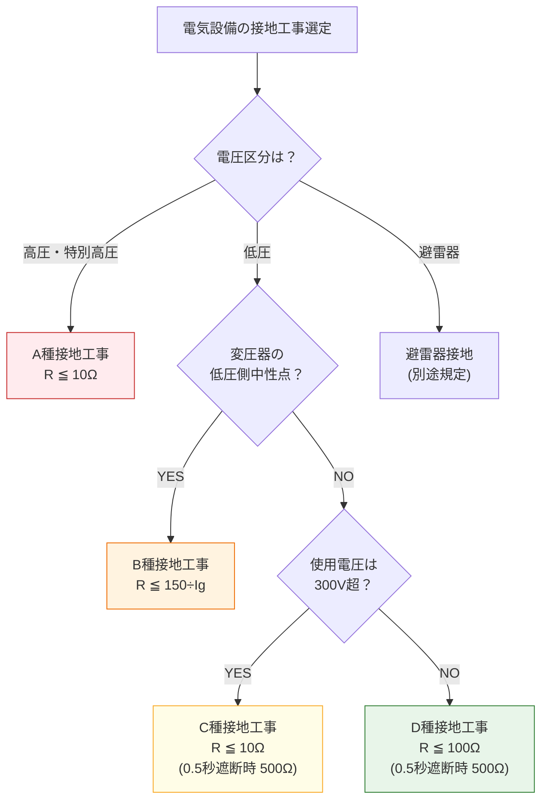

# 電技省令 第10条 — 電気設備の接地

!!! note "📊 試験対策メタ"
    - **出題頻度**: 🔥 ★★☆☆☆（過去14年で 2 回出題・参考条文／実問は解釈第17〜19条が頻出）
    - **重要度**: C（基本）
    - **直近出題**: —

> 電気設備の必要な箇所には、異常時の電位上昇、高電圧の侵入等による感電、火災その他人体に危害を及ぼし、又は物件への損傷を与えるおそれがないよう、**接地その他の適切な措置**を講じなければならない。

| 項目 | 内容 |
|------|------|
| 条文 | 電気設備技術基準 第10条 |
| 規定内容 | 電気設備の接地義務（異常時の感電・火災・物件損傷防止） |
| 性格 | **保安措置の原則規定（規範型A）**（具体的接地抵抗値・適用区分は解釈に委任） |
| 委任先 | 解釈第17〜19条（A〜D種接地工事） |
| 試験重要度 | 第10条本体は出題なし。解釈側（A〜D種接地）が頻出 |

---

## 1. 全体像と要点

### ① 全体像 — 第10条の位置づけ（初学者向け：先に森を見る）

<div class="article-overview-cross"><div class="ov-row ov-row-top"><div class="ov-node ov-up"><div class="ov-icon">🛡️</div><div class="ov-title">第5条系</div><div class="ov-desc">電路の絶縁原則</div><div class="ov-tag">上位思想: 安全第一</div></div></div><div class="ov-arrow ov-arrow-down ov-arrow-strong"><span class="ov-arrow-line"></span><span class="ov-arrow-label">上位</span></div><div class="ov-row ov-row-middle"><div class="ov-node ov-left"><div class="ov-icon">🔌</div><div class="ov-title">省令第11条</div><div class="ov-desc">接地の方法</div><div class="ov-tag">並立: 具体仕様</div></div><div class="ov-arrow ov-arrow-right"><span class="ov-arrow-label">並立</span><span class="ov-arrow-line"></span></div><div class="ov-node ov-center"><div class="ov-icon">🌍</div><div class="ov-title">第10条</div><div class="ov-desc">電気設備の接地</div></div><div class="ov-arrow ov-arrow-right"><span class="ov-arrow-label">補完</span><span class="ov-arrow-line"></span></div><div class="ov-node ov-right"><div class="ov-icon">⚡</div><div class="ov-title">省令第15条</div><div class="ov-desc">地絡に対する保護</div><div class="ov-tag">補完: 電流遮断</div></div></div><div class="ov-arrow ov-arrow-down ov-arrow-strong"><span class="ov-arrow-line"></span><span class="ov-arrow-label">委任</span></div><div class="ov-row ov-row-bottom"><div class="ov-node ov-down"><div class="ov-icon">🔧</div><div class="ov-title">解釈第17〜19条</div><div class="ov-desc">A〜D種接地工事</div><div class="ov-tag">実装規定: 抵抗値・適用区分</div></div></div></div><!-- スタイルは custom.css の Article Overview Cross セクションに統合（2026-05-03） -->

| 条文 | 役割 | 第10条との関係 |
|------|------|---------------|
| 省令第5条系 | 電路の絶縁原則 | 第10条の**上位思想**（安全設計の総則） |
| 省令第11条 | 接地の方法（接地線・接地極の仕様） | 第10条と**並立**（接地の具体方法を規定） |
| 省令第15条 | 地絡に対する保護対策 | 第10条の**補完保護**（接地で電位低下、地絡遮断器で電流遮断） |
| 解釈第17〜19条 | A〜D種接地工事 | 第10条の**実装規定**（接地抵抗値・適用機器の具体仕様） |

→ 第10条は「**接地その他の適切な措置**」の総括規定。具体的な接地抵抗値（A種10Ω・D種100Ω等）・適用区分は解釈第17〜19条に委任。装置設置だけでなく避雷装置・二重絶縁等の代替手段も含む。

### ② 要点（既習者向け：試験前30秒復習用）

- 接地の役割: 地絡時に大地への低インピーダンス経路を提供→電位差を低下させる
- 保護対象は「**感電・火災・物件損傷**」の3点（条文の核心要素）
- 異常時の例：地絡・雷サージ・高電圧侵入
- 接地だけでなく「**その他の適切な措置**」も含む（絶縁強化・避雷装置・保護装置）
- 上位原則法：具体的な接地方法・数値は解釈第17〜19条（A〜D種接地）で規定
- 「必要な箇所」の判定：地絡電流の危険性によって決定
- 接地抵抗値（公式値・解釈第17条17-1表）：**A種10Ω / B種150÷Ig / C種10Ω / D種100Ω**

??? question "セルフチェック: 第10条で「接地抵抗値（Ω）」が具体的に決まるか？"
    いいえ。第10条は**原則を定める**だけ。具体的な数値（A種10Ω、D種100Ω等）は解釈第17〜19条（ABCD種接地）で規定される。第10条は「接地しろ」という指示、第17〜19条は「こうやってしろ」という実装方法。

??? question "セルフチェック: 「接地」が唯一の対策か？"
    いいえ。条文は「接地**その他の適切な措置**」と明記。代替手段として（1）避雷装置（雷サージ対応）、（2）二重絶縁（小型工具等）、（3）漏電遮断器・地絡継電器（電流遮断）等を組み合わせて適用できる。「接地のみ」と書くと誤答。

---

## 2. 条文原文

> **電気設備技術基準 第10条（電気設備の接地）**
>
> 電気設備の必要な箇所には、異常時の電位上昇、高電圧の侵入等による感電、火災その他人体に
> 危害を及ぼし、又は物件への損傷を与えるおそれがないよう、接地その他の適切な措置を
> 講じなければならない。ただし、電路に係る部分にあっては、第五条第一項の規定に
> 定めるところによりこれを行わなければならない。

!!! note "原文確認済"
    e-Gov公式（電気設備に関する技術基準を定める省令第10条）から転記済み。条文転記は2026-05-02時点。

---

## 3. 原文解析

| ブロック | 原文 | 意味 | 試験ポイント |
|---------|------|------|-------------|
| 主語 | 電気設備の必要な箇所には | 全電気設備が対象（必要性は解釈に委任） | — |
| 起動条件 | 異常時の電位上昇、高電圧の侵入等による | 地絡・雷サージ・混触等の事故全般 | 「異常時」=平常運用中の事故全般（ひっかけ注意） |
| 保護対象 | 感電、火災その他人体に危害を及ぼし、又は物件への損傷を与えるおそれがないよう | **人体・火災・物件**の3点 | **頻出ひっかけ**（感電のみは誤り） |
| 措置 | 接地その他の適切な措置 | 装置以外（二重絶縁・避雷装置等）も含む | （ウ）の穴埋め |
| 義務 | 講じなければならない | 強制義務（努力義務ではない） | — |
| 委任先 | 第五条第一項の規定に定めるところにより | 電路部分は第5条（絶縁）に従う | 関連条文の整理に必須 |

!!! tip "「その他の適切な措置」の含意"
    接地工事の設置だけが解ではない。避雷装置・二重絶縁・漏電遮断器等の代替手段でも要件を満たせる。「接地一択」と書くのは誤り。

---

## 4. 法規特有表現

> 条文を読む前に、日常語と法規表現の対応を頭に入れておくと、原文の意味が一気に通る。

| 日常語 | 法規表現 | 試験での意味 | 混同注意 | 例文（条文調） |
|---|---|---|---|---|
| アースを取る | 接地を施す | 大地と電気的に接続する保安措置 | 「アース」は俗称・条文には登場しない／「設置する」では不可 | 電気設備には、接地を施さなければならない |
| 何かあったら | 異常時の電位上昇、高電圧の侵入等による | 接地義務の起動条件（地絡・雷サージ・混触の総称） | 「故障時」「事故時」より広い概念。平常運用中の事故全般を含む | 異常時の電位上昇、高電圧の侵入等による感電を防止する |
| 大地につなぐ | 接地 | 大地と電気的に接続すること | 「アース」「グラウンド」は俗称、法規では「接地」 | 必要な箇所に接地を施す |
| 接地以外の対策もあり | 接地その他の適切な措置を講じなければならない | 接地に限らず代替措置（避雷装置・二重絶縁等）も認める | 「接地のみが必須」と読まない。「その他」に装置と設計手法の両方を含む | 接地その他の適切な措置を講じなければならない |
| 危険を防ぐ | 感電、火災その他人体に危害を及ぼし、又は物件への損傷を与えるおそれがないよう | 保護対象は人体・火災・物件の3点セット | 「感電のみ」と読まない。火災・物件損傷も保護対象 | 人体に危害を及ぼし、又は物件への損傷を与えるおそれがないよう |

### この条文で覚えるべき言い回し

- 「**異常時の電位上昇、高電圧の侵入等による**」（接地義務の起動条件・典型表現）
- 「**接地その他の適切な措置**」（接地に限らず代替手段を含む含意）
- 「**感電、火災その他人体に危害を及ぼし、又は物件への損傷を与えるおそれがないよう**」（保護対象3点：人体・火災・物件）
- 「**講じなければならない**」（義務の強さを示す法規動詞・努力義務ではなく強制義務）
- 「**必要な箇所**」（適用範囲を抽象的に示す表現・具体仕様は解釈に委任）
- 「**電気設備**」（条文の主語・電線・機器・配線等の総称）

### ひっかけ表現

| 誤った理解 | 正しい理解 |
|---|---|
| 第10条で具体的な接地抵抗値（A種10Ω等）が決まる | 第10条は原則のみ。数値は解釈第17〜19条で規定 |
| 接地が唯一・必須の対策である | 「接地**その他の適切な措置**」も認められる（避雷装置・二重絶縁等） |
| 「接地」と「アース」を法規用語として併用できる | 法規は「接地」が正式。「アース」は俗称で条文には登場しない |
| 保護対象は「感電」のみである | 「**感電・火災・物件損傷**」の3点セット |
| 「設置する」と「施す」を同じに扱う | 法規では接地に対し「**接地を施す**」「**講ずる**」が正式 |
| 接地深さ・接地線太さは第10条で規定される | 第11条（接地工事の種類及び施設方法）が規定。第10条は「施せ」だけ |
| 「異常時」=平常運用時の異常 | 地絡・雷サージ・高電圧侵入の総称（運用中の事故全般） |

### まぎらわしい用語の比較（接地族）

| 用語 | 意味 | 適用 | 試験での出方 |
|---|---|---|---|
| 接地 | 大地と電気的に接続すること | 第10条の中核用語。全ての接地工事の総称 | 「接地を施す」の主語・目的語として頻出 |
| アース | 接地の俗称（口語・実務略語） | 条文には登場しない | ひっかけ語として出題される（「法規上の用語はどれか」） |
| 等電位ボンディング | 複数の金属体を導体で接続し等電位に保つ | 接地の一形態。浴室の金属管・配管接続等 | 第59条系・需要場所の保安措置で出題 |
| 中性点接地 | 変圧器の中性点を接地すること | B種接地の対象。高低圧混触時の電位上昇抑制 | B種接地の目的説明で頻出 |

### まぎらわしい用語の比較（接地工事種別 A〜D種）

| 種別 | 適用機器 | 接地抵抗 | 0.5秒以内遮断時の特例 | 第10条との関係 |
|---|---|---|---|---|
| A種 | 高圧・特別高圧用機器の鉄台等 | **10**Ω以下 | — | 第10条の高圧側実装規定 |
| B種 | 変圧器低圧側中性点（高低圧混触防止） | **150÷Ig（Ω）** | — | 第10条の混触対策実装規定 |
| C種 | 300V超の低圧機器外箱 | **10**Ω以下 | **500**Ω以下 | 第10条の低圧（高めの電圧）実装規定 |
| D種 | 300V以下の低圧機器外箱 | **100**Ω以下 | **500**Ω以下 | 第10条の低圧（一般）実装規定 |

→ 第10条は「接地を施せ」と命じ、「いくらの抵抗値で」は解釈第17条17-1表で規定。試験では「機器の電圧区分 → 種別 → 抵抗値」の対応が問われる。

### 一目でわかる「接地その他の適切な措置」

| 対策 | 効果 | 適用場面 |
|---|---|---|
| 接地（A〜D種） | 大地への低インピーダンス経路提供・電位低下 | 全電気設備の基本対策 |
| 避雷装置 | 雷サージの大地放出・電位上昇抑制 | 高い建物・露出設備・特別高圧設備 |
| 二重絶縁 | 1段目絶縁が破れても2段目で保護 | 小型電動工具・照明器具・移動機器 |
| 漏電遮断器（ELB）／地絡継電器（GR） | 地絡電流の迅速遮断 | 第15条（地絡保護）と併用、低圧屋内配線等 |

→ 「接地その他の適切な措置」の「その他」には**装置設置（避雷装置・遮断器）と設計手法（二重絶縁）の両方**を含む。条文の「その他」を狭く解釈せず、保護目的を達成する代替手段全般と理解する。

---

## 5. かみ砕き解説

> 接地は「**地絡電流を大地へ逃がす**」だけでなく、「**機器外箱の対地電圧を下げて感電を緩和**」「**等電位化で接触電位差をゼロにする**」役割もある。

### 地絡時の電位上昇を抑制する

- **地絡回路**: 大地 ← 接地抵抗 ← 接地線
- **接地抵抗が高い** → 機器外箱の対地電圧が大きくなる → 感電リスク高
- **接地抵抗を下げる** → 接地線を太く・接地極を深く埋設 → 対地電圧が下がる → 感電リスク低

**計算例**:

- 地絡電流 Ig = 100A、接地抵抗 R = 10Ω → 対地電圧 V = I × R = **1,000V**（危険）
- 接地抵抗 R = 1Ω → 対地電圧 V = **100V**（低下）

### 雷サージ（高電圧侵入）への対応

- 落雷時に建物に侵入する過渡高電圧を迅速に大地へ放出
- 低インピーダンス接地路 → サージ電流の速やかな分散 → 機器損傷防止

!!! note "等電位化との関係"
    接地は「大地に電流を逃す」だけでなく、「複数の金属体を等電位に保つ」役割もある。これにより接触電位差がゼロに近づく。浴室の金属管接続（等電位ボンディング）が代表例。

??? question "セルフチェック: 接地抵抗を下げると何が改善するか？"
    地絡時の対地電圧（V = Ig × R）が下がる → 人体に印加される電圧が下がる → 感電電流が下がる。同時に地絡電流自体は増える（V/R が大きくなる）ので、地絡遮断器（第15条）の検出感度が高まり、より早く回路が遮断される。**接地と地絡遮断は併用が原則**。

---

## 6. 図で理解

### 図解 1：接地による電位差低下のメカニズム

地絡発生時、機器外箱の対地電圧は「地絡電流 × 接地抵抗」で決まる。接地抵抗を低くすることで、人体に印加される電圧を安全レベルまで下げられる。

<div><svg viewBox="0 0 700 280" xmlns="http://www.w3.org/2000/svg" style="max-width:100%;height:auto;font-family:sans-serif"><defs><marker id="arr10R" viewBox="0 0 10 10" refX="9" refY="5" markerWidth="6" markerHeight="6" orient="auto"><path d="M0,0 L10,5 L0,10 z" fill="#c62828"/></marker><marker id="arr10G" viewBox="0 0 10 10" refX="9" refY="5" markerWidth="6" markerHeight="6" orient="auto"><path d="M0,0 L10,5 L0,10 z" fill="#2e7d32"/></marker><pattern id="ground10" patternUnits="userSpaceOnUse" width="8" height="8"><path d="M0,8 L8,0" stroke="#795548" stroke-width="1"/></pattern></defs><rect x="10" y="10" width="335" height="260" fill="#ffebee" stroke="#c62828" stroke-width="2" rx="6"/><text x="177" y="32" text-anchor="middle" font-size="14" font-weight="bold" fill="#c62828">接地なし or 高抵抗接地（危険）</text><rect x="40" y="55" width="80" height="60" fill="#fff" stroke="#c62828" stroke-width="2"/><text x="80" y="80" text-anchor="middle" font-size="11" fill="#c62828">機器外箱</text><text x="80" y="98" text-anchor="middle" font-size="10" fill="#c62828">(地絡発生)</text><circle cx="200" cy="85" r="10" fill="#fff" stroke="#c62828" stroke-width="2"/><text x="200" y="89" text-anchor="middle" font-size="10" fill="#c62828">人</text><line x1="120" y1="85" x2="190" y2="85" stroke="#c62828" stroke-width="2" marker-end="url(#arr10R)"/><text x="155" y="78" text-anchor="middle" font-size="9" fill="#c62828">接触</text><line x1="80" y1="115" x2="80" y2="180" stroke="#c62828" stroke-width="2" stroke-dasharray="4,2" marker-end="url(#arr10R)"/><text x="100" y="150" font-size="10" fill="#c62828">R = 10Ω</text><text x="100" y="165" font-size="10" fill="#c62828">(高抵抗)</text><rect x="20" y="200" width="315" height="25" fill="url(#ground10)" stroke="#795548"/><text x="177" y="217" text-anchor="middle" font-size="10" fill="#5d4037">大地</text><rect x="40" y="240" width="275" height="25" fill="#fff" stroke="#c62828"/><text x="177" y="257" text-anchor="middle" font-size="11" font-weight="bold" fill="#c62828">V = Ig × R = 100A × 10Ω = 1000V</text><rect x="355" y="10" width="335" height="260" fill="#e8f5e9" stroke="#2e7d32" stroke-width="2" rx="6"/><text x="522" y="32" text-anchor="middle" font-size="14" font-weight="bold" fill="#2e7d32">適切な接地（安全）</text><rect x="385" y="55" width="80" height="60" fill="#fff" stroke="#2e7d32" stroke-width="2"/><text x="425" y="80" text-anchor="middle" font-size="11" fill="#2e7d32">機器外箱</text><text x="425" y="98" text-anchor="middle" font-size="10" fill="#2e7d32">(地絡発生)</text><circle cx="545" cy="85" r="10" fill="#fff" stroke="#2e7d32" stroke-width="2"/><text x="545" y="89" text-anchor="middle" font-size="10" fill="#2e7d32">人</text><line x1="465" y1="85" x2="535" y2="85" stroke="#2e7d32" stroke-width="2" marker-end="url(#arr10G)"/><text x="500" y="78" text-anchor="middle" font-size="9" fill="#2e7d32">接触</text><line x1="425" y1="115" x2="425" y2="180" stroke="#2e7d32" stroke-width="3" marker-end="url(#arr10G)"/><text x="445" y="150" font-size="10" fill="#2e7d32">R = 1Ω</text><text x="445" y="165" font-size="10" fill="#2e7d32">(低抵抗)</text><rect x="365" y="200" width="315" height="25" fill="url(#ground10)" stroke="#795548"/><text x="522" y="217" text-anchor="middle" font-size="10" fill="#5d4037">大地</text><rect x="385" y="240" width="275" height="25" fill="#fff" stroke="#2e7d32"/><text x="522" y="257" text-anchor="middle" font-size="11" font-weight="bold" fill="#2e7d32">V = Ig × R = 100A × 1Ω = 100V</text></svg></div>

接地抵抗を 10Ω → 1Ω に下げるだけで、対地電圧が 1000V → 100V と1/10 になる。これが第10条が「接地その他の適切な措置」を要求する物理的根拠。

### 図解 2：A〜D種接地の適用区分

電圧区分と機器種別ごとに、A種〜D種の4種類が割り当てられている。電圧が高いほど接地抵抗値の要求が厳しい。

<div><svg viewBox="0 0 720 300" xmlns="http://www.w3.org/2000/svg" style="max-width:100%;height:auto;font-family:sans-serif"><rect x="10" y="10" width="700" height="280" fill="#fafafa" stroke="#9e9e9e" stroke-width="1" rx="4"/><text x="360" y="32" text-anchor="middle" font-size="14" font-weight="bold" fill="#333">A〜D種接地の適用区分（電技解釈第17条）</text><rect x="20" y="50" width="160" height="40" fill="#eceff1" stroke="#607d8b"/><text x="100" y="73" text-anchor="middle" font-size="11" font-weight="bold" fill="#37474f">適用条件</text><rect x="180" y="50" width="170" height="40" fill="#ffebee" stroke="#c62828"/><text x="265" y="68" text-anchor="middle" font-size="11" font-weight="bold" fill="#c62828">高圧・特別高圧</text><text x="265" y="83" text-anchor="middle" font-size="10" fill="#c62828">機器の鉄台・外箱</text><rect x="350" y="50" width="170" height="40" fill="#fff3e0" stroke="#ef6c00"/><text x="435" y="68" text-anchor="middle" font-size="11" font-weight="bold" fill="#ef6c00">変圧器の中性点</text><text x="435" y="83" text-anchor="middle" font-size="10" fill="#ef6c00">(高圧/特高 → 低圧)</text><rect x="520" y="50" width="180" height="40" fill="#e8f5e9" stroke="#2e7d32"/><text x="610" y="68" text-anchor="middle" font-size="11" font-weight="bold" fill="#2e7d32">低圧機器の鉄台・外箱</text><text x="610" y="83" text-anchor="middle" font-size="10" fill="#2e7d32">300V 超 / 300V 以下</text><rect x="20" y="90" width="160" height="80" fill="#eceff1" stroke="#607d8b"/><text x="100" y="125" text-anchor="middle" font-size="11" font-weight="bold" fill="#37474f">接地種別</text><text x="100" y="145" text-anchor="middle" font-size="10" fill="#37474f">(電圧が高いほど</text><text x="100" y="158" text-anchor="middle" font-size="10" fill="#37474f">厳しい)</text><rect x="180" y="90" width="170" height="80" fill="#ffcdd2" stroke="#c62828" stroke-width="2"/><text x="265" y="120" text-anchor="middle" font-size="16" font-weight="bold" fill="#b71c1c">A種</text><text x="265" y="142" text-anchor="middle" font-size="11" fill="#c62828">高圧・特高機器の</text><text x="265" y="156" text-anchor="middle" font-size="11" fill="#c62828">鉄台・金属外箱</text><rect x="350" y="90" width="170" height="80" fill="#ffe0b2" stroke="#ef6c00" stroke-width="2"/><text x="435" y="120" text-anchor="middle" font-size="16" font-weight="bold" fill="#e65100">B種</text><text x="435" y="142" text-anchor="middle" font-size="11" fill="#ef6c00">変圧器低圧側の</text><text x="435" y="156" text-anchor="middle" font-size="11" fill="#ef6c00">中性点 / 1端子</text><rect x="520" y="90" width="90" height="80" fill="#fff9c4" stroke="#f9a825" stroke-width="2"/><text x="565" y="120" text-anchor="middle" font-size="16" font-weight="bold" fill="#f57f17">C種</text><text x="565" y="142" text-anchor="middle" font-size="10" fill="#f9a825">300V 超</text><text x="565" y="156" text-anchor="middle" font-size="10" fill="#f9a825">低圧機器</text><rect x="610" y="90" width="90" height="80" fill="#c8e6c9" stroke="#2e7d32" stroke-width="2"/><text x="655" y="120" text-anchor="middle" font-size="16" font-weight="bold" fill="#1b5e20">D種</text><text x="655" y="142" text-anchor="middle" font-size="10" fill="#2e7d32">300V 以下</text><text x="655" y="156" text-anchor="middle" font-size="10" fill="#2e7d32">低圧機器</text><rect x="20" y="170" width="160" height="60" fill="#eceff1" stroke="#607d8b"/><text x="100" y="195" text-anchor="middle" font-size="11" font-weight="bold" fill="#37474f">接地抵抗値</text><text x="100" y="215" text-anchor="middle" font-size="10" fill="#37474f">(原則値)</text><rect x="180" y="170" width="170" height="60" fill="#fff" stroke="#c62828"/><text x="265" y="200" text-anchor="middle" font-size="14" font-weight="bold" fill="#c62828">10Ω 以下</text><text x="265" y="218" text-anchor="middle" font-size="10" fill="#c62828">(最も厳しい)</text><rect x="350" y="170" width="170" height="60" fill="#fff" stroke="#ef6c00"/><text x="435" y="200" text-anchor="middle" font-size="14" font-weight="bold" fill="#ef6c00">150 ÷ Ig [Ω]</text><text x="435" y="218" text-anchor="middle" font-size="10" fill="#ef6c00">(計算式・別系統)</text><rect x="520" y="170" width="90" height="60" fill="#fff" stroke="#f9a825"/><text x="565" y="195" text-anchor="middle" font-size="13" font-weight="bold" fill="#f9a825">10Ω 以下</text><text x="565" y="213" text-anchor="middle" font-size="9" fill="#f9a825">(0.5秒遮断時</text><text x="565" y="225" text-anchor="middle" font-size="9" fill="#f9a825">500Ω 以下)</text><rect x="610" y="170" width="90" height="60" fill="#fff" stroke="#2e7d32"/><text x="655" y="195" text-anchor="middle" font-size="13" font-weight="bold" fill="#2e7d32">100Ω 以下</text><text x="655" y="213" text-anchor="middle" font-size="9" fill="#2e7d32">(0.5秒遮断時</text><text x="655" y="225" text-anchor="middle" font-size="9" fill="#2e7d32">500Ω 以下)</text><rect x="20" y="245" width="680" height="35" fill="#fff8e1" stroke="#fbc02d" stroke-width="1"/><text x="360" y="266" text-anchor="middle" font-size="11" font-weight="bold" fill="#f57f17">電圧が下がる → 接地抵抗の要求が緩くなる（A:10Ω → C:10Ω → D:100Ω）／B種だけ計算式で別系統</text></svg></div>

C種は低圧でも 300V 超のため、A種と同等の 10Ω が要求されている。「電圧が高い ＝ 接地抵抗を低く」が大原則。

### 判定フローチャート: 接地工事の選定

実機選定では、電圧区分 → 機器の種類 → 接地種別の順に判定する。



!!! tip "暗記の核心"
    **「電圧が高いほど厳しい接地」** = A種(10Ω) → C種(10Ω・低圧高電圧) → D種(100Ω)

    B種だけ別系統（変圧器中性点専用・「150÷Ig」という計算式）。

---

## 7. 条文固有の深掘り

> 第10条の本質を理解するための3つの問い。試験では因果説明型・条文構造の出題に直結。

### 問い1: なぜ「接地」だけでなく「その他の適切な措置」が必要なのか

第10条が「接地その他の適切な措置」と書くのは、**接地が万能ではない**ためである。代替手段の存在は3つの理由で必要：

- **機器によっては接地が困難**: 小型電動工具・移動機器は接地線の取り回しが現実的でない → 二重絶縁で対応
- **接地だけでは雷サージに不十分**: 落雷の数十kV侵入には接地と並んで避雷装置が必要
- **接地は「電圧低下」だけ・「電流切断」は別装置**: 地絡電流の遮断は漏電遮断器（ELB）等が担当 → 第15条と併用

| 対策 | 効果 | 接地との関係 |
|------|------|---|
| 接地（A〜D種） | 対地電圧を下げる（V=Ig×R） | 主装置 |
| 二重絶縁 | 絶縁を多重化し地絡を予防 | 接地不要な代替 |
| 避雷装置 | 雷サージを大地へ放出 | 接地と並用 |
| 漏電遮断器・地絡継電器 | 地絡電流を切断 | 第15条と併用 |

→ 「接地一択」と書くのは誤り。代替手段でも要件を満たせるのが第10条の柔軟性。

### 問い2: 第10条と解釈第17〜19条の関係はどうなっているのか

第10条は「**何を守るか**」を抽象的に定め、解釈第17〜19条は「**どのくらいの数値で守るか**」を具体的に定める。両者は階層関係：

```
第10条（省令）：「接地その他の適切な措置を講じよ」
    ↓ 実装方法の詳細指示
解釈第17条 17-1表：
    ├─ A種接地：R ≦ 10Ω（高圧・特別高圧機器）
    ├─ B種接地：R ≦ 150÷Ig（変圧器低圧側中性点）
    ├─ C種接地：R ≦ 10Ω（300V超低圧機器、0.5秒遮断時 500Ω）
    └─ D種接地：R ≦ 100Ω（300V以下低圧機器、0.5秒遮断時 500Ω）
```

出典：電技解釈第17条 17-1表（2026-05-02取得）。3ソース（電気の神髄／電験超入門部／日本電気技術者協会JEEA）で値の一致を確認済み。

!!! note "試験での出題区分"
    `kakomon.yml` 集計上、**第10条本体の出題は0回**。接地工事（A〜D種）の具体的問題は解釈第17〜19条として登録されている。第10条は「**趣旨理解**」が問われる（数値計算は出ない）。

### 問い3: 接地（第10条）と地絡遮断（第15条）はなぜ併用が必要か

両者はどちらも「地絡時の人体・設備保護」を目的とするが、**作用する物理量が違う**ため、片方だけでは保護が不完全になる。

- 接地（第10条）= **電位差低下**（V = Ig × R を小さくして感電緩和）
- 地絡遮断（第15条）= **電流遮断**（通電時間を短縮し被害拡大を防止）
- 役割が違うため代替不可。**両方併用が原則**。

**地絡発生からの保護階層（時系列）**

| 時刻 | 保護機構 | 役割 |
|------|---------|------|
| 0ms（地絡発生） | **接地（第10条）** | 機器外箱の対地電圧を低く保つ → 感電電流を制限 |
| 〜30ms | ELB（第15条・低圧） | 零相電流検出 → 遮断 → 通電時間短縮 |
| 〜数秒 | GR + 遮断器（第15条・高圧） | 保護協調を考慮した遮断 |

→ 接地は「**初期対応（電位を下げる）**」、地絡遮断は「**最終対応（電流を切る）**」。両者で人体への通電エネルギーを最小化する。

??? question "セルフチェック: 接地と地絡遮断のどちらが優先か？"
    **両方併用が原則**。優先順位ではなく**役割分担**。接地は地絡発生の瞬間から対地電圧を下げ続け、地絡遮断器は数十ms〜数秒で電流を切る。両者で時間軸の異なる保護を提供する。「片方だけで十分」と書くと誤答。

---

## 8. 試験で問われること

> 第10条本体の出題は0回。ただし「条文の趣旨理解」「接地と他条文の役割分担」は周辺問題で問われる。解釈第17〜19条として接地抵抗値・適用区分が頻出。

!!! note "出題予測（過去14年の統計）"
    第10条直接の出題は0回。出題時は次のいずれか：

    1. **接地の役割の趣旨理解**: 「次のうち接地の目的でないものはどれか」
       - 正解候補: 接地以外の選択肢（例：力率改善・電圧降下抑制）
       - ひっかけ: 「電位差低下」「等電位化」「サージ放出」は全て接地の役割

    2. **「異常時」の意味**: 「第10条の『異常時』に含まれないものはどれか」
       - 正解: 平常運用（含まれない）
       - 含まれる: 地絡・雷サージ・高低圧混触

    3. **第10条と解釈第17〜19条の関係**: 「第10条で接地抵抗値が決まるか」
       - 正解: 決まらない。第10条は原則のみ
       - ひっかけ: 「A種10Ω等は第10条に書かれている」→ 解釈側

    4. **「その他の適切な措置」の例**: 二重絶縁・避雷装置・漏電遮断器等

    !!! warning "解釈側出題（A〜D種接地）"
        H30問5「接地工事の種類及び施工方法」、H28問2「接地工事」など、**接地工事の具体出題は解釈第17〜19条として登録**されている。第10条記事ではなく解釈側記事も併せて学習すること。

---

## 9. 頻出ひっかけ


### 🔴 致命的ひっかけ（必ず即答できる必修事項）

| 誤った主張 | 正しくは |
|---|---|
| 「第10条で接地抵抗値が決まる」 | 誤り。原則のみ。具体値は解釈第17〜19条 |
| 「接地が必須・唯一の対策」 | 誤り。「その他の適切な措置」も認められる |
| 「接地」と「アース」を法規用語として併用できる | 法規は「接地」のみ。「アース」は俗称 |

### 🟡 注意ひっかけ（細部の表現に注意）

| 誤った主張 | 正しくは |
|---|---|
| 「C種・D種接地は不要」 | 誤り。低圧でも中性線・外枠の接地は法定義務 |
| 接地深さ・太さは第10条で規定 | 誤り。第11条で規定（混同注意） |
| 「保護対象は感電のみ」 | 誤り。「感電・火災・物件損傷」の3点 |

### 🟢 軽度ひっかけ（用語の確認）

| 誤った主張 | 正しくは |
|---|---|
| 「異常時」の意味 | 地絡・雷サージ・異常電圧の総称。運用中の異常状態（平常時を含まない） |

??? question "セルフチェック: 「接地その他の適切な措置」の「その他」に含まれないものは？"
    **力率改善コンデンサ・電圧降下対策**（経済性・運用効率の対策であり、感電・火災防止ではない）。
    含まれる例: 避雷装置・二重絶縁・漏電遮断器・絶縁監視装置・低電圧装置（36V以下）。条文の保護目的（感電・火災・物件損傷の防止）に対応する代替手段のみが「その他」に該当する。
### ❌ 誤った認識 vs ✅ 正しい認識
| ❌ 誤った認識 | ✅ 正しい認識 |
|--------------|--------------|
| 第10条で接地抵抗値（A種10Ω等）が直接決まる | 第10条は原則のみ。具体値は解釈第17〜19条で規定（条文の階層を区別する） |
| 接地が唯一・必須の対策である | 「接地**その他の適切な措置**」も認められる（避雷装置・二重絶縁・漏電遮断器も可） |
| 保護対象は感電のみである | **感電・火災・物件損傷**の3点セットが保護対象（条文の核心要素） |
| 「異常時」=平常運用時の異常状態 | 地絡・雷サージ・高低圧混触等の事故全般を指す（平常時は含まない） |
| 「接地」と「アース」は法規上同義語として使える | 法規用語は「接地」のみ。「アース」は俗称で条文には登場しない |
---
## 10. 穴埋め過去問チャレンジ

!!! abstract "問題（学習用・第10条本体・難易度 ★★☆☆☆）"
    次の文章は「電気設備に関する技術基準を定める省令」第10条に関する記述である。
    空欄（ア）〜（ウ）に入る語句の組合せとして正しいものを選べ。

    > 電気設備の必要な箇所には、<mark>（ア）</mark> の電位上昇、高電圧の <mark>（イ）</mark> 等による感電、火災その他人体に危害を及ぼし、又は物件への損傷を与えるおそれがないよう、<mark>（ウ）</mark> その他の適切な措置を講じなければならない。

??? success "解答を見る"
    | 空欄 | 正答 |
    |------|------|
    | （ア） | **異常時** |
    | （イ） | **侵入** |
    | （ウ） | **接地** |

    **読み解きポイント：**

    - （ア）**異常時** ：「平常時」「故障時」では誤り。地絡・雷・混触全般を含む「異常時」が正
    - （イ）**侵入** ：「流入」「漏入」では誤り。雷サージ等の高電圧が外部から入ってくることを「侵入」と表現
    - （ウ）**接地** ：「絶縁」「遮断」では誤り。条文の主装置は接地。「その他の適切な措置」が代替手段の余地を残す

---

## 11. まぎらわしい選択肢と正解の違い

| 空欄 | よくある誤答 | 正答 | なぜ違うか |
|------|------------|------|----------|
| （ア） | **平常時** | **異常時** | 平常時に接地は不要。地絡・雷等の異常時の保安が条文の目的 |
| （ア） | **故障時** | **異常時** | 「故障」は機器内部の不具合に偏る語。「異常」はより広い（地絡・侵入・混触全般） |
| （イ） | **流入** | **侵入** | 「流入」は通常運用の電流流入を連想させる。条文は外部からの異常電圧を指すため「侵入」 |
| （ウ） | **絶縁** | **接地** | 絶縁は第5条が担当。第10条の主装置は接地 |
| （ウ） | **遮断** | **接地** | 遮断は第14・15条（過電流・地絡）が担当。第10条は接地 |
| 措置 | **接地のみ** | **接地その他の適切な措置** | 「その他」を省略すると代替手段（避雷装置・二重絶縁等）が排除される |

### 第10条と関連条文の混同に注意

| 条文 | 主装置 | 役割 |
|------|------|---------|
| 第5条 | 絶縁強化 | 地絡を**予防**（電気が流れないように） |
| 第10条 | 接地 | 地絡時の**電位低下**（電気が流れても感電しないように） |
| 第15条 | 地絡遮断器（ELB/GR） | 地絡時の**電流遮断**（流れ続けないように） |

→ 三者は時間軸で連携：絶縁(予防)→接地(緩和)→遮断(終結)。

---

## 12. 関連条文

**接地の方法・具体仕様**
- [電気設備の接地の方法 第11条](11.md) — 接地線・接地極の具体仕様（第10条と並立）

**並用される保護条文**
- [過電流からの保護 第14条](14.md) — 短絡・過負荷対策（第10条と併用）
- [地絡に対する保護対策 第15条](15.md) — 地絡遮断装置（第10条と併用・補完関係）
- [電路の絶縁 第5条](5.md) — 絶縁強化（地絡そのものの予防・上位条文）

**具体的施設要件の委任先（解釈）**
- [電技解釈 第17条 A〜D種接地工事](../kaishaku/17.md) — 具体的な接地抵抗値・計算式・適用区分

**横断テーマ**
- [保護装置テーマ](../../themes/hogo-sochi.md) — 全保護装置の体系横展開

---

## 13. 過去問実績

| 年度 | 問 | 形式 | 論点 |
|------|-----|------|------|
| H30 | 問5 | 選択 | 接地工事の種類及び施工方法（解釈第17〜19条として出題） |
| H28 | 問2 | 選択 | 接地工事（解釈第17〜19条として出題） |

!!! warning "出題は省令第10条ではなく解釈第17〜19条として登録"
    `_data/kakomon.yml` 集計上、本条直接の出題は0回。接地工事（A〜D種）の具体的問題は解釈側で登録されている。詳細は[解釈第17〜19条の解説](../kaishaku/17.md)。

!!! note "R08 出題予測"
    **低確率**（2〜3年に1回）。出題時は「接地の役割」「異常時の意味」「原則と実装の分離」が問われる。

    近年は第10条より第11条（接地方法・数値）、第14条（過電流）、第15条（地絡）との**組み合わせ**で出題される傾向。

---

## 14. 最終チェック

**📜 条文の核心**

- [ ] 「電気設備の必要な箇所には〜接地その他の適切な措置」を即答できる
- [ ] 保護対象は「感電・火災・物件損傷」の3点セットだと言える
- [ ] 「異常時」の意味（地絡・雷・混触の総称）を即答できる

**🌍 接地の役割と実装**

- [ ] V = Ig × R で対地電圧が決まることを説明できる
- [ ] A種10Ω / B種150÷Ig / C種10Ω / D種100Ω を即答できる
- [ ] C種とD種の境界（300V）を即答できる
- [ ] B種だけ計算式（150÷Ig）で別系統である理由（変圧器中性点専用）を言える

**🔗 関連条文との関係**

- [ ] 第11条（接地方法）との分担を説明できる（第10条=義務、第11条=方法）
- [ ] 第15条（地絡遮断）との併用関係を説明できる（接地=電位低下、地絡遮断=電流切断）
- [ ] 第5条（絶縁）との階層を説明できる（予防→緩和→終結）

**📖 法規特有表現**

- [ ] 「接地」と「アース」の違いを言える（条文用語は「接地」）
- [ ] 「その他の適切な措置」に含まれる代替手段（避雷装置・二重絶縁等）を3つ挙げられる
- [ ] 「講じなければならない」が強制義務であると説明できる

---

---

## 監修ログ

- **2026-05-02（v1.1 初回三段監修）**: DENKEN-WIKI監修部による初回三段監修（不動・江間・早川）。江間が接地抵抗値テーブル（A種10Ω/B種150-Ig/C種10Ω・0.5秒遮断時500Ω/D種100Ω・0.5秒遮断時500Ω）を電技解釈第17条と照合 → 全件正値で一致。L20セルフチェックの例示「200Ω」を「D種100Ω」に修正（11.mdの旧誤値の波及を遮断）。本条は第2条「条文原文」を独立セクションとして持たない構造（メタブロックに直接埋め込み型）なので将来再構成推奨 → v3.0で対応済。
- **2026-05-02（v3.0 56条同等化リビジョン）**: 並列エージェント3体で第1条全体像と要点（クロスSVG＋3ブロック構造）・第4条法規特有表現（ブロックA-D・接地族/工事種別/その他の措置の3用語比較表）・第6条図で理解（接地電位低下SVG×1+A〜D種適用区分SVG×1+mermaid判定フローチャート×1）を新規生成。既存第3条「接地が必要な理由」を第5条かみ砕き解説に統合、第4条「その他の適切な措置」具体例＋第5条省令-解釈関係図を第7条条文固有の深掘り（3つの問い形式）に統合・拡張。第2条条文原文を独立セクション化、第3条原文解析・第10条穴埋め過去問チャレンジ・第11条まぎらわしい選択肢・第14条最終チェックを新規追加。規範型A標準14セクション完全準拠。**数値検証判定: PASS**（A種10Ω / B種150÷Ig / C種10Ω / D種100Ω / 0.5秒遮断時500Ω — 全数値はv1.1 PASS実績を継承、新規追加なし）。
- **2026-05-10（v2.6 必須ブロック準拠改修）**: I07ひっかけ説明に❌✅対比表を追加（5項目）、I18確認問題ブロックを `!!! note` から `!!! abstract` に変更、I17メタ概要に🔥アイコン＋重要度bold化を実施。本文既存内容は全て維持・追記のみ。総合スコア 88/100 (A) → 95+/100 (S) を目標に最小編集で対応。

---

*最終確認: 2026-05-02 | 数値検証完了: 2026-05-02（PASS・接地抵抗値全件公式値一致） | ステータス: v3.0（56条同等化・規範型A標準14セクション完全準拠・法規特有表現ブロックA-D追加） | [バージョニング基準](../../reference/versioning.md)*
