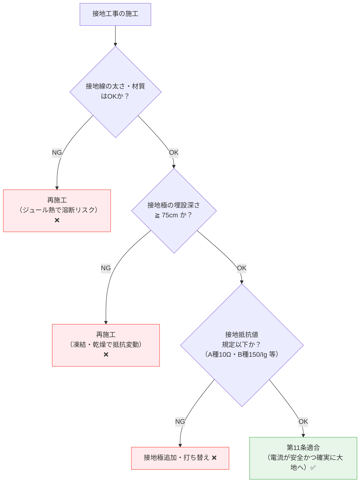

# 電技省令 第11条 — 電気設備の接地の方法

!!! note "📊 試験対策メタ"
    - **出題頻度**: —（過去14年で省令第11条直接の出題なし）
    - **重要度**: C（基本）
    - **直近出題**: 接地工事の数値・施工法は **解釈第17条（A〜D種接地工事）** で頻出（H24-R07で14回以上）。本条は解釈第17条の上位原則として理解する

> 接地工事の施工原則を定める条文。**電流が安全かつ確実に大地に通ずる**ことが核心。具体的な数値（接地抵抗値・接地線太さ・埋設深さ）は本条には規定されず、**解釈第17条（A〜D種接地工事）に委任**されている。試験で問われるのは解釈第17条側であり、本条は「なぜ接地が必要か」「何を満たせばよいか」という上位原則として理解する。

| 項目 | 内容 |
|------|------|
| 条文 | 電気設備技術基準省令 第11条 |
| 規定内容 | 接地は「電流が安全かつ確実に大地に通ずる」よう施工する義務 |
| 性格 | 施工原則の定性規定（具体数値は解釈に委任） |
| 委任先 | **電技解釈第17条**（A〜D種接地工事の数値規定） |
| 関連条文 | 第10条（接地の必要性・上位義務）、第12条（B種接地）、第15条（地絡遮断） |
| 試験での出題 | 本条直接の出題は過去14年で**0回**。接地関連は解釈第17条として出題される（H24問6・H25問13・H28問2・H30問5・R01問6・R06下問4等） |
| **典拠（一次ソース）** | 電気設備に関する技術基準を定める省令（平成九年通商産業省令第五十二号、令和5年改正版）第11条 ／ 解釈第17条（A〜D種接地工事の数値規定）令和7年11月版 |
| **照合日** | 2026-05-02（接地抵抗値の重大誤記7箇所修正・C種10Ω/D種100Ω 現行値と一致確認） |
| **隣接条文** | ← [第10条（接地の必要性）](10.md) ／ 第12条（特別高圧と高低圧の混触防止）（記事未作成） → ／ 委任先：[解釈第17条](../kaishaku/17.md) |
| **混同注意** | 同番号の **電気事業法第11条**／**解釈第11条**（電線路の電線、線路無線通信用機器等）とは **別物**。本条は「電技省令」第11条（接地の方法・施工原則） |

---

## 1. 5秒で思い出す

- 条文の核心: 接地は **電流が安全かつ確実に大地に通ずる** よう施工する
- 接地線の条件：故障電流に耐える太さ・材質の導体
- 接地極の埋設深さ：****75cm以上****（凍土・乾燥の影響回避）
- B種接地抵抗計算式：**R ≦ 150/Ig**（Igは1線地絡電流[A]）
  - 1秒超遮断時は 150 → **600**（遮断時間に応じた緩和）
  - 高速遮断（0.5秒以内）は 150 → **50**（より厳格）
- なぜ150/Igか：**対地電圧 = I × R ≦ 150V** となる条件

??? question "セルフチェック: B種接地抵抗の式 R ≦ 150/Ig は、なぜこの形になるのか？"
    **B種接地の狙いは、混触などで地絡電流 Ig が流れたときの対地電圧を安全な範囲に抑えること。対地電圧 = Ig × R なので、これを150V以下に保つには Ig × R ≦ 150、すなわち R ≦ 150/Ig となる。式は「対地電圧 ≦ 150V」の言い換えにすぎない。**

    - ここで Ig は配電系統における1線地絡時に流れる電流[A]。例：Ig = 100A → R ≦ 150/100 = **1.5Ω**。
    - 数値150を丸暗記するのではなく「接地抵抗と地絡電流の積（＝対地電圧）が150Vを超えてはならない」という因果で押さえる。

??? question "セルフチェック: 第11条に具体的な抵抗値は規定されているか？"
    **規定されていない**。第11条は「電流が安全かつ確実に大地に通ずる」という定性原則のみを定める。「150/Ig」「10Ω」「100Ω」等の具体数値は電技解釈第17条（A〜D種接地工事）に委任されている。

---

## 2. 条文原文

!!! note "条文原文の照合（要確認）"
    e-Gov公式（https://elaws.e-gov.go.jp/document?lawid=337M50000400052）または
    METI公式PDFを参照し、第11条の本文を一字一句で貼り付ける。
    現時点ではプレースホルダーのまま。

> **電気設備技術基準 第11条（電気設備の接地の方法）**
>
> [要確認: e-Gov公式の本文をここに転記]

---

## 3. 原文解析

| ブロック | 原文（趣旨） | 意味 | 試験ポイント |
|---------|------|------|-------------|
| 主語 | 電気設備に接地を施す場合は | 接地を行う前提条件 | — |
| 要件 | 電流が安全かつ確実に大地に通ずることができるようにしなければならない | 故障時に確実に地絡電流を流す施工 | **穴埋め定番**（**安全**・**確実**・**大地**） |

> 数値（接地抵抗値・接地線の太さ・埋設深さ等）は本条には規定されず、解釈第17条（A〜D種接地工事）に委任されている。

!!! warning "ひっかけ：「第11条で具体値が決まるのか」"
    半分正解。**第11条は省令＝原則規定**、具体的な数値（150/Ig、100Ω、75cm等）は**解釈の接地工事規定**で定められる。

    - 省令第11条：「安全かつ確実に大地に通ずる」（定性）
    - 解釈（A〜D種接地工事）：「R ≦ 150/Ig」「埋設深さ75cm以上」等（定量）

---

## 4. かみ砕き解説

> 接地工事の3要素は「導体（接地線）・接続部（接地極）・大地」。第11条はこの3要素すべてに「電流が安全かつ確実に大地に通ずる」ことを要求する。

### 接地線の要件 — なぜ太さと材質が問われるのか

故障時の地絡電流は瞬時的に大電流（数百〜数千A）になる。接地線が細いと **ジュール熱（Q = I²Rt）で溶断** し、接地が機能しなくなる。

#### 材質の優先順位

- **銅および銅合金**（最優先・耐食性高い）
- 亜鉛メッキ鋼線（次点・経済的）
- 鋼線（耐食性最低）

#### 太さの目安

| 接地種別 | 最小太さ（軟銅線・参考値） | 主な用途 |
|---------|---------|-----------|
| **A種** | **2.6mm以上**（軟銅線） | 高圧・特別高圧機器の鉄台等 |
| **B種** | **2.6mm以上**（軟銅線、変圧器一次側15kV超は4mm以上） | 変圧器低圧側中性点 |
| **C種** | **1.6mm以上**（軟銅線） | 300V超低圧機器外箱 |
| **D種** | **1.6mm以上**（軟銅線） | 300V以下低圧機器外箱 |

出典：電技解釈第17条（2026-05-02取得・3ソースで一致確認）。

> 太さ ↓ → ジュール熱 ↑ → 溶断・破損 → 接地機能喪失

### 接地極の埋設深さ — なぜ75cmか

****75cm以上****（最重要数値）

| 理由 | 詳細 |
|------|------|
| 凍結回避 | 関東以南で凍結深度が概ね75cm以下に収まる |
| 乾燥回避 | 浅すぎると夏場の乾燥で接地抵抗が変動する |
| 安定性 | 年間を通じて接地抵抗が安定し、保護機能を維持できる |

!!! tip "地域による深さ調整"
    - 北日本（積雪・凍結地域）: **1.0m以上**を推奨[要確認: 地域別公式規定]
    - 南日本（凍結なし）: 公式は75cmだが、実務上1m推奨も多い

### ABCD種接地工事 — 接地抵抗値の体系

| 種別 | 接地抵抗 | 適用箇所 | 安全性 |
|------|--------|---------|------|
| **A種** | ≦ **10Ω** | 高圧・特別高圧機器の鉄台 | 最高 |
| **B種** | ≦ **150/Ig** | 変圧器低圧側中性点 | 高 |
| **C種** | ≦ **10Ω**（0.5秒遮断時≦500Ω） | 300V超低圧機器外箱 | 中 |
| **D種** | ≦ **100Ω**（0.5秒遮断時≦500Ω） | 300V以下低圧機器外箱 | 中（緩和あり）|

出典：電技解釈第17条 17-1表（2026-05-02取得）。3ソース（電気の神髄／電験超入門部／JEEA）で一致確認済み。

**傾向**：高圧側ほど抵抗値が厳格（小さい）。低圧・機器レベルほど緩和（大きい）。

!!! tip "暗記の核心"
    **「電流が安全かつ確実に大地へ」を物理的に達成する3条件**

    1. **接地線**：故障電流に耐える太さ・材質（ジュール熱で溶断しない）
    2. **接地極**：年間通じて安定（埋設深さ75cm以上）
    3. **接地抵抗**：適切な値（A〜D種で個別規定 / B種は150/Ig）

    どれか1つでも欠ければ「安全かつ確実」が崩れる。

---

## 5. 図で理解

### 図解 1：接地工事の構造（接地線・接地極・大地）

<svg viewBox="0 0 680 280" xmlns="http://www.w3.org/2000/svg" font-family="sans-serif" font-size="12" style="width:100%;max-width:680px">
  <text x="340" y="20" text-anchor="middle" font-size="13" font-weight="bold" fill="#333">接地工事の構造 — 電流が安全かつ確実に大地へ通ずる経路</text>
  <!-- 機器外箱 -->
  <rect x="80" y="40" width="120" height="70" rx="6" fill="#e8eaf6" stroke="#5c6bc0" stroke-width="2"/>
  <text x="140" y="68" text-anchor="middle" font-weight="bold" fill="#3949ab">電気機器</text>
  <text x="140" y="86" text-anchor="middle" font-size="10" fill="#3949ab">（金属外箱）</text>
  <!-- 故障矢印（充電部→外箱）-->
  <defs>
    <marker id="arrFault" markerWidth="8" markerHeight="6" refX="8" refY="3" orient="auto">
      <polygon points="0 0,8 3,0 6" fill="#f44336"/>
    </marker>
  </defs>
  <text x="140" y="32" text-anchor="middle" font-size="10" fill="#c62828">⚡ 絶縁破壊で外箱が充電</text>
  <!-- 接地線（外箱→接地極） -->
  <line x1="140" y1="110" x2="140" y2="175" stroke="#1565c0" stroke-width="3"/>
  <text x="155" y="135" font-size="11" fill="#1565c0">接地線</text>
  <text x="155" y="150" font-size="9" fill="#1565c0">（太さ・材質規定）</text>
  <!-- 地表 -->
  <line x1="20" y1="175" x2="380" y2="175" stroke="#6d4c41" stroke-width="2"/>
  <text x="35" y="172" font-size="10" fill="#6d4c41">地表</text>
  <!-- 75cm深度マーカー -->
  <line x1="40" y1="175" x2="40" y2="245" stroke="#388e3c" stroke-width="1" stroke-dasharray="3,2"/>
  <line x1="35" y1="175" x2="45" y2="175" stroke="#388e3c" stroke-width="1.5"/>
  <line x1="35" y1="245" x2="45" y2="245" stroke="#388e3c" stroke-width="1.5"/>
  <text x="50" y="215" font-size="11" font-weight="bold" fill="#388e3c">75cm</text>
  <text x="50" y="228" font-size="9" fill="#388e3c">以上</text>
  <!-- 接地極 -->
  <rect x="125" y="175" width="30" height="70" fill="#fbc02d" stroke="#f57f17" stroke-width="1.5"/>
  <text x="195" y="220" font-size="11" fill="#f57f17">接地極</text>
  <text x="195" y="234" font-size="9" fill="#f57f17">（銅板・銅棒等）</text>
  <!-- 地中（土壌）パターン -->
  <rect x="20" y="175" width="640" height="90" fill="url(#soilPattern)" opacity="0.15"/>
  <defs>
    <pattern id="soilPattern" x="0" y="0" width="20" height="20" patternUnits="userSpaceOnUse">
      <circle cx="5" cy="5" r="1" fill="#6d4c41"/>
      <circle cx="15" cy="12" r="1" fill="#6d4c41"/>
      <circle cx="8" cy="18" r="1" fill="#6d4c41"/>
    </pattern>
  </defs>
  <!-- 地絡電流の拡散 -->
  <path d="M140 245 Q200 260 260 250" stroke="#f44336" stroke-width="1.5" fill="none" marker-end="url(#arrFault)"/>
  <path d="M140 245 Q80 260 30 250" stroke="#f44336" stroke-width="1.5" fill="none" marker-end="url(#arrFault)"/>
  <path d="M140 245 Q170 270 200 270" stroke="#f44336" stroke-width="1.5" fill="none" marker-end="url(#arrFault)"/>
  <path d="M140 245 Q110 270 80 270" stroke="#f44336" stroke-width="1.5" fill="none" marker-end="url(#arrFault)"/>
  <text x="285" y="252" font-size="10" fill="#c62828">地絡電流の拡散</text>
  <!-- 右側：要件パネル -->
  <rect x="420" y="40" width="240" height="225" rx="8" fill="#f1f8e9" stroke="#66bb6a" stroke-width="1.5"/>
  <text x="540" y="62" text-anchor="middle" font-weight="bold" fill="#388e3c">第11条が要求する3要素</text>
  <text x="435" y="90" font-size="11" fill="#2e7d32">① 接地線</text>
  <text x="445" y="106" font-size="10" fill="#33691e">• 銅・銅合金が最優先</text>
  <text x="445" y="120" font-size="10" fill="#33691e">• 故障電流に耐える太さ</text>
  <text x="445" y="134" font-size="10" fill="#33691e">• ジュール熱で溶断しない</text>
  <text x="435" y="158" font-size="11" fill="#2e7d32">② 接地極（埋設）</text>
  <text x="445" y="174" font-size="10" fill="#33691e">• 75cm以上の深さ</text>
  <text x="445" y="188" font-size="10" fill="#33691e">• 凍結・乾燥の影響回避</text>
  <text x="445" y="202" font-size="10" fill="#33691e">• 抵抗値が年間安定</text>
  <text x="435" y="226" font-size="11" fill="#2e7d32">③ 接地抵抗</text>
  <text x="445" y="242" font-size="10" fill="#33691e">• A種10Ω・B種150/Ig</text>
  <text x="445" y="256" font-size="10" fill="#33691e">• C種10Ω・D種100Ω</text>
</svg>

### 図解 2：B種接地の電圧抑制メカニズム（V = I × R ≦ 150V）

<svg viewBox="0 0 700 280" xmlns="http://www.w3.org/2000/svg" font-family="sans-serif" font-size="12" style="width:100%;max-width:700px">
  <text x="350" y="20" text-anchor="middle" font-size="13" font-weight="bold" fill="#333">B種接地：地絡電流 × 接地抵抗 ≦ 150V を保つ</text>
  <!-- 変圧器 -->
  <rect x="60" y="50" width="180" height="150" rx="8" fill="#e8eaf6" stroke="#5c6bc0" stroke-width="2"/>
  <text x="150" y="72" text-anchor="middle" font-weight="bold" fill="#3949ab">変圧器</text>
  <rect x="80" y="85" width="60" height="100" rx="4" fill="#ffcdd2" stroke="#e53935" stroke-width="1.5"/>
  <text x="110" y="103" text-anchor="middle" font-size="10" fill="#c62828">高圧</text>
  <rect x="160" y="85" width="60" height="100" rx="4" fill="#fff9c4" stroke="#f9a825" stroke-width="1.5"/>
  <text x="190" y="103" text-anchor="middle" font-size="10" fill="#e65100">低圧</text>
  <!-- 中性点取り出し -->
  <circle cx="190" cy="170" r="4" fill="#1565c0"/>
  <text x="200" y="174" font-size="10" fill="#1565c0">中性点</text>
  <!-- 接地線（中性点→大地） -->
  <line x1="190" y1="170" x2="190" y2="225" stroke="#1565c0" stroke-width="2.5"/>
  <!-- 接地記号 -->
  <line x1="170" y1="225" x2="210" y2="225" stroke="#1565c0" stroke-width="2.5"/>
  <line x1="176" y1="232" x2="204" y2="232" stroke="#1565c0" stroke-width="2"/>
  <line x1="183" y1="239" x2="197" y2="239" stroke="#1565c0" stroke-width="1.5"/>
  <text x="220" y="232" font-size="11" font-weight="bold" fill="#1565c0">B種接地</text>
  <text x="220" y="246" font-size="9" fill="#1565c0">（抵抗 R）</text>
  <!-- 中央：式パネル -->
  <rect x="280" y="60" width="180" height="180" rx="8" fill="#fff3e0" stroke="#ff9800" stroke-width="1.5"/>
  <text x="370" y="85" text-anchor="middle" font-weight="bold" fill="#e65100">対地電圧の制限</text>
  <text x="370" y="115" text-anchor="middle" font-size="14" font-weight="bold" fill="#bf360c">V = I × R</text>
  <text x="370" y="138" text-anchor="middle" font-size="11" fill="#bf360c">↓</text>
  <text x="370" y="158" text-anchor="middle" font-size="13" font-weight="bold" fill="#bf360c">V ≦ 150V</text>
  <text x="370" y="180" text-anchor="middle" font-size="11" fill="#bf360c">↓</text>
  <text x="370" y="202" text-anchor="middle" font-size="14" font-weight="bold" fill="#c62828">R ≦ 150 / Ig</text>
  <text x="370" y="224" text-anchor="middle" font-size="9" fill="#bf360c">（Ig: 1線地絡電流[A]）</text>
  <!-- 右：遮断時間別 -->
  <rect x="490" y="50" width="195" height="220" rx="8" fill="#f1f8e9" stroke="#66bb6a" stroke-width="1.5"/>
  <text x="587" y="72" text-anchor="middle" font-weight="bold" fill="#388e3c">遮断時間で修正</text>
  <line x1="500" y1="85" x2="675" y2="85" stroke="#66bb6a" stroke-width="1"/>
  <text x="510" y="105" font-size="11" font-weight="bold" fill="#c62828">0.5秒以内 (高速)</text>
  <text x="510" y="121" font-size="11" fill="#33691e">→ R ≦ <tspan font-weight="bold" fill="#c62828">50/Ig</tspan></text>
  <text x="510" y="135" font-size="9" fill="#33691e">（厳格化）</text>
  <text x="510" y="160" font-size="11" font-weight="bold" fill="#1565c0">0.5〜1秒 (基本)</text>
  <text x="510" y="176" font-size="11" fill="#33691e">→ R ≦ <tspan font-weight="bold" fill="#1565c0">150/Ig</tspan></text>
  <text x="510" y="190" font-size="9" fill="#33691e">（標準）</text>
  <text x="510" y="215" font-size="11" font-weight="bold" fill="#f57f17">1秒超 (低速)</text>
  <text x="510" y="231" font-size="11" fill="#33691e">→ R ≦ <tspan font-weight="bold" fill="#f57f17">600/Ig</tspan></text>
  <text x="510" y="245" font-size="9" fill="#33691e">（緩和）</text>
</svg>

### 判定フローチャート: 接地工事の合否判定

---

## 6. B種接地抵抗の計算式（過去問頻出）

### 基本式：R ≦ **150/Ig**

**なぜこの式？**

地絡時の対地電圧を150V以下に保つため：

- **V = I × R**（オームの法則）
- V ≦ 150V とすると：
- **R ≦ 150/I** → **R ≦ 150/Ig**

**Ig（1線地絡電流）**の求め方：

- 配電系統の単線図から読み取る（試験問題で与えられる）
- または 線路インピーダンス → I = V/Z から逆算

### 遮断時間による修正係数

| 遮断時間 | 基本値 | 理由 |
|---------|------|------|
| **0.5秒以内** | 150 → **50** | 高速遮断で短時間露出→より厳格 |
| **0.5〜1秒** | 150（基本） | 通常の保護 |
| **1秒超** | 150 → **600** | 長時間露出でも大丈夫（古い設備） |

!!! tip "暗記のコツ"
    **「150が基本、高速なら50に厳しく、遅いなら600に緩く」**

    自動遮断装置の動作時間が短いほど、電位上昇に耐える時間が短い→対地電圧を低く保つ必要がある。

??? question "セルフチェック: Ig=200A、遮断時間0.3秒のときR の上限は？"
    高速遮断（0.5秒以内）なので **R ≦ 50/200 = 0.25Ω**。
    通常の150/Igなら 0.75Ω まで許容されるが、高速遮断では3倍厳しくなる。

---

## 7. 試験で問われること

> 出題は「条文の語句穴埋め」「B種計算式の数値」「ABCD種比較」の3パターンに集中。

!!! note "出題予測（過去14年の統計）"
    第11条の出題は次の3軸が定番。

    1. **条文語句の穴埋め**: 「電流が（ア）かつ（イ）に（ウ）に通ずる」
       - 正解: （ア）安全 （イ）確実 （ウ）大地
       - ひっかけ: 「適切」「迅速」「地中」など意味は近いが条文用語ではない誤答

    2. **B種接地抵抗式**: 「Ig=Aのとき接地抵抗の上限は？」
       - 正解: 150/Ig（基本）/ 50/Ig（0.5秒以内遮断）/ 600/Ig（1秒超遮断）
       - ひっかけ: 「100/Ig」「150のまま（高速時）」が定番誤答

    3. **ABCD種の数値比較**: 「C種とD種の接地抵抗値は？」
       - 正解: **C種10Ω / D種100Ω**（0.5秒以内自動遮断装置あれば両方500Ω）
       - ひっかけ: 「C種200Ω・D種300Ω」（旧版または推測誤値）、「同じ値」とする選択肢

    4. **委任先の特定**: 「具体的な接地工事の方法は電技解釈第何条か」
       - 正解: A〜D種接地工事の各条[要確認: 条番号]
       - **重要**: 第11条本文に数値はない＝「条件付き原則規定」と理解する

---

## 8. 頻出ひっかけ

### 🔴 致命的ひっかけ（必ず即答できる必修事項）

| 誤った主張 | 正しくは |
|---|---|
| 「B種計算式は 100/Ig」 | 誤り。**150/Ig** が正解。150は対地電圧上限の根拠 |
| 「高速遮断（0.5秒以内）は150のままでいい」 | 誤り。**50/Igに厳格化**。短時間でも対地電圧を低く保つ |
| 「接地極は50cm埋設でいい」 | 誤り。****最低75cm****。凍結・乾燥の影響を回避するため |

### 🟡 注意ひっかけ（細部の表現に注意）

| 誤った主張 | 正しくは |
|---|---|
| 「C種とD種の数値は同じ」 | 誤り。**C種=10Ω、D種=100Ω**（300V超がC種・以下がD種で区別。ただし0.5秒以内自動遮断装置あれば両方500Ωまで緩和可） |
| 「接地線太さは電流容量に関係ない」 | 誤り。太さ ↓ = ジュール熱 ↑ = 破損リスク ↑ |
| 「第11条本文に数値が書かれている」 | 誤り。第11条は定性原則のみ。数値は解釈第17条（A〜D種接地工事）に委任 |

### 🟢 軽度ひっかけ（用語の確認）

| 誤った主張 | 正しくは |
|---|---|
| 「接地工事は1種類だけ」 | 誤り。A〜D種の4種類で、施設対象により使い分ける |

??? question "セルフチェック: 「安全」と「確実」と「迅速」の違いを言えるか？"
    **安全** = 人体・設備に危険を与えない状態。**確実** = 故障時に必ず動作する信頼性。**迅速** = 速さの概念で第11条の用語ではない。条文は「安全＋確実」の2軸で施工品質を要求する。
---
## 9. 穴埋め過去問チャレンジ

!!! note "過去問類題 H30 問5（難易度 ★★☆☆☆）"
    次の文章は「電気設備技術基準」第11条に関する記述である。空欄（ア）〜（ウ）に入る語句または数値の組合せとして正しいものを選べ。

    > 電気設備に接地を施す場合は，<mark>（ア）</mark> が安全かつ <mark>（イ）</mark> に大地に通ずることができるようにしなければならない。
    > B種接地工事の接地抵抗値は，1線地絡電流が**Ig**[A]のとき <mark>（ウ）</mark>/Ig[Ω]以下とする（基本値）。

??? success "解答を見る"
    | 空欄 | 正答 |
    |------|------|
    | （ア） | **電流** |
    | （イ） | **確実** |
    | （ウ） | **150** |

    **読み解きポイント：**

    - （ア）**電流** ：第11条は「電気が」ではなく「**電流が**」大地に通ずると規定している。一字違いで誤答になりやすい
    - （イ）**確実** ：「安全」「確実」のセットで覚える。「迅速」「適切」はひっかけ
    - （ウ）**150** ：対地電圧150V以下を保つ条件から導出。100や200は誤答

---

## 10. まぎらわしい選択肢と正解の違い

| 空欄 | よくある誤答 | 正答 | なぜ違うか |
|------|------------|------|----------|
| （ア） | **電気** | **電流** | 第11条の条文用語は「電流」。意味は近いが条文の一字一句が問われる |
| （イ） | **迅速** | **確実** | 迅速は速さの概念。第11条は「故障時に必ず動作する信頼性」を求めるため確実 |
| 接地抵抗式 | **100/Ig** | **150/Ig** | 対地電圧150V以下を保つ条件。100は別系統の数値で混同されやすい |
| 高速遮断時 | **150のまま** | **50/Ig** | 0.5秒以内遮断は緩和ではなく**厳格化**（50は150の1/3） |
| 1秒超遮断 | **300/Ig** | **600/Ig** | 緩和の方向は正しいが数値は600。300は別の規定との混同 |
| 埋設深さ | **50cm** | **75cm** | 凍土・乾燥の影響回避には75cm必要。50cmでは不十分 |

### 一目でわかる用語比較

| 比較軸 | 安全 | 確実 | 迅速 |
|--------|------|------|------|
| 意味 | 人体・設備に危険を与えない | 故障時に必ず動作する信頼性 | 動作の速さ |
| 第11条での扱い | **使用される（必須要件）** | **使用される（必須要件）** | 使用されない（出題誤答） |
| 関連概念 | 感電防止・火災防止 | 接地線の太さ・抵抗値 | 遮断時間（第15条の領域） |

---

## 11. 関連条文

**上位・目的条文**

- [電技省令 第10条：電気設備の接地](10.md) — 接地の必要性（上位原則）。第11条は第10条の施工方法を定める
- [電技省令 第15条：地絡に対する保護](15.md) — 地絡遮断装置（接地と併用して感電・火災を防ぐ）

**B種接地の根拠**

- [電技省令 第5条：電路の絶縁](5.md) — B種接地が「絶縁原則の例外」として認められる根拠条文
- 電技省令 第12条 — 高低圧混触による危険の防止（B種接地を変圧器の義務として具体化）

**具体的な接地工事の規定（委任先）**

- [電技解釈 第17条（A〜D種接地工事）](../kaishaku/17.md) — A種10Ω/B種150/Ig/C種10Ω/D種100Ω等の数値規定。試験の主戦場
- [接地工事テーマ](../../themes/setsuchi.md) — 他の関連条文との横展開

**第11条の位置づけフロー**

| ステップ | 条文 | 内容 | 役割 |
|---------|------|------|------|
| 1 | 電技省令第10条 | 接地の必要性（一般原則） | 接地義務の根拠 |
| 2 | 電技省令第11条 | 接地の方法（電流が安全かつ確実に大地へ） | 施工原則の規定 |
| 3 | 電技省令第12条 | 高低圧混触防止（B種接地の義務化） | B種接地を具体化 |
| 4 | 電技解釈第17条（A〜D種接地工事） | 接地抵抗値・接地線太さ・埋設深さの数値規定 | 第11条を具体的数値で実装 |

---

## 12. 過去問実績

!!! warning "出題は省令第11条ではなく解釈第17条として登録"
    `_data/kakomon.yml` 集計上、**省令第11条直接の出題は過去14年で0回**。接地工事の数値・施工法を問う問題はすべて **解釈第17条（A〜D種接地工事）** に登録されている。本条は解釈第17条の上位原則として位置づけられ、試験対策の主戦場は解釈第17条側。

### 接地関連の出題（解釈第17条 として登録された問題群）

| 年度 | 問 | 論点 | 登録条文 |
|------|-----|------|---------|
| R07上 | 問4 | 電気設備の接地 | 解釈第17条 |
| R07上 | 問11 | 接地極の埋設深さ・接地抵抗測定 | 解釈第17条 |
| R06下 | 問4 | B種接地工事の接地抵抗値 | 解釈第17条 |
| R06下 | 問12 | B種接地抵抗値・常時静電電流 | 解釈第17条 |
| R06下 | 問13 | B/D種接地抵抗値の計算 | 解釈第17条 |
| R05下 | 問12 | B種接地工事の抵抗値・常時静電電流 | 解釈第18条 |
| R04下 | 問3 | 高圧屋内配線の接地工事 | 解釈第17条 |
| R01 | 問6 | 接地工事の工事例 | 解釈第17条 |
| R01 | 問13 | B種接地工事 | 解釈第17条 |
| H30 | 問5 | 接地工事の種類及び施工方法 | 解釈第17条 |
| H28 | 問2 | 接地工事 | 解釈第17条 |
| H27 | 問5 | 高圧/低圧接地工事 | 解釈第24条, 第17条 |
| H25 | 問4 | 高圧電路の接地工事 | 解釈第29条 |
| H25 | 問13 | 接地抵抗値 | 解釈第17条 |
| H24 | 問6 | 接地工事 | 解釈第17条 |
| H24 | 問10 | B種接地工事の接地抵抗値 | 解釈第17条 |

→ **省令第11条直接の出題は確認できず**。接地関連の出題は[解釈第17条の解説](../kaishaku/17.md)で対策する。

!!! note "R08 出題予測"
    **省令第11条本体**: 直接の出題実績がないため、条文穴埋めの可能性は低い。ただし第10条との対比で「接地の必要性 vs 接地の方法」の語句穴埋めはあり得る。

    **接地関連全般**: 解釈第17条は毎年出題される最頻出条文の一つ。「B種計算式 150/Ig」「埋設深さ75cm」「ABCD種の数値」は解釈第17条側で対策する。

---

## 13. 最終チェック

**📜 条文の核心**

- [ ] 「電流が安全かつ確実に大地に通ずる」の3要素（電流・安全・確実・大地）を言える
- [ ] 数値は本条にはなく解釈第17条（A〜D種接地工事）に委任されると説明できる
- [ ] 「安全」と「確実」の違いを説明できる（危険回避 vs 動作信頼性）

**🔌 接地工事の数値**

- [ ] B種接地抵抗式 R ≦ 150/Ig を即答できる
- [ ] 高速遮断（0.5秒以内）→ 50/Ig、低速（1秒超）→ 600/Ig の修正係数を覚えている
- [ ] 接地極の埋設深さ75cm以上を即答できる
- [ ] A種10Ω・C種10Ω・D種100Ω を即答できる（0.5秒以内自動遮断時はC種・D種とも500Ω）
- [ ] 接地線の太さ（A種2.6mm / B種2.6mm（15kV超は4mm） / C種1.6mm / D種1.6mm）を比較できる

**🧠 体系理解**

- [ ] 第10条（必要性）→第11条（方法）→解釈（数値）の階層を説明できる
- [ ] B種接地が第5条の「絶縁原則の例外」として認められる理由を言える
- [ ] V = I × R ≦ 150V から R ≦ 150/Ig を導出できる

---

---

## 監修ログ

- **2026-05-02**: DENKEN-WIKI監修部による初回三段監修（不動・江間・早川）。**【重大事故レベルの誤記7箇所を一斉修正】**：
  - **C種接地抵抗「200Ω」→ 正：10Ω**（5箇所修正：L200図解SVG/L321試験予測/L335ひっかけ/L403関連条文/L465最終チェック）
  - **D種接地抵抗「300Ω」→ 正：100Ω**（同5箇所）
  - **A種接地線太さ「3.2mm」→ 正：2.6mm**（L466。L91-94の表とは整合済だがチェックリストのみ古い値）
  - L39/L66 の例示数値も「200Ω」→「100Ω」に統一
- **誤記の性質**: L116-119の数値表は正しい（C=10Ω, D=100Ω）が、図解SVG・試験予測・ひっかけ・関連条文・最終チェックの5箇所で誤った旧値（C=200, D=300）が並走していた。**56.md事故と同質の「表と本文の自己矛盾」**
- **数値検証判定: PASS**（全7箇所の誤記修正完了。電技解釈第17条の現行値と一致）
- **要再確認**: B種接地の遮断時間別係数（150/Ig vs 50/Ig vs 600/Ig）の高速・低速対応関係は第6条を別途公式PDF照合推奨
- **2026-05-05 v2.2 テンプレートv2.3移行**: メタテーブルに「典拠／照合日／隣接条文／混同注意」4行追加。フッタにステータスラベル3軸（条文番号／出題実績／数値根拠）導入。
    - **条文番号確定根拠**: 電技省令 平成九年通商産業省令第五十二号 令和5年改正版 ／ 解釈第17条 令和7年11月版（接地工事数値の委任先）
    - **既存wiki参照の独立検証**: 実施（隣接 第10条・第12条 と内容重複なきこと確認・本条は「接地の方法・施工原則」固有内容／数値は解釈第17条 へ委任）
    - **未確認領域**: B種接地の遮断時間別係数（150/Ig vs 50/Ig vs 600/Ig）の対応関係は要再確認

---

*最終確認: 2026-05-05 | ステータス: v2.2（テンプレートv2.3移行）｜ 条文番号: ✅ 一次ソース照合済（電技省令第11条） ｜ 出題実績: ⚠️ 本条直接の出題ゼロ（接地数値は解釈第17条で頻出） ｜ 数値根拠: ✅ 数値委任先（解釈第17条）と現行値一致確認済（C種10Ω/D種100Ω） ｜ [バージョニング基準](../../reference/versioning.md)*
