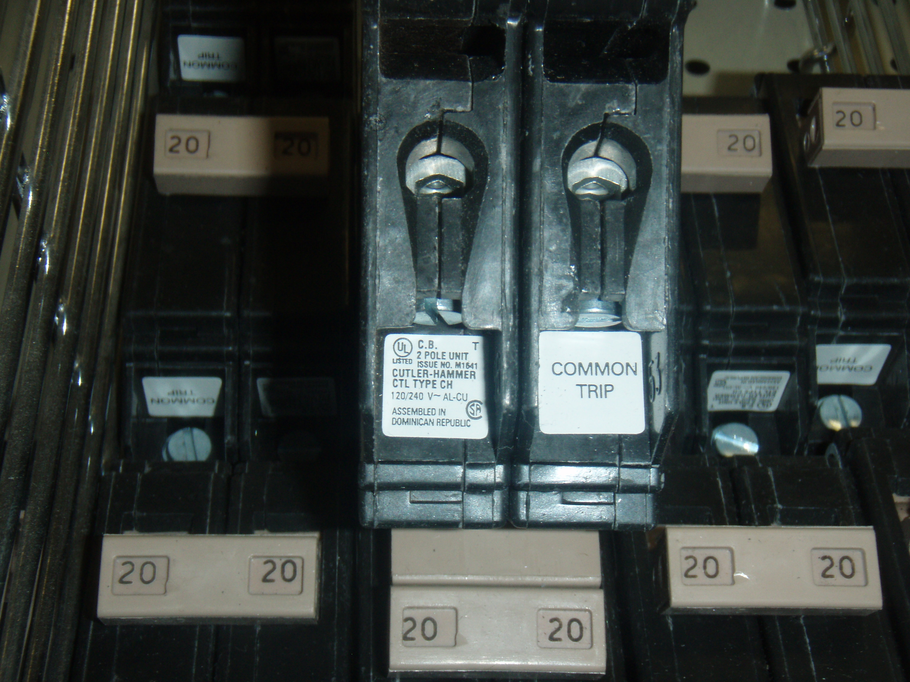
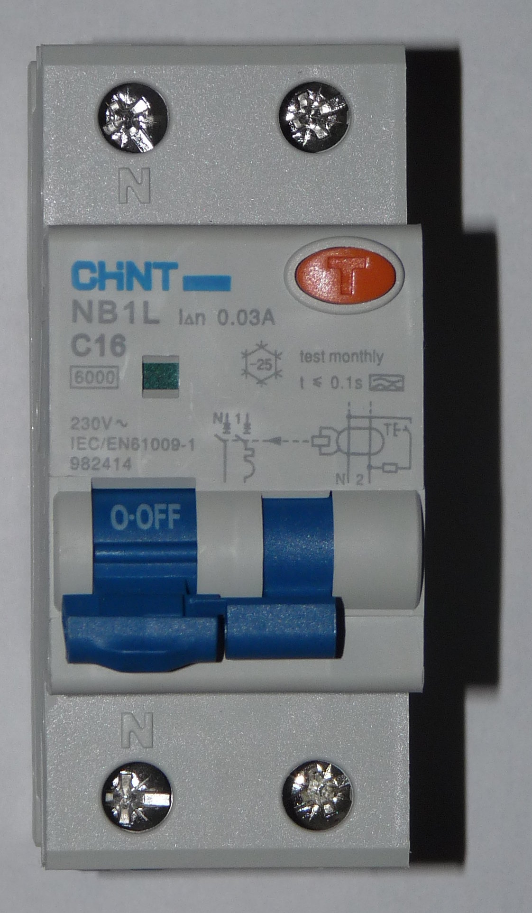
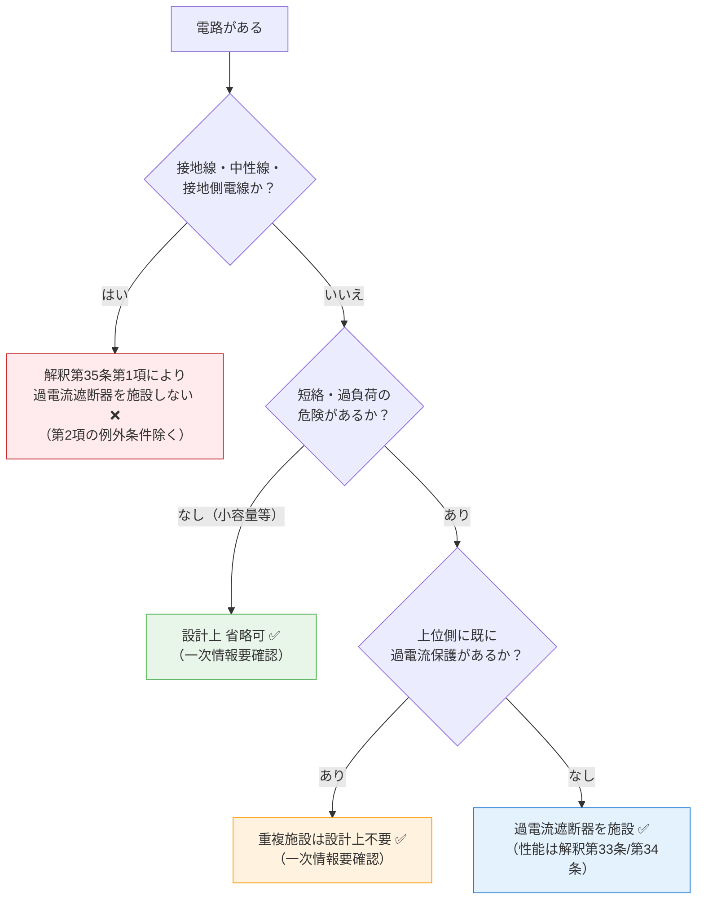

# 電技省令 第14条 — 過電流からの電線及び電気機械器具の保護対策

!!! note "📊 試験対策メタ"
    - **出題頻度**: 🔥 ★☆☆☆☆（過去14年で 1 回出題）
    - **重要度**: B（重要）
    - **直近出題**: R05上 問3（穴埋・H13 問1 の再出題。H30 問4 は第63〜66条の工事例論説＝関連参照のみ）

!!! tip "🎯 これだけ覚える"
    **最重要暗記（R05上 問3 実空欄）：電路・過熱焼損・火災**

    **条文の核心**：電路の必要な箇所に、過電流遮断器を施設する。目的は **電線・電気機械器具の保護** と **火災防止**。

    **混同注意**：

    - 第14条 = **過電流**保護 ／ 第15条 = **地絡**保護
    - **OCR 単体は遮断器ではない**。CB（遮断器）と組み合わせて遮断機能を構成する
    - 解釈の委任先は **第33条（低圧）／第34条（高圧・特別高圧）／第35条（施設しない箇所＝例外）** の3条セット

| 項目 | 内容 |
|------|------|
| 条文 | 電気設備技術基準 第14条 |
| 規定内容 | 必要な箇所への過電流遮断器の施設義務 |
| 性格 | 保護設計の原則規定（具体的施設要件は解釈に委任） |
| 委任先 | 解釈第33条（低圧）／第34条（高圧・特別高圧）／第35条（施設しない箇所） |
| **典拠（一次ソース）** | 電気設備に関する技術基準を定める省令（平成九年通商産業省令第五十二号、令和5年改正版）第14条 |
| **照合日** | 2026-05-09（条文本文・解釈第33〜35条・R05上 問3 実空欄を一次照合済） |
| **隣接条文** | ← 第13条（高圧又は特別高圧の機械器具の施設）（記事未作成） ／ [第15条（地絡に対する保護対策）](15.md) → ／ 委任先：解釈第33条・第34条・第35条 |
| **混同注意** | 同番号の **電気事業法第14条**／**解釈第14条**（低圧電路の絶縁性能）とは **別物**。本条は「電技省令」第14条（過電流保護） |

---

## 1. 5秒で思い出す

- 過電流 = **短絡電流 + 過負荷電流**（地絡は別。第15条が担当）
- 目的：電線の溶断・機器の焼損・**火災**防止
- 過電流遮断器：**ヒューズ・配線用遮断器（MCCB）・気中遮断器（ACB）** など（OCR は検出器であり遮断器ではない・セクション4 参照）
- 設置義務：**「必要な箇所」**。**接地線・中性線・接地側電線** には施設しない（解釈第35条）
- 上位原則→具体規定：第14条（省令）が原則／**解釈第33条（低圧）／第34条（高圧・特別高圧）／第35条（施設しない箇所）** の3条で具体化

??? question "セルフチェック: 第14条「必要な箇所」とは具体的に何か？"
    短絡電流・過負荷電流の危険性がある電路。ただし「短絡の危険がない電路」（短時間運用の小容量回路等）や「上位側に既に過電流保護がある電路」は例外として設置不要。試験では「すべての電路に必須」という選択肢が罠。

??? question "セルフチェック: 第14条と第15条の対象範囲はどう違うか？"
    第14条は**過電流**（短絡・過負荷）が対象。第15条は**地絡**（電路から大地への漏れ電流）が対象。両方とも保護対象は電線・機器だが、現象が異なるため装置も異なる（第14条→ヒューズ・MCCB・ACB 等の **過電流遮断器**＋OCR/サーマルリレー等の **検出器**、第15条→ELCB 等の地絡遮断器）。

---

## 2. 条文原文

**電気設備に関する技術基準を定める省令 第14条（過電流からの電線及び電気機械器具の保護対策）**

> <mark>電路</mark>の必要な箇所には、過電流による<mark>過熱焼損</mark>から電線及び電気機械器具を保護し、かつ、<mark>火災</mark>の発生を防止できるよう、過電流遮断器を施設しなければならない。

> <small>黄色マーカー = 過去問で穴埋め出題された語句（R05上 問3 で出題された3語セット）</small>

### 過去問で問われた箇所

第14条は過去14年で計1回出題（R05上 問3 = 穴埋・H13 問1 の再出題。H30 問4 は第63〜66条の工事例論説で、本条は上位原則として参照されるのみ）。R05上 問3 で実際に空欄になったのは以下の3語。

| 出題で狙われるキーワード | 過去問での扱い |
|---|---|
| **電路** | 適用範囲の穴埋め（「電線」と混同しない） |
| **過熱焼損** | 危害現象の穴埋め（過熱**焼損** とセットで覚える） |
| **火災** | 副次目的の穴埋め（過熱→火災の連鎖防止） |

!!! warning "なぜ「過電流」「過電流遮断器」は穴埋にされないか"
    両語とも問題文タイトル「**過電流**からの電線及び電気機械器具の保護対策」と条文末尾「**過電流遮断器**を施設しなければならない」に既出のため、穴埋め対象から外される（既出語は穴埋にしない作問の定石）。試験では「条文中で既出していない語」が問われやすい点に注意。

!!! note "出典"
    電気設備に関する技術基準を定める省令（平成九年通商産業省令第五十二号、令和5年改正版）第14条 — 具体的施設要件は本省令の委任により電技解釈第33条（低圧）・第34条（高圧・特別高圧）・第35条（施設しない箇所）に定める。

---

## 3. 原文解析

| ブロック | 原文 | 意味 | 試験ポイント |
|---------|------|------|-------------|
| 適用範囲 | 電路の必要な箇所には | 全電路ではなく「必要な箇所」 | **穴埋め（ア）= 電路** ／「すべての電路」は誤り |
| 危害種別 | 過電流による過熱焼損から | 短絡＋過負荷の両方 | **穴埋め（イ）= 過熱焼損** ／ 地絡（第15条）と区別 |
| 保護対象 | 電線及び電気機械器具を保護し | ハードウェア全般 | 感電（人）は第5・10条が担当 |
| 副次目的 | かつ、火災の発生を防止できるよう | 過熱→火災の連鎖を断つ | **穴埋め（ウ）= 火災** |
| 措置 | 過電流遮断器を施設しなければならない | ヒューズ・配線用遮断器（MCCB）・気中遮断器（ACB）等の総称（OCR は検出器であり遮断器ではない） | タイトル＆末尾に既出のため穴埋対象外 |

!!! tip "穴埋めの覚え方"
    「（電路）の必要な箇所には〜過電流による（過熱焼損）から〜（火災）の発生を防止〜」
    → **電路・過熱焼損・火災** の3語セット（R05上 問3 実出題）。
    電線（適用範囲のひっかけ）・地絡（過電流のひっかけ・第15条）・感電（火災のひっかけ・第5条）はすべてダミー選択肢になる。

---

## 4. かみ砕き解説

> 過電流は「電流値×継続時間」の2軸で考える。短絡＝大電流・短時間、過負荷＝中電流・長時間。両者で対策装置と検出原理が変わる。

### 過電流の2つの型と対策

!!! warning "短絡 vs 地絡 の混同に注意"
    - **短絡** = 線間・相間など、**異電位導体間** が低抵抗でつながる事故（**第14条** = 過電流保護の対象）
    - **地絡** = 電路から **大地** へ電流が漏れる事故（**第15条** = 地絡保護の対象）

    「対地」という単語を短絡の主説明に入れると地絡と混同するため、本記事では短絡＝**異電位導体間** の低抵抗接触で統一する。

#### 1. 短絡電流（ショート） — 異電位導体間の低抵抗接触

| 特性 | 値 |
|------|-----|
| 発生原因 | 絶縁破壊、配線の接触不良、誤配線（**異電位導体間** が低抵抗で接続される） |
| 電流値 | **非常に大きい**（事故点インピーダンスが小さく定格の数十〜数百倍） |
| 継続時間 | ミリ秒単位（短い） |
| 熱的危険 | **ジュール熱 Q = I²Rt → 電線・機器焼損** |
| 磁気危険 | 大電流による磁気力 → 機器破損 |
| 対策 | ヒューズ（瞬時溶断）、MCCB（磁気トリップ） |

#### 2. 過負荷電流 — 定格を超えるが短絡ほど大きくない持続的な過電流

| 特性 | 値 |
|------|-----|
| 発生原因 | 電動機のロック、過負荷接続、接触不良 |
| 電流値 | **定格を超えるが短絡ほど大きくない**（事故点インピーダンスが大きい・典型的に定格の数倍程度） |
| 継続時間 | **秒単位〜分単位（持続的）** |
| 熱的危険 | ジュール熱 → 絶縁劣化 → 焼損・地絡へ進展 |
| 対策 | サーマルリレー（電動機）、熱動型MCCB、ヒューズ（時間電流特性で対応） |
| 遮断条件 | 電流値×継続時間の積で判定（I²t特性） |

!!! tip "短絡と過負荷の違い（定性的イメージ）"
    - **短絡**: 一瞬で電線が焼ける → 瞬時遮断が必要
    - **過負荷**: ゆっくり加熱 → 時限特性で温度上昇を確認してから切る

### 過電流保護に用いる装置（遮断器系 + 検出器系）

> ⚠️ **重要な区別**：法令上の「**過電流遮断器**」は **検出+遮断機能を持つ装置**（ヒューズ・配線用遮断器 MCCB・気中遮断器 ACB 等）を指す。**OCR・サーマルリレーは検出器（保護リレー）** であり、**単独では遮断器ではない**。CB（遮断器）と組み合わせて初めて「過電流保護システム」を構成する。

!!! warning "📷 もうひとつの混同罠 — 配線用遮断器（MCCB）と漏電遮断器（ELB）"
    第14条の対象は **過電流保護（MCCB）** であって、**地絡保護（ELB）ではない**（地絡保護は省令第15条）。両者は形状が似ており、受験生が混同しやすい：
    
    

      <figure markdown style="flex:1; min-width:280px; max-width:380px;">
        { width="320" loading="lazy" }
        <figcaption><strong>配線用遮断器（MCCB）</strong> — 過電流（短絡・過負荷）を検出して遮断。本条（省令第14条）の主役。テストボタン<strong>なし</strong>。画像: <a href="https://commons.wikimedia.org/wiki/File:Cutler-Hammer_TWO_pole_CTL_Circuit_Breaker_LARGE.JPG" target="_blank" rel="noopener">Cutler-Hammer TWO pole CTL Circuit Breaker</a>（LP-mn, Public Domain）</figcaption>
      </figure>
      <figure markdown style="flex:1; min-width:280px; max-width:380px;">
        { width="320" loading="lazy" }
        <figcaption><strong>漏電遮断器（ELB／RCD）</strong> — 地絡（漏電）を検出して遮断。<strong>省令第15条</strong>の主役。本体に <strong>「TEST」ボタン</strong> がある点が外観上の最大の識別点。画像: <a href="https://commons.wikimedia.org/wiki/File:Differential_residual_current_circuit_interrupter.JPG" target="_blank" rel="noopener">Differential residual current circuit interrupter</a> / <a href="https://creativecommons.org/licenses/by-sa/3.0/" target="_blank" rel="noopener">CC BY-SA 3.0</a>（Dmitry G, 無改変・引用）</figcaption>
      </figure>
    

    
    **識別の核心**:
    
    - **テストボタンの有無** — ELB には漏電動作試験用の「TEST」ボタンが必ずある（電気用品安全法による）。MCCB には原則ない
    - **動作原理の違い** — MCCB = **過電流**（電流の絶対値が定格超過）で動作／ELB = **地絡電流**（行きと帰りの電流差）で動作
    - **検出回路** — ELB は内部に **零相変流器（ZCT）** を内蔵し、行き帰り電流の差で動作。MCCB は単純な電流検出（磁気＋熱動）
    - 試験では「漏電遮断器を過電流遮断器の代用にできるか」「分電盤の地絡保護に MCCB を使ってよいか」等の選択肢が誤答パターンとして登場し得る
    
    詳細は [省令第15条 地絡に対する保護対策](15.md) を参照。

**過電流遮断器（検出+遮断を1台で実現する装置）：**

| 装置 | 検出原理 | 遮断速度 | 用途 |
|------|---------|---------|------|
| **ヒューズ** | 抵抗加熱→溶断 | **極速（ミリ秒）** | 主に短絡保護。低圧ヒューズは解釈第33条で1.6倍／2倍時間電流特性を規定（過負荷領域でも応答可） |
| **配線用遮断器（MCCB）** | 磁気＋熱動 | 磁気：速い／熱動：時限 | 汎用・再利用可・短絡＋過負荷両対応 |
| **気中遮断器（ACB）** | 大容量遮断機構 | 速い | 主幹用・大容量回路 |

**検出器・保護リレー（CB と組み合わせて過電流保護システムを構成）：**

| 装置 | 検出原理 | 動作特性 | 用途 |
|------|---------|---------|------|
| **過電流継電器（OCR）** | 電磁石検出 | 時限特性 | **高圧側で CB と組み合わせ** て精密制御（OCR 単独では遮断不可） |
| **サーマルリレー** | 熱膨張 | 時限特性 | 電動機の過負荷検出（電磁接触器と組み合わせて遮断） |

!!! tip "暗記の核心"
    - **短絡保護**：ヒューズ（瞬時溶断）／MCCB の磁気トリップ
    - **過負荷保護**：MCCB の熱動トリップ／サーマルリレー＋電磁接触器（電動機）／低圧ヒューズの時間電流特性
    - **OCR は検出器**。CB と組み合わせて初めて遮断機能を構成する

??? question "セルフチェック: ヒューズで過負荷保護は可能か？"
    **可能ではあるが、種類・定格による**。低圧ヒューズは解釈第33条で **1.6倍電流での溶断時間／2倍電流での溶断時間** が規定されており、過負荷領域でも時間電流特性を持つ。ただし電動機の過負荷保護のように **持続的・繰り返し性のある過負荷** には、サーマルリレー等を組み合わせるのが一般的。試験上は「**ヒューズ＝過電流遮断器**」「**OCR＝検出器**」の区別が核心。

---

## 5. 図で理解

### 図解 1：過電流の2種類 — 短絡 vs 過負荷

<svg viewBox="0 0 680 230" xmlns="http://www.w3.org/2000/svg" font-family="sans-serif" font-size="12" style="width:100%;max-width:680px">
  <text x="340" y="20" text-anchor="middle" font-size="13" font-weight="bold" fill="#333">過電流の2種類：電流値と継続時間が全く違う</text>

  <!-- 左：短絡 -->
  <rect x="15" y="35" width="305" height="180" rx="8" fill="#ffebee" stroke="#c62828" stroke-width="1.5"/>
  <text x="167" y="57" text-anchor="middle" font-weight="bold" fill="#b71c1c">⚡ 短絡電流（ショート）</text>
  <text x="167" y="75" text-anchor="middle" font-size="11" fill="#333">原因: 絶縁破壊・誤配線・導体の直接接触</text>

  <!-- 短絡 bar (tall, narrow) -->
  <rect x="50" y="90" width="35" height="100" rx="3" fill="#ef5350"/>
  <text x="67" y="87" text-anchor="middle" font-size="9" fill="#c62828">↑大</text>
  <line x1="40" y1="190" x2="130" y2="190" stroke="#555" stroke-width="1"/>
  <text x="85" y="204" text-anchor="middle" font-size="9" fill="#555">ms単位</text>
  <text x="35" y="145" font-size="9" fill="#fff" transform="rotate(-90,35,145)">電流値</text>

  <text x="200" y="100" text-anchor="middle" font-size="11" fill="#c62828">電流値: 定格の数十〜百倍</text>
  <text x="200" y="118" text-anchor="middle" font-size="11" fill="#333">時間: ミリ秒単位（瞬間）</text>
  <text x="200" y="136" text-anchor="middle" font-size="11" fill="#333">危険: 電線・機器が瞬時焼損</text>
  <rect x="45" y="158" width="245" height="25" rx="5" fill="#ffcdd2"/>
  <text x="167" y="175" text-anchor="middle" font-size="11" fill="#b71c1c">対策: ヒューズ（瞬時溶断）・MCCB磁気トリップ</text>

  <!-- 右：過負荷 -->
  <rect x="360" y="35" width="305" height="180" rx="8" fill="#fff8e1" stroke="#e65100" stroke-width="1.5"/>
  <text x="512" y="57" text-anchor="middle" font-weight="bold" fill="#bf360c">🌡️ 過負荷電流</text>
  <text x="512" y="75" text-anchor="middle" font-size="11" fill="#333">原因: 電動機ロック・過負荷接続・接触不良</text>

  <!-- 過負荷 bar (shorter, wider) -->
  <rect x="375" y="130" width="100" height="60" rx="3" fill="#ffb300"/>
  <text x="425" y="127" text-anchor="middle" font-size="9" fill="#e65100">↑中程度</text>
  <line x1="365" y1="190" x2="490" y2="190" stroke="#555" stroke-width="1"/>
  <text x="427" y="204" text-anchor="middle" font-size="9" fill="#555">秒〜分単位</text>

  <text x="560" y="100" text-anchor="middle" font-size="11" fill="#e65100">電流値: 定格の数倍</text>
  <text x="560" y="118" text-anchor="middle" font-size="11" fill="#333">時間: 秒〜分単位（持続）</text>
  <text x="560" y="136" text-anchor="middle" font-size="11" fill="#333">危険: ゆっくり過熱 → 絶縁劣化・火災</text>
  <rect x="370" y="158" width="270" height="25" rx="5" fill="#ffe082"/>
  <text x="505" y="175" text-anchor="middle" font-size="11" fill="#bf360c">対策: OCR・MCCB熱動トリップ（時限特性）</text>
</svg>

### 図解 2：過電流遮断器の3種類と役割分担

<svg viewBox="0 0 680 215" xmlns="http://www.w3.org/2000/svg" font-family="sans-serif" font-size="12" style="width:100%;max-width:680px">
  <text x="340" y="20" text-anchor="middle" font-size="13" font-weight="bold" fill="#333">過電流遮断器の種類と短絡・過負荷への対応</text>

  <!-- ヒューズ -->
  <rect x="15" y="35" width="205" height="165" rx="8" fill="#fce4ec" stroke="#c62828" stroke-width="1.5"/>
  <text x="117" y="57" text-anchor="middle" font-weight="bold" fill="#b71c1c">ヒューズ</text>
  <rect x="67" y="68" width="100" height="22" rx="3" fill="none" stroke="#c62828" stroke-width="1.5"/>
  <line x1="35" y1="79" x2="67" y2="79" stroke="#c62828" stroke-width="1.5"/>
  <line x1="167" y1="79" x2="200" y2="79" stroke="#c62828" stroke-width="1.5"/>
  <line x1="72" y1="71" x2="162" y2="87" stroke="#c62828" stroke-width="1"/>

  <text x="117" y="108" text-anchor="middle" font-size="10" fill="#333">検出: 抵抗加熱→溶断</text>
  <text x="117" y="123" text-anchor="middle" font-size="10" fill="#c62828">速度: 極速（ms）</text>
  <text x="117" y="138" text-anchor="middle" font-size="10" fill="#333">特徴: 短絡特化・使い捨て</text>
  <rect x="30" y="152" width="175" height="38" rx="4" fill="#ffcdd2"/>
  <text x="117" y="167" text-anchor="middle" font-size="10" fill="#b71c1c">短絡 ✅</text>
  <text x="117" y="182" text-anchor="middle" font-size="10" fill="#888">過負荷 △（時限性あり）</text>

  <!-- MCCB -->
  <rect x="237" y="35" width="205" height="165" rx="8" fill="#e8f5e9" stroke="#2e7d32" stroke-width="2"/>
  <text x="340" y="57" text-anchor="middle" font-weight="bold" fill="#1b5e20">MCCB（配線用遮断器）</text>
  <rect x="297" y="65" width="85" height="28" rx="4" fill="none" stroke="#2e7d32" stroke-width="1.5"/>
  <circle cx="317" cy="79" r="6" fill="#2e7d32"/>
  <circle cx="362" cy="79" r="6" fill="#2e7d32"/>
  <line x1="255" y1="79" x2="297" y2="79" stroke="#2e7d32" stroke-width="1.5"/>
  <line x1="382" y1="79" x2="425" y2="79" stroke="#2e7d32" stroke-width="1.5"/>

  <text x="340" y="108" text-anchor="middle" font-size="10" fill="#333">検出: 磁気（短絡）＋熱動（過負荷）</text>
  <text x="340" y="123" text-anchor="middle" font-size="10" fill="#2e7d32">速度: 磁気=速・熱動=時限</text>
  <text x="340" y="138" text-anchor="middle" font-size="10" fill="#333">特徴: 両対応・再利用可</text>
  <rect x="252" y="152" width="175" height="38" rx="4" fill="#a5d6a7"/>
  <text x="340" y="167" text-anchor="middle" font-size="10" fill="#1b5e20">短絡 ✅</text>
  <text x="340" y="182" text-anchor="middle" font-size="10" fill="#1b5e20">過負荷 ✅</text>

  <!-- OCR -->
  <rect x="460" y="35" width="205" height="165" rx="8" fill="#e3f2fd" stroke="#1565c0" stroke-width="1.5"/>
  <text x="562" y="57" text-anchor="middle" font-weight="bold" fill="#0d47a1">OCR（過電流継電器）</text>
  <circle cx="562" cy="81" r="17" fill="none" stroke="#1565c0" stroke-width="1.5"/>
  <text x="562" y="85" text-anchor="middle" font-size="10" fill="#1565c0">OCR</text>
  <line x1="478" y1="81" x2="545" y2="81" stroke="#1565c0" stroke-width="1.5"/>
  <line x1="579" y1="81" x2="647" y2="81" stroke="#1565c0" stroke-width="1.5"/>

  <text x="562" y="108" text-anchor="middle" font-size="10" fill="#333">検出: 電磁石（電流センサ）</text>
  <text x="562" y="123" text-anchor="middle" font-size="10" fill="#1565c0">速度: 時限特性（精密制御）</text>
  <text x="562" y="138" text-anchor="middle" font-size="10" fill="#333">特徴: 高圧回路・別途CBと組合せ</text>
  <rect x="475" y="152" width="175" height="38" rx="4" fill="#90caf9"/>
  <text x="562" y="167" text-anchor="middle" font-size="10" fill="#888">短絡 △（対応可だが専用でない）</text>
  <text x="562" y="182" text-anchor="middle" font-size="10" fill="#0d47a1">過負荷 ✅</text>
</svg>

### 判定フローチャート: 過電流遮断器の設置要否

---

## 6. 設置義務の判定と短絡電流

### 「必要な箇所」の判定

#### 必須箇所（一般論・教科書的整理）

- **変圧器の一次・二次側**（常に短絡の危険）
- **分岐回路**（複数の負荷を供給）
- **負荷側電路全般**（短絡・過負荷の危険）

#### 過電流遮断器を施設しない箇所（解釈第35条 第1項）

法令上明文で「過電流遮断器を施設しないこと」と規定されているのは以下の3箇所：

1. **接地線**
2. **多線式電路の中性線**
3. 解釈第24条第1項第一号ロの規定により **電路の一部に接地工事を施した低圧電線路の接地側電線**

!!! warning "上記3箇所の趣旨"
    これらに過電流遮断器を入れると、保護動作時に **接地が外れる／中性線断線で過電圧が発生する** など、**かえって危険** な状態を招くため法令で明確に禁止されている。

!!! note "例外の例外（解釈第35条 第2項）"
    一定の条件（上記の電路が断線した場合に **電路を自動的に遮断する装置を施設する場合** など）では、**第1項の規定によらないことができる**（つまり過電流遮断器を施設してもよい）。

#### 設計慣例として省略する場合（一次情報根拠は要確認）

- **短絡の危険が客観的に無い小容量回路**
- 上位側に既に十分な過電流保護が施されている電路（重複施設の回避）
- 主変圧器一次側／発電機出力端子／蓄電池出力 等は **教科書・設計指針での慣例的記述** であり、法令の明文ではない（解釈第35条には記載なし）

!!! note "省令第14条と解釈条文の役割分担"
    | 条文 | 規定内容 |
    |---|---|
    | **省令第14条** | **保護義務の原則**（電路の必要な箇所に過電流遮断器を施設） |
    | **解釈第33条** | **低圧電路** に施設する過電流遮断器の **性能等**（短絡電流遮断能力・1.6倍/2倍時間電流特性等） |
    | **解釈第34条** | **高圧又は特別高圧の電路** に施設する過電流遮断器の **性能等**（短絡電流遮断能力・開閉状態表示等） |
    | **解釈第35条** | 過電流遮断器の **施設の例外**（接地線・中性線・接地側電線への不施設・第2項に例外の例外あり） |

    試験で「具体的な施設要件は電技解釈の第何条に定められているか」と問われた場合は、**低圧→第33条／高圧→第34条／施設しない箇所→第35条** で切り分ける。

### 短絡電流の計算（理解のみ）

電路上の任意の点での短絡電流：

$$I_{sc} = \frac{V}{Z_{total}}$$

- **V**: 供給電圧
- **Z_total**: 電源から故障点までのインピーダンス（変圧器、電線の合成）

**インピーダンスが小さい = 短絡電流が大きい** → より強力な遮断器が必要。

!!! tip "電源に近い位置ほど危険"
    - 主変圧器直近：Z小 → Isc大（数千A） → 超強力な遮断器必須
    - 分岐回路末端：Z大 → Isc小（数百A） → 普通の配線用遮断器で十分

---

## 7. 試験で問われること

> 出題パターンは「短絡 vs 過負荷の違い」「設置義務の判定」「他条文との切り分け」に集中。

!!! note "出題予測（過去14年の統計）"
    1. **過電流の定義**: 短絡＋過負荷の両方を含む（地絡は第15条）
       - ひっかけ：「地絡」「短絡のみ」を答えさせる選択肢
    2. **遮断装置の種類**: ヒューズ・MCCB・ACB（過電流遮断器）と OCR・サーマルリレー（検出器）の区別
       - ひっかけ：「OCR は過電流遮断器の一種」「地絡遮断器（ELCB）」
    3. **設置義務**: 「必要な箇所」の意味と省略可能ケース
       - ひっかけ：「すべての電路に必須」
    4. **解釈条文セット（第33/34/35条）との関係**: 省令は原則、解釈で具体的施設要件・例外
       - 「具体的施設要件はどこに規定」と問われたら **低圧→第33条／高圧→第34条／不施設箇所→第35条** で切り分け
    5. **第15条（地絡）との切り分け**: 単独より組合せ問題が多い
       - 「過電流＝第14条」「地絡＝第15条」をセットで覚える

---

## 8. 頻出ひっかけ

### 🔴 致命的ひっかけ（必ず即答できる4選）

| 誤った主張 | 正しくは |
|---|---|
| 「**すべての電路** に過電流遮断器は必須」 | ❌「**必要な箇所**」に限定。接地線・中性線・接地側電線は **施設しない**（解釈第35条第1項） |
| 「過電流 = **短絡のみ**」 | ❌ 過電流は **短絡＋過負荷の両方** を含む |
| 「**地絡も第14条** が担当」 | ❌ 地絡は **第15条**。電流のルートが違う（線間/相間 vs 大地） |
| 「OCR は **過電流遮断器の一種**」 | ❌ OCR は **検出器（保護リレー）**。CB と組み合わせて初めて遮断機能を構成 |

### 🟡 注意ひっかけ（細部の表現に注意）

| 誤った主張 | 正しくは |
|---|---|
| 「ヒューズは **過負荷保護にまったく向かない**」 | ⚠️ 言い過ぎ。解釈第33条で **1.6倍／2倍電流の溶断時間** が規定され、種類・定格により過負荷領域でも応答する。電動機ではサーマルリレー併用が一般的 |
| 「過負荷電流は **短絡より危険**」 | ⚠️ 継続時間は長いが **電流値そのものは短絡より小さい**（事故点インピーダンスが大きいため） |

### 🟢 軽度ひっかけ（用語の確認）

| 誤った主張 | 正しくは |
|---|---|
| 「配線用遮断器とは何か」 | MCCB のこと。**磁気＋熱動** 併用で短絡・過負荷を両対応する過電流遮断器 |

??? question "セルフチェック: 「過電流」と「地絡電流」の違いを言えるか？"
    **過電流** = 電路の正規ルートを流れる電流が定格を超えた状態（短絡・過負荷）。**地絡電流** = 電路から大地に漏れた電流。流れるルートが違う。第14条は前者、第15条は後者を扱う。検出装置も異なる（前者→過電流遮断器、後者→地絡遮断器・ELCB）。

---

## 9. 過去問チャレンジ

### 類題1：R05上 問3（穴埋・実出題そのもの）

!!! note "過去問 R05上 問3（難易度 ★★☆☆☆）"
    「電気設備技術基準」では、過電流からの電線及び電気機械器具の保護対策について、次のように規定している。空欄（ア）〜（ウ）に入る語句の組合せとして正しいものを選べ。

    > <mark>（ア）</mark> の必要な箇所には、過電流による <mark>（イ）</mark> から電線及び電気機械器具を保護し、かつ、<mark>（ウ）</mark> の発生を防止できるよう、過電流遮断器を施設しなければならない。

??? success "解答を見る"
    | 空欄 | 正答 |
    |------|------|
    | （ア） | **電路** |
    | （イ） | **過熱焼損** |
    | （ウ） | **火災** |

    **読み解きポイント：**

    - （ア）**電路** ：保護対象の **空間範囲** を指す。「電線」は **物体（保護される側）** であり、ここで使うと文意がねじれる（後段で「電線及び電気機械器具を保護し」と再登場するため）。
    - （イ）**過熱焼損** ：単に「過熱」だけでも「焼損」だけでもなく、**過熱（原因）→焼損（結果）** をひとまとめにした語。`過熱` `焼損` どちらかの単語選択肢が罠。
    - （ウ）**火災** ：過電流による過熱が電線・周辺物件への延焼につながる。**感電**（→第5条・第10条）が最頻ダミー。
    - **既出語回避**：「過電流」「過電流遮断器」は問題文タイトルと条文末尾に既出のため穴埋対象外。**条文中で既出していない語** を狙うのが第14条の作問パターン。

### 関連論点：H30 問4（電気使用場所における異常時の保護対策の工事例）

!!! info "H30 問4 の位置づけ"
    H30 問4 は **第14条の穴埋・直接出題ではなく**、「電気使用場所における異常時の保護対策の **工事例** から不適切なものを選ぶ論説」。第14条はその上位原則として参照されるが、各選択肢の主たる根拠条文は **省令第63〜66条** および **解釈** 側にある。第14条単独の出題実績は **R05上 問3 のみ**（H13 問1 の再出題）。

#### H30 問4 で問われる関連条文

| 主たる根拠 | 内容 |
|---|---|
| **省令第63条** | 過電流からの低圧幹線等の保護措置（低圧幹線分岐・出退表示灯等） |
| **省令第64条** | 地絡に対する保護措置（プール用水中照明灯等） |
| **省令第65条** | 電動機の過負荷保護（解釈第153条で **出力0.2kW以下は施設不要** と委任） |
| **省令第66条** | 高圧の移動電線及び接触電線における電路の遮断 |

#### H30 問4 の選択肢構成（不適切なものを1つ選ぶ・正解は (2)）

| 番号 | 選択肢 | 適否 | 根拠 |
|:---:|---|:---:|---|
| (1) | 低圧幹線から分岐する電路で **短絡事故のおそれがない** ため過電流遮断器を施設しなかった | ✅ 適切 | 第14条「必要な箇所」の解釈・短絡危険なしなら不要 |
| **(2)** | **出退表示灯の損傷が公共の安全確保に支障を及ぼすおそれ** があるのに、何も措置を講じなかった | ❌ **不適切** | 公共安全に支障あるなら措置必須（省令第63条） |
| (3) | 屋内に施設する **出力100Wの電動機** に過電流遮断器を施設しなかった | ✅ 適切 | **解釈第153条** で 0.2kW（200W）以下の電動機は施設不要。100W < 200W で適用免除 |
| (4) | **プール用水中照明灯** に電気を供給する電路に地絡遮断器を施設した | ✅ 適切 | 水中照明は感電リスク高 → 地絡遮断器施設は省令第64条に整合 |
| (5) | **高圧の移動電線** に電気を供給する電路に地絡遮断器を施設した | ✅ 適切 | 省令第66条に整合 |

!!! tip "選択肢(3) 100W 電動機が「不適切でない」理由"
    省令第65条の委任先である **解釈第153条** が「屋内に施設する電動機（**出力が0.2kW以下** のものを除く）には過電流遮断器の施設その他の適切な措置を講じなければならない」と規定。

    つまり **0.2kW 以下** の電動機は **明文で施設義務の対象外**。出力 100W = 0.1kW は閾値以下なので、過電流遮断器を施設しなくても法令違反にならない。

    **試験で狙われやすいポイント**：「すべての電動機に過電流遮断器が必要」と書かれた選択肢は誤り。**0.2kW（200W）の閾値** を覚える。

#### 第14条との切り分け（試験で混同しないために）

- 第14条 = **保護原則** の宣言条（電路の必要な箇所に過電流遮断器を施設）
- 第63〜66条 = **電気使用場所の具体的施設規定**（H30 問4 の選択肢ごとの根拠）
- 解釈第33〜35条 = **過電流遮断器そのものの性能・施設しない箇所** を規定
- 解釈第153条 = **電動機の過負荷保護**（0.2kW 以下は適用免除）

第14条の穴埋を狙う場合は **R05上 問3 / H13 問1** のパターン（電路・過熱焼損・火災）に集中する。

---

## 10. まぎらわしい選択肢と正解の違い

R05上 問3 の実際の3空欄に対するダミー選択肢パターン。

| 空欄 | よくある誤答 | 正答 | なぜ違うか |
|------|------------|------|----------|
| （ア） | **電線** | **電路** | 「電線」は条文後段で「電線及び電気機械器具を保護し」と保護対象側に登場する別語。冒頭は「電路（経路全体）の必要な箇所」 |
| （ア） | **回路** | **電路** | 電気事業法・電技省令での正式用語は「電路」。一般語「回路」は条文では使わない |
| （イ） | **過熱** | **過熱焼損** | 「過熱」だけでは焼損まで至らない可能性も含み、条文の二語熟語と一致しない |
| （イ） | **焼損** | **過熱焼損** | 焼損だけでは「何が原因の焼損か」が曖昧。条文は **過熱（原因）→焼損（結果）** をひとセットで規定 |
| （イ） | **過電流** | **過熱焼損** | 「過電流」は問題文タイトル＆冒頭で既出のためここには入らない（既出語回避） |
| （ウ） | **感電** | **火災** | 感電防止は電路の絶縁（第5条）と接地（第10条）が担当。第14条は過熱による火災防止が目的 |
| （ウ） | **停電** | **火災** | 停電は保護動作の結果にすぎない。第14条の目的は停電ではなく過熱による火災を防ぐこと |

!!! tip "穴埋にされにくい語の見分け方"
    第14条のように **問題文タイトルや本文末尾に既出の語**（=「過電流」「過電流遮断器」）は穴埋対象から外される傾向。受験対策では「既出していない条文用語」（=電路・過熱焼損・火災）を優先的にマークする。

### 一目でわかる用語比較（過電流 vs 地絡 vs 短絡）

| 比較軸 | 過電流 | 地絡 | 短絡 |
|--------|--------|------|------|
| 現象 | 電路に流れる電流が定格超過 | 電流が大地へ漏れる | 異電位導体間の直接接触 |
| 対応条文 | 第14条 | 第15条 | （第14条の過電流の一種） |
| 保護装置 | **過電流遮断器**（ヒューズ・MCCB・ACB 等）＋ **検出器**（OCR・サーマルリレー）を CB と組合せ | 地絡遮断器（ELCB） | ヒューズ・MCCB磁気トリップ |
| 試験での問われ方 | 条文タイトル・既出語として登場（穴埋対象外） | （イ）の誤答選択肢 | 過電流の一種としての知識問題 |

---

## 📒 解いたら記録 → 間違えたら間違えノートへ（PDCAを回す）

!!! abstract "各過去問の「理解した／曖昧／間違えた」ボタンで解答結果を残せます"
    上の過去問の各ブロック下に出る **理解度ボタン（〇理解した／△曖昧／×間違えた）** とメモ欄で、解いた結果がブラウザの localStorage に保存されます（**Do→Check**）。

    👉 [**間違えノートを開く（法規Wiki／直前まちがいノート）**](https://kfurufuru.github.io/secretary-portal-public/denken-hoki-wiki.html#chokuzen-machigai)

    - **×間違えた** を押した問題は間違えノートに **自動集約** され、間違えた問題だけ抽出して再演習できる（**Check→Act**）
    - メモ欄に「なぜ間違えたか」を残すと、次回復習時に文脈ごと復元される
    - 同一オリジン（kfurufuru.github.io）配下なので、本Wiki／法規Wiki／理論Wiki のチェック記録は **すべて同じ間違えノートに集約**（横断PDCA）

---

## 11. 関連条文

**並列の保護条文**

- [電技省令 第15条：地絡に対する保護](15.md) — 過電流（第14条）と並ぶ2大保護
- [電技省令 第56条：配線の感電・火災防止](56.md) — 配線設計と保護装置の関係

**上位・目的条文**

- 電技省令 第4条 — 感電・火災等の防止（第14条の上位目的）

**具体的施設要件の委任先（解釈第33〜35条のセット）**

- [電技解釈 第33条：低圧電路の過電流遮断器](../kaishaku/33.md) — **低圧** 電路の過電流遮断器の性能（短絡電流遮断能力・1.6倍/2倍時間電流特性）
- 電技解釈 第34条 — **高圧又は特別高圧の電路** の過電流遮断器の性能（短絡電流遮断能力・開閉状態表示装置・記事未作成）
- 電技解釈 第35条 — **過電流遮断器の施設の例外**（接地線・中性線・接地側電線への不施設・第2項に例外規定・記事未作成）

**H30 問4 で問われる関連条文（電気使用場所の異常時保護）**

- 電技省令 第63条 — 過電流からの低圧幹線等の保護措置（記事未作成）
- 電技省令 第64条 — 地絡に対する保護措置（記事未作成）
- 電技省令 第65条 — 電動機の過負荷保護（記事未作成）
- 電技省令 第66条 — 高圧の移動電線及び接触電線における電路の遮断（記事未作成）

**保護装置テーマ**

- [保護装置テーマ](../../themes/hogo-sochi.md) — 過電流・地絡・その他の保護装置横展開

---

## 12. 過去問実績

| 年度 | 問 | 形式 | 論点 | 主たる根拠条文 | 第14条との関係 |
|------|-----|------|------|----------------|----------------|
| **R05上** | **問3** | **穴埋** | **過電流からの電線及び電気機械器具の保護対策（電路・過熱焼損・火災）** | **省令第14条／解釈第33条** | **直接出題（穴埋・H13 問1 の再出題）** |

- （参考・SoT収載範囲外）**H13 問1** は R05上 問3 と同一の穴埋（本条の初出）。過去問DB（kakomon.yml）は H23 以降を収載範囲とするため表には載せず、ここに参考として記す（典拠: denken-ou の R05上 問3 解説の再出題注記）

- （関連論点）H30 問4 — 論説「電気使用場所における異常時の保護対策の **工事例**」: 主たる根拠は省令第63〜66条／解釈第153条で、本条は上位原則として参照されるのみ。kakomon.yml も 2026-06-11 に旧登録（省令第14条, 第15条）から **省令第63〜66条** へ訂正済み（[denken-ou houkih30-4](https://denken-ou.com/houkih30-4/) 一次照合）

→ **第14条 単独の穴埋出題は H13 問1 / R05上 問3 の2回**（同一問題の再出題）。H30 問4 は第14条の **直接出題ではなく、第63〜66条の工事例論説**（上位原則として第14条が背景にある）。

??? tip "R08 で「次に出るなら」狙われやすい観点"
    - **穴埋め再再出題**: H13→R05上 と再出題されているパターン。**電路・過熱焼損・火災** の3語セット（既出語回避により「過電流」「過電流遮断器」は穴埋対象外）
    - **解釈条文の切り分け**: 「具体的施設要件は解釈の第何条」と問われた場合、低圧→第33条／高圧→第34条／不施設箇所→第35条
    - **OCR と過電流遮断器の区別**: OCR は検出器・CB と組み合わせて遮断機能を構成（単独では遮断器ではない）
    - **解釈第35条の不施設箇所**: 接地線・中性線・接地側電線（第2項の例外あり）

    ※ あくまで観点であり、実出題予測ではない。

---

## 13. 最終チェック

**📜 条文の核心**

- [ ] 「過電流による過熱焼損から〜火災の発生を防止」の構造を言える
- [ ] 「必要な箇所」の意味（全電路ではない）を説明できる
- [ ] R05上 問3 穴埋め3語セット（**電路・過熱焼損・火災**）を即答できる
- [ ] タイトル＆末尾に既出の「過電流」「過電流遮断器」は穴埋にされにくい理由を説明できる

**⚡ 過電流の2型**

- [ ] 短絡（電流値大・継続時間短）と過負荷（電流値中・継続時間長）の違いを説明できる
- [ ] ヒューズ・MCCB・ACB（過電流遮断器）と OCR・サーマルリレー（検出器）の区別を説明できる

**🔧 設置義務**

- [ ] 設置必須箇所（変圧器・分岐回路）と、解釈第35条第1項で「施設しない」とされる **接地線・中性線・接地側電線** を区別できる
- [ ] 解釈第33条（低圧）／第34条（高圧・特別高圧）／第35条（不施設箇所）の役割分担を説明できる

**🔀 他条文との切り分け**

- [ ] 第14条（過電流）と第15条（地絡）の対象範囲の違いを言える
- [ ] 感電防止は第5条・第10条で、第14条は火災防止が目的であると区別できる
- [ ] H30 問4 は **第14条直接出題ではなく** 第63〜66条の工事例論説であることを知っている

---

## 監修ログ

- **条文本文**：e-Gov 法令検索 掲載の電気設備技術基準第14条と照合済（句読点まで一致）
- **解釈条文**：METI「電気設備の技術基準の解釈」第33条（低圧）／第34条（高圧・特別高圧）／第35条（不施設箇所）の役割分担を照合済
- **過去問**：denken-ou.com および kakomon.yml で R05上 問3（H13 問1 の再出題・穴埋＝電路・過熱焼損・火災）／H30 問4（第63〜66条 工事例論説）の位置づけを確認済
- **構造監修**：DENKEN-WIKI 監修部（2026-05-02）が OCR の遮断器/検出器分類を修正済

- **2026-05-23 v2.5.2 改訂**:
    - 採用画像: [`assets/images/14-mccb.jpg`](../../assets/images/14-mccb.jpg) (出典: [Cutler-Hammer TWO pole CTL Circuit Breaker](https://commons.wikimedia.org/wiki/File:Cutler-Hammer_TWO_pole_CTL_Circuit_Breaker_LARGE.JPG), LP-mn, Public Domain) ／ [`assets/images/14-elb.jpg`](../../assets/images/14-elb.jpg) (出典: [Differential residual current circuit interrupter](https://commons.wikimedia.org/wiki/File:Differential_residual_current_circuit_interrupter.JPG), Dmitry G, CC BY-SA 3.0)
    - 採用理由: 受験生混同論点「**配線用遮断器（MCCB）と漏電遮断器（ELB）**」を視覚化（**テストボタンの有無** が外観上の最大識別点）。第14条の主役は MCCB（過電流保護）、ELB は第15条（地絡保護）の主役だが形状が似ており、選択肢混同で誤答するパターンがあり得る
    - 代替検討: SVG模式図でも代用可能だが、実物の質感（テストボタンの存在感）は写真でないと伝わらない → 写真採用
    - ライセンス検証: ✅ Public Domain（MCCB）／CC BY-SA 3.0（ELB）両方確認済、figcaption に著者・ライセンス・出典URL を明記
    - [写真導入ポリシー（reference/photo-policy.md）](../../reference/photo-policy.md) v1.0 の優先度A適用第1弾

---

*最終確認: 2026-06-11 | ステータス: v2.5.3（H30問4 の kakomon.yml 再帰属＝省令第63〜66条 に伴い頻度2→1回・実績表整理） | 条文番号: ✅ 一次ソース照合済（電技省令第14条） ｜ 出題実績: ✅ R05上 問3 = H13 問1 再出題（電路・過熱焼損・火災）／H30 問4 = 第63〜66条＋解釈第153条 工事例論説 ｜ 解釈条文: ✅ 第33条（低圧）／第34条（高圧）／第35条（不施設）／第153条（電動機 0.2kW 例外）役割分担確認済 ｜ [バージョニング基準](../../reference/versioning.md)*
