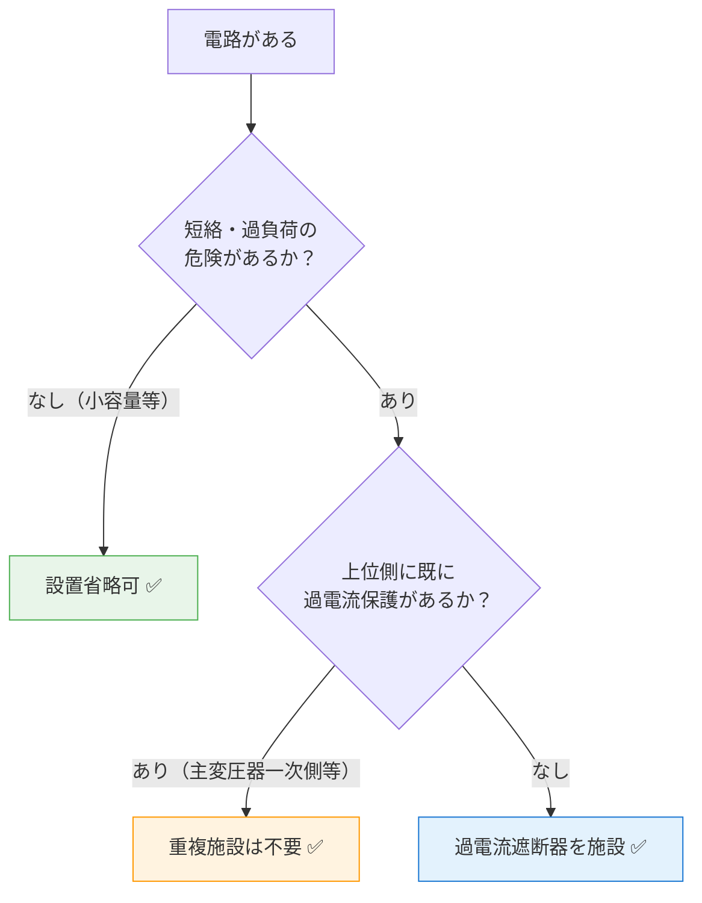

# 電技省令 第14条 — 過電流からの電線及び電気機械器具の保護対策

!!! note "📊 試験対策メタ"
    - **出題頻度**: 🔥🔥 ★★☆☆☆（過去14年で 2 回出題）
    - **重要度**: B（重要）
    - **直近出題**: R05上 問3（穴埋）

> 過電流（短絡＋過負荷）から電線・機器を守り、過熱焼損による火災を防ぐ保護義務。**必要な箇所** に **過電流遮断器** を施設しなければならない。「すべての電路に必須」は誤りで、危険のない箇所や上位保護がある箇所は省略可という構造を理解する。穴埋めは **過電流・火災・過電流遮断器** の3語セットが定番。

| 項目 | 内容 |
|------|------|
| 条文 | 電気設備技術基準 第14条 |
| 規定内容 | 必要な箇所への過電流遮断器の施設義務 |
| 性格 | 保護設計の原則規定（具体的施設要件は解釈に委任） |
| 委任先 | 解釈第33条（過電流遮断器の施設） |

---

## 1. 5秒で思い出す

- 過電流 = **短絡電流 + 過負荷電流**（地絡は別。第15条が担当）
- 目的：電線の溶断・機器の焼損・**火災**防止
- 保護装置：ヒューズ、配線用遮断器（MCCB）、過電流継電器（OCR）
- 設置義務：**「必要な箇所」**（省略可能な場合あり）
- 上位原則→具体規定：第14条（省令）が原則、解釈第33条が具体的な施設場所・動作条件

??? question "セルフチェック: 第14条「必要な箇所」とは具体的に何か？"
    短絡電流・過負荷電流の危険性がある電路。ただし「短絡の危険がない電路」（短時間運用の小容量回路等）や「上位側に既に過電流保護がある電路」は例外として設置不要。試験では「すべての電路に必須」という選択肢が罠。

??? question "セルフチェック: 第14条と第15条の対象範囲はどう違うか？"
    第14条は**過電流**（短絡・過負荷）が対象。第15条は**地絡**（電路から大地への漏れ電流）が対象。両方とも保護対象は電線・機器だが、現象が異なるため装置も異なる（第14条→ヒューズ・MCCB・OCR、第15条→ELCB等）。

---

## 2. 条文原文

!!! note "条文原文の照合（要確認）"
    e-Gov公式（https://elaws.e-gov.go.jp/document?lawid=337M50000400052）または
    METI公式PDFを参照し、第14条の本文を一字一句で貼り付ける。
    現時点では既存執筆者が書いた要約が貼られているが、原文照合が必要。

> **電気設備技術基準 第14条（過電流からの電線及び電気機械器具の保護対策）**
>
> [要確認: e-Gov公式の本文をここに転記]
>
> 電路の必要な箇所には，過電流による過熱焼損から電線及び電気機械器具を保護し，
> かつ，火災の発生を防止できるよう，過電流遮断器を施設しなければならない。

---

## 3. 原文解析

| ブロック | 原文 | 意味 | 試験ポイント |
|---------|------|------|-------------|
| 適用範囲 | 電路の必要な箇所には | 全電路ではなく「必要な箇所」 | **頻出ひっかけ**（「すべての電路」は誤り） |
| 危害種別 | 過電流による過熱焼損から | 短絡＋過負荷の両方 | 地絡（第15条）と区別 |
| 保護対象 | 電線及び電気機械器具を保護し | ハードウェア全般 | 感電（人）は第5・10条が担当 |
| 副次目的 | かつ，火災の発生を防止できるよう | 過熱→火災の連鎖を断つ | **穴埋め（イ）= 火災** |
| 措置 | 過電流遮断器を施設しなければならない | ヒューズ・MCCB・OCRの総称 | **穴埋め（ウ）= 過電流遮断器** |

!!! tip "穴埋めの覚え方"
    「（過電流）による過熱焼損から〜（火災）の発生を防止〜（過電流遮断器）を施設」
    → **過電流・火災・過電流遮断器** の3語セット。
    地絡（第15条）・感電（第5条）・地絡遮断器（第15条）はすべてダミー選択肢になる。

---

## 4. かみ砕き解説

> 過電流は「電流値×継続時間」の2軸で考える。短絡＝大電流・短時間、過負荷＝中電流・長時間。両者で対策装置と検出原理が変わる。

### 過電流の2つの型と対策

#### 1. 短絡電流（ショート） — 相互間・対地の低抵抗接触

| 特性 | 値 |
|------|-----|
| 発生原因 | 絶縁破壊、配線の接触不良、誤配線 |
| 電流値 | **非常に大きい**（通常電流の数十倍～数百倍） |
| 継続時間 | ミリ秒単位（短い） |
| 熱的危険 | **ジュール熱 Q = I²Rt → 電線・機器焼損** |
| 磁気危険 | 大電流による磁気力 → 機器破損 |
| 対策 | ヒューズ（瞬時遮断）、MCCB（磁気検出） |

#### 2. 過負荷電流 — 定格以上の負荷接続または故障

| 特性 | 値 |
|------|-----|
| 発生原因 | 電動機のロック、過負荷接続、接触不良 |
| 電流値 | 定格値の数倍～数十倍（短絡より小さい） |
| 継続時間 | **秒単位～分単位（比較的長い）** |
| 熱的危険 | ジュール熱 → 絶縁劣化 → 地絡へ進展 |
| 対策 | 過電流継電器（OCR）、熱動型MCCB |
| 遮断条件 | 電流値×継続時間の積で判定（I²t特性） |

!!! tip "短絡と過負荷の違い"
    - **短絡（100A→1000A）**: 一瞬で電線が焼ける → ヒューズなら瞬時に切れる
    - **過負荷（20A→60A）**: ゆっくり加熱 → 3秒待って温度上昇確認してから切る（時限特性）

### 過電流保護に用いる装置（遮断器系 + 検出器系）

> ⚠️ **重要な区別**：法令上の「過電流遮断器」は**検出+遮断機能を持つ装置**（ヒューズ・MCCB・ACB等）を指す。OCR・サーマルリレーは**検出器（リレー）**であり、別途遮断器CBと組合せて初めて「過電流遮断器系統」を構成する（§10「まぎらわしい選択肢」参照）。

**遮断器系（検出+遮断を1台で実現）：**

| 装置 | 検出原理 | 遮断速度 | 用途 |
|------|---------|---------|------|
| **ヒューズ** | 抵抗加熱→溶断 | **極速（ミリ秒）** | 短絡特化、使い捨て |
| **配線用遮断器（MCCB）** | 磁気+熱動 | 磁気：速い、熱動：時限 | 汎用、再利用可能 |

**検出器系（CBと組合せて遮断器系統を構成）：**

| 装置 | 検出原理 | 動作特性 | 用途 |
|------|---------|---------|------|
| **過電流継電器（OCR）** | 電磁石検出 | 時限特性 | 高圧側で CB と組合せて精密制御 |
| **サーマルリレー** | 熱膨張 | 時限特性 | 電動機の過負荷検出（電磁接触器と組合せ） |

!!! tip "暗記の核心"
    **短絡→ヒューズ（瞬時）、過負荷→OCR（時限）** の役割分担が基本思想。

    MCCB = 両方を1つで実現した折衷案。

??? question "セルフチェック: ヒューズで過負荷保護は可能か？"
    **原則として向かない**。ヒューズは抵抗加熱式で、小さな過負荷電流では溶断まで時間がかかりすぎる。過負荷専用は熱動型保護（OCR・サーマルリレー）が基本。MCCBは磁気＋熱動の併用で両対応するため汎用的。

---

## 5. 図で理解

### 図解 1：過電流の2種類 — 短絡 vs 過負荷

<svg viewBox="0 0 680 230" xmlns="http://www.w3.org/2000/svg" font-family="sans-serif" font-size="12" style="width:100%;max-width:680px">
  <text x="340" y="20" text-anchor="middle" font-size="13" font-weight="bold" fill="#333">過電流の2種類：電流値と継続時間が全く違う</text>

  <!-- 左：短絡 -->
  <rect x="15" y="35" width="305" height="180" rx="8" fill="#ffebee" stroke="#c62828" stroke-width="1.5"/>
  <text x="167" y="57" text-anchor="middle" font-weight="bold" fill="#b71c1c">⚡ 短絡電流（ショート）</text>
  <text x="167" y="75" text-anchor="middle" font-size="11" fill="#333">原因: 絶縁破壊・誤配線・導体の直接接触</text>

  <!-- 短絡 bar (tall, narrow) -->
  <rect x="50" y="90" width="35" height="100" rx="3" fill="#ef5350"/>
  <text x="67" y="87" text-anchor="middle" font-size="9" fill="#c62828">↑大</text>
  <line x1="40" y1="190" x2="130" y2="190" stroke="#555" stroke-width="1"/>
  <text x="85" y="204" text-anchor="middle" font-size="9" fill="#555">ms単位</text>
  <text x="35" y="145" font-size="9" fill="#fff" transform="rotate(-90,35,145)">電流値</text>

  <text x="200" y="100" text-anchor="middle" font-size="11" fill="#c62828">電流値: 定格の数十〜百倍</text>
  <text x="200" y="118" text-anchor="middle" font-size="11" fill="#333">時間: ミリ秒単位（瞬間）</text>
  <text x="200" y="136" text-anchor="middle" font-size="11" fill="#333">危険: 電線・機器が瞬時焼損</text>
  <rect x="45" y="158" width="245" height="25" rx="5" fill="#ffcdd2"/>
  <text x="167" y="175" text-anchor="middle" font-size="11" fill="#b71c1c">対策: ヒューズ（瞬時溶断）・MCCB磁気トリップ</text>

  <!-- 右：過負荷 -->
  <rect x="360" y="35" width="305" height="180" rx="8" fill="#fff8e1" stroke="#e65100" stroke-width="1.5"/>
  <text x="512" y="57" text-anchor="middle" font-weight="bold" fill="#bf360c">🌡️ 過負荷電流</text>
  <text x="512" y="75" text-anchor="middle" font-size="11" fill="#333">原因: 電動機ロック・過負荷接続・接触不良</text>

  <!-- 過負荷 bar (shorter, wider) -->
  <rect x="375" y="130" width="100" height="60" rx="3" fill="#ffb300"/>
  <text x="425" y="127" text-anchor="middle" font-size="9" fill="#e65100">↑中程度</text>
  <line x1="365" y1="190" x2="490" y2="190" stroke="#555" stroke-width="1"/>
  <text x="427" y="204" text-anchor="middle" font-size="9" fill="#555">秒〜分単位</text>

  <text x="560" y="100" text-anchor="middle" font-size="11" fill="#e65100">電流値: 定格の数倍</text>
  <text x="560" y="118" text-anchor="middle" font-size="11" fill="#333">時間: 秒〜分単位（持続）</text>
  <text x="560" y="136" text-anchor="middle" font-size="11" fill="#333">危険: ゆっくり過熱 → 絶縁劣化・火災</text>
  <rect x="370" y="158" width="270" height="25" rx="5" fill="#ffe082"/>
  <text x="505" y="175" text-anchor="middle" font-size="11" fill="#bf360c">対策: OCR・MCCB熱動トリップ（時限特性）</text>
</svg>

### 図解 2：過電流遮断器の3種類と役割分担

<svg viewBox="0 0 680 215" xmlns="http://www.w3.org/2000/svg" font-family="sans-serif" font-size="12" style="width:100%;max-width:680px">
  <text x="340" y="20" text-anchor="middle" font-size="13" font-weight="bold" fill="#333">過電流遮断器の種類と短絡・過負荷への対応</text>

  <!-- ヒューズ -->
  <rect x="15" y="35" width="205" height="165" rx="8" fill="#fce4ec" stroke="#c62828" stroke-width="1.5"/>
  <text x="117" y="57" text-anchor="middle" font-weight="bold" fill="#b71c1c">ヒューズ</text>
  <rect x="67" y="68" width="100" height="22" rx="3" fill="none" stroke="#c62828" stroke-width="1.5"/>
  <line x1="35" y1="79" x2="67" y2="79" stroke="#c62828" stroke-width="1.5"/>
  <line x1="167" y1="79" x2="200" y2="79" stroke="#c62828" stroke-width="1.5"/>
  <line x1="72" y1="71" x2="162" y2="87" stroke="#c62828" stroke-width="1"/>

  <text x="117" y="108" text-anchor="middle" font-size="10" fill="#333">検出: 抵抗加熱→溶断</text>
  <text x="117" y="123" text-anchor="middle" font-size="10" fill="#c62828">速度: 極速（ms）</text>
  <text x="117" y="138" text-anchor="middle" font-size="10" fill="#333">特徴: 短絡特化・使い捨て</text>
  <rect x="30" y="152" width="175" height="38" rx="4" fill="#ffcdd2"/>
  <text x="117" y="167" text-anchor="middle" font-size="10" fill="#b71c1c">短絡 ✅</text>
  <text x="117" y="182" text-anchor="middle" font-size="10" fill="#888">過負荷 △（時限性あり）</text>

  <!-- MCCB -->
  <rect x="237" y="35" width="205" height="165" rx="8" fill="#e8f5e9" stroke="#2e7d32" stroke-width="2"/>
  <text x="340" y="57" text-anchor="middle" font-weight="bold" fill="#1b5e20">MCCB（配線用遮断器）</text>
  <rect x="297" y="65" width="85" height="28" rx="4" fill="none" stroke="#2e7d32" stroke-width="1.5"/>
  <circle cx="317" cy="79" r="6" fill="#2e7d32"/>
  <circle cx="362" cy="79" r="6" fill="#2e7d32"/>
  <line x1="255" y1="79" x2="297" y2="79" stroke="#2e7d32" stroke-width="1.5"/>
  <line x1="382" y1="79" x2="425" y2="79" stroke="#2e7d32" stroke-width="1.5"/>

  <text x="340" y="108" text-anchor="middle" font-size="10" fill="#333">検出: 磁気（短絡）＋熱動（過負荷）</text>
  <text x="340" y="123" text-anchor="middle" font-size="10" fill="#2e7d32">速度: 磁気=速・熱動=時限</text>
  <text x="340" y="138" text-anchor="middle" font-size="10" fill="#333">特徴: 両対応・再利用可</text>
  <rect x="252" y="152" width="175" height="38" rx="4" fill="#a5d6a7"/>
  <text x="340" y="167" text-anchor="middle" font-size="10" fill="#1b5e20">短絡 ✅</text>
  <text x="340" y="182" text-anchor="middle" font-size="10" fill="#1b5e20">過負荷 ✅</text>

  <!-- OCR -->
  <rect x="460" y="35" width="205" height="165" rx="8" fill="#e3f2fd" stroke="#1565c0" stroke-width="1.5"/>
  <text x="562" y="57" text-anchor="middle" font-weight="bold" fill="#0d47a1">OCR（過電流継電器）</text>
  <circle cx="562" cy="81" r="17" fill="none" stroke="#1565c0" stroke-width="1.5"/>
  <text x="562" y="85" text-anchor="middle" font-size="10" fill="#1565c0">OCR</text>
  <line x1="478" y1="81" x2="545" y2="81" stroke="#1565c0" stroke-width="1.5"/>
  <line x1="579" y1="81" x2="647" y2="81" stroke="#1565c0" stroke-width="1.5"/>

  <text x="562" y="108" text-anchor="middle" font-size="10" fill="#333">検出: 電磁石（電流センサ）</text>
  <text x="562" y="123" text-anchor="middle" font-size="10" fill="#1565c0">速度: 時限特性（精密制御）</text>
  <text x="562" y="138" text-anchor="middle" font-size="10" fill="#333">特徴: 高圧回路・別途CBと組合せ</text>
  <rect x="475" y="152" width="175" height="38" rx="4" fill="#90caf9"/>
  <text x="562" y="167" text-anchor="middle" font-size="10" fill="#888">短絡 △（対応可だが専用でない）</text>
  <text x="562" y="182" text-anchor="middle" font-size="10" fill="#0d47a1">過負荷 ✅</text>
</svg>

### 判定フローチャート: 過電流遮断器の設置要否

---

## 6. 設置義務の判定と短絡電流

### 「必要な箇所」の判定

#### 必須箇所

- **変圧器の一次・二次側**（常に短絡の危険）
- **分岐回路**（複数の負荷を供給）
- **負荷側電路全般**（短絡・過負荷の危険）

#### 省略可能箇所

- 主変圧器の一次側（すでに上位の保護あり）
- 発電機の出力端子（自己励磁機構があるため）
- 蓄電池出力（内部抵抗が大きく短絡電流制限）
- **短絡の危険が客観的に無い小容量回路**

!!! note "解釈第33条との関係"
    第14条（省令）は「保護しろ」という原則 → 解釈第33条が「◯◯の箇所に△△装置を付けよ」という具体的施設要件を規定。
    試験では「具体的な施設要件は電技解釈の第何条に定められているか」と問われた場合は **解釈第33条** が正答。

### 短絡電流の計算（理解のみ）

電路上の任意の点での短絡電流：

$$I_{sc} = \frac{V}{Z_{total}}$$

- **V**: 供給電圧
- **Z_total**: 電源から故障点までのインピーダンス（変圧器、電線の合成）

**インピーダンスが小さい = 短絡電流が大きい** → より強力な遮断器が必要。

!!! tip "電源に近い位置ほど危険"
    - 主変圧器直近：Z小 → Isc大（数千A） → 超強力な遮断器必須
    - 分岐回路末端：Z大 → Isc小（数百A） → 普通の配線用遮断器で十分

---

## 7. 試験で問われること

> 出題パターンは「短絡 vs 過負荷の違い」「設置義務の判定」「他条文との切り分け」に集中。

!!! note "出題予測（過去14年の統計）"
    1. **過電流の定義**: 短絡＋過負荷の両方を含む（地絡は第15条）
       - ひっかけ：「地絡」「短絡のみ」を答えさせる選択肢
    2. **遮断装置の種類**: ヒューズ・MCCB・OCRの役割分担
       - ひっかけ：「地絡遮断器（ELCB）」「保護継電器のみ」
    3. **設置義務**: 「必要な箇所」の意味と省略可能ケース
       - ひっかけ：「すべての電路に必須」
    4. **解釈第33条との関係**: 省令は原則、解釈で具体的施設要件
       - 「具体的施設要件はどこに規定」と問われたら解釈第33条
    5. **第15条（地絡）との切り分け**: 単独より組合せ問題が多い
       - 「過電流＝第14条」「地絡＝第15条」をセットで覚える

---

## 8. 頻出ひっかけ

1. 🔴 **「すべての電路に遮断器は必須」** → 誤り。「必要な箇所」は限定的
2. 🔴 **「過電流＝短絡のみ」** → 誤り。過電流は**短絡＋過負荷**の両方
3. 🔴 **「地絡も第14条が担当」** → 誤り。地絡は第15条が担当（電流の流れる方向が異なる）
4. 🟡 **「ヒューズは過負荷を検出できる」** → 原則向かない。抵抗加熱式で時限性はあるが、本来は短絡向け
5. 🟡 **「過負荷電流は短絡より危険」** → 誤り。継続時間は長いが、電流値は小さい
6. 🟢 **「配線用遮断器とは何か」** → MCCBのこと。磁気と熱動の併用で短絡・過負荷を両対応

??? question "セルフチェック: 「過電流」と「地絡電流」の違いを言えるか？"
    **過電流** = 電路の正規ルートを流れる電流が定格を超えた状態（短絡・過負荷）。**地絡電流** = 電路から大地に漏れた電流。流れるルートが違う。第14条は前者、第15条は後者を扱う。検出装置も異なる（前者→過電流遮断器、後者→地絡遮断器・ELCB）。

---

## 9. 穴埋め過去問チャレンジ

!!! note "過去問類題 H30 問4（難易度 ★★☆☆☆）"
    次の文章は「電気設備技術基準」第14条に関する記述である。空欄（ア）〜（ウ）に入る語句の組合せとして正しいものを選べ。

    > 電路の必要な箇所には，**（ア）** による過熱焼損から電線及び電気機械器具を保護し，かつ，**（イ）** の発生を防止できるよう，**（ウ）** を施設しなければならない。

??? success "解答を見る"
    | 空欄 | 正答 |
    |------|------|
    | （ア） | **過電流** |
    | （イ） | **火災** |
    | （ウ） | **過電流遮断器** |

    **読み解きポイント：**

    - （ア）**過電流** ：短絡電流と過負荷電流の両方を含む概念。地絡は第15条が担当するため違う。
    - （イ）**火災** ：過電流による過熱が電線・周辺物件への延焼につながる。感電防止は第5条・第10条が担当。
    - （ウ）**過電流遮断器** ：ヒューズ・MCCB・OCRの総称。地絡遮断器（ELCB）は第15条が担当するため違う。
    - **「必要な箇所」** であり、すべての電路が対象ではない点も試験で問われる。

---

## 10. まぎらわしい選択肢と正解の違い

| 空欄 | よくある誤答 | 正答 | なぜ違うか |
|------|------------|------|----------|
| （ア） | **地絡** | **過電流** | 地絡は電流が大地へ漏れる現象。地絡保護は第15条が担当。第14条は過電流（短絡・過負荷）が対象 |
| （ア） | **短絡** | **過電流** | 短絡は過電流の一種だが、第14条は過負荷電流も含む広い概念「過電流」を使う |
| （イ） | **感電** | **火災** | 感電防止は電路の絶縁（第5条）と接地（第10条）が担当。第14条は過熱による火災防止が目的 |
| （イ） | **停電** | **火災** | 停電は保護動作の結果にすぎない。第14条の目的は停電ではなく過熱による火災を防ぐこと |
| （ウ） | **地絡遮断器** | **過電流遮断器** | 地絡遮断器（ELCB・漏電遮断器）は第15条が根拠。第14条は過電流遮断器（ヒューズ・MCCB）が対象 |
| （ウ） | **保護継電器** | **過電流遮断器** | 保護継電器（OCR）は検出部のみ。条文は検出＋遮断機能を込みにした「過電流遮断器」全体を義務付けている |

### 一目でわかる用語比較

| 比較軸 | 過電流 | 地絡 | 短絡 |
|--------|--------|------|------|
| 現象 | 電路に流れる電流が定格超過 | 電流が大地へ漏れる | 異電位導体間の直接接触 |
| 対応条文 | 第14条 | 第15条 | （第14条の過電流の一種） |
| 保護装置 | 過電流遮断器（ヒューズ・MCCB・OCR） | 地絡遮断器（ELCB） | ヒューズ・MCCB磁気トリップ |
| 試験での出方 | 穴埋め（ア）の正答 | （ア）の誤答選択肢 | （ア）の誤答選択肢（一部正しいが狭すぎ） |

---

## 11. 関連条文

**並列の保護条文**

- [電技省令 第15条：地絡に対する保護](15.md) — 過電流（第14条）と並ぶ2大保護
- [電技省令 第56条：配線の感電・火災防止](56.md) — 配線設計と保護装置の関係

**上位・目的条文**

- 電技省令 第4条 — 感電・火災等の防止（第14条の上位目的）

**具体的施設要件の委任先**

- [電技解釈 第33条：過電流遮断器の施設](../kaishaku/33.md) — 具体的な施設箇所・条件・動作特性

**保護装置テーマ**

- [保護装置テーマ](../../themes/hogo-sochi.md) — 過電流・地絡・その他の保護装置横展開

---

## 12. 過去問実績

| 年度 | 問 | 形式 | 論点 | 関連条文 |
|------|-----|------|------|----------|
| H30 | 問4 | 論説 | 異常時の保護対策（過電流・地絡） | 省令§14, §15 |
| R05上 | 問3 | 穴埋 | 過電流からの電線及び電気機械器具の保護対策 | 省令§14, 解釈§33 |

→ **H23〜R07下で2回出題**（kakomon.yml集計）。出題波は中程度（5〜7年に1回）。

!!! note "R08 出題予測"
    出題波は中程度。出題時は「短絡と過負荷の違い」「必要な箇所の判定」「各保護装置の役割」が問われる。

    第14条単独より、**第15条（地絡）や解釈§33（具体的施設要件）との組み合わせ問題**が多い傾向。
    穴埋めなら **過電流・火災・過電流遮断器** の3語セットが定番（R05上 問3 と同形式）。

---

## 13. 最終チェック

**📜 条文の核心**

- [ ] 「過電流による過熱焼損から〜火災の発生を防止」の構造を言える
- [ ] 「必要な箇所」の意味（全電路ではない）を説明できる
- [ ] 穴埋め3語セット（**過電流・火災・過電流遮断器**）を即答できる

**⚡ 過電流の2型**

- [ ] 短絡（電流値大・継続時間短）と過負荷（電流値中・継続時間長）の違いを説明できる
- [ ] ヒューズ・MCCB・OCRの役割分担（短絡向け・両対応・過負荷向け）を即答できる

**🔧 設置義務**

- [ ] 設置必須箇所（変圧器・分岐回路）と省略可能箇所（主変一次側・蓄電池等）を説明できる
- [ ] 解釈第33条が具体的施設要件を規定していることを知っている

**🔀 他条文との切り分け**

- [ ] 第14条（過電流）と第15条（地絡）の対象範囲の違いを言える
- [ ] 感電防止は第5条・第10条で、第14条は火災防止が目的であると区別できる

---

## 監修ログ

- **2026-05-02**: DENKEN-WIKI監修部による初回三段監修（不動・江間・早川）。**不動が§4「過電流遮断装置の種類」表でOCR・サーマルリレーが「過電流遮断器」として並列分類されている誤りを検出**（§10では「OCRは検出器」と正しく記載されており記事内矛盾）→「遮断器系（ヒューズ・MCCB）」と「検出器系（OCR・サーマルリレー）」の2テーブル構造に分割修正。江間が委任先漏れ（解釈第34条 高圧側・省令第63条 需要場所）を検出。早川が§4 法規特有表現セクション（ブロックA/B/C/D）の完全欠落・§2 [要確認]プレースホルダ残存を検出。**数値検証判定: CONDITIONAL PASS**（誤分類1件は当セッションで修正済、§4ブロック追加・§2 プレースホルダ削除は別セッション）

---

*最終確認: 2026-05-02 | 数値検証完了: 2026-05-02（CONDITIONAL PASS・誤分類修正済） | ステータス: v2.2（OCR/サーマルリレーの遮断器・検出器分離） | [バージョニング基準](../../reference/versioning.md)*
