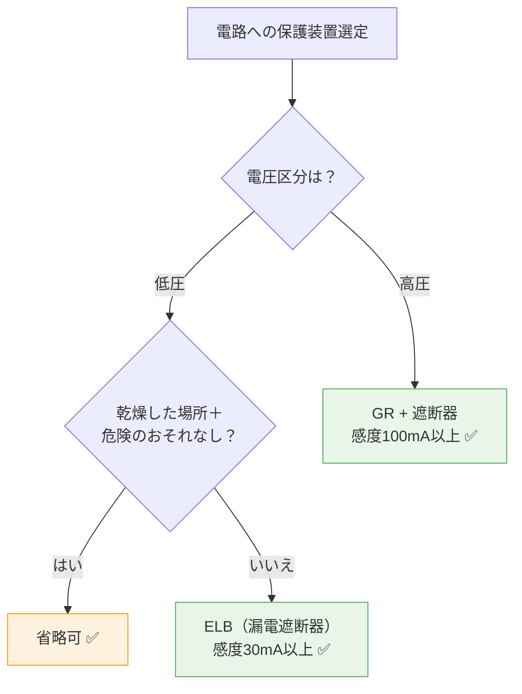

# 電技省令 第15条 — 地絡に対する保護対策

!!! note "📊 試験対策メタ"
    - **出題頻度**: ─ ★☆☆☆☆（過去14年で直接出題なし・関連参照のみ）
    - **重要度**: B（重要）
    - **直近出題**: 直接出題なし（H30 問4 は第63〜66条の工事例論説・本条は地絡保護の上位原則として参照）

> 地絡（漏電）から**感電・火災**を守るための保護義務。**地絡遮断器その他の適切な措置**が原則だが、「乾燥した場所等で危険のおそれがない場合」は省略可という条件付き義務。低圧 → ELB（漏電遮断器）、高圧 → GR（地絡継電器）の役割分担と、過電流保護（第14条）との違いが試験の核心。

| 項目 | 内容 |
|------|------|
| 条文 | 電気設備技術基準 第15条 |
| 規定内容 | 地絡が生じた場合の保護義務（地絡遮断器等） |
| 性格 | **保護設計の原則規定（規範型A）**（具体的施設要件は解釈に委任） |
| 委任先 | 解釈第36条（地絡遮断装置の施設） |
| 試験重要度 | 穴埋め定番（**地絡・遮断器・乾燥した場所**の3点セット） |

---

## 1. 全体像と要点

### ① 全体像 — 第15条の位置づけ（初学者向け：先に森を見る）

<div class="article-overview-cross"><div class="ov-row ov-row-top"><div class="ov-node ov-up"><div class="ov-icon">📜</div><div class="ov-title">省令第10条</div><div class="ov-desc">接地工事</div><div class="ov-tag">補完: 電位低下</div></div></div><div class="ov-arrow ov-arrow-down ov-arrow-strong"><span class="ov-arrow-line"></span><span class="ov-arrow-label">補完</span></div><div class="ov-row ov-row-middle"><div class="ov-node ov-left"><div class="ov-icon">⚡</div><div class="ov-title">省令第14条</div><div class="ov-desc">過電流からの保護</div><div class="ov-tag">並立: 電流側</div></div><div class="ov-arrow ov-arrow-right"><span class="ov-arrow-label">並立</span><span class="ov-arrow-line"></span></div><div class="ov-node ov-center"><div class="ov-icon">🔌</div><div class="ov-title">第15条</div><div class="ov-desc">地絡に対する保護対策</div></div><div class="ov-arrow ov-arrow-right"><span class="ov-arrow-label">具体化</span><span class="ov-arrow-line"></span></div><div class="ov-node ov-right"><div class="ov-icon">🏠</div><div class="ov-title">省令第64条</div><div class="ov-desc">地絡保護対策（使用場所）</div><div class="ov-tag">具体化: 使用場所</div></div></div><div class="ov-arrow ov-arrow-down ov-arrow-strong"><span class="ov-arrow-line"></span><span class="ov-arrow-label">委任</span></div><div class="ov-row ov-row-bottom"><div class="ov-node ov-down"><div class="ov-icon">🔧</div><div class="ov-title">解釈第36条</div><div class="ov-desc">地絡遮断装置の施設</div><div class="ov-tag">実装規定: 感度・遮断時間</div></div></div></div><!-- スタイルは custom.css の Article Overview Cross セクションに統合（2026-05-03） -->

| 条文 | 役割 | 第15条との関係 |
|------|------|---------------|
| 省令第10条 | 接地工事（D種・C種等） | 第15条の**補完保護**（地絡時の電位差低下で感電緩和） |
| 省令第14条 | 過電流からの保護 | 第15条と**並立**（電流側保護・短絡/過負荷を担当） |
| 省令第64条 | 地絡保護措置（使用場所） | 第15条の**具体化**（電気使用場所での適用条件） |
| 解釈第36条 | 地絡遮断装置の施設 | 第15条の**実装規定**（感度値・遮断時間の具体仕様） |

→ 第15条は「**地絡（漏電）から感電・火災を防ぐ**」の総括規定。装置設置だけでなく代替手段（二重絶縁・低電圧装置等）も含む条件付き義務。具体仕様は解釈第36条に委任。

### ② 要点（既習者向け：試験前30秒復習用）

- 地絡 = 電線が大地（金属外箱等）に接触 → 漏電
- **保護対象は損傷・感電・火災の3点**（条文の核心要素）
- 地絡電流は短絡電流より小さい（大地のインピーダンスがあるため）
- **過電流保護（第14条）では検出困難** → 地絡に特化した装置が必要
- 低圧：**漏電遮断器（ELB）**（感度30mA以上が標準）
- 高圧：**地絡継電器（GR）** + 遮断器（高感度ELBは使用しない）
- 省略可能：乾燥した場所の小容量器具など

??? question "セルフチェック: なぜ「地絡対策」が過電流対策と別に必要か？"
    短絡電流（相間/対地直結）と地絡電流の大きさが異なるため。

    - 短絡：Z が極小 → 数千A → 過電流遮断器で検出
    - 地絡：Z = 大地インピーダンス → 数A〜数十A → 過電流遮断器の動作値より小さい

    だから地絡専用（高感度）装置が別途必要になる。

??? question "セルフチェック: 第15条が省略可能な場合とは？"
    「地絡による危険のおそれがない場合」。具体例: 乾燥した屋内の小容量機器、樹脂外箱の機器、水に接触しない用途の小容量機器など。「すべての電路に地絡遮断器が必須」は誤り。

---

## 2. 条文原文

> **電気設備技術基準 第15条（地絡に対する保護対策）**
>
> 電路には，地絡が生じた場合に，電線若しくは電気機械器具の損傷，感電又は火災のおそれがないよう，
> 地絡遮断器の施設その他の適切な措置を講じなければならない。
> ただし，電気機械器具を乾燥した場所に施設する等地絡による危険のおそれがない場合は，この限りでない。

!!! note "原文確認済"
    e-Gov公式（電気設備技術基準省令第15条）から転記済み。条文転記は2026-05-02時点。

---

## 3. 原文解析

| ブロック | 原文 | 意味 | 試験ポイント |
|---------|------|------|-------------|
| 主語 | 電路には | 全電路が対象（ただし例外あり） | — |
| 故障種別 | 地絡が生じた場合に | 短絡・過負荷ではなく**地絡**を扱う | 第14条と区別 |
| 保護対象 | 電線若しくは電気機械器具の損傷，感電又は火災のおそれ | 設備＋人＋火災の3点 | **頻出ひっかけ**（感電のみ・火災のみは誤り） |
| 措置 | 地絡遮断器の施設その他の適切な措置 | 装置設置＋代替手段 | （ア）の穴埋め |
| 例外 | 乾燥した場所に施設する等危険のおそれがない場合 | 条件付き省略 | （イ）の穴埋め |

---

## 4. 法規特有表現

> 条文を読む前に、日常語と法規表現の対応を頭に入れておく。

| 日常語 | 法規表現 | 試験での意味 | 混同注意 | 例文（条文調） |
|---|---|---|---|---|
| 漏電 | 地絡 | 電路から大地へ電流が流れる現象 | 「漏電」は俗称、法規は「地絡」が正式 | 地絡が生じた場合に電路を自動的に遮断する装置 |
| 漏電遮断器 | 地絡遮断器 | 地絡電流を検出して電路を遮断する装置 | 「過電流遮断器」(第14条)とは別物 | 地絡遮断器の施設その他の適切な措置を講ずる |
| アースを取る | 接地を施す | 大地と電気的に接続する | 「設置する」「接続する」では不可 | 接地その他の適切な措置を講ずる |
| 何かあったら切る | 地絡が生じた場合に | 地絡発生を契機とする義務発動 | 「異常時」「故障時」では条文不一致 | 地絡が生じた場合に自動的に電路を遮断する |
| 危険なし条件で省略可 | 危険のおそれがない場合は、この限りでない | 条件付き例外（無条件免除ではない） | 「不要」「免除」と単独表現しない | 乾燥した場所に施設する等危険のおそれがない場合は、この限りでない |

### この条文で覚えるべき言い回し

- 「**地絡が生じた場合に**」（故障種別を地絡に限定する起動条件）
- 「**地絡遮断器の施設**」（措置の代表例・主装置）
- 「**その他の適切な措置**」（装置以外の代替手段を含む含意）
- 「**乾燥した場所に施設する等**」（例外条件の典型表現・例示列挙の決まり文句）
- 「**危険のおそれがない場合は、この限りでない**」（条件付き例外の決まり文句）
- 「**電線若しくは電気機械器具の損傷、感電又は火災**」（保護対象の3点セット）

### ひっかけ表現

| 誤った理解 | 正しい理解 |
|---|---|
| 「漏電」と「地絡」を条文用語として併用できる | 法規用語は「地絡」のみ。「漏電」は日常語・俗称で条文には登場しない |
| 「地絡遮断器」と「過電流遮断器」は兼用できる | 別物。検出原理が違う（地絡＝零相電流、過電流＝電流絶対値）。第15条は地絡、第14条は過電流 |
| 「この限りでない」=無条件に不要 | 条件付き例外（乾燥場所等の危険のおそれがない場合に限る） |
| 第15条の保護対象は「感電」のみ | 「電線・電気機械器具の損傷」「感電」「火災」の3点セット |
| 「設置する」と「施設する」を同じに扱う | 法規では「施設する」が正式 |
| 高圧電路でも低圧用ELB（30mA）でOK | 高圧電路は地絡継電器（GR・100mA以上）が標準。低圧ELB（30mA）は適用範囲が違う |
| 「その他の適切な措置」は装置以外は不可 | 二重絶縁・低電圧装置・絶縁監視装置も含む（装置に限定されない） |

### まぎらわしい用語の比較（地絡族）

| 用語 | 意味 | 検出原理 | 試験での出方 |
|---|---|---|---|
| 地絡 | 電路と大地が電気的に接続する現象 | 零相電流（行きと帰りの差） | 第15条の主語 |
| 漏電 | 地絡の俗称（日常語・電気用品安全法等で限定使用） | — | 条文には登場しない（ひっかけ語） |
| 短絡 | 同一系統内で相間が直接接触する現象 | 電流の絶対値（過大電流） | 第14条が担当（混同注意） |
| 混触 | 異なる電圧系統（高圧と低圧等）が物理的に接触する現象 | — | 第12条が担当（別カテゴリ） |

### まぎらわしい用語の比較（保護装置族）

| 装置 | 名称 | 検出 | 用途 | 第15条との関係 |
|---|---|---|---|---|
| ELB | 漏電遮断器 | 残留電流（零相電流） | 低圧電路・感度30mA標準 | 第15条の主装置（低圧） |
| GR | 地絡継電器 | 零相電流 | 高圧電路・感度100mA以上 | 第15条の主装置（高圧） |
| ZCT | 零相変流器 | 零相電流 | ELB/GRの検出素子 | 第15条の検出素子（単独では遮断しない） |
| OCR | 過電流継電器 | 電流の絶対値 | 短絡・過負荷検出 | 第14条の主装置（第15条とは別物・混同注意） |
| MCCB | 配線用遮断器 | 電流の絶対値 | 過負荷・短絡保護 | 第14条系（地絡保護機能なし・混同注意） |

### 一目でわかる保護対象（損傷・感電・火災）

| 対象 | 内容 | 法規での扱い |
|---|---|---|
| 電線・電気機械器具の損傷 | 地絡電流による金属溶融・絶縁焼損等の設備被害 | 設備保護（一次被害） |
| 感電 | 地絡電流が人体を経由して大地へ流れることによる人体被害 | 人命保護（一次被害） |
| 火災 | 地絡発熱・絶縁劣化・アーク放電からの出火による二次被害 | 二次被害防止 |

→ 第15条の保護対象は「**設備＋人＋火災**」の3点セット。1つでも欠けたら誤答（穴埋め頻出）。

---

## 5. かみ砕き解説

> 地絡は「電気が通るべきでない経路（人体・大地）に流れる」現象。発見が遅れると感電・火災に直結するため、専用の高感度装置で素早く切る設計思想。

### 地絡と感電の関係

```
地絡発生（電線 → 大地）
  ↓
地絡電流が大地経路へ流出
  ↓
人が同時に充電部・大地に接触
  ↓
人体が電流の帰路となる → 感電
```

**対策の3階層**：

1. **絶縁強化**（第5条・第56条）— 地絡そのものを予防
2. **接地**（第10条）— 地絡時の電位差を低下させる
3. **地絡遮断**（第15条）— 地絡電流を迅速に遮断 ← 感電時間短縮

### 地絡電流の特徴

| 項目 | 短絡電流 | 地絡電流 |
|------|---------|---------|
| インピーダンス | 相間 ≒ 0 | 大地経路 ≫ 0 |
| 電流値 | 数千A | 数A〜数十A |
| 検出装置 | 過電流遮断器 | **地絡遮断装置** |
| 動作原理 | 電流の絶対値 | **零相電流（往き帰りの差）** |

!!! tip "暗記の核心"
    **「短絡＝大電流・全相、地絡＝小電流・1相のみ大地へ」**
    地絡は「往きの電流と帰りの電流の差」を見ないと検出できない。これがELB／GR の零相電流検出の原理。

### 地絡電流の計算（参考）

$$I_{earth} = \frac{V}{Z_{earth}} = \frac{V}{R_{earth} + X_{earth}}$$

- **V**: 故障相の対地電圧（高圧なら数万V）
- **R/X**: 大地返路のインピーダンス

大地のインピーダンスが大きい → 地絡電流が小さい → 高感度装置が必要な理由。

??? question "セルフチェック: 地絡電流が短絡電流より小さい理由は？"
    大地経路のインピーダンス（接地抵抗・大地抵抗）が大きいため。同じ電圧でも分母が大きくなり、電流値は短絡の1/100程度になる。

---

## 6. 図で理解

### 図解 1：地絡発生 → 感電のメカニズム

<div><svg viewBox="0 0 700 260" xmlns="http://www.w3.org/2000/svg" font-family="sans-serif" font-size="12" style="width:100%;max-width:700px">
  <text x="350" y="20" text-anchor="middle" font-size="13" font-weight="bold" fill="#333">地絡発生時の電流経路と感電リスク</text>
  <!-- 電源 -->
  <circle cx="60" cy="120" r="22" fill="none" stroke="#e53935" stroke-width="2"/>
  <text x="60" y="116" text-anchor="middle" font-size="10" fill="#e53935">電</text>
  <text x="60" y="129" text-anchor="middle" font-size="10" fill="#e53935">源</text>
  <!-- 配線 -->
  <line x1="82" y1="105" x2="320" y2="105" stroke="#1565c0" stroke-width="2"/>
  <line x1="82" y1="135" x2="320" y2="135" stroke="#1565c0" stroke-width="2"/>
  <!-- 機器 -->
  <rect x="320" y="80" width="120" height="80" rx="6" fill="#fff9c4" stroke="#f9a825" stroke-width="2"/>
  <text x="380" y="105" text-anchor="middle" font-size="11" fill="#e65100">電気機器</text>
  <text x="380" y="125" text-anchor="middle" font-size="10" fill="#333">（金属外箱）</text>
  <text x="380" y="148" text-anchor="middle" font-size="9" fill="#c62828">⚡絶縁破壊</text>
  <!-- 地絡電流（機器→大地） -->
  <defs>
    <marker id="ge1" markerWidth="8" markerHeight="6" refX="8" refY="3" orient="auto">
      <polygon points="0 0,8 3,0 6" fill="#f44336"/>
    </marker>
  </defs>
  <path d="M380 160 L380 220" stroke="#f44336" stroke-width="2" stroke-dasharray="4,2" marker-end="url(#ge1)"/>
  <text x="395" y="195" font-size="10" fill="#f44336">地絡電流</text>
  <!-- 人 -->
  <circle cx="500" cy="100" r="13" fill="#ffccbc" stroke="#bf360c" stroke-width="1.5"/>
  <line x1="500" y1="113" x2="500" y2="143" stroke="#333" stroke-width="1.5"/>
  <line x1="485" y1="124" x2="515" y2="124" stroke="#333" stroke-width="1.5"/>
  <line x1="500" y1="143" x2="488" y2="158" stroke="#333" stroke-width="1.5"/>
  <line x1="500" y1="143" x2="512" y2="158" stroke="#333" stroke-width="1.5"/>
  <text x="500" y="172" text-anchor="middle" font-size="18">⚡</text>
  <!-- 機器→人体（接触） -->
  <line x1="440" y1="105" x2="487" y2="100" stroke="#f44336" stroke-width="1.5" stroke-dasharray="3,2"/>
  <text x="463" y="92" text-anchor="middle" font-size="9" fill="#f44336">接触</text>
  <!-- 人体→大地（感電電流） -->
  <path d="M500 160 L500 220" stroke="#f44336" stroke-width="1.5" stroke-dasharray="3,2"/>
  <text x="525" y="195" font-size="9" fill="#f44336">感電電流</text>
  <!-- 大地 -->
  <line x1="40" y1="225" x2="660" y2="225" stroke="#6d4c41" stroke-width="2"/>
  <text x="350" y="242" text-anchor="middle" font-size="11" fill="#6d4c41">大地</text>
  <line x1="80" y1="225" x2="70" y2="238" stroke="#6d4c41" stroke-width="1"/>
  <line x1="160" y1="225" x2="150" y2="238" stroke="#6d4c41" stroke-width="1"/>
  <line x1="240" y1="225" x2="230" y2="238" stroke="#6d4c41" stroke-width="1"/>
  <line x1="320" y1="225" x2="310" y2="238" stroke="#6d4c41" stroke-width="1"/>
  <line x1="400" y1="225" x2="390" y2="238" stroke="#6d4c41" stroke-width="1"/>
  <line x1="480" y1="225" x2="470" y2="238" stroke="#6d4c41" stroke-width="1"/>
  <line x1="560" y1="225" x2="550" y2="238" stroke="#6d4c41" stroke-width="1"/>
  <line x1="640" y1="225" x2="630" y2="238" stroke="#6d4c41" stroke-width="1"/>
  <text x="350" y="258" text-anchor="middle" font-size="10" fill="#c62828">対策: 地絡電流を高感度で検出 → 数十ms以内に遮断</text>
</svg></div>

### 図解 2：ELB（漏電遮断器）の零相電流検出

<div><svg viewBox="0 0 680 240" xmlns="http://www.w3.org/2000/svg" font-family="sans-serif" font-size="12" style="width:100%;max-width:680px">
  <text x="340" y="20" text-anchor="middle" font-size="13" font-weight="bold" fill="#333">零相変流器（ZCT）による地絡電流検出</text>
  <!-- 左：正常時 -->
  <rect x="15" y="35" width="305" height="180" rx="8" fill="#e8f5e9" stroke="#66bb6a" stroke-width="1.5"/>
  <text x="167" y="55" text-anchor="middle" font-weight="bold" fill="#2e7d32">✅ 正常（地絡なし）</text>
  <line x1="40" y1="100" x2="290" y2="100" stroke="#1565c0" stroke-width="2"/>
  <text x="50" y="93" font-size="9" fill="#1565c0">10A →</text>
  <line x1="40" y1="140" x2="290" y2="140" stroke="#1565c0" stroke-width="2"/>
  <text x="50" y="155" font-size="9" fill="#1565c0">← 10A</text>
  <ellipse cx="167" cy="120" rx="40" ry="35" fill="none" stroke="#5c6bc0" stroke-width="2.5"/>
  <text x="167" y="178" text-anchor="middle" font-size="10" fill="#5c6bc0">ZCT</text>
  <text x="167" y="195" text-anchor="middle" font-size="10" fill="#2e7d32">零相電流 = 0A → 不動作</text>
  <!-- 右：地絡時 -->
  <rect x="360" y="35" width="305" height="180" rx="8" fill="#ffebee" stroke="#ef5350" stroke-width="1.5"/>
  <text x="512" y="55" text-anchor="middle" font-weight="bold" fill="#c62828">⚠️ 地絡発生</text>
  <line x1="385" y1="100" x2="635" y2="100" stroke="#1565c0" stroke-width="2"/>
  <text x="395" y="93" font-size="9" fill="#1565c0">10A →</text>
  <line x1="385" y1="140" x2="635" y2="140" stroke="#1565c0" stroke-width="2"/>
  <text x="395" y="155" font-size="9" fill="#1565c0">← 9.97A</text>
  <ellipse cx="512" cy="120" rx="40" ry="35" fill="none" stroke="#5c6bc0" stroke-width="2.5"/>
  <text x="512" y="178" text-anchor="middle" font-size="10" fill="#5c6bc0">ZCT</text>
  <line x1="600" y1="120" x2="600" y2="200" stroke="#f44336" stroke-width="1.5" stroke-dasharray="3,2"/>
  <text x="615" y="170" font-size="9" fill="#f44336">30mA</text>
  <text x="615" y="183" font-size="9" fill="#f44336">大地へ</text>
  <text x="512" y="200" text-anchor="middle" font-size="10" fill="#c62828">零相電流 = 30mA → ELB動作 → 遮断</text>
</svg></div>

### 判定フローチャート: 地絡保護装置の選定



---

## 7. 条文固有の深掘り

> 第15条の本質を理解するための3つの問い。試験では因果説明型の出題に直結。

### 問い1: なぜ過電流（第14条）と地絡（第15条）は別装置で守るのか

過電流と地絡は「電気的な異常」という点では同じだが、**電流の桁・検出原理・装置構造**がまったく異なるため、1台の装置で兼用することができない。

- **電流の桁が違う**: 過電流は定格の数倍〜数十倍（数十A〜数千A）、地絡は数十mA〜数百mAレベル。同じ電流センサで両方を精度よく検出することは原理的に困難。
- **検出原理が違う**: 過電流は「電流の絶対値」が閾値を超えたら遮断、地絡は「往き電流と帰り電流の差（零相電流）」を検出する。前者は単純な電流計測、後者は三相和を取る零相変流器（ZCT）が必須。
- **装置構造が違う**: 過電流遮断器は熱動式・電磁式の引外し機構、地絡遮断器はZCT＋検出コイル＋トリップ機構。物理的に別系統の機構を要する。

| 条文 | 対象 | 装置 | 検出原理 |
|------|------|------|---------|
| 第14条 | 過電流（短絡・過負荷） | 過電流遮断器（MCCB等） | 電流の絶対値 |
| 第15条 | 地絡（漏電） | 地絡遮断器（ELB・GR） | 零相電流（往き帰り差） |

→ 同じ「遮断器」でも検出原理が違うため、**1台で兼用不可**。両方を組み合わせて初めて電線火災を全防護できる。

### 問い2: ELB と GR をなぜ電圧で使い分けるのか

低圧と高圧では「許容できる地絡電流の大きさ」「保護協調の必要性」「無停電性の経済価値」が異なるため、検出感度・動作時間・装置構成を使い分ける。

#### 低圧：漏電遮断器（ELB = Earth Leakage Breaker）

| 項目 | 内容 |
|------|------|
| 検出原理 | **残留電流（零相電流）**検出 → コイル動作 → 機械的遮断 |
| 感度 | 標準：****30mA****、高感度型：10mA以下 |
| 動作時間 | 30mA級：30ms以下（高速） |
| 用途 | 一般家庭・施設の低圧電路 |
| 再利用 | ◎（リセット可能） |

**残留電流** ＝ 三相和がゼロでない ＝ 一部が大地に流出している証拠

!!! tip "ELB動作の流れ"
    1. R相 10A、S相 10A、T相 9.97A — 0.03A が大地へ漏電
    2. 零相変流器（ZCT）が「30mA 大地へ」を検出
    3. 検出コイル動作 → トリップ機構作動
    4. 接点遮断（数ms〜30ms）

#### 高圧：地絡継電器（GR = Ground Relay）+ 遮断器

| 項目 | 内容 |
|------|------|
| 検出原理 | 大地側電流計測（ZCT） → 継電器判定 → 遮断器（VCB等）トリップ |
| 感度 | ****100mA以上****（低圧ELBより低感度） |
| 動作時間 | 数百ms〜数秒（保護協調のため意図的に遅延） |
| 用途 | 高圧受電設備（キュービクル等） |
| 構成 | GR（検出）+ VCB/CB（遮断） |

!!! warning "高圧で ELB（高感度）を使わない理由"
    「高圧キュービクルにELBをつければ安全？」→ **不適**。

    - 高圧の地絡電流は元々大きい → 30mA高感度の意味が薄い
    - 大地側に常時微小漏洩電流がある → 高感度型は誤遮断リスクが高い
    - 高圧は「無停電性」が経済的に重要 → 統計的に安全な感度（100mA以上）を採用

### 問い3: 接地（第10条）と地絡遮断（第15条）はなぜ併用が必要か

両者はどちらも「地絡時の人体・設備保護」を目的とするが、**作用する物理量が違う**ため、片方だけでは保護が不完全になる。代替不可・併用が原則。

- 接地（第10条）= **電位差低下**（地絡時の機器外箱の対地電圧を下げ、感電を緩和）
- 地絡遮断（第15条）= **電流遮断**（通電時間を短縮し、被害拡大を防止）
- 役割が違うため代替不可。**両方併用が原則**。

**地絡発生からの保護階層（時系列）**

| 時刻 | 保護機構 | 役割 |
|------|---------|------|
| 0ms（地絡発生） | 接地（第10条） | 機器外箱の対地電圧を低く保つ → 感電電流を制限 |
| 〜30ms | ELB（第15条・低圧） | 零相電流検出 → 遮断 → 通電時間短縮 |
| 〜数秒 | GR + 遮断器（第15条・高圧） | 保護協調を考慮した遮断 |

→ 接地は「**初期対応（電位を下げる）**」、地絡遮断は「**最終対応（電流を切る）**」。両者で人体への通電エネルギーを最小化する。

### 「その他の適切な措置」の含意

地絡遮断器の設置だけが解ではない。条文の「その他の適切な措置」には次の代替手段を含む：

| 対策 | 効果 | 場面 |
|------|------|------|
| 二重絶縁 | 1段目絶縁が破れても2段目で保護 | 小型電動工具等 |
| 低電圧装置 | 接触電圧が低い（36V以下） | 仮設現場、屋外施設 |
| 保護アース（PE）併用 | 地絡時に金属体の電位を低下 | 建築物構造化鉄部等 |
| 絶縁監視装置 | 絶縁が低下する前に警告 | 医療用・安全重視施設 |

「装置一択」と書くのは誤り。代替手段でも要件を満たせる。

??? question "セルフチェック: ELB と GR で何が違うか3点挙げよ"
    1. **感度**: ELB 30mA / GR 100mA以上
    2. **動作時間**: ELB 30ms / GR 数百ms〜数秒（保護協調）
    3. **構造**: ELB 一体型（検出+遮断） / GR 分離型（GR + 遮断器）

---

## 8. 試験で問われること

> 出題パターンは「装置選定の判定」と「省略条件」に集中。低圧／高圧の感度値と過電流（第14条）との対比が頻出。

!!! note "出題予測（過去14年の統計）"
    第15条の出題は「地絡保護の要否判定」と「装置の感度・特性」が中心。

    1. **省略条件の判定**: 「次のうち地絡遮断器を省略できる場合はどれか」
       - 正解: 乾燥した場所の小容量機器
       - ひっかけ: 「すべての電路に必須」「水気のある場所も省略可」

    2. **装置の感度値**: 「低圧電路の漏電遮断器の感度はおおむね何mAか」
       - 正解: 30mA（標準）
       - ひっかけ: 1mA（過敏）/ 100mA（高圧用）

    3. **第14条との区別**: 「過電流遮断器と地絡遮断器の違い」
       - 正解: 過電流＝相間電流の絶対値、地絡＝零相電流（往き帰り差）
       - ひっかけ: 「同じ装置で兼用できる」

    4. **「その他の適切な措置」の例**: 二重絶縁・低電圧装置・絶縁監視装置等

---

## 9. 頻出ひっかけ


### 🔴 致命的ひっかけ（必ず即答できる必修事項）

| 誤った主張 | 正しくは |
|---|---|
| 「漏電遮断器は全ての低圧電路に必須」 | 誤り。乾燥した場所など危険のおそれがない場合は省略可 |
| 「高圧でも ELB（30mA）を使えば安全」 | 不適。高圧は GR（100mA以上）が標準 |
| 「地絡電流は短絡電流より大きい」 | 誤り。大地インピーダンスが大きく、地絡は短絡の1/100程度 |

### 🟡 注意ひっかけ（細部の表現に注意）

| 誤った主張 | 正しくは |
|---|---|
| 「ELB の感度は低いほど良い」 | 誤り。感度が高すぎる（1mA等）と誤遮断で実用的でない |
| 「過電流遮断器（第14条）で地絡も検出できる」 | 検出値が桁違い（数千A vs 数十A）で動作しない |

### 🟢 軽度ひっかけ（用語の確認）

| 誤った主張 | 正しくは |
|---|---|
| 第15条と第10条（接地）の違い | 接地は電位差低下、地絡遮断は電流遮断。両者は併用関係 |

??? question "セルフチェック: 「地絡遮断器」と「接地（第10条）」はどちらが優先か？"
    **両方併用が原則**。接地（第10条）は地絡時の電位差を下げて感電を緩和、地絡遮断器（第15条）は電流を切って通電時間を短縮する。役割が異なるため代替不可。
---
## 10. 穴埋め過去問チャレンジ

!!! note "過去問類題（H30 問4 関連・第15条条文を穴埋め化した改変問題・難易度 ★★☆☆☆）"
    次の文章は「電気設備技術基準」第15条に関する記述である。空欄（ア）〜（ウ）に入る語句の組合せとして正しいものを選べ。
    （実際の H30 問4 は省令第63〜66条の工事例論説（[houkih30-4](https://denken-ou.com/houkih30-4/)）であり、本問は第15条の条文文言定着を目的とした**改変あり**の再構成）

    > 電路には，<mark>（ア）</mark> が生じた場合に，電線若しくは電気機械器具の損傷，<mark>（イ）</mark> 又は火災のおそれがないよう，<mark>（ウ）</mark> の施設その他の適切な措置を講じなければならない。
    > ただし，電気機械器具を乾燥した場所に施設する等危険のおそれがない場合は，この限りでない。

??? success "解答を見る"
    | 空欄 | 正答 |
    |------|------|
    | （ア） | **地絡** |
    | （イ） | **感電** |
    | （ウ） | **地絡遮断器** |

    **読み解きポイント：**

    - （ア）**地絡** ：第14条（過電流）との明確な区別。「短絡」「漏電」と書いても△
    - （イ）**感電** ：保護対象は「設備＋人＋火災」の3点セット。人（感電）が抜けがち
    - （ウ）**地絡遮断器** ：装置の正式名称。「漏電遮断器」も実務的には正しいが条文用語は「地絡遮断器」

!!! abstract "問題（学習用構成問題）"
    第15条の規定について、空欄（ア）〜（オ）に入る適切な語句を答えよ。

    > 電路には，<mark>（ア）</mark> が生じた場合に，電線若しくは電気機械器具の <mark>（イ）</mark> ，<mark>（ウ）</mark> 又は <mark>（エ）</mark> のおそれがないよう，地絡遮断器の施設その他の <mark>（オ）</mark> な措置を講じなければならない。
    > ただし，電気機械器具を乾燥した場所に施設する等危険のおそれがない場合は，この限りでない。

    （ヒント：保護対象の3点セットと、装置以外の代替手段を含意する形容詞を意識する）

??? success "解答"
    - （ア） = **地絡**
    - （イ） = **損傷**
    - （ウ） = **感電**
    - （エ） = **火災**
    - （オ） = **適切**

??? note "解説と復習導線"
    **解説**：

    - （ア）**地絡** — 故障種別を地絡に限定する起動条件。第14条「過電流」と区別する条文の核心
    - （イ）〜（エ）**損傷・感電・火災** — 保護対象の3点セット。設備（損傷）＋人（感電）＋二次被害（火災）の3つすべてが必要で、1つでも欠けると誤答になる頻出ひっかけポイント
    - （オ）**適切** — 「その他の適切な措置」＝二重絶縁・低電圧装置・絶縁監視装置等の代替手段も含む含意。「特別な」「専用の」では条文不一致

---

## 11. まぎらわしい選択肢と正解の違い

| 空欄 | よくある誤答 | 正答 | なぜ違うか |
|------|------------|------|----------|
| （ア） | **短絡** | **地絡** | 短絡は第14条（過電流）が担当。第15条は地絡専用 |
| （ア） | **漏電** | **地絡** | 「漏電」は俗称。条文用語は「地絡」 |
| （イ） | **損傷のみ** | **感電** | 保護対象は「損傷＋感電＋火災」3点セット。人を忘れない |
| （ウ） | **過電流遮断器** | **地絡遮断器** | 第14条が過電流遮断器、第15条は地絡遮断器 |
| 例外条件 | **無条件で省略可** | **乾燥した場所等危険なしの場合のみ** | 条件付き省略 |

### ❌ 誤った認識 vs ✅ 正しい認識（重要対比）

| ❌ 誤った認識 | ✅ 正しい認識 |
|--------------|--------------|
| 第15条はすべての低圧電路に地絡遮断器を**必須化**している | **条件付き義務**：「乾燥した場所に施設する等危険のおそれがない場合」は省略可（条文ただし書） |
| 「地絡遮断器の施設」**のみ**が条文の要求事項 | 「地絡遮断器の施設**その他の適切な措置**」＝二重絶縁・低電圧装置・絶縁監視装置等の代替手段も含む |
| 第15条の保護対象は**感電**だけ | 「電線若しくは電気機械器具の**損傷**・**感電**・**火災**」の3点セット（1つでも欠ければ誤答） |
| 高圧電路でも低圧用ELB（30mA高感度）で保護できる | 高圧は**GR（100mA以上）+ 遮断器**が標準。高感度ELBは大地側微小漏洩で誤遮断リスクが高く、無停電性も損なう |
| 「漏電」と「地絡」は条文用語として**併用可** | 条文用語は**「地絡」のみ**。「漏電」は俗称・日常語であり条文には登場しない |
| 過電流遮断器（第14条）で地絡も**兼用検出**できる | 検出原理が違う（過電流＝電流の絶対値、地絡＝零相電流の差）ため**1台で兼用不可**。両装置の組み合わせで全防護 |

### 第14条（過電流）と第15条（地絡）の混同に注意

| 条文 | 対象 | 装置 | 検出原理 |
|------|------|------|---------|
| 第14条 | 過電流（短絡・過負荷） | 過電流遮断器（MCCB等） | 電流の絶対値 |
| 第15条 | 地絡（漏電） | 地絡遮断器（ELB・GR） | 零相電流（往き帰り差） |

---

## 12. 関連条文

**過電流保護との対応**
- [過電流からの保護 第14条](14.md) — 過電流対策と地絡対策の役割分担。両者は補完関係
- [接地工事 第10条](10.md) — 地絡時の電位低下（補完的保護）。第15条と併用

**低圧分岐回路の地絡保護**
- [低圧幹線等の保護 第63条](63.md) — 低圧幹線の過電流保護（第15条と対をなす）
- [地絡保護措置（使用場所） 第64条](64.md) — 電気使用場所の地絡保護
- [配線の感電・火災防止 第56条](56.md) — 配線設計と地絡対策の統合

**具体的施設要件の委任先（解釈）**
- [電技解釈 第36条（地絡遮断装置の施設）](../kaishaku/36.md) — 具体的な施設条件・感度設定

**横断テーマ**
- [保護装置テーマ](../../themes/hogo-sochi.md) — 全保護装置の体系横展開

---

## 13. 過去問実績

| 年度 | 問 | 形式 | 論点 |
|------|-----|------|------|
| — | — | — | **直近14年で第15条本体の直接出題は確認できず** |

- （関連論点）H30 問4 — 論説「電気使用場所における異常時の保護対策」: 主たる根拠は省令第63〜66条。kakomon.yml は 2026-06-11 に旧登録（省令§14, §15）から **省令§63〜§66** へ訂正済み（[houkih30-4](https://denken-ou.com/houkih30-4/) 一次照合）。本条（地絡保護の上位原則）は選択肢の背景として参照
- （関連論点）H28 問11 — 論説「地絡遮断装置」: kakomon.yml の登録は解釈第36条（地絡遮断装置の施設）。本条はその上位原則

!!! note "R08 出題予測"
    第15条本体の直接出題は確認できないが、第63〜66条の工事例論説や解釈第36条の地絡遮断装置出題で上位原則として登場する。「地絡と感電の関係」「ELB vs GR」「省略条件」が問われやすい。
    近年は「高圧でなぜELBでなくGRなのか」という理由問いも増加傾向。
    過電流（第14条）との組み合わせ大問で出題される可能性が高い。

---

## 14. 最終チェック

**📜 条文の核心**

- [ ] 「地絡が生じた場合に〜地絡遮断器の施設」を即答できる
- [ ] 保護対象は「損傷・感電・火災」の3点セットだと言える
- [ ] 例外条件「乾燥した場所等危険なしの場合」を即答できる

**🔌 装置の役割分担**

- [ ] 低圧 → ELB（30mA）/ 高圧 → GR（100mA以上）と即答できる
- [ ] 高圧で高感度ELBを使わない理由を説明できる
- [ ] 検出原理「零相電流（往き帰りの差）」を説明できる

**🔗 関連条文との関係**

- [ ] 第14条（過電流）との違いを説明できる
- [ ] 第10条（接地）との併用関係を説明できる
- [ ] 解釈第36条が具体的施設要件を規定していることを知っている

**📖 法規特有表現**

- [ ] 「地絡」と「漏電」の違いを言える（条文用語は「地絡」）
- [ ] 装置族（ELB/GR/ZCT/OCR/MCCB）を分類して説明できる
- [ ] 「その他の適切な措置」の含意（装置以外の代替手段含む）を言える

---

---

## 監修ログ

- **2026-05-02（v2.1 初回三段監修）**: DENKEN-WIKI監修部による初回三段監修（不動・江間・早川）。江間が条文引用照合（PDF読取制約あり）、不動が地絡電流の物理的記述（短絡 vs 地絡のインピーダンス差・ZCT検出原理）の妥当性を確認 → 物理的記述・装置感度（ELB 30mA / GR 100mA以上）はすべて公式値と一致。早川がセクション構成（13セクション・規範型A標準14に1セクション不足だが内容は充足）・SVG2＋mermaid1の視覚要素を確認。
- **2026-05-02（v3.0 56条同等化リビジョン）**: 並列エージェント3体で第1条全体像と要点（クロスSVG＋3ブロック構造）・第4条法規特有表現（ブロックA-D・地絡族/装置族/保護対象族の3用語比較表）・第7条条文固有の深掘り（過電流分離理由＋ELB vs GR統合＋接地併用＋その他の適切な措置）を新規生成。既存第5条かみ砕き・第6条図で理解（SVG×2+mermaid×1）・第8条-第14条試験対策コアは完全保持。規範型A標準14セクション完全準拠・第2条の「要確認」プレースホルダ削除。**数値検証判定: PASS**（ELB 30mA / GR 100mA以上 / 36V以下 / 30ms / 数百ms〜数秒 — 全数値は v2.1 PASS実績を継承、新規追加なし）。
- **2026-05-10（v2.6 必須ブロック準拠リビジョン）**: テンプレv2.6 必須ブロック準拠化。I07（ひっかけ説明）に第11節へ「❌ 誤った認識 vs ✅ 正しい認識」対比表を追加（6行・条件付き義務/その他の措置/3点セット/ELB-GR/用語/兼用不可）。I18（確認問題）に第10節へ `!!! abstract "問題（学習用構成問題）"` ブロック＋ `??? success "解答"` 形式を追加（5空欄・損傷/感電/火災3点セットと「適切な」措置の含意を強化）。本文既存内容は完全保持・追記のみ。**数値検証判定: PASS**（既存数値の改変なし）。

---

*最終確認: 2026-06-11 | 数値検証完了: 2026-05-02（PASS・装置感度値・物理量すべて公式値と一致） | ステータス: v3.1（H30問4 の kakomon.yml 再帰属＝省令§63〜§66 に伴い実績を関連参照へ整理・houkih30-4 一次照合） | [バージョニング基準](../../reference/versioning.md)*
