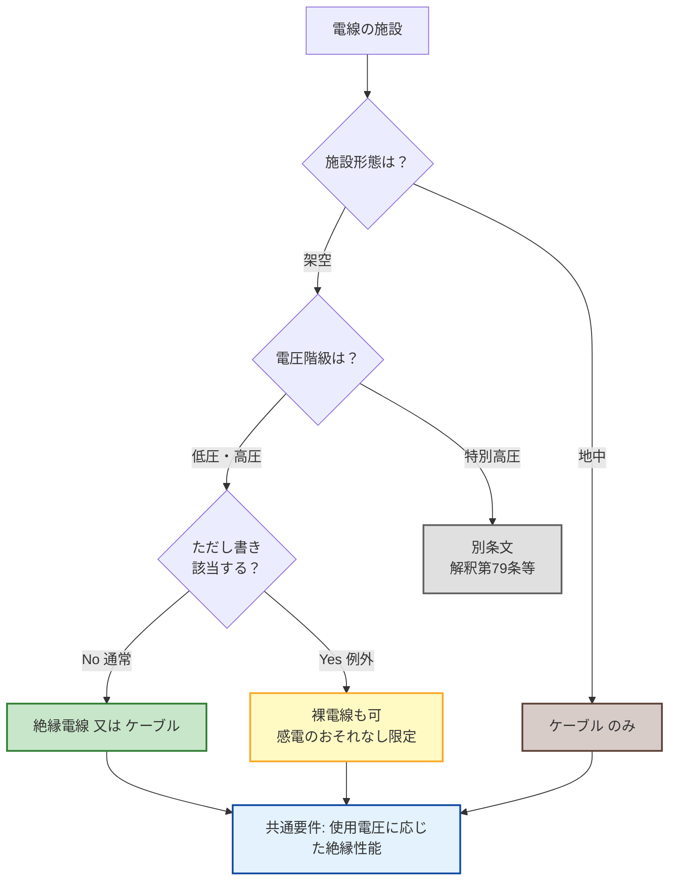

# 電気設備技術基準 第21条 — 架空電線及び地中電線の感電の防止

!!! note "📊 試験対策メタ"
    **出題頻度**: 🔥（過去14年で直接出題実績未確認・スタブ）

    **重要度**: C（基本・原則規定／第20条と第22条の中間）

    **直近出題**: —（直接出題実績なし・関連条文の参照対象）

> 低圧又は高圧の**架空電線**には、使用電圧に応じた絶縁性能を有する**絶縁電線又はケーブル**を使用しなければならない（通常予見される使用形態で感電のおそれがない場合は除く）。**地中電線**には、使用電圧に応じた絶縁性能を有する**ケーブル**を使用しなければならない。**架空＝2択（絶縁電線/ケーブル）＋ただし書き例外、地中＝ケーブル一択（例外なし）**の片務性が試験の核心。

| 項目 | 内容 |
|------|------|
| 条文 | 電気設備に関する技術基準を定める省令 第21条 |
| 規定内容 | 架空電線・地中電線の絶縁手段の具体化 |
| 性格 | 第20条（原則規定）の具体策／架空・地中で要求が異なる |
| 対象 | **低圧・高圧**の架空電線、すべての地中電線（特別高圧の架空電線は対象外） |
| 上位 | 省令第20条（電線路等の感電又は火災の防止） |

---

## 1. 全体像と要点

- 対象は **低圧・高圧の架空電線** と **地中電線**（**特別高圧の架空電線は対象外**＝典型ひっかけ）
- 架空電線 → **絶縁電線 又は ケーブル**（裸電線は原則不可・ただし書き例外あり）
- 地中電線 → **ケーブル のみ**（絶縁電線も裸電線も不可・ただし書きなし）
- 例外（ただし書き）は **架空電線のみ**：通常予見される使用形態で感電のおそれがない場合
- 第20条（原則規定）→ 第21条（架空・地中の絶縁手段）→ 第22条（低圧電線路の絶縁性能）の流れ

### ① 全体像 — 第21条の位置づけ

<svg viewBox="0 0 800 380" xmlns="http://www.w3.org/2000/svg" width="100%" preserveAspectRatio="xMidYMid meet">
<defs>
<filter id="sh21a" x="-20%" y="-20%" width="140%" height="140%"><feDropShadow dx="0" dy="2" stdDeviation="2" flood-opacity="0.15"/></filter>
<linearGradient id="gMain21" x1="0" y1="0" x2="0" y2="1"><stop offset="0%" stop-color="#bbdefb"/><stop offset="100%" stop-color="#90caf9"/></linearGradient>
<linearGradient id="gAir21" x1="0" y1="0" x2="0" y2="1"><stop offset="0%" stop-color="#c8e6c9"/><stop offset="100%" stop-color="#a5d6a7"/></linearGradient>
<linearGradient id="gUnd21" x1="0" y1="0" x2="0" y2="1"><stop offset="0%" stop-color="#d7ccc8"/><stop offset="100%" stop-color="#a1887f"/></linearGradient>
<linearGradient id="gExc21" x1="0" y1="0" x2="0" y2="1"><stop offset="0%" stop-color="#ffe0b2"/><stop offset="100%" stop-color="#ffcc80"/></linearGradient>
</defs>
<text x="400" y="26" text-anchor="middle" font-size="15" font-weight="700" fill="#212121">第21条 — 架空と地中で要求が異なる</text>
<text x="400" y="44" text-anchor="middle" font-size="11" fill="#666">第20条（原則）を架空・地中電線に具体化／対象は低圧・高圧のみ</text>
<rect x="280" y="60" width="240" height="60" rx="12" fill="url(#gMain21)" stroke="#0d47a1" stroke-width="2.5" filter="url(#sh21a)"/>
<text x="400" y="85" text-anchor="middle" font-size="14" font-weight="800" fill="#0d47a1">省令第21条</text>
<text x="400" y="105" text-anchor="middle" font-size="11" fill="#1565c0">架空・地中電線の感電防止</text>
<line x1="340" y1="125" x2="180" y2="160" stroke="#0d47a1" stroke-width="1.5" stroke-dasharray="3,2"/>
<line x1="460" y1="125" x2="620" y2="160" stroke="#0d47a1" stroke-width="1.5" stroke-dasharray="3,2"/>
<rect x="40" y="165" width="290" height="160" rx="14" fill="url(#gAir21)" stroke="#2e7d32" stroke-width="2.5" filter="url(#sh21a)"/>
<text x="185" y="190" text-anchor="middle" font-size="13" font-weight="700" fill="#1b5e20">第1項：架空電線</text>
<line x1="60" y1="200" x2="310" y2="200" stroke="#2e7d32" stroke-width="1"/>
<text x="185" y="222" text-anchor="middle" font-size="11" fill="#1b5e20">対象：低圧・高圧（特高は対象外）</text>
<text x="185" y="252" text-anchor="middle" font-size="14" font-weight="800" fill="#1b5e20">絶縁電線 又は ケーブル</text>
<text x="185" y="278" text-anchor="middle" font-size="11" fill="#2e7d32">使用電圧に応じた絶縁性能</text>
<text x="185" y="306" text-anchor="middle" font-size="10" fill="#558b2f">＋ ただし書き例外あり</text>
<rect x="470" y="165" width="290" height="160" rx="14" fill="url(#gUnd21)" stroke="#5d4037" stroke-width="2.5" filter="url(#sh21a)"/>
<text x="615" y="190" text-anchor="middle" font-size="13" font-weight="700" fill="#3e2723">第2項：地中電線</text>
<line x1="490" y1="200" x2="740" y2="200" stroke="#5d4037" stroke-width="1"/>
<text x="615" y="222" text-anchor="middle" font-size="11" fill="#3e2723">対象：すべての地中電線</text>
<text x="615" y="252" text-anchor="middle" font-size="14" font-weight="800" fill="#3e2723">ケーブル のみ</text>
<text x="615" y="278" text-anchor="middle" font-size="11" fill="#5d4037">使用電圧に応じた絶縁性能</text>
<text x="615" y="306" text-anchor="middle" font-size="10" fill="#6d4c41">ただし書き なし（例外不可）</text>
<text x="400" y="358" text-anchor="middle" font-size="11" font-weight="700" fill="#0d47a1">片務性：地中の方が要求が厳しい（環境ストレスが常時かかるため）</text>
</svg>

**読み解き**: 同じ「電線」でも **架空（空中）** と **地中（土中）** で要求材料が異なる。地中はケーブル一択で例外もなし。これは **環境ストレス（土壌・水分・機械的損傷）が常時かかる地中** では絶縁電線の被覆では耐久不足となるため。

### ② 要点（試験前30秒復習用）

| 観点 | 内容 |
|------|------|
| **対象範囲** | **低圧・高圧の架空電線**＋**すべての地中電線**（特別高圧の架空電線は対象外） |
| **架空の許容材料** | **絶縁電線 又は ケーブル**（2択） |
| **地中の許容材料** | **ケーブル のみ**（1択） |
| **共通義務** | **使用電圧に応じた絶縁性能** を有すること |
| **例外規定** | **架空電線のみ** ただし書きあり（通常予見される使用形態で感電のおそれがない場合） |
| **上位条文** | 省令第20条（電線路等の感電又は火災の防止）＝原則規定 |

??? question "セルフチェック: 地中電線に絶縁電線を使ってもよいか？"
    **不可**。地中電線は **ケーブル** を使用しなければならない（第21条第2項）。架空電線は絶縁電線でも可だが、地中はケーブル一択。

    **理由**: 地中は土壌・水分・機械的損傷（掘削・地盤沈下・凍結融解など）に常時さらされる。絶縁電線の被覆だけでは化学的・機械的耐久性が不足するため、シース（外被）まで備えたケーブルが必須となる。

??? question "セルフチェック: 特別高圧の架空電線も第21条の対象か？"
    **対象外**。第21条第1項は **「低圧又は高圧の架空電線」** と明記しており、特別高圧の架空電線は対象に含まれない。特別高圧架空電線路の絶縁要求は別途、電気設備の技術基準の解釈（第79条以降など）で規定される。

    **ひっかけ注意**: 「すべての架空電線は絶縁電線又はケーブルでなければならない」は誤り（特高は対象外）。

---

## 2. 条文原文

**電気設備に関する技術基準を定める省令 第21条（架空電線及び地中電線の感電の防止）**

**第1項（架空電線）**

> 低圧又は高圧の架空電線には、感電のおそれがないよう、使用電圧に応じた絶縁性能を有する絶縁電線又はケーブルを使用しなければならない。ただし、通常予見される使用形態を考慮し、感電のおそれがない場合は、この限りでない。

**第2項（地中電線）**

> 地中電線（地中電線路の電線をいう。以下同じ。）には、感電のおそれがないよう、使用電圧に応じた絶縁性能を有するケーブルを使用しなければならない。

> <small>※ 過去14年で直接出題実績は未確認のため、本条文には穴埋めマーカーを付していない（出題実績が確認され次第追加）。</small>

→ 架空は **絶縁電線又はケーブル**（裸電線は原則不可・ただし書き例外あり）、地中は **ケーブル一択**（絶縁電線も不可）。**特別高圧の架空電線は本条対象外**（別条文・電技解釈で規定）。第20条の原則規定を架空・地中電線について具体化した条文。

### 過去問で問われる可能性が高い候補キーワード

第21条は直接出題実績は未確認だが、原則規定として正誤問題で参照される可能性がある。穴埋めなら以下が候補。

| 候補キーワード | 想定される問われ方 |
|---|---|
| **絶縁電線又はケーブル** | 架空電線の許容材料の穴埋め |
| **ケーブル** | 地中電線の許容材料の穴埋め |
| **使用電圧に応じた絶縁性能** | 義務文言の穴埋め |
| **低圧又は高圧** | 架空電線の対象範囲の穴埋め（特高除外を確認） |
| **通常予見される使用形態** | ただし書き例外条件の穴埋め |

!!! tip "暗記の核心キーワード"
    - **架空：絶縁電線 又は ケーブル** ／ **地中：ケーブル のみ**
    - **使用電圧に応じた絶縁性能** — 低圧・高圧で要求性能が段階的
    - **ただし通常予見される使用形態で感電のおそれがない場合は、この限りでない** — 架空のみの例外（地中にはない）
    - **対象は低圧・高圧の架空** — 特別高圧の架空電線は対象外（典型ひっかけ）

!!! note "出典"
    電気設備に関する技術基準を定める省令（平成九年通商産業省令第五十二号、令和5年改正版）第21条
    e-Gov 法令検索: <https://laws.e-gov.go.jp/document?lawid=409M50000400052>

---

## 3. 原文解析（ブロック分解）

条文を意味ブロック単位に分解し、それぞれの試験ポイントを整理する。

### 第1項（架空電線）

| 原文ブロック | 意味 | 試験のポイント |
|---|---|---|
| 「低圧又は高圧の架空電線には」 | 適用範囲＝**低圧・高圧の架空電線のみ** | **特別高圧の架空電線は対象外**（典型ひっかけ） |
| 「感電のおそれがないよう」 | 立法趣旨＝感電防止 | 「火災のおそれ」との混同に注意（第20条は感電・火災両方） |
| 「使用電圧に応じた絶縁性能を有する」 | 電圧階級ごとに絶縁性能が要求される | 低圧用・高圧用で電線種類が異なる |
| 「絶縁電線又はケーブルを使用しなければならない」 | **2択**（絶縁電線 or ケーブル） | **裸電線は原則不可**。両方とも認められる |
| 「ただし、通常予見される使用形態を考慮し、感電のおそれがない場合は、この限りでない」 | **架空のみの例外**規定 | 地中には対応する例外がないことを必ず確認 |

### 第2項（地中電線）

| 原文ブロック | 意味 | 試験のポイント |
|---|---|---|
| 「地中電線（地中電線路の電線をいう。以下同じ。）には」 | 適用範囲＝**すべての地中電線**（電圧階級の限定なし） | 低圧・高圧・特別高圧すべて含む |
| 「感電のおそれがないよう」 | 立法趣旨＝感電防止 | 第1項と同じ |
| 「使用電圧に応じた絶縁性能を有する」 | 電圧階級ごとに絶縁性能が要求される | 第1項と同じ |
| 「ケーブルを使用しなければならない」 | **1択**（ケーブルのみ） | **絶縁電線も不可**。シース（外被）必須 |
| （ただし書きなし） | 例外規定なし | 第1項にあるただし書きが第2項にはない＝片務性 |

??? question "セルフチェック: 第1項と第2項の最大の違いは何か？"
    **片務性**。第1項（架空）は「絶縁電線又はケーブル」の **2択 ＋ ただし書き例外** があるが、第2項（地中）は「ケーブル」の **1択 ＋ 例外なし**。

    地中は環境ストレス（土壌・水分・機械的損傷）が常時かかるため、絶縁電線の被覆では耐久不足。例外を認める余地もないという設計思想。

---

## 4. かみ砕き解説（因果理解）

### なぜ架空と地中で要求が違うのか — 環境ストレスの違い

| 観点 | 架空電線 | 地中電線 |
|------|---------|---------|
| **接触可能性** | 高所のため通常は人が触れない | 通常は土中で人が触れない |
| **環境ストレス** | 風雨・紫外線・温度変化 | **土壌・水分・機械的損傷（常時）** |
| **必要な耐久性** | 大気中の絶縁＋耐候性 | 化学的耐久性＋機械的強度＋防水 |
| **許容材料** | **絶縁電線 or ケーブル** | **ケーブル のみ**（シース必須） |

### 絶縁電線とケーブルの違い

| 項目 | 絶縁電線（IV線・OW線・DV線等） | ケーブル（CV・CVT・VVF等） |
|------|--------------------------|-----------------------|
| **構造** | 導体＋絶縁体（被覆1層） | 導体＋絶縁体＋**シース（外被）** |
| **耐機械的損傷** | △（被覆のみ） | ○（シースで保護） |
| **耐水・耐土壌** | △（限定的） | ○（防水・耐薬品） |
| **使用場所** | 屋内配線・架空配線 | 地中・水中・屋外重防護 |
| **第21条上の扱い** | 架空＝可／地中＝**不可** | 架空＝可／地中＝**必須** |

!!! tip "暗記のコツ — 「シースの有無」で覚える"
    **絶縁電線 = 被覆1層／ケーブル = 被覆＋シース（外被）**

    地中は土壌の化学的攻撃と土圧・掘削などの機械的損傷を受けるため、シース（外被）まで備えた **ケーブル必須**。架空は風雨と紫外線が主なストレスなので絶縁電線でも耐えられる。

### なぜ特別高圧の架空電線は第21条対象外か

特別高圧（7,000V超）の架空電線は、低圧・高圧とは要求事項が大きく異なるため、別途 **電技解釈第79条以降** などで規定される。第21条は対象を **低圧・高圧の架空電線** に限定することで、シンプルな2択ルールを維持している。

!!! warning "ひっかけ：「すべての架空電線は絶縁電線又はケーブル」"
    **誤り**。第21条第1項は「**低圧又は高圧の**架空電線」と明記。特別高圧架空電線は本条対象外で、別条文に委ねられる。

---

## 5. 図で理解

### 判定フロー（電線種類の選び方）

### 架空電線と地中電線の構造比較

<svg viewBox="0 0 800 360" xmlns="http://www.w3.org/2000/svg" width="100%" preserveAspectRatio="xMidYMid meet">
<defs>
<filter id="sh21b" x="-20%" y="-20%" width="140%" height="140%"><feDropShadow dx="0" dy="2" stdDeviation="2" flood-opacity="0.15"/></filter>
</defs>
<text x="400" y="24" text-anchor="middle" font-size="15" font-weight="700" fill="#212121">架空 vs 地中 — 環境ストレスと許容材料</text>
<text x="400" y="42" text-anchor="middle" font-size="11" fill="#666">同じ電線でも環境が違えば必要な耐久性が違う</text>
<line x1="400" y1="56" x2="400" y2="350" stroke="#bdbdbd" stroke-width="1" stroke-dasharray="4,3"/>
<rect x="20" y="56" width="360" height="294" rx="10" fill="#e3f2fd" stroke="#90caf9" stroke-width="1.5"/>
<text x="200" y="76" text-anchor="middle" font-size="13" font-weight="700" fill="#0d47a1">架空電線（第1項）</text>
<line x1="60" y1="120" x2="340" y2="120" stroke="#1565c0" stroke-width="2"/>
<circle cx="60" cy="120" r="6" fill="#5d4037" stroke="#3e2723" stroke-width="1.5"/>
<circle cx="340" cy="120" r="6" fill="#5d4037" stroke="#3e2723" stroke-width="1.5"/>
<rect x="56" y="120" width="8" height="36" fill="#5d4037"/>
<rect x="336" y="120" width="8" height="36" fill="#5d4037"/>
<text x="60" y="172" text-anchor="middle" font-size="9" fill="#616161">支持物</text>
<text x="340" y="172" text-anchor="middle" font-size="9" fill="#616161">支持物</text>
<text x="200" y="106" text-anchor="middle" font-size="10" font-weight="600" fill="#0d47a1">大気中（風雨・紫外線・温度変化）</text>
<rect x="50" y="200" width="300" height="50" rx="6" fill="#c8e6c9" stroke="#2e7d32" stroke-width="2"/>
<text x="200" y="220" text-anchor="middle" font-size="11" font-weight="700" fill="#1b5e20">許容材料：絶縁電線 又は ケーブル</text>
<text x="200" y="238" text-anchor="middle" font-size="10" fill="#1b5e20">2択／ただし書き例外あり</text>
<rect x="50" y="260" width="300" height="36" rx="6" fill="#fff9c4" stroke="#f9a825" stroke-width="1.5"/>
<text x="200" y="278" text-anchor="middle" font-size="10" fill="#f57f17">主なストレス：</text>
<text x="200" y="290" text-anchor="middle" font-size="10" fill="#f57f17">風・雨・紫外線・温度変化</text>
<rect x="50" y="304" width="300" height="36" rx="6" fill="#e8f5e9" stroke="#558b2f" stroke-width="1.5"/>
<text x="200" y="320" text-anchor="middle" font-size="10" fill="#2e7d32">代表電線種：OW・DV（屋外用ビニル絶縁）</text>
<text x="200" y="332" text-anchor="middle" font-size="10" fill="#2e7d32">絶縁電線で十分耐えられる</text>
<rect x="420" y="56" width="360" height="294" rx="10" fill="#efebe9" stroke="#a1887f" stroke-width="1.5"/>
<text x="600" y="76" text-anchor="middle" font-size="13" font-weight="700" fill="#3e2723">地中電線（第2項）</text>
<rect x="440" y="100" width="320" height="80" fill="#8d6e63" stroke="#5d4037" stroke-width="1"/>
<text x="600" y="120" text-anchor="middle" font-size="10" font-weight="600" fill="#fff">土壌（土圧・水分・薬品）</text>
<rect x="540" y="135" width="120" height="30" rx="4" fill="#424242" stroke="#212121" stroke-width="1.5"/>
<rect x="548" y="142" width="104" height="16" rx="2" fill="#fff59d" stroke="#f57f17" stroke-width="1"/>
<text x="600" y="156" text-anchor="middle" font-size="9" fill="#bf360c">ケーブル（シース付）</text>
<rect x="450" y="200" width="300" height="50" rx="6" fill="#d7ccc8" stroke="#5d4037" stroke-width="2"/>
<text x="600" y="220" text-anchor="middle" font-size="11" font-weight="700" fill="#3e2723">許容材料：ケーブル のみ</text>
<text x="600" y="238" text-anchor="middle" font-size="10" fill="#3e2723">1択／ただし書きなし</text>
<rect x="450" y="260" width="300" height="36" rx="6" fill="#ffe0b2" stroke="#ef6c00" stroke-width="1.5"/>
<text x="600" y="278" text-anchor="middle" font-size="10" fill="#bf360c">主なストレス：</text>
<text x="600" y="290" text-anchor="middle" font-size="10" fill="#bf360c">土圧・水分・薬品・掘削損傷（常時）</text>
<rect x="450" y="304" width="300" height="36" rx="6" fill="#fbe9e7" stroke="#bf360c" stroke-width="1.5"/>
<text x="600" y="320" text-anchor="middle" font-size="10" fill="#bf360c">代表電線種：CV・CVT（架橋PE絶縁）</text>
<text x="600" y="332" text-anchor="middle" font-size="10" fill="#bf360c">シース必須・絶縁電線では不可</text>
</svg>

**読み解き**: 架空は風雨・紫外線が主なストレスで、絶縁電線（被覆1層）でも耐えられる。地中は土圧・水分・掘削損傷が常時かかるため、絶縁体の外側に **シース（外被）** を備えたケーブルが必須となる。「シースの有無」が架空／地中の許容材料の境界。

---

## 6. 関連条文との関係

### 上位条文（原則規定）

**省令第20条（電線路等の感電又は火災の防止）**

> 電線路又は電車線路は、施設場所の状況及び電圧に応じ、感電又は火災のおそれがないように施設しなければならない。

第20条が「感電・火災のおそれがないように施設」と原則を述べたのを受け、第21条は **架空・地中電線の絶縁手段** を具体化する。

### 並列条文（同じ第1節「感電、火災等の防止」）

| 条文 | 内容 | 第21条との関係 |
|------|------|---------------|
| 第20条 | 電線路等の感電又は火災の防止（原則） | **上位**（第21条はその具体化） |
| **第21条** | **架空電線・地中電線の感電の防止（絶縁手段）** | **本条** |
| 第22条 | 低圧電線路の絶縁性能（漏えい電流） | **並列**（第21条が材料、第22条が性能数値） |

### 別概念との区別

| 概念 | 対象 | 規定 |
|------|------|------|
| **電線路** | 電線＋支持物の一式（屋外設備全体） | 第20条・第21条 |
| **電路** | 通電部分（屋内も含む通電経路） | 第5条（電路の絶縁） |

??? question "セルフチェック: 「電線路」と「電路」の違いは？"
    - **電線路**: 屋外の電線とその支持物等を含む設備全体（架空電線路・地中電線路）。第20条・第21条が規定。
    - **電路**: 通電部分（電気が流れる経路全体・屋内含む）。第5条が規定。

    第21条は「電線路を構成する電線」の材料を指定する規定。第5条の「電路の絶縁」とは適用範囲が異なる。

---

## 7. 頻出ひっかけ・落とし穴

試験で実際に失点しやすいポイントを、重大度別に整理した。

### 🔴 致命的（これを間違えたら即失点）

| # | ❌ 誤った認識 | ✅ 正しい認識 |
|---|--------------|--------------|
| 1 | 地中電線にも絶縁電線が使える | 地中電線は **ケーブル のみ**（絶縁電線も不可）。シース必須 |
| 2 | 架空電線も地中電線も同じ要求 | **片務性**：架空は2択＋ただし書き例外、地中はケーブル一択＋例外なし |
| 3 | すべての架空電線が第21条対象 | 対象は **低圧・高圧の架空電線のみ**。**特別高圧の架空電線は対象外** |

### 🟡 注意（出題頻度高い）

| # | ❌ 誤った認識 | ✅ 正しい認識 |
|---|--------------|--------------|
| 4 | 第2項（地中）にもただし書き例外がある | 地中電線にはただし書きなし。例外を認めるのは **第1項（架空）のみ** |
| 5 | 「裸電線も使える場合がある」は間違い | ただし書きの「通常予見される使用形態で感電のおそれがない場合」は **架空のみ** で限定的に裸電線を許容する余地がある |
| 6 | 第21条で具体的な絶縁抵抗値が決まる | 第21条は **材料（絶縁電線/ケーブル）の指定**。具体的な絶縁抵抗値は第22条・第58条・解釈第14条等で規定 |

### 🟢 軽微（余裕があれば）

| # | ❌ 誤った認識 | ✅ 正しい認識 |
|---|--------------|--------------|
| 7 | 「電線路」と「電路」は同じ | 電線路 = 電線＋支持物の屋外設備一式（第20・21条）。電路 = 通電部分（第5条） |
| 8 | 第21条は感電と火災の両方が立法趣旨 | 第21条第1項・第2項とも **「感電のおそれがないよう」**（火災ではない）。第20条は感電＋火災両方 |

---

## 8. 穴埋め過去問チャレンジ

!!! note "出題実績について"
    第21条は過去14年で直接出題実績未確認のため、以下は **想定問題**（条文文言からの推定）。第20条・第22条の正誤問題で参照される際の論点として活用できる。

!!! abstract "問題1: 架空電線の許容材料"
    低圧又は高圧の架空電線には、感電のおそれがないよう、使用電圧に応じた絶縁性能を有する（　ア　）又は（　イ　）を使用しなければならない。

??? success "解答"
    - ア = **絶縁電線**
    - イ = **ケーブル**

    順序は条文通り「絶縁電線又はケーブル」。「ケーブル又は絶縁電線」と入れ替わっても意味は同じだが、条文表現を正確に覚える。

!!! abstract "問題2: 地中電線の許容材料"
    地中電線には、感電のおそれがないよう、使用電圧に応じた絶縁性能を有する（　ア　）を使用しなければならない。

??? success "解答"
    - ア = **ケーブル**

    地中は **ケーブル一択**。「絶縁電線又はケーブル」と書くと誤り（架空との混同を狙うひっかけ）。

!!! abstract "問題3: 対象範囲"
    第21条第1項の架空電線に関する規定の対象は、（　ア　）又は（　イ　）の架空電線である。

??? success "解答"
    - ア = **低圧**
    - イ = **高圧**

    **特別高圧の架空電線は対象外**。「特別高圧」を含む選択肢はひっかけ。

!!! abstract "問題4: ただし書き例外"
    架空電線について、（　ア　）される使用形態を考慮し、（　イ　）のおそれがない場合は、絶縁電線又はケーブル使用の義務によらない。

??? success "解答"
    - ア = **通常予見**
    - イ = **感電**

    例外規定は **架空電線のみ** で適用される。地中電線にはこのただし書きはない。

---

## 9. まぎらわしい選択肢と正解の違い

| 誤った記述 | 正しい記述 | なぜ違うか |
|---|---|---|
| 「地中電線には絶縁電線又はケーブルを使用」 | 地中電線には **ケーブル のみ** を使用 | 第2項は1択。絶縁電線は不可 |
| 「すべての架空電線に絶縁電線又はケーブル使用義務」 | **低圧・高圧の架空電線** に絶縁電線又はケーブル使用義務 | 特別高圧は対象外 |
| 「地中電線にもただし書き例外がある」 | ただし書き例外は **第1項（架空）のみ** | 第2項にはただし書きなし |
| 「第21条で絶縁抵抗値が定まる」 | 第21条は **材料の指定**。絶縁抵抗値は第22条・第58条・解釈第14条等 | 第21条は数値規定ではなく材料規定 |
| 「第21条の立法趣旨は感電と火災の防止」 | 第21条の立法趣旨は **感電の防止**（火災防止は第20条） | 条文文言「感電のおそれがないよう」のみ |
| 「電線路と電路は同じ概念」 | **電線路** = 屋外設備一式（電線＋支持物）／**電路** = 通電部分 | 適用条文・概念が異なる |

---

## 10. 関連条文・関連ページ

- [電線路等の感電又は火災の防止 第20条](20.md) — **上位条文**（第21条はその具体化）
- 第22条（低圧電線路の絶縁性能） — **並列条文**（材料は第21条／性能は第22条）※スタブ未作成
- [電路の絶縁 第5条](5.md) — 「電路」（通電部分）の絶縁規定（電線路とは別概念）
- [低圧の電路の絶縁性能 第58条](58.md) — 屋内電路の絶縁抵抗値（数値規定）
- [架空電線路テーマ](../../themes/kachiku-densen.md) — 架空電線関連の横展開

---

## 11. 過去問実績

| 年度 | 問 | 形式 | 論点 |
|------|-----|------|------|
| — | — | — | 直接出題実績は未確認（スタブ） |

!!! note "出題傾向の見立て"
    第21条は原則規定で単独穴埋め出題は少ないと推定される。第20条（原則）→第21条（材料）→第22条（性能）の流れで、正誤問題の論点として参照される可能性が高い。

!!! note "R08 出題予測"
    穴埋め出題があれば「絶縁電線又はケーブル」「ケーブル」「低圧又は高圧」が候補。正誤なら **架空／地中の使い分け** と **特別高圧除外** が論点になりやすい。

---

## 12. 用語集

第21条の条文や出題で登場する主要用語を整理した。

| 用語 | 読み | 意味 | 試験での注意点 |
|------|------|------|----------------|
| 架空電線 | がくうでんせん | 支持物（電柱等）に支持されて空中に張られる電線 | 「架空電線路」は電線＋支持物の総称 |
| 地中電線 | ちちゅうでんせん | 地中電線路の電線（条文括弧書きで定義） | 暗渠・管路・直接埋設のいずれの方式でも「地中電線」 |
| 絶縁電線 | ぜつえんでんせん | 導体に絶縁体（被覆1層）を施した電線（OW・DV・IV等） | シース（外被）はない／第21条第2項では使用不可 |
| ケーブル | けーぶる | 絶縁電線にさらにシース（外被）を施した電線（CV・CVT・VVF等） | シースが機械的・化学的耐久性を担う／地中で必須 |
| 裸電線 | はだかでんせん | 絶縁被覆のない導体だけの電線 | 第21条では原則使用不可（架空のただし書き例外を除く） |
| 電線路 | でんせんろ | 発電所等以外で電気を運ぶための電線とその支持物・収納物の総称（屋外設備） | 「電路」（通電部分）とは別概念 |
| 電路 | でんろ | 通電部分（電気が流れる経路全体・屋内含む） | 第5条が規定。第21条の対象「電線路」とは異なる |
| シース | しーす | ケーブルの最外層被覆（外被）。機械的損傷・化学的攻撃から内部を保護 | 「シースの有無」が絶縁電線とケーブルの境界 |
| 使用電圧 | しようでんあつ | 電路に印加される線間電圧（公称値） | 「対地電圧」との区別／第21条では絶縁性能の段階要件 |
| 通常予見される使用形態 | つうじょうよけんされるしようけいたい | 第21条第1項ただし書きの例外条件 | 架空のみ／地中にはこの例外規定なし |

---

## 13. 最終チェック

### 材料規定

- [ ] 架空電線（低圧・高圧）= **絶縁電線 又は ケーブル**（2択）
- [ ] 地中電線（すべて）= **ケーブル のみ**（1択・シース必須）
- [ ] 共通要件 = **使用電圧に応じた絶縁性能**

### 対象範囲

- [ ] 架空電線の対象 = **低圧 又は 高圧**（特別高圧は対象外）
- [ ] 地中電線の対象 = **すべての電圧階級**（低圧・高圧・特別高圧）
- [ ] 「電線路」が対象（「電路」は第5条）

### 例外規定（片務性）

- [ ] **架空電線のみ** ただし書きあり = 通常予見される使用形態で感電のおそれがない場合
- [ ] **地中電線にはただし書きなし**（例外不可）

### 因果理解

- [ ] なぜ地中はケーブル必須か = **土壌・水分・機械的損傷が常時** → シース必須
- [ ] なぜ架空は絶縁電線でも可か = 主なストレスが風雨・紫外線で被覆1層で耐えられる
- [ ] なぜ特高架空は対象外か = 別途解釈第79条以降で要求事項が大きく異なるため

### 法令体系

- [ ] **第20条**（原則）→ **第21条**（材料）→ **第22条**（性能数値）の流れ
- [ ] 第21条 = **材料規定**（絶縁抵抗値は規定しない）
- [ ] 立法趣旨 = **感電の防止**（火災は第20条の管轄）

### ひっかけ対策

- [ ] 「地中に絶縁電線可」は誤り → **ケーブル必須**
- [ ] 「すべての架空電線に義務」は誤り → **低圧・高圧のみ**
- [ ] 「地中にもただし書き例外」は誤り → **架空のみ**

---

## 監修ログ

- **2026-05-03（新規作成）**: 旧 `21.md`（第24条の内容）を `24.md` にリネームしたことに伴い、本来の第21条「架空電線及び地中電線の感電の防止」をスタブとして新規作成。e-Gov 法令検索 API（409M50000400052）で条文原文（2項構成）と条見出しを照合 → 一致確認。
- **2026-05-05（v2.2改修）**: kijun/58.md v2.2 ゴールドスタンダードに準拠してテンプレート構造適合化。13セクション化（全体像SVG＋原文解析ブロック分解＋因果理解＋判定フローmermaid＋構造比較SVG＋穴埋め想定問題4問＋まぎらわしい選択肢比較表＋用語集10件＋最終チェックリスト）。ひっかけセクションを ❌/✅ 2列表＋致命的/注意/軽微の3段階重大度に再構成（58.md v2.2 と統一）。直接出題実績未確認のため `<mark>` 不使用で凡例に明示（feedback_denken_wiki_marker.md 規則準拠）。
- **数値検証判定: N/A**（原則規定・材料規定のため数値テーブルなし）

---

*最終確認: 2026-05-05 | 数値検証完了: 2026-05-05（N/A・原則規定） | ステータス: v2.2（テンプレート完全準拠版・58.md v2.2 と統一） | [バージョニング基準](../../reference/versioning.md)*
