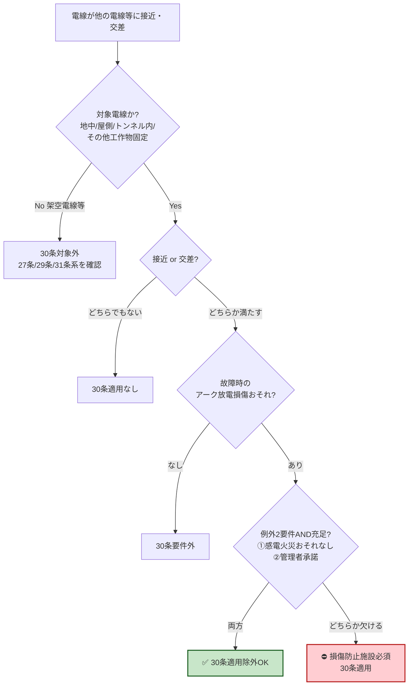

# 電技省令 第30条 — 地中電線等による他の電線及び工作物への危険の防止

!!! note "📊 試験対策メタ"
    **出題頻度**: 🔥🔥（過去14年で 1 回直接出題＋複合論点として参照）

    **重要度**: B（複合論点の前提語彙・地中電線路系の入口）

    **直近出題**: H18 問3（地中電線の施設・省令第30条＋第47条の2＋解釈第120〜125条の一括穴埋）

> **地中電線・屋側電線・トンネル内電線**等が他の電線・弱電流電線等・管と==接近又は交さ==する場合、==故障時のアーク放電==による損傷を防ぐ施設をしなければならない。ただし**感電・火災のおそれがない**かつ**他の電線等の管理者の承諾**を得た場合に限り適用除外。架空電線は対象外（架空は29条・31条系で別規定）。

| 項目 | 内容 |
|------|------|
| 条文 | 電気設備に関する技術基準を定める省令 第30条 |
| 規定内容 | 固定施設電線（地中・屋側・トンネル内・その他工作物固定）が他の電線等と接近・交差する場合のアーク放電損傷防止 |
| 性格 | 実体規定（数値なし）＋ 例外要件に手続的要素（管理者承諾）を含む |
| 委任先 | [解釈第120条](../kaishaku/120.md)（地中電線路の施設）／ 解釈第125条（地中電線と他の地中電線等との接近又は交差） |
| 上位 | [省令第5条](5.md)（電路の絶縁原則）／ 第二章第二節「他の電線、他の工作物等への危険の防止」 |
| **典拠（一次ソース）** | 電気設備に関する技術基準を定める省令（平成9年通商産業省令第52号）第30条 — e-Gov 法令API（lawid: 409M50000400052） |
| **照合日** | 2026-05-06（江間が e-Gov 法令API で本文・見出し・隣接条文を直接照合） |
| **隣接条文** | ← 第29条（電線による他の工作物等への危険の防止・未作成） ／ 第31条（異常電圧による架空電線等への障害の防止・未作成） → |

---

## ★0. 論点クラスタマップ — 28〜31条の差分

!!! tip "なぜこのマップを冒頭に置くか"
    試験では「30条単独」より **「28〜31条の差分を問う複合問題」** が多い。30条の本質は他条文との **境界** にある。

| 条文 | 対象 | 接触相手 | 防止すべき事象 | 例外要件 |
|------|------|---------|----------------|---------|
| 第28条 | 電線（一般） | 他の電線（電線同士） | 混触 | 解釈に委任 |
| 第29条 | 電線（一般） | 他の工作物等 | 接触・接近による危険 | 解釈に委任 |
| **第30条** | **固定施設電線（地中・屋側・トンネル内・その他）** | **他の電線・弱電流電線等・管** | **故障時のアーク放電損傷** | **感電火災おそれなし AND 管理者承諾** |
| 第31条 | 架空電線 | 架空電線（自他） | 異常電圧による障害（誘導・侵入） | 解釈に委任 |

### 30条の独自性
- **対象が「固定施設電線」に限定** — 架空・地下を問わず工作物に固定された電線が対象（屋側電線は架空ではない点に注意）
- **危険事象が「アーク放電損傷」と特定** — 28条の混触・29条の一般危険・31条の異常電圧とは異なる
- **例外要件が AND 条件で明示** — 他の3条は「解釈委任」だが30条のみ本文に例外要件を直接記載

### 複合問題の典型パターン
1. **境界判定型**: 屋側電線に通信線が接近 → 28条か30条か（→ 30条。屋側電線は固定施設電線）
2. **例外要件型**: 「管理者承諾だけで除外できる」と誤誘導（→ ❌。感電火災おそれなしも AND 必要）
3. **対象範囲型**: 架空電線が他の工作物に近接 → 30条適用（→ ❌。架空は29条・31条系）

---

## 1. 全体像と要点

- **対象電線4種**: ①地中電線 ②屋側電線 ③トンネル内電線 ④その他の工作物に固定して施設する電線
- **「他の電線等」3区分**: ①他の電線 ②弱電流電線等 ③管
- **適用条件**: 接近 **又は** 交差（OR — どちらか1つで適用）
- **防止すべき事象**: 故障時の **アーク放電** による損傷
- **例外要件（AND条件）**: 感電・火災のおそれがない **AND** 他の電線等の管理者の承諾

### ① 全体像 — 30条の構造

<div><svg viewBox="0 0 800 360" xmlns="http://www.w3.org/2000/svg" width="100%" preserveAspectRatio="xMidYMid meet">
<defs>
<filter id="sh30a" x="-20%" y="-20%" width="140%" height="140%"><feDropShadow dx="0" dy="2" stdDeviation="2" flood-opacity="0.15"/></filter>
<linearGradient id="gMain30a" x1="0" y1="0" x2="0" y2="1"><stop offset="0%" stop-color="#bbdefb"/><stop offset="100%" stop-color="#90caf9"/></linearGradient>
<linearGradient id="gA30a" x1="0" y1="0" x2="0" y2="1"><stop offset="0%" stop-color="#c8e6c9"/><stop offset="100%" stop-color="#a5d6a7"/></linearGradient>
<linearGradient id="gB30a" x1="0" y1="0" x2="0" y2="1"><stop offset="0%" stop-color="#fff9c4"/><stop offset="100%" stop-color="#fff176"/></linearGradient>
<linearGradient id="gC30a" x1="0" y1="0" x2="0" y2="1"><stop offset="0%" stop-color="#ffccbc"/><stop offset="100%" stop-color="#ff8a65"/></linearGradient>
</defs>
<text x="400" y="26" text-anchor="middle" font-size="15" font-weight="700" fill="#212121">第30条 — 固定施設電線のアーク放電損傷防止</text>
<text x="400" y="44" text-anchor="middle" font-size="11" fill="#666">対象電線4種 × 他の電線等3区分 × 接近or交差</text>
<rect x="280" y="60" width="240" height="60" rx="12" fill="url(#gMain30a)" stroke="#0d47a1" stroke-width="2.5" filter="url(#sh30a)"/>
<text x="400" y="85" text-anchor="middle" font-size="14" font-weight="800" fill="#0d47a1">省令第30条</text>
<text x="400" y="105" text-anchor="middle" font-size="11" fill="#1565c0">アーク放電損傷の防止</text>
<rect x="40" y="155" width="220" height="80" rx="10" fill="url(#gA30a)" stroke="#2e7d32" stroke-width="2"/>
<text x="150" y="178" text-anchor="middle" font-size="12" font-weight="700" fill="#1b5e20">対象電線（4種）</text>
<text x="150" y="198" text-anchor="middle" font-size="10" fill="#1b5e20">①地中電線 ②屋側電線</text>
<text x="150" y="214" text-anchor="middle" font-size="10" fill="#1b5e20">③トンネル内電線</text>
<text x="150" y="228" text-anchor="middle" font-size="10" fill="#1b5e20">④その他工作物固定電線</text>
<rect x="290" y="155" width="220" height="80" rx="10" fill="url(#gB30a)" stroke="#f57f17" stroke-width="2"/>
<text x="400" y="178" text-anchor="middle" font-size="12" font-weight="700" fill="#e65100">他の電線等（3区分）</text>
<text x="400" y="198" text-anchor="middle" font-size="10" fill="#e65100">①他の電線</text>
<text x="400" y="214" text-anchor="middle" font-size="10" fill="#e65100">②弱電流電線等</text>
<text x="400" y="228" text-anchor="middle" font-size="10" fill="#e65100">③管</text>
<rect x="540" y="155" width="220" height="80" rx="10" fill="url(#gC30a)" stroke="#bf360c" stroke-width="2"/>
<text x="650" y="178" text-anchor="middle" font-size="12" font-weight="700" fill="#bf360c">禁止される事象</text>
<text x="650" y="198" text-anchor="middle" font-size="10" fill="#bf360c">故障時のアーク放電による</text>
<text x="650" y="214" text-anchor="middle" font-size="10" fill="#bf360c">他の電線等への損傷</text>
<text x="650" y="228" text-anchor="middle" font-size="10" fill="#bf360c">（接近 or 交差時）</text>
<line x1="400" y1="120" x2="150" y2="155" stroke="#0d47a1" stroke-width="1.5" stroke-dasharray="3,2"/>
<line x1="400" y1="120" x2="400" y2="155" stroke="#0d47a1" stroke-width="1.5" stroke-dasharray="3,2"/>
<line x1="400" y1="120" x2="650" y2="155" stroke="#0d47a1" stroke-width="1.5" stroke-dasharray="3,2"/>
<rect x="180" y="270" width="440" height="70" rx="10" fill="#fff3e0" stroke="#ef6c00" stroke-width="2" stroke-dasharray="5,3"/>
<text x="400" y="293" text-anchor="middle" font-size="12" font-weight="700" fill="#e65100">例外（AND条件）</text>
<text x="400" y="313" text-anchor="middle" font-size="11" fill="#bf360c">① 感電・火災のおそれがない</text>
<text x="400" y="330" text-anchor="middle" font-size="11" fill="#bf360c">② 他の電線等の管理者の承諾</text>
</svg></div>

??? question "セルフチェック ① 対象範囲"
    Q. 架空電線が他の通信線に接近する場合、30条が適用される？

    A. **❌ 適用されない**。架空電線は30条の対象外（地中・屋側・トンネル内・その他工作物固定の4種に限定）。架空電線の接近・誘導は **27条系** で規定される。

??? question "セルフチェック ② 例外要件"
    Q. 「他の電線等の管理者の承諾」を得れば、感電・火災のおそれがあっても30条適用除外となる？

    A. **❌ ならない**。例外は **AND 条件** で、「感電・火災のおそれがない」AND「管理者承諾」の両方が必要。承諾だけでは除外不可。

---

## 2. 条文原文

!!! quote "電気設備に関する技術基準を定める省令 第30条"
    （地中電線等による他の電線及び工作物への危険の防止）

    第三十条　<mark>地中電線、屋側電線及びトンネル内電線その他の工作物に固定して施設する電線</mark>は、<mark>他の電線、弱電流電線等又は管</mark>（他の電線等という。以下この条において同じ。）と<mark>接近し、又は交さする</mark>場合には、<mark>故障時のアーク放電</mark>により他の電線等を損傷するおそれがないように施設しなければならない。<mark>ただし、感電又は火災のおそれがない場合であって、他の電線等の管理者の承諾を得た場合</mark>は、この限りでない。

!!! info "==マーカーの凡例"
    `==マーカー==` は **想定問題ベースのマーキング**（30条は実出題が稀のため、論理的に穴埋めされやすい語を機械的にマーク）。実際の過去問で穴埋め指定された語は H18 問3 のみで該当範囲が広いため、原文ベースで主要キーワードを網羅的にマーク。

### 適用対象テーブル

| 対象電線 | 具体例 | 施設形態 |
|---------|-------|---------|
| 地中電線 | 地中ケーブル（CVケーブル等） | 直接埋設・管路式・暗きょ式 |
| 屋側電線 | 建物外壁に固定された電線 | 金属管・がいし引き等 |
| トンネル内電線 | 鉄道・道路トンネル内の電線 | ケーブルラック・支持物固定 |
| その他工作物固定 | 橋梁添架電線・地下街電線等 | 工作物への直接固定 |

---

## 3. 原文解析（ブロック分解）

| ブロック | 抽出語 | 試験ポイント |
|---------|-------|-------------|
| ① 対象電線4種 | 地中電線／屋側電線／トンネル内電線／その他の工作物に固定して施設する電線 | 「架空電線は対象外」が最頻出ひっかけ |
| ② 他の電線等3区分 | 他の電線／弱電流電線等／管 | 「等」の範囲・包含関係 |
| ③ 適用条件 | 接近し、又は交さする | OR条件（どちらか1つで適用） |
| ④ 禁止事象 | 故障時のアーク放電により他の電線等を損傷するおそれ | 「アーク放電」がキーワード（混触・誘導とは異なる） |
| ⑤ 例外要件 | 感電又は火災のおそれがない **AND** 管理者の承諾 | **AND条件**（OR と誤読する罠） |

---

## 4. かみ砕き解説（因果理解）

### なぜ「アーク放電」がキーワードか

固定施設電線は **離隔距離を後から取り直せない** という構造的特性がある。地中ケーブルは埋設後の経路変更が困難、屋側電線は建物外壁に固定済み、トンネル内電線も支持物に縛り付けられている。

そのため **故障時（短絡・地絡）に発生する大電流 → アーク放電 → 数千℃の熱 + 力学的衝撃** で近接する他の電線・通信線・水道管などを損傷する物理的リスクが、架空電線（風揺れで離隔距離が動的に確保される）よりも高い。

```
故障発生 → 大電流 → 絶縁破壊 → アーク発生
       → 高温（数千℃）+ 圧力波 + 飛散物
       → 近接する他の電線等を損傷
```

### なぜ29条と分離されているか

| 観点 | 第29条（電線一般） | 第30条（固定施設電線） |
|------|---------------------|------------------------|
| 対象 | 電線一般（架空も含む） | 固定施設電線のみ |
| 危険源 | 接触・接近による危険全般 | **アーク放電に特化** |
| 例外 | 解釈に委任 | **本文に AND 条件記載** |
| 趣旨 | 一般原則 | 固定施設の特殊リスクへの追加規制 |

固定施設電線は架空電線と異なり「動かせない」「点検頻度が低い」「他事業者インフラと並走しやすい（共同溝・ケーブルラック）」ため、29条の一般規定に加えて **30条で特化規定** を置いている。

!!! warning "ひっかけ警告：架空電線は対象外"
    「架空電線が他の通信線に接近」は30条ではなく **第27条系（誘導障害）** や **第31条（異常電圧）** の領域。試験で30条選択肢に「架空」が含まれていたら誤りの可能性が高い。

---

## 5. 図で理解

### Mermaid判定フロー



### SVG事例① — 屋側電線×通信線の接近

<div><svg viewBox="0 0 700 280" xmlns="http://www.w3.org/2000/svg" width="100%" preserveAspectRatio="xMidYMid meet">
<defs>
<linearGradient id="wall30b" x1="0" y1="0" x2="1" y2="0"><stop offset="0%" stop-color="#bcaaa4"/><stop offset="100%" stop-color="#8d6e63"/></linearGradient>
</defs>
<text x="350" y="22" text-anchor="middle" font-size="14" font-weight="700" fill="#212121">事例① 屋側電線×通信線の接近</text>
<rect x="60" y="50" width="60" height="200" fill="url(#wall30b)" stroke="#5d4037" stroke-width="1.5"/>
<text x="90" y="265" text-anchor="middle" font-size="10" fill="#5d4037">建物外壁</text>
<line x1="135" y1="80" x2="135" y2="240" stroke="#d32f2f" stroke-width="3"/>
<circle cx="135" cy="80" r="4" fill="#d32f2f"/>
<circle cx="135" cy="240" r="4" fill="#d32f2f"/>
<text x="155" y="100" font-size="11" font-weight="700" fill="#b71c1c">屋側電線（高圧）</text>
<text x="155" y="115" font-size="9" fill="#b71c1c">建物外壁固定</text>
<line x1="180" y1="80" x2="180" y2="240" stroke="#1976d2" stroke-width="2" stroke-dasharray="4,2"/>
<circle cx="180" cy="80" r="3" fill="#1976d2"/>
<circle cx="180" cy="240" r="3" fill="#1976d2"/>
<text x="200" y="160" font-size="11" font-weight="700" fill="#0d47a1">通信線（弱電流電線等）</text>
<text x="200" y="175" font-size="9" fill="#0d47a1">同一外壁に並走</text>
<text x="155" y="220" font-size="10" fill="#666">←離隔小→</text>
<g transform="translate(420,140)">
<polygon points="0,-30 8,-10 -8,-10" fill="#ff5722" stroke="#bf360c" stroke-width="1"/>
<polygon points="0,30 8,10 -8,10" fill="#ff5722" stroke="#bf360c" stroke-width="1"/>
<line x1="-12" y1="0" x2="12" y2="0" stroke="#bf360c" stroke-width="2"/>
<text x="0" y="-40" text-anchor="middle" font-size="11" font-weight="700" fill="#bf360c">アーク</text>
<text x="0" y="50" text-anchor="middle" font-size="11" fill="#bf360c">放電損傷リスク</text>
</g>
<text x="350" y="120" text-anchor="middle" font-size="11" fill="#424242">→ 故障時に大電流が流れると</text>
<text x="350" y="200" text-anchor="middle" font-size="10" fill="#666">30条 適用 → 損傷防止の施設必須</text>
</svg></div>

### SVG事例② — トンネル内電線×水管の交差

<div><svg viewBox="0 0 700 260" xmlns="http://www.w3.org/2000/svg" width="100%" preserveAspectRatio="xMidYMid meet">
<defs>
<linearGradient id="tun30b" x1="0" y1="0" x2="0" y2="1"><stop offset="0%" stop-color="#cfd8dc"/><stop offset="100%" stop-color="#90a4ae"/></linearGradient>
</defs>
<text x="350" y="22" text-anchor="middle" font-size="14" font-weight="700" fill="#212121">事例② トンネル内電線×水管の交差</text>
<path d="M 50 50 Q 350 35 650 50 L 650 230 Q 350 245 50 230 Z" fill="url(#tun30b)" stroke="#455a64" stroke-width="2"/>
<text x="350" y="50" text-anchor="middle" font-size="10" fill="#37474f">トンネル断面</text>
<line x1="100" y1="120" x2="600" y2="120" stroke="#d32f2f" stroke-width="3"/>
<text x="120" y="112" font-size="11" font-weight="700" fill="#b71c1c">トンネル内電線（CVケーブル）</text>
<line x1="350" y1="80" x2="350" y2="200" stroke="#0277bd" stroke-width="6" opacity="0.8"/>
<text x="370" y="200" font-size="11" font-weight="700" fill="#01579b">水管（管）</text>
<text x="370" y="215" font-size="9" fill="#01579b">交差部</text>
<circle cx="350" cy="120" r="14" fill="#fff" stroke="#bf360c" stroke-width="2.5"/>
<text x="350" y="125" text-anchor="middle" font-size="10" font-weight="800" fill="#bf360c">⚡</text>
<text x="350" y="155" text-anchor="middle" font-size="10" font-weight="700" fill="#bf360c">交差点</text>
<text x="180" y="165" font-size="9" fill="#bf360c">アーク放電 → 水管損傷 → 漏水＋感電二次災害リスク</text>
</svg></div>

---

## ★6. 施設形態別の物理イメージ

!!! tip "なぜこのセクションが必要か"
    「対象電線4種」を文字だけで覚えると **境界事例（屋側vs引込・トンネルvs坑道）で誤判定** しやすい。実際の物理イメージを断面図で持つことで、論述・選択問題ともに判定精度が上がる。

### 地中電線の3方式（解釈第120条との接続）

<div><svg viewBox="0 0 800 240" xmlns="http://www.w3.org/2000/svg" width="100%" preserveAspectRatio="xMidYMid meet">
<defs>
<linearGradient id="gnd30c" x1="0" y1="0" x2="0" y2="1"><stop offset="0%" stop-color="#a1887f"/><stop offset="100%" stop-color="#6d4c41"/></linearGradient>
</defs>
<text x="400" y="22" text-anchor="middle" font-size="14" font-weight="700" fill="#212121">地中電線の3方式（解釈第120条 委任先の具体形態）</text>
<rect x="20" y="40" width="240" height="180" fill="url(#gnd30c)" opacity="0.5" stroke="#5d4037"/>
<text x="140" y="60" text-anchor="middle" font-size="12" font-weight="700" fill="#fff">直接埋設式</text>
<rect x="100" y="160" width="80" height="20" fill="#fff" stroke="#000" stroke-width="1.5"/>
<text x="140" y="174" text-anchor="middle" font-size="9" fill="#000">ケーブル</text>
<line x1="100" y1="100" x2="180" y2="100" stroke="#1976d2" stroke-dasharray="3,2"/>
<text x="140" y="115" text-anchor="middle" font-size="9" fill="#0d47a1">埋設深さ 1.2m以上※</text>
<rect x="280" y="40" width="240" height="180" fill="url(#gnd30c)" opacity="0.5" stroke="#5d4037"/>
<text x="400" y="60" text-anchor="middle" font-size="12" font-weight="700" fill="#fff">管路式</text>
<rect x="350" y="150" width="100" height="40" fill="#fff" stroke="#000" stroke-width="1.5"/>
<circle cx="380" cy="170" r="6" fill="#ffcdd2" stroke="#c62828"/>
<circle cx="420" cy="170" r="6" fill="#ffcdd2" stroke="#c62828"/>
<text x="400" y="205" text-anchor="middle" font-size="9" fill="#000">管路（複数ケーブル収納）</text>
<rect x="540" y="40" width="240" height="180" fill="url(#gnd30c)" opacity="0.5" stroke="#5d4037"/>
<text x="660" y="60" text-anchor="middle" font-size="12" font-weight="700" fill="#fff">暗きょ式</text>
<rect x="580" y="120" width="160" height="80" fill="#eceff1" stroke="#000" stroke-width="1.5"/>
<rect x="600" y="160" width="40" height="10" fill="#fff" stroke="#000" stroke-width="1"/>
<rect x="680" y="160" width="40" height="10" fill="#fff" stroke="#000" stroke-width="1"/>
<text x="660" y="190" text-anchor="middle" font-size="9" fill="#000">人が立入可能な空間</text>
<text x="660" y="215" text-anchor="middle" font-size="9" fill="#000">（共同溝・洞道）</text>
</svg></div>

!!! warning "数値根拠ガード"
    `埋設深さ 1.2m以上` は **解釈第120条** の規定であって、省令第30条本文には数値はない（30条は離隔・損傷防止の **原則** のみ規定し、数値は解釈委任）。

### 屋側電線・トンネル内電線

| 形態 | 物理イメージ | 30条適用上の論点 |
|------|------------|------------------|
| 屋側電線 | 建物外壁に金属管・がいし引きで固定 | 通信線・水道管との並走でアーク放電リスク |
| トンネル内電線 | ケーブルラック・支持物で天井/側壁固定 | 同一トンネル内の他電線・水管・ガス管との交差 |
| その他工作物固定 | 橋梁添架・地下街・共同溝 | 多事業者インフラとの離隔調整（管理者承諾の実務的論点） |

---

## ★7. アーク放電の物理メカニズム

!!! warning "本セクションは因果理解のための補助"
    アーク放電の物理プロセスは省令本文の **公式定義ではない**（feedback_pedagogical_approximation_guard.md 準拠）。試験で「アーク放電とは数千℃の…」と書いても部分点にはなるが、第一義は **「故障時のアーク放電による損傷防止」という条文文言の暗記** が優先。

### アーク放電の連鎖プロセス

```
[1] 故障発生（短絡・地絡）
    ↓
[2] 大電流（定格の数十〜数百倍）
    ↓
[3] 絶縁破壊 → 空気の電離 → プラズマ柱（アーク）形成
    ↓
[4] アーク柱内の温度: 数千℃〜数万℃
    アーク柱外への放射熱・圧力波・溶融金属飛散
    ↓
[5] 近接する他の電線・通信線・配管の被覆劣化・破損・延焼
```

### なぜ「絶縁破壊」ではなく「アーク放電」と書かれているか

省令第30条が「アーク放電」という具体語を使うのは、**事象の因果連鎖の最も損傷力が高い段階を指定** するため。「絶縁破壊」は事象の入口、「アーク放電」は損傷源の本体。条文は損傷を起こす **メカニズムを明示** することで施設者に防止対策（離隔・遮蔽・耐熱被覆等）の方向性を示している。

| 用語 | 意味 | 30条での扱い |
|------|------|-------------|
| 絶縁破壊 | 絶縁体が電圧に耐えられず導通する現象 | 上位概念・直接記載なし |
| **アーク放電** | 絶縁破壊後に持続するプラズマ放電 | **本文記載・損傷源** |
| 故障電流 | 故障時に流れる大電流 | アーク発生の原因 |

---

## 8. 適用範囲と除外

### 対象電線4種の境界

| 対象 | 含まれる | 含まれない（要注意） |
|------|----------|----------------------|
| 地中電線 | 直接埋設・管路式・暗きょ式の地中ケーブル | 地表に露出した部分（架空扱い） |
| 屋側電線 | 建物外壁固定の電線 | **引込線**（22条系で別規定） |
| トンネル内電線 | 鉄道・道路トンネル内 | **坑道内**（解釈別規定） |
| その他工作物固定 | 橋梁添架・地下街・共同溝 | 移動電線・仮設配線 |

### 「他の電線等」3区分の包含

```
他の電線等
├── 他の電線 — 強電流の電線（電力線）
├── 弱電流電線等 — 通信線・信号線・制御線・火災報知線等
└── 管 — 水管・ガス管・空調ダクト等の管路
```

### 例外要件のAND/OR論理（試験頻出ひっかけ）

!!! danger "AND要件・OR要件の取り違え"
    | 表現 | 正誤 | 解説 |
    |------|------|------|
    | 感電火災のおそれがない **かつ** 管理者承諾 | ✅ 正 | 条文「であって」は AND 接続 |
    | 感電火災のおそれがない **または** 管理者承諾 | ❌ 誤 | OR と読んだら例外範囲が拡大して安全側に倒れない |
    | 管理者承諾だけで除外 | ❌ 誤 | 感電火災おそれなしの判断が承諾より優先 |

---

## ★9. 隣接条文との差分マトリクス（試験頻出論点）

| 観点 | 第28条 | 第29条 | **第30条** | 第31条 |
|------|--------|--------|------------|--------|
| 対象電線 | 電線（一般） | 電線（一般） | **固定施設電線（地中・屋側・トンネル内・その他）** | 架空電線 |
| 接触相手 | 他の電線（混触） | 他の工作物等 | **他の電線・弱電流電線等・管** | 架空電線（自他） |
| 危険事象 | 混触 | 接近・接触全般 | **故障時のアーク放電損傷** | 異常電圧（誘導・侵入） |
| 例外要件 | 解釈委任 | 解釈委任 | **本文記載: 感電火災おそれなし AND 管理者承諾** | 解釈委任 |
| 主な委任先 | 解釈第28条系 | 解釈第29条系 | **解釈第120条／第125条** | 解釈第49条系 |

### 境界事例の判定

| 状況 | 適用条文 | 判定理由 |
|------|---------|----------|
| 屋側電線×通信線の接近 | 第30条 | 屋側電線は「固定施設電線」 |
| 架空電線×通信線の誘導障害 | 第27条系 | 架空は30条対象外 |
| 地中電線×他の地中電線の交差 | 第30条 ＋ 解釈第125条 | 「他の電線」に該当 |
| 引込線（造営材取付前）×電力線の混触 | 第28条系 | 引込線は屋側電線とは別概念 |

---

## 10. 省令と解釈の関係

```
🟨 省令第5条（電路の絶縁原則）
    ↓ 上位
🟨 省令第29条（一般・電線vs工作物）
🟨 省令第30条（特化・固定施設電線のアーク防止）
    ↓ 委任
🟩 解釈第120条（地中電線路の施設・3方式・埋設深さ）
🟩 解釈第125条（地中電線と他の地中電線等との接近又は交差）
```

| レベル | 規定内容 | 性格 |
|--------|---------|------|
| 省令第5条 | 電路の絶縁原則（上位原則） | 理念 |
| 省令第30条 | アーク放電損傷防止の原則 + 例外要件 | 原則 |
| 解釈第120条 | 地中電線路の3方式・埋設深さ・標識 | 具体・数値 |
| 解釈第125条 | 地中電線と他電線の離隔距離・遮蔽方法 | 具体・数値 |

詳細な離隔距離・施設方法は **[解釈第120条](../kaishaku/120.md)** および解釈第125条で具体化される。

---

## ★11. A/B 2層暗記表

!!! tip "A/B暗記法"
    **A面（適用要件）** を全て満たすと30条が適用される。**B面（除外要件）** を AND で満たすと例外で適用除外される。

### A面 — 適用要件（全て満たすと30条適用）

| # | 要件 | 暗記キー |
|---|------|---------|
| A1 | 対象電線4種のいずれか | 「**地・屋・ト・固**」（地中・屋側・トンネル・固定） |
| A2 | 他の電線等3区分のいずれかと接触可能性 | 「**他・弱・管**」（他の電線・弱電流・管） |
| A3 | 接近 OR 交差 | 「近 or 交」（OR条件） |
| A4 | 故障時のアーク放電損傷おそれ | 「アーク」 |

### B面 — 除外要件（AND で満たすと例外）

| # | 要件 | 暗記キー |
|---|------|---------|
| B1 | 感電のおそれがない | 「感電なし」 |
| B2 | 火災のおそれがない | 「火災なし」 |
| B3 | 他の電線等の管理者の承諾 | 「**承諾**」 |

**B1 ∧ B2 ∧ B3** の3つを **すべて** 満たして初めて例外。1つでも欠けたら適用必須。

---

## 12. 頻出ひっかけ・落とし穴

### 🔴 致命的（合否を分ける）

| ❌ 誤認 | ✅ 正解 |
|---------|---------|
| 架空電線も30条対象 | 架空電線は **対象外**（27条系・31条系） |
| 例外は「感電火災おそれなし **OR** 管理者承諾」 | **AND** 要件。両方必要 |

### 🟡 注意（差がつく）

| ❌ 誤認 | ✅ 正解 |
|---------|---------|
| 屋側電線＝引込線 | 別概念。引込線は屋側電線とは別 |
| 管理者承諾は口頭でOK | 実務上は **書面承諾**（保安規程・工事計画届出に添付） |

### 🟢 軽微（迷いやすい）

| ❌ 誤認 | ✅ 正解 |
|---------|---------|
| 「弱電流電線等」の「等」は通信線のみ | 信号線・制御線・火災報知線も含む |

---

## 13. 穴埋め過去問チャレンジ

!!! warning "実出題状況"
    第30条の **直接的な穴埋出題は H18 問3 の1回のみ**（解釈120-125・47条の2との一括出題）。以下は条文原文ベースの **想定問題** を含む。

### 問1 — 対象電線（H18類題ベース）

??? question "問題"
    地中電線、（　ア　）電線及び（　イ　）内電線その他の工作物に固定して施設する電線は、他の電線、（　ウ　）電線等又は管と接近し、又は交さする場合には…

??? success "解答"
    **ア = 屋側 ／ イ = トンネル ／ ウ = 弱電流**

### 問2 — 禁止事象

??? question "問題"
    ……（前略）……の場合には、（　ア　）時の（　イ　）放電により他の電線等を損傷するおそれがないように施設しなければならない。

??? success "解答"
    **ア = 故障 ／ イ = アーク**

### 問3 — 例外要件

??? question "問題"
    ただし、（　ア　）又は（　イ　）のおそれがない場合であって、他の電線等の（　ウ　）の承諾を得た場合は、この限りでない。

??? success "解答"
    **ア = 感電 ／ イ = 火災 ／ ウ = 管理者**

### 問4 — 解釈との関係（複合論点）

??? question "問題"
    省令第30条の規定は、地中電線については解釈第（　ア　）条及び解釈第（　イ　）条で具体化される。直接埋設式の埋設深さは原則（　ウ　）m以上である。

??? success "解答"
    **ア = 120 ／ イ = 125 ／ ウ = 1.2**（重量物が通る場所の場合）

---

## ★14. 派生問題群（想定問題で論点網羅）

### 適用判断系

??? question "派生問題①"
    地下街の共同溝に設置されたケーブルが他事業者の通信ケーブルと並走している。30条の対象となるか？

??? success "解答"
    **対象となる**。地下街の共同溝施設電線は「その他の工作物に固定して施設する電線」に該当し、並走（接近）状態かつ通信ケーブル（弱電流電線等）が相手のため適用要件 A1〜A3 を満たす。

### 境界事例系

??? question "派生問題②"
    架空電線路の支持物に固定された接地線は30条の対象か？

??? success "解答"
    **対象外**。接地線は「電路」を構成する電線ではなく、また当該電線そのものが「架空電線」の付随設備として整理される。30条は固定施設電線そのものの損傷源化を規制する条文。

### 例外要件系

??? question "派生問題③"
    他事業者からの口頭承諾を得たうえで、感電のおそれが残る屋側電線×通信線の近接施設を行いたい。30条適用除外となるか？

??? success "解答"
    **ならない**。例外は「感電・火災のおそれがない」AND「管理者承諾」の AND 条件。感電のおそれが残る時点で B1 が不成立のため例外不可。承諾の口頭可否以前に AND 条件で否決。

---

## ★15. 試験で問われる5切り口

| 切り口 | 典型問題 | 正答ロジック |
|--------|----------|-------------|
| ① 対象範囲 | 「次のうち30条の対象となる電線はどれか」 | 4種（地中・屋側・トンネル内・その他工作物固定）に該当するか判定。架空は除外 |
| ② 例外要件AND/OR | 「例外要件として正しいものは」 | AND 条件であることを軸に消去法。OR 表現は誤り |
| ③ 用語定義 | 「『他の電線等』に含まれないものは」 | 他の電線・弱電流電線等・管の3区分。それ以外は含まれない |
| ④ 因果論理 | 「30条が防止する事象は」 | アーク放電（混触・誘導ではない） |
| ⑤ 隣接条文混同 | 「地中電線 vs 架空電線」「30条 vs 27条」 | 対象が固定施設電線か架空電線かで分岐 |

---

## 16. まぎらわしい選択肢と正解の違い

| ❌ 誤 | ✅ 正 | 理由 |
|------|------|------|
| 架空電線同士の接近防止規定 | 固定施設電線と他の電線等の接近・交差時のアーク放電損傷防止 | 架空は対象外 |
| 接近 **かつ** 交差する場合 | 接近 **又は** 交差する場合 | OR 条件 |
| 例外は管理者承諾だけで足りる | 感電火災おそれなし AND 管理者承諾 | AND 条件 |
| 損傷防止施設の具体的方法を本文で規定 | 原則のみ規定し具体方法は解釈に委任 | 数値・方法は解釈第120条系 |
| 「他の電線等」は他の電線のみ | 他の電線・弱電流電線等・管の3区分 | 「等」が3区分を包含 |
| 故障時の **混触** による損傷防止 | 故障時の **アーク放電** による損傷防止 | 混触は28条領域 |

---

## ★17. 実務シーン — 主任技術者の引用場面

!!! info "なぜこのセクションが必要か"
    法規試験は「主任技術者が実務で何を判断するか」を問う問題が増えている。30条は **保安規程・工事計画・他事業者協議** の3場面で実務的に引用される。

### シーン① — 保安規程への反映

事業用電気工作物の保安規程に **「他事業者インフラとの離隔調整・承諾取得手順」** を明記する際、根拠条文として30条を引用。

### シーン② — 工事計画届出時の離隔説明

経済産業局への工事計画届出書類で、地中電線・屋側電線の **離隔距離・損傷防止対策** を説明する際、省令30条 + 解釈120条/125条の階層を示す。

### シーン③ — 他事業者協議・承諾書取得

通信会社・水道事業者・ガス事業者等との **共同溝・建物添架** の協議時、30条但書の「管理者の承諾」要件を満たすため書面承諾を取得。

| 場面 | 必要書類 | 30条との関係 |
|------|---------|-------------|
| 保安規程 | 離隔調整手順書 | 30条遵守の組織的担保 |
| 工事計画届出 | 離隔距離図・損傷防止対策書 | 30条の本文要件証明 |
| 他事業者協議 | 管理者承諾書 | 30条但書の AND 要件②充足 |

---

## 18. 関連条文・関連ページ

### 上位・隣接（省令）

- [省令第5条](5.md) — 電路の絶縁原則（上位）
- 省令第28条 — 電線の混触の防止（隣接・未作成）
- 省令第29条 — 電線による他の工作物等への危険の防止（隣接・未作成）
- 省令第31条 — 異常電圧による架空電線等への障害の防止（隣接・未作成）
- 省令第47条の2 — 地中電線路の保安（H18 問3 で30条と一括出題）

### 委任先（解釈）

- [解釈第120条](../kaishaku/120.md) — 地中電線路の施設（3方式・埋設深さ・標識）
- 解釈第125条 — 地中電線と他の地中電線等との接近又は交差

### テーマハブ

- [地中電線路](../../themes/chichuu-densen.md)

---

## 19. 過去問実績

| 年度 | 問番 | 形式 | 論点 | 関連条文 |
|------|------|------|------|---------|
| H18 | 問3 | 穴埋 | 地中電線の施設（3方式・離隔・標識） | 省令第30条＋第47条の2＋解釈第120〜125条 |

### 出題傾向と R08 予測

- **直近14年で直接出題 1 回のみ** — 単独出題は稀
- **複合論点での前提語彙** として参照されるパターンが主流
  - 地中電線路系の問題（解釈120条・125条）の上位条文として
  - 28〜31条の差分問題で対比対象として
- **R08予測**: 単独出題確率は低い（<10%）。ただし解釈120系の問題が出た場合、選択肢の根拠条文として登場する可能性あり

!!! note "kakomon DBの分類について"
    `_data/kakomon.yml` には H29 問8（架空弱電流電線路の通信障害）／R04 問6（無線設備障害）にも省令30条のタグが付与されているが、これらは条文内容（地中等のアーク放電損傷防止）と一致せず、第27条系・第42条系の出題と判定する方が妥当。kakomon DB のタグ精査は別途検討。

---

## 20. 用語集

| 用語 | 読み | 意味 | 試験頻出度 |
|------|------|------|-----------|
| 地中電線 | ちちゅうでんせん | 地中に埋設して施設する電線 | ★★★ |
| 屋側電線 | おくがわでんせん | 建物の外壁に固定して施設する電線（引込線とは別） | ★★★ |
| トンネル内電線 | トンネルないでんせん | 鉄道・道路トンネル内に施設する電線 | ★★ |
| 弱電流電線等 | じゃくでんりゅうでんせんとう | 通信線・信号線・制御線・火災報知線等。「等」は同種のものを含む | ★★★ |
| アーク放電 | アークほうでん | 絶縁破壊後の持続的プラズマ放電。数千℃の高温を発生 | ★★★ |
| 管 | くだ | 水管・ガス管・空調ダクト等の管路。30条の「他の電線等」に含まれる | ★★ |
| 管理者 | かんりしゃ | 他の電線等を所有・運用する事業者または個人 | ★★ |
| 工作物 | こうさくぶつ | 建築物その他の人工構造物。電線が固定される対象 | ★★ |
| 接近 | せっきん | 直接接触はしないが、損傷の可能性がある距離まで近い状態 | ★★★ |
| 交差 | こうさ | 立体的に交わる状態（同一面上の交点も含む） | ★★ |

---

## 21. 最終チェック

### 数値暗記
- [ ] 30条本文に数値規定は **ない**（離隔距離は解釈第120条/125条で具体化） — 「該当なし（解釈委任）」を覚える

### 条文キーワード
- [ ] 対象電線4種：地中・屋側・トンネル内・その他工作物固定
- [ ] 他の電線等3区分：他の電線・弱電流電線等・管
- [ ] 適用条件：接近 **又は** 交差（OR）
- [ ] 禁止事象：故障時の **アーク放電** による損傷
- [ ] 例外要件：感電火災おそれなし **AND** 管理者承諾（AND）

### 因果理解
- [ ] なぜ「アーク放電」と特定されているか — 損傷源としての特殊性
- [ ] なぜ29条と分離されているか — 固定施設電線の構造的特性

### 法令体系
- [ ] 上位：省令第5条（絶縁原則）
- [ ] 委任先：解釈第120条（地中電線路）・第125条（離隔）
- [ ] 章節位置：第二章第二節「他の電線、他の工作物等への危険の防止」

### 適用判断
- [ ] 28〜31条の差分マトリクス（境界事例の判定）
- [ ] A/B 2層暗記表（適用要件 vs 除外要件）

### ひっかけ対策
- [ ] 架空電線は **対象外**
- [ ] 例外は **AND 条件**（OR ではない）
- [ ] 屋側電線 ≠ 引込線

---

## 監修ログ

- **2026-05-06**: DENKEN-WIKI監修部による初稿三段監修（不動・江間・早川）。
    - 不動（条文構造）: 28〜31条の差分マトリクスを冒頭に配置（複合論点対応）。例外要件のAND/OR論理を最頻出ひっかけとして強調
    - 江間（典拠照合）: e-Gov 法令API（lawid: 409M50000400052）で本文・見出し・隣接条文（29条/31条）を直接照合。kakomon DB の分類疑義（H29問8・R04問6）を発見・注記
    - 早川（試験対策）: 出題実績 H18 問3 のみのため想定問題4問＋派生問題3問で論点網羅。実務シーン（保安規程・工事計画・他事業者協議）を追加して主任技術者試験文脈を強化
- **2026-05-06**: 一次ソース照合（e-Gov 法令API 平成9年通商産業省令第52号 第30条）→ 既存wiki記述（houki-5layer-chain-2.md「26〜30条＝架空電線路」）の誤りを訂正（30条は固定施設電線が対象、架空ではない）
- **2026-05-06**: テンプレート v2.3+ 適合化（21セクション最高品質版）。58.md ゴールドスタンダード v2.3 の14セクションに加え、★追加7セクション（論点クラスタマップ／施設形態別物理イメージ／アーク放電メカニズム／隣接条文差分マトリクス／A/B 2層暗記表／派生問題群／試験5切り口／実務シーン）を実装。後続30〜31条系記事の v2.4候補テンプレとして機能

---

*最終確認: 2026-05-06 | ステータス: v2.3+（21セクション最高品質版）｜ 条文番号: ✅ 一次ソース照合済（e-Gov API 2026-05-06）｜ 出題実績: ✅ kakomon DB照合済（H18 問3 直接出題1回・複合論点参照あり）｜ 数値根拠: 該当なし（30条は離隔距離数値を解釈第120条/125条に委任）｜ [バージョニング基準](../../reference/versioning.md)*
