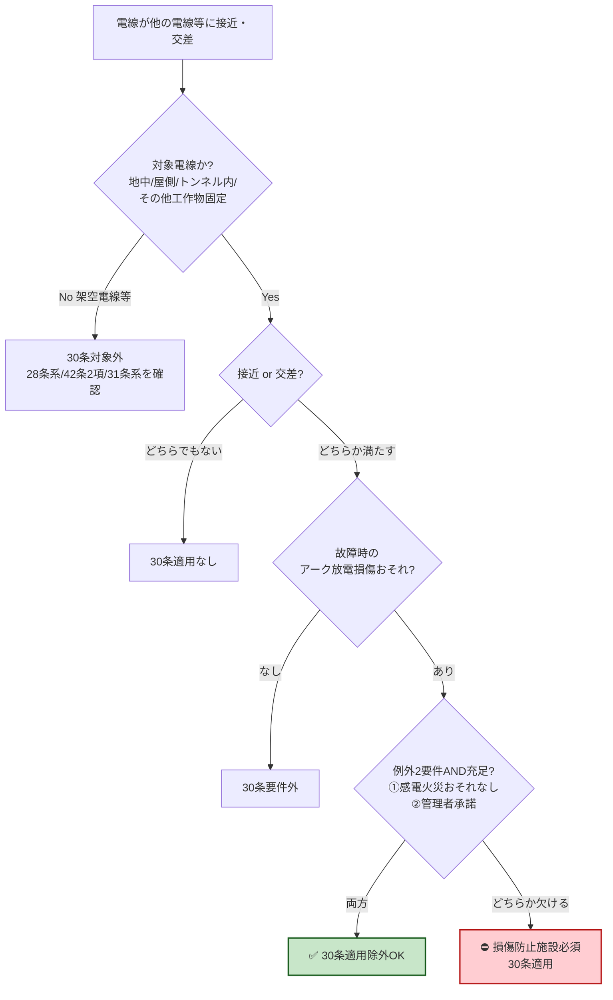

# 電技省令 第30条 — 地中電線等による他の電線及び工作物への危険の防止

!!! note "📊 概要"
    **出題頻度**: 🔥🔥（過去14年で 2 回直接出題＋複合論点として参照）

    **重要度**: B（複合論点の前提語彙・地中電線路系の入口）

    **直近出題**: H30 問3（地中電線の危険防止及び保護・省令第30条＋第47条の穴埋）

    **改正状況**: 改正対象外（電技省令の条番号は安定）。2026-06-10 に kakomon.yml の第30条タグを精査済（R04上問6 は[第67条](67.md)へ再帰属／H29問8 は通信障害系として省令第42条第2項・解釈第52条へ再帰属。2026-06-11 一次照合・訂正済）

> **地中電線・屋側電線・トンネル内電線**等が他の電線・弱電流電線等・管と==接近又は交さ==する場合、==故障時のアーク放電==による損傷を防ぐ施設をしなければならない。ただし**感電・火災のおそれがない**かつ**他の電線等の管理者の承諾**を得た場合に限り適用除外。架空電線は対象外（架空×通信線は省令第28条系／第42条第2項／第31条系で別途規定）。

| 項目 | 内容 |
|------|------|
| 条文 | 電気設備に関する技術基準を定める省令 第30条 |
| 規定内容 | 固定施設電線（地中・屋側・トンネル内・その他工作物固定）が他の電線等と接近・交差する場合のアーク放電損傷防止 |
| 性格 | 実体規定（数値なし）＋ 例外要件に手続的要素（管理者承諾）を含む |
| 委任先（直接の具体化） | 解釈第125条（地中電線と他の地中電線等との接近又は交差） |
| 関連条文（参照） | [解釈第120条](../kaishaku/120.md)（地中電線路の施設方式・埋設深さ・標識）— 根拠は省令第21条第2項・第47条 ／ 省令第47条（地中電線路の保護） |
| 上位 | [省令第5条](5.md)（電路の絶縁原則）／ 第二章第二節「他の電線、他の工作物等への危険の防止」 |
| **典拠（一次ソース）** | 電気設備に関する技術基準を定める省令（平成9年通商産業省令第52号）第30条 — e-Gov 法令API（lawid: 409M50000400052） |
| **照合日** | 2026-05-06（e-Gov 法令API で本文・見出し・隣接条文を直接照合） |
| **隣接条文** | ← 第29条（電線による他の工作物等への危険の防止）（記事未作成） ／ 第31条（異常電圧による架空電線等への障害の防止）（記事未作成） → |

---

## 0. 論点クラスタマップ — 28〜31条の差分

!!! tip "なぜこのマップを冒頭に置くか"
    試験では「30条単独」より **「28〜31条の差分を問う複合問題」** が多い。30条の本質は他条文との **境界** にある。

| 条文 | 対象 | 接触相手 | 防止すべき事象 | 例外要件 |
|------|------|---------|----------------|---------|
| 第28条 | 電線（一般） | 他の電線・弱電流電線等 | 混触 | 解釈に委任 |
| 第29条 | 電線（一般） | 他の工作物等 | 接触・接近による危険 | 解釈に委任 |
| **第30条** | **固定施設電線（地中・屋側・トンネル内・その他）** | **他の電線・弱電流電線等・管** | **故障時のアーク放電損傷** | **感電火災おそれなし AND 管理者承諾** |
| 第31条 | 架空電線 | 架空電線（自他） | 異常電圧による障害（誘導・侵入） | 解釈に委任 |

### 30条の独自性 — 対象と危険事象を絵で押さえる

<div><svg viewBox="0 0 800 360" xmlns="http://www.w3.org/2000/svg" width="100%" preserveAspectRatio="xMidYMid meet">
<defs>
<linearGradient id="gnd30Z" x1="0" y1="0" x2="0" y2="1"><stop offset="0%" stop-color="#a1887f"/><stop offset="100%" stop-color="#6d4c41"/></linearGradient>
<linearGradient id="wall30Z" x1="0" y1="0" x2="1" y2="0"><stop offset="0%" stop-color="#bcaaa4"/><stop offset="100%" stop-color="#8d6e63"/></linearGradient>
<linearGradient id="tunnel30Z" x1="0" y1="0" x2="0" y2="1"><stop offset="0%" stop-color="#cfd8dc"/><stop offset="100%" stop-color="#90a4ae"/></linearGradient>
</defs>
<text x="400" y="22" text-anchor="middle" font-size="15" font-weight="700" fill="#212121">30条「対象」と「危険事象」を絵で押さえる</text>
<text x="20" y="55" font-size="13" font-weight="700" fill="#1b5e20">▼ 対象（4種の固定施設電線）</text>
<g transform="translate(20,70)">
<rect x="0" y="0" width="180" height="100" fill="url(#gnd30Z)" opacity="0.6" stroke="#5d4037" stroke-width="1.5"/>
<rect x="60" y="60" width="60" height="14" fill="#fff" stroke="#000" stroke-width="1.5"/>
<text x="90" y="71" text-anchor="middle" font-size="9" fill="#000">ケーブル</text>
<text x="90" y="95" text-anchor="middle" font-size="10" font-weight="700" fill="#fff">①地中電線</text>
</g>
<g transform="translate(220,70)">
<rect x="0" y="0" width="60" height="100" fill="url(#wall30Z)" stroke="#5d4037" stroke-width="1.5"/>
<line x1="80" y1="10" x2="80" y2="90" stroke="#d32f2f" stroke-width="3"/>
<text x="30" y="115" text-anchor="middle" font-size="10" font-weight="700" fill="#5d4037">外壁</text>
<text x="100" y="55" font-size="10" font-weight="700" fill="#b71c1c">②屋側電線</text>
</g>
<g transform="translate(390,70)">
<path d="M 0 50 Q 90 30 180 50 L 180 100 Q 90 120 0 100 Z" fill="url(#tunnel30Z)" stroke="#455a64" stroke-width="1.5"/>
<line x1="20" y1="80" x2="160" y2="80" stroke="#d32f2f" stroke-width="3"/>
<text x="90" y="115" text-anchor="middle" font-size="10" font-weight="700" fill="#37474f">③トンネル内電線</text>
</g>
<g transform="translate(600,70)">
<rect x="20" y="20" width="140" height="80" fill="#fff3e0" stroke="#ef6c00" stroke-width="2" stroke-dasharray="5,3"/>
<text x="90" y="50" text-anchor="middle" font-size="10" font-weight="700" fill="#e65100">④その他</text>
<text x="90" y="68" text-anchor="middle" font-size="9" fill="#bf360c">工作物に固定</text>
<text x="90" y="84" text-anchor="middle" font-size="9" fill="#bf360c">（橋梁・地下街）</text>
</g>
<text x="20" y="195" font-size="13" font-weight="700" fill="#bf360c">▼ 危険事象（故障時のアーク放電損傷）</text>
<g transform="translate(60,215)">
<line x1="0" y1="50" x2="200" y2="50" stroke="#d32f2f" stroke-width="3"/>
<text x="0" y="40" font-size="10" fill="#b71c1c">電線（30条対象）</text>
<line x1="0" y1="100" x2="200" y2="100" stroke="#1976d2" stroke-width="2" stroke-dasharray="4,2"/>
<text x="0" y="120" font-size="10" fill="#0d47a1">他の電線等（接近）</text>
<g transform="translate(110,75)">
<polygon points="-10,-15 0,-5 -8,-3 5,15 -3,5 -15,7" fill="#ff5722" stroke="#bf360c" stroke-width="1"/>
<text x="-3" y="35" font-size="11" font-weight="700" fill="#bf360c">アーク放電</text>
</g>
</g>
<g transform="translate(330,235)">
<rect x="0" y="0" width="200" height="80" rx="8" fill="#fff3e0" stroke="#bf360c" stroke-width="2"/>
<text x="100" y="22" text-anchor="middle" font-size="11" font-weight="700" fill="#bf360c">短絡・地絡 → 大電流</text>
<text x="100" y="42" text-anchor="middle" font-size="11" font-weight="700" fill="#bf360c">→ アーク（数千℃）</text>
<text x="100" y="62" text-anchor="middle" font-size="11" font-weight="700" fill="#bf360c">→ 近接物を損傷</text>
</g>
<g transform="translate(560,235)">
<rect x="0" y="0" width="220" height="80" rx="8" fill="#fce4ec" stroke="#ad1457" stroke-width="2"/>
<text x="110" y="22" text-anchor="middle" font-size="11" font-weight="700" fill="#880e4f">損傷例</text>
<text x="110" y="42" text-anchor="middle" font-size="9" fill="#880e4f">通信線の被覆破損 / 水管破裂</text>
<text x="110" y="58" text-anchor="middle" font-size="9" fill="#880e4f">ガス管引火 / 制御信号線断線</text>
<text x="110" y="74" text-anchor="middle" font-size="9" fill="#880e4f">→ 二次災害（漏水・火災・通信途絶）</text>
</g>
</svg></div>

**3つの独自ポイント**

| 観点 | 30条の特徴 |
|------|-----------|
| **対象** | 上図①〜④の **固定施設電線のみ**（架空電線は対象外） |
| **危険事象** | **故障時のアーク放電による損傷**（28条の混触・29条の一般危険・31条の異常電圧とは異なる特定リスク） |
| **例外要件** | 本文に **AND 条件で明示**（感電火災おそれなし AND 管理者承諾）。他3条は解釈委任 |

### 複合問題の典型パターン — 試験で実際に問われる形式

実際の出題パターンを **問題形式で例示** する。30条が「他条文との境界」を問う出題で頻出することを実感してほしい。

!!! abstract "パターン①: 境界判定型 — 「規制内容のキーワードはどれか」"
    建物外壁に固定された高圧電線が、同じ外壁に並走する通信線と接近している。この施設に対して適用される規制の **目的・キーワード** として最も適切なのは次のうちどれか。

    ア. 電線同士の混触の防止
    
    イ. 一般工作物への接近・接触の禁止
    
    ウ. 故障時のアーク放電による他の電線等の損傷防止
    
    エ. 架空電線における異常電圧誘導の防止

??? success "解答 1（クリックで開く）"
    **正解: ウ. 故障時のアーク放電による他の電線等の損傷防止**
    
    屋側電線（建物外壁固定）は **「固定施設電線」** に該当し、相手が通信線（弱電流電線等）。30条の核心キーワードは「故障時のアーク放電による損傷防止」。
    
    - ア（混触防止）= 第28条の範囲
    - イ（一般接近）= 第29条の範囲
    - エ（架空の異常電圧）= 第31条の範囲
    - ウ = **第30条**

!!! abstract "パターン②: 例外要件型 — 「AND と OR の取り違え」"
    屋側電線が通信線と接近する場合、施設に関する規制が適用除外（条文の但書）となるためには、次のうちどれを満たす必要があるか。

    ア. 他の電線等の管理者の承諾を得ること（一つで足りる）
    
    イ. 感電・火災のおそれがないこと（一つで足りる）
    
    ウ. 感電・火災のおそれがないこと、かつ、他の電線等の管理者の承諾を得ること（両方が必要）
    
    エ. 工事計画届出を経済産業局に提出すること

??? success "解答 2（クリックで開く）"
    **正解: ウ. 両方が必要**
    
    但書は **AND 条件**。「感電火災おそれなし」「管理者承諾」の **両方** が必要。
    
    - ア = OR と誤読する罠（承諾だけでは不十分）
    - イ = 要件欠落（感電火災おそれなしだけでは不十分）
    - エ = 別制度（工事計画届出は事業法系の手続）

!!! abstract "パターン③: 対象範囲型 — 「架空電線を含めるか」"
    「故障時のアーク放電により他の電線等を損傷するおそれがないように施設しなければならない」という規制の対象に **含まれない** 電線はどれか。

    ア. 地中ケーブル
    
    イ. 建物外壁に固定された屋側電線
    
    ウ. 鉄塔間に張られた架空電線
    
    エ. トンネル内に施設されたケーブル

??? success "解答 3（クリックで開く）"
    **正解: ウ. 鉄塔間に張られた架空電線**
    
    対象は **固定施設電線（地中・屋側・トンネル内・その他工作物固定）** に限定。架空電線は **30条の対象外** で、出題の論点に応じて以下の条文で別途規定される：
    
    - 接近・交差・離隔 → 省令第28条系／解釈第76条 など
    - 誘導作用による通信障害 → 省令第42条第2項／解釈第52条 など
    - 異常電圧による障害 → 省令第31条系
    
    判定のコツ: 「工作物に **固定** されているか」を見る。架空電線は支持物に張られていても「固定施設電線」とは別概念。

---

## 1. 全体像と要点

- **対象電線4種**: ①地中電線 ②屋側電線 ③トンネル内電線 ④その他の工作物に固定して施設する電線
- **「他の電線等」3区分**: ①他の電線 ②弱電流電線等 ③管
- **適用条件**: 接近 **又は** 交差（OR — どちらか1つで適用）
- **防止すべき事象**: 故障時の **アーク放電** による損傷
- **例外要件（AND条件）**: 感電・火災のおそれがない **AND** 他の電線等の管理者の承諾

### ① 全体像 — 30条の構造

<div><svg viewBox="0 0 800 360" xmlns="http://www.w3.org/2000/svg" width="100%" preserveAspectRatio="xMidYMid meet">
<defs>
<filter id="sh30a" x="-20%" y="-20%" width="140%" height="140%"><feDropShadow dx="0" dy="2" stdDeviation="2" flood-opacity="0.15"/></filter>
<linearGradient id="gMain30a" x1="0" y1="0" x2="0" y2="1"><stop offset="0%" stop-color="#bbdefb"/><stop offset="100%" stop-color="#90caf9"/></linearGradient>
<linearGradient id="gA30a" x1="0" y1="0" x2="0" y2="1"><stop offset="0%" stop-color="#c8e6c9"/><stop offset="100%" stop-color="#a5d6a7"/></linearGradient>
<linearGradient id="gB30a" x1="0" y1="0" x2="0" y2="1"><stop offset="0%" stop-color="#fff9c4"/><stop offset="100%" stop-color="#fff176"/></linearGradient>
<linearGradient id="gC30a" x1="0" y1="0" x2="0" y2="1"><stop offset="0%" stop-color="#ffccbc"/><stop offset="100%" stop-color="#ff8a65"/></linearGradient>
</defs>
<text x="400" y="26" text-anchor="middle" font-size="15" font-weight="700" fill="#212121">第30条 — 固定施設電線のアーク放電損傷防止</text>
<text x="400" y="44" text-anchor="middle" font-size="11" fill="#666">対象電線4種 × 他の電線等3区分 × 接近or交差</text>
<rect x="280" y="60" width="240" height="60" rx="12" fill="url(#gMain30a)" stroke="#0d47a1" stroke-width="2.5" filter="url(#sh30a)"/>
<text x="400" y="85" text-anchor="middle" font-size="14" font-weight="800" fill="#0d47a1">省令第30条</text>
<text x="400" y="105" text-anchor="middle" font-size="11" fill="#1565c0">アーク放電損傷の防止</text>
<rect x="40" y="155" width="220" height="80" rx="10" fill="url(#gA30a)" stroke="#2e7d32" stroke-width="2"/>
<text x="150" y="178" text-anchor="middle" font-size="12" font-weight="700" fill="#1b5e20">対象電線（4種）</text>
<text x="150" y="198" text-anchor="middle" font-size="10" fill="#1b5e20">①地中電線 ②屋側電線</text>
<text x="150" y="214" text-anchor="middle" font-size="10" fill="#1b5e20">③トンネル内電線</text>
<text x="150" y="228" text-anchor="middle" font-size="10" fill="#1b5e20">④その他工作物固定電線</text>
<rect x="290" y="155" width="220" height="80" rx="10" fill="url(#gB30a)" stroke="#f57f17" stroke-width="2"/>
<text x="400" y="178" text-anchor="middle" font-size="12" font-weight="700" fill="#e65100">他の電線等（3区分）</text>
<text x="400" y="198" text-anchor="middle" font-size="10" fill="#e65100">①他の電線</text>
<text x="400" y="214" text-anchor="middle" font-size="10" fill="#e65100">②弱電流電線等</text>
<text x="400" y="228" text-anchor="middle" font-size="10" fill="#e65100">③管</text>
<rect x="540" y="155" width="220" height="80" rx="10" fill="url(#gC30a)" stroke="#bf360c" stroke-width="2"/>
<text x="650" y="178" text-anchor="middle" font-size="12" font-weight="700" fill="#bf360c">禁止される事象</text>
<text x="650" y="198" text-anchor="middle" font-size="10" fill="#bf360c">故障時のアーク放電による</text>
<text x="650" y="214" text-anchor="middle" font-size="10" fill="#bf360c">他の電線等への損傷</text>
<text x="650" y="228" text-anchor="middle" font-size="10" fill="#bf360c">（接近 or 交差時）</text>
<line x1="400" y1="120" x2="150" y2="155" stroke="#0d47a1" stroke-width="1.5" stroke-dasharray="3,2"/>
<line x1="400" y1="120" x2="400" y2="155" stroke="#0d47a1" stroke-width="1.5" stroke-dasharray="3,2"/>
<line x1="400" y1="120" x2="650" y2="155" stroke="#0d47a1" stroke-width="1.5" stroke-dasharray="3,2"/>
<rect x="180" y="270" width="440" height="70" rx="10" fill="#fff3e0" stroke="#ef6c00" stroke-width="2" stroke-dasharray="5,3"/>
<text x="400" y="293" text-anchor="middle" font-size="12" font-weight="700" fill="#e65100">例外（AND条件）</text>
<text x="400" y="313" text-anchor="middle" font-size="11" fill="#bf360c">① 感電・火災のおそれがない</text>
<text x="400" y="330" text-anchor="middle" font-size="11" fill="#bf360c">② 他の電線等の管理者の承諾</text>
</svg></div>

### セルフチェック

??? question "セルフチェック ① 対象範囲"
    Q: 30条で「守られる」のは、地中電線・屋側電線などの固定施設電線**自身**か。固定施設電線は「守られる側」か「危険を出す側」か。

    （発展）もし条見出しが「地中電線等**への**危険の防止」だったら、答えはどう変わるか。

    **守られるのは「他の電線等」。固定施設電線（地中電線等）は"危険を出す側＝損傷源"。**

    条見出し「地中電線等**による**他の電線…への危険の防止」の「**による**」が向きを示す。危険の中身は**故障時のアーク放電**。覚えるべき核心は〈固定施設電線がアーク放電で隣の他インフラを傷つけるのを防ぐ〉で、対象が4種なのは核心から導かれる結果にすぎない（リスト丸暗記は不要）。

    発展：「への」なら固定施設電線が**被害側**になり、趣旨の異なる別条文になる。助詞「による／への」が条文の向きを決める ── 他の法規条文でも使える着眼点。

??? question "セルフチェック ② 例外要件"
    Q: 30条但書の適用除外は「感電・火災のおそれがない」AND「管理者の承諾」の**両方**を要求する。なぜ片方だけでは足りないのか ── 2つの要件が**守るもの**の違いから説明せよ。

    **2つの要件は"守る相手"が違うから、片方では代用できない。**

    「管理者の承諾」は相手方（他の電線等の管理者）の**財産・利害**の調整 ── 当事者どうしで合意できるもの。一方「感電・火災のおそれがない」は**不特定の人の生命・公共の安全**で、私人の承諾では消せない。承諾を得ても危険そのものが残る以上、除外は認められない。だから但書は **AND（両方必須）** ──「承諾だけで足りる（OR）」が最頻出ひっかけ。

---

## 2. 条文原文

!!! quote "電気設備に関する技術基準を定める省令 第30条"
    （地中電線等による他の電線及び工作物への危険の防止）

    第三十条　<mark>地中電線、屋側電線及びトンネル内電線その他の工作物に固定して施設する電線</mark>は、<mark>他の電線、弱電流電線等又は管</mark>（他の電線等という。以下この条において同じ。）と<mark>接近し、又は交さする</mark>場合には、<mark>故障時のアーク放電</mark>により他の電線等を損傷するおそれがないように施設しなければならない。<mark>ただし、感電又は火災のおそれがない場合であって、他の電線等の管理者の承諾を得た場合</mark>は、この限りでない。

!!! info "強調表示の凡例"
    黄色マーカーは **想定問題ベースのマーキング**（30条は実出題が稀のため、論理的に穴埋めされやすい語を機械的にマーク）。実際の過去問で穴埋め指定された語は H18 問3 のみで該当範囲が広いため、原文ベースで主要キーワードを網羅的にマーク。

### 適用対象テーブル

| 対象電線 | 具体例 | 施設形態 |
|---------|-------|---------|
| 地中電線 | 地中ケーブル（CVケーブル等） | 直接埋設・管路式・暗きょ式 |
| 屋側電線 | 建物外壁に固定された電線 | 金属管・がいし引き等 |
| トンネル内電線 | 鉄道・道路トンネル内の電線 | ケーブルラック・支持物固定 |
| その他工作物固定 | 橋梁添架電線・地下街電線等 | 工作物への直接固定 |

---

## 3. 原文解析（ブロック分解）

| ブロック | 抽出語 | 試験ポイント |
|---------|-------|-------------|
| ① 対象電線4種 | 地中電線／屋側電線／トンネル内電線／その他の工作物に固定して施設する電線 | 「架空電線は対象外」が最頻出ひっかけ |
| ② 他の電線等3区分 | 他の電線／弱電流電線等／管 | 「等」の範囲・包含関係 |
| ③ 適用条件 | 接近し、又は交さする | OR条件（どちらか1つで適用） |
| ④ 禁止事象 | 故障時のアーク放電により他の電線等を損傷するおそれ | 「アーク放電」がキーワード（混触・誘導とは異なる） |
| ⑤ 例外要件 | 感電又は火災のおそれがない **AND** 管理者の承諾 | **AND条件**（OR と誤読する罠） |

---

## 4. かみ砕き解説（因果理解）

### なぜ「アーク放電」がキーワードか

固定施設電線は **離隔距離を後から取り直せない** という構造的特性がある。地中ケーブルは埋設後の経路変更が困難、屋側電線は建物外壁に固定済み、トンネル内電線も支持物に縛り付けられている。

そのため **故障時（短絡・地絡）に発生する大電流 → アーク放電 → 数千℃の熱 + 力学的衝撃** で近接する他の電線・通信線・水道管などを損傷する物理的リスクが、架空電線（風揺れで離隔距離が動的に確保される）よりも高い。

```
故障発生 → 大電流 → 絶縁破壊 → アーク発生
       → 高温（数千℃）+ 圧力波 + 飛散物
       → 近接する他の電線等を損傷
```

### なぜ29条と分離されているか

| 観点 | 第29条（電線一般） | 第30条（固定施設電線） |
|------|---------------------|------------------------|
| 対象 | 電線一般（架空も含む） | 固定施設電線のみ |
| 危険源 | 接触・接近による危険全般 | **アーク放電に特化** |
| 例外 | 解釈に委任 | **本文に AND 条件記載** |
| 趣旨 | 一般原則 | 固定施設の特殊リスクへの追加規制 |

固定施設電線は架空電線と異なり「動かせない」「点検頻度が低い」「他事業者インフラと並走しやすい（共同溝・ケーブルラック）」ため、29条の一般規定に加えて **30条で特化規定** を置いている。

!!! warning "ひっかけ警告：架空電線は対象外"
    「架空電線が他の通信線に接近」は **30条の対象外**。代わりに以下の条文で規定される（出題の論点で分岐）：

    - 接近・交差・離隔 → 省令第28条系／解釈第76条 など
    - 誘導作用による通信障害 → 省令第42条第2項／解釈第52条 など
    - 異常電圧による障害 → 省令第31条系

    試験で30条選択肢に「架空」が含まれていたら誤りの可能性が高い。

---

## 5. 判定フローと事例図解

### 適用判定フロー



### 事例① — 屋側電線×通信線の接近

<div><svg viewBox="0 0 700 300" xmlns="http://www.w3.org/2000/svg" width="100%" preserveAspectRatio="xMidYMid meet">
<defs>
<linearGradient id="wall30b" x1="0" y1="0" x2="1" y2="0"><stop offset="0%" stop-color="#bcaaa4"/><stop offset="100%" stop-color="#8d6e63"/></linearGradient>
</defs>
<text x="350" y="22" text-anchor="middle" font-size="14" font-weight="700" fill="#212121">事例① 屋側電線×通信線の接近</text>
<rect x="50" y="80" width="50" height="180" fill="url(#wall30b)" stroke="#5d4037" stroke-width="1.5"/>
<text x="75" y="275" text-anchor="middle" font-size="10" fill="#5d4037">建物外壁</text>
<line x1="135" y1="100" x2="135" y2="250" stroke="#d32f2f" stroke-width="3"/>
<text x="135" y="92" text-anchor="middle" font-size="11" font-weight="700" fill="#b71c1c">屋側電線（高圧）</text>
<line x1="200" y1="100" x2="200" y2="250" stroke="#1976d2" stroke-width="2" stroke-dasharray="4,2"/>
<text x="200" y="92" text-anchor="middle" font-size="11" font-weight="700" fill="#0d47a1">通信線</text>
<text x="200" y="265" text-anchor="middle" font-size="9" fill="#0d47a1">（弱電流電線等）</text>
<line x1="135" y1="180" x2="200" y2="180" stroke="#666" stroke-width="1" stroke-dasharray="2,2"/>
<polygon points="138,180 144,177 144,183" fill="#666"/>
<polygon points="197,180 191,177 191,183" fill="#666"/>
<text x="167" y="173" text-anchor="middle" font-size="9" fill="#666">離隔小</text>
<line x1="225" y1="175" x2="340" y2="175" stroke="#bf360c" stroke-width="1.5" stroke-dasharray="3,3"/>
<polygon points="345,175 338,172 338,178" fill="#bf360c"/>
<text x="282" y="170" text-anchor="middle" font-size="9" fill="#bf360c">故障時</text>
<g transform="translate(390,175)">
<polygon points="0,-22 6,-7 -6,-7" fill="#ff5722" stroke="#bf360c" stroke-width="1"/>
<polygon points="0,22 6,7 -6,7" fill="#ff5722" stroke="#bf360c" stroke-width="1"/>
<line x1="-10" y1="0" x2="10" y2="0" stroke="#bf360c" stroke-width="2"/>
<text x="0" y="-30" text-anchor="middle" font-size="11" font-weight="700" fill="#bf360c">アーク放電</text>
<text x="0" y="42" text-anchor="middle" font-size="10" fill="#bf360c">→ 通信線損傷</text>
</g>
<rect x="490" y="140" width="180" height="70" rx="8" fill="#fff3e0" stroke="#ef6c00" stroke-width="2"/>
<text x="580" y="167" text-anchor="middle" font-size="13" font-weight="700" fill="#e65100">30条 適用</text>
<text x="580" y="190" text-anchor="middle" font-size="10" fill="#bf360c">損傷防止の施設必須</text>
</svg></div>

### 事例② — トンネル内電線×水管の交差

<div><svg viewBox="0 0 700 290" xmlns="http://www.w3.org/2000/svg" width="100%" preserveAspectRatio="xMidYMid meet">
<defs>
<linearGradient id="tun30b" x1="0" y1="0" x2="0" y2="1"><stop offset="0%" stop-color="#cfd8dc"/><stop offset="100%" stop-color="#90a4ae"/></linearGradient>
</defs>
<text x="350" y="22" text-anchor="middle" font-size="14" font-weight="700" fill="#212121">事例② トンネル内電線×水管の交差</text>
<path d="M 50 60 Q 350 45 650 60 L 650 230 Q 350 245 50 230 Z" fill="url(#tun30b)" stroke="#455a64" stroke-width="2"/>
<text x="350" y="56" text-anchor="middle" font-size="10" fill="#37474f">トンネル断面</text>
<line x1="100" y1="140" x2="600" y2="140" stroke="#d32f2f" stroke-width="3"/>
<text x="105" y="130" font-size="11" font-weight="700" fill="#b71c1c">トンネル内電線（CVケーブル）</text>
<line x1="450" y1="80" x2="450" y2="220" stroke="#0277bd" stroke-width="6" opacity="0.8"/>
<text x="475" y="100" font-size="11" font-weight="700" fill="#01579b">水管（管）</text>
<circle cx="450" cy="140" r="14" fill="#fff" stroke="#bf360c" stroke-width="2.5"/>
<text x="450" y="145" text-anchor="middle" font-size="11" font-weight="800" fill="#bf360c">⚡</text>
<text x="450" y="180" text-anchor="middle" font-size="10" font-weight="700" fill="#bf360c">交差点</text>
<rect x="100" y="255" width="500" height="28" rx="6" fill="#fff3e0" stroke="#ef6c00" stroke-width="1.5"/>
<text x="350" y="274" text-anchor="middle" font-size="11" font-weight="700" fill="#bf360c">アーク放電 → 水管損傷 → 漏水＋二次災害リスク</text>
</svg></div>

---

## 6. 施設形態別の物理イメージ

!!! tip "なぜこのセクションが必要か"
    「対象電線4種」を文字だけで覚えると **境界事例（屋側vs引込・トンネルvs坑道）で誤判定** しやすい。実際の物理イメージを断面図で持つことで、論述・選択問題ともに判定精度が上がる。

### 地中電線の3方式（解釈第120条との接続）

<div><svg viewBox="0 0 800 240" xmlns="http://www.w3.org/2000/svg" width="100%" preserveAspectRatio="xMidYMid meet">
<defs>
<linearGradient id="gnd30c" x1="0" y1="0" x2="0" y2="1"><stop offset="0%" stop-color="#a1887f"/><stop offset="100%" stop-color="#6d4c41"/></linearGradient>
</defs>
<text x="400" y="22" text-anchor="middle" font-size="14" font-weight="700" fill="#212121">地中電線の3方式（解釈第120条 委任先の具体形態）</text>
<rect x="20" y="40" width="240" height="180" fill="url(#gnd30c)" opacity="0.5" stroke="#5d4037"/>
<text x="140" y="60" text-anchor="middle" font-size="12" font-weight="700" fill="#fff">直接埋設式</text>
<rect x="100" y="160" width="80" height="20" fill="#fff" stroke="#000" stroke-width="1.5"/>
<text x="140" y="174" text-anchor="middle" font-size="9" fill="#000">ケーブル</text>
<line x1="100" y1="100" x2="180" y2="100" stroke="#1976d2" stroke-dasharray="3,2"/>
<text x="140" y="115" text-anchor="middle" font-size="9" fill="#0d47a1">埋設深さ 1.2m以上※</text>
<rect x="280" y="40" width="240" height="180" fill="url(#gnd30c)" opacity="0.5" stroke="#5d4037"/>
<text x="400" y="60" text-anchor="middle" font-size="12" font-weight="700" fill="#fff">管路式</text>
<rect x="350" y="150" width="100" height="40" fill="#fff" stroke="#000" stroke-width="1.5"/>
<circle cx="380" cy="170" r="6" fill="#ffcdd2" stroke="#c62828"/>
<circle cx="420" cy="170" r="6" fill="#ffcdd2" stroke="#c62828"/>
<text x="400" y="205" text-anchor="middle" font-size="9" fill="#000">管路（複数ケーブル収納）</text>
<rect x="540" y="40" width="240" height="180" fill="url(#gnd30c)" opacity="0.5" stroke="#5d4037"/>
<text x="660" y="60" text-anchor="middle" font-size="12" font-weight="700" fill="#fff">暗きょ式</text>
<rect x="580" y="120" width="160" height="80" fill="#eceff1" stroke="#000" stroke-width="1.5"/>
<rect x="600" y="160" width="40" height="10" fill="#fff" stroke="#000" stroke-width="1"/>
<rect x="680" y="160" width="40" height="10" fill="#fff" stroke="#000" stroke-width="1"/>
<text x="660" y="190" text-anchor="middle" font-size="9" fill="#000">人が立入可能な空間</text>
<text x="660" y="215" text-anchor="middle" font-size="9" fill="#000">（共同溝・洞道）</text>
</svg></div>

!!! warning "数値根拠ガード"
    `埋設深さ 1.2m以上` は **解釈第120条** の規定であって、省令第30条本文には数値はない（30条は離隔・損傷防止の **原則** のみ規定し、数値は解釈委任）。

### 屋側電線・トンネル内電線

| 形態 | 物理イメージ | 30条適用上の論点 |
|------|------------|------------------|
| 屋側電線 | 建物外壁に金属管・がいし引きで固定 | 通信線・水道管との並走でアーク放電リスク |
| トンネル内電線 | ケーブルラック・支持物で天井/側壁固定 | 同一トンネル内の他電線・水管・ガス管との交差 |
| その他工作物固定 | 橋梁添架・地下街・共同溝 | 多事業者インフラとの離隔調整（管理者承諾の実務的論点） |

---

## 7. アーク放電の物理メカニズム

!!! warning "本セクションは因果理解のための補助"
    アーク放電の物理プロセスは省令本文の **公式定義ではない**（feedback_pedagogical_approximation_guard.md 準拠）。試験で「アーク放電とは数千℃の…」と書いても部分点にはなるが、第一義は **「故障時のアーク放電による損傷防止」という条文文言の暗記** が優先。

### アーク放電の連鎖プロセス

```
[1] 故障発生（短絡・地絡）
    ↓
[2] 大電流（定格の数十〜数百倍）
    ↓
[3] 絶縁破壊 → 空気の電離 → プラズマ柱（アーク）形成
    ↓
[4] アーク柱内の温度: 数千℃〜数万℃
    アーク柱外への放射熱・圧力波・溶融金属飛散
    ↓
[5] 近接する他の電線・通信線・配管の被覆劣化・破損・延焼
```

### なぜ「絶縁破壊」ではなく「アーク放電」と書かれているか

省令第30条が「アーク放電」という具体語を使うのは、**事象の因果連鎖の最も損傷力が高い段階を指定** するため。「絶縁破壊」は事象の入口、「アーク放電」は損傷源の本体。条文は損傷を起こす **メカニズムを明示** することで施設者に防止対策（離隔・遮蔽・耐熱被覆等）の方向性を示している。

| 用語 | 意味 | 30条での扱い |
|------|------|-------------|
| 絶縁破壊 | 絶縁体が電圧に耐えられず導通する現象 | 上位概念・直接記載なし |
| **アーク放電** | 絶縁破壊後に持続するプラズマ放電 | **本文記載・損傷源** |
| 故障電流 | 故障時に流れる大電流 | アーク発生の原因 |

---

## 8. 適用範囲と除外

### 対象電線4種の境界

| 対象 | 含まれる | 含まれない（要注意） |
|------|----------|----------------------|
| 地中電線 | 直接埋設・管路式・暗きょ式の地中ケーブル | 地表に露出した部分（架空扱い） |
| 屋側電線 | 建物外壁固定の電線 | **引込線**（22条系で別規定） |
| トンネル内電線 | 鉄道・道路トンネル内 | **坑道内**（解釈別規定） |
| その他工作物固定 | 橋梁添架・地下街・共同溝 | 移動電線・仮設配線 |

### 「他の電線等」3区分の包含

```
他の電線等
├── 他の電線 — 強電流の電線（電力線）
├── 弱電流電線等 — 通信線・信号線・制御線・火災報知線等
└── 管 — 水管・ガス管・空調ダクト等の管路
```

> 例外要件の AND/OR 論理（最頻出ひっかけ）は「セクション12-B 頻出ひっかけ・落とし穴」で詳述。

---

## 9. 境界事例の判定

差分マトリクスは「[0. 論点クラスタマップ](#0-2831)」を参照。本セクションでは個別の境界事例の判定理由を整理する。

| 状況 | 適用条文 | 判定理由 |
|------|---------|----------|
| 屋側電線×通信線の接近 | 第30条 | 屋側電線は「固定施設電線」 |
| 架空電線×通信線の接近・交差・離隔 | 省令第28条系・解釈第76条 など | **30条対象外**（架空は固定施設電線でない） |
| 架空電線×通信線の誘導障害 | 省令第42条第2項・解釈第52条 など | **30条対象外**・誘導作用は別系統で規定 |
| 架空電線×通信線の異常電圧障害 | 省令第31条系 | **30条対象外**・異常電圧は別系統で規定 |
| 地中電線×他の地中電線の交差 | 第30条 ＋ 解釈第125条 | 「他の電線」に該当・125条が直接の具体化 |
| 引込線（造営材取付前）×電力線の混触 | 第28条系 | 引込線は屋側電線とは別概念 |

---

## 10. 省令と解釈の関係

第30条の **直接の具体化（委任先）** は **解釈第125条**。**解釈第120条** は地中電線路の施設方式・埋設深さ・標識を定める関連条文だが、その根拠は **省令第21条第2項・第47条** であって省令第30条ではない点に注意。

```
🟨 省令第5条（電路の絶縁原則）
    ↓ 上位
🟨 省令第30条（固定施設電線のアーク放電損傷防止）
    ↓ 直接の具体化（委任先）
🟩 解釈第125条（地中電線と他の地中電線等との接近又は交差・離隔距離）

【関連条文（参照）】
🟨 省令第21条第2項・第47条（地中電線路の保護等）
    ↓ 委任
🟩 解釈第120条（地中電線路の施設方式・埋設深さ・標識）
```

| レベル | 規定内容 | 性格 |
|--------|---------|------|
| 省令第5条 | 電路の絶縁原則（上位原則） | 理念 |
| **省令第30条** | **アーク放電損傷防止の原則 + 例外要件** | **原則** |
| **解釈第125条** | **地中電線と他の地中電線等との離隔距離・遮蔽方法** | **30条の直接委任先（具体・数値）** |
| 省令第21条第2項 | 高圧又は特別高圧電気機械器具等の危険防止 | 関連原則 |
| 省令第47条 | 地中電線路の保護 | 関連原則 |
| 解釈第120条 | 地中電線路の3方式・埋設深さ・標識 | 関連具体（21条2項・47条の委任先） |

詳細な接近・交差時の離隔距離は **解釈第125条** で具体化される。地中電線路そのものの施設方式（管路式・暗きょ式・直接埋設式）や埋設深さは **[解釈第120条](../kaishaku/120.md)** で規定されるが、これは省令第21条第2項・第47条の委任であって30条の委任ではない。

---

## 11. A/B 2層暗記表

!!! tip "A/B 2層で要件を分解する"
    30条は「**A面＝適用要件**（全て満たすと適用）」と「**B面＝除外要件**（AND で満たすと例外）」の2層構造。下表は丸暗記用ではなく、各要件が**核心からどう導かれるか**を確認するためのもの ── 核心（セクション4「かみ砕き解説」）を押さえていれば各行は自分で再導出できる。

### A面 — 適用要件（全て満たすと30条適用）

| # | 要件 | 核心からの導出 |
|---|------|---------------|
| A1 | 対象電線4種のいずれか | すべて**工作物に固定**して施設 → 離隔が動かせず損傷源になりうる（地中・屋側・トンネル内・その他工作物固定） |
| A2 | 他の電線等3区分のいずれかと接近可能性 | アーク放電で**傷つく相手** → 他の電線・弱電流電線等・管 |
| A3 | 接近 OR 交差 | 損傷が起こりうる位置関係 → どちらか1つで成立（OR条件） |
| A4 | 故障時のアーク放電損傷おそれ | 30条が防ぐ**危険そのもの**（混触・誘導とは別） |

### B面 — 除外要件（AND で満たすと例外）

| # | 要件 | 核心からの導出 |
|---|------|---------------|
| B1 | 感電のおそれがない | 不特定の人の生命・**公共の安全** → 私人の承諾では消せない |
| B2 | 火災のおそれがない | 同上（公共安全の床。承諾で代用不可） |
| B3 | 他の電線等の管理者の承諾 | 相手方の**財産・利害**の調整 → 当事者間で合意できる |

**B1 ∧ B2 ∧ B3** の3つを **すべて** 満たして初めて例外。1つでも欠けたら適用必須。

---

## 12. 試験対策

!!! tip "本セクションの構成（A→Eの5段階で論点網羅）"
    A. **試験で問われる5切り口** — 何が問われるかの俯瞰
    B. **頻出ひっかけ** — 誤答パターンを重大度別に予防
    C. **穴埋め過去問チャレンジ** — 条文原文の暗記確認（4問）
    D. **派生問題群** — 実出題稀のため想定問題で論点網羅（3問）
    E. **まぎらわしい選択肢** — 試験本番形式の誤答対比

### A. 試験で問われる5切り口

受験者が **「30条で何が問われるか」** を俯瞰するための5視点。これらの視点を持って B〜E に進むと、各問題の論点が明確になる。

| 切り口 | 典型問題 | 正答ロジック |
|--------|----------|-------------|
| ① 対象範囲 | 「30条の対象となる電線はどれか」 | 4種（地中・屋側・トンネル内・その他工作物固定）に該当するか判定。架空は除外 |
| ② 例外要件AND/OR | 「例外要件として正しいものは」 | AND 条件であることを軸に消去法。OR 表現は誤り |
| ③ 用語定義 | 「『他の電線等』に含まれないものは」 | 他の電線・弱電流電線等・管の3区分。それ以外は含まれない |
| ④ 因果論理 | 「30条が防止する事象は」 | アーク放電（混触・誘導ではない） |
| ⑤ 隣接条文混同 | 「地中電線 vs 架空電線」「30条 vs 28条系/42条系/31条系」 | 対象が固定施設電線か架空電線かで分岐。架空電線は出題論点（接近・誘導・異常電圧）に応じて別条文 |

### B. 頻出ひっかけ・落とし穴

#### 🔴 致命的（合否を分ける）

| ❌ 誤認 | ✅ 正解 |
|---------|---------|
| 架空電線も30条対象 | 架空電線は **対象外**（接近・交差は省令第28条系／誘導は省令第42条第2項／異常電圧は省令第31条系で別途規定） |
| 例外は「感電火災おそれなし **OR** 管理者承諾」 | **AND** 要件。両方必要 |

#### 🟡 注意（差がつく）

| ❌ 誤認 | ✅ 正解 |
|---------|---------|
| 屋側電線＝引込線 | 別概念。引込線は屋側電線とは別 |
| 管理者承諾は口頭でOK | 実務上は **書面承諾**（保安規程・工事計画届出に添付） |

#### 🟢 軽微（迷いやすい）

| ❌ 誤認 | ✅ 正解 |
|---------|---------|
| 「弱電流電線等」の「等」は通信線のみ | 信号線・制御線・火災報知線も含む |

### C. 穴埋め過去問チャレンジ

!!! warning "実出題状況"
    第30条の **直接的な穴埋出題は H18 問3 の1回のみ**（解釈120-125・省令第47条との一括出題）。以下は条文原文ベースの **想定問題** を含む。

!!! tip "学習ラダー方式（Why→What→How）"
    暗記前に **「なぜ4種なのか」（Step1: 理解）** をつかむ → **条文構造を穴埋めで確認（Step2: 構造）** → **本試の論点である射程区別（Step3: 応用）** へ段階接続。Step1で「固定設置」の共通性質を理解できていれば、Step2は語呂に頼らず論理導出できる。

!!! abstract "問題1【Step1: 理解】対象電線4種の共通性質"
    省令第30条の対象は「地中電線／屋側電線／トンネル内電線／その他の工作物に固定して施設する電線」の4種。では、**なぜ架空電線は対象外** なのか？ 共通する物理的性質から1つ挙げて理由を説明せよ。

??? success "解答 1"
    4種すべて「**固定して施設**」される電線（位置が動かない）。

    **なぜ重要か**:

    - 架空電線は風揺れで他物体との距離が変動するため、別途 **第28〜29条系で「離隔距離」自体** を規定する必要がある。
    - 一方、固定電線は離隔距離だけでは不十分で、**故障時のアーク放電で他物体に直接損傷を与えるリスク** を別建てで規定する必要があり、これが30条の存在意義。
    - つまり「4種を語呂で暗記」ではなく「**固定設置に共通するアーク放電リスク**」が出発点。架空電線が外れる理由が分かれば、4種は自然に出てくる。

!!! abstract "問題2【Step2: 構造確認】条文穴埋め（H18類題ベース）"
    地中電線、（　ア　）電線及び（　イ　）内電線その他の工作物に固定して施設する電線は、他の電線、（　ウ　）電線等又は管と接近し、又は交さする場合には、故障時の（　エ　）放電により他の電線等を損傷するおそれがないように施設しなければならない。

??? success "解答 2"
    - ア = **屋側**
    - イ = **トンネル**
    - ウ = **弱電流**
    - エ = **アーク**

    **構造**: ［対象電線4種］×［相手3区分］×［接近 or 交さ］×［禁止事象＝アーク放電損傷］

    Step1で「固定設置」の共通性質を理解していれば、ア・イは「壁に固定（屋側）」「坑道内に固定（トンネル）」と論理的に導ける。エの「故障時のアーク放電」は条文の核心キーワードで、混触（28条）・誘導（42条2項）と区別する語選び。

!!! abstract "問題3: 例外要件（AND条件）"
    ただし、（　ア　）又は（　イ　）のおそれがない場合であって、他の電線等の（　ウ　）の承諾を得た場合は、この限りでない。

??? success "解答 3"
    - ア = **感電**
    - イ = **火災**
    - ウ = **管理者**

    「感電・火災のおそれがない」**かつ**「管理者の承諾」の **AND 条件**。OR と誤読する罠が頻出。

!!! abstract "問題4【Step3: 応用】30条と解釈条文の射程区別"
    地中電線と弱電流電線が直接埋設で交差する場合、以下のうち正しいのはどれか。

    1. 省令第30条が「離隔距離0.3m以上」を直接規定している
    2. 省令第30条は「損傷防止」のみを規定し、具体の離隔・遮蔽は解釈第125条が定める
    3. 解釈第120条が離隔距離を規定し、30条は適用されない
    4. 解釈第120条と解釈第125条はどちらも30条と無関係である

??? success "解答 4"
    **正解 = (2)**

    **理由**:

    - 30条本文に **数値規定はない**（本ページ セクション3「原文解析」参照）。離隔・遮蔽の具体値は **解釈第125条** への委任。
    - **解釈第120条** は「地中電線路の **施設方式**（管路式・暗きょ式・直接埋設式）と **埋設深さ**（重量物通過1.2m以上／その他0.6m以上）」を扱う **別系統**。30条本文の委任先ではない（根拠は省令第21条第2項・第47条）。
    - **解釈第125条** こそが30条本文「損傷のおそれがないように」の **具体化**（離隔距離・耐火性隔壁等）。
    - H18問3が実際に問うたのは、この **「30条本文 vs 解釈125条 vs 解釈120条」の射程切り分け**。「30条＝離隔を規定」と誤読すると (1) に飛びつく。「30条と解釈120条が直結」と誤読すると (3) を選ぶ。両方とも頻出ひっかけ。

    **3層構造の覚え方**: 省令30条＝原則（数値なし）／解釈125条＝30条の直接具体化（離隔・遮蔽）／解釈120条＝関連だが委任先ではない（施設方式・埋設深さ）。

### D. 派生問題群（想定問題で論点網羅）

実出題が稀のため、過去問では拾えない論点を想定問題で補強する。質問・解答とも折り畳み — 自分の頭で考えてから開く。

#### D-1. 適用判断系

??? question "派生問題①"
    地下街の共同溝に設置されたケーブルが他事業者の通信ケーブルと並走している。30条の対象となるか？

??? success "解答 D-1"
    **対象となる**。地下街の共同溝施設電線は「その他の工作物に固定して施設する電線」に該当し、並走（接近）状態かつ通信ケーブル（弱電流電線等）が相手のため適用要件 A1〜A3 を満たす。

#### D-2. 境界事例系

??? question "派生問題②"
    架空電線路の支持物に固定された接地線は30条の対象か？

??? success "解答 D-2"
    **対象外**。接地線は「電路」を構成する電線ではなく、また当該電線そのものが「架空電線」の付随設備として整理される。30条は固定施設電線そのものの損傷源化を規制する条文。

#### D-3. 例外要件系

??? question "派生問題③"
    他事業者からの口頭承諾を得たうえで、感電のおそれが残る屋側電線×通信線の近接施設を行いたい。30条適用除外となるか？

??? success "解答 D-3"
    **ならない**。例外は「感電・火災のおそれがない」AND「管理者承諾」の AND 条件。感電のおそれが残る時点で B1 が不成立のため例外不可。承諾の口頭可否以前に AND 条件で否決。

### E. まぎらわしい選択肢と正解の違い

試験本番では条文文言レベルで誤答が紛れ込む。以下の対比を体に染み込ませる。

| ❌ 誤 | ✅ 正 | 理由 |
|------|------|------|
| 架空電線同士の接近防止規定 | 固定施設電線と他の電線等の接近・交差時のアーク放電損傷防止 | 架空は対象外 |
| 接近 **かつ** 交差する場合 | 接近 **又は** 交差する場合 | OR 条件 |
| 例外は管理者承諾だけで足りる | 感電火災おそれなし AND 管理者承諾 | AND 条件 |
| 損傷防止施設の具体的方法を本文で規定 | 原則のみ規定し具体方法は解釈に委任 | 数値・方法は解釈第120条系 |
| 「他の電線等」は他の電線のみ | 他の電線・弱電流電線等・管の3区分 | 「等」が3区分を包含 |
| 故障時の **混触** による損傷防止 | 故障時の **アーク放電** による損傷防止 | 混触は28条領域 |

---

## 13. 実務シーン — 主任技術者が30条に触れる場面

!!! info "なぜこのセクションが必要か"
    法規試験は「主任技術者が実務で何を判断するか」を問う問題が増えている。30条は **保安規程・工事計画・他事業者協議** の3場面で実務的に参照され得る条文だが、実運用は事業者・案件により幅があるため、以下は **典型的な参照場面の例** として読んでほしい。

### シーン① — 保安規程への反映（参照例）

事業用電気工作物の保安規程に「他事業者インフラとの離隔調整・承諾取得手順」を明記する場合、**根拠条文として30条を示すことがある**。実際の保安規程の構成は事業者により異なる。

### シーン② — 工事計画届出・協議資料での根拠条文（参照例）

経済産業局への工事計画届出書類や事業者間の協議資料において、地中電線・屋側電線の離隔距離・損傷防止対策を説明する際、**省令第30条＋解釈第125条／関連の解釈第120条の階層を根拠として示すことがある**。届出様式や添付要件は案件ごとに確認する必要がある。

### シーン③ — 他事業者協議における承諾の確認（参照例）

通信会社・水道事業者・ガス事業者等との共同溝・建物添架の協議時、30条但書の「管理者の承諾」要件は **実務上は書面で確認するのが望ましい**（口頭承諾だけでは後日のトラブル時に証跡が残らないため）。承諾書の様式・記載事項は事業者間の取り決めによる。

| 場面 | 想定される書類 | 30条との関係 |
|------|---------------|-------------|
| 保安規程 | 離隔調整手順の記載 | 30条遵守の組織的担保（任意） |
| 工事計画・協議資料 | 離隔距離図・損傷防止対策書 | 30条の本文要件を説明する根拠条文の一つ |
| 他事業者協議 | 管理者の承諾書（書面が望ましい） | 30条但書の AND 要件②の確認 |

> 上記はあくまで **典型的な参照場面の例** であり、実運用は事業者・案件・行政指導により異なる。試験対策上は「30条が実務でも参照される条文である」ことを押さえれば足りる。

---

## 14. 関連条文・関連ページ

### 上位・隣接（省令）

- [省令第5条](5.md) — 電路の絶縁原則（上位）
- 省令第28条 — 電線の混触の防止（隣接・未作成）
- 省令第29条 — 電線による他の工作物等への危険の防止（隣接・未作成）
- 省令第31条 — 異常電圧による架空電線等への障害の防止（隣接・未作成）
- 省令第47条 — 地中電線路の保護（地中電線路系・H18 問3 で30条と一括出題）

### 委任先（解釈）

- [解釈第120条](../kaishaku/120.md) — 地中電線路の施設（3方式・埋設深さ・標識）
- 解釈第125条 — 地中電線と他の地中電線等との接近又は交差

### テーマハブ

- [地中電線路](../../themes/chichuu-densen.md)

---

## 15. 過去問実績

### 主軸（直近14年で2回直接出題）

| 年度 | 問番 | 形式 | 論点 | 関連条文 |
|------|------|------|------|---------|
| **H30** | **問3** | **穴埋** | **地中電線の危険防止及び保護** | **省令第30条＋省令第47条** |
| R05下 | 問5 | 穴埋 | 地中電線路の危険の防止及び保護（H30問3 の再出題） | 省令第30条＋省令第47条 |

→ H30問3は **省令第30条（アーク放電損傷防止）** と **省令第47条（地中電線路の保護）** の2条文を組み合わせた穴埋問題。30条の核心キーワード（地中電線・他の電線等・アーク放電・例外要件）と47条の保護要件が一括で問われた。

### 古い参考実績（年代が離れているため復習扱い）

| 年度 | 問番 | 形式 | 論点 | 関連条文 |
|------|------|------|------|---------|
| H18 | 問3 | 穴埋 | 地中電線の施設（3方式・離隔・標識） | 省令第30条＋第47条＋解釈第120〜125条 |

### 出題傾向と R08 予測

- **直近14年で直接出題はH30問3が主軸**（H18問3は古い参考実績）
- **複合論点での前提語彙** として参照されるパターンが主流
  - 地中電線路系の問題（解釈第125条／関連で解釈第120条）の上位条文として
  - 28〜31条の差分問題で対比対象として
- **R08予測**: 単独出題確率は中程度。解釈第125条の数値や関連の解釈第120条が出た場合、選択肢の根拠条文として登場する可能性あり

!!! note "kakomon DBの分類について"
    `_data/kakomon.yml` は当初 H30問3 を省令第26条＋解釈第120条と推定登録していたが、**2026-06-11 の denken-ou（[houkih30-3](https://denken-ou.com/houkih30-3/)）一次照合で省令第30条＋第47条からの出題と確定し、登録を訂正済み**（空欄出典: (ア)接近／(イ)アーク放電／(ウ)管理者の承諾＝第30条、(エ)防火措置＝第47条第2項。PR #81 平成スポット監査の後続）。本記事の整理（30条＋47条）と DB が一致した。

    また旧版で「同DBには H29問8（架空弱電流電線路の通信障害）にも省令30条のタグが付与されているが、条文内容（地中等のアーク放電損傷防止）と一致しない」と注記していたが、**2026-06-11 denken-ou（houkih29-8）一次照合で H29問8 は省令第42条第2項（通信障害の防止）・解釈第52条（誘導作用による通信障害の防止）と確定**し、kakomon.yml の article を 省令第30条 → 省令第42条, 解釈第52条 に訂正済み。本条（第30条＝地中電線等の損傷防止）の射程外として解消。

    なお旧版で「R04上問6（無線設備障害）も省令30条タグで不一致」と注記していたが、**2026-06-10 denken-ou（houkir4-1-6）一次照合で R04上問6 は[省令第67条](67.md)（電気機械器具・接触電線による無線設備への障害防止）と確定**し、kakomon.yml の article を 省令第30条 → 省令第67条 に訂正済み。本条（第30条＝地中電線等の損傷防止）の射程外として解消。

    なお R05下問5（本問の再出題）も同様に省令第26条＋解釈第120条と誤登録されていたが、2026-06-12 に houkir5-2-5 一次照合（「第30条及び第47条からの出題」「平成30年問3からの再出題」と明記）で訂正済み。

---

## 16. 用語集

| 用語 | 読み | 意味 | 試験頻出度 |
|------|------|------|-----------|
| 地中電線 | ちちゅうでんせん | 地中に埋設して施設する電線 | ★★★ |
| 屋側電線 | おくがわでんせん | 建物の外壁に固定して施設する電線（引込線とは別） | ★★★ |
| トンネル内電線 | トンネルないでんせん | 鉄道・道路トンネル内に施設する電線 | ★★ |
| 弱電流電線等 | じゃくでんりゅうでんせんとう | 通信線・信号線・制御線・火災報知線等。「等」は同種のものを含む | ★★★ |
| アーク放電 | アークほうでん | 絶縁破壊後の持続的プラズマ放電。数千℃の高温を発生 | ★★★ |
| 管 | くだ | 水管・ガス管・空調ダクト等の管路。30条の「他の電線等」に含まれる | ★★ |
| 管理者 | かんりしゃ | 他の電線等を所有・運用する事業者または個人 | ★★ |
| 工作物 | こうさくぶつ | 建築物その他の人工構造物。電線が固定される対象 | ★★ |
| 接近 | せっきん | 直接接触はしないが、損傷の可能性がある距離まで近い状態 | ★★★ |
| 交差 | こうさ | 立体的に交わる状態（同一面上の交点も含む） | ★★ |

---

## 17. 条文別暗記マップ（30条／120条／125条で覚えること）

学習者が混同しやすい3条文を **「何を覚えるか」で分割** したマップ。試験直前の最終確認で、各条文の役割を1表で押さえる。

| 条文 | 性格 | この条文で覚えること（試験論点） |
|------|------|-------------------------------|
| **省令第30条** | **原則（30条本文の暗記が核心）** | ① 対象電線4種：**地中・屋側・トンネル内・その他工作物固定**<br>② 他の電線等3区分：**他の電線・弱電流電線等・管**<br>③ 適用条件：**接近 又は 交さ**（OR条件）<br>④ 危険事象：**故障時のアーク放電** による損傷<br>⑤ 例外要件：**感電・火災のおそれなし AND 管理者承諾**（AND条件） |
| **解釈第125条** | **30条の直接の具体化（数値暗記）** | ① 地中電線と他の地中電線等との接近・交差時の **離隔距離**<br>② 弱電流電線・管との **遮蔽方法**（耐火性隔壁・離隔等）<br>③ 「30条本文の例外要件」を満たすための **具体的施設条件** |
| **解釈第120条** | **関連条文（30条の委任先ではない）** | ① 地中電線路の **3方式**：管路式・暗きょ式・直接埋設式<br>② **埋設深さ**：重量物の通る場所 1.2m以上／その他 0.6m以上（管路式・暗きょ式は緩和あり）<br>③ 一定間隔ごとの **標識** 設置<br>④ 根拠は **省令第21条第2項・第47条**（30条ではない） |

### 暗記の優先順位

1. **最優先（30条本文）**: 対象4種・他の電線等3区分・接近or交差・アーク放電・例外AND要件
2. **次に重要（解釈第125条）**: 離隔距離の数値・遮蔽方法 — 30条の直接委任先のため一括で出題されやすい
3. **派生（解釈第120条）**: 1.2m / 0.6m の埋設深さ・3方式の名称 — 30条の問題に **関連条文として** 登場することがある

### 試験での組合せパターン

- **H30問3型（30条＋47条）**: 30条のキーワード＋47条（地中電線路の保護）の組合せ穴埋
- **H18問3型（30条＋47条＋120〜125条）**: 30条＋解釈の地中電線路系を一括で問う形式（古い実績）
- **解釈125条単独型**: 数値（離隔距離）が問われる場合、30条本文も選択肢として登場

---

## 18. 最終チェック

### 数値暗記
- [ ] 30条本文に数値規定は **ない**（離隔距離は解釈第120条/125条で具体化） — 「該当なし（解釈委任）」を覚える

### 条文キーワード
- [ ] 対象電線4種：地中・屋側・トンネル内・その他工作物固定
- [ ] 他の電線等3区分：他の電線・弱電流電線等・管
- [ ] 適用条件：接近 **又は** 交差（OR）
- [ ] 禁止事象：故障時の **アーク放電** による損傷
- [ ] 例外要件：感電火災おそれなし **AND** 管理者承諾（AND）

### 因果理解
- [ ] なぜ「アーク放電」と特定されているか — 損傷源としての特殊性
- [ ] なぜ29条と分離されているか — 固定施設電線の構造的特性

### 法令体系
- [ ] 上位：省令第5条（絶縁原則）
- [ ] 委任先：解釈第120条（地中電線路）・第125条（離隔）
- [ ] 章節位置：第二章第二節「他の電線、他の工作物等への危険の防止」

### 適用判断
- [ ] 28〜31条の差分マトリクス（境界事例の判定）
- [ ] A/B 2層暗記表（適用要件 vs 除外要件）

### ひっかけ対策
- [ ] 架空電線は **対象外**
- [ ] 例外は **AND 条件**（OR ではない）
- [ ] 屋側電線 ≠ 引込線

---

## 監修ログ

- **2026-05-06**: DENKEN-WIKI監修部による初稿三段監修（不動・江間・早川）。
    - 不動（条文構造）: 28〜31条の差分マトリクスを冒頭に配置（複合論点対応）。例外要件のAND/OR論理を最頻出ひっかけとして強調
    - 江間（典拠照合）: e-Gov 法令API（lawid: 409M50000400052）で本文・見出し・隣接条文（29条/31条）を直接照合。kakomon DB の分類疑義（H29問8・R04問6）を発見・注記
    - 早川（試験対策）: 出題実績 H18 問3 のみのため想定問題4問＋派生問題3問で論点網羅。実務シーン（保安規程・工事計画・他事業者協議）を追加して主任技術者試験文脈を強化
- **2026-05-06**: 一次ソース照合（e-Gov 法令API 平成9年通商産業省令第52号 第30条）→ 既存wiki記述（houki-5layer-chain-2.md「26〜30条＝架空電線路」）の誤りを訂正（30条は固定施設電線が対象、架空ではない）
- **2026-05-06**: テンプレート v2.3+ 適合化（21セクション最高品質版）。58.md ゴールドスタンダード v2.3 の14セクションに加え、★追加7セクション（論点クラスタマップ／施設形態別物理イメージ／アーク放電メカニズム／隣接条文差分マトリクス／A/B 2層暗記表／派生問題群／試験5切り口／実務シーン）を実装。後続30〜31条系記事の v2.4候補テンプレとして機能
- **2026-05-06 v2.4**: テンプレートv2.4正式昇格。診断シートに基づくメタ宣言（YAMLフロントマター）追加。30条は全6項目で採用宣言（diagnostic.exclude_*=false）— 物理形態あり・特殊用語あり・分岐構造あり・出題稀（H18のみ）・実務接続強・複合論点リスク高。学習者目線の「迷ったら入れる」原則を完全実装
- **2026-05-06 v2.4.1**: 学習者からのフィードバックを受け、4回の改善サイクルを実施
    - 改善1（メタ・形式）: 照合日から個人名削除／隣接条文をリンク化／全見出しから★削除／メタタイトル「試験対策メタ」→「概要」
    - 改善2（独自性の可視化）: 「30条の独自性」に対象4種＋危険事象＝アーク放電損傷の連鎖を視覚化したSVG追加
    - 改善3（複合問題の理解可能性）: 複合問題3パターンを ??? abstract → !!! abstract に変更（問題文を表に出す）。選択肢を「条文番号」から「規制内容のキーワード」に書き換え（受験者は条文番号を覚えていない前提）
    - 改善4（重複削減）: セクション数 21→17 に整理。「12. 試験対策」大セクションに5切り口・ひっかけ・穴埋め・派生問題・まぎらわしい選択肢の5サブセクションを統合。隣接条文差分マトリクスの重複（0と9）解消。学習スパイラル（要点→暗記→自己テスト）は意図的な反復として維持
- **2026-05-06 v2.4.2**: 外部レビュー（ChatGPTアドバイス）反映で6項目の精度改善
    - ① 委任先表現の精緻化: 解釈第125条＝30条の直接委任先／解釈第120条＝関連条文（根拠は省令第21条第2項・第47条）として明確に分離
    - ② 過去問実績: H30問3（省令第30条＋第47条）を直近14年の主軸に追加。H18問3は古い参考実績として別枠に整理
    - ③ 架空電線×通信線の代替根拠: 「第27条系」断定を撤回。出題論点に応じて省令第28条系（接近・交差）／第42条第2項（誘導）／第31条系（異常電圧）の3分岐に修正
    - ④ 実務シーン: 「必ず工事計画届出に添付」「必ず書面承諾」等の断定を「望ましい／示されることがある／参照場面の例」に緩和
    - ⑤ 暗記ポイント維持: 対象4種・他電線等3区分・接近or交差・アーク放電・例外AND は学習者の核として保持
    - ⑥ 条文別暗記マップ追加（17章新設）: 30条／125条／120条で覚えることを3分割表で整理。学習者が混同しやすい3条文の役割分担を1表で可視化
- **2026-05-21 v2.4.3**: AI社員諮問（design-learning プール：早川・oakley・ericsson／全員一致）を経て、核心理解の徹底＋法規整合性を改善
    - セルフチェック①②: yes/no recall型 → 「核心」を問う形に改訂（①＝損傷源の向き・条見出し「による」／②＝AND条件の立法趣旨＝公共安全 vs 私人の利害）。直感的誤答を仕込み、丸暗記だけでは解けない設計に
    - section11「暗記キー」列 → 「核心からの導出」列に置換。頭文字暗記（地・屋・ト・固 等）を核心への導線に再フレーム（記事内「4種を語呂で暗記ではなく」方針・語呂合わせ禁止ルールと整合）
    - 法規整合性: v2.4.2修正の伝播漏れ4箇所（架空×通信線の代替条文が古い27条/29条表記）を省令第28条系／第42条第2項／第31条系に統一（概要ボックス・mermaidフロー・問題1/2解説）
    - 「省令第47条の2」（現行省令に不在・第47条のみ実在）を第47条「地中電線路の保護」へ訂正（関連条文・過去問実績・組合せパターン・穴埋め出題状況の4箇所）
    - 第28条クラスタマップの接触相手に弱電流電線等を追加／セクション参照表記を精緻化
    - C照合（一次ソース）：解釈第120/125/52/76条は妥当と確認。解釈第124条（地中弱電流電線への誘導障害＝地中向け条文）を架空×通信線の誘導の引用3箇所から除去し、架空の誘導は解釈第52条に統一

---

*最終確認: 2026-06-12 | ステータス: v2.4.5（R05下問5 を主軸に追加＝H30問3 の再出題・kakomon.yml の R05下問5 登録を省令第30条＋第47条へ訂正・houkir5-2-5 一次照合）｜ 条文番号: ✅ 一次ソース照合済（e-Gov API 2026-05-06／2026-05-21 整合修正）｜ 出題実績: ✅ H30問3（直接出題・主軸）／H18問3（古い参考実績）｜ 数値根拠: 該当なし（30条は離隔距離数値を解釈第125条に委任。関連の解釈第120条は省令第21条第2項・第47条の委任）｜ [バージョニング基準](../../reference/versioning.md) ｜ [テンプレv2.4仕様](../../reference/template-v24.md)*
